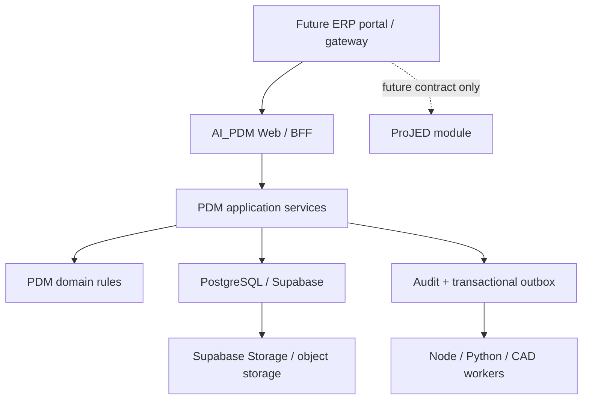

# ADR-PDM-ERP-MODULE-FOUNDATION-001: ERP-ready PDM module boundary

Date: 2026-07-12
Status: Accepted / Development document prepared; product implementation not requested this turn
Owner: Dev PM
Related DEV: `DEV-PDM-ERP-MODULE-FOUNDATION-001` / `DEV-044`
Related SPEC: `.ai-doc/specs/SPEC-PDM-ERP-MODULE-FOUNDATION-001-platform-contract.md`
Related QA: `.ai-doc/qa/qa-pdm-erp-module-foundation-validation-plan-2026-07-12.md`

## Context

The long-term product direction is a unified ERP experience in which AI_PDM is the PDM module and ProJED may later become the project-management module. The immediate instruction is to prepare AI_PDM development documents only and leave ProJED unchanged.

AI_PDM and ProJED currently have different runtime and trust models. AI_PDM is a Next.js server application with a SQLite runtime, PostgreSQL/Supabase target migrations, server APIs, provider-neutral PDM identities and server-owned credentials. ProJED is a Vite SPA with Firebase/Supabase browser adapters and an unfinished backend cutover. Treating either current application as the complete ERP parent architecture would freeze transitional implementation choices into the platform.

The first AI_PDM production objective remains the narrow Web official-numbering and draft slice. ERP preparation must not silently expand that slice, delay it for unrelated ERP work, or claim that the whole ERP platform is ready.

## Human Decision Brief

Confirmed decisions:

- AI_PDM is a future ERP module, not the ERP platform by itself.
- ProJED is a future project-management module candidate, but ProJED code and documents must not be changed in this work.
- AI_PDM development documents should preserve a path to unified ERP identity, organization, audit and module integration.
- The current official-numbering / draft production slice remains the first launch boundary.
- Architecture consistency must not be achieved by putting every module into one process or one frontend bundle.

Decision sources:

- User direction: all systems should eventually be integrated into one ERP system, with PDM and ProJED as modules.
- RD supervisor review: reuse React/TypeScript/PostgreSQL concepts, but do not promote the current ProJED SPA/browser-write architecture to the ERP parent architecture.
- User instruction on 2026-07-12: write AI_PDM development documents and do not change ProJED yet.

Rejected options:

- Promote the current ProJED application architecture unchanged to the ERP platform architecture.
- Merge AI_PDM and ProJED into one application before shared identity and master-data contracts exist.
- Use Zustand or another browser store as ERP business-data authority.
- Allow browser clients to perform critical ERP/PDM writes with privileged credentials.
- Replace the current AI_PDM authentication flow in this documentation-only turn.
- Introduce microservices, Kafka or cross-repository rewrites before measured scale or isolation needs exist.
- Use an iframe as the final integration model.

AI assumptions:

- AI_PDM continues to use Next.js, React and TypeScript for its Web/BFF surface.
- PostgreSQL/Supabase remains the target PDM database and object-storage authority under existing ADRs.
- Current `users.id`, `companies.id` and controlled PDM object identifiers remain stable; future platform identities map to them instead of rewriting history.
- A shared ERP identity provider has not yet been finally selected. Current PDM local-password and Google identity behavior remains authoritative until a separately approved migration.
- Documentation is the only execution boundary in this turn.

## Decision

1. AI_PDM remains an independently owned PDM module with a clear server-side application boundary.
2. Next.js is accepted as AI_PDM's Web shell and BFF, but PDM business rules must remain in framework-independent domain/application services rather than React components or route handlers.
3. PostgreSQL is the long-term business-data authority. SQLite remains a local/test compatibility runtime until the existing Supabase release gate completes.
4. Critical mutations must execute through server-side commands/services and database transactions. Browser state is never the PDM or ERP business-data authority.
5. Public/browser Supabase Data API writes and browser exposure of service-role, database-admin, storage-admin or provider secrets remain prohibited.
6. RLS is defense in depth, not a substitute for server authorization, domain validation or transaction boundaries. Normal user requests must not run as unrestricted service role.
7. AI_PDM adopts a provider-neutral platform context contract for actor, organization, role/scope, correlation and idempotency. The first adapter wraps current PDM auth without changing login behavior.
8. PDM audit and future cross-module events must be emitted from the same transaction as the authoritative mutation. Best-effort browser audit is not acceptable for controlled records.
9. A PostgreSQL transactional outbox is the default future integration mechanism. No external broker is introduced in the first foundation phases.
10. Shared ERP master data is referenced through stable contracts. AI_PDM continues to own PDM entities, numbering, revisions, files, BOM/PDM lifecycle and PDM approvals.
11. Cross-module integration must not grant another module direct ownership of PDM tables. Commands, read models or versioned events are the allowed boundaries.
12. ProJED is explicitly outside this ADR's implementation boundary. This ADR may define the contract AI_PDM will expose later, but it cannot require or modify ProJED implementation.
13. A unified ERP user experience may use one domain, navigation shell and SSO while modules remain separately deployable.
14. Full accounting, payroll, tax and statutory ERP implementation is not implied by this PDM architecture decision.
15. Production deployment, live migration, shared-IAM cutover and ERP-domain routing remain separate high-risk/release decisions.

## Target Boundary

## Module Ownership

| Concern | Authority | Rule |
|---|---|---|
| PDM identity mapping | AI_PDM until shared IAM cutover | Keep stable `users.id`; external identity is a mapping |
| Organization/company scope | Current AI_PDM `companies` until shared core contract | No destructive ID rewrite |
| Root/drawing/part numbering | AI_PDM | Other modules request or read; they do not allocate directly |
| Revisions, files, PDM lifecycle | AI_PDM | Mutations require PDM command/service |
| Project/WBS/task | Future project module | Not created or owned by this ADR |
| Shared login and membership | Future ERP IAM | Provider decision and migration require separate DEV |
| Cross-module events | Transactional outbox | Versioned, idempotent, server-generated |

## Alternatives Considered

### A. One combined Next.js application immediately

Rejected. Shared navigation is useful, but an immediate rewrite would mix current release work, identity migration and ProJED cutover into one high-risk program.

### B. Keep all applications independent with duplicated users and companies

Rejected as an end state. It is temporarily tolerated through adapters, but duplicate identities and organization records cannot become the ERP authority.

### C. Shared PostgreSQL with bounded schemas and server services

Conditionally accepted as the initial ERP direction. It minimizes operational complexity while preserving ownership boundaries. Production topology, backup and blast-radius controls remain release/operations decisions.

### D. Microservices and separate databases now

Rejected. There is no measured scale, deployment independence or team ownership evidence that justifies the operational cost.

### E. Supabase Auth cutover now

Deferred. A shared provider may be appropriate, but current PDM and ProJED identity migrations, session invalidation, email delivery, MFA, offboarding and production cutover require a separate human and release decision.

## Consequences

Positive:

- AI_PDM can launch its narrow production slice without blocking on ProJED.
- Future ERP integration receives stable identity, organization, transaction and event seams.
- PDM controlled records retain one owner and one transaction authority.
- Framework and hosting changes do not require rewriting domain rules.

Costs and risks:

- Current route handlers and repositories need an inventory before domain extraction.
- SQLite/PostgreSQL parity increases Phase 2 implementation and QC cost.
- Shared IAM migration remains real work; an adapter only prevents premature coupling.
- One PostgreSQL cluster can still create blast radius unless schema ownership, DB roles, backup and migration gates are enforced.

## Execution Boundary

This ADR authorizes documentation only. It does not authorize:

- Product or schema implementation.
- ProJED changes of any kind.
- Supabase Auth or other shared-IAM cutover.
- Live PostgreSQL/Supabase migration or provider pointer change.
- Production domain, gateway, deployment, rollback or smoke execution.
- Direct data repair, identifier rewrite or account migration.
- Merge, PR or release artifacts.

## Re-entry Triggers

Human re-entry is required when work needs:

- Selection of the shared ERP identity provider or migration date.
- A canonical ERP organization/person/department model that changes current PDM semantics.
- A decision to combine deployments or repositories.
- Any ProJED code, schema, auth or deployment change.
- Production migration, deployment, domain routing, credential or external-cost action.
- Direct rewrite of existing user, company, numbering or audit identifiers.

## Supersedes / Amends

- Does not supersede the official-numbering/draft production-slice ADR.
- Does not supersede the Supabase database, file-storage, access-control or approval-platform ADRs.
- Adds an ERP integration boundary above those PDM-specific decisions.
