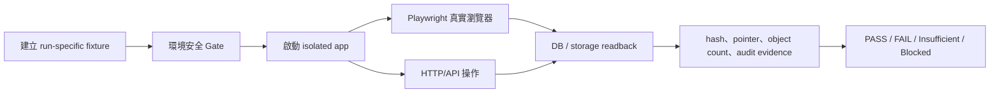

# DEV-061 AI 真實操作驗證計畫

Status: `QA Plan Ready / Awaiting AI-QC Execution`  
Date: 2026-08-10  
Owner: QA  
Executor: AI-QC operator  
Related DEV: `DEV-061`  
Related SPEC: `.ai-doc/specs/SPEC-PDM-FILE-OWNERSHIP-001-contextual-drawing-part-files-and-3d-reuse.md`  
Related ADR: `.ai-doc/decisions/ADR-PDM-FILE-OWNERSHIP-001-contextual-files-and-3d-content-reuse.md`  
Related baseline QA: `.ai-doc/qa/qa-dev-061-pdm-file-ownership-and-3d-reuse-validation-plan-2026-08-10.md`

使用思考習慣：#目的、#可驗證性、#證據基礎、#限制條件、#系統描繪

## 1. QA 目的與不可替代的驗證主張

本計畫要求 AI 以真實瀏覽器操作、真實 HTTP request、真實隔離資料庫與真實 local storage object 執行驗證。目的不是確認畫面「看起來正確」，而是證明以下五個使用者結果同時成立：

1. 圖號使用者只有一條受控進版上傳路徑；圖號不再提供一般附件庫、參考附件或已刪除資料入口。
2. 每一個候選首版／正式進版都必須由本次操作重新提供一個 `.SLDDRW` 與一個 `.SLDPRT`／`.SLDASM`；不能以歷史檔案連結替代本次 3D upload receipt。
3. 相同 3D bytes 在同 company、同 owner scope 內只保留一份 canonical physical object；不同 company／owner 不得誤用或洩漏。
4. submission、package、preview、download 都讀同一個 canonical asset pointer，不複製 submission 專用 bytes。
5. 料號文件仍可新增、查看、下載；清單維持展開但精簡，不因收斂圖號附件而退化。

任何一項主張若只有 build、lint、mock、靜態 source scan 或截圖，均不得判定完整 PASS。

## 2. QA / AI / QC 責任與禁止事項

### 2.1 QA 責任

- 定義 fixture、操作步驟、預期結果、證據欄位與停止條件。
- 先定義會證明失敗的反例，避免只測 happy path。
- 逐項對照 acceptance criteria；不得以「整體看起來正常」取代逐項判定。

### 2.2 AI-QC operator 責任

- AI 只操作 disposable runtime、disposable SQLite、disposable repository 與 output evidence。
- AI 可以建立／修改測試 fixture 與 evidence，但不得修改產品 source、schema、migration、production data 或正式文件。
- AI 必須先執行環境安全檢查；安全檢查不通過時立即 `Blocked`，不得繼續 mutation。
- AI 必須保留原始 response、DB readback、storage manifest、console/network log 與截圖，不可只回報摘要。

### 2.3 禁止事項

- 不得使用 `data/ai-pdm.sqlite` 作為 mutation target；只能複製到 run-specific temporary directory。
- 不得連線 production、staging、正式 Supabase、Cloud SQL、GCS、Google Drive 或任何不可逆外部 storage。
- 不得執行正式 cleanup `--apply`、live migration、deploy、release、commit 或 merge。
- 不得因登入失敗、API 401/403/5xx 或資料為空而自動放寬權限、修改正式帳號或改 seed；必須記錄為阻塞或建立新的 disposable fixture。

## 3. AI 實際操作拓撲



驗證必須同時走三條證據線：

| 證據線 | AI 實際動作 | 不可被替代的主張 |
|---|---|---|
| UI 操作線 | 登入、點擊、上傳、送審、預覽、下載、返回、鍵盤與 viewport | 使用者真的能完成／不能誤操作 |
| API 交易線 | multipart upload、retired route、submit、重送、併發與權限 request | server authority、穩定錯誤碼與 idempotency |
| 資料回讀線 | DB rows、hash、storage key、physical object count、protected references | 沒有重複 bytes、pointer 正確、清理不誤刪 |

## 4. 執行前置條件與安全 Gate

AI 開始任何 write 前，必須產生 `preflight.json`，並全部通過：

| Gate | 檢查 | PASS 條件 | FAIL 行為 |
|---|---|---|---|
| PRE-001 | DB provider | `PDM_DB_PROVIDER=sqlite` | 立即停止 |
| PRE-002 | DB path | resolved path 位於 `tmp/qa/dev-061/<runId>` | 立即停止 |
| PRE-003 | repository path | storage root 位於同一 run directory | 立即停止 |
| PRE-004 | external target | production／staging URL、Supabase、Cloud SQL、GCS、Drive 皆未設定或明確為 false | 立即停止 |
| PRE-005 | app process | port、PID、command line 與 run ID 可辨識；不能共用未知 server | 立即停止 |
| PRE-006 | source protection | `git status` 與 source checksum 在測試前後一致 | 若變更，判定 `Blocked`，不得自行修復 |
| PRE-007 | fixture baseline | seed row、asset count、object count、hash manifest 可讀 | 立即停止 |
| PRE-008 | cleanup mode | 預設為 dry-run；沒有明確 disposable apply authorization | 不執行刪除 |

建議 run ID：`DEV061-AI-<UTC timestamp>-isolated`。每一輪都要使用新 run ID，不在同一 fixture 疊加前一輪 mutation。

## 5. 測試資料設計

所有 binary fixture 必須在操作前寫入 manifest：`fileName`、`role`、`bytes`、`sha256`、`size`、`companyId`、`ownerRootId`、`drawingNumber`、`revision`、`expectedCanonicalAsset`。

| Fixture | 內容 | 用途 |
|---|---|---|
| F-01 | Company A、Owner A、版次 0.1／0.2；2D 不同、3D bytes 完全相同 | 每版重新上傳，3D reuse |
| F-02 | Company A、Owner A、版次 0.3；3D bytes 改變 | 建立新 canonical asset |
| F-03 | Company B、相同 3D bytes | 跨 company 不重用、不洩漏 |
| F-04 | Company A、不同 owner root、相同 3D bytes | 跨 owner 不自動重用 |
| F-05 | 缺 2D、缺 3D、雙 primary、錯誤副檔名、角色偽造 | required hard gate |
| F-06 | loose drawing asset + package/candidate/supplement/shared/submission protected references | cleanup protected set |
| F-07 | 相同 key 重送、response loss、兩個並行同 hash upload | idempotency/concurrency |
| F-08 | 料號規格、供應商文件、檢驗報告、照片 | part document regression |
| F-09 | 空 preview、pending preview、failed preview、有效 image/pdf derivative | preview 與狀態訊息 |

注意：不能用檔名判斷相同內容；F-01/F-02/F-03/F-04 必須使用預先計算的 bytes 與 SHA-256。

## 6. AI 真實操作階段與測試案例

### Gate A：登入、資料與權限

| ID | AI 操作 | 預期結果 | 必要證據 |
|---|---|---|---|
| AUTH-001 | 以隔離 Admin 登入，進入圖號清單 | 成功載入預期 drawing rows；非零資料不被誤判為 empty | URL、screenshot、DOM、counter |
| AUTH-002 | 以 Engineer 執行受控進版 upload | 同 company 且有權限可操作 | user/session、request/response |
| AUTH-003 | 以 Manufacturing/Procurement 嘗試新增 revision file | 依權限拒絕；不可只靠 UI 隱藏 | HTTP status、error code、畫面 |
| AUTH-004 | 以不同 company session 讀取 Company A asset | 不回傳 asset metadata、storage key 或 canonical ID | response redaction、DB scope |

### Gate B：正式圖面進版與 required file hard gate

| ID | AI 操作 | 預期結果 | 必要證據 |
|---|---|---|---|
| FORMAL-001 | 開啟 `/numbering/drawings`，選定圖號，點 `建立新版次` | 只有一個主要進版 CTA，導向受控工作台 | screenshot、DOM CTA count |
| FORMAL-002 | 只上傳 `.SLDDRW`，嘗試送審 | server hard-block；明確指出缺 3D 與下一步 | request/response、visible error、DB no submission |
| FORMAL-003 | 只上傳 `.SLDPRT`／`.SLDASM`，嘗試送審 | server hard-block；明確指出缺 2D | request/response、visible error、DB no submission |
| FORMAL-004 | 上傳完整 2D + 3D，填變更原因並送審 | 建立 submission/package；兩個 required role 各一個 primary | submission/package rows、snapshot、screenshot |
| FORMAL-005 | 上傳 PDF、STEP、DWG、圖片並手動改 role | 不得滿足 required role；選配檔只能是 warning 或附加檔 | response code、blocker list |
| FORMAL-006 | 同 role 上傳兩個 primary 或 2D/3D extension 對調 | fail closed；不能以 UI 手動分類繞過 | DB unique guard、error code |
| FORMAL-007 | 只勾選上一版 3D，不在本版重新上傳 | hard-block；不可形成本版 `cad_3d_upload_receipt` | receipt readback、submission count |
| FORMAL-008 | package write 中途失敗後重新整理 | 不存在可送審半套 package；可重試且不重複建立 primary | DB transaction diff、UI recovery |

### Gate C：候選首版與正式版 parity

| ID | AI 操作 | 預期結果 | 必要證據 |
|---|---|---|---|
| CAND-001 | 建立候選首版，分別測缺 2D、缺 3D、完整 2D+3D | 與 formal 使用相同 blocker 語意與 hard gate | API error code parity、candidate rows |
| CAND-002 | 呼叫候選既有檔案 verify route，傳入歷史 required 2D/3D | 拒絕以舊檔滿足本次上傳 | response、無新 verified file |
| CAND-003 | 候選完整送審後重新整理／重開 | authoritative readback 與原結果一致 | browser reload、DB snapshot |

### Gate D：3D hash reuse、隔離、併發與 response loss

| ID | AI 操作 | 預期結果 | 必要證據 |
|---|---|---|---|
| REUSE-001 | F-01 版次 0.1、0.2 各重新上傳相同 3D bytes | 各有 upload receipt/package membership；第二次 `reused=true`；physical object count 不增加 | before/after object manifest、hash、canonical ID |
| REUSE-002 | F-02 上傳不同 3D bytes | 建立新 canonical asset/storage object/model version | DB rows、storage count/hash |
| REUSE-003 | F-03 跨 company 上傳相同 bytes | 不查詢、不共用、不暴露 Company A asset | request response、scope query、negative evidence |
| REUSE-004 | F-04 不同 owner 上傳相同 bytes | 不自動共用；建立 owner-local canonical 或明確阻擋 | owner IDs、canonical IDs |
| REUSE-005 | F-07 兩個並行相同 hash upload | 只一個 canonical winner；另一個 readback 為同一 winner；無孤兒 object | race log、unique rows、object manifest |
| REUSE-006 | F-07 response loss 後以相同 idempotency key 重送 | 回同一 receipt／canonical ID；不多一份 asset、package 或 audit | request IDs、idempotency rows |
| REUSE-007 | 相同 hash 但不同 size、hash 缺失、readback mismatch | fail closed，不得 reuse | blocker、temporary object reconciliation |

### Gate E：submission pointer、preview、download 與 release read path

| ID | AI 操作 | 預期結果 | 必要證據 |
|---|---|---|---|
| POINTER-001 | 讀取新 submission files | `source_file_asset_id` 非空；required hash/size 與 upload manifest 相同 | DB row、FK、hash comparison |
| POINTER-002 | 比較 submission storage key 與 source asset storage key | 不建立 submission 專用 byte copy | storage key set、object count |
| POINTER-003 | 由 submission/package 下載 2D/3D，再重新計算 SHA-256 | download bytes 與 snapshot hash 一致 | downloaded bytes、hash report |
| POINTER-004 | 故意製造 hash mismatch 或缺 source pointer | preview/download/release fail closed；畫面給可恢復下一步 | response、visible error、DB no release |
| PREVIEW-001 | 有 derivative 時點擊 2D/3D 預覽圖 | 以新分頁／預覽 target 開啟；沒有獨立「開啟預覽」按鈕 | popup URL、screenshot、DOM |
| PREVIEW-002 | 無 derivative、pending、failed | 只顯示一個狀態 fallback；說明現在可做什麼、是否等待或下載原檔 | state screenshot、Now What matrix |

### Gate F：圖號／料號 UI 真實操作與可用性

必測 viewport：`1440x900`、`1024x768`、`390x844`。每一個 viewport 都要重新 hard reload，不能只調整同一張截圖。

| ID | AI 操作 | 預期結果 |
|---|---|---|
| UI-001 | 開啟圖號明細 | `圖面與附件` 只出現 2D/3D 受控內容與 compact file list；無 `附件管理`、`參考附件`、`已刪除資料` |
| UI-002 | 檢查檔案清單 | 清單常駐不收合；每列不重複顯示同一檔名、類型與數量；download 為次要 action |
| UI-003 | 檢查 CTA | 圖號 header 只有一個主要 `建立新版次`／`準備首版` CTA；沒有第二個一般上傳窗 |
| UI-004 | 點擊 preview media、使用 Tab/Enter/Space | 預覽可被鍵盤聚焦與開啟；focus ring 可見；icon button 有 accessible name |
| UI-005 | 進入 loading、empty、blocked、error、success、restricted、no permission | 每個狀態第一句先回答「現在要做什麼」，並有 CTA、替代路徑或明確不用處理 |
| UI-006 | 執行 visible error sweep | 無 `.inline-error`、`[role=alert]` 失敗、可見 4xx/5xx、Not Found、Internal Server Error、`/api/` raw error |
| UI-007 | 執行 visible text noise sweep | 無 DEV/mock/API/sourceId/raw status；可刪除且不影響判斷的標題、小字、第二行不應常駐 |
| UI-008 | 檢查長檔名、長中文、長 hash-like text、錯誤文案 | 無重疊、裁切、斷裂、水平 overflow、drawer/modal 離屏或按鈕被擠壓 |
| PART-001 | 開啟料號文件清單，新增／預覽／下載 F-08 文件 | 料號文件可用；清單不收合、compact；不複製圖號正式檔 |
| API-001 | POST 舊 `/api/numbering/drawings/{drawingNumber}/attachments` | 回 `410 DRAWING_REFERENCE_UPLOAD_RETIRED`，並指向受控進版路徑 |

### Gate G：清理與 protected reference

| ID | AI 操作 | 預期結果 |
|---|---|---|
| CLEAN-001 | 執行 cleanup dry-run | 只列 loose drawing candidates；輸出 asset、storage key、hash、size、protected reason；不刪 DB／object |
| CLEAN-002 | F-06 對 package/candidate/supplement/shared/submission 引用 asset 執行 dry-run | 任一 protected reference 都不得列為 delete candidate |
| CLEAN-003 | 若已取得明確 disposable apply authorization，在 disposable fixture 執行 apply | 先 manifest、再二階段刪除；DB/object/audit receipt 可對帳 |
| CLEAN-004 | 注入 object delete failure、DB failure、timeout 後重跑 | fail closed；保留 failure receipt；重跑不誤刪、不重複刪除 |
| CLEAN-005 | 沒有 disposable apply authorization 時傳入 `--apply` | 工具拒絕執行；不得因 AI 自動化而越過 release gate |

## 7. UI Visible Error、Counter、Text Noise 與 Now What 必測表

### 7.1 Visible Error Sweep

每個 critical route、每個指定 viewport 都要記錄：

- route / URL、timestamp、browser、viewport；
- screenshot path；
- `.inline-error`、`[role=alert]`、load failed banner 文字；
- visible HTTP 4xx/5xx、Not Found、Internal Server Error、visible `/api/` raw error；
- console error、failed network request、response status；
- 判定 PASS/FAIL。

可測試的 error state 本身不是 failure；但錯誤文案必須先提供人類可操作的下一步。未經明確設計的 visible 4xx/5xx 一律 FAIL。

### 7.2 Counter Sanity

在 fixture 預期有資料時，AI 必須記錄：drawing row count、current controlled file count、revision count、candidate required file count、shared canonical count、storage object count、protected reference count。預期有資料卻全部為 0，判定資料異常，不得當作 empty state 通過。

### 7.3 Now What State Matrix

| State | 使用者真正問題 | 第一行應回答 | 下一步 | 結果 |
|---|---|---|---|---|
| loading | 系統還在做什麼？ | 正在讀取／請稍候 | 等待或重新整理 | Pending |
| empty | 沒資料要做什麼？ | 尚未有正式檔案 | 準備首版／新增文件／返回 | Pending |
| missing-2d | 能不能送審？ | 目前不能，請上傳 2D 原始檔 | 回到檔案區 | Pending |
| missing-3d | 能不能送審？ | 目前不能，請重新上傳本版 3D CAD | 回到檔案區 | Pending |
| blocked | 為什麼按不了？ | 目前不能送審 | 補齊 blocker／查看既有送審 | Pending |
| success | 是否完成？ | 已建立送審／已完成 | 查看進度／正式紀錄 | Pending |
| error | 失敗後怎麼辦？ | 尚未完成，資料已保留／請重試 | 重試／返回安全頁 | Pending |
| no-permission | 我能不能處理？ | 目前無權限執行此動作 | 查看／聯絡負責角色 | Pending |
| retired-route | 原本的上傳入口去哪裡？ | 圖號附件上傳已改走受控進版 | 前往圖面進版 | Pending |

## 8. Evidence 契約

每次 AI 執行產生：

```text
output/qa/dev-061-ai-real-operation/<runId>/
  preflight.json
  fixture-manifest.json
  command-log.jsonl
  api/
    requests.jsonl
    responses.jsonl
  browser/
    console.jsonl
    network.jsonl
    dom-visible-text.json
    screenshots/
      1440x900/
      1024x768/
      390x844/
  database/
    before-counts.json
    after-counts.json
    submissions.json
    package-files.json
    pointer-readback.json
    protected-reference-scan.json
  storage/
    before-manifest.json
    after-manifest.json
    downloaded-hashes.json
  verdict.md
```

每一筆 test case 至少要包含：

- case ID、run ID、actor、company、owner、drawing、revision；
- 前置資料與 fixture hash；
- AI 實際操作步驟與 request；
- expected、actual、status；
- screenshot／DOM／console／network／DB／storage evidence path；
- 若失敗，重現步驟、影響、first failure、是否阻塞後續測試。

## 9. PASS／FAIL／未充分驗證／阻塞

### PASS

只有在所有 P0/P1 cases 皆通過，且同時具備 UI、API、DB、storage 四條證據線，才可判定 `PASS`：

- formal/candidate required 2D/3D gate parity 通過；
- 每版都有新的 3D upload receipt；
- F-01 只有一份 canonical physical object，F-02 建立新 object；
- F-03/F-04 isolation、F-07 concurrency/idempotency 通過；
- submission pointer、download、preview hash 一致；
- UI 三 viewport、keyboard、visible error、text noise、Now What 通過；
- protected cleanup scan 無 false positive；
- source 未被 AI 修改，productionConnected=false、productionWrites=false。

### FAIL

任一 P0/P1 期待結果不符即 `FAIL`，包括：

- 缺 2D/3D仍可送審；
- 只沿用舊 3D 未重新上傳仍可送審；
- 跨公司／跨 owner reuse；
- object count 增加或 pointer/hash 不一致；
- protected asset 出現在刪除候選；
- visible error、overflow、重疊、裁切、不可操作、必要 CTA 消失；
- AI 可在未授權時碰 production 或執行 cleanup apply。

### 未充分驗證

只完成靜態、build、lint、API 或截圖其中一部分；缺少 real browser、viewport、DB/storage readback、Now What 或 manual UX review 時，不得宣稱通過。

### 阻塞

登入、fixture、runtime、外部依賴或資料庫無法取得，且無安全替代環境時，判定 `Blocked`；不得修改正式資料、放寬 gate 或假設通過。

## 10. AI-QC 執行指令

目前既有 smoke / contract：

```powershell
npm.cmd run qc:dev-061:file-ownership
npm.cmd run qc:dev-061:cleanup-dry-run
npm.cmd run qc:dev-061:ui
npm.cmd run typecheck
```

隔離瀏覽器 smoke 必須帶明確 isolated flag：

```powershell
$env:PDM_DEV_061_BASE_URL = "http://127.0.0.1:<isolated-port>"
$env:PDM_DEV_061_ISOLATED = "1"
npm.cmd run qc:dev-061:real-operation
```

完整 AI-QC runner 應另提供一個 run-specific command，至少接受：

```text
--run-id
--fixture-dir
--base-url
--browser chromium
--viewports 1440x900,1024x768,390x844
--no-production
--cleanup dry-run
```

runner 不得預設使用 canonical `data/`、workspace repository、未知 port 或外部 provider；參數未通過 PRE-001～PRE-008 時應以 non-zero exit 結束。

## 11. QA 交付與 QC 回報格式

AI-QC 完成後，QC report 必須依以下順序回報：

1. 結論：`PASS / FAIL / 未充分驗證 / Blocked`。
2. 首個失敗 case 與是否為 P0/P1。
3. 執行環境、run ID、actor、company、owner、browser、viewport。
4. UI route、操作步驟、screenshot、visible error sweep、counter sanity、Now What matrix。
5. API request/response、DB readback、storage object/hash readback。
6. cleanup protected scan 與是否執行 apply。
7. 問題、影響、證據路徑與後續恢復建議。

QA 只有在 QC 證據完整且所有必要 gate 通過後，才可建議更新 DEV-061 為 `Local QA/QC Passed`；正式 deletion、live migration、deploy 與 release 仍需另走 release gate。
