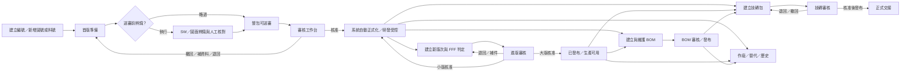

# QA-DEV-074：料號／圖號全生命週期 AI UI 真實操作驗證計畫

建立日期：2026-08-15  
Owner：QA  
執行者：AI-QA Operator；結案者：獨立 AI-QC  
狀態：`Executed / QC Passed（58/58）`  
範圍：本機隔離測試環境；production／staging、正式資料、migration、deploy、release 不在本計畫授權內

## 1. 驗證目標與路徑總數

本計畫要以 AI 控制真實 rendered browser，從使用者可見入口完成料號、圖號、圖料關係、首版圖面、辨識、圖面進版、BOM、審核、發行、技術移轉與終止治理的端到端操作。

計數規則：一條路徑是「從一個使用者可辨識的穩定狀態，經由一組 UI 操作，到下一個穩定狀態或明確阻擋結果」。角色、viewport、鍵盤／滑鼠重跑、readback assertion 不另外灌水計數。

本輪重新收斂為 **7 個路徑家族、58 條獨立 UI journey**。以下四條與使用者指定的暫不測範圍不計入本輪：`B09`、`D15`、`E02`、`F08`。

| 路徑家族 | 數量 | ID |
|---|---:|---|
| 建號／新增範圍 | 4 | `A01-A04` |
| 首版圖面與整包審核 | 8 | `B01-B08` |
| 圖面／CAD 辨識與人工確認 | 8 | `C01-C08` |
| 正式圖面進版、FFF、送審與發行 | 14 | `D01-D14` |
| BOM 建立、編輯、審核、發行與作廢 | 10 | `E01、E03-E11` |
| 技轉包與正式交接 | 8 | `F01-F07、F09` |
| 正式物件終止與歷史治理 | 6 | `G01-G06` |
| **合計** | **58** |  |

### 本輪明確不測

| ID／類別 | 不測內容 | 處理方式 |
|---|---|---|
| `E02` | BOM XLS／`.xlsx/.xls` 匯入 | 不列入本輪分母，不判 Blocked，不判 Fail |
| `B09`、`D15`、`F08` | `apply_failed / ReleaseFailed`、正式化失敗重試、整批發布失敗恢復 | 不列入本輪分母；後續另立 recovery extension |
| 全部路徑的工程內容差異 | 真正幾何、尺寸、公差或工程屬性變更的正確性 | 同檔案可驗證 UI 流程；不宣稱工程內容變更已驗證 |

### 明確排除

- 使用者指定不驗證的舊保留號、舊 number-only 審核、舊 `review_locked / approved_locked`、`drawing_addendum_required`、舊號 adoption／reconciliation 與舊保留號歷史續接。
- 沒有 UI 入口的內部 table state、migration、worker claim、DB trigger 與直接 service command，不計為使用者生命週期路徑。
- 靜態 source scan、單元測試、直接 API mutation、直接 DB mutation、fixture injection、手工改 status 都不能替代任何一條 UI journey。

## 2. 系統描繪

共享審核工作台是各 domain 的決策入口，不另建第二套物件生命週期；同一 request 的送審者與審核者必須使用不同 browser context 與不同帳號。

## 3. UI-only 硬性執行規則

1. 所有會改變 business state 的動作，只能由 AI 在實際 UI 點擊、輸入、選取檔案、上傳、確認、撤回、退回、核准、發布、取消或作廢。
2. 不得直接呼叫 mutation API、直接寫 DB、執行 seed／repair script、改 fixture status、注入 browser JavaScript、繞過 disabled control 或用測試 helper 製造成功結果。
3. SW 檔案必須透過畫面上的 file input／dropzone 上傳；自動化可對真正的 file input 指定本機檔案，但不得把檔案直接 POST 到 upload endpoint。
4. UI 操作所觸發的 browser network response、下載檔與 read-only DB/hash 可作第二層佐證；它們不能代替可見 UI 結果，也不得引發額外 business mutation。
5. 測試資料的建立與清理同樣走 UI。沒有刪除 UI 的正式／歷史測試資料保留在隔離 company，標記 `retained_by_design`，不得直接刪 DB 冒充 cleanup。
6. 本輪不執行 `apply_failed / ReleaseFailed` 或其重試恢復；雙分頁 stale、重複送審、撤回、補件、退回與一般 UI validation 仍須由真實 UI 操作。
7. 不連 production，不使用真實客戶／員工／機密專案資料；production URL、Cloud SQL、GCS、Supabase 或正式 provider 一旦被偵測為 mutation target，立即停止。

## 4. AI 操作者、角色與 browser context

| Context | 角色 | 主要責任 | 隔離要求 |
|---|---|---|---|
| `CTX-A` | RD／Engineer | 建號、上傳 SW、首版、進版、BOM、送審、撤回、補正 | 不得核准自己送出的 request |
| `CTX-B` | R&D Manager／Reviewer | 審核、要求補資料、退回修改、核准 | cookie、storage、principal 與 CTX-A 分離 |
| `CTX-C` | Publisher／PDM Admin | 明確發布、技轉發布與治理動作 | 不用 Admin 身分替代一般權限案例 |
| `CTX-D` | Manufacturing／Procurement | 只讀 Released 圖面、BOM、技轉交接與匯出 | 不得看到或修改 Draft／研發小版 |
| `CTX-E` | Cross-company／Restricted Viewer | 驗證跨公司、無權限與不存在性保護 | 不臨時加權限繞過案例 |
| `CTX-QC` | 獨立 AI-QC | 重驗指定 UI、檢查證據、作最終 verdict | 不修產品、不補造 QA 缺失證據 |

執行前必須從 UI 或既有受控測試帳號確認角色。若帳號／權限不足，只能由系統設定 UI 建立或調整；不能直接改權限表。

## 5. 使用者需提供的 SW／測試檔案

使用者可提供一個 ZIP 或資料夾；AI 執行前先產出唯讀 SHA-256 manifest，再從 UI 逐檔上傳。建議至少包含：

| 檔案組 | 最低內容 | 用途 |
|---|---|---|
| `SW-BASE` | 一組相符的 `.SLDDRW` + `.SLDPRT` 或 `.SLDASM` | 首版 happy path、必要 2D／3D gate |
| `SW-ASSEMBLY` | `.SLDASM`、被參照零件、對應 `.SLDDRW` | CAD 組合件、BOM CAD 建立、技轉範圍 |
| `SW-BOM` | SolidWorks BOM `.xlsx/.xls` 匯出 | 本輪不測，暫不要求 |
| `SW-REV-MINOR` | 同一份有效 2D／3D 檔案即可；由 UI 以不同版次重跑 | FFF 無影響／疑似影響與研發受控的流程驗證；記錄 `content_changed=false` |
| `SW-REV-MAJOR` | 同一份有效 2D／3D 檔案即可；由 UI 以整數版次重跑 | 正式 Released 與舊版歷史化的流程驗證；記錄相同 hash |
| `SW-REPLACEMENT` | 同一份有效檔案即可；由 UI 建立替代料號／選擇 FFF 確認影響 | 替代關係、BOM reconfirm 與阻擋／核准流程驗證；不宣稱工程內容差異 |
| `SW-RECOGNITION` | 含 custom properties、configuration、圖框／註記；最好有一致、衝突、缺值、N/A | 辨識六區、共用基準、逐料號差異 |
| `SW-EDGE` | 2D-only、3D-only、改過 bytes 的同名檔、無法解析或 unsupported 檔 | 缺檔、stale、partial／failed、恢復路徑 |

本輪只對 58 條 in-scope path 判定 Pass／Fail／Blocked；上述四條與工程內容差異列為 Out of Scope，不進入分母。

目前已收到 `D-0007-MA1.zip`，內含 DWG、PDF、SLDDRW、SLDPRT、SLDASM 及同系列圖面／零件檔，可支援本輪 2D、3D、assembly、首版、進版、辨識與同檔案重跑的流程驗證；包內沒有 `.xlsx/.xls`，符合本輪暫不測 BOM XLS 匯入的範圍。實際使用時仍須由 UI file input／dropzone 上傳，不以解壓縮或直接 API 上傳替代。

### 5.1 同檔案重複上傳政策（使用者確認）

- 本輪目標是驗證 UI 流程可達性、狀態轉移、審核、發行、歷史、權限、重複與 recovery 行為；minor／major／replacement 不要求檔案 bytes 實際不同。
- 同一檔案可由 UI 重複上傳，或在同一檔案上以不同版次／FFF／替代料號情境重跑。每次都必須保存檔案 hash，並明確標示 `content_changed=false` 或 `hash_reused=true`。
- 同檔案可支持「流程 PASS」，但不支持以下工程語意主張：幾何／尺寸確實改變、辨識候選因內容改變而更新、FFF 實際風險正確、替代料號與圖框內容實際一致。
- source-changed stale 語意、內容差異辨識與真正工程變更比較不屬於本輪工程內容驗證；本輪只記錄同 hash 重跑與 UI 流程結果。

## 6. 58 條 UI 真實操作路徑

### A. 建號／新增範圍（4）

| ID | UI 起點與操作 | 期望穩定結果 |
|---|---|---|
| `A01` | 從側欄進圖料／圖號／料號工作台，選「建立新圖料」，以 UI 建立 root + part + drawing + relation | 只建立一個新工作區；顯示新圖料、料號、圖號與唯一下一步 |
| `A02` | 從既有正式圖料根號明細選「新增圖號」，填原因並建立 | 沿用原 root，只新增 drawing scope；不得另建 root／part |
| `A03` | 從既有正式圖料根號明細選「新增料號」，分別覆蓋依圖製作件／外購標準件資料分區，並各覆蓋共用勾選 | 沿用原 root，只新增 part scope；兩種基礎料件類型與獨立共用屬性的 gate 正確 |
| `A04` | 從既有正式圖料根號明細選「新增圖號與料號」 | 同一工作區建立 drawing + part + relation；兩端同 root 且只各一次 |

### B. 首版圖面與整包審核（8）

| ID | UI 操作 | 期望穩定結果 |
|---|---|---|
| `B01` | 首版缺基本資料、關係、2D 或 3D 時點送審 | 畫面逐項說明缺口；零 request；補齊後轉為可送審 |
| `B02` | 完整首版上傳後送審，切換 CTX-B 核准 | 送審內容鎖定；核准後系統自動正式化，進 `official_controlled / 研發受控`；無人工第二次發布 |
| `B03` | 開送審 confirmation 後按取消 | 停留可送審；request／snapshot／lock 都不新增 |
| `B04` | 送審中由原送審者從 UI 撤回、修改、重新送審 | 舊 snapshot 留歷史，新 snapshot/version 建立；內容重新鎖定 |
| `B05` | Reviewer 選「要求補充資料」，Owner 補正後重送並核准 | 回到可修正狀態；新 request 可追溯；正式化一次 |
| `B06` | Reviewer 選「退回修改／駁回」，Owner 修正後重送 | 無 partial formal data；原決策保留；重送後可完成核准 |
| `B07` | 尚未送審的工作從 UI 取消 | 進歷史／已取消；原工作沒有復活或發布捷徑 |
| `B08` | 在送審／核准按鈕快速連點、reload、Back/Forward，或以兩個 tab 重複操作 | UI 最終只形成一組 request、decision、formal result；結果可從畫面重取 |

### C. 圖面／CAD 辨識與人工確認（8）

| ID | UI 操作 | 期望穩定結果 |
|---|---|---|
| `C01` | 上傳完整檔案但不執行辨識，直接走正常送審 | 辨識不是 identity／送審的強制替代入口；未產生假正式屬性 |
| `C02` | 完整 2D+3D 上傳後由 UI 自動排程，進同頁六區核對，確認影響並正式寫入 | 候選來源可追溯；人工確認前 zero formal write；正式化一次 |
| `C03` | 從 UI 手動開始辨識，再點重跑 | 新 successor session；前一輪 evidence 不被覆寫，最新輪可編輯 |
| `C04` | 上傳可讓部分來源成功、部分 unsupported／失敗的檔案 | 顯示 partial 與診斷；成功候選仍可審核，不冒充完整成功 |
| `C05` | 上傳所有 adapter 都無法解析的檔案，再由 UI 重試或換檔 | 明確 failed／unsupported 與恢復方向；不產生空白成功或正式寫入 |
| `C06` | 以同一檔案由 UI 重跑辨識／建立 successor session | 驗證重跑、session 導覽、evidence 保留與正式化流程；同 hash 不得被誤報為 source changed |
| `C07` | 在六區實際操作接受、修正、欄位映射／建立、忽略、延後、N/A 與衝突值 | 每個決定可重開復原；共用基準與逐料號差異不互相覆寫 |
| `C08` | 開「確認寫入內容」後返回核對、修改、重算，再正式寫入；以雙 tab 製造 stale target | 返回為 zero write；stale 先拒絕並要求重算；有效 command exactly once |

### D. 正式圖面進版、FFF、送審與發行（14）

| ID | UI 操作 | 期望穩定結果 |
|---|---|---|
| `D01` | 從正式圖號明細點「建立新版次」 | 進 canonical 圖面進版工作台；圖號不變，建議版次由 server 呈現 |
| `D02` | 本版只上傳 `.SLDDRW` 後嘗試送審 | UI/server 阻擋缺 3D；上一版檔案不能冒充本版上傳 |
| `D03` | 本版只上傳 `.SLDPRT/.SLDASM` 後嘗試送審 | UI/server 阻擋缺 2D；零 submission |
| `D04` | FFF 全無影響、沿用原料號、BOM 不進版，Reviewer 核准小版 | 必須有「確認 BOM 不進版」證據；結果為 `ReviewApproved / 研發受控`，不是 Released |
| `D05` | 任一 FFF 疑似影響，Reviewer 選確認沿用原料號 | 高風險結論有留痕；沿用身份且小版受控，不改 BOM |
| `D06` | 任一 FFF 疑似影響，Reviewer 退回補新料號，Owner 以同檔案補正重送 | 驗證 correction、替代料號入口與重送流程；不宣稱檔案內容已變更 |
| `D07` | 任一 FFF 確認影響，從同頁建立替代料號、以同檔案完成上傳與核准流程 | 新版圖面、新料號、替代關係全成全退的 UI／狀態流程可追溯；工程內容一致性另列未驗證 |
| `D08` | FFF／身份條件選擇改變時，以同檔案嘗試沿用原料號 | UI 明確阻擋或導向新料號；驗證身份 gate，不以同檔案宣稱實際互換性／法規變更 |
| `D09` | Owner 在 pending review 從 UI 撤回、修改檔案／FFF、重送 | 原 snapshot 保留；新 snapshot 反映新檔與新判定 |
| `D10` | Reviewer 要求補充資料，Owner 補正後重送 | needs-info 可接續；decision/comment 與新 request 可追溯 |
| `D11` | Reviewer 退回修改，Owner 依理由修正後重送 | 顯示退回理由；不可直接核准舊 snapshot |
| `D12` | 建立整數大版並核准發布 | 新版 physical Released／生產可用；前一 current 版轉歷史但仍可查下載 |
| `D13` | 補登低於 current 的合法舊版並核准 | 只進歷史，不取代 current，不破壞最新版判定 |
| `D14` | 以兩 tab 建立同圖號＋同版次，或對已正式同版再次送審 | 第二條 UI 路徑被阻擋並提供「查看既有送審／版本」；不重複建立 |

### E. BOM 建立、編輯、審核、發行與作廢（10）

| ID | UI 操作 | 期望穩定結果 |
|---|---|---|
| `E01` | 從側欄「建立 BOM」選全新空白 BOM | 建立 canonical owner Part Number + 獨立 BOM Rev + 零 line Draft |
| `E03` | 選「從已偵測的組合件建立」，使用 SW-ASSEMBLY | 只列有真實 assembly evidence 的 owner；建立一個 CAD-source Draft |
| `E04` | 在 XMind BOM UI 用 picker、新增、拖放、Inspector、刪除、Undo/Redo、儲存、reload | 樹、數量、層級、history 與重開結果一致；無 orphan/cycle |
| `E05` | 建立 Floating Topic，嘗試送審，再歸位並送審 | 未歸位時 UI 明確阻擋；歸位、儲存後才可進 PendingReview |
| `E06` | Reviewer 退回 BOM，Owner 修正並重送 | Rejected 可原地修改；新 review 可追溯；零 Released snapshot 直到核准 |
| `E07` | Reviewer 核准 BOM，從 UI 開啟／下載正式 CSV/XLS | 產生 Released snapshot；製造／採購只讀且匯出內容相同 |
| `E08` | 以 UI 建立下一 BOM Rev 並發布 | 新版成 current；舊 Released BOM 轉 Obsolete／歷史且不可改寫 |
| `E09` | 替代料號發布後開啟引用舊料號的未發行 BOM，執行重新確認 | 顯示需重新確認；確認留痕後才可送審；已發布 BOM 不自動改 |
| `E10` | 對 Released BOM 申請作廢，Reviewer 駁回 | BOM 維持 Released；申請與理由可追溯 |
| `E11` | 對 Released BOM 申請作廢，Reviewer 核准 | BOM 進 Obsolete／歷史；製造／採購不再當 current 使用 |

### F. 技轉包與正式交接（8）

| ID | UI 操作 | 期望穩定結果 |
|---|---|---|
| `F01` | 從 UI 建立「開發案」技轉包，填可用來源編號並加入正式圖號／料號 | Draft package、header 與 scope 唯一且可 reload |
| `F02` | 建立「設變案」，選沒有可用來源編號並填原因，加入本輪新工作區 | 不偽造 ECR/ECO；candidate scope 有明確非正式狀態 |
| `F03` | scope／readiness 不完整時嘗試送審，依畫面入口補齊 | 不完整時 zero request；補齊後顯示可送交整包審核 |
| `F04` | 送審後由 Owner 撤回、修改範圍、重新送審 | 舊快照失效但保留歷史；新快照與範圍一致 |
| `F05` | Reviewer 選 needs-info／rejected，Owner 補資料後重送 | Package 進 NeedsInfo；可編輯並建立新 review |
| `F06` | Reviewer 核准，Publisher 從 UI 明確「發布整包」 | 先 ApprovedPendingPublish，再 Published；核准不冒充發布 |
| `F07` | 核准後用另一 UI tab 變更可編輯來源形成 snapshot stale，再嘗試發布 | 發布被阻擋；從 UI 重建快照並重新送審 |
| `F09` | 在可取消狀態開取消 modal、先返回，再填理由確認取消 | 返回零寫入；確認後 Cancelled、歷程保留、不能重開，只能建立新包 |

### G. 正式物件終止與歷史治理（6）

| ID | UI 操作 | 期望穩定結果 |
|---|---|---|
| `G01` | 從正式圖料根號申請作廢，檢查完整影響後核准 | root、受影響圖號／料號與關係依 snapshot 原子作廢；核准前不變 |
| `G02` | 同類作廢申請由 Reviewer 駁回 | 正式物件維持原狀；申請與理由保留 |
| `G03` | 從正式料號申請作廢，分別走核准與駁回 | 只處理 exact part scope；不誤作廢同 root 其他 part/drawing |
| `G04` | 從正式製造圖進 `/numbering/impact`，實際分析、確認影響並套用作廢 | 受影響料號／文件待辦可見；該圖不再作製造基準；無未確認直接套用 |
| `G05` | 從 Released submission 申請作廢，分別走核准與駁回 | 原 immutable package/evidence 留存；current／history 使用資格符合決議 |
| `G06` | 勾「包含歷史」，開 cancelled／obsolete／merged／history-only 記錄 | 只讀、可追溯、有正確替代／返回入口；不存在復活、編輯、發布 mutation |

## 7. 路徑覆蓋的資料分區

58 條 in-scope 路徑內至少要覆蓋下列 equivalence classes；它們是覆蓋維度，不另加路徑數：

- 圖面用途：製造圖、參考圖；參考圖任何狀態都不能成為製造基準。
- 料件類型：依圖製作件、外購標準件；共用件另作獨立屬性覆蓋。
- 版次：小版 `0.x / N.x`、大版整數、低版補登、同版重複。
- FFF：無影響、疑似影響、確認影響；另含身份條件覆寫 FFF 的負向案例。
- 檔案：2D+3D 完整、缺 2D、缺 3D、同 hash reuse、改 bytes、長檔名、unsupported／corrupt。
- 審核結果：撤回、needs-info、rejected、approved；本輪不含 `apply_failed / ReleaseFailed` recovery。
- 角色：Owner、Reviewer、Publisher、Manufacturing、Procurement、restricted、cross-company。
- 狀態：loading、empty、ready、locked、error、success、terminal、history。

## 8. 執行波次

| Wave | 內容 | 進入條件 | 退出條件 |
|---|---|---|---|
| `W0` | Runtime、帳號、UI-only 與檔案 manifest 安全前檢 | 專用非 production target 可辨識 | 所有 mutation target、actor、SW hash、browser context 已記錄 |
| `W1` | A01-A04 + B01-B08 | UI 可建立新測試資料 | 新建、送審、退回、撤回、核准與取消都可由 UI 完成 |
| `W2` | C01-C08 | SW-RECOGNITION／SW-EDGE 可用 | 辨識可略過、成功、partial、failed、stale、正式化都有證據 |
| `W3` | D01-D14 | 至少一個研發受控正式圖號 | FFF、進版、小／大版、歷史與重複流程完成；不含失敗恢復 |
| `W4` | E01、E03-E11 | 有可用 Part owner 與 assembly | 三種建立、編輯、審核、發布、reconfirm、作廢完成；不含 XLS 匯入 |
| `W5` | F01-F07、F09 | 前述正式／候選 scope 可加入 | 技轉核准、明確發布、stale、cancel 完成；不含 failure recovery |
| `W6` | G01-G06 | 有本 run 可終止的正式 fixture | 正式終止、駁回與歷史只讀完成 |
| `W7` | 四 viewport、角色、visible error、final reconciliation | 58 條 in-scope path 都有結果；四條明確排除項已標記 Out of Scope | 58/58 Pass、Blocked=0、P0/P1=0 才可送 QC |

每一 Wave 失敗即保留現場證據並停止向下游擴散；不得先跑後續流程再回填前置 PASS。

## 9. UI／UX、Accessibility 與 runtime hard gate

最低 viewport：`1440×900`、`1024×768`、`768×1024`、`390×844`。

- 1440×900 執行 58 條 in-scope journey；1024、768、390 重跑每個 route family 的主路徑、所有 modal／drawer／menu／tooltip 與至少一個仍在範圍內的 error path。
- 每個穩定畫面必須可在 5 秒內回答：目前物件、目前狀態、誰負責、唯一主要下一步、是否可供研發或生產使用。
- 每個情境最多一個 primary CTA；適用但鎖定的動作原因可由 hover、focus、touch 取得；不適用與 terminal mutation 不出現在 DOM。
- 無水平 overflow、重疊、裁切、按鈕離屏、文字逐字直排、modal/footer 遮擋、tooltip 出 viewport；長檔名與長中文仍可操作。
- Tab order、Enter／Space、Escape、focus trap／return、Back／Forward、reload、drawer close focus restore 都要實測。
- 每個 path 完成 visible error sweep：可見 `.inline-error`、`[role=alert]`、Not Found、Internal Server Error、raw `/api/` error、undefined、NaN、非預期 4xx/5xx、console error、pageerror 任一存在即 FAIL；刻意測試的錯誤必須對應 case ID 且有可恢復的人類文案。
- 關鍵清單在非空 fixture 下出現全零數量、空白表格或資料突然消失，先判資料合理性 FAIL，不得因頁面 HTTP 200 而 PASS。

## 10. FMEA

| 失效模式 | 可能後果 | 嚴重度 | 偵測方式／對應路徑 |
|---|---|---:|---|
| 用 API／DB 建狀態，UI 其實不可達 | 假陽性、上線後無法操作 | P0 | UI action provenance；所有 path |
| 首版核准後仍需人工發布或出現雙 CTA | 重複決策／漏正式化 | P0 | `B02`、CTA inventory |
| 小版被標 Released／生產可用 | 未正式資料流入製造 | P0 | `D04-D05`、CTX-D 只讀驗證 |
| FFF 確認影響仍沿用舊料號 | 物料身份錯置 | P0 | `D06-D08` |
| 必要 2D／3D 可被歷史檔冒充 | 錯版送審 | P0 | `B01`、`D02-D03` |
| 認識候選直接覆寫正式值 | 未經人工確認污染主資料 | P0 | `C01-C08` |
| BOM Drawing Rev／BOM Rev 綁死 | 版次治理錯誤 | P0 | `E01-E08` |
| 已發布 BOM 被替代料號自動改寫 | 製造依據失真 | P0 | `E09` |
| 技轉核准自動冒充發布 | 未通過發布 gate 即交接 | P0 | `F06` |
| 重複送審或 stale 操作留下多筆正式資料 | scope 分裂 | P0 | `B08`、`D14`、`F07` |
| 撤回／退回後舊 snapshot 被修改 | 稽核失真 | P0 | `B04-B06`、`D09-D11`、`F04-F05` |
| cross-company 或 read-only 角色可見／可改 Draft | 資料外洩／越權 | P0 | CTX-D／CTX-E 全波次 |
| terminal 記錄有復活／發布捷徑 | 已取消或作廢資料重新生效 | P0 | `B07`、`F09`、`G06` |
| UI 顯示錯誤但報告只看 response 200 | 錯誤 PASS | P0 | visible-error hard gate |
| mobile modal／action footer 離屏 | 現場無法完成操作 | P1 | 四 viewport、所有 overlay |

## 11. 每條路徑的證據契約

Evidence root：`output/qa/dev-074-pdm-complete-lifecycle-ui/<runId>/`

每個 path ID 必須具有：

- `path-results.json` 中唯一一筆：起點、actor、viewport、前置狀態、UI 步驟、實際結果、預期結果、Pass／Fail／Blocked。
- `actions.jsonl`：時間、browser context/page、accessible target、pointer／keyboard／file-selection、before／after 可見狀態。
- `screenshots/<pathId>-<before|during|after>-<viewport>.png`；關鍵 confirmation、錯誤、審核決策、發布、歷史畫面不可只留 after。
- 該 UI 操作所觸發的 `network.jsonl`，含 method、route、status、correlation／request ID、是否 expected negative；不得記 credential、cookie、signed URL 或檔案原始機密文字。
- `visible-error-sweep.json`、`console.jsonl`、`page-errors.jsonl`、`viewport-metrics.json`。
- 上傳檔 `upload-manifest.json`：使用者提供路徑別名、檔名、size、SHA-256、由哪個 path 的哪個 UI control 上傳。
- 狀態前後 readback：優先由 reload 後 UI、歷史、審核清單、正式清單、下載內容驗證；必要時才加 read-only DB/hash 佐證。
- Fail／Blocked 額外保存：最後可操作畫面、精確復現步驟、預期／實際差異、相關 request、console、資料是否有部分變更、可否安全重試。

Run-level 必含：`run-manifest.json`、`source-provenance.json`、`actors.json`、`route-inventory.json`、`sw-files.json`、`path-coverage.json`、`defects.md`、`cleanup-ledger.json`、`summary.md`。

## 12. PASS、FAIL、BLOCKED 與停止條件

本輪完整 PASS 只對 58 條 in-scope path 判定，必須同時滿足：

- `A01-G06` 排除 `B09`、`D15`、`E02`、`F08` 後共 58 條全部由 AI 真實 UI 操作；`Pass=58`、`Fail=0`、`Blocked=0`、`Not Run=0`。
- `B09`、`D15`、`E02`、`F08` 與工程內容差異維持 `Out of Scope`，不算 Fail、Blocked 或 Not Run；後續若要驗證，另立 recovery／content-change extension。
- 所有 business mutation 都能追溯到一個可見 UI action；直接 API／DB mutation count 為 0。
- 正向 mutation exactly once；confirmation cancel、disabled、permission、stale、cross-company 負向路徑 zero write。
- 四 viewport、鍵盤／滑鼠／touch 對應、visible error、console、network、data sanity 全部通過。
- P0／P1 open defect 為 0；所有 SW hash、snapshot、revision、relation、BOM、transfer scope 在 UI 與 readback 一致。
- Cleanup 只能是 `removed_via_ui`、`cancelled_via_ui`、`obsoleted_via_ui` 或 `retained_by_design`；不得直接刪 DB。

判定規則：

- `FAIL`：路徑可執行但結果不符、越權、部分寫入、錯誤狀態、不可恢復或 UI 不可用。
- `BLOCKED`：缺 SW／帳號／合法 UI 前置、功能 flag／provider 未開、或某 recovery state 無 UI-only 可達方法。
- `NOT SUFFICIENTLY VERIFIED`：只有 API、DB、source、build、舊報告或自動 assertion，沒有本輪 rendered UI action evidence。
- 任一 Blocked／Not Run 都阻止「全路徑已驗證」結論；只能回報已完成比例與缺口。

立即停止：偵測 production mutation target、要求直接 DB／API 寫入、需要改產品碼才能繼續、測試帳號碰到非測試公司資料、檔案疑似含未授權機密、核准後出現部分正式資料、cross-company 洩漏、或 cleanup 嘗試超出本 run 專用資料。

## 13. AI 執行與獨立 QC 指令

AI-QA 執行時：

1. 驗證本機瀏覽器自動化能力與 `npx` 可用，建立新的 browser profile/context；不得沿用未知 session。
2. 從 UI 登入 CTX-A～E，先完成 W0 與 SW manifest；不先用 API 查出下一步答案。
3. 依 W1～W6 串接本 run 自己在 UI 建立的資料，避免後端 seed 狀態冒充使用者路徑。
4. 每個 mutation 先截 before，再操作 UI、等待 rendered completion、reload／回清單核對，最後截 after。
5. 失敗時停止該資料鏈，保存證據；不要改 code、改 DB 或重置狀態後繼續算 PASS。
6. W7 完成 route／viewport／role／path reconciliation，輸出 58-row in-scope coverage，另列四條 Out of Scope；交由獨立 AI-QC。

獨立 AI-QC：

- 只讀本計畫、規格、run manifest 與證據；重驗時仍只能從 UI 操作。
- 逐項確認 58 個 in-scope ID 都有真實 action provenance，不接受把多個 ID 指向同一張截圖或同一段無操作錄影；四個 Out of Scope ID 不列入本輪 verdict。
- 至少重跑七個家族各一條 happy path、所有 P0 negative/recovery path、四 viewport overlay、CTX-D／CTX-E 權限與 visible error sweep。
- 任一證據無法重現、來源版本不同、SW hash 不符或 UI action 與資料 delta 對不起來，退回 QA／RD，不得補寫 PASS。

## 14. 本輪 QA 結論

最終結論：`Executed / QC Passed`。

- 58 條 in-scope path 已由 AI 透過 rendered UI 執行；`Pass=58`、`Fail=0`、`Blocked=0`、`Not Run=0`。
- 執行期間發現的 P0／P1 已退回 RD 修復並由 QC 重驗；open P0／P1 為 0。
- 所有 business mutation 均由 UI 操作觸發；直接 API／DB mutation 為 0。
- `B09`、`D15`、`E02`、`F08`、工程內容差異與舊保留號維持 Out of Scope。
- 詳細結果、同檔案去重證據、終止狀態防護與 viewport 證據見 `.ai-doc/qc/qc-dev-074-pdm-complete-lifecycle-ui-real-operation-report-2026-08-15.md`。
