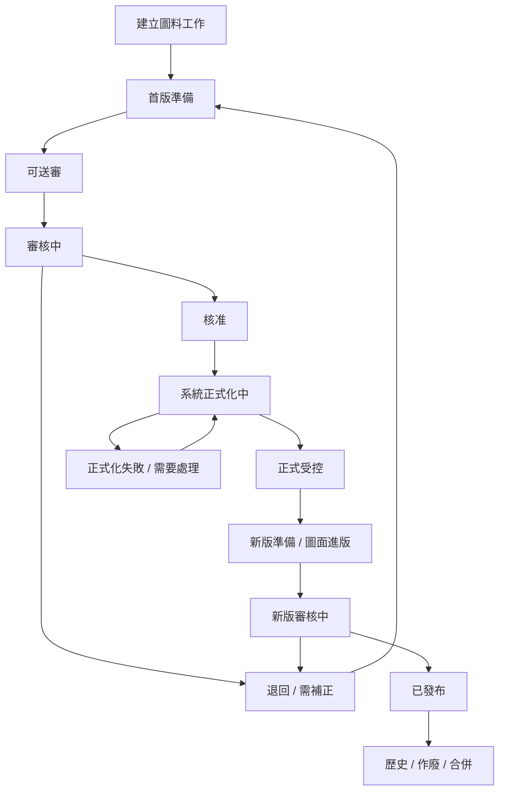

# QA Plan：圖料生命週期由 AI 執行的真實操作缺口驗證計畫

Status: `QA Plan Ready / Gap-Finding Mode / Not Yet Executed`
Date: 2026-08-05
Owner: QA
Executor: AI QC after execution handoff
Related DEV: `DEV-052`, `DEV-053`, `DEV-050`, `DEV-051`
Related SPEC:

- `.ai-doc/specs/SPEC-PDM-NUMBER-LIFECYCLE-SIMPLIFICATION-001-efficiency-first-bundle-flow.md`
- `.ai-doc/specs/SPEC-PDM-UNIFIED-DRAWING-WORKBENCH-001-single-page-lifecycle-workbench.md`

## 1. Objective

本計畫目標不是證明系統可用，而是用 AI 在真實 UI 中逐站操作，找出圖料生命週期目前仍存在的缺口。

驗證策略：

1. 優先使用固定本機 `http://127.0.0.1:3000` 與真實瀏覽器操作。
2. 每一站先以真實 UI、真實點擊、真實輸入、真實上傳、真實審核嘗試推進。
3. 若卡關進不到下一站，該站判定為 gap，保存證據。
4. 卡關後不得停止整體驗證；改用隔離模擬資料或受控 fixture 直接建立下一站狀態，繼續往後測。
5. API / DB 只能用於 baseline、readback、隔離 fixture seed、故障注入、狀態跳轉與 cleanup；不得用 API / DB 成功取代 UI 通過。

最終輸出應是一份缺口清單，而不是單一 Pass / Fail。

## 2. Boundary

In scope：

- 建立料件與圖號工作。
- 既有保留號往新流程推進。
- 首版圖面準備、版次、受控檔案、參考附件。
- 送審、撤回、退回、補正、再送審、核准。
- 系統自動正式化與正式圖號 / 料號建立。
- 正式圖面受控後的進版、上傳送審、發布、歷史與作廢。
- 圖料關係、同根料號、主資料、主要製造圖、製造影響、附件治理與權限。
- UI 可見錯誤、下一步提示、權限不足、空狀態、terminal 狀態與 RWD。

Out of scope：

- production migration、production data repair、production deploy、production release。
- 修改 DEV-054 範圍，包括 DVT / development phase 移除、023 migration、DEV-054 文件與刪檔語意。
- 用 API / DB 直接補資料後宣稱 UI 已通過。
- 回填、改號、重播既有正式審核或批次修改既有正式資料。

## 3. Lifecycle Map

AI QC 必須覆蓋下列生命週期站點。每站都要判定：使用者是否看得懂現在狀態、是否找得到下一步、是否真的能進下一站。



## 4. Gap-Finding Rules

每個 lifecycle station 必須輸出一筆站點判定：

| 判定 | 定義 |
|---|---|
| `Pass` | AI 以真實 UI 完成該站操作並進入下一站，且 API / DB readback 支持畫面事實。 |
| `Gap` | UI 卡住、入口不可見、按鈕無效、狀態矛盾、錯誤可見、權限說明不足、資料未寫入或寫入不一致。 |
| `Blocked` | 環境、登入、file chooser、測試資料或外部依賴導致無法驗證。Blocked 仍要記錄證據。 |
| `Simulated-Continue` | 前一站已 Gap / Blocked，AI 改用隔離 fixture 建立下一站資料後繼續測；此狀態不能抵銷前一站缺口。 |
| `Not Run` | 尚未執行。不得推論為通過。 |

卡關處理規則：

- 先截圖、保存 URL、viewport、console、network、visible error、DB baseline 與操作步驟。
- 將卡關站點寫成 gap，包含預期下一步與實際失敗。
- 建立下一站模擬資料時，run manifest 必須標明 `simulatedFromStage`、`simulationReason`、`seededFacts`。
- 模擬資料只能在隔離 DB 或可清理 local fixture 使用；既有 A0005 等使用者資料只可 read-only 或依使用者明確指示操作。

## 5. Required Evidence Package

每次 AI 執行建立一個 run folder：

```text
output/playwright/pdm-drawing-part-lifecycle-gap/YYYYMMDD-HHMMSS/
```

至少保存：

- `run-manifest.json`：base URL、source hash、feature flags、actor、DB / storage identity、productionConnected、productionWrites。
- `stage-results.json`：每一站 Pass / Gap / Blocked / Simulated-Continue / Not Run。
- `gaps.json`：缺口清單，含 severity、repro、expected、actual、evidence。
- `baseline-before.json`、`baseline-after.json`、`cleanup.json`。
- `console-summary.json`、`network-summary.json`、`visible-error-summary.json`。
- 每站截圖：list、drawer、dialog、error、success、權限不足、空狀態。
- 每個模擬續測點的 seed script / fixture manifest / cleanup result。

Production hard gate：

- `productionConnected` 必須是 `false`。
- `productionWrites` 必須是 `false`。
- 若無法證明，立即停止，判定 Blocked。

## 6. Test Data Strategy

| Fixture | 用途 | 真實操作優先 | 卡關後模擬續測 |
|---|---|---:|---:|
| `LIFE-01` 新建單圖單料 | 驗證最短主流程 | Yes | Yes |
| `LIFE-02` 新建多圖同料 | 驗證 bundle、正式化拆列 | Yes | Yes |
| `LIFE-03` 既有保留號 | 驗證 legacy continuation | Yes, read/write only if explicit test target | Yes |
| `LIFE-04` 缺主檔候選 | 驗證首版準備 blocker | Yes | Yes |
| `LIFE-05` 已可送審候選 | 直接測送審與撤回 | Yes | Yes |
| `LIFE-06` 審核中候選 | 測 reviewer / owner 分工 | Yes | Yes |
| `LIFE-07` 退回候選 | 測補正與再送審 | Yes | Yes |
| `LIFE-08` 核准但正式化失敗 | 測 recovery | Yes | Yes |
| `LIFE-09` 正式受控未 Released | 測正式圖面治理 | Yes | Yes |
| `LIFE-10` Released 圖面 | 測進版、發布、歷史 | Yes | Yes |
| `LIFE-11` 作廢 / 合併 / 取消 | 測 terminal Now What | Yes | Yes |
| `LIFE-12` 第二公司同號 | 測權限與資料隔離 | Yes | Yes |

所有 fixture 必須可清理。若正式化後資料無法安全刪除，必須使用 isolated disposable DB，不得污染固定 3000 的既有資料。

## 7. Real Operation Cases

### RO-00 Environment and Baseline

1. 啟動或確認 `npm run dev:local:check`。
2. 開啟 `http://127.0.0.1:3000/numbering/drawings`。
3. 記錄登入者、角色、company、feature flags、production slice 狀態。
4. 保存 DB / storage baseline 與 source hash。
5. hard reload 後執行 visible error sweep。

Pass criteria：

- 目標明確為 local / development。
- 無 visible 500、route error、inline error、hydration error。
- 首頁資料 sanity 合理，不是預期有資料卻全空。

### RO-01 建立圖料工作

1. 從 `圖號工作台` 點 `建立圖號`。
2. 建立單圖單料 fixture。
3. 關閉一次 drawer / modal，確認未送出時不寫入。
4. 重新建立並送出。
5. 回清單搜尋新工作。

Expected：

- 建立的是 candidate workspace，不是直接建立 formal master。
- 清單只出現一列 candidate bundle。
- 下一步清楚指向首版準備。

若卡關：

- Gap：建立入口缺失、建立後找不到、建立 formal master、重複列、關閉仍寫入。
- Simulated continue：seed `drawing_preparation` workspace。

### RO-02 既有保留號進入新流程

1. 搜尋既有保留號，例如 A0005 類型資料。
2. 打開 drawer。
3. 判斷是否能從目前狀態直接往首版準備 / 可送審推進。
4. 若已有檔案但缺 evidence，必須有 `驗證既有檔案` 類入口。

Expected：

- 不要求使用者重新領號或重建資料。
- 不改號、不回填、不重播舊審核。
- 若資料已足夠，UI 應提供明確下一步。

若卡關：

- Gap：仍停在保留號但無入口、要求重新上傳既有檔、下一步不可見、狀態與 CTA 矛盾。
- Simulated continue：seed `bundle_ready` candidate。

### RO-03 首版圖面準備與受控檔案

1. 開啟候選工作。
2. 設定研發版次。
3. 以真實 file chooser 上傳至少 2 個檔案：主要 CAD / 工程圖。
4. 測試多檔、說明、類型、primary、刪除、重試。
5. 驗證至少一個 active primary finalized controlled file 後是否可送審。

Expected：

- 受控檔案與參考附件分清楚。
- 參考附件不會被算進送審資格。
- 缺 PDF / DWG / 3D 類檔案只警告，不阻擋送審，除非規格另有明確 gate。
- 上傳完成後 UI 自動重算 readiness，不需要多餘人工「完成準備」。

若卡關：

- Gap：上傳失敗、finalized evidence 缺口、上傳成功但不能送審、分類不見、primary 無法設定、參考附件誤算受控證據。
- Simulated continue：seed active primary finalized controlled file。

### RO-04 送審、撤回、再送審

1. 在 `bundle_ready` 點 `送交審核`。
2. 檢查 confirmation：圖、料、版次、檔案、警告、影響範圍。
3. 送審後 owner 嘗試撤回。
4. 修改檔案或版次後再送審。

Expected：

- 送審後鎖定 snapshot。
- owner 可依規則撤回。
- 再送審產生新 snapshot，不重複建立 number-only review。
- 沒有人工正式發布入口。

若卡關：

- Gap：送審入口找不到、confirmation 不含關鍵範圍、送出後仍可亂改、撤回失敗無原因、再送審重複審核。
- Simulated continue：seed `in_review` approval request。

### RO-05 審核、退回、補正

1. 切換 reviewer。
2. 從 `審核工作台` 或工作台待處理進入案件。
3. 檢視圖、料、版次、檔案、警告與關係。
4. 先退回 / 需補正。
5. 切回 owner，確認回到可修正狀態並能補正。
6. 再次送審。

Expected：

- reviewer 看得到足夠 evidence。
- 退回原因回到 owner 可見。
- Rejected / needs_info 不應變成只能查看的 terminal。
- owner 找得到修正入口。

若卡關：

- Gap：審核入口不可達、退回後找不到補正、修正版入口錯誤、退回原因不可見。
- Simulated continue：seed approved decision。

### RO-06 核准與自動正式化

1. reviewer 核准候選 bundle。
2. 觀察 UI 是否進入 `系統正式化中`。
3. 等待或刷新，確認正式 root / part / drawing / relation / revision 建立。
4. 回清單搜尋候選號、正式圖號、料號、品名。

Expected：

- 核准後由系統自動正式化。
- 不要求人工再按正式發布。
- 一個 candidate bundle 轉成 N 個 formal drawing rows。
- 無 candidate + formal 重複 top-level 列。
- idempotent reload 不重複建立正式資料。

若卡關：

- Gap：核准後停住無說明、要求人工正式發布、正式資料缺漏、重複列、reload 重複建立。
- Simulated continue：seed `official_controlled` formal drawing。

### RO-07 正式化失敗與 recovery

1. 使用 fault fixture 建立核准後 apply_failed。
2. owner 與 Admin 分別打開。
3. 驗證一般使用者看到處理狀態，Admin 看到重試或可執行恢復入口。
4. Admin 重試。

Expected：

- 沒有 partial formal rows 被當成成功。
- recovery action 使用原 approved snapshot。
- 權限不足時說明缺少權限與聯絡角色。

若卡關：

- Gap：失敗狀態無下一步、partial data 露出、任何人可重試、重試產生新事實。
- Simulated continue：seed formal controlled。

### RO-08 正式受控後的圖料管理能力

1. 開啟正式圖面 drawer。
2. 驗證下列入口是否可見且可完成代表性任務：
   - 圖面進版。
   - 上傳與送審。
   - 完整圖料關係。
   - 製造影響 / 使用處。
   - 主資料：材質、顏色、表面處理、變體備註。
   - 主要製造圖。
   - 同根料號 / 同圖料號。
   - 標準成本或成本檢查。
   - 受控版次檔案。
   - 參考附件：上傳、說明、預覽重建、Drive 重試、刪除 / 還原、補件。
   - 歷史與稽核。

Expected：

- 單頁化沒有把正式圖面舊能力藏掉。
- 高頻動作可在 drawer 完成；低頻動作可進專用頁且能 return。
- 權限不足不靜默隱藏，需顯示原因。

若卡關：

- Gap：入口不見、只能猜 URL、點入專用頁丟失上下文、參考附件能力退化、受控檔案與參考附件 authority 混淆。
- Simulated continue：seed revision draft / released drawing。

### RO-09 圖面進版、送審與 Released

1. 對正式圖面點 `圖面進版`。
2. 建立新版草稿。
3. 上傳版次受控檔案。
4. 送審、審核、核准。
5. 驗證 Released gate 與 current revision 指標。

Expected：

- 尚未 server 提交前，統一清單不應虛構 `revision_ready`。
- 送審後才顯示 `新版審核中`。
- 核准 / Released 後 current revision 正確。
- 小數版不可成為正式 Released，除非規格允許。

若卡關：

- Gap：進版入口不可用、上傳送審 route 斷裂、清單狀態提前跳、Released gate 錯誤。
- Simulated continue：seed released drawing。

### RO-10 歷史、作廢、合併與取消

1. 對已發布圖面申請作廢或使用 terminal fixture。
2. 驗證 `包含歷史` toggle。
3. 直接開 terminal deep link。
4. 比較 Obsolete、Merged、Cancelled、Rejected 顯示差異。

Expected：

- 歷史預設不干擾工作清單。
- terminal 顯示原因與下一步。
- Rejected 不是 history-only，應回補正流程。
- 直接 deep link 可安全顯示且不寫入。

若卡關：

- Gap：歷史永遠混入、terminal 原因不明、Rejected 被歸歷史、deep link 404 或寫入。
- Simulated continue：不需續測，記錄缺口。

### RO-11 搜尋、篩選、分頁與 drawer 一致性

1. 快速輸入多組搜尋字。
2. 切換 `我的待處理 / 工作中 / 全部`。
3. 切換 stage、series、purpose、history。
4. 開 drawer 後改 filter，使該列離開結果。
5. 測試 cursor 與上一頁 / 下一頁。

Expected：

- 只接受最後一次 request。
- filter 改變後 cursor 歸零。
- 已選列不在結果內時 drawer 關閉或重新對齊。
- 不出現舊資料蓋新資料。

若卡關：

- Gap：stale response、drawer 顯示已不在結果的列、分頁重複 / 漏列。
- Simulated continue：不需續測，記錄缺口。

### RO-12 權限、跨公司與 visible error

1. 以 owner、reviewer、Admin、readonly 各跑主要站點。
2. 以第二公司同號資料搜尋與 direct URL 探測。
3. 測試 direct API negative checks。
4. 掃描可見 401 / 403 / 404 / 409 / 5xx 狀態。

Expected：

- 403 顯示中文能力、permission code、聯絡角色。
- 只有具 `settings.admin_matrix` 者看到權限管理入口。
- 跨公司不可見、不可操作、不洩漏存在性。
- visible error 是 fail，不可用 API success 抹掉。

若卡關：

- Gap：權限錯誤混成一般讀取錯誤、readonly 看到管理入口、跨公司資料可見、UI 出現 500。
- Simulated continue：使用具權限 actor 繼續後站測試，但保留權限 gap。

### RO-13 RWD、keyboard 與文字噪音

Viewport：

- 1440 x 900
- 1024 x 768
- 390 x 844

操作：

1. 搜尋、篩選、開 drawer、上傳、送審、審核。
2. 測 ArrowUp / Down、Home / End、PageUp / Down、Enter、Esc、Ctrl / Cmd + C。
3. 掃描 raw enum、API route、storage path、DEV ID、rowVersion、`cad_3d`、`drawing_2d`、`finalized` 等主畫面工程詞。

Expected：

- 無水平 overflow、重疊、裁切、按鈕被擠壓。
- keyboard 不攔截 input / textarea。
- 主畫面文字都能影響使用者判斷或下一步。

若卡關：

- Gap：RWD 破版、focus lost、文字噪音、可見工程詞、無障礙名稱與按鈕文字不一致。

## 8. FMEA

| 失效模式 | 可能原因 | 使用者影響 | 偵測方式 | 優先級 | 對策 / 建議測試 |
|---|---|---|---|---|---|
| 生命週期卡在保留號 | legacy projection 有狀態但無 action | 既有資料無法往前推 | RO-02 | P0 | 既有保留號真實 UI 推進，卡關後 seed bundle_ready |
| 上傳成功但不能送審 | evidence / readiness 未同步 | 使用者不知道下一步 | RO-03 | P0 | 上傳後立刻刷新與 DB readback |
| 審核入口不可達 | approval route / permission / action code 不一致 | 案件進不了下一關 | RO-04 / RO-05 | P0 | owner / reviewer 雙角色操作 |
| 核准後未正式化 | auto-finalization async gap | 號碼仍不可正式使用 | RO-06 | P0 | 核准後輪詢、reload、idempotency readback |
| 正式圖面能力被單頁化藏掉 | UI 合併只保留主 CTA | 舊功能看似消失 | RO-08 | P0 | 逐項操作正式能力清冊 |
| 受控檔案與參考附件混淆 | authority 邊界不清 | 錯誤檔案被拿去送審 | RO-03 / RO-08 | P0 | controlled / reference negative checks |
| 退回後不可補正 | Rejected 被投影成 terminal | 審核流程中斷 | RO-05 / RO-10 | P1 | reviewer reject 後 owner 補正 |
| 搜尋篩選顯示舊資料 | request race / cursor stale | 操作錯資料 | RO-11 | P1 | 快速輸入與 delayed response |
| 權限不足無可行下一步 | disabled reason 不足 | 使用者不知道找誰 | RO-12 | P1 | readonly / Admin capability matrix |
| 歷史資料干擾工作清單 | default scope 錯 | 工作台難以掃描 | RO-10 / RO-11 | P2 | history toggle / deep link |
| RWD 或 keyboard 退化 | drawer / table only design | 現場操作困難 | RO-13 | P2 | 三 viewport + keyboard sweep |
| 測試通過但固定 3000 失敗 | isolated runner 與 dev server env 漂移 | QC 誤判 | RO-00 | P0 | 固定 3000 與 isolated fixture 分開標記 |

## 9. QC Execution Commands

AI QC 執行時優先順序：

```powershell
npm run dev:local:check
npm run qc:local-dev-entrypoint
npm run qc:dev-053
npm run qc:dev-052
npm run qc:master-attachments
npm run qc:pdm-revision-policy-release-gate
npm run qc:pdm-numbering-approval-review-ui
npm run qc:pdm-drawing-part-relation-view
npm run qc:pdm-numbering-impact-ui
npm run qc:pdm-production-slice-numbering-draft
npm run typecheck
```

真實操作主軸不得只依賴上述 scripts。scripts 是輔助 gate；缺口發現以瀏覽器操作與證據為主。

## 10. Report Format

QC 最終報告必須包含：

| 欄位 | 說明 |
|---|---|
| `Overall` | `Gaps Found`、`Blocked`、`No P0/P1 Found` 之一。 |
| `Stage Summary` | 每站 Pass / Gap / Blocked / Simulated-Continue / Not Run。 |
| `P0 / P1 / P2 Gaps` | 依嚴重度排序。 |
| `First Blocking Stage` | 第一個真實 UI 卡關點。 |
| `Simulated Continuations` | 哪些站點靠模擬資料續測，模擬原因與 seed facts。 |
| `Evidence Paths` | 截圖、manifest、network、console、DB readback。 |
| `Data Safety` | productionConnected / productionWrites / cleanup。 |
| `DEV-054 Boundary` | 確認沒有修改或恢復 DEV-054 protected scope。 |

缺口格式：

```json
{
  "id": "LIFE-GAP-001",
  "severity": "P0",
  "stage": "drawing_preparation",
  "title": "上傳主要受控檔後仍無法送審",
  "expected": "至少一個 active primary finalized controlled file 後顯示送交審核",
  "actual": "UI 仍顯示尚不可正式使用，沒有可執行下一步",
  "repro": ["..."],
  "evidence": ["screenshot.png", "network-summary.json"],
  "simulatedContinue": {
    "nextStage": "bundle_ready",
    "fixture": "LIFE-05",
    "reason": "需要繼續驗證送審與審核後段"
  }
}
```

## 11. Pass / Fail Interpretation

本計畫不追求一次全綠。判定原則：

- 發現 P0 / P1 缺口即達成 QA gap-finding 目的，但產品不可宣告通過。
- 前段卡關不停止後段測試；後段用模擬資料續測，避免「第一個洞」遮住後面更多洞。
- 模擬續測通過只能代表後段邏輯在該 seed 條件下可用，不代表真實端到端通過。
- 若真實 UI 從建立到 Released 全流程通過，仍需檢查正式圖面能力、權限、RWD、history、visible error 與 DEV-054 邊界後才可交 QC 判定。

使用思考習慣：#系統描繪、#可驗證性、#證據基礎
