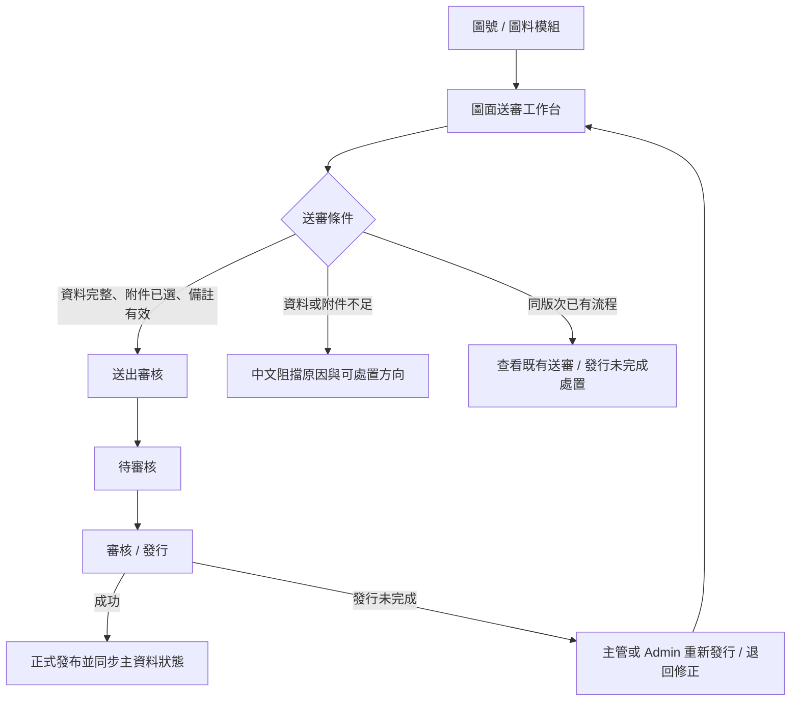

# QA Plan: PDM Drawing Submission UI Real Operation Validation

Date: 2026-07-02
Owner: QA
Status: QA Plan Ready
Related DEV:
- `DEV-PDM-DRAWING-PART-WORKBENCH-001`
- `DEV-PDM-DRAWING-SUBMISSION-001`
- `DEV-PDM-DRAWING-SUBMISSION-WORKBENCH-002`
- `DEV-PDM-DRAWING-SUBMISSION-WORKBENCH-003`
- `DEV-PDM-RELEASE-MASTER-STATUS-SYNC-001`

Related specs:
- `.ai-doc/specs/SPEC-PDM-DRAWING-SUBMISSION-001-review-only-from-drawing.md`
- `.ai-doc/specs/SPEC-PDM-DRAWING-SUBMISSION-WORKBENCH-002-release-recovery.md`
- `.ai-doc/specs/SPEC-PDM-DRAWING-SUBMISSION-WORKBENCH-003-ui-self-recovery.md`
- `.ai-doc/specs/SPEC-PDM-RELEASE-MASTER-STATUS-SYNC-001-submission-release-master-lifecycle.md`

Supersedes for future QC planning:
- `.ai-doc/qa/qa-pdm-drawing-submission-ui-operation-validation-plan-2026-07-02.md`
- `.ai-doc/qa/qa-pdm-drawing-submission-workbench-recovery-validation-plan-2026-07-02.md` Section 4.7 operation matrix

## 1. Purpose

This plan replaces the ambiguous prior UI validation count. The previous evidence mixed a 14-case UI operation runner, a 28-row OP matrix, 27 static/API recovery checks and historical D-0014 incident smoke evidence. That is not an acceptable QA closure model for "26 UI validation cases".

This plan defines exactly 26 business operation cases for the drawing submission lifecycle. Every counted case must be validated from the rendered browser UI. API, database, static checks, fixture setup, migration checks and build/lint are supporting gates only; they do not count as UI operation cases.

The validation goal is to prove that a user can operate drawing submission from the product UI without using database edits, direct API calls, developer-only cleanup, raw error codes or historical incident data.

## 2. Counting Rule

Counted as one of the 26 UI cases:

- QC logs into the app through the visible UI.
- QC navigates through visible menu items, table rows, buttons, links, forms, dialogs, upload controls or page routes.
- QC verifies visible state, enabled/disabled controls, user-facing messages, route identity and screenshots.
- QC may use Playwright to automate the same visible operations, as long as the evidence is rendered UI evidence.

Not counted as one of the 26 UI cases:

- Direct database query, insert, update or delete.
- Direct API call used as the main proof.
- Static code scan.
- Build, lint, TypeScript or unit tests.
- Test fixture setup or cleanup.
- Route-mocked states that never render through the product route.
- Historical D-0014-MA1 evidence.

Supporting gates are still mandatory because they protect data safety, but they cannot replace the 26 UI cases.

## 3. Scope

In scope:

- Drawing module `送審` entry.
- 圖料 / 主根號 entry to drawing submission.
- Canonical drawing submission workbench route.
- Retired generic upload behavior.
- Ready-to-submit path.
- Field and attachment blockers.
- Same drawing + same revision lifecycle states.
- Pending cancellation.
- Release-incomplete recovery.
- Existing submission detail navigation.
- Permission and company scope.
- Master lifecycle status consistency after final release.
- User-facing Chinese language.
- Desktop/tablet/mobile visible UI quality.

Out of scope:

- Production deployment.
- Supabase production migration or provider switch.
- Google Drive production file movement.
- Direct cleanup or repair of historical records.
- Full audit reporting UI.
- Phase 2+ collaboration features unless explicitly implemented.

## 4. Data And Fixture Policy

QC must not use D-0014-MA1 or any historical business record as a required fixture.

QC fixture data must be disposable and clearly prefixed, for example:

- Drawing fixtures: `D-QA-UI-SUB-001-MA1`, `D-QA-UI-SUB-002-MA1`, ...
- Part fixtures: `P-QA-UI-SUB-001-001`, `P-QA-UI-SUB-002-001`, ...
- Submission fixtures: `SUB-QA-UI-SUB-<case>-<run>`
- Uploaded files: `QA-UI-SUB-<case>.SLDDRW`, `QA-UI-SUB-<case>.SLDPRT`

Fixture setup may be done by a controlled QC setup tool when the UI cannot naturally create the prerequisite lifecycle state. Setup is a prerequisite, not proof. The counted proof starts after the fixture exists and QC operates the real UI.

Fixture cleanup is mandatory. Cleanup failure is a QC failure because it pollutes clean lifecycle validation.

## 5. Roles

QC must cover these roles through UI login:

- Engineer: normal submitter.
- Other Engineer: same-company non-owner.
- R&D Manager: reviewer / recovery role.
- Admin: administrator recovery role.
- Unauthorized or cross-company user: restricted access check.

If a role cannot be logged in through UI, the validation is blocked.

## 6. User Workflow Under Test



## 7. FMEA

| 失效模式 | 可能原因 | 使用者影響 | 偵測方式 | 優先級 | 對策 / 建議測試 |
|---|---|---|---|---|---|
| 送審入口導到錯圖號 | route parameter 或 link 查詢條件遺失 drawing identity | 使用者可能處理錯誤圖面 | 比對來源圖號、URL、工作台圖號、明細圖號 | P0 | `UI26-002`, `UI26-003`, `UI26-018` |
| 使用者被導到泛用上傳頁 | legacy `/upload` 邏輯未退場 | 使用者在錯誤階段補資料 | 開啟 legacy 與 generic upload route | P0 | `UI26-005`, `UI26-006` |
| 已顯示可送審但按鈕不能按 | readiness 與 disabled reason 不一致 | 使用者不知道要修什麼 | 操作備註、附件與送出按鈕 | P0 | `UI26-008`, `UI26-009`, `UI26-010`, `UI26-011` |
| 同版次 blocker 分類錯誤 | Pending/Releasing/Released/ReleaseFailed 被合併成 generic duplicate | 使用者找不到正確處置 | 逐一驗證 lifecycle state copy 與 CTA | P0 | `UI26-012` 到 `UI26-017` |
| 發行未完成仍需後台處理 | retry / correction 沒有 UI 路徑 | 工作流卡死 | Manager/Admin 操作 recovery | P0 | `UI26-022` 到 `UI26-025` |
| 非擁有者可取消或處置送審 | 權限只做 UI 隱藏或 API guard 不足 | 責任與資料完整性破壞 | Submitter/Other Engineer/Manager/Admin 交叉操作 | P0 | `UI26-019` 到 `UI26-021`, `UI26-026` |
| 發布成功但主資料仍 Draft | 發行流程沒有同步 drawing/part/root lifecycle | 清單與送審頁互相矛盾 | 發布後回到圖號/圖料清單確認狀態 | P0 | `UI26-025` |
| UI 顯示 raw 技術錯誤 | exception 或 DB constraint 未被轉譯 | 使用者無法處理且暴露實作細節 | 全域 forbidden text sweep | P1 | Global Gate G3 |
| 小視窗無法操作 | fixed width、重疊、overflow | 現場或窄螢幕無法送審 | 多 viewport 截圖與 DOM overflow | P1 | Global Gate G4 |

## 8. The 26 UI Operation Cases

Each case must produce a QC record with role, fixture id, route, viewport, steps, actual result, screenshot path and pass/fail judgement.

| ID | Area | Role | Preconditions | UI operation | Expected result |
|---|---|---|---|---|---|
| `UI26-001` | Login / role baseline | Engineer, Other Engineer, R&D Manager, Admin | Test accounts exist | Log in from `/login` for each role | Each role reaches authenticated UI and role-specific actions are available or hidden correctly |
| `UI26-002` | Drawing entry | Engineer | Disposable drawing has valid primary part and attachments | Open 圖號模組, select fixture drawing, click `送審` | Workbench opens for the same drawing number; no unrelated drawing appears |
| `UI26-003` | Drawing-part entry | Engineer | Root has one clear primary drawing | Open 圖料 / 主根號 workbench, click drawing submission action | System opens the same canonical drawing submission workbench with root, part and drawing context visible |
| `UI26-004` | Ambiguous drawing entry | Engineer | Root has no clear primary drawing or multiple eligible drawings | Click submission action from 圖料 context | UI blocks or asks user to choose a drawing; it does not open a blank upload form |
| `UI26-005` | Legacy compatibility | Engineer | Fixture drawing exists | Open `/upload?source=drawing&drawingNumber=<fixture>` from browser | Route redirects to or renders drawing submission workbench; generic upload/PDM attribute form is not shown |
| `UI26-006` | Generic upload retirement | Engineer | User logged in | Open `/upload` | Page explains controlled source requirement or redirects safely; it cannot create an uncontrolled formal drawing submission |
| `UI26-007` | Workbench data sanity | Engineer | Ready fixture drawing exists | Hard reload workbench | Drawing number, part number, item name, revision and selectable attachment count are non-empty and match fixture |
| `UI26-008` | Ready submit | Engineer | No same-revision blocker; master data complete; at least one eligible attachment | Select attachment, enter 5-100 character note, click `送出審核` | Submit becomes enabled only after requirements pass and creates a Pending submission for the same drawing/revision |
| `UI26-009` | Missing / invalid note | Engineer | Otherwise ready context | Leave note empty, enter too-short note, enter over-limit note | Submit is blocked or rejected with field-level Traditional Chinese reason; no submission is created |
| `UI26-010` | Missing attachment | Engineer | Drawing has eligible attachments | Deselect all attachments and attempt submit | Submit is blocked with a clear attachment requirement message |
| `UI26-011` | Master data incomplete | Engineer | Drawing/part has missing required master data | Open workbench and attempt submit | UI separates master-data blocker from same-revision blockers and explains where the user should fix it |
| `UI26-012` | Pending same-revision blocker | Engineer | Existing Pending submission for same drawing/revision | Open workbench and click `查看既有送審` | Submit is blocked; detail link opens the matching Pending record for the same drawing |
| `UI26-013` | Releasing same-revision blocker | Engineer or Manager | Existing Releasing submission for same drawing/revision | Open workbench | Submit is blocked with in-progress wording; no duplicate active submission can be started from UI |
| `UI26-014` | Released / Obsolete lock | Engineer | Existing Released or Obsolete same drawing/revision | Open workbench | Same revision is locked; UI instructs user to use a new revision instead of resubmitting |
| `UI26-015` | Rejected / Cancelled history | Engineer | Rejected or Cancelled history exists and no active/formal blocker exists | Open workbench | History is visible with low weight and does not block a valid new submission |
| `UI26-016` | Unresolved release-incomplete blocker | Engineer | Existing unresolved release-incomplete record | Open workbench and detail | UI uses user language such as `發行未完成`; Engineer sees guidance and no unauthorized recovery action |
| `UI26-017` | Resolved release-incomplete history | Engineer | Old release-incomplete record is resolved by a later submission | Open workbench and related queues | Old failure is traceable as history but does not block submission or pollute main actionable todo |
| `UI26-018` | Existing detail navigation | Engineer or Manager | Workbench contains existing submission link | Click existing submission link | Detail page opens the linked submission id and same drawing number; it does not route to unrelated data |
| `UI26-019` | Pending cancel by submitter | Submitter | Own Pending submission exists | Open detail, click `取消送審`, confirm reason | Status becomes Cancelled, row/files/snapshot remain, and same revision becomes available if no other blocker exists |
| `UI26-020` | Pending cancel by Manager/Admin | R&D Manager or Admin | Pending submission exists in same company | Open detail and cancel with reason | Status becomes Cancelled with manager/admin actor visible in lifecycle evidence |
| `UI26-021` | Pending cancel denied for non-owner | Other Engineer | Another user's Pending submission exists | Open detail and inspect or attempt cancel if visible | Cancel action is hidden or denied with human Traditional Chinese message; status remains unchanged |
| `UI26-022` | Retry release-incomplete success | R&D Manager or Admin | Unresolved release-incomplete record exists and release stub can succeed | Open detail, click `重新發行` | Same submission id transitions to Released; no new duplicate submission id is created |
| `UI26-023` | Retry release-incomplete failure | R&D Manager or Admin | Release service fails deterministically | Open detail, click `重新發行` | Submission remains release-incomplete and UI shows human-readable failure summary without raw stack/SQL |
| `UI26-024` | Return for correction | R&D Manager or Admin | Unresolved release-incomplete record exists | Open detail, click `退回修正`, choose corrected current attachments, confirm | New linked Pending correction is created; old record remains unresolved until correction release |
| `UI26-025` | Corrected release closes loop | R&D Manager or Admin | Linked correction exists | Approve/release linked correction, then return to 圖號/圖料 lists | New submission is Released; old release-incomplete is resolved; drawing/part/root no longer show Draft for the released revision |
| `UI26-026` | Permission / company scope | Unauthorized or cross-company user | Fixture belongs to another allowed scope | Attempt to open workbench/detail/action routes through UI | Access is denied or redacted in Traditional Chinese; no cross-company data leaks in visible UI |

## 9. Mandatory Global UI Gates

These gates apply to every UI case. They are not included in the 26 count.

| Gate | Requirement | Failure condition |
|---|---|---|
| `G1` Fixture cleanup | All disposable fixture rows/files are removed or explicitly quarantined after QC | Any `QA-UI-SUB` fixture remains as standing business data without cleanup note |
| `G2` Visible error hard gate | No unexpected visible `.inline-error`, `[role=alert]`, `HTTP 4xx/5xx`, `Not Found`, `Internal Server Error`, `/api/...` failure banner, or all-zero critical count | Any such error appears outside a case intentionally testing an error state |
| `G3` Forbidden technical language sweep | Normal UI must not display `duplicate_active_submission`, `ReleaseFailed`, `UNIQUE constraint failed`, `submission_conflict`, raw SQL, stack trace or English-only permission errors | Any forbidden term appears in a normal user path |
| `G4` Responsive UI | Validate 1440, 1024, 768 and 390 px widths on workbench and detail surfaces | Horizontal overflow, overlap, clipping, unreadable disabled reason or hidden primary CTA |
| `G5` Data identity | Source drawing, destination workbench, created submission and detail page must keep the same drawing/revision/company | Any route loses identity or lands on unrelated data |
| `G6` No backend rescue | The user-facing workflow must not require DB/API/manual backend intervention to continue | QC must use DB/API to unblock a normal user path after the UI step starts |

## 10. Supporting Gates

These commands are supporting evidence only. They cannot replace the 26 UI cases.

Required before QC starts UI operation:

```powershell
npm run dev:local:check
npx tsc --noEmit --pretty false
npm run lint -- --quiet
npm run build
```

Recommended regression support:

```powershell
npm run qc:pdm-drawing-submission-ui-operation
npm run qc:pdm-drawing-submission-workbench-recovery
npm run qc:pdm-drawing-submission-workbench-mutation
npm run qc:pdm-submission-conflict-duplicate-active
npm run qc:pdm-release-master-status-sync
```

New or updated QC automation required to close this plan:

```powershell
npm run qc:pdm-drawing-submission-ui-real-operation
```

If this command does not exist, QC may execute the 26 cases manually with browser screenshots, but the plan cannot be marked automation-complete.

## 11. Pass / Fail Standard

Pass:

- All 26 UI cases pass with rendered UI evidence.
- All mandatory global UI gates pass.
- Supporting gates pass or any skipped gate has a documented reason that does not weaken UI evidence.
- No case depends on D-0014-MA1 or any historical user/business record.
- Fixture setup and cleanup are recorded.
- QC report includes a case-by-case traceability table.

Fail:

- Any one of the 26 cases fails.
- Any global gate fails.
- Any normal path requires direct DB/API/developer intervention after the user begins the UI workflow.
- The UI shows raw technical language in a normal user-facing path.
- Route identity points to unrelated drawing, part, root, company or submission.
- The final released state still appears as Draft in drawing/part/root UI.

未充分驗證:

- Missing screenshots or DOM evidence.
- Missing viewport evidence.
- Missing role coverage.
- Missing fixture cleanup result.
- Only API/static/build evidence exists for a counted UI case.

阻塞:

- Local server cannot be opened.
- Required UI login is unavailable.
- Product UI cannot create or reach a required prerequisite state and no controlled disposable fixture builder exists.
- Fixture setup would require altering historical records.

## 12. QC Report Requirements

QC must produce a report with:

- Date, branch, commit, local URL and server health.
- Fixture names, created records and cleanup result.
- Role account labels, without secrets.
- Case table with `UI26-001` through `UI26-026`, each marked Pass / Fail / Not sufficiently verified / Blocked.
- Screenshot or DOM evidence path for every case.
- Viewport evidence for global gate `G4`.
- Forbidden text sweep result for global gate `G3`.
- Summary of supporting gate commands.
- Explicit statement that D-0014-MA1 was not used as required fixture.

## 13. Traceability From Old Plan

| Old item | New disposition |
|---|---|
| 14-case `AUTH/REAL/MOCK/RWD` UI operation plan | Partial regression only; does not close this 26-case plan |
| OP-001 to OP-004 | Covered by `UI26-002` to `UI26-006` |
| OP-005 to OP-007 | Covered by `UI26-008` to `UI26-011` |
| OP-008 to OP-014 | Covered by `UI26-012` to `UI26-018` |
| OP-015 to OP-017 | Covered by `UI26-019` to `UI26-021` |
| OP-018 to OP-022 | Covered by `UI26-022` to `UI26-025` |
| OP-023 | Covered by `UI26-012`, `UI26-013` and supporting duplicate/idempotency gate |
| OP-024 | Covered by `UI26-026` |
| OP-025 | Covered by `UI26-017` and `UI26-025` |
| OP-026 | Moved to mandatory global gate `G2` |
| OP-027 | Moved to mandatory global gate `G4` |
| OP-028 | Moved to mandatory global gate `G3` |
| D-0014 browser/API smoke | Historical incident evidence only; not accepted as current fixture proof |

## 14. QA Decision

The drawing submission UI lifecycle may be reported as "UI real-operation validated" only after this exact 26-case matrix and all global gates pass. Until then, any prior `14/14`, `27/27` or D-0014 historical evidence must be reported as partial evidence, not full UI validation closure.

使用思考習慣：#可驗證性、#證據品質、#受眾
