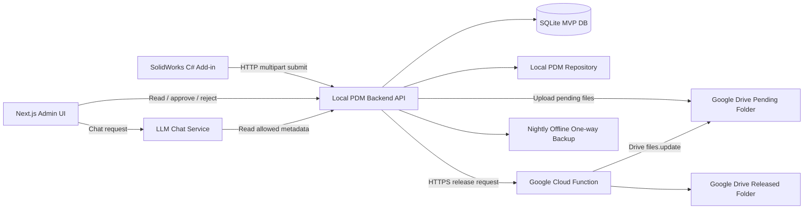
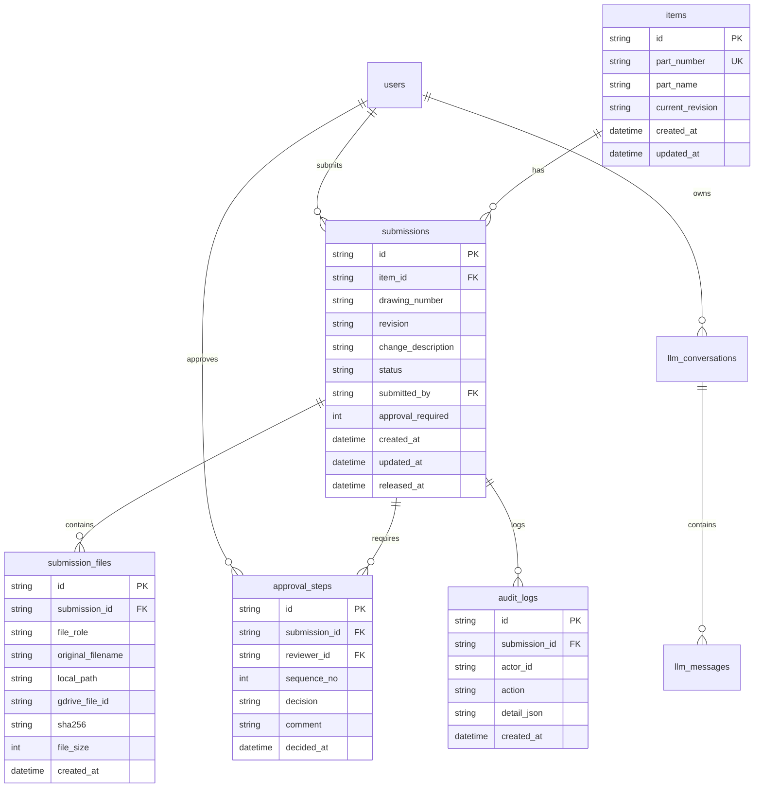

# AI PDM 系統設計文件

版本：v0.1  
日期：2026-05-15  
狀態：MVP 架構設計草案

## 1. 設計前提

本文件依照目前已確認的決策設計：

- CAD 端採用 SolidWorks C# Add-in。
- MVP 可先用 SQLite 取代 Supabase。
- 第一版 AI 功能先做 LLM 對話框，讓使用者可詢問 PDM 相關問題。
- 提交對象包含 SolidWorks 零件、組立、工程圖、PDF、DWG。
- 實際需提交哪些檔案由公司管理辦法人工控制，系統提供選取與檢核能力。
- 圖號 + 版次必須唯一。
- 料號必須唯一，但允許同一料號有多次送審與多個版次紀錄。
- 未來最多支援 2 位審核者。
- Google Drive Pending / Released 資料夾在文件中設計建立方式。

本次調用的思考習慣：

- #找對問題RightProblem：先區分 PDM 的核心不是「上傳檔案」，而是「版次、審核、權限、追溯」。
- #系統思考SystemsThinking：把 SolidWorks、SQLite、Web、Drive、Cloud Function、備份視為一條完整流程。
- #條件限制ConstraintSatisfaction：MVP 允許 SQLite，但需避免多台電腦直接寫同一 SQLite 檔。
- #風險緩解RiskMitigation：避免把 Google/Supabase 高權限憑證放到工程師 CAD 電腦。
- #受眾意識AudienceAware：以機械研發管理可理解、可驗收的方式描述架構。

## 2. 系統目標

### 2.1 MVP 目標

第一版要完成以下閉環：

1. 工程師在 SolidWorks 內使用 C# Add-in 提交設計資料。
2. Add-in 檢查必要屬性與變更原因。
3. Add-in 產生或收集 SW 零件檔、組立檔、工程圖、PDF、DWG。
4. Add-in 將檔案與表單資料送到本地 PDM Backend。
5. 本地 Backend 寫入 SQLite，並保存本地實體檔案。
6. 本地 Backend 將待審檔案上傳到 Google Drive Pending 資料夾。
7. 研發經理在 Web Admin UI 查看待審清單與預覽 PDF。
8. 研發經理核准後，系統呼叫 Google Cloud Function。
9. Cloud Function 將 Drive 檔案從 Pending 移到 Released，並寫入防偽中繼資料。
10. 本地 Backend 在 Cloud Function 成功後才把 SQLite 狀態更新為 Released。
11. Web Admin UI 提供 LLM 對話框，第一版先可查詢 PDM 狀態與規則。

### 2.2 非目標

MVP 暫不處理以下功能：

- 完整取代 SolidWorks PDM Professional。
- 複雜簽核流程，例如跨部門、多層級、會簽。
- 自動判斷哪些檔案一定要提交，第一版由人工管理辦法控制。
- 直接解析所有 CAD 幾何內容做 AI 審圖。
- 雲端同步硬碟。實體檔案必須保存在本地資料夾，並用離線單向備份。

## 3. 核心架構



### 3.1 為什麼 SQLite 前面需要 Local Backend

SQLite 是單檔資料庫，適合 MVP，但不適合讓多台工程師電腦直接同時寫入網路磁碟上的同一個 `.db` 檔。  
因此設計上必須讓所有寫入都經過一個 Local PDM Backend，讓它成為唯一寫入點。

這樣可以避免：

- 多人同時送審導致 SQLite lock。
- 工程師電腦直接接觸資料庫檔案。
- CAD Add-in 內散落大量資料庫邏輯。
- 未來從 SQLite 換成 Supabase/PostgreSQL 時重寫整個 CAD Add-in。

## 4. 元件設計

## 4.1 SolidWorks C# Add-in

### 職責

SolidWorks Add-in 只負責「收集、檢查、打包、送出」，不直接操作雲端資料庫或 Released 資料夾。

主要功能：

- 讀取目前開啟的 SolidWorks 文件。
- 支援文件類型：
  - `.sldprt` 零件
  - `.sldasm` 組立
  - `.slddrw` 工程圖
  - `.pdf`
  - `.dwg`
- 檢查必要自訂屬性。
- 顯示送審表單。
- 收集變更原因。
- 依人工管理辦法讓工程師勾選要提交的檔案。
- 需要時從工程圖匯出 PDF / DWG。
- 呼叫 Local PDM Backend `/api/submissions`。

### 必填屬性

建議標準欄位如下：

| 欄位 | 中文 | 必填 | 唯一性 |
|---|---|---:|---|
| `drawing_number` | 圖號 | 是 | `drawing_number + revision` 唯一 |
| `part_number` | 料號 | 是 | 對應 item master 唯一 |
| `part_name` | 品名 | 是 | 否 |
| `revision` | 版次 | 是 | 與圖號組合唯一 |
| `material` | 材質 | 是 | 否 |
| `surface_finish` | 表面處理 | 是 | 否 |
| `document_type` | 文件類型 | 是 | 否 |

### 變更原因檢核

`change_description` 必須符合：

- 去除前後空白後長度 5 到 100 字。
- 不可為純數字。
- 不可只填籠統文字，例如 `修改`、`變更`、`更新`、`調整`。
- 不可只輸入符號或空白。
- 建議要求描述格式：`變更位置 + 變更內容 + 原因`。

範例：

- 不合格：`修改`
- 不合格：`12345`
- 合格：`加大固定孔徑，配合新版治具定位銷`

### 提交流程

1. 工程師開啟 SolidWorks 文件。
2. 點擊 Add-in 的「送審」按鈕。
3. Add-in 讀取自訂屬性。
4. 若必要屬性缺漏，阻擋送審並列出缺漏欄位。
5. Add-in 顯示送審 UI：
   - 圖號
   - 料號
   - 品名
   - 版次
   - 文件類型
   - 變更原因
   - 檔案清單勾選
6. 工程師選擇本次要提交的 SW 零件檔、組立檔、工程圖、PDF、DWG。
7. Add-in 對工程圖執行 PDF / DWG 匯出。
8. Add-in 將資料與檔案用 HTTP multipart 上傳到 Local Backend。
9. Local Backend 回傳送審編號與狀態。

### Add-in 不應持有的東西

CAD 工程師電腦上不應保存：

- Google Drive Service Account key。
- Supabase service role key。
- Released 資料夾寫入權限。
- 可直接修改審核狀態的資料庫權限。

## 4.2 Local PDM Backend API

### 職責

Local Backend 是 MVP 的核心。它負責：

- 接收 CAD Add-in 提交。
- 做第二層資料檢核。
- 寫入 SQLite。
- 保存本地檔案。
- 上傳待審檔案到 Google Drive Pending。
- 提供 Web Admin UI API。
- 呼叫 Google Cloud Function 完成核准發布。
- 寫入稽核紀錄。

### 技術建議

因為 Web Admin UI 採 Next.js / React，MVP 可採：

- Next.js App Router
- Next.js Route Handlers 作為 API
- SQLite
- Prisma 或 Drizzle 作為資料庫存取層
- 本地檔案根目錄，例如 `D:\PDM_Repository`

也可以將 Backend 拆成獨立 Node.js API 或 .NET API，但 MVP 建議先與 Next.js 放在同一個專案，降低部署複雜度。

### 本地檔案目錄

建議：

```text
D:\PDM_Repository
  \pending
    \2026
      \05
        \SUB-20260515-0001
  \released
    \圖號
      \版次
  \rejected
  \archive
  \tmp
  \logs
```

命名原則：

```text
{drawing_number}_{revision}_{file_role}_{timestamp}.{ext}
```

範例：

```text
A-001_RevA_drawing_20260515-093000.pdf
A-001_RevA_source_20260515-093000.slddrw
A-001_RevA_model_20260515-093000.sldprt
```

### 狀態機

建議不要只用 `Pending | Released | Rejected`，MVP 至少使用以下狀態：

| 狀態 | 意義 |
|---|---|
| `Pending` | 已送審，等待審核 |
| `Releasing` | 主管已核准，正在搬移 Drive 檔案 |
| `Released` | 發布成功 |
| `Obsolete` | 已被同一 item 的新版 Released revision 取代 |
| `Rejected` | 駁回 |
| `ReleaseFailed` | 雲端發布失敗，需人工處理 |

原因：Web UI 要顯示 loading，且 Cloud Function 可能失敗。若沒有 `Releasing` / `ReleaseFailed`，很難區分「還在處理」和「已失敗」。
`Obsolete` 用於找圖與製造交接防錯版：內部仍保留追溯與下載，但交接、採購與外部分享只使用有效 `Released`。

## 4.3 SQLite 資料模型

### 主要資料表

MVP 建議分成以下表格：



### 關鍵限制

SQLite 應設定：

- `items.part_number` 唯一。
- `submissions.drawing_number + submissions.revision` 唯一。
- `submission_files.submission_id + file_role + original_filename` 避免同一次送審重複。
- `submissions.status` 使用 CHECK constraint 限制合法狀態。
- 所有核准、駁回、失敗都寫入 `audit_logs`。

### 檔案角色

`submission_files.file_role` 建議：

| file_role | 說明 |
|---|---|
| `sldprt` | SolidWorks 零件 |
| `sldasm` | SolidWorks 組立 |
| `slddrw` | SolidWorks 工程圖 |
| `pdf` | PDF 預覽或正式圖 |
| `dwg` | DWG 圖檔 |
| `other` | 預留 |

## 4.4 Next.js Admin UI

### 使用者

MVP 使用者角色：

| 角色 | 權限 |
|---|---|
| `Engineer` | 從 SolidWorks Add-in 送審，查看自己送審紀錄 |
| `R&D Manager` | 查看 Pending、核准、駁回 |
| `Admin` | 管理使用者、設定審核規則、檢視稽核紀錄 |

### 頁面

MVP 建議頁面：

| 頁面 | 功能 |
|---|---|
| `/login` | 登入 |
| `/submissions/pending` | 待審清單 |
| `/submissions/[id]` | 送審明細、檔案、歷史紀錄 |
| `/submissions/released` | 已發布清單 |
| `/settings` | 系統設定 |
| `/chat` 或右側抽屜 | LLM 對話框 |

### 待審清單欄位

- 圖號
- 料號
- 品名
- 版次
- 變更原因
- 提交者
- 提交時間
- 審核狀態
- 檔案數量

### 圖面預覽

優先順序：

1. 若已有 Google Drive PDF File ID，使用 Google Drive Viewer 或可預覽連結。
2. 若 Drive 尚未上傳成功，使用本地 Backend 提供的 PDF preview endpoint。
3. 若沒有 PDF，顯示「無 PDF 預覽」，但仍可下載其他檔案。

### 核准按鈕互動

核准流程：

1. 使用者點擊「核准」。
2. UI 顯示 loading，按鈕不可重複點擊。
3. UI 呼叫 Local Backend `/api/submissions/{id}/approve`。
4. Backend 將狀態改為 `Releasing`。
5. Backend 呼叫 Google Cloud Function。
6. Cloud Function 成功後回傳結果。
7. Backend 將狀態改為 `Released`。
8. Backend 更新 item master `current_revision`。
9. Backend 將同一 item 其他 `Released` revision 轉為 `Obsolete`，並寫入 `superseded_by_submission_id`、`obsolete_at`、`obsolete_by`。
10. UI 更新畫面。

若 Cloud Function 失敗：

1. Backend 將狀態改為 `ReleaseFailed`。
2. UI 顯示錯誤原因。
3. 管理員可重新執行發布。

### 兩位審核設計

MVP 預設 `approval_required = 1`。  
未來若需要兩位審核，改成 `approval_required = 2`，並使用 `approval_steps` 控制：

- 第 1 位審核者核准後，狀態仍為 `Pending` 或 `PartiallyApproved`。
- 第 2 位審核者核准後，才進入 `Releasing`。

若公司規則是「最多 2 位，但任一位可核准」，則 `approval_required` 保持 1 即可。

## 4.5 Google Drive 設計

### 資料夾結構

建議建立一個獨立的 Google Shared Drive 或專用資料夾：

```text
AI_PDM
  00_Pending
  10_Released
  90_Archive
  99_Error
```

MVP 只授權使用：

- `00_Pending`
- `10_Released`

`90_Archive`、`99_Error` 是未來版本覆蓋、舊檔封存、錯誤隔離時使用。若未來要啟用，需另行授權 Service Account，不應預先給過大權限。

### Service Account 權限

建議使用兩個 Service Account：

| Service Account | 用途 | Drive 權限 |
|---|---|---|
| `pdm-uploader` | 本地 Backend 上傳待審檔案 | 僅 `00_Pending` |
| `pdm-release-function` | Cloud Function 搬移與標記正式檔 | 僅 `00_Pending` 與 `10_Released` |

注意：Service Account 不給全域 Drive 管理權限。  
Drive API scope 應盡量使用最小可行範圍，資料夾存取則透過 Google Drive 分享權限限制在指定資料夾。

### Google Drive File ID 保存

每個提交檔案都保存：

- `gdrive_file_id`
- `local_path`
- `sha256`
- `file_role`
- `original_filename`

不要只保存一個 `file_id_gdrive`，因為一次送審會包含多個檔案。

## 4.6 Google Cloud Function

### 職責

Cloud Function 只做「雲端正式發布」：

- 驗證呼叫者權限。
- 接收 submission id 與 file ids。
- 檢查檔案目前在 Pending folder。
- 將指定檔案移動到 Released folder。
- 對 PDF 寫入數位防偽中繼資料。
- 回傳每個檔案的結果。

### API 輸入

範例：

```json
{
  "submissionId": "SUB-20260515-0001",
  "approvedBy": "研發經理",
  "drawingNumber": "A-001",
  "revision": "A",
  "files": [
    {
      "fileRole": "pdf",
      "gdriveFileId": "google-drive-file-id-1"
    },
    {
      "fileRole": "dwg",
      "gdriveFileId": "google-drive-file-id-2"
    }
  ]
}
```

### Drive 搬移

Google Drive 檔案搬移採用 Drive API `files.update`，透過 `addParents` 加入 Released folder，並透過 `removeParents` 移除 Pending folder。

### 防偽中繼資料

對 PDF 寫入 `appProperties`：

```json
{
  "ApprovedBy": "研發經理",
  "Status": "Official",
  "SubmissionId": "SUB-20260515-0001",
  "DrawingNumber": "A-001",
  "Revision": "A",
  "ApprovedAt": "2026-05-15T09:30:00+08:00"
}
```

建議不只 PDF，也可以對 DWG 與 SW source file 寫入相同 `appProperties`。  
但若公司正式判定只認 PDF，則至少 PDF 必須寫入。

### Idempotency

Cloud Function 必須可重試。  
若同一 submission 重複呼叫：

- 檔案已在 Released folder，視為成功。
- appProperties 已存在且內容一致，視為成功。
- 檔案不存在或不在授權資料夾內，回傳明確錯誤。

### 同名檔案處理

MVP 策略：

- 若 Released folder 已存在同名檔案，先阻擋發布並回傳 `DUPLICATE_RELEASE_FILENAME`。
- 人工確認後再處理。

未來策略：

- 舊檔移至 `90_Archive`。
- 或新檔以版本號覆蓋。
- 或使用 Google Drive revision 管理。

因為這會影響法規、稽核與責任歸屬，MVP 不自動覆蓋。

## 4.7 AI 助手設計

### MVP 目標

第一版 AI 助手先做「可問問題的 LLM 對話框」，不先做自動決策。

可回答問題範例：

- `目前有哪些待審圖面？`
- `A-001 目前最新版次是什麼？`
- `這次送審缺少哪些檔案？`
- `請幫我整理今天核准的項目。`
- `料號 P-1001 的歷史變更有哪些？`

### AI 助手放置位置

MVP 建議先放在 Web Admin UI：

- 右側抽屜式 chat panel。
- 可讀取目前頁面的 submission context。
- 可查 SQLite 中允許讀取的 metadata。

SolidWorks Add-in 內的 AI 對話框可作第二階段，因為它牽涉 Windows UI、CAD session context 與網路連線穩定性。

### AI 權限原則

AI 助手第一版只可：

- 查詢資料。
- 摘要資料。
- 解釋管理辦法。
- 提醒缺漏。

AI 助手第一版不可：

- 自動核准。
- 自動駁回。
- 自動刪除檔案。
- 自動改版次。
- 自動改 Google Drive 權限。

### AI 可用工具

MVP 可提供以下工具給 LLM：

| 工具 | 用途 |
|---|---|
| `search_submissions` | 查詢送審紀錄 |
| `get_submission_detail` | 查單筆送審明細 |
| `list_pending_reviews` | 列出待審 |
| `get_item_history` | 查料號歷史 |
| `explain_policy` | 解釋 PDM 管理辦法 |

### 資料外洩控制

預設不把 SW 原始檔、DWG、PDF 全文內容送給 LLM。  
第一版只送：

- 圖號
- 料號
- 品名
- 版次
- 變更原因
- 狀態
- 審核紀錄
- 檔案清單與 hash

若未來要做 AI 審圖或 PDF 解析，需另外設計資料脫敏與權限。

## 5. API 設計

### 5.1 CAD Add-in 提交

`POST /api/submissions`

Content-Type: `multipart/form-data`

欄位：

- `drawing_number`
- `part_number`
- `part_name`
- `revision`
- `material`
- `surface_finish`
- `change_description`
- `submitted_by`
- `files[]`

回應：

```json
{
  "submissionId": "SUB-20260515-0001",
  "status": "Pending"
}
```

### 5.2 待審清單

`GET /api/submissions?status=Pending`

### 5.3 取得單筆明細

`GET /api/submissions/{id}`

### 5.4 核准

`POST /api/submissions/{id}/approve`

輸入：

```json
{
  "reviewerId": "user-001",
  "comment": "確認可發布"
}
```

輸出：

```json
{
  "submissionId": "SUB-20260515-0001",
  "status": "Released"
}
```

### 5.5 駁回

`POST /api/submissions/{id}/reject`

輸入：

```json
{
  "reviewerId": "user-001",
  "reason": "缺少 DWG 檔案"
}
```

### 5.6 AI 對話

`POST /api/chat`

輸入：

```json
{
  "conversationId": "optional",
  "message": "目前有哪些待審圖面？",
  "context": {
    "currentSubmissionId": "optional"
  }
}
```

## 6. 安全設計

### 6.1 憑證管理

| 憑證 | 存放位置 | 誰可使用 |
|---|---|---|
| Google uploader service account | Local Backend server 環境變數或安全檔案 | Local Backend |
| Google release service account | Google Cloud Function runtime | Cloud Function |
| LLM API key | Local Backend server 環境變數 | Local Backend |
| SQLite 檔案 | Local Backend server | Local Backend |

CAD Add-in 不保存高權限憑證。

### 6.2 權限分層

- 工程師：只能提交與查看自己相關資料。
- 研發經理：可審核、駁回、查詢待審與已發布。
- Admin：可管理使用者與系統設定。
- Service Account：只可存取指定 Drive folder。

### 6.3 稽核

以下事件都要記錄：

- 登入
- 送審
- 屬性檢核失敗
- 檔案上傳成功/失敗
- Drive 上傳成功/失敗
- 核准
- 駁回
- Cloud Function 搬移成功/失敗
- AI 查詢紀錄

## 7. 備份設計

### 7.1 原則

- 不使用 Google Drive Desktop、OneDrive、Dropbox 等雲端同步硬碟。
- 本地 PDM Repository 是正式內部檔案庫。
- 每日半夜做單向離線備份到外接硬碟。
- 備份後產生 log 與 checksum。
- 外接硬碟不應長時間保持連線，降低誤刪、勒索軟體與同步覆蓋風險。

### 7.2 建議備份內容

- SQLite DB
- `D:\PDM_Repository`
- 系統設定檔
- Backend log
- Cloud Function 部署設定備份
- Google Drive folder ID 設定

### 7.3 備份策略

建議採「每日快照」而非單純鏡像：

```text
E:\PDM_Backup
  \2026-05-15
    \database
    \repository
    \logs
  \2026-05-16
    \database
    \repository
    \logs
```

理由：若使用鏡像模式，來源檔案被誤刪時，備份也可能在下一次同步被刪除。  
PDM 更重視追溯，因此快照比鏡像更安全。

## 8. Supabase 升級路徑

MVP 使用 SQLite，但資料模型要一開始就接近 PostgreSQL。

未來升級 Supabase 時：

1. 將 SQLite schema 轉成 PostgreSQL migration。
2. 將 Local Backend 的資料庫 adapter 從 SQLite 改成 PostgreSQL。
3. 使用 Supabase Auth 或既有公司帳號整合。
4. 對外露資料表啟用 Row Level Security。
5. 保留 Local File Repository，不改成雲端同步硬碟。

升級時，CAD Add-in 原則上不用大改，因為它只呼叫 Local Backend API。

## 9. 開發里程碑

### Phase 0：規格與管理辦法

- 定義圖號、料號、版次命名規則。
- 定義哪些情況需要提交 SW 零件、組立、工程圖、PDF、DWG。
- 定義審核 1 人或 2 人的正式規則。
- 定義 Released 後是否允許覆蓋。

### Phase 1：Local Backend + SQLite

- 建立 SQLite schema。
- 建立 submission API。
- 建立本地檔案保存。
- 建立 audit log。

### Phase 2：Next.js Admin UI

- 登入。
- 待審清單。
- 單筆送審明細。
- PDF 預覽。
- 核准與駁回。

### Phase 3：Google Drive Pending 上傳

- 建立 Drive folder。
- 建立 `pdm-uploader` Service Account。
- Backend 上傳檔案到 Pending。
- SQLite 保存 Drive File ID。

### Phase 4：Google Cloud Function 發布

- 建立 `pdm-release-function` Service Account。
- Cloud Function 搬移 Pending 到 Released。
- 寫入 appProperties。
- Backend 核准流程串接 Cloud Function。

### Phase 5：SolidWorks C# Add-in

- C# Add-in 基礎框架。
- 讀取 custom properties。
- 送審 UI。
- PDF / DWG 匯出。
- Multipart submit 到 Local Backend。

### Phase 6：AI 對話框

- Web Admin UI chat panel。
- LLM provider 設定。
- SQLite metadata 查詢工具。
- 對話紀錄保存。

### Phase 7：離線備份

- Windows Task Scheduler。
- 每日快照。
- 備份 log。
- checksum 驗證。
- 每月還原演練。

## 10. 風險與對策

| 風險 | 影響 | 對策 |
|---|---|---|
| SQLite 多人寫入鎖定 | 送審失敗或資料損壞 | 所有寫入集中到 Local Backend |
| CAD Add-in 存放雲端金鑰 | 權限外洩 | Add-in 不保存高權限憑證 |
| Drive 搬移成功但 DB 未更新 | 狀態不一致 | Backend 以交易流程與 retry 補償處理 |
| DB 已 Released 但 Drive 失敗 | 錯誤發布 | 只有 Cloud Function 成功後才改 Released |
| Released 同名檔案覆蓋 | 稽核風險 | MVP 先阻擋，自動封存留到第二版 |
| 備份同步誤刪 | 歷史資料遺失 | 使用每日快照，不用雙向同步 |
| AI 回答超出權限 | 錯誤決策或資料外洩 | AI 僅查詢與摘要，不允許核准/修改 |
| 圖號/料號規則不清 | 後續資料混亂 | Phase 0 先定義命名規則 |

## 11. 尚需確認事項

以下事項會影響實作細節：

1. 兩位審核者時，是「兩位都要核准」還是「任一位可核准」。
2. Released folder 內同名檔案，未來是封存舊檔、覆蓋版本，還是完全禁止。
3. PDF / DWG 是由工程圖自動匯出，還是允許工程師手動附加既有 PDF / DWG。
4. 圖號與料號是否永遠一對一，或一個料號可能對應多張圖。
5. SolidWorks 工程圖與零件/組立的關聯，是否有固定命名規則可自動尋找。
6. Web Admin UI 是只在公司內網使用，還是需要外網登入。
7. LLM 供應商要使用 OpenAI、Azure OpenAI、Gemini，還是本地模型。

## 12. 官方文件參考

- Google Drive API：檔案搬移可使用 `files.update` 搭配 `addParents` / `removeParents`。  
  https://developers.google.cn/workspace/drive/api/guides/folder
- Google Drive API：自訂檔案屬性可使用 `appProperties`。  
  https://developers.google.com/workspace/drive/api/guides/properties
- Google Cloud Functions：Cloud Functions / Cloud Run functions 的 IAM 與執行身分。  
  https://cloud.google.com/functions/docs/concepts/iam
- Supabase：Row Level Security 應用於對外暴露資料表。  
  https://supabase.com/docs/guides/database/postgres/row-level-security
- Supabase：Next.js server-side auth。  
  https://supabase.com/docs/guides/auth/server-side
- SolidWorks API：`IModelDocExtension.SaveAs3` 可用於另存與匯出。  
  https://help.solidworks.com/2020/English/api/sldworksapi/SolidWorks.Interop.sldworks~SolidWorks.Interop.sldworks.IModelDocExtension~SaveAs3.html
- SolidWorks API：`ICustomPropertyManager` 可讀寫自訂屬性。  
  https://help.solidworks.com/2019/english/api/sldworksapi/SOLIDWORKS.Interop.sldworks~SOLIDWORKS.Interop.sldworks.ICustomPropertyManager.html
