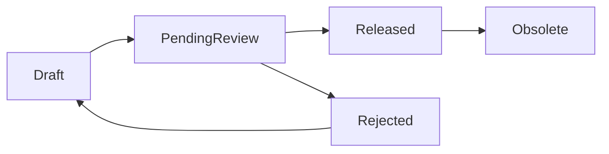

# SPEC-BOM-WORKBENCH-001：BOM 工作台

狀態：Implemented
日期：2026-05-30
關聯任務：`DEV-BOM-WORKBENCH-001`
適用模組：BOM 工作台、送審、BOM diff、Where-used、製造交接、採購匯出

## 1. 問題定義

目前系統已有由 CAD reference 自動建立 Engineering BOM draft、Dashboard BOM 呈現、BOM diff、Where-used 與匯出能力，但 BOM 仍偏向「送審明細內的附屬資料」。目標功能需要升級為獨立 BOM 工作台，讓工程、主管、製造、採購能以同一套正式產品結構協作。

真正要解決的問題不是「匯入 BOM」，而是：

- 建立、校正、審核與發布產品結構。
- 支援多來源 BOM 建立，並保留來源追溯。
- 讓人工拖拉編輯成為最終校正入口。
- 讓製造與採購只使用已發布 BOM，避免 Draft 外流。

## 2. 設計目標

- 建立獨立 `BOM 工作台` 模組。
- 支援三種 BOM 建立方式：
  - 匯入組合件時自動產生。
  - 匯入 SolidWorks 產出的 BOM XLS 檔。
  - 人工以滑鼠拖拉方式調整階層與數量。
- 操作心智採 Windows 檔案總管式樹狀結構。
- 支援多個 Draft、Active Draft、研發主管審核、Released Snapshot、Obsolete 舊版。
- 支援 BOM 版本管理、BOM diff、Where-used、Excel / CSV 匯出。
- 支援虛擬件 / 群組節點與本次編輯 session 的 Undo / Redo。

## 3. 非目標

第一版不做：

- 人工直接修改料號、品名、版次、材質、表面處理等 item master 屬性。
- 製造 / 採購檢視 Draft。
- Released BOM 原地修改。
- 將每一次拖拉操作都保存成可回復版本。
- 複雜 ECO 流程或跨部門多層會簽。
- 替代料、製程站別、包裝群組、位置碼等進階製造 BOM 欄位。

## 4. 使用者與權限

| 角色 | Draft 可見 | Released 可見 | 可編輯 Draft | 可指定 Active Draft | 可審核 | 可匯出 |
|---|---:|---:|---:|---:|---:|---:|
| 研發工程師 | 是 | 是 | 是 | 是 | 否 | Draft 可匯出預覽；Released 可匯出正式 |
| 研發主管 | 是 | 是 | 是 | 是 | 是 | 是 |
| 製造 | 否 | 是 | 否 | 否 | 否 | 是 |
| 採購 | 否 | 是 | 否 | 否 | 否 | 是 |
| Admin | 是 | 是 | 是 | 是 | 是 | 是 |

API 必須執行同樣權限控制，不能只靠 UI 隱藏 Draft。

## 5. BOM 生命週期



狀態說明：

| 狀態 | 說明 |
|---|---|
| `Draft` | 可編輯草稿 |
| `PendingReview` | 已送研發主管審核，不可編輯 |
| `Released` | 正式 BOM snapshot，製造 / 採購可見 |
| `Rejected` | 被退回，可原地修改後重新送審 |
| `Obsolete` | 被新版 Released BOM 取代 |
| `Archived` | 使用者封存，不再作業 |

規則：

- 同一組合件同一版次可有多個 Draft。
- 同一組合件同一版次只能有一個 Active Draft。
- 送審預設送出 Active Draft。
- 同一 parent item + revision 同時間只能有一個 `PendingReview` BOM。
- Released 後自動將同 parent item 的舊版 Released BOM 標記為 `Obsolete`。

## 6. 三種建立來源

### 6.1 組合件自動產生

來源：CAD reference / `.sldasm` / sidecar / native extractor。
用途：快速建立初版 Draft。
來源優先度：中。
限制：CAD 組合關係不一定等於製造 BOM，仍需人工確認。

### 6.2 SolidWorks BOM XLS 匯入

來源：SolidWorks 匯出的 BOM XLS。
用途：匯入工程師已整理過的 BOM。
來源優先度：高。
規則：

- XLS 匯入永遠建立新的 Draft，不覆蓋既有 Draft。
- 匯入格式固定，但必須支援格式版本。
- 匯入後保存原始 XLS、profile version、匯入者、匯入時間、轉換後 BOM lines。

### 6.3 人工拖拉編輯

來源：使用者在 BOM 工作台操作。
用途：最後校正階層與數量。
來源優先度：最高。
規則：

- 只能調整階層、排序、數量。
- 可從既有 BOM 節點內拖拉調整。
- 可從料號庫 / 圖面清單拖入子件。
- 若要換料號，必須移除舊子件再拖入新子件。
- 每次儲存寫入 audit log，送審時必填整體變更原因。

## 7. 衝突與合併規則

來源衝突優先權：

```text
manual > solidworks_xls > cad_reference
```

同一父層同料號同版次：

- 第一版預設自動合併數量。
- 合併鍵：`parent_line_id + child_part_number + child_revision`
- 拖入重複子件時不新增第二行，改為數量相加並提示。
- 例外分行留待第二版，因第一版不支援位置碼、工序或備註欄位。

## 8. 樹狀結構與限制

### 8.1 階層限制

- BOM 最大深度：10 層。
- 拖拉後超過 10 層時阻擋。
- XLS 匯入超過 10 層時匯入失敗並列出錯誤列。
- 組合件自動解析超過 10 層時建立 Draft 失敗或進入需修正狀態。

### 8.2 循環限制

不允許循環引用：

- A 包 B，B 不可再包 A。
- 拖拉與匯入都必須檢查。

### 8.3 Draft 引用規則

Draft 可引用：

- Released 子件。
- Pending 子件。
- Draft 子件候選。

發布前 Release Gate 必須阻擋：

- 子件不存在。
- 子件仍為 Pending。
- 子件為 Rejected。
- 子件為 Obsolete 且已有新版 Released。
- 子件版次與最新版 Released 不一致。

## 9. 虛擬件 / 群組節點

虛擬件用於 Windows 樹狀整理，不代表實際料號。

規則：

- 可作為父節點。
- 不需要料號、版次、Released 狀態。
- 第一版不設定數量，純群組用途。
- 可命名，例如「鎖固件」、「外殼件」、「電控模組」。
- 可拖拉、改名、刪除。
- 可包含實體子件或其他虛擬件。
- 最大深度仍受 10 層限制。
- 匯出時可顯示為群組列，但不納入採購數量。

刪除虛擬件時需提供：

- 連同子件刪除。
- 只刪除群組，子件上移一層。

## 10. UI 規格

### 10.1 主畫面

```text
BOM 工作台

左側：料號 / 圖面搜尋
- 搜尋料號
- 搜尋圖號
- 篩選 Released
- 拖入 BOM 樹

中間：BOM 樹狀編輯器
ASM-001 Rev B
├─ [群組] 鎖固件
│  ├─ P-2001 螺絲 x4
│  └─ P-2002 墊片 x4
├─ P-1002 支架 x2
└─ P-1003 外蓋 x1

右側：選取節點屬性
- 料號 / 群組名稱
- 品名
- 版次
- 數量
- 來源
- 最後修改者
- 差異警示

上方工具列：
[匯入組合件] [匯入 XLS] [新增群組] [復原] [重做] [儲存草稿] [送審] [比較版本] [匯出]
```

### 10.2 Draft 清單

```text
BOM 工作台 / ASM-001 Rev B

草稿清單
┌───────────────┬───────────────┬────────────┬──────────────┬────────┐
│ 草稿名稱       │ 來源           │ 建立者      │ 狀態          │ Active │
├───────────────┼───────────────┼────────────┼──────────────┼────────┤
│ CAD Auto #1    │ 組合件解析     │ 系統        │ Draft         │        │
│ XLS Import #2  │ SolidWorks XLS │ 王工程師    │ Draft         │        │
│ Manual #3      │ 人工整理       │ 李工程師    │ Draft         │ 是     │
└───────────────┴───────────────┴────────────┴──────────────┴────────┘
```

操作：

- 開啟。
- 比較。
- 複製成新草稿。
- 設為 Active。
- 送審 Active Draft。

### 10.3 Undo / Redo

支援本次編輯 session：

| 操作 | Undo / Redo |
|---|---|
| 拖拉改父層 | 是 |
| 拖拉排序 | 是 |
| 修改數量 | 是 |
| 新增虛擬件 | 是 |
| 刪除虛擬件 | 是 |
| 從料號庫拖入子件 | 是 |
| 從 BOM 移除子件 | 是 |
| 匯入 CAD / XLS 建立 Draft | 否，因會建立新 Draft |
| 送審 / 核准 / 發布 | 否，只能退回或新版本 |

快捷鍵：

- `Ctrl+Z`：復原。
- `Ctrl+Y` 或 `Ctrl+Shift+Z`：重做。

未儲存變更離開頁面時必須提示。

## 11. 主管審核

主管審核主要看與上一版 Released BOM 的差異，不以整張 BOM 全量表格作為第一畫面。

差異類型：

| 類型 | 範例 |
|---|---|
| 新增子件 | `+ P-1004 x2` |
| 移除子件 | `- P-1002` |
| 數量變更 | `P-2001 x4 -> x6` |
| 階層變更 | `P-3001 從 P-1002 底下移到 ASM-001 底下` |
| 版次變更 | `P-1005 Rev A -> Rev B` |

人工覆寫紀錄放第二層供追溯，不作主管第一審核畫面的主內容。

## 12. 匯出

Released BOM Snapshot 才能提供製造 / 採購正式匯出。

格式：

- Excel `.xlsx`
- CSV `.csv`

固定檔名：

```text
BOM_{part_number}_Rev{revision}_{YYYYMMDD}.xlsx
BOM_{part_number}_Rev{revision}_{YYYYMMDD}.csv
```

範例：

```text
BOM_ASM-001_RevB_20260530.xlsx
BOM_ASM-001_RevB_20260530.csv
```

第一版欄位：

| 欄位 | 說明 |
|---|---|
| `level` | 階層 |
| `line_no` | 行號 |
| `parent_part_number` | 父件料號 |
| `child_part_number` | 子件料號 |
| `child_part_name` | 子件品名 |
| `child_revision` | 子件版次 |
| `quantity` | 數量 |
| `source` | 來源 |
| `released_at` | BOM 發布時間 |
| `approved_by` | 核准者 |

## 13. 資料模型草案

需要將目前 `bom_headers` / `bom_lines` 升級為可支援多 Draft、樹狀、審核與 Released Snapshot 的模型。

建議資料表：

- `bom_drafts`
- `bom_lines_tree`
- `bom_import_profiles`
- `bom_import_jobs`
- `bom_edit_events`
- `bom_review_requests`
- `bom_release_snapshots`

`bom_lines_tree` 必要欄位：

| 欄位 | 說明 |
|---|---|
| `id` | line id |
| `bom_draft_id` | 所屬 draft |
| `parent_line_id` | 上層 line；root 子件為 null |
| `node_type` | `item` 或 `group` |
| `item_id` | 實體料號節點才需要 |
| `part_number` | 實體料號快照 |
| `revision` | 子件版次 |
| `group_name` | 群組節點名稱 |
| `quantity` | 實體子件數量；群組為 null |
| `sequence_no` | 同父層排序 |
| `source` | `cad_reference` / `solidworks_xls` / `manual` |
| `source_priority` | 來源優先權 |
| `source_ref_id` | 對應 CAD reference / import row |
| `created_by` | 建立者 |
| `updated_by` | 最後修改者 |

## 14. API 草案

| API | 用途 |
|---|---|
| `GET /api/bom/workbench?partNumber=&revision=` | 取得組合件 BOM 工作台摘要 |
| `POST /api/bom/drafts/from-assembly` | 由組合件 / CAD references 建立 Draft |
| `POST /api/bom/drafts/import-xls` | 匯入 SolidWorks BOM XLS 建立新 Draft |
| `GET /api/bom/drafts/[id]` | 取得 Draft 樹狀資料 |
| `PATCH /api/bom/drafts/[id]` | 儲存 Draft 樹狀資料 |
| `POST /api/bom/drafts/[id]/active` | 設為 Active Draft |
| `POST /api/bom/drafts/[id]/submit-review` | 送研發主管審核 |
| `POST /api/bom/reviews/[id]/approve` | 主管核准並發布 Snapshot |
| `POST /api/bom/reviews/[id]/reject` | 主管退回 |
| `GET /api/bom/drafts/[id]/diff` | 與上一版 Released BOM 比對 |
| `GET /api/bom/releases/[id]/export?format=xlsx|csv` | 匯出正式 BOM |

## 15. 驗收標準

功能：

- 可由 CAD references 建立 BOM Draft。
- 可由 SolidWorks BOM XLS 建立新 Draft，且保存 import profile version。
- 可同一組合件建立多個 Draft。
- 可指定 Active Draft，送審預設使用 Active Draft。
- 可用拖拉調整階層、排序與數量。
- 可從料號庫 / 圖面清單拖入 Released 或 Pending 子件。
- 同父層同料號同版次預設合併數量。
- 可新增、改名、刪除虛擬群組。
- 支援 Undo / Redo 與未儲存離開提示。
- 研發主管審核可看到與上一版 Released BOM 的差異。
- 發布前阻擋缺件、Pending、Rejected、Obsolete、非最新版 Released 子件。
- 發布後舊版 Released BOM 自動 Obsolete。
- 製造 / 採購不可讀取 Draft API，也不可在 UI 看到 Draft。
- Released BOM 可匯出 Excel 與 CSV，檔名固定。

品質：

- `npm.cmd run lint` 通過。
- `npm.cmd run build` 通過。
- BOM API regression 覆蓋匯入、拖拉保存、Release Gate、審核、匯出、權限。
- UI E2E 覆蓋 Windows 樹狀拖拉、Undo / Redo、Active Draft、主管審核差異、製造 / 採購只讀 Released。

## 16. 思考習慣對應

- `#rightproblem`：核心是產品結構治理，不只是匯入 BOM。
- `#systemmapping`：三種來源進入同一 BOM canonical model。
- `#dataviz`：Windows 樹狀、diff、警示與 Release Gate 視覺化。
- `#designthinking`：以工程師快速建立、主管快速審核、製造採購安全使用為主流程。
- `#constraints`：Released 不可改、最大 10 層、不可循環、製造採購不可看 Draft。
- `#modeling`：多 Draft、樹狀 line、Import Profile、Released Snapshot。
- `#decisiontrees`：來源衝突採 `manual > xls > cad_reference`。
- `#testability`：每個狀態與權限都可由 API/UI 測試驗證。
