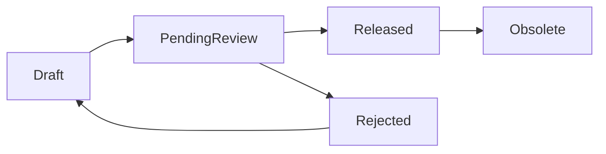

# SPEC-BOM-WORKBENCH-001：BOM 工作台

狀態：DEV-104 Current Presentation `RD Implementation Ready / Human Confirmed 01A-02A-03A-04B-05A-06A / Local RD Eligible / RD Not Started` / DEV-096 domain authority preserved / DEV-060 create contract retired
日期：2026-05-30
關聯任務：`DEV-BOM-WORKBENCH-001`、`DEV-PDM-BOM-MODULE-ENTRY-001` / `DEV-060`、`DEV-104 / DEV-PDM-BOM-WORKBENCH-V2-001`
適用模組：BOM 工作台、送審、BOM diff、Where-used、製造交接、採購匯出

> 2026-08-10 Amendment：本文件所有「料號版次／子件版次／同料號同版次」舊語意，均由
> `ADR-PDM-MATERIAL-IDENTITY-REVISION-001` 修訂。Part Number 是無版次的物料身份；Drawing 與 BOM
> 是各自獨立版控的受控工程定義。第17節曾是`DEV-060`的RD Implementation Contract，現已由DEV-095退役，
> 只保留legacy implementation evidence；不得再作current建立、ownership或source authority。

> 2026-08-24 Current Authority Amendment：DEV-060的建立入口、CAD／XLS source及assembly auto-writer已由DEV-095退役。新組立件建立、stable BOM Definition／logical line、one-open Revision、初版／下一版同writer、多Parent applicability、component candidate／exact mapping、schema-v2 review／release evidence、完整archive／restore／obsolete lifecycle及exact-parent export/where-used以`SPEC-PDM-ASSEMBLY-BOM-REBUILD-001`與`ADR-PDM-BOM-STRUCTURE-SHARING-001`為準，且已達RD Implementation Ready。本文件只保留不衝突的generic editor／review／release基線；第17節的single `owner_part_number_id` write authority、manual set-active、所有`/bom/new`與三來源建立段落均屬歷史，不得實作成DEV-096相容分支。

> 2026-08-28 DEV-104 Current Presentation Amendment：使用者確認階層表／Outliner為唯一可寫primary editor；Map只作選配的唯讀瀏覽、選取與定位；Floating Topic保留為收合的進階Draft staging。desktop完整編輯，tablet／phone只讀／審核／匯出；Current Phase只處理核心workbench與既有shared BOM lifecycle。104-A～D可在內部依序實作，但只有aggregate QA/QC全數通過後才一次切換，不建立`/bom/workbench-v3`；legacy ReactFlow／XMind presentation通過parity gate後在同一DEV移除，不保留一個release cycle的可寫fallback。第18節是current presentation與RD implementation authority；與第10節legacy主畫面、`SPEC-BOM-VISUAL-EDITOR-001` XMind-first空間契約衝突時，以第18節為準。DEV-071的Floating persistence、editor version、transaction、semantic history與server fail-closed，以及DEV-096的domain／permission／review／release／snapshot authority全部保留。

## 1. 問題定義

目前系統已有由 CAD reference 自動建立 Engineering BOM draft、Dashboard BOM 呈現、BOM diff、Where-used 與匯出能力，但 BOM 仍偏向「送審明細內的附屬資料」。目標功能需要升級為獨立 BOM 工作台，讓工程、主管、製造、採購能以同一套正式產品結構協作。

真正要解決的問題不是「匯入 BOM」，而是：

- 建立、校正、審核與發布產品結構。
- 支援多來源 BOM 建立，並保留來源追溯。
- 讓人工拖拉編輯成為最終校正入口。
- 讓製造與採購只使用已發布 BOM，避免 Draft 外流。

## 2. 設計目標

- 建立獨立 `BOM 工作台` 模組。
- 支援三種 BOM 建立方式：
  - 匯入組合件時自動產生。
  - 匯入 SolidWorks 產出的 BOM XLS 檔。
  - 建立空白 BOM 草稿，再人工以滑鼠拖拉方式建立階層與數量。
- 操作心智採 Windows 檔案總管式樹狀結構。
- 支援多個 Draft、Active Draft、研發主管審核、Released Snapshot、Obsolete 舊版。
- 支援 BOM 版本管理、BOM diff、Where-used、Excel / CSV 匯出。
- 支援虛擬件 / 群組節點與本次編輯 session 的 Undo / Redo。

## 3. 非目標

第一版不做：

- 人工直接修改料號身份、品名、材質、表面處理等 item master 屬性；Part Number 本身不存在 Revision。
- 製造 / 採購檢視 Draft。
- Released BOM 原地修改。
- 將每一次拖拉操作都保存成可回復版本。
- 複雜 ECO 流程或跨部門多層會簽。
- 替代料、製程站別、包裝群組、位置碼等進階製造 BOM 欄位。

## 4. 使用者與權限

| 角色 | Draft 可見 | Released 可見 | 可編輯 Draft | 可指定 Active Draft | 可審核 | 可匯出 |
|---|---:|---:|---:|---:|---:|---:|
| 研發工程師 | 是 | 是 | 是 | 是 | 否 | Draft 可匯出預覽；Released 可匯出正式 |
| 研發主管 | 是 | 是 | 是 | 是 | 是 | 是 |
| 製造 | 否 | 是 | 否 | 否 | 否 | 是 |
| 採購 | 否 | 是 | 否 | 否 | 否 | 是 |
| Admin | 是 | 是 | 是 | 是 | 是 | 是 |

API 必須執行同樣權限控制，不能只靠 UI 隱藏 Draft。

## 5. BOM 生命週期



狀態說明：

| 狀態 | 說明 |
|---|---|
| `Draft` | 可編輯草稿 |
| `PendingReview` | 已送研發主管審核，不可編輯 |
| `Released` | 正式 BOM snapshot，製造 / 採購可見 |
| `Rejected` | 被退回，可原地修改後重新送審 |
| `Obsolete` | 被新版 Released BOM 取代 |
| `Archived` | 使用者封存，不再作業 |

規則：

- 同一 owner Part Number、同一 BOM Revision 可有多個 Draft。
- 同一 owner Part Number、同一 BOM Revision 只能有一個 Active Draft。
- 送審預設送出 Active Draft。
- 同一 owner Part Number + BOM Revision 同時間只能有一個 `PendingReview` BOM。
- Released 後自動將同 owner Part Number 的舊 BOM Revision Released Snapshot 標記為 `Obsolete`。

## 6. 三種建立來源

### 6.1 組合件自動產生

來源：CAD reference / `.sldasm` / sidecar / native extractor。
用途：快速建立初版 Draft。
來源優先度：中。
限制：CAD 組合關係不一定等於製造 BOM，仍需人工確認。

### 6.2 SolidWorks BOM XLS 匯入

來源：SolidWorks 匯出的 BOM XLS。
用途：匯入工程師已整理過的 BOM。
來源優先度：高。
規則：

- XLS 匯入永遠建立新的 Draft，不覆蓋既有 Draft。
- 匯入格式固定，但必須支援格式版本。
- 匯入後保存原始 XLS、profile version、匯入者、匯入時間、轉換後 BOM lines。

### 6.3 空白人工 BOM

來源：先為 canonical owner Part Number 建立空白 Draft，再由使用者在 BOM 工作台操作。
用途：沒有 CAD/XLS 來源時從零建立，也作為所有來源的最後校正入口。
來源優先度：最高。
規則：

- 建立空白 Draft 仍必須先指定 owner Part Number 與獨立 BOM Revision；不需要偽造 Drawing submission。
- 只能調整階層、排序、數量。
- 可從既有 BOM 節點內拖拉調整。
- 可從料號庫 / 圖面清單拖入子件。
- 若要換料號，必須移除舊子件再拖入新子件。
- 每次儲存寫入 audit log，送審時必填整體變更原因。

## 7. 衝突與合併規則

來源衝突優先權：

```text
manual > solidworks_xls > cad_reference
```

同一父層同 Part Number identity：

- 第一版預設自動合併數量。
- 合併鍵：`parent_line_id + child_part_number`
- 拖入重複子件時不新增第二行，改為數量相加並提示。
- 例外分行留待第二版，因第一版不支援位置碼、工序或備註欄位。

## 8. 樹狀結構與限制

### 8.1 階層限制

- BOM 最大深度：10 層。
- 拖拉後超過 10 層時阻擋。
- XLS 匯入超過 10 層時匯入失敗並列出錯誤列。
- 組合件自動解析超過 10 層時建立 Draft 失敗或進入需修正狀態。

### 8.2 循環限制

不允許循環引用：

- A 包 B，B 不可再包 A。
- 拖拉與匯入都必須檢查。

### 8.3 Draft 引用規則

Draft 可引用：

- Released 子件。
- Pending 子件。
- Draft 子件候選。

發布前 Release Gate 必須阻擋：

- 子件不存在。
- 子件身份尚未達可用狀態。
- 子件為 Rejected、Obsolete、Merged 或 MainDrawingInvalid。
- 若設定快照明確固定 Drawing/BOM definition revision，該受控定義不存在、未 Released 或解析不唯一。

BOM line 不得以 `child_revision` 表示 Part Number Revision；需要固定定義時，必須使用獨立受控參照或 Released Snapshot。

## 9. 虛擬件 / 群組節點

虛擬件用於 Windows 樹狀整理，不代表實際料號。

規則：

- 可作為父節點。
- 不需要料號、版次、Released 狀態。
- 第一版不設定數量，純群組用途。
- 可命名，例如「鎖固件」、「外殼件」、「電控模組」。
- 可拖拉、改名、刪除。
- 可包含實體子件或其他虛擬件。
- 最大深度仍受 10 層限制。
- 匯出時可顯示為群組列，但不納入採購數量。

刪除虛擬件時需提供：

- 連同子件刪除。
- 只刪除群組，子件上移一層。

## 10. UI 規格

### 10.1 主畫面

```text
BOM 工作台

主視覺：全寬 BOM 清單
- 搜尋 Part Number、品名、BOM Rev
- 依 BOM lifecycle 狀態篩選
- 從同一清單開啟 Draft／PendingReview／Rejected／Released／Obsolete
- 建立 BOM 由 `/bom/new` 進入
- 點選清單列後導向獨立 `/bom/workbench/<draftId>`，清單頁不直接展開編輯器

獨立編輯頁 `/bom/workbench/<draftId>`：BOM 樹狀編輯器
ASM-001 / BOM Rev 1
├─ [群組] 鎖固件
│  ├─ P-2001 螺絲 x4
│  └─ P-2002 墊片 x4
├─ P-1002 支架 x2
└─ P-1003 外蓋 x1

右側 Drawer：選取節點屬性
- 料號 / 群組名稱
- 品名
- BOM Rev；若有受控來源，Drawing Rev 另列且不可混稱料號版次
- 數量
- 來源
- 最後修改者
- 差異警示

上方工具列：
[匯入組合件] [匯入 XLS] [新增群組] [插入料件] [復原] [重做] [儲存草稿] [送審] [比較版本] [匯出]
```

「插入料件」開啟右側選料 Drawer，提供料號／品名／圖號搜尋與可插入結果；點選結果後，若目前選取群組則加入該群組，否則加入主件，
只修改目前 BOM 草稿並標示未儲存，必須由使用者明確儲存才寫入草稿。

工作台不得常駐第二份「料號／圖面搜尋」側欄；Part Number owner 與來源選擇統一在 `/bom/new` 完成，
續作頁把首要寬度與視覺層級保留給 BOM 清單。若未來需要新增子件搜尋，必須以不壓縮主清單的 drawer／command surface
另案設計，不得直接恢復雙欄常駐版面。

`/bom/workbench` 是純清單 surface，不渲染編輯工具列、BOM 畫布或節點屬性 Drawer；上述內容只在
`/bom/workbench/<draftId>` 載入。編輯頁必須提供明確「返回 BOM 清單」，但不再顯示重複的頁名／副標、研發階段摘要卡、
正常載入成功提示或「已刪除資料」區塊；BOM 標題、主件、圖號與 BOM 數必須整合在單一 `BOM 基本資料` 橫列，
再進入工具列與畫布，不得用多張摘要卡分開佔版位。錯誤與阻擋訊息仍須可見。
舊 `/bom/workbench?draftId=<id>` 只作相容 redirect，不再是 canonical URL。

畫布節點採「料號／群組名稱為主、品名為次」的最小可辨識內容；BOM Rev、子件 Rev、數量與階層層級不在節點常駐顯示，
需要查閱時由節點 Drawer 提供。節點來源 badge（例如手動）仍可保留，供判斷資料來源。

### 10.2 BOM 清單（與圖號工作清單共用元件）

`BOM 工作台` 不建立第二份「BOM 草稿清單」或獨立入口。Draft、PendingReview、Rejected、Released、Obsolete
都出現在同一份 BOM 清單，以 lifecycle 狀態標示；Archived 不出現在主清單，也不在 BOM 編輯頁提供 recovery surface。

清單外殼、table semantics、選取列、鍵盤操作、loading／empty state 與 RWD 必須和「圖號工作台」共用同一個
`PdmWorkbenchList` 元件；兩個模組只透過 columns／row renderer／資料查詢替換內容，不得複製另一份 table markup。
圖號工作台顯示圖號、品名、料號與工作狀態；BOM 工作台顯示 owner Part Number、品名／BOM 名稱、BOM Rev、項目數與工作狀態。

```text
BOM 工作台

BOM 清單
┌───────────────┬────────────────────┬──────────────────┬──────────────┐
│ 料號           │ 品名 / BOM          │ BOM 定義          │ 工作狀態      │
├───────────────┼────────────────────┼──────────────────┼──────────────┤
│ ASM-001        │ 主組立 / CAD Auto #1│ BOM Rev 1・12 項  │ 草稿・目前使用 │
│ ASM-001        │ 主組立 / Review #2 │ BOM Rev 2・14 項  │ 審核中         │
│ ASM-001        │ 主組立 / Released  │ BOM Rev 0・10 項  │ 已發布         │
└───────────────┴────────────────────┴──────────────────┴──────────────┘
```

操作：

- 開啟：導向 `/bom/workbench/<draftId>` 獨立編輯頁。
- 比較。
- 複製成新草稿。
- 設為 Active。
- 送審 Active Draft。

### 10.3 Undo / Redo

支援本次編輯 session：

| 操作 | Undo / Redo |
|---|---|
| 拖拉改父層 | 是 |
| 拖拉排序 | 是 |
| 修改數量 | 是 |
| 新增虛擬件 | 是 |
| 刪除虛擬件 | 是 |
| 從料號庫拖入子件 | 是 |
| 從 BOM 移除子件 | 是 |
| 匯入 CAD / XLS 建立 Draft | 否，因會建立新 Draft |
| 送審 / 核准 / 發布 | 否，只能退回或新版本 |

快捷鍵：

- `Ctrl+Z`：復原。
- `Ctrl+Y` 或 `Ctrl+Shift+Z`：重做。

未儲存變更離開頁面時必須提示。

## 11. 主管審核

主管審核主要看與上一版 Released BOM 的差異，不以整張 BOM 全量表格作為第一畫面。

差異類型：

| 類型 | 範例 |
|---|---|
| 新增子件 | `+ P-1004 x2` |
| 移除子件 | `- P-1002` |
| 數量變更 | `P-2001 x4 -> x6` |
| 階層變更 | `P-3001 從 P-1002 底下移到 ASM-001 底下` |
| 受控定義參照變更 | `P-1005 的 Drawing/BOM definition reference 由 Rev 1 -> Rev 2` |

人工覆寫紀錄放第二層供追溯，不作主管第一審核畫面的主內容。

## 12. 匯出

Released BOM Snapshot 才能提供製造 / 採購正式匯出。

格式：

- Excel `.xlsx`
- CSV `.csv`

固定檔名：

```text
BOM_{part_number}_BOM-Rev{bom_revision}_{YYYYMMDD}.xlsx
BOM_{part_number}_BOM-Rev{bom_revision}_{YYYYMMDD}.csv
```

範例：

```text
BOM_ASM-001_BOM-Rev1_20260530.xlsx
BOM_ASM-001_BOM-Rev1_20260530.csv
```

第一版欄位：

| 欄位 | 說明 |
|---|---|
| `level` | 階層 |
| `line_no` | 行號 |
| `parent_part_number` | 父件料號 |
| `child_part_number` | 子件料號 |
| `child_part_name` | 子件品名 |
| `child_drawing_revision` / `child_bom_revision` | 選配的受控定義快照證據；不得解釋為 Part Number Revision |
| `quantity` | 數量 |
| `source` | 來源 |
| `released_at` | BOM 發布時間 |
| `approved_by` | 核准者 |

## 13. 資料模型草案

需要將目前 `bom_headers` / `bom_lines` 升級為可支援多 Draft、樹狀、審核與 Released Snapshot 的模型。

建議資料表：

- `bom_drafts`
- `bom_lines_tree`
- `bom_import_profiles`
- `bom_import_jobs`
- `bom_edit_events`
- `bom_review_requests`
- `bom_release_snapshots`

`bom_lines_tree` 必要欄位：

| 欄位 | 說明 |
|---|---|
| `id` | line id |
| `bom_draft_id` | 所屬 draft |
| `parent_line_id` | 上層 line；root 子件為 null |
| `node_type` | `item` 或 `group` |
| `item_id` | 實體料號節點才需要 |
| `part_number` | 實體料號快照 |
| `revision` | Legacy deprecated；不得再寫入 Part Number Revision。新模型若需固定定義版次，使用獨立受控參照。 |
| `group_name` | 群組節點名稱 |
| `quantity` | 實體子件數量；群組為 null |
| `sequence_no` | 同父層排序 |
| `source` | `cad_reference` / `solidworks_xls` / `manual` |
| `source_priority` | 來源優先權 |
| `source_ref_id` | 對應 CAD reference / import row |
| `created_by` | 建立者 |
| `updated_by` | 最後修改者 |

## 14. API 草案

| API | 用途 |
|---|---|
| `GET /api/bom/workbench?draftId=` | 取得指定 BOM Draft；legacy `submissionId` 僅作相容 adapter |
| `POST /api/bom/drafts/from-assembly` | 由組合件 / CAD references 建立 Draft |
| `POST /api/bom/drafts/import-xls` | 匯入 SolidWorks BOM XLS 建立新 Draft |
| `GET /api/bom/drafts/[id]` | 取得 Draft 樹狀資料 |
| `PATCH /api/bom/drafts/[id]` | 儲存 Draft 樹狀資料 |
| `POST /api/bom/drafts/[id]/active` | 設為 Active Draft |
| `POST /api/bom/drafts/[id]/submit-review` | 送研發主管審核 |
| `POST /api/bom/reviews/[id]/approve` | 主管核准並發布 Snapshot |
| `POST /api/bom/reviews/[id]/reject` | 主管退回 |
| `GET /api/bom/drafts/[id]/diff` | 與上一版 Released BOM 比對 |
| `GET /api/bom/releases/[id]/export?format=xlsx|csv` | 匯出正式 BOM |

## 15. 驗收標準

功能：

- 可由 CAD references 建立 BOM Draft。
- 可由 SolidWorks BOM XLS 建立新 Draft，且保存 import profile version。
- 可同一組合件建立多個 Draft。
- 可指定 Active Draft，送審預設使用 Active Draft。
- 可用拖拉調整階層、排序與數量。
- 可從料號庫 / 圖面清單拖入 Released 或 Pending 子件。
- 同父層同 Part Number identity 預設合併數量，合併鍵不得包含 Part Number Revision。
- 可新增、改名、刪除虛擬群組。
- 支援 Undo / Redo 與未儲存離開提示。
- 研發主管審核可看到與上一版 Released BOM 的差異。
- 發布前阻擋缺件、Pending、Rejected、Obsolete、非最新版 Released 子件。
- 發布後舊版 Released BOM 自動 Obsolete。
- 製造 / 採購不可讀取 Draft API，也不可在 UI 看到 Draft。
- Released BOM 可匯出 Excel 與 CSV，檔名固定。

品質：

- `npm.cmd run lint` 通過。
- `npm.cmd run build` 通過。
- BOM API regression 覆蓋匯入、拖拉保存、Release Gate、審核、匯出、權限。
- UI E2E 覆蓋 Windows 樹狀拖拉、Undo / Redo、Active Draft、主管審核差異、製造 / 採購只讀 Released。

## 16. 思考習慣對應

- `#rightproblem`：核心是產品結構治理，不只是匯入 BOM。
- `#systemmapping`：三種來源進入同一 BOM canonical model。
- `#dataviz`：Windows 樹狀、diff、警示與 Release Gate 視覺化。
- `#designthinking`：以工程師快速建立、主管快速審核、製造採購安全使用為主流程。
- `#constraints`：Released 不可改、最大 10 層、不可循環、製造採購不可看 Draft。
- `#modeling`：多 Draft、樹狀 line、Import Profile、Released Snapshot。
- `#decisiontrees`：來源衝突採 `manual > xls > cad_reference`。
- `#testability`：每個狀態與權限都可由 API/UI 測試驗證。

## 17. Historical：2026-08-10 DEV-060 建立入口 RD Implementation Contract（已由DEV-095退役）

本節只供migration與歷史追溯。Current create／ownership／applicability／release consumer contract固定讀`SPEC-PDM-ASSEMBLY-BOM-REBUILD-001`；不得執行本節`/bom/new`、三來源、single owner或CAD/XLS writer條款。

### 17.1 Human Decision Brief

| 決策 | 人類確認結果 | 實作含義 |
|---|---|---|
| 入口方案 | `1A`：方案 B 的獨立兩步驟全頁流程 | 新增 `/bom/new`，不把建立流程塞回工作台首屏 |
| 身份／版次 | Part Number 無 Revision；Drawing、BOM 各自有 Revision | owner 改為 canonical Part Number；BOM Rev 不再來自 submission Rev |
| 第一版來源 | `3B`：CAD、SolidWorks XLS、空白人工三種都做 | 必須新增 generic manual create，不能只包裝既有兩支 API |

本次 Spec Impact Preflight 為 `Intentional replacement + cross-spec convergence`：建立入口本身是 compatible extension，
但既有 BOM persistence 將 submission/drawing revision 當成 owner revision，與人類確認的身份規則衝突，必須在同一 DEV
完成語意與相容遷移，不得只新增 UI 後繼續寫入錯誤模型。

### 17.2 產品目標與成功條件

使用者從側欄即可分辨三個任務：

1. `建立 BOM`：為既有 Part Number 建立指定 BOM Revision 的新 Draft。
2. `BOM 工作台`：搜尋、續作與管理既有 Draft／Released Snapshot。
3. `BOM 審核`：進入 canonical `/approvals?domain=bom`，不建立第二套審核 authority。

`BOM 工作台` 只保留一份全狀態 BOM 清單，並與「圖號工作台」共用工作清單元件；草稿是 lifecycle 狀態，
不是另一個清單、tab 或側欄入口。

主內容採單欄全寬；舊「料號／圖面搜尋」常駐側欄移除，BOM 清單為第一視覺層級。
清單與編輯分成兩個 route surface：`/bom/workbench` 僅掃描／篩選／選擇，`/bom/workbench/<draftId>` 才續作、
刪除／還原與編輯。不得因選取列而在清單下方原地展開畫布。

成功不是「多一顆按鈕」，而是所有三種來源都建立出相同 canonical ownership 的 Draft，且任何 Drawing/CAD submission
都只能是來源證據，不能決定 owner 或 BOM Revision。

### 17.3 資訊架構與兩步驟流程

#### Step 1：選擇建立路徑

入口先以三個並列區塊分流，讓使用者不會把既有 BOM 誤判為新的建立候選：

- `從已偵測的組合件建立`：只列同 company、可讀且有 `.sldasm` 或 `assembly_component` 證據的 canonical Part Number；同 owner 已有 `Draft / PendingReview / Rejected` 等進行中草稿時，不再列為新建候選。
- `建立全新空白 BOM`：列同 company、狀態可用且沒有進行中草稿的 canonical Part Number；選定後以 server 回傳的 `suggestedBomRevision` 預填 BOM Rev，可直接建立 `source=manual`、零 line Draft。
- `已有 BOM 草稿`：列可讀的 `Draft / PendingReview / Rejected`，提供續作／回到該 Draft 的入口；這些 owner 同時從前兩個新建候選排除。

搜尋可同時縮小組合件、空白 BOM 候選與既有草稿；結果顯示 Part Number、品名與必要狀態，不顯示「料號 Rev」。
BOM Rev 仍使用既有 numeric revision grammar，suggestion 只能依 BOM history 計算，禁止讀 Drawing/submission revision。
若使用者需保留既有入口能力，空白 BOM 區塊另提供次要 `匯入 XLS` 路徑，帶入同一 owner 與 BOM Rev 後進入 Step 2；`建立空白 BOM` 是該區塊唯一 primary action。

#### Step 2：選擇來源並確認

三張互斥 source card：

- `從 CAD 組合件建立`：選擇同 company、與 owner Part Number 關聯且 actor 可讀的 submission；摘要分開顯示 Drawing Number / Drawing Rev。
- `匯入 SolidWorks BOM XLS`：選檔後顯示檔名、大小、profile/version 與 validation；檔內 owner mismatch 必須阻擋或要求人工修正來源，不得改寫 Step 1 owner。
- `建立空白 BOM`：不需 submission/file，直接建立 `source=manual`、零 line Draft。

建立前摘要固定依序顯示：

```text
物料身份：A0005-P01 馬達（料號無版次）
BOM Rev：1
建立來源：CAD / SolidWorks XLS / 空白人工
來源證據：A0005-M01 Drawing Rev 0.2（只有 CAD 時顯示）
建立結果：1 份可追溯 BOM Draft
```

全頁每一條建立路徑只保留一個 primary CTA：組合件路徑進入 Step 2 的 `下一步：選擇來源`；空白路徑的 `建立空白 BOM`；Step 2 的 `建立 BOM 草稿`。`匯入 XLS`、`取消`／`上一步`為 secondary。
不得恢復使用者已要求刪除的流程定位 strip，或顯示 `Current / Next / 5 steps` 等內部流程雜訊。

### 17.4 Canonical Data Contract

#### 新寫入 authority

`bom_drafts`、`bom_release_snapshots` 與 import/effect evidence 必須至少具有：

| 欄位 | 契約 |
|---|---|
| `company_id` | tenant boundary；由 server context 決定，不接受 client 任意指定 |
| `owner_part_number_id` | FK `part_numbers.id`；BOM owner 唯一 authority |
| `bom_revision` | 必填，BOM 自己的 revision；不得由 submission revision 預填／覆寫 |
| `source` | `cad_reference / solidworks_xls / manual` |
| `source_submission_id` | nullable；只作 CAD/Drawing source evidence |
| `idempotency_effect_id` | 指向唯一 create effect/receipt |
| `identity_authority` | 新資料固定 `canonical_part_number`；legacy migration 可標示來源 |

新增 `bom_create_effects`：

```text
id, company_id, actor_id, idempotency_key, request_fingerprint,
draft_id, outcome_json, created_at
UNIQUE(company_id, actor_id, idempotency_key)
```

同 key、同 fingerprint 重送回傳同一 receipt/draft；同 key、不同 fingerprint 回 `409 BOM_CREATE_IDEMPOTENCY_CONFLICT`。
資料寫入 Draft、lines/import job、effect receipt 必須同 transaction 成功；不得先建 orphan Draft 再補 owner。

#### 唯一性與 line identity

- Active/Pending uniqueness 改為 `owner_part_number_id + bom_revision`，不再使用 `parent_item_id + parent_revision`。
- `bom_lines_tree.revision`、`bom_lines.child_revision` 為 legacy deprecated；新寫入固定 null。
- 同父層合併鍵固定 `parent_line_id + child_part_number`。
- 若未來需鎖定 Drawing/child BOM revision，另建 first-class controlled definition reference；不得把版次放回 Part Number identity。

#### Legacy 相容遷移

採 additive-first、dry-run-first：

1. 以 `items.company_id + items.part_number` 對 `part_numbers.company_id + part_numbers.part_number` 建立 deterministic crosswalk。
2. 唯一匹配時回填 `owner_part_number_id`；零匹配或衝突列為 `manual_review` 並阻擋 apply。
3. 保存原 `parent_submission_id` 為 `source_submission_id`，保存 `submissions.revision` 為 legacy source Drawing Rev evidence。
4. 為歷史 BOM revision 建立排序報告；只有同 owner 序列無衝突時，才可一次性把 legacy `parent_revision` 採認為初始 `bom_revision`，並寫 audit reason `legacy_submission_revision_adopted_as_initial_bom_revision`。
5. `parent_item_id / parent_submission_id / parent_revision` 轉為 nullable deprecated compatibility fields；所有新 write/query/index 改讀 canonical 欄位。
6. 歷史 Released Snapshot、Where-used 與 audit event 不刪除、不重寫；dry-run 前後 count/hash 必須一致。
7. migration 可重跑且 effect 為 0；任何 `manual_review`、duplicate owner+revision 或 missing FK 時 fail closed，不允許猜測。

預定 migration artifacts：

- `db/postgres/028_bom_material_identity_revision.sql`
- `supabase/migrations/20260810010000_bom_material_identity_revision.sql`
- `supabase/migrations/manifest.json` 與 runtime migration sync registration
- `db/schema.sql`、`src/lib/db.ts` 的 SQLite 等價 schema/bootstrap

本 DEV 只授權本機／isolated migration 實作與驗證；live Cloud SQL、Supabase 或 production apply 仍需 release gate 明確授權。

### 17.5 API Contract

#### `GET /api/bom/create-context`

Query：`query`、`limit`、既有 company context selector。回應：

```json
{
  "parts": [{
    "id": "part-number-id",
    "partNumber": "A0005-P01",
    "partName": "馬達",
    "recordStatus": "Released",
    "itemKind": "manufactured"
  }],
  "selected": {
    "ownerPartNumberId": "part-number-id",
    "bomHistory": [],
  "suggestedBomRevision": "1",
    "eligibleCadSources": []
  }
}
```

Part search 可重用 numbering repository/service，但 BOM endpoint 必須套用 BOM create permission 與 company scope，不得由 client
直接推斷 eligibility。

#### `POST /api/bom/drafts`

供 `manual` 與 `cad_reference` 使用：

```json
{
  "ownerPartNumberId": "part-number-id",
  "bomRevision": "1",
  "source": "manual",
  "sourceSubmissionId": null,
  "draftName": "A0005-P01 BOM 1",
  "setActive": true,
  "idempotencyKey": "uuid"
}
```

- `manual` 必須拒絕非 null source submission。
- `cad_reference` 必須要求 source submission，並驗證 company、actor visibility 與 submission/part relation；mismatch 回 409。
- 新 effect 回 `201`；冪等 replay 回 `200` 且 `replayed=true`。成功回應固定含 `draftId`、owner、`bomRevision`、source、receipt 與 workbench URL。

#### `POST /api/bom/drafts/import-xls`

保留 multipart/JSON adapter，但必填新增 `ownerPartNumberId`、`bomRevision`、`idempotencyKey`；`sourceSubmissionId` 改為選配來源證據。
檔案 policy、profile/version、解析錯誤與原始 asset traceability 維持既有 authority。解析、Draft、import job 與 effect receipt 同 transaction；
parser 失敗不得留下 Draft。

#### Compatibility adapters

- `POST /api/bom/drafts/from-assembly` 暫時保留，轉入同一 canonical create service；只能從 submission 解析 owner，不能再把 submission revision 當 BOM revision。舊 request 缺 `bomRevision` 時回明確 422，不得靜默沿用 Drawing Rev。
- `GET /api/bom/workbench` canonical selector 為 `draftId`；legacy `submissionId` 只可讀到已映射資料並回 deprecated metadata。
- 新 UI 建立成功導向 `/bom/workbench/<draftId>`；hard reload 必須由 server authoritative readback 恢復。舊 query URL 僅作 redirect 相容。

#### Error Contract

| HTTP/code | 使用者文案／復原 |
|---|---|
| 400 `BOM_OWNER_REQUIRED` / `BOM_REVISION_INVALID` | 回 Step 1，focus 第一個無效欄位 |
| 403 `BOM_CREATE_FORBIDDEN` | `你沒有建立 BOM 草稿的權限`；保留查閱入口 |
| 404 `BOM_OWNER_NOT_FOUND` | `找不到這個料號，請重新選擇` |
| 409 `BOM_OWNER_SOURCE_MISMATCH` | `來源圖面不屬於所選料號`；不得自動換 owner |
| 409 `BOM_CREATE_IDEMPOTENCY_CONFLICT` | 重新查詢建立結果；不得直接再送新 key |
| 413 upload policy | 顯示允許大小／格式，保留 Step 1 選擇 |
| 422 `BOM_LEGACY_IDENTITY_UNCLASSIFIED` | 唯讀舊資料並指示 Admin 完成分類，不猜測 |
| 500/timeout/response loss | 顯示 `建立結果尚未確認` 並以原 key readback；禁止自動建立第二份 |

### 17.6 Permission Contract

- `Engineer`：可為同 company 且符合下列任一條件的 Part Number 建 Draft：`part_numbers.created_by = actor.id`；或存在同 company、`submitted_by = actor.id` 的 submission，且該 submission 的 `submission_part_scopes.part_number_id` 明確包含 owner；legacy 無 scope 時才可用 `submissions.item_id -> items.part_number` 與 canonical part number exact match。CAD source 另外仍須通過既有 submission visibility。
- `R&D Manager`、`Admin`：可為其可管理 company 的 eligible Part Number 建 Draft。
- `Manufacturing`、`Procurement`：只能讀 Released Snapshot，不得看／建 Draft。
- 新增 server helper `canCreateBomDraftAsync(user, ownerPartNumber, sourceSubmission?)`，並由 create-context 與所有 create adapters 共用上述同一 predicate；sidebar visibility 不得代替 API permission。
- `BOM 審核` 沿用 approval platform permission；沒有 review permission 時入口隱藏或 disabled-with-reason，但不得顯示可點後才 403 的假 affordance。
- 所有 owner/source/draft/readback 必須驗證 company；client 傳入 company ID 不能覆蓋 authenticated context。

### 17.7 Repo / Module Impact

| Slice | 預期檔案／責任 |
|---|---|
| Navigation | `src/components/sidebar-nav.tsx`：新增三入口與 active state；BOM 審核連 canonical query |
| Create UI | 新增 `src/app/bom/new/page.tsx`、`src/components/bom-create-workflow.tsx`：兩步驟、三來源、summary/recovery |
| Shared work list | `src/components/pdm-workbench-list.tsx`：圖號與 BOM 共用 table／selection／keyboard／loading／empty／RWD 骨架，只替換 columns 與 row content |
| Workbench list | `src/app/bom/workbench/page.tsx`：`/bom/workbench` 只顯示全狀態 BOM 清單；列選取導向獨立編輯 route |
| Workbench editor | `src/app/bom/workbench/[draftId]/page.tsx`：`/bom/workbench/<draftId>` 為 canonical deep link；承載單一 BOM 基本資料橫列、工具列、畫布與 Drawer；舊 query URL redirect 相容 |
| API | 新增 `src/app/api/bom/create-context/route.ts`、`src/app/api/bom/drafts/route.ts`；更新既有 from-assembly/import/workbench routes |
| Domain service | `src/lib/bom-workbench-async.ts`、新增 `src/lib/bom-revision-policy.ts` 與 canonical create/readback service |
| Persistence | `src/lib/repositories/bom-workbench-async-repository.ts`、`bom-repository.ts`、必要 type mapper；sync/async 必須同語意 |
| Permission | `src/lib/permissions.ts`；必要時擴充 BOM page permission code，但不複製 numbering authority |
| Schema | `db/schema.sql`、`src/lib/db.ts`、PostgreSQL 028、Supabase mirror/manifest/sync script |
| Production guard | `src/lib/production-slice.ts` 維持 BOM 未開放；本 DEV 不擴充 production allowlist |
| QC | 新增 `scripts/qc-dev-060-bom-entry-contract.mjs`、`...-http.mjs`、`...-real-operation.mjs` 與 package scripts |

RD 必須先以 `rg` 確認實際 helper/repository 名稱；若責任已移動，可改檔名但不得改變上述 owner/API/migration/permission contract。

### 17.8 Failure Recovery And Atomicity

- CTA 送出後立即 disabled；同一 UI attempt 固定沿用同一 idempotency key。
- client timeout 不顯示單純「失敗」；先以 receipt/key 做 authoritative readback，再決定成功、可安全重試或需人工確認。
- CAD/XLS parser 或 line persistence 失敗時 transaction rollback，effect 可記 failed outcome 但不得留下可見 orphan Draft。
- 建立成功後 navigation 失敗，使用者可從 receipt 或工作台清單找到同 Draft；Back/Forward/hard reload 不重送 POST。
- migration failure 必須 rollback；dry-run report、count/hash 與 manual-review rows 保存為證據，禁止自動清理歷史。

### 17.9 Implementation Phases

1. **Phase 1A — Identity/migration foundation**：schema、crosswalk dry-run、canonical repository read/write、legacy adapter；Gate 1 通過才進入下一階段。
2. **Phase 1B — API/permission/idempotency**：create-context、generic create、XLS canonical fields、effect receipt、error mapping；Gate 2 通過。
3. **Phase 1C — Navigation/UI/workbench handoff**：方案 B 兩步驟、三來源、`draftId` deep link、canonical approval link；Gate 3/5 通過。
4. **Phase 1D — Integration/QA/QC**：既有 BOM review/release/export/read permission 改讀 canonical fields，完成治理負向案例、regression 與 isolated cleanup；全部 Gate 通過才可宣稱 DEV-060 local implementation complete。

不可只完成 1C UI 就標示完成；1A/1B 是防止持續製造錯誤身份資料的前置 Gate。

### 17.10 Acceptance And Evidence

驗收依 `.ai-doc/qa/qa-dev-060-bom-entry-material-identity-validation-plan-2026-08-10.md`，最低必須證明：

- 三入口清楚可達，兩步驟、三來源皆由真實 UI 成功建立。
- 所有新 Draft 具有 canonical owner Part Number 與獨立 BOM Rev；manual source 的 submission 為 null。
- Drawing Rev、BOM Rev 可各自改變且不推動 Part Number revision；身份條件改變時改走新 Part Number。
- double click、retry、response loss effect count 恆為 1。
- Engineer/R&D Manager/Admin 正向與 Manufacturing/Procurement/cross-company 負向權限通過。
- migration dry-run、manual-review fail-closed、Released history count/hash 不變。
- 1440×900、1024×768、390×844 無 overflow/裁切；visible error/console/network 無非預期錯誤。
- `typecheck`、affected lint、新 focused QCs 與既有 BOM regression 全數 PASS；isolated evidence 顯示 `productionConnected=false`、`productionWrites=false`、`cleanupStatus=removed`。

### 17.11 RD Readiness / Stop Conditions

人類決策已關閉：入口採 1A、身份規則依 ADR、來源採 3B。route、schema、migration、permission、idempotency、error、QA與file impact均已依本契約實作並完成本機驗證，沒有未解P0/P1 implementation drift。

RD 遇到以下任一情況必須停止並回報，不得自行縮小規則：

- 無法建立 `part_numbers` canonical owner，只能繼續用 submission 作 owner。
- legacy migration 需要猜測 BOM Rev、刪除／覆寫 Released history 或出現 owner+revision 衝突。
- 三種來源不能共用同一 create/effect authority，或 parser transaction 無法避免 orphan Draft。
- permission/company boundary 只能靠 UI，API 無法 fail closed。
- 需要改 BOM approval authority、開放 production slice、live migration、deploy 或 production mutation。

### 17.12 Execution / Release Boundary

`DEV-060` 已依 Phase 1A→1D 完成本機產品碼、isolated SQLite migration/runtime、forward PostgreSQL/Supabase migration artifacts與 QA/QC。這不等於 live migration 或 release；未執行 production data mutation、stage/commit、merge、PR、deploy、production smoke或 release，production仍由 `DEV-032` 與 deployment release gate管制。

### 17.13 Local Implementation Evidence（2026-08-10）

- `/bom/new` 採兩步驟全頁，Step 1選 canonical Part Number owner與獨立 BOM Rev，Step 2支援 CAD、SolidWorks XLS、空白人工；三來源均由真實 UI 建立並以 `draftId` 交接工作台。
- 新 write authority為 `owner_part_number_id + bom_revision`；manual來源的 submission為 null，新 BOM line不保存 Part Number revision。相同 idempotency key同 fingerprint重播同 receipt；不同 payload回409。
- server拒絕已占用或非 forward BOM Rev，建議值會跳過尚未封存的既有 Draft；Drawing Rev不參與 BOM Rev計算。
- canonical review/release、Released CSV export與Manufacturing唯讀權限已通過；具有子件但 `line.revision=null` 的 canonical BOM可依子件已發行工程定義通過 release gate。
- `npm.cmd run qc:dev-060-bom-create` 50/50、`npm.cmd run qc:bom-workbench-migration-path` 21/21、TypeScript與 affected ESLint均通過；三 viewport無水平 overflow，browser console error與HTTP 5xx皆為0。
- isolated evidence：`productionConnected=false`、`productionWrites=false`、`cleanupStatus=removed`。報告見 `.ai-doc/qc/qc-dev-060-bom-entry-material-identity-validation-report-2026-08-10.md`。
- Spec Drift Check：原 submission-bound ownership與「料號版次」語意已由 ADR intentional replacement；active runtime新路徑無未解 P0/P1 drift，legacy fields僅保留相容讀取。

## 18. DEV-104 BOM 工作台 V2 Current Presentation RD Contract

### 18.1 Readiness、Human Decision與Authority

- 成熟度：`RD Implementation Ready / Human Confirmed / Local RD Eligible / RD Not Started / Production Release Gated`。
- DEV：`DEV-104 / DEV-PDM-BOM-WORKBENCH-V2-001`。
- `HD-104-01=A`：階層表／Outliner是primary editor；Map是optional view；Floating Topic保留為收合的進階Draft staging。
- `HD-104-02=A`：desktop完整編輯；tablet／phone只讀BOM、diff、審核與基本匯出。
- `HD-104-03=A`：Current Phase只收斂核心workbench與既有shared BOM lifecycle。
- `HD-104-04=B`：Map是唯讀adapter，只可瀏覽、選取、摺疊、聚焦、縮放與定位；任何structure／quantity／mapping修改都切回Outliner並保留selection與Parent context。
- `HD-104-05=A`：legacy ReactFlow／XMind presentation在DEV-104 parity gate通過後同階段移除；不得保留可寫fallback或長期雙軌。
- `HD-104-06=A`：104-A～D只作內部分期；新工作台必須在DEV-104 aggregate QA/QC全數通過後一次切換，不逐slice對使用者開放，也不建立平行V3 route。
- Human decision gaps：`0`。§18.13～18.18已鎖定exact file responsibility、typed command／state、retirement順序、
  feature compatibility、failure recovery、fixture與固定48-case runner denominator，無P0／P1 readiness缺口。
- 本文件成熟度允許RD直接接手本機實作，但本輪仍是文件工作；尚未修改產品、測試、schema、資料、runtime、flag或release狀態。

Authority順序：

1. Identity、Definition、Revision、applicability、logical line、mapping、permission、review／release、snapshot及exact Parent projection：
   `SPEC-PDM-ASSEMBLY-BOM-REBUILD-001`與既有accepted ADR。
2. Current workbench presentation、UI entry、view priority、responsive capability與Current Phase acceptance：本第18節。
3. Floating persistence、formal＋floating atomic save、editor version、history atom與server fail-closed：
   `SPEC-BOM-VISUAL-EDITOR-001`中不與本節衝突的資料／行為契約。

Spec Impact：`Intentional replacement / Cross-spec convergence`。本節取代第10節legacy ReactFlow主畫面與DEV-071 XMind-first／fixed-toolbar／Map-primary呈現，
不取代DEV-071 Floating資料契約，也不改DEV-096 domain authority。`ADR not needed`：決策只改presentation priority與client responsibility，
不改長期identity、lifecycle、資料模型、permission或Released consumer contract。

### 18.2 Current Architecture Impact

Repository fact finding（2026-08-28）：

- `src/app/bom/workbench/page.tsx`約2,046行：同一client component負責list／detail route辨識、legacy submission搜尋、
  legacy ReactFlow、Draft state、lifecycle、diff、drawer及V2 feature分流；`[draftId]/page.tsx`只re-export同一頁。
- `src/components/bom-editor/bom-xmind-editor.tsx`約1,254行：同時負責snapshot/history、save、Map、Outliner、Floating、
  Inspector、shared mapping、review、export與lifecycle menu。現行`bom-outliner.tsx`只有tree render、select、collapse與edit callback，
  尚未獨立承接完整結構編輯。
- `GET/PATCH /api/bom/drafts/[draftId]`已提供read、`expectedEditorVersion`、formal lines、floating topics、components與shared permission；
  repository已提供Definition、logical line、exact mapping、diff、review／release與Released projection。
- 現行問題不是缺少新資料模型，而是presentation、view state、domain command與lifecycle composition未分層。

Current Phase architecture decision：

```text
Part drawer / BOM list
          │ normal UI entry
          ▼
Workbench route shell ─── read models: list / detail / diff / released projection
          │
          ▼
Single editor controller + typed canonical commands
          ├── Outliner adapter（primary）
          ├── Map adapter（optional）
          └── Context inspector / lifecycle actions
          │
          ▼
Existing BOM API → existing capability resolver → existing repository/domain authority
```

不得建立plugin framework、通用workflow builder、第二套editor store、第二個save endpoint或view-specific persistence。

### 18.3 Current Phase Scope與Out of Scope

Current Phase：

1. `/bom/workbench`全狀態清單與`/bom/workbench/[draftId]`detail／editor責任真正分離。
2. Outliner-first desktop editor：insert、remove、reparent、reorder、quantity、group、Undo／Redo、dirty guard與keyboard flow。
3. Map作secondary read-only view，共用相同selection、collapse、context Parent、dirty、history、lines、floating topics及components；
   不得dispatch結構、數量、群組、mapping或formal／floating mutation。
4. Floating作advanced staging；count=0不常駐，count>0顯示一個blocking count與定位入口。
5. single Parent／fixed line安靜；multi-Parent／by-parent line才顯示variant candidates、exact mapping與unresolved定位。
6. 現有save、diff、submit、review decision、release、next revision、archive／restore、whole-Definition obsolete、export與where-used呈現收斂。
7. desktop與窄版能力邊界、角色可見性、錯誤／恢復、accessibility及真實delivery-path evidence。

Out of scope：

- 新schema／table／column／migration、public endpoint、permission role、lifecycle state或Released Snapshot shape。
- CAD／SolidWorks XLS／AI parser、source suggestion、accept-diff或自動materialize formal BOM。
- MBOM、routing、work center、庫存、成本、包裝、損耗、供應商替代料或ERP欄位。
- 跨root sharing、Released Parent removal、detach／fork與partial obsolete。
- 多層會簽、代理簽核、dynamic workflow designer或新approval authority。
- 以250 Parents／5,000 nodes／100,000 resolved rows作主要UX；DEV-096 bounded safety limits仍保留。
- production migration、flag activation、正式資料變更、deploy或release。

### 18.4 UI Entry Contract與Route Boundary

| Actor | Normal start | Entry | Destination／capability |
|---|---|---|---|
| Engineer | canonical Part workbench | exact assembly Part drawer的`建立 BOM／開啟 BOM` | desktop Draft edit；窄版read/diff |
| R&D Manager／Admin | Part workbench、BOM list或approval inbox | 同上，或list row／pending review item | desktop edit或review；依capability顯示decision |
| Manufacturing／Procurement | Released consumer surface或BOM list | exact Parent Released row／export | Released projection與正式匯出；無Draft detail |

- `/bom/workbench`只呈現搜尋、status filter、Definition／Revision row與續作；不渲染editor toolbar、canvas、Inspector或legacy submission library。
- `/bom/workbench/[draftId]`呈現單一context bar、單一primary work surface、按需Inspector與情境式secondary actions。
- `parentPartNumberId`若存在，必須屬於explicit binding；只切換resolved preview／mapping context，不建立第二棵tree。
- legacy`?draftId=`只可redirect到canonical detail route；legacy`submissionId`只作既有資料相容讀取，不是V2 normal entry。
- Direct URL能開啟只證明route可達；QC必須從上述normal entry操作到destination。

載入、empty、error與return：

- loading保留context／work surface骨架，不以全頁成功訊息或多張摘要卡替代內容。
- empty Draft只顯示「尚無料件」與一個適用的insert action；沒有空toolbar、教學卡與下一步面板。
- 錯誤靠近受影響work surface並保留dirty state；可見`HTTP 4xx/5xx`、route error、load failed、unexpected zero-data皆為QC fail。
- 返回list、切Parent、切route、archive、submit與next revision都經同一dirty guard；不得靠view-specific handler各自處理。

### 18.5 UX Intent與View Contract

- 使用者／任務：鉦富研發工程師在desktop維護受控EBOM；主管以差異與影響Parent審核；製造／採購只使用正式投影。
- 成功結果：不使用Map也能完成Draft建立至送審；Released使用者取得exact Parent、可重現且immutable的結果。
- 主物件／主焦點：logical BOM hierarchy。正常狀態只有一個primary action。
- 預設刪除：常駐search sidebar、XMind固定52px十slot要求、MiniMap、Floating第二畫布、說明卡、成功宣告、
  source／Rev／status badge堆疊、等權重diff／gate／export／archive surfaces與重複頁首。
- 保留舉證：dirty、unresolved mapping、Floating count、replacement reconfirm、impact Parent、stale conflict與不可逆lifecycle會造成資料遺失、
  formal ambiguity或錯誤發行，必須有單一可見訊號與定位／恢復；其他資訊按需取得。

Outliner contract：

- desktop預設進Outliner；root與每一logical line使用同一tree semantics，顯示辨識／比較必需欄位：階層、料號／群組、品名、數量與必要exception。
- row selection開啟／更新同一context Inspector；item master欄位唯讀，Current Phase只可改quantity、group與structure commands。
- 可由mouse與keyboard完成insert sibling／child、reparent、reorder、delete single／branch、formal↔floating、Undo／Redo。
- unresolved mapping與floating blocker必須可聚焦到exact logical line／topic；不能只顯示全域數字。

Map contract：

- 由secondary`檢視`控制開啟；不是primary CTA、不是default desktop state，也不要求XMind exact slot／位置／品牌肌肉記憶。
- Map是唯讀adapter，只可瀏覽、選取、摺疊、分支聚焦、縮放、fit view與unresolved定位；`nodesDraggable=false`，
  不渲染新增、拖曳、刪除、context mutation、inline edit、quantity或mapping control。
- Map與Outliner不得各自持有或轉譯第二份domain state。切換後selection、collapse、focus、dirty、history、context Parent、
  unresolved定位與server version保持；Map顯示的資料必須直接由同一`BomEditorDocument`投影。
- 使用者從Map要求修改時，只提供一個「在階層表編輯」handoff；切回Outliner後保留exact selection與Parent context，
  不在Map模擬低頻編輯或建立view-specific command。

Floating contract：

- 既有`bom_draft_floating_topics`、`editor_version`、logical ID、coordinates、formal↔floating conversion與atomic PATCH全數保留。
- count=0時advanced staging不占常駐surface；使用者透過`插入 → 暫存料件`或情境命令開啟。
- count>0時顯示一個`未納入 BOM (n)` blocker與`定位`；Outliner按需展開第二區，Map按需顯示staging。
- submit、approve／release與formal Draft export仍由server fail closed；UI不能把收合解釋為完成，也不能自動刪除或猜Parent。

### 18.6 Canonical Command、State與Error Contract

client state分成可保存文件、semantic history、非持久view state與save session；不得把selection／collapse混入PATCH，
也不得讓server `editor_version`被Undo回舊值：

```ts
type BomEditorDocument = {
  lines: BomEditorLine[];
  floatingTopics: BomEditorFloatingTopic[];
  components: BomEditorSharedComponent[];
};

type BomEditorViewState = {
  mode: "outliner" | "map";
  selectedId: string | null;
  collapsedIds: string[];
  focusedBranchId: string | null;
  contextParentPartNumberId: string | null;
  floatingExpanded: boolean;
  inspectorOpen: boolean;
};

type BomEditorSession = {
  document: BomEditorDocument;
  history: BomEditorHistory<BomEditorDocument>;
  view: BomEditorViewState;
  editorVersion: number;
  saveState: "idle" | "saving" | "conflict" | "error";
  error: { code: string; message: string } | null;
};
```

semantic command union固定為：

```ts
type BomEditorCommand =
  | { type: "line.insert"; location: "formal" | "floating"; parentId: string | null; afterId: string | null; node: BomEditorInsertNode }
  | { type: "line.remove"; id: string; mode: "single" | "branch" }
  | { type: "line.reparent"; id: string; parentId: string | null; index: number }
  | { type: "line.reorder"; id: string; index: number }
  | { type: "line.quantity.set"; id: string; quantity: number }
  | { type: "line.group.rename"; id: string; groupName: string }
  | { type: "line.location.move"; id: string; to: "formal" | "floating"; parentId: string | null; index: number; rootPosition?: { x: number; y: number } }
  | { type: "component.mapping.select"; logicalLineId: string; parentPartNumberId: string; childPartNumberId: string }
  | { type: "history.undo" }
  | { type: "history.redo" };

type BomEditorViewAction =
  | { type: "selection.set"; id: string | null }
  | { type: "collapse.toggle"; id: string }
  | { type: "focus.set"; id: string | null }
  | { type: "context-parent.set"; partNumberId: string | null }
  | { type: "view.set"; mode: "outliner" | "map" }
  | { type: "floating.expanded.set"; expanded: boolean }
  | { type: "inspector.set"; open: boolean };
```

- 只有Outliner／Inspector可dispatch semantic command；Map只dispatch `BomEditorViewAction`。
- reducer必須是pure function，不得呼叫fetch、router、permission resolver、toast或ReactFlow instance。
- 每個有效semantic command形成一個history atom；selection、collapse、focus、view與Inspector不進history、不改dirty。
- reducer需維持id唯一、parent存在、無cycle、formal／floating parent同location、positive finite quantity、同parent連續`sequence_no`、
  branch刪除同步移除components、formal↔floating同步更新`node_location`等invariants；無效command回typed local error且state不變。
- save serializer永遠由`document`輸出完整`lines + floatingTopics + components`，加上session的`expectedEditorVersion`；
  不允許Outliner／Map各自組PATCH，也不允許partial graph save。

Error／recovery維持既有domain code；V2至少對齊：

| Error／state | UI結果 | Recovery |
|---|---|---|
| `BOM_DRAFT_EDITOR_VERSION_CONFLICT` | 保留local dirty，阻擋覆蓋 | 重新載入latest；不提供blind overwrite |
| `BOM_FLOATING_TOPICS_UNRESOLVED` | 顯示count與定位 | 回到advanced staging歸位 |
| unresolved mapping | exact line marker與Parent context | 在Inspector完成exact selection |
| immutable／forbidden | 隱藏mutation affordance並維持read path | reload capability；不可只在click後403 |
| network／unknown save result | 保留state，不宣稱完成 | authoritative readback／safe retry |

### 18.7 Data、API、Permission與Lifecycle Contract

Current Phase資料變更：`0`。保留：

- `bom_definitions`、Draft／release parent bindings、logical component／candidate／selection、formal lines、Floating Topics、
  review evidence、release parent snapshots與resolved lines。
- `logical_line_id`、`editor_version`、immutable snapshot、base release lineage、one-open/restorable revision與exact Parent projection。

Current Phase新增endpoint／payload／response authority：`0`。沿用：

- list：`GET /api/bom/drafts?surface=work_list`；detail context：`GET /api/bom/workbench?draftId=...&parentPartNumberId=...`；
  editor detail／capability：`GET /api/bom/drafts/[draftId]`。
- save：`PATCH /api/bom/drafts/[draftId]`，payload仍是`expectedEditorVersion + lines + floatingTopics + components`。
- diff／lifecycle：既有diff、submit-review、approve／reject、reconfirm、archive／restore、obsolete-request與release export routes。

唯一相容性收緊：當既有`PDM_BOM_XMIND_EDITOR_V2_ENABLED=false`時，`PATCH /api/bom/drafts/[draftId]`對所有Draft一律以既有
`BOM_EDITOR_V2_REQUIRED` fail closed，不再讓zero-Floating legacy Draft走舊writer；GET仍可read-only handoff。這不是新endpoint或permission authority，
而是`HD-104-05=A`移除可寫legacy fallback的server guard。

若實作發現現行read DTO缺少純presentation所需欄位，RD不得由client拼權威；先停止並把additive DTO變更、caller與regression補入
`RD Implementation Ready`，仍不得新建第二endpoint或改schema。

Permission不變：所有shared BOM route沿用central capability resolver；legacy row沿用現行read/edit helper。Viewport是UI capability，
不是security boundary。Engineer／Manager／Admin／Manufacturing／Procurement、cross-company 404、same-company 403、exact Parent Released read、
submitter不得自決等DEV-096規則維持。

Primary action：

| State | Primary action | Secondary／blocked |
|---|---|---|
| Draft／Rejected + dirty | 儲存 | submit blocked；顯示最小原因 |
| Draft／Rejected + clean + gate ready | 送審 | Map、Floating、diff與archive按需 |
| Draft／Rejected + unresolved | 無可用submit | 一個blocker＋定位 |
| PendingReview | 依actor capability顯示審核或唯讀 | 不顯示edit controls |
| Released + no open revision | 建立下一版 | exact Parent export／history secondary |
| Archived | 恢復 | 不顯示第二個create |
| Obsolete | 無 | 只讀history／export（若authority允許） |

### 18.8 Responsive與Accessibility

- `>=1024px`：完整Outliner edit；Inspector可收合，Map optional。
- `<1024px`：read-only hierarchy、diff、review與basic export；不渲染Map、insert、remove、reparent、reorder、quantity edit、Floating conversion、
  undo／redo或save controls。這是presentation capability，不向server傳device permission。
- 768×1024與390×844不得把desktop tree壓成多層小卡；採單欄read view，mapping以label-value group呈現，無水平overflow、
  雙重scroll、drawer／dock遮擋、文字截斷或被擠壓CTA。
- 所有controls具有accessible name；tree semantics、focus order、keyboard navigation、live error與focus restore可用；狀態不能只靠顏色。
- desktop keyboard可完成主流編輯；窄版keyboard／screen reader可完成read、diff、review或export的允許流程。

### 18.9 Compatibility、Feature與Retirement Boundary

- 不新增第三個editor feature flag。保留既有env key `PDM_BOM_XMIND_EDITOR_V2_ENABLED`作formal＋floating structured editor capability，
  但client helper／status命名改為中性`BomStructuredEditor`；本DEV不rename env key或改production activation。
- `PDM_ASSEMBLY_SHARED_BOM_V1`目前依賴上述editor capability；DEV-104不得在未更新依賴與regression前移除flag resolver。
- flag只決定「structured editor可寫」或「read-only blocked handoff」，不再選擇新舊editor。flag-off時所有PATCH fail closed；
  不得渲染legacy surface，也不得以缺`floatingTopics/components`的PATCH覆蓋任何Draft。
- 實作順序固定先建立view-independent command/state，再讓Outliner達到parity，最後移除`page.tsx`命中的legacy ReactFlow、
  submission editor、duplicated history／save／drawer code與XMind presentation files。不得先刪fallback後以direct API或temporary local state填洞。
- 104-A～D可在branch內依gate提交，但不可逐slice對使用者開放；aggregate 48／48與所有compatibility gates通過前，normal entry不得切到半成品。
- 最終產品只有`/bom/workbench`與`/bom/workbench/[draftId]`；禁止新增`/bom/workbench-v3`、query-based V3或release-cycle fallback。
- additive schema與歷史evidence不因presentation retirement做down migration或資料清除。

### 18.10 Acceptance、FMEA與Evidence

核心acceptance：

1. Engineer由exact Part drawer或BOM list正常入口進入正確Definition／Revision／Parent context；不依賴direct URL。
2. 1440×900與1024×768在Outliner、不開Map即可完成insert、remove、quantity、reorder、reparent、group、Undo／Redo、save、diff與submit。
3. Map不含任何mutation affordance；Outliner修改後切到Map只讀相同document，再切回仍保留state、history、dirty、selection與context Parent；
   save payload只由single controller產生，沒有view-specific divergence。
4. Floating count=0不常駐；count>0可定位、save/reload保留，未歸位時UI與server都阻擋submit／approve／formal export。
5. single Parent／fixed line沒有variant噪音；by-parent可定位每個unresolved mapping並預覽每個Parent唯一projection。
6. lifecycle primary action符合§18.7；Released／PendingReview／Archived／Obsolete不出現錯誤mutation affordance。
7. 主管由normal approval inbox先讀logical diff、affected Parents與gate evidence，再完成原子approve／reject；submitter自決被阻擋。
8. Manufacturing／Procurement只能讀exact Parent Released projection；Draft、candidate與mapping不可見，匯出／where-used一致。
9. 768×1024與390×844只有Outliner read／review／export能力，不渲染Map或任何mutation control，且無overflow、雙scroll、遮擋、dead CTA或可見錯誤。
10. Current Phase schema／API authority／primary data不變；legacy presentation移除後DEV-071資料gate與DEV-096 consumer regression仍通過。

Fail-seeking FMEA：

| Failure mode | Impact | Detection／required result |
|---|---|---|
| Outliner／Map各自保存state | 編輯漂移或錯誤發行 | 同command sequence切view，比對snapshot／PATCH完全一致；否則Fail |
| Floating收合後被誤認完成 | 未納入料件被忽略 | blocker＋定位＋direct submit／approve／export 409；缺一即Fail |
| shared mapping在簡化UI消失 | 某Parent投影錯Child | unresolved exact-line／Parent case，release零snapshot；否則Fail |
| narrow surface仍可mutation | 觸控誤編輯、流程破碎 | 768／390 DOM與操作確認mutation controls不存在；否則Fail |
| dirty route／Parent切換丟資料 | Draft變更遺失 | Save／Discard／Cancel與reload recovery；任何silent loss即Fail |
| legacy fallback覆蓋shared data | components／Floating遺失 | flag-off handoff與before/after DB hash；任何partial save即Fail |
| build/API成功但畫面錯誤 | false pass | visible alert、unexpected 4xx/5xx、all-zero required data一律QC reopen |

Evidence layer：

- focused contract：route separation、view priority、single primary action、responsive capability與no-new-authority assertions。
- API／repository：重用DEV-071 editor API/contract與DEV-096 contract／repository／consumer suites；只重跑受影響集合。
- UI：task-owned isolated runtime，normal entry、角色、route、viewport、fixture、操作、screenshots、console／network與visible error sweep完整記錄。
- build：`typecheck:app`、affected lint、`build:isolated`；只證明對應層級，不取代UI evidence。
- data safety：所有runtime依workspace AGENTS使用task-owned`PDM_DATA_DIR`／`PDM_REPOSITORY_DIR`；前後證明primary schema、
  canonical root／Part／Drawing identity、migration residue與`PRAGMA foreign_key_check`不變，保留fixture mutation ledger並清理task-owned runtime。

### 18.11 Current Phase Slices

| Slice | Scope | Entry | Gate |
|---|---|---|---|
| 104-A Shell boundary | list／detail route與presentation責任分離 | 現行DEV-071／096 source可讀 | normal entry、deep link、return、dirty guard regression |
| 104-B Command core／Outliner | single state／commands、Outliner完整編輯、Map read-only optional、Floating collapsed | 104-A PASS | no-Map happy path與Map read-only consistency PASS |
| 104-C Lifecycle／projection | contextual CTA、diff-first、variant inspector、released／narrow read | 104-B PASS | role／state／Parent／server gate matrix PASS |
| 104-D Retirement／QC | 移除legacy presentation與duplicated client logic，focused browser／regression | 104-C PASS | Medium QA/QC、isolated build與data invariants PASS |

四個slice都是Current Phase，且本文件已達`RD Implementation Ready`；但使用者本輪只要求補文件，尚未提出產品實作指令。
後續若開始RD，必須依序通過slice gate，且不得只做Outliner外觀就宣稱DEV-104完成。

### 18.12 Stop Conditions、Execution與Future Re-entry

Stop if：

- 需要新增／修改BOM identity、schema、migration、public API、permission、review／release、snapshot或Released consumer contract。
- Outliner與Map無法共用single state／command，或Floating無法在收合狀態下被定位並維持server fail-closed。
- legacy presentation removal會破壞`PDM_ASSEMBLY_SHARED_BOM_V1`依賴、既有shared Draft read/write或flag-off read-only fail-closed。
- 無法在dirty worktree保留使用者變更，或build／QA必須碰primary／production data。
- 被要求加入CAD/XLS/AI adapter、MBOM／ERP、cross-root、detach／fork、正式activation、deploy或release。

Execution Boundary：本文件輪只更新authoritative開發文件；產品、test、schema、data、runtime、flag、deployment與release皆未執行。
DEV-104已可交RD直接開始本機實作；正式activation、deploy與release仍須另進既有release gate，且不得把flag-off read-only當成可寫rollback editor。

Future Phase Capsules維持：

- Source suggestion：`.SLDASM`／XLS／AI只產生suggestion＋diff＋human accept commands；核心V2穩定且有真實省時樣本才re-entry。
- MBOM／ERP：只消費Released EBOM Projection；命名consumer、owner與authority後才re-entry。
- Shared evolution：Released Parent removal、detach／fork、跨root與真正interchangeable substitute；有真實結構分歧且new Revision不足時re-entry。
- Performance：以真實P50／P95 Parents、nodes、depth、queries與duration決定；可重現瓶頸出現時re-entry。

### 18.13 Exact Repository／Module／File Plan

以下是Current Phase唯一產品檔案邊界；RD可調整函式內部命名，但不得改變責任分層或增加平行route／store／writer：

| Slice | File／symbol | Required change／final responsibility |
|---|---|---|
| 104-A | `src/app/bom/workbench/page.tsx` | 收斂為list-only client page；只保留query、status、`GET /api/bom/drafts?surface=work_list`、`PdmWorkbenchList`與navigate。移除detail判斷、legacy submission搜尋、ReactFlow、Draft editor state、lifecycle／diff／drawer handlers及tree／flow helpers。 |
| 104-A | `src/app/bom/workbench/[draftId]/page.tsx` | 由re-export改為thin detail route，只解析route/search params並render `BomWorkbenchDetail`；不得複製list state。 |
| 104-A／C | `src/components/bom-editor/bom-workbench-detail.tsx`（新增） | 擁有detail aggregate loading、capability、context bar、dirty navigation guard、lifecycle／diff／Released composition與single primary action；使用既有workbench／draft APIs，不建立新BFF。 |
| 104-B | `src/components/bom-editor/bom-editor-types.ts` | 增加§18.6的document、view、session、command、view action與typed local error；既有line／floating／component DTO維持。 |
| 104-B | `src/components/bom-editor/bom-editor-reducer.ts`（新增） | pure reducer、tree／floating normalization、cycle／quantity／component invariants、semantic history atom與PATCH serializer；由現行XMind editor搬移normalization、branch、formal↔floating及patch mapping邏輯。 |
| 104-B | `src/components/bom-editor/use-bom-editor-controller.ts`（新增） | 唯一`useReducer`／history／dirty／CAS save／server rebase／conflict controller；只此模組可把document轉成PATCH。lifecycle fetch留在detail shell。 |
| 104-B | `src/components/bom-editor/bom-outliner.tsx` | 升級為desktop primary editable tree；支援mouse／keyboard insert、reparent、reorder、delete、group、formal↔floating與selection，所有mutation只dispatch typed command。 |
| 104-B | `src/components/bom-editor/bom-map-view.tsx`、`bom-map-node.tsx`（新增） | 從現行graph搬移唯讀projection；只提供select、collapse、focus、zoom、fit與locator，固定`nodesDraggable=false`，不render mutation callback、hover add、inline edit、drag handle或context mutation。 |
| 104-B／C | `src/components/bom-editor/bom-node-inspector.tsx` | 由controller傳入capability與dispatch；item master唯讀，只有desktop mutable Outliner session可改quantity／group／exact mapping。 |
| 104-B | `src/components/bom-editor/bom-floating-stage.tsx` | 由常駐overlay改為count=0不render、count>0顯示單一blocker＋定位；展開後使用同一Outliner command，不建立第二controller。 |
| 104-B | `bom-inline-picker.tsx`、`use-bom-editor-shortcuts.ts`、`bom-node-context-menu.tsx` | picker與mutation shortcuts只服務Outliner；context menu若保留只能掛在Outliner row，Map不得import mutation menu或shortcut handler。 |
| 104-C | `src/components/bom-editor/bom-workbench-action-bar.tsx`（新增） | 依§18.7輸出唯一primary action與按需secondary actions；接收server capability與session selector，不自行推定permission或status transition。 |
| 104-D | `bom-xmind-editor.tsx`、`xmind-bom-toolbar.tsx`、`xmind-bom-node.tsx` | parity與compatibility gates通過後刪除；不得留下re-export shim、hidden fallback或dead XMind selector。 |
| 104-D | `src/app/globals.css`、`src/app/styles/responsive.css` | 移除`.bom-flow-*`與退役`.xmind-bom-*`，新增中性workbench／outliner／map／inspector classes；`>=1024px` edit、`<1024px` single-column read-only。 |
| 104-D | `src/lib/bom-editor-feature.ts`、`src/lib/assembly-bom-feature.ts` | env key維持，export改為neutral structured-editor naming；shared BOM dependency維持，flag不再選legacy UI。 |
| 104-D | `src/app/api/bom/drafts/[draftId]/route.ts` | endpoint與payload不變；使用neutral helper，flag-off時所有PATCH回既有`BOM_EDITOR_V2_REQUIRED`，GET維持read-only capability。 |
| 104-D | `package.json`、`scripts/qc-dev-104-*.mjs`（新增） | 新增contract／state／browser／aggregate四個runner與固定48-case denominator。 |
| 104-D | `qc-dev-071-contract.mjs`、`qc-dev-071-browser.mjs`、`qc-dev-071-flag-off-browser.mjs` | 保留schema／CAS／Floating／history／fail-closed；移除XMind slot、Map mutation、mobile Map與legacy writable fallback斷言。flag-off zero-Floating案例改驗read-only＋PATCH denied。 |
| 104-D | `qc-dev-096-browser.mjs`、`qc-pdm-lifecycle-bom-draft-ui.mjs`、`qc-system-health-phase8-bom-presentation.mjs` | 更新退役selector與UI入口斷言，保留原case ID／domain expectation；不得以刪測試取得PASS。 |

刻意不改：BOM schema／migration、repository、shared structure domain、permission resolver、review evidence builder、release snapshot／export shape、DEV-096 88-case domain denominator與accepted ADR。若實作證明上述任一項必須改，命中Stop Condition並回到本SPEC補契約。

### 18.14 Controller、Save與Failure Recovery

1. 初次載入：以server Draft建立`document`、`history.entries=[document]`、`savedIndex=0`與`editorVersion`；view預設Outliner。
2. semantic command：controller先檢查actor capability、Draft status及`>=1024px`，再交pure reducer；invalid command不產生history entry。
3. save：送出完整atomic payload。成功時只接受response Draft作新baseline與新`editorVersion`，清空舊undo branch；selection若仍存在則保留，否則落到最近合法Parent／root。
4. prop／reload：同一Draft的新server version只有在local clean時自動rebase；local dirty時進`conflict`，不得用effect靜默覆寫。
5. 409 stale：保留local document，停止自動重試與submit，提供「重新載入最新版本」；丟棄local前需明確確認。禁止blind overwrite或client-side merge猜測。
6. network／unknown result：維持dirty與原輸入，不宣稱成功。以authoritative GET readback比對`editorVersion`與完整document；完全相同才mark saved，否則進conflict。
7. route／Parent／view：Map切換不觸發save；route、Parent context、submit、archive、next revision遇dirty都走同一`Save / Discard / Cancel` guard。
8. server fail-closed：Floating、mapping、replacement reconfirm、permission、immutable與lifecycle錯誤均保留typed code；UI只作定位／恢復，不在client降級規則。

Current Phase不加localStorage／IndexedDB autosave、background sync、collaborative merge、offline queue或generic command bus；這些不是第一切片必要條件。

### 18.15 Legacy Retirement與一次切換序列

1. **104-A preserve behavior**：先拆list／detail route責任，仍使用現行editor；正常入口、deep link、return與dirty guard通過後才進104-B。
2. **104-B shadow parity in code only**：建立reducer／controller與Outliner，測試可直接掛載新component，但normal entry仍只指向一個已選editor；不得建立V3 route或讓一般使用者逐slice試用。
3. **104-C complete product path**：接上diff、variant、lifecycle、Released與窄版read-only；Map只讀。104-A～C aggregate未通過前不得移除legacy source。
4. **104-D hard retirement**：切normal entry到新detail shell，刪除legacy ReactFlow／XMind files、imports、styles、handlers與obsolete test assertions；同一commit boundary不得同時存在兩個可寫editor。
5. **aggregate cutover gate**：§18.16的新48／48、DEV-071 preserved capability、DEV-096 88／88、lifecycle presentation、typecheck、affected lint、isolated build、browser與primary-data invariants全部PASS，才可宣稱Local RD Complete。
6. **release boundary**：正式activation／deploy／release另走既有release gate。flag-off只提供read-only fail-closed，不是legacy editor rollback；若release需要可寫rollback，必須在release gate提出新方案，不得偷留舊editor。

### 18.16 Fixed QA／QC Denominator與Commands

DEV-104新增固定分母`48`，只計Current Phase新／變更契約；既有DEV-071／096 suites作Quality Gates，不重複灌入48案分母：

| Runner | Case IDs | Denominator | Frozen coverage |
|---|---|---:|---|
| `scripts/qc-dev-104-contract.mjs` | `QA-104-001..012` | 12 | list／detail separation；single controller；Outliner primary；Map no mutation；narrow no mutation；contextual CTA；no new route／endpoint／schema／flag；legacy files／selectors absent；flag-off read-only。 |
| `scripts/qc-dev-104-state.mjs` | `QA-104-013..028` | 16 | insert sibling／child、remove single／branch、reparent cycle guard、reorder、quantity、group、formal↔floating、mapping、view action non-dirty、one-atom undo／redo、saved baseline、server rebase、stale preservation與exact atomic serialization。 |
| `scripts/qc-dev-104-browser.mjs` | `QA-104-029..048` | 20 | Part drawer與list normal entry、deep link／return、empty state、Outliner mouse／keyboard、Floating blocker／locator、quiet fixed mapping、multi-Parent unresolved、save＋hard reload、dirty guard、stale conflict、Map read-only handoff、Draft CTA、submit、review diff／decision、Released exact Parent／export、1024 edit、768／390 read-only、accessibility與visible-error sweep。 |
| `scripts/qc-dev-104-aggregate.mjs` | `QA-104-001..048` | 48 | 只有三個runner均PASS且case set恰為1..48、無duplicate／missing，並且下列Quality Gates全部exit 0，才PASS。 |

`package.json`固定命令：

```text
qc:dev-104:contract
qc:dev-104:state
qc:dev-104:browser
qc:dev-104
```

Aggregate Quality Gates：

- `npm.cmd run qc:dev-071-api`：保留13／13 atomic graphs、CAS、permission、submit／release與audit。
- `npm.cmd run qc:dev-071-flag-off-browser`：更新後固定10／10，zero／nonzero Floating皆read-only且PATCH fail closed。
- `npm.cmd run qc:dev-096`：既有88／88 shared Definition、mapping、review／release、consumer與PostgreSQL gate。
- `npm.cmd run qc:pdm-lifecycle-bom-draft-ui`：list／detail normal entry與lifecycle presentation。
- `npm.cmd run typecheck:app`、`npx.cmd eslint src/app/bom/workbench src/components/bom-editor src/lib/bom-editor-feature.ts src/lib/assembly-bom-feature.ts src/app/api/bom/drafts scripts/qc-dev-104-contract.mjs scripts/qc-dev-104-state.mjs scripts/qc-dev-104-browser.mjs scripts/qc-dev-104-aggregate.mjs scripts/qc-dev-071-contract.mjs scripts/qc-dev-071-browser.mjs scripts/qc-dev-071-flag-off-browser.mjs scripts/qc-dev-096-browser.mjs scripts/qc-pdm-lifecycle-bom-draft-ui.mjs scripts/qc-system-health-phase8-bom-presentation.mjs`、`npm.cmd run build:isolated`。

既有`qc-dev-071-contract/browser`的XMind presentation cases是superseded baseline，不能原樣列為required PASS；RD必須依§18.13改寫成preserved-capability regression，並在manifest列出舊assertion到新assertion的mapping。任何刪除case、縮小DEV-096 88案或用build取代UI證據均為Fail。

### 18.17 Fixture、Runtime與Evidence Provenance

- Browser runner使用task-owned isolated SQLite data／repository與動態可用port；啟動前manifest記錄project、purpose、port、owning process tree、cleanup condition、`PDM_DATA_DIR`、`PDM_REPOSITORY_DIR`與mutation scope，結束後只停止該process tree並確認port released。
- 未修改source snapshot先通過primary master counts、canonical root／Part／Drawing identities、migration residue與global FK invariants，才可seed fixture。
- Fixture至少包含Engineer、R&D Manager與Manufacturing／Procurement actor；single-Parent fixed Draft、multi-Parent unresolved Draft、含Floating Draft、PendingReview、Released exact-Parent baseline與stale twin session。
- seed只建立Parent／Draft／Released等前置條件；insert、mapping、save、submit、review decision與export結果必須由案例指定的正常UI／API delivery path產生。fixture mutation ledger需列每次write與cleanup。
- `output/qa/dev-104/<runId>/manifest.json`記錄source revision、env、actor、route、viewport、fixture、case results、screenshots、console、request failures、visible alerts、primary fingerprints與cleanup。
- 至少保存list entry、desktop Outliner、Map read-only、Floating blocker、review diff、stale conflict、768與390共8個畫面；UI若出現非預期alert／4xx／5xx、expected fixture的critical count為0、overflow、遮擋或dead CTA，立即Fail／reopen。
- aggregate前後primary SQLite schema／identity／migration residue／`PRAGMA foreign_key_check`必須一致；`productionConnected`、`productionWrites`、`primaryWrites`均為false。

### 18.18 RD Readiness Conclusion

- P0／P1 readiness gaps：`0`；Human decision gaps：`0`；ADR：`not needed`。
- Spec convergence：`Intentional replacement / Cross-spec converged at RD Implementation level`。
- Current Phase schema／migration／new public endpoint／new permission／new lifecycle／new feature flag：`0`；只有既有flag-off PATCH fail-closed收緊。
- RD可依104-A→B→C→D開始本機實作；任一slice gate失敗就停止在該slice，不跨階段、不刪驗收、不修改primary資料。
- `RD Implementation Ready`不代表Local RD Complete、QA/QC PASS或Release Ready；本輪未執行產品修改、runtime、測試、activation、deploy或release。
