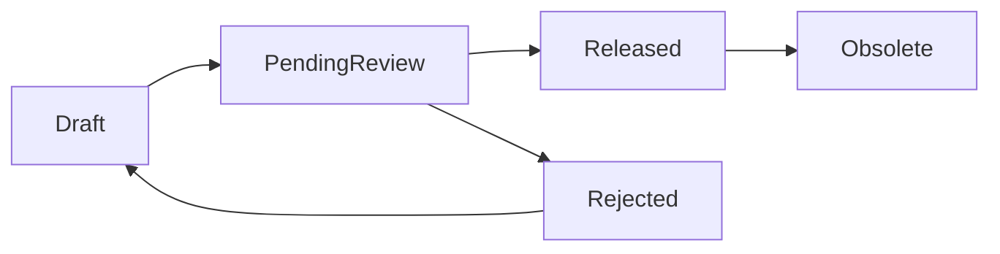

# SPEC-BOM-WORKBENCH-001：BOM 工作台

狀態：Generic editor／review／release baseline / DEV-060 create contract retired / DEV-096 current create authority RD Implementation Ready
日期：2026-05-30
關聯任務：`DEV-BOM-WORKBENCH-001`、`DEV-PDM-BOM-MODULE-ENTRY-001` / `DEV-060`
適用模組：BOM 工作台、送審、BOM diff、Where-used、製造交接、採購匯出

> 2026-08-10 Amendment：本文件所有「料號版次／子件版次／同料號同版次」舊語意，均由
> `ADR-PDM-MATERIAL-IDENTITY-REVISION-001` 修訂。Part Number 是無版次的物料身份；Drawing 與 BOM
> 是各自獨立版控的受控工程定義。第17節曾是`DEV-060`的RD Implementation Contract，現已由DEV-095退役，
> 只保留legacy implementation evidence；不得再作current建立、ownership或source authority。

> 2026-08-24 Current Authority Amendment：DEV-060的建立入口、CAD／XLS source及assembly auto-writer已由DEV-095退役。新組立件建立、stable BOM Definition／logical line、one-open Revision、初版／下一版同writer、多Parent applicability、component candidate／exact mapping、schema-v2 review／release evidence、完整archive／restore／obsolete lifecycle及exact-parent export/where-used以`SPEC-PDM-ASSEMBLY-BOM-REBUILD-001`與`ADR-PDM-BOM-STRUCTURE-SHARING-001`為準，且已達RD Implementation Ready。本文件只保留不衝突的generic editor／review／release基線；第17節的single `owner_part_number_id` write authority、manual set-active、所有`/bom/new`與三來源建立段落均屬歷史，不得實作成DEV-096相容分支。

## 1. 問題定義

目前系統已有由 CAD reference 自動建立 Engineering BOM draft、Dashboard BOM 呈現、BOM diff、Where-used 與匯出能力，但 BOM 仍偏向「送審明細內的附屬資料」。目標功能需要升級為獨立 BOM 工作台，讓工程、主管、製造、採購能以同一套正式產品結構協作。

真正要解決的問題不是「匯入 BOM」，而是：

- 建立、校正、審核與發布產品結構。
- 支援多來源 BOM 建立，並保留來源追溯。
- 讓人工拖拉編輯成為最終校正入口。
- 讓製造與採購只使用已發布 BOM，避免 Draft 外流。

## 2. 設計目標

- 建立獨立 `BOM 工作台` 模組。
- 支援三種 BOM 建立方式：
  - 匯入組合件時自動產生。
  - 匯入 SolidWorks 產出的 BOM XLS 檔。
  - 建立空白 BOM 草稿，再人工以滑鼠拖拉方式建立階層與數量。
- 操作心智採 Windows 檔案總管式樹狀結構。
- 支援多個 Draft、Active Draft、研發主管審核、Released Snapshot、Obsolete 舊版。
- 支援 BOM 版本管理、BOM diff、Where-used、Excel / CSV 匯出。
- 支援虛擬件 / 群組節點與本次編輯 session 的 Undo / Redo。

## 3. 非目標

第一版不做：

- 人工直接修改料號身份、品名、材質、表面處理等 item master 屬性；Part Number 本身不存在 Revision。
- 製造 / 採購檢視 Draft。
- Released BOM 原地修改。
- 將每一次拖拉操作都保存成可回復版本。
- 複雜 ECO 流程或跨部門多層會簽。
- 替代料、製程站別、包裝群組、位置碼等進階製造 BOM 欄位。

## 4. 使用者與權限

| 角色 | Draft 可見 | Released 可見 | 可編輯 Draft | 可指定 Active Draft | 可審核 | 可匯出 |
|---|---:|---:|---:|---:|---:|---:|
| 研發工程師 | 是 | 是 | 是 | 是 | 否 | Draft 可匯出預覽；Released 可匯出正式 |
| 研發主管 | 是 | 是 | 是 | 是 | 是 | 是 |
| 製造 | 否 | 是 | 否 | 否 | 否 | 是 |
| 採購 | 否 | 是 | 否 | 否 | 否 | 是 |
| Admin | 是 | 是 | 是 | 是 | 是 | 是 |

API 必須執行同樣權限控制，不能只靠 UI 隱藏 Draft。

## 5. BOM 生命週期



狀態說明：

| 狀態 | 說明 |
|---|---|
| `Draft` | 可編輯草稿 |
| `PendingReview` | 已送研發主管審核，不可編輯 |
| `Released` | 正式 BOM snapshot，製造 / 採購可見 |
| `Rejected` | 被退回，可原地修改後重新送審 |
| `Obsolete` | 被新版 Released BOM 取代 |
| `Archived` | 使用者封存，不再作業 |

規則：

- 同一 owner Part Number、同一 BOM Revision 可有多個 Draft。
- 同一 owner Part Number、同一 BOM Revision 只能有一個 Active Draft。
- 送審預設送出 Active Draft。
- 同一 owner Part Number + BOM Revision 同時間只能有一個 `PendingReview` BOM。
- Released 後自動將同 owner Part Number 的舊 BOM Revision Released Snapshot 標記為 `Obsolete`。

## 6. 三種建立來源

### 6.1 組合件自動產生

來源：CAD reference / `.sldasm` / sidecar / native extractor。
用途：快速建立初版 Draft。
來源優先度：中。
限制：CAD 組合關係不一定等於製造 BOM，仍需人工確認。

### 6.2 SolidWorks BOM XLS 匯入

來源：SolidWorks 匯出的 BOM XLS。
用途：匯入工程師已整理過的 BOM。
來源優先度：高。
規則：

- XLS 匯入永遠建立新的 Draft，不覆蓋既有 Draft。
- 匯入格式固定，但必須支援格式版本。
- 匯入後保存原始 XLS、profile version、匯入者、匯入時間、轉換後 BOM lines。

### 6.3 空白人工 BOM

來源：先為 canonical owner Part Number 建立空白 Draft，再由使用者在 BOM 工作台操作。
用途：沒有 CAD/XLS 來源時從零建立，也作為所有來源的最後校正入口。
來源優先度：最高。
規則：

- 建立空白 Draft 仍必須先指定 owner Part Number 與獨立 BOM Revision；不需要偽造 Drawing submission。
- 只能調整階層、排序、數量。
- 可從既有 BOM 節點內拖拉調整。
- 可從料號庫 / 圖面清單拖入子件。
- 若要換料號，必須移除舊子件再拖入新子件。
- 每次儲存寫入 audit log，送審時必填整體變更原因。

## 7. 衝突與合併規則

來源衝突優先權：

```text
manual > solidworks_xls > cad_reference
```

同一父層同 Part Number identity：

- 第一版預設自動合併數量。
- 合併鍵：`parent_line_id + child_part_number`
- 拖入重複子件時不新增第二行，改為數量相加並提示。
- 例外分行留待第二版，因第一版不支援位置碼、工序或備註欄位。

## 8. 樹狀結構與限制

### 8.1 階層限制

- BOM 最大深度：10 層。
- 拖拉後超過 10 層時阻擋。
- XLS 匯入超過 10 層時匯入失敗並列出錯誤列。
- 組合件自動解析超過 10 層時建立 Draft 失敗或進入需修正狀態。

### 8.2 循環限制

不允許循環引用：

- A 包 B，B 不可再包 A。
- 拖拉與匯入都必須檢查。

### 8.3 Draft 引用規則

Draft 可引用：

- Released 子件。
- Pending 子件。
- Draft 子件候選。

發布前 Release Gate 必須阻擋：

- 子件不存在。
- 子件身份尚未達可用狀態。
- 子件為 Rejected、Obsolete、Merged 或 MainDrawingInvalid。
- 若設定快照明確固定 Drawing/BOM definition revision，該受控定義不存在、未 Released 或解析不唯一。

BOM line 不得以 `child_revision` 表示 Part Number Revision；需要固定定義時，必須使用獨立受控參照或 Released Snapshot。

## 9. 虛擬件 / 群組節點

虛擬件用於 Windows 樹狀整理，不代表實際料號。

規則：

- 可作為父節點。
- 不需要料號、版次、Released 狀態。
- 第一版不設定數量，純群組用途。
- 可命名，例如「鎖固件」、「外殼件」、「電控模組」。
- 可拖拉、改名、刪除。
- 可包含實體子件或其他虛擬件。
- 最大深度仍受 10 層限制。
- 匯出時可顯示為群組列，但不納入採購數量。

刪除虛擬件時需提供：

- 連同子件刪除。
- 只刪除群組，子件上移一層。

## 10. UI 規格

### 10.1 主畫面

```text
BOM 工作台

主視覺：全寬 BOM 清單
- 搜尋 Part Number、品名、BOM Rev
- 依 BOM lifecycle 狀態篩選
- 從同一清單開啟 Draft／PendingReview／Rejected／Released／Obsolete
- 建立 BOM 由 `/bom/new` 進入
- 點選清單列後導向獨立 `/bom/workbench/<draftId>`，清單頁不直接展開編輯器

獨立編輯頁 `/bom/workbench/<draftId>`：BOM 樹狀編輯器
ASM-001 / BOM Rev 1
├─ [群組] 鎖固件
│  ├─ P-2001 螺絲 x4
│  └─ P-2002 墊片 x4
├─ P-1002 支架 x2
└─ P-1003 外蓋 x1

右側 Drawer：選取節點屬性
- 料號 / 群組名稱
- 品名
- BOM Rev；若有受控來源，Drawing Rev 另列且不可混稱料號版次
- 數量
- 來源
- 最後修改者
- 差異警示

上方工具列：
[匯入組合件] [匯入 XLS] [新增群組] [插入料件] [復原] [重做] [儲存草稿] [送審] [比較版本] [匯出]
```

「插入料件」開啟右側選料 Drawer，提供料號／品名／圖號搜尋與可插入結果；點選結果後，若目前選取群組則加入該群組，否則加入主件，
只修改目前 BOM 草稿並標示未儲存，必須由使用者明確儲存才寫入草稿。

工作台不得常駐第二份「料號／圖面搜尋」側欄；Part Number owner 與來源選擇統一在 `/bom/new` 完成，
續作頁把首要寬度與視覺層級保留給 BOM 清單。若未來需要新增子件搜尋，必須以不壓縮主清單的 drawer／command surface
另案設計，不得直接恢復雙欄常駐版面。

`/bom/workbench` 是純清單 surface，不渲染編輯工具列、BOM 畫布或節點屬性 Drawer；上述內容只在
`/bom/workbench/<draftId>` 載入。編輯頁必須提供明確「返回 BOM 清單」，但不再顯示重複的頁名／副標、研發階段摘要卡、
正常載入成功提示或「已刪除資料」區塊；BOM 標題、主件、圖號與 BOM 數必須整合在單一 `BOM 基本資料` 橫列，
再進入工具列與畫布，不得用多張摘要卡分開佔版位。錯誤與阻擋訊息仍須可見。
舊 `/bom/workbench?draftId=<id>` 只作相容 redirect，不再是 canonical URL。

畫布節點採「料號／群組名稱為主、品名為次」的最小可辨識內容；BOM Rev、子件 Rev、數量與階層層級不在節點常駐顯示，
需要查閱時由節點 Drawer 提供。節點來源 badge（例如手動）仍可保留，供判斷資料來源。

### 10.2 BOM 清單（與圖號工作清單共用元件）

`BOM 工作台` 不建立第二份「BOM 草稿清單」或獨立入口。Draft、PendingReview、Rejected、Released、Obsolete
都出現在同一份 BOM 清單，以 lifecycle 狀態標示；Archived 不出現在主清單，也不在 BOM 編輯頁提供 recovery surface。

清單外殼、table semantics、選取列、鍵盤操作、loading／empty state 與 RWD 必須和「圖號工作台」共用同一個
`PdmWorkbenchList` 元件；兩個模組只透過 columns／row renderer／資料查詢替換內容，不得複製另一份 table markup。
圖號工作台顯示圖號、品名、料號與工作狀態；BOM 工作台顯示 owner Part Number、品名／BOM 名稱、BOM Rev、項目數與工作狀態。

```text
BOM 工作台

BOM 清單
┌───────────────┬────────────────────┬──────────────────┬──────────────┐
│ 料號           │ 品名 / BOM          │ BOM 定義          │ 工作狀態      │
├───────────────┼────────────────────┼──────────────────┼──────────────┤
│ ASM-001        │ 主組立 / CAD Auto #1│ BOM Rev 1・12 項  │ 草稿・目前使用 │
│ ASM-001        │ 主組立 / Review #2 │ BOM Rev 2・14 項  │ 審核中         │
│ ASM-001        │ 主組立 / Released  │ BOM Rev 0・10 項  │ 已發布         │
└───────────────┴────────────────────┴──────────────────┴──────────────┘
```

操作：

- 開啟：導向 `/bom/workbench/<draftId>` 獨立編輯頁。
- 比較。
- 複製成新草稿。
- 設為 Active。
- 送審 Active Draft。

### 10.3 Undo / Redo

支援本次編輯 session：

| 操作 | Undo / Redo |
|---|---|
| 拖拉改父層 | 是 |
| 拖拉排序 | 是 |
| 修改數量 | 是 |
| 新增虛擬件 | 是 |
| 刪除虛擬件 | 是 |
| 從料號庫拖入子件 | 是 |
| 從 BOM 移除子件 | 是 |
| 匯入 CAD / XLS 建立 Draft | 否，因會建立新 Draft |
| 送審 / 核准 / 發布 | 否，只能退回或新版本 |

快捷鍵：

- `Ctrl+Z`：復原。
- `Ctrl+Y` 或 `Ctrl+Shift+Z`：重做。

未儲存變更離開頁面時必須提示。

## 11. 主管審核

主管審核主要看與上一版 Released BOM 的差異，不以整張 BOM 全量表格作為第一畫面。

差異類型：

| 類型 | 範例 |
|---|---|
| 新增子件 | `+ P-1004 x2` |
| 移除子件 | `- P-1002` |
| 數量變更 | `P-2001 x4 -> x6` |
| 階層變更 | `P-3001 從 P-1002 底下移到 ASM-001 底下` |
| 受控定義參照變更 | `P-1005 的 Drawing/BOM definition reference 由 Rev 1 -> Rev 2` |

人工覆寫紀錄放第二層供追溯，不作主管第一審核畫面的主內容。

## 12. 匯出

Released BOM Snapshot 才能提供製造 / 採購正式匯出。

格式：

- Excel `.xlsx`
- CSV `.csv`

固定檔名：

```text
BOM_{part_number}_BOM-Rev{bom_revision}_{YYYYMMDD}.xlsx
BOM_{part_number}_BOM-Rev{bom_revision}_{YYYYMMDD}.csv
```

範例：

```text
BOM_ASM-001_BOM-Rev1_20260530.xlsx
BOM_ASM-001_BOM-Rev1_20260530.csv
```

第一版欄位：

| 欄位 | 說明 |
|---|---|
| `level` | 階層 |
| `line_no` | 行號 |
| `parent_part_number` | 父件料號 |
| `child_part_number` | 子件料號 |
| `child_part_name` | 子件品名 |
| `child_drawing_revision` / `child_bom_revision` | 選配的受控定義快照證據；不得解釋為 Part Number Revision |
| `quantity` | 數量 |
| `source` | 來源 |
| `released_at` | BOM 發布時間 |
| `approved_by` | 核准者 |

## 13. 資料模型草案

需要將目前 `bom_headers` / `bom_lines` 升級為可支援多 Draft、樹狀、審核與 Released Snapshot 的模型。

建議資料表：

- `bom_drafts`
- `bom_lines_tree`
- `bom_import_profiles`
- `bom_import_jobs`
- `bom_edit_events`
- `bom_review_requests`
- `bom_release_snapshots`

`bom_lines_tree` 必要欄位：

| 欄位 | 說明 |
|---|---|
| `id` | line id |
| `bom_draft_id` | 所屬 draft |
| `parent_line_id` | 上層 line；root 子件為 null |
| `node_type` | `item` 或 `group` |
| `item_id` | 實體料號節點才需要 |
| `part_number` | 實體料號快照 |
| `revision` | Legacy deprecated；不得再寫入 Part Number Revision。新模型若需固定定義版次，使用獨立受控參照。 |
| `group_name` | 群組節點名稱 |
| `quantity` | 實體子件數量；群組為 null |
| `sequence_no` | 同父層排序 |
| `source` | `cad_reference` / `solidworks_xls` / `manual` |
| `source_priority` | 來源優先權 |
| `source_ref_id` | 對應 CAD reference / import row |
| `created_by` | 建立者 |
| `updated_by` | 最後修改者 |

## 14. API 草案

| API | 用途 |
|---|---|
| `GET /api/bom/workbench?draftId=` | 取得指定 BOM Draft；legacy `submissionId` 僅作相容 adapter |
| `POST /api/bom/drafts/from-assembly` | 由組合件 / CAD references 建立 Draft |
| `POST /api/bom/drafts/import-xls` | 匯入 SolidWorks BOM XLS 建立新 Draft |
| `GET /api/bom/drafts/[id]` | 取得 Draft 樹狀資料 |
| `PATCH /api/bom/drafts/[id]` | 儲存 Draft 樹狀資料 |
| `POST /api/bom/drafts/[id]/active` | 設為 Active Draft |
| `POST /api/bom/drafts/[id]/submit-review` | 送研發主管審核 |
| `POST /api/bom/reviews/[id]/approve` | 主管核准並發布 Snapshot |
| `POST /api/bom/reviews/[id]/reject` | 主管退回 |
| `GET /api/bom/drafts/[id]/diff` | 與上一版 Released BOM 比對 |
| `GET /api/bom/releases/[id]/export?format=xlsx|csv` | 匯出正式 BOM |

## 15. 驗收標準

功能：

- 可由 CAD references 建立 BOM Draft。
- 可由 SolidWorks BOM XLS 建立新 Draft，且保存 import profile version。
- 可同一組合件建立多個 Draft。
- 可指定 Active Draft，送審預設使用 Active Draft。
- 可用拖拉調整階層、排序與數量。
- 可從料號庫 / 圖面清單拖入 Released 或 Pending 子件。
- 同父層同 Part Number identity 預設合併數量，合併鍵不得包含 Part Number Revision。
- 可新增、改名、刪除虛擬群組。
- 支援 Undo / Redo 與未儲存離開提示。
- 研發主管審核可看到與上一版 Released BOM 的差異。
- 發布前阻擋缺件、Pending、Rejected、Obsolete、非最新版 Released 子件。
- 發布後舊版 Released BOM 自動 Obsolete。
- 製造 / 採購不可讀取 Draft API，也不可在 UI 看到 Draft。
- Released BOM 可匯出 Excel 與 CSV，檔名固定。

品質：

- `npm.cmd run lint` 通過。
- `npm.cmd run build` 通過。
- BOM API regression 覆蓋匯入、拖拉保存、Release Gate、審核、匯出、權限。
- UI E2E 覆蓋 Windows 樹狀拖拉、Undo / Redo、Active Draft、主管審核差異、製造 / 採購只讀 Released。

## 16. 思考習慣對應

- `#rightproblem`：核心是產品結構治理，不只是匯入 BOM。
- `#systemmapping`：三種來源進入同一 BOM canonical model。
- `#dataviz`：Windows 樹狀、diff、警示與 Release Gate 視覺化。
- `#designthinking`：以工程師快速建立、主管快速審核、製造採購安全使用為主流程。
- `#constraints`：Released 不可改、最大 10 層、不可循環、製造採購不可看 Draft。
- `#modeling`：多 Draft、樹狀 line、Import Profile、Released Snapshot。
- `#decisiontrees`：來源衝突採 `manual > xls > cad_reference`。
- `#testability`：每個狀態與權限都可由 API/UI 測試驗證。

## 17. Historical：2026-08-10 DEV-060 建立入口 RD Implementation Contract（已由DEV-095退役）

本節只供migration與歷史追溯。Current create／ownership／applicability／release consumer contract固定讀`SPEC-PDM-ASSEMBLY-BOM-REBUILD-001`；不得執行本節`/bom/new`、三來源、single owner或CAD/XLS writer條款。

### 17.1 Human Decision Brief

| 決策 | 人類確認結果 | 實作含義 |
|---|---|---|
| 入口方案 | `1A`：方案 B 的獨立兩步驟全頁流程 | 新增 `/bom/new`，不把建立流程塞回工作台首屏 |
| 身份／版次 | Part Number 無 Revision；Drawing、BOM 各自有 Revision | owner 改為 canonical Part Number；BOM Rev 不再來自 submission Rev |
| 第一版來源 | `3B`：CAD、SolidWorks XLS、空白人工三種都做 | 必須新增 generic manual create，不能只包裝既有兩支 API |

本次 Spec Impact Preflight 為 `Intentional replacement + cross-spec convergence`：建立入口本身是 compatible extension，
但既有 BOM persistence 將 submission/drawing revision 當成 owner revision，與人類確認的身份規則衝突，必須在同一 DEV
完成語意與相容遷移，不得只新增 UI 後繼續寫入錯誤模型。

### 17.2 產品目標與成功條件

使用者從側欄即可分辨三個任務：

1. `建立 BOM`：為既有 Part Number 建立指定 BOM Revision 的新 Draft。
2. `BOM 工作台`：搜尋、續作與管理既有 Draft／Released Snapshot。
3. `BOM 審核`：進入 canonical `/approvals?domain=bom`，不建立第二套審核 authority。

`BOM 工作台` 只保留一份全狀態 BOM 清單，並與「圖號工作台」共用工作清單元件；草稿是 lifecycle 狀態，
不是另一個清單、tab 或側欄入口。

主內容採單欄全寬；舊「料號／圖面搜尋」常駐側欄移除，BOM 清單為第一視覺層級。
清單與編輯分成兩個 route surface：`/bom/workbench` 僅掃描／篩選／選擇，`/bom/workbench/<draftId>` 才續作、
刪除／還原與編輯。不得因選取列而在清單下方原地展開畫布。

成功不是「多一顆按鈕」，而是所有三種來源都建立出相同 canonical ownership 的 Draft，且任何 Drawing/CAD submission
都只能是來源證據，不能決定 owner 或 BOM Revision。

### 17.3 資訊架構與兩步驟流程

#### Step 1：選擇建立路徑

入口先以三個並列區塊分流，讓使用者不會把既有 BOM 誤判為新的建立候選：

- `從已偵測的組合件建立`：只列同 company、可讀且有 `.sldasm` 或 `assembly_component` 證據的 canonical Part Number；同 owner 已有 `Draft / PendingReview / Rejected` 等進行中草稿時，不再列為新建候選。
- `建立全新空白 BOM`：列同 company、狀態可用且沒有進行中草稿的 canonical Part Number；選定後以 server 回傳的 `suggestedBomRevision` 預填 BOM Rev，可直接建立 `source=manual`、零 line Draft。
- `已有 BOM 草稿`：列可讀的 `Draft / PendingReview / Rejected`，提供續作／回到該 Draft 的入口；這些 owner 同時從前兩個新建候選排除。

搜尋可同時縮小組合件、空白 BOM 候選與既有草稿；結果顯示 Part Number、品名與必要狀態，不顯示「料號 Rev」。
BOM Rev 仍使用既有 numeric revision grammar，suggestion 只能依 BOM history 計算，禁止讀 Drawing/submission revision。
若使用者需保留既有入口能力，空白 BOM 區塊另提供次要 `匯入 XLS` 路徑，帶入同一 owner 與 BOM Rev 後進入 Step 2；`建立空白 BOM` 是該區塊唯一 primary action。

#### Step 2：選擇來源並確認

三張互斥 source card：

- `從 CAD 組合件建立`：選擇同 company、與 owner Part Number 關聯且 actor 可讀的 submission；摘要分開顯示 Drawing Number / Drawing Rev。
- `匯入 SolidWorks BOM XLS`：選檔後顯示檔名、大小、profile/version 與 validation；檔內 owner mismatch 必須阻擋或要求人工修正來源，不得改寫 Step 1 owner。
- `建立空白 BOM`：不需 submission/file，直接建立 `source=manual`、零 line Draft。

建立前摘要固定依序顯示：

```text
物料身份：A0005-P01 馬達（料號無版次）
BOM Rev：1
建立來源：CAD / SolidWorks XLS / 空白人工
來源證據：A0005-M01 Drawing Rev 0.2（只有 CAD 時顯示）
建立結果：1 份可追溯 BOM Draft
```

全頁每一條建立路徑只保留一個 primary CTA：組合件路徑進入 Step 2 的 `下一步：選擇來源`；空白路徑的 `建立空白 BOM`；Step 2 的 `建立 BOM 草稿`。`匯入 XLS`、`取消`／`上一步`為 secondary。
不得恢復使用者已要求刪除的流程定位 strip，或顯示 `Current / Next / 5 steps` 等內部流程雜訊。

### 17.4 Canonical Data Contract

#### 新寫入 authority

`bom_drafts`、`bom_release_snapshots` 與 import/effect evidence 必須至少具有：

| 欄位 | 契約 |
|---|---|
| `company_id` | tenant boundary；由 server context 決定，不接受 client 任意指定 |
| `owner_part_number_id` | FK `part_numbers.id`；BOM owner 唯一 authority |
| `bom_revision` | 必填，BOM 自己的 revision；不得由 submission revision 預填／覆寫 |
| `source` | `cad_reference / solidworks_xls / manual` |
| `source_submission_id` | nullable；只作 CAD/Drawing source evidence |
| `idempotency_effect_id` | 指向唯一 create effect/receipt |
| `identity_authority` | 新資料固定 `canonical_part_number`；legacy migration 可標示來源 |

新增 `bom_create_effects`：

```text
id, company_id, actor_id, idempotency_key, request_fingerprint,
draft_id, outcome_json, created_at
UNIQUE(company_id, actor_id, idempotency_key)
```

同 key、同 fingerprint 重送回傳同一 receipt/draft；同 key、不同 fingerprint 回 `409 BOM_CREATE_IDEMPOTENCY_CONFLICT`。
資料寫入 Draft、lines/import job、effect receipt 必須同 transaction 成功；不得先建 orphan Draft 再補 owner。

#### 唯一性與 line identity

- Active/Pending uniqueness 改為 `owner_part_number_id + bom_revision`，不再使用 `parent_item_id + parent_revision`。
- `bom_lines_tree.revision`、`bom_lines.child_revision` 為 legacy deprecated；新寫入固定 null。
- 同父層合併鍵固定 `parent_line_id + child_part_number`。
- 若未來需鎖定 Drawing/child BOM revision，另建 first-class controlled definition reference；不得把版次放回 Part Number identity。

#### Legacy 相容遷移

採 additive-first、dry-run-first：

1. 以 `items.company_id + items.part_number` 對 `part_numbers.company_id + part_numbers.part_number` 建立 deterministic crosswalk。
2. 唯一匹配時回填 `owner_part_number_id`；零匹配或衝突列為 `manual_review` 並阻擋 apply。
3. 保存原 `parent_submission_id` 為 `source_submission_id`，保存 `submissions.revision` 為 legacy source Drawing Rev evidence。
4. 為歷史 BOM revision 建立排序報告；只有同 owner 序列無衝突時，才可一次性把 legacy `parent_revision` 採認為初始 `bom_revision`，並寫 audit reason `legacy_submission_revision_adopted_as_initial_bom_revision`。
5. `parent_item_id / parent_submission_id / parent_revision` 轉為 nullable deprecated compatibility fields；所有新 write/query/index 改讀 canonical 欄位。
6. 歷史 Released Snapshot、Where-used 與 audit event 不刪除、不重寫；dry-run 前後 count/hash 必須一致。
7. migration 可重跑且 effect 為 0；任何 `manual_review`、duplicate owner+revision 或 missing FK 時 fail closed，不允許猜測。

預定 migration artifacts：

- `db/postgres/028_bom_material_identity_revision.sql`
- `supabase/migrations/20260810010000_bom_material_identity_revision.sql`
- `supabase/migrations/manifest.json` 與 runtime migration sync registration
- `db/schema.sql`、`src/lib/db.ts` 的 SQLite 等價 schema/bootstrap

本 DEV 只授權本機／isolated migration 實作與驗證；live Cloud SQL、Supabase 或 production apply 仍需 release gate 明確授權。

### 17.5 API Contract

#### `GET /api/bom/create-context`

Query：`query`、`limit`、既有 company context selector。回應：

```json
{
  "parts": [{
    "id": "part-number-id",
    "partNumber": "A0005-P01",
    "partName": "馬達",
    "recordStatus": "Released",
    "itemKind": "manufactured"
  }],
  "selected": {
    "ownerPartNumberId": "part-number-id",
    "bomHistory": [],
  "suggestedBomRevision": "1",
    "eligibleCadSources": []
  }
}
```

Part search 可重用 numbering repository/service，但 BOM endpoint 必須套用 BOM create permission 與 company scope，不得由 client
直接推斷 eligibility。

#### `POST /api/bom/drafts`

供 `manual` 與 `cad_reference` 使用：

```json
{
  "ownerPartNumberId": "part-number-id",
  "bomRevision": "1",
  "source": "manual",
  "sourceSubmissionId": null,
  "draftName": "A0005-P01 BOM 1",
  "setActive": true,
  "idempotencyKey": "uuid"
}
```

- `manual` 必須拒絕非 null source submission。
- `cad_reference` 必須要求 source submission，並驗證 company、actor visibility 與 submission/part relation；mismatch 回 409。
- 新 effect 回 `201`；冪等 replay 回 `200` 且 `replayed=true`。成功回應固定含 `draftId`、owner、`bomRevision`、source、receipt 與 workbench URL。

#### `POST /api/bom/drafts/import-xls`

保留 multipart/JSON adapter，但必填新增 `ownerPartNumberId`、`bomRevision`、`idempotencyKey`；`sourceSubmissionId` 改為選配來源證據。
檔案 policy、profile/version、解析錯誤與原始 asset traceability 維持既有 authority。解析、Draft、import job 與 effect receipt 同 transaction；
parser 失敗不得留下 Draft。

#### Compatibility adapters

- `POST /api/bom/drafts/from-assembly` 暫時保留，轉入同一 canonical create service；只能從 submission 解析 owner，不能再把 submission revision 當 BOM revision。舊 request 缺 `bomRevision` 時回明確 422，不得靜默沿用 Drawing Rev。
- `GET /api/bom/workbench` canonical selector 為 `draftId`；legacy `submissionId` 只可讀到已映射資料並回 deprecated metadata。
- 新 UI 建立成功導向 `/bom/workbench/<draftId>`；hard reload 必須由 server authoritative readback 恢復。舊 query URL 僅作 redirect 相容。

#### Error Contract

| HTTP/code | 使用者文案／復原 |
|---|---|
| 400 `BOM_OWNER_REQUIRED` / `BOM_REVISION_INVALID` | 回 Step 1，focus 第一個無效欄位 |
| 403 `BOM_CREATE_FORBIDDEN` | `你沒有建立 BOM 草稿的權限`；保留查閱入口 |
| 404 `BOM_OWNER_NOT_FOUND` | `找不到這個料號，請重新選擇` |
| 409 `BOM_OWNER_SOURCE_MISMATCH` | `來源圖面不屬於所選料號`；不得自動換 owner |
| 409 `BOM_CREATE_IDEMPOTENCY_CONFLICT` | 重新查詢建立結果；不得直接再送新 key |
| 413 upload policy | 顯示允許大小／格式，保留 Step 1 選擇 |
| 422 `BOM_LEGACY_IDENTITY_UNCLASSIFIED` | 唯讀舊資料並指示 Admin 完成分類，不猜測 |
| 500/timeout/response loss | 顯示 `建立結果尚未確認` 並以原 key readback；禁止自動建立第二份 |

### 17.6 Permission Contract

- `Engineer`：可為同 company 且符合下列任一條件的 Part Number 建 Draft：`part_numbers.created_by = actor.id`；或存在同 company、`submitted_by = actor.id` 的 submission，且該 submission 的 `submission_part_scopes.part_number_id` 明確包含 owner；legacy 無 scope 時才可用 `submissions.item_id -> items.part_number` 與 canonical part number exact match。CAD source 另外仍須通過既有 submission visibility。
- `R&D Manager`、`Admin`：可為其可管理 company 的 eligible Part Number 建 Draft。
- `Manufacturing`、`Procurement`：只能讀 Released Snapshot，不得看／建 Draft。
- 新增 server helper `canCreateBomDraftAsync(user, ownerPartNumber, sourceSubmission?)`，並由 create-context 與所有 create adapters 共用上述同一 predicate；sidebar visibility 不得代替 API permission。
- `BOM 審核` 沿用 approval platform permission；沒有 review permission 時入口隱藏或 disabled-with-reason，但不得顯示可點後才 403 的假 affordance。
- 所有 owner/source/draft/readback 必須驗證 company；client 傳入 company ID 不能覆蓋 authenticated context。

### 17.7 Repo / Module Impact

| Slice | 預期檔案／責任 |
|---|---|
| Navigation | `src/components/sidebar-nav.tsx`：新增三入口與 active state；BOM 審核連 canonical query |
| Create UI | 新增 `src/app/bom/new/page.tsx`、`src/components/bom-create-workflow.tsx`：兩步驟、三來源、summary/recovery |
| Shared work list | `src/components/pdm-workbench-list.tsx`：圖號與 BOM 共用 table／selection／keyboard／loading／empty／RWD 骨架，只替換 columns 與 row content |
| Workbench list | `src/app/bom/workbench/page.tsx`：`/bom/workbench` 只顯示全狀態 BOM 清單；列選取導向獨立編輯 route |
| Workbench editor | `src/app/bom/workbench/[draftId]/page.tsx`：`/bom/workbench/<draftId>` 為 canonical deep link；承載單一 BOM 基本資料橫列、工具列、畫布與 Drawer；舊 query URL redirect 相容 |
| API | 新增 `src/app/api/bom/create-context/route.ts`、`src/app/api/bom/drafts/route.ts`；更新既有 from-assembly/import/workbench routes |
| Domain service | `src/lib/bom-workbench-async.ts`、新增 `src/lib/bom-revision-policy.ts` 與 canonical create/readback service |
| Persistence | `src/lib/repositories/bom-workbench-async-repository.ts`、`bom-repository.ts`、必要 type mapper；sync/async 必須同語意 |
| Permission | `src/lib/permissions.ts`；必要時擴充 BOM page permission code，但不複製 numbering authority |
| Schema | `db/schema.sql`、`src/lib/db.ts`、PostgreSQL 028、Supabase mirror/manifest/sync script |
| Production guard | `src/lib/production-slice.ts` 維持 BOM 未開放；本 DEV 不擴充 production allowlist |
| QC | 新增 `scripts/qc-dev-060-bom-entry-contract.mjs`、`...-http.mjs`、`...-real-operation.mjs` 與 package scripts |

RD 必須先以 `rg` 確認實際 helper/repository 名稱；若責任已移動，可改檔名但不得改變上述 owner/API/migration/permission contract。

### 17.8 Failure Recovery And Atomicity

- CTA 送出後立即 disabled；同一 UI attempt 固定沿用同一 idempotency key。
- client timeout 不顯示單純「失敗」；先以 receipt/key 做 authoritative readback，再決定成功、可安全重試或需人工確認。
- CAD/XLS parser 或 line persistence 失敗時 transaction rollback，effect 可記 failed outcome 但不得留下可見 orphan Draft。
- 建立成功後 navigation 失敗，使用者可從 receipt 或工作台清單找到同 Draft；Back/Forward/hard reload 不重送 POST。
- migration failure 必須 rollback；dry-run report、count/hash 與 manual-review rows 保存為證據，禁止自動清理歷史。

### 17.9 Implementation Phases

1. **Phase 1A — Identity/migration foundation**：schema、crosswalk dry-run、canonical repository read/write、legacy adapter；Gate 1 通過才進入下一階段。
2. **Phase 1B — API/permission/idempotency**：create-context、generic create、XLS canonical fields、effect receipt、error mapping；Gate 2 通過。
3. **Phase 1C — Navigation/UI/workbench handoff**：方案 B 兩步驟、三來源、`draftId` deep link、canonical approval link；Gate 3/5 通過。
4. **Phase 1D — Integration/QA/QC**：既有 BOM review/release/export/read permission 改讀 canonical fields，完成治理負向案例、regression 與 isolated cleanup；全部 Gate 通過才可宣稱 DEV-060 local implementation complete。

不可只完成 1C UI 就標示完成；1A/1B 是防止持續製造錯誤身份資料的前置 Gate。

### 17.10 Acceptance And Evidence

驗收依 `.ai-doc/qa/qa-dev-060-bom-entry-material-identity-validation-plan-2026-08-10.md`，最低必須證明：

- 三入口清楚可達，兩步驟、三來源皆由真實 UI 成功建立。
- 所有新 Draft 具有 canonical owner Part Number 與獨立 BOM Rev；manual source 的 submission 為 null。
- Drawing Rev、BOM Rev 可各自改變且不推動 Part Number revision；身份條件改變時改走新 Part Number。
- double click、retry、response loss effect count 恆為 1。
- Engineer/R&D Manager/Admin 正向與 Manufacturing/Procurement/cross-company 負向權限通過。
- migration dry-run、manual-review fail-closed、Released history count/hash 不變。
- 1440×900、1024×768、390×844 無 overflow/裁切；visible error/console/network 無非預期錯誤。
- `typecheck`、affected lint、新 focused QCs 與既有 BOM regression 全數 PASS；isolated evidence 顯示 `productionConnected=false`、`productionWrites=false`、`cleanupStatus=removed`。

### 17.11 RD Readiness / Stop Conditions

人類決策已關閉：入口採 1A、身份規則依 ADR、來源採 3B。route、schema、migration、permission、idempotency、error、QA與file impact均已依本契約實作並完成本機驗證，沒有未解P0/P1 implementation drift。

RD 遇到以下任一情況必須停止並回報，不得自行縮小規則：

- 無法建立 `part_numbers` canonical owner，只能繼續用 submission 作 owner。
- legacy migration 需要猜測 BOM Rev、刪除／覆寫 Released history 或出現 owner+revision 衝突。
- 三種來源不能共用同一 create/effect authority，或 parser transaction 無法避免 orphan Draft。
- permission/company boundary 只能靠 UI，API 無法 fail closed。
- 需要改 BOM approval authority、開放 production slice、live migration、deploy 或 production mutation。

### 17.12 Execution / Release Boundary

`DEV-060` 已依 Phase 1A→1D 完成本機產品碼、isolated SQLite migration/runtime、forward PostgreSQL/Supabase migration artifacts與 QA/QC。這不等於 live migration 或 release；未執行 production data mutation、stage/commit、merge、PR、deploy、production smoke或 release，production仍由 `DEV-032` 與 deployment release gate管制。

### 17.13 Local Implementation Evidence（2026-08-10）

- `/bom/new` 採兩步驟全頁，Step 1選 canonical Part Number owner與獨立 BOM Rev，Step 2支援 CAD、SolidWorks XLS、空白人工；三來源均由真實 UI 建立並以 `draftId` 交接工作台。
- 新 write authority為 `owner_part_number_id + bom_revision`；manual來源的 submission為 null，新 BOM line不保存 Part Number revision。相同 idempotency key同 fingerprint重播同 receipt；不同 payload回409。
- server拒絕已占用或非 forward BOM Rev，建議值會跳過尚未封存的既有 Draft；Drawing Rev不參與 BOM Rev計算。
- canonical review/release、Released CSV export與Manufacturing唯讀權限已通過；具有子件但 `line.revision=null` 的 canonical BOM可依子件已發行工程定義通過 release gate。
- `npm.cmd run qc:dev-060-bom-create` 50/50、`npm.cmd run qc:bom-workbench-migration-path` 21/21、TypeScript與 affected ESLint均通過；三 viewport無水平 overflow，browser console error與HTTP 5xx皆為0。
- isolated evidence：`productionConnected=false`、`productionWrites=false`、`cleanupStatus=removed`。報告見 `.ai-doc/qc/qc-dev-060-bom-entry-material-identity-validation-report-2026-08-10.md`。
- Spec Drift Check：原 submission-bound ownership與「料號版次」語意已由 ADR intentional replacement；active runtime新路徑無未解 P0/P1 drift，legacy fields僅保留相容讀取。
