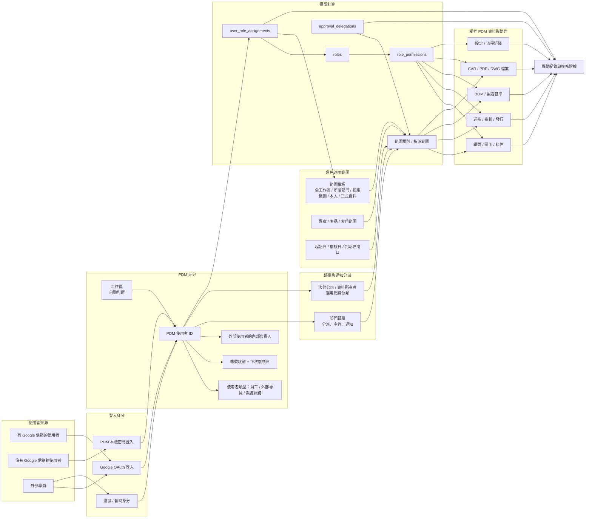

# SPEC-PDM-ACCESS-CONTROL-001 使用者身分、組織範圍與權限架構

狀態: 本地上線切片、帳號邀請、Google provider-neutral identity 與 `DEV-045` 帳號生命週期 Phase 1 已完成並通過驗證；完整權限切換與正式環境仍分別受後續 gate 管理。
日期: 2026-07-07
負責: Dev PM
關聯開發任務: `DEV-PDM-ACCESS-CONTROL-001`

2026-07-13 架構續接：`ADR-PDM-ERP-PLATFORM-001` 已選定 Firebase Auth with Identity Platform 作為未來共用 IAM；RD 完整性決策再確認 Firebase 終止於 Next.js BFF、browser 不直連 Supabase、Admin/Approver 採 TOTP、application session 上限八小時，兩位 cloud break-glass 管理員不取得 PDM business role。本文件既有 provider-neutral identity、stable PDM user ID、角色/公司範圍與 fail-closed 規則維持有效。此變更不代表 Firebase 已實作或已切換正式登入。

關聯脈絡:

- `.ai-doc/specs/SPEC-PDM-SETTINGS-CENTER-001-system-settings-center-secret-lifecycle.md`
- `.ai-doc/qa/qa-pdm-numbering-permission-guard-validation-plan-2026-06-01.md`
- `db/schema.sql`
- `src/lib/auth-async.ts`
- `src/lib/repositories/access-control-async-repository.ts`
- `src/lib/permissions.ts`

本文件以中文使用者語言為主。路由、資料表、欄位、權限代碼、產品名稱與測試指令保留原文，方便 RD 對照程式。

## 1. 使用者決策摘要

來源: 2026-07-07 使用者討論、系統圖、公司/部門/角色複雜度追問、角色權限設定 UI 討論、HCS 引導決策 `1C / 2A / 3A`、外部專員複核策略、第一版角色範圍預設、無 Google 帳號處理、RD 主管完整性審視、鉦富先上線且保留未來久方擴充策略；2026-07-12 使用者要求將角色指派時間區間設定功能加回。

已確認的產品規則:

- PDM 使用者身分不能等於 Google 信箱。Google 信箱只是登入方式，不是授權來源。
- 使用者可能有 Google 信箱，也可能沒有 Google 信箱；兩者都要對應到同一個穩定的 `PDM User ID`。
- 組織架構仍在變動，且同仁可能跨部門、身兼多職，所以組織架構不能當作主要權限模型。
- 一個使用者可以同時有多個 PDM 角色。
- 部門、專案、產品線、客戶是權限範圍條件，不是使用者的完整身分。
- 多家公司使用本系統時，應以工作區作為資料邊界。一般公司管理員不應在日常權限設定中反覆選公司。
- 「公司」要拆成兩層概念:
  - 工作區: 目前登入者所在的客戶或公司資料邊界，由部署、網域、邀請或登入脈絡自動判斷。
  - 法律公司或資料所有者: 工作區內部的選用分類，例如鉦富或久方；除非後續有需求，不放到一般權限設定流程。
- 部門只負責歸屬、預設主管、通知與待辦分派，不會自動給予審核、發行、匯出或設定權限。
- 角色決定「可以做什麼動作」。
- 範圍決定「這個角色可以用在哪裡」。
- 第一版先提供簡單範圍模板，不讓一般管理員直接面對公司、部門、專案、日期等底層規則。
- 生效日、複核日、到期停用日主要用於外部專員、臨時支援與代理，不要讓一般員工角色設定變得過重。
- 時間區間不是純 UI metadata：未到生效日或已達硬性到期邊界的角色指派，所有同步／非同步 permission path 都必須拒絕其角色權限。
- 角色權限 UI 要拆成兩件事:
  - 角色定義: 這個角色能做哪些動作。
  - 使用者指派: 誰拿到這個角色、套用在哪個範圍、是否需要複核或到期。
- 審核矩陣中的「規則摘要」必須用管理者看得懂的「情境 / 處理」句型，由觸發動作、階段、狀態、料件、風險、是否需要審核、標示方式與審核角色自動產生；畫面上「情境」與「處理」必須分行顯示，不允許管理員自由輸入成另一套真相。
- 一般審核矩陣不得讓管理員手動設定「阻擋使用」或「阻擋發行」；系統固定推導為工作中使用不阻擋但要標示風險，正式發行一律進 gate。真正禁止工作中使用的情境只能放在不可關閉的硬性限制。
- 資料表中的 `rule_name` 僅作為通知、稽核與追蹤顯示名稱；真正決定系統行為的是 action/condition/control 欄位，不是 `rule_name`。
- 若未來需要人工文字，應新增「管理備註」或「制度說明」欄位；該欄位不得參與權限判斷。
- 一般管理員看到的是目前工作區的唯讀提示，不是公司選擇器。
- 第一版角色 UI 用清單、表格與聚焦詳情，不做公司 x 部門 x 角色 x 權限的大矩陣。
- 使用者角色指派必須選擇範圍模板，並在儲存前顯示使用者看得懂的權限預覽。
- 外部專員指派必須有內部負責人、指定範圍與第一次 90 天複核日。
- 外部專員是系統使用者，但不放進公司內部組織樹。
- 外部專員需要內部負責人、明確範圍、90 天軟性複核提醒與異動紀錄。
- 第一版外部專員預設只能讀取、留言與提供建議。
- 第一版外部專員預設不能建立、編輯、審核、發行、批次下載、不受控匯出或調整系統權限。
- 外部專員複核預設 90 天；到期只提醒並留下紀錄，不自動停權。
- 第一版角色範圍預設:
  - 研發工程師: 所屬部門。
  - 研發主管: 所屬部門。
  - 品保: 由系統或 PDM 管理員預設的品質檢視範圍。
  - 製造與採購: 僅正式發布資料。
  - 外部專員: 指定範圍。
- 沒有 Google 信箱的使用者由管理員邀請，第一次登入時設定密碼。
- 未來 Firebase production IAM 路徑採 email-link 先驗證信箱與 canonical `account_invitations`，再於 freshly authenticated setup state 連結密碼；Firebase password reset 只用於啟用後復原，不等於邀請接受。DEV-042/045 既有本機 token 流程仍是已完成 local evidence，不被改寫成 Firebase 已實作。
- 鉦富先上線，先做一個自動判斷的 `JENFU` 工作區；保留未來久方擴充抽象層。
- 現階段不做平台級 SaaS 管理台，也不做一般管理員跨公司切換。
- Google SSO 或本機登入只能連到已由管理員建立或邀請的 PDM 使用者。
- 不允許 Google 自行註冊成 PDM 使用者，也不允許只靠 email domain 自動給角色。
- 權限切換採模型先行: 先補身分、組織、角色、範圍基礎，再做旁路比對與受控切換。
- 不接受一次把所有路由直接切到新權限模型，除非已有路由盤點、差異證據、功能旗標與復原機制。
- 使用者面向一律使用「外部專員」這個詞。
- PDM 仍是 PDM 角色、審核與權限決策的主體；Google Workspace 只提供帳號來源或 Drive 整合。
- 不接受共用人員帳號，因為會破壞審核、發行、下載與稽核責任。

已拒絕的做法:

- 只用 Google 信箱當作永久使用者身分。
- 讓 Google 群組直接決定 PDM 審核或發行權限。
- 把外部專員假裝成內部部門。
- 長期只靠 `users.role` 單欄位做權限。
- 建立 `manufacturing`、`field`、`specialist`、`cad-station` 這類共用人員帳號。
- 要求一般管理員每次設定權限都選公司。
- 讓部門歸屬自動變成動作權限。
- 預設顯示底層進階範圍規則給所有管理員。
- 第一版做公司、部門、角色、權限混在一起的大型可編輯矩陣。
- 高風險角色或範圍變更沒有預覽、原因與異動紀錄就能儲存。

AI 實作假設:

- `users.role` 在完整切換前保留相容用途。
- 既有 `roles`、`role_permissions`、`user_role_assignments`、`role_priority_versions`、`role_scope_rules`、`approval_delegations` 是起點，不整批推倒重做。
- 現有本機帳密登入可以保留，未來身分提供者透過 adapter 接上。
- 既有 `company_id` 與 `user_company_memberships` 先視為相容表面。第一版對應到單一鉦富工作區，未來久方擴充仍走工作區抽象層。
- `/settings/workflow` 是第一個使用者與權限治理畫面，因為設定中心已把它定位在流程、角色與審核矩陣。
- Schema 變更先做加法，避免破壞 SQLite 與 Supabase/Postgres 兩條路徑。
- 本文件不授權正式環境部署、身分提供者 live 切換或資料遷移。

需重新決策的情境:

- 使用者要求 Google Workspace 群組直接控制 PDM 權限。
- 使用者要求一般管理員在同一個設定畫面管理多個無關客戶工作區。
- 使用者要求外部專員預設可以審核、發行或修改受控主資料。
- 使用者要求共用人員帳號。
- 使用者要求正式環境遷移、身分提供者切換、部署、直接修資料或刪資料。
- 使用者要求 Google 登入自動註冊或網域自動授權。
- 使用者要求無路由盤點、無旁路比對、無旗標與無復原機制的一次性完整權限切換。

## 2. 問題

系統準備開放多人使用。現況已經有兩套重疊的權限方式:

- 早期方式: `users.role`，例如 `Engineer`、`R&D Manager`、`Admin`、`Manufacturing`、`Procurement`。
- 新方式: `roles`、`role_permissions`、`user_role_assignments`、角色優先序與代理權限檢查。

這對 MVP 足夠，但對上線不夠，原因是:

- 有些人有 Google 帳號，有些人沒有。
- 組織架構還在變。
- 一個人可能屬於多部門或身兼多職。
- 外部專員需要進系統，但不能變成內部組織成員。
- 異動紀錄必須回答: 誰在什麼角色、什麼範圍、什麼時間做了什麼事。

## 3. 產品規則

權限邊界:

```text
登入方式 = 使用者如何證明自己是誰
工作區 = 目前登入者所在的客戶或公司資料邊界
PDM 使用者 ID = 可追責的穩定使用者或系統身分
部門歸屬 = 這個人在哪裡工作，用於主管、通知與待辦分派
角色指派 = 這個人可以負責什麼事
適用範圍 = 這個角色可以用在哪裡
權限 = 哪個頁面或動作可被允許
異動紀錄 = 當下決策與行為的證據
```

不可妥協規則:

- 工作區必須在權限判斷前先被判斷，不是一般管理員日常逐筆設定的欄位。
- PDM 授權必須由 PDM 角色、權限代碼、指派狀態、指派範圍、帳號狀態與有效期間共同計算。
- 角色有效條件統一為 `revoked_at IS NULL AND (starts_at IS NULL OR starts_at <= now) AND (hard_ends_at IS NULL OR now < hard_ends_at)`；代理使用對應的 `starts_at/ends_at`，不得只有管理 UI 套用。
- 部門歸屬不能單獨給予動作權限。
- 登入提供者資料不能繞過 PDM 權限檢查。
- 外部專員權限必須有內部負責人與複核日期。
- 第一版外部專員 90 天複核是軟性提醒，到期不自動停權。
- 高風險動作在角色、範圍或帳號狀態不能證明時必須拒絕。
- 角色指派、代理、外部專員授權、審核、發行、下載與高風險拒絕都必須可稽核。
- 第一版管理員 UI 預設只顯示簡單範圍模板；只有角色或使用者類型需要時才露出進階範圍。

## 4. 最終架構



## 5. 範圍

### 5.1 本任務範圍

- 定義上線可用的使用者身分與權限架構。
- 拆開登入方式、工作區、PDM 使用者、部門歸屬、角色指派、範圍模板與權限。
- 支援有 Google 信箱與沒有 Google 信箱的使用者。
- 支援一人多角色與一人多部門。
- 支援不在公司內部組織樹下的外部專員。
- 讓一般管理員的第一版 UI 維持簡單: 基本身分、部門、角色與範圍模板。
- 非必要時隱藏公司、專案、日期等底層進階範圍規則。
- 延續既有角色權限引擎。
- 定義分階段、驗收、QA/QC 與停止條件。
- 正式環境、部署、遷移與 release artifacts 需等使用者另行授權。

### 5.2 不在本任務範圍

- 這次授權的本地上線切片以外的產品實作。
- Google OAuth 設定或身分提供者切換。
- 正式環境部署。
- 正式 schema migration 或資料修復。
- 直接刪資料。
- live Supabase RLS 或 grant 變更。
- HR、ERP、薪資或 Google Workspace 組織圖同步。
- 一般管理員每次設定使用者或角色都要選公司。
- 供應商或客戶 portal 重設計。
- 讓 Google Workspace 群組成為 PDM 角色主控。
- 讓外部專員預設具備審核或發行權限。

## 6. 既有系統如何接上

可沿用的基礎:

- `users`: 目前的應用程式使用者紀錄，仍有 `email`、`password_hash`、`role`、`company_id`。
- `companies`、`users.company_id`、`user_company_memberships`: 已支援公司範圍，但第一版需視為鉦富工作區相容層。
- `roles` 與 `role_permissions`: 已能描述頁面與動作權限。
- `user_role_assignments`: 已支援一人多角色與撤銷欄位。
- `role_priority_versions`: 已支援多角色衝突時的優先序。
- `approval_delegations`: 已支援限時、限動作或限專案代理。
- `AsyncAccessControlRepository.checkPermission`: 已會評估角色、代理、權限列與優先序。
- `requireNumberingPermissionAsync`: 已保護編號相關頁面與動作。

已知缺口:

- 許多非編號權限仍由 `users.role` 決定。
- `users.email` 仍是登入識別與唯一 handle。
- 已有 `auth_identities` provider-neutral 身分表與 local/Google/invite identity。
- 尚未有從 `companies` 拆出的正式工作區模型。
- 尚未有員工與外部專員的一級帳號分類。
- 尚未有外部專員的內部負責人欄位。
- 尚未有正式部門或組織單位模型。
- `role_scope_rules` 偏角色層級，不足以描述每個人的指派範圍。
- 尚未有給管理員使用的簡單範圍模板。
- 已有管理員邀請、一次性啟用、邀請撤銷、帳號停權/復權/離職/復職、密碼重設、identity 停用/復用與全部 session 撤銷；DEV-045 Phase 1 本機 QC 已通過，正式 release 仍需 DEV-032 gate。

## 7. 分階段路線圖

| 階段 | 授權狀態 | 文件狀態 | 目的 |
|---|---|---|---|
| Phase 0 架構整理 | 已授權 | 完成 | 記錄已接受的系統圖、邊界與開發任務 |
| Phase 1 身分提供者邊界 | 部分授權 / 無 Google 邀請已實作 | 邀請切片驗證通過；Google/provider model 仍待授權 | 讓 Google 與無 Google 使用者都能對應到穩定 PDM 使用者 |
| Phase 2 工作區、部門與外部人員模型 | 部分授權 / 本地已實作 | 上線切片驗證通過；完整模型仍待授權 | 鉦富唯讀工作區、外部專員負責人、指定範圍與複核資料 |
| Phase 3 權限整合與範圍模板 | 部分授權 / 本地已實作 | 上線切片驗證通過；完整路由切換仍待授權 | 製造、採購、外部專員角色、保守範圍模板與權限預設 |
| Phase 4 管理 UI 與治理 | 本地已實作；DEV-045 Phase 1 QC Passed | 權限 UI 與帳號生命週期 Phase 1 已通過本機 QC | `/settings/workflow` 權限治理；`/settings/accounts` 帳號生命週期已落地 |
| Phase 5 正式環境上線與遷移 | 需要 release 授權 | RD Contract Ready / 未授權 | 資料遷移、正式 smoke、rollback 與 release gate |

## 7.1 已完成的本地上線切片

使用者授權:

- 使用者接受 A+「鉦富先上線、保留未來久方擴充」策略後，明確授權執行使用者與權限功能開發。

本地已完成:

- `/settings/workflow` 顯示唯讀「目前工作區：鉦富 Jenfu PDM」，沒有公司選擇器。
- SQLite 啟動 schema 與 Postgres migration planning 已加入角色指派欄位: 適用範圍、指定範圍、內部負責人、起始日、複核日與到期停用日。
- 已建立上線初版角色: 製造、採購、外部專員。
- 外部專員預設只能查詢、看圖、留言與提供建議。
- 外部專員預設不能建立、發行、匯出或調整權限設定；若未來要開放必須另外授權。
- 角色指派 API 會接收範圍資料，並檢查外部專員必須有指定範圍、內部負責人與 90 天複核日。
- 同步與非同步 repository 都套用相同的角色指派治理規則。
- `/settings/workflow` 已分成「角色管理、使用者權限、外部專員、異動紀錄」。
- 使用者指派表單包含適用範圍、指定範圍、內部負責人、開始生效、下次複核、到期停用日、指派原因與儲存前權限預覽。
- DEV-045 Phase 1 已讓本地 permission role-code queries 套用 `starts_at <= now < hard_ends_at`；未生效與已到期指派不得授權。
- 外部專員在指定範圍、內部負責人、複核日與原因未填完前不能儲存。
- 權限異動紀錄由管理矩陣 API 回傳，並顯示在「異動紀錄」分頁。
- 角色管理中的審核規則矩陣必須顯示中文管理語言，不直接顯示 `actionCode`、`riskFlag`、狀態代碼或硬性規則代碼；內部代碼只能保留在 API/value 層。
- 預設審核規則 seed 必須先確保目前預設 rule version 存在，避免舊本機資料庫缺 `numbering-rule-v3-alpha-root` 時造成 FK 失敗。
- Supabase migration mirror 只做規劃檔；本機沒有 Supabase CLI，所以沒有執行 live Supabase history validation。

實作檔案:

- `db/schema.sql`
- `db/postgres/005_access_control_launch_governance.sql`
- `supabase/migrations/20260707010000_access_control_launch_governance.sql`
- `supabase/migrations/manifest.json`
- `src/lib/db.ts`
- `src/lib/numbering-permission-codes.ts`
- `src/lib/repositories/numbering-repository.ts`
- `src/lib/repositories/numbering-async-repository.ts`
- `src/lib/repositories/access-control-async-repository.ts`
- `src/app/api/numbering/admin/matrix/route.ts`
- `src/app/settings/page.tsx`
- `scripts/qc-pdm-access-control-governance.mjs`
- `package.json`

驗證證據:

- `npx.cmd tsc --noEmit --pretty false`: 通過。
- `npm.cmd run qc:pdm-access-control-governance`，`PDM_BASE_URL=http://127.0.0.1:3000`: 通過 93/93，含 desktop/mobile 規則矩陣中文化、規則摘要使用管理者可讀句型、情境與處理分行顯示、使用/發行控制由系統推導、規則摘要不可自由輸入、無 raw developer code、使用者權限、外部專員、異動紀錄與 overflow 檢查。
- `npm.cmd run lint`: 0 errors；另有 3 個既有 warnings 在 `src/components/master-attachment-panel.tsx`。
- 本機 server 已用 `scripts/start-localhost-3000.ps1 -RestartProjectProcess -CleanNext -NoBrowser` 重新啟動，health checks 通過 `/`、`/login`、`/api/auth/me`。
- 規則矩陣截圖證據: `output/playwright/access-control-rule-matrix-desktop.png`, `output/playwright/access-control-rule-matrix-mobile.png`。

仍未授權:

- 正式環境部署、正式 schema migration、live Supabase migration 或 provider pointer change。
- Live Google OAuth provider/credential setup、Google login self-registration、domain-based role grant 或 Google Workspace group authority。
- 帳號停用/復權管理 UI、密碼重設、離職流程與主動 session 撤銷；自動寄信 provider 尚未選定，邀請頁目前以預填郵件或複製連結交付。
- 這個上線切片以外的完整路由盤點、shadow evaluation、feature flag 與受控權限切換。
- 未來久方工作區 provisioning。
- 外部專員到複核日後自動停權。
- 平台級 SaaS 管理台或一般管理員跨公司切換。

## 7.2 無 Google 帳號邀請與首次密碼設定切片

2026-07-10 使用者明確授權實作「內部人員收到邀請連結並自行設定密碼」。本地已完成:

- 管理員可在 `/settings/account-invitations` 建立、查看與撤銷邀請；工作區固定為鉦富，不增加公司選擇器。
- 邀請預設 7 天、最長 30 天，只能使用一次；同一 email 不能同時存在兩筆 pending 邀請。
- token 使用 32-byte 隨機值，資料庫只保存 SHA-256 `token_hash`；清單 API 不回傳 token 或 hash。
- 受邀者從 `/invite/accept?token=...` 設定 10-128 字元、含英文字母與數字的密碼；成功後建立使用者、公司 membership、session 與 audit。
- 已接受、已撤銷、已到期、無效或重複使用的連結都 fail closed；非 Admin 不可建立或撤銷邀請。
- `official-numbering-draft` production slice 只額外開放邀請管理頁、公開 lookup/accept 與必要 mutation，不開放完整系統設定 mutation。
- managed 登入頁不再顯示 demo 帳密，並告知尚無帳號者向系統管理員取得邀請。
- PostgreSQL/Supabase migration mirror 對 `account_invitations` 啟用並強制 RLS，撤銷 `anon`/`authenticated` 直接表權限；應用程式只走 server-side API。
- 目前沒有經核准的 SMTP/Outlook runtime provider，因此建立邀請後由管理員使用預填郵件或公司核准通訊工具寄送；正式上線前必須設定 `PDM_PUBLIC_BASE_URL` 為 canonical HTTPS origin。

驗證證據:

- `npm.cmd run qc:pdm-account-invitations`: 25/25。
- `npx.cmd tsc --noEmit --pretty false`: 通過。
- `npm.cmd run qc:postgres-shadow`: 26/26。
- `npm.cmd run qc:supabase-runtime-migrations`: 33/33。
- Playwright: `output/playwright/account-invitations-desktop.png`、`account-invitations-mobile.png`、`account-invitation-accept-mobile.png`、`managed-login-mobile.png`。

仍延後: 自動寄信 provider、忘記密碼/重設、帳號停用/復權管理 UI、離職、MFA、主動 session 撤銷與正式環境 migration/deploy。

## 7.3 Google 身分與 provider-neutral identity 切片

2026-07-10 使用者依既有帳號架構明確要求續接開發。本地已完成 `DEV-PDM-GOOGLE-IDENTITY-001`:

- 新增 `auth_identities`，支援 `local_password`、`google_oauth`、`invite`；Google 使用不可變 `sub` 作為 `provider_subject`，email 只作登入提示與聯絡資料。
- `users.account_status` 支援 `active`、`suspended`、`expired`、`offboarded`；非 active 使用者無法建立新 session，既有 PDM session 也會在下一次解析時被拒絕。
- 本機帳密與 Google 都解析到同一個穩定 `users.id`；PDM session 仍只保存 PDM user ID，不保存 provider token、secret、角色或 Google claim。
- Google 初次綁定只能從有效的管理員邀請開始；受邀 email 必須與 Google verified email 相同。一般 Google 登入只依已綁定 `sub` 查找，不會因 email 相同而自動建立或合併帳號。
- OAuth 使用 server-side authorization-code flow、state、nonce、PKCE S256、audience/signature/expiry 驗證；access token、ID token、refresh token 與 client secret 都不寫入資料庫或 audit。
- `/login` 與 `/invite/accept` 保留 Google 控制；未完成 credential setup 時按鈕停用並顯示「未開放」，不隱藏未來藍圖。
- `PDM_GOOGLE_OAUTH_ENABLED` 是明確 rollout switch；啟用還需要 client ID、client secret、HTTPS/loopback redirect URI 與至少 24 字元、非預設的 `PDM_AUTH_SECRET`。
- SQLite runtime migration 會 backfill 現有本機密碼身分；PostgreSQL/Supabase mirror 使用 `007_auth_identities_google_oauth.sql`，對 `auth_identities` 強制 RLS 並撤銷 `anon`/`authenticated` 直接權限。

驗證證據:

- `npm.cmd run qc:pdm-google-identity`: 19/19，含 mocked OIDC、未知 Google 身分拒絕、邀請綁定、email mismatch、重複 subject、state tamper、停用帳號、session 與 token-redaction。
- `npm.cmd run qc:pdm-account-invitations`: 25/25；密碼啟用會建立 `local_password` 與 `invite` identities。
- `npm.cmd run qc:managed-auth`: 21/21。
- `npm.cmd run qc:supabase-runtime-migrations`: 33/33；`npm.cmd run qc:postgres-shadow`: 26/26。
- `npm.cmd exec tsc -- --noEmit`: 通過；獨立 Next production build 通過。
- UI: `output/playwright/google-identity-login-desktop.png`、`google-identity-login-mobile.png`、`google-identity-invite-mobile.png`；390x844 無水平溢位，browser console 0 errors/warnings。

本輪不代表 live Google OAuth 已開放。Google Cloud OAuth Web client、consent screen、正式 redirect URI、正式 secret、Supabase migration 套用、provider rollout、production smoke 與部署仍屬 release gate。

## 8. RD 交接契約

### Phase 1 身分提供者邊界

目的:

- 讓有 Google 與無 Google 的登入方式，都能對應到同一個穩定 PDM 使用者。

範圍:

- 新增 additive identity model，例如 `auth_identities`。
- 保留現有本機帳密登入，同時加入 provider-neutral lookup。
- 支援 provider types: `local_password`、`google_oauth`、`invite`。
- 增加上線需要的帳號狀態: active、suspended、expired/offboarded。
- Session token 只保存穩定的 PDM 使用者身分，不保存登入提供者的授權權威。
- 第一版無 Google 使用者由管理員邀請，第一次登入時設定密碼。
- 第一版 Google 使用者必須連到已由管理員建立或邀請的 PDM 使用者，不允許自行註冊或靠網域自動授權。

不在範圍:

- 正式 Google OAuth 切換。
- Google 群組權限對應。
- 一次替換所有登入 UI。

實作契約:

```text
auth_identities(
  id,
  user_id,
  provider,
  provider_subject,
  login_identifier,
  email_normalized,
  verified_at,
  last_login_at,
  status,
  created_at,
  updated_at
)
```

- `users.email` 在相容期可保留為顯示與聯絡用途，但授權必須使用 `users.id`。
- 必須防止重複的身分提供者識別。
- 無 Google 使用者不能被迫建立假 Google 信箱。
- Google email 若只剛好符合顯示信箱，但尚未有管理員核准的身分連結，登入結果必須等待管理員處理，不能自動建立或合併權限。

驗收:

- 既有本機登入仍可使用。
- Google 身分可連到既有 PDM 使用者而不改變 user ID。
- Google 登入不能自行建立有效 PDM 使用者。
- 無 Google 使用者可以不用 Google 信箱登入。
- 邀請中的無 Google 使用者可在第一次登入時設定密碼。
- 停用或到期使用者不能透過任何 provider 登入。
- 異動紀錄可記錄登入 provider 類型，但不能存 token 或 secret。

證據:

- identity lookup、重複防止、停用帳號拒絕的單元或整合測試。
- 無 Google 首次登入與密碼設定 smoke。
- 本機帳號與 mocked Google identity auth smoke。
- 未知 Google 身分不可自行註冊或取得預設角色的負向測試。
- 權限檢查必須使用 PDM `user.id` 的靜態檢查。

### Phase 2 工作區、部門與外部人員模型

目的:

- 能表示工作區、變動部門、一人多部門與外部專員，同時不污染權限邏輯。

範圍:

- 定義可由部署、網域、邀請、URL segment 或登入脈絡自動判斷的工作區。
- 第一版只有鉦富: seed 或 resolve 一個 `JENFU` 工作區並在 UI 顯示為唯讀。
- 一般 tenant admin 預設只能在自己的工作區內操作；跨 tenant 管理屬於未來平台管理員範圍。
- 將鉦富、久方等法律公司視為工作區內的選用資料所有者分類，而不是日常權限設定選擇器。
- 加入 `user_type`: `employee`、`external_specialist`、`service`。
- 加入部門歸屬模型，處理歸屬、預設主管、通知與待辦分派。
- 加入外部專員 profile 或欄位: 內部負責人、授權原因、下次複核日、選用到期停用日。
- 允許一位使用者有多個有效期間不同的歸屬。

不在範圍:

- 完整 HR 組織圖同步。
- 讓部門歸屬等於權限。
- 要求一般管理員每次指派使用者或角色都選公司。
- 供應商或客戶 portal 重設計。

實作契約:

```text
workspaces(id, workspace_code, display_name, status)
legal_entities(workspace_id, entity_code, display_name, status)
org_units(workspace_id, parent_org_unit_id, unit_code, display_name, status)
user_org_memberships(user_id, org_unit_id, membership_kind, is_primary, starts_at, ends_at, status)
external_access_profiles(user_id, sponsor_user_id, party_name, access_reason, starts_at, review_due_at, auto_extend_review, last_reminded_at, hard_ends_at, status)
```

- 第一版 `workspaces` 可先作為既有 `companies` 的相容抽象，且只有 `JENFU` 是 active workspace。
- 未來久方可新增第二工作區，或經另外決策後作為隱藏法律公司/資料所有者分類。
- 不得為一般管理員加入跨工作區授權能力。
- 部門歸屬支援通知與預設範圍，但不授予動作權限。
- 外部專員可以有專案、產品、客戶或法律公司範圍，但不需要內部部門歸屬。
- 第一版外部專員複核是軟性提醒: 預設 90 天，到期提醒與留紀錄，不自動停權。

驗收:

- 一般管理員做日常使用者或角色設定時不需要選公司。
- 鉦富使用者會自動進入鉦富工作區。
- 未來新增久方時不需重做使用者身分或角色指派表。
- 一位員工可有多個部門。
- 外部專員可存在且不需內部組織單位。
- 外部專員不能看指定範圍以外的資料。
- 部門歸屬不能單獨帶來審核、發行或下載權限。
- 管理員看得到內部負責人、指定範圍與下次複核日。

證據:

- 鉦富預設工作區解析與歸屬狀態解析測試。
- 無一般管理員公司選擇器與無跨工作區指派路徑的負向測試。
- 外部使用者範圍拒絕 API 測試。
- 內部負責人、帳號生命週期、複核提醒的異動紀錄測試。

### Phase 3 權限整合與範圍判斷

目的:

- 讓敏感路由改用明確權限與簡化範圍模板，而不是只看 `users.role` 或部門。
- 採模型先行: 先建立身分、組織、角色、範圍基礎，再旁路比對，最後受控切換。

範圍:

- 盤點仍使用 `requireRoleAsync` 或直接看 `user.role` 的路由。
- 定義非編號模組的主要頁面與動作權限代碼。
- 對高風險路由加入旁路判斷: 同時計算新舊權限結果，先記錄差異，不直接改變使用者行為。
- 擴充或包裝 `AsyncAccessControlRepository.checkPermission`，納入工作區、部門衍生範圍、專案/產品/客戶、法律公司與外部專員範圍。
- 加入第一版範圍模板:
  - `workspace_all`: 工作區內全部資料，只給系統或 PDM 管理員、或 seeded policy。
  - `own_department`: 使用者有效部門範圍。
  - `assigned_scope`: 指定專案、產品、客戶或法律公司。
  - `self_created`: 使用者建立或送出的資料。
  - `released_only`: 只看正式發布資料。
  - `external_named_scope`: 外部專員指定範圍。
- 若角色層級範圍規則不足，加入 per-assignment scope model。
- `users.role` 只作為相容期預設或 seed，完整遷移後不能當作唯一權限依據。

不在範圍:

- 未經決策就改產品審核規則。
- 自動把系統管理員變成工程審核者，除非另行授權。
- 沒有路由盤點、旁路證據、功能旗標與復原機制的一次性正式切換。

實作契約:

```text
role_assignment_scopes(
  assignment_id,
  scope_template,
  scope_kind,
  scope_code,
  allowed,
  starts_at,
  ends_at
)
```

權限判斷順序:

```text
登入 -> 解析使用者 -> 帳號狀態 -> 有效角色/代理 -> 權限代碼 -> 範圍 -> 允許或拒絕 -> 異動紀錄
```

模型先行切換順序:

1. 以加法新增身分、工作區、組織、外部專員與範圍 schema/repository adapter。
2. 從現有 `users.role`、`company_id`、`roles`、`user_role_assignments` 建立相容 mapping。
3. 對選定高風險路由做旁路權限判斷，不改變可見行為。
4. 差異證據消除後，才透過 feature flag 或等效 gate 切換。
5. QA/QC 證明新 evaluator 覆蓋該路由群後，才移除 legacy fallback。

管理員 UI 的指派模型:

```text
使用者 + 角色 + 範圍模板 + 選用進階範圍 + 選用有效期間
```

驗收:

- 工程師沒有明確角色/動作權限時，不能審核或發行。
- 製造與採購只能讀正式資料，不能讀草稿。
- 外部專員預設不能改受控資料。
- 多角色使用者的有效權限由優先序穩定決定。
- 管理員能用部門、角色、範圍模板完成常見指派，不需要看底層規則。
- 部門變更只影響分派或預設範圍，不能自己產生動作權限。
- 代理只在專案、動作與日期範圍內有效。
- 路由正式切換前，QA/QC 看得到旁路判斷差異。

證據:

- 切換前後路由盤點。
- 選定路由群的旁路判斷差異報告。
- 高風險路由 API 401/403 測試。
- 研發、研發主管、管理員、製造、採購、外部專員跨角色回歸測試。
- 高風險拒絕的異動紀錄證據。

### Phase 4 管理 UI 與治理

目的:

- 讓管理員能安全管理帳號、角色、範圍、外部專員與定期複核。
- 讓權限設定像「對某個人負責授權」，不是在操作底層權限引擎。

範圍:

- 在設定、流程、安全頁面加入帳號與角色指派 UI。
- 第一版依設定中心資訊架構:
  - `/settings/workflow`: 角色定義、權限矩陣、角色指派、範圍模板、審核/流程矩陣。
  - `/settings/accounts`: DEV-045 帳號生命週期、登入 identity 狀態與 session/recovery 操作。
  - `/settings/security`: 保留高敏感金鑰狀態與受控 secret lifecycle，不再混用為帳號管理頁。
  - `/settings`: 工作佇列總覽，包含待複核權限、外部專員複核提醒與高風險阻擋。
- 預設流程:

```text
基本身分 -> 部門歸屬 -> 角色指派 -> 範圍模板 -> 只有需要時才設定有效期間
```

- 角色權限設定拆成四個任務分頁或等效區塊:
  - 角色管理: 角色清單與角色詳情。
  - 使用者權限: 使用者角色指派與儲存前權限預覽。
  - 外部專員: 內部負責人、指定範圍與複核提醒。
  - 異動紀錄: 角色、範圍與帳號生命週期異動。
- 頁面標題附近顯示唯讀目前工作區，例如「目前工作區: 鉦富 Jenfu PDM」。
- 第一版角色指派流程不加入一般管理員公司下拉選單。
- 角色表格顯示角色名稱、角色類型、權限摘要、已指派人數、風險與狀態。
- 角色詳情要拆開:
  - 基本角色資料。
  - 依模組與動作分組的權限矩陣。
  - 已套用使用者。
  - 預設範圍模板說明。
  - 權限預覽。
  - 異動紀錄。
- 權限矩陣只處理動作。公司、部門、專案、客戶、日期不進矩陣軸線。
- 使用者角色指派表單包含:
  - 以姓名、信箱或 PDM ID 搜尋使用者。
  - 部門歸屬顯示或選擇。
  - 角色選擇。
  - 範圍模板。
  - 只有選到需要指定範圍時才填指定範圍。
  - 外部、臨時或代理預設填有效期間；一般員工也可由 Admin 展開「設定有效期間」後填寫。
  - 有效期間提供開始生效與到期停用兩個控制；空白開始表示立即，空白到期表示無硬性到期。
  - 原因。
  - 只有外部專員才必填內部負責人。
- 儲存前必須顯示使用者看得懂的權限預覽，例如:

```text
此使用者可在所選部門範圍內查看、建立與編輯草稿圖面/BOM。
此使用者不會取得刪除、審核、發行或系統設定權限。
```

- 高風險變更必須要求原因、預覽與確認:
  - 授予管理員或系統設定權限。
  - 新增審核或發行權限。
  - 擴大到全工作區。
  - 讓外部專員可下載、匯出或修改資料。
  - 調整多角色衝突優先序。
- 第一版可見範圍模板:
  - `workspace_all`: 全工作區，只給系統/PDM 管理員或 seeded policy。
  - `own_department`: 有效部門歸屬。
  - `assigned_scope`: 指定專案、產品、客戶或法律公司。
  - `self_created`: 使用者建立或送出的資料。
  - `released_only`: 正式發布資料。
  - `external_named_scope`: 外部專員指定範圍。
- 一般管理員預設選單要保守，只顯示常用模板。
- 第一版不做底層多條件範圍規則 builder。
- 加入外部專員複核提醒與內部負責人複核。
- 加入角色指派原因、核准者、起迄日與撤銷流程。
- 加入定期權限複核報表。
- 加入「為什麼這個人有或沒有某個權限」的可見說明。
- 進階公司、專案、日期規則放在明確的進階控制後面。
- 主畫面只顯示任務、狀態、下一步與短風險；原始判斷證據放在 detail、drawer 或 popover。

UX 目標:

- 主要使用者: 公司管理員、PDM 管理員、未來平台管理員。
- 核心問題: 誰可以做什麼、在哪個範圍、我按儲存後會改變什麼。
- 成功狀態: 管理員能找到角色或使用者、理解有效權限、做範圍化指派、看到預覽、留下異動紀錄，並能從阻擋狀態恢復。
- 五秒理解目標: 管理員能看出目前工作區、目前分頁、下一步、風險變更，以及是否需要選公司。
- 安全預設: 沒有公司選擇器、沒有底層進階規則 builder、沒有隱性擴大範圍；範圍不明時拒絕。

第一版畫面契約:

```text
設定 > 流程與權限

目前工作區: 鉦富 Jenfu PDM        [唯讀]
用角色定義可做的動作，再把角色用範圍模板指派給使用者。

[角色管理] [使用者權限] [外部專員] [異動紀錄]

角色管理:
  [新增角色] [搜尋角色]
  表格: 角色名稱 / 類型 / 權限摘要 / 已指派人數 / 風險 / 狀態
  點列開啟角色詳情。

角色詳情:
  基本角色資料
  權限矩陣: 模組列 x 動作欄
  審核矩陣: 規則摘要[唯讀] / 觸發動作 / 階段 / 狀態 / 料件 / 風險 / 審核角色 / 是否需要審核 / 標示方式
  已套用使用者: 使用者 / 部門 / 範圍模板 / 複核或到期 / 狀態
  權限預覽
  異動紀錄

使用者權限:
  [新增指派]
  表單: 使用者 -> 部門 -> 角色 -> 範圍模板 -> 選用指定範圍 -> 選用有效期間 -> 原因
  儲存前預覽

外部專員:
  外部專員 / 內部負責人 / 指定範圍 / 下次複核 / 狀態 / 最近提醒

異動紀錄:
  操作者 / 目標使用者或角色 / 變更前 / 變更後 / 原因 / 生效時間
```

狀態與下一步文案:

| 狀態 | 畫面先回答什麼 | 下一步 |
|---|---|---|
| 沒有自訂角色 | 尚未建立自訂角色，可先用內建角色或新增範圍化角色。 | 新增角色 |
| 角色無使用者 | 此角色尚未指派給任何人。 | 新增使用者指派 |
| 缺少範圍 | 尚未定義適用範圍，不能儲存此指派。 | 選擇範圍模板 |
| 外部專員缺複核日 | 外部專員需要第一次複核日期才能啟用。 | 設定複核日 |
| 沒有權限 | 此帳號不能調整權限設定。 | 回設定總覽 |
| 儲存失敗 | 變更未儲存，目前權限未改變。 | 檢查後重試 |

不在範圍:

- 取代 HR、薪資或合約管理。
- 未經授權從外部系統批次匯入。
- 一般管理員跨無關客戶工作區切換。
- 平台級多 tenant console。
- 預設顯示 raw SQL、RLS policy editor 或底層權限規則 builder。
- 專門手機 UI。窄版 sanity check 不能爆版，但手機不是主要操作面。

驗收:

- 管理員能看到帳號啟用、停用或到期狀態。
- 管理員能帶原因指派與撤銷角色。
- 管理員能設定角色開始／到期時間；未生效與已到期指派在所有 permission path 都不得授權，複核到期仍只提醒。
- 管理員能設定外部專員內部負責人、範圍與下次複核日。
- 外部專員複核到期或逾期狀態可見、可稽核並可提醒，但第一版不自動停權。
- 權限說明會顯示已評估的角色與範圍，不暴露 secret。
- 一般員工建立可完成，不需要手動選公司、專案或日期。
- 外部專員啟用前必須有內部負責人、指定範圍與第一次複核日。
- 角色與使用者清單使用適合掃描的表格或密集清單。
- 角色詳情把動作矩陣與使用者/範圍指派拆開。
- 審核矩陣的第一欄是唯讀「規則摘要」，不得顯示可自由輸入的規則名稱；新增規則也必須由觸發動作與條件自動產生「情境 / 處理」摘要，且畫面必須把情境與處理拆成兩行。一般審核矩陣 UI 只允許設定「是否需要審核」與「標示方式」；工作中使用不阻擋、使用處標示風險、正式發行一律進 gate 必須由系統推導。
- 一般管理員只看到唯讀工作區，不能切換無關 tenant。
- 權限矩陣只改動作；部門、公司、專案、客戶、日期由指派範圍處理。
- 必填範圍未完成前，指派儲存按鈕不可用。
- 高風險權限變更必須先預覽並填原因。
- 權限預覽同時顯示將授權項目與未授權高風險項目。
- 進階範圍只在外部專員、跨部門、產品/專案/客戶指定、法律公司指定或平台管理場景出現。
- 載入、空狀態、錯誤、阻擋、停用、成功、無權限與到期狀態都要回答管理員下一步要做什麼。

證據:

- 瀏覽器 UI 檢查帳號清單、角色指派、外部專員複核提醒與權限說明。
- 瀏覽器 UI 檢查「角色管理、使用者權限、外部專員、異動紀錄」分頁或等效路由。
- 儲存前權限預覽證據。
- 無一般管理員公司選擇器的負向 UI 證據。
- 部門歸屬不能單獨授權動作的負向 UI/API 證據。
- 非管理員拒絕 API 測試。
- fake-clock 驗證開始／到期 boundary 前、當下、之後，並比較同步／非同步、numbering 與 approval permission 結果一致。
- 建立、更新、撤銷的異動紀錄。
- 桌機與筆電主操作面、窄版 overflow sanity 的 viewport 證據。

### Phase 5 正式環境上線與遷移

目的:

- 安全地把上線使用者與權限政策遷移到正式環境。

範圍:

- 準備 migration/backfill scripts。
- 匯出目前使用者、角色與權限盤點。
- 執行 staged rollout、smoke、rollback rehearsal。
- 透過 `deployment-release-gate` 控制正式發布。

不在範圍:

- 沒有備份與 rollback 的 live 資料 mutation。
- 未經授權的 Supabase production migration。

驗收:

- 上線前 user/role/scope backfill dry-run 通過。
- 權限差異報告已被 QA/QC 與使用者接受。
- Production smoke 覆蓋登入、角色指派、外部專員、審核、發行與拒絕路徑。
- Rollback plan 可執行且保留證據。

證據:

- Migration dry-run report。
- Backup/rollback evidence。
- Production-like smoke。
- Deployment release gate report。

## 9. 第一版權限群組

| 角色 | 預期可用範圍 | 預設排除的高風險動作 |
|---|---|---|
| 系統管理員 | 全工作區，僅限受控設定與維運 | 不能取代產品審核責任，除非另行授權 |
| PDM 管理員 | PDM 設定、角色、流程、資料治理 | 不因管理員身分自動取得工程發行權 |
| 文件管理員 | 文件與附件治理 | 不預設審核或發行 |
| 研發工程師 | 所屬部門或本人資料 | 不預設審核、發行、系統設定 |
| 研發主管 | 所屬部門審核與待辦 | 不預設跨部門全域發行 |
| 品保 | 品質檢視範圍 | 全工作區品質視圖只能由系統/PDM 管理員或 seeded policy 指派 |
| 製造 | 正式發布資料 | 不能讀草稿，不能審核或發行 |
| 採購 | 正式發布資料 | 不能讀草稿，不能審核或發行 |
| 外部專員 | 內部負責人 + 外部專員角色 + 指定範圍 + 90 天複核提醒 | 只允許指定範圍內讀取、留言與提供建議；不預設下載、匯出、建立、編輯、審核或發行 |

## 10. QA / QC Gate

QA 需驗證:

- 使用者身分和登入方式已分離。
- 一般管理員看不到公司選擇器。
- 部門不能單獨授權動作。
- 多角色優先序穩定。
- 外部專員必須有內部負責人、指定範圍與複核日。
- 外部專員預設不能改資料、審核、發行或匯出。
- 沒有 Google 帳號者可走邀請與首次設定密碼流程。
- Firebase rollout 時，email-link、canonical invitation、password linking、重放/碰撞拒絕與「reset 不得接受邀請」皆有獨立證據。
- Google 登入不會自行註冊或自動授權。
- 權限預覽與異動紀錄可被使用者理解。

QC 需保留證據:

- 靜態路由盤點。
- API 401/403 測試。
- UI 角色指派與權限預覽截圖或 Playwright evidence。
- 外部專員複核與提醒 evidence。
- 無公司選擇器負向 evidence。
- shadow mismatch report，僅在 Phase 3/5 啟用時需要。

已完成的本地 QC:

- `scripts/qc-pdm-access-control-governance.mjs`
- `npx.cmd tsc --noEmit --pretty false`
- `npm.cmd run qc:pdm-access-control-governance`
- `npm.cmd run lint`

## 11. 停止條件

遇到以下情況必須停下來重新取得使用者或 release 授權:

- 要做正式環境部署、migration、provider cutover 或 live OAuth setup。
- 要直接修資料、刪資料或手動改 DB。
- 要讓 Google Workspace 群組直接控制 PDM 角色。
- 要讓外部專員預設可審核、發行或修改受控主資料。
- 要讓外部專員預設可建立、編輯、審核、發行、批次下載或不受控匯出。
- 要把 90 天複核提醒改成自動停權或 hard expiry。
- 要允許共用人員帳號。
- 要讓一般管理員在同一畫面跨無關客戶工作區切換。
- 要允許 Google 自行註冊或依網域自動授權。
- 要讓高風險角色或範圍變更不需要預覽、原因或異動紀錄。
- 要一次切完整權限模型，但沒有路由盤點、旁路差異證據、feature flag 與 rollback/recovery gate。

## 12. 延後範圍稽核

| 範圍 | 分類 | 原因 |
|---|---|---|
| Google OAuth implementation | `DEV-PDM-GOOGLE-IDENTITY-001` / 本地已實作 | 邀請式綁定、OIDC 與 provider-neutral lookup 已通過本地 QC；live credential/provider 啟用、migration 與 deploy 仍需 release gate |
| 無 Google 憑證發放 | `DEV-PDM-ACCOUNT-INVITATION-001` 本地已實作；DEV-046 Firebase rollout | 管理員邀請 + 第一次設定密碼已通過本地 QC；production 目標改為 Firebase-managed email-link -> canonical invitation -> password linking，自動寄信/provider/release 仍未實作 |
| 工作區模型 | 本地上線切片已實作；完整 Phase 2 未授權 | 目前只顯示鉦富唯讀工作區；未來久方 provisioning 需另行授權 |
| 法律公司或資料所有者分類 | Same Spec Phase 2 / Not Authorized | 如鉦富/久方隱藏分類，需另行決策 |
| 組織、部門與專案模型 | Same Spec Phase 2 / Not Authorized | 已定義為分派與預設範圍，不是權限主體 |
| 外部專員負責人與複核提醒 | 本地上線切片已實作；提醒排程仍是未來工作 | 指派 metadata 已完成；提醒派送與複核流程需另行授權 |
| 外部專員 hard expiry 或自動停權 | Blocked Human Re-entry | 第一版明確不自動停權 |
| 範圍模板層 | 本地上線切片已實作；完整 scope engine 是 Phase 3 | 管理員 UI/API 已有保守模板；完整路由範圍判斷仍延後 |
| 編號以外權限整合 | Same Spec Phase 3 / Not Authorized | 需要路由盤點、旁路比對、差異報告與受控切換 |
| 一次性完整權限切換 | No Tracking / rejected | 上線風險過高，與 RD guard 衝突 |
| 帳號、角色、範圍 UI | 角色/範圍已實作；帳號生命週期 DEV-045 Phase 1 本機完成 | `/settings/workflow` 保留權限治理；`/settings/accounts` 依 DEV-045 SPEC/QA/QC 已實作 |
| 權限矩陣 draft/test/Admin activation | Same Spec Phase 4 + `DEV-PDM-SETTINGS-CENTER-001` / Not Authorized | 高風險權限變更正式使用前應接上設定中心生命週期 |
| 平台級多 tenant console | Blocked Human Re-entry | 屬於平台營運範圍，不是一般管理員權限設定 |
| 底層進階規則 builder 預設 UI | No Tracking / rejected for first version | 與第一版簡單範圍模板決策衝突 |
| 正式 migration/cutover | Blocked Human Re-entry / Release Authorization Required | 需要 deployment-release gate |
| Google group direct role mapping | No Tracking / rejected | 違反 PDM 授權邊界 |
| 共用人員帳號 | No Tracking / rejected | 違反稽核與責任歸屬 |
| 一般管理員跨 tenant 公司切換 | No Tracking / rejected for first version | 跨 tenant 管理屬於平台管理員範圍 |

## 13. 全階段覆蓋矩陣

| 使用者問題 | Phase 1 | Phase 2 | Phase 3 | Phase 4 | Phase 5 |
|---|---|---|---|---|---|
| 有 Google / 無 Google 使用者 | 身分提供者抽象 | 帳號類型 | 權限使用 PDM user ID | 帳號 UI | 正式遷移 |
| 組織會變動 | 無 | 部門歸屬模型 | 範圍模板 | 管理 UI | backfill |
| 一人多職 | 無 | 多部門 | 多角色與優先序 | 指派表格 | 正式 smoke |
| 外部專員 | 邀請與登入 | 外部 profile | 指定範圍與拒絕高風險 | 外部專員分頁 | 上線複核 |
| 不想讓管理員選公司 | session 解析 | 鉦富工作區 | scope 不用公司 selector | 唯讀工作區 | 上線檢查 |
| 高風險權限安全 | 帳號狀態 | sponsor/review | fail-closed | 預覽、原因、異動紀錄 | release gate |

## 14. 規格治理結果

- 這份規格已把使用者決策、架構邊界、分階段契約、UI 契約、驗收、QC 與停止條件集中到同一份文件。
- 目前授權涵蓋本地上線切片與無 Google 帳號邀請/首次密碼設定。已完成部分可以作為 UI 與資料模型的第一版基準。
- 未授權項目不得被 RD 自動擴張成正式部署、live migration、Google OAuth cutover、完整 route cutover 或久方 provisioning。
- Google identity 本地切片已由 DEV-043 完成；帳號生命週期 Phase 1 已由 DEV-045 完成本機實作與 QC。Firebase-managed email-link/password-link、全路由權限切換、久方工作區、Firebase Auth/Identity Platform MFA 或正式環境上線仍需依 DEV-046 與 release gate 建立證據。
