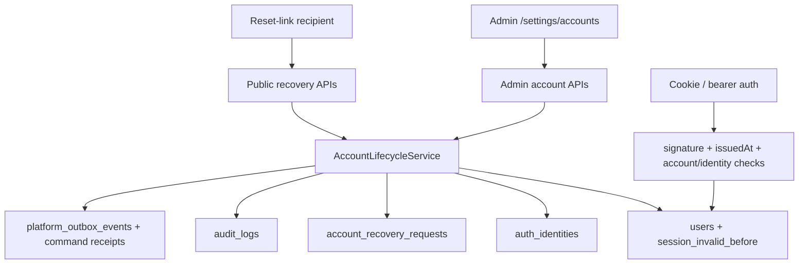

# SPEC-PDM-ACCOUNT-LIFECYCLE-001 - 帳號生命週期與安全管理台

日期：2026-07-13
狀態：Phase 1 `本機完成 / QC Passed`；Phase 2-3 `RD Contract Ready / Not Requested`；production `Release Gate Required`（DEV-046 `HD-8-1..4` closed）
DEV：`DEV-PDM-ACCOUNT-LIFECYCLE-001` / `DEV-045`
父任務：`DEV-003`、`DEV-040`、`DEV-042`、`DEV-043`、`DEV-044`
相關 QA：`.ai-doc/qa/qa-pdm-account-lifecycle-validation-plan-2026-07-12.md`

## Human Decision Brief

### 已確認方向

- 使用者要求把目前缺少的帳號相關設定整理成開發文件。
- 第一版仍服務 3-5 位內部人員的 Web 正式領號／草稿 pilot，不宣稱完整 ERP IAM production ready。
- 已有帳號邀請、首次密碼設定、Google 邀請式綁定、角色指派與帳號狀態 fail-closed 必須保留。
- 帳號生命週期管理屬於新的使用者可驗收交付，不回填成已完成的 DEV-042、DEV-043 或 DEV-044。
- 2026-07-12 RD 主管審查後，使用者要求把角色指派的時間區間設定加回；上一輪未逐題回覆的引導決策依 HCS 預設採 `1A / 2C / 3A`。
- 2026-07-13 使用者確認：帳號邀請、既有帳號生命週期、角色/權限管理不應散在多個互不相連的設定入口；採「同一個帳號與權限管理區、不同任務分頁」設計，不做一張混雜所有欄位的大表。
- 2026-07-13 Phase 1 已依上述設計完成本機實作與 QC：`/settings/accounts` 成為「帳號與權限」主入口，帳號管理、邀請新帳號、角色與權限、異動紀錄以分頁分工；`/settings/workflow` 仍是角色/審核規則唯一寫入權威。
- 2026-07-13 DEV-046 RD 完整性決策：Firebase 僅負責登入並終止於 Next.js BFF；Phase 3 使用八小時 `pdm_session`、Admin/Approver TOTP、兩位 hardware-key cloud break-glass 管理員。非 Google 邀請固定為 Firebase-managed email-link，完成 canonical invitation/email proof 後才設定並連結密碼；password reset 僅供啟用後復原。Break-glass 帳號不屬於 PDM `users/auth_identities`，browser 不直連 operational PostgreSQL。
- 2026-07-13 使用者確認既有登入憑證不保留，正式環境帳號全部在 Firebase 重新佈建；clean production 會替正式帳號建立新的 stable production PDM user ID。來源系統的 `users.id`、歷史 actor、audit 與受控物件關聯維持在唯讀來源封存，不搬入 production，也不得以相同 email 自動映射。每個正式帳號須經 reviewed Firebase UID -> new production PDM user ID manifest。
- `jedchang0308@jenfu.com.tw` 已在本機 managed-auth SQLite bootstrap 為唯一 active Admin，其他 demo 帳號已 offboard 並撤銷 session/identity/role；這是本機資料狀態，不是 production Firebase 帳號完成證據。
- 使用者提出的初始密碼 `1655` 不符合既有 10-128 字元密碼政策，因此未寫入。系統改建立一次性 recovery link，由使用者自行設定合規密碼；raw link/token 不得寫入本文件、audit 或 QC evidence。
- Phase 3 provider authority 為 `ADR-PDM-ERP-PLATFORM-002`：`HD-8-1 / 1A` 使用 Cloud Run `asia-east1` + Next.js 16；`HD-8-2 / 2A` 使用 internal primary+backup 與 60 分鐘 all-hours acknowledgement；`HD-8-3 / 3B` 要求 staging 測兩種帳號、Wave 0 Google-only、Wave 1 至少一個 controlled non-Google email-link 帳號。`HD-7-2 / 2B` 維持 clean production 與 source read-only archive。所有正式 business profile、公司、角色、lifecycle、session、audit data 只在 Cloud SQL；Firebase/Identity Platform 僅保存登入必要 credential、UID 與 auth metadata，不使用 Firestore、Firebase Storage、Functions、Callable 或 Firestore trigger 作 business authority。

### 採用的安全預設

- 密碼重設使用一次性重設連結，不產生或顯示臨時密碼。
- 停權保留角色指派、代理與 identity 狀態；離職則在同一 transaction 關閉 system role、撤銷所有尚未撤銷的角色指派與代理（包含排程中項目）、停用所有 login identity，但不得刪除 PDM user、identity、audit 或歷史物件關聯。
- 復職不得自動恢復離職前 system role、角色、代理或 identity；復職 modal 必須明確選擇 system role 與至少一個要重新啟用的 login identity，額外角色與代理另由管理員重新指派。
- 停權、離職、密碼重設及手動撤銷 session 都必須讓既有 cookie／bearer token 失效。
- Identity 可停用與復用，不提供 hard delete；不能停用使用者最後一個可登入 identity，除非帳號同時進入非 active 狀態。
- Phase 1 密碼重設只適用於已存在 `local_password` identity 的帳號；Google-only 帳號不得被重設流程暗中新增本機登入方式。
- 已停用的 `local_password` identity 可以重設密碼，但重設完成後仍保持停用；Admin 必須另行執行具 audit 的 identity enable。
- 管理員不能對自己執行停權或離職；系統不得留下零個 active Admin。管理員可撤銷自己的全部 session，成功回應必須同時清除目前 cookie。
- Pilot 離職不做雙人簽核；一位 Admin 可直接執行，但必須填原因、輸入目標姓名或 email 二次確認，並通過 self/last-admin transaction guard。
- Phase 1 不自動寄信；建立重設連結後只顯示一次，交由管理員透過公司核准通路傳送。

### 被拒絕選項

- 在 UI 顯示、保存或寄送明文密碼。
- 將角色指派的「到期停用日」冒充為帳號停權。
- 只顯示角色時間欄位，卻沒有讓同步／非同步 permission path 實際套用生效與到期條件。
- 停權或離職時刪除使用者、identity、角色歷史或 audit。
- 只清除目前瀏覽器 cookie，卻讓其他裝置與 bearer token 繼續有效。
- 讓一般使用者、受邀者或瀏覽器直接修改 `users.account_status` 或 `auth_identities.status`。
- 把 Firebase Auth / Identity Platform、MFA、SMTP、Google OAuth secret bootstrap 混入 Phase 1。

### AI assumptions

- Phase 1 僅支援目前 PDM managed auth；Firebase Auth with Identity Platform 是 `ADR-PDM-ERP-PLATFORM-002` 的未來共用 IAM 目標。
- 一般 `users.role` 編輯不在本切片；只有 return-to-work 必須明確重選 system role。額外 PDM 角色、範圍與有效期間繼續由 `/settings/workflow` 作為唯一寫入入口，`/settings/accounts` 只顯示摘要與深連結。
- 現有 `expired` 狀態保留相容讀取，不在 Phase 1 提供直接設定按鈕。
- 目前工作區固定鉦富；跨公司 membership 編輯由 shared organization/core 後續 DEV 管理。

### Re-entry triggers

- 要求永久刪除／合併帳號或改寫歷史 actor ID。
- 要求自訂品牌 SMTP／第三方寄信 provider、DNS 或 live secret；初版 Firebase-managed action email 不需要另選 SMTP provider，但仍須完成 template/domain/quota/privacy 與 live-provider gate。
- 要求 live Firebase Auth / Identity Platform、MFA、Google credential、正式 migration、production deploy 或 cutover。
- 要求變更 ProJED 帳號、資料、程式或部署。

使用思考習慣：#目的、#批判、#當責

## Problem

目前 UI 能建立／撤銷邀請及指派角色，但缺少已啟用帳號的生命週期管理。`users.account_status` 和 identity status 已能在每次驗證時 fail closed，卻沒有 Admin API/UI 可安全操作；現有 session token 是長效簽章 token，帳號恢復 active 後，停權前的舊 token 可能重新有效。因此「後端已有狀態欄位」不能被視為帳號管理已完成。

## Implementation Status

Phase 1 本機範圍已完成：

- `/settings/accounts` 已提供「帳號管理、邀請新帳號、角色與權限、異動紀錄」分頁。
- Admin account APIs 已提供帳號清單、明細、lifecycle、session revoke、identity status、password reset。
- `/account-recovery` 與 public lookup/complete APIs 已提供 fragment-token one-time password reset。
- `users.session_invalid_before`、`account_lifecycle_version`、`system_role_enabled`、`auth_identities.identity_lifecycle_version` 與 `account_recovery_requests` 已加入 SQLite/PostgreSQL/Supabase migration mirror。
- managed auth、Google login callback、token login 與同步/非同步 session resolver 已檢查 account status、system role gate 與 session invalidation cutoff。
- `/settings/workflow` 已恢復角色開始生效/到期停用 UI；同步/非同步 role-code permission path 已套用 `starts_at <= now < hard_ends_at`。
- production slice allowlist 已加入 DEV-045 明列 account APIs 與 account recovery public APIs，其他正式流程維持 default deny。

證據：`.ai-doc/qc/qc-pdm-account-lifecycle-report-2026-07-13.md`。

## Goals

- 提供 `/settings/accounts` 帳號清單與詳情，讓 Admin 管理已啟用帳號。
- 支援停權、復權、離職、復職、identity 停用／復用、全部 session 撤銷與一次性密碼重設。
- 恢復角色指派的生效／到期時間區間 UI，並讓所有 permission path 依該區間 fail closed。
- 所有高風險操作要求原因、確認、權限、company scope、樂觀鎖與 atomic audit/outbox。
- 保留穩定 PDM User ID、identity subject、歷史 audit 與 controlled object attribution。
- 把 pilot 必需帳號治理加入 production-slice server allowlist，但不打開其他正式流程。

## Non-Goals

- Phase 1 不做一般使用者自助忘記密碼、自動寄信或裝置級 session 清單。
- 不在一般 UI 設定 Google OAuth client secret、Supabase service role、DB URL 或 auth signing secret。
- 不做 Firebase Auth / Identity Platform cutover、MFA enrollment、SSO domain routing 或 ProJED 整合。
- 不修改系統角色模型、審核矩陣或跨公司 membership。
- 不刪除、合併或重新編號任何使用者／identity。

## End-State Architecture



不可妥協規則：

- 瀏覽器只呼叫 server API，不直接寫 auth tables。
- password、raw reset token、session token、provider secret 不得進入 DB、audit、outbox 或回傳清單。
- lifecycle mutation、session invalidation、audit、outbox 必須在同一 transaction。
- PDM `users.id` 與歷史 actor references 永不因停權、復職或 provider 變更而改寫。

## Architecture Memory Capsule

### 既有權威

- `account_invitations`：只負責尚未建立帳號的一次性邀請。
- `auth_identities`：登入方式與 provider subject；email 不是授權 key。
- `users.account_status`：帳號是否可存取 PDM。
- `user_role_assignments`：額外 PDM 角色、範圍、複核與到期；不等於帳號狀態。
- `approval_delegations`：代理動作、範圍與開始／結束時間；不等於帳號或角色指派狀態。
- `PlatformActorContext`、command receipt、transactional outbox：高風險 server command 的一致邊界。

### 狀態語意

| 狀態 | 可登入 | UI 主要動作 | 規則 |
|---|---:|---|---|
| `active` | 是 | 停權、離職、撤銷 session、重設密碼 | `system_role_enabled=true` 且至少一個 active login identity |
| `suspended` | 否 | 復權、離職 | 可逆；保留角色、代理與 identity 狀態及歷史 |
| `expired` | 否 | 復權、停權、離職 | 相容既有資料；Phase 1 不直接建立此狀態 |
| `offboarded` | 否 | 復職 | system role 已關閉，非撤銷角色／代理已撤銷，login identity 已停用；不刪歷史，復職不得自動恢復 |

允許轉移：

- `active -> suspended | offboarded`
- `suspended -> active | offboarded`
- `expired -> active | suspended | offboarded`
- `offboarded -> active`，顯示為「復職」，需二次確認、理由、明確重選 system role 及至少一個重新啟用的 login identity；額外角色／代理保持撤銷

每次轉移都更新 `session_invalid_before`，使轉移前簽發的 session 失效。無狀態 token 仍保留，但驗證必須同時檢查 token `createdAt` 與 DB invalidation timestamp。

## Phase 1 RD Handoff Contract - Pilot Admin Account Console

狀態：`本機完成 / QC Passed`

### Purpose

補齊內部 pilot 的最小帳號治理，使 Admin 能管理已啟用帳號，而不是只能處理邀請。

### UI Scope

#### Settings IA consolidation

Phase 1 必須把目前分散的帳號相關入口收斂成同一個「帳號與權限」管理區。目標是降低 Admin 找功能的成本，同時避免把「改某個人」和「改整套權限制度」混成同一張表。

建議資訊架構：

```text
系統設定
└─ 帳號與權限
   ├─ 帳號管理
   ├─ 邀請新帳號
   ├─ 角色與權限
   └─ 異動紀錄
```

任務邊界：

- `帳號管理` 是預設工作面：管理已存在帳號、登入方式、停權/復權、離職/復職、session 撤銷、密碼重設與角色摘要。
- `邀請新帳號` 管理尚未進系統的人：建立邀請、撤銷邀請、複製一次性邀請連結、查看邀請狀態。可沿用既有 `/settings/account-invitations` 實作，但在 UI 上必須從「帳號與權限」入口可見；不得讓 Admin 以為邀請和帳號管理是兩套制度。
- `角色與權限` 管理制度規則：角色定義、角色能做哪些動作、使用者角色指派、審核矩陣。`/settings/workflow` 仍是角色/審核規則的唯一寫入權威；帳號詳情只顯示摘要與深連結，不建立第二個角色寫入入口。
- `異動紀錄` 聚合帳號、邀請、identity、角色指派、代理、密碼重設與 session 操作紀錄；若 Phase 1 無法一次聚合所有歷史 audit，至少要在同一管理區提供可發現的入口與清楚範圍標示。

路由相容：

- 可保留 `/settings/account-invitations`、`/settings/workflow` 作為相容路由或深連結目標。
- 管理員從設定中心第一層看到的主入口應是「帳號與權限」，不是彼此平行且語意重疊的「邀請」、「流程/權限」、「帳號」三個入口。
- 不允許把邀請、帳號生命週期、角色定義、審核矩陣全部塞入同一張超寬表；必須以任務分頁、drawer 或深連結分層。

#### Account management route

新增 `/settings/accounts`，作為「帳號與權限」管理區的帳號管理工作面：

- 頁首顯示 active、suspended、offboarded、待重設數量。
- 可依姓名／email 搜尋，依帳號狀態、provider、系統角色篩選。
- 表格主欄位：使用者、系統角色、帳號狀態、登入方式、公司、最後登入、最後狀態異動。
- 點列開啟右側詳情 drawer；不使用巢狀 cards。
- 詳情分區：基本資料、登入 identity、角色與有效期間摘要、近期帳號 audit、高風險操作。
- 角色摘要逐筆顯示 `未生效 / 有效 / 已到期 / 已撤銷`、生效時間、到期時間、複核日與範圍；「設定角色與時間區間」深連結至 `/settings/workflow?tab=user-access&userId=<id>`。
- `/settings/workflow` 使用者角色指派表單恢復「開始生效」與「到期停用」控制，兩者皆可留空；代理設定既有開始／結束控制維持可用。
- 高風險動作使用明確 modal、原因必填、顯示影響，禁止只靠 `window.confirm`。
- 「建立帳號」或「邀請新帳號」導向「帳號與權限 > 邀請新帳號」；底層可沿用既有 `/settings/account-invitations`，但使用者入口必須屬於同一管理區。
- `/settings/security` 保留既有金鑰管理語意；帳號安全入口導向 `/settings/accounts`，避免把 SolidWorks secret panel 誤認為 IAM。

### Data Contract

#### `users` additive fields

| 欄位 | 型別 | 規則 |
|---|---|---|
| `session_invalid_before` | SQLite `TEXT` / Postgres `TIMESTAMPTZ`, nullable | token `createdAt <= value` 時拒絕 |
| `account_lifecycle_version` | integer, not null, default `0` | lifecycle/session mutation 每次 `+1`，作 optimistic locking |
| `system_role_enabled` | boolean/integer, not null, default true | offboard 設 false；return-to-work 明確重選 `users.role` 後才設 true |
| `account_status_changed_at` | timestamp, nullable | lifecycle 清單與詳情顯示 |
| `account_status_changed_by` | nullable FK `users.id` | 原始 actor；刪除時 `SET NULL` |
| `account_status_reason` | nullable text | 非 active transition 必填，最長 500 |

#### `account_recovery_requests`

| 欄位 | 規則 |
|---|---|
| `id`, `user_id`, `company_id` | stable IDs / FKs |
| `token_hash` | SHA-256 hash，unique；raw token 只回傳一次 |
| `purpose` | Phase 1 固定 `admin_password_reset` |
| `status` | `pending | consumed | revoked | expired` |
| `requested_by`, `requested_at`, `expires_at` | Admin 與時效 |
| `consumed_at`, `revoked_by`, `revoked_at` | lifecycle evidence |
| `reason` | Admin 必填，最長 500 |

#### `auth_identities` additive field

| 欄位 | 型別 | 規則 |
|---|---|---|
| `identity_lifecycle_version` | integer, not null, default `0` | identity enable/disable/reset 每次 `+1`，禁止用 timestamp 當版本 |

索引與限制：

- 每位使用者最多一筆 pending password reset；新建時 transaction 內撤銷舊 pending request。
- `expires_at` 預設 60 分鐘，可選 30／60／240 分鐘；不得超過 24 小時。
- SQLite/PostgreSQL/Supabase migration parity；公開 schema 表強制 RLS/default-deny，`anon`/`authenticated` 不得直接讀寫。

### Session Contract

- 現有 token `createdAt` 作為 issued-at；解析時驗證型別、有限值、不得在未來超過 5 分鐘。
- `getSessionUserAsync` 與同步 fallback 都必須檢查 `account_status=active`、`createdAt > session_invalid_before`。
- suspend、offboard、reactivate、return-to-work、password-reset-complete、manual-revoke 都將 `session_invalid_before` 設為 transaction clock。
- reactivation 不得恢復舊 session；使用者必須重新登入。
- UI 顯示「已撤銷全部既有登入」，不宣稱能列出個別裝置。

### Role Assignment Effective Window Contract

- 沿用既有 `user_role_assignments.starts_at`、`review_due_at`、`hard_ends_at` 與 `approval_delegations.starts_at/ends_at`；不新增第二套時間表。
- UI 以公司時區顯示。Phase 1 固定 `Asia/Taipei`；server 儲存與比較使用 UTC timestamp。
- 空白 `starts_at` 表示立即生效；空白 `hard_ends_at` 表示無硬性到期。角色有效條件為 `revoked_at IS NULL AND (starts_at IS NULL OR starts_at <= now) AND (hard_ends_at IS NULL OR now < hard_ends_at)`。
- UI 選擇的「到期停用日」以該日結束為使用者語意，server 正規化成次日 `00:00` 的 exclusive UTC boundary；開始日正規化為當日 `00:00` inclusive boundary。
- `review_due_at` 只產生提醒，不撤銷角色；`hard_ends_at` 到點後每次 permission check 立即失效，不需要停權帳號或撤銷 session。
- 同步與非同步角色解析、numbering permission、approval permission、production-slice API guard 都必須套用同一有效條件；不得只在 UI 過濾。
- `starts_at >= hard_ends_at`、無法解析日期、超出允許範圍或 DST/時區轉換不確定時 fail closed；回 `role_assignment_time_range_invalid`。
- 到期不改寫為 `revoked`，保留 `expired` 顯示語意；Admin 可建立新的有效指派或明確更新時間區間，均須原因與 audit。

### API Contract

Admin-only：

- `GET /api/admin/accounts?query=&status=&provider=&role=&cursor=&limit=`
- `GET /api/admin/accounts/[userId]`
- `POST /api/admin/accounts/[userId]/lifecycle`
  - body：`action=suspend|reactivate|offboard|return_to_work`、`reason`、`expectedVersion`；offboard 必須帶 `confirmationText`，return-to-work 必須帶 `systemRole` 與 `identityIdsToEnable`
- `POST /api/admin/accounts/[userId]/sessions/revoke`
  - body：`reason`、`expectedVersion`
- `POST /api/admin/accounts/[userId]/identities/[identityId]`
  - body：`action=disable|enable`、`reason`、`expectedVersion`
- `POST /api/admin/accounts/[userId]/password-reset`
  - body：`reason`、`expiresInMinutes`；回傳一次性 `resetUrl`

Public token-bounded：

- reset URL 使用 `/account-recovery#token=<raw>`，fragment 不送到 server；client 讀入記憶體後立即 `history.replaceState` 清除網址 token。
- `POST /api/account-recovery/lookup`：body 為 token，只回傳 masked email、display name、expiresAt、identityEnabled；不得把 token 放在 query string。
- `POST /api/account-recovery/complete`：body 為 token/new password；成功後 token consumed、password 更新、identity 維持原 status、所有舊 session 失效。

共同規則：

- mutation 支援 `x-idempotency-key`；server-derived actor/company，不接受 body actor/company。
- list 固定以 `display_name ASC, users.id ASC` 排序；cursor 是 versioned opaque base64url DTO，query/filter 改變時舊 cursor fail closed。
- stable errors：`account_not_found`、`account_conflict`、`self_lockout_denied`、`last_admin_denied`、`identity_last_login_denied`、`recovery_invalid`、`recovery_expired`、`recovery_consumed`。
- list/detail 永不回傳 password hash、token hash、raw provider subject、session token 或 provider secret；provider subject 只回傳不可逆 fingerprint／masked hint。
- Google-only 帳號的密碼重設 action 為不可用並顯示「此帳號使用 Google 登入」；新增本機登入方式不屬於 Phase 1。

### Permission and Safety Contract

- 所有 admin APIs 使用 managed auth + `Admin` system role + company membership/scope。
- Admin mutation 要求 `application/json`、同源 `Origin`、`Sec-Fetch-Site` 非 cross-site；缺 header 的受控非瀏覽器 client 必須使用既有 bearer/service boundary，不得降級接受跨站 cookie mutation。
- Admin 不可 suspend/offboard 自己；self global session revoke 允許，但 response 必須清除目前 cookie，後續請求需重新登入。
- lifecycle transaction 必須鎖定 company scope 內 `users.role='Admin' AND system_role_enabled=true AND account_status='active'` 的 system Admin rows，重新計算數量並防止最後一位 Admin 被停用；額外 PDM role assignment 不計入此 guard。
- identity disable 前鎖定 user row，計算 active login identities；`invite` provenance identity 不算 login identity。
- 非 active account 不允許 identity enable 或 password reset complete，除非 lifecycle action 先明確復權。
- offboard transaction 同時將 `system_role_enabled=false`、撤銷 target 所有 `revoked_at IS NULL` 的 `user_role_assignments` 與 target 作為任一方且 `revoked_at IS NULL` 的 `approval_delegations`（包含尚未生效者）、停用所有 login identities、推進 session invalidation、寫 audit/outbox；任一寫入失敗全部 rollback。
- password reset 不改變 identity status；disabled local identity 完成 reset 後仍不可登入，須由 Admin 另行 enable。
- production slice 只 allowlist DEV-045 明列的 account APIs；其他設定／正式流程維持 default deny。

### Transaction and Event Contract

每個 mutation 由 `AccountLifecycleService` 經 DEV-044 command boundary 執行：

1. 驗證 actor、company、target、integer expected version 與防鎖死條件。
2. claim command receipt。
3. 更新 user／identity／recovery request。
4. 更新 `session_invalid_before`（適用時）。
5. 寫入 `audit_logs`，detail 可包含受控的完整 reason、old/new status、target user、identity fingerprint，不含 secret。
6. 寫入一筆 versioned outbox event；只包含 stable IDs、status、`reasonCode`，不得散播自由文字 reason。
7. complete receipt 並 commit。

事件 vocabulary：

- `pdm.identity.account_status_changed.v1`
- `pdm.identity.sessions_revoked.v1`
- `pdm.identity.provider_status_changed.v1`
- `pdm.identity.password_reset_requested.v1`
- `pdm.identity.password_reset_completed.v1`

reset token 的 command receipt 特例：

- API 在 server memory 產生 raw token 與 hash，只把 hash 傳入 transaction。
- raw token 至少 256-bit CSPRNG entropy；hash lookup 使用 constant-time compare。
- domain result／command receipt 只保存 recovery request ID、status、expiry 等 safe projection；不得包含 raw token或reset URL。
- 只有首次成功執行的同一 call 將 memory 中 raw token組成 URL 回傳；duplicate/reused receipt 回 `reset_already_created`，不重播 token。
- 若 transaction 已成功但 client 未收到 URL，管理員只能撤銷並重建，不能從 DB 或 receipt 取回 token。

任何 audit/outbox/recovery 寫入失敗都必須 rollback；重複 idempotency key 不得重複產生有效 reset request 或事件。

recovery surface 安全規則：

- recovery page/API 回 `Cache-Control: no-store`、`Referrer-Policy: no-referrer`、`X-Robots-Tag: noindex, nofollow`，頁面不得載入 analytics、第三方 script、外部圖片或 referrer-bearing resource。
- lookup/complete 僅收 `application/json` 並檢查同源 `Origin`/Fetch Metadata；錯誤 body、status 與 timing 採泛化結果，避免 user/token enumeration。
- 對 IP、token fingerprint 與 recovery request 套用 sliding-window rate limit；連續失敗達門檻暫時鎖定，attempt counter/lock expiry 不保存 raw token。
- access log、error log、audit、telemetry 與 browser-visible error 都必須 redact fragment、token、password 與 hash。

### Failure Recovery

- reset URL 只回傳一次；遺失時撤銷舊 request 並建立新 request。
- token lookup/complete 使用相同泛化錯誤，不洩漏帳號是否存在。
- integer version conflict 回 409，UI 重新讀取詳情並保留未送出的 reason。
- action 成功但 client timeout 時，以相同 idempotency key重試並回傳既有結果；raw token 不可再次回傳，改顯示「已建立，請撤銷後重建」。
- migration/QC 只對 disposable DB 執行；不得直接修復 production 帳號。

### Phase 1 Acceptance

- Admin 可從 UI 查找帳號、看 identity／角色／audit，並執行 lifecycle、identity、session、reset 操作。
- Admin 可從同一個「帳號與權限」入口切換帳號管理、邀請新帳號、角色與權限、異動紀錄；不得要求 Admin 先記住三個分散設定路徑。
- Admin 可在 `/settings/workflow` 設定角色開始／到期區間；`/settings/accounts` 顯示相同狀態並可深連結，未生效或已到期指派不能取得任何角色權限。
- 非 Admin、跨公司、body spoof、自我鎖死、最後 Admin、最後 login identity 均 fail closed。
- offboard 原子關閉 system role、撤銷角色／代理並停用 login identities；return-to-work 必須明確重選 system role 與 identity，不恢復離職前額外權限。
- suspend/offboard/revoke/reset 後，其他裝置既有 cookie 與 bearer token 在下一請求立即失效；reactivate 不恢復舊 token。
- reset token 只存 hash、不可重用、過期／撤銷 fail closed，密碼政策沿用 invitation acceptance。
- disabled local identity reset 後仍維持 disabled；recovery surface 通過 CSRF、rate-limit、URL/log redaction、no-store/no-referrer gate。
- Google-only account 不顯示可用的 password reset action，也不會因 reset flow 新增 local identity。
- mutation、audit、outbox 與 session invalidation atomic；event payload 無 secret 與自由文字 reason。
- invitation、Google identity、managed auth、production slice、DEV-044 outbox regression 全部保持通過。

### QA/QC Gate

- focused API/state/permission/transaction QC。
- desktop 1440x900、mobile 390x844 UI evidence；drawer、modal、table 不得重疊或 overflow；鍵盤焦點、focus return、disabled reason、typed confirmation 可操作。
- 角色時間區間以 fake clock 驗證 boundary 前／當下／後，並覆蓋同步與非同步 permission path。
- recovery CSRF、rate limit、fragment scrubbing、response headers、log redaction 與 disabled-identity reset evidence。
- SQLite disposable runtime mutation tests。
- PostgreSQL/Supabase migration hash、RLS/default-deny parity。
- `tsc`、lint、production build。
- invitation 25/25、Google identity 19/19、managed auth 21/21、production slice 27/27、DEV-044 foundation regression。

### Stop Conditions

- 需要改寫 user ID、刪除 identity/history、live provider 或 production data。
- 無法保證 session invalidation 在同步與 async auth path 一致。
- 最後 Admin 或最後 login identity 防護無法 transactionally 證明。
- 需要 SMTP、Firebase Auth / Identity Platform、MFA、ProJED 或 release 操作。

### Evidence Required

- RD report、schema/migration diff、API ownership inventory。
- focused QC JSON、forced rollback、duplicate/concurrent action evidence。
- token redaction與重用拒絕證據。
- UI screenshots與 viewport 檢查。
- no-ProJED-change與 no-live-migration evidence。

## Phase 2 RD Handoff Contract - Self-service and Session Visibility

狀態：`RD Contract Ready / Not Requested This Turn`

Purpose：讓 active 使用者變更自己的密碼、查看 session 摘要並撤銷其他 session；加入自助忘記密碼 adapter。live Identity Platform 階段預設使用 Firebase-managed action email；只有自訂品牌寄信才引入 custom SMTP/provider。

Implementation contract：

- 引入 first-class opaque session records，DB 只存 token hash／session family ID、issued/last-seen/expires/revoked metadata；不存 raw token。
- 使用者可查看裝置類型、最近活動、建立時間與是否為目前 session；IP 僅保存縮減／hash 後資訊並定義 retention。
- 變更密碼要求 current password 或已完成 MFA/re-auth；成功後可選擇保留目前 session、撤銷其他 session。
- forgot-password service 定義 provider-neutral delivery adapter；local/Phase 2 使用 fake，Phase 3 live 預設接 Firebase-managed action email。自訂 SMTP 是可替換 adapter，不得成為 domain service 或 command path。
- Admin action 與 self-service action 使用不同 permission/audit action code。

Entry condition：Phase 1 QC complete；完成 Firebase action-email template、authorized domain、quota、寄送責任與隱私 retention 審查。只有選擇 custom SMTP 時才需另確認 provider、DNS、費用與 secret。

Acceptance：session 可個別撤銷；重設／變更密碼不可被 CSRF、token reuse 或 user enumeration 利用；delivery failure 可重試且不產生第二個有效 token。

QA/QC：session fixation、CSRF、concurrent revoke、current-session retention、Firebase-managed email/fake adapter failure、privacy retention與跨裝置測試。

Stop conditions：需要未核准的 custom provider/DNS/secret、Firebase template/domain/quota/privacy 未審查、session metadata retention 未核准。

Evidence：provider contract tests、session-table migration parity、security tests、desktop/mobile self-service UI。

## Phase 3 RD Handoff Contract - Shared IAM and MFA Rollout

狀態：`RD Contract Ready / Not Requested This Turn`；production execution 為 `Release Gate Required`（DEV-046 `HD-8-1..4` closed）

Purpose：依 `ADR-PDM-ERP-PLATFORM-002` 將 Firebase Auth with Identity Platform 作為 ERP 共用 IAM，Admin/Approver 強制 TOTP MFA，中央 offboarding 撤銷所有 module sessions；Firebase 終止於 Next.js BFF，瀏覽器不以 Firebase JWT 直連 Cloud SQL 或任何 operational table API。

Implementation contract：

- 以 platform principal mapping 對應新建立的穩定 production PDM user；不以 email、domain、來源 actor ID 或 user-editable metadata 授權。
- reprovision 必須先 collision dry-run、company isolation 與 session revocation rehearsal；不得匯入既有 password hash、OAuth subject、session、refresh token 或 recovery token。
- production cutover 前，每個 approved pilot 帳號都必須進入 identity-reprovision manifest，明列 newly assigned production PDM user ID、canonical email、Firebase UID/provider、company、role/scope、MFA、legacy closure、collision 與最終 disposition；來源 actor ID/history 留在唯讀封存，不得靠相同 email 自動補映射。
- legacy managed-auth、`google_oauth` callback、token issuance 與 recovery 路徑在 Firebase cutover 前必須明確關閉；使用者已決定不保留既有憑證，因此不設 production 雙 IAM 共存期。
- MFA policy、recovery、break-glass Admin、offboarding owner、support runbook 在 rollout 前完整定義。
- UI 管理狀態與受控 lifecycle；provider bootstrap、redirect domain、service secret 不由一般 UI 直接寫入。

Entry condition：Phase 1-2 evidence、closed DEV-046 `HD-8-1..4`、`HD-7-2 / 2B`、`HD-7-3 / 3B`、approved Firebase/Cloud Run/Cloud SQL staging and production targets、完整 reprovision 與 clean-seed/read-only-archive manifests、Google/non-Google staging evidence、MFA/recovery/business-hours/60-minute primary+backup policy、`HD-8-4 / 1A` pre-canary Cloud SQL restore/reconciliation evidence、已記錄的 `HD-6-1 / 1A` 與 privacy notice/inventory implementation evidence、migration owner、release command與高風險確認。

Acceptance：Google／non-Google users 映射到單一新 production platform principal；MFA policy 生效；中央停權拒絕新舊 session；來源 history actor 仍可在獨立唯讀封存解析且未被重鍵／自動映射；rollback 不改寫 production PDM IDs。

QA/QC：staging SSO/MFA/offboarding/collision/company isolation/audit attribution；production evidence依 release gate另建。

Stop conditions：需要 ProJED 變更、provider 未核准、collision 未清零、break-glass/recovery 未演練、要求直接 live cutover。

Evidence：staging migration report、MFA policy tests、offboarding session evidence、release-gate result。

## Deferred Scope Audit

| Deferred scope | 分類 | 追蹤方式 |
|---|---|---|
| 自助變更／忘記密碼 | Same Spec Phase | Phase 2 contract |
| Firebase-managed reset/invite action email | Same Spec Phase 2-3 | 不需 custom SMTP 決策；須 template/domain/quota/privacy 與 live-provider gate |
| 自訂品牌 SMTP／第三方寄信 | Blocked Human Re-entry | 明確提出品牌化需求並完成 provider、成本、DNS、secret 決策後另行執行 |
| 裝置級 session 清單 | Same Spec Phase | Phase 2 first-class session contract |
| Firebase Auth / Identity Platform / MFA / central offboarding | `DEV-046` + Same Spec Phase + Release Gate | Phase 3 contract；production 由 DEV-030/031/032 gate |
| 既有 managed-auth / Google OAuth -> Firebase 身分重建 | Confirmed / Same Spec Phase 3 | 不搬憑證或 source actor mapping；逐帳號配置新 production PDM ID、collision、MFA 與 legacy-route closure evidence 後啟用 |
| Firebase / Cloud SQL provider secret bootstrap | Blocked Human Re-entry / Release Gate Required | 不由一般帳號 UI直接設定 |
| 跨公司 membership 編輯 | New DEV | shared organization/core DEV；不擴張 Phase 1 |
| 帳號 hard delete／merge | No Tracking | 拒絕；破壞歷史 attribution |
| ProJED 帳號整合 | New DEV / Blocked Human Re-entry | ProJED repository-owned task |
| production migration/deploy/smoke | Blocked Human Re-entry / Release Gate Required | 續接 DEV-030/031/032，不在本文件產生 release artifacts |

## All-Phase Coverage Matrix

| Phase / DEV | Execution boundary | Document status | Scope | Out of scope | Entry condition | Acceptance | Evidence |
|---|---|---|---|---|---|---|---|
| Phase 1 / DEV-045 | Local RD | 本機完成 / QC Passed | Admin accounts UI、lifecycle、identity、global session revoke、admin reset link | email、MFA、shared IAM、production | 已完成本機實作 | pilot 帳號治理與安全 gate 全通過 | `.ai-doc/qc/qc-pdm-account-lifecycle-report-2026-07-13.md` |
| Phase 2 / DEV-045 | Future local/staging RD | RD Contract Ready / Not Requested This Turn | self-service password、session records/device revoke、provider-neutral delivery adapter；Firebase-managed email 為預設 live adapter | custom SMTP、未核准 live provider | Phase 1 evidence + template/domain/quota/privacy 審查 | self-service 安全且可追溯 | security/provider/session evidence |
| Phase 3 / DEV-045 UI + DEV-046 IAM/session core | Staging/release gated | RD Contract Ready / Not Requested | Firebase reprovision、BFF session、TOTP MFA、email-link invitation/password linking、Google-only Wave 0、non-Google Wave 1、中央 deny-first offboarding | ProJED 修改、browser-direct DB、憑證/來源 actor 匯入、reset-as-invite、直接 live cutover | Phase 1-2 + closed IAM/privacy/continuity decisions；production另需 restore/reconciliation evidence與 release gate | new production principal、canonical invitation、TOTP、8-hour session、session revocation、source archive parity | staging + release-gate evidence |
| Production / DEV-030-032 | Release only | Release Gate Required | approved migration/deploy/cutover | 未記錄高風險操作 | release command + target/owner/rollback confirmation | release gate決定 | release evidence |
| ProJED follow-up | Separate repository | Blocked Human Re-entry | future shared contract consumer | AI_PDM task修改ProJED | explicit separate instruction | ProJED-owned acceptance | ProJED-owned evidence |

## RD Readiness Gate Result

### Phase 1

Result：`本機完成 / QC Passed`。

DB、migration、API、permission、state transition、session invalidation、transaction、UI 與 focused QC 已完成。`npm run build` 因本機 3000 dev server guard 阻止清 `.next` 而未執行完成；release gate 前需補 isolated build 或停 server 後 build。

### Phase 2-3

Result：Phase 2-3 `RD Contract Ready / Not Requested This Turn`。

Phase 2 的 Firebase-managed email adapter 不依賴 SMTP 選型；custom SMTP 仍是未要求範圍。Phase 3 的 runtime、60-minute response、non-Google Wave 1 與 `HD-8-4 / 1A` pre-canary restore 邊界已固定；live provider與production仍受 privacy、credential、required evidence 和 release gate 管控。

## Release Boundary

本文件不授權 merge、PR、live migration、production deploy、rollback、production smoke、Firebase Auth / Identity Platform cutover、MFA rollout 或 ProJED 變更。這些 artifact 只在 release 型指令及高風險確認後，由對應 release gate 建立。
