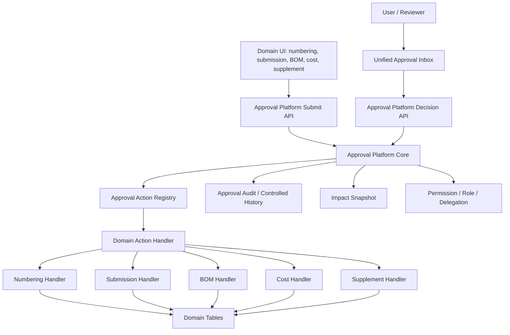

# SPEC-PDM-APPROVAL-PLATFORM-001 - System-wide approval platform

Status: Phase 1A-1B local implementation complete; Phase 1C-A reviewer workbench entrypoint consolidation implemented and locally verified; Phase 1C-B legacy reviewer page convergence implemented and locally verified; Phase 1C-C low-noise drawing object pending-review projection implemented and locally verified; Phase 2-4 transitional adapters present; Phase 5 guarded dry-run/apply tooling present; Phase 6 release/live migration not authorized
Date: 2026-07-08
Owner: Dev PM
Related DEV: `DEV-PDM-APPROVAL-PLATFORM-001`
Related ADR: `.ai-doc/decisions/ADR-PDM-APPROVAL-PLATFORM-001-shared-core-domain-handlers.md`; `.ai-doc/decisions/ADR-PDM-APPROVAL-PLATFORM-002-v2-platform-tables.md`
Related QA: `.ai-doc/qa/qa-pdm-approval-platform-validation-plan-2026-07-08.md`
Amends: `DEV-PDM-NUMBERING-004`, `DEV-PDM-SUBMISSION-GATE-001`, `DEV-PDM-LIFECYCLE-ACTIONS-001`, numbering approval flows, submission lifecycle requests, BOM review requests, part cost change requests and drawing revision supplement approvals.

## Human Decision Brief

The user asked whether the current approval architecture needs optimization, whether it should be refactored before launch, and then confirmed:

- Launch timing is not urgent.
- Stability is more important than short-term speed.
- It is acceptable and preferred to build system-wide approval platformization before launch.
- The design must not become a single giant approval module. The target architecture is a shared approval core with domain-specific action handlers.
- RD supervisor completeness review decisions on 2026-07-08:
  - `1C`: Do a no-migration architecture spike first. RD must produce an ADR before choosing whether to generalize existing approval tables or create v2 platform tables.
  - `2B`: Pre-launch blocker scope is platform core plus numbering/root/drawing/part plus submission/BOM formal lifecycle. Cost and supplement flows may start as adapters.
  - `3C`: Before launch, all known historical approval-like records must be physically migrated into the canonical platform approval model. Read adapters are transitional only and do not satisfy final pre-launch readiness.
- Reviewer entrypoint and missed-review UX decisions on 2026-07-08:
  - `1B`: Sidebar approval navigation should converge to a single primary `審核工作台`; specialized approval pages become workbench filters, detail views or contextual deep links rather than primary reviewer entrypoints.
  - `2A`: First anti-missed-review slice only adds a clear pending-review count badge. Due dates, owner columns, overdue grouping, escalation and external notifications are deferred.
  - `3 phased A -> B`: Short-term compatibility keeps legacy approval pages reachable through workbench deep links while removing them as primary navigation. Long-term target is option `B`: legacy reviewer decision pages redirect into the approval workbench once feature parity, deep-link preservation and QC evidence are complete.

This document converts the session into a development package. The user later authorized local RD implementation for `DEV-PDM-APPROVAL-PLATFORM-001`. Production deploy, Supabase live migration, direct data repair/deletion, merge, PR, rollback and release artifacts remain unauthorized.

## Local Implementation Update - 2026-07-08

RD completed the Phase 1A architecture spike and selected additive `approval_platform_*` v2 tables in `.ai-doc/decisions/ADR-PDM-APPROVAL-PLATFORM-002-v2-platform-tables.md`.

Local implementation now includes:

- Additive platform schema in `db/schema.sql` for actions, packages, requests, targets, impact snapshots, decisions, events, legacy links and package items.
- Immutable SQLite triggers for platform impact snapshots and append-only platform decisions/events.
- Generated Postgres initial/RLS planning updates in `db/postgres/001_initial_schema.sql` and `db/postgres/002_supabase_rls_plan.sql`.
- Platform repository/service in `src/lib/repositories/approval-platform-async-repository.ts` and `src/lib/approval-platform.ts`.
- Unified platform APIs under `src/app/api/approvals/*`.
- Unified UI entrypoint `/approvals` in `src/app/approvals/page.tsx` and sidebar navigation.
- Phase 1C-A reviewer-entrypoint consolidation: the primary sidebar now exposes one `審核工作台` approval entrypoint, removes specialized reviewer decision entries from primary navigation, shows a pending-review badge from `/api/approvals/inbox?status=pending`, and adds `/approvals` status/domain/action filters with URL query deep links.
- Phase 1C-B legacy reviewer page convergence: `/numbering/approvals`, `/bom/reviews` and `/numbering/change-reviews` now redirect into `/approvals` with equivalent status/domain/action filters and compatibility messages for bookmarked routes.
- Phase 1C-C low-noise drawing object pending-review projection: `/numbering/drawings` and `/numbering/search` show compact pending-review context on the affected drawing number and its revision attachments, without duplicating the full approval inbox or mutating master lifecycle status.
- Transitional legacy read/decision adapters for numbering, submission lifecycle, BOM review, part cost change, drawing package supplement records and drawing revision FFF impact reviews.
- Friendly legacy decision routes now delegate through platform adapter functions instead of directly calling domain decision facades.
- Focused QC script `scripts/qc-pdm-approval-platform.mjs`.
- Historical migration dry-run/apply script `scripts/generate-pdm-approval-platform-migration-dry-run.mjs`; apply is guarded by `--apply`, `--confirm-local-approval-platform-migration` and `PDM_APPROVAL_PLATFORM_MIGRATION_APPLY=YES`.

Executed local evidence:

- `npx.cmd tsc --noEmit --pretty false` passed.
- `npm.cmd run lint -- --quiet` passed.
- `npm.cmd run qc:pdm-approval-platform` passed 69/69.
- `npm.cmd run qc:pdm-approval-platform-migration-dry-run` passed, reported zero current legacy approval-like records in `data/ai-pdm.sqlite`, and ran an in-memory guarded apply/parity self-test.
- `npm.cmd run qc:pdm-lifecycle-actions` passed 270/270.
- `npm.cmd run qc:pdm-lifecycle-obsolete` passed 111/111.
- `npm.cmd run build` passed after safely stopping and restarting the project-owned local dev server.
- Browser checks passed after demo manager login with no blank page or horizontal overflow:
  - `output/playwright/pdm-approval-platform/approvals-desktop-auth.png`
  - `output/playwright/pdm-approval-platform/approvals-mobile-auth.png`
  - `output/playwright/pdm-approval-platform/numbering-approvals-desktop-auth.png`
  - `output/playwright/pdm-approval-platform/numbering-approvals-mobile-auth.png`
- Phase 1C-A focused evidence passed on 2026-07-08:
  - `npx tsc --noEmit` passed.
  - `npm run lint` passed with 0 errors and 3 unrelated warnings in `src/components/master-attachment-panel.tsx`.
  - `npm run qc:pdm-approval-platform` passed 88/88 after adding Phase 1C-A regression checks.
  - `npm run dev:local:check` reported AI_PDM healthy at `http://127.0.0.1:3000/`.
  - Playwright reviewer workbench checks passed for desktop 1440x960 and mobile 390x844 with no horizontal overflow; screenshots:
    - `output/playwright/approval-workbench-desktop.png`
    - `output/playwright/approval-workbench-mobile.png`
  - Playwright reviewer role-boundary check passed: `manager@example.com` can open the workbench; `engineer@example.com` does not see the reviewer pending badge and receives the workbench forbidden state.
  - `npm run build` was not rerun for Phase 1C-A because the project's local-dev guard refused to clean `.next` while the healthy project-owned dev server was listening on port 3000; no bypass or server stop was performed.
- Phase 1C-B focused evidence passed on 2026-07-09:
  - `npx.cmd tsc --noEmit --pretty false` passed.
  - `npm.cmd run qc:pdm-approval-platform` passed 106/106 after adding legacy redirect and drawing revision review adapter regression checks.
  - Source-scoped lint for the touched approval files passed.
  - `npm.cmd run dev:local:check` reported AI_PDM healthy at `http://127.0.0.1:3000/`.
  - Legacy route smoke confirmed 307 redirects:
    - `/numbering/approvals` -> `/approvals?status=active&domain=numbering&legacyRedirect=numbering_approvals`
    - `/bom/reviews` -> `/approvals?status=active&domain=bom&legacyRedirect=bom_reviews`
    - `/numbering/change-reviews` -> `/approvals?status=active&domain=numbering&action=numbering.drawing_revision_impact_review&legacyRedirect=numbering_change_reviews`
  - `npm.cmd run build` was blocked by the intentional local-dev guard because the healthy project-owned dev server was listening on port 3000; no bypass was used.
- Phase 1C-C focused evidence passed on 2026-07-09:
  - `npx.cmd tsc --noEmit --pretty false` passed.
  - `npm.cmd run qc:pdm-approval-platform` passed 125/125 after adding drawing pending-approval projection regression checks.
  - `npm.cmd run qc:pdm-entity-detail-drawer` passed 14/14 after adding owner/relation pending projection coverage.
  - Source-scoped lint for touched drawing, search, master attachment, API, repository and QC files passed.
  - `npm.cmd run dev:local:check` reported AI_PDM healthy at `http://127.0.0.1:3000/`.
  - Playwright manager-view smoke confirmed A0007-M01 keeps compact pending-review cues on the affected drawing/list and attachment history surfaces after the APP redline removal of the drawing detail focus panel, with no desktop or mobile horizontal overflow:
    - `output/playwright/pdm-approval-projection/drawings-pending-approval-desktop.png`
    - `output/playwright/pdm-approval-projection/drawings-pending-approval-mobile.png`
    - `output/playwright/pdm-approval-projection/drawings-redline-delete-desktop.png`
  - `npm.cmd run build` was blocked by the intentional local-dev guard because the healthy project-owned dev server was listening on port 3000; no bypass was used.

Remaining before launch readiness:

- Full physical migration execution for known historical approval-like records when target/data policy and release/cutover are authorized.
- Production/Supabase live migration, deployment, smoke and rollback through release gates.

## Session Findings

Current code inspection showed two different facts that must both be preserved:

- Numbering-related approvals already mostly share the numbering approval path. Existing formal obsolete support maps `part_number` and `drawing_number` to `obsolete_part_number` and `obsolete_ma_drawing`, then uses numbering approval request/batch logic.
- Whole-PDM approvals are not yet one shared platform. Existing review/approval concepts are spread across separate structures such as `approval_requests`, `approval_batches`, `submission_lifecycle_requests`, `bom_review_requests`, `part_cost_change_requests` and `drawing_revision_package_supplements`.

Relevant current anchors:

- `db/schema.sql`: `approval_requests.request_type` and `approval_batches.request_type` are constrained to `numbering`.
- `src/app/api/lifecycle/obsolete-requests/route.ts`: formal obsolete request route currently maps only part/drawing obsolete action codes.
- `src/lib/repositories/numbering-async-repository.ts`: numbering approval request insertion, batch listing, decision and approved-action application are numbering-owned.
- `src/app/numbering/approvals/page.tsx`: numbering approval inbox labels include part/drawing obsolete.
- `src/app/api/numbering/approval-batches/route.ts`: batch action codes are scoped to numbering actions.

## Problem

Fragmented approval flows create a compounding pre-launch risk:

- Users must learn different approval locations, wording and histories for each domain.
- Reviewers can miss work because formal approval entrypoints are scattered across side navigation items that look similar but expose different slices.
- Permission, delegation, reviewer responsibility and audit rules drift between modules.
- High-risk lifecycle actions can be implemented with different guard levels.
- Future features repeatedly rebuild the same concepts: pending, approve, reject, return for correction, impact preview, decision history and controlled apply.
- QA has to test every domain as if it had a custom approval engine.

Over-correction is also risky. A single monolithic approval module with all domain logic inside one switch statement would create a new failure mode:

- Domain-specific business rules become hard to reason about.
- Cross-domain changes can break unrelated approvals.
- Root/drawing/part lifecycle, submission release, BOM review and cost changes have different impact semantics and should not share one uncontrolled apply path.

## Architecture Decision

Build a shared approval platform before launch, but keep domain effects outside the core.

The shared platform owns:

- Work item identity.
- Batch/package identity.
- Request status and decision status.
- Assignment, delegation and reviewer eligibility.
- Unified inbox and filtering.
- Impact snapshot storage.
- Decision history and audit trail.
- Idempotency, concurrency and stale-snapshot guards.
- Common APIs for submit, decide, list, read, return for correction and cancel where allowed.

Domain action handlers own:

- Domain validation.
- Target resolution.
- Impact preview contents.
- Apply-approved side effects.
- Domain-specific stale checks.
- Domain-specific controlled history summary.
- Domain-specific compensating behavior where a transaction cannot cover all side effects.

The approval platform is an orchestration and control layer, not the owner of every business rule.

## Goals

- Provide one recognizable approval experience before launch.
- Make high-risk lifecycle decisions auditable across root, drawing, part, submission, BOM, cost and supplement domains.
- Prevent bypass routes from mutating formal records without approval history.
- Keep domain logic testable through explicit handler contracts.
- Let `DEV-PDM-NUMBERING-004` root/drawing/part obsolete use the platform instead of growing another special approval path.
- Reduce future development cost by reusing approval work item, decision, delegation, audit and inbox mechanics.

## Non-Goals

- No production deploy or release cutover in this package.
- No live Supabase migration in this package.
- No direct repair, deletion or historical rewrite of user data.
- No no-code universal approval rule builder in the first version.
- No ERP, supplier portal or external customer approval portal.
- No replacement of domain state machines with one generic state machine.
- No release gate, rollback plan, production smoke or merge/PR artifact until explicitly authorized.

## End-State Architecture



## Architecture Memory Capsule

Fixed decisions:

- Full-system approval platformization is a pre-launch architecture direction because launch timing is not urgent and stability is preferred.
- The approval architecture is shared core plus domain-specific handlers.
- The shared core owns approval work identity, packages, status, decisions, assignment, delegation, impact snapshots, inbox, audit and common APIs.
- Domain handlers own validation, target resolution, impact preview, apply-approved effects, stale checks and domain history summaries.
- Formal approval actions must route through the platform or an explicitly documented adapter.
- Root obsolete must preserve aggregate root intent and child targets; it must not become silent independent child mutations.
- A no-migration architecture spike is mandatory before schema or migration implementation. The spike must choose and justify either generalized existing approval tables or v2 platform tables.
- Pre-launch platformization must include platform core, numbering/root/drawing/part approvals, submission formal lifecycle and BOM formal lifecycle.
- Cost and supplement approvals may use adapters in early implementation, but adapters are transitional and must not prevent final historical migration.
- All known historical approval-like records must be physically migrated into the canonical platform approval model before launch readiness can be claimed.
- Production deploy, Supabase live migration, direct data repair/deletion, merge, PR, rollback and release artifacts are not authorized by this document.

Rejected options:

- Launching with fragmented formal approval inboxes.
- One monolithic approval apply module that owns every domain side effect.
- Direct formal lifecycle mutation without approval audit.
- No-code approval rule builder before the platform contract is stable.
- Silent historical approval rewrite.

AI assumptions:

- Existing permission, role, delegation and company/workspace scope foundations remain the base authority unless a later access-control decision changes them.
- Existing numbering approval behavior is the first compatibility anchor because numbering currently has the clearest shared approval path.
- Legacy domain tables may remain as domain detail or compatibility tables during adapter phases if unified inbox, audit and status consistency are preserved; they are not a substitute for the user-selected full historical approval migration before launch.
- Handler contract, route names, QC script names and exact schema names are engineering decisions unless they change product semantics, retention policy, release scope or data ownership.

Re-entry triggers:

- Legal, ISO or retention policy requires exact archival wording, immutable storage or historical rewrite.
- Multi-company/tenant strategy changes approver scope.
- Production target, rollout date or cutover plan is set.
- A newly discovered approval-like domain cannot be migrated physically without changing product semantics or losing audit evidence.

## Platform Components

### Approval Platform Core

The core must provide a stable lifecycle for approval work:

- `draft` where a domain supports pre-submit preparation.
- `submitted`.
- `pending_review`.
- `needs_info`.
- `rejected`.
- `approved`.
- `applied`.
- `apply_failed`.
- `cancelled`.
- `superseded`.

The exact persisted status names may follow existing conventions, but the platform must expose a consistent semantic mapping to UI and QC.

### Approval Action Registry

Each approval-capable action must be registered with at least:

- `actionCode`, for example `obsolete_part_number`, `obsolete_drawing_number`, `obsolete_root`, `release_submission`, `release_bom`, `part_cost_update`, `drawing_package_supplement`.
- `requestType`, generalized beyond the current numbering-only check.
- `domain`, for example `numbering`, `submission`, `bom`, `cost`, `drawing_package`.
- `targetEntityTypes`.
- Required reviewer roles or rule resolver reference.
- Whether an impact preview is required.
- Whether batch/package approval is allowed.
- Handler identifier.
- Stale-snapshot policy.
- Apply idempotency key strategy.
- Human-readable Chinese UI labels.

### Domain Action Handler Contract

Every handler must implement the same conceptual contract:

| Method | Required behavior |
|---|---|
| `validateRequest(input, actor)` | Fail closed on missing permission, wrong company/workspace, invalid lifecycle state, missing target or unsupported action. |
| `resolveTargets(input)` | Return normalized targets and reject ambiguous root/drawing/part relationships. |
| `buildImpactPreview(targets)` | Produce the exact preview shown to submitter and reviewers. |
| `createSnapshot(input, impact)` | Store immutable request payload and impact snapshot for stale checks. |
| `canDecide(request, reviewer)` | Enforce approver eligibility, delegation and self-approval rules. |
| `applyApproved(request, actor)` | Apply domain effects transactionally where possible, or fail into `apply_failed` with recovery evidence. |
| `summarizeHistory(request)` | Write controlled Chinese history suitable for domain detail pages. |

The platform must not call an unregistered handler and must fail closed when a handler is missing.

## Domain Coverage

### Phase 1 Mandatory Platform Core

Phase 1 defines the platform contract and shared mechanics:

- Generalized approval request and batch model.
- Action registry.
- Unified inbox read model.
- Common submit/read/decision APIs.
- Decision history.
- Impact snapshot storage.
- Permission and delegation hook.
- Handler dispatch and fail-closed behavior.
- Compatibility layer for existing numbering approvals.

### Phase 2 Numbering / Root / Drawing / Part

This phase absorbs the current highest-risk numbering lifecycle gaps:

- Existing numbering approval request and batch flows.
- `obsolete_part_number`.
- `obsolete_ma_drawing` or renamed compatible drawing obsolete action.
- New root obsolete aggregate action from `DEV-PDM-NUMBERING-004`.
- Add/append approvals if the implementation decides creation under existing formal root needs approval in a given policy.
- Root/drawing/part controlled history.

Root obsolete must preserve the root-level reason and child target list. It must not degrade into independent child approvals with no root intent.

### Phase 3 Submission and BOM Formal Lifecycle

This phase brings formal release/obsolete review into the same inbox and history model:

- Research submission exception approval where applicable.
- Technical transfer package approval from `DEV-PDM-SUBMISSION-GATE-001`.
- Release work item approval before master lifecycle mutation.
- Submission obsolete/cancel/supersede requests where formal.
- BOM review release/obsolete/return-for-correction actions.

The approval platform may orchestrate review state, but submission and BOM handlers still own final release side effects.

### Phase 4 Cost and Drawing Package Supplement Adapters

Cost and supplement flows may enter first through adapters if their existing tables remain domain-owned:

- Part cost change request appears in unified inbox.
- Drawing revision package supplement request appears in unified inbox.
- Decisions route back to domain handlers.
- Domain detail pages show platform history links.

Full physical table migration can be deferred only until Phase 5 if adapter behavior is deterministic and auditable. It cannot be deferred past launch readiness without explicit human data-policy exception.

### Phase 5 Historical Migration and Legacy Hardening

Phase 5 removes unsafe duplication after platform behavior is proven and closes the user-selected `3C` historical migration requirement:

- Known historical approval-like records are physically migrated into the canonical platform approval model.
- Migration dry-run, parity, collision and manual-review evidence are produced before any live target is touched.
- Old domain routes either call the platform or are blocked.
- Direct mutation routes are guarded by approval policy.
- Legacy tables are read-only compatibility surfaces where retained.
- QC blocks new approval-like tables unless ADR/spec governance approves them.

### Phase 6 Release Gate

Phase 6 is not authorized by this document. It requires:

- Deployment-release gate.
- Live target identity and credentials.
- Migration dry-run and rollback plan.
- Production smoke scope.
- Data parity/compatibility evidence.
- Human release authorization.

## Data Contract

The exact schema must be finalized during RD design, but the implementation must satisfy these contracts.

### Required Model Semantics

- `approval_requests` cannot remain constrained to numbering only if it is reused as the platform work item table.
- `approval_batches` cannot remain constrained to numbering only if it is reused as the platform package table.
- A request must support one primary target and optional child targets.
- A batch/package must preserve parent intent, for example whole-root obsolete.
- Impact preview snapshots must be immutable after submit.
- Decision history must be append-only.
- Applying an approved request must be idempotent.
- The platform must expose a stable read model for the unified inbox.

### Acceptable Data Strategies

The user selected `1C`: RD must do a no-migration architecture spike before choosing the data strategy. The spike is part of Phase 1A and must produce an ADR or implementation decision record before any schema or migration files are touched.

After the spike, RD may choose one of two implementation strategies:

| Strategy | Allowed when | Requirement |
|---|---|---|
| Generalize existing `approval_requests` / `approval_batches` | Existing numbering behavior can be preserved with low migration risk | Add request types, target model and registry without breaking current numbering approvals |
| Add `approval_platform_*` v2 tables | Existing numbering tables are too coupled to numbering | Provide compatibility adapters and migration/read-through for current numbering approvals |

The chosen strategy must be recorded in an implementation ADR or implementation report before coding touches migration files. If the spike cannot prove either path safe, RD must stop and return to PM with evidence instead of forcing a schema decision.

### Suggested Additive Structures

Names are illustrative. RD may adjust names, but not the semantics.

- `approval_action_registry`
- `approval_request_targets`
- `approval_impact_snapshots`
- `approval_handler_events`
- `approval_work_items` or generalized `approval_requests`
- `approval_packages` or generalized `approval_batches`

## API Contract

Required platform-level APIs:

| API | Purpose |
|---|---|
| `GET /api/approvals/inbox` | Unified approval inbox across domains. |
| `GET /api/approvals/requests/[id]` | Work item detail with impact, targets, history and decision eligibility. |
| `POST /api/approvals/requests` | Submit through a registered action handler. |
| `POST /api/approvals/requests/[id]/decisions` | Approve, reject or request more information. |
| `POST /api/approvals/requests/[id]/apply` | Optional controlled retry for approved but apply-failed work. |
| `GET /api/approvals/actions` | Action registry metadata for UI and admin visibility. |

Domain APIs may remain as friendly entrypoints, but formal approval actions must delegate to the platform. Examples:

- Root/drawing/part obsolete entrypoints may call a numbering domain submit helper, which calls the platform.
- Submission release review may call a submission domain helper, which calls the platform.
- BOM release review may call a BOM domain helper, which calls the platform.

## UI / UX Contract

The UI must make approval feel like one system without hiding domain context:

- A single approval inbox shows all pending user-actionable approvals.
- Sidebar reviewer navigation has one primary approval entrypoint, labelled `審核工作台` or equivalent. It links to `/approvals`.
- The first anti-missed-review UI slice shows a pending-review count badge on the single approval entrypoint. The badge must count reviewer-actionable pending items and must not include items that are only waiting for other people.
- Specialized reviewer decision pages such as formal release approval, drawing revision impact review and BOM review must not remain separate primary sidebar destinations once their work can be found from the approval workbench.
- Domain creation, analysis or preparation pages may remain in domain navigation only when their primary job is not reviewer decision-making, for example creating a drawing revision package or analyzing impact before a request exists.
- Legacy approval pages may remain reachable during compatibility phases through workbench filters, row actions or deep links; they should not compete as the default reviewer start point.
- Domain detail pages keep contextual CTAs, for example `申請主根作廢`, `送審`, `補件審核`.
- Each approval detail shows:
  - request title,
  - domain,
  - target identifiers,
  - impact preview,
  - requester,
  - current status,
  - reviewer eligibility,
  - history,
  - decision actions.
- Domain-specific copy remains in Chinese user language.
- Dangerous lifecycle actions must show impact before submit.
- The UI must distinguish `申請作廢`, `刪除草稿`, `取消申請`, `退回補資料` and `拒絕`.
- Long-term navigation target: when the approval workbench reaches feature parity and deep links are preserved, legacy reviewer decision page routes should redirect into the equivalent workbench filter/detail state. This long-term redirect is not part of the first badge-only slice.

## Permission Contract

The platform must integrate with the existing role/permission direction:

- Reviewer eligibility is determined server-side.
- Delegation is respected only if the delegation is active and within scope.
- Self-approval must be denied unless a specific policy explicitly allows it and records the reason.
- Company/workspace scope must be checked on submit, read, decision and apply.
- External specialist roles must not receive approval authority by default.
- Domain handlers must re-check permission and lifecycle state at apply time.

## Migration / Compatibility Contract

Pre-launch platformization should avoid launching fragmented approvals, but it must also avoid reckless historical rewrites. The user selected `3C`: full physical migration of known historical approval-like records is required before launch readiness. Therefore read adapters are allowed only as transitional implementation aids, not as the final launch state.

Required:

- Existing numbering approval behavior must keep working during migration.
- Existing domain detail pages must still show their relevant histories.
- Old approval-like domain routes must either call the platform or be documented as compatibility adapters.
- New approval-like flows must not introduce new isolated request tables unless an ADR approves the exception.
- Before launch readiness, known historical approval-like records from numbering, submission lifecycle, BOM review, part cost change and drawing package supplement flows must be physically migrated or explicitly blocked by a human data-policy decision.
- Migration scripts must support dry-run, collision/manual-review reporting, backup/restore evidence and post-migration parity checks before any live target is touched.

Allowed:

- Legacy tables may remain as domain detail tables during adapter phases.
- Historical records may be shown through read adapters during early phases and spike work.
- Cost and supplement flows may use adapters in Phase 4, but Phase 5 must close the historical migration gap before release readiness.

Not allowed without separate authorization:

- Direct production data migration.
- Historical data deletion.
- Silent rewrite of formal approval history.
- Launching with two competing active approval inboxes for formal approvals.
- Claiming launch readiness while closed/historical approval-like records exist only in legacy tables with no physical platform migration or explicit human exception.

## Phase Roadmap

| Phase | State | Purpose | Authorization boundary |
|---|---|---|---|
| Phase 0 - Development documents | Complete | Capture session decisions, architecture, ADR, QA and PM control entries | Authorized documentation only |
| Phase 1A - Architecture spike | Complete | No-migration spike comparing generalized existing tables vs v2 platform tables, with ADR/decision record | ADR 002 selected additive v2 platform tables |
| Phase 1B - Platform foundation | Local implementation complete | Shared work item/package model, registry, handler contract, unified inbox read model and compatibility strategy | Local QC, build and browser evidence passed; launch still blocked by migration/release gates |
| Phase 1C-A - Reviewer entrypoint consolidation | Local implementation complete | Make `/approvals` the only primary reviewer approval entrypoint and add a pending-review count badge | Local QC, lint, typecheck and browser evidence passed; release/live migration not authorized |
| Phase 1C-B - Legacy reviewer page convergence | Local implementation complete | Redirect legacy reviewer decision pages into workbench filters/details after parity and deep-link QC | Local QC/typecheck/source-lint and route redirect smoke passed; release/live migration not authorized |
| Phase 1C-C - Drawing object pending-review projection | Local implementation complete | Reflect approval workbench pending drawing revision impact reviews on the affected drawing object and revision attachments with low-noise status cues | Local QC/typecheck/source-lint, entity drawer QC and browser smoke passed; release/live migration not authorized |
| Phase 2 - Numbering/root integration | Transitional adapter present | Migrate current numbering approvals and `DEV-PDM-NUMBERING-004` root/drawing/part obsolete to platform | Numbering adapter exists; full root aggregate obsolete flow remains tied to `DEV-PDM-NUMBERING-004` |
| Phase 3 - Submission and BOM formal lifecycle | Transitional adapter present | Integrate submission release/obsolete and BOM review lifecycle into platform; launch blocker per `2B` | Submission/BOM adapter decision delegation exists; friendly routes delegate through platform |
| Phase 4 - Cost and supplement adapters | Adapter implemented | Transitional unified inbox/history adapters for cost change and drawing package supplement approvals | Adapter is transitional and not final launch readiness |
| Phase 5 - Historical migration and legacy hardening | Guarded dry-run/apply tooling present / live execution not authorized | Full physical migration of known historical approval-like records, bypass guardrails and governance QC | Dry-run report and guarded local apply self-test exist; physical migration/live target not authorized |
| Phase 6 - Release / cutover | Release Authorization Required | Production migration, deployment, smoke, rollback and support evidence | Requires deployment-release gate |

## RD Handoff Contracts

### Phase 1A Contract - Architecture Spike

RD must deliver:

- Inventory of current approval-like tables, routes and apply paths.
- Read-only coupling analysis for current numbering approval request/batch code.
- Comparison of generalized existing tables versus v2 platform tables.
- Migration-risk matrix covering numbering, submission lifecycle, BOM review, part cost change and drawing package supplement records.
- ADR or implementation decision record choosing the data strategy.

Acceptance:

- No product code, schema, migration or runtime data is changed.
- The decision record explains why the selected data strategy is safer for this codebase.
- The selected strategy includes compatibility handling for existing numbering approvals and historical approval-like records.
- If neither strategy is safe, RD stops with evidence and does not proceed to Phase 1B.

### Phase 1B Contract - Platform Foundation

RD must deliver:

- Action registry contract.
- Handler interface and fail-closed dispatch.
- Unified inbox read API with at least numbering compatibility.
- Decision API with role/delegation checks.
- Approval detail API with impact/history read model.
- Focused QC for unknown action, missing handler, unauthorized reviewer, duplicate decision and stale impact.

Acceptance:

- Existing numbering approvals still list and decide correctly.
- The unified inbox can show at least numbering approvals through the new platform read model.
- A fake test handler can demonstrate submit, decide and apply idempotency without touching domain data.
- Unknown or unregistered action codes fail closed.

### Phase 1C-A Contract - Reviewer Entrypoint Consolidation

RD must deliver:

- Rename or present the primary `/approvals` navigation entry as `審核工作台` or an equivalent work-queue label.
- Remove specialized reviewer decision pages from primary sidebar navigation once their pending work is visible from `/approvals` through domain/action filters.
- Add a pending-review count badge to the single approval workbench sidebar entry.
- Ensure the badge count comes from server-side reviewer-actionable pending work, respects company/workspace scope and excludes items only waiting for other reviewers or submitters.
- Keep non-review domain preparation pages reachable when their primary action is create/analyze/submit rather than approve/reject.
- Provide workbench filters for at least domain/action/status combinations needed to replace the removed reviewer sidebar entries.
- Preserve route-level access checks for legacy pages; hidden navigation is not permission control.

Out of scope for Phase 1C-A:

- Due date, SLA, overdue grouping, owner columns, proxy/delegation workload balancing and supervisor escalation.
- Email, Teams, browser push or external notification delivery.
- Full redirect of every legacy reviewer page into the workbench.
- Production deploy, live migration, merge, PR, rollback or release artifacts.

Acceptance:

- A reviewer can reach all pending reviewer-actionable approvals from the single workbench entry.
- Sidebar does not expose multiple primary approval decision entries for formal approval work.
- The pending badge updates after approval/reject/needs-info decisions without page reload beyond the workbench refresh contract.
- Legacy reviewer pages remain reachable by direct URL or workbench deep link where feature parity is incomplete.
- Browser QC at desktop and mobile confirms no overflow, no overlapping badge text and no blank state.

### Phase 1C-B Contract - Long-Term Legacy Reviewer Page Convergence

RD must deliver:

- Feature-parity inventory between `/approvals` and each legacy reviewer decision page.
- Deep-link mapping from legacy route/query state to workbench filter/detail state.
- Redirect or route-bridge implementation after parity is proven.
- Compatibility messages for bookmarked legacy routes that explain the work now opens in `審核工作台`.
- QC proving old links open the same approval item or equivalent filtered queue without losing context.

Acceptance:

- Legacy reviewer routes no longer behave as independent approval inboxes.
- Existing bookmarks and domain detail links still land on the correct work item or filter.
- No reviewer decision capability exists only on a hidden legacy page.
- Redirection does not break submitter creation/preparation pages that are not reviewer decision pages.

### Phase 1C-C Contract - Low-Noise Drawing Object Pending-Review Projection

RD must deliver:

- Project pending drawing revision impact reviews from the approval inbox onto the affected drawing number record.
- Keep the projection read-only and separate from formal drawing lifecycle status such as `已發布`, `Draft` or `Released`.
- Show compact pending context on `/numbering/drawings` list rows, drawing detail drawer, `/numbering/search` drawing-target detail and drawing attachment revision/history rows.
- Gate reviewer action links with the same `R&D Manager` / `Admin` boundary used by `/api/approvals/inbox`; non-reviewers may see waiting status without a decision link.
- Use deep links into `/approvals` for the actual decision workflow instead of duplicating inbox details inside drawing pages.
- Preserve information hierarchy: compact object-level pending cues and small revision-level badges only where they identify the affected version. Do not duplicate a full pending-review focus panel in the drawing detail drawer.

Out of scope for Phase 1C-C:

- Changing approval decision logic, lifecycle status, formal release state, schema, migrations or historical data.
- Adding SLA, due date, owner assignment, escalation or external notifications.
- Turning drawing pages into another approval workbench.
- Production deploy, live migration, merge, PR, rollback or release artifacts.

Acceptance:

- A reviewer seeing pending drawing revision impact reviews in `審核工作台` can also identify the affected drawing number from the drawing owner and relation/detail surfaces.
- The drawing list and detail drawer do not visually compete with the approval inbox; they show concise pending count and affected revision/version markers without a separate approval focus panel.
- Attachment current/history rows expose pending revision badges where matching revision review work exists.
- Non-reviewers cannot reach unauthorized decision actions through the object projection.
- Desktop and mobile browser QC confirms no blank state, no horizontal overflow and no clipped pending badges.

### Phase 2 Contract

RD must deliver:

- Numbering approval handler.
- Part obsolete handler.
- Drawing obsolete handler.
- Root obsolete aggregate handler with parent intent and child targets.
- Controlled history integration for root/drawing/part details.
- Compatibility from current numbering approval routes or route replacement with redirects/adapters.

Acceptance:

- `DEV-PDM-NUMBERING-004` obsolete entrypoints create platform approval work, not direct mutations.
- Root obsolete preview and request preserve whole-root reason, affected drawings, parts and relationships.
- Approval apply updates domain records only after authorized approval.
- Repeated apply calls are idempotent.

### Phase 3 Contract

RD must deliver:

- Submission approval handler for research exceptions and technical-transfer package gates.
- Submission release work item integration before master lifecycle mutation.
- BOM review handler for release/return/obsolete where formal.
- Unified inbox grouping and domain detail deep links.

Acceptance:

- A reviewer can process submission and BOM approvals from the unified inbox.
- Domain detail pages show the same decision history.
- Release side effects remain inside submission/BOM domain handlers and are transactional where possible.
- Submission/BOM formal lifecycle approval coverage is treated as a pre-launch blocker; launch readiness cannot be claimed if these remain fragmented.

### Phase 4 Contract

RD must deliver:

- Part cost change approval adapter.
- Drawing package supplement approval adapter.
- Unified inbox/history visibility.
- Adapter decision-to-domain-route evidence.

Acceptance:

- Cost and supplement approvals are no longer invisible from the central approval work queue.
- Domain-owned detail tables remain consistent with platform status.
- Adapter behavior is documented as transitional and does not satisfy the full historical migration requirement by itself.

### Phase 5 Contract - Historical Migration and Hardening

RD must deliver:

- Full physical migration plan for known historical approval-like records.
- Dry-run migration script and parity report.
- Collision/manual-review report with stop conditions.
- Backup/restore evidence for any runtime migration rehearsal.
- Route bypass audit.
- Guardrails blocking direct formal mutation where approval is required.
- QC scanner preventing new isolated approval tables or inboxes without ADR.
- Documentation map update for future approval work.

Acceptance:

- Known historical approval-like records are physically represented in the platform canonical model in local/staging rehearsal evidence, or blocked by explicit human data-policy exception.
- Closed/history approval records remain traceable with no silent status, decision, requester, approver or timestamp loss.
- New approval-capable development tasks are required to choose platform handler or ADR exception.
- Direct mutation tests fail closed for formal lifecycle actions.

## QA / QC Gate

Required gates are specified in `.ai-doc/qa/qa-pdm-approval-platform-validation-plan-2026-07-08.md`.

Minimum implementation verification once authorized:

```powershell
npx.cmd tsc --noEmit --pretty false
npm.cmd run lint -- --quiet
npm.cmd run build
npm.cmd run qc:pdm-approval-platform
npm.cmd run qc:pdm-numbering-contextual-entrypoints
npm.cmd run qc:pdm-lifecycle-obsolete
npm.cmd run qc:pdm-lifecycle-controlled-history
```

If Phase 3 is implemented, add focused submission/BOM approval QC. If production release is requested, this spec is not enough; deployment-release gate must run.

## Acceptance For Current Documentation Phase

- The user's pre-launch platformization decision is captured.
- The chosen architecture is documented as shared core plus domain handlers.
- Current system gaps are documented without claiming the system already has full approval platformization.
- End-state architecture, Architecture Memory Capsule and migration strategy are specified.
- Phase roadmap covers all known approval domains from the session.
- RD handoff contracts, stop conditions, deferred scope and QA plan exist.
- `.ai-doc/dev_task.md` and `.ai-doc/documentation_map.md` register the package.
- No product implementation or release artifact is performed.

## RD Readiness Review

Current classification: `Spec Ready / Human Confirmed; Phase 1A RD Implementation Ready / Not Authorized; Phase 1B-6 RD Contract Ready / Not Authorized`.

The RD supervisor review decisions `1C / 2B / 3C` close the human decision gaps that were identified in the first review:

- Data strategy is not chosen blindly. Phase 1A must run a no-migration architecture spike and record an ADR before schema/migration work.
- Launch blocker scope is fixed: platform core, numbering/root/drawing/part and submission/BOM must be platformized before launch readiness; cost/supplement may start as adapters.
- Historical strategy is fixed: all known historical approval-like records must be physically migrated before launch readiness.

The package still does not authorize implementation. Once explicit RD authorization is given, Phase 1A can start as a no-migration architecture spike. Phase 1B cannot start until Phase 1A produces the data-strategy ADR or stops with evidence.

## Stop Conditions

Stop and return to PM/human decision if RD needs any of the following:

- Launch with fragmented formal approval inboxes.
- A single monolithic module that owns all domain apply logic.
- Direct root/drawing/part/submission/BOM formal mutation without approval history.
- Root obsolete without impact preview and aggregate intent.
- A no-code rule builder before the platform contract is stable.
- Production/Supabase migration, provider pointer switch, direct data repair/deletion or historical rewrite.
- Approval of a domain action without a deterministic apply handler.
- Self-approval or external specialist approval authority without explicit policy.
- Multiple primary sidebar entries still compete as reviewer approval inboxes after Phase 1C-A implementation.
- Pending-review badge includes non-actionable items or ignores reviewer permission/company scope.
- Long-term redirect loses existing bookmarked approval context or hides a decision capability that is not present in the workbench.
- Merge, PR, deployment, rollback or production smoke evidence.

## Human Re-entry Triggers

Human decision is required if:

- Legal, ISO or retention policy requires exact archival wording or immutable storage policy.
- A domain cannot map to deterministic handler semantics.
- Multi-company or future tenant model changes the approver scope.
- Production launch date or rollout target is set.
- The implementation needs to delete or rewrite historical approval records.
- Any known historical approval-like table cannot be physically migrated without data loss or semantic ambiguity.
- Cost/supplement adapters are requested as final launch state instead of transitional implementation aid.
- The business wants due-date/SLA escalation, external notifications or supervisor escalation in the first anti-missed-review slice despite the confirmed `2A` badge-only boundary.

## Deferred Scope Audit

| Scope | Classification | Reason |
|---|---|---|
| Further product implementation outside completed Phase 1A-1C-C and transitional adapters | Same Spec / Not Authorized | Additional product work still requires explicit authorization |
| Production release/cutover | Phase 6 / Release Authorization Required | Requires deployment-release gate |
| Unplanned live/direct historical data migration | Blocked Human Re-entry | Controlled Phase 5 migration is tracked; live/direct execution requires data policy, target and release authorization |
| No-migration architecture spike | Same Spec Phase 1A / Complete | ADR 002 selected additive v2 platform tables |
| Reviewer sidebar entrypoint consolidation and pending badge | Same Spec Phase 1C-A / Complete locally | Implemented as single primary `審核工作台` sidebar entry, pending badge and workbench filters |
| Due date, owner, overdue, SLA escalation and external notifications | New DEV later | User selected `2A` for the first slice, so these are intentionally deferred |
| Legacy reviewer page redirect into workbench | Same Spec Phase 1C-B / Local complete | Long-term option `B` is implemented locally for reviewer decision pages; release/live migration remains gated |
| Drawing object pending-review projection | Same Spec Phase 1C-C / Local complete | Implemented as read-only, low-noise pending cues on affected drawing objects and revision attachments; release/live migration remains gated |
| Full physical migration of known historical approval-like records | Same Spec Phase 5 / Not Authorized | User selected `3C`; required before launch readiness, but live execution remains release/data gated |
| No-code approval rule builder | New DEV later | High complexity and not required for first platform |
| ERP/supplier/customer approval portal | New DEV later | External integration scope |
| Notification delivery engine | New DEV later | Platform may expose events first |
| Analytics dashboard for approval SLA | New DEV later | Useful after stable work item model |
| ISO retention/SOP wording | Blocked Human Re-entry | Needs formal policy owner |

## All-Phase Coverage Matrix

| Phase / DEV | Authorization | Document status | Scope | Out of scope | Entry condition | Acceptance | Evidence |
|---|---|---|---|---|---|---|---|
| Phase 0 / docs | Authorized | Complete | spec, ADR, QA, dev_task, documentation_map | product implementation | user requested session content as development docs | files created and indexed | git diff |
| Phase 1A / architecture spike | Authorized / Complete | Complete | no-migration data-strategy spike and ADR | live migration | user authorized RD implementation | v2 platform tables selected | ADR 002, inventory, coupling analysis |
| Phase 1B / platform foundation | Authorized / Local complete | Implemented locally | core model, registry, handler dispatch, inbox, decision API | production migration, domain full migration | Phase 1A ADR plus authorization | fake handler, platform routes and unified inbox pass focused QC | tsc, platform QC |
| Phase 1C-A / reviewer entrypoint consolidation | Authorized / Local complete | Implemented locally | single approval workbench sidebar entry, pending-review badge, filters replacing reviewer sidebar entries | SLA/overdue/owner/escalation, external notifications, full legacy redirect | user authorized RD implementation | reviewer can find all pending approvals from one entry and badge count is reviewer-role and company-scoped through inbox API | tsc, lint, focused QC 88/88, browser desktop/mobile screenshots, role-boundary smoke |
| Phase 1C-B / legacy reviewer page convergence | Authorized / Local complete | Implemented locally | redirect/bridge legacy reviewer decision pages into workbench filters/details after parity | removing non-review creation/preparation domain pages; production release/live migration | Phase 1C-A implemented and drawing revision impact review adapter complete | old approval links preserve context and no decision capability remains hidden on legacy pages | tsc, focused QC 106/106, source-scoped lint, route redirect smoke |
| Phase 1C-C / drawing object pending-review projection | Authorized / Local complete | Implemented locally | read-only pending cues on affected drawing list rows, relation/search drawing targets and attachment revision rows; APP redline removed the drawing detail focus panel | lifecycle mutation, schema migration, SLA/escalation, duplicate approval inbox UI, production release/live migration | Phase 1C-B implemented and pending drawing revision impact reviews exposed through the adapter | reviewers can identify which drawing/revision has pending work without adding another approval workbench block to object detail | tsc, focused QC 125/125, entity drawer QC 14/14, source-scoped lint, browser screenshots |
| Phase 2 / numbering-root integration | Authorized / Transitional | Adapter present | numbering approvals, part/drawing/root obsolete, controlled history | direct obsolete mutation, root intent loss | Phase 1 evidence | numbering approval records can appear in unified inbox and be decided through platform adapter | platform QC; full numbering entrypoint QC still pending |
| Phase 3 / submission and BOM | Authorized / Transitional | Adapter present | submission release/exception, technical transfer, BOM lifecycle approvals; launch blocker | replacing domain release logic with generic effects | Phase 1 evidence | submission/BOM records can appear in unified inbox and delegate decision to domain logic | platform QC; friendly-route delegation QC |
| Phase 4 / cost and supplement adapters | Authorized / Transitional | Adapter implemented | transitional cost and supplement inbox/history adapters | final launch state by adapter only | Phase 1 evidence | cost/supplement records can appear in unified inbox and delegate decision to domain logic | platform QC; adapter is not final launch readiness |
| Phase 5 / historical migration and hardening | Dry-run authorized / live execution not authorized | Guarded dry-run/apply tooling present | full physical historical approval migration, bypass audit, guardrails, governance scanner | production release/live rewrite | Phase 1-4 evidence | dry-run inventories records and parity hashes without mutation; guarded apply self-test passes on disposable DB | migration dry-run report |
| Phase 6 / release | Not authorized | Release Authorization Required | deploy, migration, smoke, rollback | unapproved live changes | release authorization | release gate pass | deployment-release-gate evidence |
