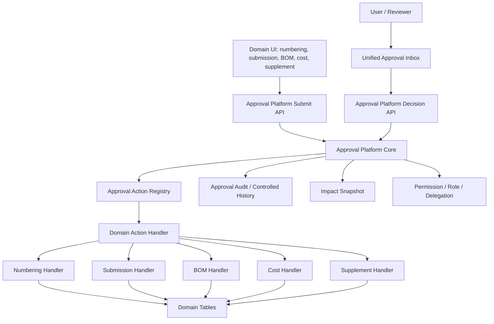

# SPEC-PDM-APPROVAL-PLATFORM-001 - System-wide approval platform

Status: Phase 1A-1B local implementation complete; Phase 1C-A reviewer workbench entrypoint consolidation implemented and locally verified; Phase 1C-B legacy reviewer page convergence implemented and locally verified; Phase 1C-C low-noise drawing object pending-review projection implemented and locally verified; Phase 1C-D / DEV-067 native owner-module review detail reuse and scoped full projections are `Local RD Implemented / Local QA-QC Passed`; DEV-070 approval inbox workbench reuse is `Local RD Implemented / Focused Contract + Query + Browser QC Passed / Full APW Matrix Pending / Production Release Gated`; Phase 2-4 transitional adapters present; Phase 5 guarded dry-run/apply tooling present; Phase 6 release/live migration not authorized
Date: 2026-07-08; amended 2026-08-27
Owner: Dev PM
Related DEV: `DEV-PDM-APPROVAL-PLATFORM-001`; `DEV-PDM-UNIFIED-ENTITY-DETAIL-REVIEW-001` / `DEV-067`; `DEV-PDM-APPROVAL-INBOX-WORKBENCH-001` / `DEV-070`; `DEV-PDM-STATUS-DATA-REBUILD-001` / `DEV-087`; `DEV-PDM-APPROVAL-CANONICAL-REVIEW-WORKSPACE-001` / `DEV-101`
Related ADR: `.ai-doc/decisions/ADR-PDM-APPROVAL-PLATFORM-001-shared-core-domain-handlers.md`; `.ai-doc/decisions/ADR-PDM-APPROVAL-PLATFORM-002-v2-platform-tables.md`; `.ai-doc/decisions/ADR-PDM-APPROVAL-PLATFORM-003-drawing-revision-lifecycle-only-retention.md`; `.ai-doc/decisions/ADR-PDM-UNIFIED-ENTITY-DETAIL-PROJECTIONS-001-composer-and-policy.md`; `.ai-doc/decisions/ADR-PDM-WORKBENCH-CORE-001-shared-mechanics-and-domain-adapters.md`
Related QA: `.ai-doc/qa/qa-pdm-approval-platform-validation-plan-2026-07-08.md`; `.ai-doc/qa/qa-dev-067-unified-pdm-entity-detail-validation-plan-2026-08-12.md`
Amends: `DEV-PDM-NUMBERING-004`, `DEV-PDM-SUBMISSION-GATE-001`, `DEV-PDM-LIFECYCLE-ACTIONS-001`, numbering approval flows, submission lifecycle requests, BOM review requests, part cost change requests and drawing revision supplement approvals.

> **2026-08-11 Part-cost retirement amendment**
>
> Part cost change requests are retired from the current product scope by `ADR-PDM-PART-COST-RETIREMENT-001`. The approval platform must not expose, recreate or require a part-cost adapter, inbox item, table or migration. The remaining approval domains retain their existing authority.

## 2026-08-26 DEV-101 Amendment - Canonical Drawing／Part review package workspace

Status：`Local RD Corrective Implementation Complete / RD Aggregate 11 of 11 PASS Supporting Evidence / Fixed QA 48 Cases Not Run / Independent QC Required / Production Release Gated`。

本節是covered v2 `pdm_work_review_requests` Drawing／Part案件的`Intentional replacement + compatible preservation`：

1. `/approvals`與DEV-070 list／filter／cursor／pending count／exact return是目標單一inbox authority；2026-08-27 CAPA已確認現行reader尚未合併`pdm_work_review_requests`，因此必須先完成actor-scoped adapter。點擊covered PDM row後直接進`/approvals/[requestId]`的canonical package review workspace，不先render approval-only domain drawer/body。
2. review workspace上方顯示immutable submitted package的完整同根Drawing × Part readonly matrix，下方一次顯示一個active Drawing／Part完整domain workspace。只有identity名稱切換target；cells不是Relation edit／review入口。
3. Drawing／Part各自與editor共用同一domain renderer、view model、section order、preview與file位置；review只替換為snapshot source、readonly capability與request-level decision dock。不得建立cross-domain generic editor。
4. `snapshot_payload`v2保存完整package，column`snapshot_hash`證明package完整性；approve使用envelope內獨立`decisionBasis.hash`重驗primary work。live facts只進drift comparison，不能補寫snapshot。
5. Part附件仍由既有attachment authority獨立維護、不鎖、不進approved payload／formalization；但v2 reviewer顯示送審時manifest，live變化只顯示drift。下方DEV-087 amendment第5點的「current live list＋常駐note」只對legacy v1保留，v2由本節取代。
6. decision仍只有`approve|return_for_correction`、exact reviewer、request-level atomic、idempotent；active target／已讀／compare不進decision body、trace或publication。不新增per-target decision。
7. DEV-090 Relation retirement保持：Relation request不進current shell，matrix relation cells不可寫；generic BOM／其他approval domain仍走既有platform body與decision semantics。
8. schema=`none`；新writer以default-off flag產生v2，reader dual-read v1/v2。v1不backfill或以live拼成v2；rollback只停止新v2 writes，不能移除pending v2 reader／decision。
9. `pdm_work_review_requests` adapter是DEV-101必要read path：same company、exact reviewer與actionable status必須在source query內先過濾再limit；v1／v2共用row projection。`applying`不得呈現為reviewer待辦；generic approval decision／apply handler不因本adapter改變。
10. Drawing v2 target保存exact full recognition projection與inner hash；reviewer不呼latest recognition，unresolved／ambiguous owner及legacy incomplete basis不能approve。這是package integrity／formalization gate，不改generic approval decision semantics。

完整contract、fixed 48-case gate與兩份CAPA：`.ai-doc/specs/SPEC-PDM-APPROVAL-CANONICAL-REVIEW-WORKSPACE-001-snapshot-package-and-shared-renderers.md`、`.ai-doc/qa/qa-dev-101-approval-canonical-review-workspace-validation-plan-2026-08-26.md`、`.ai-doc/qc/qc-dev-101-approval-inbox-discoverability-capa-2026-08-27.md`、`.ai-doc/qc/qc-dev-079-dev-101-recognition-owner-review-parity-capa-2026-08-27.md`。

## 2026-08-23 DEV-090 Amendment - Relation review retirement

Status: `RD Implementation Complete / Local QA-QC Complete / Production Gated`。

DEV-090 activation後，新的Relation關聯矩陣變更由Drawing／Part drawer直接原子更新正式`drawing_part_links`，不建立review request、approval inbox item、decision、snapshot或async apply。此本機 activation與retirement gate已完成；正式PostgreSQL migration、zero-loss reconciliation與release仍 gated。以下是對本文件Relation-specific條款的`Intentional replacement`：

- DEV-087 request descriptor、exact Relation tree review lock、Relation ownerHref、Relation readonly reviewer projection與Part/Relation approval formalization只對Drawing／Part繼續適用；Relation移出current approval domain。
- `/approvals`不得顯示DEV-090 activation後的新Relation項目；既有completed Relation review trace／approved snapshot只作歷史證據，不恢復成inbox row。
- active Relation review、applying或apply_failed在cutover前必須為0；不得自動核准、套用或丟棄。
- Drawing、Part、BOM與其他approval domain契約不變。

完整authority：`.ai-doc/specs/SPEC-PDM-INLINE-RELATION-MATRIX-001-direct-formal-edit.md`。現行runtime尚未改變。

## 2026-08-22 DEV-087 Target-State Amendment - PDM request decisions, readonly editor parity and attachment scope

Status: `RD Implementation Ready (RD Supervisor Reviewed) / Human Confirmed / DEV-087 activation only`.

This amendment becomes authoritative only when DEV-087 activates the canonical workbench state. Until then, the existing runtime and completed DEV-067/070 behavior remain the current baseline. It is a scoped amendment, not a platform-wide deletion of existing approval decisions.

1. DEV-087 request descriptors are limited to Drawing、Part and Relation current-work review. Their human action allowlist is exactly `approve` and `return_for_correction`（UI=`核准／退回修改`）. `reject`、`needs_info` or domain-specific decisions remain valid for BOM and other approval domains, but must be rejected if submitted against a DEV-087 descriptor.
2. The exact reviewer enters through a canonical request route, which may be `/approvals/[requestId]` or another server-owned request href. The route renders the same domain editor components, field set, data version and layout as the owner editor in fully-readonly mode. “Same editor” means component/data/layout parity; it does not require the reviewer URL to equal the owner URL.
3. Decision capability is bound server-side to active request, company, exact target and exact reviewer. Manufacturing, non-reviewer, cross-company and stale/terminal contexts receive no decision action; cross-company/unauthorized requests fail closed without hydrating target facts.
4. Drawing controlled files and Relation exact target tree are inside the reviewed snapshot and active-review mutation lock.
5. Part attachments are a deliberate DEV-087 current-phase exception using the existing attachment authority: they remain independently and immediately mutable, are excluded from the Part approved snapshot and active-review lock, and do not roll back with Part work. The reviewer sees the current live attachment list with the adjacent review-only note `附件獨立維護，不屬於本次資料核准`. This note does not appear in a workbench list, normal drawer or general filter. Follow-up DEV-088 reuse/binding/version/lease work is not a prerequisite or part of this approval contract.
6. Approve/return is idempotent and creates the DEV-087 minimal review trace only when the reviewer actually submits the decision. Double-click, response loss or retry must return the same outcome without a second trace or domain effect.
7. Approve freezes the exact in-scope data snapshot and starts automatic formalization. Drawing RD minor formalization returns the branch to controlled idle without changing production; a Drawing production target advances production only if its immutable branch base still equals the current production. Part/Relation approval updates formal data atomically.
8. Existing DEV-067 owner-route full projection and DEV-070 inbox mechanics remain compatible. Where older clauses say `approve/return/reject`, the DEV-087 descriptor allowlist above is the narrower authority for DEV-087 requests only.
9. Drawing `branch_void` request is a DEV-087 descriptor with the same exact `approve／return_for_correction` allowlist. It targets the immutable latest approved RD snapshot of one open idle branch, creates no new revision, and blocks concurrent next-version creation or a second void request. Return ends the void request and restores the branch to idle open；approve starts automatic formalization, which closes the branch, removes its current row and atomically releases one branch-cap slot. Closed-by-void branches cannot reopen.
10. `branch_void` does not delete approved Drawing identity、minimal review trace or controlled artifacts. Reviewer sees the same fully-readonly Drawing editor projection for the exact revision plus the review context; no backup／restore CTA is exposed.
11. Submission and mutable-work commands preserve the current same-company non-owner edit scope from `SPEC-PDM-SUPERVISOR-EDIT-SCOPE-001`: owner or an actor with `hasPdmNonOwnerEditScope` must also pass the exact action permission and lifecycle gate. This does not broaden reviewer authority：decision remains exact-request、exact-reviewer only.
12. DEV-087 intentionally does **not** persist its request or decision in `approval_platform_requests／approval_platform_decisions`. The existing decision table stores reviewer、decision、comment and is immutable, which conflicts with the confirmed DEV-087 permanent retention of only review cycle、entity reference and decision time.
13. `/approvals` remains the single human inbox through a `pdm_work_review_requests` adapter. That dedicated table is transient and may hold exact reviewer、locked snapshot and applying failure only while the request is pending/applying/apply_failed. Return or successful formalization deletes the transient request/snapshot; `pdm_review_traces` is the only permanent review-count/time record.
14. DEV-087 decisions use `POST /api/pdm/review-requests/[requestId]/decisions` with exactly `approve|return_for_correction`. They must not be translated into the existing `/api/approvals/requests/[requestId]/decisions` values or create an `approval_platform_decisions` row. The inbox supplies a server-owned href and does not infer storage from route placement.
15. This is an explicit target-state exception to older platform clauses that require every approval-like request to be physically represented in platform canonical tables. Newer DEV-087 data-minimization decisions prevail for this domain; the old storage path is removed rather than kept as dual compatibility. Other approval domains remain unchanged.

Acceptance requires the DEV-087 QA cases `QA-087-051、082..085、091、096、101..107、110、112..117` plus regression evidence proving BOM/other-domain decision behavior is unchanged.

## 2026-08-12 Human Decision Amendment - Native owner-module review and scoped full projections (`DEV-067`)

Status: `RD Implementation Ready / Human Confirmed / RD not started / Local implementation eligible / Release not authorized`.

This amendment is an **Intentional replacement** of older clauses that place the actual visible review detail only inside `/approvals`, compose an approval-specific detail body, or use an approval snapshot as a separate reviewer-facing detail source. It does not replace approval request, reviewer eligibility, decision, idempotency, audit or integrity-snapshot authority.

Confirmed product rules:

1. `/approvals` remains the single reviewer inbox and owns the total list, pending count, search/filter state and request selection context. It is not the owner of drawing, part or relation detail UI.
2. Selecting an in-scope review item resolves a server-authorized canonical owner href and navigates to the same owner module used by the submitter:
   - drawing -> `/numbering/drawings` with its canonical drawing/workspace `detail` key;
   - part -> `/parts` with its canonical part/workspace `detail` key;
   - root/drawing/part relation -> `/numbering/search` with its canonical relation/workspace `detail` key.
3. The owner route mounts the same `UnifiedPdmEntityDetailDrawer` and domain-owned projection components used by normal owner surfaces. Covered flows must not fork, copy or recompose the body in `ApprovalDetailDrawer`, `ApprovalDrawingPreview` or another approval-only equivalent.
4. The visible drawing/part/relation facts, controlled attachments and 3D/2D preview are read from the same locked owner-module authority. The latest human decision intentionally replaces the earlier strict claim that reviewer and submitter must receive an identical visible section set: components and owner data remain shared, while an exact assigned reviewer receives a server-scoped full Drawing/Part/Relation projection set for the active request.
5. Submission locks the exact in-scope owner data for the active review. Submitter and reviewer read that same locked data. Server commands must reject edits to reviewed fields, target relationships, revision content and in-scope attachment upload/delete/replace until the request is withdrawn, returned for correction or reaches the next lifecycle state that explicitly permits change. A requested content change therefore follows `withdraw/return -> edit owner module -> resubmit`; it must not silently invalidate a review while allowing the write.
6. Native preview behavior is identical to the submitter view. If a 3D/2D derivative is queued or running, the existing owner preview orchestration continues automatic refresh/polling and visibly reports progress; the reviewer is not given a separate manual preview path.
7. `ReviewContextProjection` may show request status, exact target scope, reviewer responsibility, decision reason/history and integrity evidence. Its `ApprovalSnapshotProjection` may show target IDs, hash/diff/check and mismatch status only; it must not duplicate Drawing/Part/Relation facts, attachments or relationships. Snapshot drift fails closed and never causes snapshot data to replace owner data.
8. Reviewer full visibility is an ephemeral server-derived capability bound to active request, exact target membership, reviewer eligibility and company. It is not granted by a client role label and does not survive terminal/unassigned/tampered context. If any decision-required projection cannot be authorized or hydrated, decision actions are unavailable and the recovery owner is explicit.
9. Approve/return/reject controls are contributed to the single `ContextActionBar`; approval context must not create another sticky footer or primary CTA owner.
10. Navigation obeys **`哪裡來，哪裡去`**. The owner href carries a validated internal `returnTo` that preserves the `/approvals` filter/query/selection state. Closing the review, using Back, or completing a decision returns to that exact workbench context and refreshes the affected row. External, protocol-relative or cross-company return targets are rejected.
11. Owner-route authorization, company scope and reviewer eligibility are checked server-side. A safe return path must remain available for 401/403/404/stale-target failures without exposing hidden entity existence.

Unified owner-detail prerequisite confirmed on 2026-08-12:

- Sharing the current drawer shells is insufficient because Drawing candidate/formal preview, Part candidate/formal content and Relation root/target composition still diverge.
- Drawing, Part and Relation first converge on one `UnifiedPdmEntityDetailDrawer` composer with domain-owned projections and server-derived `none/summary/full` policy, as defined by `SPEC-PDM-ENTITY-DETAIL-DRAWER-001` and `ADR-PDM-UNIFIED-ENTITY-DETAIL-PROJECTIONS-001`.
- Normal Drawing and Part surfaces receive task-focused reductions; Relation is the full relationship surface. Assigned active review receives full projections only for the reviewed aggregate/scope.
- This is not a giant cross-entity conditional component. The composer owns mechanics and ordering; each domain owns its projection and commands.

Initial delivery scope is drawing, part and root/drawing/part relation approvals because those three owner workbenches already share the single-page workbench/detail pattern. BOM and other approval domains remain outside `DEV-067`; when adopted later they must follow the same owner-surface rule and must not create a new approval-specific domain detail.

Acceptance direction:

- Given the same entity and active review, submitter and reviewer receive the same domain projection components and locked owner data version. The submitter keeps the normal surface projection levels; the assigned reviewer receives the server-authorized full reviewed aggregate plus review context.
- Automatic preview state, image and failure/retry wording match the owner module. A reviewer must not see `預覽尚未就緒` merely because an approval-only preview path failed to reuse the owner orchestration.
- In-scope write APIs fail closed during active review. UI disabling alone is insufficient.
- Browser history and explicit close/decision return to the originating `/approvals` list with filters and selected request preserved.
- No approval-only drawing/part/relation detail or preview component is mounted for covered actions.
- Network evidence proves unassigned/terminal/cross-company/tampered review contexts do not receive full projection payloads; hidden DOM alone is insufficient.
- Multi-target review identifies every target in scope, provides stable target/section anchors and retains one atomic decision boundary. If no canonical aggregate exists, the request is not actionable until the contract is resolved.

2026-08-12 readiness update: the same `DEV-067` is now `RD Implementation Ready` for local Phase 1A～1D. Exact projection models, unified read API, one-snapshot boundary, scoped-review receipt, action-to-owner resolver, multi-target ambiguity handling, transaction lock matrix, preview/return contract, file list, phases and `UDD-001..050` QA evidence IDs are authoritative in `SPEC-PDM-ENTITY-DETAIL-DRAWER-001` and `.ai-doc/qa/qa-dev-067-unified-pdm-entity-detail-validation-plan-2026-08-12.md`. Product implementation may begin locally; schema/migration, production/staging data, deployment, release, merge and PR remain unauthorized.

## 2026-08-12 Human Decision Amendment - Approval inbox workbench reuse (`DEV-070`)

Status: `RD Implementation Ready / Human Confirmed / Local RD Not Started / Production Release Gated`.

This amendment is a `Compatible extension` of the existing unified inbox, DEV-062 shared workbench mechanics, DEV-066 toolbar muscle memory and DEV-067 owner-module review navigation. It does not change approval assignment, eligibility, decision, audit, idempotency, request status, domain handler or locked owner-data authority.

Confirmed product rules:

1. `/approvals` adopts the same workbench shell and interaction mechanics used by the PDM workbenches: stable topbar/toolbar/result panel placement, search/filter state, selected row, loading/empty/error/recovery states, keyboard behavior, cursor pagination, URL/history and responsive rules.
2. Shared mechanics do not imply a shared domain row body. Relation keeps its expandable root tree/matrix projection; approval uses an `ApprovalInboxRowProjection` for review target/name, review type, requester, requested time and request status. `/approvals` must not expose the relation tree/matrix view switch.
3. The shared workbench core must not interpret approval status, action code, assignment or decision capability. Approval APIs/adapters own those values and map them into generic row, filter, cursor and navigation contracts.
4. Selecting a covered PDM request continues to navigate to the server-authorized Drawing, Part or Relation owner route and mounts the same `UnifiedPdmEntityDetailDrawer`. `/approvals` must not reintroduce an approval-only detail body, file preview, attachment section, snapshot body or decision footer.
5. Navigation obeys **`哪裡來，哪裡去`** at list granularity. The validated `returnTo` preserves status, domain, action, search query, cursor/page and selected request. Close, Back or completed decision returns to the exact inbox context, keeps the affected row locatable and refreshes affected data.
6. Search and pagination are server-authoritative. The current fixed `limit=100` merged list is not the end-state contract; pagination across native and legacy sources requires deterministic ordering, a stable tie-breaker and no duplicate or missing rows.
7. Rapid query/filter/page changes must cancel or supersede older requests. A late response must not overwrite newer query, rows, selection or URL state.
8. Keyboard and accessibility behavior follows the shared workbench contract: ArrowUp/Down, Home/End, PageUp/Down, Enter, Escape and copy-current-identifier where safe; inputs, textareas and selects retain native behavior.
9. Normal rows remain low-noise. Status uses a compact badge/icon/row state and is not duplicated in large cards. Only blocked, error, empty, forbidden or unavailable states show recovery guidance.

Current observed gaps:

- `src/app/approvals/page.tsx` owns independent `useState`/`loadInbox`, item buttons and approval-only list CSS instead of the shared workbench controller/list/pagination mechanics.
- The inbox lacks search, signed/cursor pagination and shared list keyboard behavior; `items.length` only describes the loaded slice.
- The page-local request path has no shared abort/request-sequence guard, so rapid filter changes can permit stale-response replacement.
- Filter values reach the URL, but selected request and cursor/page do not form a complete canonical return context. Returning from an owner route can therefore lose the original selected row.
- Visual similarity is currently maintained by parallel DOM/CSS rather than a single shell/interaction contract, allowing future density, state and responsive drift.

Current phase scope:

- Reuse or extract shared workbench shell/toolbar/collection/pagination primitives and the common controller behaviors without moving domain policy into core.
- Add approval search, deterministic server-side cursor pagination, URL selection and request race protection.
- Keep approval-specific row/filter projection and server-authorized owner navigation.
- Preserve the existing legacy fallback only where a canonical owner surface is not yet available; the inbox shell remains shared regardless of detail destination.

Out of scope:

- Relation tree/matrix controls, root expansion and relation mutation inside `/approvals`.
- A new approval-specific detail UI or duplicated Drawing/Part/Relation projection.
- Approval authority, permissions, status machine, decision semantics, audit retention, data lock or schema/migration changes.
- Mandatory owner-detail convergence for BOM, submission and drawing-package domains in this phase.
- Production, staging, deploy or release execution.

Acceptance direction:

- `/approvals` and PDM workbenches exhibit the same toolbar/result/selection/pagination/loading/error/empty muscle memory while preserving approval-specific fields.
- URL reload, share, Back/Forward and owner-route return restore exact query/filter/page/selection context; rapid interactions only render the newest response.
- More than 100 eligible requests are fully reachable with deterministic no-duplicate/no-gap pagination and safe invalid-cursor recovery.
- Covered PDM rows mount exactly one owner-route `UnifiedPdmEntityDetailDrawer`; no enabled-path approval-only body coexists.
- 1440x900, 1024x768, 768x1024 and 390x844 pass interaction, keyboard, focus, scroll-owner, overflow, visible-error, console and unexpected 4xx/5xx checks.

ADR decision: no new ADR is required for RD Implementation Ready. `ADR-PDM-WORKBENCH-CORE-001` already selects shared mechanics plus domain adapters and rejects a mega generic domain component. Re-enter architecture review only if cursor correctness requires a new persistent model, core must understand approval policy, or owner navigation/safe return must change.

### DEV-070 RD handoff contract

#### 1. Canonical inbox read API

`GET /api/approvals/inbox` remains the single inbox read entrypoint and accepts:

| Parameter | Contract |
|---|---|
| `status` | Existing approval status filter; normalized by approval authority. |
| `domain` | Existing domain filter; empty means all authorized domains. |
| `action` | Existing action filter; empty means all authorized actions. |
| `query` | New server-side search term; trim, collapse whitespace and compare case-insensitively. |
| `limit` | Default `60`, minimum `1`, maximum `100`. |
| `cursor` | Optional signed `approval-inbox-v1` cursor. Invalid, tampered or context-mismatched values return HTTP 400. |

The response contains `rows`, `nextCursor`, `previousCursor`, `generatedAt`, normalized `filters` and reviewer-scoped `summary.pending`. `summary.pending` is an exact authorized count and must not be derived from the current page length. If an exact filtered total is not returned, the visible list label says `本頁 N 筆`, not a false total.

#### 2. Approval row projection

Each `ApprovalWorkbenchRow` contains:

```ts
type ApprovalWorkbenchRow = {
  rowKey: `approval:${string}:${string}`;
  requestId: string;
  source: string;
  displayCode: string | null;
  displayName: string;
  actionCode: string;
  actionTitle: string;
  domainCode: string;
  requesterName: string;
  requestedAt: string;
  status: string;
  ownerHref: string | null;
};
```

`rowKey` is globally stable and collision-free across the native and five legacy sources: platform uses its request ID and legacy uses `item.legacy.id` as `sourceRecordId`. `requestId` remains the current native or encoded-legacy detail API identifier. `displayCode` prefers a human target/package code; `displayName` prefers target label or request title and only falls back to a safe human-readable placeholder. The shared workbench core treats every approval field as opaque display/navigation data.

#### 3. Search, ordering and multi-source cursor

- Search covers authorized target code/label/title, request title, requester display name and package code. Phase 1 does not require fuzzy search.
- Reviewer assignment and actor/company scope are applied in each source query; status and search are pushed down where the source has a stable column mapping, while the normalized domain/action projection is enforced at the server merge boundary. Full 101+ collision proof remains a phase gate.
- Sources are native platform, numbering, submission, BOM, drawing package and drawing revision review. The local implementation performs a bounded source scan (`max(500, limit + 1)` per source), then the server merges and slices them using `requestedAt DESC, rowKey ASC`; replacing this bounded scan with strict per-source `limit + 1` keyset readers is part of the pending 101+ evidence gate.
- Cursor namespace is `approval-inbox-v1`; its signed filter hash includes normalized status/domain/action/query, `companyId` and `actorId`. Next and previous navigation use the same global order and cannot cross user, company or filter context.
- The signed wire payload reuses `PdmWorkbenchCursorPayload`: `{ version: 1, filterHash, updatedAt: requestedAt, rowKey, direction: "after" | "before", pageIndex }`. Namespace `approval-inbox-v1` is part of `filterHash`, not a second unsigned query parameter. For `after`, eligible rows satisfy `requestedAt < anchor` or equal time with `rowKey > anchor`; for `before`, predicates reverse, bounded source results are read in reverse order and the final page is returned in canonical order. `nextCursor` anchors the last row and targets `pageIndex + 1`; `previousCursor` anchors the first row and targets `pageIndex - 1`, and is null at page index 0.
- Client-side merge is not used; the server performs the multi-source merge. The current bounded source scan is explicitly not treated as proof of complete 101+ traversal, and the full QA gate must close that gap before release. The list path has a hard budget of `<=16` database reads at 1/20/60 rows and no row-count-dependent query growth.

#### 4. Canonical URL and owner return

The canonical browser state is:

```text
/approvals?status=...&domain=...&action=...&query=...&cursor=...&requestId=...
```

Changing filter/query clears cursor and any selection that is no longer in the result. Reload, shared URL and browser Back/Forward restore the same visible page and selected request. The API constructs each covered PDM `ownerHref` from normalized list state plus that row's `requestId`; the client must not reconstruct or widen it.

Drawing, Part and Relation requests navigate to their canonical owner route and mount exactly one owner-module `UnifiedPdmEntityDetailDrawer`. Close, browser Back and successful decision return to the exact inbox state, keep the row locatable and refresh only the affected row plus exact pending count. `/approvals` does not mount a parallel PDM detail body.

#### 5. Permission and failure behavior

- Existing reviewer role, assignment, decision capability, company/workspace isolation and domain handler authority remain unchanged.
- Scope is enforced before search, count, cursor and owner-link generation. HTTP 403 reveals no row, count, target or owner URL.
- Rapid changes use abort plus latest-response sequencing; stale responses cannot replace rows, selection, status or URL.
- A required source failure fails the whole inbox read closed. Partial inbox results must not be presented as complete.
- HTTP 400 invalid cursor clears the cursor and recovers to page one with a concise notice; 401 follows the existing login return; 403 renders the shared no-permission state; a stale owner target returns safely to the preserved inbox context.

#### 6. Dependency and execution boundary

DEV-070 depends on DEV-062 shared mechanics/cursor contract, DEV-066 placement and muscle memory, DEV-067 owner drawer/resolver/safe return, and the existing approval platform for all approval policy. No database schema or migration is required by this contract.

DEV-070 has since passed the Implementation Readiness Assessment in the governing section below. The 2026-08-12 RD execution implemented the local Phase 1A～1C path and focused evidence; full Phase 1D remains gated by the 101+ traversal, four-viewport, cross-scope and PostgreSQL runtime matrix. Dependency installation, schema/data change, staging, production, stage/commit, merge/PR, deploy and release remain outside the current boundary. Stop and return to Dev PM if a persistent cross-source identity/materialized inbox, approval authority change, partial-source degraded mode, shared-core approval branch or release action becomes necessary.

#### 7. Phase and evidence gate

1. `1A Server list contract`: normalized search/filter, six-source global cursor, exact pending count and bounded query evidence.
2. `1B Shared client mechanics`: shell/controller/list/pagination reuse, approval adapter, URL selection, race guard, keyboard/focus and responsive behavior.
3. `1C Owner return`: canonical owner href, exact return context and affected-row refresh.
4. `1D QA/QC`: execute `APW-001..028`; include 0/1/20/60/101+ and six-source collision fixtures, cursor tamper/context isolation, four viewports, browser history, keyboard/focus, console/network and architecture static checks.

Completion requires reproducible evidence of shared mechanics, no duplicate/missing row, no N+1, latest-response-wins and exact owner return. Visual resemblance alone is not acceptance.

### DEV-070 RD Implementation Contract

Readiness result: `PASS / no P0-P1 open decision`. Existing data and approval authority are sufficient. RD does not add a table, index migration, dependency, environment variable or feature flag for this phase.

#### 1. Exact product file plan

| File | RD change | Boundary |
|---|---|---|
| `src/lib/approval-workbench-contract.ts` | **New.** Own normalized query, row/list response, navigation mode, cursor validation, requestId↔rowKey helpers and item-to-row projection types. | Approval semantics only; no React and no database client. |
| `src/lib/pdm-workbench-contract.ts` | Add optional `previousCursor`, `pageIndex`, cursor `direction` and cursor `pageIndex`. | Existing consumers compile unchanged because additions are optional. |
| `src/lib/pdm-workbench-cursor.ts` | Add `approval-inbox-v1` to the namespace union; continue using existing HMAC secret and timing-safe verification. | Do not change Drawing/Part/Relation signatures or accepted payloads. |
| `src/components/use-pdm-workbench-controller.ts` | Add optional `paginationMode: "history" | "server-bidirectional"`; location-backed cursor/page and server `previousCursor` are enabled only for the second mode. | Default remains `history`; existing three workbenches must retain current behavior. |
| `src/components/pdm-workbench-pagination.tsx` | Accept optional `hasPreviousPage`; default derives from `pageIndex > 0`. | No visual redesign. |
| `src/lib/repositories/approval-platform-async-repository.ts` | Replace post-limit merge with six source-scoped keyset readers, global merge, grouped status counts and deterministic page cursors. | Existing request detail/decision/apply paths remain unchanged. |
| `src/lib/approval-platform.ts` | Extend `ApprovalPlatformInboxFilter`; return a typed inbox page rather than an unbounded item array. | No approval handler or decision semantics change. |
| `src/app/api/approvals/inbox/route.ts` | Parse normalized query/cursor/limit, map items to rows, create canonical per-row owner return and emit the shared list envelope. | Keep `R&D Manager`/`Admin` gate and fail closed. |
| `src/lib/pdm-review-navigation.ts` | Add canonical approval return builder/allowlist for status/domain/action/query/cursor/page/requestId. | Same-origin `/approvals` only; reject nested/foreign returns. |
| `src/app/approvals/page.tsx` | Replace page-local list state/loading/filter sync with shared controller, `PdmWorkbenchList`, `PdmWorkbenchPagination` and `useListKeyboardShortcuts`; retain legacy detail only for rows explicitly marked `legacy`. | No first-row auto-open; covered PDM rows navigate to owner module. |
| `src/components/sidebar-nav.tsx` | Read exact `summary.pending`; remove `items.length` fallback. | Badge remains reviewer-scoped and low-noise. |
| `src/app/globals.css` | Remove approval-only list/selected/pagination mechanics and keep only approval column/status/detail-fallback presentation. | Shared workbench selectors become the enabled list styling authority. |

Reuse without modification unless implementation proves a contract defect: `src/components/pdm-workbench-list.tsx`, `src/components/use-list-keyboard-shortcuts.ts`, `src/components/unified-pdm-entity-detail-drawer.tsx` and the Drawing/Part/Relation workbench components. A requested change to those files is a stop-and-explain event, not an implicit expansion.

#### 2. Exact wire and domain types

`src/lib/approval-workbench-contract.ts` owns these equivalent contracts:

```ts
type ApprovalWorkbenchQuery = {
  status: "active" | "all" | ApprovalPlatformStatus;
  domainCode: string;
  actionCode: string;
  query: string;
  cursor: string;
  limit: number;
};

type ApprovalWorkbenchRow = {
  rowKey: `approval:${ApprovalPlatformSource}:${string}`;
  requestId: string;
  source: ApprovalPlatformSource;
  displayCode: string | null;
  displayName: string;
  actionCode: string;
  actionTitle: string;
  domainCode: string;
  requesterName: string;
  requestedAt: string;
  status: ApprovalPlatformStatus;
  detailMode: "owner" | "legacy" | "unavailable";
  ownerHref: string | null;
};

type ApprovalWorkbenchListResponse =
  PdmWorkbenchListResponse<ApprovalWorkbenchRow, {
    status: string;
    domainCode: string;
    actionCode: string;
    query: string;
  }> & {
    previousCursor: string | null;
    pageIndex: number;
    summary: {
      total: number;
      pending: number;
      needsInfo: number;
      applyFailed: number;
    };
  };
```

Normalization rules:

- `status` unknown → `active`; empty domain/action → all; query trims and collapses whitespace, maximum 160 characters; `limit` defaults to 60 and clamps to 1～100; cursor maximum 2,000 characters.
- `summary` is an exact reviewer/company-scoped global status summary independent of current search/filter/page. The current page count is rendered separately as `本頁 N 筆`.
- `displayCode` uses primary target code, package code or target summary in that order. `displayName` uses primary target label or request title; empty values become `未命名審核項目`, never a raw internal ID unless no human identifier exists.
- `rowKey` uses `approval:${source}:${item.id}` for platform and `approval:${source}:${item.legacy.id}` for legacy. `requestId` separately keeps `item.id`, including the existing encoded legacy form required by request-detail routes.
- Pure helpers are bijective: `approvalRowKeyFromRequestId(requestId)` decodes existing `legacy:{source}:{id}` IDs and otherwise treats the ID as platform; `approvalRequestIdFromRowKey(rowKey)` reverses that mapping. Approval URL `requestId` remains the API identifier while controller `detailKey/selectedKey` remains the global rowKey.
- `detailMode=owner` requires a non-null server-authorized `ownerHref`; `legacy` is allowed only for an existing non-covered domain fallback; a covered action with missing/invalid target is `unavailable` and must not fall back to the duplicate approval drawer.
- The enabled response uses `rows`; the old slice-derived `items`/`summary.total` response is removed in the same local change. `sidebar-nav` is migrated atomically, so no internal caller remains on `items`.

#### 3. Cursor and canonical location algorithm

1. Normalize filters and calculate HMAC filter hash from namespace `approval-inbox-v1`, status/domain/action/lower-cased query, companyId and actorId.
2. Decode cursor through the shared verifier, then require `direction`, non-negative integer `pageIndex`, valid timestamp in `updatedAt` and `rowKey` beginning with `approval:`. A mismatch throws `PdmWorkbenchCursorError` and the route returns the standard 400 envelope.
3. Initial request has no cursor and page index 0. An `after` cursor identifies the last row of the prior page and its target page index. A `before` cursor identifies the first row of the prior page and its target page index.
4. For canonical order `requestedAt DESC, rowKey ASC`, `after` uses `(time < anchorTime) OR (time = anchorTime AND rowKey > anchorKey)`; `before` uses the inverse predicate, reverse SQL order and a final canonical reorder.
5. Each source returns at most `limit + 1`. Merge all candidates by the same comparator, keep `limit`, and derive existence of the movement-side page from the extra row. When navigating backward, the incoming signed page index establishes the known next page; page index 0 never emits `previousCursor`.
6. Browser URL uses one-based `page` only when greater than 1. Its value is derived from the verified cursor/response and never used as a data authorization input. A mismatched cosmetic page value is replaced with the server value.

Canonical URL order is `status`, `domain`, `action`, `query`, `cursor`, `page`, `requestId`; defaults/empty values are omitted except `status=active`. Every owner href receives a server-built `returnTo` with that row's requestId. Client code must not rebuild owner ownership or append unchecked query parameters.

#### 4. Six-source repository implementation

All source readers receive one normalized `ApprovalInboxSourceQuery` containing companyId, actorId, status/domain/action/query, decoded cursor anchor, direction and `scanLimit=limit+1`.

| Existing method/source | Scope and filter pushdown | Canonical time/key | Search columns |
|---|---|---|---|
| `listNativeInbox` / platform | `r.company_id`; existing lifecycle assigned-reviewer `EXISTS`; `r.domain_code`, `r.action_code`, status | `r.requested_at`; `approval:platform:` + `r.id` | request/action title, requester name, package code and `EXISTS` target code/label |
| `listLegacyNumberingInbox` | `ar.company_id`; numbering/action/status literal | `ar.requested_at`; `approval:legacy_numbering:` + `ar.id` | entity/target code and label, requester name, batch code |
| `listLegacySubmissionInbox` | add `s.company_id = :companyId`; submission/obsolete/status literal | `r.requested_at`; `approval:legacy_submission:` + `r.id` | drawing number, part number, revision, requester name |
| `listLegacyBomInbox` | add `bd.company_id = :companyId`; BOM lifecycle/status | `rr.submitted_at`; `approval:legacy_bom:` + `rr.id` | draft name, BOM revision, requester name |
| `listLegacyDrawingPackageInbox` | `p.company_id`; drawing-package/status literal | `s.requested_at`; `approval:legacy_drawing_package:` + `s.id` | drawing number, revision, reason, requester name, package id |
| `listLegacyDrawingRevisionReviewInbox` | `a.company_id`; numbering/action/derived status | `a.assessed_at`; `approval:legacy_drawing_revision_review:` + `a.id` | drawing number, revision, replacement part, assessor name, reason |

Search uses escaped `%`/`_`/`\\` literals and `LOWER(COALESCE(column,'')) LIKE :queryLike ESCAPE '\\'` so SQLite and PostgreSQL behave consistently. Source-constant domain/action mismatches return an empty source without a database read. The drawing-revision reader must stop ordering by `COALESCE(review_occurred_at, assessed_at)` because that differs from its exposed request time.

Timestamp handling is provider-aware and deterministic. PostgreSQL compares native `TIMESTAMPTZ` columns against the ISO cursor parameter. SQLite uses one shared SQL expression such as `strftime('%Y-%m-%dT%H:%M:%fZ', column)` for SELECT sort value, keyset predicate and ORDER BY so default `YYYY-MM-DD HH:mm:ss` and application ISO values do not split the order. Row mapping converts `string | Date` to an ISO API value before global comparison/cursor encoding; invalid timestamps fail the required source rather than receiving a guessed order.

List read budget is native request + target + impact (`<=3`) plus five legacy readers (`<=5`) plus one grouped status-count query per source (`<=6`): expected maximum 14, hard gate `<=16`, independent of 1/20/60 returned rows. Any source or count query failure rejects the whole `Promise.all`; no partial result is serialized.

#### 5. Shared controller and UI implementation

- `PdmWorkbenchLocationState` gains optional `cursor` and `pageIndex`. `paginationMode` defaults to `history`, preserving Drawing/Part/Relation. In `server-bidirectional`, controller initializes/restores the verified URL cursor, stores response `previousCursor/pageIndex`, and writes cursor/page on Next/Previous.
- Query/filter change aborts the current list request, clears cursor/page, keeps selection only until the new response proves that requestId still exists, then removes unavailable selection with `replaceState`.
- `popstate` restores query/cursor/page/requestId before loading. The latest request sequence remains the only response allowed to mutate rows, summary, selection, notice or URL.
- Approval `readLocation` converts URL requestId to rowKey before handing it to the shared controller; `writeLocation` converts rowKey back to requestId. Therefore no approval-specific key branch is added to the controller and deep-link selection can restore before rows arrive.
- Approval columns are `審核對象`, `品名`, `審核類型`, `送審者`, `送審時間`, `狀態`; desktop uses the shared table and mobile uses its existing `data-label` projection. There is no relation tree/matrix or layout switch.
- `useListKeyboardShortcuts` supplies ArrowUp/Down, Home/End, PageUp/Down, Enter, Escape and copy identifier. Inputs/selects/textareas keep native behavior; focus returns to the originating approval row after owner return/legacy drawer close when it still exists.
- Initial load selects nothing. `owner` rows navigate using returned href; `legacy` rows write requestId then fetch existing detail; `unavailable` rows show the shared recoverable notice and open no drawer.
- Existing approval detail/decision code remains only for explicit legacy fallback. Covered PDM review continues to use DEV-067 owner drawer and decision action bar.

#### 6. Failure and compatibility matrix

| Condition | Required behavior |
|---|---|
| Invalid/tampered/filter/actor/company cursor | HTTP 400 standard workbench envelope; clear cursor/page, preserve filters, first-page reload, concise notice. |
| 401 | Existing login redirect with safe current approval return. |
| 403 | Shared no-permission state; rows, counts, requestId and owner URL absent. |
| One source/count query fails | Whole list request fails closed; old successful rows are not relabelled current; Retry issues a new request. |
| Late/aborted response | Cannot mutate any visible or URL state. |
| Covered PDM target missing | `detailMode=unavailable`; no approval-only PDM drawer. |
| Legacy fallback request deleted | Clear requestId, show recoverable message and retain list context. |
| Decision succeeds | Owner route returns exact context; affected row plus global summary refresh. |
| Decision fails | Owner drawer retains context and error; inbox must not optimistically remove/decrement. |
| Feature flag off | Existing DEV-067 fallback behavior remains; DEV-070 list mechanics still operate. |

#### 7. Exact test and evidence file plan

| File | Coverage |
|---|---|
| `scripts/qc-approval-inbox-query-budget.mjs` | Expand existing native N+1 characterization into six-source 0/1/20/60/101+ deterministic cursor, exact count, company isolation, source failure and `<=16` reads. |
| `scripts/qc-dev-070-approval-workbench.mjs` | **New.** Static/type-level contract for shared imports, no core approval branch, URL/cursor normalization, row/navigation mode and no enabled-path duplicate PDM detail. |
| `scripts/qc-dev-070-browser.mjs` | **New.** Authenticated disposable-SQLite Chromium matrix for APW-015～028 at four viewports. |
| `scripts/qc-dev-070-postgres.mjs` | **New.** Disposable PostgreSQL parity for six-source search/order/after-before cursor/count and timestamp normalization; no migration or persistent data. |
| `scripts/qc-pdm-approval-platform.mjs` | Replace only expectations superseded by DEV-067/070; retain approval policy/decision/audit regressions. |
| `package.json` | Add `qc:dev-070:contract`, `qc:dev-070:query`, `qc:dev-070:postgres`, `qc:dev-070:browser`, `qc:dev-070`; do not add dependencies. |

Required local commands, in order:

```text
npm run qc:dev-070:contract
npm run qc:dev-070:query
npm run qc:dev-070:postgres
npm run qc:dev-062:core
npm run qc:dev-067:navigation
npm run qc:pdm-approval-platform
npm run typecheck:app
npm run build:isolated
npm run qc:dev-070:browser
```

`qc:dev-070` aggregates the same sequence except any environment-dependent historical suite must report its own blocker rather than being counted as a DEV-070 pass. Evidence is retained under `output/qa/dev-070-approval-workbench/<run-id>/` and `output/playwright/dev-070-approval-workbench/<run-id>/` with manifest, fixture seed, query counts, screenshots and console/network summary.

#### 8. Dirty-worktree implementation boundary

Readiness was assessed on branch `持續優化1`, HEAD `cc393e04`. No target file is staged. The following target files already contain user changes and must be preserved hunk-by-hunk: `package.json`, `src/app/approvals/page.tsx`, `src/app/globals.css`, `src/components/sidebar-nav.tsx`, `src/lib/repositories/approval-platform-async-repository.ts`. All other dirty files are outside DEV-070.

At RD start, record `git diff --` for those five files before editing; do not reset, checkout, reformat globally or absorb unrelated vocabulary/BOM/DEV-068 work. If an existing target hunk contradicts this contract, stop with exact hunk and spec classification. Generated `.tmp`, backup and output directories remain out of source scope.

#### 8A. DEV-070 local implementation evidence (2026-08-12)

Phase 1A～1C is implemented in the scoped product files and focused local QC has passed. The shared approval path now uses the PDM workbench controller/list/pagination primitives, six-source server ordering with deterministic `rowKey`, signed after/before cursors, reviewer/company-scoped summary, canonical `returnTo`, and owner-module navigation without first-row auto-open. Submission and BOM legacy readers both push `companyId` into SQL scope predicates. The duplicate BOM approval sidebar entry was removed so the centralized approval workbench is the only primary entry.

Evidence:

- `qc:dev-070:contract` PASS.
- `qc:dev-070:query` PASS; legacy 3-read and batched 3-read native query results are deep-equal.
- `qc:dev-070:postgres` PASS for static guard; no external PostgreSQL target is configured locally, so runtime provider parity remains pending and is not claimed as PASS.
- `qc:dev-070:navigation` PASS; `qc:dev-062:core` PASS (6/6); `qc:pdm-approval-platform` PASS (123/123).
- `typecheck:app` PASS; `build:isolated` PASS.
- `qc:dev-070:browser` PASS for shared list/filter/pagination envelope, no auto-open, owner route, expected network/console sweep and screenshot `output/playwright/dev-070-approval-workbench/approval-workbench.png`.

The remaining gate is the full `APW-001..028` evidence matrix: four viewports, 101+ collision traversal, cross actor/company isolation, full browser history and decision-return coverage, plus disposable PostgreSQL runtime parity. No schema/migration, production/staging data, stage/commit/merge/PR/deploy/release is authorized by this evidence update.

#### 9. Phase gates and stop conditions

| Phase | Exact output | Exit gate |
|---|---|---|
| 1A | contract/cursor/repository/service/API/count | APW-004～014 and 026 query/failure cases pass on SQLite plus disposable PostgreSQL parity; no schema/data write. |
| 1B | optional shared controller/pagination extension plus approval shared list UI | APW-001～003, 005, 015～018, 024～027 pass; DEV-062 core regression passes. |
| 1C | canonical owner return, navigation modes, sidebar exact badge | APW-019～023 pass; DEV-067 navigation regression passes. |
| 1D | complete focused/static/build/browser evidence and docs drift update | APW-001～028 pass, four viewports, zero unexpected console/network error. |

Stop immediately for schema/index migration, persistent/materialized inbox, new dependency or secret, approval assignment/status/decision change, partial-source degradation, shared core approval conditional, owner authority change, production/staging data, destructive Git, stage/commit, merge/PR, deploy or release. Return with the failing gate, affected files, options and evidence; do not widen scope silently.

This section is the implementation authority for DEV-070. Earlier `Brief` and RD-contract paragraphs remain rationale; where implementation detail differs, this section governs.

## Human Decision Brief

The user asked whether the current approval architecture needs optimization, whether it should be refactored before launch, and then confirmed:

- Launch timing is not urgent.
- Stability is more important than short-term speed.
- It is acceptable and preferred to build system-wide approval platformization before launch.
- The design must not become a single giant approval module. The target architecture is a shared approval core with domain-specific action handlers.
- RD supervisor completeness review decisions on 2026-07-08:
  - `1C`: Do a no-migration architecture spike first. RD must produce an ADR before choosing whether to generalize existing approval tables or create v2 platform tables.
  - `2B`: Pre-launch blocker scope is platform core plus numbering/root/drawing/part plus submission/BOM formal lifecycle. Cost and supplement flows may start as adapters.
  - `3C`: Before launch, all known historical approval-like records must be physically migrated into the canonical platform approval model. Read adapters are transitional only and do not satisfy final pre-launch readiness.
- Reviewer entrypoint and missed-review UX decisions on 2026-07-08:
  - `1B`: Sidebar approval navigation should converge to a single primary `審核工作台`; specialized approval pages become workbench filters, detail views or contextual deep links rather than primary reviewer entrypoints.
  - `2A`: First anti-missed-review slice only adds a clear pending-review count badge. Due dates, owner columns, overdue grouping, escalation and external notifications are deferred.
  - `3 phased A -> B`: Short-term compatibility keeps legacy approval pages reachable through workbench deep links while removing them as primary navigation. Long-term target is option `B`: legacy reviewer decision pages redirect into the approval workbench once feature parity, deep-link preservation and QC evidence are complete.

DEV-053 Phase 1H domain-scoped data-policy exception confirmed on 2026-08-06:

- `HD-053-1H-04 / 4C` intentionally replaces this platform's permanent decision-history/audit requirement only for fresh or explicitly adopted-active drawing-revision workflows governed by DEV-053 Phase 1H.
- The request and decision authority may exist while that workflow is active. After terminal completion and cleanup, the product retains only the drawing revision lifecycle state and no durable submitter, reviewer, decision, timestamp, reason or audit history for that flow.
- Existing completed/unknown production approval/submission/audit records are grandfathered and must not be deleted, rewritten, backfilled or replayed. Under `HD-053-1H-08 / 8B`, only workflows still active at activation may be dry-run/adopted all-or-nothing without decision replay; their PDM result remains protected. The exception does not apply to numbering, BOM, cost, obsolete, supplement or other approval domains.
- `5A` makes the return reason optional and active-only; `6A` permits cleanup only after durable lifecycle apply and required delivery; `7A` permits a payload-free technical token for at most seven days; `9B` defines delivery as atomic current drawing/task projection without permanent notification; `10B` redirects cleaned links to the drawing latest revision. DEV-053 Phase 1H is `RD Implementation Ready / implementation not started`.

This document converts the session into a development package. The user later authorized local RD implementation for `DEV-PDM-APPROVAL-PLATFORM-001`. Production deploy, Supabase live migration, direct data repair/deletion, merge, PR, rollback and release artifacts remain unauthorized.

## Local Implementation Update - 2026-07-08

RD completed the Phase 1A architecture spike and selected additive `approval_platform_*` v2 tables in `.ai-doc/decisions/ADR-PDM-APPROVAL-PLATFORM-002-v2-platform-tables.md`.

Local implementation now includes:

- Additive platform schema in `db/schema.sql` for actions, packages, requests, targets, impact snapshots, decisions, events, legacy links and package items.
- Immutable SQLite triggers for platform impact snapshots and append-only platform decisions/events.
- Generated Postgres initial/RLS planning updates in `db/postgres/001_initial_schema.sql` and `db/postgres/002_supabase_rls_plan.sql`.
- Platform repository/service in `src/lib/repositories/approval-platform-async-repository.ts` and `src/lib/approval-platform.ts`.
- Unified platform APIs under `src/app/api/approvals/*`.
- Unified UI entrypoint `/approvals` in `src/app/approvals/page.tsx` and sidebar navigation.
- Phase 1C-A reviewer-entrypoint consolidation: the primary sidebar now exposes one `審核工作台` approval entrypoint, removes specialized reviewer decision entries from primary navigation, shows a pending-review badge from `/api/approvals/inbox?status=pending`, and adds `/approvals` status/domain/action filters with URL query deep links.
- Phase 1C-B legacy reviewer page convergence: `/numbering/approvals`, `/bom/reviews` and `/numbering/change-reviews` now redirect into `/approvals` with equivalent status/domain/action filters and compatibility messages for bookmarked routes.
- Phase 1C-C low-noise drawing object pending-review projection: `/numbering/drawings` and `/numbering/search` show compact pending-review context on the affected drawing number and its revision attachments, without duplicating the full approval inbox or mutating master lifecycle status.
- Transitional legacy read/decision adapters for numbering, submission lifecycle, BOM review, part cost change, drawing package supplement records and drawing revision FFF impact reviews.
- Friendly legacy decision routes now delegate through platform adapter functions instead of directly calling domain decision facades.
- Focused QC script `scripts/qc-pdm-approval-platform.mjs`.
- Historical migration dry-run/apply script `scripts/generate-pdm-approval-platform-migration-dry-run.mjs`; apply is guarded by `--apply`, `--confirm-local-approval-platform-migration` and `PDM_APPROVAL_PLATFORM_MIGRATION_APPLY=YES`.

Executed local evidence:

- `npx.cmd tsc --noEmit --pretty false` passed.
- `npm.cmd run lint -- --quiet` passed.
- `npm.cmd run qc:pdm-approval-platform` passed 69/69.
- `npm.cmd run qc:pdm-approval-platform-migration-dry-run` passed, reported zero current legacy approval-like records in `data/ai-pdm.sqlite`, and ran an in-memory guarded apply/parity self-test.
- `npm.cmd run qc:pdm-lifecycle-actions` passed 270/270.
- `npm.cmd run qc:pdm-lifecycle-obsolete` passed 111/111.
- `npm.cmd run build` passed after safely stopping and restarting the project-owned local dev server.
- Browser checks passed after demo manager login with no blank page or horizontal overflow:
  - `output/playwright/pdm-approval-platform/approvals-desktop-auth.png`
  - `output/playwright/pdm-approval-platform/approvals-mobile-auth.png`
  - `output/playwright/pdm-approval-platform/numbering-approvals-desktop-auth.png`
  - `output/playwright/pdm-approval-platform/numbering-approvals-mobile-auth.png`
- Phase 1C-A focused evidence passed on 2026-07-08:
  - `npx tsc --noEmit` passed.
  - `npm run lint` passed with 0 errors and 3 unrelated warnings in `src/components/master-attachment-panel.tsx`.
  - `npm run qc:pdm-approval-platform` passed 88/88 after adding Phase 1C-A regression checks.
  - `npm run dev:local:check` reported AI_PDM healthy at `http://127.0.0.1:3000/`.
  - Playwright reviewer workbench checks passed for desktop 1440x960 and mobile 390x844 with no horizontal overflow; screenshots:
    - `output/playwright/approval-workbench-desktop.png`
    - `output/playwright/approval-workbench-mobile.png`
  - Playwright reviewer role-boundary check passed: `manager@example.com` can open the workbench; `engineer@example.com` does not see the reviewer pending badge and receives the workbench forbidden state.
  - `npm run build` was not rerun for Phase 1C-A because the project's local-dev guard refused to clean `.next` while the healthy project-owned dev server was listening on port 3000; no bypass or server stop was performed.
- Phase 1C-B focused evidence passed on 2026-07-09:
  - `npx.cmd tsc --noEmit --pretty false` passed.
  - `npm.cmd run qc:pdm-approval-platform` passed 106/106 after adding legacy redirect and drawing revision review adapter regression checks.
  - Source-scoped lint for the touched approval files passed.
  - `npm.cmd run dev:local:check` reported AI_PDM healthy at `http://127.0.0.1:3000/`.
  - Legacy route smoke confirmed 307 redirects:
    - `/numbering/approvals` -> `/approvals?status=active&domain=numbering&legacyRedirect=numbering_approvals`
    - `/bom/reviews` -> `/approvals?status=active&domain=bom&legacyRedirect=bom_reviews`
    - `/numbering/change-reviews` -> `/approvals?status=active&domain=numbering&action=numbering.drawing_revision_impact_review&legacyRedirect=numbering_change_reviews`
  - `npm.cmd run build` was blocked by the intentional local-dev guard because the healthy project-owned dev server was listening on port 3000; no bypass was used.
- Phase 1C-C focused evidence passed on 2026-07-09:
  - `npx.cmd tsc --noEmit --pretty false` passed.
  - `npm.cmd run qc:pdm-approval-platform` passed 125/125 after adding drawing pending-approval projection regression checks.
  - `npm.cmd run qc:pdm-entity-detail-drawer` passed 14/14 after adding owner/relation pending projection coverage.
  - Source-scoped lint for touched drawing, search, master attachment, API, repository and QC files passed.
  - `npm.cmd run dev:local:check` reported AI_PDM healthy at `http://127.0.0.1:3000/`.
  - Playwright manager-view smoke confirmed A0007-M01 keeps compact pending-review cues on the affected drawing/list and attachment history surfaces after the APP redline removal of the drawing detail focus panel, with no desktop or mobile horizontal overflow:
    - `output/playwright/pdm-approval-projection/drawings-pending-approval-desktop.png`
    - `output/playwright/pdm-approval-projection/drawings-pending-approval-mobile.png`
    - `output/playwright/pdm-approval-projection/drawings-redline-delete-desktop.png`
  - `npm.cmd run build` was blocked by the intentional local-dev guard because the healthy project-owned dev server was listening on port 3000; no bypass was used.

Remaining before launch readiness:

- Full physical migration execution for known historical approval-like records when target/data policy and release/cutover are authorized.
- Production/Supabase live migration, deployment, smoke and rollback through release gates.

## Session Findings

Current code inspection showed two different facts that must both be preserved:

- Numbering-related approvals already mostly share the numbering approval path. Existing formal obsolete support maps `part_number` and `drawing_number` to `obsolete_part_number` and `obsolete_ma_drawing`, then uses numbering approval request/batch logic.
- Whole-PDM approvals are not yet one shared platform. Existing review/approval concepts are spread across separate structures such as `approval_requests`, `approval_batches`, `submission_lifecycle_requests`, `bom_review_requests`, `part_cost_change_requests` and `drawing_revision_package_supplements`.

Relevant current anchors:

- `db/schema.sql`: `approval_requests.request_type` and `approval_batches.request_type` are constrained to `numbering`.
- `src/app/api/lifecycle/obsolete-requests/route.ts`: formal obsolete request route currently maps only part/drawing obsolete action codes.
- `src/lib/repositories/numbering-async-repository.ts`: numbering approval request insertion, batch listing, decision and approved-action application are numbering-owned.
- `src/app/numbering/approvals/page.tsx`: numbering approval inbox labels include part/drawing obsolete.
- `src/app/api/numbering/approval-batches/route.ts`: batch action codes are scoped to numbering actions.

## Problem

Fragmented approval flows create a compounding pre-launch risk:

- Users must learn different approval locations, wording and histories for each domain.
- Reviewers can miss work because formal approval entrypoints are scattered across side navigation items that look similar but expose different slices.
- Permission, delegation, reviewer responsibility and audit rules drift between modules.
- High-risk lifecycle actions can be implemented with different guard levels.
- Future features repeatedly rebuild the same concepts: pending, approve, reject, return for correction, impact preview, decision history and controlled apply.
- QA has to test every domain as if it had a custom approval engine.

Over-correction is also risky. A single monolithic approval module with all domain logic inside one switch statement would create a new failure mode:

- Domain-specific business rules become hard to reason about.
- Cross-domain changes can break unrelated approvals.
- Root/drawing/part lifecycle, submission release, BOM review and cost changes have different impact semantics and should not share one uncontrolled apply path.

## Architecture Decision

Build a shared approval platform before launch, but keep domain effects outside the core.

The shared platform owns:

- Work item identity.
- Batch/package identity.
- Request status and decision status.
- Assignment, delegation and reviewer eligibility.
- Unified inbox and filtering.
- Impact snapshot storage.
- Decision history and audit trail, except the explicit DEV-053 Phase 1H lifecycle-only retention class after guarded terminal cleanup.
- Idempotency, concurrency and stale-snapshot guards.
- Common APIs for submit, decide, list, read, return for correction and cancel where allowed.

Domain action handlers own:

- Domain validation.
- Target resolution.
- Impact preview contents.
- Apply-approved side effects.
- Domain-specific stale checks.
- Domain-specific controlled history summary.
- Domain-specific compensating behavior where a transaction cannot cover all side effects.

The approval platform is an orchestration and control layer, not the owner of every business rule.

## Goals

- Provide one recognizable approval experience before launch.
- Make high-risk lifecycle decisions auditable across root, drawing, part, submission, BOM, cost and supplement domains, except where an explicit human data-policy exception such as DEV-053 Phase 1H intentionally retains only the durable lifecycle result.
- Prevent bypass routes from mutating formal records without the canonical approval authority; domains without a retention exception must also retain approval history.
- Keep domain logic testable through explicit handler contracts.
- Let `DEV-PDM-NUMBERING-004` root/drawing/part obsolete use the platform instead of growing another special approval path.
- Reduce future development cost by reusing approval work item, decision, delegation, audit and inbox mechanics.

## Non-Goals

- No production deploy or release cutover in this package.
- No live Supabase migration in this package.
- No direct repair, deletion or historical rewrite of user data.
- No no-code universal approval rule builder in the first version.
- No ERP, supplier portal or external customer approval portal.
- No replacement of domain state machines with one generic state machine.
- No release gate, rollback plan, production smoke or merge/PR artifact until explicitly authorized.

## End-State Architecture



## Architecture Memory Capsule

Fixed decisions:

- Full-system approval platformization is a pre-launch architecture direction because launch timing is not urgent and stability is preferred.
- The approval architecture is shared core plus domain-specific handlers.
- The shared core owns approval work identity, packages, status, decisions, assignment, delegation, impact snapshots, inbox, audit and common APIs while records are active; only an explicit domain retention class may invoke guarded terminal cleanup.
- Domain handlers own validation, target resolution, impact preview, apply-approved effects, stale checks and domain history summaries.
- Formal approval actions must route through the platform or an explicitly documented adapter.
- Root obsolete must preserve aggregate root intent and child targets; it must not become silent independent child mutations.
- A no-migration architecture spike is mandatory before schema or migration implementation. The spike must choose and justify either generalized existing approval tables or v2 platform tables.
- Pre-launch platformization must include platform core, numbering/root/drawing/part approvals, submission formal lifecycle and BOM formal lifecycle.
- Cost and supplement approvals may use adapters in early implementation, but adapters are transitional and must not prevent final historical migration.
- All known existing historical approval-like records must be physically migrated into the canonical platform approval model before launch readiness can be claimed. This does not create history for new DEV-053 Phase 1H workflows intentionally cleaned under `4C`.
- Production deploy, Supabase live migration, direct data repair/deletion, merge, PR, rollback and release artifacts are not authorized by this document.

Rejected options:

- Launching with fragmented formal approval inboxes.
- One monolithic approval apply module that owns every domain side effect.
- Direct formal lifecycle mutation without the canonical approval authority. DEV-053 Phase 1H removes durable history only after the controlled decision/apply/notify sequence; it does not permit bypass mutation.
- No-code approval rule builder before the platform contract is stable.
- Silent historical approval rewrite.

AI assumptions:

- Existing permission, role, delegation and company/workspace scope foundations remain the base authority unless a later access-control decision changes them.
- Existing numbering approval behavior is the first compatibility anchor because numbering currently has the clearest shared approval path.
- Legacy domain tables may remain as domain detail or compatibility tables during adapter phases if unified inbox, audit and status consistency are preserved; they are not a substitute for the user-selected full historical approval migration before launch.
- Handler contract, route names, QC script names and exact schema names are engineering decisions unless they change product semantics, retention policy, release scope or data ownership.

Re-entry triggers:

- Legal, ISO or retention policy requires exact archival wording, immutable storage or historical rewrite.
- Multi-company/tenant strategy changes approver scope.
- Production target, rollout date or cutover plan is set.
- A newly discovered approval-like domain cannot be migrated physically without changing product semantics or losing audit evidence.

## Platform Components

### Approval Platform Core

The core must provide a stable lifecycle for approval work:

- `draft` where a domain supports pre-submit preparation.
- `submitted`.
- `pending_review`.
- `needs_info`.
- `rejected`.
- `approved`.
- `applied`.
- `apply_failed`.
- `cancelled`.
- `superseded`.

The exact persisted status names may follow existing conventions, but the platform must expose a consistent semantic mapping to UI and QC.

### Approval Action Registry

Each approval-capable action must be registered with at least:

- `actionCode`, for example `obsolete_part_number`, `obsolete_drawing_number`, `obsolete_root`, `release_submission`, `release_bom`, `part_cost_update`, `drawing_package_supplement`.
- `requestType`, generalized beyond the current numbering-only check.
- `domain`, for example `numbering`, `submission`, `bom`, `cost`, `drawing_package`.
- `targetEntityTypes`.
- Required reviewer roles or rule resolver reference.
- Whether an impact preview is required.
- Whether batch/package approval is allowed.
- Handler identifier.
- Stale-snapshot policy.
- Apply idempotency key strategy.
- Human-readable Chinese UI labels.

### Domain Action Handler Contract

Every handler must implement the same conceptual contract:

| Method | Required behavior |
|---|---|
| `validateRequest(input, actor)` | Fail closed on missing permission, wrong company/workspace, invalid lifecycle state, missing target or unsupported action. |
| `resolveTargets(input)` | Return normalized targets and reject ambiguous root/drawing/part relationships. |
| `buildImpactPreview(targets)` | Produce the exact preview shown to submitter and reviewers. |
| `createSnapshot(input, impact)` | Store immutable request payload and impact snapshot for stale checks. |
| `canDecide(request, reviewer)` | Enforce approver eligibility, delegation and self-approval rules. |
| `applyApproved(request, actor)` | Apply domain effects transactionally where possible, or fail into `apply_failed` with recovery evidence. |
| `summarizeHistory(request)` | Write controlled Chinese history suitable for domain detail pages. |

The platform must not call an unregistered handler and must fail closed when a handler is missing.

## Domain Coverage

### Phase 1 Mandatory Platform Core

Phase 1 defines the platform contract and shared mechanics:

- Generalized approval request and batch model.
- Action registry.
- Unified inbox read model.
- Common submit/read/decision APIs.
- Decision history, with DEV-053 Phase 1H kept only while active and removed by its guarded terminal-cleanup exception.
- Impact snapshot storage.
- Permission and delegation hook.
- Handler dispatch and fail-closed behavior.
- Compatibility layer for existing numbering approvals.

### Phase 2 Numbering / Root / Drawing / Part

This phase absorbs the current highest-risk numbering lifecycle gaps:

- Existing numbering approval request and batch flows.
- `obsolete_part_number`.
- `obsolete_ma_drawing` or renamed compatible drawing obsolete action.
- New root obsolete aggregate action from `DEV-PDM-NUMBERING-004`.
- Add/append approvals if the implementation decides creation under existing formal root needs approval in a given policy.
- Root/drawing/part controlled history.

Root obsolete must preserve the root-level reason and child target list. It must not degrade into independent child approvals with no root intent.

### Phase 3 Submission and BOM Formal Lifecycle

This phase brings formal release/obsolete review into the same inbox and history model:

- Research submission exception approval where applicable.
- Technical transfer package approval from `DEV-PDM-SUBMISSION-GATE-001`.
- Release work item approval before master lifecycle mutation.
- Submission obsolete/cancel/supersede requests where formal.
- BOM review release/obsolete/return-for-correction actions.

The approval platform may orchestrate review state, but submission and BOM handlers still own final release side effects.

### Phase 4 Cost and Drawing Package Supplement Adapters

Cost and supplement flows may enter first through adapters if their existing tables remain domain-owned:

- Part cost change request appears in unified inbox.
- Drawing revision package supplement request appears in unified inbox.
- Decisions route back to domain handlers.
- Domain detail pages show platform history links.

Full physical table migration can be deferred only until Phase 5 if adapter behavior is deterministic and auditable. It cannot be deferred past launch readiness without explicit human data-policy exception.

DEV-053 Phase 1H is such an explicit exception for fresh and guarded adopted-active drawing-revision workflows only. Existing completed/unknown drawing/submission approval history remains subject to Phase 5 migration and must not be deleted.

### Phase 5 Historical Migration and Legacy Hardening

Phase 5 removes unsafe duplication after platform behavior is proven and closes the user-selected `3C` historical migration requirement:

- Known historical approval-like records are physically migrated into the canonical platform approval model.
- Migration dry-run, parity, collision and manual-review evidence are produced before any live target is touched.
- Old domain routes either call the platform or are blocked.
- Direct mutation routes are guarded by approval policy.
- Legacy tables are read-only compatibility surfaces where retained.
- QC blocks new approval-like tables unless ADR/spec governance approves them.

### Phase 6 Release Gate

Phase 6 is not authorized by this document. It requires:

- Deployment-release gate.
- Live target identity and credentials.
- Migration dry-run and rollback plan.
- Production smoke scope.
- Data parity/compatibility evidence.
- Human release authorization.

## Data Contract

The exact schema must be finalized during RD design, but the implementation must satisfy these contracts.

### Required Model Semantics

- `approval_requests` cannot remain constrained to numbering only if it is reused as the platform work item table.
- `approval_batches` cannot remain constrained to numbering only if it is reused as the platform package table.
- A request must support one primary target and optional child targets.
- A batch/package must preserve parent intent, for example whole-root obsolete.
- Impact preview snapshots must be immutable after submit.
- Decision history must be append-only except for the explicit DEV-053 Phase 1H lifecycle-only retention class. That exception may be cleaned only through its guarded terminal-cleanup contract; all existing and other-domain rows remain append-only and fail closed.
- Applying an approved request must be idempotent.
- The platform must expose a stable read model for the unified inbox.

### Acceptable Data Strategies

The user selected `1C`: RD must do a no-migration architecture spike before choosing the data strategy. The spike is part of Phase 1A and must produce an ADR or implementation decision record before any schema or migration files are touched.

After the spike, RD may choose one of two implementation strategies:

| Strategy | Allowed when | Requirement |
|---|---|---|
| Generalize existing `approval_requests` / `approval_batches` | Existing numbering behavior can be preserved with low migration risk | Add request types, target model and registry without breaking current numbering approvals |
| Add `approval_platform_*` v2 tables | Existing numbering tables are too coupled to numbering | Provide compatibility adapters and migration/read-through for current numbering approvals |

The chosen strategy must be recorded in an implementation ADR or implementation report before coding touches migration files. If the spike cannot prove either path safe, RD must stop and return to PM with evidence instead of forcing a schema decision.

### Suggested Additive Structures

Names are illustrative. RD may adjust names, but not the semantics.

- `approval_action_registry`
- `approval_request_targets`
- `approval_impact_snapshots`
- `approval_handler_events`
- `approval_work_items` or generalized `approval_requests`
- `approval_packages` or generalized `approval_batches`

## API Contract

Required platform-level APIs:

| API | Purpose |
|---|---|
| `GET /api/approvals/inbox` | Unified approval inbox across domains. |
| `GET /api/approvals/requests/[id]` | Work item detail with impact, targets, history and decision eligibility. |
| `POST /api/approvals/requests` | Submit through a registered action handler. |
| `POST /api/approvals/requests/[id]/decisions` | Approve, reject or request more information. |
| `POST /api/approvals/requests/[id]/apply` | Optional controlled retry for approved but apply-failed work. |
| `GET /api/approvals/actions` | Action registry metadata for UI and admin visibility. |

Domain APIs may remain as friendly entrypoints, but formal approval actions must delegate to the platform. Examples:

- Root/drawing/part obsolete entrypoints may call a numbering domain submit helper, which calls the platform.
- Submission release review may call a submission domain helper, which calls the platform.
- BOM release review may call a BOM domain helper, which calls the platform.

## UI / UX Contract

The UI must make approval feel like one system without hiding domain context:

- A single approval inbox shows all pending user-actionable approvals.
- Sidebar reviewer navigation has one primary approval entrypoint, labelled `審核工作台` or equivalent. It links to `/approvals`.
- The first anti-missed-review UI slice shows a pending-review count badge on the single approval entrypoint. The badge must count reviewer-actionable pending items and must not include items that are only waiting for other people.
- Specialized reviewer decision pages such as formal release approval, drawing revision impact review and BOM review must not remain separate primary sidebar destinations once their work can be found from the approval workbench.
- Domain creation, analysis or preparation pages may remain in domain navigation only when their primary job is not reviewer decision-making, for example creating a drawing revision package or analyzing impact before a request exists.
- Legacy approval pages may remain reachable during compatibility phases through workbench filters, row actions or deep links; they should not compete as the default reviewer start point.
- Domain detail pages keep contextual CTAs, for example `申請圖料根號作廢`, `送審`, `補件審核`.
- For Phase 1C-D-covered domains, the visible detail is `UnifiedPdmEntityDetailDrawer` with server-scoped owner projections and one `ContextActionBar`; no approval-specific body or second footer may be composed. `ReviewContextProjection` contributes:
  - request title,
  - domain,
  - target identifiers,
  - impact preview,
  - requester,
  - current status,
  - reviewer eligibility,
  - history,
  - decision actions.
- Domain-specific copy remains in Chinese user language.
- Dangerous lifecycle actions must show impact before submit.
- The UI must distinguish `申請作廢`, `刪除草稿`, `取消申請`, `退回補資料` and `拒絕`.
- Long-term navigation target: legacy reviewer inbox routes redirect into the equivalent `/approvals` filter state; selecting a covered request then opens the canonical owner-module detail with a safe `returnTo` to that workbench state.

## Permission Contract

The platform must integrate with the existing role/permission direction:

- Reviewer eligibility is determined server-side.
- Delegation is respected only if the delegation is active and within scope.
- Self-approval must be denied unless a specific policy explicitly allows it and records the reason.
- Company/workspace scope must be checked on submit, read, decision and apply.
- External specialist roles must not receive approval authority by default.
- Domain handlers must re-check permission and lifecycle state at apply time.

## Migration / Compatibility Contract

Pre-launch platformization should avoid launching fragmented approvals, but it must also avoid reckless historical rewrites. The user selected `3C`: full physical migration of known historical approval-like records is required before launch readiness. Therefore read adapters are allowed only as transitional implementation aids, not as the final launch state.

Required:

- Existing numbering approval behavior must keep working during migration.
- Existing domain detail pages must still show their relevant histories.
- Old approval-like domain routes must either call the platform or be documented as compatibility adapters.
- New approval-like flows must not introduce new isolated request tables unless an ADR approves the exception.
- Before launch readiness, known historical approval-like records from numbering, submission lifecycle, BOM review, part cost change and drawing package supplement flows must be physically migrated or explicitly blocked by a human data-policy decision.
- Fresh or explicitly adopted-active DEV-053 Phase 1H drawing-revision workflows are not historical migration inputs after successful guarded cleanup; their durable revision package, controlled files and part scope remain PDM data, while their transient approval graph does not. Completed/unknown legacy rows are never adopted by this exception.
- Migration scripts must support dry-run, collision/manual-review reporting, backup/restore evidence and post-migration parity checks before any live target is touched.

Allowed:

- Legacy tables may remain as domain detail tables during adapter phases.
- Historical records may be shown through read adapters during early phases and spike work.
- Cost and supplement flows may use adapters in Phase 4, but Phase 5 must close the historical migration gap before release readiness.

Not allowed without separate authorization:

- Direct production data migration.
- Historical data deletion.
- Silent rewrite of formal approval history.
- Launching with two competing active approval inboxes for formal approvals.
- Claiming launch readiness while closed/historical approval-like records exist only in legacy tables with no physical platform migration or explicit human exception.

## Phase Roadmap

| Phase | State | Purpose | Authorization boundary |
|---|---|---|---|
| Phase 0 - Development documents | Complete | Capture session decisions, architecture, ADR, QA and PM control entries | Authorized documentation only |
| Phase 1A - Architecture spike | Complete | No-migration spike comparing generalized existing tables vs v2 platform tables, with ADR/decision record | ADR 002 selected additive v2 platform tables |
| Phase 1B - Platform foundation | Local implementation complete | Shared work item/package model, registry, handler contract, unified inbox read model and compatibility strategy | Local QC, build and browser evidence passed; launch still blocked by migration/release gates |
| Phase 1C-A - Reviewer entrypoint consolidation | Local implementation complete | Make `/approvals` the only primary reviewer approval entrypoint and add a pending-review count badge | Local QC, lint, typecheck and browser evidence passed; release/live migration not authorized |
| Phase 1C-B - Legacy reviewer page convergence | Local implementation complete | Redirect legacy reviewer decision pages into workbench filters/details after parity and deep-link QC | Local QC/typecheck/source-lint and route redirect smoke passed; release/live migration not authorized |
| Phase 1C-C - Drawing object pending-review projection | Local implementation complete | Reflect approval workbench pending drawing revision impact reviews on the affected drawing object and revision attachments with low-noise status cues | Local QC/typecheck/source-lint, entity drawer QC and browser smoke passed; release/live migration not authorized |
| Phase 1C-D - Unified owner projections and scoped review full view | RD Implementation Ready / Human Confirmed / RD not started | Keep `/approvals` as the single inbox; owner routes mount the same composer/projections over locked data; assigned reviewers receive full Drawing/Part/Relation only inside exact request/company scope plus review context, one action bar and safe return | Local Phase 1A～1D eligible under DEV-067; production/schema/release gated |
| Phase 2 - Numbering/root integration | Transitional adapter present | Migrate current numbering approvals and `DEV-PDM-NUMBERING-004` root/drawing/part obsolete to platform | Numbering adapter exists; full root aggregate obsolete flow remains tied to `DEV-PDM-NUMBERING-004` |
| Phase 3 - Submission and BOM formal lifecycle | Transitional adapter present | Integrate submission release/obsolete and BOM review lifecycle into platform; launch blocker per `2B` | Submission/BOM adapter decision delegation exists; friendly routes delegate through platform |
| Phase 4 - Cost and supplement adapters | Adapter implemented | Transitional unified inbox/history adapters for cost change and drawing package supplement approvals | Adapter is transitional and not final launch readiness |
| Phase 5 - Historical migration and legacy hardening | Guarded dry-run/apply tooling present / live execution not authorized | Full physical migration of known historical approval-like records, bypass guardrails and governance QC | Dry-run report and guarded local apply self-test exist; physical migration/live target not authorized |
| Phase 6 - Release / cutover | Release Authorization Required | Production migration, deployment, smoke, rollback and support evidence | Requires deployment-release gate |

## RD Handoff Contracts

### Phase 1A Contract - Architecture Spike

RD must deliver:

- Inventory of current approval-like tables, routes and apply paths.
- Read-only coupling analysis for current numbering approval request/batch code.
- Comparison of generalized existing tables versus v2 platform tables.
- Migration-risk matrix covering numbering, submission lifecycle, BOM review, part cost change and drawing package supplement records.
- ADR or implementation decision record choosing the data strategy.

Acceptance:

- No product code, schema, migration or runtime data is changed.
- The decision record explains why the selected data strategy is safer for this codebase.
- The selected strategy includes compatibility handling for existing numbering approvals and historical approval-like records.
- If neither strategy is safe, RD stops with evidence and does not proceed to Phase 1B.

### Phase 1B Contract - Platform Foundation

RD must deliver:

- Action registry contract.
- Handler interface and fail-closed dispatch.
- Unified inbox read API with at least numbering compatibility.
- Decision API with role/delegation checks.
- Approval detail API with impact/history read model.
- Focused QC for unknown action, missing handler, unauthorized reviewer, duplicate decision and stale impact.

Acceptance:

- Existing numbering approvals still list and decide correctly.
- The unified inbox can show at least numbering approvals through the new platform read model.
- A fake test handler can demonstrate submit, decide and apply idempotency without touching domain data.
- Unknown or unregistered action codes fail closed.

### Phase 1C-A Contract - Reviewer Entrypoint Consolidation

RD must deliver:

- Rename or present the primary `/approvals` navigation entry as `審核工作台` or an equivalent work-queue label.
- Remove specialized reviewer decision pages from primary sidebar navigation once their pending work is visible from `/approvals` through domain/action filters.
- Add a pending-review count badge to the single approval workbench sidebar entry.
- Ensure the badge count comes from server-side reviewer-actionable pending work, respects company/workspace scope and excludes items only waiting for other reviewers or submitters.
- Keep non-review domain preparation pages reachable when their primary action is create/analyze/submit rather than approve/reject.
- Provide workbench filters for at least domain/action/status combinations needed to replace the removed reviewer sidebar entries.
- Preserve route-level access checks for legacy pages; hidden navigation is not permission control.

Out of scope for Phase 1C-A:

- Due date, SLA, overdue grouping, owner columns, proxy/delegation workload balancing and supervisor escalation.
- Email, Teams, browser push or external notification delivery.
- Full redirect of every legacy reviewer page into the workbench.
- Production deploy, live migration, merge, PR, rollback or release artifacts.

Acceptance:

- A reviewer can reach all pending reviewer-actionable approvals from the single workbench entry.
- Sidebar does not expose multiple primary approval decision entries for formal approval work.
- The pending badge updates after approval/reject/needs-info decisions without page reload beyond the workbench refresh contract.
- Legacy reviewer pages remain reachable by direct URL or workbench deep link where feature parity is incomplete.
- Browser QC at desktop and mobile confirms no overflow, no overlapping badge text and no blank state.

### Phase 1C-B Contract - Long-Term Legacy Reviewer Page Convergence

RD must deliver:

- Feature-parity inventory between `/approvals` and each legacy reviewer decision page.
- Deep-link mapping from legacy route/query state to workbench filter/detail state.
- Redirect or route-bridge implementation after parity is proven.
- Compatibility messages for bookmarked legacy routes that explain the work now opens in `審核工作台`.
- QC proving old links open the same approval item or equivalent filtered queue without losing context.

Acceptance:

- Legacy reviewer routes no longer behave as independent approval inboxes.
- Existing bookmarks and domain detail links still land on the correct work item or filter.
- No reviewer decision capability exists only on a hidden legacy page.
- Redirection does not break submitter creation/preparation pages that are not reviewer decision pages.

### Phase 1C-C Contract - Low-Noise Drawing Object Pending-Review Projection

RD must deliver:

- Project pending drawing revision impact reviews from the approval inbox onto the affected drawing number record.
- Keep the projection read-only and separate from formal drawing lifecycle status such as `已發布`, `Draft` or `Released`.
- Show compact pending context on `/numbering/drawings` list rows, drawing detail drawer, `/numbering/search` drawing-target detail and drawing attachment revision/history rows.
- Gate reviewer action links with the same `R&D Manager` / `Admin` boundary used by `/api/approvals/inbox`; non-reviewers may see waiting status without a decision link.
- Historical Phase 1C-C behavior used deep links into `/approvals` for the actual decision workflow. For `DEV-067`-covered domains, Phase 1C-D intentionally supersedes that placement: `/approvals` remains the inbox, while the native owner route hosts the shared detail and reviewer decision slot without duplicating the inbox.
- Preserve information hierarchy: compact object-level pending cues and small revision-level badges only where they identify the affected version. Do not duplicate a full pending-review focus panel in the drawing detail drawer.

Out of scope for Phase 1C-C:

- Changing approval decision logic, lifecycle status, formal release state, schema, migrations or historical data.
- Adding SLA, due date, owner assignment, escalation or external notifications.
- Turning drawing pages into another approval workbench.
- Production deploy, live migration, merge, PR, rollback or release artifacts.

Acceptance:

- A reviewer seeing pending drawing revision impact reviews in `審核工作台` can also identify the affected drawing number from the drawing owner and relation/detail surfaces.
- The drawing list and detail drawer do not visually compete with the approval inbox; they show concise pending count and affected revision/version markers without a separate approval focus panel.
- Attachment current/history rows expose pending revision badges where matching revision review work exists.
- Non-reviewers cannot reach unauthorized decision actions through the object projection.
- Desktop and mobile browser QC confirms no blank state, no horizontal overflow and no clipped pending badges.

### Phase 2 Contract

RD must deliver:

- Numbering approval handler.
- Part obsolete handler.
- Drawing obsolete handler.
- Root obsolete aggregate handler with parent intent and child targets.
- Controlled history integration for root/drawing/part details.
- Compatibility from current numbering approval routes or route replacement with redirects/adapters.

Acceptance:

- `DEV-PDM-NUMBERING-004` obsolete entrypoints create platform approval work, not direct mutations.
- Root obsolete preview and request preserve whole-root reason, affected drawings, parts and relationships.
- Approval apply updates domain records only after authorized approval.
- Repeated apply calls are idempotent.

### Phase 3 Contract

RD must deliver:

- Submission approval handler for research exceptions and technical-transfer package gates.
- Submission release work item integration before master lifecycle mutation.
- BOM review handler for release/return/obsolete where formal.
- Unified inbox grouping and domain detail deep links.

Acceptance:

- A reviewer can process submission and BOM approvals from the unified inbox.
- Domain detail pages show the same decision history.
- Release side effects remain inside submission/BOM domain handlers and are transactional where possible.
- Submission/BOM formal lifecycle approval coverage is treated as a pre-launch blocker; launch readiness cannot be claimed if these remain fragmented.

### Phase 4 Contract

RD must deliver:

- Part cost change approval adapter.
- Drawing package supplement approval adapter.
- Unified inbox/history visibility.
- Adapter decision-to-domain-route evidence.

Acceptance:

- Cost and supplement approvals are no longer invisible from the central approval work queue.
- Domain-owned detail tables remain consistent with platform status.
- Adapter behavior is documented as transitional and does not satisfy the full historical migration requirement by itself.

### Phase 5 Contract - Historical Migration and Hardening

RD must deliver:

- Full physical migration plan for known historical approval-like records.
- Dry-run migration script and parity report.
- Collision/manual-review report with stop conditions.
- Backup/restore evidence for any runtime migration rehearsal.
- Route bypass audit.
- Guardrails blocking direct formal mutation where approval is required.
- QC scanner preventing new isolated approval tables or inboxes without ADR.
- Documentation map update for future approval work.

Acceptance:

- Known historical approval-like records are physically represented in the platform canonical model in local/staging rehearsal evidence, or blocked by explicit human data-policy exception.
- Closed/history approval records remain traceable with no silent status, decision, requester, approver or timestamp loss.
- New approval-capable development tasks are required to choose platform handler or ADR exception.
- Direct mutation tests fail closed for formal lifecycle actions.

## QA / QC Gate

Required gates are specified in `.ai-doc/qa/qa-pdm-approval-platform-validation-plan-2026-07-08.md`.

Minimum implementation verification once authorized:

```powershell
npx.cmd tsc --noEmit --pretty false
npm.cmd run lint -- --quiet
npm.cmd run build
npm.cmd run qc:pdm-approval-platform
npm.cmd run qc:pdm-numbering-contextual-entrypoints
npm.cmd run qc:pdm-lifecycle-obsolete
npm.cmd run qc:pdm-lifecycle-controlled-history
```

If Phase 3 is implemented, add focused submission/BOM approval QC. If production release is requested, this spec is not enough; deployment-release gate must run.

## Acceptance For Current Documentation Phase

- The user's pre-launch platformization decision is captured.
- The chosen architecture is documented as shared core plus domain handlers.
- Current system gaps are documented without claiming the system already has full approval platformization.
- End-state architecture, Architecture Memory Capsule and migration strategy are specified.
- Phase roadmap covers all known approval domains from the session.
- RD handoff contracts, stop conditions, deferred scope and QA plan exist.
- `.ai-doc/dev_task.md` and `.ai-doc/documentation_map.md` register the package.
- No product implementation or release artifact is performed.

## RD Readiness Review

Current classification: `Spec Ready / Human Confirmed; Phase 1A RD Implementation Ready / Not Authorized; Phase 1B-6 RD Contract Ready / Not Authorized`.

The RD supervisor review decisions `1C / 2B / 3C` close the human decision gaps that were identified in the first review:

- Data strategy is not chosen blindly. Phase 1A must run a no-migration architecture spike and record an ADR before schema/migration work.
- Launch blocker scope is fixed: platform core, numbering/root/drawing/part and submission/BOM must be platformized before launch readiness; cost/supplement may start as adapters.
- Historical strategy is fixed: all known historical approval-like records must be physically migrated before launch readiness.

The package still does not authorize implementation. Once explicit RD authorization is given, Phase 1A can start as a no-migration architecture spike. Phase 1B cannot start until Phase 1A produces the data-strategy ADR or stops with evidence.

## Stop Conditions

Stop and return to PM/human decision if RD needs any of the following:

- Launch with fragmented formal approval inboxes.
- A single monolithic module that owns all domain apply logic.
- Direct root/drawing/part/submission/BOM formal mutation without approval history.
- Root obsolete without impact preview and aggregate intent.
- A no-code rule builder before the platform contract is stable.
- Production/Supabase migration, provider pointer switch, direct data repair/deletion or historical rewrite.
- Approval of a domain action without a deterministic apply handler.
- Self-approval or external specialist approval authority without explicit policy.
- Multiple primary sidebar entries still compete as reviewer approval inboxes after Phase 1C-A implementation.
- Pending-review badge includes non-actionable items or ignores reviewer permission/company scope.
- Long-term redirect loses existing bookmarked approval context or hides a decision capability that is not present in the workbench.
- Merge, PR, deployment, rollback or production smoke evidence.

## Human Re-entry Triggers

Human decision is required if:

- Legal, ISO or retention policy requires exact archival wording or immutable storage policy.
- A domain cannot map to deterministic handler semantics.
- Multi-company or future tenant model changes the approver scope.
- Production launch date or rollout target is set.
- The implementation needs to delete or rewrite historical approval records.
- Any known historical approval-like table cannot be physically migrated without data loss or semantic ambiguity.
- Cost/supplement adapters are requested as final launch state instead of transitional implementation aid.
- The business wants due-date/SLA escalation, external notifications or supervisor escalation in the first anti-missed-review slice despite the confirmed `2A` badge-only boundary.

## Deferred Scope Audit

| Scope | Classification | Reason |
|---|---|---|
| Further product implementation outside completed Phase 1A-1C-C and transitional adapters | Same Spec / Not Authorized | Additional product work still requires explicit authorization |
| Production release/cutover | Phase 6 / Release Authorization Required | Requires deployment-release gate |
| Unplanned live/direct historical data migration | Blocked Human Re-entry | Controlled Phase 5 migration is tracked; live/direct execution requires data policy, target and release authorization |
| No-migration architecture spike | Same Spec Phase 1A / Complete | ADR 002 selected additive v2 platform tables |
| Reviewer sidebar entrypoint consolidation and pending badge | Same Spec Phase 1C-A / Complete locally | Implemented as single primary `審核工作台` sidebar entry, pending badge and workbench filters |
| Due date, owner, overdue, SLA escalation and external notifications | New DEV later | User selected `2A` for the first slice, so these are intentionally deferred |
| Legacy reviewer page redirect into workbench | Same Spec Phase 1C-B / Local complete | Long-term option `B` is implemented locally for reviewer decision pages; release/live migration remains gated |
| Drawing object pending-review projection | Same Spec Phase 1C-C / Local complete | Implemented as read-only, low-noise pending cues on affected drawing objects and revision attachments; release/live migration remains gated |
| Full physical migration of known historical approval-like records | Same Spec Phase 5 / Not Authorized | User selected `3C`; required before launch readiness, but live execution remains release/data gated |
| No-code approval rule builder | New DEV later | High complexity and not required for first platform |
| ERP/supplier/customer approval portal | New DEV later | External integration scope |
| Notification delivery engine | New DEV later | Platform may expose events first |
| Analytics dashboard for approval SLA | New DEV later | Useful after stable work item model |
| ISO retention/SOP wording | Blocked Human Re-entry | Needs formal policy owner |

## All-Phase Coverage Matrix

| Phase / DEV | Authorization | Document status | Scope | Out of scope | Entry condition | Acceptance | Evidence |
|---|---|---|---|---|---|---|---|
| Phase 0 / docs | Authorized | Complete | spec, ADR, QA, dev_task, documentation_map | product implementation | user requested session content as development docs | files created and indexed | git diff |
| Phase 1A / architecture spike | Authorized / Complete | Complete | no-migration data-strategy spike and ADR | live migration | user authorized RD implementation | v2 platform tables selected | ADR 002, inventory, coupling analysis |
| Phase 1B / platform foundation | Authorized / Local complete | Implemented locally | core model, registry, handler dispatch, inbox, decision API | production migration, domain full migration | Phase 1A ADR plus authorization | fake handler, platform routes and unified inbox pass focused QC | tsc, platform QC |
| Phase 1C-A / reviewer entrypoint consolidation | Authorized / Local complete | Implemented locally | single approval workbench sidebar entry, pending-review badge, filters replacing reviewer sidebar entries | SLA/overdue/owner/escalation, external notifications, full legacy redirect | user authorized RD implementation | reviewer can find all pending approvals from one entry and badge count is reviewer-role and company-scoped through inbox API | tsc, lint, focused QC 88/88, browser desktop/mobile screenshots, role-boundary smoke |
| Phase 1C-B / legacy reviewer page convergence | Authorized / Local complete | Implemented locally | redirect/bridge legacy reviewer decision pages into workbench filters/details after parity | removing non-review creation/preparation domain pages; production release/live migration | Phase 1C-A implemented and drawing revision impact review adapter complete | old approval links preserve context and no decision capability remains hidden on legacy pages | tsc, focused QC 106/106, source-scoped lint, route redirect smoke |
| Phase 1C-C / drawing object pending-review projection | Authorized / Local complete | Implemented locally | read-only pending cues on affected drawing list rows, relation/search drawing targets and attachment revision rows; APP redline removed the drawing detail focus panel | lifecycle mutation, schema migration, SLA/escalation, duplicate approval inbox UI, production release/live migration | Phase 1C-B implemented and pending drawing revision impact reviews exposed through the adapter | reviewers can identify which drawing/revision has pending work without adding another approval workbench block to object detail | tsc, focused QC 125/125, entity drawer QC 14/14, source-scoped lint, browser screenshots |
| Phase 2 / numbering-root integration | Authorized / Transitional | Adapter present | numbering approvals, part/drawing/root obsolete, controlled history | direct obsolete mutation, root intent loss | Phase 1 evidence | numbering approval records can appear in unified inbox and be decided through platform adapter | platform QC; full numbering entrypoint QC still pending |
| Phase 3 / submission and BOM | Authorized / Transitional | Adapter present | submission release/exception, technical transfer, BOM lifecycle approvals; launch blocker | replacing domain release logic with generic effects | Phase 1 evidence | submission/BOM records can appear in unified inbox and delegate decision to domain logic | platform QC; friendly-route delegation QC |
| Phase 4 / cost and supplement adapters | Authorized / Transitional | Adapter implemented | transitional cost and supplement inbox/history adapters | final launch state by adapter only | Phase 1 evidence | cost/supplement records can appear in unified inbox and delegate decision to domain logic | platform QC; adapter is not final launch readiness |
| Phase 5 / historical migration and hardening | Dry-run authorized / live execution not authorized | Guarded dry-run/apply tooling present | full physical historical approval migration, bypass audit, guardrails, governance scanner | production release/live rewrite | Phase 1-4 evidence | dry-run inventories records and parity hashes without mutation; guarded apply self-test passes on disposable DB | migration dry-run report |
| Phase 6 / release | Not authorized | Release Authorization Required | deploy, migration, smoke, rollback | unapproved live changes | release authorization | release gate pass | deployment-release-gate evidence |

## 2026-08-14 DEV-073 CAPA Amendment — Active Inbox Is Not Lifecycle History

- `active` inbox remains limited to actionable pending／needs-info／apply-failed work items; completed legacy FFF confirmations must not be reinserted merely to match a stale object status.
- A terminal confirmation projects the effective Drawing／Revision result while remaining traceable through history and immutable confirmation evidence.
- A physical／canonical `in_review` state without active request/workflow and without deterministic terminal evidence is an orphan review: owner surfaces must fail closed to `負責人待確認` with recovery ownership, not synthesize a request or reviewer.
- This is a compatible CAPA under `SPEC-PDM-STATUS-ACTIONABILITY-CAPA-001`; it changes neither decision authority nor request status semantics.
