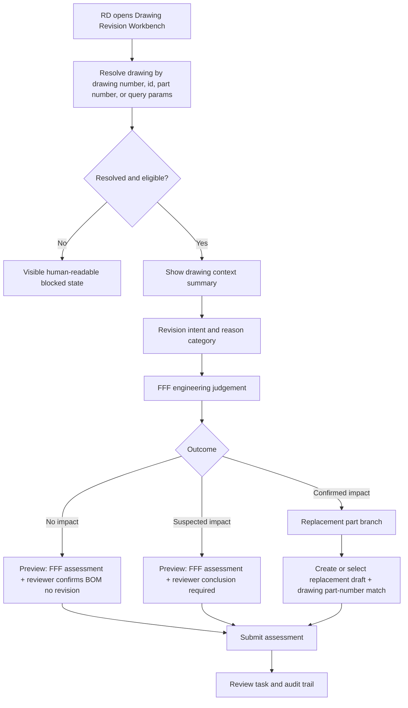

# SPEC-PDM-CHANGE-CONTROL-002: 圖面進版工作台 UX / API 實作契約

狀態：DEV-053 多料號批次進版修訂已完成本機實作與 targeted QC；production migration / release gated
日期：2026-06-30
適用系統：AI_PDM
節點類型：開發點，隸屬 `DEV-PDM-UI-POLISH-001`，並延伸 `DEV-PDM-CHANGE-CONTROL-001`
關聯文件：

- `.ai-doc/specs/SPEC-PDM-CHANGE-CONTROL-001-revision-part-bom-flow.md`
- `.ai-doc/specs/SPEC-PDM-CHANGE-CONTROL-001-implementation-contract.md`
- `.ai-doc/qa/qa-pdm-change-control-validation-plan-2026-06-24.md`
- `.ai-doc/qa/qa-pdm-drawing-revision-workbench-validation-plan-2026-06-30.md`
- `.ai-doc/dev_task.md`

## 1. Human Decision Brief

### 1.1 Confirmed Human Decisions

使用者已確認目前 `/numbering/revisions` 的圖面進版流程不可接受：

- 人類不可能知道 `drawing_numbers.id`、`part_numbers.id` 這類內部 ID。
- `drawing_number_not_found` 這類 raw error code 不應直接顯示給 RD。
- 圖面進版功能太像 API 參數表單，不像 RD 可完成的工作流程。
- 需要以「完整優化設計」重構成任務導向流程。

本文件採用的產品決策：

- 圖面進版頁定位為「圖面進版工作台」，不是 FFF API 表單。
- 使用者以正式圖號、料號、品名或既有清單選擇圖面；內部 ID 由系統解析和隱藏。
- 系統必須帶出現行圖號、本次一起進版的料號集合、現行版次、圖面狀態、BOM 關聯與可進版性。
- FFF 判定應以工程問題和後果預覽引導，而不是只呈現三排按鈕。
- 確認影響時，替代料號草稿應優先由系統建立或從既有草稿選取，不要求 RD 猜後端欄位。
- 送出前必須顯示即將建立的紀錄、審核任務與 BOM 影響摘要。

2026-08-06 使用者確認的多料號修訂：

- 一張 MA 圖合法服務多個主要料號時，預設全選；使用者可明確取消不屬於本次影響範圍的料號，但至少保留一個。
- 一次操作只建立一筆圖面送審與一組共用附件包；受影響料號以不可變批次範圍保存。
- 送審、審核與正式化採原子批次；所有所選料號全成或全退，不能只更新部分料號。
- UI 必須直接顯示料號數量與清單，主要 CTA 使用 `建立送審（1 張圖・N 個料號）`，不得讓使用者誤以為只會進版一個料號。
- FFF 判定共用於本次圖面變更，並複製到每一筆料號範圍作為追溯證據。
- 確認影響需要逐舊料號建立替代料號；現階段多料號 + confirmed impact 必須 fail closed，不可用一個新料號替代多個舊料號。

### 1.2 HCS 引導狀態

未再觸發 HCS 選項式問題。理由：

- 產品語意已由使用者明確指出：現有流程人類不可完成，需完整優化。
- 隱私、成本與外部服務未新增。
- Scope 限定為圖面進版工作台 UX/API 契約，不授權 production、migration 或遠端服務變更。
- 欄位命名、resolver API、錯誤 mapping、QA gate 屬 AI/RD 可自行補齊的工程契約。

### 1.3 AI Assumptions

- 第一版優先改造 `/numbering/revisions`，不重寫 `DEV-PDM-CHANGE-CONTROL-001` 的 domain rule。
- 不改變「原圖號進版不建立新圖號」原則。
- 不改變「任一 FFF 確認影響需要新料號」原則。
- 第一版允許手動輸入圖號並解析；完整彈出式搜尋/選擇器可作為同一 phase 內的增強，但不能阻塞基本流程。
- `drawing_part_number_read_required` 的 v1 解法可以是手動讀值/修正值，不要求 CAD/OCR 自動讀取。
- Resolver 以新增 `GET /api/numbering/drawings/resolve` 為 v1 預設；若 RD 發現既有 route 更適合，必須保持同等 response contract。
- Duplicate submit v1 採「UI pending lock + server equivalent-active-record guard」，不新增 schema，不要求 idempotency key。
- Confirmed-impact replacement draft v1 優先回傳既有等價 active draft；沒有等價 active draft 時才建立新草稿。

## 2. Problem Statement

目前 `/numbering/revisions` 的核心問題不是單一 bug，而是 UI 責任邊界錯誤。

現況：

- `圖號 ID` 欄位要求使用者填內部 UUID，但 RD 合理會輸入 `D-0014-MA1`。
- 後端 `requireDrawing()` 查詢 `drawing_numbers.id`，導致正式圖號存在仍回傳 `drawing_number_not_found`。
- `現行料號 ID` 同樣要求使用者知道內部 ID。
- 確認影響分支要求新料號、圖面讀值、修正讀值等欄位，但沒有先帶出上下文或送出前預覽。
- 錯誤顯示 raw domain code，使用者無法知道下一步。

目標：

讓 RD 可以從人類可理解的識別碼開始，完成圖面進版判定，並由系統補齊內部 ID、關聯上下文、驗證、防呆、審核任務與可追溯證據。

## 3. Scope

### 3.1 In Scope

- `/numbering/revisions` 改造成步驟式圖面進版工作台。
- 支援正式圖號/料號/品名搜尋或 resolve，隱藏內部 ID。
- 支援 query params 預載：
  - `drawingNumberId`
  - `drawingNumber`
  - optional `partNumber`
- 圖面上下文摘要：
  - 圖號
  - 現行料號
  - 品名
  - 現行版次或最近版次
  - 圖面狀態
  - 關聯 BOM / where-used 摘要
  - 是否可進版與阻擋原因
- FFF 判定改成工程問題導向。
- outcome 即時計算與後果預覽。
- 確認影響分支：
  - 顯示現行料號與原圖號。
  - 提供替代料號策略。
  - v1 預設支援「系統建立替代料號草稿」。
  - 支援手動圖面料號讀值或 RD 修正讀值。
- 送出前摘要與可理解錯誤 mapping。
- 新增或擴充 API contract，避免 UI 直接暴露內部 ID。
- 補齊 QA/QC 驗收點。

### 3.2 Out of Scope

- Production deploy。
- Supabase production cutover。
- 遠端 schema migration 或資料遷移。
- 自動修改 CAD 檔案內料號。
- 自動 OCR / SolidWorks Document Manager 整合。
- 自動修改已發行 BOM。
- 重寫 `DEV-PDM-CHANGE-CONTROL-001` 的 FFF、料號替代、BOM 規則。
- 建立新圖號流程；原圖號進版仍只進新版次。

## 4. End-State Architecture



### 4.1 Responsibility Boundary

| Layer | Responsibility |
|---|---|
| UI | Collect human decisions, show context, preview consequences, map errors to usable messages. |
| Resolver API | Convert human identifiers into scoped internal IDs and context. |
| Change-control API | Accept resolved IDs or human drawing number, enforce domain rules, create assessment/draft/review records. |
| Domain service | Keep FFF outcome, replacement draft, audit, BOM reconfirmation and company-scope rules authoritative. |
| QA/QC | Prove human workflow, server guards, error mapping and audit evidence. |

### 4.2 Invariant Rules

- UI must not ask users to manually type UUID-like internal IDs.
- Server must continue enforcing company scope.
- Server-side guards remain authoritative even if UI resolver fails.
- Raw domain codes may be returned for QC/API clients, but normal UI must map them to human-readable Traditional Chinese messages.
- Confirmed impact cannot submit with original part only.
- No-impact and suspected-impact paths must preserve reviewer confirmation requirements from `SPEC-PDM-CHANGE-CONTROL-001`.

## 5. UX Contract

### 5.1 Page Structure

The page uses a stepper:

1. 選圖面
2. 進版意圖
3. FFF 判定
4. 分支處理
5. 預覽送出
6. 審核追蹤

The right side or top sticky summary shows selected drawing context:

- 圖號
- 料號
- 品名
- 現行版次
- 狀態
- 關聯 BOM
- 最近進版紀錄

Mobile layout may collapse the summary into a top expandable region, but the current drawing identifier must remain visible near the primary action.

### 5.2 Step 1: 選圖面

Allowed inputs:

- Official drawing number, e.g. `D-0014-MA1`
- Official part number, e.g. `P-0014-001`
- Drawing display row selected from `/numbering/drawings`
- Query parameters from drawing detail CTA

Required behavior:

- If `drawingNumberId` query param exists, resolve by ID and verify company scope.
- If `drawingNumber` query param exists, resolve by official drawing number and verify it matches the ID when both are present.
- If user types a drawing number, resolve by `drawing_numbers.drawing_number`, not by `id`.
- If multiple candidates exist, show a concise selection list. Do not guess silently.
- If no candidate exists, show a visible empty state with next actions.

Forbidden labels:

- `圖號 ID`
- `現行料號 ID`

Required labels:

- `圖號`
- `現行料號`
- `新版次`

### 5.3 Step 2: 進版意圖

Fields:

- 新版次，default from revision policy suggestion.
- 變更原因，fixed options from `SPEC-PDM-CHANGE-CONTROL-001`.
- 備註，optional.

Revision suggestion:

- For current development phase, default may be `0.1` if no previous revision exists.
- If previous `0.x` exists, suggest next minor decimal.
- If current release phase rules differ, reuse existing `revision-policy` utilities.
- API must reject duplicate drawing number + revision.

### 5.4 Step 3: FFF 判定

Each FFF section shows an engineering question:

| Dimension | Prompt |
|---|---|
| Form | 外形、尺寸、標註、材料外觀是否影響既有識別？ |
| Fit | 裝配介面、公差、孔位、相容性是否改變？ |
| Function | 性能、強度、製程、使用條件是否改變？ |

Each section has:

- `無影響`
- `疑似影響`
- `確認影響`
- Optional short rationale field.

Outcome rule:

- Any `確認影響` -> `confirmed_impact`
- Else any `疑似影響` -> `suspected_impact`
- Else -> `no_impact`

Outcome preview must update immediately.

### 5.5 Step 4: 分支處理

#### No Impact

Show:

- `將建立 FFF 判定`
- `審核者需確認 BOM 不進版`
- Original part remains allowed.

No replacement fields appear.

#### Suspected Impact

Show:

- `將建立高風險 FFF 判定`
- `審核者必須確認沿用原料號或退回補新料號`
- Original part remains allowed until reviewer decision.

No replacement fields appear unless reviewer later returns for replacement.

#### Confirmed Impact

Show:

- Current part number and current drawing.
- Replacement strategy:
  - `系統建立替代料號草稿` (default)
  - `選擇既有替代料號草稿`
  - `例外：人工指定新料號`
- Item type:
  - 依圖製作件
  - 外購標準件
- Drawing part-number read value.
- RD corrected read value.

Default v1 behavior:

- `系統建立替代料號草稿` uses existing part-number draft reservation service.
- For a drawing-made item, drawing part-number match is required before confirmed-impact submit.
- Manual read/corrected value is acceptable evidence when CAD adapter is unavailable.

### 5.6 Step 5: 預覽送出

Submit preview must list exactly what will be created:

- FFF assessment.
- Revision value.
- Outcome.
- Replacement draft, if any.
- Review task / reviewer required action.
- BOM reconfirmation impact, if known.

Primary action label:

- No impact: `建立進版判定`
- Suspected impact: `建立高風險進版判定`
- Confirmed impact: `建立進版判定與替代料號草稿`

### 5.7 Step 6: 審核追蹤

After successful submission:

- Show assessment ID or human-readable trace code.
- Show next owner:
  - 發行審核者
  - RD 補圖 / 補料號
  - BOM Owner
- Provide link to pending review page when available.

## 6. API Contract

### 6.1 Drawing Resolver

Add a resolver endpoint. This is the preferred v1 contract:

```text
GET /api/numbering/drawings/resolve?query={text}
GET /api/numbering/drawings/resolve?drawingNumberId={id}
GET /api/numbering/drawings/resolve?drawingNumber={drawingNumber}
GET /api/numbering/drawings/resolve?partNumber={partNumber}
```

Required permission:

- Same company-scope and numbering read permission as drawing list.

Response:

```json
{
  "status": "resolved",
  "drawing": {
    "id": "internal-id",
    "drawingNumber": "D-0014-MA1",
    "purposeCode": "MA",
    "recordStatus": "Draft",
    "developmentPhase": "EVT",
    "isPrimaryManufacturing": true
  },
  "currentParts": [{
    "id": "internal-part-id",
    "partNumber": "P-0014-001",
    "partName": "part name",
    "recordStatus": "Draft"
  }],
  "currentPart": {
    "id": "internal-part-id",
    "partNumber": "P-0014-001",
    "partName": "part name",
    "recordStatus": "Draft",
    "compatibilityAnchor": true
  },
  "revision": {
    "latestRevision": "0.1",
    "suggestedRevision": "0.2"
  },
  "bomImpact": {
    "releasedBomCount": 0,
    "unreleasedBomDraftCount": 0
  },
  "eligibility": {
    "canCreateRevisionAssessment": true,
    "blockedReasons": []
  },
  "candidates": []
}
```

Multiple match response:

```json
{
  "status": "multiple_matches",
  "candidates": [
    {
      "drawingNumberId": "internal-id",
      "drawingNumber": "D-0014-MA1",
      "partNumber": "P-0014-001",
      "partName": "part name",
      "recordStatus": "Draft"
    }
  ]
}
```

Not found response:

```json
{
  "status": "not_found",
  "message": "找不到圖號 D-0014-MA1。請確認公司別、圖號是否正確，或從圖號清單選擇既有圖面。"
}
```

#### 6.1.1 Primary Part Resolution

Resolver must derive `currentParts` from `drawing_part_links.link_type = 'primary_manufacturing'`. `currentPart` remains only as a legacy compatibility anchor to the first selected part.

Rules:

| Condition | Resolver status | UI behavior | Submit behavior |
|---|---|---|---|
| Exactly one primary manufacturing part | `resolved` | Show the part as locked context | Server uses this part as `partNumberIds[0]` and legacy `currentPartNumberId` anchor |
| No linked primary manufacturing part | `resolved_with_missing_part` | Show drawing context and visible warning: `此圖面尚未連結現行料號，確認影響前需先選擇或建立料號關聯。` | No-impact and suspected-impact may submit if domain permits; confirmed-impact must stop until a current part is selected or linked |
| Multiple primary manufacturing parts | `resolved` | Show checkbox list, default all selected, and show `1 張圖・N 個料號` plus atomic-release copy | Server accepts one or more `partNumberIds`, revalidates every id against the primary candidates, and freezes the complete scope |
| Drawing purpose is not `MA` | `resolved_with_warning` | Show warning `此圖號不是主要製造圖，進版前請確認用途。` | Submit allowed only if existing domain rules allow; warning must be visible in preview |

Fallback selector:

- Candidate list must show `partNumber`, `partName`, `recordStatus`, and whether the part is same-root.
- User-selected scope is passed as `partNumberIds`; the scalar `currentPartNumberId` is accepted only for legacy clients. The server must re-check every selected id against company scope and the drawing/root relationship.
- If no safe relationship can be proven, submit returns a visible blocked reason.

This closes the RD ambiguity around MA drawings without primary part links.

### 6.2 FFF Assessment Submit API

Existing endpoint:

```text
POST /api/numbering/drawing-revisions/fff-assessments
```

Must support either:

- `drawingNumberId` from resolver, or
- `drawingNumber` official code, resolved server-side.

Recommended request:

```json
{
  "drawingNumber": "D-0014-MA1",
  "revision": "0.2",
  "reasonCategory": "材質 / 製程修正",
  "formState": "no_impact",
  "fitState": "confirmed_impact",
  "functionState": "no_impact",
  "partNumberIds": ["internal-part-id-1", "internal-part-id-2", "internal-part-id-3"],
  "replacementStrategy": "create_system_draft",
  "replacementItemType": "self_made",
  "detectedPartNumber": "P-0014-002",
  "correctedPartNumber": null,
  "note": "optional"
}
```

Server-side rules:

- If `drawingNumberId` and `drawingNumber` are both provided, they must resolve to the same drawing in the same company.
- If only `drawingNumber` is provided, resolve by official `drawing_number`.
- If confirmed impact and replacement strategy is `create_system_draft`, the server creates the replacement draft using numbering rules.
- If confirmed impact and manual reserved number is supplied, the server must validate it through existing draft reservation/duplicate prevention.
- `partNumberIds` defaults to all legitimate primary-manufacturing candidates when omitted by the current UI; an explicit non-empty subset is allowed.
- Every client-provided id must be company-scoped and related to the selected drawing. One invalid id rejects the whole request.
- Legacy `currentPartNumberId` remains accepted as a one-element scope during compatibility migration only.
- No-impact and suspected-impact can use the batch scope. Confirmed-impact with more than one selected part returns `DRAWING_SUBMISSION_MULTI_PART_REPLACEMENT_REQUIRED` until the request can supply one replacement result per old part.

#### 6.2.1 Replacement Draft Service Contract

Confirmed-impact branch uses one service boundary, even if implemented inside the existing domain service:

```ts
ensureDrawingRevisionReplacementDraft(input: {
  companyId: string;
  drawingNumberId: string;
  revision: string;
  sourcePartNumberId: string;
  strategy: "create_system_draft" | "select_existing_draft" | "manual_reserved_number";
  itemType: "self_made" | "purchased" | "standard";
  reservedPartNumber?: string;
  selectedDraftId?: string;
  actorUserId: string;
}): Promise<{
  draft: PartNumberDraftRecord;
  created: boolean;
  reusedExisting: boolean;
  warnings: string[];
}>
```

Equivalent active draft lookup:

- Match `company_id`, `draft_type = 'drawing_revision_generated'`, `source_drawing_number_id`, `source_revision`, `source_part_number_id`, and active `status IN ('draft', 'pending_review', 'needs_reconfirmation')`.
- If exactly one equivalent active draft exists, return it with `created = false` and `reusedExisting = true`.
- If multiple equivalent active drafts exist, return a blocked domain code `multiple_replacement_drafts_found`; UI must show a draft selector.
- If none exists and strategy is `create_system_draft`, reserve a new replacement draft through the existing numbering/draft reservation path.

Response requirements:

- Return the draft ID, reserved part number, item type, source part, source drawing, source revision, status, and warnings.
- Warnings must include same-source unfinished replacement drafts when present.
- Server must not create a new drawing number in this flow.

Failure handling:

- Duplicate reserved number -> `replacement_part_number_duplicate`.
- Selected draft belongs to another company -> `replacement_draft_not_found`.
- Selected draft is not tied to the same source part/drawing/revision -> `replacement_draft_context_mismatch`.
- Missing source part for confirmed impact -> `current_part_required_for_confirmed_impact`.

This service contract is required before RD starts Phase C.

### 6.3 Error Mapping

API may return domain code, but UI must map:

| Domain code | UI message |
|---|---|
| `drawing_number_not_found` | 找不到這張圖面。請用正式圖號搜尋，或從圖號清單選擇既有圖面。 |
| `replacement_part_number_required` | 確認影響需要替代料號。建議選擇系統建立替代料號草稿。 |
| `drawing_part_number_read_required` | 確認影響時，請填入新版圖面上的料號讀值，或由 RD 填入修正讀值。 |
| `drawing_part_number_mismatch` | 新料號與圖面讀取料號不一致，請確認圖面或修正讀值。 |
| `review_action_mismatch` | 目前 FFF 結論與審核動作不相容，請回到待審項目選擇正確動作。 |
| `replacement_part_already_released` | 這個替代料號已正式發行，請重新選擇草稿或重新整理畫面。 |

Unknown errors:

- Show safe fallback: `圖面進版送出失敗。請重新整理後再試，若仍失敗請提供圖號與錯誤時間給管理者。`
- Developer console may keep raw details for debugging.

## 7. Data / Migration Contract

No required schema migration for v1 if existing tables are available:

- `drawing_numbers`
- `drawing_part_links`
- `part_numbers`
- `part_number_drafts`
- `drawing_revision_fff_assessments`
- `review_confirmation_events`
- `bom_reconfirmation_flags`

Allowed additive implementation:

- Add resolver repository/service functions.
- Add UI-only rationale fields only if persisted through existing `note` or metadata fields.

Migration is required only if RD decides to persist separate FFF rationale fields. If migration is needed, stop and create a separate migration plan; do not silently change schema under this UX task.

## 8. Permission Contract

- Resolver read requires numbering read access within selected company.
- Submit requires existing `numbering.draft.update` or the current permission used by FFF assessment route.
- Reviewer actions remain governed by existing review permission.
- UI must not expose drawings from other companies even if user guesses a valid drawing number.
- Query params are hints, not authorization.

## 9. Transaction / Idempotency / Duplicate Prevention

- Resolver is read-only.
- Submit API must keep existing domain-service transaction behavior.
- V1 fixed duplicate strategy: UI pending lock + server equivalent-active-record guard. No schema migration and no idempotency key are required for v1.
- Primary button must be disabled while request is pending.
- UI must ignore repeated click/Enter submissions while `busy = true`.
- Server must check for equivalent active assessment before inserting:
  - same `company_id`
  - same `drawing_number_id`
  - same `revision`
  - same `assessed_by`
  - same `replacement_part_number_draft_id` when present
  - no existing `review_confirmation_events` for that assessment ID
- If equivalent active assessment exists, return that assessment with `created = false` rather than creating another record.
- If an existing assessment already has reviewer confirmation, a new assessment is allowed only when RD is resubmitting after reviewer return or creating a new revision intent.
- Confirmed-impact replacement draft creation must use `ensureDrawingRevisionReplacementDraft()` first so duplicate submits reuse the same equivalent active draft.
- QC must include a double-click/API-repeat case proving no duplicate active replacement drafts or assessments are created.

## 10. Failure Recovery

| Failure | Required behavior |
|---|---|
| Resolver not found | Stay on Step 1, show human-readable not found message. |
| Resolver multiple matches | Show candidate list, require explicit selection. |
| Drawing deleted or company scope changes after resolve | Submit rejects; UI asks user to reload and select again. |
| Duplicate revision | Show duplicate revision message and suggest next available revision. |
| Confirmed-impact missing replacement data | Keep user in branch step with visible missing requirement. |
| Draft creation succeeds but assessment fails | Transaction should rollback; if current implementation cannot rollback, show recovery link to existing draft and create QC evidence. |
| Network failure | Preserve local form state and allow retry. |

## 11. Phase Roadmap

### Phase A: Resolver and Context

Purpose:

- Remove human dependency on internal IDs.

Deliverables:

- Resolver API/service.
- Query-param prefill.
- Context summary.
- Human-readable not-found/multiple-match states.

Acceptance:

- User can input `D-0014-MA1` and see the correct drawing/part context.
- User never needs to type `drawing_numbers.id`.

### Phase B: Workbench Stepper and Outcome Preview

Purpose:

- Convert the page from a flat API form into a task workflow.

Deliverables:

- Stepper UI.
- FFF engineering prompts.
- Outcome preview.
- Submit preview.

Acceptance:

- Each outcome branch clearly states next reviewer/system consequence before submit.

### Phase C: Confirmed Impact Branch

Purpose:

- Make confirmed-impact path usable without backend knowledge.

Deliverables:

- Replacement strategy control.
- System-created replacement draft as default.
- `ensureDrawingRevisionReplacementDraft()` service behavior.
- Primary part fallback selector and server-side relationship re-check.
- Manual read/corrected drawing part-number evidence.
- Blocked state for mismatch.

Acceptance:

- Confirmed impact creates a valid replacement draft and assessment when required values match.
- Mismatch is blocked with useful UI copy and server guard.
- Duplicate submit reuses existing active draft/assessment instead of creating duplicates.
- MA drawing without a safe current part relationship is blocked only for confirmed-impact submit, with a visible reason.

### Phase D: QA/QC and Regression

Purpose:

- Prove the workbench did not weaken change-control domain rules.

Deliverables:

- Focused QC script or expanded `qc:pdm-change-control`.
- Playwright screenshots for desktop/mobile.
- API negative tests for raw endpoint bypass.

Acceptance:

- Existing change-control QC still passes.
- New workbench UX cases pass.

Authorization:

- This document authorizes RD planning only. Implementation requires explicit user/PM scope freeze because `DEV-PDM-UI-POLISH-001` remains intake in `.ai-doc/dev_task.md`.

## 12. RD Acceptance Criteria

RD implementation is complete when:

- `/numbering/revisions` can open without query params and search/resolve a drawing.
- `/numbering/revisions?drawingNumberId={id}&drawingNumber={code}` preloads the drawing and validates consistency.
- UI no longer shows `圖號 ID` or `現行料號 ID` as user-editable fields.
- The page shows drawing context before FFF submission.
- FFF outcome preview updates before submit.
- Confirmed impact branch does not ask the user to guess backend IDs.
- Submit preview accurately states created assessment/draft/review consequences.
- `drawing_number_not_found` and other domain codes are mapped to Traditional Chinese user-facing messages.
- Direct API calls that bypass UI still enforce existing domain guards.
- No production, Supabase production, or remote migration work is performed.

## 13. QA / QC Gate

### 13.1 QA Cases To Add Or Map

Add focused cases to the existing change-control QA plan or a small companion QA section:

| ID | Case | Evidence |
|---|---|---|
| `QA-REV-WB-001` | Official drawing number resolves to context without internal ID entry | UI screenshot + API response |
| `QA-REV-WB-002` | Query params prefill drawing context and reject mismatched id/code | UI + API negative response |
| `QA-REV-WB-003` | No-impact branch preview lists reviewer BOM no-revision confirmation | Screenshot |
| `QA-REV-WB-004` | Suspected-impact branch preview lists reviewer conclusion requirement | Screenshot |
| `QA-REV-WB-005` | Confirmed-impact branch creates/uses replacement draft without manual internal IDs | API/DB/UI evidence |
| `QA-REV-WB-006` | Raw domain errors are translated in UI | Negative UI evidence |
| `QA-REV-WB-007` | Double-click submit does not create duplicate active drafts/assessments | API/DB evidence |
| `QA-REV-WB-008` | Mobile and desktop layouts show current drawing context and primary action without overlap | Screenshots |
| `QA-REV-WB-009` | MA drawing without primary part blocks confirmed-impact submit with visible reason | UI + API negative evidence |
| `QA-REV-WB-010` | Multiple primary parts require explicit current-part selection before confirmed-impact submit | UI + API evidence |

### 13.2 Required QC Commands

At minimum:

```powershell
npx.cmd tsc --noEmit --pretty false
npm.cmd run qc:pdm-change-control
npm.cmd run qc:pdm-numbering-api-regression
```

If RD adds focused scripts:

```powershell
npm.cmd run qc:pdm-drawing-revision-workbench
```

UI evidence:

- Desktop screenshot for `/numbering/revisions` with resolved drawing.
- Mobile screenshot for `/numbering/revisions` with resolved drawing.
- Negative screenshot for official drawing not found.
- Confirmed-impact branch screenshot.

## 14. Stop Conditions

Stop and return to PM/user if:

- RD needs schema migration to persist new rationale fields.
- RD needs production or Supabase production changes.
- Existing domain service cannot create replacement draft atomically enough for confirmed impact.
- Resolver cannot identify a primary manufacturing part for MA drawing and fallback selector cannot prove a safe company/root relationship.
- The implementation would allow confirmed impact to bypass replacement part requirements.
- Existing `DEV-PDM-CHANGE-CONTROL-001` QC fails outside this UX scope.
- UI implementation requires adding CAD/OCR/SolidWorks reader dependency.

## 15. ADR Decision

No new ADR is required for this spec.

Reason:

- It does not change the authoritative business rule, lifecycle state machine, numbering identity, or replacement policy from `SPEC-PDM-CHANGE-CONTROL-001`.
- It changes the UX/API adapter boundary so human users no longer interact with internal IDs.
- If RD later changes replacement-number generation policy, drawing identity policy, or migration behavior, create an ADR before implementation.

## 16. Open Questions

Open questions are not blockers for Phase A-C:

- Whether FFF per-dimension rationale should be stored separately or folded into `note`.
- Whether Phase D should keep the focused QC cases inside `qc:pdm-change-control` or split them into `qc:pdm-drawing-revision-workbench`.

Blockers:

- None for local RD planning.

## 17. Evidence Required Before Marking Product Done

- Branch/commit or staged boundary for RD implementation.
- QC command output.
- Screenshots listed in section 13.
- API evidence that official drawing number resolves correctly.
- API evidence that raw endpoint cannot bypass confirmed-impact rules.
- `git diff --check` for changed docs and source files.
- Updated `.ai-doc/dev_task.md` with implementation state and evidence once RD is authorized and completed.
