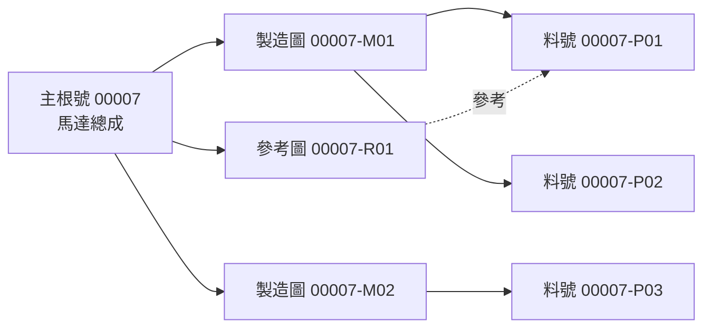

# SPEC-PDM-DRAWING-PART-RELATION-VIEW-001 - 圖料模組主根號-圖號-料號關係視圖

> 2026-08-06 Amendment：`SPEC-PDM-STATUS-UX-004` 取代本文件 root/drawing/part row 的多狀態 badge
> 呈現。counts 與用途可保留，但每列只顯示一個 human status；「草稿確認」退役。圖／料節點開啟
> owner module 共用 overlay drawer，不建立圖料模組專用的第二套明細內容。

Status: Implemented / local verification passed for Phase 1-3
Date: 2026-07-07
Owner: Dev PM
Related DEV: `DEV-PDM-DRAWING-PART-RELATION-VIEW-001`
Extends: `.ai-doc/specs/SPEC-PDM-DRAWING-PART-WORKBENCH-001-data-flow-security.md`
Extends: `.ai-doc/specs/SPEC-PDM-MASTER-WORKBENCH-001-drawing-part-master-layout.md`
Related QA: `.ai-doc/qa/qa-pdm-drawing-part-relation-view-validation-plan-2026-07-07.md`

## Human Decision Brief

Confirmed decisions from APP feedback and follow-up discussion:

- Current 圖料模組 flat list is not useful because it repeats the same root across root/drawing/part rows and does not show relationship meaning.
- The UI must answer: `這個主根號底下有哪些圖、哪些料、哪些圖可製造、每張圖對應哪些料號、哪裡缺關聯。`
- A root can have many drawings.
- One drawing can relate to many part numbers.
- One part can appear under more than one drawing when the relationship is legitimate.
- Default view should be a root-grouped relationship view, not a database-row list.
- A matrix view is useful for review and gap checking when many-to-many data is dense.
- The relationship view is presentation and readiness support; it must not change the existing owner-domain rule.

Rejected options:

- Keep a flat list where root, drawing and part are separate equal-weight rows.
- Show only one primary drawing and one primary part when multiple legitimate relationships exist.
- Hide many-to-many relationships in the drawer only.
- Add more number-code semantics to solve a UI relationship problem.
- Make 圖料模組 directly own drawing or part master data.

AI assumptions:

- First implementation target is the existing 圖料模組 route, currently `/numbering/search` or its equivalent root/drawing/part aggregation page.
- Existing entities remain authoritative: `part_roots`, `drawing_numbers`, `part_numbers`, `drawing_part_links`, attachment/readiness services and status display helpers.
- Implemented as a backward-compatible `/api/numbering/relations` aggregation and controlled maintenance endpoint; no DB schema change was required.
- Existing `/parts` and `/numbering/drawings` owner pages remain available for owner-specific details and edits.

Re-entry triggers:

- User wants matrix view as the default instead of the root-grouped tree.
- User wants relation editing, primary drawing/part reassignment or bulk relationship maintenance in the same phase.
- RD finds the current link model cannot represent legitimate many-to-many relationships without schema change.
- Implementation requires production deploy, Supabase live migration, direct data repair/deletion or provider pointer change.

## Problem

The current list visually presents the same root as multiple rows:

```text
00007 root row
00007 drawing row
00007 part row
```

This makes the user compare rows mentally to infer relationships. It fails the main task because the table does not show whether:

- `00007-M01` is the manufacturing basis for `00007-P01`.
- `00007-M01` applies to more than one part.
- A part is missing any manufacturing drawing.
- A reference drawing is being treated as manufacturing evidence.
- The root is complete enough for downstream DVT, release, handoff or manufacturing use.

The issue is not just column naming. It is a relationship-visualization problem.

## UX Intent

- 使用者：RD、R&D Manager、QA/QC、製造/採購前置查閱者。
- 使用情境：快速查圖料關係、確認缺漏、判斷是否能送審或製造、追溯一張圖影響哪些料。
- 使用的 HCS 思考習慣：`#目的`、`#受眾`、`#差距分析`、`#心理成因`、`#捷思法`、`#內容組織`。
- 使用者心智模型：先找主根號或品名，再看底下圖號與料號如何連在一起。
- 主要任務：看懂 `主根號 -> 圖號 -> 料號` 的關係與缺口。
- 成功狀態：5 秒內能知道此 root 有幾張製造圖、幾張參考圖、幾個料號、哪些圖料已關聯、下一步要補什麼。
- 使用者此刻真正問題：`這一組圖料到底完整嗎？哪張圖對應哪個料？`
- 自然下一步：展開 root、點圖號或料號開 drawer、修正缺口或前往送審/owner page。
- 最可能誤解點：把多列 root 當成重複資料；把參考圖誤以為可製造；看不出一圖多料是正常關係還是資料異常。
- 不能發生的誤操作：因 UI 沒顯示關係而拿錯圖製造、送審錯料、把參考圖當製造依據。

## End-State Architecture

The 圖料模組 relationship view has three layers:

```text
Root group
  Drawing node
    Linked part chips / rows
  Orphan part node
  Orphan drawing node
  Readiness / next-step summary
```

Mermaid relationship model:



The view must separate:

- `Manufacturing basis`: `M` / historical `MA` drawing linked to part as manufacturing evidence.
- `Reference relationship`: `R` / historical `OT` drawing linked as reference-only.
- `Unlinked`: part or drawing under the root with no relationship.
- `Ambiguous`: multiple primary drawings or parts when a downstream workflow requires exactly one.
- `Blocked`: relationship state prevents submit/release/manufacturing use.

## Target UI

### Default View: Root-Grouped Relationship Tree

Each root appears once.

Example:

```text
00007 馬達總成
製造圖 2｜參考圖 1｜料號 4｜關聯完整｜正式階段

├─ 00007-M01 製造圖｜已發布｜製造基準關聯完整
│  ├─ 00007-P01 馬達座｜主料
│  └─ 00007-P02 軸承蓋
├─ 00007-M02 製造圖｜DVT
│  └─ 00007-P03 固定板｜缺附件
└─ 00007-R01 參考圖｜不可作為製造基準
   └─ 00007-P01 馬達座｜參考關聯
```

Root summary row:

| Area | Required content |
|---|---|
| Root identity | `rootCode`, `coreName`, phase/status |
| Counts | manufacturing drawings, reference drawings, parts, blockers |
| Relationship health | `關聯完整`, `缺製造圖`, `缺料號`, `有歧義`, `不可製造` |
| Next step | `製造基準關聯完整`, `補主料`, `補製造圖關聯`, `檢查多主圖`, `完成 DVT` |
| Primary action | open detail drawer, expand/collapse, go to readiness |

Drawing node:

| Area | Required content |
|---|---|
| Drawing identity | `drawingNumber`, purpose `製造圖/參考圖`, revision/status if available |
| Linked part count | count and visible part chips/rows |
| Manufacturing-basis / release eligibility | `製造基準關聯完整`, `參考不可作為製造基準`, `未發布`, `缺附件` |
| Next step | one short action or disabled reason |

Part node/chip:

| Area | Required content |
|---|---|
| Part identity | `partNumber`, `partName` |
| Role | `主料`, `關聯料`, `參考關聯`, `未連製造圖` |
| State | compact status/phase |
| Detail action | open part drawer or link to `/parts?detail={partNumber}` |

### Secondary View: Relationship Matrix

The matrix is a switchable review view for dense many-to-many data.

Rows are part numbers. Columns are drawings.

| 料號 / 圖號 | `00007-M01` 製造圖 | `00007-M02` 製造圖 | `00007-R01` 參考圖 |
|---|---|---|---|
| `00007-P01` 馬達座 | 製造依據 | - | 參考 |
| `00007-P02` 軸承蓋 | 製造依據 | - | - |
| `00007-P03` 固定板 | - | 製造依據 | - |

Matrix rules:

- Matrix is scoped to one root at a time.
- Column headers distinguish `M 製造圖` and `R 參考圖`.
- Cell labels use stable terms: `製造依據`, `參考`, `缺關聯`, `不適用`.
- Reference drawing cells must never show manufacturing wording.
- Large roots may use horizontal scroll inside matrix only, not page-level overflow; first part identity column stays sticky on desktop.

### Drawer / Detail Behavior

- Clicking a root opens root relationship drawer.
- Clicking a drawing opens drawing detail drawer with linked parts and attachments.
- Clicking a part opens part detail drawer or routes to the existing part owner module.
- Drawer must preserve list context and allow switching selected root/drawing/part without closing.
- Drawer content is detail/audit layer; the default list must still show the primary relationship.

## Data/API Contract

Implemented option:

1. `GET /api/numbering/relations?query=&entityType=&recordStatus=&developmentPhase=` returns grouped root/drawing/part relationship data.
2. `POST /api/numbering/relations` handles controlled relationship maintenance operations: `link`, `set_primary`, `set_reference`, `remove`.
3. Reads are gated by `numbering.search`; writes are gated by `numbering.link_variant` and repository-level company/root/status checks.

Recommended response:

```ts
type DrawingPartRelationViewResponse = {
  roots: DrawingPartRelationRoot[];
  summary: {
    rootCount: number;
    manufacturingDrawingCount: number;
    referenceDrawingCount: number;
    partCount: number;
    blockerCount: number;
  };
};

type DrawingPartRelationRoot = {
  rootId: string;
  rootCode: string;
  coreName: string;
  recordStatus: string;
  developmentPhase: string;
  relationshipHealth: "complete" | "missing_manufacturing_drawing" | "missing_part" | "ambiguous" | "blocked" | "draft";
  nextStep: { label: string; target?: string; severity: "ok" | "info" | "warning" | "blocked" };
  drawings: DrawingPartRelationDrawing[];
  parts: DrawingPartRelationPart[];
  matrix: DrawingPartRelationCell[];
  blockers: Array<{ code: string; message: string; target: "root" | "drawing" | "part" | "relationship" }>;
};

type DrawingPartRelationDrawing = {
  id: string;
  drawingNumber: string;
  purposeCode: string;
  purposeLabel: "製造圖" | "參考圖";
  isManufacturing: boolean;
  isReferenceOnly: boolean;
  recordStatus: string;
  developmentPhase: string;
  linkedPartNumbers: string[];
  nextStep: string;
};

type DrawingPartRelationPart = {
  id: string;
  partNumber: string;
  partName: string;
  itemKind: string;
  recordStatus: string;
  developmentPhase: string;
  linkedDrawingNumbers: string[];
  hasManufacturingDrawing: boolean;
};

type DrawingPartRelationCell = {
  drawingNumber: string;
  partNumber: string;
  relationType: "manufacturing_basis" | "reference" | "none" | "blocked";
  isPrimary?: boolean;
};
```

Rules:

- Relationship semantics must come from server/domain helpers, not client string guessing.
- `M/MA` count as manufacturing drawings; `R/OT` count as reference-only.
- Reference-only drawings must not be counted as manufacturing coverage.
- Existing owner-domain permissions remain enforced.
- `GET` is read-only and verified with no write side effect.
- `POST` is not a generic write path; it is constrained to drawing-part relationship maintenance with audit, locked-status protection and company/root matching.

## Implementation Contract

### Frontend

- Replace the default flat result list in 圖料模組 with root-grouped relationship groups.
- Keep compact search/filter toolbar and summary chips.
- Add a segmented control or tabs: `關係樹` default, `矩陣` secondary.
- Root groups must be keyboard navigable.
- Default expanded behavior:
  - Search result count <= 20 roots: expand the first matching root.
  - Direct `rootCode`, `drawingNumber` or `partNumber` query: expand matching root and highlight matching node.
  - Large result set: collapsed groups with counts and blockers visible.
- Preserve existing status badge vocabulary through `formatStatusForUser` and `formatDevelopmentPhaseForUser`.
- Do not create nested cards. Use full-width rows, tree indentation, compact chips and drawer details.
- Mobile uses stacked root cards with expandable drawing sections; no page-level horizontal overflow.

### Backend / Repository

- Add or extend a read-only aggregation query that returns roots with drawings, parts and relationship cells.
- The query must be company-scoped and permission-gated with existing numbering search permission.
- It must preserve v2 compact identity and historical v1 semantic compatibility.
- It must include all linked drawings and parts, not only the primary drawing/part.
- It must classify orphan drawings and orphan parts separately.
- It must compute relationship health server-side.

### State And Failure Handling

Empty state:

- If no data because filters are narrow: `查不到符合條件的圖料關係，請清除篩選或改用主根號、圖號、料號搜尋。`
- If no accessible data: `目前沒有可查看的圖料資料，請確認權限或先建立主根號。`

Blocked relationship state examples:

| Code | First visible sentence |
|---|---|
| `missing_manufacturing_drawing` | `這個主根號還沒有製造圖類別，不能建立製造基準關聯。` |
| `part_without_manufacturing_drawing` | `這個料號尚未連到製造圖，請先建立圖料關係。` |
| `reference_only` | `這張圖是參考圖，不可作為製造依據。` |
| `ambiguous_primary` | `這個主根號有多個主圖或主料，系統不能判定送審主體。` |

## Phase Roadmap

| Phase | Status | Purpose | Authorization |
|---|---|---|---|
| Phase 0 - Development documents | Complete | Capture root-drawing-part relation view product contract, QA and dev_task entry. | Authorized by user request to write development documents. |
| Phase 1 - Root-grouped relationship tree | Implemented / local verification passed | Replaced flat list with relationship tree, server relation aggregation and drawer integration. | Authorized by user follow-up to execute Phase 1-3. |
| Phase 2 - Matrix review view | Implemented / local verification passed | Added one-root matrix view for dense many-to-many review and gap detection. | Authorized by user follow-up to execute Phase 1-3. |
| Phase 3 - Relationship maintenance actions | Implemented / local verification passed | Added controlled relationship edit/recover actions through repository API with audit and locked-status protection. | Authorized by user follow-up to execute Phase 1-3. |

## RD Handoff Contract

### Phase 1 - Root-Grouped Relationship Tree

Scope:

- Add/extend read-only relation aggregation API.
- Render one root group per root.
- Render all drawings under the root and all linked parts under each drawing.
- Show orphan parts/drawings with blockers and next step.
- Add root/drawing/part drawer selection behavior.
- Keep existing filters and status vocabulary.
- Add focused QC for relation view.

Out of scope:

- Generic relationship write/edit actions outside the controlled maintenance contract.
- DB schema migration.
- Production deploy or Supabase live cutover.
- Changing numbering rules.
- Changing owner-domain validation or submission snapshot rules.

Acceptance:

- A root with two drawings and four parts appears once.
- A drawing linked to three parts displays those three parts under the drawing.
- A part linked to two drawings is visible in both relevant drawing sections and matrix cells.
- Reference drawing relationships are labeled `參考`, never `製造依據`.
- Users can identify missing manufacturing coverage without opening drawer.
- Existing search filters still work.
- Desktop and mobile have no page-level horizontal overflow.

Evidence required:

- `npx.cmd tsc --noEmit --pretty false`
- `npm.cmd run lint -- --quiet`
- `npm.cmd run build`
- `npm.cmd run qc:pdm-numbering-search-ui`
- `npm.cmd run qc:pdm-master-workbench-layout`
- New or updated `npm.cmd run qc:pdm-drawing-part-relation-view`
- Browser screenshots for desktop `1440x900`, laptop `1024x768` and mobile `390x844`.

### Phase 2 - Matrix Review View

Scope:

- Add `矩陣` view for selected root.
- Render drawings as columns and parts as rows.
- Label cells by relationship type.
- Keep sticky part identity column on desktop.
- Provide empty/dense states.

Out of scope:

- Bulk edit from matrix.
- Export to Excel/PDF.
- BOM graph or CAD reference graph.

Acceptance:

- One root with many drawings and many parts is reviewable without mental row matching.
- Matrix cells correctly distinguish manufacturing basis and reference relationships.
- Missing relationship cells are visible.
- Horizontal scroll is limited to matrix container.

Evidence required:

- Focused matrix fixture QC.
- Desktop/laptop/mobile screenshots.
- Visible error sweep.

### Phase 3 - Relationship Maintenance Actions

Scope:

- Added controlled owner-domain actions in the root detail drawer after user authorized Phase 1-3 execution.
- Implemented actions: create/update link, set manufacturing basis, mark reference, remove relationship.
- Every write routes through the repository maintenance contract and writes `numbering.drawing_part.relation_maintain` audit with before/after detail.

Out of scope:

- Generic relationship write API.
- Released/obsolete relationship patching outside controlled recovery.
- Mass import repair.

Acceptance:

- Relationship edits show preview, owner domain, before/after and audit result.
- Released/obsolete records remain protected.
- Ambiguous states can be recovered through explicit authorized actions.

Evidence required:

- Separate QA plan update before implementation.
- Owner API, audit and permission QC.

## QA/QC Gate Summary

Primary QA plan:

- `.ai-doc/qa/qa-pdm-drawing-part-relation-view-validation-plan-2026-07-07.md`

Minimum UX gates:

- 5-second understanding: user can explain root/drawing/part relationship from first screen.
- Now What states: empty, blocked, ambiguous and reference-only states provide next step.
- Visible error sweep: no raw API/DB/route errors.
- RWD: no page-level horizontal overflow at `1440x900`, `1024x768`, `390x844`.
- Counter sanity: root/drawing/part counts match rendered groups.

## Deferred Scope Audit

| Deferred scope | Classification | Handling |
|---|---|---|
| Product implementation | Completed locally | Phase 1-3 are implemented and locally verified. |
| Matrix view | Completed locally | Matrix review mode is implemented and verified at desktop/tablet/mobile widths. |
| Relationship maintenance/editing | Completed locally within controlled contract | Generic write API remains out of scope; controlled maintenance actions are implemented with audit and status locks. |
| DB schema migration | Deferred / not required | No schema migration was needed. |
| Production deploy/Supabase live cutover | Blocked Human Re-entry / Release Authorization Required | No release artifacts are created in this document. |
| Export/reporting from matrix | No Tracking | Not part of the current user problem; can be a new DEV if explicitly requested. |
| BOM/CAD graph visualization | New DEV later | Different product problem from master drawing-part relation visibility. |

## All-Phase Coverage Matrix

| Phase / DEV | Authorization | Document status | Scope | Out of scope | Entry condition | Acceptance | Evidence |
|---|---|---|---|---|---|---|---|
| Phase 0 / `DEV-PDM-DRAWING-PART-RELATION-VIEW-001` docs | Authorized | Complete | SPEC, QA, dev_task and documentation_map | Product implementation at that time | User requested development documents | Files created and indexed | Git diff |
| Phase 1 / relationship tree | Authorized | Implemented / verified | Relation API, root-grouped tree UI, drawer integration, focused QC | schema migration, release | User authorized Phase 1-3 execution | root once, all drawing-part relations visible, no overflow | tsc, lint, build, search QC, relation QC, screenshots |
| Phase 2 / matrix view | Authorized | Implemented / verified | one-root matrix review and gap detection | bulk edit, export, BOM/CAD graph | User authorized Phase 1-3 execution | dense many-to-many reviewable | relation QC, screenshots |
| Phase 3 / relationship maintenance | Authorized | Implemented / verified | controlled relationship edit/recovery actions | generic write API, released patching, data repair | User authorized Phase 1-3 execution | owner-domain write/audit gates pass | relation maintenance API/audit QC |

## Local Implementation Evidence

Executed on 2026-07-07 against disposable SQLite runtime `output/qc-runtime/pdm-relation-20260707-001`:

- `npx.cmd tsc --noEmit --pretty false` - passed.
- `npm.cmd run lint -- --quiet` - passed.
- `npm.cmd run build` - passed.
- `npm.cmd run qc:pdm-numbering-search-ui` - 30/30 passed.
- `npm.cmd run qc:pdm-master-workbench-layout` - 205/205 passed.
- `npm.cmd run qc:pdm-drawing-part-relation-view` - 56/56 passed.
- Screenshot evidence: `output/playwright/pdm-drawing-part-relation-view/tree-desktop.png`, `tree-laptop.png`, `tree-mobile.png`, `matrix-desktop.png`.

## Spec Governance

Cross-spec handling:

- Extends `.ai-doc/specs/SPEC-PDM-DRAWING-PART-WORKBENCH-001-data-flow-security.md` without changing ownership, submission snapshot or retired upload rules.
- Extends `.ai-doc/specs/SPEC-PDM-MASTER-WORKBENCH-001-drawing-part-master-layout.md`; this spec supersedes the flat-list interpretation for 圖料模組 only.
- Refines `.ai-doc/specs/SPEC-PDM-IDENTITY-LIST-001-master-list-primary-columns.md`; identity-first columns remain useful for owner pages, but 圖料模組 default view must prioritize relationships over equal-weight rows.
- Compatible with `.ai-doc/specs/SPEC-PDM-NUMBERING-002-compact-root-drawing-part-numbering.md`; v2 compact identities remain unchanged.

ADR decision:

- New ADR is not required for this local slice because ownership, lifecycle, numbering and schema contracts remain unchanged; Phase 3 writes are constrained relationship-maintenance actions routed through repository audit and permission gates.
- Existing ADR `.ai-doc/decisions/ADR-PDM-DRAWING-PART-WORKBENCH-001-data-ownership-and-submission-snapshot.md` remains authoritative for data ownership and write behavior.

RD readiness review:

- Phase 1-3 local implementation is complete and verified.
- Engineering contract is now implemented through `/api/numbering/relations`, root-grouped UI, matrix mode and controlled relationship maintenance.
- Remaining blocked scope: production deploy, Supabase live cutover, direct data repair/deletion, generic bulk relationship maintenance and release artifacts.
