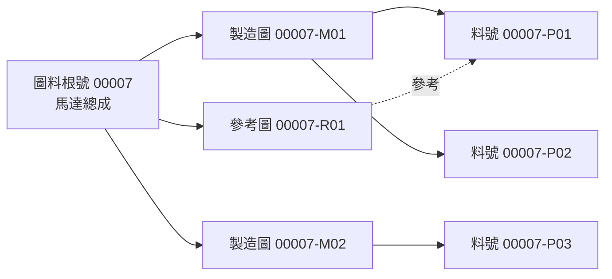

# SPEC-PDM-DRAWING-PART-RELATION-VIEW-001 - 圖料工作台圖料根號-圖號-料號關係視圖

> 2026-08-06 Amendment：`SPEC-PDM-STATUS-UX-004` 取代本文件 root/drawing/part row 的多狀態 badge
> 呈現。counts 與用途可保留，但每列只顯示一個 human status；「草稿確認」退役。圖／料節點開啟
> owner module 共用 overlay drawer，不建立圖料工作台專用的第二套明細內容。

Status: `Phase 1-3 Implemented / DEV-062 Amendment Local QA-QC Passed / Release Gated`
Date: 2026-07-07
Owner: Dev PM
Related DEV: `DEV-PDM-DRAWING-PART-RELATION-VIEW-001`; `DEV-PDM-UNIFIED-ENTITY-DETAIL-REVIEW-001` / `DEV-067`
Related ADR: `.ai-doc/decisions/ADR-PDM-UNIFIED-ENTITY-DETAIL-PROJECTIONS-001-composer-and-policy.md`
Extends: `.ai-doc/specs/SPEC-PDM-DRAWING-PART-WORKBENCH-001-data-flow-security.md`
Extends: `.ai-doc/specs/SPEC-PDM-MASTER-WORKBENCH-001-drawing-part-master-layout.md`
Related QA: `.ai-doc/qa/qa-pdm-drawing-part-relation-view-validation-plan-2026-07-07.md`; `.ai-doc/qa/qa-dev-067-unified-pdm-entity-detail-validation-plan-2026-08-12.md`

## 0A. DEV-067 Amendment：圖料完整投影與共用實體明細 Composer（2026-08-12）

Status: `Local RD Implemented / Local QA-QC Passed / Release gated`.

`/numbering/search`保留root-centric tree、matrix、relation health與整體關係查核任務，但其右側明細不再由root/candidate/child target各自組裝不同top-level body。所有covered target mount同一`UnifiedPdmEntityDetailDrawer`，圖料surface由server policy提供`DrawingProjection=full`、`PartProjection=full`、`RelationProjection=full`，並維持固定相對順序。

- `RelationProjection`只擁有root/drawing/part topology、matrix、health、blockers與traceability；Drawing檔案/版次/preview由`DrawingProjection`呈現，Part屬性/文件由`PartProjection`呈現，relation page不得複製其欄位或mutation form。
- Formal root、source-root candidate overlay、source-less candidate與formal child都使用相同composer。Context可改default focus/expanded projection，但不可換另一個drawer body。
- 三個full projections可以收合並提供只列present sections的章節錨點；`full`表示可達，不表示全部預設展開。決策必要與relation blocker優先，避免長抽屜把主要判斷推離viewport。
- 所有projection由同一server-authorized read snapshot/aggregate hydrate；不得在每個projection內各自fetch造成N+1、時間點不一致或partial truth。任一required full projection失敗時整體顯示可復原錯誤，不得只顯示剩餘部分冒充完整圖料關係。
- Relation mutation仍由既有relation API/permission驗證；Drawing/Part commands仍回各自domain authority。唯一`ContextActionBar`依當前focus與capability決定一個primary CTA。
- Assigned active review可沿用同一full aggregate並加入`ReviewContextProjection`；其read elevation只限exact request targets、reviewer eligibility與company，不能把圖料full surface當成跨案件reviewer全域讀權限。

Spec Impact Preflight：`Intentional replacement`。本amendment取代第0.4節只要求formal child載入owner content以及root/candidate仍可自組body的較寬鬆解讀；不改root/relation data authority、tree/matrix語意、mutation API、permission或candidate/formal truth boundary。完整composer與projection policy以`SPEC-PDM-ENTITY-DETAIL-DRAWER-001`和`ADR-PDM-UNIFIED-ENTITY-DETAIL-PROJECTIONS-001`為準。

RD readiness update：圖料 full aggregate 固定使用 `root:{id}` 或 `candidate:{workspaceId}`，由 `PdmEntityDetailService` 在一個 read snapshot 中批次 hydrate Drawing/Part/Relation full projections；hard budget `<=24 queries`，assigned review `<=28`，1/20/50 targets不得成長。跨兩個root且沒有共同 aggregate 的 request 回 `PDM_REVIEW_AGGREGATE_AMBIGUOUS` 並禁止決策，不得猜第一個target。實作與 `UDD-*` evidence依 DEV-067主SPEC/QA plan。

## 0. DEV-062 Amendment：圖料單頁工作台 RD Implementation Contract（2026-08-10）

Status: `Local RD Implemented / QA-QC Passed / Release Gated`

本 amendment compatible extension 本規格的 root-centric tree、matrix、relation health 與 owner drawer；intentional replacement `/numbering/search?tab=reserved` 的可見第二頁。正式 root、active candidate change 與 source-less candidate 在同一工作台投影，但 relation mutation 仍只有既有 owner APIs 與 `POST /api/numbering/relations`。共用 mechanics 以 `.ai-doc/specs/SPEC-PDM-WORKBENCH-CORE-001-shared-read-and-controller-contract.md` 為準。

### 0.1 Exact Relation row contract

新增 `src/lib/relation-workbench.ts`：

```ts
export type RelationWorkbenchView = "mine" | "work" | "all";
export type RelationWorkbenchRowKind = "root" | "candidate_root";
export type RelationWorkbenchPrimaryActionKind =
  | "continue_building" | "submit_bundle_review" | "view_review"
  | "view_processing" | "retry_formalization"
  | "remediate_relation" | "view_relation" | "view_history";

export type RelationWorkbenchChangeOverlay = {
  workspaceId: string;
  displayCode: string;
  statusLabel: string;
  summary: string;
  humanStatus: HumanStatusProjection;
  viewerStatus: ViewerHumanStatusProjection;
  primaryAction: PdmWorkbenchAction | null;
  drawings: RelationCandidateDrawingSummary[];
  parts: RelationCandidatePartSummary[];
};

export type RelationWorkbenchRow = PdmWorkbenchRowBase<
  RelationWorkbenchRowKind,
  RelationWorkbenchPrimaryActionKind
> & {
  rootId: string | null;
  workspaceId: string | null;
  rootCode: string;
  coreName: string;
  itemKind: NumberingItemKind;
  recordStatus: NumberingRecordStatus | null;
  health: DrawingPartRelationHealth;
  healthLabel: string;
  nextStep: string;
  blockers: DrawingPartRelationBlocker[];
  drawings: RelationDrawingNode[];
  parts: RelationPartNode[];
  matrix: DrawingPartRelationCell[];
  activeChanges: RelationWorkbenchChangeOverlay[];
  formalAvailability: AvailabilityScopeProjection;
};
```

Identity/de-duplication：

- formal root row key=`root:{root.id}`，每 root 只出現一次。
- `sourceRootId` 指向 formal root 的 active workspace 不建立第二 top-level row；投影到該 root 的 `activeChanges`。
- 無 `sourceRootId` 且含 root/part/drawing candidate 的 active workspace 使用 `candidate:{workspace.id}` 與 `rowKind="candidate_root"`；其 `formalAvailability` 必須是不可正式／不可生產使用。
- published workspace 不進 `activeChanges` 或 candidate row；cancelled candidate 只在 `history=include`。
- 同一 source root 可有多個合法 active changes時，依 `updatedAt DESC, workspaceId ASC` 排列；不得覆蓋、合併 snapshot 或猜一筆為主。
- 現有只在 review state 出現的「變更審查中」擴充為 `進行中的變更`，子狀態可為 `準備中／可送審／審查中／退回修改／正式化中`。這是為了讓保留號在移除第二頁後仍可達，不改 underlying lifecycle。

### 0.2 Query/view/filter semantics

```ts
export type RelationWorkbenchQuery = {
  query: string;
  view: RelationWorkbenchView;
  entityType: NumberingSearchEntityType;
  productSeries: string;
  seriesCode: string;
  recordStatus: NumberingRecordStatus | "";
  humanStatus: HumanStatusFilter;
  includeHistory: boolean;
  cursor: string;
  limit: number;
};
```

- query/entityType/productSeries/seriesCode/recordStatus 同時搜尋 formal root descendants 與 candidate typed items；符合任一 child 的 root 仍只回整個 root row。
- `mine`：root/active change 的 viewer projection 指定 actor 有目前責任，或 actor 是 active candidate owner。
- `work`：有 blockers、active changes、待處理/correction/recovery 的 root/candidate；健康且只有查閱用途的 formal root 不進 work。
- `all`：目前非歷史 formal roots 與 source-less active candidates。
- `history=include` 才納入 obsolete/merged formal roots 與 cancelled candidate；history row不得顯示 mutation CTA。
- filter/status/view 必須在 cursor/limit 前由 server 套用；禁止 `searchNumberingRecords(limit)` 後才逐 root fetch/filter/slice。

### 0.3 Formal truth and candidate overlay

- formal tree與 `formalAvailability` 永遠由 `part_roots/drawing_numbers/part_numbers/drawing_part_links` canonical facts計算；candidate 不得覆蓋或讓尚未核准關係看似有效。
- active candidate overlay明確標示「尚未正式生效」，其 draft drawings/parts/relations只出現在 `activeChanges` 或 candidate_root detail。
- row 的單一 human status 可優先呈現 viewer 當前任務；formal relationship health仍以 `health/healthLabel/blockers/formalAvailability` 獨立顯示，不把 candidate readiness冒充 relation health。
- primary action決定順序：actor 的 active-change task > actor 可處理的 formal blocker > `查看圖料關係`。此排序只選 CTA，不改 formal facts。
- tree 第一層仍是 `Root → Drawing → linked Parts`；orphan drawing/part、reference relationship、ambiguity 與 blockers 依本規格既有語意。
- matrix 是相同 response 的 secondary projection，不另 call 第二套 relation read authority。

### 0.4 API projection and detail

| Method / route | Contract |
|---|---|
| `GET /api/numbering/relations`（無 projection） | flag-off legacy response，回滾期間保留 |
| `GET /api/numbering/relations?projection=workbench_v1` | new list envelope：`rows,nextCursor,generatedAt,filters,summary,pdmCompany` |
| `GET /api/numbering/relations/[rowKey]` | new read-only detail BFF，接受 `root:{id}`、`candidate:{workspaceId}`；unprefixed rootCode only for legacy canonicalization |
| `POST /api/numbering/relations` | payload、permission、transaction、error與response完全不變 |

`projection` 非 `workbench_v1` 的未知值回 400，不 silent fallback。新 component 只能使用 `projection=workbench_v1`，不得同時呼叫 legacy response與workspace list自行 merge。

Detail response：

```ts
type RelationWorkbenchDetailResponse = {
  row: RelationWorkbenchRow;
  focusedChangeWorkspaceId: string | null;
  candidate: NumberingDraftWorkspaceRecord | null;
  root: NumberingRootDetailRecord | null;
  capabilities: {
    canViewWorkspace: boolean;
    canUpdateWorkspace: boolean;
    canSubmitCandidate: boolean;
    canReviewCandidate: boolean;
    canMaintainRelation: boolean;
    canCreateRevision: boolean;
    permissionRequirements: Record<string, PdmWorkbenchPermissionRequirement>;
  };
};
```

- `detail=candidate:{id}` 且 candidate 有 source root時，detail BFF 回該 formal root row、`focusedChangeWorkspaceId` 與 candidate，UI展開/聚焦對應 `進行中的變更`；不建立 duplicate top-level row。
- source-less candidate回 candidate_root row + candidate。
- `detail=root:{id}` 回 formal root detail與同 snapshot active changes。
- formal child drawing/part 點擊在同一 drawer shell載入 owner-domain `DrawingDetailContent`/`PartDetailContent`；relation page 不複製其欄位或 mutation form。owner component保留 source context與 safe `returnTo`。
- relation link/set-primary/set-reference/remove 仍呼叫 `POST /api/numbering/relations`，成功後刷新同一 root row/detail；403/409/5xx 保留 drawer context並提供可行動復原。

### 0.5 Repository and N+1 closure

新增 `RelationWorkbenchAsyncRepository`，在共用 read snapshot 中：

1. 一次 identity union query取得 formal root IDs與 source-less candidate IDs，完成 filter/keyset排序。
2. 以 bounded `IN (...)` batch讀 roots、parts、drawings、links/warnings；不得 `rootCodes.map(getNumberingRootDetailAsync)`。
3. 以 candidate IDs/sourceRootIds 批次讀 narrow workspace summaries；list 不為每個 workspace載完整 file/detail，detail才用 canonical workspace repository。
4. drawing lifecycle/human status使用現有 batch projector；不得每 drawing query。
5. 組合 formal root、activeChanges、matrix、health、availability、viewer status與 primary action後回 response。

`limit=60`、每 root 3 drawings/5 parts、IDs <=400 時 list hard budget `<=18 queries`，且增加 root/drawing/part 數不得增加 query count。完整計數與 deep-equal fixture gate見 Workbench Core SPEC。

### 0.6 Permission and information boundary

- page/formal relation read需 `numbering.search`。
- candidate overlay/row/detail只有 `numbering.workspace.view` 可見；無權限者仍可看被允許的 formal root，但 response 不回 candidate count、ID、code、status或存在提示。
- relation mutation仍需原 `numbering.link_variant` action permission；read capability不得升權。
- create revision、workspace update/submit/review各用既有 exact permission，不從 `Admin` 或 role label推定。
- company由 server context解析；cursor actor/company bound；第二公司相同 root/candidate code回404或不可見。
- response 不回 raw approval payload、cursor hash、workspace technical ID（rowKey/deep link之外不作 visible text）或被 redaction 的 Part cost。

### 0.7 Create, compatibility and zero-write

- `NumberStateOwnerCreateAction surface="search"` 成功導向 `/numbering/search?view=work&detail=candidate:{workspaceId}`，不依 drawing flag。
- `/numbering/search?tab=reserved` → `?view=work`；有 unprefixed detail 時視為 workspace ID並 canonicalize `candidate:`。
- `/numbering/request` → `/numbering/search?view=work&create=new_bundle&legacyFrom=/numbering/request`；只有使用者在 create dialog明確提交才可寫入。
- legacy unprefixed `detail={rootCode}` 成功 lookup 後 replace為 `root:{rootId}`；找不到不猜 identity。
- open/search/filter/detail/back/forward/reload/canonicalization 的 network log 必須只有 GET/HEAD；不得因掛載或 URL normalize建立 workspace/audit/event。

### 0.8 Failure/recovery and UX contract

- candidate hydrate失敗不得只回 formal tree；formal hydrate失敗不得只回 candidate。整個 response 5xx，client保留上次成功畫面與 retry。
- invalid cursor 400回第一頁；stale detail 404關閉 drawer；409 relation mutation顯示「資料已更新」並 reload root，禁止 silent retry mutation。
- active candidate在 formalization後消失時，refresh以 formal root/children取代；source-less candidate deep link若 server有 authoritative promoted target，可提供 canonical target handoff，client不猜 code。
- 1440×900、1024×768、768×1024、390×844：root摘要、狀態、primary CTA不可裁切；窄版tree可垂直堆疊但不得水平頁面overflow，matrix可在自己的 labelled region內水平捲動。
- keyboard使用共用 shortcuts：Arrow、Home/End、PageUp/Down移動 root rows；Enter開 drawer；Escape關閉並回到原 row；Ctrl/Cmd+C複製目前 display code。tree內部展開按鈕需有 accessible name，不攔截 input/editor快捷鍵。
- 正常、empty、blocked、history、401/403/404/409/5xx 都通過 Now What Test；每個狀態只有一個主建議。

### 0.9 Phase 1C acceptance

1. formal root unique、source-root candidate overlay、source-less candidate_root、published/cancelled transition全數正確。
2. formal tree/matrix/health/blockers/owner drawer/relation maintenance與既有 capability parity無缺項。
3. new projection route無 N+1、無 browser merge、無平行 relation mutation authority。
4. cross-role/cross-company、tampered cursor、rapid filter/detail race、responsive/keyboard/focus、zero-write legacy route通過。
5. Phase 1C 單獨完成仍不算 DEV-062 結案；須再過 Phase 1D aggregate gate。

## Human Decision Brief

Confirmed decisions from APP feedback and follow-up discussion:

- Current 圖料工作台 flat list is not useful because it repeats the same root across root/drawing/part rows and does not show relationship meaning.
- The UI must answer: `這個圖料根號底下有哪些圖、哪些料、哪些圖可製造、每張圖對應哪些料號、哪裡缺關聯。`
- A root can have many drawings.
- One drawing can relate to many part numbers.
- One part can appear under more than one drawing when the relationship is legitimate.
- Default view should be a root-grouped relationship view, not a database-row list.
- A matrix view is useful for review and gap checking when many-to-many data is dense.
- The relationship view is presentation and readiness support; it must not change the existing owner-domain rule.

Rejected options:

- Keep a flat list where root, drawing and part are separate equal-weight rows.
- Show only one primary drawing and one primary part when multiple legitimate relationships exist.
- Hide many-to-many relationships in the drawer only.
- Add more number-code semantics to solve a UI relationship problem.
- Make 圖料工作台 directly own drawing or part master data.

AI assumptions:

- First implementation target is the existing 圖料工作台 route, currently `/numbering/search` or its equivalent root/drawing/part aggregation page.
- Existing entities remain authoritative: `part_roots`, `drawing_numbers`, `part_numbers`, `drawing_part_links`, attachment/readiness services and status display helpers.
- Implemented as a backward-compatible `/api/numbering/relations` aggregation and controlled maintenance endpoint; no DB schema change was required.
- Existing `/parts` and `/numbering/drawings` owner pages remain available for owner-specific details and edits.

Re-entry triggers:

- User wants matrix view as the default instead of the root-grouped tree.
- User wants relation editing, primary drawing/part reassignment or bulk relationship maintenance in the same phase.
- RD finds the current link model cannot represent legitimate many-to-many relationships without schema change.
- Implementation requires production deploy, Supabase live migration, direct data repair/deletion or provider pointer change.

## Problem

The current list visually presents the same root as multiple rows:

```text
00007 root row
00007 drawing row
00007 part row
```

This makes the user compare rows mentally to infer relationships. It fails the main task because the table does not show whether:

- `00007-M01` is the manufacturing basis for `00007-P01`.
- `00007-M01` applies to more than one part.
- A part is missing any manufacturing drawing.
- A reference drawing is being treated as manufacturing evidence.
- The root is complete enough for downstream DVT, release, handoff or manufacturing use.

The issue is not just column naming. It is a relationship-visualization problem.

## UX Intent

- 使用者：RD、R&D Manager、QA/QC、製造/採購前置查閱者。
- 使用情境：快速查圖料關係、確認缺漏、判斷是否能送審或製造、追溯一張圖影響哪些料。
- 使用的 HCS 思考習慣：`#目的`、`#受眾`、`#差距分析`、`#心理成因`、`#捷思法`、`#內容組織`。
- 使用者心智模型：先找圖料根號或品名，再看底下圖號與料號如何連在一起。
- 主要任務：看懂 `圖料根號 -> 圖號 -> 料號` 的關係與缺口。
- 成功狀態：5 秒內能知道此 root 有幾張製造圖、幾張參考圖、幾個料號、哪些圖料已關聯、下一步要補什麼。
- 使用者此刻真正問題：`這一組圖料到底完整嗎？哪張圖對應哪個料？`
- 自然下一步：展開 root、點圖號或料號開 drawer、修正缺口或前往送審/owner page。
- 最可能誤解點：把多列 root 當成重複資料；把參考圖誤以為可製造；看不出一圖多料是正常關係還是資料異常。
- 不能發生的誤操作：因 UI 沒顯示關係而拿錯圖製造、送審錯料、把參考圖當製造依據。

## End-State Architecture

The 圖料工作台 relationship view has three layers:

```text
Root group
  Drawing node
    Linked part chips / rows
  Orphan part node
  Orphan drawing node
  Readiness / next-step summary
```

Mermaid relationship model:



The view must separate:

- `Manufacturing basis`: `M` / historical `MA` drawing linked to part as manufacturing evidence.
- `Reference relationship`: `R` / historical `OT` drawing linked as reference-only.
- `Unlinked`: part or drawing under the root with no relationship.
- `Ambiguous`: multiple primary drawings or parts when a downstream workflow requires exactly one.
- `Blocked`: relationship state prevents submit/release/manufacturing use.

## Target UI

### Default View: Root-Grouped Relationship Tree

Each root appears once.

The default tree is an effective-relationship view. It uses the latest current
master records that are still usable for the relationship decision, so a root
that has a released drawing/part relationship remains understandable while a
new candidate is under review. A candidate drawing/part change must not replace
the current `圖料根號 -> 圖號 -> 料號` nodes or make them look unavailable before
the change is published.

When an active candidate workspace or drawing revision review exists, show it
only in a collapsed secondary section named `變更審查中`. When expanded, the
section must render each review with the exact same `圖料根號 -> 圖號 -> 料號`
tree structure, identity order, relation-role chips and node-level information
as the formal released data. The only default presentation difference is that
the review section is collapsed. The review status and workflow ownership may
appear as secondary metadata on that same tree, but must not replace the tree
with a summary list. A review node must not inherit the formal master's
`生產可用` or `研發可用` label as if the candidate were already effective; it
must show an explicit review-only state such as `審查中：不可供生產使用`.
The formal master's availability may remain visible only in the primary tree,
or with an explicit `正式版` prefix when contextualized. Elevate the review
into the primary relationship layer only when the current relationship is
actually blocked or its effective availability is unknown.

Example:

```text
00007 馬達總成
製造圖 2｜參考圖 1｜料號 4｜關聯完整｜正式階段

├─ 00007-M01 製造圖｜已發布｜製造基準關聯完整
│  ├─ 00007-P01 馬達座｜主料
│  └─ 00007-P02 軸承蓋
├─ 00007-M02 製造圖｜DVT
│  └─ 00007-P03 固定板｜缺附件
└─ 00007-R01 參考圖｜不可作為製造基準
   └─ 00007-P01 馬達座｜參考關聯
```

Root summary row:

| Area | Required content |
|---|---|
| Root identity | `rootCode`, `coreName`, phase/status |
| Counts | manufacturing drawings, reference drawings, parts, blockers |
| Relationship health | `關聯完整`, `缺製造圖`, `缺料號`, `有歧義`, `不可製造` |
| Next step | `製造基準關聯完整`, `補主料`, `補製造圖關聯`, `檢查多主圖`, `完成 DVT` |
| Primary action | open detail drawer, expand/collapse, go to readiness |

Drawing node:

| Area | Required content |
|---|---|
| Drawing identity | `drawingNumber`, purpose `製造圖/參考圖`, revision/status if available |
| Linked part count | count and visible part chips/rows |
| Manufacturing-basis / release eligibility | `製造基準關聯完整`, `參考不可作為製造基準`, `未發布`, `缺附件` |
| Next step | one short action or disabled reason |

Part node/chip:

| Area | Required content |
|---|---|
| Part identity | `partNumber`, `partName` |
| Role | `主料`, `關聯料`, `參考關聯`, `未連製造圖` |
| State | compact status/phase |
| Detail action | open part drawer or link to `/parts?detail={partNumber}` |

### Secondary View: Relationship Matrix

The matrix is a switchable review view for dense many-to-many data.

Rows are part numbers. Columns are drawings.

| 料號 / 圖號 | `00007-M01` 製造圖 | `00007-M02` 製造圖 | `00007-R01` 參考圖 |
|---|---|---|---|
| `00007-P01` 馬達座 | 製造依據 | - | 參考 |
| `00007-P02` 軸承蓋 | 製造依據 | - | - |
| `00007-P03` 固定板 | - | 製造依據 | - |

Matrix rules:

- Matrix is scoped to one root at a time.
- Column headers distinguish `M 製造圖` and `R 參考圖`.
- Cell labels use stable terms: `製造依據`, `參考`, `缺關聯`, `不適用`.
- Reference drawing cells must never show manufacturing wording.
- Large roots may use horizontal scroll inside matrix only, not page-level overflow; first part identity column stays sticky on desktop.

### Drawer / Detail Behavior

- Clicking a root opens root relationship drawer.
- Clicking a drawing opens drawing detail drawer with linked parts and attachments.
- Clicking a part opens part detail drawer or routes to the existing part owner module.
- Drawer must preserve list context and allow switching selected root/drawing/part without closing.
- Drawer content is detail/audit layer; the default list must still show the primary relationship.

## Data/API Contract

Implemented option:

1. `GET /api/numbering/relations?query=&entityType=&recordStatus=&developmentPhase=` returns grouped root/drawing/part relationship data.
2. `POST /api/numbering/relations` handles controlled relationship maintenance operations: `link`, `set_primary`, `set_reference`, `remove`.
3. Reads are gated by `numbering.search`; writes are gated by `numbering.link_variant` and repository-level company/root/status checks.

Recommended response:

```ts
type DrawingPartRelationViewResponse = {
  roots: DrawingPartRelationRoot[];
  summary: {
    rootCount: number;
    manufacturingDrawingCount: number;
    referenceDrawingCount: number;
    partCount: number;
    blockerCount: number;
  };
};

type DrawingPartRelationRoot = {
  rootId: string;
  rootCode: string;
  coreName: string;
  recordStatus: string;
  developmentPhase: string;
  relationshipHealth: "complete" | "missing_manufacturing_drawing" | "missing_part" | "ambiguous" | "blocked" | "draft";
  nextStep: { label: string; target?: string; severity: "ok" | "info" | "warning" | "blocked" };
  drawings: DrawingPartRelationDrawing[];
  parts: DrawingPartRelationPart[];
  matrix: DrawingPartRelationCell[];
  blockers: Array<{ code: string; message: string; target: "root" | "drawing" | "part" | "relationship" }>;
};

type DrawingPartRelationDrawing = {
  id: string;
  drawingNumber: string;
  purposeCode: string;
  purposeLabel: "製造圖" | "參考圖";
  isManufacturing: boolean;
  isReferenceOnly: boolean;
  recordStatus: string;
  developmentPhase: string;
  linkedPartNumbers: string[];
  nextStep: string;
};

type DrawingPartRelationPart = {
  id: string;
  partNumber: string;
  partName: string;
  itemKind: string;
  recordStatus: string;
  developmentPhase: string;
  linkedDrawingNumbers: string[];
  hasManufacturingDrawing: boolean;
};

type DrawingPartRelationCell = {
  drawingNumber: string;
  partNumber: string;
  relationType: "manufacturing_basis" | "reference" | "none" | "blocked";
  isPrimary?: boolean;
};
```

Rules:

- Relationship semantics must come from server/domain helpers, not client string guessing.
- `M/MA` count as manufacturing drawings; `R/OT` count as reference-only.
- Reference-only drawings must not be counted as manufacturing coverage.
- Existing owner-domain permissions remain enforced.
- `GET` is read-only and verified with no write side effect.
- `POST` is not a generic write path; it is constrained to drawing-part relationship maintenance with audit, locked-status protection and company/root matching.

## Implementation Contract

### Frontend

- Replace the default flat result list in 圖料工作台 with root-grouped relationship groups.
- Keep compact search/filter toolbar and summary chips.
- Add a segmented control or tabs: `關係樹` default, `矩陣` secondary.
- Root groups must be keyboard navigable.
- Default expanded behavior:
  - Search result count <= 20 roots: expand the first matching root.
  - Direct `rootCode`, `drawingNumber` or `partNumber` query: expand matching root and highlight matching node.
  - Large result set: collapsed groups with counts and blockers visible.
- Preserve existing status badge vocabulary through `formatStatusForUser` and `formatDevelopmentPhaseForUser`.
- Keep relationship health and effective availability as the primary root/node signals; keep in-flight review ownership and workflow labels in the collapsed `變更審查中` secondary layer.
- Do not create nested cards. Use full-width rows, tree indentation, compact chips and drawer details.
- Mobile uses stacked root cards with expandable drawing sections; no page-level horizontal overflow.

### Backend / Repository

- Add or extend a read-only aggregation query that returns roots with drawings, parts and relationship cells.
- The query must be company-scoped and permission-gated with existing numbering search permission.
- It must preserve v2 compact identity and historical v1 semantic compatibility.
- It must include all linked drawings and parts, not only the primary drawing/part.
- It must classify orphan drawings and orphan parts separately.
- It must compute relationship health server-side.

### State And Failure Handling

Empty state:

- If no data because filters are narrow: `查不到符合條件的圖料關係，請清除篩選或改用圖料根號、圖號、料號搜尋。`
- If no accessible data: `目前沒有可查看的圖料資料，請確認權限或先建立圖料根號。`

Blocked relationship state examples:

| Code | First visible sentence |
|---|---|
| `missing_manufacturing_drawing` | `這個圖料根號還沒有製造圖類別，不能建立製造基準關聯。` |
| `part_without_manufacturing_drawing` | `這個料號尚未連到製造圖，請先建立圖料關係。` |
| `reference_only` | `這張圖是參考圖，不可作為製造依據。` |
| `ambiguous_primary` | `這個圖料根號有多個主圖或主料，系統不能判定送審主體。` |

## Phase Roadmap

| Phase | Status | Purpose | Authorization |
|---|---|---|---|
| Phase 0 - Development documents | Complete | Capture root-drawing-part relation view product contract, QA and dev_task entry. | Authorized by user request to write development documents. |
| Phase 1 - Root-grouped relationship tree | Implemented / local verification passed | Replaced flat list with relationship tree, server relation aggregation and drawer integration. | Authorized by user follow-up to execute Phase 1-3. |
| Phase 2 - Matrix review view | Implemented / local verification passed | Added one-root matrix view for dense many-to-many review and gap detection. | Authorized by user follow-up to execute Phase 1-3. |
| Phase 3 - Relationship maintenance actions | Implemented / local verification passed | Added controlled relationship edit/recover actions through repository API with audit and locked-status protection. | Authorized by user follow-up to execute Phase 1-3. |

## RD Handoff Contract

### Phase 1 - Root-Grouped Relationship Tree

Scope:

- Add/extend read-only relation aggregation API.
- Render one root group per root.
- Render all drawings under the root and all linked parts under each drawing.
- Show orphan parts/drawings with blockers and next step.
- Add root/drawing/part drawer selection behavior.
- Keep existing filters and status vocabulary.
- Add focused QC for relation view.

Out of scope:

- Generic relationship write/edit actions outside the controlled maintenance contract.
- DB schema migration.
- Production deploy or Supabase live cutover.
- Changing numbering rules.
- Changing owner-domain validation or submission snapshot rules.

Acceptance:

- A root with two drawings and four parts appears once.
- A drawing linked to three parts displays those three parts under the drawing.
- A part linked to two drawings is visible in both relevant drawing sections and matrix cells.
- Reference drawing relationships are labeled `參考`, never `製造依據`.
- Users can identify missing manufacturing coverage without opening drawer.
- Existing search filters still work.
- Desktop and mobile have no page-level horizontal overflow.

Evidence required:

- `npx.cmd tsc --noEmit --pretty false`
- `npm.cmd run lint -- --quiet`
- `npm.cmd run build`
- `npm.cmd run qc:pdm-numbering-search-ui`
- `npm.cmd run qc:pdm-master-workbench-layout`
- New or updated `npm.cmd run qc:pdm-drawing-part-relation-view`
- Browser screenshots for desktop `1440x900`, laptop `1024x768` and mobile `390x844`.

### Phase 2 - Matrix Review View

Scope:

- Add `矩陣` view for selected root.
- Render drawings as columns and parts as rows.
- Label cells by relationship type.
- Keep sticky part identity column on desktop.
- Provide empty/dense states.

Out of scope:

- Bulk edit from matrix.
- Export to Excel/PDF.
- BOM graph or CAD reference graph.

Acceptance:

- One root with many drawings and many parts is reviewable without mental row matching.
- Matrix cells correctly distinguish manufacturing basis and reference relationships.
- Missing relationship cells are visible.
- Horizontal scroll is limited to matrix container.

Evidence required:

- Focused matrix fixture QC.
- Desktop/laptop/mobile screenshots.
- Visible error sweep.

### Phase 3 - Relationship Maintenance Actions

Scope:

- Added controlled owner-domain actions in the root detail drawer after user authorized Phase 1-3 execution.
- Implemented actions: create/update link, set manufacturing basis, mark reference, remove relationship.
- Every write routes through the repository maintenance contract and writes `numbering.drawing_part.relation_maintain` audit with before/after detail.

Out of scope:

- Generic relationship write API.
- Released/obsolete relationship patching outside controlled recovery.
- Mass import repair.

Acceptance:

- Relationship edits show preview, owner domain, before/after and audit result.
- Released/obsolete records remain protected.
- Ambiguous states can be recovered through explicit authorized actions.

Evidence required:

- Separate QA plan update before implementation.
- Owner API, audit and permission QC.

## QA/QC Gate Summary

Primary QA plan:

- `.ai-doc/qa/qa-pdm-drawing-part-relation-view-validation-plan-2026-07-07.md`

Minimum UX gates:

- 5-second understanding: user can explain root/drawing/part relationship from first screen.
- Now What states: empty, blocked, ambiguous and reference-only states provide next step.
- Visible error sweep: no raw API/DB/route errors.
- RWD: no page-level horizontal overflow at `1440x900`, `1024x768`, `390x844`.
- Counter sanity: root/drawing/part counts match rendered groups.

## Deferred Scope Audit

| Deferred scope | Classification | Handling |
|---|---|---|
| Product implementation | Completed locally | Phase 1-3 are implemented and locally verified. |
| Matrix view | Completed locally | Matrix review mode is implemented and verified at desktop/tablet/mobile widths. |
| Relationship maintenance/editing | Completed locally within controlled contract | Generic write API remains out of scope; controlled maintenance actions are implemented with audit and status locks. |
| DB schema migration | Deferred / not required | No schema migration was needed. |
| Production deploy/Supabase live cutover | Blocked Human Re-entry / Release Authorization Required | No release artifacts are created in this document. |
| Export/reporting from matrix | No Tracking | Not part of the current user problem; can be a new DEV if explicitly requested. |
| BOM/CAD graph visualization | New DEV later | Different product problem from master drawing-part relation visibility. |

## All-Phase Coverage Matrix

| Phase / DEV | Authorization | Document status | Scope | Out of scope | Entry condition | Acceptance | Evidence |
|---|---|---|---|---|---|---|---|
| Phase 0 / `DEV-PDM-DRAWING-PART-RELATION-VIEW-001` docs | Authorized | Complete | SPEC, QA, dev_task and documentation_map | Product implementation at that time | User requested development documents | Files created and indexed | Git diff |
| Phase 1 / relationship tree | Authorized | Implemented / verified | Relation API, root-grouped tree UI, drawer integration, focused QC | schema migration, release | User authorized Phase 1-3 execution | root once, all drawing-part relations visible, no overflow | tsc, lint, build, search QC, relation QC, screenshots |
| Phase 2 / matrix view | Authorized | Implemented / verified | one-root matrix review and gap detection | bulk edit, export, BOM/CAD graph | User authorized Phase 1-3 execution | dense many-to-many reviewable | relation QC, screenshots |
| Phase 3 / relationship maintenance | Authorized | Implemented / verified | controlled relationship edit/recovery actions | generic write API, released patching, data repair | User authorized Phase 1-3 execution | owner-domain write/audit gates pass | relation maintenance API/audit QC |

## Local Implementation Evidence

Executed on 2026-07-07 against disposable SQLite runtime `output/qc-runtime/pdm-relation-20260707-001`:

- `npx.cmd tsc --noEmit --pretty false` - passed.
- `npm.cmd run lint -- --quiet` - passed.
- `npm.cmd run build` - passed.
- `npm.cmd run qc:pdm-numbering-search-ui` - 30/30 passed.
- `npm.cmd run qc:pdm-master-workbench-layout` - 205/205 passed.
- `npm.cmd run qc:pdm-drawing-part-relation-view` - 56/56 passed.
- Screenshot evidence: `output/playwright/pdm-drawing-part-relation-view/tree-desktop.png`, `tree-laptop.png`, `tree-mobile.png`, `matrix-desktop.png`.

## Spec Governance

Cross-spec handling:

- Extends `.ai-doc/specs/SPEC-PDM-DRAWING-PART-WORKBENCH-001-data-flow-security.md` without changing ownership, submission snapshot or retired upload rules.
- Extends `.ai-doc/specs/SPEC-PDM-MASTER-WORKBENCH-001-drawing-part-master-layout.md`; this spec supersedes the flat-list interpretation for 圖料工作台 only.
- Refines `.ai-doc/specs/SPEC-PDM-IDENTITY-LIST-001-master-list-primary-columns.md`; identity-first columns remain useful for owner pages, but 圖料工作台 default view must prioritize relationships over equal-weight rows.
- Compatible with `.ai-doc/specs/SPEC-PDM-NUMBERING-002-compact-root-drawing-part-numbering.md`; v2 compact identities remain unchanged.

ADR decision:

- New ADR is not required for this local slice because ownership, lifecycle, numbering and schema contracts remain unchanged; Phase 3 writes are constrained relationship-maintenance actions routed through repository audit and permission gates.
- Existing ADR `.ai-doc/decisions/ADR-PDM-DRAWING-PART-WORKBENCH-001-data-ownership-and-submission-snapshot.md` remains authoritative for data ownership and write behavior.

RD readiness review:

- Phase 1-3 local implementation is complete and verified.
- Engineering contract is now implemented through `/api/numbering/relations`, root-grouped UI, matrix mode and controlled relationship maintenance.
- Remaining blocked scope: production deploy, Supabase live cutover, direct data repair/deletion, generic bulk relationship maintenance and release artifacts.
