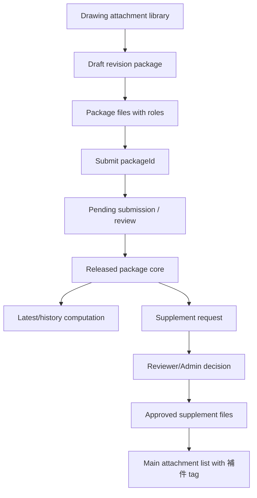

# SPEC-PDM-DRAWING-REVISION-PACKAGE-002 - 一階版次附件包模型

Status: Implemented / Local verification passed
Authorization: Local RD implementation executed for Phase 4. Production deploy, production migration and direct historical data repair still require separate explicit authorization.
Date: 2026-07-06
Owner: Dev PM
Related DEV: `DEV-PDM-DRAWING-REVISION-SUBMISSION-001-P4`
Related ADR: `.ai-doc/decisions/ADR-PDM-DRAWING-REVISION-PACKAGE-001-first-class-package-and-supplement.md`
Related QA: `.ai-doc/qa/qa-pdm-drawing-revision-package-model-validation-plan-2026-07-06.md`

Related authority:

- `.ai-doc/specs/SPEC-PDM-DRAWING-REVISION-SUBMISSION-001-controlled-revision-package.md`
- `.ai-doc/specs/SPEC-PDM-DRAWING-SUBMISSION-WORKBENCH-002-release-recovery.md`
- `.ai-doc/decisions/ADR-PDM-DRAWING-PART-WORKBENCH-001-data-ownership-and-submission-snapshot.md`

## 1. Human Decision Brief

Source: 2026-07-06 HCS guided decisions from the user.

HCS-guided answer log:

- Round 1: `1C 2C 3 no-blocking reminder` - keep all version data creatable/approvable without chronological order lock, suggest the next version first, block duplicate same-version formal package only, and show latest first while collecting older versions in history.
- Round 2: `1B 2B 3B` - treat post-release added files as supplements requiring reason and approval; design a reason menu that can warn `應建立新版次` without hard-blocking.
- Round 3: `1C 2B 3C` - reason menu is the confirmed five-option menu below; note is optional except `其他`; warning reason does not block request.
- Final confirmation: current system reviewer/supervisor plus Admin can approve supplements; approved supplements appear in the same main attachment list with `補件` marking while supplement provenance stays separately tracked; no product `待確認附件` area is added for migration ambiguity.

Confirmed product decisions:

- The current multi-file `版次檔案包` behavior is valuable, but it must become a first-class model, not only a submission snapshot convention.
- Every revision attachment package has a stable `packageId`.
- Same `圖號 + 版次` may have working attempts, but only one effective formal Released package may exist.
- Formal Released package evidence is immutable.
- Missing PDF, DWG/DXF, 3D, intermediate or supporting files never blocks submission/review/release by itself; the system only warns.
- Released packages may receive supplemental attachments later, because downstream users may later request PDF, DWG/DXF, STEP/IGES/X_T or similar files that were not needed during initial release.
- Supplemental attachments must not modify the original formal package evidence.
- Supplemental attachments are independent `補件` records under the released package and require approval before becoming formal supplemental attachments.
- Supplement approval can be performed by the current system reviewer/supervisor resolved by the approval rules and by Admin.
- Approved supplements are displayed in the same main attachment list as package files, but must show an icon/tag that identifies them as `補件`.
- The model must independently track supplement source, reason, applicant, reviewer decision, approval timestamp and audit evidence.
- Existing data migration should auto-build packages only when the source is clear. Ambiguous records must be reported in the IDE/Codex dry-run for user confirmation, not surfaced as a new product `待確認附件` area.

Supplement reason menu:

| Code | Label | Description | System wording | Note rule | Revision warning |
|---|---|---|---|---|---|
| `format_file` | `補交格式檔` | PDF, DWG/DXF, STEP/IGES/X_T and other generated/exported formats needed later. | `設計內容未變，只補交其他格式檔。` | Optional | No |
| `auxiliary_material` | `補交輔助資料` | Supplier, manufacturing, QC or customer reference materials. | `不作為設計變更依據，只作為作業輔助資料。` | Optional | No |
| `metadata_correction` | `修正附件資訊` | Filename, category, display name or description correction. | `只修正附件資訊，不更換正式設計內容。` | Optional | No |
| `content_changed_new_revision` | `內容有變更，建立新版次` | Size, geometry, material, surface treatment, BOM basis or formal drawing/CAD/PDF/DWG content changed. | `這不是補附件，應建立新版次。` | Optional | Yes |
| `other` | `其他` | User-defined supplement reason. | `請補充說明補件原因。` | Required | No by default |

Rejected behavior:

- Treating `selectedAttachmentIds` plus snapshot JSON as the long-term authoritative package model.
- Allowing Released package core evidence to be edited in-place.
- Creating a separate product UI `待確認附件` area for legacy migration ambiguity.
- Blocking review or release only because optional file roles are missing.
- Requiring a new drawing revision for every supplemental format/supporting file.
- Hiding supplements in history only where normal operators cannot find them.

AI assumptions:

- Phase 4 requires additive schema and repository/API changes.
- RD may choose exact table column names, route names, transaction helper placement and verifier script names as long as the contracts below are preserved.
- Production deployment, production migration and direct historical repair remain unapproved.
- The existing submission snapshot remains valid evidence for old records and can seed the new package model.
- The existing drawing attachment/file asset service remains the file storage owner; the package model owns package membership, lifecycle and supplement audit.
- Current reviewer/supervisor resolution should reuse existing approval matrix / reviewer resolution services where possible.

Re-entry triggers:

- User wants supplement approval to bypass reviewer/Admin review.
- User wants approved supplements hidden from the main attachment list.
- RD discovers that production data must be mutated or deleted to build the model.
- RD cannot preserve existing submission evidence while creating package records.
- RD needs to change FFF, part/BOM or drawing-number revision rules.
- RD needs a new product `待確認附件` area despite the confirmed migration decision.

## 2. Problem

Phase 1-3 made the revision workflow usable, but the package still lives as a workflow convention:

```text
source attachments -> selectedAttachmentIds -> submission_files -> snapshot.revisionPackage
```

This is not enough for long-term PDM behavior:

- A version package cannot be independently queried, patched, audited, supplemented or displayed without parsing submission snapshots.
- The UI can show a package-like list, but the data model still sees individual files and submission snapshots.
- Supplement-after-release is not natural: adding a late STEP/PDF/DWG file either looks like editing the released package or like a loose attachment.
- Migration from existing records cannot reliably distinguish formal package files, supplements, staging files and ambiguous legacy attachments without a package identity.

The real PDM object is:

```text
圖號 + 版次 + packageId = 受控版次附件包
```

## 3. Product Rule

Authoritative boundary:

```text
圖號附件庫 = drawing-owned source/staging file library
版次附件包 = controlled package identity for one drawing revision
送審單 = review workflow and approval evidence
正式包 = Released package core evidence; immutable after release
補件 = approved supplemental evidence attached after release; independent audit trail
最新版 = highest approved/formal revision computed by revision comparator
歷史版 = approved/formal revision that is not computed latest
```

Package uniqueness:

- `packageId` is the stable package identity.
- Same `company + drawing_number_id + revision` may have Draft / Rejected / Cancelled package attempts.
- Same `company + drawing_number_id + revision` may have at most one effective Released package.
- Latest/current state is computed by revision comparison across Released packages, not by approval time and not by supplement time.

Immutability:

- Draft package files and metadata may be edited.
- Pending package files are locked while under review.
- Rejected or Cancelled packages may be copied into a new Draft attempt.
- Released package core files, core roles and core snapshot are immutable.
- Released package supplements are additive child records and do not mutate the core package.

Warning-only completeness:

- At least one package file is required for a package to enter formal review.
- Missing recommended roles such as PDF, DWG/DXF, 3D CAD, intermediate files or auxiliary documents create warnings only.
- The reviewer sees the same warning codes and decides whether the package is acceptable.

Supplement rule:

- Supplement files require reason selection.
- Reason note is optional except when reason is `其他`.
- `內容有變更，建立新版次` triggers a visible `應建立新版次` warning and explanation, but does not hard-block the supplement application.
- Approved supplements display together with normal package files but carry a `補件` tag/icon.

## 4. Scope

### 4.1 In Scope

- Add first-class revision package schema and repositories.
- Persist package file membership and package file role independent of submission snapshot JSON.
- Keep existing submission snapshot as review evidence and backward compatibility seed.
- Create package records from the drawing revision workbench instead of treating `selectedAttachmentIds` as the only package identity.
- Submit/review/release packages by `packageId`.
- Enforce one effective Released package per `company + drawing_number_id + revision`.
- Add supplement request, approval, rejection and audit flow for Released packages.
- Add supplement reason menu and `應建立新版次` warning behavior.
- Display approved supplements in the main attachment list with tag/icon.
- Preserve latest/history grouping with supplements included under the owning package.
- Provide migration dry-run for existing submission snapshots and attachment records.
- Report ambiguous legacy records in IDE/Codex dry-run output for human confirmation; do not add product UI for ambiguity.
- Add QA/QC for package identity, immutability, supplement approval and migration dry-run.

### 4.2 Out of Scope

- Production deploy.
- Production migration or direct production data repair.
- Data deletion or silent mutation of existing submissions, attachments or file assets.
- New product `待確認附件` area for ambiguous migration.
- Making optional completeness warnings blocking.
- Changing FFF, part/BOM, replacement draft or drawing-number identity rules.
- CAD/OCR/SolidWorks title-block extraction.
- Dedicated mobile-phone UI; phones use the desktop/default surface.

## 5. End-State Architecture



Architecture Memory Capsule:

- File storage stays drawing/file-asset owned; package membership is a controlled domain model.
- Submission is a workflow record; package is the versioned product evidence object.
- Released core package data is immutable; supplement data is additive.
- Formal package validity and latest/history status are separate concepts.
- The model must support out-of-order historical backfill.
- The model must support future production migration without forcing direct cleanup now.
- The user rejected a product `待確認附件` area; migration uncertainty belongs in dry-run reporting and PM/user confirmation.

## 6. Data Model Contract

### 6.1 `drawing_revision_packages`

Required fields:

| Field | Contract |
|---|---|
| `id` | Stable `packageId`. |
| `company_id` | Company scope. |
| `drawing_number_id` | Official drawing owner. |
| `drawing_number` | Denormalized display/audit copy. |
| `revision` | Drawing revision value. |
| `status` | `Draft`, `Pending`, `Released`, `Rejected`, `Cancelled`. |
| `source_submission_id` | Submission that reviewed/released this package, nullable in Draft. |
| `created_by`, `created_at`, `updated_at` | Audit. |
| `submitted_at`, `released_at`, `rejected_at`, `cancelled_at` | Lifecycle timestamps. |
| `superseded_by_package_id` | Only for explicit correction/replacement workflows, not normal latest/history computation. |
| `snapshot_json` | Frozen package summary at submit/release time. |

Indexes / constraints:

- Index: `(company_id, drawing_number_id, revision)`.
- Unique active Draft/Pending behavior is service-controlled to allow safe retries/idempotency.
- Unique effective Released package: `(company_id, drawing_number_id, revision)` where `status = 'Released'`.
- Foreign keys must not cascade-delete package history.

### 6.2 `drawing_revision_package_files`

Required fields:

| Field | Contract |
|---|---|
| `id` | Stable package-file membership id. |
| `package_id` | Parent package. |
| `source_file_asset_id` | File asset / drawing attachment source id. |
| `source_submission_file_id` | Submission file copied during review, nullable before submit. |
| `role` | `cad_3d`, `drawing_2d`, `intermediate`, `pdf`, `dwg_dxf`, `other`. |
| `role_source` | `extension`, `user`, `migration`, `system`. |
| `display_name`, `description` | Package-level display metadata. |
| `sort_order` | Stable display order. |
| `is_primary` | Optional primary flag per role; duplicates remain warning-only. |
| `created_by`, `created_at` | Audit. |

Rules:

- Package file membership does not rename or overwrite the physical file.
- Released package core file rows are immutable after release.
- Role corrections after release must use supplement or explicit correction workflow, not direct row edit.

### 6.3 `drawing_revision_package_supplements`

Required fields:

| Field | Contract |
|---|---|
| `id` | Stable supplement request id. |
| `package_id` | Released package parent. |
| `status` | `Pending`, `Approved`, `Rejected`, `Cancelled`. |
| `reason_code` | One of the confirmed menu codes. |
| `reason_note` | Required only when `reason_code = 'other'`. |
| `revision_warning_shown` | True when reason is `content_changed_new_revision`. |
| `requested_by`, `requested_at` | Applicant audit. |
| `reviewed_by`, `reviewed_at`, `review_decision_note` | Decision audit. |

Rules:

- Supplements can only be requested against a Released package.
- Supplement approval does not change package `released_at`, core snapshot or core file hashes.
- Pending supplements are not formal evidence.
- Approved supplements are formal supplemental evidence.

### 6.4 `drawing_revision_package_supplement_files`

Required fields:

| Field | Contract |
|---|---|
| `id` | Stable supplement-file membership id. |
| `supplement_id` | Parent supplement request. |
| `source_file_asset_id` | File asset / drawing attachment source id. |
| `role` | Same role enum as package files. |
| `display_name`, `description`, `sort_order` | Display metadata. |
| `created_by`, `created_at` | Audit. |

Rules:

- Approved supplement files appear in the main attachment list with tag/icon `補件`.
- Supplement files are traceable back to supplement reason and decision.

## 7. API / Service Contract

Route names may vary, but service boundaries must exist.

```ts
createOrUpdateDraftRevisionPackage(input: {
  companyId: string;
  actorUserId: string;
  drawingNumberId: string;
  drawingNumber: string;
  revision: string;
  fileIds: string[];
  fileRoles: Array<{ fileId: string; role: RevisionPackageFileRole }>;
  idempotencyKey: string;
}): Promise<{ packageId: string; warnings: RevisionPackageWarning[] }>;

submitRevisionPackage(input: {
  companyId: string;
  actorUserId: string;
  packageId: string;
  fffAssessmentInput: DrawingRevisionFffInput;
  note?: string | null;
  idempotencyKey: string;
}): Promise<{ packageId: string; submissionId: string; assessmentId: string }>;

releaseRevisionPackage(input: {
  companyId: string;
  actorUserId: string;
  packageId: string;
  submissionId: string;
}): Promise<{ packageId: string; status: "Released"; latestRevision: string }>;

requestRevisionPackageSupplement(input: {
  companyId: string;
  actorUserId: string;
  packageId: string;
  reasonCode: SupplementReasonCode;
  reasonNote?: string | null;
  fileIds: string[];
  fileRoles: Array<{ fileId: string; role: RevisionPackageFileRole }>;
}): Promise<{ supplementId: string; status: "Pending"; revisionWarningShown: boolean }>;

decideRevisionPackageSupplement(input: {
  companyId: string;
  actorUserId: string;
  supplementId: string;
  decision: "approve" | "reject";
  note?: string | null;
}): Promise<{ supplementId: string; status: "Approved" | "Rejected" }>;
```

Required implementation surfaces:

- Schema/migration: add package, package-file, supplement and supplement-file tables to local schema/bootstrap and Postgres migration source; do not mutate production data.
- Repository/service: create a package repository that owns package identity, package-file membership, supplement lifecycle, duplicate Released guard, immutability checks and dry-run migration reporting.
- Submission integration: create/link package records when `/numbering/revisions` submits a controlled drawing revision package; release flow must mark the owning package Released in the same release transaction.
- Review integration: full submission page and dashboard drawer must show package warnings and supplement review actions where the current reviewer/supervisor/Admin is eligible.
- Attachment display: master attachment/package list must render core package files and approved supplement files together, with `補件` tag/icon and provenance link for supplement files.
- Supplement request UI/API: allow multiple files, role auto-classification/correction, confirmed reason menu, optional note except `其他`, and warning-only `應建立新版次` behavior.
- Migration tooling: dry-run first; emit clear/ambiguous classifications in Codex/IDE output; no product pending area and no mutation unless separately authorized.

Transaction requirements:

- Submit must re-check drawing, package files, duplicate Released same revision, same-revision active blockers and FFF branch guards.
- Release must atomically mark submission Released, package Released, package core immutable and latest/history recomputed.
- Supplement approval must atomically mark supplement Approved and make supplement files visible as formal supplemental evidence.
- Any partial failure must leave recoverable state and audit.

## 8. Permission Contract

Package draft/edit:

- Engineer and Admin may create Draft packages if they can update drawing revision data.
- Draft edits require same drawing/company scope.

Package submit:

- Engineer and Admin may submit if normal drawing revision submit guards pass.

Package release/review:

- Existing drawing submission reviewer/supervisor rules apply.
- Admin can review/override according to existing Admin policy.

Supplement:

- Eligible applicant: Engineer, current responsible role for the drawing package, or Admin.
- Eligible approver: current system reviewer/supervisor resolved by approval rules and Admin.
- Applicant cannot self-approve unless existing Admin policy explicitly allows Admin override and audit records the override.
- If the package has an assigned reviewer from the original submission, use that reviewer/supervisor chain first; if no assignment can be resolved, Admin remains the only safe approver until PM/user authorizes a broader fallback.

## 9. UX Contract

### 9.1 Package Display

Primary package view should answer:

```text
這一版正式有哪些檔案？
哪些是補件？
補件為什麼加？誰核准？
```

Display rules:

- Core package files and approved supplement files appear in the same main attachment list.
- Supplement rows show icon/tag `補件`.
- Supplement row details link to reason, applicant, approver and decision timestamp.
- Pending supplements are visible only to authorized applicants/reviewers as pending work, not as formal package evidence.

### 9.2 Supplement Request

Required controls:

- Reason select using the confirmed menu.
- Optional note except `其他`, where note is required.
- File dropzone / file selector supporting multiple files.
- Role auto-classification and inline correction.
- Warning panel when reason is `內容有變更，建立新版次`:

```text
應建立新版次
你選擇的原因表示正式設計內容可能已變更。通常應建立新版次；若仍要補附件，系統會保留此提醒與審核紀錄。
```

The warning does not disable submit.

### 9.3 Supplement Review

Reviewer page/drawer must show:

- package identity: drawing number, revision, packageId;
- supplement reason and system wording;
- applicant note;
- selected files and roles;
- revision warning flag if present;
- approve/reject actions.

## 10. Migration / Compatibility Contract

Migration is required for implementation but must be additive and dry-run first.

Sources:

- Existing Released submissions with `snapshot.revisionPackage`.
- Existing `submission_files.source_master_attachment_id`.
- Existing drawing attachment / `file_assets` rows with drawing number and revision.

Auto-build rules:

- Released submission with parseable `snapshot.revisionPackage.files` creates one Released package.
- Submission files linked to source master attachments become package files.
- Role uses snapshot package role first, then extension inference.
- Existing Pending/Rejected/Cancelled submissions may become package attempts only if linkage is unambiguous.

Ambiguous examples:

- File asset has revision but no released submission or package snapshot.
- Same drawing + same revision has multiple plausible submissions.
- File appears in multiple candidate packages.
- File has mismatched drawing number or revision metadata.

Handling:

- Ambiguous records are emitted in a dry-run report for IDE/Codex confirmation.
- The product UI must not add a `待確認附件` area for these records.
- No production mutation, deletion or silent reassignment is authorized by this spec.

## 11. Failure Modes

| Failure | Required behavior |
|---|---|
| Duplicate Released package for same drawing + revision | Block transaction; show existing package and recovery path. |
| Missing optional file role | Warning only; do not block. |
| Supplement reason `other` without note | Block with `請填寫補件原因說明。` |
| Supplement reason indicates content changed | Show `應建立新版次`; do not hard-block. |
| Pending supplement approval by unauthorized user | 403 with human-readable Chinese. |
| Released core package edit attempt | Block and route to supplement or new revision path. |
| Migration ambiguity | Dry-run report only; do not create product pending area. |
| Snapshot parse failure | Keep existing submission valid; mark migration candidate ambiguous. |

## 12. RD Handoff Contract

Authorization: local implementation completed under the active RD execution goal. No production implementation is authorized.

Document status: Implemented / Local verification passed.

Scope:

- Implement first-class package schema, repository, services and package/supplement APIs.
- Integrate `/numbering/revisions`, submission review, dashboard drawer and master attachment panel with packageId.
- Migrate local/dev data through dry-run and explicit confirmation before mutation.
- Preserve current Phase 1-3 behavior.

Out of scope:

- Production deploy/migration.
- Direct repair/deletion of user data.
- CAD/OCR extraction.
- New product `待確認附件` area.

Entry condition:

- User explicitly authorizes RD implementation. Met by active Dev PM execution goal.
- RD confirms current dirty worktree boundary and protects unrelated user changes. Met; unrelated pre-existing dirty worktree changes were not reverted.

Acceptance:

- New revision package has stable `packageId`.
- Submit/review/release flows use `packageId`.
- Same drawing + revision has only one effective Released package.
- Released core package files cannot be edited.
- Approved supplements display in the same list with `補件` tag.
- Pending supplements require reviewer/Admin approval.
- Supplement reason warning behavior matches the confirmed menu.
- Migration dry-run reports ambiguous records in IDE/Codex and does not create product UI clutter.

QA/QC gate:

- `npx.cmd tsc --noEmit --pretty false`
- `npm.cmd run lint -- --quiet`
- focused package model QC script
- existing `npm.cmd run qc:pdm-change-control`
- browser evidence for package list, supplement request, supplement review and released-core immutability
- migration dry-run evidence on local fixtures

Stop conditions:

- Production data mutation is required.
- Implementation cannot preserve old submission snapshot evidence.
- RD needs to change FFF/part/BOM rules.
- Supplement approval cannot reuse current reviewer/Admin permission model.
- The model requires a product `待確認附件` area.

Evidence:

- `npx.cmd tsc --noEmit --pretty false` passed.
- `npm.cmd run lint -- --quiet` passed.
- `npm.cmd run qc:pdm-drawing-revision-package-model` passed 59/59.
- `npm.cmd run qc:pdm-change-control` passed 61/61.
- `npm.cmd run db:init` initialized local SQLite schema at `data/ai-pdm.sqlite`.

Evidence still recommended before production:

- Browser screenshot for actual supplement request, approval and `補件` tag on seeded or real data.
- Production migration dry-run and rollback package.

## 13. Deferred Scope Audit

| Deferred item | Classification | Handling |
|---|---|---|
| Production deploy / production migration | New DEV / release gate | Requires deployment-release gate, backup, rollback and smoke evidence. |
| Historical production repair | Blocked Human Re-entry | Requires explicit user authorization and dry-run review. |
| Ambiguous legacy records | Same Spec Phase | Dry-run report in IDE/Codex; no product `待確認附件` area. |
| CAD/OCR extraction | New DEV / Same parent spec Phase 5 | Not needed for package model. |
| Optional file-role hard blocking | Blocked Human Re-entry | Rejected unless user changes the business rule. |
| Dedicated mobile-phone UI | No Tracking | Rejected by current system setting. |

## 14. All-Phase Coverage Matrix

| Phase / DEV | Authorization | Document status | Scope | Out of scope | Entry condition | Acceptance | Evidence |
|---|---|---|---|---|---|---|---|
| Phase 4 - First-Class Revision Attachment Package Model (`DEV-PDM-DRAWING-REVISION-SUBMISSION-001-P4`) | Authorized and implemented locally | Implemented / local verification passed | First-class package schema, package files, supplement request/approval, packageId APIs, migration dry-run, multi-file master attachment intake, supplement request/review controls | Production, direct repair, CAD/OCR, product pending-area for ambiguous migration | Active Dev PM RD execution goal | PackageId governs formal package; Released core immutable; supplements approved and tagged; duplicate Released same revision blocked | tsc, lint, focused QC 59/59, change-control QC 61/61, local db:init |
| Phase 5 - Extraction Assistance | Not authorized | RD Contract Ready / Not Authorized | Optional CAD/OCR/title-block extraction assistance | External license/cost and production CAD processing | Phase 4 implemented/verified plus explicit automation authorization | Extraction assists but does not override RD correction | Adapter tests and mismatch negative cases |
| Phase 6 - Production Cutover / Historical Repair | Not authorized | Release Gate Contract Ready / Parked | Production rollout, migration, backup, rollback, production smoke, approved historical repair | Deletion, silent repair, unapproved migration | Applicable phases implemented/verified plus release gate approval | Production smoke passes and historical risks classified without data loss | Release gate package, dry-run, rollback evidence |

## 15. Spec Governance Result

Cross-spec handling:

- This spec amends `SPEC-PDM-DRAWING-REVISION-SUBMISSION-001` by replacing the previous Phase 4 CAD/OCR slot with first-class package modeling.
- CAD/OCR extraction is moved to a later phase and remains optional.
- This spec extends the drawing submission snapshot ADR; snapshots remain evidence, but no longer substitute for a package model.

ADR decision:

- New ADR is required because the change affects identity, lifecycle, immutability, supplement audit and migration.
- ADR created: `.ai-doc/decisions/ADR-PDM-DRAWING-REVISION-PACKAGE-001-first-class-package-and-supplement.md`.

Implementation result:

- Product decisions are human-confirmed.
- P0/P1 product-semantics, permission, lifecycle, schema/API, migration, failure-mode and QA gate gaps are closed for local implementation.
- Phase 4 local implementation is complete at code/static-QC level.
- Production deployment, production migration, direct historical repair and browser evidence on real user data remain outside this local implementation result.
