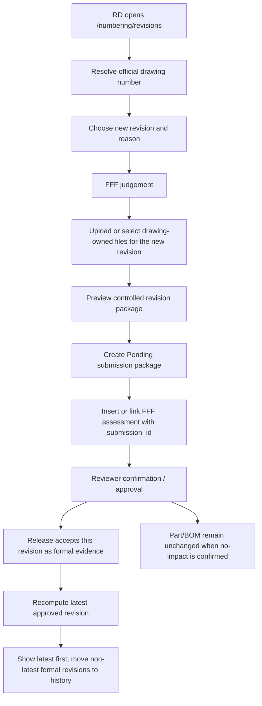

# SPEC-PDM-DRAWING-REVISION-SUBMISSION-001 - 圖面進版受控送審包

Status: Phase 1, Phase 2 and Phase 3 implemented / verification passed locally; DEV-053 multi-part scope amendment implemented locally; Phase 4 first-class package model is RD Implementation Ready / not implemented; Phase 5/6 not authorized
Date: 2026-07-03
Owner: Dev PM
Related DEV: `DEV-PDM-DRAWING-REVISION-SUBMISSION-001`
Related QA: `.ai-doc/qa/qa-pdm-drawing-revision-submission-validation-plan-2026-07-03.md`

> **2026-08-10 DEV-061 Amendment**
>
> 新首版／進版的檔案歸屬與必填條件改由 `.ai-doc/specs/SPEC-PDM-FILE-OWNERSHIP-001-contextual-drawing-part-files-and-3d-reuse.md` 管理。每次送審一律要求本次重新上傳一個 primary `.SLDDRW` 與一個 primary `.SLDPRT`／`.SLDASM`；相同 3D bytes 由系統自動重用 canonical asset，不得以歷史檔案取代本次上傳。圖號一般／參考附件的新寫入停止，submission 改保存 canonical asset pointer。本文中 warning-only completeness、drawing attachment staging/write authority 與其衍生流程僅保留為歷史證據，衝突處由 DEV-061 取代。

Related authority:

- `.ai-doc/decisions/ADR-PDM-MATERIAL-IDENTITY-REVISION-001-part-number-vs-controlled-definition-revision.md`
- `.ai-doc/specs/SPEC-PDM-CHANGE-CONTROL-001-revision-part-bom-flow.md`
- `.ai-doc/specs/SPEC-PDM-CHANGE-CONTROL-001-implementation-contract.md`
- `.ai-doc/specs/SPEC-PDM-CHANGE-CONTROL-002-drawing-revision-workbench-ux-contract.md`
- `.ai-doc/specs/SPEC-PDM-DRAWING-SUBMISSION-WORKBENCH-002-release-recovery.md`
- `.ai-doc/specs/SPEC-PDM-DRAWING-SUBMISSION-WORKBENCH-003-ui-self-recovery.md`
- `.ai-doc/specs/SPEC-PDM-DRAWING-REVISION-PACKAGE-002-first-class-attachment-package-model.md`
- `.ai-doc/decisions/ADR-PDM-DRAWING-PART-WORKBENCH-001-data-ownership-and-submission-snapshot.md`
- `.ai-doc/decisions/ADR-PDM-DRAWING-REVISION-PACKAGE-001-first-class-package-and-supplement.md`
- `.ai-doc/qa/qa-pdm-drawing-revision-package-model-validation-plan-2026-07-06.md`

## 1. Human Decision Brief

Source: 2026-07-03 user APP review and critique.

Confirmed product decisions:

- A drawing revision such as `D-0007-MA1` from `0.1` to `0.2` may be valid even when the part number and BOM do not revise.
- The system must not treat "upload an attachment with revision 0.2" as the formal drawing revision by itself.
- A formal drawing revision requires a controlled submission/review/release package that contains the new drawing files, FFF judgement, revision value, reason category, reviewer confirmation and audit trail.
- No-impact changes such as `標註 / 文字修正` can keep the same part number and BOM, but the reviewer must still confirm why BOM does not revise.
- Confirmed-impact changes still require replacement part draft and drawing part-number match under the existing change-control rule.
- One drawing revision package may carry one or more legitimate primary parts. It keeps one revision, one attachment package and one review lifecycle, while preserving an immutable per-part scope and all-or-nothing release.

Rejected behavior:

- Asking RD to leave `/numbering/revisions`, manually find the drawing in a separate module, upload a `0.2` file to the attachment library, then infer that the drawing was revised.
- Letting `圖號附件庫` become the only evidence that a new drawing revision exists.
- Forcing part number, root master data or BOM revision merely because a drawing note/text revision was made.
- Creating a new drawing number in the original drawing revision flow.

AI assumptions:

- The existing drawing attachment library remains the staging/source-file area.
- The existing drawing submission workbench and submission snapshot flow should be reused where possible.
- The existing `drawing_revision_fff_assessments.submission_id` field is the intended link between FFF judgement and controlled submission package.
- No schema migration is required for Phase 1 if `submission_id`, `source_master_attachment_id`, submission snapshot and existing file traceability are sufficient.
- If implementation cannot link FFF assessment and submission package transactionally with current schema, RD must stop and prepare a focused migration plan.

Re-entry triggers:

- User wants part/BOM to always revise with every drawing revision.
- User wants drawing attachment upload alone to count as formal released revision.
- RD needs production migration, production deploy, direct DB mutation, historical repair or data deletion.
- RD discovers the submission snapshot cannot preserve selected drawing attachments and FFF judgement without additive schema changes.
- The workflow would allow confirmed-impact revision release without replacement part and drawing part-number match.

### 1.1 2026-07-05 Human Decision Brief - Multi-File Revision Package

Source: 2026-07-05 user review of the `/numbering/revisions` upload flow.

Confirmed product decisions:

- The upload unit is a `版次檔案包`, not a single file.
- One drawing revision package may include multiple files for the same revision, including 3D CAD, 2D drawing, intermediate exchange files, PDF, DWG/DXF and other supporting files.
- The user should be able to drag/drop or upload multiple files into the same intended revision package in one working step.
- File category is auto-classified from extension first, then user may correct the category inline.
- Package completeness checks are warning-only after at least one package file exists. Missing recommended file roles must not block submit by themselves.
- The review page must show the same warning set so the reviewer can decide whether to approve, reject or request supplemental files.

Rejected behavior:

- Keeping the primary workflow as one uploaded file per revision.
- Forcing the user to choose `3D` or `2D` before the system sees the files.
- Hiding package completeness warnings from reviewers.
- Blocking submission only because optional recommended roles such as PDF, DWG/DXF or 3D CAD are missing.

Boundary:

- `至少一個檔案` remains a formal package requirement. This prevents an empty drawing revision package.
- `檔案包完整性` is different from `是否可送審`: the system may warn that the package lacks PDF/DWG/3D/etc., but it does not decide that the package is invalid only from those missing roles.

### 1.2 2026-07-05 Human Decision Brief - Out-of-Order Revision Acceptance

Source: 2026-07-05 user critique of backfilled historical versions and the failed `0.5` approval after `0.6` already existed.

Confirmed product decisions:

- The system should support entering and approving drawing revision records in any order, including backfilling an older revision for traceability after a newer revision already exists.
- Version order is used to compute which approved revision is the latest; it is not a hard rule that blocks approval of a lower revision.
- The UI should suggest the next likely revision first, but the user may intentionally override it.
- The system must prevent duplicate formal records for the same drawing number and same revision.
- First-level drawing/package views should show only the latest approved revision by default; older approved revisions belong in the history area.

Rejected behavior:

- Rejecting approval only because a newer revision is already released.
- Letting a lower backfilled revision replace a newer latest revision.
- Listing every approved revision in the first-level attachment/workbench area as if all versions are equally current.
- Creating two formal approved records for the same drawing number and revision.

Boundary:

- This rule changes revision-order handling, not FFF, part/BOM or package completeness rules.
- Backfilled older revisions are formal traceability records after approval, but they do not become the current/latest revision when a higher approved revision already exists.
- Production cleanup of existing incorrect records remains a separate repair/release-gate decision.

### 1.3 2026-07-06 Human Decision Brief - First-Class Revision Attachment Package Model

Source: 2026-07-06 user HCS guided decisions.

Confirmed product decisions:

- The existing multi-file `版次檔案包` concept must become a first-class data model, not only `selectedAttachmentIds` plus submission snapshot.
- Every package has a stable `packageId`.
- Same `圖號 + 版次` may have working attempts, but only one effective Released package may exist.
- Released package core files and roles are immutable.
- Missing recommended files never blocks by itself; the system only reminds submitter and reviewer.
- Released packages may receive later supplemental files through independent supplement records.
- Supplements require reason selection and approval before becoming formal supplemental evidence.
- Supplement approvers are the current system reviewer/supervisor plus Admin.
- Approved supplements are shown in the same main attachment list with a `補件` icon/tag, while the model separately tracks reason, applicant, reviewer decision and audit.
- Migration ambiguity must be reported in IDE/Codex dry-run output for user confirmation; do not add a product `待確認附件` area.

Authoritative focused spec:

- `.ai-doc/specs/SPEC-PDM-DRAWING-REVISION-PACKAGE-002-first-class-attachment-package-model.md`

## 2. Problem

The implemented `/numbering/revisions` workbench fixes the earlier internal-ID UX problem, but it still stops too early:

```text
RD resolves drawing -> fills revision 0.2 -> selects FFF -> submits assessment
```

The missing controlled step is:

```text
RD selects/uploads the new drawing files -> creates a controlled drawing revision submission package
```

This creates an operator and audit gap:

- Users expect "圖面進版" to include the new drawing files.
- The system currently has the file upload control in the drawing submission workbench, not in the revision workbench.
- The attachment library can hold a file with revision `0.2`, but the system does not force that file to be selected into a formal review package.
- Future users cannot reliably know whether `0.2` is a draft attachment, pending submission, released drawing revision or abandoned file.
- The current upload experience is still too close to a single-file attachment operation, while real PDM drawing revisions commonly require one revision package containing 3D, 2D, PDF, DWG/DXF, intermediate and other supporting files.
- Manual pre-selection of `3D` / `2D` before upload does not answer the user's actual task: `我這一版的圖檔包準備好了嗎？缺什麼？現在能不能送審？`

## 3. Product Rule

Authoritative boundary:

```text
圖號附件庫 = drawing-owned source/staging files
圖面進版送審包 = formal controlled revision package
發行完成 = formal approved revision evidence
最新版 = highest approved/formal revision computed by deterministic revision comparison
歷史版 = approved/formal revision that is not the computed latest
```

Multi-file revision package rule:

```text
同一個圖號 + 同一個目標版次 = 一個受控版次檔案包
版次檔案包 = 1..n files, each with a role/category and optional warning state
完整性警示 = reviewer-visible warning, not an automatic submit blocker after at least one file exists
```

Out-of-order revision rule:

```text
所有版次都可以建入及核准，沒有時間順序限制。
系統只做三件事：
1. 建議使用者先輸入下一個合理版次。
2. 阻擋同一圖號 + 同一版次的重複正式記錄。
3. 依版次排序只顯示最新版，其他正式版次整理進歷史區。
```

Allowed no-impact result:

```text
Drawing D-0007-MA1: 0.1 -> 0.2
Part P-0007-001: unchanged
BOM: unchanged, reviewer-confirmed no revision
```

Approval/status boundary:

- `review_confirmation_events` is the canonical evidence that the linked FFF impact review was completed.
- For a minor revision (`0.x` or `N.x`), an approved FFF event projects the physical `Pending` package to effective `ReviewApproved` / `研發受控`; it must not be promoted to physical `Released` or manufacturing-current data.
- For a major revision, the same approved review hands off to the existing approval-step and atomic release workflow. A rejected replacement action never advances the submission.
- The read model and submission detail must show the effective status and remove a misleading `核准發布` action for a minor revision already approved by FFF.

Forbidden result:

```text
Attachment D-0007-MA1 rev 0.2 exists, but no controlled submission/review/release record explains whether it is official.
```

## 4. Scope

### 4.1 In Scope

- Integrate drawing revision workbench with drawing-owned attachment selection/upload.
- Make "new drawing files for revision X" a required step before creating the controlled revision submission package.
- Reuse drawing attachment library APIs for upload and duplicate/released-filename guards.
- Support multi-file upload/drag-drop into the same intended revision package.
- Auto-classify uploaded package files by extension and allow inline category correction.
- Evaluate package completeness warnings for submitter and reviewer.
- Create or update a submission package from the selected drawing attachment IDs.
- Link the FFF assessment to the created submission through `drawing_revision_fff_assessments.submission_id`.
- Show a pre-submit preview that distinguishes:
  - drawing revision;
  - part number identity unchanged/replacement state（Part Number 本身無 Revision）;
  - BOM revision/unchanged state;
  - selected new drawing files;
  - reviewer-required confirmation.
- Preserve existing same-revision blockers and release-incomplete recovery behavior.
- Ensure release success updates drawing latest released revision only after approval/release, not at attachment upload time.
- Add QA/QC coverage for no-impact, suspected-impact and confirmed-impact paths.
- Add QA/QC coverage that the review page shows the same package warnings before approval/rejection actions.
- Phase 3: allow lower or non-sequential revisions to be submitted/reviewed/approved after newer revisions already exist.
- Phase 3: remove chronological release-order blockers from the normal approval/retry-release path.
- Phase 3: recompute latest/history classification after every approval/release.
- Phase 3: keep same drawing + same revision uniqueness as a hard blocker.
- Phase 3: default first-level drawing/package displays to latest approved revision only, with non-latest approved revisions under history.

### 4.2 Out of Scope

- Production deploy.
- Supabase production cutover or remote migration.
- Direct cleanup/repair of existing attachment or submission records.
- Automatically changing released BOM versions.
- Automatically changing part numbers for no-impact or suspected-impact paths.
- CAD/OCR/SolidWorks automatic part-number extraction as a Phase 1 or Phase 2 requirement.
- Retiring the drawing submission workbench.
- Rewriting the change-control business rules from `SPEC-PDM-CHANGE-CONTROL-001`.
- Blocking submission only because a recommended but optional file role is missing after the package already contains at least one valid file.
- Dedicated mobile-phone UI, mobile-specific navigation or phone-first layout. Phones use the desktop/default surface by product setting.
- Direct repair, deletion or migration of existing incorrect historical records.
- Requiring chronological approval order as a product rule.

## 5. End-State Architecture



Responsibility boundary:

| Surface / service | Responsibility |
|---|---|
| `/numbering/revisions` | Collect revision intent, FFF judgement, new drawing files and submit preview. |
| Drawing attachment library | Store drawing-owned source files before submission; not formal release evidence by itself. |
| Drawing submission service | Create Pending submission, copy/reference selected files, freeze snapshot/hash and enforce same-revision blockers. |
| Change-control service | Enforce FFF outcome, replacement draft and reviewer confirmation rules. |
| Release service | Mark submission Released, sync drawing/part/root lifecycle when applicable and recompute latest/history classification without blocking lower backfilled revisions. |
| Revision package warning service | Classify package files and return shared warning codes/messages for submitter and reviewer pages. |
| Reviewer UI | Confirm BOM no revision, confirm original part reuse, review package completeness warnings, return for replacement part or approve replacement + drawing release. |

## 6. UX Contract

### 6.1 Workbench Stepper

The revision workbench must present a single operator flow:

1. `圖號定位`
2. `變更與 FFF 判定`
3. `新版圖面`
4. `送審預覽`
5. `審核追蹤`

The current drawing number, current released/submitted revision and intended new revision must remain visible near the primary action.

### 6.2 New Drawing Files Step

After drawing is resolved and FFF judgement is available, the workbench must show:

- selected revision, e.g. `0.2`;
- same-revision drawing attachment library files for the intended revision in the primary selectable list;
- previous/other-revision drawing attachment library files only in a collapsed read-only reference area;
- file category and file revision;
- eligibility for this revision package;
- multi-file upload/dropzone for one or more drawing-owned attachments;
- auto-classified category for each uploaded file, with inline user correction;
- package completeness warnings in submitter wording;
- disabled reason when no eligible file for the new revision is selected.

UI separation rule:

- The `新版圖面` primary work area must not list prior-revision files such as `0.1` while the operator is preparing revision `0.2`.
- Prior/other-revision files remain traceable and visible only under `上一版 / 其他版次參考檔`, default-collapsed, read-only, and without checkbox selection.
- If only prior/other-revision files exist, the primary answer is `還沒有版次 X 的新版圖面；現在請上傳本次進版檔案`.
- Changing the intended revision must clear preserved selections that do not match the new target revision.

Eligibility rules:

- Selected files must belong to the same drawing and company.
- Selected files must have revision equal to the intended new revision, or the UI must require an explicit correction before submit.
- At least one drawing/PDF/DWG/CAD package file is required before controlled submission.
- Files already used by a released record under a conflicting filename/revision must be blocked by existing released-filename guard.
- Attachment upload success must say `附件已加入圖號附件庫，尚未成為正式圖面版次；請納入本次進版送審。`

File category auto-classification:

| Extension | Default category |
|---|---|
| `.sldprt`, `.sldasm` | `3D CAD` |
| `.slddrw` | `2D 圖面` |
| `.step`, `.stp`, `.iges`, `.igs`, `.x_t` | `中繼檔` |
| `.pdf` | `PDF` |
| `.dwg`, `.dxf` | `DWG/DXF` |
| Other known drawing package extensions | Best matching existing drawing-package category |
| Unknown extension | `其他`, requires visible review by the submitter |

Category correction rules:

- Auto-classification is a starting value, not an authority.
- User correction is allowed before submit and must be stored in the package snapshot/source evidence.
- Category correction must not rename or overwrite the original file.
- Category correction must be visible to reviewer if it affects package interpretation.

Package completeness warning examples:

| Warning | Submitter wording | Reviewer wording | Blocking? |
|---|---|---|---|
| Missing PDF | `此版次缺少 PDF，仍可送審；審核者會看到此提醒。` | `此版次缺少 PDF，系統不阻擋送審，但審核者需確認是否可接受。` | No |
| Missing DWG/DXF | `此版次缺少 DWG/DXF，若需加工交接，建議補件後送審。` | `此版次缺少 DWG/DXF，若需加工交接，請確認是否需退回補件。` | No |
| Missing 3D CAD | `此版次未包含 3D CAD，仍可送審；請確認本次變更是否需要 3D 依據。` | `此版次未包含 3D CAD，請確認 2D/PDF/DWG 是否足以審核。` | No |
| Unknown file role | `有檔案類別無法判定，請確認分類。` | `有檔案類別由送審者手動確認，請留意是否合理。` | No, unless no valid package file remains |
| Filename/revision mismatch | `檔名或內容看起來可能不是本次版次，請確認後再送審。` | `檔名或內容可能與本次版次不一致，請確認是否退回。` | Warning by default; block only if existing revision-eligibility rules prove mismatch |
| Duplicate category | `此版次有多個同類檔案，請確認哪個是主要依據。` | `此版次有多個同類檔案，請確認主要審核依據。` | No |

### 6.3 Submit Preview

Before submit, the preview must list:

- drawing number and new drawing revision;
- selected files and their source attachment IDs;
- FFF outcome;
- change reason category;
- package file categories and package completeness warnings;
- replacement draft, if confirmed impact;
- part number result:
  - unchanged;
  - replacement draft pending;
  - blocked;
- BOM result:
  - `待審核者確認 BOM 不進版`;
  - `審核者需確認沿用原料號或退回補新料號`;
  - `確認影響，核准後建立替代關聯並觸發 BOM 草稿重新確認`;
- reviewer-required action;
- same-revision blockers, if any.

Package warning display rule:

- Warnings must answer `我現在要幹嘛`: for example `仍可送審，審核者會看到這些提醒` or `建議補 PDF 後再送審`.
- Warnings must not look like hard errors unless they truly block submission.
- The submit button remains enabled when all hard blockers are cleared and at least one valid package file exists.

Primary action labels:

| Outcome | Label |
|---|---|
| no impact | `建立圖面進版送審` |
| suspected impact | `建立高風險圖面進版送審` |
| confirmed impact | `建立圖面進版與替代料號送審` |

### 6.4 Success State

After successful submit:

- Show submission ID.
- Show assessment ID.
- Show selected drawing revision.
- Show next owner/action.
- Provide link to the created submission detail and pending review queue.
- Do not imply the drawing is released until release succeeds.

### 6.5 Review Page Warning Contract

The review page and any reviewer drawer must show the package completeness warnings before approve/reject actions.

Reviewer copy must be decision-oriented:

- `此版次缺少 PDF，系統不阻擋送審，但審核者需確認是否可接受。`
- `此版次缺少 DWG/DXF，若需加工交接，請確認是否需退回補件。`
- `有檔案類別由送審者手動確認，請留意是否合理。`

Reviewer behavior:

- Warnings do not disable approval.
- Warnings must remain visible until the reviewer decides.
- If reviewer rejects because of package completeness, rejection reason should be captured as normal review feedback, not as a hidden system state.
- Submitter and reviewer pages must use the same warning codes from the shared warning service; only wording changes by audience.

### 6.6 Latest / History Display Contract

After Phase 3 implementation, first-level drawing and package views must answer the user's operational question:

```text
現在正式可用的是哪一版？
過去版本在哪裡追溯？
```

Display rules:

- The first-level list shows the computed latest approved revision for each drawing/package identity.
- Non-latest approved revisions are grouped under `歷史版次`, `歷史附件` or an equivalent history area.
- A backfilled older revision must display as `歷史版次：已核准，僅供追溯`, not as a current file.
- If the user is preparing a lower revision than the current latest, the workbench must show a warning such as `此版次低於目前最新版，核准後會進入歷史區，不會取代最新版。`
- Unsubmitted attachments whose revision is lower than the computed latest are grouped by revision and shown with one concise action such as `補登 0.2 歷史版`; the action opens the canonical `/numbering/revisions` work page and pre-fills the drawing, target revision, eligible attachment IDs and safe return path.
- Historical backfill and normal revision submission must use the same full-page workbench. The drawing detail drawer must not render a second embedded submission form or create a parallel navigation/validation path.
- Historical backfill entry must not auto-submit, delete, re-upload or rewrite an attachment. The submitter still reviews the selected files, completes FFF/change reason and explicitly creates the submission.
- The normal `申請補件` form is only available for same-revision files against the current physically `Released` package. A lower unsubmitted revision and an effective `ReviewApproved` but physically `Pending` package must not be presented as supplement candidates.
- If the user is preparing a higher or skipped revision, the workbench must show a confirmation such as `此版次核准後會成為最新版。`
- Manufacturing handoff, download defaults, package summary and BOM/where-used default views must use the computed latest unless the user explicitly opens history.

## 7. API / Service Contract

### 7.1 Revision Package Creation

Add a service boundary, route name may vary:

```ts
createDrawingRevisionSubmissionPackage(input: {
  companyId: string;
  actorUserId: string;
  drawingNumberId: string;
  drawingNumber: string;
  revision: string;
  reasonCategory: string;
  formState: "no_impact" | "suspected_impact" | "confirmed_impact";
  fitState: "no_impact" | "suspected_impact" | "confirmed_impact";
  functionState: "no_impact" | "suspected_impact" | "confirmed_impact";
  selectedAttachmentIds: string[];
  note?: string | null;
  partNumberIds?: string[];
  currentPartNumberId?: string | null; // legacy one-part compatibility only
  replacementReservedPartNumber?: string | null;
  replacementItemType?: "self_made" | "purchased" | "standard";
  detectedPartNumber?: string | null;
  correctedPartNumber?: string | null;
  idempotencyKey: string;
}): Promise<{
  submissionId: string;
  assessmentId: string;
  outcome: "no_impact" | "suspected_impact" | "confirmed_impact";
  revision: string;
  selectedAttachmentIds: string[];
  selectedPartNumberIds: string[];
  replacementDraftId?: string | null;
}>;
```

Required behavior:

- Resolve and re-check drawing, every selected primary part, selected attachments and same-revision blockers in the transaction or immediately before it.
- Create a Pending drawing submission package from selected drawing attachments using the existing source-traceability/snapshot mechanism.
- Insert one `submission_part_scopes` row per selected part in the same transaction; existing submissions without rows remain valid through the legacy scalar anchor.
- Insert the FFF assessment with `submission_id = created submission id`.
- If implementation must create the assessment first, it must update `submission_id` in the same transaction before returning success.
- If submission creation fails, no orphan FFF assessment should remain as a pending reviewer task.
- If FFF assessment creation fails after file copy, submission creation and file copy must roll back or be compensated per existing file-store behavior.
- Replayed idempotency key must return the same submission/assessment pair.
- Different idempotency keys must not create duplicate active same drawing + revision submissions.
- Release must validate every frozen relationship and update all scoped parts atomically. Partial success is forbidden.
- Shared FFF states are copied into each scope row for traceability. Confirmed-impact batches with more than one old part remain blocked until a replacement result can be supplied for each old part.

### 7.2 No-Impact / Suspected-Impact Rules

- No-impact and suspected-impact packages may keep original part number.
- They still require selected new drawing files.
- No-impact reviewer action remains `confirm_bom_no_revision`.
- Suspected-impact reviewer action remains either `confirm_original_part_reuse` or `return_for_replacement_part`.
- The created submission package is the controlled drawing revision package; the FFF assessment alone is not enough.

### 7.3 Confirmed-Impact Rules

- Confirmed impact must reuse existing replacement draft logic.
- The replacement reserved part number must match the detected/corrected new drawing part-number value.
- The selected drawing file package is still required.
- Reviewer approval must preserve the existing atomic release rule:
  - release drawing revision package;
  - release replacement part;
  - create replacement link;
  - mark old part replaced;
  - flag unreleased BOM drafts for reconfirmation.

### 7.4 Existing Endpoint Compatibility

Existing `POST /api/numbering/drawing-revisions/fff-assessments` may remain for API compatibility, but normal UI should not use it to create a standalone pending FFF review without a controlled revision package.

If kept, the UI-visible behavior must make the distinction clear:

- `儲存判定草稿` or `建立判定` is not a formal drawing revision submit.
- `建立圖面進版送審` is the formal controlled action.

Preferred Phase 1 behavior:

- Normal UI uses the new package creation service only.
- The old endpoint is either reserved for internal/admin/API use or returns guidance when no `submissionId`/`reviewPackageId` is supplied from normal UI.

### 7.5 Revision Package File Classifier And Warning Service

Add or extract a shared domain service. Naming may vary, but submitter and reviewer surfaces must call the same logic:

```ts
type RevisionPackageFileRole =
  | "cad_3d"
  | "drawing_2d"
  | "intermediate"
  | "pdf"
  | "dwg_dxf"
  | "other";

type RevisionPackageWarningCode =
  | "missing_pdf"
  | "missing_dwg_dxf"
  | "missing_3d_cad"
  | "unknown_file_role"
  | "filename_revision_mismatch"
  | "duplicate_category";

classifyRevisionPackageFiles(files: Array<{
  id?: string;
  filename: string;
  mimeType?: string | null;
  userCorrectedRole?: RevisionPackageFileRole | null;
}>): Array<{
  filename: string;
  defaultRole: RevisionPackageFileRole;
  role: RevisionPackageFileRole;
  source: "extension" | "user";
}>;

evaluateRevisionPackageCompleteness(input: {
  drawingNumber: string;
  revision: string;
  files: Array<{
    id?: string;
    filename: string;
    role: RevisionPackageFileRole;
  }>;
}): Array<{
  code: RevisionPackageWarningCode;
  severity: "warning";
  affectedFileIds?: string[];
  messageForSubmitter: string;
  messageForReviewer: string;
}>;
```

Service rules:

- This service does not decide approval.
- This service may return zero or more warnings.
- The package creation service must persist enough role/correction/warning evidence in the submission snapshot for audit and review display.
- If no valid package file exists, use existing hard-blocker behavior instead of warning-only behavior.
- If a warning later becomes a true blocker, PM must approve the rule change because it changes user workflow.

### 7.6 Revision Ordering And Latest/History Service

Phase 3 must introduce or centralize a deterministic service. Naming may vary:

```ts
compareDrawingRevisions(a: string, b: string): number;

recomputeDrawingRevisionCurrentState(input: {
  companyId: string;
  drawingNumber: string;
  acceptedSubmissionId: string;
}): Promise<{
  latestSubmissionId: string;
  latestRevision: string;
  historicalSubmissionIds: string[];
}>;
```

Required behavior:

- `compareDrawingRevisions` must be shared by suggestion, duplicate guard, release recomputation and display grouping.
- Approval/retry-release must not fail merely because an equal-or-newer released revision exists; equal revision remains blocked by the duplicate rule.
- When a lower revision is approved after a newer released revision, the lower revision is accepted as formal history and the newer revision remains latest.
- When a higher revision is approved, the higher revision becomes latest and all lower formal revisions move to history.
- If the current schema uses `Obsolete` to represent non-current formal records, UI copy must label those records as `歷史版` in drawing revision contexts. `Obsolete` must not imply that the approved evidence was deleted or invalid.
- If RD determines an explicit `is_current_revision` or current-pointer field is required, stop and prepare a focused schema/migration plan before implementation.

## 8. Data / Migration Contract

Use existing fields where possible:

- `submissions.drawing_number`
- `submissions.revision`
- `submission_files.source_master_attachment_id`
- submission snapshot/hash from the drawing submission workbench contract
- `drawing_revision_fff_assessments.submission_id`
- `review_confirmation_events.review_id`
- existing or additive file category fields such as `cad_3d`, `drawing_2d`, `dwg`, `pdf`, `other`; add `intermediate` only through the normal schema/API compatibility gate if current storage cannot represent it.
- existing submission lifecycle/revision fields used to compute latest/history for a drawing number.

No Phase 1 schema migration is required if these are sufficient.

Additive migration is allowed only if RD proves existing schema cannot express:

- one FFF assessment linked to one controlled submission package;
- selected source attachment IDs in the snapshot;
- package file role corrections and warning evidence;
- reviewer confirmation traceability.
- latest/history grouping without corrupting approved historical evidence.

If migration is needed:

- stop normal RD implementation;
- prepare a focused migration plan;
- keep production migration unauthorized until release gate approval.

## 9. Permission Contract

Minimum permissions:

- Resolve drawing: same numbering read permission as current revision workbench.
- Upload/manage drawing-owned attachments: existing `numbering.attachments.manage` or equivalent.
- Create drawing revision submission package: existing drawing submission create permission plus change-control submit permission.
- Reviewer actions: existing numbering review permission.

Forbidden:

- User must not submit a drawing revision package for another company by crafting IDs.
- User must not bypass attachment ownership by passing arbitrary attachment IDs.
- User must not use the revision package service to patch Released/Obsolete master data inline.

## 10. Transaction, Idempotency And Recovery

- Package creation must be idempotent by actor/company/idempotency key.
- Same drawing + revision blockers must be checked at package creation time.
- Same drawing + same revision remains unique for formal active/released/history records; users should add/replace files in the existing package rather than create another formal record for the same revision.
- Same drawing + different revision is allowed regardless of chronological order.
- Release approval must recompute latest/history after the submission is accepted.
- Attachment eligibility must be rechecked at package creation time.
- Assessment and submission package must be linked before success is returned.
- A standalone FFF assessment without selected files must not create an actionable reviewer queue item in normal UI.
- If upload to attachment library succeeds but package creation fails, the attachment remains a draft/source attachment with clear UI copy; it is not formal released evidence.
- If release fails, existing `發行未完成` recovery applies.

## 11. Failure Behavior

| Failure | Required behavior |
|---|---|
| No selected new-revision file | Disable submit with `請先上傳或選擇要納入 0.2 的新版圖面。` |
| Attachment revision mismatch | Block or require explicit correction before submit. |
| Missing recommended package role after at least one valid file exists | Show warning-only package completeness message; do not disable submit. |
| Existing same revision Pending/Releasing | Show existing same-revision in-progress blocker. |
| Existing same revision Released/Obsolete/history | Block duplicate formal revision; tell user to open that revision package to add/replace files or choose a different revision. |
| Existing newer revision Released/latest | Allow submit/approve as backfilled history after warning; do not replace latest. |
| Existing older revision Released/history | Allow newer revision submit/approve after warning that it will become latest if highest. |
| ReleaseFailed unresolved | Show `發行未完成` recovery path. |
| FFF confirmed impact missing replacement draft | Block before package creation. |
| Drawing part-number mismatch | Block before package creation. |
| Submission created but assessment link fails | Transaction rolls back or returns recoverable failure; no orphan reviewer task. |
| Raw DB/API error | Map to human-readable Traditional Chinese; no SQL/stack/internal code in normal UI. |

## 12. Phase Roadmap

### Phase 1 - Controlled Revision Package Integration

Authorization: authorized and implemented locally on 2026-07-03. This documentation request does not authorize new Phase 1 RD work.

Purpose:

- Close the gap between FFF judgement, new drawing files and controlled submission package.

Scope:

- Add the `新版圖面` step to `/numbering/revisions`.
- Reuse drawing attachment organizer/upload controls or extract shared component/service.
- Create controlled revision submission package from selected attachment IDs.
- Link FFF assessment to `submission_id`.
- Preserve no-impact part/BOM unchanged behavior with reviewer confirmation.
- Add focused UI/API/QC evidence.

Acceptance:

- `D-0007-MA1` can be prepared for `0.2` as a controlled revision package without revising `P-0007-001` or BOM when FFF is no-impact.
- Attachment upload alone does not mark the drawing as released.
- Created Pending submission and FFF assessment are linked.
- Reviewer can confirm BOM no revision before release.

### Phase 2 - Multi-File Revision Package Intake And Review Warnings

Authorization: Authorized and implemented locally on 2026-07-05 after user `執行開發`.

Purpose:

- Make the revision package match actual PDM usage: one revision may contain multiple files, and both submitter and reviewer need to know what is missing before deciding.

Scope:

- Multi-file upload/dropzone for the same intended revision.
- Auto-classify file role by extension.
- Allow inline category correction.
- Store package role/correction evidence in the submission snapshot.
- Evaluate warning-only completeness messages for missing PDF, missing DWG/DXF, missing 3D CAD, unknown role, filename/revision mismatch and duplicate category.
- Show the same warning codes on submitter preview and reviewer page/drawer with audience-specific wording.

Out of scope:

- Production deploy or migration.
- CAD/OCR/SolidWorks title-block extraction.
- Blocking submit only because optional recommended roles are missing.
- Changing FFF, part/BOM or replacement-part decision rules.
- Dedicated mobile-phone UI. Phones use the desktop/default surface.

Acceptance:

- A package for revision `0.3` can contain multiple files such as SLDDRW, PDF, DWG and STEP under the same submission package.
- SLDDRW/PDF/DWG/STEP/SLDPRT files receive default roles by extension, and the user can correct them before submit.
- Missing recommended roles show warning-only guidance and do not block submit after at least one valid package file exists.
- Reviewer page/drawer shows the same warning codes before approve/reject actions.
- Warning logic is shared by submitter and reviewer UI.

### Phase 3 - Out-of-Order Revision Acceptance And Latest/History View

Authorization: Authorized and implemented locally on 2026-07-05 after user `執行開發`.

Purpose:

- Support practical PDM traceability where historical drawing versions may be backfilled after newer versions already exist, while keeping the operator view focused on the true latest revision.

Scope:

- Keep next-revision suggestion as the default input value.
- Allow the user to intentionally submit/review/approve lower, higher or skipped revisions.
- Remove chronological revision-order approval blockers from normal approve/retry-release.
- Preserve duplicate hard blocking for the same drawing number and same revision.
- Recompute latest/history after each accepted release.
- Show only the computed latest formal revision in first-level drawing/package views.
- Group non-latest formal revisions in history with traceability links and submission IDs.
- Update reviewer/submitter copy for backfill and future-version intent.

Out of scope:

- Production data repair, direct DB mutation, deletion or silent historical cleanup.
- Changing FFF, part/BOM, replacement draft or package completeness rules.
- Allowing duplicate formal records for the same drawing number and revision.
- Dedicated mobile-phone UI.

Acceptance:

- Approving revision `0.5` after `0.6` exists succeeds as formal history and does not replace `0.6` as latest.
- Approving revision `0.7` after `0.6` exists makes `0.7` latest and moves `0.6` to history.
- Creating or approving a second formal record for the same drawing + same revision remains blocked with user-facing recovery.
- First-level file/version displays show the latest only; history contains older approved revisions.
- Manufacturing/download/default operational surfaces use latest by default and require explicit history access for older versions.

Implementation notes:

- `compareRevisionCodes` in `src/lib/revision-policy.ts` is the shared comparator for suggestion, release recomputation and UI grouping.
- Approval/retry-release/workflow paths no longer pre-block a lower but non-duplicate revision only because a newer revision exists.
- Release lifecycle recomputes the current/latest submission after every accepted release and records `RevisionCurrentRecomputed` audit context.
- Lower backfilled revisions are accepted as formal history when a higher approved revision already exists.
- Higher revisions become the computed latest and older approved revisions move to history.
- Duplicate formal same drawing + same revision remains a hard blocker.

### Phase 4 - First-Class Revision Attachment Package Model

Authorization: Documentation ready for RD execution; no implementation, schema migration, production deploy or data repair is authorized by this spec update.

Purpose:

- Convert the existing workflow-level `版次檔案包` into an explicit domain model with `packageId`, package files, released-core immutability and approved supplement tracking.

Scope:

- Add first-class `drawing_revision_packages`, package files, supplement requests and supplement files or equivalent additive schema.
- Submit/review/release packages by `packageId`.
- Enforce only one effective Released package for the same drawing + revision.
- Preserve Released package core immutability.
- Add supplement request/review/approval flow with the confirmed reason menu.
- Show approved supplement files in the main package attachment list with `補件` tag/icon.
- Add migration dry-run from existing submission snapshots and file assets; ambiguous records are reported in IDE/Codex, not a product pending area.

Out of scope:

- Production migration, direct data repair, data deletion and product `待確認附件` area.
- CAD/OCR/SolidWorks extraction.

Acceptance:

- New revision package has a stable `packageId`.
- Released core package files cannot be edited in place.
- Approved supplements are traceable and visible with `補件` marking.
- Selecting `內容有變更，建立新版次` shows `應建立新版次` but does not hard-block supplement application.
- Migration dry-run reports ambiguous legacy records without mutating product data.

### Phase 5 - Extraction Assistance And Richer Drawing Evidence

Authorization: RD Contract Ready / Not Authorized.

> **2026-08-12 DEV-068 Amendment**
>
> Phase 5 的 Current Phase 權威契約已擴充為 `.ai-doc/specs/SPEC-PDM-DRAWING-RECOGNITION-001-candidate-review-and-formalization.md`：OCR／CAD／檔名／圖面文字均先進可追溯候選層，在同一審核頁由人類確認後才原子正式化。此擴充不讓 extraction 成為 revision package blocker，也不取代人工修正、package/file authority 或 release lifecycle。

Purpose:

- Reduce manual drawing part-number reading without making CAD/OCR a blocker for the package model.

Scope:

- Optional CAD/OCR/SolidWorks Document Manager adapter for title-block part-number extraction.
- Stronger comparison between title-block revision and intended revision.
- Extraction evidence shown as assistance, not authority.

Out of scope:

- External license purchase or production CAD processing without approval.

Acceptance:

- Manual correction fallback remains available.
- Automatic extraction cannot override RD correction without visible evidence.

### Phase 6 - Production Cutover And Historical Classification

Authorization: Release Gate Contract Ready / Parked.

Purpose:

- Deploy the integrated revision package flow and classify existing attachment-only revision evidence if needed.

Scope:

- Production migration/cutover plan if schema/API changes require it.
- Historical report for attachments with revision values but no linked submission/release evidence.
- Rollback and production smoke plan.

Out of scope:

- Direct deletion or silent mutation of historical attachments/submissions.

Acceptance:

- Release gate approves target, backup, rollback, migration and post-deploy smoke.

## 13. All-Phase Coverage Matrix

| Phase / DEV | Authorization | Document status | Scope | Out of scope | Entry condition | Acceptance | Evidence |
|---|---|---|---|---|---|---|---|
| Phase 1 - Controlled Revision Package Integration | Authorized and implemented locally on 2026-07-03 | Implemented / verification passed locally | Integrate FFF, selected/uploaded new drawing files, Pending submission package and `submission_id` link | Production, schema migration unless stop condition, CAD/OCR dependency, part/BOM forced revision | Completed; reopen only for APP validation feedback | Pending package and FFF assessment linked; no-impact keeps part/BOM unchanged with reviewer confirmation | tsc, lint, build/guard notes, focused QC, browser screenshots, API/DB link evidence |
| Phase 2 - Multi-File Revision Package Intake And Review Warnings (`DEV-PDM-DRAWING-REVISION-SUBMISSION-001-P2`) | Authorized and implemented locally on 2026-07-05 | Implemented / verification passed locally | Multi-file package upload, extension-based role classification, inline correction, warning-only completeness check, reviewer warning parity | Production, CAD/OCR extraction, optional-role hard blocking, FFF/part/BOM rule changes, dedicated mobile-phone UI | User `執行開發` authorization | Multi-file same-revision package can submit; warnings show on submitter and reviewer pages without blocking | tsc, lint, `qc:pdm-change-control` 57/57, browser screenshots, package snapshot/API/static evidence |
| Phase 3 - Out-of-Order Revision Acceptance And Latest/History View (`DEV-PDM-DRAWING-REVISION-SUBMISSION-001-P3`) | Authorized and implemented locally on 2026-07-05 | Implemented / verification passed locally | Next-revision suggestion, out-of-order submit/approve, duplicate same-revision guard, latest/history recompute and latest-only default display | Production data repair, duplicate formal same-revision records, FFF/part/BOM rule changes, dedicated mobile-phone UI | User `執行開發` authorization | Lower backfilled revision approves into history without replacing latest; higher revision becomes latest; first-level views show latest only | tsc, lint, `qc:pdm-change-control` 61/61, approve/retry-release static guard, in-memory release lifecycle tests, latest/history UI static guard |
| Phase 4 - First-Class Revision Attachment Package Model (`DEV-PDM-DRAWING-REVISION-SUBMISSION-001-P4`) | Not executed by this documentation update | RD Implementation Ready | First-class packageId model, package files, supplement request/approval, migration dry-run | Production, direct repair, CAD/OCR, product pending-area for ambiguous migration | User explicitly authorizes RD implementation in the current work context | PackageId governs formal package; Released core immutable; supplements approved and tagged | Future tsc/lint/QC/browser/migration dry-run evidence |
| Phase 5 - Extraction Assistance | Not authorized | RD Contract Ready / Not Authorized | Optional title-block extraction and richer revision/content evidence | External license/cost, production CAD processing | Phase 4 implemented/verified and user authorizes automation | Extraction evidence assists but does not replace RD correction | Adapter tests, UI screenshots, mismatch negative cases |
| Phase 6 - Production Cutover / Historical Classification | Not authorized | Release Gate Contract Ready / Parked | Production rollout and historical attachment-only classification | Data deletion, silent repair, unapproved migration | Applicable phases implemented/verified, target identity, backup/rollback and release approval | Production smoke passes and historical risks classified without data loss | Release gate package, migration dry-run, rollback evidence |

## 14. Deferred Scope Audit

| Deferred item | Classification | Handling |
|---|---|---|
| Production deploy / Supabase production cutover | New DEV / release gate | Covered by Phase 6; requires deployment-release gate approval. |
| Schema migration | Same Spec Phase / Blocked Human Re-entry for production | Phase 4 requires additive local schema contract for first-class package tables; production migration remains blocked until release-gate approval. |
| CAD/OCR/SolidWorks automatic extraction | Same Spec Phase | Phase 5 RD Contract Ready / Not Authorized; manual correction remains fallback. |
| Historical attachment-only records | Same Spec Phase | Phase 4 migration dry-run classifies local candidates; Phase 6 handles production/historical cutover. No direct repair/deletion authorized. |
| Direct repair of existing wrong latest/history state | New DEV / Blocked Human Re-entry | This spec authorizes future behavior only. Existing incorrect records require a separately approved repair plan with backup and dry-run evidence. |
| Strict chronological approval order | No Tracking | Rejected by 2026-07-05 product decision; version order computes latest/history, not approval eligibility. |
| Duplicate formal records for the same drawing + revision | No Tracking | Rejected; same-revision data changes must attach to or correct the existing package. |
| Turning optional package completeness warnings into hard blockers | Blocked Human Re-entry | Rejected for Phase 2 unless user/PM explicitly changes the business rule. |
| Automatic BOM revision or released BOM mutation | No Tracking | Rejected by product rule; BOM remains unchanged for no-impact and only receives reconfirmation flags when replacement rules require. |
| Automatic part-number revision for no-impact change | No Tracking | Rejected by product rule; Part Number has no Revision. It remains unchanged unless FFF, interchangeability, regulatory/quality-control or another material-identity condition requires a replacement Part Number. |
| Retiring drawing submission workbench | No Tracking | Rejected; workbench services should be reused, not removed. |
| Dedicated mobile-phone UI | No Tracking | Rejected by current system setting; phones use the desktop/default surface. |

## 15. QA / QC Gate

Required QA plan:

- `.ai-doc/qa/qa-pdm-drawing-revision-submission-validation-plan-2026-07-03.md`

Minimum command evidence:

```powershell
npx.cmd tsc --noEmit --pretty false
npm.cmd run lint
npm.cmd run build
npm.cmd run qc:pdm-change-control
npm.cmd run qc:pdm-drawing-submission-workbench-recovery
npm.cmd run qc:pdm-drawing-submission-review-only
```

Actual Phase 1 local verification on 2026-07-03:

- `npx.cmd tsc --noEmit --pretty false`: passed.
- `npm.cmd run qc:pdm-change-control`: passed 56/56.
- `npm.cmd run qc:pdm-drawing-submission-review-only`: passed 14/14.
- `npm.cmd run qc:pdm-drawing-submission-workbench-mutation`: passed 33/33.
- Existing local dev server page smoke: `/numbering/revisions` returned HTTP 200.
- Protected API smoke: unauthenticated `/api/numbering/drawings/D-0007-MA1/submission-workbench?revision=0.2` returned HTTP 401 `需要登入`.
- `npm.cmd run build` was not run because the local-dev guard refused to clean `.next` while AI_PDM was already listening on port 3000.

Actual Phase 2 local verification on 2026-07-05:

- `npx.cmd tsc --noEmit --pretty false`: passed.
- `npm.cmd run lint -- --quiet`: passed.
- `npm.cmd run qc:pdm-change-control`: passed 57/57, including multi-file package static guards.
- `npm.cmd run dev:local:check`: passed; local `http://127.0.0.1:3000/` healthy.
- Playwright smoke for `/numbering/revisions?drawingNumber=D-0007-MA1` confirmed multi-file package dropzone, role correction, warning-only submitter guidance and no visible runtime error.
- Playwright smoke for `/submissions/SUB-QC-REVPKG-001` confirmed reviewer package warnings are visible before approve/reject actions.
- Screenshot evidence: `output/playwright/drawing-revision-package-p2/revision-package-submit-desktop.png`; `output/playwright/drawing-revision-package-p2/submission-review-warning-desktop.png`. `output/playwright/drawing-revision-package-p2/revision-package-submit-mobile.png` is optional viewport sanity only, not mobile support evidence.
- `npm.cmd run build` was blocked by the local-dev guard because AI_PDM was already listening on port 3000; no bypass was used.

Actual Phase 3 local verification on 2026-07-05:

- `npx.cmd tsc --noEmit --pretty false`: passed.
- `npm.cmd run lint -- --quiet`: passed.
- `npm.cmd run qc:pdm-change-control`: passed 61/61, including Phase 3 revision-order/latest-history guards.
- `npm.cmd run dev:local:check`: passed; local `http://127.0.0.1:3000/` healthy.
- Lower-after-newer lifecycle test passed: accepted lower revision is formal history and does not replace the higher latest revision.
- Higher-after-current lifecycle test passed: accepted higher revision becomes latest and lower approved revisions move to history.
- Duplicate same-revision lifecycle test passed: duplicate formal same drawing + same revision remains blocked.
- Static product-code guard passed: approve/retry-release/workflow paths do not contain the old chronological `revision_release_order_conflict` approval blocker.
- UI/static guard passed: revision intent guidance warns when the target revision is lower or higher than the current latest, and first-level attachment grouping uses the shared revision comparator for latest/history.

Recommended focused QC:

```powershell
npm.cmd run qc:pdm-drawing-revision-submission
```

Required browser evidence:

- `/numbering/revisions?drawingNumber=D-0007-MA1` or QC-owned equivalent no-impact flow.
- New drawing file selected/uploaded for revision `0.2`.
- Submit preview showing drawing revision changes while part/BOM remain unchanged.
- Created Pending submission detail linked to FFF assessment.
- Reviewer confirmation path for BOM no revision.
- Desktop/tablet/current-browser viewport checks with no overlap, clipping, horizontal overflow or visible runtime errors. Dedicated phone/mobile evidence is not required; phones use the desktop/default surface.

Additional Phase 2 browser/API evidence:

- Multi-file upload into one same-revision package, including at least two distinct categories.
- Extension-based default classification for SLDDRW/PDF/DWG or QC-owned equivalent files.
- Inline category correction persists into the package snapshot or API payload.
- Missing recommended role warning is visible on submitter preview and does not disable submit.
- The same warning code appears on the reviewer page/drawer before approve/reject actions.
- Reviewer can approve or reject after acknowledging warnings according to normal review policy.

Additional Phase 3 command/API/browser evidence for future regression changes:

- Static or unit evidence that chronological order conflicts such as `revision_release_order_conflict` do not block normal approval/retry-release of a lower but non-duplicate revision.
- API/workflow evidence for approving a lower revision after a higher revision exists; the lower revision becomes formal history and the higher revision remains latest.
- API/workflow evidence for approving a higher revision; it becomes latest and lower approved revisions move to history.
- Duplicate same drawing + same revision submit/approve remains blocked with actionable Chinese recovery.
- Browser or static UI evidence that first-level drawing/package lists show latest only and older approved revisions are under history.
- Operational evidence that handoff/download/default consumers select latest unless history is explicitly opened.

## 16. RD Acceptance Criteria

RD implementation is acceptable when:

- The revision workbench has an explicit `新版圖面` step.
- RD cannot create a normal actionable FFF review for a drawing revision without a controlled package or explicit non-formal draft state.
- Uploading an attachment shows it is still only a drawing-owned source attachment until selected into a package.
- The revision workbench treats uploaded files as a same-revision package, not isolated one-file submissions.
- File roles are auto-classified by extension and user-correctable before submit.
- Package completeness warnings are warning-only unless no valid package file exists or an existing hard blocker applies.
- Submitter and reviewer pages use the same warning codes and differ only in audience wording.
- `建立圖面進版送審` creates one Pending submission and one linked FFF assessment.
- The submission snapshot contains selected source attachment IDs and the intended revision.
- No-impact path can release drawing `0.2` without changing part number or BOM after reviewer confirms BOM no revision.
- Confirmed-impact path still blocks without replacement draft and drawing part-number match.
- Same-revision blockers from the drawing submission workbench remain enforced.
- Approval/retry-release allows a lower non-duplicate revision after a newer revision exists and classifies it as history.
- Approval/retry-release keeps duplicate same drawing + same revision blocked.
- Latest/history recomputation is deterministic and uses the same revision comparator as suggestion and display.
- First-level drawing/package surfaces show the latest approved revision only; older approved revisions are accessible from history.
- Manufacturing handoff, default downloads and package summary use the computed latest unless history is explicitly selected.
- Normal UI never shows raw internal codes, SQL, stack traces or English-only technical errors.

## 17. Stop Conditions

Stop and return to PM/user if:

- RD needs production deploy, production migration, direct DB mutation, historical repair or data deletion.
- Existing submission snapshot cannot preserve selected attachment IDs and FFF assessment link without migration.
- Package creation cannot be made transactional or safely compensating.
- Implementation would allow attachment upload alone to be treated as formal released revision.
- Implementation would force part/BOM revision for no-impact drawing changes.
- Implementation would keep one-file upload as the only practical primary flow for a revision package.
- Implementation would hide submitter package warnings from the reviewer page/drawer.
- Implementation would block submit solely because optional recommended package roles are missing.
- Implementation would block approval solely because a newer different revision already exists.
- Implementation would allow an older backfilled revision to replace a newer latest revision.
- Implementation would create duplicate formal records for the same drawing number and same revision.
- Existing change-control or drawing submission regression QC fails outside this scope.
- Phase 4 first-class package implementation requires production migration, direct repair, deletion or product `待確認附件` UI.
- Phase 5 CAD/OCR dependency becomes required to ship Phase 2, Phase 3 or Phase 4.
- Implementation requires a separate mobile-phone UI.

## 18. Spec Governance Result

Cross-spec handling:

- This spec does not replace `SPEC-PDM-CHANGE-CONTROL-001`; it closes the missing controlled-package step required by that spec.
- This spec does not replace `SPEC-PDM-DRAWING-SUBMISSION-WORKBENCH-002/003`; it reuses their attachment organizer, blocker classification, release-incomplete recovery and snapshot contracts.
- This spec amends `SPEC-PDM-CHANGE-CONTROL-002` by adding the missing `新版圖面` and controlled submission package requirement to the revision workbench UX.

ADR decision:

- New ADR is required for Phase 4 because it changes package identity, lifecycle, immutability, supplement approval and migration boundaries.
- ADR created: `.ai-doc/decisions/ADR-PDM-DRAWING-REVISION-PACKAGE-001-first-class-package-and-supplement.md`.

RD readiness:

- Phase 1 and Phase 2 have no known P0/P1 product decision blocker after local verification.
- Engineering decisions such as route name, shared component extraction and exact transaction helper are RD-owned if the contracts above are preserved.
- Phase 1, Phase 2 and Phase 3 have no known P0/P1 product decision blocker after local verification.
- Phase 4 first-class package model is RD Implementation Ready / not implemented through `.ai-doc/specs/SPEC-PDM-DRAWING-REVISION-PACKAGE-002-first-class-attachment-package-model.md`.
- Phase 5/6, production work, data repair, CAD/OCR extraction, optional-warning hard blocking, forced part/BOM revision and dedicated mobile-phone UI remain not authorized.
