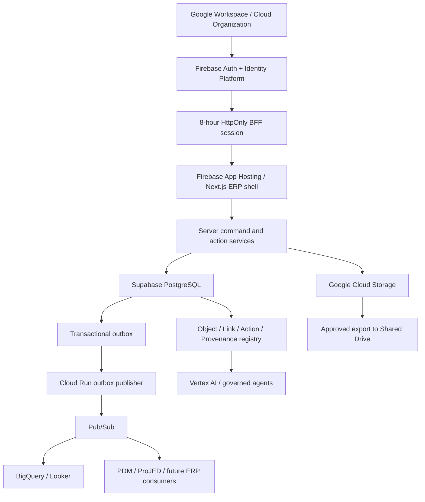

# SPEC-PDM-ERP-GOOGLE-SUPABASE-001 - Legacy Google/Supabase five-year ERP and ontology platform

Date: 2026-07-13
Status: Superseded by `SPEC-PDM-ERP-GOOGLE-CLOUDSQL-002`; retained at the legacy path for traceability
DEV: `DEV-PDM-ERP-GOOGLE-SUPABASE-001` / `DEV-046`
ADR: `.ai-doc/decisions/ADR-PDM-ERP-PLATFORM-001-google-control-plane-supabase-postgres.md`
QA: `.ai-doc/qa/qa-pdm-erp-google-supabase-platform-validation-plan-2026-07-13.md`

> Current authority: `.ai-doc/decisions/ADR-PDM-ERP-PLATFORM-002-google-taiwan-cloud-sql-production.md` and `.ai-doc/specs/SPEC-PDM-ERP-GOOGLE-CLOUDSQL-002-five-year-platform-ontology-roadmap.md`. Every lower reference in this legacy document to Supabase staging/production, cross-cloud placement or an 18-month Supabase-to-Cloud-SQL gate is historical and non-normative.

## Human Decision Brief

Confirmed `1B / 2A / 3A`:

- Supabase PostgreSQL is used first; an 18-month evidence gate decides whether to remain or move to Cloud SQL.
- Firebase Authentication with Identity Platform is the single shared IAM.
- Google Cloud Storage is the authoritative PDM binary store; Shared Drive is delivery/collaboration only.

Confirmed by RD completeness review `1A / 2B / 3A`:

- Firebase terminates at the Next.js BFF. Browsers never use Firebase JWTs to read or write operational Supabase APIs; third-party Firebase Auth remains unconfigured until a separately approved direct-read/Realtime use case exists.
- Operational continuity is RPO <= 1 hour and RTO <= 4 hours with seven-day PITR. Weekly independent logical backup provides catastrophic-project full-DB RPO <= 7 days/RTO <= 1 business day; an hourly append-only control ledger prevents silent official-number reuse. GCS uses 30-day soft delete, cross-project object backup and quarterly isolated restore drills.
- Admin/Approver roles use TOTP MFA; two independent hardware-key break-glass cloud administrators exist; application sessions last at most eight hours; Firebase-managed action email is the initial delivery family, later refined to email-link invitation/password linking and reset-only recovery.

Confirmed by the third RD completeness review `1A / 2C / 3A`:

- Phase 3A launches the official-numbering/draft production slice on App Hosting + Firebase/BFF + Supabase PostgreSQL while every file workflow remains closed; GCS PDM file migration and pointer cutover move to Phase 3B.
- Existing PDM and already-implemented platform tables remain explicitly qualified in locked-down `public`; all new post-DEV-046 platform/ontology/integration tables use bounded schemas. Legacy migration is a separate post-pilot DEV.
- The first ontology MVP is AI_PDM-owned Drawing -> Part -> BOM traceability. Project/Equipment integration waits for a ProJED-owned contract.

Fourth RD completeness review defaults adopted under HCS `1B / 2A / 3A` after the user said to continue:

- Phase 3A uses a named-user production canary. `DEV-FIELD-001` executes after the controlled deploy and blocks wider opening/pilot acceptance, not the first canary deployment.
- PostgreSQL outage is fully fail closed for official numbering; there is no paper/Excel/offline issuance or later backfill path in the first version.
- A non-Google invite uses a Firebase-managed email sign-in link, then canonical invitation validation and password credential linking while freshly authenticated.

Fixed business constraints:

- Current PDM IDs, audit attribution and controlled-object history remain stable.
- AI_PDM and ProJED remain separate owner modules; this task does not modify ProJED.
- First production value remains official numbering, drafts and required account governance, not complete ERP production readiness.
- Google and non-Google users map to one stable platform principal model.
- Google Workspace ownership does not imply free Google Cloud usage; Cloud Billing and Supabase billing remain controlled external costs.

AI engineering assumptions:

- Firebase App Hosting production region is `asia-east1` unless staging evidence proves another region materially better.
- Supabase production region is the nearest approved hosted region, initially Tokyo.
- One staging and one production operational PostgreSQL project is sufficient through the first 30-person planning horizon.
- Ontology capabilities extend typed domains through registries and projections; they do not introduce a graph database in Phase 1-4.
- One Firebase project/tenant serves internal ERP identities initially; legal-company and work-scope separation stays in PostgreSQL organization/membership contracts. Identity Platform multi-tenancy requires a future external-tenant use case and ADR.
- The first ontology MVP is read-oriented Drawing -> Part -> BOM traceability using only AI_PDM-owned records. Its only write action is a governed request routed to the owning PDM command; Project/Equipment remains deferred until ProJED publishes an owner contract.

Fifth RD completeness review open human gates (do not block Phase 1 local adapters; they block Phase 3A production cutover or later widening):

- `HD-5-1` Existing-account cutover: choose how active `local_password` / `google_oauth` users activate and map Firebase identities, and exactly when legacy login issuance stops. No production coexistence policy is assumed.
- `HD-5-2` Canary expansion: choose whether a passed 3-5-user field gate opens directly to all internal users or advances through a second bounded wave.
- `HD-5-3` Data placement: explicitly accept or reject the initial split in which application/file services use Google Taiwan where supported while Supabase PostgreSQL is hosted in the approved nearest region, initially Tokyo, with work identity and controlled PDM metadata crossing that boundary.

## Problem

The current system has a valid provider-neutral PDM foundation, but its target architecture still names Supabase Auth and Supabase Storage as future authorities. That conflicts with the new Google-first decision and would create duplicate IAM and file authorities if implementation continued without amendment.

A five-year architecture also needs more than hosting. It must provide stable identity, organization, object, relationship, action, event, audit, provenance and analytics boundaries so PDM, project management and later ERP modules can interoperate without sharing table ownership.

## Goals

- Deploy Next.js through Firebase App Hosting and a company-owned ERP domain.
- Replace the future Supabase Auth target with Firebase Auth/Identity Platform while preserving stable PDM IDs.
- Keep Supabase PostgreSQL as the initial operational relational authority.
- Replace the future Supabase Storage target with private GCS buckets and a provider-neutral storage contract.
- Keep GCS as the file end state without making file migration a blocker for the first official-numbering/draft production slice.
- Publish transactional outbox events to Google services only after a real consumer exists.
- Establish an ontology-ready object/link/action/provenance layer without premature generic modeling.
- Define measurable gates through the 18-month and five-year horizons.

## Non-Goals

- No production deploy, DNS, provider project, billing activation, credential or live migration this turn.
- No ProJED code/data/deployment changes.
- No Firestore operational ERP authority.
- No automatic Workspace-domain signup or Google-group-to-role authorization.
- No bidirectional Drive sync or Drive backup authority.
- No Palantir clone, graph database, Kubernetes or microservice program.
- No AI agent with direct database write credentials.

## End-State Architecture



## Architecture Memory Capsule

### Authority Matrix

| Concern | Authority | Explicitly not authority |
|---|---|---|
| Employee directory | Google Workspace / Cloud Identity | email domain in application code |
| Application authentication | Firebase Auth with Identity Platform | Supabase Auth user lifecycle |
| Browser application session | Eight-hour HttpOnly/Secure/SameSite server session + current PostgreSQL account checks | browser-persisted Firebase token as business authorization |
| Business authorization | PostgreSQL role/scope/membership/effective-time data + server policy | Firebase user metadata/custom claim alone |
| Operational relational data | Supabase PostgreSQL | Firestore, BigQuery, browser cache |
| PostgreSQL access | Next.js BFF with pooled TLS least-privilege runtime role | browser Data API, Firebase JWT to Supabase, service-role in client |
| PDM binary bytes | Google Cloud Storage | Supabase Storage, Drive, local filesystem |
| PDM file identity/lifecycle | PostgreSQL metadata | GCS generation alone |
| Collaboration/delivery copy | Google Shared Drive | controlled source or restore authority |
| Analytics | BigQuery curated models | direct unrestricted production queries |
| Cross-module mutation | owner-module command/action API | direct cross-module table write |
| Cross-module event | transactional outbox -> Pub/Sub | browser best-effort event |
| AI action | governed Action API | direct database credentials |

### Invariants

- External provider subject is mapped evidence, never the stable controlled-object actor ID.
- One business action has one transaction owner, one audit outcome and at most one logical event.
- Provider, bucket, key and generation are storage locations; content hash and domain identity remain independently verifiable.
- Every object, relation and action is organization-scoped and versioned.
- Business authorization is evaluated on the server from current state; stale JWT role claims cannot grant access.
- No cloud provider configuration is considered complete without staging evidence and a release gate.

## Core Contracts

### Firebase IAM Adapter

`FirebaseIdentityAdapter` responsibilities:

1. Verify Firebase ID token signature, issuer, audience, expiry, auth time and revocation state using the Admin SDK.
2. Require the configured Firebase project ID; fail closed on missing/mismatched issuer or audience.
3. Resolve `(provider='firebase', provider_subject=firebase_uid)` to a stable platform principal and PDM user mapping.
4. Check current PostgreSQL account, system-role, membership, role/scope and session-invalidation state.
5. Exchange the verified ID token through a same-origin, CSRF-protected endpoint for an HttpOnly, Secure, SameSite application session with an eight-hour absolute expiry; clear client Firebase persistence/token state after exchange.
6. Record login/link/reject/logout/session-revoke audit without raw token, password or provider secret.
7. Require verified email and TOTP completion before an Admin/Approver session is issued; lower-risk roles do not require MFA in the first rollout.
8. On suspend/offboard, use a deny-first saga rather than claiming a cross-provider ACID transaction: the PostgreSQL transaction first disables the principal/session boundary, advances session invalidation, records audit and enqueues an idempotent Firebase-revocation job. Access remains denied after that commit even if Firebase is unavailable; refresh-token revocation retries with incident evidence until confirmed.

Internal Workspace login and invited non-Google login converge on the same mapping path. Account linking requires an explicit invitation or Admin action; equal email does not merge principals automatically. Non-Google invitation uses Firebase-managed email-link sign-in with limited pilot customization. Admin SDK link generation plus an unspecified mail sender is not treated as Firebase-managed delivery.

Two hardware-key-protected, non-federated break-glass cloud administrator accounts are held by different named people. They have no ordinary PDM business role, are tested quarterly, and require incident reason, start/end time, actions and credential/access review evidence after use.

Cloud break-glass and PDM privileged-factor recovery are different controls. Cloud break-glass accounts cannot map to `users`/`auth_identities` or mint `pdm_session`; two-person PDM TOTP recovery uses authorized provider administration only after the target business principal is denied in PostgreSQL and provider sessions are revoked.

### PostgreSQL BFF Boundary

- Browser bundles contain no Supabase URL/key intended for operational table access and no PostgreSQL credential.
- Next.js server code uses the existing async repository boundary with a pooled TLS connection suitable for serverless/container concurrency. Pool size, acquisition timeout and statement timeout are explicit environment configuration with conservative staging defaults.
- The runtime database role is non-owner, has no `BYPASSRLS`, no schema DDL and only the table/sequence/function grants required by owned repositories.
- `public` Data API exposure is allowlist-empty for controlled base tables; `anon` and `authenticated` retain no base-table grants. RLS/default-deny remains defense in depth.
- Every controlled transaction derives actor and organization from the verified application session, runs the owner command, mutation, audit, receipt and outbox atomically, and never trusts body-supplied actor/company context.
- Supabase third-party Firebase Auth, Storage and Realtime are not configured in Phase 1-3. A named direct-read/Realtime use case requires a new ADR, threat model, grant/RLS matrix and browser QC.

### Additive Identity and Session Contract

- Extend `auth_identities.provider` with `firebase`; keep `local_password`, `google_oauth` and `invite` readable during transition. Existing identity rows and stable `users.id` values are never rewritten merely because Firebase is introduced.
- `provider_subject` stores Firebase UID; `(provider, provider_subject)` and `(user_id, provider)` remain unique. Equal email without approved invitation/link evidence creates a collision case, not an automatic merge.
- The existing `pdm_session` server cookie remains the application session boundary in Phase 1. Its production maximum changes from 400 days to eight hours; payload remains minimal, signed server-side and checked against `session_invalid_before`, active account, system-role and current permission state on every request.
- Firebase ID/refresh tokens are used only during same-origin login exchange and are not persisted in application DB, cookie, local storage, logs or audit. Logout clears the PDM cookie; suspend/offboard also revokes Firebase refresh tokens and advances PostgreSQL invalidation.
- An Admin/Approver who has valid first-factor credentials but lacks TOTP receives only a 15-minute, route-restricted `mfa_enrollment` transaction state. It can access enrollment/verification/logout only and cannot call business APIs.
- Existing `account_invitations` remains the canonical business invitation. For a non-Google user, the server requests a Firebase-managed `EMAIL_SIGNIN` link bound to the exact normalized invitation email and an opaque, one-time safe continue state; the email is never trusted from URL state alone.
- Completing the Firebase email link proves control of the email but grants only a short-lived, route-restricted invitation-setup state. The BFF verifies the fresh Firebase token, exact invitation/email, expiry/revocation and collision rules; no PDM business session exists yet.
- While freshly authenticated, the user sets a password and links an `EmailAuthProvider` credential to the same Firebase UID. A new fresh token is then exchanged; the server atomically consumes the invitation, maps the UID to the stable principal/PDM user and issues the normal application session. Failure remains retryable/revocable without creating a second principal or accepting by email alone.
- Password-reset OOB email is recovery-only after activation. Email-link replay, invitation replay, UID/email mismatch, expired/revoked invitation or existing conflicting identity fails closed and records redacted evidence.
- Invitation setup state expires after 15 minutes, is single-use and stores only hashed nonce/state plus invitation ID, Firebase UID, timestamps, bounded attempts and terminal reason. The browser may hold the password only long enough to call Firebase credential linking; AI_PDM never receives or stores the plaintext password, email-link URL or OOB code.
- An email-link-created Firebase UID that cannot complete canonical mapping has no PDM access. Expired/revoked orphan identities are disabled or deleted by an idempotent compensation job after the evidence-retention window; cleanup can never delete an already mapped UID.
- Break-glass cloud accounts are outside `users` and `auth_identities`; they cannot obtain a PDM session or business role.

Session assurance contract:

- `pdm_session` v2 signed payload contains only `sessionId`, stable `userId`, mapped `identityId`, `issuedAt`, absolute `expiresAt`, Firebase `authTime`, `assuranceLevel` (`aal1` or `aal2`) and `sessionVersion=2`. It contains no email, role, organization list, Firebase token or authorization claim.
- Session exchange accepts only a freshly authenticated Firebase ID token (`auth_time` within five minutes), verifies project/issuer/audience/revocation, and records a ten-minute hash-only `auth_session_exchange_receipt`. Reusing the same token hash cannot mint a second session.
- `aal2` is issued only when the Firebase adapter verifies a TOTP second-factor sign-in. Admin/Approver access requires current PostgreSQL role plus `aal2`; promotion to a privileged role invalidates existing `aal1` sessions and requires reauthentication.
- `mfa_enrollment` state stores only a hash-only nonce, Firebase UID mapping, intended stable user, created/expiry/consumed times and bounded attempt count. It expires in 15 minutes, is single-use and authorizes only enrollment verification, cancellation and logout.
- Additive Phase 1 schema includes `auth_session_exchange_receipts`, `auth_mfa_enrollment_states` and `auth_invitation_setup_states` in the current compatibility boundary. The invitation table has unique active invitation/UID constraints and cannot itself grant a role/session. Retention is short-lived and cleanup is idempotent; raw ID tokens, email-link/OOB codes, passwords and TOTP secrets are never persisted by AI_PDM.
- Lost-factor recovery for an Admin/Approver is incident-only. A two-person break-glass runbook first advances PostgreSQL session invalidation and revokes provider refresh tokens, then removes the affected Firebase factor through an audited provider operation. The next first-factor login receives only restricted MFA enrollment state; email/password reset alone never restores privileged access. Both named operators, reason, target UID/user, timestamps and post-recovery review are evidence.
- `pdm_session` v2 signing keys live only in Secret Manager/versioned server configuration. The cookie carries a non-secret key ID; only the current key signs, while the immediately previous key may verify for no longer than the eight-hour absolute session lifetime plus bounded clock skew. Rotate at least every 90 days and after suspected disclosure or platform-owner handover. Emergency rotation disables the compromised key immediately and advances the global/account invalidation boundary; raw key material never enters PostgreSQL, logs, audit or client bundles.
- Phase 3A requires a complete identity-cutover manifest for every active pilot account: stable `users.id`, legacy provider/subject fingerprint, intended Firebase UID/provider, collision result, activation status and final disposition. Equal email cannot fill missing mappings. Legacy login endpoints, token issuance and password-recovery paths must be explicitly `closed`, or covered by a user-approved time-boxed coexistence decision; an unspecified hybrid state is a no-go.

### GCS Storage Adapter

`GoogleCloudStorageProviderV2` extends, rather than silently pretending to satisfy, the existing server-buffer provider contract.

Required service operations:

| Operation | Contract |
|---|---|
| `createUploadIntent` | Authorize actor/org/entity, validate quota/type/size/lifecycle, reserve immutable bucket/key, require `ifGenerationMatch=0`, return short-lived signed upload URL and pending intent only |
| `finalizeUpload` | Idempotently stat exact generation, verify size/MIME/CRC32C, stream or worker-compute SHA-256, then atomically create the controlled pointer/audit/outbox |
| `createDownloadUrl` | Authorize current actor/purpose, bind exact bucket/key/generation, short TTL, audited receipt, no credential disclosure |
| `quarantineOrExpireIntent` | Mark failed/mismatched/expired upload non-authoritative and schedule object cleanup without creating a controlled pointer |
| `exportToDrive` | Copy only an approved exact generation and retain source hash/generation plus delivery receipt; never reverse-sync |

Upload-intent state machine:

```text
pending -> verifying -> finalized
pending/verifying -> quarantined
pending -> expired
pending -> cancelled
```

`finalized`, `quarantined`, `expired` and `cancelled` are terminal. Repeating finalize with the same idempotency key and generation returns the first outcome; a different generation or payload fails closed.

Storage rules:

- private buckets only
- immutable object key containing organization/domain/stable file ID/version, not untrusted raw filenames
- upload intent issued after authorization, quota, extension/MIME/size and lifecycle validation
- short-lived V4 signed upload/download URLs
- finalize step verifies object generation, size, content type and server-computed or independently verified content hash
- PostgreSQL pointer stores `provider='gcs'`, bucket, key, generation, metageneration where used, SHA-256, CRC32C, size, MIME and lifecycle status
- no overwrite/delete of controlled released objects through a generic API
- primary buckets use 30-day soft delete and lifecycle rules configured outside browser control; irreversible Bucket Lock waits for a legal retention decision
- new/changed controlled objects replicate to a separate backup project with no delete propagation and no application-runtime delete permission
- Drive export records source generation/hash and export receipt; no reverse synchronization

Existing `supabase_storage` and local pointers remain readable migration sources. A production pointer switch is separately release-gated.

### Additive Storage Data Contract

Phase 1 adds local/PostgreSQL/Supabase-mirror migrations but does not apply them to a live target:

- Extend `storage_provider` constraints with `gcs` on `submission_files`, `release_packages`, `file_assets` and `file_derivatives`.
- Add nullable `storage_bucket`, `storage_generation`, `storage_metageneration`, `storage_crc32c` and verified-hash timestamp fields where absent; existing rows remain valid and unchanged.
- Add `file_upload_intents` with stable ID, organization/actor/entity/file role, bucket/key, expected size/MIME/SHA-256, observed generation/CRC32C, state, idempotency key, expiry, terminal reason, row version and timestamps.
- Unique active intent key is organization + owner entity + idempotency key. Exact bucket/key/generation is unique once finalized.
- No generic public upload route becomes a domain-authority shortcut. Owner-module APIs call the storage intent/finalize application service after their own permission and lifecycle checks.
- Existing v1 `putObject(Buffer)` remains local/test and migration compatibility only; it cannot select `gcs` in production.

Hash/finalize execution contract:

- Phase 1 does not raise the existing default 50 MiB upload policy. Owner-module policy remains authoritative for lower limits and allowed file types.
- Upload intent TTL defaults to 60 minutes; signed upload/download URL TTL defaults to 15 minutes and cannot exceed 60 minutes without a new security decision.
- Objects up to 16 MiB may be stream-hashed in the finalize worker invocation. Larger accepted objects use a queued streaming SHA-256 verification job; neither path buffers the entire GCS object in application memory.
- A verification attempt is bounded to 10 minutes and retries at most three times with exponential backoff. Retryable provider/timeouts remain `verifying`; deterministic size/MIME/generation/checksum mismatch becomes `quarantined`; exhausted transient failures become terminal `quarantined` with a safe retry-new-intent action.
- UI states are `上傳中`, `檔案驗證中`, `檔案可用`, `檔案驗證失敗`, and `上傳已逾時`. Only `檔案可用` corresponds to a controlled pointer; refresh/retry cannot create a second pointer.

### Operational PostgreSQL Layout

Transition contract:

- Existing PDM tables and already-implemented `platform_*`/outbox tables stay in locked-down `public` through Phase 3A. Repository SQL must explicitly qualify them as `public.<table>` when touched by DEV-046; no production-slice migration renames or moves them.
- New post-DEV-046 platform tables use `platform`, new ontology registry/relation/provenance tables use `ontology`, and new cross-module delivery/checkpoint tables use `integration`.
- AI_PDM does not create a production `project` schema. Future ProJED integration owns its command/event contract and may receive projections in `integration` or a separately approved project-owned schema.
- New-schema queries are schema-qualified. Runtime correctness and authorization cannot depend on a mutable broad `search_path`; migrations set an explicit local path and verify object ownership after creation.
- The application runtime role receives only explicit `USAGE` plus table/sequence/function grants for owned repositories. `anon`, `authenticated` and `PUBLIC` receive no usage or base-table grants on bounded schemas.
- Public/Data API exposure is allowlist-empty for controlled base tables. RLS/default-deny remains defense in depth. Server transaction repositories remain canonical for controlled mutations.
- Post-pilot migration of legacy `public` tables is tracked by `DEV-047`. That DEV must inventory SQL/repositories/functions/FKs/views/scripts, rehearse schema moves, define compatibility behavior and rollback, and cannot be inferred from Phase 1 completion.

Target bounded schemas:

- `platform`: future principals, organizations, memberships, object registry and action definitions
- `ontology`: relation types, object relations and provenance
- `integration`: future delivery attempts, consumer checkpoints and cross-module projections
- `pdm`: reserved end-state destination for a future `DEV-047` migration; not created as a duplicate set of PDM tables in Phase 1

### Observability and Incident Contract

- The operating model is business-hours support in `Asia/Taipei`, not a claimed 24/7 on-call service. Severity-1 security/data-loss/complete production-slice outage alerts are still delivered immediately to two named platform owners; business-hours acknowledgement target is 30 minutes. Severity-2 degradation target is four business hours.
- Cloud/App Hosting operational logs retain 90 days by default. Security incident evidence retains at least one year. Controlled business audit remains in PostgreSQL under existing PDM governance until a legal/quality retention decision replaces it; technical logs never substitute for business audit.
- Alert conditions include login failure spikes, privileged MFA bypass attempt, PostgreSQL connection/pool exhaustion, failed migration checksum, hourly control-ledger age > 2 hours, PITR disabled/unhealthy, GCS backup lag > 1 hour, two consecutive backup job failures, and upload verification queue oldest age > 30 minutes.
- PostgreSQL unavailability is fail closed. The UI shows a Traditional Chinese unavailable/read-only state and does not allocate, reserve or record official numbers offline. Manual spreadsheet/paper numbering and later backfill are prohibited unless a future ADR defines a disjoint emergency namespace.
- Every alert/incident records severity, affected environment/tenant, first/last observation, owner, user impact, evidence links, containment, recovery time and follow-up action without secrets or raw tokens.

### Numbering Continuity Ledger

- Every successful official-number transaction already commits the business record, audit, receipt and outbox atomically. An hourly read-only export writes only committed issuance facts to the backup project: organization, sequence kind, exact formatted number, stable record ID, committed time, receipt/audit/outbox IDs, schema/migration version, sequence high-water mark and previous-manifest hash. It contains no free-text reason, email or credential.
- Each immutable JSONL batch and manifest has SHA-256, prior-manifest chaining, exact source checkpoint and a Cloud KMS asymmetric signature. The backup-project object generation/retention receipt is recorded; overwrite/delete is denied to the application runtime. Missing/late/invalid signature or chain age over two hours is Severity 1 and blocks continued official numbering until disposition.
- Catastrophic restore verifies the complete manifest/signature chain against the restored database before numbering reopens. Any signed issued number missing from the restored business tables is inserted only into schema-qualified `public.numbering_recovery_reservations` through the recovery gate, with organization/sequence/number/source-record/ledger-batch uniqueness and audit evidence. Allocation/recycle logic must treat that reservation as permanently consumed.
- A recovery reservation prevents reuse but does not fabricate the lost business record or count as user/manual backfill. Reconstructing business content requires a separately approved data-recovery decision; numbering stays closed until ledger reconciliation and sequence high-water marks pass.

### Ontology Minimum Model

Additive platform contracts, implemented only in later phases:

| Contract | Minimum fields / rule |
|---|---|
| `platform_object_registry` | `id`, `organization_id`, `object_type`, `owner_domain`, `native_id`, `state`, `row_version`, timestamps; unique owner-domain/native identity |
| `ontology_relation_types` | stable type/version, source/target object types, cardinality, inverse label, owner, status |
| `ontology_object_relations` | source/target registry IDs, relation type/version, valid/system time, provenance, state, row version |
| `platform_action_definitions` | stable action/version, owner domain, input/output schema refs, required permission, risk level, idempotency policy |
| `platform_action_executions` | actor/org/action/object, correlation/idempotency IDs, safe input hash, outcome, audit/event refs |
| `platform_provenance_refs` | source system/object/version, observed/effective time, evidence URI/hash, confidence where applicable |

Typed domain tables remain the source of properties. Registry and relation records cannot silently mutate domain rows.

### Event Publication

- A publisher claims pending outbox rows using existing claim/ack/fail semantics.
- Pub/Sub message key is the stable event ID; schema version and organization ID are mandatory.
- Publisher retry cannot create a second logical event.
- Consumer checkpoint is idempotent and domain-owned.
- No personal free-text reason, credential, signed URL or provider token enters an event.
- Pub/Sub is not introduced until at least one named consumer and delivery SLO exist.

## Phase Roadmap and RD Handoff

### Phase 0 - Architecture decision package

Status: Complete this turn.

Deliverables: ADR, SPEC, QA, supersession map, DEV-046 and documentation-map entry.

Acceptance: all four decision rounds (`1B / 2A / 3A`, `1A / 2B / 3A`, `1A / 2C / 3A`, and adopted HCS defaults `1B / 2A / 3A`) are discoverable; old target ADRs are explicitly superseded without erasing historical evidence; Phase 1 has explicit identity/session, DB, GCS v2, schema, failure and QA contracts.

### Phase 1 - Local Google provider adapters

Status: `RD Implementation Ready / Not Requested This Turn`.

Scope:

- Add Firebase Admin verification behind the provider-neutral auth boundary.
- Add eight-hour BFF session exchange, verified-email/TOTP role gate, deny-first offboarding/revocation saga, Firebase email-link invitation setup/password-link contract and break-glass evidence model.
- Add the GCS v2 intent/finalize/download/quarantine/export provider plus additive storage-pointer/upload-intent migrations for SQLite/PostgreSQL/Supabase mirrors.
- Add App Hosting build/runtime configuration with secret references and no live values.
- Add server-only PostgreSQL boundary, pool/role configuration contract and Data API/grant denial tests; do not configure Supabase third-party Firebase Auth.
- Add schema-qualified `public.numbering_recovery_reservations`, allocation/recycle denial and signed-ledger fixture/reconciliation contracts without running a live backup job.
- Add GCS signed URL/finalize/hash/generation/idempotency/state tests using fakes/emulators.
- Keep current managed auth/local storage paths available for local compatibility; no production pointer change.

Implementation surfaces:

- Existing boundaries to extend: `src/lib/auth.ts`, `src/lib/auth-async.ts`, `src/lib/repositories/auth-identity-async-repository.ts`, `src/lib/file-storage.ts`, provider-aware file response/upload call sites, `db/schema.sql`, PostgreSQL mirror SQL, Supabase migration manifest and runtime migration QC.
- Expected focused modules: Firebase token/session adapter, Firebase action-email adapter, GCS v2 provider, upload-intent service/repository and server-only DB boundary verifier. Names may follow local conventions, but auth, storage and domain authorization remain separate modules.
- Expected UI/routes: same-origin `POST /api/auth/firebase/session`, `POST /api/auth/firebase/logout`, restricted MFA enrollment/challenge surface, Firebase email-link completion plus password-link setup surface, and existing invitation/account-recovery entrypoints adapted without creating a second account console.
- Expected dependencies: pinned `firebase`, `firebase-admin` and `@google-cloud/storage` versions with lockfile update. Do not add `supabase-js` merely for PostgreSQL access. Use the existing `pg` repository runtime.
- Migration work follows the repository's SQLite/PostgreSQL/Supabase mirror convention. During implementation, discover the Supabase CLI migration command with `--help`; do not invent or apply a live migration in Phase 1.
- Focused QC entrypoint: add one DEV-046 local suite covering identity/session, BFF denial, GCS state/schema and secret/import boundaries, then run relevant DEV-044/045/storage/Supabase migration regressions.

Acceptance: mocked/emulated Google and Supabase integration passes; no live project, billing, credential, data or provider cutover is required.

Stop conditions: implementation would expose service credentials, require live cost activation, rewrite stable IDs, bypass server authorization or modify ProJED.

### Phase 2 - Staging platform integration

Status: `RD Contract Ready / Blocked Human Re-entry` for external cost and credentials.

Scope:

- Company-owned Google Cloud Organization/folder/projects and central billing labels/budgets.
- Firebase staging project, App Hosting `asia-east1`, Identity Platform, TOTP, managed email-link sign-in, staging domain and Secret Manager.
- Supabase staging pooled TLS PostgreSQL runtime role, explicit grants, unexposed Data API and default-deny RLS.
- GCS staging primary/backup-project buckets, workload service identities, signed URL, 30-day soft-delete, no-delete replication and lifecycle policies.
- Identity mapping dry-run, invitation/account-link staging flow and non-Google account path.
- Cross-cloud latency and failure-mode measurements.
- Seven-day production PITR cost approval, weekly logical-backup rehearsal and isolated database/file restore drill.

Entry: named owners, approved billing account, project IDs, domains, budget limits, staging data and credential boundary.

Acceptance: staging login/storage/data isolation and rollback proof pass; production remains unchanged.

### Phase 3A - Official-numbering/draft platform production slice

Status: `RD Contract Ready / Release Gate Required`.

Scope: production App Hosting/domain, Firebase IAM migration, identity-cutover manifest and legacy-login closure, eight-hour BFF sessions with signing-key rotation, TOTP, managed email-link invitation/password linking, Supabase PostgreSQL runtime, PITR/logical backup/hourly control ledger, central offboarding and post-cutover account validation for the existing official-numbering/draft production slice.

Entry for Phase 3A.0 controlled canary: Phase 1-2 evidence, DEV-032 release instruction, production target confirmation, data inventory, migration/rollback owner, approved `HD-5-1` identity-cutover policy, complete pilot identity-cutover manifest, named 3-5-user allowlist, ready field-test script/evidence owner/issue intake, and all technical/security/continuity pre-deploy gates. Completed field-test evidence is not required before the canary exists.

Phase 3A.0 acceptance: only named canary users can enter; invited Google/non-Google users retain one stable principal/PDM identity; Admin/Approver cannot operate without TOTP; two break-glass paths pass evidence review; no controlled history rewrite; all old sessions fail closed; operational PITR restore meets RPO <= 1 hour/RTO <= 4 hours; catastrophic-project restore separately meets full-DB RPO <= 7 days/RTO <= 1 business day with hourly control-ledger evidence preventing silent official-number reuse; release rollback evidence exists.

Phase 3A.1 field acceptance: the named users execute `DEV-FIELD-001` on the canary, defects enter the governed issue path, and an accountable owner signs go/no-go. Until it passes, the allowlist cannot expand and the pilot cannot be reported accepted. After it passes, expansion follows the approved `HD-5-2` policy rather than opening automatically. A P0 security/data-integrity defect triggers rollback or access closure; lower-severity defects require a time-bounded disposition.

Canary access contract:

- Server-only `PDM_PRODUCTION_CANARY_USER_IDS` contains exact stable PDM `users.id` values; email, role, domain and wildcard entries are invalid. Missing, malformed or empty configuration denies every business session/command rather than opening access.
- The current allowlist is checked when issuing the BFF session and again by the production-slice capability guard on every business request, so removing a user takes effect without waiting for the eight-hour cookie to expire.
- The release evidence records the sorted allowlist hash and named owner. Adding/removing users, disabling canary mode or reporting pilot acceptance is a release/configuration change with audit and explicit go/no-go; a successful smoke cannot expand it automatically.

File boundary: GCS PDM provider configuration remains disabled/dormant, existing file pointers are unchanged, and every upload/preview/release/file API or UI outside the official-numbering/draft allowlist remains fail-closed. Phase 3A success cannot be reported as PDM file-platform production readiness.

### Phase 3B - GCS PDM file authority cutover

Status: `RD Contract Ready / Release Gate Required / Not a Phase 3A blocker`.

Entry: Phase 3A stable, Phase 1 GCS v2 QC passed, file inventory/eligibility policy approved, GCS primary/backup resources and restore evidence ready, and an explicit instruction to open at least one production file workflow.

Migration contract:

1. Inventory every eligible legacy pointer, byte source, owner entity, size and SHA-256; unresolved/missing/conflicting objects block only their approved exception set.
2. Pre-copy to immutable GCS keys with no pointer mutation. Verify exact generation, size, CRC32C and server-computed SHA-256; replicate to the backup project and verify the receipt.
3. Keep all production file workflows closed, run a final delta inventory, and require zero unapproved mismatch.
4. Transactionally update eligible provider pointers to exact GCS bucket/key/generation/hash while preserving legacy source evidence and migration batch/receipt IDs.
5. Run provider-aware read/download/preview/package smoke while file writes remain closed. If it fails, restore the prior pointers because no production file write has occurred.
6. Open only the explicitly released file workflows after smoke acceptance. Any later rollback first closes file writes and uses a separately approved reverse-copy/fix-forward decision; it never silently resumes stale legacy authority.

Acceptance: every switched pointer has source/copy/backup/hash/generation evidence; no long-term dual-primary write path exists; Drive remains export-only; file workflow UI/API opens only after pointer, permission, recovery and visible-error QC pass.

### Phase 4 - ERP integration and ontology MVP

Status: `RD Contract Ready / Not Requested This Turn`.

First use case: read-oriented Drawing -> Part -> BOM traceability for impact discovery using only AI_PDM-owned controlled records.

Scope:

- ERP shell navigation and shared principal/organization contract.
- First object registry for Drawing, Part and BOM/BOM revision with owner-domain/native-ID uniqueness and bitemporal relation evidence.
- First typed links: `drawing_defines_part`, `bom_contains_part`, `part_has_bom` and the existing governed assembly/part relationship projection.
- First actions: `view_traceability` (read) and `request_pdm_change` (write request delegated to the existing PDM command/approval boundary). Registry rows cannot mutate PDM rows.
- First Cloud Run outbox publisher and named `pdm_traceability_projection` Pub/Sub/BigQuery consumer with event-to-projection p95 <= 5 minutes and idempotent replay.
- Curated BigQuery event/read model.
- Project/Equipment objects and links are excluded. ProJED work requires a separate ProJED repository-owned DEV and source-authority contract.

Entry: production IAM/platform stable, named consumer/use case and delivery SLO.

Acceptance: object/link/action identity is deterministic; traceability projection reaches p95 <= 5 minutes; retries do not duplicate actions/events; registry/action permission and provenance are visible; modules do not directly own each other's tables.

### Phase 5 - 18-month PostgreSQL platform review

Status: `RD Contract Ready / Time and Evidence Gated`.

Scope: collect and compare latency, cost, availability, restore, support hours, security portability and Google integration friction; issue one decision record.

Acceptance: outcome is `remain_on_supabase`, `prepare_cloud_sql_migration`, or `reassess_in_6_months`, supported by measured evidence. No migration is implied.

### Phase 6 - Years 3-5 ontology and governed AI

Status: `RD Contract Ready / Strategic Roadmap / Not Requested This Turn`.

Scope: expand only through separate domain-owned DEV packages in this order: customer/project/equipment traceability, supplier/procurement, production/quality, service, then finance interfaces. Each package must define typed objects/links/actions, source authority, data classification, retention, human approval and measurable consumer value before schema or AI work starts. Add governed Vertex AI retrieval, recommendations, simulation and Action execution only after the relevant domain package is accepted.

Acceptance: AI answers expose object/provenance/evidence; every write is an authorized Action; ISO/COSO audit can reconstruct actor, object, rule, decision and outcome.

### DEV-047 - Post-pilot legacy schema migration

Status: `RD Contract Ready / Not Requested This Turn`; Phase A inventory is independently executable after a stable Phase 3A pilot, while live schema movement remains release-gated.

Phase A - dependency inventory: produce a machine-readable inventory of legacy `public` tables, sequences, indexes, constraints, FKs, views, materialized views, functions, triggers, grants/RLS, migration history, repository SQL, scripts/QC and external consumers. Acceptance is complete owner/dependency classification with unknown consumers explicitly blocking only their proposed batch.

Phase B - batch design: group objects by owner domain and dependency order; define target schema, qualified SQL, compatibility behavior, lock/downtime estimate, application deployment order and rollback point for every batch. No permanent compatibility view, dual write or broad mutable `search_path` is accepted as an end state.

Phase C - rehearsal: apply and roll back each batch on a disposable PostgreSQL target restored from a representative snapshot; compare schema, grants/RLS, migration history and runtime behavior, including old/new application-version compatibility at the chosen deployment boundary.

Phase D - production release: execute only under a dedicated release instruction with target identity, backup/restore evidence, downtime owner and per-batch go/no-go. Stop after any unexpected lock, dependent object, grant drift, checksum drift or runtime regression; preserve stable IDs/history and never infer permission from schema location.

Evidence: inventory artifact, dependency graph, batch manifest, dry-run/apply/rollback receipts, schema/grant/RLS diff, runtime regression, downtime measurement and release evidence. DEV-047 is not a Phase 3A launch blocker.

## Failure and Recovery Contracts

- Firebase unavailable: existing eight-hour sessions follow bounded policy; new login/link fails closed. Cloud break-glass accounts do not bypass application authentication and cannot act as PDM users.
- Supabase unavailable: controlled writes fail closed; no Firestore fallback writes; UI presents read-only/unavailable state.
- GCS unavailable: metadata mutation and release requiring files fail closed; no Drive fallback upload.
- Pub/Sub unavailable: business transaction remains committed with pending outbox; publisher retries later.
- BigQuery/Vertex unavailable: operational PDM/ERP continues; analytics/AI is degraded, never authoritative.
- Identity mapping collision: quarantine and Admin review; never merge by email alone.
- Partial file upload: unfinalized object is quarantined/expired; no controlled file pointer is created.
- Database recovery: restore PITR/logical backup into an isolated target, verify schema/migration history, numbering uniqueness, account/role state, audit/outbox continuity and file pointers before any release decision.
- GCS primary-project loss: recover exact generations/hashes from the cross-project backup; Shared Drive is never the restore source.

## Deferred Scope Audit

| Scope | Classification | Resume condition |
|---|---|---|
| Local Firebase/GCS adapters | Same Spec Phase 1 | explicit implementation request |
| Google/Firebase/Supabase staging resources, PITR and billing | Blocked Human Re-entry | owner, project, budget, credentials and staging instruction |
| Phase 3A production domain/IAM/DB/deploy/cutover/smoke | Release Gate Required | DEV-032/release instruction and high-risk confirmation |
| Phase 3B GCS file migration/pointer/open-file-workflow | Same Spec Phase + Release Gate Required | Phase 3A stable, explicit file-workflow instruction and migration/recovery evidence |
| ProJED code/data migration | New DEV in ProJED repository | explicit separate instruction |
| Pub/Sub/BigQuery publisher | Same Spec Phase 4 | named consumer and SLO |
| Cloud SQL migration | New DEV only after Phase 5 decision | `prepare_cloud_sql_migration` outcome |
| Graph database/Kubernetes/microservices | No Tracking | rejected until measured scale/SLO proves need |
| Palantir product purchase/integration | Blocked Human Re-entry | commercial evaluation and concrete use case |
| Supabase third-party Firebase Auth / browser Data API / Realtime | New ADR + Blocked Human Re-entry | named direct-read/Realtime use case, threat model and grants/RLS acceptance |
| Identity Platform multi-tenancy | New ADR + Blocked Human Re-entry | external tenant/legal isolation use case that PostgreSQL membership cannot safely satisfy |
| Existing local/Google identity cutover and legacy-login closure | Blocked Human Re-entry `HD-5-1` + Same Spec Phase 3A | approved cutover mode, account manifest, collision disposition, closure/rollback evidence |
| Post-canary user expansion cadence | Blocked Human Re-entry `HD-5-2` + Same Spec Phase 3A.1 | signed field acceptance and approved bounded/full rollout rule |
| Taiwan/nearest-region cross-border data placement | Blocked Human Re-entry `HD-5-3` | owner acceptance, data inventory/classification and provider-region evidence |
| GCS Bucket Lock / formal records retention | Blocked Human Re-entry | approved legal/quality retention schedule and irreversible-lock confirmation |
| Phase 6 domain/AI expansions | New DEV per owner domain | domain owner, source authority, measurable use case and data/approval contract |
| Existing `public` -> bounded schema migration | New DEV `DEV-047` | post-pilot inventory, compatibility/rehearsal/rollback contract and explicit implementation request |
| Project/Equipment ontology links | New ProJED-owned DEV + Blocked Human Re-entry | ProJED source authority, stable IDs, event/read contract and acceptance owner |

## All-Phase Coverage Matrix

| Phase / DEV | Execution boundary | Document status | Scope | Out of scope | Entry condition | Acceptance | Evidence |
|---|---|---|---|---|---|---|---|
| 0 / DEV-046 Architecture | Documentation only | Complete | authority, decisions, contracts, roadmap, QA | product/provider/release | all four decision rounds confirmed/adopted | no unresolved P0/P1 Phase-1 contract gap | ADR/SPEC/QA/map consistency |
| 1 / DEV-046 Local adapters | Local RD, no external resources | RD Implementation Ready / Not Requested | Firebase BFF session, GCS v2, additive migrations, App Hosting config, server-only DB contract | live project/cost/credential/pointer | explicit implementation request | local fixtures/build/security/provider/state gates pass | focused unit/integration/QC report |
| 2 / DEV-046 Staging | External cost/credential gated | RD Contract Ready / Blocked Human Re-entry | staging IAM/BFF/DB/GCS/backup/latency | production data/domain/cutover | named owners, billing, project IDs, credential boundary | isolated staging, backup restore and latency gates pass | staging evidence package |
| 3A.0 / DEV-046 + DEV-032 Controlled canary | Release only | RD Contract Ready / Release Gate Required | domain, IAM cutover/BFF/DB/PITR/backup, named-user official numbering/drafts | wider users, unspecified legacy-login coexistence, all file workflows, GCS pointer cutover, ProJED/ontology | Phase 1-2 QC + release instruction + `HD-5-1`/`HD-5-3` decisions + account manifest + technical gates + ready field-test package | named allowlist, stable history, legacy-login closure, key rotation, TOTP/break-glass separation, RPO/RTO, rollback and smoke pass | pre-deploy/canary release evidence |
| 3A.1 / DEV-038 Field acceptance | Production canary validation | RD Contract Ready / External Evidence Required | 3-5 named users execute official numbering/draft script and issue closure | automatic wider opening or full PDM claim | 3A.0 healthy canary | signed go/no-go; no open P0; P1 disposition accepted; expansion follows `HD-5-2` | field-test report, screenshots, audit and issue evidence |
| 3B / DEV-046 GCS file cutover | Separate release | RD Contract Ready / Not a 3A blocker | inventory/copy/verify/pointer/backup/file workflow opening | unrelated ERP/ProJED | 3A stable + explicit file instruction | exact pointer/hash/generation, no dual writes, recovery/smoke pass | file migration/release evidence |
| 4 / DEV-046 Ontology MVP | Future local/staging RD | RD Contract Ready / Not Requested | Drawing/Part/BOM traceability registry/links/actions/outbox/projection | Project/Equipment, production ProJED mutation, generic EAV | stable platform + named PDM owner/fixtures | deterministic identity, p95 <= 5 min projection, governed action | ontology/event QC report |
| 5 / DEV-046 18-month review | Time/evidence gate | RD Contract Ready | scorecards and decision ADR | automatic migration | 18 months production evidence | threshold-based remain/migrate/reassess decision | signed scorecard and ADR |
| 6 / New domain DEVs | Future program | RD Contract Ready / Strategic Roadmap | sequenced domain ontology and governed AI packages | cross-domain generic schema, direct AI writes | domain owner/use case/data contract per DEV | domain acceptance, provenance and action authorization | domain-owned QA/QC evidence |
| DEV-047 Legacy schema migration | Post-pilot local/staging/release slices | Phase A RD Contract Ready / Not Requested | inventory, design, rehearse and move approved legacy public tables to bounded schemas | launch-time big-bang move | Phase A: stable pilot + explicit instruction; later phases: accepted dependency/batch evidence | complete inventory; no broken SQL/FK/view/script; compatibility and rollback proof | dedicated inventory/migration QA/QC/release evidence |

## Evidence Required

- Provider boundary and secret-leak scans.
- Firebase token issuer/audience/revocation/mapping tests.
- Google and invited email/password identity tests.
- Browser Supabase Data API/Storage/Realtime denial, least-privilege runtime-role and pool/timeout tests.
- GCS signed upload/finalize/hash/generation/retention tests.
- Upload-intent state, idempotency, generation mismatch, quarantine/expiry and migration parity tests.
- Eight-hour session, verified email, TOTP role gate, revocation, two-person break-glass and managed email-link invitation/password-link tests.
- PITR/logical-backup inventory, cross-project GCS backup and quarterly isolated restore evidence against RPO/RTO.
- Signed numbering-ledger chain, stale/invalid alert and missing-issued-number recovery-reservation evidence.
- No Firestore/Supabase Storage/Drive authority fallback tests.
- PostgreSQL transaction/outbox and Pub/Sub idempotency tests when Phase 4 starts.
- Object/link/action/provenance schema and permission tests.
- Desktop/mobile login and recovery UI evidence.
- Staging/release evidence only in their corresponding gates.

## Release Boundary

This document does not authorize production resources, billing, provider configuration, DNS, schema/data/file migration, pointer switch, deploy, merge, PR, rollback or production smoke. Those artifacts are created only after a release-type instruction and high-risk confirmation.
