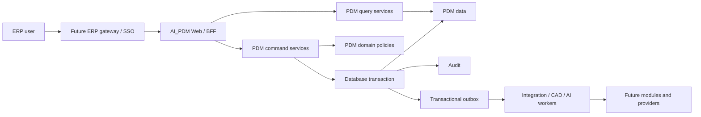

# SPEC-PDM-ERP-MODULE-FOUNDATION-001 - ERP-ready AI_PDM platform contract

Status: Phase 0 Complete; Phase 1 RD Implementation Ready / Not Requested This Turn; later phases captured below
Date: 2026-07-12
Owner: Dev PM
Related DEV: `DEV-PDM-ERP-MODULE-FOUNDATION-001` / `DEV-044`
Related ADR: `.ai-doc/decisions/ADR-PDM-ERP-MODULE-FOUNDATION-001-integration-ready-boundary.md`
Related QA: `.ai-doc/qa/qa-pdm-erp-module-foundation-validation-plan-2026-07-12.md`
Extends: `.ai-doc/specs/SPEC-PDM-ACCESS-CONTROL-001-user-identity-permission-architecture.md`
Extends: `.ai-doc/specs/SPEC-SUPABASE-DB-001-runtime-postgres-migration.md`
Extends: `.ai-doc/specs/SPEC-PDM-PRODUCTION-SLICE-001-official-numbering-draft-launch.md`

## Human Decision Brief

Confirmed decisions:

- AI_PDM will be a PDM module in a future unified ERP experience.
- ProJED may later be the project-management module, but ProJED must not be changed in this task.
- AI_PDM must prepare stable identity, organization, authorization, transaction, audit and integration boundaries.
- The narrow official-numbering / draft production slice remains the first launch objective.
- Unified ERP does not require one process, one deployment or immediate repository merger.

Rejected options:

- Treat current ProJED technology and browser-write model as the ERP parent architecture.
- Replace current AI_PDM login/provider behavior during documentation work.
- Let client state, direct Data API calls or UI guards become business authority.
- Rewrite existing controlled identifiers to match a future ERP model before that model is approved.
- Introduce microservices, an external event broker or cross-repository changes without measured need.

AI assumptions:

- Current AI_PDM Web technology remains Next.js, React and TypeScript.
- PostgreSQL/Supabase remains the target runtime and storage authority under existing PDM decisions.
- Existing `users.id`, `companies.id`, root/drawing/part IDs and audit references remain stable.
- The shared ERP identity provider, canonical person model and final ERP shell are not selected yet.
- Initial use remains 3-5 internal users, but contracts must not hard-code that count.
- This turn is documentation-only; implementation begins only after an explicit `DEV-044 Phase 1` execution request.

Re-entry triggers:

- Any change to ProJED.
- Shared IAM/provider selection, MFA/email-delivery cost or account migration.
- Canonical organization/person semantics that replace current PDM company/user meaning.
- Production migration, deploy, domain routing, provider pointer, credential or direct data mutation.
- Rewriting stable PDM identifiers or historical audit records.

使用思考習慣：#目的、#批判、#系統思維

## Problem

AI_PDM already contains server APIs, repositories, access-control rules, controlled numbering, audit records, SQLite/PostgreSQL parity work and a narrow production slice. It is not yet safe to describe those pieces as a shared ERP platform because:

- authentication and company context are PDM-specific;
- domain rules can still be reached through multiple route/repository paths;
- controlled mutations do not yet share one explicit platform command context;
- cross-module events do not yet have a transactional outbox contract;
- the future ERP organization/person/role model is not approved;
- production runtime still remains behind existing Supabase and release gates.

The required result is not an ERP rewrite. It is an AI_PDM boundary that can integrate later without breaking current numbering/draft delivery.

## Goals

- Make actor, company, authorization, correlation and idempotency explicit at the PDM application boundary.
- Keep controlled business rules out of React components and transport-only route handlers.
- Define atomic audit and future event behavior for controlled mutations.
- Preserve current PDM identities and data while allowing future shared-IAM mapping.
- Define what future modules may read or request from PDM without owning PDM tables.
- Prevent ERP preparation from changing the first production-slice scope.

## Non-Goals

- Building the ERP portal.
- Implementing or migrating ProJED.
- Selecting or cutting over shared ERP Auth.
- Building accounting, payroll, tax, purchasing, inventory or manufacturing ERP modules.
- Moving all AI_PDM code into a monorepo.
- Production deployment, migration or domain cutover.
- Replacing all repositories in one phase.

## End-State Architecture



### Non-negotiable rules

1. PDM controlled data is authoritative on the server/database, not in browser state.
2. Every controlled mutation has one explicit actor and company context.
3. Authorization, domain validation, mutation, audit and outbox enqueue are atomic where they describe one business action.
4. No browser bundle receives privileged database, storage or provider credentials.
5. Another module cannot allocate PDM numbers or mutate PDM lifecycle tables directly.
6. External identity does not replace stable PDM user identity without an approved migration.
7. ProJED remains untouched until a separate cross-project decision and DEV exist.

## Architecture Memory Capsule

### Stable product semantics

- PDM owns root, drawing, part, numbering sequence, revision, PDM file, PDM BOM/baseline, controlled lifecycle and PDM approval semantics.
- Official numbering remains non-recyclable; only explicitly provisional draft reservations can follow their existing controlled-boundary recycle rules.
- Google email or local email is a login identity, not the authorization source.
- Role determines allowed action; scope determines where it applies.
- Company/organization context is mandatory for company-owned PDM data.
- Audit evidence is part of the controlled action, not optional telemetry.

### Current compatibility constraints

- SQLite is still the active local compatibility provider in the current build.
- PostgreSQL/Supabase schema mirrors exist and remain the target runtime.
- Current auth has local-password, invitation and Google identity adapters mapped to stable `users.id`.
- Existing release, production migration and field-test gates remain authoritative.

### Rejected architecture memory

- No browser-authoritative ERP state.
- No browser service role.
- No iframe as final integration.
- No shared global `users.role` as the final ERP authorization model.
- No direct cross-module table writes.
- No immediate microservice or event-broker program.

### Future contract memory

- Shared IAM must map provider identities to a stable platform principal and then to the existing PDM principal during migration.
- Shared organization core must distinguish legal company, operating organization, site/department and project scope before replacing current PDM `company_id` semantics.
- Cross-module events must be versioned, idempotent, company-scoped and non-secret.
- A unified URL/navigation experience does not force modules into one deployment.

## Platform Contracts

### Actor and organization context

Phase 1 introduces a framework-independent contract equivalent to:

```ts
type PlatformActorContext = {
  principalId: string;
  pdmUserId: string;
  organizationId: string;
  roles: string[];
  scopes: string[];
  authProvider: "local_password" | "google_oauth" | "future_shared_iam";
  correlationId: string;
  requestId: string;
};
```

Rules:

- `principalId` and `pdmUserId` may initially be the same stable `users.id`.
- `organizationId` initially maps to current `companies.id`.
- Route handlers obtain this context from one server adapter and pass it to application services.
- Application services must not infer company from request payload when actor context already owns it.
- Client-provided role, company or actor ID is untrusted and cannot override authenticated context.
- The context carries no access token, OAuth token, password hash or provider secret.

### Command contract

Controlled mutations use a command envelope equivalent to:

```ts
type PdmCommand<TPayload> = {
  commandName: string;
  schemaVersion: number;
  idempotencyKey: string;
  actor: PlatformActorContext;
  payload: TPayload;
};
```

Command rules:

- Command names and versions are explicit and stable.
- Idempotency keys are required for number allocation, append, invitation acceptance and future integration retries.
- Route handlers validate transport shape, then delegate to an application service.
- Application services own authorization, transaction, domain policy, audit and outbox behavior.
- Duplicate commands return the prior result or a stable conflict; they cannot allocate twice.

### Query contract

- Query services are read-only and company-scoped.
- Read models may be optimized, but they do not become mutation authority.
- Future modules receive versioned read DTOs or server endpoints, not unrestricted table access.
- Sensitive fields, provider secrets, hashes and internal audit payloads require explicit projection rules.

### Transaction and audit contract

For a controlled command, the transaction order is:

1. Resolve authenticated actor and organization.
2. Authorize action and scope.
3. Validate current state and optimistic version.
4. Reserve idempotency key if applicable.
5. Apply domain mutation.
6. Write immutable audit evidence.
7. Enqueue outbox event when the action has integration meaning.
8. Commit once.

Any failure before commit leaves no partial controlled mutation, audit or outbox event.

### Transactional outbox contract

Phase 2 uses an additive table with at least:

| Field | Requirement |
|---|---|
| `id` | Stable event ID |
| `company_id` | Mandatory tenant/company scope |
| `aggregate_type`, `aggregate_id` | PDM owner reference |
| `event_type`, `schema_version` | Versioned contract |
| `payload_json` | Non-secret event payload |
| `actor_id` | Stable PDM/platform actor reference |
| `correlation_id` | Cross-request trace |
| `idempotency_key` | Unique per logical event |
| `occurred_at` | Business occurrence time |
| `published_at` | Nullable delivery evidence |
| `attempt_count`, `next_attempt_at`, `last_error` | Retry state |

Rules:

- Insert occurs in the authoritative business transaction.
- The browser cannot insert, publish or acknowledge outbox rows.
- Payloads contain stable IDs and business facts, not secrets or signed URLs.
- A worker may publish later; Phase 2 does not require an external broker.
- Retry is at-least-once, so consumers must be idempotent.
- Event retention and external destination are deferred operational decisions.

### Initial event vocabulary

The first vocabulary is contract-only until Phase 2 implementation:

- `pdm.numbering.official_record_created.v1`
- `pdm.numbering.drawing_appended.v1`
- `pdm.numbering.part_appended.v1`
- `pdm.part_draft.created.v1`
- `pdm.part_draft.voided.v1`
- `pdm.part_draft.recycled.v1`
- `pdm.identity.invitation_accepted.v1`

Events do not grant permission and do not instruct another module to edit PDM tables.

## Phase Roadmap and RD Handoff Contracts

### Phase 0 - Architecture decision and documentation

Status: Complete in this turn.

Purpose:

- Fix the AI_PDM ERP module boundary without changing product behavior.

Outputs:

- ADR, this SPEC, QA plan, `dev_task.md` and `documentation_map.md` updates.

Acceptance:

- ProJED is explicitly untouched.
- All future phases, release boundaries and re-entry triggers are recorded.

Evidence:

- Git diff limited to AI_PDM `.ai-doc` files.

### Phase 1 - PDM application boundary hardening

Status: RD Implementation Ready / Not Requested This Turn.

Purpose:

- Add a stable platform context and command boundary without changing current login or user workflows.

Task list:

- [ ] `DEV-044-01` Inventory official-numbering, existing-root append, part-draft, invitation and identity mutation routes; identify route, application, repository and transaction owners.
- [ ] `DEV-044-02` Add framework-independent `PlatformActorContext` and current-auth adapter.
- [ ] `DEV-044-03` Add versioned `PdmCommand` and idempotency contract helpers.
- [ ] `DEV-044-04` Move transport-only decisions out of selected P0 route handlers; preserve current domain predicates and repository transactions.
- [ ] `DEV-044-05` Add a static architecture guard preventing browser imports of server database/provider modules and privileged environment variables.
- [ ] `DEV-044-06` Add focused tests proving actor/company payload spoofing cannot override authenticated context.
- [ ] `DEV-044-07` Produce an RD route ownership inventory and Phase 1 QC report.

Implementation contract:

- Use adapters around current `requireAuth`/managed auth behavior; do not replace sessions or providers.
- Preserve existing API response compatibility unless a stable security error is required.
- Keep current repository/domain predicates as authority; extraction must not duplicate weaker rules.
- Do not add schema or migrate data in Phase 1.
- No ProJED dependency or import is permitted.

Data/API/permission impact:

- No schema change.
- Existing APIs retain behavior.
- Actor/company authorization becomes explicit and centrally testable.

Entry condition:

- Explicit instruction to execute `DEV-044 Phase 1`.

Acceptance:

- Selected P0 mutations receive server-derived actor/company context.
- Payload spoofing is denied and causes no mutation.
- Current numbering/draft/invitation behavior and QC remain passing.
- Client build contains no server credential or privileged DB module.

QA/QC gate:

- Typecheck, lint, build.
- New architecture-boundary QC.
- Existing official-numbering/draft, managed-auth, invitation and Google-identity regression suites.

Stop conditions:

- Any login/provider behavior change.
- Any schema/data migration.
- Any weakened numbering/draft controlled-boundary predicate.
- Any ProJED change.
- Any production/release operation.

Evidence required:

- Route ownership inventory.
- Focused static/runtime QC output.
- Regression command output.
- Source diff showing no client secret exposure.

### Phase 2 - Atomic audit and transactional outbox foundation

Status: RD Contract Ready / Not Requested This Turn.

Purpose:

- Make controlled mutation, audit and integration-event creation atomic for selected P0 commands.

Task list:

- [ ] `DEV-044-08` Add SQLite/PostgreSQL/Supabase-parity outbox and command-idempotency schema.
- [ ] `DEV-044-09` Add repository APIs that participate in the caller's transaction.
- [ ] `DEV-044-10` Convert selected numbering/draft commands to atomic mutation + audit + outbox.
- [ ] `DEV-044-11` Add retry-safe pending-event claim/ack/fail repository contract without external publication.
- [ ] `DEV-044-12` Add migration, RLS/default-deny and direct Data API exposure checks.
- [ ] `DEV-044-13` Add concurrency, rollback, duplicate-command and payload-redaction QC.

Implementation contract:

- Additive migration only.
- SQLite and PostgreSQL behavior must remain semantically equivalent.
- Outbox writes occur inside the same DB transaction as business mutation.
- Browser and normal authenticated Data API roles cannot write/publish outbox rows.
- No external broker, webhook destination or production worker is configured in this phase.

Entry condition:

- Phase 1 QC passes and user requests Phase 2.

Acceptance:

- Failed transaction leaves no business mutation, audit or outbox row.
- Successful selected command produces exactly one audit and at most one logical outbox event.
- Duplicate idempotency key cannot allocate a second official number.
- Event payload contains no token, secret, password hash or signed URL.

QA/QC gate:

- Disposable SQLite/PostgreSQL transaction and concurrency tests.
- Migration manifest/parity/RLS/default-deny checks.
- Existing production-slice and numbering sequence regression.

Stop conditions:

- Existing audit semantics cannot be preserved.
- Schema parity cannot be proven.
- Work requires live migration, production event delivery or data repair.

Evidence required:

- Migration dry-run and shadow evidence.
- Atomic rollback and duplicate-command results.
- Event payload redaction report.

### Phase 3 - Shared ERP core/IAM adapter and identity migration

Status: RD Contract Ready / Blocked Human Re-entry before implementation.

Purpose:

- Connect AI_PDM to an approved shared ERP identity and organization core without rewriting PDM history.

Task list:

- [ ] `DEV-044-14` Approve canonical person, identity, organization, membership and role-assignment model.
- [ ] `DEV-044-15` Select shared identity provider and session/MFA/offboarding policy.
- [ ] `DEV-044-16` Define mapping tables and dual-read migration period for platform principal to PDM user/company.
- [ ] `DEV-044-17` Implement migration tooling with dry-run, collision report and rollback boundary.
- [ ] `DEV-044-18` Reverify invitations, Google identity, local-password users, suspended accounts and historical audit attribution.

Implementation contract:

- Existing PDM `users.id` and controlled-object history remain stable.
- Provider subject/email maps to identity; it is not the authorization key.
- No automatic domain or Google-group authorization.
- Every account collision is reported before migration; ambiguous accounts fail closed.
- Final cutover and session revocation require release gate.

Entry condition:

- Human approval of shared IAM provider, canonical organization/person model, migration owner, email/MFA policy and production timing.
- Phase 2 evidence exists if shared events are required.

Acceptance:

- Google and non-Google users resolve to one stable platform principal and one mapped PDM user.
- Suspended/offboarded users lose new and existing session access according to approved policy.
- Historical audit actor references remain resolvable.
- No duplicate company/person/identity is silently merged.

QA/QC gate:

- Identity collision matrix, invitation/login regression, session revocation, company isolation and audit attribution checks.

Stop conditions:

- Provider, MFA, email, offboarding or organization semantics are not approved.
- Migration requires destructive identifier rewrite.
- ProJED must change as a prerequisite.

Evidence required:

- Approved Human Decision Brief.
- Mapping/collision dry-run.
- Staging identity and company isolation evidence.

### Phase 4 - ERP shell and cross-module integration

Status: RD Contract Ready / Not Requested; ProJED remains outside execution boundary.

Purpose:

- Expose AI_PDM as a module behind a unified ERP navigation and SSO boundary.

Task list:

- [ ] `DEV-044-19` Select gateway/path/subdomain and module navigation contract.
- [ ] `DEV-044-20` Publish versioned PDM read/command/event contracts for approved consumers.
- [ ] `DEV-044-21` Add consumer registration, least-privilege scopes and integration observability.
- [ ] `DEV-044-22` Validate one non-ProJED contract consumer or test double before any ProJED work.
- [ ] `DEV-044-23` Create a separate ProJED-owned DEV only after explicit user approval.

Implementation contract:

- Shared navigation/SSO does not require one deployment.
- No iframe final architecture.
- Consumers cannot directly mutate PDM tables or sequences.
- Contract versions and idempotency are mandatory.
- This AI_PDM phase may expose/test contracts but cannot edit ProJED.

Entry condition:

- Phase 3 shared identity decision and evidence.
- ERP shell ownership and first consumer are approved.

Acceptance:

- User can enter AI_PDM from the ERP shell without a second identity.
- Company and role scope are preserved end to end.
- Cross-module request/event retry does not duplicate controlled PDM actions.
- AI_PDM can deploy independently from another module.

QA/QC gate:

- SSO context, authorization, contract compatibility, retry/idempotency, traceability and independent-deploy checks.

Stop conditions:

- Any direct ProJED modification without a separate approved DEV.
- Any direct table ownership violation.
- Unified navigation requires weakening PDM permission or production-slice gates.

Evidence required:

- Contract tests and compatibility report.
- End-to-end trace/correlation evidence.
- Independent module failure/isolation evidence.

### Phase 5 - Production release/cutover

Status: Release Gate Required.

Purpose:

- Execute only the approved production slice or later approved platform phase.

Boundary:

- Owned by existing `DEV-030`, `DEV-031` and `DEV-032` release gates.
- This SPEC does not contain deployment, rollback or production-smoke procedures.

Entry condition:

- Explicit release command and high-risk confirmation.
- Selected implementation phase has complete QA/QC evidence.

Acceptance/evidence:

- Defined by the release gate at execution time.

## All-Phase Coverage Matrix

| Phase / DEV | Execution boundary | Document status | Scope | Out of scope | Entry condition | Acceptance | Evidence |
|---|---|---|---|---|---|---|---|
| Phase 0 / DEV-044 | This turn | Complete | ADR/SPEC/QA/control-board docs | Product/code/schema | Current user instruction | All decisions/phases captured; ProJED untouched | AI_PDM `.ai-doc` diff |
| Phase 1 / DEV-044 | Future local RD | RD Implementation Ready / Not Requested | actor/org context, command boundary, static guard, route inventory | auth replacement, schema, ProJED, production | Explicit Phase 1 request | explicit server context; spoof denial; regressions pass | focused QC + inventory |
| Phase 2 / DEV-044 | Future local RD | RD Contract Ready / Not Requested | atomic audit/outbox/idempotency schema and repositories | live migration, broker, production publisher | Phase 1 evidence + request | atomicity, dedupe, redaction, parity | shadow/migration/concurrency QC |
| Phase 3 / new IAM child DEV | Future gated | RD Contract Ready / Blocked Human Re-entry | shared identity/org adapter and migration | unapproved provider/cutover | provider/org/migration decisions | one principal mapping; no history rewrite | collision/staging/session evidence |
| Phase 4 / integration child DEV | Future gated | RD Contract Ready / Not Requested | ERP shell and versioned integration contracts | ProJED edits in AI_PDM task | Phase 3 + shell/consumer approval | SSO/scope/idempotency/independent deploy | contract/E2E evidence |
| Phase 5 / DEV-030-032 | Release only | Release Gate Required | approved production execution | undocumented release action | release command + high-risk confirmation | release gate decides | release evidence |
| ProJED follow-up | Separate repository/task | Blocked Human Re-entry | Consume approved shared contract later | Any current ProJED modification | Explicit user approval + separate DEV | Defined in ProJED-owned docs | ProJED-owned evidence |

## Deferred Scope Audit

| Deferred signal | Classification | Tracking decision |
|---|---|---|
| ProJED code/schema/auth/deploy changes | Blocked Human Re-entry | Separate ProJED-owned DEV after explicit approval; no AI_PDM edit may start it |
| Shared ERP IAM/provider selection | New DEV + Blocked Human Re-entry | Phase 3 child DEV after provider/org/MFA/offboarding decisions |
| Canonical ERP person/org/department model | New DEV + Blocked Human Re-entry | Shared core decision before Phase 3 implementation |
| Transactional outbox implementation | Same Spec Phase | Phase 2 contract above |
| External broker/webhook destination | New DEV later | Only after a real consumer and delivery SLO exist |
| ERP shell/domain/subdomain | Same Spec Phase + later release gate | Phase 4 contract; production routing remains release-gated |
| Production migration/deploy/rollback/smoke | Blocked Human Re-entry / Release Gate Required | Existing DEV-030/031/032; no artifacts in this document |
| Accounting/payroll/tax/full ERP | No Tracking in AI_PDM | Not a PDM responsibility; requires separate business/system program |
| Microservices/Kafka | No Tracking | Rejected until measured scale, isolation or team-ownership evidence exists |
| First numbering/draft launch | Existing DEV | Remains DEV-040 + DEV-032 + DEV-038; this SPEC does not expand it |

## RD Readiness Gate Result

### Phase 1

Result: `RD Implementation Ready / Not Requested This Turn`.

No P0/P1 engineering decision remains for the local adapter/boundary slice. Schema, provider, production and user-visible behavior changes are explicitly excluded.

### Phase 2

Result: `RD Contract Ready / Not Requested This Turn`.

Schema, transaction, RLS/default-deny, idempotency, retry and QA contracts are defined. Implementation waits for Phase 1 evidence and an explicit phase request.

### Phase 3

Result: `RD Contract Ready / Blocked Human Re-entry`.

The engineering migration contract is defined, but provider, organization/person semantics, MFA/offboarding, cost and production timing are human decisions.

### Phase 4

Result: `RD Contract Ready / Not Requested This Turn`.

The integration contract is defined. ProJED changes are prohibited until a separate approved task exists.

## Release Boundary

`RD Implementation Ready` does not authorize merge, PR, live migration, deploy, rollback, production smoke or release. Those artifacts remain deferred until a release-type instruction and the existing release gate are active.
