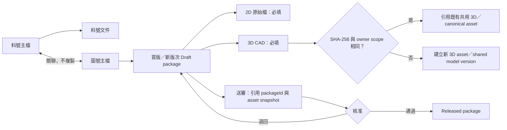

# SPEC-PDM-FILE-OWNERSHIP-001：圖號／料號檔案歸屬、送審必備檔與 3D 共用

> 2026-08-22 DEV-084→DEV-088 Supersession：DEV-084為歷史ID，後續由DEV-088在DEV-087之後重新縮編；2026-08-20提出的附件快照沿用、獨立版本、自由維護、whole-part lease、五表模型與041 migration只保留為歷史設計，尚未取代本文件的現行料號附件authority與`numbering.attachments.manage`規則。DEV-087只直接定義Part附件不進修改案／審核／rollback的即時語意，沿用現行讀寫與permission authority。圖號受控版次檔、canonical content/hash integrity與圖／料分流authority維持不變。

Status: `RD Implementation Ready / Human Confirmed / RD Not Started`
Date: 2026-08-10
Owner: Dev PM
Related DEV: `DEV-061` / `DEV-PDM-FILE-OWNERSHIP-001`
Risk: Medium for local implementation; High for live data deletion or production migration
Related ADR: `.ai-doc/decisions/ADR-PDM-FILE-OWNERSHIP-001-contextual-files-and-3d-content-reuse.md`
Related QA: `.ai-doc/qa/qa-dev-061-pdm-file-ownership-and-3d-reuse-validation-plan-2026-08-10.md`

Related authority:

- `.ai-doc/specs/SPEC-PDM-DRAWING-REVISION-SUBMISSION-001-controlled-revision-package.md`
- `.ai-doc/specs/SPEC-PDM-DRAWING-REVISION-PACKAGE-002-first-class-attachment-package-model.md`
- `.ai-doc/specs/SPEC-PDM-SHARED-3D-MA-BASELINE-001-root-model-and-manufacturing-baseline.md`
- `.ai-doc/specs/SPEC-PDM-UNIFIED-DRAWING-WORKBENCH-001-single-page-lifecycle-workbench.md`
- `.ai-doc/specs/SPEC-PDM-NUMBER-LIFECYCLE-SIMPLIFICATION-001-efficiency-first-bundle-flow.md`
- `.ai-doc/decisions/ADR-PDM-MATERIAL-IDENTITY-REVISION-001-part-number-vs-controlled-definition-revision.md`
- `.ai-doc/specs/SPEC-PDM-PART-ATTACHMENT-REUSE-001-replacement-snapshot-and-part-lock.md`
- `.ai-doc/decisions/ADR-PDM-PART-ATTACHMENT-REUSE-001-snapshot-reference-and-whole-part-lock.md`

## 1. 真正需求與成功條件

### 1.1 真正需求

PDM 使用者的任務不是管理多個附件庫，而是：

1. 從料號找到目前正式圖面並預覽／下載；
2. 在圖號建立首版或新版次；
3. 上傳本次受控 2D／3D，填寫變更原因後送審；
4. 在料號補充不隨圖面版次變動的主文件。

使用者不得被要求選擇檔案要進入「圖號附件、料號附件、版次包或送審附件」。系統必須由所在物件與操作意圖決定歸屬。

### 1.2 可驗收成功狀態

- 圖號頁沒有通用附件新增、附件管理、參考附件或已刪除附件 UI。
- 圖號只有一個受控檔案寫入路徑：`準備首版`或`建立新版次`。
- 料號只有一個精簡的`料號文件`新增入口；關聯圖面只讀取圖號正式檔，不複製。
- 送審按鈕在 2D 原始檔與 3D CAD 任一缺少時不可執行，且顯示具體下一步。
- 每次進版都收到本次 3D upload receipt；相同內容不建立第二份 physical object。
- submission、package、preview與release consumers能讀取 canonical asset，且既有歷史檔案仍可讀。

## 2. Human Decision Brief

- `HD-061-01`：hard-delete 無受控引用的既有圖號參考附件；不搬移、不提供歷史附件 UI。
- `HD-061-02`：圖面每次進版仍需上傳 3D；完全相同時由系統自動採用共用連結節省容量。
- `HD-061-03`：所有圖面首版與進版一律要求 2D 原始檔及 3D CAD。

Rejected:

- 保留圖號參考附件為唯讀歷史。
- 把圖號參考附件自動搬到料號文件。
- 允許缺 2D 或 3D 只以 warning 送審。
- 允許使用者不重新上傳、直接從歷史選一份 3D 當作本次提供證據。
- 以全域跨公司 hash 查詢或顯示是否存在相同檔案。

## 3. Authority 與系統描繪



### 3.1 Authority Matrix

| 物件 | 擁有的資訊／檔案 | 寫入入口 | 不得擁有 |
|---|---|---|---|
| 料號 | 品名、類型、單位、材質／規格、供應商資訊、長期有效主文件 | 料號詳情的`新增文件` | 內部正式圖面副本、圖面版次檔、送審副本 |
| 圖號 | 圖面名稱、用途、關聯料號、目前正式版、版次歷史 | `準備首版`／`建立新版次` | loose reference attachment、獨立送審附件 |
| 圖面版次包 | 2D、3D、選配輸出格式、primary、hash與part scope | package-specific file intake | 與該版次無關的文件 |
| Submission | 變更原因、提交者、時間、審核狀態、package/file immutable reference snapshot | 版次工作流最後一步 | 新的 physical file copy authority |
| 共用 3D | part/root owner、canonical file asset、content hash、model status | 3D intake service自動建立／引用 | 跨公司或無 owner scope 的全域共用 |

### 3.2 料號文件範圍

允許：`catalog`、`spec_sheet`、`supplier_doc`、料號層級 `test_report`、安裝／操作說明、零件照片、明確 part/root owner 的共用 CAD／中繼模型。

不在本 DEV：批次材質證明、單次進料檢驗、採購單、報價單、工單製程紀錄。這些應由批次／QMS／ERP 交易物件擁有；目前沒有對應物件時不得用圖號附件暫代。

## 4. UX Intent 與 UI Contract

### 4.1 UX Intent

- 使用者：RD、製圖人員、審核者，以及查圖的製造／採購／品質人員。
- 心智模型：料號是物料；圖號是受控圖面；內容要變更就建立新版次。
- 主要任務：查看正式檔、建立新版次、補齊 2D／3D、送審、補充料號文件。
- 成功：五秒內能辨識目前版次、檔案是否齊全與唯一下一步。
- 主要 CTA：圖號`建立新版次`；料號`新增文件`；Draft package`建立送審`。
- 高風險：送審、Released package mutation與資料清理。
- 安全預設：缺任一必備角色時送審 disabled；Released file不可刪改；cleanup無 UI 且預設 dry-run。
- 可見文字預算：頁首只保留識別、狀態與一個 primary CTA；正常檔案列不顯示 hash、API、asset id或內部 authority詞。

使用思考習慣：#目的、#限制條件、#系統描繪

### 4.2 圖號詳情

首層順序固定：

1. `圖號／名稱／狀態／目前版次`；
2. `2D 圖面`與`3D 模型`預覽，點擊預覽圖開啟完整預覽；
3. 一行式受控檔案清單與下載；
4. `歷史版次`；
5. 關聯料號及必要治理資訊降層。

規則：

- Header只有一個 primary CTA；有正式版時為`建立新版次`，候選首版為`準備首版`。
- 移除`附件管理`、`參考附件`、`新增附件`、`已刪除資料`及通用上傳表單。
- 不顯示重複檔名卡片與檔案清單兩份；預覽卡下方僅保留必要下載動作。
- Released package補件歷史如既有資料存在，僅在歷史／稽核層唯讀，不提供新補件入口。

### 4.3 料號詳情

- 區塊名稱固定為`料號文件`，不用`附件庫`或`附件管理`。
- 清單預設展開、compact、不使用第二層卡片；每列顯示檔名、文件類型、更新日期與下載。
- `新增文件`是唯一寫入動作；選檔後由系統推論類型，只有無法判斷時才顯示一個類型選單。
- display name預設檔名；description不作常駐必填欄位。
- 關聯圖面以只讀清單／預覽呈現，不在料號頁重新上傳圖面。

### 4.4 首版／新版次工作流

- 主檔識別、圖號、料號、建議版次、提交者與時間由 context/server自動帶入。
- 檔案區固定顯示兩個 required slot：`2D 原始檔`與`3D CAD`。
- 選檔後自動分類；不相容副檔名不得靠手動分類繞過。
- 前一版／其他版次檔案不出現在送審主表單；需要比較時由`歷史版次`開啟。
- 相同 3D 重用時只顯示`已引用既有共用 3D（內容相同）`；hash與asset id降層到稽核資料。
- 必備檔案備妥後顯示`2D 與 3D 已備妥，可以送審`，不增加「完成準備」按鈕。

## 5. Required File Contract

### 5.1 必備角色

| Role | 可滿足的副檔名 | 最低數量 | Primary | 缺少結果 |
|---|---|---:|---:|---|
| `drawing_2d` | `.slddrw` | 1 | 恰好 1 | Block submit |
| `cad_3d` | `.sldprt`、`.sldasm` | 1 | 恰好 1 | Block submit |

選配：PDF、DWG/DXF、STEP/STP、IGES/IGS、X_T及其他經允許的支援檔。選配檔不滿足 2D／3D required role。

### 5.2 Server Authority

- 新增 `evaluateRevisionPackageReadiness()`，回傳`blockers`與`warnings`；client只做即時提示，server在submit transaction前重新計算。
- `missing_drawing_2d`、`missing_3d_cad`、`missing_primary_drawing_2d`、`missing_primary_3d_cad`及`invalid_required_role_extension`是 hard blocker。
- PDF、DWG/DXF與中繼檔缺少仍可為 warning，但不得用來掩蓋 required role blocker。
- Candidate first revision與formal revision共用同一 readiness service，不得各自保留不同門檻。
- 每次進版必須有本次 `cad_3d_upload_receipt`；只選歷史 asset、未重新提供 upload bytes者不滿足門檻。

## 6. 3D Upload、Hash Reuse 與容量契約

### 6.1 Intake Sequence

1. 接收multipart 3D bytes，先存於 request-scoped temp或記憶體，不先建立 durable object。
2. 計算`SHA-256`及byte size，驗證副檔名與role。
3. 解析drawing的`company_id`與`part_root_id`；dedupe scope固定為同公司、同 owner root，無root時才使用明確 part owner。
4. 查詢 active `shared_cad_model_versions` 的相同`content_hash`，並驗證 canonical storage object仍存在、byte size與hash一致。
5. 完全相同：不put第二份object；建立本次package membership、model link及upload receipt，全部引用既有`source_file_asset_id`。
6. 不同：put新object，建立新`file_assets`與Draft shared model version，model label使用 deterministic `AUTO-<hash前12碼>`，並連結本次package。
7. submit snapshot凍結package file id、canonical asset id、model version id、hash、size及storage generation。
8. 核准／release transaction對新 model version、model link及drawing package一起確認／發布；重用既有Released model時不改寫model。

### 6.2 Reuse Rules

| 條件 | 行為 |
|---|---|
| 同company/owner、同SHA-256、同size、canonical object驗證成功 | 自動重用；`reused=true`；不建立第二份bytes |
| 同hash但size不同，或canonical hash read-back失敗 | 視為完整性異常，阻擋並保留使用者temp重試路徑 |
| 同hash但不同company | 不查詢、不提示、不重用 |
| 同hash但不同owner root/part | 不自動跨owner重用；需既有明確shared-model relation才可引用 |
| 同owner、不同hash | 建立新asset與新shared model version |
| 併發上傳相同hash | DB unique／transaction只保留一個active canonical model；loser重新讀取後轉為reuse |

### 6.3 Submission Pointer Mode

新 drawing revision submission不得再次複製3D physical bytes：

- `submission_files`新增nullable `source_file_asset_id` FK，new drawing flow必填。
- `local_path`調整為nullable；reader優先依`source_file_asset_id`解析storage pointer，舊row才回退既有local/storage欄位。
- submission row仍保存filename、role、sha256、size與storage generation snapshot，證明送審當下內容。
- release/download/zip/preview讀取canonical asset前必須核對snapshot hash；不一致時fail closed。
- canonical asset只要被package、candidate、submission、supplement或shared model引用，就不得由一般附件刪除流程刪除。

## 7. Data／Migration Contract

### 7.1 Schema

RD預計新增／調整：

- `submission_files.source_file_asset_id TEXT NULL REFERENCES file_assets(id) ON DELETE RESTRICT`。
- `submission_files.local_path`允許NULL，並加入「canonical source或legacy pointer至少一者存在」check。
- active shared model hash唯一索引：`company_id + owner_scope + owner_id + content_hash`，涵蓋`Draft/Pending/Released`，避免併發重複。
- package primary role唯一索引：同一package的`drawing_2d`與`cad_3d`各只能一個`is_primary = 1`。
- 現有`two_d_only`欄位／歷史row保留相容讀取；新write service禁止建立。

Migration artifacts：

- `db/postgres/029_pdm_file_ownership_and_3d_reuse.sql`
- `supabase/migrations/20260810020000_pdm_file_ownership_and_3d_reuse.sql`
- `supabase/migrations/manifest.json`
- `db/schema.sql`

SQLite若需rebuild `submission_files`，必須保留row count、id、hash、submission FK與existing Released hash；不能把空字串猜成有效pointer。

### 7.2 Reference Attachment Cleanup

候選條件：

- `file_assets.linked_entity_type = 'drawing_number'`；且
- 不存在任何受控引用：
  - `drawing_revision_package_files.source_file_asset_id`
  - `numbering_candidate_revision_files.source_file_asset_id`
  - `drawing_revision_package_supplement_files.source_file_asset_id`
  - `shared_cad_model_versions.source_file_asset_id`
  - `submission_files.source_master_attachment_id`或新`source_file_asset_id`

`preview_jobs`與`file_derivatives`不是保留理由；它們是來源檔的衍生資料，須隨候選來源一起清除。

清理工具：`scripts/migrate-dev-061-remove-drawing-reference-files.mjs`。

必要模式：

- 預設`--dry-run`，輸出candidate、protected reason、storage pointer、hash與總容量。
- `--apply`只允許明確target與已核准manifest；禁止以workspace root、未解析環境變數或glob當刪除目標。
- 二階段清理：先標記cleanup intent並刪除local/GCS/Drive physical object；全部確認後才hard-deleteDB row與衍生row。
- physical delete失敗時保留soft-deleted row與failure receipt供retry，不得留下看似成功但內容仍存在的結果。
- hard-delete後保留不含內容的migration receipt：asset id、hash、size、owner、刪除時間、target、結果。

Live/staging/production apply一律屬High risk與`Release Gate Required`；本 DEV 只允許在disposable DB/storage fixture執行apply驗證。

## 8. API／Service Contract

### 8.1 New Controlled Intake

Formal revision：

- `POST /api/numbering/drawings/{drawingNumber}/revisions/{revision}/files`
- `GET /api/numbering/drawings/{drawingNumber}/revisions/{revision}/files`
- `DELETE /api/numbering/drawings/{drawingNumber}/revisions/{revision}/files/{packageFileId}`，只允許Draft package。

POST multipart：`file`、server-inferred `role`、optional `isPrimary`、required idempotency key。回應至少包含：

```json
{
  "packageId": "DRP-...",
  "packageFileId": "DRPF-...",
  "role": "cad_3d",
  "isPrimary": true,
  "reused": true,
  "requiredFiles": {
    "drawing2d": "ready",
    "cad3d": "ready"
  }
}
```

Candidate first revision沿用既有candidate files route，但內部改用同一`revision-file-intake`與`evaluateRevisionPackageReadiness` service。

### 8.2 Retired Generic Drawing Write

- `POST /api/numbering/drawings/{drawingNumber}/attachments`對新write回`410 DRAWING_REFERENCE_UPLOAD_RETIRED`，並提供`建立新版次`recovery destination。
- drawing attachment delete／restore generic mutation不再提供產品入口；受控Draft刪除只走package file route。
- GET可保留相容讀取Released/history，但response不得混入loose reference asset。
- `POST /api/parts/{partNumber}/attachments`保留，產品名稱改為`新增料號文件`。

### 8.3 Submit Contract

- `/api/numbering/drawing-revisions/submissions`新write以`packageId`為file authority，不再接受client任意`selectedAttachmentIds + packageFileRoles`組合。
- server重查package owner、revision、status、required roles、primary uniqueness、upload receipt、part scope與permission。
- legacy active attempt可透過compatibility adapter讀取舊payload，但新UI不得產生。
- missing required file回422；stale package/duplicate active submission回409；permission/company mismatch回403且零資料洩漏。

### 8.4 Error Contract

| Code | HTTP | 使用者首句／下一步 |
|---|---:|---|
| `DRAWING_2D_REQUIRED` | 422 | `請上傳 2D 原始圖（SLDDRW）後再送審。` |
| `DRAWING_3D_REQUIRED` | 422 | `請上傳 3D CAD（SLDPRT 或 SLDASM）後再送審。` |
| `REQUIRED_FILE_PRIMARY_CONFLICT` | 409 | `請為 2D 與 3D 各保留一個主要檔案。` |
| `DRAWING_3D_UPLOAD_RECEIPT_REQUIRED` | 422 | `本次進版仍需重新上傳 3D，系統會自動判斷是否共用。` |
| `SHARED_3D_REUSE_INTEGRITY_FAILED` | 409/502 | `既有共用 3D 完整性未通過；請保留原檔並重試。` |
| `DRAWING_REFERENCE_UPLOAD_RETIRED` | 410 | `圖號不再接受一般附件；請改用「建立新版次」。` |

UI不得顯示route、stack、raw provider或hash。

## 9. Permission、Transaction 與 Idempotency

- 查看圖號檔案沿用`numbering.drawings.view`；part document沿用`numbering.search`／owner visibility。
- 首版／進版檔案寫入使用`numbering.draft.update`加Engineer/Admin及same-company scope，不再借用通用`numbering.attachments.manage`作圖號authority。
- 料號文件新增／刪除維持`numbering.attachments.manage`與same-company owner check。
- 3D reuse只由server決定，不是額外權限或人工override。
- 同一idempotency key與同一fingerprint重送回相同package file結果；同key不同payload回409。
- 新asset、shared model、package membership、model link、upload receipt須在同一transaction或可補償邊界完成。
- storage put成功而DB失敗時刪除本次新object；reuse path不得刪除canonical object。

## 10. Failure Recovery

| Failure | Recovery |
|---|---|
| 上傳中斷 | Draft保留已完成檔案；指出缺少2D或3D並允許重試 |
| Hash lookup timeout | 不猜測reuse；保留temp並重試，不能先建立重複Released model |
| Canonical object遺失／hash mismatch | 阻擋reuse與送審，顯示重新上傳；建立storage incident evidence |
| Submission建立失敗 | Package維持Draft，檔案與model link保留，可從同圖號重試；不建立孤兒submission |
| Response loss | 以idempotency receipt + authoritative readback回到相同package file／submission |
| Cleanup physical delete失敗 | DB row不hard-delete；保留cleanup failure receipt並允許targeted retry |
| Protected asset誤入cleanup candidate | QC fail並停止整批apply；不得略過guard繼續 |

## 11. RD Implementation Contract

### Phase 1A：Domain／Schema／Migration Foundation

- 更新`src/lib/revision-package.ts`，新增hard blocker readiness結果。
- 新增`src/lib/drawing-revision-file-intake.ts`及必要repository，集中正式／候選的分類、hash、reuse、primary與receipt。
- 更新`src/lib/shared-3d-baseline.ts`及async repository，禁止新`two_d_only`並支援automatic reuse／atomic release。
- 更新`db/schema.sql`、PostgreSQL 029與Supabase mirror/manifest。
- 更新submission file repository／reader，支援canonical asset pointer mode及legacy fallback。

### Phase 1B：API／Submission Integration

- 新增package-specific revision file routes與Draft file delete route。
- candidate file route改用共用intake service。
- generic drawing attachment POST退休；part attachment POST保持。
- `/api/numbering/drawing-revisions/submissions`與`src/lib/drawing-submission-workbench.ts`改以packageId及server readiness為authority。
- release/download/zip/preview consumers驗證canonical source hash，不再為3D建立第二份physical copy。

### Phase 1C：UI Simplification

- `src/components/drawing-workbench.tsx`移除reference manager、附件管理與deleted area，只保留controlled summary及`建立新版次`。
- `src/components/master-attachment-panel.tsx`移除drawing generic write mode；料號模式改為compact`料號文件`。
- `src/app/numbering/revisions/page.tsx`改為required 2D／3D slots、packageId flow、reuse result及single submit CTA；移除`加入附件庫`與上一版參考檔主表單。
- `src/components/numbering-candidate-revision-editor.tsx`使用相同required role readiness。
- `src/app/parts/page.tsx`顯示compact料號文件與只讀關聯圖面。
- `src/components/drawing-detail-content.tsx`預設body title改為人類可理解的`圖面檔案`，避免附件術語重複。
- 更新`src/app/globals.css`及相關responsive style，沿用既有drawer／preview語言。

### Phase 1D：Cleanup Tooling／QA／QC

- 新增`scripts/migrate-dev-061-remove-drawing-reference-files.mjs`及focused guard tests。
- 新增`scripts/qc-dev-061-file-ownership.mjs`、`scripts/qc-dev-061-cleanup-dry-run.mjs`、`scripts/qc-dev-061-ui.mjs`、`scripts/qc-dev-061-real-operation.mjs`及package scripts。
- 在disposable SQLite/storage fixture驗證cleanup apply、hash reuse、response loss、concurrency與cleanup removed。
- 用真實瀏覽器驗證1440×900、1024×768、390×844，包含visible-error／text-noise／overflow／keyboard focus。

### Exact Expected File Impact

預期修改／新增至少包含：

- `db/schema.sql`
- `db/postgres/029_pdm_file_ownership_and_3d_reuse.sql`
- `supabase/migrations/20260810020000_pdm_file_ownership_and_3d_reuse.sql`
- `supabase/migrations/manifest.json`
- `src/lib/revision-package.ts`
- `src/lib/drawing-revision-file-intake.ts`
- `src/lib/shared-3d-baseline.ts`
- `src/lib/repositories/shared-3d-baseline-async-repository.ts`
- `src/lib/drawing-submission-workbench.ts`
- submission file async/sync repositories及file response readers
- `src/lib/number-lifecycle-simplification.ts`
- `src/app/api/numbering/drawings/[drawingNumber]/revisions/[revision]/files/route.ts`
- `src/app/api/numbering/drawings/[drawingNumber]/revisions/[revision]/files/[packageFileId]/route.ts`
- `src/app/api/numbering/drawings/[drawingNumber]/attachments/route.ts`
- `src/app/api/numbering/drawing-revisions/submissions/route.ts`
- candidate revision files route
- `src/components/master-attachment-panel.tsx`
- `src/components/drawing-workbench.tsx`
- `src/components/numbering-candidate-revision-editor.tsx`
- `src/components/drawing-detail-content.tsx`
- `src/app/numbering/revisions/page.tsx`
- `src/app/parts/page.tsx`
- `src/app/globals.css`
- `package.json`
- DEV-061 migration/QC scripts

若RD發現必須更動審核角色、FFF、料號身份、BOM authority或production allowlist，立即停止回PM，不得順便擴張。

## 12. Acceptance Criteria

### File Authority

- 圖號畫面及產品路由沒有可建立loose drawing attachment的入口。
- 料號文件仍可新增、下載與依權限管理，且不複製關聯圖面。
- 新drawing revision submission只以packageId與canonical asset reference建立。

### Required Files

- 缺`.SLDDRW`時submit disabled且server 422；補上後只要仍缺3D仍不可送。
- 缺`.SLDPRT/.SLDASM`時submit disabled且server 422。
- PDF、DWG、DXF、STEP不能冒充required 2D或3D。
- 同一package各有一個primary 2D與primary 3D；server拒絕零個或多個primary。
- candidate首版與formal進版門檻完全一致。

### 3D Reuse

- 同owner、同hash第二次進版仍實際upload，但`reused=true`，source asset／shared model／storage key與第一版相同，physical object count不增加。
- 不同hash建立新canonical object與model version，舊版引用不改變。
- cross-company與不同owner不重用、不洩漏candidate存在。
- concurrent identical upload只產生一個canonical model/object。
- reuse及new path都有本次actor/time/package/hash upload receipt。

### Cleanup

- dry-run準確分出candidate與每一個protected reason，並計算可釋放容量。
- 受控package、candidate、supplement、submission與shared model asset零刪除。
- disposable apply會刪除unreferenced drawing loose asset、preview derivative及physical/Drive object；失敗可重試且不形成broken controlled reference。
- production target沒有明確release gate時腳本拒絕apply。

### UX／QC

- 圖號首屏五秒內能辨識圖號、狀態、版次與`建立新版次`；正常狀態每角色最多一個primary CTA。
- preview image click可開完整預覽，不顯示重複`開啟預覽`按鈕。
- 不顯示`圖號附件庫`、`參考附件`、`附件管理`、`已刪除資料`或重複檔案卡。
- 1440×900、1024×768、390×844無水平overflow、重疊、裁切或雙scroll混淆。
- 無visible 4xx/5xx、raw route、stack、hash或內部DEV識別。

## 13. Stop Conditions

- 無法在不刪除／改寫Released package、submission或shared model history的情況下完成migration。
- cleanup candidate query無法證明所有受控引用來源都已覆蓋。
- 3D reuse必須跨公司、跨不明owner或繞過hash read-back才能成立。
- submission／release consumer只能靠複製bytes才能維持完整性，且無法安全導入canonical pointer fallback。
- schema rebuild會猜測legacy pointer、改變Released row count/hash或破壞現有FK。
- RD需要修改FFF、part identity、BOM revision、approval authority、production slice或live provider設定。
- 缺實際browser與disposable mutation evidence時，不得宣稱UI或cleanup通過。

## 14. Out Of Scope／Release Boundary

- 本輪只建立文件，不修改產品程式、schema實體或資料。
- RD執行邊界為local source、local/disposable migration、focused QA/QC與forward migration artifacts。
- 不執行staging／production migration、live reference attachment deletion、GCS／Drive正式物件刪除、deploy、release、commit或PR。
- 批次／採購／檢驗文件模組、CAD內部差異分析、跨owner自動合併與全域content-addressed storage不在本DEV。

Future Phase Capsule：production cleanup與rollout只有在local Phase 1A～1D全部通過、dry-run manifest經人類審閱、備份／rollback／target與storage deletion權限確認後，才交`deployment-release-gate`重新進入。

## 15. Spec Governance Result

- Spec Impact Preflight：`Intentional replacement`。
- 本SPEC是檔案歸屬、required 2D／3D及automatic 3D reuse的新authority。
- ADR required and created：`.ai-doc/decisions/ADR-PDM-FILE-OWNERSHIP-001-contextual-files-and-3d-content-reuse.md`。
- Existing DEV-053/old package/shared-3D implementation evidence保留為歷史，不冒充DEV-061驗證。
- P0/P1產品語意、檔案門檻、dedupe scope、migration、API、permission、failure recovery、QA/QC與stop condition缺口為0。
- Current execution boundary：`RD Implementation Ready / Local only / Production deletion and release gated`。
