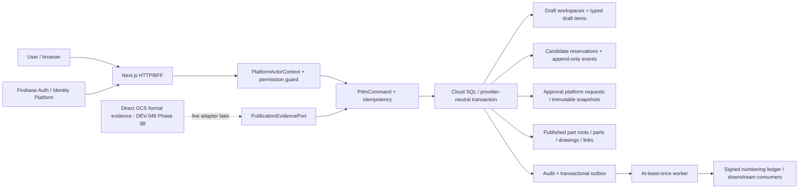

# SPEC-PDM-NUMBER-STATE-FLOW-001：圖料號、草稿、狀態與技術移轉入口整合功能規格

> **2026-08-24 DEV-093 create-flow target supersession**：本文件保留正式identity、Drawing/Part lifecycle、審核／發布 evidence、技術移轉與缺主要製造圖 hard rule；一般使用者的「建立編號」不再建立或顯示draft workspace、candidate reservation、candidate publication或舊狀態投影。current create authority改為`SPEC-PDM-CANONICAL-NUMBER-CREATION-001`：單一`/numbering/create`頁以typed intent呼叫canonical `/api/numbering/records`與root append APIs，preview唯讀且不保留號。衝突處以DEV-093為準；舊資料條款只作歷史／遷移證據，不得恢復為runtime authority。

> **2026-08-24 DEV-093 naming-guidance corrective amendment**：最新 Human Decision 要求保留完整品名建議器，且系列代號必須自動加入適用的依圖製作件建議品名。系列代號仍以獨立 `seriesCode` metadata 持久化，但同一輸入同時參與`[主要名詞]_[系列代號]_[特性]_[流水識別]`組合；此決策取代本文所有「系列代號不得加入建議／確定品名」條款。現行 UI 以`主要名詞`取代誤導的完整`品名`輸入，建議品名可套用到唯一`確定品名`／`coreName` authority；外購標準件維持`[主要名詞]_[品牌]_[規格/型號]`。

> **2026-08-24 item-kind consolidation**：本文件中的舊料件 enum（委外／共用／自訂）只可作歷史資料轉換來源；現行人類標籤只有`依圖製作件|外購標準件`，底層 item kind 僅 `manufactured|purchased`，共用性由 `isUniversal`／`universalReason` 表達。依圖製作件包含廠內與委外依圖加工。正式料件與變更控制草稿分別依 `db/postgres/044_canonical_item_kind_two_values.sql`、`db/postgres/045_part_number_draft_item_type_two_values.sql`，不得把舊 enum 或 compatibility code 重新暴露於 UI。

狀態：`Phase 1A-1D Local QC Passed / DEV-062 Amendment Local QA-QC Passed / DEV-067 Local RD Implemented / Local QA-QC Passed / Release Gate Required`
建立日期：2026-07-13
Owner：Dev PM
Related DEV：`DEV-PDM-NUMBER-STATE-FLOW-001` / `DEV-048` / `DEV-PDM-UNIFIED-ENTITY-DETAIL-REVIEW-001` / `DEV-067`
Current execution boundary：Phase 1A local authority、Phase 1B owner surfaces/compatibility、Phase 1C approval/publication及Phase 1D transfer integration均已完成RD與獨立QC。Live provider、正式資料、staging、deployment與release artifact仍未執行。
RD readiness：`HD-048-01..03`已由使用者以`1C / 2C / 3C`關閉；Phase 1A-1D已依序通過。下一步不得自動續做 provider 或 release，需明確進入 DEV-046 / DEV-032 對應 gate。
Platform baseline：依 `DEV-046` 的 `asia-east1` Cloud Run + Next.js 16 HTTP/BFF、Cloud SQL PostgreSQL 正式資料唯一權威、Firebase Auth with Identity Platform 身分邊界與 direct GCS 正式檔案終局架構。

> **2026-08-22 DEV-087 target supersession**：本文件保留numbering identity/recycling、正式化、approval evidence與Cloud SQL authority；三工作臺Part current row改為`正式資料`0/1＋`part_change_works`的`修改中`0/1，沒有Part revision/branch。舊candidate/formal分列、production/RD lane、humanStatus/filter與legacy workspace current authority由DEV-087取代並拆除。新決策優先；既有資料只作明確preserved evidence或converter source。

> **2026-08-20 DEV-086 Part production／RD lane target amendment（RD Implementation Ready / Not Implemented）**
>
> 本文 DEV-062「candidate/formal 各自成為獨立 top-level row」的 Part list 目標，於 DEV-086 umbrella flag 啟用後改由 canonical Part group 的 production／RD lane projection取代：同一 Part Number 最多一列`量產最新版`與一列`研發最新版`，production 以 Released manufacturing baseline（或可證明的 legacy released basis）為準，RD 彙整 active baseline／workspace／scoped drawing change。Part Number 仍是無版次物料身份，禁止新增 Part Revision；來源不同不代表建立第二份 Part master。
>
> source-less candidate 仍為 RD-only candidate group，不能虛構 production lane。完整 reference priority、stable key、filter、cursor、permission、failure 與 release 契約以 `SPEC-PDM-WORKBENCH-PRODUCTION-RD-LANES-001` 與其 ADR 為準；現行 runtime 在 flag 啟用前維持 DEV-062 row projection。

2026-08-15 DEV-074 lifecycle amendment：只要候選圖號／料號已由 UI 顯示並寫入可查歷史，取消 workspace 時仍將 reservation 標為 `recycled`，但該 candidate code 轉為歷史保留，不再回到可用池。預覽與正式配置必須共同排除 `active / review_locked / approved_locked / promoted / recycled` 的既有 code。這項 amendment 取代本文所有「recycled code 可重新分配」的舊條款，以避免取消歷史與 unified drawing/part identity 產生同號歧義；取消不等於正式作廢，也不會復活舊 row。

2026-08-03 contract amendment：使用者已在 `DEV-052` 決定以整包圖料審核取代新流程的 number-only review + manual publication。所有非終結既有保留號將以 read-time compatibility projection 進入新流程，不做 bulk backfill；新 action `numbering.candidate_bundle_review` 核准後可在同一原子／冪等交易自動正式化。已存在的 `numbering.candidate_publication_review` request 仍維持本規格原 snapshot/apply 語意，不得用舊核准直接發布未審圖面。DEV-052 尚未實作或 release 前，本規格仍是 production runtime authority。詳見 `.ai-doc/specs/SPEC-PDM-NUMBER-LIFECYCLE-SIMPLIFICATION-001-efficiency-first-bundle-flow.md`。

## 0A. DEV-067 Amendment：審核明細共用 owner module 與同資料鎖定（2026-08-12）

Status: `RD Implementation Ready / Human Confirmed / RD not started / Local implementation eligible / Release gated`.

本 amendment 對與既有條款衝突之處具有優先權：`/approvals` 仍是唯一 reviewer inbox 與 decision authority，但不再是圖號、料號、圖料關係的明細 UI owner。審核者由總表前往canonical owner route；三工作台所有covered狀態／角色都開啟相同`UnifiedPdmEntityDetailDrawer`，由server policy組合domain-owned projections；不得另組approval-only detail或preview。

- 圖號：`/numbering/drawings` + canonical drawing/workspace detail key。
- 料號：`/parts` + canonical part/workspace detail key。
- 圖料關係：`/numbering/search` + canonical relation/workspace detail key。
- action adapter/server resolver 回傳 owner href；browser 不可只靠 action code、顯示文字或第一個 target 猜路由。多 target 必須回送審者原本使用的 owner aggregate；若不存在 canonical owner aggregate，RD Contract 必須先回 PM 定義，不得用 approval detail 補洞。
- 一般圖號surface回Drawing full、Part/Relation summary；一般料號surface回Part full、Drawing/Relation summary且Drawing不得含圖面檔案/版次；圖料surface回Drawing/Part/Relation full。未授權projection不得由API回傳後再靠client隱藏。
- exact assigned active reviewer可在request target/company scope內取得Drawing/Part/Relation full與`ReviewContextProjection`；此能力不由client role label推定，terminal/unassigned/tampered/cross-company context不得升權。
- owner module 的同一份資料在 active review 期間受 server-side lock。受審欄位、關係、版次內容與 scope 內附件不得修改、刪除、替換或新增；若要變更，先撤回／退回，再修改並重送。
- approval snapshot/hash 繼續用於決策完整性、冪等或必要technical evidence。`ApprovalSnapshotProjection`只顯示scope/target/hash/diff/check結果，不從snapshot組Drawing/Part/Relation第二份畫面；drift時fail closed。
- owner module 原有 3D/2D preview derivative、自動排程、polling、ready/error/retry 行為原樣共用；審核者不能走不同 preview path。
- 圖號既有六區detail行為收進`DrawingProjection`；Part與Relation各自維持domain projection ownership。candidate/formal/history adapter只能改projection model、capability、disabled reason與command，不得換drawer或另做section順序。
- reviewer decision descriptor進入唯一`ContextActionBar`；request/eligibility/decision/audit仍由approval platform驗證與寫入，不另建approval footer owner。
- owner href 攜帶 same-origin、company-safe 的 `returnTo`；關閉、Back 或完成決策後回到原 `/approvals` filter/query/selection，遵守「哪裡來，哪裡去」。

Spec Impact Preflight：`Intentional replacement`。本 amendment 取代本文件中「decision UI只能存在`/approvals`」、「三domain各自組owner detail」、「reviewer與一般owner surface章節完全相同」及「凍結後仍允許scope/版次/BOM/附件變更再使檢查失效」之相衝突描述；保留單一reviewer inbox、domain data/command authority、server permission、separation of duties、approval decision authority、snapshot integrity與atomic publication。外部依賴若不屬於owner lock範圍而發生變化，既有stale snapshot/fail-closed規則仍適用。

2026-08-12 readiness update：同一`DEV-067`已補齊上述契約並達`RD Implementation Ready`，本機可依主SPEC Phase 1A～1D實作。Active-review guard必須在既有mutation transaction內執行；`pending`與`apply_failed`受審scope保持鎖定，退回/needs-info/rejected/cancelled只有在domain command原子切回editable state後解鎖，approved/applied則繼續受controlled/released immutability治理。完整command matrix與`UDD-032..036` evidence見主SPEC/QA plan。BOM與其他approval domains仍不在首批範圍。

## 0. DEV-062 Amendment：料號單頁工作台 RD Implementation Contract（2026-08-10）

Status: `Local RD Implemented / QA-QC Passed / Release Gated`

本 amendment intentional replacement 本文件所有把 `/parts?tab=drafts`、`正式料號 / 草稿` 或 `總表 / 保留號` 描述成兩個可見頁籤的條款。候選 workspace、正式 Part master、candidate reservation、approval/publication、權限與 audit authority 不變；只把讀取、狀態理解與下一步導覽整併為 `/parts` 單一工作台。共用機制以 `.ai-doc/specs/SPEC-PDM-WORKBENCH-CORE-001-shared-read-and-controller-contract.md` 為準。

### 0.1 Outcome and visible behavior

- `/parts` 不顯示 `料號總表／保留號`、`正式料號／草稿` 或任何來源型頁籤。
- 同一 server-composed 清單顯示「含 Part 工作的 active candidate bundle」與 formal Part master；使用者用 `我的待處理／工作中／全部`、搜尋與篩選找工作。
- 第一層每 row 只顯示 identity、品名、會影響判斷的摘要、一個 human status、一個 availability 與至多一個 primary CTA。
- detail 使用同一 `PdmEntityDetailDrawer` shell。candidate 由 Part candidate content 呈現；formal 使用從 page layer 抽出的 `PartDetailContent`，並繼續支援料號屬性、精簡料號文件、關聯圖面、成本（含 redaction）、歷史與既有 owner actions。
- candidate/formal 是 `sourceKind`，不是兩個使用者模組；UI 不顯示 workspace ID、raw lifecycle、cursor 或 Part Revision。

### 0.2 Exact Part row and filters

新增 `src/lib/part-workbench.ts`：

```ts
export type PartWorkbenchView = "mine" | "work" | "all";
export type PartWorkbenchRowKind = "candidate_bundle" | "part_master";
export type PartWorkbenchPrimaryActionKind =
  | "continue_building" | "submit_bundle_review" | "view_review"
  | "view_processing" | "retry_formalization" | "view_part" | "view_history";

export type PartWorkbenchRow = PdmWorkbenchRowBase<
  PartWorkbenchRowKind,
  PartWorkbenchPrimaryActionKind
> & {
  workspaceId: string | null;
  partNumberId: string | null;
  rootCode: string;
  itemKind: NumberingItemKind;
  recordStatus: NumberingRecordStatus | null;
  candidatePartCount: number;
  primaryDrawingNumber: string | null;
  drawingCount: number;
  materialSummary: string | null;
  standardCost: PartStandardCostRecord | null;
  pendingCostRequestCount: number;
  usage: "not_for_formal_use" | "rd_controlled" | "released" | "historical_only";
};

export type PartWorkbenchQuery = {
  query: string;
  view: PartWorkbenchView;
  seriesCode: string;
  itemKind: NumberingItemKind | "";
  recordStatus: NumberingRecordStatus | "";
  humanStatus: HumanStatusFilter;
  includeHistory: boolean;
  cursor: string;
  limit: number;
};
```

Projection：

- candidate row key=`candidate:{workspace.id}`；只收 `lifecycleStatus !== "published"`、至少一筆 `workspace.parts`，active 預設可見，cancelled 只在 `history=include`。
- 一個 workspace 即使含多個 Part candidate 也只顯示一 row；`candidatePartCount` 與 detail 顯示 typed items，不拆成多個看似獨立正式料號。
- formal row key=`part:{part.id}`；Part master 是一料一 row。`Obsolete/Merged` 只在 `history=include`，其他 formal 依既有 record status/availability 投影。
- 同 snapshot 若 workspace 已 published，candidate row 不出現；formalized 後下一次 read 顯示一或多個 formal Part rows。
- `mine`：candidate owner 是 actor，或 viewer projection 指定 actor 有目前責任；formal 只收 viewer 有目前責任的 rows。
- `work`：active candidate，或 formal viewer status 有待處理／blocked/correction task；純可查閱 formal 不進 `work`。
- `all`：目前非歷史 candidate/formal；history 必須另由 `history=include` 明示加入。
- 所有 query、view、status、history filter 必須在 identity query/cursor 之前由 server 套用；不得先抓 100 筆再由 browser filter。
- cost 金額仍經 `canViewPartCostAmounts`/redaction；無 cost 權限時 row/detail 不得藉新 BFF 洩漏 amount、tier 或推算值。

### 0.3 Primary action and lifecycle rules

Candidate primary action沿用 canonical workspace projection，不新增平行 state machine：

| Effective state | Primary action kind | Visible label |
|---|---|---|
| owner can edit / preparation incomplete | `continue_building` | `繼續準備料號` |
| readiness complete and submit allowed | `submit_bundle_review` | `送出審核` |
| current actor reviewer | `view_review` | `處理審核` |
| waiting for another actor / auto-finalizing | `view_processing` | `查看進度` |
| correction / failed formalization and actor can recover | `retry_formalization` or canonical correction action | server projection label |
| cancelled history | `view_history` | `查看歷史` |

Formal Part primary action固定由 owner capability projector決定；最低 contract 是 `view_part` → 同頁 formal drawer。既有 variant、cost、attachment、obsolete 等 mutations 只在 drawer 依原 permission/confirmation 顯示，不升格成多個 row primary CTAs。

每 row 最多一個 primary action。disabled action 必須回 `disabledReason` 與 exact `permissionCode/contactRole/adminHref`（若適用），browser 不得從角色名稱猜權限。

### 0.4 Part list/detail API

| Method / route | Contract |
|---|---|
| `GET /api/parts/workbench` | `PartWorkbenchListResponse`；query=`view,query,seriesCode,itemKind,recordStatus,humanStatus,history,cursor,limit` |
| `GET /api/parts/workbench/[rowKey]` | canonical `candidate:{workspaceId}` 或 `part:{partNumberId}`；unprefixed Part code only for legacy lookup/canonicalization |
| existing `GET /api/parts` | flag-off legacy list；不得在新 page client 與 workspace list merge |
| existing Part/workspace mutation routes | 不變；新 workbench route 嚴禁 POST/PATCH/PUT/DELETE |

List response：

```ts
type PartWorkbenchListResponse = PdmWorkbenchListResponse<PartWorkbenchRow, {
  seriesCodeOptions: string[];
  itemKindOptions: NumberingItemKind[];
  recordStatusOptions: NumberingRecordStatus[];
}>;
```

Detail response：

```ts
type PartWorkbenchDetailResponse = {
  row: PartWorkbenchRow;
  candidate: NumberingDraftWorkspaceRecord | null;
  part: PartModuleDetailRecord | null;
  capabilities: {
    canViewWorkspace: boolean;
    canUpdateWorkspace: boolean;
    canSubmitCandidate: boolean;
    canReviewCandidate: boolean;
    canPublish: boolean;
    canUpdatePart: boolean;
    canManagePartFiles: boolean;
    canViewCostAmounts: boolean;
    permissionRequirements: Record<string, PdmWorkbenchPermissionRequirement>;
  };
};
```

Permission：page/formal read 需 `numbering.search`；candidate rows 只有另具 `numbering.workspace.view` 才可被納入。candidate detail 對無 workspace 權限者回 404（不洩漏 existence），不是把資料回傳後由 client 隱藏。candidate mutation 仍逐 command 檢查原 permission。

### 0.5 Candidate detail composition and capability parity

新增 `PartCandidateDetailContent`，不得複製整個 `DrawingWorkspaceDrawer`：

1. Part identities：候選料號、品名、item kind、series、root/source relation；一個 bundle 可列多筆 typed Part items。
2. Human status / owner / availability / unique next step：全部使用 server projection。
3. Editable Part facts：復用既有 workspace update command與 rowVersion/409 recovery；不得直接建立 formal Part。
4. Relation/readiness：顯示 draft/source relationship 與 blockers；owner handoff保留 safe `returnTo`。
5. 若 bundle 確實含 drawing first-revision/file obligation，嵌入既有 `NumberingCandidateRevisionEditor` 與同一 workspace command，不重建 Part 專用上傳 state machine；這不等同重新掛載 DEV-057 已暫停的 drawing workbench candidate drawer。
6. submit/withdraw/correction/retry/publication actions 沿用既有 API、confirmation、idempotency、snapshot 與 audit；不得由新 BFF mutation。

Capability parity hard gate：legacy `/parts?tab=drafts` 能完成的 Part candidate view/edit/readiness/submit/progress/correction/history，在新 Part drawer 必須都有同等可執行入口；只保留 link 或顯示文字不算完成。

### 0.6 Create and redirect ownership

- `NumberStateOwnerCreateAction surface="parts"` 成功後一律導向 `/parts?view=work&detail=candidate:{workspaceId}`，不得再依 `drawingWorkbenchEnabled` 改送圖號頁。
- `NumberStateOwnerCreateAction surface="search"` 成功後導向 `/numbering/search?view=work&detail=candidate:{workspaceId}`。
- contextual `AddPartDialog` 建立 candidate 後導向 Part workbench；`AddDrawingDialog` 仍屬 Drawing owner route，不在 DEV-062 改 drawing drawer。
- 新增 destination resolver（純函式）由 surface/created workspace 回傳 canonical URL；dialog 不直接拼接 owner route。
- feature status 必須分開讀 `drawingWorkbench` 與 `partRelationWorkbench`，兩者不得互相作 enable 條件。

### 0.7 Failure and recovery

- list hydration 任一失敗整包 5xx；保留上次成功 rows、顯示 retry，不混入 partial candidate/formal。
- invalid cursor 400：controller 清 page history 回第一頁；不寫 DB、不無限 retry。
- detail 404：關閉 stale drawer，清 canonical detail query，清單仍可用。
- workspace rowVersion 409：保留使用者未送出的 form value、重新載入 server facts、提示比較後重試；不得 silent overwrite。
- formalization 後原 candidate deep link 回 404 時，若 response 提供 safe canonical formal targets，UI 顯示「已正式化」與前往新 Part rows，不以 display code猜測。
- 401/403/5xx 與 network abort 依 core contract；abort 不顯示 error toast。

### 0.8 Phase 1B acceptance

1. candidate/formal 由同一 BFF/filter/cursor 讀取，無 browser merge、duplicate row 或 Part Revision。
2. owner/cost/file/relation/lifecycle capabilities與 legacy parity matrix 全數通過。
3. rapid query/filter/page、reload、back/forward、drawer close/reopen 只顯示最後有效資料。
4. `/parts?tab=drafts|reserved` 與 `/numbering/part-drafts` zero-write canonicalization通過；flag off rollback parity通過。
5. query budget、cross-company、cross-role、responsive、keyboard/focus、no raw status/ID 通過。
6. Phase 1B 單獨完成不算 DEV-062 整體交付，也不得開 umbrella release flag。

關聯規格：

- `.ai-doc/specs/SPEC-PDM-NUMBERING-004-contextual-numbering-lifecycle-entrypoints.md`
- `.ai-doc/specs/SPEC-PDM-STATUS-UX-002-status-context-disambiguation.md`
- `.ai-doc/specs/SPEC-PDM-CHANGE-CONTROL-001-revision-part-bom-flow.md`
- `.ai-doc/specs/SPEC-PDM-PRODUCTION-SLICE-001-official-numbering-draft-launch.md`
- `.ai-doc/specs/SPEC-PDM-SUBMISSION-GATE-001-research-transfer-package-readiness.md`
- `.ai-doc/specs/SPEC-PDM-TRANSFER-PACKAGE-INTAKE-001-pack-and-go-assembly-classification.md`
- `.ai-doc/specs/SPEC-PDM-ERP-MODULE-FOUNDATION-001-platform-contract.md`
- `.ai-doc/specs/SPEC-PDM-ERP-GOOGLE-CLOUDSQL-002-five-year-platform-ontology-roadmap.md`
- `.ai-doc/specs/SPEC-PDM-RELEASE-MASTER-STATUS-SYNC-001-submission-release-master-lifecycle.md`

關聯決策：

- `.ai-doc/decisions/ADR-PDM-CHANGE-CONTROL-001-reserved-draft-number-policy.md`
- `.ai-doc/decisions/ADR-PDM-PRODUCTION-SLICE-001-official-numbering-draft-launch-boundary.md`
- `.ai-doc/decisions/ADR-PDM-SUBMISSION-GATE-001-transfer-package-and-exception-policy.md`
- `.ai-doc/decisions/ADR-PDM-ERP-PLATFORM-002-google-taiwan-cloud-sql-production.md`
- `.ai-doc/decisions/ADR-PDM-NUMBER-STATE-FLOW-001-publish-boundary-and-candidate-reservation.md`

關聯 QA：

- `.ai-doc/qa/qa-pdm-number-state-flow-validation-plan-2026-07-13.md`

---

## 1. Human Decision Brief

### 1.1 已確認決策

決策來源為 2026-07-13 使用者對既有優化方案的註解與後續「以上寫成開發規格書，先寫功能規格，不寫架構」指令。

1. `＋建立圖料號` 的主要入口放在「圖料工作台」頁首右上角，不放在全系統頂端，也不另建一個「領號申請」主模組。
2. 「圖號工作台」與「料號工作台」各自保留任務對應的 `＋建立圖號`、`＋建立料號`；物件詳情抽屜保留依圖料根號、圖號、料號脈絡預填的新增入口。
3. 技術移轉的整批送審入口不放在一般「上傳送審」，而放在「發行 / 交接」下的「技術移轉」，以技轉包為工作單位。
4. 技轉包從案件、組合件、圖料根號或設計變更脈絡建立，自動彙整圖號、料號、BOM、附件與受影響項目，經完整性檢查後整批送審。
5. ISO 9001 的最低必要管制邊界採「已發布」：草稿階段不視同正式發布號碼，不因號碼曾顯示給使用者就永久占用。
6. 草稿候選 reservation 可以取消並標為回收；候選 code 一旦顯示並留存歷史即不得重用。審核中另做排他鎖定；已發布與已作廢的正式號碼同樣永久保留。
7. 第一版不強制 7 天冷卻期。候選號在明確取消、零有效引用且未處於審核鎖定時，可立即結束 reservation，但 candidate code 不回到可用池。
8. Phase 1B 開放時，舊側欄`料號草稿 / 領號申請 / 上傳送審 / 製造交接`立即退出可見側欄；功能整併到 owner surfaces。舊網址暫留 redirect / guidance 以保護 bookmark，不保留第二套可變更流程。
9. 建立或發布 drawing，以及含 drawing 或被規則標示為必要檔案的技轉包，必須有 finalized controlled-file evidence；純 root 或不含 drawing/file obligation 的 part-only publication 可由版本化 server rule 明確回傳`not_required`。正式環境在 direct GCS evidence verifier 就緒前，所有需檔案的發布維持鎖定。
10. 第一版不強制 submitter、approver、publisher 為不同自然人；同一人可完成三步，但每一步仍須有獨立明示權限、獨立 command / confirmation 與獨立 audit fact。任何角色或 Admin 身分都不隱含其他權限，approval 不得自動觸發 publication。

### 1.2 從已確認決策推導的產品預設

以下是為了消除入口與狀態矛盾所做的產品收斂，不是架構決策：

- 原側欄「料號草稿」不再是獨立一級工作台，併入「料號工作台」的草稿頁籤。
- 原側欄「領號申請」不再是主要入口；建立動作由圖料、圖號、料號工作台與物件脈絡承接。
- 原側欄「上傳送審」不再作為泛用流程入口；研發送審由所選圖號、料號或關係進入，技轉送審由技轉包進入。
- 「技術移轉」使用 `準備中 / 審核中 / 已發布交接` 三個主要頁籤；目前「製造交接」內容收斂到 `已發布交接`，不再與技術移轉並列成兩個容易混淆的主入口。
- 為避免「已核准」被誤認為「已發布」，新增使用者可見的 `待發布` 階段；若某流程核准與發布為同一動作，該階段可短暫略過，但語意仍須分開。
- 未領號草稿先以系統草稿識別碼保存；需要 CAD 命名、跨人協作或準備送審時，使用者再明確取得候選號。

### 1.3 被拒絕的方向

- 只要號碼顯示過就永久占用。
- 把草稿、審核、發布、作廢塞進同一個模糊「狀態」欄位。
- 以獨立「料號草稿」頁面代表完整草稿生命週期。
- 由使用者先進「上傳送審」，再猜測要送哪個物件或案件。
- 技術移轉以單一圖號、單一料號或一批未歸屬案件的檔案直接送審。
- 技轉核准後直接把主檔標成已發布。
- 第一版硬性套用 7 天回收冷卻，卻沒有相應風險證據。

### 1.4 ISO 9001 功能政策解讀

本規格採比例與風險導向原則：正式輸出、設計變更、核准、發布與歷史版本必須受控；未發布草稿則只需保留足以防止誤用、重複占號與無法追查的最低證據。

本規格不主張 ISO 9001 明文要求「草稿號可回收」或「號碼一顯示就永久占用」。產品政策基於 DEV-074 的單一真相與歷史可追溯要求：候選 reservation 可取消，但已顯示且已留存歷史的 candidate code 不重用；只有正式發布資料可供正式使用。

參考：

- ISO 對 documented information 的官方指引：<https://www.iso.org/iso/documented_information.pdf>
- ISO 9001:2015 官方標準頁：<https://www.iso.org/standard/62085.html>

### 1.5 AI assumptions

- 圖料工作台仍是圖料根號、圖號、料號與關係的跨物件檢視中心。
- 圖號工作台、料號工作台仍分別由圖號與料號功能模組負責。
- `審核工作台` 仍是審核者的單一主要 inbox；「技術移轉」是案件 owner 的準備與追蹤中心，不複製審核工作台。
- 現有技轉包的案件式、不可直接單品技轉、完整性阻擋、核准不等於發布等規則保持有效。
- 候選號可用於草稿 CAD 或內部協作，但所有畫面與輸出都必須清楚標示「候選 / 草稿 / 不可供製造使用」。

### 1.6 Re-entry triggers

- 使用者要求保留「料號草稿」、「上傳送審」或「領號申請」為獨立一級側欄入口。
- 使用者要求「製造交接」與「技術移轉」繼續並列為兩個主入口。
- 使用者要求審核通過即自動等同正式發布。
- 使用者要求刪除已取消候選號的歷史、重用已顯示 candidate code，或要求已發布 / 已作廢號碼可回收。
- 使用者要求加入固定回收冷卻期、自動逾期回收或跨公司共享號池。
- 實作需要改變本文件已固定的正式發布邊界、候選號回收條件、單一審核 inbox 或 DEV-046 平台權威。
- 歷史資料存在無法分類為 `published/obsolete official`、`legacy official reservation` 或 `candidate draft` 的歧義，且自動處理會改變號碼可重用性。
- 需要在 live Cloud SQL 執行資料修復、schema cutover、長時間 table lock 或 provider migration。
- 進入 merge、PR、deploy、production smoke、rollback 或正式 release。

### 1.7 RD主管完整性審查與Human Decision Gate（2026-07-13，已關閉）

本輪以Phase 1B-1D能否直接交給RD/QA/QC為判準重新審查。工程契約已補正建立模式矩陣、同workspace內部relation回收語意、pre/post-commit publication failure、batch official event cardinality、failure-record transaction與320/768 responsive boundary。使用者於2026-07-13以`1C / 2C / 3C`關閉三項決策：

| Gate | 已確認決策 | 工程後果 | 狀態 |
|---|---|---|---|
| `HD-048-01` / `1C` | Phase 1B 立即移除四個舊側欄項目，功能收斂到 owner surfaces | 可見側欄不得保留重複入口；舊URL暫留redirect/guidance並保留query/`returnTo`，不得保留第二套mutation | Closed |
| `HD-048-02` / `2C` | drawing與含drawing/required-file技轉必須有finalized evidence；純root/part-only可由server rule回`not_required` | evidence policy fail closed；live direct GCS verifier未就緒前，需檔案的production publish保持disabled與API denial | Closed |
| `HD-048-03` / `3C` | 不要求不同自然人；同一人可submit、approve、publish | 三個動作仍需各自明示permission、command、confirmation與audit；不可自動串接、不可由Admin/角色身分推定權限 | Closed |

三項決策已轉成SPEC、ADR與QA可驗收規則。Phase 1A-1D已依序完成RD與獨立QC；本機完成不得跳接或取代live provider與release gate。

---

## 2. 問題定義

目前系統把「物件」、「動作」與「內部資料結構」混在側欄：

- `圖料工作台 / 圖號工作台 / 料號工作台` 是使用者理解的物件中心。
- `料號草稿` 是生命週期切片，不應與物件模組平行。
- `上傳送審` 是技術動作，不是明確的業務任務。
- `領號申請` 與各模組內的新增行為重疊，使用者無法判斷該從哪裡開始。
- `製造交接` 只顯示已發布結果，卻沒有清楚承接「技轉準備 → 審核 → 發布交接」的上游入口。

號碼與狀態也混用：

- `Draft` 可能代表草稿資料、已取得正式號但未發布、或候選號草稿。
- `Pending` 可能代表審核中、待補資料或只是在等待某個工作。
- `Approved` 容易被誤認為 `Released / 已發布`。
- 「號碼是否正式」、「文件是否發布」、「審核是否完成」、「資料是否完整」常被放在同一欄。

真正要解決的不是「多一個按鈕」或「少一個頁面」，而是讓使用者在五秒內回答：

1. 我現在要建立什麼？
2. 這是草稿候選號還是正式號？
3. 目前卡在草稿、審核、發布還是交接？
4. 下一步應由誰做什麼？

---

## 3. 目標與成功定義

### 3.1 功能目標

- 以任務脈絡取代技術模組脈絡，讓建立、送審與技轉都有唯一主要入口。
- 讓草稿可以低摩擦建立、刪除、取消與回收，不把未發布資料過度管制成正式主檔。
- 保留候選號的排他性與防誤用護欄，避免同一候選號同時被兩個有效草稿使用。
- 嚴格區分候選號、審核鎖定、已核准、待發布、已發布與已作廢。
- 讓技轉整批送審以完整案件包運作，並只把正式已發布內容交給製造、採購或外部協作。

### 3.2 可量化成功指標

| 指標 | 目標 |
|---|---|
| 新使用者找到建立圖料號入口的時間 | 5 秒內 |
| 從圖料工作台開始建立圖號或料號的主要入口數 | 每種任務 1 個主要入口；其餘為脈絡捷徑 |
| 因「已核准」誤認為「已發布」造成的正式使用 | 0 件 |
| 沒有對應審核案件的 `待審核` 草稿 | 0 件 |
| 同一候選號同時存在兩筆有效草稿或審核 | 0 件 |
| 技術移轉未建立技轉包而直接送出單品或散檔 | 0 件 |
| 草稿誤進製造交接、正式 BOM 或正式採購出口 | 0 件 |
| 已發布或已作廢正式號碼被重用 | 0 件 |

---

## 4. Scope

### 4.1 In Scope

1. 側欄與模組內主要建立入口的功能位置。
2. 圖料、圖號、料號建立動作的共用功能語意。
3. 「料號草稿」併入料號工作台的頁籤與清單行為。
4. 「上傳送審」與「領號申請」退出一級側欄後的替代任務入口。
5. 未領號草稿、候選號、審核鎖定、待發布、已發布、已作廢與已回收的功能規則。
6. 候選號取得、取消、回收、送審與正式化的使用者流程。
7. 狀態欄位的語意分層與 UI 顯示原則。
8. 技術移轉中心、技轉包建立、範圍彙整、檢查、整批送審、發布與已發布交接。
9. 角色可執行動作、阻擋原因、錯誤復原與功能驗收標準。

### 4.2 Out of Scope

本輪依使用者明確指示不寫下列內容：

- 系統架構、服務邊界、資料流拓撲或部署拓撲。
- 資料表、欄位、索引、schema、migration、RLS 或 grants。
- API route、request / response contract、RPC、transaction 或 idempotency 實作。
- 演算法實作、sequence 儲存方式、鎖定技術或併發實作。
- 歷史資料轉換、舊路由 redirect 實作或既有草稿資料修復。
- 完整權限架構與 permission code；本文件只定義業務角色可做什麼。
- RD 切片、QA 測試計畫、QC 腳本與實作證據。
- merge、PR、deploy、production smoke、rollback、release report。

---

## 5. 名詞與狀態維度

### 5.1 核心名詞

| 名詞 | 功能定義 |
|---|---|
| 未領號草稿 | 已保存工作內容，但沒有對使用者公開的圖號或料號；可直接刪除。 |
| 候選號 | 由系統產生、供草稿與送審識別使用的暫時號碼；不是正式號。 |
| 審核鎖定 | 候選號進入有效審核後的暫時排他狀態；避免被取消、回收或同時分配。 |
| 待發布 | 已核准但尚未完成正式發布；候選號仍不可供製造使用。 |
| 正式號 | 完成正式發布後的唯一受控號碼。 |
| 已作廢正式號 | 曾正式發布、後續依法定或公司變更流程停止使用的號碼；永久保留歷史，不可重用。 |
| 已回收候選號 | 已取消且無有效引用的候選號；可重新分配給未來草稿。 |
| 技轉包 | 一個開發案或設變案的技術移轉工作單位，包含範圍、資料完整性、審核與發布交接脈絡。 |
| 已發布交接 | 只包含正式發布且允許製造、採購或受權協作者取用的交接內容。 |

### 5.2 狀態維度必須分開

系統不得再以單一 `status` 字樣承擔所有語意。功能上至少分成：

| 維度 | 使用者要回答的問題 | 建議可見值 |
|---|---|---|
| 號碼資格 | 這個號碼是什麼性質？ | 未領號、候選號、正式號、已回收 |
| 文件生命週期 | 內容是否已成為正式受控輸出？ | 草稿、已發布、已作廢 |
| 審核進度 | 審核走到哪裡？ | 未送審、審核中、已退回、已核准、已取消 |
| 發布進度 | 核准後是否已正式發布？ | 不適用、待發布、發布中、已發布、發布失敗 |
| 完整度 | 現在可否送審？ | 待補資料、可送審、阻擋 |
| 使用資格 | 誰現在可以怎麼用？ | 草稿內部使用、不可供製造、可正式使用、僅歷史查閱 |
| 提醒 | 有沒有需要注意但不改變主狀態的事？ | 需重新確認、資料已變更、逾期、版本已非最新 |

顯示原則：

- 一般清單只顯示當下任務需要的 1 至 3 個維度，不展示全部內部狀態。
- 同一欄若同時顯示多個維度，欄名必須明示，例如 `號碼資格 / 審核進度`，不得只叫 `狀態`。
- `已核准` 絕不能顯示成 `已發布`。
- `已取消` 用於未正式發布的流程；`已作廢` 只用於曾正式發布的受控物件。
- `候選號` 不得在任何頁面簡稱為 `正式號` 或 `已領號`。

---

## 6. 導覽與 UI 入口

### 6.1 目標側欄

`專案 / 圖料`：

- 圖料工作台
- 圖號工作台
- 料號工作台

`發行 / 交接`：

- 技術移轉
- 圖號報表

`審核工作台` 維持既有單一審核者入口，不因本規格另建技轉審核 inbox。

下列項目退出一級側欄：

- `料號草稿`：改為料號工作台內的 `草稿` 頁籤。
- `上傳送審`：改由物件或技轉包脈絡進入。
- `領號申請`：改由各模組的建立 CTA 進入。
- `製造交接`：功能收斂到技術移轉的 `已發布交接` 頁籤。

### 6.2 圖料工作台

頁首右上角固定主要 CTA：`＋建立圖料號`。

點擊後提供四種任務模式：

1. `建立新圖料根號 + 圖號 + 料號`
2. `在既有圖料根號新增圖號`
3. `在既有圖料根號新增料號`
4. `新增圖號 + 料號並建立關係`

功能規則：

- 使用者選擇模式後才顯示該任務需要的欄位。
- 既有圖料根號模式先搜尋並鎖定圖料根號，不得誤建新圖料根號。
- 儲存前要明示結果是未領號草稿、候選號草稿或正式發布流程的哪一種。
- 建立完成後回到原圖料脈絡，展開並高亮新項目。
- Phase 1E修復範圍內，建立表單必須保留公司管理辦法的品名引導能力：使用者先填`主要名詞`與其他資訊，系統依料件類型產生可套用的建議品名，使用者可微調後形成`確定品名`；建議欄位不得變成阻擋性欄位。
- `確定品名`是人類溝通與系統篩選名稱，不要求唯一；它作為圖料主題名稱與同一草稿下料號預設品名。唯一性只由圖號、料號與正式發布authority保證。
- 建議品名模板依兩種基礎料件類型呈現，段落以半形底線`_`串接：外購標準件`[主要名詞]_[品牌]_[規格/型號]`；依圖製作件`[主要名詞]_[系列代號]_[特性]_[流水識別]`。共用性不另造料件類型，僅以獨立 `isUniversal`／`universalReason` 設定；品牌、規格／型號、系列、特性與流水識別仍可選填。系列代號是獨立 metadata 欄位，必須持久化到料號草稿／正式料號，且同一值必須自動加入適用的依圖製作件建議品名；外購標準件或共用件不顯示／送出系列代號。
- 相似品名查重只作提醒與引導改用既有圖料根號，不得阻擋使用者建立新圖料根號。
- 圖號需求不得由「共用件」推導，也不讓一般使用者在建立草稿時判斷「是否須製程管制」。建立表單只保留`包含圖號草稿`作為可見控制：外購標準件預設不建圖號，依圖製作件預設建圖號，共用性不參與圖號預設判斷；使用者仍可手動覆寫。
- 本規格維持既有v3編碼、M/R用途碼與候選號/正式發布邊界；Phase 1E不得導入`000`萬用料號或改回`P-0001-001 / D-0001-MA1`格式。

#### 6.2.1 建立模式與責任矩陣

四種模式共用同一資訊骨架，避免模式切換後來源、目標、CTA或審核責任悄悄改變：

| Mode | 操作者 | 方向 / 來源 | 目標與範圍 | 安全策略 | 儲存結果 / 狀態 | Primary next CTA | 審核 / 發布責任 |
|---|---|---|---|---|---|---|---|
| `new_bundle` | RD / scoped RD Manager | 無既有來源 | 新root + 至少一part + 至少一drawing + relation | form open不寫DB；source root必須為null | stable未領號workspace | `取得候選號` | owner送審；`/approvals`決定；explicit publisher發布 |
| `append_drawing` | RD / scoped RD Manager | 已選official root，只讀鎖定 | 該root下新增一或多個drawing | server驗證source root/company；不得另建root | stable未領號workspace | `取得候選號` | 同上 |
| `append_part` | RD / scoped RD Manager | 已選official root，只讀鎖定 | 該root下新增一或多個part | server驗證source root/company；不得另建root | stable未領號workspace | `取得候選號` | 同上 |
| `append_drawing_part` | RD / scoped RD Manager | 已選official root，只讀鎖定 | 同root新增drawing + part + relation | relation兩端必須同workspace/source root且由server驗證 | stable未領號workspace | `取得候選號` | 同上 |

模式切換必須清除不屬於新模式的未提交欄位，不得把上一模式hidden values送入API。若workspace已保存，模式與typed item set在Phase 1B不可變；使用者須取消後依正確模式重建。

### 6.3 圖號工作台

頁首右上角固定主要 CTA：`＋建立圖號`。

支援：

- 新圖料根號下建立圖號。
- 既有圖料根號下新增製造圖或參考圖。
- 從既有料號脈絡新增並建立圖料關係。

圖號詳情抽屜保留：

- `在此圖料根號新增圖號`
- `新增同圖料號`
- `送審`
- 正式發布後才顯示 `申請圖號作廢`

### 6.4 料號工作台

頁首右上角固定主要 CTA：`＋建立料號`。

主要頁籤：

- `全部`
- `草稿`
- `審核中`
- `已發布`

`已作廢 / 歷史` 放在歷史篩選，不與日常工作頁籤爭奪注意力。

`草稿` 頁籤包含：

- 我的草稿
- 部門草稿
- 未領號草稿
- 候選號草稿
- 需重新確認

料號詳情抽屜保留：

- `在此圖料根號新增料號`
- `建立替代料號`
- `新增同根圖號`
- `送審`
- 正式發布後才顯示 `申請料號作廢`

### 6.5 窄版與觸控裝置

- 主要建立 CTA 必須在頁名後的第一個可見操作區，不得藏入三點選單。
- 桌面版放頁首右上；窄版改為頁首下方滿寬主要按鈕或固定安全操作列。
- 次要脈絡操作可收進選單，但 `建立`、`送審`、`處理阻擋` 不得只靠 hover 才能發現。

---

## 7. 統一建立流程

### 7.1 建立模式

每個建立流程都先讓使用者理解兩種保存方式：

| 保存方式 | 結果 | 適用時機 |
|---|---|---|
| `儲存草稿` | 建立未領號草稿，不配置候選號 | 尚在整理需求、資料可能重做 |
| `取得候選號並儲存` | 建立候選號草稿 | 需要 CAD 命名、跨人協作或準備送審 |

預設行為：

- 第一次進入表單預設為 `儲存草稿`。
- 若從圖號進版、替代料號或技轉包的必要項目進入，可建議取得候選號，但不得靜默占號。
- 任何候選號配置前，畫面必須提示「候選號不是正式號，正式發布前不可供製造或採購使用」。

### 7.2 建立前檢查

系統在使用者送出前必須檢查：

- 圖料根號脈絡是否正確。
- 是否已有相同用途、相同來源或相同關係的有效草稿。
- 使用者是否誤選參考圖作為製造依據。
- 必填主資料是否足以保存草稿。
- 取得候選號時，是否有可用候選號且未被其他有效草稿占用。

檢查結果分成：

- `阻擋`：不得繼續，明示原因與修正入口。
- `警告`：可繼續，但需使用者確認。
- `提示`：不影響繼續，只說明結果。

### 7.3 建立完成

完成後必須顯示：

- 建立的物件類型與圖料根號脈絡。
- 號碼資格：未領號或候選號。
- 下一步：繼續編輯、建立關係、取得候選號、加入技轉包或送審。
- 若候選號配置衝突，系統重新檢查並提示最新可用候選號，不得留下半完成的有效草稿。

---

## 8. 號碼生命週期與回收政策

### 8.1 使用者可見階段

| 階段 | 號碼資格 | 可做 | 不可做 |
|---|---|---|---|
| 未領號草稿 | 未領號 | 編輯、複製、刪除、取得候選號 | 送正式審核、進正式 BOM、製造交接 |
| 候選號草稿 | 候選號 | 編輯、內部草稿下載、取消、回收、送審 | 當正式號使用、進已發布交接 |
| 審核中 | 候選號 + 暫時鎖定 | 查閱、回應補件、依規則撤回 | 回收、分配給其他草稿、改變受審核心範圍 |
| 已核准待發布 | 候選號 + 暫時鎖定 | 完成發布前檢查、等待發布 | 當正式號使用、回收 |
| 已發布 | 正式號 | 正式使用、交接、變更、建立新版或替代 | 刪除、回收、重用 |
| 已作廢 | 正式號 + 歷史保留 | 查歷程、查取代關係 | 回收、重用、恢復成另一物件 |
| 已回收 | 無有效物件占用、code 已退休 | 稽核查詢、歷史追溯 | 重新分配該 code、恢復舊草稿為有效物件 |

### 8.2 主要轉換

```text
未領號草稿
  -> 取得候選號 -> 候選號草稿
  -> 直接刪除

候選號草稿
  -> 送審 -> 審核中（暫時鎖定）
  -> 取消並回收 -> 已回收

審核中
  -> 退回 / 撤回 -> 候選號草稿
  -> 核准 -> 已核准待發布

已核准待發布
  -> 正式發布 -> 已發布
  -> 發布失敗 -> 保持待發布並顯示復原動作

已發布
  -> 正式作廢流程 -> 已作廢
```

### 8.3 候選號回收條件

候選號同時滿足下列條件時才可立即回收：

1. 使用者明確執行 `取消草稿並回收候選號`。
2. 不在有效審核中，也不是已核准待發布。
3. 不在任何有效技轉包、正式 BOM、正式替代關係、正式附件或正式發布工作中被引用。
4. 沒有其他使用者可見的有效草稿仍以該候選號識別。
5. 畫面先顯示會被取消的草稿與引用檢查結果。

`有效引用`不包含同一workspace內、會隨整個workspace一起取消的root/part/drawing內部relation；否則每個完整bundle都會永遠無法取消。會阻擋回收的是workspace外部或具有獨立生命週期的引用，例如其他active workspace、transfer package scope、approval snapshot/lock、正式BOM/替代/附件或publication command。Reference resolver必須回傳reference type、stable ID、owner與解除href，不得只回count。

第一版規則：

- 不強制等待 7 天。
- 不自動因 30 天未使用而回收。
- 可提醒長期未動草稿，但提醒不等於自動取消。
- 若日後要加冷卻期或自動回收，需另作產品決策與風險驗證。

### 8.4 正式號永久保留

- 發布成功後，候選號才提升為正式號。
- 正式號發布與正式化必須視為同一個使用者結果；不得出現「內容已發布但號碼仍可回收」。
- 已發布與已作廢正式號永久不可重用。
- publication transaction commit前失敗時仍是`approved_locked`候選號，不得誤標正式號；commit成功後即使outbox/ledger傳遞失敗、後續被取代或作廢，仍是正式號且不得退回候選號池。

### 8.5 草稿防誤用

- 所有候選號旁固定顯示 `候選號` 標籤。
- 草稿頁、預覽、下載封面或可列印畫面固定顯示 `草稿 / 非正式 / 不可供製造使用`。
- 草稿可供內部協作下載，但不得出現在正式製造交接、正式採購輸出或已發布 BOM 的可選正式來源。
- 使用者嘗試從候選號進入正式出口時，系統須阻擋並提供 `前往送審` 或 `查看發布進度`。

---

## 9. 審核與發布功能規則

### 9.1 送審入口

研發送審：

- 從所選圖號、料號、圖料關係或對應工作台進入。
- 入口必須帶入明確物件，不接受沒有對象的泛用上傳。

技術移轉送審：

- 只能從技轉包進入。
- 不接受單一散落圖號、料號或檔案直接標成技轉送審。
- 一個項目的技轉仍必須有案件脈絡、變更原因、無其他影響項目聲明與審核範圍確認。

### 9.2 審核鎖定

- 送審成功後，候選號只對該審核案件暫時保留。
- 審核中不得回收或重新配置候選號。
- 若核心內容或送審範圍需改變，必須退回或撤回後再修改與重送。
- 退回與撤回不讓候選號永久占用；回到候選號草稿後，可繼續修改或依回收條件取消。

### 9.3 核准不等於發布

- `已核准` 只表示審核決策完成。
- 若仍有正式發布動作或發布檢查，物件顯示 `待發布`，使用資格仍為 `不可供製造`。
- 只有正式發布完成後，才顯示 `已發布 / 正式號 / 可正式使用`。
- 發布失敗不得回退成 `審核中`，應保留 `已核准 + 發布失敗` 並提供復原入口。

### 9.4 審核案件完整性

- 每筆顯示 `審核中` 的物件都必須能連到有效審核案件。
- 每個有效審核案件都必須能回到其圖號、料號、關係或技轉包來源。
- 沒有案件的孤兒 `待審核` 狀態必須視為系統錯誤，不得只顯示 badge。

---

## 10. 技術移轉中心

### 10.1 入口與頁籤

側欄位置：`發行 / 交接 > 技術移轉`。

頁首右上角主要 CTA：`＋建立技轉包`。

主要頁籤：

| 頁籤 | 顯示內容 | 主要使用者問題 |
|---|---|---|
| 準備中 | 草稿、待補資料、阻擋、退回待修正的技轉包 | 還缺什麼？下一個責任人是誰？ |
| 審核中 | 已送審、跨角色簽核、已核准待發布 | 審核走到哪裡？是否可以發布？ |
| 已發布交接 | 已正式發布、可供製造 / 採購取用的交接內容 | 哪一版可以正式使用？ |

`已取消 / 歷史` 作為篩選，不占主要頁籤。

### 10.2 建立技轉包的來源

使用者可從下列脈絡進入相同的技轉包建立流程：

- 技術移轉頁首 `＋建立技轉包`。
- BOM 或組合件詳情的 `建立技轉包`。
- 圖料根號 / 圖料詳情的 `加入技術移轉`。
- 開發案或設計變更案的 `建立技轉包`。
- 已核准變更案件的 `準備技術移轉`。

脈絡入口只負責預填來源，不建立另一套技轉流程。

### 10.3 功能流程

1. 選擇開發案、設變案、組合件、BOM、圖料根號或來源物件。
2. 明確按下 `建立技轉包` 後，才保存案件與穩定技轉包識別。
3. 系統依既有關係彙整圖號、料號、BOM、附件、組合件與受影響項目。
4. 系統顯示每一項為何被納入、來源關係與是否為必要項目。
5. 使用者可調整非必要範圍；必要項目若要排除，必須先處理其影響原因，不得直接忽略。
6. 系統執行完整性與版本檢查，依責任角色分組顯示阻擋。
7. 使用者完成必要修正後，預覽本次將被凍結的範圍與版本。
8. 使用者確認送審快照後，整包送審。
9. 審核通過後，技轉包進入 `已核准待發布`，不直接改寫圖號、料號或 BOM 為已發布。
10. 正式發布完成後，內容才進入 `已發布交接`，供製造、採購與受權協作者取用。

### 10.4 自動彙整與下一步排序規則

功能結果必須是可解釋且可重現的：

- 每個自動納入項目顯示來源，例如 `由 BOM 使用關係納入`、`由圖料根號關係納入`、`由設變影響納入`。
- 系統可以建議，不可在無人確認下自行決定正式範圍或發布。
- 下一步按下列優先序只顯示最重要的一個主要 CTA：
  1. 硬性阻擋。
  2. 缺少必要資料。
  3. 資料已變更、舊快照失效。
  4. 等待目前使用者或角色處理。
  5. 可送審、待核准或待發布。
  6. 可選改善或警告。
- 同優先級內，先顯示會阻止最多下游工作的項目；其他項目留在清單中。

### 10.5 技轉包與候選號

- 準備中的技轉包可以先納入未領號草稿或候選號草稿。
- 正式送審前，所有要求正式識別的項目都必須至少取得候選號；未領號必要項目為阻擋。
- 技轉包一旦送審，納入範圍的候選號進入審核鎖定。
- 候選號若仍被有效技轉包引用，不得回收；使用者須先從準備中範圍移除，或撤回 / 結束審核。
- 技轉核准不使候選號成為正式號；正式發布才完成正式化。

### 10.6 資料變更與失效

- 凍結或送審後，任何會改變範圍、版次、BOM、附件或候選號的變更，都必須顯示 `資料已變更，需重新檢查`。
- 舊完整性結果與受影響簽核不得繼續被當成有效。
- 使用者必須能看到是哪一項變更造成失效，以及下一步回哪個 owner module 修正。

---

## 11. 角色與功能責任

本節只定義業務功能責任，不指定權限碼或技術實作。

| 角色 | 可執行功能 | 不可執行功能 |
|---|---|---|
| RD | 建立 / 編輯草稿、取得候選號、建立關係、建立技轉包、補資料、送審、依規則撤回 | 只憑RD角色核准或發布；同一人若另有明示approval/publish權限，仍須分別執行三個受稽核動作 |
| RD Manager / 審核者 | 審核、退回、核准、確認技轉範圍與例外責任 | 把技轉核准當成主檔已發布 |
| 發布責任人 | 對已核准項目執行正式發布並確認交接資格 | 略過審核、發布候選資料或回收正式號 |
| PDM Admin / 號碼管理員 | 查候選號歷程、處理回收阻擋、處理例外與資料異常 | 在有有效引用時強制回收、重用已發布或已作廢號碼 |
| 製造 / 採購 | 查詢與下載已發布交接內容 | 看見或取用未發布草稿作為正式依據 |
| QA / QC | 依規則參與適用的技轉簽核、查閱證據與狀態 | 以簽核直接改寫 owner module 主檔 |

---

## 12. 功能需求清單

### 12.1 導航與入口

| ID | 功能需求 |
|---|---|
| NAV-001 | 圖料工作台頁首右上角顯示 `＋建立圖料號`。 |
| NAV-002 | 圖號工作台頁首右上角顯示 `＋建立圖號`。 |
| NAV-003 | 料號工作台頁首右上角顯示 `＋建立料號`。 |
| NAV-004 | 料號草稿併入料號工作台 `草稿` 頁籤，不再是一級側欄入口。 |
| NAV-005 | `領號申請` 退出一級側欄，建立任務由模組 CTA 承接。 |
| NAV-006 | `上傳送審` 退出一級側欄；研發送審與技轉送審分別由物件與技轉包承接。 |
| NAV-007 | `發行 / 交接` 下提供 `技術移轉`，含 `準備中 / 審核中 / 已發布交接`。 |
| NAV-008 | 物件詳情抽屜的建立捷徑必須與模組 CTA 使用相同功能規則與結果。 |

### 12.2 號碼與草稿

| ID | 功能需求 |
|---|---|
| NUM-001 | 使用者可先建立未領號草稿，不因儲存草稿而配置候選號。 |
| NUM-002 | 取得候選號必須是明確動作，不得在開啟表單或預覽時占號。 |
| NUM-003 | 同一候選號同時只能對應一筆有效草稿或一個有效審核脈絡。 |
| NUM-004 | 候選號全程顯示非正式標示，且不得進入正式製造 / 採購出口。 |
| NUM-005 | 未領號草稿可直接刪除。 |
| NUM-006 | 候選號草稿在零有效引用、未審核鎖定時可明確取消並立即回收。 |
| NUM-007 | 第一版不強制冷卻期，也不自動因逾期回收。 |
| NUM-008 | 送審後候選號暫時鎖定；退回或撤回後回到候選號草稿。 |
| NUM-009 | 審核核准後保持候選號鎖定，直到正式發布成功。 |
| NUM-010 | 正式發布成功後才提升為正式號。 |
| NUM-011 | 已發布與已作廢正式號永久不可回收或重用。 |
| NUM-012 | 回收被阻擋時，畫面列出有效引用與可採取的解除動作。 |

### 12.3 狀態管理

| ID | 功能需求 |
|---|---|
| STA-001 | 號碼資格、文件生命週期、審核進度、發布進度、完整度、使用資格與提醒不得混為單一狀態。 |
| STA-002 | `已核准` 與 `已發布` 必須為不同可見狀態。 |
| STA-003 | `已取消` 只用於未發布流程，`已作廢` 只用於正式發布後物件。 |
| STA-004 | 每個狀態都要提供下一步、責任角色或阻擋原因。 |
| STA-005 | 顯示 `審核中` 時必須能連到有效審核案件。 |
| STA-006 | 同一欄混合多個維度時必須改欄名或拆欄。 |
| STA-007 | 正式出口只能接受 `已發布 + 正式號 + 可正式使用` 的組合。 |

### 12.4 技術移轉

| ID | 功能需求 |
|---|---|
| TRF-001 | 技術移轉的主要入口是 `發行 / 交接 > 技術移轉`。 |
| TRF-002 | 技術移轉頁首右上角顯示 `＋建立技轉包`。 |
| TRF-003 | 技轉送審只能由案件式技轉包發起。 |
| TRF-004 | 一項技轉也必須有案件脈絡、原因、無其他影響聲明與審核範圍確認。 |
| TRF-005 | 系統自動彙整圖號、料號、BOM、附件與受影響項目，並說明每項納入原因。 |
| TRF-006 | 使用者可調整非必要範圍；必要項目不可無理由排除。 |
| TRF-007 | 送審前顯示完整性、版本與責任人阻擋清單。 |
| TRF-008 | 送審前必須預覽並確認本次凍結範圍。 |
| TRF-009 | 送審後影響範圍或版本變更會使舊檢查與受影響簽核失效。 |
| TRF-010 | 技轉核准不得直接把圖號、料號、BOM 或附件主檔標為已發布。 |
| TRF-011 | 只有正式發布完成的內容可進入 `已發布交接`。 |
| TRF-012 | `已發布交接` 只顯示最新有效正式版本與可追溯的發布 / 交接脈絡。 |

### 12.5 正式發布、檔案證據與權限

| ID | 功能需求 |
|---|---|
| PUB-001 | 核准與正式發布必須是不同command；核准不得自動建立正式master。 |
| PUB-002 | 建立或發布drawing時必須驗證finalized controlled-file evidence；preview成功與否不得取代此證據。 |
| PUB-003 | 純root或沒有drawing/required-file obligation的part-only publication，只有版本化server rule可回`not_required`；client不得自行宣告。 |
| PUB-004 | 含drawing或required file的技轉包，任一必要evidence缺漏時整包發布fail closed。 |
| PUB-005 | Production direct GCS evidence verifier未就緒時，所有需檔案publication維持disabled且direct API拒絕。 |
| AUT-001 | 同一自然人可submit、approve、publish，但每一步都必須具獨立明示permission、confirmation、command、receipt與audit action。 |
| AUT-002 | Admin或任一角色不隱含其他步驟permission；跨公司或超出scope一律server-side拒絕。 |

---

## 13. 可見錯誤與復原

| 情境 | 使用者可見訊息 | 主要復原動作 |
|---|---|---|
| 候選號剛被其他人取得 | `候選號已被其他草稿使用，請重新取得。` | `重新檢查候選號` |
| 候選號有有效引用不能回收 | `此候選號仍被 2 個有效項目引用，尚不可回收。` | `查看引用` |
| 審核中嘗試修改核心範圍 | `此項目正在審核，請先撤回或等待退回。` | `查看審核` / `申請撤回` |
| 已核准但發布失敗 | `審核已通過，但正式發布尚未完成。` | `查看發布失敗原因` / `重新發布` |
| 草稿進入製造交接 | `此內容尚未正式發布，不可供製造使用。` | `查看發布進度` |
| 技轉包缺必要項目 | `目前不能送審；尚缺必要圖號、BOM 或附件。` | 第一個 owner module 修正入口 |
| 技轉送審後資料變更 | `資料已變更，舊檢查或簽核不可再用。` | `重新建立檢查快照` |
| 找不到審核案件的審核中狀態 | `審核資料不一致，已停止後續動作。` | `請 PDM Admin 檢查` |
| 舊入口仍被直接開啟 | 顯示新入口說明與明確前往動作，不顯示第二套流程 | `前往圖料 / 圖號 / 料號 / 技術移轉` |

---

## 14. 功能驗收標準

### 14.1 入口驗收

- AC-NAV-001：Given 使用者在圖料工作台，When 查看頁首，Then 能直接看到 `＋建立圖料號`，且可選四種建立模式。
- AC-NAV-002：Given 使用者在圖號或料號工作台，Then 主要 CTA 分別是 `＋建立圖號`、`＋建立料號`，不需要先去 `領號申請`。
- AC-NAV-003：Given DEV-048 owner surfaces開啟，When 使用者查看側欄並尋找自己的領號申請，Then `料號草稿 / 領號申請 / 上傳送審 / 製造交接`不再顯示為側欄項目，且可從料號工作台`草稿`頁籤找到申請；直接開啟舊網址時只提供保留context的redirect/guidance，不出現第二套mutation流程。
- AC-NAV-004：Given 使用者要送研發審核，Then 必須先選定圖號、料號或關係；不存在沒有對象的泛用送審。
- AC-NAV-005：Given 使用者要整批技轉送審，Then 能從 `發行 / 交接 > 技術移轉` 建立技轉包。
- AC-NAV-006：Given 390px 寬畫面，Then 主要建立 CTA 仍在首屏可見且不藏入三點選單。
- AC-NAV-007：Given 768px navigation collapse或320px最窄支援畫面，Then主要CTA、tabs、tooltip/disabled reason與sheet仍可到達，且無水平overflow、雙重scroll混亂或文字遮擋。

### 14.2 號碼驗收

- AC-NUM-001：Given 新建內容尚在探索，When 選 `儲存草稿`，Then 系統建立未領號草稿且不配置候選號。
- AC-NUM-002：Given 未領號草稿，When 明確選 `取得候選號`，Then 才配置並顯示候選號與非正式警示。
- AC-NUM-003：Given 候選號草稿沒有有效引用且未送審，When 使用者確認取消並回收，Then reservation 可立即轉為 recycled、不強制 7 天等待，舊 candidate code 保留於歷史且下一筆跳到新號。
- AC-NUM-004：Given 候選號仍被技轉包或審核引用，When 嘗試回收，Then 系統阻擋並列出引用與解除方式。
- AC-NUM-005：Given 候選號進入審核，Then 它不可被其他草稿配置，也不可直接回收。
- AC-NUM-006：Given 審核被退回或撤回，Then 物件回到候選號草稿，而不是永久占號或自動作廢。
- AC-NUM-007：Given 審核核准但發布未完成，Then 畫面顯示 `已核准 / 待發布 / 候選號 / 不可供製造`。
- AC-NUM-008：Given 正式發布成功，Then 畫面顯示 `已發布 / 正式號 / 可正式使用`，且號碼永久不可回收。
- AC-NUM-009：Given 正式號後續作廢，Then 號碼保持歷史可查且不得重新配置。
- AC-NUM-010：Given 候選號草稿下載或列印，Then 內容明顯標示 `草稿 / 非正式 / 不可供製造使用`。

### 14.3 狀態驗收

- AC-STA-001：任何清單不得用單一「狀態」欄同時混放號碼資格、審核進度、發布進度與提醒而不標示維度。
- AC-STA-002：技轉核准後、正式發布前，不得出現在 `已發布交接`。
- AC-STA-003：未發布草稿取消後顯示 `已取消` 或已回收歷史，不顯示 `已作廢`。
- AC-STA-004：每個阻擋或非終態都能回答下一步與責任人。
- AC-STA-005：任何 `審核中` badge 都能開啟有效審核案件；不存在孤兒待審狀態。

### 14.4 技術移轉驗收

- AC-TRF-001：Given 使用者從 BOM、圖料根號、圖料或設變案建立技轉包，Then 進入同一技轉包流程且來源被預填。
- AC-TRF-002：Given 使用者只開啟建立頁，Then 不自動建立空技轉包；明確按 `建立技轉包` 後才保存。
- AC-TRF-003：Given 系統自動納入項目，Then 每一項都能說明納入來源與必要性。
- AC-TRF-004：Given 有必要項目缺失，Then 技轉送審被阻擋，並顯示第一個可修正入口。
- AC-TRF-005：Given 技轉包只有一個項目，Then 必須補案件脈絡、原因、無其他影響聲明與審核範圍確認後才能送審。
- AC-TRF-006：Given 技轉包準備中含未領號必要項目，Then 送審被阻擋並引導取得候選號。
- AC-TRF-007：Given 技轉包已送審，When 範圍、版本、BOM 或附件改變，Then 舊完整性結果與受影響簽核失效。
- AC-TRF-008：Given 技轉審核完成，Then 狀態為 `已核准待發布`，不直接改寫主檔生命週期。
- AC-TRF-009：Given 正式發布完成，Then 最新有效內容出現在 `已發布交接`，並可查發布者、時間、版本與案件來源。
- AC-TRF-010：Given 製造或採購使用者，Then 只能查詢與下載已發布交接，不會看到候選草稿作為正式依據。

### 14.5 發布證據與同人多步驗收

- AC-PUB-001：Given root-only或合格part-only scope，When版本化server rule回`not_required`且其他條件成立，Then可由明確publish command發布，receipt/audit記錄rule version與結果。
- AC-PUB-002：Given drawing scope，When evidence缺漏、generation/hash/rule stale或production verifier不可用，Then回`publication_evidence_not_ready`且不建立任何master。
- AC-PUB-003：Given drawing controlled-object evidence有效但2D/3D preview失敗，Then不得只因preview失敗否決evidence；若其他發布條件成立可繼續明確發布。
- AC-PUB-004：Given技轉包含多個drawing/required file，When任一必要evidence未finalized，Then整包零promotion、零official event。
- AC-AUT-001：Given同一actor具submit、approval decision與publish三項明示permission，When依序執行三步，Then系統允許且產生三組獨立command/confirmation/receipt/audit；approval後master count仍為零。
- AC-AUT-002：Given同一actor缺任一permission或跨公司，When嘗試對應步驟，Thenserver拒絕且零mutation；既有角色或前一步成功不得賦予下一步權限。

---

## 15. 跨規格一致性與權威來源

### 15.1 Compatible exception

下列既有規則與本規格相容：

- `SPEC-PDM-NUMBERING-004`：建立入口應出現在物件脈絡，且全域頁只作 fallback。
- `SPEC-PDM-STATUS-UX-002`：狀態必須依任務分層，已核准與已發布不得混淆。
- `SPEC-PDM-SUBMISSION-GATE-001`：技轉不可直接以單一散落物件送審，必須有案件式技轉包。
- `SPEC-PDM-TRANSFER-PACKAGE-INTAKE-001`：明確建立技轉包、工作台集中、完整性阻擋、不可變送審範圍、技轉核准不等於正式發布。
- `ADR-PDM-CHANGE-CONTROL-001`：未跨正式邊界的草稿候選 reservation 可取消；DEV-074 起已顯示 candidate code 與已發布受控號均不可重用。

### 15.2 Intentional replacement

本規格以 2026-07-13 最新人類決策刻意取代下列舊產品語意：

| 既有文件 / 規則 | 舊語意 | 本規格新語意 |
|---|---|---|
| `ADR-PDM-CHANGE-CONTROL-001` | 送審即跨越受控邊界，受控料號不可回收 | 送審只造成暫時審核鎖定；只有正式發布使號碼永久不可回收 |
| `SPEC-PDM-CHANGE-CONTROL-001` | 預留草稿號預設 7 天回收冷卻 | 第一版不強制冷卻；零有效引用且未鎖定時可立即結束 reservation，但 code 留存歷史且不重用 |
| `SPEC/ADR-PDM-PRODUCTION-SLICE-001` | 正式領號流程一建立的 root / drawing / part 即視為 official reserved record | 草稿建立可不領號；已取得的候選號仍非正式，發布後才是正式號 |
| 現行側欄 | 料號草稿、上傳送審、領號申請皆為一級入口 | 依物件與業務任務收斂到料號草稿頁籤、物件送審與技轉包 |

### 15.3 已完成治理動作

本輪已完成下列文件治理；這些動作只建立工程契約，沒有執行資料修復或產品實作：

1. 新增 `ADR-PDM-NUMBER-STATE-FLOW-001`，將永久不可重用邊界固定在正式發布，並明確取消第一版固定 7 天冷卻。
2. 對舊 change-control 與 production-slice ADR/SPEC 加上 amendment，保留其既有完成證據，但由本規格接管未來候選號 / 正式號語意。
3. 以 DEV-046 的 Cloud SQL、BFF、transactional audit/outbox 與 signed numbering ledger 契約作平台基線。
4. 補齊資料、API、權限、交易、併發、migration、失敗復原、QA/QC 與 current-phase RD Handoff Contract。

本規格現為`Phase 1A-1D Local QC Passed / Release Gate Required`。navigation/evidence/SoD三項決策已關閉並轉成可驗收規則；本機QC不得誤算為live provider、staging或release完成。

---

## 16. Deferred Scope Audit

| Deferred scope | Classification | Recovery / reason |
|---|---|---|
| Phase 1B 獨立 QC | `Completed 2026-07-13` | disposable server/data、role/company、route、1440/1024/768/390/320、visible-error、data-sanity及253/253 access-control regression均通過。 |
| Phase 1C-1D 產品實作 | `Local QC Passed` | `HD-048-01..03`已關閉；已依`1B QC -> 1C RD/QC -> 1D RD/QC`完成。 |
| 歷史資料實際分類 / repair | `High-risk Human Re-entry` | 本文件只定 migration classifier 與 dry-run 契約；任何 live repair 需另列清單、owner、備份與逐筆處置。 |
| 舊側欄入口與舊網址 compatibility removal | `Visible nav and retired page implementations removed / middleware compatibility retained` | Phase 1B移除四個可見舊側欄項目；`/numbering/part-drafts`與`/numbering/request`的可操作頁實作已移除，middleware仍以redirect保護bookmark、query與`returnTo` context。 |
| Phase 1B 獨立QC瀏覽器證據 | `Same DEV / Next Gate` | RD focused automation與瀏覽器self-verification已完成；獨立QC必須重建fixture並重新收集，不可直接沿用RD verdict。 |
| Cloud SQL disposable/staging parity | `Future Phase Captured / Not Requested` | 依 DEV-046 Phase 1C/2 與本文件 migration contract 驗證，不阻擋文件完成。 |
| direct GCS 正式檔案 publish adapter | `Future Phase Captured / DEV-046 Phase 3B` | Phase 1 只保留 `PublicationEvidencePort` interface/fake/fail-close；需要正式檔案的 publish 在 live adapter 前保持未開放。 |
| signed numbering ledger / isolated restore evidence | `Future Phase Captured / DEV-046 + Release Gate` | DEV-046 擁有 KMS-signed/hash-chained ledger 與 pre-canary restore；DEV-048 只定義必須輸出的 official publish event/payload。 |
| merge、PR、deploy、production smoke、rollback、release | `Release Gate Required` | 只有 release 型指令與高風險確認後才能產生 release artifacts。 |
| 固定冷卻期、自動逾期回收、跨公司號池 | `No Tracking` | 第一版拒絕；若日後有明確風險或產品需求，再以新決策恢復。 |

---

## 17. All-Phase Coverage Matrix

本矩陣區分 current local implementation、provider parity 與 production release，避免文件完成被誤算成產品完成。

| Phase / DEV | Execution boundary | Document status | Scope | Out of scope | Entry condition | Acceptance | Evidence |
|---|---|---|---|---|---|---|---|
| Functional + Architecture / `DEV-048` | 已完成文件契約 | `RD Contract Ready` | 人類決策、UI、資料、API、權限、交易、併發、migration、QA/QC、ADR及Phase 1B-1D handoff對齊 | live data、provider、release artifact | 使用者要求RD主管審查完整性 | 工程缺口補齊且`HD-048-01..03`關閉 | 本規格、ADR、QA、dev_task、documentation map |
| Phase 1A Domain/Data | 已實作且QC通過 | `QC Passed` | 草稿 workspace、typed items、候選號 reservation/event、allocator、migration classifier、command/audit/outbox | UI 導航、正式發布、live provider | 已完成 | disposable role/company/API/concurrency gate通過 | RD report + independent QC report |
| Phase 1B UI/Status | 已完成RD與獨立QC | `QC Passed` | 模組 CTA、料號草稿 tab、orthogonal status projection、Now What、candidate UX、old-route compatibility | approval decision/apply、formal publish | Phase 1A independent QC passed | 1440/1024/768/390/320、a11y、visible-error/data sanity、route/permission及功能AC通過 | RD report + focused UI/route logs + browser screenshots + Phase 1B QC report |
| Phase 1C Review/Publish | 已完成本機切片 | `Independent QC Passed` | approval action/targets/snapshot、review locks、evidence port、atomic promotion、publication UI | live GCS adapter、production publish | Phase 1B QC passed；approval platform baseline green | approval != publication；all-or-none master promotion；failure leaves no partial official truth | transaction/API/DB/browser + approval regression evidence |
| Phase 1D Transfer/Compatibility | 已完成本機切片 | `Independent QC Passed` | 技轉三頁籤、draft scope bridge、frozen scope、aggregate review、batch publish、published handoff、redirect closure | Pack-and-Go parser/baseline、production release | Phase 1C QC passed；transfer Phase 3A-0 baseline green | batch/event all-or-none；only-published handoff；old bookmarks與role visibility安全 | transfer/API/DB/browser/regression evidence |
| Phase 2 Cloud SQL/Staging | future | `Future Phase Captured / Not Requested` | disposable PostgreSQL + staging parity、least privilege、pool/lock/schema migration、Google/non-Google coverage | production canary | DEV-046 provider phase + explicit instruction | Cloud SQL parity、permission denial、concurrency、observability gates pass | 未來 staging receipts |
| Phase 3 Production | future | `Release Gate Required` | clean seed、signed ledger、isolated restore reconciliation、canary/waves、post-deploy smoke | full GCS recovery、regional DR claim | RD/QA/QC complete + release command + DEV-046/DEV-032 gates | only published/obsolete/recovery reservations seeded；no candidate migration；rollback ready | 未來 release evidence |

---

## 18. 文件完成判定

本文件已完成：

- 三個人類註解問題的功能答案：`＋建立圖料號` 放置、技轉整批送審入口、已發布才永久占號。
- 獨立料號草稿、上傳送審與領號申請的 UI 收斂方向。
- 未領號草稿、候選號、審核鎖定、待發布、已發布、已作廢與回收規則。
- 技轉包建立、彙整、阻擋、整批送審、核准、發布與交接邊界。
- 功能需求 ID、可見錯誤、角色責任與驗收標準。
- DEV-046 Architecture Memory Capsule、候選號 / 正式號資料權威與發布 transaction boundary。
- API、權限、事件、併發、migration、failure/recovery 與 compatibility contracts。
- QA/QC gate、Deferred Scope Audit、All-Phase Coverage Matrix 與 current-phase RD Handoff Contract。

本輪刻意不處理：

- 任何產品程式、測試、schema 或資料 migration 的實際變更。
- QA/QC 的實際執行與 pass/fail 證據。
- live Cloud SQL、Firebase、GCS、billing、credential、production seed 或 data repair。
- merge、PR、deploy、production smoke、rollback 或 release artifact。

---

## 19. Architecture Memory Capsule

後續 RD、QA、QC 若只讀一段架構記憶，必須保留以下不變量：

1. `DEV-046` 是平台權威：production runtime 為 `asia-east1` Cloud Run 上的 Next.js 16 Active LTS container，經 external Application Load Balancer、managed TLS 與 custom domain；登入後 HTML/API/session 不得被 CDN cache。
2. Cloud SQL PostgreSQL 是 staging / production 正式關聯資料唯一權威；browser 不得直連 DB，所有 business mutation 只經 same-origin HTTP/BFF。
3. Firebase Auth with Identity Platform 只證明身分；Firebase UID 必須解析為 stable PDM user ID、company membership 與有效 role assignment，授權不可只看 email。
4. 所有受控 mutation 都必須遵守 `resolve actor/company -> authorize -> validate state/version -> reserve idempotency -> mutate -> audit -> outbox -> commit`；domain row、audit 與 outbox 必須同 transaction。
5. 正式檔案終局權威是 direct GCS；Phase 1 只可使用 interface/fake/fail-close。沒有有效正式檔案證據時，不得把需要檔案的 publication 假裝完成。
6. 草稿 workspace、候選號與正式 master 是三種不同權威：草稿可沒有號；候選 reservation 可回收但 code 必須留存且不重用；只有 publication transaction 成功後才寫入正式 master。
7. `part_roots / part_numbers / drawing_numbers` 只保存已正式化或舊制明確保留的 master identity；新候選號不得先寫入這三表再靠 `record_status = Draft` 猜測是否正式。
8. 審核平台只有一個 reviewer inbox：`/approvals`。料號、圖號與技轉頁是 owner 的準備 / 追蹤 surface，不建立第二套 decision authority。
9. `Approved` 只表示核准 snapshot；publication 必須是另一個明確、冪等、全有或全無的 command。技轉包核准不得直接改 master 為 `Released`。
10. 正式發布 / 已作廢號永久不可重用；candidate recycle 只建立新的 reservation identity 重用同一 code，歷史 event 不刪除。
11. DB 不可用時，候選號取得與正式發布均 fail closed；不提供紙本、Excel、offline allocation 或事後補登。
12. Production 採 clean seed：candidate、local draft、demo/test/history 不搬；只 seed 必要設定、published/obsolete official numbers 與 recovery non-reuse reservations。

## 20. End-State Architecture

### 20.1 Authority topology



### 20.2 Ownership table

| Concern | Single authority | Prohibited duplicate authority |
|---|---|---|
| Draft content | `numbering_draft_workspaces` + typed child tables | `part_* / drawing_*` master rows with ambiguous `Draft` meaning |
| Candidate exclusivity | `number_candidate_reservations` active-state uniqueness | UI preview, client cache, `numbering_sequences.next_value` alone |
| Review decision | approval platform request/decision/immutable snapshot | workspace status copied as independent approval truth |
| Formal publication | `pdm.numbering.publish_draft_workspace` transaction | approval handler, transfer submit, file upload or UI label |
| Official identity | `part_roots / part_numbers / drawing_numbers` plus official publish event | candidate table exposed as official master |
| Obsolete history | existing lifecycle/approval controlled-history flow | recycle / hard delete |
| Formal file evidence | `PublicationEvidencePort`; live target direct GCS | local path, Firebase Storage, Shared Drive or browser-provided claim |
| Technical-transfer readiness | transfer package aggregate + frozen scope/readiness snapshot | generic `/upload` page or scattered object flags |
| Authorization | server-resolved actor/company/permission | email-only, browser-provided role/company |

### 20.3 Publish boundary

候選號成為正式號的唯一時點是 publication transaction commit。這個 transaction 必須同時：

1. 鎖定 workspace、候選 reservation 與最新 approval snapshot。
2. 驗證候選 code 尚未出現在正式 master、active/locked/promoted reservation 或 recovery non-reuse set。
3. 驗證 approval 已核准、snapshot hash / workspace row version / candidate reservation version 完全一致。
4. 驗證所需正式 evidence 已由 `PublicationEvidencePort` finalize；若該 publish 類型不要求檔案，rule 必須明確回傳 `not_required`，不可由 client 自稱不需要。
5. 一次寫入完整 root / part / drawing / relation bundle；任何一筆失敗全部 rollback。
6. 將 reservation 改為 `promoted`、workspace 改為 `published`，並記錄 master IDs。
7. 同 transaction 寫入 audit、command receipt 與 `pdm.numbering.official_number_published.v1` outbox event。

任何 approval、transfer-package apply、file upload、preview 或 status projection 都不得繞過此 boundary。

## 21. Domain and Data Contract

### 21.1 Schema placement

- DEV-048 是既有 AI_PDM numbering domain，current local implementation 的新表沿用被鎖定的 PDM `public` schema，避免趁機執行 DEV-047 擁有的 legacy schema relocation。
- PostgreSQL migration 必須提供同名、同 constraint、同 index 語意；SQLite 可使用 provider 對應語法，但 repository contract 與測試案例必須一致。
- 所有新主鍵使用 stable opaque TEXT/UUID；candidate code 不是主鍵，但回收後同一 code 不得由另一 reservation ID 重新取得。
- JSON 只允許不可查詢的 frozen snapshot / event detail；核心 root、part、drawing、relation、state、version、ownership 不得做成 JSON/EAV。

### 21.2 `numbering_draft_workspaces`

| Field | Contract |
|---|---|
| `id` | Stable workspace ID；review、transfer、audit 與 UI route 一律引用它，不以候選 code 當 identity。 |
| `company_id` | Mandatory tenant scope；所有 unique/index/query 都含 company。 |
| `draft_mode` | `new_bundle / append_drawing / append_part / append_drawing_part`。 |
| `lifecycle_status` | 僅 `active / cancelled / published`；不複製 approval 或 readiness 狀態。 |
| `owner_id`, `created_by` | Stable PDM user IDs。 |
| `source_root_id` | append mode 指向既有正式 root；new bundle 為 null。 |
| `row_version` | 從 1 遞增；所有 material PATCH、lock、cancel、publish 都做 optimistic check。 |
| `published_at`, `published_by` | publication commit 後才填。 |
| `cancelled_at`, `cancelled_by`, `cancel_reason` | 明確取消；取消不等於作廢。 |
| timestamps | `created_at / updated_at`。 |

Constraints：

- `new_bundle` 不得有 `source_root_id`；append modes 必須有同 company 的 `source_root_id`。
- `published` 必須有 `published_at/by`；`cancelled` 必須有取消三欄；兩者互斥。
- `active` 才可編輯、取得候選號、送審或加入尚未凍結的技轉範圍。

### 21.3 Typed child tables

| Table | Minimum fields | Key constraints |
|---|---|---|
| `numbering_draft_roots` | `id, company_id, workspace_id, core_name, item_kind, rule_version_id, candidate_reservation_id` | 每個 `new_bundle` exactly one root；append mode zero root；不得存正式 `root_code` 副本，顯示值由 reservation projection。 |
| `numbering_draft_parts` | `id, company_id, workspace_id, root_draft_id/source_root_id, part_name, item_kind, is_universal, custom_specification, candidate_reservation_id` | source root 二選一；候選 reservation entity type 必須為 `part`。 |
| `numbering_draft_drawings` | `id, company_id, workspace_id, root_draft_id/source_root_id, purpose_code, purpose_description, is_primary_manufacturing, candidate_reservation_id` | purpose code 沿用 `MA/OT/M/R`；候選 reservation entity type 必須為 `drawing`。 |
| `numbering_draft_relations` | `id, company_id, workspace_id, drawing_draft_id, part_draft_id, link_type, is_primary` | 兩端都屬同 workspace/company；不可指向正式 master text code。 |

若 append flow 需要把 draft item 連到既有正式 drawing / part，使用明確 nullable FK 欄位與 XOR check，不增加泛用 `entity_type + entity_id` 取代 referential integrity。

### 21.4 `number_candidate_reservations`

| Field | Contract |
|---|---|
| `id` | Stable reservation ID。 |
| `company_id`, `workspace_id`, `draft_item_type`, `draft_item_id` | Ownership and tenant scope。 |
| `candidate_code` | 可顯示候選字串；不是正式 identity。 |
| `sequence_scope_key`, `sequence_no` | 例如 company root pool、root+part pool、root+purpose drawing pool。 |
| `reservation_state` | `active / review_locked / approved_locked / promoted / recycled`。 |
| `row_version` | lock/unlock/recycle/promote optimistic check。 |
| `approval_request_id` | locked states 必填；active/recycled 可 null。 |
| `promoted_master_type`, `promoted_master_id`, `promoted_at` | `promoted` 必填。 |
| `recycled_at`, `recycled_by`, `recycle_reason` | `recycled` 必填。 |
| timestamps/actors | create/update traceability。 |

Required indexes / constraints：

- Partial unique：`(company_id, draft_item_type, candidate_code)` where state in `active, review_locked, approved_locked, promoted`。
- Unique active reservation per `(workspace_id, draft_item_type, draft_item_id)`。
- `recycled` 不屬於有效 reservation，但 allocator 與 preview 必須把其 code 視為歷史占用；不得再取得同 code，也不得復活舊 row。
- `promoted` 不可回到任何 candidate state；其 code 同時受正式 master unique constraint 與 DEV-046 ledger/recovery reservation 保護。
- candidate reservation 不可 cascade delete；workspace cancel 只改 state。

### 21.5 `number_candidate_events`

Append-only event types：

- `workspace_created`
- `candidate_reserved`
- `review_locked`
- `review_unlocked`
- `approval_locked`
- `candidate_recycled`
- `candidate_promoted`
- `publication_failed`

Event 至少含 `id, company_id, workspace_id, reservation_id, event_type, actor_id, occurred_at, detail_json`。DB trigger 或 repository guard 必須拒絕 UPDATE/DELETE。`detail_json` 不得保存 raw token、正式檔案內容、email、session 或 secret。

### 21.6 Transfer package additive data

現有 `transfer_package_items` 只接受正式 drawing/part。為避免 SQLite table rebuild 與模糊 polymorphic FK，Phase 1D 新增：

`transfer_package_draft_items`

- `id, company_id, package_id, workspace_id`
- `requiredness = required / optional`
- `inclusion_reason`
- `captured_workspace_version`
- `added_by, created_at`
- unique `(package_id, workspace_id)`

送審 snapshot 再展開 workspace 的 typed items、candidate reservation IDs/versions、BOM/file evidence references；不把整個 mutable workspace payload複製成第二套可編輯 authority。

現有 `transfer_packages.package_status` 在 Phase 1D 擴充為：

`Draft / InReview / NeedsInfo / ApprovedPendingPublish / Publishing / Published / ReleaseFailed / Cancelled`

SQLite migration 需 transactionally rebuild constraint；PostgreSQL 需先新增 allowed constraint、驗證既有值，再移除舊 constraint。所有 legacy `Draft/Cancelled` 原值不變。

### 21.7 Status facts versus projections

不得新增一個万能 `status` 欄存放全部 UI badge。持久化 facts 與 projection owner 如下：

| Dimension | Authoritative fact |
|---|---|
| Number qualification | candidate reservation state + promoted master link |
| Draft lifecycle | workspace lifecycle status |
| Review | approval platform request / decision / apply status |
| Publication | command receipt + promoted master link + publication audit |
| Readiness | latest transfer/readiness snapshot hash + invalidation facts |
| Formal usage | derived: published official + required release evidence valid + not obsolete |
| Reminder | task/notification domain；不得反寫 lifecycle |

## 22. Candidate Allocation and Optimization Algorithm

### 22.1 Objective and constraints

目標函數不是「永遠遞增」，而是在維持可追溯與不碰撞的前提下，選出該 scope 最小可用序號，降低不必要斷號。

Hard constraints：

- 排除正式 master、`promoted` reservation、DEV-046 recovery non-reuse reservation。
- 排除其他 `active / review_locked / approved_locked` reservation。
- `recycled` reservation 不再有效占用物件，但其 candidate code 永久排除於配置池，舊 event/history 保留。
- 不跨 company、rule version、root 或 drawing purpose scope。
- preview / form open / validation 不得 reserve。
- DB 不可用即失敗，不 fallback 到 client-generated code。

### 22.2 Allocation steps

1. 收到含 `Idempotency-Key`、workspace ID 與 expected version 的 acquire command。
2. Server 解析 actor/company/permission，載入並鎖定 workspace。
3. 依 `draft_mode` 建立 deterministic scope order：root first，再 part，再 drawing，再 relation validation。
4. 對每個 sequence scope 取得 transaction lock：
   - PostgreSQL：lock dedicated sequence/scope row，必要時 advisory lock；
   - SQLite：使用 provider transaction 的 serialized write / immediate transaction。
5. 查詢正式 master、active candidate、promoted/recovery reservation 的 used set。
6. 由 1 起找第一個未使用序號；`numbering_sequences.next_value` 只可作 high-water/hint，不是 availability authority，也不得因 recycle 直接倒退。
7. 插入 reservation 與 item link；unique collision 時在相同 idempotent command 內 bounded retry，最多 3 次。
8. 一次寫入 audit/outbox/receipt 後 commit；重送相同 idempotency key 回傳原結果，不再配置第二組號。

### 22.3 Complexity and safety

- 現有 root pool 上限約 `26 * 9999`，v1 gap scan 可用 ordered used set，時間複雜度 `O(n)`；對小型公司資料量足夠。
- 當單一 scope used count 超過 50,000 或 p95 acquire latency 超過 500 ms（不含網路）時，才開啟獨立 pool/free-list optimization ADR；不可預先增加複雜 allocator authority。
- Cache 可加速 read，但不得決定唯一性。最終 safety 由 DB lock + unique constraint + idempotent command 保證。

## 23. State Projection and Now-What Contract

### 23.1 Projection payload

所有 workspace、料號草稿 tab 與技轉 row 共用：

```ts
type NumberStateProjection = {
  numberQualification: "unnumbered" | "candidate" | "official" | "legacy_official_reservation";
  lifecycle: "draft" | "cancelled" | "published" | "obsolete";
  review: "not_submitted" | "in_review" | "needs_info" | "rejected" | "approved";
  publication: "not_ready" | "ready" | "publishing" | "failed" | "published";
  readiness: "incomplete" | "ready" | "stale" | "not_applicable";
  usage: "not_for_formal_use" | "formal_use_allowed" | "historical_only";
  nowWhat: {
    label: string;
    href: string | null;
    ownerRole: string;
    blockedReason: string | null;
  };
};
```

### 23.2 Deterministic mapping

| Facts | Visible projection | Now What |
|---|---|---|
| active workspace, no reservation | `未領號草稿 / 未送審 / 不可正式使用` | `取得候選號`；owner=草稿 owner |
| active reservation | `候選號 / 草稿 / 不可正式使用` | `完成資料並送審` |
| review_locked | `候選號 / 審核中 / 不可正式使用` | `查看審核` 或 permitted `撤回` |
| approval needs info/rejected + reservation active | `候選號 / 待補資料或已退回` | `修正草稿` |
| approved_locked | `候選號 / 已核准 / 待發布 / 不可正式使用` | `執行正式發布`；owner=explicit publisher permission |
| approved_locked + evidence failure | `候選號 / 已核准 / 發布失敗` | `查看原因 / 重試發布` |
| promoted + official master | `正式號 / 已發布 / 可正式使用` | `查看正式紀錄` |
| official master obsolete | `正式號 / 已作廢 / 歷史限定` | `查看受控歷史` |
| legacy Draft master | `舊制正式保留 / 未發布 / 不可正式使用` | `查看舊制處置`；不得顯示 candidate/recycle CTA |

Projection 若找不到其宣稱的 approval request、master row 或 evidence，必須回傳 `state_inconsistent` blocker，不得猜測較樂觀狀態。

## 24. HTTP/BFF API Contract

### 24.1 Common mutation rules

- Same-origin JSON only；所有 route 必須 server-side auth + company scope。
- `Idempotency-Key`：create/acquire/cancel/submit/withdraw/decision-apply/publish 必填。
- `expectedRowVersion`：material update、candidate transition、transfer scope/status transition 必填。
- Error envelope：`{ error: { code, message, retryable, details? } }`；production 不回傳 SQL、stack、provider secret 或 raw exception。
- Read responses set `Cache-Control: private, no-store`；authenticated mutation responses不可 CDN cache。
- Browser 只能送 stable IDs 與 intent；candidate code、permission、company、approval finality、evidence validity由 server重算。

### 24.2 Workspace endpoints

| Method / path | Permission | Behavior |
|---|---|---|
| `POST /api/numbering/draft-workspaces` | `numbering.workspace.create` | 建立未領號 workspace + typed items；不配置 candidate。 |
| `GET /api/numbering/draft-workspaces` | `numbering.workspace.view` | company/owner/scope filtered list，支援料號工作台草稿 tab。 |
| `GET /api/numbering/draft-workspaces/[id]` | `numbering.workspace.view` | 回傳 typed detail、status projection、capabilities、refs。 |
| `PATCH /api/numbering/draft-workspaces/[id]` | `numbering.workspace.update` | 只允許 active + unlocked；version check；不接受 client state。 |
| `POST /api/numbering/draft-workspaces/[id]/candidate-numbers` | `numbering.candidate.acquire` | 依 bundle 原子配置所需 candidates。 |
| `POST /api/numbering/draft-workspaces/[id]/cancel` | `numbering.workspace.cancel` | 檢查 refs/lock；取消 workspace 並原子 recycle active candidates。 |
| `POST /api/numbering/draft-workspaces/[id]/submit-review` | `numbering.review.submit` | freeze snapshot、建立 approval request/targets、lock candidates。 |
| `POST /api/numbering/draft-workspaces/[id]/withdraw-review` | `numbering.review.withdraw` | 只允許 pending 且符合 withdrawal policy；unlock to active。 |
| `POST /api/numbering/draft-workspaces/[id]/publish` | `numbering.publish` | 顯式 publication transaction；approval handler不得代叫。 |

### 24.3 Approval platform actions

新增 action registrations：

| Action code | Handler | Risk | Batch | Apply effect |
|---|---|---|---|---|
| `numbering.candidate_publication_review` | `numbering.candidate-review` | high | yes | approve -> `approved_locked`; reject/needs_info -> unlock `active`；不寫 master。 |
| `transfer.package_review` | `transfer.package-review` | high | aggregate | approve -> transfer `ApprovedPendingPublish`；不寫 numbering/BOM/file master。 |

Targets 必須包含：

- primary：workspace 或 transfer package stable ID；
- child：每個 draft item stable ID；
- impact：candidate reservation ID、code、state/version，與必要 BOM/file evidence pointer；
- immutable snapshot hash：canonical JSON + workspace/package row version。

Approval apply 失敗時 request 為 `apply_failed`，candidate 保持 locked；不得顯示 `已核准待發布`，直到 apply retry 成功。

### 24.4 Transfer endpoints

沿用既有 create/header/scope/cancel/readiness routes，新增：

| Method / path | Permission | Behavior |
|---|---|---|
| `POST /api/transfer-packages/[id]/draft-items` | `transfer.package.update` | 加入 workspace stable ID；不得用 candidate text lookup。 |
| `DELETE /api/transfer-packages/[id]/draft-items/[itemId]` | `transfer.package.update` | 只允許 Draft；必要項目需 reason/impact rule 同意。 |
| `POST /api/transfer-packages/[id]/submit-review` | `transfer.review.submit` | readiness pass、freeze scope、建立 aggregate approval package。 |
| `POST /api/transfer-packages/[id]/withdraw-review` | `transfer.review.withdraw` | pending only；失效舊 snapshot並回 Draft。 |
| `POST /api/transfer-packages/[id]/publish` | `transfer.publish` + underlying publish permissions | explicit batch publication；all pending workspaces all-or-none，既有 released items只驗證不重發。 |

`GET /api/transfer-packages/[id]/readiness-summary` 擴充回傳 blocker owner、action href、snapshot hash/version 與 `ready`；不得因 adapter unavailable 回傳假 ready。

### 24.5 Stable error codes

| HTTP | Code | Meaning / UI recovery |
|---|---|---|
| 400 | `candidate_required_before_review` | formal target 尚未取得 candidate；導向 acquire。 |
| 403 | `numbering_permission_denied` | 顯示需要的 permission/owner；不洩漏他公司資料。 |
| 409 | `workspace_version_conflict` | 重新整理並比較變更。 |
| 409 | `candidate_collision` | bounded retry耗盡；保留草稿，重新取得。 |
| 409 | `candidate_recycle_blocked` | 回傳可見引用摘要與 owner links。 |
| 409 | `candidate_review_locked` | 查看/撤回審核。 |
| 409 | `approval_snapshot_stale` | 舊核准不可發布；重建 review snapshot。 |
| 409 | `publication_not_approved` | 不得發布；導向審核。 |
| 409 | `publication_evidence_not_ready` | 導向 owner module；不建立 master。 |
| 409 | `official_number_collision` | 立即停止；不得自動換號；PDM Admin調查。 |
| 409 | `state_inconsistent` | fail closed，顯示 support correlation ID。 |
| 503 | `numbering_authority_unavailable` | Cloud SQL/transaction authority不可用；禁止 offline issuance。 |

## 25. Permission and Separation-of-Duties Contract

### 25.1 Permission codes

- `numbering.workspace.view`
- `numbering.workspace.create`
- `numbering.workspace.update`
- `numbering.workspace.cancel`
- `numbering.candidate.acquire`
- `numbering.candidate.recycle`
- `numbering.review.submit`
- `numbering.review.withdraw`
- `numbering.publish`
- `transfer.package.view`
- `transfer.package.create`
- `transfer.package.update`
- `transfer.review.submit`
- `transfer.review.withdraw`
- `transfer.publish`
- `handoff.published.view`

### 25.2 Default capability matrix

| Capability | Engineer | RD Manager / package owner | Approver | Publisher permission holder | Manufacturing / procurement | PDM Admin |
|---|---|---|---|---|---|---|
| Create/update own draft | Yes, scoped | Yes, scoped | No by approval role alone | No by publish role alone | No | Support only if separately granted |
| Acquire/recycle candidate | Own/scoped | Scoped | No | No | No | Exception only with explicit permission |
| Submit/withdraw review | Own/scoped | Scoped | No | No | No | No by Admin identity alone |
| Decide approval | No | No unless separately approver | Yes via `/approvals` | No | No | No by Admin identity alone |
| Publish approved snapshot | No | Only if explicit `numbering.publish` / `transfer.publish` | No by approver role alone | Yes | No | No by Admin identity alone |
| View candidate draft | Scoped need-to-know | Scoped | Assigned request snapshot | Assigned publish scope | No | Audited support scope |
| View published handoff | Read permission | Read permission | Read permission | Read permission | Yes | Yes |

Server 每次 request 都重算 role assignment effective period、company、project/action scope。前端 capability 只用於呈現，不是保護層。

第一版不要求submitter、approver、publisher為不同自然人。同一actor可完成三步，但server必須逐步重算並驗證各自的submit、decision、publish permission與company/scope；三步使用不同command、receipt、confirmation與audit action，即使三個actor ID相同也要分別保存。Approval handler不得呼叫publish，任何Admin/approver/publisher角色都不隱含另一項permission，跨公司仍一律拒絕。

## 26. Transaction, Concurrency and Failure Recovery

### 26.1 Command matrix

| Command | Transaction facts | Outbox event |
|---|---|---|
| `pdm.numbering.create_draft_workspace` | workspace + typed items + audit + receipt | `pdm.numbering.draft_workspace.created.v1` |
| `pdm.numbering.acquire_candidate_numbers` | lock scopes + reservations + item links + events + audit + receipt | `pdm.numbering.candidate_reserved.v1` |
| `pdm.numbering.cancel_draft_workspace` | ref/lock check + workspace cancel + candidate recycle + events + audit + receipt | `pdm.numbering.candidate_recycled.v1` |
| `pdm.numbering.submit_candidate_review` | snapshot + approval request/targets + reservation lock + audit + receipt | `pdm.numbering.review_locked.v1` |
| `pdm.numbering.apply_candidate_review` | approval apply + lock transition + event + audit + receipt | `pdm.numbering.candidate_approved.v1` or `review_unlocked.v1` |
| `pdm.numbering.publish_draft_workspace` | evidence/snapshot check + full master bundle + promotion + audit + receipt | `pdm.numbering.official_number_published.v1` |
| `pdm.transfer.submit_review` | readiness snapshot + approval aggregate + package status + audit + receipt | `pdm.transfer.package.submitted.v1` |
| `pdm.transfer.publish` | package lock + all workspace promotions + package Published + audit + one command receipt | one `pdm.transfer.package.published.v1` + one `pdm.numbering.official_number_published.v1` per newly promoted workspace |

Batch publication event cardinality是recovery contract，不可省略：一個package command只有一筆command receipt與package audit，但同一DB transaction內必須為每個新promoted workspace建立獨立、deterministic outbox event。每個official event含package correlation、workspace/reservation/master IDs/codes；既有released item只驗證identity，不重發official event。任一event insert失敗即整批rollback，避免master已存在但signed-ledger缺號。

### 26.2 Lock order

為避免 deadlock，所有 commands 使用固定順序：

1. company / command receipt；
2. workspace IDs ascending；
3. sequence scope keys ascending；
4. candidate reservation IDs ascending；
5. approval request/package；
6. transfer package；
7. official master rows by root -> part -> drawing -> relation；
8. audit/outbox。

PostgreSQL 使用 `SELECT ... FOR UPDATE` 或 bounded advisory lock；SQLite 由 provider transaction serialize write。不得在 transaction 中等待使用者、呼叫長時間外部 GCS upload 或寄 email。

### 26.3 Failure outcomes

| Failure point | Required durable outcome |
|---|---|
| Candidate acquire collision | 整個 acquire rollback；相同 idempotency重試回原結果或 controlled conflict。 |
| Cancel ref check fails | workspace/reservations均不變；回 blocker list。 |
| Approval request insert fails | reservation 不得留在 orphan `review_locked`。 |
| Approval apply fails | request `apply_failed`；candidate維持 locked；不可 publish。 |
| Evidence finalize fails before publish | workspace保持 `approved_locked`；正式 master零新增。 |
| Publish DB transaction fails | root/part/drawing/link/promote/audit/outbox全 rollback；記錄可重試 failure audit，不換號。 |
| Outbox worker fails after commit | published DB truth不回滾；event維持 pending/retry/DLQ，UI顯示 propagation issue 而非未發布。 |
| Transfer batch中一個 workspace失敗 | 全批promotion、package Published、official/package events、audit與receipt全部rollback；主transaction外可用同correlation做一次best-effort failure recording。 |
| DB unavailable | 503 fail closed；不得 client allocation/manual backfill。 |

Batch failure recording不得破壞原子性：若主transaction rollback後DB仍可用，獨立且idempotent的failure-record command可在package仍為相同version的`ApprovedPendingPublish`時轉`ReleaseFailed`並保存failed workspace/error code；若DB unavailable、version已變或failure-record本身失敗，package保持`ApprovedPendingPublish`，API回correlation ID供重試/調查。不得為了記錯誤而commit任何部分promotion。

### 26.4 Recovery invariants

- Application rollback 不得刪除已發布 master或把 `promoted` 改回 candidate。
- Restore reconciliation 由 DEV-046 signed ledger 比對 official publish events、master rows、sequence/high-water與non-reuse reservations。
- Ledger 有但 restored master 缺失的 official code，建立 recovery non-reuse reservation；不得重新配置為 candidate。
- Candidate reservations不進 production clean seed；未發布 candidate 因 restore遺失時，不得從 screenshot/email猜號補回。Owner需重新取得 candidate。

## 27. Migration and Compatibility Contract

### 27.1 Migration sequence

1. **Schema prepare**：新增 workspace/typed-item/reservation/event/transfer-draft-item tables、indexes、constraints；不切換 write path。
2. **Classifier dry-run**：輸出每筆 legacy row 分類、理由、references、planned action；預設零 mutation。
3. **Backfill local compatibility**：只對可明確分類的 `part_number_drafts` 建 workspace/reservation對照；保留 legacy ID mapping。
4. **Dual read**：正式清單讀 master；料號草稿 tab讀新 workspace並可只讀顯示尚未轉換 legacy draft。不得把 candidate混入正式 master list。
5. **Write switch**：feature flag `PDM_NUMBER_STATE_FLOW_V1` 開啟後，新 create/append/draft只寫新 workspace/reservation；舊 official create routes改呼叫新 service或 fail closed，不 dual-write兩套 authority。
6. **Route compatibility**：啟用 redirects/guidance；觀察 bookmarks與錯誤，再停用舊 mutation。
7. **Cleanup later**：舊表/欄位 removal 是獨立 future migration，不屬首次 cutover。

### 27.2 Legacy classification

| Legacy source | Classification | Default handling |
|---|---|---|
| `part_number_drafts` active, no formal master, no controlled refs | `candidate_draft` | 建 workspace + active reservation，保留 actor/time/version mapping。 |
| `part_number_drafts` pending/released/with review refs | `controlled_legacy_draft` | 不自動 unlock/recycle；建立 read-only mapping，需 explicit reconciliation。 |
| voided + recycled draft | `recycled_history` | 不建立 active reservation；保留 event/history。 |
| Released/Obsolete master | `official_non_reusable` | 保持 master；納入 official ledger/non-reuse reconciliation。 |
| Draft/NeedInfo/PendingReview/Rejected master with refs/audit/communication evidence | `legacy_official_reservation` | 不顯示 published；不可正式使用或自動 recycle；另案處置。 |
| Draft master provably no refs/communication | `ambiguous_recyclable_candidate` | classifier只報告，不自動 demote；需要 high-risk human decision後才能轉。 |

Local DB 中舊制未發布 master 的保守分類是相容措施，不改變新規則。Clean production 不搬這些 local Draft rows，所以不會延續「一建立即永久 official」到新 production。

### 27.3 Rollback

- Schema prepare / dual-read 可關閉 flag 回舊 UI；新增表保留，不 destructive down migration。
- Write switch 後若尚無新 publication，可回舊 read UI但舊 write routes保持關閉，避免 split authority。
- 一旦存在新 `promoted` reservation，rollback只能回退 application code且必須繼續讀正式 master；禁止刪除或重用已發布 code。
- Transfer package constraint migration需先有 copy/row-count/checksum/foreign-key compare；失敗即回滾整個 migration transaction。

## 28. UI / UX Implementation Contract

### 28.1 Primary navigation

| Area | Primary route | Primary CTA / tabs |
|---|---|---|
| 圖料工作台 | `/numbering/search` | page header top-right `＋建立圖料號`；四種 mode。 |
| 圖號工作台 | `/numbering/drawings` | `＋建立圖號`。 |
| 料號工作台 | `/parts` | `＋建立料號`；tabs `正式料號 / 草稿`。 |
| 發行 / 交接 > 技術移轉 | `/technical-transfer` | `＋建立技轉包`；tabs `準備中 / 審核中 / 已發布交接`。 |
| 審核工作台 | `/approvals` | reviewer inbox；不在技轉頁複製 decision UI。 |

Sidebar 移除一級項目：`料號草稿`、`上傳送審`、`領號申請`、獨立 `製造交接`。這些能力由上述 owner surface承接。

### 28.2 Old-route compatibility

| Old route | Compatibility behavior |
|---|---|
| `/numbering/part-drafts` | 無獨立page implementation；middleware 308 to `/parts?tab=drafts`並保留原query/`returnTo`。 |
| `/numbering/request` | 無獨立page implementation；middleware 308 to `/numbering/search?create=numbering`並保留原query/`returnTo`。 |
| `/handoff` | 308 to `/technical-transfer?tab=published`。 |
| `/upload` | 從 object context帶 ID 時導向該 object submission workbench；無 context 時只顯示「先選擇圖號／料號」guidance與搜尋 CTA，不保留 generic submit mutation。 |

### 28.3 Create flow

- Open create drawer/modal不寫資料、不占號。
- Primary action first為 `儲存草稿`；secondary為 `取消`。取得候選號是草稿保存後的明確 CTA。
- `取得候選號` confirmation顯示將配置哪些 root/part/drawing candidate及「候選／非正式／不可供製造」。
- `取消並回收` 為高影響 action：先顯示候選號、引用數、審核狀態、回收後果；有 blocker 時 disabled 並顯示 first recovery link。
- `正式發布` confirmation顯示 approval snapshot、候選->正式 mapping、技轉/BOM/file evidence、不可逆 non-reuse後果；沒有permission或evidence時不可呈現 active-looking CTA。

### 28.4 Lists and status density

- 正式料號 tab不顯示 candidate為正式資料；草稿 tab分 `未領號 / 候選 / 審核中 / 已核准待發布` filters。
- 一列最多兩個主 badge：primary lifecycle + number qualification。Review/readiness/reminder放次要欄或 expandable detail，避免 badge牆。
- 非終態必須有唯一 primary Now What；若使用者無權，CTA disabled且說明 owner role與可前往位置。
- `Approved` 永遠搭配 `待發布` 或 `已發布`，不可單獨讓使用者猜。
- Candidate download/print/export固定 watermark：`草稿 / 候選號 / 不可供製造使用`。

### 28.5 Responsive and accessibility

- 1440px：table + detail drawer；primary CTA在page header右側。
- 1024px：保留CTA與關鍵status columns；低優先欄收入drawer，不水平截斷主 action。
- 768px：navigation可收合但目前位置、tabs與primary CTA仍可見；drawer/sheet不可形成難以判斷的雙重垂直scroll。
- 390px：卡片式清單；primary create CTA在首屏或安全 sticky action bar，不能藏在三點選單；modal改full-height sheet並遵守safe area。
- 320px：作為最窄支援邊界；長代碼/角色/disabled reason可換行，icon button尺寸穩定，頁面不得水平overflow或遮擋primary CTA。
- Keyboard focus可到達CTA、tabs、tooltips、drawer/modal close與confirmation；disabled reason可由focus讀取。
- Badge不只靠顏色；candidate/official/blocked都有文字與至少 WCAG AA 對比。
- 所有 error/alert使用 `role=alert` 或適當 live region；不得顯示 raw `/api/...`、SQL、stack、404/500字串。

## 29. Events, Observability and Data Minimization

### 29.1 Event vocabulary

| Event type | Aggregate | Minimum non-secret payload |
|---|---|---|
| `pdm.numbering.draft_workspace.created.v1` | workspace | company, mode, item counts |
| `pdm.numbering.candidate_reserved.v1` | workspace | reservation IDs, entity types, candidate codes, rule version |
| `pdm.numbering.candidate_recycled.v1` | workspace | old reservation IDs/codes, reason category |
| `pdm.numbering.review_locked.v1` | approval request | workspace ID, snapshot hash, reservation IDs |
| `pdm.numbering.review_unlocked.v1` | approval request | decision/withdraw category, reservation IDs |
| `pdm.numbering.candidate_approved.v1` | approval request | workspace ID, approved snapshot hash |
| `pdm.numbering.official_number_published.v1` | workspace | master IDs/codes, reservation IDs, evidence type/ID, published_at |
| `pdm.transfer.package.submitted.v1` | transfer package | package ID/code, frozen scope hash, item counts |
| `pdm.transfer.package.published.v1` | transfer package | package ID/code, published workspace/master IDs |

Outbox delivery為at-least-once；consumer以 `event_id` idempotent。Event payload不含email、file bytes、raw path/token、approval comment全文或secret。

### 29.2 Correlation fields

每個 mutation log / audit至少可由以下欄位串接：

- `request_id`
- `command_id / idempotency_key_hash`
- `company_id`
- `actor_pdm_user_id`
- `workspace_id / transfer_package_id / approval_request_id`
- `reservation_ids / master_ids`
- `schema_version`
- `outbox_event_id`

不得log raw `Idempotency-Key`、Firebase token、session cookie、signed GCS URL或PII payload。

## 30. Current-Phase RD Handoff Contract

### Phase 1A - Domain/Data Foundation

Status：`QC Passed`（2026-07-13）。

Implementation scope：

- provider-neutral repositories/services for workspace, typed items, reservation, events and status projection facts；
- SQLite + PostgreSQL migrations / parity tests；
- allocator lock/unique/idempotency/concurrency；
- legacy classifier dry-run and non-destructive mapping；
- `PdmCommand + audit + outbox` for create/acquire/cancel/recycle；
- API routes through candidate acquisition；不改sidebar。

Must not：

- 寫 candidate到正式 master；
- 改 production provider、live Cloud SQL/GCS；
- 自動demote legacy master或搬production data；
- 加固定7天冷卻、自動逾期回收或offline allocation。

Exit gate：QA Gate 0-3全部通過；parallel acquire、duplicate submit、recycle/ref blocker、SQLite/PostgreSQL parity有QC evidence。

RD/QC evidence：`.ai-doc/reports/rd/rd-dev-048-phase1a-number-state-flow-report-2026-07-13.md`與`.ai-doc/qc/qc-pdm-number-state-flow-phase1a-report-2026-07-13.md`。Phase 1A獨立本機QC已通過；不含live provider、staging或release credit。

### Phase 1B - Navigation, Draft Tab and Status UX

Status：`QC Passed`。

目的：讓內部使用者從既有圖料號、圖號與料號 owner surface 建立/查看草稿、取得候選號並理解下一步；不提前開放審核或正式發布。

Entry gate：

- Phase 1A independent QC判定 `通過`，至少含Company A/B、owner/manager/admin/denied role、20-way acquire、same-key replay、reference blocker與direct API bypass evidence；
- Phase 1A schema/API/error envelope維持相容，無未處理P0/P1；
- `HD-048-01`已關閉：flag開啟時四個舊側欄項目立即移除，舊URL只保留redirect/guidance compatibility；
- 本階段固定沿用`PDM_NUMBER_STATE_FLOW_V1`，default off；不得另創相近flag，也不得以client-only flag作server authorization。

Task list：

- [x] `DEV-048-1B-01`：新增圖料、圖號、料號工作台頁首CTA與owner-surface導覽；未開放的Phase 1C/1D actions維持disabled + `未開放` tooltip，direct mutation仍server fail closed。
- [x] `DEV-048-1B-02`：完成`/parts?tab=drafts`草稿清單、filters、pagination/empty/error states與workspace detail/drawer；正式料號tab不得查入candidate authority。
- [x] `DEV-048-1B-03`：完成四種create mode表單、`儲存草稿`與保存後`取得候選號`兩段式流程；打開/關閉表單不得寫DB或占號。
- [x] `DEV-048-1B-04`：建立共用`NumberStateProjection`、badge與唯一primary `Now What`元件；UI只render server projection/capabilities，不自行推導權限或狀態。
- [x] `DEV-048-1B-05`：完成candidate watermark、取得候選號確認、取消並回收確認、disabled reason與first recovery link。
- [x] `DEV-048-1B-06`：移除`料號草稿 / 領號申請 / 上傳送審 / 製造交接`四個可見側欄項目；`/numbering/part-drafts`與`/numbering/request`舊頁實作退出，middleware直接redirect至owner surfaces並保留query/`returnTo`；不得保留第二套mutation。
- [x] `DEV-048-1B-07`：完成1440/1024/768/390/320 RWD邊界、keyboard、focus、tooltip/live-region、WCAG AA與文字不重疊驗證。
- [x] `DEV-048-1B-08`：新增focused UI/route/data-sanity automation與browser evidence，並執行numbering、sidebar、entity drawer、access-control regressions。

Implementation contract：

- **資料/API**：本階段不新增authority table；只讀寫Phase 1A workspace endpoints。Create request一次提交typed item set，PATCH只更新既有material facts；若產品要求在保存後新增/刪除typed item，必須先回PM補server mutation contract，不可用client state或直接DB繞過。
- **路由/flag**：owner surface是預設且唯一操作路徑；rollback kill switch不得復活舊側欄或舊頁。舊URL由middleware redirect/guidance到owner surface並保留query/`returnTo`。不可因按鈕disabled或側欄移除就省略direct URL/API gate。
- **權限**：list/detail/create/update/acquire/cancel分別使用Phase 1A permissions與server `capabilities`；owner scope、company scope、effective role interval均由BFF決定。
- **狀態**：一列最多兩個primary badges；review/publication/readiness尚無authority fact時顯示`未送審 / 未開放`，不得偽造approved/published projection。
- **互動**：create form不optimistically生成candidate；acquire/cancel成功後以server response取代local projection。重複提交沿用同一idempotency key直到取得terminal response，使用者明確重試才建立新key。
- **錯誤復原**：401導登入/恢復原return target；403顯示owner/permission而不洩漏跨公司存在；409重新讀取version與blocker；503保留表單並明示不可離線領號。Known nonempty fixture若API失敗，不得降級成空清單。

Must not：

- 不新增approval request、review lock、publish mutation或official master write；
- 不在UI自行判斷permission、approval finality、candidate uniqueness或official truth；
- 不移除middleware相容URL mapping、不改live provider、不建立deployment/release artifact；已退役頁面實作不保留。

Acceptance / QC evidence：

- AC-NAV、AC-NUM、AC-STA中適用Phase 1B的案例，以及QA `DFT-001..006`、`NUM-001..006`、`REC-001..008`、`SEC-001..010`、`DATA-001..004`通過；
- `qc:pdm-number-state-flow-ui`與`qc:pdm-number-state-flow-routes`（實作時建立）通過，並保留1440/1024/768/390/320每個critical route的hard-reload或明確responsive boundary evidence；
- browser console無unexpected error，network無未解釋4xx/5xx，DB/API/UI counts一致；
- TypeScript、source lint、production build及既有numbering/navigation/access-control regressions通過。

Stop conditions：需要改Phase 1A schema/API、允許保存後任意改typed item set、移除舊URL相容轉址、開放審核/發布、修改正式資料或接live provider時停止並回PM重定範圍。

Next condition：Phase 1B independent QC通過後，才可派`執行 DEV-048 Phase 1C RD`。

RD handoff evidence：`.ai-doc/reports/rd/rd-dev-048-phase1b-number-state-flow-ui-report-2026-07-13.md`。此證據只代表RD實作與self-verification完成，不代表Phase 1B independent QC passed。

### Phase 1C - Approval and Atomic Publication

Status：`RD Implemented / Independent QC Pending`。

目的：在既有`/approvals`審核平台完成候選草稿送審、鎖定與核准，並由具`numbering.publish`權限者以第二個明確command原子建立正式圖料號；核准本身永遠不發布。

Entry gate：

- Phase 1B independent QC通過，owner surfaces、server projection/capabilities與visible-error gate穩定；
- 既有approval platform、release-master lifecycle與numbering core regression baseline全綠；
- `HD-048-02`的publication evidence rule matrix與`HD-048-03`的same-actor explicit-permission rule已固定於本規格、ADR與QA；
- `numbering.candidate_publication_review` action code、snapshot canonicalization version與local `PublicationEvidencePort` policy固定。

Task list：

- [x] `DEV-048-1C-01`：新增review submit/withdraw/publish permissions、provider parity migration與deny-default checks；system Admin或approver身份不得隱含publish權限。
- [x] `DEV-048-1C-02`：註冊`numbering.candidate_publication_review` action/handler，重用既有approval request/targets/impact snapshots，不建立第二套審核authority或review inbox。
- [x] `DEV-048-1C-03`：實作submit-review/withdraw commands；snapshot、approval targets、candidate locks、audit、receipt、outbox同一transaction。
- [x] `DEV-048-1C-04`：實作decision apply handler；approve只轉`approved_locked`，reject/needs-info解鎖回`active`，apply failure維持locked且不得投影為待發布。
- [x] `DEV-048-1C-05`：定義`PublicationEvidencePort` interface、local fake與fail-close rules；只有rule明確回`not_required`或evidence finalized時可進publication transaction。
- [x] `DEV-048-1C-06`：實作explicit publish command；驗證permission、approval/snapshot/evidence/collision後，root -> part -> drawing -> relation -> reservation promotion -> workspace published -> audit/receipt/outbox全有或全無。
- [x] `DEV-048-1C-07`：在workspace detail加入送審、撤回、查看審核、正式發布與失敗重試surface；decision仍只在`/approvals`，publish需不可逆確認。
- [x] `DEV-048-1C-08`：新增fault injection、snapshot immutability、permission/SoD、idempotency、outbox retry與release-master compatibility automation及browser evidence。

State/transaction contract：

| Command/result | Reservation | Workspace | Approval | Official master |
|---|---|---|---|---|
| submit review success | `active -> review_locked` | `active` | pending + immutable targets/snapshot | zero new row |
| withdraw success | `review_locked -> active` | `active` | withdrawn/cancelled；snapshot保留歷史 | zero new row |
| needs-info/reject apply | `review_locked -> active` | `active` | terminal decision + apply success | zero new row |
| approve apply | `review_locked -> approved_locked` | `active` | approved + apply success | zero new row |
| explicit publish success | `approved_locked -> promoted` | `published` | approved history retained | complete bundle exactly once |
| any pre-commit publish failure | `approved_locked` | `active` | approved retained | zero partial row |

Implementation contract：

- **Snapshot**：canonical JSON至少含workspace/typed item/reservation IDs與versions、relations、source root、必要BOM/file evidence references、rule version；hash/version不可由client提供。Targets/impact snapshot建立後禁止UPDATE/DELETE。
- **PublicationEvidencePort**：輸入stable IDs/snapshot hash/rule version，輸出`finalized | not_required | not_ready`及可稽核reference；不得傳raw file、signed URL或client claim。Phase 1C不接live GCS，沒有明確`not_required`規則時預設`not_ready`。

| Publish scope | Evidence rule |
|---|---|
| Root-only | 版本化server rule可明確回`not_required`。 |
| Part-only且沒有drawing或required-file obligation | 版本化server rule可明確回`not_required`。 |
| 任何建立或發布drawing的scope | 必須有finalized controlled-file evidence。 |
| 含drawing或宣告required file的transfer package | 每一個必要drawing/file evidence都必須finalized；任一缺漏整包fail closed。 |
| Production尚未具備direct GCS adapter/verifier | 所有需檔案的publish回`publication_evidence_not_ready`，UI維持未開放/disabled。 |

Controlled-file evidence最少包含bucket、object key或stable object ID、GCS generation、content hash、media/type、`finalized_at`與evidence rule version；command/audit不得保存signed URL或raw file。2D/3D preview只是衍生體驗，不是正式證據：`.SLDDRW`無法預覽本身不等於evidence失敗，只要權威GCS object evidence符合本矩陣；若日後要求PDF為發布條件，須另行變更規則版本與驗收。
- **Publish transaction**：遵守Section 26 lock order；先完成不持鎖的evidence檢查，再於transaction重驗snapshot/evidence token version與collision。不得在DB transaction等待GCS、email或使用者操作。
- **Master compatibility**：沿用既有`part_roots / part_numbers / drawing_numbers / drawing_part_links`及release-master lifecycle，不建立平行official表；published event使用`pdm.numbering.official_number_published.v1`。
- **Idempotency**：submit/withdraw/apply/publish各自使用command type + company + idempotency key；相同key回相同receipt/result，已發布重試不得建立第二組master IDs或event。
- **SoD**：v1不要求不同自然人；同一actor可submit、approve、publish，但每一步必須具獨立明示permission、command、confirmation、receipt與audit action。Approval不得自動publish；Admin或任何單一角色不得隱含另一項permission；跨公司與超出scope一律server-side拒絕。

Must not：

- approval apply不得呼叫publish或寫master；
- 不接live GCS/Firebase Storage，不建立production publish或release artifacts；
- 不因official collision自動換號，不將`approved_locked`當成formal-use allowed；
- 不複製`/approvals`decision UI到workspace或技轉頁。

Acceptance / QC evidence：

- QA `APR-001..010`、`PUB-001..015`、`CON-004..006`、`SEC-004..012`、`EVT-001..005`全部通過；
- `qc:pdm-number-state-flow-approval-integration`與`qc:pdm-number-state-flow-publication`（實作時建立）對每個root/part/drawing/link/promotion/audit/outbox fault point證明全rollback；
- DB before/after證明approve後master count不變、publish後bundle/links/reservations/workspace/audit/receipt/outbox一致；
- browser evidence涵蓋owner、approver、publisher、denied role與Company A/B；existing approval/release/lifecycle regressions全綠。

Stop conditions：需要變更永久占號邊界、允許approval直接publish、改SoD產品政策、接live GCS、修復正式collision/歷史資料或進production時停止並回PM；official collision只記correlation/blocker，不自動處置。

Next condition：Phase 1C independent QC通過後，才可派`執行 DEV-048 Phase 1D RD`。

### Phase 1D - Technical Transfer and Compatibility Closure

Status：`RD Complete / Independent QC Passed / Release Gate Required`。

目的：把既有技轉包工作台收斂到`/technical-transfer`案件流程，允許同一package引用正式物件與draft workspace、整包送審及明確批次發布；製造/採購只看已發布交接。

Entry gate：

- Phase 1C independent QC通過，explicit single-workspace publication、approval snapshot與SoD契約穩定；
- DEV-041 Phase 3A-0 transfer package baseline與現有transfer/lifecycle regressions全綠；
- migration fixture涵蓋既有`Draft/Cancelled`package、official items及至少一個candidate workspace。

Task list：

- [x] `DEV-048-1D-01`：新增`transfer_package_draft_items`、擴充package status constraint、permissions/indexes/RLS/provider mirrors，完成fresh/upgrade/rollback-boundary parity。
- [x] `DEV-048-1D-02`：實作draft workspace add/remove scope APIs與repository；只接受stable workspace ID，不以candidate文字查找authority。
- [x] `DEV-048-1D-03`：擴充readiness aggregator，依workspace/BOM/file/owner/rule facts回傳first blocker owner/action、snapshot hash/version；adapter unavailable必須fail closed。
- [x] `DEV-048-1D-04`：實作package submit/withdraw與`transfer.package_review` aggregate approval；freeze package/workspace/items/reservations/evidence references，approval只到`ApprovedPendingPublish`。
- [x] `DEV-048-1D-05`：實作snapshot invalidation；scope/workspace/BOM/file/rule version改變即標stale，禁止沿用舊核准發布。
- [x] `DEV-048-1D-06`：實作explicit batch publish command；package/workspaces依固定lock order一次promotion，任一失敗全rollback，既有released item只驗證identity不重發。
- [x] `DEV-048-1D-07`：完成published-only handoff query/projection/export boundary；製造/採購不得取得candidate、Draft、InReview或ApprovedPendingPublish作正式依據。
- [x] `DEV-048-1D-08`：完成`/technical-transfer`三tabs、single primary CTA、readiness/blocker/approval/publish/failed recovery UI；decision仍導`/approvals`。
- [x] `DEV-048-1D-09`：完成`/handoff`、`/upload`及舊transfer入口redirect/guidance compatibility與bookmark/return context regression；不刪舊route implementation。
- [x] `DEV-048-1D-10`：新增migration、batch fault injection、permission/company、published handoff、RWD/a11y與既有transfer/approval/numbering/lifecycle回歸證據。

Implementation contract：

- **Schema/migration**：依Section 21.6 additive table與status set；SQLite constraint rebuild必須同一transaction，PostgreSQL先加新constraint並validate後才移除舊constraint。Migration前後row count、status count、FK check與checksum必須一致。
- **Scope authority**：official items續用`transfer_package_items`；draft workspace只用`transfer_package_draft_items`。Snapshot展開typed items/reservation IDs+versions，但不建立第二套可編輯workspace payload。
- **Readiness**：required workspace未領號、snapshot stale、BOM/file/owner/evidence缺漏、adapter unavailable或state inconsistent皆`ready=false`。回傳blocker owner與可行href，不能只回boolean。
- **Review**：submit transaction固定scope hash/version、建立aggregate approval targets並把相關candidate鎖定；withdraw只允許pending，失效舊snapshot並依policy解鎖。
- **Batch publish**：command先鎖package，再按workspace ID、reservation ID、official root/part/drawing順序；重用不自行開transaction、不自行寫command receipt的Phase 1C transaction-scoped promotion primitive，並由outer command統一transaction/receipt。任一workspace或required outbox event失敗不得commit其他workspace。
- **Batch events**：outer transaction寫一個package published event，並為每個新promoted workspace寫一個deterministic official-number-published event；既有released item不重發。Package event不可取代official events。
- **Package failure state**：precondition失敗維持`ApprovedPendingPublish`；主transaction rollback後只能由獨立idempotent failure-record command在package version/state仍相符時標`ReleaseFailed`。DB unavailable或version已變時保持`ApprovedPendingPublish`並回correlation ID；不得以記錄失敗為由commit部分promotion。
- **Published handoff**：只有package=`Published`且各item official/formal-use allowed才進handoff；API、UI、download/export都套同一server predicate與`handoff.published.view`。
- **Compatibility**：redirect保留package ID、tab、query與`returnTo`；無object context的`/upload`只顯示選擇物件guidance，不保留generic mutation。

Must not：

- 不實作Pack-and-Go parser、ZIP intake或baseline（仍依DEV-041後續）；
- 不把transfer approval當publish，不允許部分batch publication；
- 不向製造/採購顯示candidate或approved-pending內容作正式依據；
- 不刪舊資料/route、不接live provider、不進merge/deploy/release。

Acceptance / QC evidence：

- QA `TRF-001..015`、`CON-006`、`MIG-011..012`、`EVT-006`、`SEC-001..012`、`DATA-001..004`與適用UI cases全部通過；
- `qc:pdm-number-state-flow-transfer`與`qc:pdm-number-state-flow-compatibility`（實作時建立）證明batch fault全rollback、published-only handoff與old bookmark安全；
- DB before/after含package/status/scope/snapshot/master/reservation/audit/receipt/outbox cardinality一致性；browser evidence含1440/1024/768/390/320及engineer/RD manager/approver/publisher/manufacturing/denied roles；
- existing transfer package、approval platform、numbering、release-master、lifecycle、sidebar/route regressions全綠。

Completed evidence：`.ai-doc/reports/rd/rd-dev-048-phase1d-number-state-flow-transfer-report-2026-07-13.md`、`.ai-doc/qc/qc-pdm-number-state-flow-phase1d-report-2026-07-13.md`與`output/playwright/dev048-phase1d-qc/`。Phase 1D focused aggregate為60/60；Phase 1A/1B/1C regression為48/48、14/14、43/43。

Stop conditions：需要解析Pack-and-Go、建立baseline、允許partial publish、變更manufacturing visibility、刪舊route/data、接live GCS/Cloud SQL staging或進release時停止並轉對應DEV或release gate。

Next condition：Phase 1E P0原始建立圖料號等價修復已完成並通過QC；DEV-048可恢復local product integration complete。provider/staging或production release須另由使用者明確要求，並分別回 DEV-046 及 DEV-032/release gate。

### Phase 1E - Original Create Numbering Equivalence Repair

Status：`P0 QC Passed / Local Only`。

目的：修復048導入新草稿flow後遺失的原始「建立圖料號」規則引導；本階段只補UI/flow等價，不改編碼authority、schema、正式發布、live provider或release。

Human decisions：

- 維持現行v3編碼原則，不改`A0001-P01`、`A0001-M01/R01`樣式。
- `000`萬用料號先不落地。
- 維持現行M/R用途碼設計，不改回MA/OT。
- 品名查重不得阻擋建立，只能提醒可能重複並建議沿用既有圖料根號；品名不要求唯一，唯一性由圖號/料號承擔。
- 確定品名取代使用者可見的`圖料根號名稱`。內部欄位可沿用`coreName`/root語意，但一般表單必須把主要名詞視為品名第一段，而不是完整圖料根號名稱。
- 系列代號維持選填，作為依圖製作非共用件的獨立分類 metadata；同一值自動併入建議品名，套用後成為`確定品名`的一個人類可讀段落。使用者仍可微調確定品名，系列 metadata不得因此被反向解析或改寫。

Task list：

- [x] `DEV-048-1E-01`：建立品名建議器，依料件類型顯示主要名詞、品牌、規格/型號、特性與流水識別欄位，產生可套用建議品名；依圖製作非共用件另顯示獨立`系列代號`欄位，該值同時加入建議品名並持久化到料號資料；使用者可保留自由輸入/覆寫`確定品名`。
- [x] `DEV-048-1E-02`（歷史基線，2026-08-24 由 DEV-093 取代分類語意）：圖號需求引導改為只保留`包含圖號草稿`；外購標準件預設不建圖號，依圖製作件預設建圖號，共用性不參與圖號判斷，且不得硬擋使用者覆寫。
- [x] `DEV-048-1E-03`：duplicate-check UI改為warning-only；server仍可回相似資料，但create modal與submit不可因`duplicateResult.blocked`停止。
- [x] `DEV-048-1E-04`：focused QC補靜態與瀏覽器檢查，確保品名建議、圖號預設與warning-only查重不再回歸。
- [ ] `DEV-048-1E-05`：保存一圖多料號/既有圖號新增料號變體為後續1E slice；需先定義draft relation contract，不得呼叫舊正式寫入API繞過草稿/候選/發布邊界。

Acceptance / QC evidence：

- `qc:pdm-number-state-flow-request-equivalence` 覆蓋 Phase 1E UI契約：主要名詞與建議品名欄位存在、半形底線串接、依圖製作件建議品名包含系列代號、確定品名、獨立系列 metadata、圖號需求引導存在、duplicate warning-only、不含v3/用途碼/000變更。
- TypeScript、source lint、Phase 1B focused regression與至少一個本機browser DOM check通過。
- Browser evidence確認`/numbering/search?create=numbering`或等效create surface可以看到建議品名與`包含圖號草稿`引導，不顯示`須製程管制`或共用件圖號說明，且查重提醒不使儲存草稿按鈕disabled。
- 2026-07-15 evidence：`qc:pdm-number-state-flow-request-equivalence` 10/10、`qc:pdm-number-state-flow-phase1b` 14/14、`qc:pdm-numbering-contextual-entrypoints` 46/46、`qc:pdm-number-state-flow-contract` 19/19、`qc:pdm-number-state-flow-runtime` 7/7、`qc:pdm-number-state-flow-http` 21/21、TypeScript、lint、`dev:local:check`、本機Admin session browser smoke 1440/390通過。早期 browser smoke 曾驗證包含系列代號的建議品名`腳架測試121150_JF_100L_白鐵_A`；其 workspace／候選號 evidence只作歷史追溯。2026-08-24 DEV-093 naming-guidance corrective amendment重新確認系列代號既是獨立 metadata，也必須加入適用建議品名。截圖在`output/playwright/number-state-phase1e/`。

Stop conditions：需要新增schema、保存後新增/刪除typed item、支援既有official drawing連到新draft part、改編碼格式、導入`000`萬用料號、改用途碼、live provider、正式資料或release時停止並回PM重定範圍。

Next condition：Phase 1E P0 QC已通過，DEV-048恢復`local product integration complete`；一圖多料號/既有圖號新增料號變體另由Phase 1E後續slice或新contract接續。

## 31. RD File/Module Impact Map

以下是派工時的預期 owner，實作前 RD 仍需以現行 tree確認，不可因文件路徑變動直接猜：

| Area | Likely owner files/modules |
|---|---|
| Schema/migrations | `db/schema.sql`, `db/postgres/`, provider migration mirror |
| Platform command | `src/lib/platform-command*.ts`, existing `executePdmCommandWithOutbox` |
| Numbering domain | new focused service/repository under `src/lib/`; reuse numbering format/rule helpers from `numbering-async-repository.ts` |
| Draft compatibility | `src/lib/pdm-change-control-domain.ts`, `/api/numbering/part-number-drafts/**` adapters |
| Approval | `src/lib/approval-platform.ts`, `approval-platform-async-repository.ts`, `/api/approvals/**` |
| Publication | new numbering publication service; integrate facts with existing release master lifecycle contract, do not duplicate drawing revision release workflow |
| Transfer | `src/lib/transfer-packages.ts`, transfer repository/routes/pages |
| Navigation/UI | dashboard/sidebar, `/numbering/search`, `/numbering/drawings`, `/parts`, new `/technical-transfer` |
| QA/QC | new focused scripts/package entries named by QA plan; existing numbering, approval, submission, transfer and lifecycle regressions |

## 32. RD Readiness Review

### 32.1 P0/P1 gap result

| Area | Result | Evidence in this package |
|---|---|---|
| Human product decisions | Closed | Section 1.7；使用者以`1C / 2C / 3C`確認navigation、publication evidence、same-actor SoD政策 |
| DEV-046 platform baseline | Closed for document phase | Sections 19-20；live provider仍release-gated |
| Data ownership/schema | Closed | Section 21 |
| Allocation algorithm/concurrency | Closed | Sections 22, 26 |
| Status semantics/Now What | Closed | Section 23 |
| API/error/idempotency | Closed | Section 24 |
| Permission/SoD | Closed | Section 25；不要求不同自然人，但每一步維持獨立明示權限、command與audit |
| Migration/rollback/compatibility | Closed | Section 27 |
| UI/RWD/a11y | Closed as contract | Phase 1B立即移除四個可見舊側欄項目；舊URL保留redirect/guidance與context |
| Publication evidence policy | Closed | Section 25/Phase 1C；drawing/required-file需finalized evidence，root/part-only可由server rule回`not_required` |
| Audit/outbox/observability | Closed | Section 29 |
| QA/QC gate | Closed as plan | linked QA document |
| Release/provider evidence | Correctly deferred | Deferred Scope Audit + DEV-046/DEV-032 gates |

結論：Phase 1A local authority、Phase 1B owner surfaces、Phase 1C review/publication、Phase 1D transfer integration及Phase 1E P0建立圖料號等價修復均已完成RD與QC，候選號仍與正式master隔離。DEV-048可重新標示為本機產品整合完成；provider、staging、production release與一圖多料號/既有圖號新增料號變體仍是獨立後續邊界。

### 32.2 Approved next dispatch phrase

DEV-048後續若要處理既有圖號新增料號變體 / 一圖多料號，下一個本機派工必須先補Phase 1E P1 relation contract。provider/staging或production release仍必須由使用者明確選擇 DEV-046 provider/staging 或 DEV-032 release gate。

Phase 1C於2026-07-13獨立QC通過43/43，Phase 1D通過60/60 focused/HTTP/browser cases。Phase 1D只完成本契約的local transfer authority、review/batch publication、published handoff、UI及compatibility；未跨到Cloud SQL staging、live provider、歷史資料修復、merge、PR、deploy或release。
