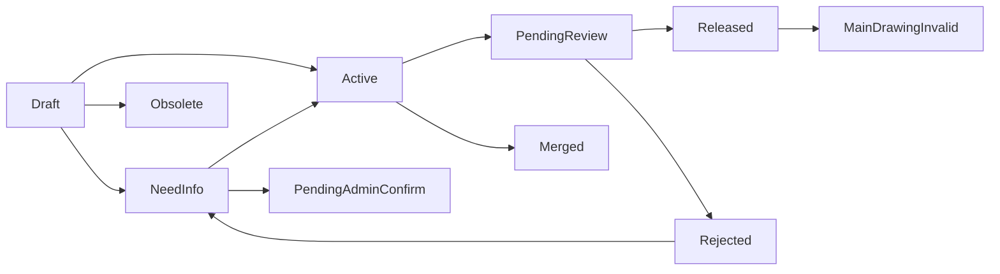

# SPEC-PDM-NUMBERING-001：圖號與料號自動化管理

狀態：Draft
日期：2026-05-31
適用系統：AI_PDM
來源文件：`2-RD-XXX_工程圖資料及編號管理辦法_V0.3.docx`
目的：將工程圖號、料號、主根號、版次、發行與審核規則系統化，降低 RD 人工查總表與判斷規則的精神消耗。

## 1. 背景與問題

現行圖號與料號領用需要 RD 人工理解辦法、查總表、判斷是否需圖號、是否沿用根號、是否可同圖多料號、是否需進版、是否有發行風險。此流程容易造成：

- 人工查表耗時。
- 主根號、圖號、料號撞號風險。
- 同一物件重複建立料號。
- 發行後圖面、料號、檔名與文件狀態不一致。
- 例外處理沒有完整追溯。
- 審核權限逐漸變多後，若寫死在程式碼內會難以維護。

本 spec 定義第一版 PDM 圖料號自動化管理模組，將規則轉為資料模型、狀態機、申請流程、警示與可設定的審核矩陣。

## 2. 設計原則

- 先領號，後補文件。
- 表單一建立即占號，號碼不可重用。
- 草稿階段快速流動，預設不審核。
- DVT、發行、已發行異動、資料關聯風險才強化審核。
- PDM 是主資料來源，總表只作為匯出報表。
- 料號不強制綁 BOM，BOM 只引用需要的料號。
- 查重、高相似、檔名不符等資訊只提醒並留痕，不消耗 RD 流程。
- 已發行文件與主要製造圖失效屬高風險，需阻擋或重新送審。
- 審核策略可由後台矩陣設定，資料一致性硬限制不可關閉。

## 3. 範圍

### 3.1 第一版包含

- 圖號自動產生。
- 料號自動產生。
- 料件主根號集中管理。
- 圖號與料號關聯。
- 同圖多料號差異欄位。
- 草稿、DVT、發行、已發行異動狀態流程。
- EVT 到 DVT 專案晉升清單。
- 查重提醒與紀錄。
- override 標示與紀錄。
- `!` 警示與懸浮/跳出說明。
- 作廢、合併、替代轉向關係。
- 總表匯出。
- 後台權限與審核矩陣設定台。
- 既有總表 staging 匯入、檢查報告與管理員確認。
- 編碼規則、審核規則與權限排序版本化。
- 內建角色、自訂角色、代理人設定。
- 待辦中心與系統內通知。
- append-only audit log、異動前後差異、稽核摘要匯出。
- 每月稽核報表 metadata 與可重產報表。

### 3.2 第一版不包含

- 建圖號時檢查 CAD 檔是否存在。
- 自動修改 CAD 檔名。
- 自動搬移 SolidWorks 檔案。
- 自動檢查 SolidWorks 內部參考連結。
- 強制料號進 BOM。
- 差異欄位標準字典強制化。

## 4. 名詞定義

| 名詞 | 定義 |
|---|---|
| 料件主根號 | `0001` 這類 4 碼根號，是圖號與料號共同的核心識別。 |
| 圖號 | `D-[料件根號]-[用途碼][流水號B]`，例如 `D-0001-MA1`。 |
| 料號 | `P-[料件根號]-[流水號C]`，例如 `P-0001-001`。 |
| MA 圖 | 製造用圖，唯一可作為主要製造圖的圖號用途。 |
| OT 圖 | 其他用途圖，例如爆炸圖、概念圖、溝通圖，不可作為主要製造圖。 |
| 萬用料號 | `P-xxxx-000`，用於客製尺寸、非唯一規格、專案化加工件等情境。 |
| 同圖多料號 | 一張 MA 圖對應多個料號，例如只差顏色、包裝、表面處理。 |
| override | 例外放行或例外規則，例如 DVT 自製件無 MA 圖仍轉有效。 |

## 5. 編碼規則

### 5.1 圖號

格式：

```text
D-[料件根號]-[用途碼][流水號B]
```

規則：

- 料件根號共 4 碼，從 `0001` 開始，由系統集中分配。
- 用途碼第一版只支援：
  - `MA`：Manufacture，製造用圖。
  - `OT`：Other，其他用圖。
- 流水號B 從 `1` 開始。
- `MA` 才能作為主要製造圖。
- `OT` 建立時必填用途描述。

### 5.2 料號

格式：

```text
P-[料件根號]-[流水號C]
```

規則：

- 流水號C 從 `001` 開始。
- `000` 為萬用料號。
- 所有外購件也需納入料號管理。
- 料號建立後不強制進 BOM。
- 料號可先建立，後續再補圖號。

### 5.3 占號規則

- 表單一建立即正式占號。
- 號碼一旦產生不可重用。
- 作廢、合併、退回、未核准都不釋放號碼。
- 根號、圖號、料號不可由 RD 手動指定造成衝突。

### 5.4 編碼規則版本化

每一筆圖號、料號與料件根號都需記錄產生時使用的規則版本。

需保存：

- 編碼規則版本。
- 產生時間。
- 產生者。
- 當時用途碼設定。
- 是否為匯入舊資料。
- 是否為 override。

規則變更時不可回頭改寫舊資料判讀邏輯。舊資料依建立當下的規則版本解讀，新申請套用新規則版本。

## 6. 資料模型

### 6.1 核心資料表

| 表 | 用途 |
|---|---|
| `part_roots` | 管理料件主根號。 |
| `part_numbers` | 管理料號主檔。 |
| `drawing_numbers` | 管理圖號主檔。 |
| `drawing_part_links` | 管理圖號與料號關聯。 |
| `same_drawing_variants` | 管理同圖多料號差異欄位。 |
| `revision_records` | 管理版次與進版紀錄。 |
| `duplicate_check_events` | 保存查重與高相似提醒紀錄。 |
| `override_requests` | 保存 override 類型、理由、審核與標示。 |
| `document_links` | 管理 CAD、PDF、規格書等掛載文件。 |
| `impact_analysis_events` | 保存影響分析結果。 |
| `approval_rules` | 後台審核矩陣設定。 |
| `approval_requests` | 實際審核申請。 |
| `approval_decisions` | 審核結果與意見。 |
| `warning_events` | `!` 警示與懸浮/跳出說明資料。 |
| `redirect_links` | 作廢、合併、替代關係。 |
| `audit_logs` | 全部異動紀錄。 |
| `export_jobs` | 總表匯出工作與設定。 |
| `import_batches` | 既有總表匯入批次、來源、狀態與確認紀錄。 |
| `import_staging_rows` | 匯入暫存列資料、檢查結果、衝突與待補標記。 |
| `rule_versions` | 編碼規則、審核矩陣、權限排序等規則版本。 |
| `rule_templates` | 審核矩陣預設模板。 |
| `roles` | 內建角色與自訂角色。 |
| `role_permissions` | 頁面權限與動作權限。 |
| `role_priority_versions` | 最高權限角色排序版本。 |
| `approval_delegations` | 管理員設定的代理人、專案、動作與時間區間。 |
| `task_items` | 待辦中心項目。 |
| `notifications` | 系統內通知、已讀/未讀與處理狀態。 |
| `monthly_audit_reports` | 每月稽核報表 metadata、產生條件與重產紀錄。 |

### 6.2 建議唯一約束

- `part_roots.root_code` 唯一。
- `part_numbers.part_number` 唯一。
- `drawing_numbers.drawing_number` 唯一。
- 一個料號最多一個主要 MA 圖。
- 一個 MA 圖可對應多個料號。
- 作廢與合併料號保留轉向關係。

## 7. 狀態設計

### 7.1 階段欄位

`development_phase`：

- `EVT`
- `DVT`
- `PVT`
- `Release`
- `ECR`

### 7.2 資料狀態欄位

`record_status`：

- `Draft`：草稿。
- `NeedInfo`：待補資料。
- `Active`：有效。
- `PendingReview`：待審。
- `Released`：已發行。
- `Rejected`：退回待補。
- `Obsolete`：作廢。
- `Merged`：已合併。
- `EVTDisabled`：EVT 停用。
- `PendingAdminConfirm`：逾期待管理員確認。
- `MainDrawingInvalid`：主要圖失效。

### 7.3 基本狀態機



## 8. 料件建立流程

### 8.1 建立時必填

- 階段。
- 料件類型。
- 核心品名。
- 外購、自製、發包、共用、客製尺寸分類。
- 是否需要製造圖。
- 是否需製程管制。
- 建立原因。

### 8.2 可後續補填

- 完整品名。
- 規格。
- 材質。
- 顏色。
- 表面處理。
- 供應商。
- 文件連結。
- PDF 連結。
- 備註。
- 是否可用於 BOM。

### 8.3 預設狀態

- 料號建立後預設 `Draft`。
- 草稿超過 30 天未補齊必要資料，轉 `PendingAdminConfirm`。
- 管理員可延長、作廢、要求補件或轉有效。

## 9. EVT 到 DVT 晉升

### 9.1 原則

- EVT 原則彈性，不強制正式納管。
- DVT 起依規則強制納管。
- 塑膠射出、模具、發包加工、高成本長交期等 EVT 高風險件只提醒，由 RD 決定是否提前納管。

### 9.2 專案晉升精靈

流程：

```text
選擇專案與階段 EVT -> DVT
-> 系統掃描專案料號、圖號、文件
-> 產生 DVT 納管清單
-> RD 選擇送入 DVT、保留 EVT 草稿、EVT 停用或作廢
-> 系統檢查資料完整性
-> 完整資料批次送審
-> 不完整資料留待補
```

### 9.3 EVT 草稿處置

| 動作 | 定義 |
|---|---|
| 送入 DVT | 進入 DVT 待審與正式納管。 |
| 保留 EVT 草稿 | 保留實驗可能，不進 DVT。 |
| EVT 停用 | 暫停使用，未完全否定，未來可恢復。 |
| 作廢 | 明確不再使用，號碼保留不可重用。 |

### 9.4 EVT 停用恢復

- 若沒有相似新料號，RD 可自行恢復。
- 若已有相似新料號，需管理員審核。
- 已作廢不可直接恢復。
- 已合併不可直接恢復，需管理員處理。

## 10. 圖號與料號關聯

### 10.1 主要製造圖

- 主要製造圖只能是 `MA`。
- `OT` 不可作為主要製造圖。
- 一個料號最多一個主要 `MA` 圖。
- 一個 `MA` 圖可對應多個料號。

### 10.2 DVT 起 MA 圖要求

| 料件類型 | DVT 起是否需主要 MA 圖 |
|---|---|
| 自製件 | 需要 |
| 發包加工件 | 需要 |
| 塑膠射出/模具件 | 需要 |
| 需製程管制件 | 需要 |
| 外購標準品 | 不需要 |
| OT 參考圖 | 不適用 |

若 DVT 起自製或發包件無 MA 圖，原則上不可轉有效，但可申請 override，需管理員審核。

### 10.3 無 MA 圖發行例外

- DVT 無 MA 圖 override 不設期限。
- 發行時仍允許無 MA 圖發行，但需發行審核再次確認。
- 所有 override 都需在畫面與總表匯出中標示。

## 11. OT 圖號

建立 `OT` 圖號時，用途描述必填。

內建常用選項：

- 爆炸圖。
- 設計概念圖。
- 組裝參考圖。
- 包裝示意圖。
- 檢驗參考圖。
- 客戶溝通圖。
- 供應商溝通圖。
- 測試配置圖。
- 其他，自行填寫。

## 12. 同圖多料號

### 12.1 規則

- 只要製造圖不變，可共用同一張 MA 圖並拆多個料號。
- DVT 起同圖多料號需填差異欄位。
- 差異欄位允許多個。
- 差異欄位第一版可自由輸入，未來再整理成標準字典。
- 同圖多料號差異欄位需顯示於總表匯出。

### 12.2 差異欄位範例

- 顏色。
- 材質。
- 表面處理。
- 長度。
- 尺寸。
- 包裝方式。
- 標籤/印刷。
- 配件組合。
- 客戶版本。
- 供應商版本。
- 滅菌狀態。
- 語系版本。
- 其他。

### 12.3 發行後新增同圖多料號

- 表單建立時立即產生料號。
- 未核准前狀態為 `PendingReview`，畫面標示 `待審不可用`。
- 查詢可看到，但需醒目警示。
- 可被選入文件或表單，但需顯示警示。
- 發行前若仍待審，阻擋正式發行。
- 發行後新增同圖多料號一律需要管理員審核。
- 只有圖面內容改變才需要文件進版。

## 13. 萬用料號

`P-xxxx-000` 使用情境：

- 客製尺寸。
- 非唯一規格。
- 專案化加工件。
- 訂單決定尺寸。
- 現場裁切或調整。
- 其他。

規則：

- 只需填使用理由。
- 不強制填結構化尺寸參數。
- 系統提醒實際尺寸或規格需能在圖面、訂單、專案文件或其他文件中追溯。
- 萬用料號無使用理由時阻擋發行。

## 14. 外購件

- 所有外購件都需要料號。
- 外購標準品不需要圖號。
- 外購但需客製加工、發包加工或供應商依圖加工者需要圖號。
- 一般標準品不強制供應商欄位。
- 指定供應商外購件需填供應商。
- 指定品牌外購件需填品牌，供應商建議填。

## 15. 查重

### 15.1 查重時機

- RD 輸入核心品名後。
- RD 輸入規格、材質、品牌後。
- 建立完成前。
- 管理員審核畫面。

### 15.2 查重結果

- 高相似只提醒，不阻擋。
- 高相似不要求 RD 填仍建立原因。
- 管理員畫面需特別標示高相似。
- 系統留存提醒紀錄、相似件、使用者動作與時間。

## 16. 品名與欄位變更

### 16.1 品名修改

- 草稿可直接修改，不審核。
- 有效後任何品名修改需管理員審核。
- 品名變更原因必填。
- 核准前主檔保留舊品名。
- 核准後更新正式品名。
- 品名變更後自動更新建議檔名，但不改實體檔名。

### 16.2 影響文件分析

變更以下欄位需啟動影響分析：

- 品名。
- 規格。
- 材質。
- 顏色。
- 表面處理。
- 圖號。
- 料號。
- 版次。
- 製程管制需求。
- 供應商或外購規格。

系統需列出可能受影響文件：

- 2D 工程圖。
- 3D 檔案。
- PDF 發行圖。
- 檢驗規格。
- 組裝圖。
- 包裝圖。
- 供應商加工圖。
- SOP / WI。
- BOM，僅提醒，不強制關聯。
- 總表匯出資料。

### 16.3 不進版理由

| 文件狀態 | 不進版理由 |
|---|---|
| 草稿文件 | 選填 |
| 有效文件 | 建議填寫 |
| 已發行文件 | 必填 |
| 供應商已使用文件 | 必填，且建議管理員確認 |

管理員審核品名變更時，可同步建立文件進版待辦。

## 17. 文件與檔名

### 17.1 建圖號時不檢查 CAD

建圖號時不可要求 CAD 檔存在，因實務上 RD 必須先領圖號，才能將圖號填入 CAD 或工程圖。

正確流程：

```text
RD 建立料件或圖號
-> 系統產生圖號
-> RD 將圖號填入 CAD / 工程圖
-> RD 掛載或回填檔案路徑
-> 系統做檔名、路徑、版次檢查
-> DVT 或發行時審核
```

### 17.2 文件掛載條件

DVT 送審前是否需掛文件依料件類型判斷：

| 料件類型 | DVT 送審前是否需掛文件 |
|---|---|
| 模具、塑膠射出、發包加工件 | 需要 |
| 自製件且需製程管制 | 需要 |
| 供應商依圖加工件 | 需要 |
| 一般自製草稿件 | 提醒，不阻擋 |
| 外購標準品 | 不需工程圖，建議掛規格書 |
| 客製尺寸件 `000` | 建議掛參數規格或說明文件 |
| OT 圖號 | 依用途提醒，不強制 |

### 17.3 發行文件要求

只有以下類型發行時需要 PDF 工程圖或規格文件：

- 自製件。
- 發包加工件。
- 需製程管制件。
- 供應商需依圖加工件。
- 模具、治具、夾具。
- 塑膠射出件。

### 17.4 檔名不符

- 檔名不符合建議只提醒，不阻擋 DVT 或發行。
- 系統需在發行清單、管理員審核畫面與匯出異常欄標示。
- 系統不自動更改實體檔名。

## 18. MA 圖作廢

### 18.1 作廢前影響提醒

主要 MA 圖作廢前，系統需跳出影響範圍提醒，主管審核畫面也需可見。

影響資訊包含：

- 作廢圖號。
- 對應料件根號。
- 受影響料號清單。
- 料號目前狀態。
- 是否已發行。
- 是否有待審、待補、進版待辦。
- 是否有文件引用。
- 是否有同圖多料號。
- 是否存在替代 MA 圖。

### 18.2 作廢後處理

```text
MA 圖作廢
-> 底下料號全部轉 MainDrawingInvalid
-> 料號完全阻擋使用
-> RD 重新處置
-> 重新送審
-> 審核通過後才能恢復使用
```

`MainDrawingInvalid` 狀態下：

- 不可發行。
- 不可標示有效。
- 不可作為正式新文件引用。
- 不可匯出為可用料號。
- 可查詢，但需明確標示不可用。
- 需要重新送審。

若同一張新 MA 圖覆蓋多個料號，允許批次重新送審。

## 19. 作廢、合併與轉向

### 19.1 作廢

- 草稿作廢可由 RD 自行執行。
- 發行後作廢料號需審核。
- 作廢料號不一定要填替代料號，可無替代。
- 作廢號碼不可重用。

### 19.2 合併

- 草稿合併到既有件時，若未被文件引用，RD 可自行合併並留紀錄。
- 若已被文件引用，需審核。
- DVT、發行、已發行資料合併需審核。

### 19.3 轉向關係

作廢或合併料號都需保留轉向關係。

轉向類型：

- 替代料號。
- 合併至料號。
- 無替代。
- 暫無。

查詢舊料號時，系統需提示：

```text
P-0001-003 已合併至 P-0001-001，請使用 P-0001-001。
```

或：

```text
P-0002-004 已作廢，替代料號：P-0002-006。
```

## 20. Override

### 20.1 原則

- RD 可提出 override。
- 需審核的 override 由管理員或矩陣指定角色審核。
- 所有 override 必須留紀錄。
- 所有 override 必須在畫面與總表匯出中標示。

### 20.2 常見 override

- DVT 自製或發包件無 MA 圖仍轉有效。
- 發行時無 MA 圖再次確認。
- 外購件仍建立圖號。
- EVT 提前或延後納管。
- 萬用料號使用。
- 特殊用途碼或特殊圖號關係。
- 發行阻擋項允許例外。

### 20.3 發行阻擋 override

- 草稿或內部文件類阻擋可 override。
- 已發行文件相關阻擋不可 override。
- 已發行文件未完成進版待辦會阻擋發行。
- 草稿文件未完成進版待辦只提醒，不阻擋。

## 21. `!` 警示設計

所有風險資訊用 `!` 驚嘆號顯示。

互動方式：

- 滑鼠懸浮顯示短說明。
- 點擊可開啟完整影響頁或跳出頁面說明。

常見警示：

- `! 待審不可用`
- `! 有 override`
- `! 主要 MA 圖失效`
- `! 高相似料號`
- `! 已被文件引用`
- `! 無 MA 圖發行`
- `! 檔名不符合建議`
- `! 發行文件待進版`
- `! 作廢/合併轉向`

待審不可用料號被引用時，系統需記錄引用位置，並透過 `!` 呈現懸浮或跳出說明。

## 22. 權限與審核矩陣設定台

### 22.1 設計目標

審核規則不可寫死在程式碼中。後台需提供 UI 設定台，讓管理員依公司制度調整。

判斷模型：

```text
動作 × 資料狀態 × 階段 × 料件類型 × 風險條件
-> 是否需審核 / 誰審核 / 是否阻擋 / 是否警示 / 是否匯出標示
```

### 22.1.1 預設模板

後台審核矩陣需內建三個模板：

- `研發效率優先`：草稿幾乎不審核，DVT/發行才審核。
- `標準管制`：採用本 spec 目前定案規則，作為系統預設模板。
- `嚴格管制`：DVT 後多數異動都需審核。

管理員可複製模板後調整，不應直接修改系統內建模板本體。

### 22.1.2 規則版本生效

審核規則異動採版本生效，不直接覆蓋歷史規則。

每次異動需產生：

- 規則版本。
- 生效時間。
- 異動者。
- 異動原因。
- 異動前後差異。

既有流程原則上依流程建立當下的規則版本判斷；新流程套用最新生效規則。

### 22.2 預設審核矩陣

| 動作 | 草稿 | EVT | DVT | 發行前 | 已發行 | 預設審核 |
|---|---:|---:|---:|---:|---:|---|
| 建立料號 | 不審核 | 不審核 | 不審核 | 不審核 | 不適用 | 無 |
| 建立圖號 | 不審核 | 不審核 | 不審核 | 不審核 | 不適用 | 無 |
| 修改品名 | 不審核 | 不審核 | 需審核 | 需審核 | 需審核 | 管理員 |
| 修改規格 | 不審核 | 不審核 | 可設定 | 可設定 | 需審核 | 管理員 |
| 同圖多料號 | 不審核 | 不審核 | 需審核 | 需審核 | 需審核 | 管理員 |
| 作廢料號 | RD 可作廢 | RD 可作廢 | 需審核 | 需審核 | 需審核 | 管理員 |
| 作廢 MA 圖 | 影響提醒 | 影響提醒 | 需審核 | 需審核 | 需審核 | 主管/管理員 |
| 合併料號 | 無引用不審核 | 無引用不審核 | 需審核 | 需審核 | 需審核 | 管理員 |
| EVT 停用恢復 | 高相似需審核 | 高相似需審核 | 不適用 | 不適用 | 不適用 | 管理員 |
| DVT 無 MA 圖 override | 不適用 | 不適用 | 需審核 | 需再次確認 | 需再次確認 | 管理員 |
| 發行 | 不適用 | 不適用 | 可送審 | 需審核 | 不適用 | 主管/管理員 |
| 發行後異動 | 不適用 | 不適用 | 不適用 | 不適用 | 需審核 | 主管/管理員 |

### 22.3 規則欄位

| 欄位 | 說明 |
|---|---|
| 規則名稱 | 例如：已發行料號作廢。 |
| 適用動作 | 建立、修改、作廢、合併、override、發行。 |
| 適用階段 | EVT、DVT、PVT、發行、設變。 |
| 適用狀態 | 草稿、有效、待審、已發行、作廢等。 |
| 適用料件類型 | 外購、自製、發包、共用、客製尺寸等。 |
| 風險條件 | 有引用、MA 圖失效、高相似、有 override 等。 |
| 是否需審核 | 是/否。 |
| 審核角色 | RD 主管、PDM 管理員、品保、文件管理員等。 |
| 審核層級 | 單人核准、任一人核准、多人會簽。 |
| 是否阻擋使用 | 是/否。 |
| 是否阻擋發行 | 是/否。 |
| 是否顯示 `!` | 是/否。 |
| 是否匯出標示 | 是/否。 |
| 生效日 | 規則版本控管。 |
| 備註 | 制度說明。 |

### 22.4 UI 區塊

後台設定頁：

```text
系統設定
├─ 編碼規則
├─ 用途碼設定
├─ 差異欄位字典
├─ 權限與審核矩陣
├─ Override 類型設定
├─ 警示規則設定
├─ 發行檢查規則
├─ 匯出欄位設定
└─ 規則異動紀錄
```

權限與審核矩陣頁面包含：

- 矩陣總覽。
- 規則編輯器。
- 規則模擬器。
- 規則異動紀錄。

顏色建議：

- 綠色：不審核。
- 黃色：提醒。
- 橘色：需審核。
- 紅色：阻擋。

### 22.5 規則模擬器

管理員可輸入情境：

```text
料件類型：自製件
階段：DVT
狀態：有效
動作：修改品名
是否有文件引用：是
```

系統回覆：

```text
結果：需管理員審核
發行阻擋：否
顯示警示：是
套用規則：DVT 有效資料品名變更
```

### 22.6 不可關閉硬限制

即使後台可自由設定，以下限制不可關閉：

- 料號不可重複。
- 圖號不可重複。
- 根號不可手動撞號。
- 作廢號不可重用。
- 已合併或作廢需保留轉向關係。
- override 必須留紀錄。
- MA 圖作廢需做影響分析。
- 已發行文件相關阻擋不可 override。

### 22.7 角色與權限

系統採內建角色為預設，管理員可新增自訂角色。

內建角色：

- RD。
- RD 主管。
- PDM 管理員。
- 文件管理員。
- QA / 品保。
- 系統管理員。

自訂角色可由管理員建立，例如：

- 模具審核者。
- 外購件資料管理者。
- 發行文件覆核者。
- 專案技術負責人。

角色權限分兩層：

- 頁面權限：能看哪些頁面。
- 動作權限：能做哪些操作。

動作權限至少包含：

- 建立料號。
- 建立圖號。
- 修改草稿。
- 修改有效資料。
- 作廢草稿。
- 作廢已發行資料。
- 合併料號。
- 提出 override。
- 審核 override。
- 發行審核。
- 設定審核矩陣。
- 匯出總表。

### 22.8 權限衝突與角色排序

同一使用者具備多個角色且權限衝突時，採最高權限角色優先。

系統內建排序：

```text
系統管理員 > PDM 管理員 > RD 主管 > 文件管理員 / QA > 自訂角色 > RD
```

只有系統管理員可調整角色權限排序。

調整排序需留紀錄：

- 調整前排序。
- 調整後排序。
- 調整者。
- 調整時間。
- 調整原因。

### 22.9 代理人

允許代理人，但只能由管理員設定。

代理範圍可依以下條件設定：

- 專案。
- 動作類型。
- 時間區間。

代理審核時需標示：

```text
此審核由代理人執行
被代理人：王小明
代理人：陳小華
代理範圍：PDM-2026-001 / 發行審核
```

代理紀錄需包含：

- 原審核角色或人員。
- 代理人。
- 代理範圍。
- 生效時間。
- 設定者。
- 代理期間執行過的審核。

### 22.10 管理員代送審

管理員可代送審，但必須標示 `代送審`，且原因必填。

需記錄：

- 原應送審人。
- 代送審管理員。
- 代送審原因。
- 送審時間。
- 批次或單筆項目。
- 是否通知原 RD。

### 22.11 送審批次與退回

同專案可批次審核，不允許跨專案批次審核。

批次審核條件：

- 同一專案。
- 同一階段。
- 同一審核規則。
- 無高風險異常，或異常類型一致。
- 管理員具備該規則的審核權限。

批次審核允許共用審核意見，但異常項需個別意見。

送審批次退回後保留原批次，補完後只重新送退回項目。

範例：

```text
Batch-001
已核准：30 筆
退回：5 筆
重新送審：只送 5 筆
```

## 23. 發行閘門

發行前系統檢查：

| 檢查項 | 結果 |
|---|---|
| 已發行文件有未完成進版待辦 | 阻擋發行 |
| 草稿文件有未完成進版待辦 | 提醒，不阻擋 |
| 有效資料品名變更未審核 | 阻擋發行 |
| 圖號或料號缺必要欄位 | 阻擋發行 |
| 查重高相似未處理 | 提醒，不阻擋 |
| 萬用料號 `000` 無使用理由 | 阻擋發行 |
| 檔名不符合建議 | 提醒，不阻擋 |
| 待審不可用料號仍被正式引用 | 阻擋發行 |
| 無 MA 圖發行 override | 需再次確認 |

## 24. 既有總表匯入

### 24.1 匯入流程

既有總表匯入需採 staging 暫存區，不可直接寫入正式主檔。

流程：

```text
匯入原始總表
-> 進入 staging 暫存區
-> 系統檢查格式、重複、缺資料、關聯
-> 產生匯入報告
-> 管理員確認
-> 批次轉入正式主檔
```

### 24.2 匯入結果狀態

| 匯入結果 | 狀態 |
|---|---|
| 格式正確且無衝突 | 有效 |
| 缺品名、規格、用途等 | 待補資料 |
| 圖號/料號格式異常 | 待管理員確認 |
| 重複號碼 | 匯入衝突 |
| 有料號但找不到圖號關聯 | 待關聯確認 |
| 舊制度資料 | 舊制保留 |

歷史資料可標記為 `舊制保留`，不強迫符合新編碼規則，但需可查詢與追溯。

### 24.3 匯入紀錄

匯入批次需保留：

- 原始檔案名稱與 hash。
- 匯入者。
- 匯入時間。
- 檢查報告。
- 管理員確認紀錄。
- 成功轉入筆數。
- 待補、衝突、舊制保留筆數。

## 25. 總表匯出

PDM 是主資料來源，總表只作為匯出。

匯出欄位建議：

- 料件根號。
- 料號。
- 品名。
- 主要製造圖號。
- 圖號用途碼。
- OT 用途描述。
- 是否同圖多料號。
- 差異欄位。
- 差異值。
- 階段。
- 狀態。
- 版次。
- 是否萬用料號。
- 萬用料號使用理由。
- 是否有 override。
- override 類型。
- 是否待審不可用。
- 是否主要圖失效。
- 是否作廢/合併。
- 轉向料號。
- 建立者。
- 建立日期。
- 最後異動者。
- 最後異動日期。

### 25.1 稽核摘要匯出

總表匯出時提供：

- `不含稽核摘要`。
- `最後異動摘要`。
- `完整異動摘要`。

`最後異動摘要` 欄位：

- 最後異動者。
- 最後異動時間。
- 最後異動類型。
- 最後異動原因。
- 最後審核者。
- 最後審核時間。

`完整異動摘要` 欄位：

- entity type。
- entity id。
- 操作類型。
- 操作者。
- 操作角色。
- 操作時間。
- 修改前摘要。
- 修改後摘要。
- 原因。
- 關聯審核單。
- override 標示。

## 26. 主要 UI

### 26.1 使用者功能

- 新增圖料號申請。
- 料件查詢。
- 圖號查詢。
- 料號查詢。
- EVT 到 DVT 晉升清單。
- DVT/發行待審核。
- 逾期待管理員確認。
- 作廢與合併紀錄。
- 總表匯出。
- 待辦中心。
- 通知中心。

### 26.2 申請完成頁

需顯示：

- 品名。
- 主根號。
- 料號。
- 圖號，若適用。
- 是否需主要 MA 圖。
- 是否需文件掛載。
- 建議檔名。
- 建議存放區。
- 目前狀態。
- `!` 警示。
- 下一步動作。

### 26.3 待辦中心

待辦不設定期限，避免制度形成壓力來源；但前述草稿 30 天未補齊資料仍會轉 `PendingAdminConfirm`。

待辦分類：

- 待審核。
- 待補資料。
- 待進版。
- 主要圖失效。
- 發行閘門未通過。
- 逾期待管理員確認。
- Override 待確認。

預設依風險排序：

1. 主要圖失效。
2. 發行阻擋。
3. 已發行文件待進版。
4. 待審不可用料號。
5. Override 待確認。
6. DVT / 發行待審核。
7. 待補資料。
8. 一般提醒。

使用者可切換排序：

- 風險排序。
- 建立時間。
- 專案。
- 料件類型。
- 審核類型。

待辦可視範圍：

- 個人看自己的待辦。
- 主管可看部門 + 專案權限範圍內待辦。
- 管理員可看全系統待辦。

主管待辦範圍需可由後台設定部門與專案權限。

### 26.4 系統內通知

第一版只做系統內通知，不做 email、LINE 或 Teams。

通知狀態分為兩個維度：

- 已讀 / 未讀。
- 已處理 / 未處理。

資訊類通知可由使用者關閉：

- 查重提醒。
- 檔名不符。
- 一般資訊。
- 匯出完成。

待處理與阻擋通知不可關閉、不可延後：

- 待審核。
- 待補資料。
- 發行阻擋。
- 主要圖失效。
- 已發行文件待進版。
- override 待確認。

## 27. Audit Log 與稽核報表

### 27.1 Audit Log 原則

Audit log 採 append-only，不允許修改或刪除。

所有異動都需存修改前後差異。

審核不做二次密碼或電子簽核，第一版只記錄登入者與時間。

可查看稽核紀錄者：

- 相關 RD。
- 主管。
- 管理員。

### 27.2 Audit Log 欄位

建議欄位：

```text
entity_type
entity_id
action
before_json
after_json
diff_json
actor_user_id
actor_role
acted_at
source_ip
reason
related_project_id
related_approval_request_id
```

設計要求：

- Audit log 永久保留。
- 檔案本體不進 audit log，只記錄 file asset id、路徑、hash、版本。
- 常用查詢欄位需建立索引，例如 `entity_type`, `entity_id`, `acted_at`, `actor_user_id`。
- 不對整包 JSONB 亂建 GIN index，除非已有明確查詢需求。

### 27.3 檔案索引與未來 Storage 轉移

第一版不存 Supabase Storage，只存 J 槽路徑、檔案 hash 與 metadata。未來預留轉移到 Supabase Storage 的能力。

建議 `file_assets` 欄位：

| 欄位 | 說明 |
|---|---|
| `id` | 檔案紀錄 ID |
| `storage_provider` | `j_drive` / `supabase_storage` / `external` |
| `original_path` | 原始 J 槽路徑 |
| `storage_key` | 未來 Supabase Storage object key |
| `file_name` | 檔名 |
| `file_ext` | 副檔名 |
| `file_size` | 檔案大小 |
| `content_hash` | SHA-256 或其他 hash |
| `hash_algorithm` | hash 演算法 |
| `linked_entity_type` | part / drawing / revision / approval |
| `linked_entity_id` | 對應資料 |
| `revision` | 文件版次 |
| `sync_status` | local_only / migrated / missing / hash_mismatch |
| `created_at` | 建立時間 |
| `updated_at` | 更新時間 |

未來轉移階段：

1. `Local Index Only`：只記錄 J 槽路徑、hash、檔案資訊。
2. `Dual Reference`：同時保留 J 槽原路徑與 Supabase Storage key。
3. `Supabase Primary`：Supabase Storage 成為主儲存，J 槽為歷史來源或同步副本。

### 27.4 每月稽核報表

每月 1 日自動產生上月報表，管理員可手動重產。

報表範圍：

- 全公司總覽。
- 部門分頁。

報表檔案不永久保存，只保存 metadata，檔案可重產。

可視權限依後台權限矩陣設定。

報表建議包含：

- 新增料號數。
- 新增圖號數。
- 作廢料號數。
- 作廢圖號數。
- 合併料號數。
- override 次數。
- 無 MA 圖發行次數。
- MA 圖作廢影響料號數。
- 主要圖失效未處理清單。
- 已發行文件未進版但有異動清單。
- 審核退回次數。
- 代送審次數。
- 高相似仍建立件數。
- 檔名不符提醒件數。

Excel 建議分頁：

- 公司總覽。
- RD 部門。
- QA/品保。
- 文件管理。
- 專案彙總。
- Override 明細。
- 作廢/合併明細。
- 主要圖失效明細。
- 發行阻擋明細。
- 代送審明細。

`monthly_audit_reports` metadata 建議欄位：

- 報表類型。
- 報表月份。
- 產生方式：auto / manual。
- 產生者。
- 產生時間。
- 查詢條件。
- 資料範圍。
- 產生狀態。
- 下載次數。
- 最後下載者。
- 最後下載時間。
- 重產原因。
- 產生用規則版本。

## 28. API 草案

第一版 API 可依既有專案風格命名，以下為概念草案：

| API | 用途 |
|---|---|
| `POST /api/numbering/part-numbers` | 建立料號並占號。 |
| `POST /api/numbering/drawing-numbers` | 建立圖號並占號。 |
| `POST /api/numbering/duplicate-check` | 執行查重。 |
| `POST /api/numbering/variants` | 新增同圖多料號。 |
| `POST /api/numbering/phase-promotions` | 建立 EVT 到 DVT 晉升清單。 |
| `POST /api/numbering/override-requests` | 建立 override 申請。 |
| `POST /api/numbering/impact-analysis` | 執行影響分析。 |
| `POST /api/numbering/approval-requests` | 建立送審。 |
| `POST /api/numbering/approval-decisions` | 審核決策。 |
| `GET /api/numbering/approval-rules` | 取得審核矩陣。 |
| `PUT /api/numbering/approval-rules/:id` | 更新審核矩陣規則。 |
| `POST /api/numbering/rule-simulator` | 模擬規則結果。 |
| `POST /api/numbering/export-jobs` | 建立總表匯出。 |
| `POST /api/numbering/import-batches` | 建立既有總表 staging 匯入批次。 |
| `POST /api/numbering/import-batches/:id/confirm` | 管理員確認匯入批次並轉正式主檔。 |
| `GET /api/numbering/tasks` | 取得待辦中心資料。 |
| `GET /api/numbering/notifications` | 取得系統內通知。 |
| `POST /api/numbering/notifications/:id/read` | 標記通知已讀。 |
| `POST /api/numbering/monthly-audit-reports` | 手動重產指定月份稽核報表。 |
| `GET /api/numbering/monthly-audit-reports/:id/download` | 下載或重產稽核報表檔。 |

## 29. 驗收條件

### 29.1 編碼與占號

- 建立料號時，系統能立即產生唯一料號。
- 建立圖號時，系統能立即產生唯一圖號。
- 同時兩人建立資料時不可撞號。
- 作廢、退回、未核准號碼不可重用。
- 每筆圖號、料號需記錄編碼規則版本。

### 29.2 草稿流程

- 草稿建立、修改、作廢不需審核。
- 草稿超過 30 天未補齊資料會轉待管理員確認。
- 草稿可先有料號，後續再補圖號。

### 29.3 DVT 與發行流程

- EVT 到 DVT 晉升清單可列出送入 DVT、保留 EVT 草稿、EVT 停用、作廢選項。
- 完整資料可批次送審，不完整資料留待補。
- DVT 起自製/發包件無 MA 圖不可直接轉有效，但可申請 override。
- 發行時無 MA 圖 override 需再次確認。

### 29.4 同圖多料號

- 一個料號最多只能有一張主要 MA 圖。
- 一張 MA 圖可對應多個料號。
- DVT 起同圖多料號需填至少一組差異欄位。
- 發行後新增同圖多料號需審核。
- 待審不可用料號可查詢、可選入草稿文件，但發行前阻擋。

### 29.5 影響分析

- 品名有效後變更需審核且原因必填。
- 系統需列出受影響文件。
- 已發行文件不進版理由必填。
- MA 圖作廢前需顯示影響範圍。
- MA 圖作廢後受影響料號轉主要圖失效並完全阻擋使用。

### 29.6 警示與匯出

- 所有 override 都需以 `!` 標示。
- 待審不可用、主要圖失效、高相似、檔名不符需可用 `!` 查看說明。
- 總表匯出需包含 override 標示、差異欄位與轉向關係。
- 總表匯出需可選擇不含稽核摘要、最後異動摘要或完整異動摘要。

### 29.7 後台矩陣

- 管理員可透過 UI 設定審核規則。
- 規則模擬器可依情境回傳審核、阻擋、警示結果。
- 不可關閉硬限制仍需有效。
- 規則異動需留 audit log。
- 審核矩陣需提供研發效率優先、標準管制、嚴格管制三個模板。
- 規則異動需建立新版本並記錄生效時間。

### 29.8 總表匯入

- 既有總表匯入需先進入 staging。
- 系統需產生匯入檢查報告。
- 管理員確認後才可轉入正式主檔。
- 舊制資料可標記為舊制保留，不需強制符合新規則。

### 29.9 角色、代理、待辦與通知

- 管理員可建立自訂角色並設定頁面權限與動作權限。
- 同一使用者多角色衝突時採最高權限角色優先。
- 只有系統管理員可調整角色排序。
- 管理員可設定代理人，範圍可依專案、動作類型、時間區間。
- 管理員代送審需標示且原因必填。
- 待辦中心需依風險排序，並允許使用者切換排序。
- 系統內通知需分已讀/未讀與已處理/未處理。
- 資訊類通知可關閉；待處理與阻擋通知不可關閉、不可延後。

### 29.10 Audit 與月報

- Audit log append-only，不可修改或刪除。
- 所有異動需存 before、after、diff。
- Audit log 永久保留。
- 檔案第一版只存 J 槽路徑、hash 與 metadata，並預留 Supabase Storage key。
- 每月 1 日需自動產生上月稽核報表 metadata。
- 管理員可手動重產指定月份報表。
- 報表需支援全公司總覽與部門分頁。
- 報表檔可重產，不需永久保存檔案本體。

## 30. 殘留風險

- 既有總表資料可能格式不一致，匯入後需待補與衝突處理。
- 差異欄位第一版自由輸入，未來需要資料清理與標準字典。
- 檔名不符只提醒不阻擋，需靠審核畫面與報表降低長期累積風險。
- SolidWorks 內部參考連結不在第一版檢查範圍，第二版需規劃 CAD link 檢查。
- 後台審核矩陣彈性高，需保留規則模擬器與 audit log，避免設定錯誤造成流程異常。
- Audit log 永久保留會累積資料量，需以索引、分區或查詢策略控制效能。
- 第一版只存 J 槽路徑，若使用者本機未掛載 J 槽或權限不足，仍可能無法開啟檔案。
- 月報檔案採重產策略，若規則版本或資料修正後重產，需明確標示產生用規則版本。

## 31. 未納入第一版但建議後續規劃

- CAD 檔案實體存在檢查擴充。
- SolidWorks 參考連結檢查。
- Pack and Go 流程輔助。
- 差異欄位標準字典與自訂欄位治理。
- 料號與 BOM 引用關係視覺化。
- 發行區與工作區路徑規則檢查。
- 供應商文件與採購詢價流程串接。
- Supabase Storage 實體檔案搬遷與雙軌同步。
