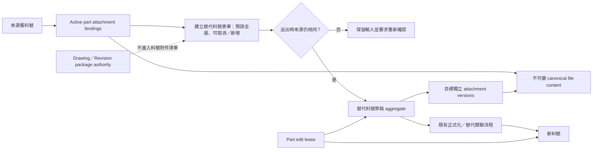

# SPEC-PDM-PART-ATTACHMENT-REUSE-001：替代料號附件快照沿用與料號級排他鎖

Status: `Historical / Superseded by DEV-088 Planning / RD Not Eligible / Not Executable`
Date: 2026-08-20
Owner: Dev PM
Historical DEV: `DEV-084` / `DEV-PDM-REPLACEMENT-PART-ATTACHMENT-REUSE-001`; successor: `DEV-088` / `DEV-PDM-REPLACEMENT-PART-ATTACHMENT-REUSE-002`
Risk: High for implementation because this changes part-attachment authorization, ownership representation and every part write's concurrency boundary
Related ADR: `.ai-doc/decisions/ADR-PDM-PART-ATTACHMENT-REUSE-001-snapshot-reference-and-whole-part-lock.md`
Execution boundary: No RD implementation is authorized from this historical package. The former Phase 1A-1E package is retained only as design input. Successor DEV-088 may be re-scoped only after DEV-087 local implementation and independent QA/QC complete; DEV-084 never reopens and neither task is part of DEV-087.

Related authority:

- `.ai-doc/specs/SPEC-PDM-FILE-OWNERSHIP-001-contextual-drawing-part-files-and-3d-reuse.md`
- `.ai-doc/decisions/ADR-PDM-FILE-OWNERSHIP-001-contextual-files-and-3d-content-reuse.md`
- `.ai-doc/specs/SPEC-PDM-CHANGE-CONTROL-001-revision-part-bom-flow.md`
- `.ai-doc/decisions/ADR-PDM-MATERIAL-IDENTITY-REVISION-001-part-number-vs-controlled-definition-revision.md`

## 0. Authority、Spec Impact 與成熟度

2026-08-22 execution supersession：本SPEC不再是可直接派工的implementation authority。只保留「替代料號建立時，來源有效料號附件預設全選、可取消或新增，圖號檔案不進清單」的未來產品意圖。原本綁在一起的附件沿用、content/binding/version平台、permission改寫、所有生命週期自由維護與whole-owner lease必須在重新啟動時拆分或明確取捨。

DEV-087直接擁有「Part附件沿用現行authority、獨立即時生效、不進Part work/review snapshot/lock/rollback」契約；不依賴本SPEC的041、五表、feature flag、replacement snapshot或lease。下文自§5起的exact schema/API/phase/QA內容均為歷史設計輸入，除非未來經新決策重新確認，不得直接實作。

Spec Impact 分類為 `Intentional replacement + compatible preservation`：

- 有意取代 `SPEC-PDM-FILE-OWNERSHIP-001` 中「料號文件只有新增寫入」及「新增／刪除必須使用 `numbering.attachments.manage`」的料號附件規則。
- 相容保留該 SPEC 的圖號受控版次 authority、料號與圖號檔案分流、canonical content/hash 完整性及不複製相同 bytes 原則。
- 相容保留 `SPEC-PDM-CHANGE-CONTROL-001` 的替代料號草稿、正式化、替代關聯與既有發行審核；本 SPEC 不移除料號／圖面本身的受控流程，只是不增加附件專屬審核。
- 相容保留 `ADR-PDM-MATERIAL-IDENTITY-REVISION-001` 的 Part Number 無 Revision 與舊資料不可被新身份靜默改寫規則。附件 metadata 中既有 `revision` 欄位不得被解讀為料號版次。

2026-08-20曾完成一版`RD Implementation Ready`收斂，但已被2026-08-22的延後／縮編決策撤銷執行資格。exact schema/index/migration、part-write consumer、API wire、lease、content ingestion、file/test inventory、phase與QA只能供未來評估，不代表已核准方向或可由Phase 1A開始。

## 1. 問題與成功狀態

### 1.1 問題

大部分舊料號作廢並領用新料號的情境，原料號文件仍適用。逐件重傳會增加操作時間、漏件及重複儲存；但系統又無法可靠理解文件內容是否仍適用，不應代替使用者判定。

現行 `file_assets` 同時承擔檔案內容、使用者可見 metadata 與單一 `linked_entity_type/id` owner，無法直接表達「兩個料號各有獨立附件生命週期，但可指向同一份不可變內容」。現行 `item_locks` 又綁定 `submissions.item_id`，沒有穩定 Part/Draft owner、續租 token 或所有 part write 的 server enforcement，不能直接視為本需求已具備。

### 1.2 可驗收成功狀態

- 使用者建立替代料號草稿時，看見來源舊料號所有目前有效、直接歸屬料號的附件，且預設全選。
- 使用者只處理例外：取消不適用附件或加入新附件；系統不做內容判斷、風險分類或附件件數摘要。
- 送出前來源若已變更，流程停止並保留未受影響的選擇與新增內容供重新確認。
- 選定附件成為目標料號草稿／正式料號自己的獨立附件版本；新舊料號後續互不連動。
- 相同內容不重複保存 bytes，也不在同一目標料號形成重複有效關聯；同檔名不同內容仍可存在。
- 在既有登入、公司／租戶與資料可見性邊界內，可操作該料號情境的使用者均可維護料號附件，不增加附件專屬權限或審核。
- 任一持久化料號或料號草稿進入資料／附件編輯後，整個 owner 只有一位編輯者；其他人仍可讀取與下載。

## 2. Scope 與 Out Of Scope

### 2.1 Current Scope

- 所有建立替代料號的入口，包括料號工作台與圖號進版產生替代料號的既有共用草稿流程。
- 來源舊料號所有 active、direct part attachment bindings，不以文件類別另做白名單或風險規則。
- 預設全選、人工取消、同流程新增、來源重驗、選擇與 provenance 稽核。
- 料號附件 metadata 編輯、內容替換、立即刪除、歷史還原，以及所有料號生命週期的自由維護。
- canonical immutable content reuse、目標附件獨立版本與同目標內容去重。
- formal part 與 persisted part draft 的 whole-owner exclusive edit lease；所有 part field 與 attachment mutations 共用同一鎖。

### 2.2 Out Of Scope

- 圖號 loose attachment、Drawing Revision package、受控 2D／3D、submission file 或其他圖號版次檔案。
- 圖料根號、BOM、批次、採購、檢驗、工單或其他物件的附件沿用。
- AI／規則引擎判斷適用性、內容掃描、風險分數、類別式預選或強制至少沿用一件。
- 建立後的動態繼承、雙向同步、owner 搬移或每次沿用都複製 physical bytes。
- 跨公司／租戶內容搜尋、存在性提示或內容共用。
- 無引用內容的永久實體清除；若未來需要，另進 release/data deletion gate。
- Production migration apply、feature enable、deploy、release、physical content garbage collection及跨公司內容共用。

## 3. 已確認的產品行為

| ID | 契約 |
|---|---|
| HD-084-01 | 系統提供選擇工具，不判斷附件是否適用；責任在建立替代料號的使用者。 |
| HD-084-02 | 候選只含來源舊料號目前有效且直接歸屬料號的附件，進入時全部勾選；取消全部仍可送出。 |
| HD-084-03 | 使用者可取消任一來源附件並新增目標料號附件；取消與新增都不改變來源料號。 |
| HD-084-04 | 圖號／受控版次檔案不進入料號附件清單。 |
| HD-084-05 | 第一層 UI 只保留平面附件清單、checkbox 與新增入口；不顯示沿用／排除／新增件數、來源 badge、風險卡或一般狀態摘要。 |
| HD-084-06 | 送出時 server 重驗來源；來源附件被刪除、替換或失效時停止並要求重新確認，不得用舊快照或靜默排除。 |
| HD-084-07 | 完全相同內容只形成一個目標有效關聯；同檔名但內容不同允許存在。 |
| HD-084-08 | 建立／上傳失敗不留下使用者可見半成品料號或孤立附件，重試應保留未受影響輸入。 |
| HD-084-09 | 沿用保存檔案版本及當下名稱、說明、類別等 metadata snapshot；完成後新舊附件各自獨立。 |
| HD-084-10 | provenance 必須保存，但只在附件明細、歷史或稽核按需查閱。 |
| HD-084-11 | 料號附件不設專屬角色、上傳／編輯／刪除／還原權限或審核；既有登入、公司／租戶與可見性邊界仍適用。 |
| HD-084-12 | 更換檔案建立新的不可變內容版本並只更新目前料號附件；其他料號與歷史不變。 |
| HD-084-13 | 刪除不確認、立即停用目前料號附件關聯，不影響共用內容、其他料號或歷史，且留下操作紀錄。 |
| HD-084-14 | 任何可操作者可從歷史直接還原被刪除附件的確切檔案版本與當時 metadata，不需審核並留下紀錄。 |
| HD-084-15 | 已發行、已作廢等所有料號生命週期均可維護料號附件；此規則不延伸至圖號受控檔案。 |
| HD-084-16 | 任一料號資料或附件編輯共用 whole-owner exclusive lock；他人維持讀取／下載並看見鎖定者，但所有寫入 disabled。 |
| HD-084-17 | 儲存或取消立即釋放；關頁、離線或閒置由 lease 逾時回收，避免永久鎖。 |

## 4. 系統描繪

關係不是「舊附件改 owner」，而是「來源 binding 提供一次性選擇與 metadata snapshot；目標建立自己的 attachment version，內容可以指向同一份 immutable content」。來源後續變更不沿著關係傳播。

## 5. Domain Contract 與不變量

以下 logical contract 是2026-08-20歷史方案曾凍結的設計，不是目前可實作table contract；未來縮編後只有被新契約重新採用的部分才生效：

| Logical object | 最小責任 |
|---|---|
| `CanonicalFileContent` | 不可變 bytes、content hash、size、storage pointer/generation、integrity state；可被多個受允許 binding 引用。 |
| `PartAttachmentBinding` | 穩定 attachment identity、owner type/id、current attachment version、active/deleted state。owner 至少能表示 formal part 與 persisted part draft。 |
| `PartAttachmentVersion` | 不可變 file content reference、display name、description、category、既有可見 metadata、created actor/time；metadata edit與file replace都留下可還原版本。 |
| `ReplacementAttachmentDecision` | 不另建可變decision table；selected provenance落`part_attachment_binding_origins`，selected／excluded／new完整結果落append-only `audit_logs.detail_json`與既有platform command receipt。 |
| `PartEditLease` | owner type/id、holder、opaque lease token、fencing/version、acquired/renewed/expires/released time與原因。 |

### 5.1 Exact SQLite／Cloud SQL Schema

歷史方案曾指定本機schema `db/schema.sql`、SQLite升級／backfill `src/lib/db.ts#ensurePartAttachmentReuseSchema`與Cloud SQL migration `db/postgres/041_part_attachment_reuse_and_edit_leases.sql`；這些檔案目前不得因本SPEC而建立。041僅保留編號，未來重新核准時仍須重新檢查provider與migration契約。

| Table | Exact columns／constraints | Exact indexes／用途 |
|---|---|---|
| `part_attachment_contents` | `id` PK；`company_id` FK；`file_asset_id` UNIQUE FK `file_assets`；`hash_algorithm='SHA-256'`；nullable `content_hash`；`file_size>=0`；`integrity_state IN ('verified','legacy_unverified','missing','hash_mismatch')`；`created_by/created_at`。新寫入只允許`verified`且hash非空；legacy無hash可保留為`legacy_unverified`。 | partial UNIQUE `(company_id,hash_algorithm,content_hash,file_size) WHERE content_hash IS NOT NULL`；`(company_id,integrity_state,created_at)`支援完整性／cleanup盤點。 |
| `part_attachment_bindings` | `id` PK；`company_id`；`part_number_id`或`part_number_draft_id`恰一非空且各自FK；`current_version_id`、`current_content_id`；`deleted_at/by/reason`；`created_by/created_at/updated_at`。`current_version_id + current_content_id`以deferred composite FK指向同一version/content。 | active partial UNIQUE分別為`(company_id,part_number_id,current_content_id)`及`(company_id,part_number_draft_id,current_content_id)`；active/deleted owner list indexes分別以owner、`deleted_at`、`created_at DESC`排序。 |
| `part_attachment_versions` | `id` PK；`binding_id` deferred FK；`version_no>=1`；`content_id` FK；不可變snapshot欄位`file_name/file_ext/mime_type/display_name/description/document_category/revision`；`change_kind IN ('created','inherited','metadata_edited','content_replaced')`；`created_by/created_at`；UNIQUE `(binding_id,version_no)`及UNIQUE `(id,content_id)`。 | `(binding_id,version_no DESC)`；版本只insert，不update/delete。 |
| `part_attachment_binding_origins` | `id` PK；`company_id`；`target_binding_id`、`source_binding_id`、`source_version_id`、`replacement_draft_id`皆FK；`created_by/created_at`；每一selected source各一列。 | UNIQUE `(target_binding_id,source_binding_id,source_version_id,replacement_draft_id)`；`(company_id,replacement_draft_id,target_binding_id)`及source reverse lookup。 |
| `part_edit_leases` | 每個owner一列：`id` PK；`company_id`；`part_number_id`或`part_number_draft_id`恰一非空；`holder_user_id`；nullable `token_hash`；`fencing_token>=0`；`acquired_at/renewed_at/expires_at/released_at/release_reason/created_at/updated_at`。原始token永不入庫。 | partial UNIQUE `(company_id,part_number_id)`與`(company_id,part_number_draft_id)`；`(company_id,holder_user_id,expires_at)`供支援查詢。單列以CAS更新重用，完整歷程在audit。 |

`part_attachment_bindings`與`part_attachment_versions`是deferred circular reference：RD預先產生binding/version IDs，在同一transaction先insert binding、再insert version；transaction commit前兩側FK及`current_content_id`一致性都必須成立。不得以nullable current pointer commit後補寫。

### 5.2 Canonical Content 與 Legacy Backfill

1. 新內容identity固定為same-company的`SHA-256 + byte size`；storage key固定為`part-attachment-content/{companyId}/{hash[0..1]}/{hash}`。`file_assets`保留storage pointer／preview／Drive相容責任，新canonical row使用`linked_entity_type='part_attachment_content'`、`linked_entity_id=part_attachment_contents.id`，其display/category欄位只是internal compatibility default，不是使用者metadata authority。
2. `FileStorageService.putObject`必須回傳`disposition: 'created' | 'reused'`並支援create-if-absent；若deterministic key已存在，必須驗證size與SHA-256後才回`reused`。不得用「先查再覆寫」或在不確定created/reused時做compensation delete。
3. `041`與SQLite backfill只讀既有`file_assets`中`linked_entity_type='part_number'`且能以same-company解析的rows。每個legacy attachment建立binding/version；binding ID沿用原`file_assets.id`，使既有download／preview／history URL維持相容。
4. 有hash且same-company/hash/size相同的legacy rows映射到同一content，canonical asset以active優先、再`created_at ASC,id ASC`決定；其餘等值physical rows不刪除。無hashrow各自建立`legacy_unverified`content，禁止猜測去重。
5. `file_assets`既有part rows不改owner、不改deleted欄、不刪除；cutover後part routes改讀binding adapter，Drawing routes仍使用`AsyncMasterAttachmentRepository`原authority。
6. `scripts/migrate-dev-084-legacy-part-attachments.mjs`提供預設dry-run與明示apply；它透過既有storage adapter讀取legacy pointer、補算SHA-256/size、驗證bytes後再upsert content/binding/version。Apply只可在local disposable fixture或另行授權的production migration window執行，且具command receipt／manifest／idempotency。
7. Backfill必須可重跑且零row loss；任何找不到same-company part、storage pointer缺失、hash/size矛盾的row寫入migration exception manifest並停止feature enable，不得靜默排除或改綁其他company。Feature enable前active與可還原deleted part bindings的`legacy_unverified/missing/hash_mismatch`都必須為0；無法驗證者保留原資料並進manual repair，不猜測。

### 5.3 Duplicate Metadata Precedence

若多個selected source或new uploads指向相同content，target只建立一個active binding，metadata依下列固定優先序決定：`new upload`高於`inherited source`；同層以request `ordinal`最小者優先，再以stable ID升冪。所有被合併的selected source仍各寫一筆origin，audit記錄representative及merged IDs。檔名不參與content duplicate判斷。

強制不變量：

1. `PartAttachmentBinding` 與 `CanonicalFileContent` 必須分離，或提供等價 indirection；不得靠複製 bytes 或覆寫 `file_assets.linked_entity_id` 假裝共用。
2. 同一目標 owner 對同一 immutable content 最多一個 active attachment binding。多個來源 relation 指向相同內容時，server 必須可重現地合併並保留全部 provenance；精確 metadata precedence 在 Implementation Ready 凍結，不得以檔名猜測。
3. metadata edit、file replace、delete、restore都只改目前 owner 的 binding/version；不得 mutate canonical bytes或其他 binding。
4. delete 是 relation-level soft delete。一般 UI 不得因此 hard-delete storage object；content garbage collection 不在本 DEV。
5. restore 必須恢復被刪除時指向的確切 content version與metadata version；內容缺失或hash不符時 fail closed，不得用近似檔案替代。
6. replacement source token至少能偵測 candidate set、source binding active state與source current version變化。來源 stale 時整個建立動作不得部分成功。
7. attachment provenance與audit append-only；正常清單可以不顯示，但支援者必須能由明細／歷史重建來源、操作者與前後版本。
8. Part Number 本身無 Revision；任何 attachment metadata revision只屬文件描述，不得參與料號 identity、鎖 key或替代關係。

## 6. Replacement Flow 與 Transaction Boundary

1. 使用者從來源料號啟動既有「建立替代料號」流程。
2. Server 讀取來源 owner 的 active direct part attachment bindings，依`binding.id ASC`建立canonical candidate projection，回傳穩定binding/version/content identity與整體source token；Drawing/Revision objects不進查詢。source token固定為projection canonical JSON的SHA-256，內容至少含`v/companyId/sourcePartNumberId/{bindingId,currentVersionId,currentContentId}`，不以檔名或時間當token。
3. UI 顯示單一平面清單並預設全部選取。使用者可取消任一項或加入新 upload；不建立附件件數摘要。
4. 送出時 server 以 source token重讀來源。任何候選被刪除、替換、失效或 candidate set變更，回 `SOURCE_ATTACHMENTS_STALE`，不建立或更新 target aggregate。
5. 新upload先經idempotent canonical content ingestion；內容可在後續business transaction失敗時保持為未綁定、UI不可見且可重用的verified content。重驗通過後，同一serializable DB transaction建立／更新replacement draft aggregate、目標bindings/versions/origins、audit與既有platform command receipt；不得留下可見孤立attachment或半成品draft。
6. Replacement draft一旦成功保存，其附件即為目標 aggregate 的固定 snapshot；來源後續變更不再影響目標。
7. 既有 review正式化新料號時，目標 attachment binding必須與 draft lineage一起原子 promotion/resolution；不得重新從來源抓最新版、重新判斷選擇或複製bytes。
8. 同一`Idempotency-Key` + 同canonical payload（包含source token、selection、upload hashes與metadata）重送回同一結果；同key + 不同fingerprint回`IDEMPOTENCY_PAYLOAD_CONFLICT`，不得重建第二個料號或附件集合。

新upload使用同一最終request內的multipart payload，不新增可見upload wizard或預先建立draft。`POST /api/numbering/part-number-drafts`及`POST /api/numbering/drawing-revisions/submissions`都保留既有`application/json`相容讀取；有new part attachments時改送`multipart/form-data`，其中`command`是JSON、file欄位固定為`part_attachment_file:{clientKey}`。JSON路徑仍可提交只有沿用／排除、沒有new files的replacement snapshot。

建立替代料號只讀來源舊料號，因此不因讀取而鎖住舊料號；來源併發變更由第4步的server revalidation處理。若使用者同時進入來源料號編輯，仍依第8節取得來源 owner 的編輯鎖。

## 7. Permission、Visibility 與 Audit

### 7.1 Permission Boundary

- Read/download沿用既有 authenticated、same-company/tenant與part visibility判斷。
- 在相同 visibility 邊界內，part attachment create、metadata edit、replace、delete與restore不得要求附件專屬 action permission或第二次審核。這是對現行 `numbering.attachments.manage` 契約的有意取代。
- 此變更不自動授予料號欄位、替代關聯、圖面版次、BOM或發行動作的權限；那些 mutation仍依各自既有 authority。
- Lock只處理 concurrency，不是授權替代品。每個 mutation必須先通過原本適用的 authentication/company/visibility或domain permission，再驗證有效 lease。
- Cross-company/tenant必須 fail closed，且不得透過hash、檔名、lock holder或error洩漏另一公司的附件存在性。

### 7.2 Minimum Audit Events

- replacement selection frozen / stale rejected / formalized；
- attachment added / metadata changed / content replaced / deleted / restored；
- lease acquired / renewed / released / expired，以及被拒絕的 stale writer。

每個事件至少保留company、part/draft owner、attachment/version/content identity、actor、time、operation/idempotency identity、必要before/after reference與來源provenance。主畫面不得顯示raw hash、route、token、DEV ID或內部error detail。

## 8. Whole-Part Edit Lease Contract

### 8.1 Scope

- Formal part以stable `part_numbers.id`等價 identity鎖定；persisted part draft以stable draft identity鎖定。不得以可變part number文字、drawing number或submission作唯一新authority。
- 只有進入可寫狀態時取得lease；純閱讀與下載不取得lease。
- 同一owner同時最多一個active lease，必須由DB constraint/transaction或等價原子機制保證，不能只靠「先查再insert」。
- 所有server-side part field mutation與attachment create/edit/replace/delete/restore都必須驗證owner、holder、opaque token及fencing/version；不能只在UI disabled。

### 8.2 Lifecycle

1. Server lease TTL固定5分鐘；client在可寫頁每60秒renew。最後一次keyboard／pointer／form input達15分鐘時，client停止heartbeat並主動release；release失敗仍於最多5分鐘後由server expiry回收。無額外grace period。
2. Acquire只接受stable database ID。active lease不存在或已逾時時，以single-row CAS將`fencing_token + 1`並簽發256-bit random token；DB只存SHA-256 token hash。active lease即使同一user，未提出現有有效token也回`PART_EDIT_LOCKED`，避免同帳號不同tab同時編輯。
3. Raw token只在acquire response回傳，client只放`sessionStorage`，key包含company＋owner type＋owner ID；不得進URL、localStorage、log、analytics或audit。Mutation固定送`X-PDM-Part-Lease-Token`及`X-PDM-Part-Lease-Version`。
4. Renew須同時符合owner、holder、token hash、fencing token及`expires_at > server_now`；renew只延長expiry，不增加fencing。client若連續2次renew失敗或本地已到server回傳expiry，立即切成唯讀並保留未送出的form state。
5. Save／完成／取消成功後release。取消只丟棄尚未提交的client-side料號欄位；已個別成功的附件mutation不rollback，仍可由history restore。browser close以best-effort keepalive release，正確性只依server expiry。
6. 每個token-bearing mutation在同一DB transaction依`canonical owner row -> part_edit_leases row -> review policy -> binding/version`順序lock並驗證後才寫入。PostgreSQL使用`SERIALIZABLE`與既有最多3次`40001/40P01`retry；SQLite使用既有`BEGIN IMMEDIATE`。
7. Review／release／obsolete等controlled command不持有user token，但在其既有transaction中lock相同canonical owner row並呼叫`assertNoActivePartEditLeaseAsync`；有人編輯時回conflict，不得繞過人類lease。新建尚不存在的part不需預先lease，draft→formal promotion仍在同一release transaction完成。
8. Lease逾時後，原holder的舊token即使稍後送達也必須被fencing拒絕；第二位使用者可持續讀取／下載，第一層只顯示一次最小充分的「由某人編輯中」，所有write controls disabled。

現行`item_locks`保持submission/item checkout authority，不修改、不搬資料、不重用。歷史DEV-084方案原擬新增`part_edit_leases`；DEV-088不自動繼承此提案，現階段不得建立或把它視為DEV-087依賴。

### 8.3 Part-write Consumer Classification

RD不得只在UI或附件repository檢查lease。Phase 1B建立`src/lib/part-edit-lease.ts`的兩種唯一guard：`assertPartEditLeaseAsync`供interactive token-bearing write，`assertNoActivePartEditLeaseAsync`供controlled/system write。以下是本DEV凍結的consumer ledger：

| Consumer | Guard mode | Exact integration |
|---|---|---|
| Formal part variant fields | interactive | `PUT /api/parts/[partNumber]/variant`與`AsyncNumberingRepository.upsertPartVariantAttributes`；保留`numbering.draft.update`，另加company-scoped review policy與lease transaction。 |
| Formal part attachment add／metadata edit／replace／delete／restore | interactive | 全部`/api/parts/[partNumber]/attachments/**` mutation；只移除attachment-specific permission，不移除auth/company/visibility。 |
| Replacement draft metadata與draft attachment mutations | interactive | `PATCH /api/numbering/part-number-drafts/[draftId]`及新增draft attachment adapters；source part更換時同request必須提供新的snapshot selection/token，原子替換draft bindings，否則409。 |
| Draft void／recycle／restore／reconfirm／submit-review | controlled | `pdm-change-control-domain.ts`對應methods在寫入前assert no active draft lease；維持各自既有permission/lifecycle policy。 |
| Drawing FFF產生replacement draft、replacement review正式化 | controlled/new owner | 初建draft以snapshot commit；formalization在既有release transaction把draft bindings promotion到new part並assert draft無active lease，不重抓source。 |
| Formal part release／obsolete／restore／main-drawing-invalid等status projection | controlled | `numbering-async-repository.ts`、`drawing-revision-lifecycle-async-repository.ts`、`submission-status-async-repository.ts`所有既有part status writers依stable part IDs批次排序後assert no active lease。 |
| New number-state publication建立全新part | new owner | 建立前無owner不需lease；若未來由既有part建立replacement，必須先採本SPEC snapshot contract，不得自行增加旁路。 |
| Legacy synchronous `numbering-repository.ts` | classified compatibility | inventory test必須證明active BFF route未直接呼叫未guarded sync writer；若仍有runtime consumer，RD須接入相同guard或停止，不得以「legacy」豁免。 |

`scripts/qc-dev-084-part-write-inventory.mjs`必須掃描`part_numbers`、`part_number_drafts`、`part_variant_attributes`與`part_attachment_*`寫入marker；新增或未分類writer使aggregate fail。Root-wide批次status command必須先按part ID排序，再逐一lock，維持既有global order並避免deadlock。

## 9. Exact API Contract

所有route先由authenticated actor解析requested company，再以company＋stable owner查資料。404不得透露其他company是否存在同料號、attachment、hash或lease。除GET/download/preview外的mutation一律要求`Idempotency-Key`；part/draft edit mutation另要求兩個lease headers。

### 9.1 Replacement Prepare／Commit

| Route | Request | Response／rules |
|---|---|---|
| `GET /api/parts/{partNumber}/replacement-attachment-candidates` | existing`numbering.search` page access；company由既有request context解析 | `200 {sourcePartNumberId,sourceToken,candidates[]}`。candidate含`bindingId,currentVersionId,contentId,fileName,displayName,description,documentCategory,revision,updatedAt`；不含Drawing/Revision、raw hash、provenance或件數summary。 |
| `POST /api/numbering/part-number-drafts` | 保留既有JSON；replacement／drawing-generated新增`attachmentSnapshot:{sourcePartNumberId,sourceToken,items:[{bindingId,versionId,selected,ordinal}],newItems:[{clientKey,ordinal,displayName,description,documentCategory,revision}]}`。有files時multipart的`command`承載同一JSON，file key為`part_attachment_file:{clientKey}`。 | replacement且有source時snapshot必填；server重驗完整candidate set、ingest new content、依precedence去重，再於既有platform command transaction建立draft＋bindings/versions/origins/audit。 |
| `POST /api/numbering/drawing-revisions/submissions` | 原JSON相容；confirmed-impact replacement同樣加入`attachmentSnapshot`，有new files時改multipart`command`＋file keys。 | submission／FFF／replacement draft失敗補償沿用現有cancel路徑；replacement attachment snapshot與draft必須同一change-control command完成。lifecycle-enforced分支若尚不建立legacy replacement draft，必須明確拒絕附件payload，不得假成功。 |
| `PATCH /api/numbering/part-number-drafts/{draftId}` | 既有`expectedVersion`＋lease headers；source不變時attachmentSnapshot可省略；source變更時新source snapshot必填。 | 來源更換、draft metadata與draft bindings在同一serializable transaction更新；缺snapshot回`REPLACEMENT_ATTACHMENT_SNAPSHOT_REQUIRED`，stale回409且零mutation。 |

`items`必須傳送所有prepare candidates的selection，不只selected IDs，讓audit可重建excluded選擇；server以token與完整candidate IDs比對，不接受額外binding/version。cancel all合法，`newItems`可空。

### 9.2 Formal Part Attachments

| Route／method | Exact behavior |
|---|---|
| `GET /api/parts/{partNumber}/attachments?surface=active|deleted_data` | 保留URL與既有attachment shape；`id`改代表binding ID。active預設；deleted只按需讀。response可含單一`leaseStatus:{writable,holderDisplayName}`，不得回token/hash/count summary。 |
| `POST /api/parts/{partNumber}/attachments` | multipart新增；page visibility＋lease headers＋idempotency；不再要求`numbering.attachments.manage`。content相同時回既有active binding及`idempotentReuse:true`，不新增relation。 |
| `GET /api/parts/{partNumber}/attachments/{attachmentId}` | 下載／`preview=1`／`previewDerivative`URL保持；binding→current version→content→file asset解析，read不需lease。 |
| `PATCH /api/parts/{partNumber}/attachments/{attachmentId}` | JSON metadata edit：`expectedVersion,displayName,description,documentCategory,revision`；insert immutable version，切換binding current pointer。 |
| `PUT /api/parts/{partNumber}/attachments/{attachmentId}` | multipart content replace：`file,expectedVersion`及完整metadata；ingest canonical content、insert version、只切目前binding。 |
| `DELETE /api/parts/{partNumber}/attachments/{attachmentId}` | lease＋idempotency；relation soft delete，body reason選填。UI不確認；重送回已刪除結果。 |
| `GET /api/parts/{partNumber}/attachments/{attachmentId}/history` | 回versions、delete/restore events與按需provenance；read only。 |
| `POST /api/parts/{partNumber}/attachments/{attachmentId}/restore` | body`{expectedDeletedAt}`＋lease＋idempotency；清除binding delete fields，恢復原current version。若同content已有另一active binding，回該active binding並保留restore audit，不形成第二relation。 |
| 既有`POST .../{attachmentId}` Drive sync、`GET/POST .../previews` | 改由binding解析canonical file asset；視為content derivative／transport action，不改attachment truth、不需edit lease。沿用authenticated visibility；UI正常清單不顯示Drive技術狀態。 |

### 9.3 Edit Lease Routes

Formal part adapters為`GET/POST/PATCH/DELETE /api/parts/{partNumber}/edit-lease`；replacement draft adapters為同methods的`/api/numbering/part-number-drafts/{draftId}/edit-lease`。POST acquire body為`{clientInstanceId}`；PATCH renew及DELETE release要求lease headers。GET只回`{locked,holderDisplayName,expiresAt}`，不回holder ID/token；POST成功回`{leaseToken,leaseVersion,expiresAt}`，raw token只出現這一次。same owner + valid token re-entry為200 renew；new acquisition為201。

穩定錯誤語意：

- `SOURCE_ATTACHMENTS_STALE`：409；保留表單狀態，重新讀取並要求使用者確認。
- `PART_EDIT_LOCKED`：409；提供可顯示的holder name，不回傳opaque token。
- `PART_EDIT_LEASE_EXPIRED`／`PART_EDIT_LEASE_STALE`：409；禁止寫入，保留本地輸入供重新取得鎖後重試。
- `PART_ATTACHMENT_NOT_FOUND`：404。
- `PART_ATTACHMENT_CONTENT_INTEGRITY_FAILED`：409/422；不得以另一版本代替。
- `PART_ATTACHMENT_VERSION_CONFLICT`：409；client保留輸入並reload該列。
- `REPLACEMENT_ATTACHMENT_SNAPSHOT_REQUIRED`：400；replacement source存在但未提交完整selection。
- `IDEMPOTENCY_PAYLOAD_CONFLICT`：409；相同key不得搭配不同payload。
- authentication/company/visibility failure沿用既有fail-closed response，不以附件內容洩漏存在性。

## 10. UX Contract

### 10.1 替代料號建立

- 附件位於既有替代料號表單內，不新增附件 wizard、摘要頁或第二個提交動作。
- 使用checkbox平面清單；所有來源候選預設selected。每列只顯示辨識與選擇所需的檔名／顯示名、類別及必要更新資訊。
- 新增入口靠近清單；新增項目進入同一清單，不使用卡中卡、來源badge或另一組「新增附件」摘要。
- 不顯示「沿用N件／排除N件／新增N件」、系統建議、風險分類、一般成功提示卡或provenance標籤。
- 只有source stale、upload失敗、lock或完整性錯誤等真正阻擋情境，在受影響位置顯示最小原因與恢復方式。

### 10.2 料號詳情

- 沿用既有compact、預設展開的「料號文件」清單；download為常態動作，edit/replace/delete使用列附近或既有overflow pattern。
- Delete直接更新目前清單，不顯示confirmation modal；可逆性由歷史中的restore提供。不得把physical content deletion綁在此動作。
- History/provenance按需進入既有明細或稽核位置；正常清單不增加來源、版本數、操作者或事件badge。
- 被其他人鎖定時，閱讀與下載維持可用；write controls disabled，鎖定者資訊顯示一次，不在每列重複。
- Checkbox、row action、error recovery與history restore必須可用鍵盤操作；錯誤刷新或重新確認後焦點回到受影響列／控制。

### 10.3 Exact Surface Ownership

- 新建`PartAttachmentPanel`，不得繼續擴張同時承擔Drawing authority的`MasterAttachmentPanel`。Drawing components與routes仍使用`MasterAttachmentPanel`；part drawer/search surface改掛`PartAttachmentPanel readOnly`，part full-page workspace才可掛writable mode。
- `/parts/{partId}/workspace?intent=edit`與`intent=manage_files`進入時acquire同一formal-part lease。`edit`顯示料號欄位與料號文件；`manage_files`只把料號文件操作帶到視線內，但鎖scope仍是整料號。`view/history`不acquire。
- `PartWorkspaceEditor`是formal part編輯session owner；它把lease token/version以props傳給`PartAttachmentPanel`，不得由每一列各自acquire。Save／完成／取消由workspace統一release。
- `PartDetailPanel`、numbering search drawer及其他read-only projection只顯示清單／download／history入口；不得在drawer直接取得lease或出現隱性write controls。
- replacement附件區只在`replacementRequired`且source part唯一時出現，直接置於既有「替代料號與圖面料號比對」section內；source變更就reload candidates並預設全選。不得新增wizard step、summary band或第二個submit。

未來QA至少驗證1440×900、1024×768、390×844三種viewport，且以真實rendered surface確認無水平overflow、雙scroll、逐列教學句、重複summary或無理由第二層可見容器。

## 11. Failure Recovery

| Failure | Required recovery |
|---|---|
| Source candidate在送出前變更 | 零target mutation；重新載入候選並保留未受影響selection/new uploads。 |
| New content ingestion失敗 | 不進business transaction、不建立可見draft/binding；保留browser session中的selection與File objects。 |
| Canonical content成功但draft/binding commit失敗 | 不建立可見draft/binding；verified content可保持未綁定並供後續相同hash重用。不得在不確定引用狀態時刪object；physical GC不在本DEV。 |
| Response遺失 | 以idempotency identity重取原結果，不建立第二個draft/part/binding。 |
| Duplicate concurrent content | unique/transaction winner保留一個active binding/content；loser重讀並回同一有效結果。 |
| Lease在編輯中逾時 | stale write被server拒絕；保留使用者輸入，重新取得鎖並在衝突可控時重試。 |
| Editor關頁／斷線 | 由expiry最終釋放；不得形成永久鎖。 |
| Restore content遺失或hash不符 | fail closed並保留歷史，不指向其他版本；交支援／資料修復流程。 |
| Lease renew連續失敗 | Client切唯讀並保留未送出欄位；重新acquire後先reload server version再由使用者決定重套，不自動覆蓋。 |
| Feature rollback | 關閉`PDM_PART_ATTACHMENT_REUSE_V1`只停止新write；已建立binding仍由兼容read adapter讀取。不得rollback到不理解binding model的pre-DEV-084 binary。 |

## 12. Acceptance Criteria

### 12.1 Replacement Selection

1. 所有且只有來源舊料號active direct part attachments出現並預設勾選；Drawing/Revision files為0。
2. 使用者可取消任一或全部來源附件，也可加入新檔，不需要附件專屬審核或第二個submit。
3. UI沒有沿用／排除／新增件數、風險分類、來源badge或額外摘要容器。
4. Source token stale時建立被完整阻擋，未受影響輸入可恢復；不得產生半成品或靜默少附件。
5. Draft保存後來源再變更，不會改變目標snapshot；formalization也不會重新抓來源最新版。

### 12.2 Data、Version 與 Audit

6. 沿用只建立目標獨立binding/version；來源owner/history不變，physical byte count對相同內容不增加。
7. 同目標相同content只有一個active binding；同檔名不同content可同時存在。
8. Metadata edit、replace、delete、restore都只影響目前owner；replace/delete不破壞其他owner或舊version。
9. Restore回到確切content+metadata version；每次mutation與replacement decision可由audit重建actor/time/target/source。
10. 已發行、已作廢等part lifecycle對attachment mutation結果一致；Drawing controlled files仍被原authority阻擋。

### 12.3 Permission 與 Concurrency

11. Same-company且可見該part的使用者可直接create/edit/replace/delete/restore part attachments，不被attachment-specific permission或approval阻擋；cross-company/anonymous仍fail closed。
12. 任一persisted part/draft取得whole-owner lease後，第二位使用者的所有part field與attachment writes均被server拒絕，但read/download成功且UI只顯示一次holder。
13. Save/cancel/expiry可釋放；斷線後最終可重新編輯；舊token在新holder取得lease後不能寫入。
14. 兩個concurrent acquire不會同時成功，所有part write routes都能證明server-side lease enforcement。

## 13. Evidence Required 與 Stop Conditions

RD／QA evidence至少覆蓋：

- data contract：binding/content分離、version restore、owner isolation、content dedupe與legacy compatibility；
- API contract：source stale、idempotency、response loss、partial failure與stable errors；
- permission matrix：authenticated visible same-company、cross-company、anonymous，以及part field既有permission不被誤放寬；
- concurrency：double acquire、renew/expiry、stale writer fencing、所有part-write consumer enforcement；
- audit：replacement/add/edit/replace/delete/restore/lock事件與正常UI降層；
- browser UX：替代建立、日常維護、locked reader與error recovery，涵蓋三個viewport及keyboard/focus。

以下任一情況必須停止並回Dev PM，不得以局部附件功能宣稱完成：

- 實作必須搬移來源owner、複製相同bytes、動態同步或修改Drawing/Revision authority才能成立。
- 無法將content與part attachment lifecycle分離，導致任一owner修改／刪除會影響其他owner。
- 無法在server對所有part field與attachment mutation enforce同一stable-owner lease，或無法原子保證單一active lease與stale-writer fencing。
- 替代draft、attachment snapshot、canonical content ingestion與audit無法形成「content可獨立重用、target rows原子commit」的business operation。
- 需要跨公司內容查詢／共用，或移除既有authentication、tenant/company visibility boundary。
- Legacy migration無法保留attachment ID／download compatibility、deleted state、content integrity或已存在的受控引用。
- Exact inventory發現本DEV會改變Part Number identity、Drawing/BOM revision、release approval或production data deletion。

## 14. Deferred／Rescope Governance Result

DEV-084已由DEV-088接替且永久不重開。過去P0/P1 decision gap=0只對應已撤銷執行資格的大包方案；DEV-088必須在DEV-087本機RD／QA／QC完成後重新確認最小產品scope，並決定附件沿用、內容模型、權限、版本／還原與whole-part lease哪些是同一期必要內容。不得直接沿用Phase 1A。

Spec Governance結果：

- Spec Impact：`Intentional execution supersession`；現行file ownership、permission與part attachment routes繼續有效。
- ADR：既有ADR降為歷史選項；未來scope重新確認後再判定哪些長期決策需要Accepted ADR。
- Human decision gap：未重新盤點；過去engineering choices不再視為凍結契約。
- Deferred high-impact scope：physical content garbage collection為`Future Phase Captured / Not Requested`；需要正式資料刪除時重新進入release/data deletion gate。
- Current execution boundary：`Deferred / No local implementation / No migration or feature work / Not part of DEV-087`。

## 15. Historical Exact File／Function Inventory（非派工依據）

### 15.1 Create

- `db/postgres/041_part_attachment_reuse_and_edit_leases.sql`
- `src/lib/part-attachment-contract.ts`
- `src/lib/part-attachments-async.ts`
- `src/lib/repositories/part-attachment-async-repository.ts`
- `src/lib/part-edit-lease.ts`
- `src/lib/repositories/part-edit-lease-async-repository.ts`
- `src/components/part-attachment-panel.tsx`
- `src/components/use-part-edit-lease.ts`
- `src/app/api/parts/[partNumber]/replacement-attachment-candidates/route.ts`
- `src/app/api/parts/[partNumber]/edit-lease/route.ts`
- `src/app/api/numbering/part-number-drafts/[draftId]/edit-lease/route.ts`
- `src/app/api/parts/[partNumber]/attachments/[attachmentId]/history/route.ts`
- `scripts/qc-dev-084-contract.mjs`
- `scripts/migrate-dev-084-legacy-part-attachments.mjs`
- `scripts/qc-dev-084-schema.mjs`
- `scripts/qc-dev-084-part-write-inventory.mjs`
- `scripts/qc-dev-084-content-version.mjs`
- `scripts/qc-dev-084-replacement-flow.mjs`
- `scripts/qc-dev-084-concurrency.mjs`
- `scripts/qc-dev-084-http.mjs`
- `scripts/qc-dev-084-browser.mjs`
- `scripts/qc-dev-084-aggregate.mjs`

### 15.2 Modify

| Area | Exact files／responsibility |
|---|---|
| Schema/runtime | `db/schema.sql`新增5個tables與indexes；`src/lib/db.ts`新增`ensurePartAttachmentReuseSchema`及idempotent structural backfill；migration runner負責storage readback/hash verification；`db/postgres/README.md`登記041；`src/lib/file-storage.ts`加入deterministic create-if-absent disposition。 |
| Attachment compatibility | `src/lib/repositories/master-attachment-repository.ts`保留Drawing types；`src/lib/repositories/master-attachment-async-repository.ts`與`src/lib/master-attachments-async.ts`停止承擔part write，但保留Drawing及必要legacy adapter；`src/lib/master-attachment-response.ts`映射新stable errors。 |
| Part APIs | 既有`src/app/api/parts/[partNumber]/attachments/route.ts`、`[attachmentId]/route.ts`、`restore/route.ts`、`previews/route.ts`改用company-scoped part service；新增PATCH/PUT/history，保留download/Drive/preview URL。`src/app/api/parts/[partNumber]/variant/route.ts`接lease headers與transaction guard。 |
| Replacement/change control | `src/app/api/numbering/part-number-drafts/route.ts`與`[draftId]/route.ts`支援snapshot/multipart/lease；`src/lib/pdm-change-control-domain.ts`的reserve/update/FFF/release/draft lifecycle整合snapshot、promotion與controlled guard；`src/lib/pdm-change-control.ts`及`src/lib/pdm-change-control-api.ts`擴充types/errors；`src/app/api/numbering/drawing-revisions/submissions/route.ts`支援multipart command及snapshot。 |
| Controlled part writers | `src/lib/repositories/numbering-async-repository.ts`、`drawing-revision-lifecycle-async-repository.ts`、`submission-status-async-repository.ts`依consumer ledger接controlled guard；`src/lib/pdm-review-lock.ts`保持review authority並與lease固定lock order。 |
| UI | `src/app/numbering/revisions/page.tsx`加入安靜selection/upload；`src/components/part-workspace-editor.tsx`成為lease session owner並掛part panel；`src/components/part-detail-content.tsx`與`src/app/numbering/search/page.tsx`改用read-only part panel；`src/components/master-attachment-panel.tsx`只修正Drawing/compat分界，不在其內新增part-specific branch；必要樣式落`src/app/globals.css`。 |
| Feature/evidence | 新增`src/lib/part-attachment-feature.ts`，flag=`PDM_PART_ATTACHMENT_REUSE_V1`預設off；`package.json`加入第17節scripts；既有attachment/change-control/lifecycle tests只做必要相容更新，不刪assertion。 |

### 15.3 Explicit Non-consumers

`drawing_revision_packages`、`drawing_revision_package_files`、`drawing_revision_files`、candidate revision files、submission files、shared CAD model、BOM attachment／evidence、圖料根號及Drawing `MasterAttachmentPanel`不得改指向`part_attachment_*`。這些0-row consumer要由contract test證明，而不是只靠人工宣稱。

## 16. Transaction／Formalization Contract

1. Canonical ingestion先驗證extension/size/hash，再以deterministic key create-if-absent；content row upsert使用serializable transaction及same-company unique key。外部storage工作不得放在已lock owner的長交易內。
2. Replacement commit先完成所有new contents ingestion，再開始一個serializable business transaction：lock source part row for share/read consistency、重算source token、建立或lock target draft、寫bindings/versions/origins、audit及command receipt。任一步失敗rollback全部target rows。
3. Part attachment mutation transaction順序固定依§8.2；metadata edit／replace先檢查`expectedVersion`，version number以current+1產生並靠UNIQUE防重。
4. Delete只更新binding delete fields；restore不新增version，只恢復被刪時仍指向的current version。Deleted binding禁止metadata edit／replace。
5. Existing replacement release transaction在`createReleasedPartNumberFromDraft`後、draft status轉released及`part_replacement_links`前，將該draft所有bindings的owner由`part_number_draft_id`原子promotion為`part_number_id`。這是同一target lineage promotion，不是搬移source old-part owner；binding/version/origin IDs不變。
6. Formalization若發現draft binding/current content不完整、active duplicate constraint衝突或integrity非verified，整個replacement release fail closed；不得先發行part再補附件。

## 17. Historical Phase、Feature Flag 與 Commands（非派工依據）

| Phase | RD output | Gate |
|---|---|---|
| 1A Data foundation | schema、041、SQLite ensure、dry-run/apply legacy verification/backfill、content ingestion、legacy read adapter，flag off | fresh＋legacy SQLite、approved disposable PostgreSQL shadow schema/backfill PASS；active/restorable integrity exceptions=0；Drawing rows零變更。 |
| 1B Lease foundation | lease repository/service/routes、formal variant＋draft metadata＋controlled writer ledger | double acquire、renew、expiry、same-user second tab、stale fencing與unclassified writer=0。 |
| 1C Attachment lifecycle | part APIs、binding/version/origin、audit、preview/download/Drive adapters | add/edit/replace/delete/restore、dedupe、cross-company、integrity與existing URL regression PASS。 |
| 1D Replacement snapshot | prepare、兩個commit入口、source change、formalization promotion、quiet UI | stale/response loss/partial failure/cancel-all/new upload/metadata precedence PASS。 |
| 1E UX＋aggregate | workspace lease session、read-only drawers、three-viewports browser、regression aggregate | QA plan required cases PASS；typecheck、affected lint、isolated build PASS。 |

Exact package scripts：

- `pdm:dev-084:legacy-backfill:dry-run`
- `pdm:dev-084:legacy-backfill:apply`（需要`--apply --confirm-dev-084-legacy-part-attachment-backfill`）
- `qc:dev-084:contract`
- `qc:dev-084:schema`
- `qc:dev-084:inventory`
- `qc:dev-084:content-version`
- `qc:dev-084:replacement`
- `qc:dev-084:concurrency`
- `qc:dev-084:http`
- `qc:dev-084:browser`
- `qc:dev-084:focused`依序執行上述八項與`typecheck:app`
- `qc:dev-084`由aggregate runner執行focused、`qc:master-attachments`、`qc:dev-061:file-ownership`、`qc:dev-061:ui`、`qc:pdm-change-control`、`qc:pdm-lifecycle-actions`、`qc:pdm-entity-detail-drawer`、`qc:dev-067:lock`與`build:isolated`，並輸出child disposition。

Evidence固定寫入`output/qa/dev-084-part-attachment-reuse/{runId}/manifest.json`，包含git branch/HEAD、dirty ledger、DB provider、feature flag、commands、case結果、fixture IDs、cleanup與baseline disposition。PostgreSQL concurrency／migration evidence只能在已核准disposable shadow target執行；不得把SQLite PASS外推為Cloud SQL PASS。

## 18. Migration／Rollback／Release Gate

- 041目前只有編號保留，migration檔尚未獲准建立；下列additive migration／feature rollout規則只在未來重新核准相同資料模型時才重新生效。不得drop／rewrite legacy`file_assets`、`item_locks`或Drawing tables。
- `PDM_PART_ATTACHMENT_REUSE_V1`預設off。Release順序固定為：R1 additive migration＋兼容read adapter（flag off）→ shadow/backfill evidence與read parity → R2 same binary/config enable指定company → observation window。不得先開flag再補migration。
- Feature rollback只關flag並保留binding read adapter；已建立bindings仍可讀／下載。啟用後不得rollback到pre-DEV-084 binary，除非另有經QA的forward-compatible reader。
- Migration rollback不drop新tables；採forward fix。任何需要physical delete、cross-company merge或回寫legacy owner的rollback都屬destructive data action，必須另開資料刪除／release gate。
- 本DEV目前不授權local或production實作；只有重新縮編並至少回到`RD Contract Ready`後，才能重新制定migration、QA/QC與release boundary。
