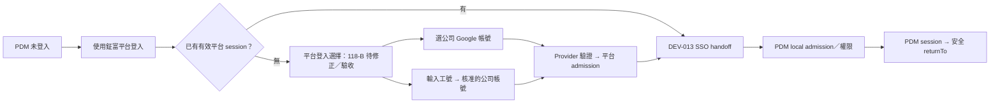

# DEV-118：平台登入入口對齊與 Google／工號身分契約

- 文件成熟度：`118-A RD Implementation Complete + 架構定案（PDM 本地入口）`；`118-B Cross-project Implementation Complete / Architecture Finalized LOGIN-R1 / Registered—Platform DEV-014 / 014-LOGIN`；`118-C Production Released / Provider Enabled / Browser Verification Pending`。
- 工作狀態：118-A本地實作與A03補修已驗證，browser 30／30；118-B跨專案source、Platform 006／007、OrgMaster 016／017、DWD與雙admission均完成；118-C owner run `35592944590`已發布source `68d019d93d267cf284ea8aba637f305558d9048e`至`ai-pdm-prod-face545d349c`（image `sha256:6b803aca8da983b909a05b2a4348f3c14ca47148197c44d71a91762ad81f2ec5`、100% traffic）。Firebase Google provider已讀回`enabled=true`。Platform canonical-first correction發布後，Workspace Platform→AI-PDM免二次登入、reload與管理權限取得partial evidence；LOGIN full、C01／C02、Free、deny-path與global logout仍待受控帳號互動證據。
- 建立：2026-09-16；本次決策修訂：2026-09-18。
- 來源 ID：`DEV-PDM-PRODUCTION-GOOGLE-SIGN-IN-READINESS-001`，保留原 ID／檔名供追溯。
- 節點：開發點，支援 AI-PDM `DEV-003` 身分／權限交付與 Platform `DEV-013` SSO；118-B owner-native slice 為 Platform `DEV-014 / 014-LOGIN`；關聯 `DEV-046`、`DEV-117`。

> **2026-09-18 staging execution addendum（current）**：使用者已授權固定 `jenfu-platform-nonprod / asia-east1` non-production owner mutation。DEV-013 staging 的三個 Artifact Registry repository、三個 evidence bucket、Platform migration Job、Platform／OrgMaster first numeric Secret version與三份 owner-native runtime receipt均已完成 provider readback；Platform、OrgMaster、AI-PDM receipts均為 `OWNER_READY_FOR_L3_BROWSER`，`releaseAuthority=false`。本輪沒有 production、shared DB migration、credential read或 provider account provisioning。
>
> 最新 `npm run qc:dev-014:login:provider` readiness run=`DEV014-LOGIN-PROVIDER-20260917T160139495Z-5deeb289` 已接受 `staging`、`providerMode=real`、OrgMaster DEV-049 self-hashed owner receipt與AI-PDM hard-join target receipt；唯一阻塞為 `DEV014_LOGIN_FIXTURE_MANIFEST:valid-json-file`。`credentialsRead=false`、`providerMutations=false`、`productionWrites=false`。因此 118-B 的 staging owner／target readiness已完成，LOGIN full 0／6、PDM C01／C02與QA-013/014 real-provider browser cells仍為 `BLOCKED／NOT_RUN`，不得把 rollout或owner receipt升格為登入互動PASS。

> **2026-09-18 風險式發布修訂（current override）**：依最新版 `deployment-release-gate`，本案因變更登入、session與authorization邊界，採 **Protected Release**；保留受影響的允許／拒絕、session／tenant、provider與回復驗證，但不再把 staging、專用fixture manifest、額外Release Capsule或第二次人工批准設為通用前置。既有 staging owner／target readback在source、config與角色假設未漂移時可重用；上述provider runner的`BLOCKED`只表示該選配staging evidence path未執行，不再是118-B開發完成或118-C進入release的阻塞。
>
> 118-C已沿用DEV-117 app-owned protected workflow完成owner release；run=`35592944590`、source=`68d019d93d267cf284ea8aba637f305558d9048e`、revision=`ai-pdm-prod-face545d349c`、traffic=100%，terminal receipt在`DEV014-REL-20260921-AIPDM-R3`。Firebase Google provider亦已啟用。功能驗證未完成時仍只可回報「版本已發布／功能驗證待完成」；接續以受控Workspace／Cloud Identity Free principals執行C01／C02四格及必要拒絕路徑。
>
> 2026-09-22 partial Production browser evidence：Platform source `63395409f8ac1abc7b7fd2a3149c7944e0265d73`發布至`jenfu-platform-prod-a5ca329fffe2`後，受控Workspace帳號從Platform normal entry成功建立session；Portal→AI-PDM launch=307、callback=303，target `/api/auth/me`在reload前後皆200、`/api/admin/accounts`=200，authorization=`orgmaster_authority:6 / role-system-admin / accounts.lifecycle.manage / allowed`。UI顯示`employee-shijie`及系統管理員帳號。此流程可作C03-like target partial evidence，但不是從PDM CTA起手的C01／C02，也未覆蓋Free、deny-path或global logout，故不增加四格PASS數。

> 2026-09-22 local logout correction（歷史 pre-release checkpoint；current由§9取代）：上述Production browser檢查發現已登入側欄帳號入口只連到`/login`，沒有結束AI-PDM本地session；因此修正為明確呼叫既有`POST /api/auth/logout`，成功後才進入`/login?reason=local-logout`，失敗保留session並提供可觀察錯誤。Focused contract=`14/14 PASS`、authenticated real-browser=`33/33 PASS`、`typecheck:app=PASS`；run=`DEV118-browser-2026-09-21T22-24-37-833Z`。此修正現已由owner run `35669545522`發布；完整LOGIN、C01／C02四格、Free與拒絕路徑仍待驗證。

## 1. 本次已確認的產品決策

使用者於 2026-09-17 確認理解後要求「依此修改開發文件」。決策是：**符合帳號與權限前提的員工，可選 Google 登入或輸入工號啟動同一身分的驗證；SSO 啟用後，登入方式由鉦富平台集中處理，PDM 只保留平台登入主入口。**

| 名稱 | 本文件的固定意義 |
|---|---|
| 公司 email | 帳號屬性；擁有公司 email 不自動取得 Google 身分或 PDM 權限 |
| 工號／員工編號 | 公司範圍內可變的登入別名，用來找出預先核准的公司管理身分；不是密碼、憑證或永久 canonical ID |
| Google 憑證登入 | 選擇已核准的公司 Google／Cloud Identity 帳號，由 provider 驗證身分 |
| 工號登入 | 輸入工號後導向對應身分的 provider 驗證；Google-managed 帳號仍完成 Google 驗證，不能只輸入工號就登入 |
| 登入授權 | 先取得可信 provider 身分，再檢查 active employee／principal、app assignment、PDM local account／company／permission 與既有 assurance 規則 |

同一員工的兩種起手方式必須落到**同一個預先核准的日常登入身分**；不能因 email 相同、自稱工號或同屬一員工便自動合併帳號。個人專用 privileged identity 與日常身分的權限仍分開，不因工號共用就繼承管理權。

適用前提：公司管理身分已建立、provider 已啟用、工號映射有效（工號路徑）、管理員已開通員工及 PDM 權限。既有非 Google 帳號保留原核准相容政策，不強制遷移；本次新增 Cloud Identity Free 員工屬 Google-managed 帳號，不另開 non-Google 密碼分支。

### 1.1 Cloud Identity Free 決策修訂

使用者補充「我部份員工沒有workspace 的mail帳號, 我會讓他使用Cloud Identity Free 帳號」，並明確授權「依此修改Jenfu-Platform 與此專案共兩個專案的專案文件」。因此：

- **沒有 Gmail 信箱不等於沒有 Google 帳號。** 公司 Google Workspace 與 Cloud Identity Free 帳號皆使用同一 Google provider；不新增第三種登入入口，也不以 Workspace 付費授權作登入條件。[Google editions](https://cloud.google.com/identity/docs/editions)
- 工號只啟動核准帳號的 Google 驗證；平台／PDM 不接收 Google 密碼。Free 帳號名稱即使像 email，也不能要求從不存在的 Gmail 信箱收 invitation／email-link。
- Platform canonical identity保留 **verified Firebase issuer＋subject（Firebase UID）**。OrgMaster bridge對應employeeId、Directory customer＋user.id與Firebase pair。LOGIN-R1更正前版僅列Google ID為observation：Google使用者ID對應Directory API ID，Firebase UID則不同；owner必須從verified Firebase provider identities取唯一Google ID並命中live Directory／approved link，不能只靠email或拿Firebase頂層sub代用。工號、email、license、suffix不能替代永久身分。Cloud Identity Free與Firebase Authentication是不同層。[Google ID與Directory ID](https://cloud.google.com/docs/authentication/token-types)、[Firebase provider identities](https://firebase.google.com/docs/reference/security/database#authtoken)
- Google 帳號有效不等於員工已啟用或獲得 PDM 權限；原有 admission、MFA／assurance、app assignment、local account／company／permission 與撤銷仍須全部通過。

## 2. 決策來源、現況與替代範圍

| 來源 | 已確立的邊界 |
|---|---|
| [DEV-046 2026-07-13 身分決策 3](SPEC-PDM-ERP-GOOGLE-CLOUDSQL-002-five-year-platform-ontology-roadmap.md) | 支援工號別名；credential／MFA／recovery 屬 Cloud Identity／Firebase，最終依 verified UID 映射 PDM user |
| [DEV-003 §4.1](SPEC-PDM-ACCESS-CONTROL-001-user-identity-permission-architecture.md) | 歷史 PDM 直接登入可接受工號或公司帳號；工號 intent 必須與回來的 UID／company 一致 |
| [Platform ADR-003 2026-09-01 amendment](../../../Jenfu-Platform/ai-doc/decisions/ADR-003-entitlement-user-migration-role-activation.md) | 每位員工使用公司可管理的個人身分；工號不是 canonical identity／免驗證 credential |
| [Platform ADR-002 DEV-013 amendment](../../../Jenfu-Platform/ai-doc/decisions/ADR-002-phase1-identity-session-cloudsql-topology.md)及[DEV-013 §§10、16.1](../../../Jenfu-Platform/ai-doc/specs/DEV-013-cross-application-single-sign-on.md) | SSO 啟用後 target 只提供平台主要入口；保留必要 reauth／recovery／smoke／受控回退，不增加平行一般登入路徑 |
| 本次使用者指令 | 將 Google／工號選擇與平台集中登入原則正式寫入本開發文件 |
| [Platform DEV-014 / 014-LOGIN](../../../Jenfu-Platform/ai-doc/specs/DEV-014-managed-identity-production-activation.md#dev014-login)與[ADR-004 §4.6](../../../Jenfu-Platform/ai-doc/decisions/ADR-004-managed-identity-activation-and-global-session-invalidation.md#managed-google-login) | 依 Cloud Identity Free 決策與兩專案文件授權，登錄 `AI_PDM / DEV-118 / 118-B` 來源；Platform R1～R5 source closure與local gate已完成，OrgMaster DEV-049 owner receipt已交付，完整 browser／provider／target驗收待交付 |

2026-09-17 coding前 repo review：AI-PDM HEAD=`c06447aa40d3738c2d053d3a5f1e1fa59e766878`。DEV-013 target start／callback、handoff 與平台 CTA 已在本地 source；不能重算為 DEV-118 新實作，也不能推定已正式啟用。當時 `/api/auth/mode` 以 `Boolean(firebaseConfig)` 宣告直接 Google enabled，SSO broker 設定缺漏可能被當作 SSO off，login mode fetch 失敗會 fallback managed；這些入口選擇缺口已由本文件 118-A 實作與 QC 關閉。

歷史文件修訂前，Platform `src/app/login/login-client.tsx` 仍只有 email/password。2026-09-17 20:00續行已觀察Google／工號UI、route與exchange，owner記錄局部測試；[現行交接審查](../qc/qc-dev-118-platform-handoff-readonly-2026-09-17.md)發現五項P1實作落差。**平台雙入口尚未通過完整驗收，也不是DEV-013 SSO handoff本身已交付的能力。** 118-B沿用Platform DEV-014的`014-LOGIN`，不新增任務或改写已定案架構以遷就實作。

原使用者截圖與前輪 provider configuration not found 記錄，保留為問題來源；本輪沒有重新探測 production，不能用舊調查記錄當 fresh PASS。

### 2.1 Intentional replacement

本修訂取代本文件 2026-09-16 版本中「恢復 PDM 直接 Google 主入口」的目標，以及由此衍生的下列**未實作要求**：

- 取消新增 `PDM_FIREBASE_GOOGLE_SIGN_IN_ENABLED` 並在 production 固定 true。
- 取消 PDM `/api/auth/mode` 的 `accounts:createAuthUri` probe、30／5 秒快取、client 輪詢與八種 provider reason。
- 取消新增 `verification.googleSignInContract`、七筆 smoke observations、internal-candidate-smoke v2／新 Workflow template 的要求。
- 取消以「PDM 直接 Google CTA 登入成功」作為唯一正式交付條件；改驗平台選擇登入、SSO 交接、PDM 權限與 returnTo。

上述取消不代表測試通過，不刪除已存在的 DEV-013 SSO、Firebase exchange 或歷史證據。若後續確需改善 provider readiness，由 Platform owner 在平台登入契約內規劃；不把 provider 探測塞回每個 target app，也不預先指定輪詢架構。

本文件只對齊已接受的 ADR-002／ADR-003，不另建立平行 ADR。DEV-117 十階段、唯一 `releaseCapsuleRef`、憑證及既有 receipts 維持原 authority，不重開 R78。

使用思考習慣：#目的、#限制條件、#變數控制

## 3. 正常登入路徑與 owner

- **OrgMaster identity owner／Google Admin**：OrgMaster 維護 employee、公司範圍工號與受管身分連結；Google Admin 管理公司 Google 帳號、credential／MFA／recovery。本輪不修改 OrgMaster 文件或產品。
- **Platform owner**：Google provider 整合、依版本化核准 mapping 解析工號、平台登入 UI／錯誤、admission／session 與既有 broker。精確 owner API／caller／CAS 與 intent 契約依 DEV-014 §18.5 LOGIN-R1 定案；OrgMaster `jenfu.managed-login.v1` producer 已由 DEV-049 local owner receipt 交付，不能直接讀 sibling core 或以 PDM 私有 alias table 作平台 directory。
- **AI-PDM owner**：自己的登入入口、SSO consumer、local session／admission／permission、可見錯誤及受控相容入口；不取得 shared provider 管理權、不代建 employee／Google identity。
- **各 app release owner**：各自發布、設定與回復；Platform 不因集中登入而取得 PDM traffic／DB／release authority。

SSO 交接沿用 `jenfu.sso-handoff.v1` 的 state／PKCE／one-time code／service identity 與 original authenticatedAt、auth_epoch、revoked_before；本案不重寫它。SSO target 不接收 Google／Firebase ID token、refresh token、Portal cookie 或密碼。Platform→OrgMaster 僅有 LOGIN-R1 所定的 server-to-server Firebase ID token 驗證通道，非 app session sharing；PDM 不參與或取得該通道權限。

## 4. 118-A：PDM 本地入口契約（可派工）

本 phase 只完善既有 PDM 入口選擇與錯誤邊界；不重新開發 DEV-013 consumer，不實作 Platform 登入選擇。

### 4.1 設定與 API

沿用 `PDM_JENFU_SSO_HANDOFF_MODE=off|on`、`PDM_JENFU_SSO_BROKER_ORIGIN`、`PDM_PUBLIC_BASE_URL`、`PDM_AUTH_MODE`、`PDM_JENFU_PLATFORM_AUTH_MODE`。不增加另一個登入模式旗標、public endpoint 或 provider health service。

| 狀態 | `/api/auth/mode` 行為 | PDM 畫面與操作 |
|---|---|---|
| Firebase BFF、handoff mode=on 且既有 SSO 設定有效 | 200；ssoHandoffEnabled=true；googleOAuth.enabled=false、provider=firebase；Cache-Control=no-store | 唯一主要 CTA「使用鉦富平台登入」；隱藏直接 Google／工號／一般密碼表單 |
| Firebase BFF、handoff mode=on 但 platform mode／broker／base 設定缺漏或無效 | 503；固定 `{code:"sso_dependency_unavailable"}`；no-store | 顯示「登入設定暫時無法使用，請稍後再試或聯絡系統管理員。」；不得降級成直接登入 |
| Firebase BFF、handoff mode 明確 off（含既有預設 off） | 保留既有相容 response；ssoHandoffEnabled=false | 保留現有直接登入作過渡／受控回退；不是正式 SSO 完成證據 |
| handoff mode 為非空、非 on/off 的非法值（Firebase BFF） | 同設定失敗，不默認 off | 同上失敗訊息，不新增旁路 |
| local demo／非 Firebase managed 模式 | 保留各自既有契約 | 不為 production SSO 改變本地／demo authority |
| mode request 失敗、缺欄位或未知 authMode | client 保持 unavailable，不推定 managed | 不可提交任何登入方式；提供「重試」重新取得 mode |

SSO on 的 `googleOAuth.enabled=false` 僅表示 **PDM 不提供直接 Google 入口**，不表示平台 Google provider 停用。`ssoHandoffEnabled` 是設定與入口狀態，不是 broker 即時健康保證；不因外部故障自動改模式。

將既有 SSO 靜態設定解析從 `jenfu-sso-handoff.ts` 的 setup 抽為 `auth-config.ts` 可重用、可注入 env 的純函式；auth-mode 與 setup 共用同一判定。只驗既有 DEV-013 設定／exact origin 契約，不讀 DB、credential 或呼叫 provider；不改 state、PKCE、token exchange、principal、session 或權限邏輯。正式 origins 仍由 reviewed owner 設定提供，不從 request Host／query 推導。

### 4.2 UI 與操作

- loading／unavailable 時沒有可提交的登入 CTA；不能先閃出直接 Google 或帳密表單。
- ready SSO CTA 只導向既有 `/api/auth/jenfu-sso/start?returnTo=<safe local path>`；沿用 DEV-013 safe returnTo，不把任意外站 URL 帶給平台。
- 平台已有 session 時不再要求 Google popup／工號／帳密；平台未登入才在平台選擇方式。PDM 不重複收一次工號。
- local logout 留在 PDM 登入頁，明確點擊後才交接，不自動 redirect 造成登出循環。
- mode 載入／重試錯誤放在目前可見的登入面板，以 `role="alert"` 呈現；不要寫入 SSO 模式中被隱藏的 form error。使用單一載入狀態與 request generation／cleanup，防止晚回 response 覆蓋新狀態。
- mode request 的總期限為10秒（包含讀取JSON），到期中止request並使該generation失效，顯示既有重試動作。缺少或格式錯誤的`authMode`、`ssoHandoffEnabled`、`googleOAuth.enabled`、`localQuickLogin`或`firebase.config`均為unavailable；不得把未知SSO值當false。SSO=true只接受Firebase BFF且直接Google入口=false。重試先中止舊request，離頁同樣中止；不新增provider探測或自動輪詢。
- handoff 途中及 callback 的 error code、account conflict、source expiry／revocation 仍依 DEV-013 處理；本 phase 不自創 callback protocol。若既有正常錯誤呈現路徑缺漏，列入 DEV-013 owner 缺陷並阻擋對應整合驗收，不能以本地 mode UI PASS 宣稱已修好。
- 相容模式沿用既有 Google／工號流程：工號建立短效 single-use intent，驗證後 UID／company 必須命中同一目標；工號不是可繞過 provider 的備援。原 direct provider 設定故障仍需 owner 修復，不因保留舊 UI 被視為已解決。

一般 Google provider 失效，不得推薦同樣依賴 Google 的工號作替代；只有該帳號確實具有已核准、可用的其他 provider 方法時才提供替代登入。平台雙入口完成後的具體文案由 118-B 固定。

### 4.3 實作範圍與順序

| 順序 | 檔案 | 允許變更 |
|---|---|---|
| 1 | `src/lib/auth-config.ts`、`src/lib/jenfu-sso-handoff.ts` | 共用靜態設定解析；handoff 僅委派設定，不重寫 session／exchange |
| 2 | `src/app/api/auth/mode/route.ts` | SSO on 的直接入口關閉、設定錯誤 fail closed、no-store |
| 3 | `src/app/login/page.tsx`；`src/app/globals.css` 僅必要時 | mode loading／retry／可見 error、平台唯一入口，最小版面變更 |
| 4 | `src/lib/jenfu-sso-handoff.test.ts`；新增 `scripts/qc-dev-118-login-entry-contract.mjs`、`scripts/qc-dev-118-login-entry-browser.mjs`；`package.json` | 設定與入口負例、實際登入頁 browser checks、focused commands |

No-touch：DB schema／migration、employee／principal／alias 資料、privileged policy、其他 repo、shared provider／OAuth secret、DEV-117 profile／runtime／Workflow／smoke schema。開始 coding 前先讀相關 Next.js bundled guide，重新核對已提交的 DEV-013 實作；不能用舊版本覆蓋最新 code。

## 5. 118-A 驗收與驗證

| Case | 操作與前置 | 必須觀察的結果 |
|---|---|---|
| A01 | SSO on、設定有效，讀 mode／開登入頁 | sso=true、直接 google=false、no-store；只有平台 CTA；無 provider／DB health probe |
| A02 | SSO on 缺 broker/base、非法 origin／mode、platform mode off | 設定錯誤回 503；UI 顯示就地 error；不出現直接 Google／工號／密碼 fallback |
| A03 | mode timeout／非 JSON／未知模式、第一次重試晚回 | unavailable 不走 managed；重試恢復；舊 response 不覆蓋新 state、unmount 無殘留 |
| A04 | SSO off／demo／managed fixture | 既有模式保留；不把 Google 與工號描述為兩套獨立憑證；既有 alias UID mismatch／replay 拒絕維持 |
| A05 | 點平台 CTA、safe／惡意 returnTo、local logout | 只進既有 start 路徑；無任意 redirect；logout 後不自動重新登入 |
| A06 | 1440×900、390×844、使用者原 748×698；loading／ready／error、Tab／重試 | 主動作與錯誤可見，無水平溢位、重疊、截字；錯誤不藏進未渲染 form |

歷史receipt：contract 10/10、browser 12/12、DEV-013 3/3、DEV-046 21/21、typecheck與isolated build曾通過；2026-09-17目標續行查出原browser未覆蓋A03逾時／缺欄位／重試晚回，且`context.newPage({viewport})`未實際設定各頁尺寸，故舊12/12不能證明完整A03／A06。現行runner已改為逐頁`setViewportSize`並補正常操作驗證；最新結果以[118-A QC receipt](../qc/qc-dev-118-local-implementation-2026-09-17.md)的「A03 completion audit修正」為準。不重跑未受影響的全套DEV-117 release tests；若需修改release source則停止並重定範圍。

Browser QA 必須操作實際編譯登入頁；fixture 只模擬設定／mode response／外部依賴，不直接塞入成功 session。收集 source revision／dirty fingerprint、角色、route、viewport、操作、截圖、console／page error 與 visible error sweep；local fixture 不冒充跨 app 或 production PASS。

所有 build／QA runtime 遵守 AGENTS.md：啟動前記 project、purpose、port、PID tree、cleanup condition、PDM_DATA_DIR／PDM_REPOSITORY_DIR；使用 task-owned isolated 資料，seed 前先驗 unmodified snapshot invariants，保留 mutation ledger，build 前後證明 primary identities/schema/residue/FK 不變。結束停止 own processes、釋放 port 並清 own UI／temp paths；不碰使用者現有登入分頁。

## 6. 118-B：平台 Google／工號入口承接契約

狀態：`Local Development Complete / Architecture Finalized LOGIN-R1 / Registered—Platform DEV-014 / 014-LOGIN / Protected Release Verification Pending`。來源引用為 `AI_PDM / DEV-118 / 118-B`，owner-native contract 為 [DEV-014 §18](../../../Jenfu-Platform/ai-doc/specs/DEV-014-managed-identity-production-activation.md#dev014-login) 與 [OrgMaster DEV-049](../../../OrgMaster/ai-doc/specs/DEV-049-existing-google-primary-account-link.md)。Platform R1～R5 source closure、62／62 targeted、LOGIN PG 5／5、S2 7／7、build／regression及OrgMaster owner receipt／migration 013／CAS／barrier／local QA已交付；完整六案、browser／provider／target證據仍待production protected release交付。

Platform DEV-014 的 R2 架構定案涵蓋既有 S0～S4／QA 基線 20 案；`014-LOGIN` 獨立定案為 LOGIN-R1，另列六案驗收，全部 NOT_RUN。OrgMaster DEV-049 local owner receipt 已交付，但不改 LOGIN 六案分母，也不重算 DEV-013 原有 22 案或基線完成率。

平台的帳號分類、首次 bridge、工號 intent、錯誤與 source contract 以 DEV-014 §18 為唯一 authority；本文件保留三項 target 不變條件：

1. Workspace／Free 均由 Google 驗證；工號只在平台 server 找核准身分，不把 email／UID／login_hint 暴露給未驗證瀏覽器。兩入口只能落到同一核准日常 principal，不能以工號或 Gmail 收信能力授權。
2. PDM 不參與首次 Directory→Firebase binding，不讀 OrgMaster core 或增加 identity writer。pending 首次綁定由來源 owner 完成；未完成者不得透過 SSO 建 PDM session。
3. PDM 沿用 DEV-013 handoff 與 local admission／permission、original authenticatedAt、assurance／epoch／revocation；不接收 Google credential、不新增密碼入口，不因平台 provider failure 自動切回 legacy。

### 6.1 管理員開通 Workspace／Cloud Identity Free 員工

跨專案的唯一開通流程見 [Platform §18.3](../../../Jenfu-Platform/ai-doc/specs/DEV-014-managed-identity-production-activation.md#dev014-login)：Google Admin 建公司帳號並安全交付首次登入資料 → OrgMaster 人工核准 Directory pending link → 首次 Google 驗證後由既有 bridge 原子綁定 Firebase pair → 各應用依權限放行。pending 時 Firebase UID 可未知，不能要求先登入平台才能完成首次 bridge；Free 不依賴不存在的 Gmail 邀請，Google 密碼不送入 Firebase email/password。

**PDM Admin 的責任只在 `/settings/accounts` 管理 PDM user、company／membership、角色與 permission。** 不代建 Google 帳號、不修改中央工號或 Directory link、不管理 provider 密碼／MFA／復原。平台的 app assignment 與 PDM local admission 必須各自通過；有平台 session 仍可能被 PDM 拒絕。

### 6.2 既有 non-Google 相容邊界

先前 §6.1 的 non-Google 開通建議不適用於本次 Free 員工；以本修訂明確更正。既有核准 non-Google 帳號的 provider credential、MFA、invitation／recovery 與 production allowlist 保留原 authority，不批次遷移、不刪除、不自動擴大開放。真正需要新增 non-Google 員工時另由 owner 定義其可收信聯絡管道與 provider proof，不能沿用「沒有 Workspace 信箱」作分類條件。

PDM `/settings/accounts` 的 local 工號 alias 保留給原 SSO off／受控相容用途；不把它提升成平台 employee-number authority。平台不得讀寫 PDM 私有 `*_core`，PDM 不保存 password hash、MFA secret 或 recovery code。

### 6.3 LOGIN-R1 工程定案與交接

Platform [§18.5](../../../Jenfu-Platform/ai-doc/specs/DEV-014-managed-identity-production-activation.md#dev014-login) 為唯一工程 authority：G1／G2 採 `jenfu.managed-login.v1` owner 機器 API，OrgMaster 獨立驗 Firebase／Directory、CAS／reservation、冪等 receipt 與 lifecycle barrier；G3 用 Platform own PostgreSQL intent，與既有 session 同 transaction 完成，unknown 先 readback；G4 固定預備 intent 後由 user click 啟動 Google popup，受限內嵌環境從乾淨 canonical login 重啟。API DTO、ACL、timeouts、TTL、rate budget、state／recovery、migration、檔案與 runner 細節只在 owner spec 維護。

2026-09-17 技術主管複審已在同一 owner 契約修正：可恢復錯誤保留原短效 token 供同一請求重試；取消、提交與未知結果讀回共用 intent row lock，已登入不得假稱取消成功。2026-09-18依風險式發布規則，真實登入可在既有production protected release的canonical驗證完成，不再固定要求先建staging fixture manifest。PDM 不新增重試／取消 API 或 credential state。維持 LOGIN-R1，Spec impact=`Intentional replacement of release evidence ordering`；本輪只修改文件，未執行production。

G1～G4 文件未決 P0／P1=0，升為 `RD Implementation Ready / Architecture Finalized LOGIN-R1`。實作依 L0 contract／stub → L1 intent／exchange → L2 browser → L3 producer／provider／target；Platform與OrgMaster local implementation gate已交付。OrgMaster DEV-049 owner receipt證明producer／CAS／barrier的local isolated conformance，但不能替代真實provider或PDM target evidence；不得在Platform複製writer來繞過依賴。

上述P0／P1=0是架構文件closure，不是production整合驗收完成。固定 staging target profile 為 `jenfu-platform-nonprod`；owner／infra mutation與readback已完成，三份 owner receipt 已達 `OWNER_READY_FOR_L3_BROWSER`，可在輸入未漂移時重用。Platform provider manifest仍記錄缺fixture，但該manifest改列選配staging readiness helper；118-B local development不再等待它。完整六案及PDM C01／C02改由118-C protected release在exact production revision／canonical入口取得，沿原反例與分母，不增加PDM私有fallback。

**PDM 特有的恢復條件：** 原內嵌 browser 若無法完成 Google，平台只能提供由可信既有 SSO client config 得出的 PDM canonical `/login` 乾淨 URL，讓使用者在支援瀏覽器從 PDM 正常入口重啟；不帶 source browser 的 returnTo／SSO state／PKCE／intent／cookie，不宣稱回到原 tab 已有 session。原環境的失敗／恢復 UI 與外部 Google／PDM 成功分別驗收；跨瀏覽器保留深連結或同步 session 不在 LOGIN-R1。

2026-09-17 定案盤點（歷史基線，已由2026-09-18 current override更新）：AI_PDM `bcc27f6e1bf1e5b709254efa1e4d94bd3b5b60c8`、Platform `5d5a5111ab28307d9c6655669e8b4ec891286e9e`，開始時均 clean；OrgMaster `756f6d405c7cf0babe4078b332b0f6714a242914` 只讀。沿用既有 SPEC／ADR／QA／索引，不新增 DEV 或平行文件。當時118-B implementation、Platform QA六案與118-C正式整合仍未完成；現況以頁首及§8為準。

歷史文件同步盤點（非本輪 HEAD）：AI_PDM `codex/dev-013-ai-pdm` @ `013ae1440acf2735b313b9ac43ee710d2b53927e`；Platform `持續優化1` @ `7e5343e3a5cdbd40a1a5ede38922195964d9bfa4`，當時兩者 clean。該輪只依授權修改這兩專案文件，未修改 OrgMaster、程式、測試、資料、provider 設定或 production；先前唯讀 QC 留作當時歷史證據，現行 native 登錄以 Platform DEV-014／索引為準。

## 7. 118-C：SSO 發布與整合驗收 capsule

本案屬登入／authorization security boundary，118-C採Protected Release。沿用DEV-013 revocation guard、rollback security floor與DEV-117 app-owned production workflow；PDM canonical仍為`https://ai-pdm-prod-9536592944.asia-east1.run.app`。不新增DEV-118專屬staging gate、local artifact server、重複build、額外人工GO、custom domain、Secret輪替或provider session-sharing機制；既有專案要求的immutable `releaseCapsuleRef`與owner stages仍適用。

| Case | 正常 delivery path | 完成條件 |
|---|---|---|
| C01 Google 起手 | `PDM-W-G`、`PDM-F-G`：Workspace、Cloud Identity Free 各走 PDM 平台 CTA → 平台選 Google → provider → 平台 admission → handoff → PDM | 同一核准身分建立 PDM session、回 safe returnTo、reload 可用；Free 不依賴 Gmail 收信 |
| C02 工號起手 | `PDM-W-E`、`PDM-F-E`：Workspace、Cloud Identity Free 各走 PDM 平台 CTA → 平台輸入工號 → Google 驗證 → handoff → PDM | 各與自身 C01 的 Firebase principal／核准日常身分一致；沒有輸入工號即授權、錯配、Google 密碼送 Firebase password 或新增帳號 |
| C03 平台已登入 | Portal 有權限 app tile／PDM 平台 CTA → handoff | 不再要求 Google popup、工號或帳密；仍經 PDM local authorization |
| C04 拒絕與回復 | inactive／無 assignment／工號與 UID 不符／session revoked／broker failure | 不簽發有效 session；可見錯誤、無自動 legacy fallback；不同 principal 不靜默替換 |
| C05 登出與相容性 | local logout、global logout、必要 reauth／recovery、既有 release smoke | 依 DEV-013／既有 policy 生效；保留必要 Firebase exchange，不移除安全驗證 |

A01–A06 可以先取得 local evidence；C01/C02 依賴 118-B，不得用目前平台 email/password 成功取代雙入口驗收。C03–C05 優先引用 DEV-013 同 source／環境／角色的有效證據，不重做平行 handoff suite；有差異才補測。

C01/C02 的固定整合矩陣為上表四個 cells；每類帳號的 Google／工號路徑使用同一核准身分，並在每次操作前透過既有登出建立新流程，避免直接沿用 Platform session 而跳過指定起手。首次綁定的 pending／active 與 CAS 測試由 [Platform QA §9](../../../Jenfu-Platform/ai-doc/qa/DEV-014-managed-identity-production-activation-validation-plan.md#dev014-login-qa) 的八個 identity cells 持有，PDM 不再建一套 bridge 測試、不重置永久 binding。Platform QA014-LOGIN-06 直接引用本節同 source／環境／fixture evidence；manifest 按 case＋cell 引用同一證據，不重複計數。每筆須標記 provider real／stub，只有真實受控 provider 及正常 target 操作可滿足整合 cell；identity 成功不等於 target 成功。若仍缺原內嵌瀏覽器結果，保留未充分驗證，不能以外部瀏覽器 PASS 結案。

現行 Firebase refresh-token smoke只證明既有 session 路徑，不能證明平台 Google／工號入口；本案不強制修改其憑證或 observation schema。Provider 啟用／網域讀回由實際登入所在的 Platform owner 負責；PDM SSO 不以自己的直接 Google provider readiness 作 release 前提。

2026-09-21 owner evidence補強：AI-PDM既有owner workflow在finalize會由canonical smoke結果產生`jenfu.dev014.consumer-conformance.v1`，固定`ai-pdm`、exact merged source revision、canonical image digest、guard contract、fail-seeking canonical receipt、verified time與content hash，並把immutable ref嵌入terminal receipt。OrgMaster／Platform admission runner會在DB mutation前從AI-PDM own release bucket讀回raw bytes，驗object SHA、schema、source、artifact及content hash；不得手寫或沿用不同revision的PASS receipt。完整順序見Platform [DEV-014 Production runbook](../../../Jenfu-Platform/ai-doc/runbooks/DEV-014-production-protected-release.md)。

驗證順序改為風險式最小路徑：release前重用未漂移的source／schema／producer conformance、local transaction／deny-path與provider設定readback；由既有owner workflow對exact artifact build一次並部署。staging real-provider evidence若已存在可重用，但不是必備。正式canonical啟用後立即執行C01／C02四格、無assignment／inactive／revoked等拒絕路徑與reload／logout；缺必要principal或provider互動時標`feature verification pending`，不得把deploy或HTTP 200當功能PASS。已在本次release授權內的驗證與promotion不再要求第二次批准。

Production 功能完成需實際 canonical、exact artifact／revision、受控 test principal、操作／畫面及 redacted 結果。使用者原始內嵌瀏覽器問題需保留適用環境結果；其他瀏覽器或 local mock 成功不能冒充。無法安全完成 provider 互動／缺 owner implementation 時保留未充分驗證，不預填 PASS。

## 8. 派工、完成與文件治理

- **118-A、118-B與118-C owner release均已完成**：DEV-118現為`Production Released / Provider Enabled / Browser Verification Pending`；下一步只執行LOGIN六案與PDM C01／C02受控帳號互動驗證，不重做未漂移的build、migration或admission。
- 本 DEV 從原獨立「直接 Google 修復交付點」收斂為既有身分／SSO 交付的**開發點**，不新增產品交付分母。原 scope 被取代，不記已完成；DEV-013 已有成果不重複計入 DEV-118。
- `架構定案` 現涵蓋 §4 的 PDM 入口與 §6 所引用Platform／OrgMaster LOGIN-R1工程契約；不代表已通過production雙入口驗收或provider可用。B local gate已交付，C01／C02是release completion evidence，不再是開發阻塞。
- A 實作可決定局部 helper 命名、測試組織與樣式；不得改變入口模式、provider／identity／permission authority 或偷加 release 契約。需改 SSO wire schema、DB、shared credential、跨 repo source、平台 alias authority 時，停止受影響切片並回送 owner 規劃。
- 文件與既有 active SPEC 的一致性：DEV-003 §4.1 同步 Free／Google 與 alias authority；`SPEC-PDM-ACCOUNT-LIFECYCLE-001` 保留原 local account 與 provider invitation／recovery 邊界，不把邀請 email 解讀為 Free 登入必要條件；任務板、map、cold-start 同步。Platform DEV-014、ADR-004、QA-014 與索引同步承接。DEV-046 歷史、Platform ADR-002／ADR-003／DEV-013 與 DEV-117 authority 保留，不重寫歷史 QC。
- 118-A 最新browser證據：`output/qa/dev-118-login-entry/DEV118-browser-2026-09-21T03-13-12-373Z/manifest.json`，綁定HEAD `4de5cdc1f6452ae153d91ddb04bde2c255b8377d`與dirty fingerprint `7defab02835b80a41ccf3e65902400a6f7f5e4533bd2ae18fa760cad13488415`，30/30，含10秒deadline、畸形response、鍵盤retry、late response、三種實際viewport與safe returnTo入口；typecheck、affected lint與isolated build亦PASS。舊`2026-09-17T11-45-14-880Z`與`00-48-58-748Z`保留歷史。只驗正常PDM登入頁、mode外部依賴fixture與SSO start目的地，不宣稱Platform provider、跨app SSO或production已通過。

## 9. 2026-09-22 current owner release與Production L4

AI-PDM main `6e21bb4c2f39d4b4777320d202a2037bde609b00`已由owner run `35669545522`發布至`ai-pdm-prod-f5ee2af2d7ec`，image=`sha256:fee7d3e6f653e29332a77a87ca53fa897b76aed215dcdee54f16fd585fde10bd`、traffic=100%。十個owner stages、15筆既有migration replay、terminal與DEV-014 consumer conformance均PASS；DEV-118明確local logout入口已在current Production UI讀回。Workspace Google-first及`JFS0005`工號起手皆完成Platform session、AI-PDM handoff／reload、accounts與`accounts.lifecycle.manage`；Platform global logout後AI-PDM `/api/auth/me`、`/api/admin/accounts`及`/api/numbering/permissions`均401。這認列`PDM-W-G`、`PDM-W-E`與global invalidation的current evidence。Google Admin現有7個有效使用者均同時具有Workspace Business Standard與Cloud Identity Free，沒有Free-only／無Gmail fixture，故`PDM-F-G／PDM-F-E`與negative／rate／race cells尚缺；C01／C02四格及Platform LOGIN六案仍未full PASS。完整跨app證據見Platform `ai-doc/qc/qc-dev-014-production-l4-2026-09-22.md`。
