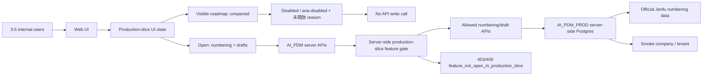

# SPEC-PDM-PRODUCTION-SLICE-001 - Official numbering and draft production slice

> 2026-07-13 Amendment：本文件的已完成 local slice與DEV-046 production/release gates仍有效；其「formal create即official permanent number」的未來行為已由 `ADR/SPEC-PDM-NUMBER-STATE-FLOW-001` 取代。新草稿可先無號，candidate可在未鎖定且零引用時立即回收，只有explicit publication成功後才寫正式master與non-reuse ledger input。
>
> 2026-07-17 DEV-048 convergence amendment：本文件所有把`/numbering/part-drafts`描述為可操作工作台、把`/numbering/request`描述為獨立建立頁，或以`part_number_drafts`頁面作主要UI的舊條款，均由DEV-048取代。Canonical UI是`/parts?tab=drafts`與owner-surface建立CTA；舊URL只redirect/guidance。Production-slice的API default-deny、正式流程未開放、候選號安全、正式號不可重用及帳號/平台release gates不變，並改由`numbering_draft_workspaces` owner UI承接。

Status: Product Phase 1 Local Implementation Complete; DEV-046 `HD-8-1..4` closed and Phase 1 RD Implementation Ready / Not Requested; production waits for platform implementation/staging and Release Gate
Date: 2026-07-10
Owner: Dev PM
Related DEV: `DEV-PDM-PRODUCTION-SLICE-001`
Related ADR: `.ai-doc/decisions/ADR-PDM-PRODUCTION-SLICE-001-official-numbering-draft-launch-boundary.md`
Related QA: `.ai-doc/qa/qa-pdm-production-slice-numbering-draft-validation-plan-2026-07-09.md`
Related QC: `.ai-doc/qc/qc-pdm-production-slice-numbering-draft-report-2026-07-10.md`
Extends: `.ai-doc/specs/SPEC-PDM-NUMBERING-004-contextual-numbering-lifecycle-entrypoints.md`
Extends: `.ai-doc/specs/SPEC-PDM-NUMBERING-SEQUENCE-CAPA-001-qc-isolation-and-sequence-integrity.md`
Extends: `.ai-doc/specs/SPEC-PDM-ACCESS-CONTROL-001-user-identity-permission-architecture.md`
Extends: `.ai-doc/specs/SPEC-PDM-ERP-GOOGLE-CLOUDSQL-002-five-year-platform-ontology-roadmap.md`

## Human Decision Brief

Confirmed decisions from 2026-07-09 guided mode:

- `Route 1A`: First usable surface is Web only. SolidWorks Add-in, CAD source parsing, and external client integrations are not part of the first slice.
- `Route 2A`: Real user-created numbers are official reserved records. They must not be deleted or silently reused as test data.
- `Route 3C`: Go directly to a narrow production slice for `正式領號 / 草稿`, but do not claim full PDM production readiness.
- `UI 1B+`: Keep future roadmap UI visible. Unopened actions must be disabled or inert, visibly marked `未開放`, and explain the reason on hover/focus/click. Backend/API feature gates are mandatory.
- `Smoke 2C`: Initial production-smoke discussion allowed a smoke company or sequence namespace, not the normal Jenfu official sequence.
- `Users 3A`: First users are 3-5 internal users: Admin, RD Manager, and 2-3 engineers.

Confirmed RD supervisor follow-up from 2026-07-10:

- `Draft 1B` historical intent remains: draft management is included in the first production slice. DEV-048 moved the workbench to `/parts?tab=drafts` and retired the standalone page.
- `Draft delete 2C`: Draft-only part-number reservations may be removed from the active draft set and the reserved draft number may be recycled, but only before the draft crosses a controlled boundary. This does not permit recycling official root, drawing, or part numbers created through the formal numbering record flow.
- `Smoke 3A`: Release-gate smoke isolation defaults to a smoke company / tenant. If any normal Jenfu list, search, report, export, counter, or dashboard can see smoke-company data without an explicit admin/test filter, the production write smoke path is blocked.
- `Guided completion`: RD supervisor review found no new product decision requiring another A/B/C question. The document is completed under the existing decisions by explicitly closing existing `submit-review`, `reconfirm`, and `restore` part-draft actions in the production slice, requiring reuse of the existing part-number draft controlled-boundary domain predicates, and aligning smoke wording to `smoke company / tenant`.

Fourth RD completeness review default adopted on 2026-07-13 after the user said to continue:

- `Canary 1B` historical decision: after technical release gates pass, first deploy a production canary restricted to the named 3-5 users. Its separate `DEV-FIELD-001` expansion blocker is superseded by `HD-9-1`; the named canary and explicit release-controlled expansion remain.
- `Outage 2A`: database outage stops official numbering; no paper/Excel/offline issuance or later backfill is allowed in this first slice.

Fifth RD completeness review resolved on 2026-07-13:

- `HD-5-1 resolved`: do not migrate existing credentials/provider bindings. Reprovision Firebase identities and assign reviewed new stable production PDM user IDs; source actor IDs/history remain in the separate read-only archive and legacy login is closed before canary.
- `HD-5-2 historical`: the original rollout used Google Workspace-only Wave 0, a controlled Wave 1 and Wave 2, with fixed observation windows. Its fixed-duration requirement is superseded by `HD-9-1`; initial Google-only canary, prior staging proof for non-Google users and explicit allowlist release control remain.
- `HD-5-3 resolved, location scope only`: Cloud SQL operational database, direct GCS primary files and Cloud Run runtime target Google Taiwan. The fifth-review wording that also called Firebase Authentication's US identity processing "explicitly accepted" is superseded by the sixth-review correction below.

Sixth RD supervisor review correction:

- At the sixth-review stage, the phrase "explicitly accepted US-location exception" above was too strong. `HD-5-3` selected Taiwan placement for operational DB/files but did not prove acceptance of Firebase US identity processing, so the review opened `HD-6-1`.
- The same review opened `HD-6-2` to separate Taiwan-region disaster recovery from in-region HA/PITR. Same-region HA/backups cannot satisfy a regional-outage claim.
- The same review opened `HD-6-3` for canary day-one regional HA cost. Those gates temporarily blocked live Phase 2/3 and are superseded by the decision closure below.

2026-07-14 acceptance-scope correction:

- `HD-9-1 resolved`: the user cancelled the fixed five-business-day Wave 0/Wave 1 `DEV-FIELD-001` observation. The task is closed as `Cancelled by Human Decision`, not as passed evidence.
- The cancellation does not waive DEV-046 Phase 2B credentialled isolated staging, the DEV-032 release gate, the initial named 3-5-user canary, non-allowlist fail-closed behavior, zero open P0/P1, `HD-8-4 / 1A` restore/reconciliation, rollback readiness or production post-deploy smoke.
- Later allowlist expansion requires an explicit DEV-032 release decision; no elapsed time, local UI evidence or successful smoke expands access automatically.

2026-07-13 human decision closure:

- `HD-6-1 / 1A`: Firebase US identity processing is accepted with data minimization, employee/privacy notice, retention/deletion ownership and privacy inventory.
- `HD-6-2 / 2A`: all cloud recovery copies remain in Taiwan; full `asia-east1` outage RPO/RTO is uncommitted and no regional-DR claim is permitted.
- `HD-6-3 / 3A`: Cloud SQL regional HA is mandatory from the first 3-5-user canary. Actual budget/owner/alert evidence remains required before provisioning.

2026-07-13 DEV-046 second-pass decision closure:

- `HD-7-1 / 1A`: App Hosting with an exact reviewed Next.js 15.2.x pin; current Next.js 16 must be downgraded and regression-tested before staging. Production source auto-rollout remains prohibited.
- `HD-7-2 / 2B`: clean production; only initial Admin, minimum configuration, numbering seed and non-reusable reservations are seeded. Local business/draft/demo/test/history rows do not migrate and remain in a read-only archive.
- `HD-7-3 / 3B`: continuous wall-clock RPO; RTO is measured Monday-Friday 08:00-17:00 `Asia/Taipei` excluding company holidays. Security/data-loss response remains all-hours, while the measurable acknowledgement/coverage rule waits for `HD-8-2`.
- Platform invariants: all formal data uses Cloud SQL, all formal files use direct GCS, and all business operations use portable HTTP/BFF. Firestore, Firebase Storage, Firebase Functions, Callable Functions and Firestore triggers are not authorities.

Third-pass decisions are now closed: `HD-8-1 / 1A` selects Cloud Run `asia-east1` + Next.js 16 behind an external Application Load Balancer/custom domain with private-response cache denial; `HD-8-2 / 2A` selects internal primary+backup and 60-minute all-hours acknowledgement; `HD-8-3 / 3B` selects Google-only Wave 0 and controlled non-Google admission in Wave 1 after both paths pass staging; `HD-8-4 / 1A` defers full PDM/GCS/offline recovery but requires Cloud SQL automated backups/PITR and one separate-target restore with numbering-ledger reconciliation before canary. The implemented slice cannot enter production until that platform evidence and release gate pass.

Rejected options:

- Hide all unopened features from the UI.
- Use frontend disabled state as the only protection.
- Open formal submission, release, CAD parsing, SolidWorks Add-in, BOM/manufacturing baseline, or full PDM production workflows in this slice.
- Claim `qc:production-readiness` full-system readiness from this slice.
- Run browser-side direct database or provider table API access.
- Let routine smoke testing consume normal Jenfu official sequence numbers.
- Treat `Draft delete 2C` as permission to hard-delete or recycle official root, drawing, or part numbers.

AI assumptions:

- `AI_PDM_PROD` is a logical production database label. The physical target is Cloud SQL PostgreSQL in `asia-east1`; live target execution remains outside this document and requires release gate confirmation.
- Application database access remains through server-side APIs and server-only credentials.
- Existing local evidence for numbering, access control, sequence integrity, and detail drawers can be reused as development baseline, but must be reverified for the production slice.
- `/parts?tab=drafts` is backed by DEV-048 `numbering_draft_workspaces` and candidate-number lifecycle. Candidate cancellation/recycle must respect the DEV-048 controlled publication boundary; formal `part_roots` / `part_numbers` / `drawing_numbers` remain non-recyclable.
- Existing `part_number_drafts` domain predicates such as `getPartNumberControlBoundary` and `assertPartNumberDraftIsRecyclable` are the preferred controlled-boundary authority. RD must not create a separate weaker recycle/delete predicate for this production slice.
- Smoke-company isolation requires proven company/tenant filtering in every normal user list, report, search, export, counter and dashboard before production write smoke can run.
- `AI_PDM_PROD` names the production Cloud SQL database only; it is not the whole production platform. DEV-046 and DEV-032 jointly govern Cloud Run/Next.js 16, external Application Load Balancer/cache policy, Identity Platform/portable BFF, direct GCS Phase 3B cutover, clean seed/archive, continuity and IAM cutover.

Re-entry triggers:

- The user wants unopened features to be merely disabled in UI without backend/API denial.
- The user wants to open formal release, approval, CAD parsing, SolidWorks Add-in, BOM/manufacturing baseline, or full PDM production behavior.
- The user wants production smoke to consume normal Jenfu official sequence numbers.
- RD cannot prove smoke company / tenant isolation.
- RD cannot prove smoke-company isolation across normal Jenfu lists, search, reports, exports, counters and dashboards.
- RD cannot separate recyclable provisional part-number drafts from official numbering records.
- RD cannot reuse or faithfully wrap the existing part-number draft controlled-boundary predicate for delete/recycle.
- RD needs to recycle or hard-delete official root, drawing, or part numbers.
- RD needs production deployment, Cloud SQL live migration, provider pointer switch, backup/restore execution, production smoke, merge, PR, rollback, direct data repair, or data deletion.
- RD needs to open a route or API method not listed in the Phase 1 Route / API Boundary Matrix.

使用思考習慣：#目的、#效用理論、#批判

## Problem

AI_PDM has enough local functionality to support official numbering and draft creation, but the full system is not production ready. Treating the whole product as production ready would overstate readiness and pull CAD/Add-in/release blockers into the first launch. Treating the work as a staging-only pilot would delay actual internal value and avoid the real governance problem: official numbers must be protected once internal users start using the system.

The correct boundary is a production data slice:

```text
Open: official number allocation + draft creation through Web.
Closed: full PDM release, approval production use, CAD parsing, SolidWorks Add-in, BOM/manufacturing baseline, and broad production readiness claims.
```

## UX Intent

Primary users:

- Admin: prepares accounts, confirms role setup, handles recovery.
- RD Manager: owns the business decision that the numbering/draft slice is ready for internal use.
- RD Engineers: create official numbers and drafts.

The UI must answer:

- `我現在可以領號或建草稿嗎？`
- `這個未來功能為什麼不能按？`
- `如果不能按，我現在該做什麼？`

Roadmap visibility is allowed, but every unopened action must still pass the Now What test:

```text
此功能未納入本次正式領號 / 草稿 production slice。請先使用領號或草稿功能。
```

## Scope

### In Scope

- Web-based official root/drawing/part numbering and existing-root append flows.
- Draft creation and draft management required for numbering work.
- Search/list/detail routes needed to confirm created records.
- Production-slice feature gate for UI and APIs.
- Disabled roadmap UI with accessible unopened explanation.
- Server-side API denylist for unopened write operations.
- Role-gated access for 3-5 internal users.
- Smoke company / tenant isolation contract.
- Cloud SQL production readiness checks needed for this slice: target identity/region, connector/service identity, non-owner runtime role, bounded pool, RLS/direct-access denial, schema/grant parity, HA/PITR, the `HD-8-4 / 1A` pre-canary separate-target restore and numbering-ledger reconciliation evidence, and app API path readiness.
- QA/QC evidence for official numbering, draft creation, permission denial, UI disabled states, API blocked states, sequence/idempotency, and smoke isolation.

Candidate in-scope UI surfaces:

- `/numbering/search?create=numbering` owner create surface
- `/numbering/search`
- `/numbering/drawings`
- `/parts`
- `/parts?tab=drafts`
- object detail drawers for root, drawing, and part
- method-level server APIs listed in the Phase 1 Route / API Boundary Matrix only

### Out of Scope

- Formal release or release package production use.
- Formal submission production use beyond read-only roadmap visibility.
- Approval workbench production use except disabled roadmap or read-only cues.
- CAD source-file parsing, Document Manager production readiness, and SolidWorks Add-in production readiness.
- BOM release, manufacturing baseline, procurement handoff, and full downstream integration.
- GCS controlled-file production cutover (owned by Phase 3B).
- Full-system `qc:production-readiness` pass.
- Direct DB mutation, data repair, deletion, sequence reset, or manual backfill.
- Merge, PR, deployment, rollback, production smoke execution, or release report.

## Phase 1 Route / API Boundary Matrix

Phase 1 must not treat `/api/numbering/**` as open. The slice opens only the methods below; all other mutation routes default to deny in production-slice mode.

| Surface / API method | Production-slice decision | Mutation | Expected blocked response | Evidence |
|---|---|---:|---|---|
| `GET /numbering/search`, `/numbering/drawings`, `/parts`, `/parts?tab=drafts` | Open UI routes | No | N/A | Browser route smoke and permission state evidence |
| `GET /numbering/request`, `/numbering/part-drafts` | Middleware compatibility redirect only; no page implementation | No | N/A | Redirect preserves query/`returnTo` and lands on owner surface |
| `GET /api/numbering/search` | Allowed read for created records | No | N/A | API read smoke excludes smoke namespace |
| `GET /api/numbering/drawings` | Allowed read for drawing list confirmation | No | N/A | API read smoke excludes smoke namespace |
| `GET /api/numbering/drawings/resolve` | Allowed read for selected drawing lookup | No | N/A | API read smoke |
| `GET /api/numbering/roots/[rootCode]` | Allowed read for root detail | No | N/A | API read smoke |
| `GET /api/numbering/roots/[rootCode]/append-policy` | Allowed read for append preview | No | N/A | API read smoke |
| `GET /api/numbering/permissions` | Allowed read for UI capability display | No | N/A | Permission smoke |
| `GET /api/numbering/part-number-drafts` | Allowed read for draft workbench | No | N/A | Draft read smoke |
| `POST /api/numbering/duplicate-check` | Allowed pre-write duplicate guard for new root / draft creation | No business mutation; audit/check event only | Permission denial for no-check user | Duplicate-check slice smoke and UI error-path evidence |
| `POST /api/numbering/records` | Allowed official root/drawing/part create through approved form | Yes | Permission denial for no-create user | Numbering create, duplicate submit and audit evidence |
| `POST /api/numbering/roots/[rootCode]/drawings` | Allowed existing-root drawing append | Yes | Permission denial or `feature_not_open_in_production_slice` if route disabled | Contextual entrypoint and idempotency evidence |
| `POST /api/numbering/roots/[rootCode]/parts` | Allowed existing-root part append when the approved UI exposes it | Yes | Permission denial or `feature_not_open_in_production_slice` if route disabled | Contextual entrypoint and idempotency evidence |
| `POST /api/numbering/roots/[rootCode]/drawing-part` | Allowed only for combined append flow already present in approved UI | Yes | Permission denial or `feature_not_open_in_production_slice` if route disabled | Contextual entrypoint and idempotency evidence |
| `PATCH /api/numbering/records/[rootCode]` | Allowed only for `Draft` / `NeedInfo` numbering metadata | Yes | `409` for non-draft records | Draft state and optimistic-conflict evidence |
| `DELETE /api/numbering/records/[rootCode]/draft` | Denied in this production slice because formal numbering records remain official controlled records | Yes | `403/409 feature_not_open_in_production_slice` or controlled-boundary conflict | Official-number delete negative test |
| `POST /api/numbering/part-number-drafts` | Allowed provisional draft-number reservation | Yes | Permission denial for no-create user | Draft reservation evidence |
| `PATCH /api/numbering/part-number-drafts/[draftId]` | Allowed only for draft metadata edit with version check | Yes | Conflict on stale version or non-draft transition | Draft version evidence |
| `POST /api/numbering/part-number-drafts/[draftId]/void` | Allowed user-visible deletion for provisional draft reservations before controlled boundary | Yes | Conflict if controlled, submitted, released, referenced, or already recycled | Draft delete boundary evidence |
| `POST /api/numbering/part-number-drafts/[draftId]/recycle` | Allowed only after draft deletion/void and before controlled boundary; makes reserved draft number reusable | Yes | Conflict if controlled, not deleted, already recycled, or reused | Draft recycle evidence |
| `POST /api/numbering/part-number-drafts/[draftId]/restore`, `/reconfirm`, `/submit-review` | Denied in this slice | Yes | `feature_not_open_in_production_slice` or controlled-boundary conflict | Direct API negative tests |
| `/api/numbering/approval-*`, `/api/numbering/reviews/**`, `/api/approvals/**` mutation methods | Denied | Yes | `403/409 feature_not_open_in_production_slice` | Direct API negative tests |
| `/api/numbering/drawing-revisions/**`, `/api/numbering/drawing-revision-packages/**`, `/api/submissions/**` mutation methods | Denied | Yes | `403/409 feature_not_open_in_production_slice` | Direct API negative tests |
| `/api/lifecycle/obsolete-requests`, `/api/numbering/records/[rootCode]/obsolete`, `/api/numbering/roots/[rootCode]/obsolete-impact` as production workflow | Denied for mutation; obsolete preview may remain roadmap/read-only only if no write is possible | Mixed | `feature_not_open_in_production_slice` for writes | Obsolete direct-call negative tests |
| `/api/bom/**`, file/provider/storage migration routes, import/export job mutation routes | Denied | Yes | `403/409 feature_not_open_in_production_slice` or existing permission denial | Direct API negative tests |

Any method not listed as allowed above is closed in production-slice mode. Adding a new allowed method requires updating this matrix, QA acceptance, and `documentation_map.md`.

## End-State Architecture

The production slice must have four boundaries:

1. Product boundary: only official numbering and draft creation are open.
2. UI boundary: future functions remain visible but are marked unopened and cannot start a write flow.
3. API boundary: unopened write routes fail closed even if called directly.
4. Data boundary: production smoke data cannot pollute normal Jenfu official lists, reports, search, or sequences.



## Architecture Memory Capsule

Fixed decisions:

- Production slice does not equal full PDM production readiness.
- Roadmap UI remains visible.
- UI disabled state must be backed by server-side API denial.
- Real user-created numbers are official controlled records.
- Routine production smoke must avoid normal Jenfu sequence consumption.
- First launch users are intentionally small and internal.
- First production availability is an allowlisted canary; field evidence is a post-deploy acceptance/expansion gate.
- Database outage is fail closed for numbering with no manual/offline fallback.

Rejected directions:

- Hide the roadmap.
- Use UI-only disabled buttons as control.
- Open all implemented local features just because local QC passed.
- Treat local named-user evidence as production acceptance, or expand beyond the approved allowlist without an explicit DEV-032 release decision.

Non-negotiable rules:

- All production writes go through server-side APIs.
- No `service_role`, database URL, or admin credential may enter frontend code.
- Direct base table Data API access remains unapproved.
- RLS/direct-access denial must remain the Supabase baseline unless a separate RLS/Data API design is approved.
- Feature gate must fail closed in production when the slice mode is missing or unknown.

## Phase Roadmap

| Phase | Execution boundary | Document status | Purpose |
|---|---|---|---|
| Phase 0 - Development document | Complete this turn | Complete | Capture human decisions, scope, ADR, QA/QC and RD contract |
| Phase 1 - Product slice gate | Complete locally | Local implementation complete | Implement UI unopened states, server feature gate, method-level allowlist/denylist and role-gated Web flows |
| Phase 2 - Production target readiness | Release Gate Required | RD Contract Ready | Prove `AI_PDM_PROD` target identity, RLS/direct-access denial, migration/schema parity and server-side credential boundary |
| Phase 3A.0 - Controlled production canary | Release Gate Required | RD Contract Ready | Deploy only to the named 3-5 users after technical/security/continuity gates and complete production post-deploy smoke |
| Phase 3A.1 - Fixed-duration field acceptance | Cancelled by Human Decision | Closed without execution | `HD-9-1` cancelled `DEV-FIELD-001`; cancellation is not a pass and does not waive technical/release gates |
| Phase 4 - Full PDM production readiness | Blocked Human Re-entry | Existing DEV gates remain authoritative | CAD / Add-in / full file restore and other full-PDM scopes remain separately deferred; canary field acceptance does not prove full PDM readiness |

## RD Handoff Contract

### Phase 1 - Product Slice Gate

Scope:

- Add a central production-slice capability model.
- Mark allowed Web routes and API actions for official numbering and draft creation.
- Open `/parts?tab=drafts` as the first-slice draft workbench; remove the standalone request/draft page implementations.
- Keep roadmap actions visible but unopened.
- Add server-side denial for every unopened write action reachable from UI or direct API.
- Add accessible UI states for disabled/unopened buttons.
- Add QC coverage for route/API allowlist and denylist.
- Add direct-URL blocked states for unopened roadmap pages.
- Keep admin setup to pre-approved user activation and existing role assignment only.

Local implementation status as of 2026-07-10:

- Complete: central production-slice capability model.
- Complete: method-level API allowlist/default-deny gate.
- Complete: production-slice status API and direct URL blocked page.
- Complete: sidebar roadmap visibility with `未開放` route state.
- Complete after DEV-048 convergence: owner-workspace `submit`, `withdraw` and `publish` controls are accessible, inert and marked `未開放`; retired pages are absent.
- Complete: direct API fail-closed guards for part-draft `submit-review`, `reconfirm` and `restore`.
- Complete: `.env.example` configuration surface for `PDM_PRODUCTION_SLICE_MODE`.
- Complete: focused and regression QC; see `.ai-doc/qc/qc-pdm-production-slice-numbering-draft-report-2026-07-10.md`.

Implementation contract:

- Use a single source of truth for slice capabilities, for example a server-only helper or config-backed capability service.
- In production slice mode, default to deny unless an action is explicitly allowed.
- Denied write APIs return a stable machine code:

```json
{
  "error": "feature_not_open_in_production_slice",
  "message": "此功能未納入本次正式領號 / 草稿 production slice。"
}
```

- UI must not rely on hover only. Disabled/unopened controls need visible `未開放` state and keyboard/touch-readable reason.
- True destructive/formal actions such as release, approve, obsolete, CAD parse, file migration, provider switch, or permission expansion must not call APIs from disabled UI.
- If using `aria-disabled` to keep focus and popover behavior, the click handler must only show the reason and never call the write API.
- If using a native `disabled` button, provide adjacent focusable info affordance for the reason.
- List and search pages must exclude smoke company data from normal Jenfu views unless a test/admin filter is explicitly enabled.
- Direct navigation to unopened routes must render the normal app shell plus a blocked state, not a working form. The blocked state must show the same reason text and no write-capable controls.
- Admin setup may activate only pre-approved users and assign existing slice roles. It must not create new role semantics, enable self-registration, broaden company scope, or change identity-provider behavior.
- Draft workbench deletion/recycle applies only to provisional `part_number_drafts`. Official root/drawing/part records created through formal numbering flows remain controlled and cannot be hard-deleted or recycled.
- Draft delete/recycle must reuse or faithfully wrap the existing controlled-boundary domain predicate, including formal-part, BOM reference, replacement-link, PDM drawing upload, submitted, and released boundary reasons. A production-slice-specific shortcut predicate is not allowed.
- DEV-048 owner-workspace actions that move a draft into or toward a formal workflow are closed in this slice. `submit`, `withdraw`, and `publish` must be marked `未開放`, accessible, inert, and must not call write APIs.
- Owner-workspace formal-action route handlers must be gated before domain-service mutation in production-slice mode and return the stable unopened response unless a later DEV opens them. Historical part-number-draft handlers remain deny-only compatibility APIs, not a UI authority.

Allowed production-slice actions:

- Create official root/drawing/part numbering records through approved numbering flows.
- Append drawing or part under an existing root where existing local contracts already support it.
- Create and maintain drafts needed for numbering work.
- Create, edit, delete/void and recycle provisional part-number drafts before they cross a controlled boundary.
- Read/search/list/detail created records.
- Admin setup required for the small user group.

Denied production-slice actions:

- Formal submission start, approve, reject, release, retry-release, return-for-correction as production workflows.
- Root/drawing/part obsolete as production workflow unless a later DEV or high-risk confirmation opens it.
- CAD parsing, preview worker production execution, SolidWorks Add-in, Document Manager live dependency.
- BOM release, manufacturing baseline release, procurement handoff, file migration, provider pointer switch.
- Any route that mutates data outside numbering/draft scope.
- Any attempt to hard-delete or recycle official root, drawing, or part numbers.
- Existing part-number draft `submit-review`, `reconfirm`, and `restore` actions as active production-slice behavior.

### Draft Operation Matrix

| Operation | Phase 1 decision | State boundary | API boundary | Acceptance |
|---|---|---|---|---|
| Unsaved UI draft before server submit | Allowed | Client-only, no official number allocated | No write call | Closing/canceling does not allocate a number |
| Create official numbering record from approved form | Allowed | Created record is official controlled data even if status is `Draft` | `POST /api/numbering/records` | One allocation, audit trail, visible in approved read surfaces |
| Append drawing/part under existing root | Allowed if exposed by approved numbering UI | Existing root remains authoritative; duplicate submit is idempotent | `POST /api/numbering/roots/[rootCode]/drawings`, `/parts`, `/drawing-part` | No duplicate root or duplicate child number |
| Edit draft metadata | Allowed | Only `Draft` / `NeedInfo`; no formal lifecycle transition | `PATCH /api/numbering/records/[rootCode]`, optional `PATCH /api/numbering/part-number-drafts/[draftId]` | Non-draft edit returns conflict and no mutation |
| Create part-number draft reservation | Allowed | Provisional draft reservation, not an official root/drawing/part number | `POST /api/numbering/part-number-drafts` | Draft stays in draft surface and cannot enter review/release |
| Edit part-number draft metadata | Allowed | Provisional draft only, optimistic version required | `PATCH /api/numbering/part-number-drafts/[draftId]` | Stale version, controlled boundary, or non-draft state blocks mutation |
| Delete/void part-number draft | Allowed | Provisional draft only, before controlled boundary | `POST /api/numbering/part-number-drafts/[draftId]/void` | Removed from active draft workbench; deletion event remains auditable |
| Recycle provisional draft number | Allowed after delete/void | Provisional reserved number may become reusable if not controlled or reused | `POST /api/numbering/part-number-drafts/[draftId]/recycle` | Recycled draft cannot be restored; number can be reserved by a later provisional draft |
| Delete official numbering bundle | Denied | Official root/drawing/part records are controlled even if status is `Draft` | `DELETE /api/numbering/records/[rootCode]/draft` | Direct call is blocked; official numbers are not recycled |
| Submit draft to formal review | Denied | `PendingReview` / approval lifecycle is outside slice | `*/submit-review`, `/api/submissions/**`, `/api/approvals/**` | Direct call returns blocked response |
| Restore / reconfirm controlled draft data | Denied by default | Recovery semantics are outside this slice; recycled drafts cannot be restored | `part-number-drafts/*/restore`, `reconfirm` | Direct call returns blocked response unless a later DEV opens it |
| Convert draft to release / submission / approval package | Denied | Formal workflow closed | `/api/submissions/**`, approval/release routes | Direct call returns blocked response |

### Direct Route / Roadmap UI Matrix

| Route group | Direct URL behavior | UI controls | API behavior |
|---|---|---|---|
| Open slice routes: `/numbering/search`, `/numbering/drawings`, `/parts`, `/parts?tab=drafts` | Render normal owner surface for permitted users | Allowed controls only | Allowed methods from the Route / API Boundary Matrix |
| Compatibility URLs: `/numbering/request`, `/numbering/part-drafts` | Middleware redirect; no page implementation | No controls | No legacy mutation surface |
| Roadmap routes such as approvals, reviews, revisions, impact, imports, BOM, release or storage workflows | Render app shell plus `未開放` blocked state | No write-capable form, no submit CTA | Mutation routes return `feature_not_open_in_production_slice` |
| Existing read-only detail surfaces | May render read-only facts if permission allows | No formal workflow buttons except inert roadmap controls | Read APIs only; mutation denied |
| Unknown or unlisted production-slice route | Blocked state or existing 404/permission denial | No write-capable form | Mutation denied by default |

### Smoke Isolation Decision

Routine production smoke must not consume the normal Jenfu official sequence.

Selected release-gate strategy:

1. Use a smoke company / tenant as the default production write-smoke isolation model.
2. Prove company filtering on every normal user list, search, report, export, counter and dashboard before production write smoke.
3. If any normal Jenfu surface leaks smoke-company data without an explicit admin/test filter, the production write-smoke path is blocked.
4. A dedicated smoke sequence namespace may be designed later, but it is not the default first release-gate path.
5. If smoke-company isolation is not proven, release gate must use staging write smoke plus production read-only checks for target identity, server credential boundary, route health and RLS/direct-access denial.
6. A one-time controlled real official number test is a separate release decision because it consumes an official number and creates controlled production data.

Phase 1 may implement non-production smoke-isolation checks and fail-closed filters. It must not run production smoke or write to `AI_PDM_PROD`.

Acceptance:

- A permitted engineer can create an official numbering record and see it in search/list/detail.
- Duplicate submit does not allocate multiple numbers for one intended create.
- A user without create permission cannot allocate a number through UI or direct API.
- Every visible unopened action has a clear `未開放` state and a readable reason.
- Every unopened write API returns `feature_not_open_in_production_slice` without mutation.
- Smoke company / tenant data is hidden from normal Jenfu lists and cannot collide with official sequence.
- UI has no visible raw API, SQL, stack trace, `Internal Server Error`, or route error text in normal blocked states.

Evidence required:

- TypeScript, lint and build evidence.
- Focused production-slice feature-gate QC.
- Numbering core/API regression evidence.
- Permission denial evidence.
- UI browser evidence for desktop and narrow viewport disabled/unopened states.
- Smoke isolation evidence proving no normal Jenfu sequence/list pollution.

Stop conditions:

- RD cannot implement server-side feature gate without touching release/deploy artifacts.
- UI-only disabled controls are the only proposed protection.
- Smoke company / tenant isolation cannot be proven.
- Any implementation needs live production migration, provider pointer switch, direct data repair/deletion, merge, PR, deploy, rollback or production smoke execution.

### Phase 2 - Production Target Readiness

Scope:

- Prepare evidence requirements for `AI_PDM_PROD` as the production target for this slice.
- Overlay the DEV-046 target: Next.js 16 Active LTS container on Cloud Run `asia-east1`, external Application Load Balancer/serverless NEG/custom domain, restricted CDN cache policy, Identity Platform, portable HTTP/BFF and Cloud SQL PostgreSQL in Google Taiwan. Direct GCS remains the formal file authority but its live adapter/cutover is Phase 3B; every file route stays fail-closed in this slice. Firestore/Firebase Storage/Functions/Callable/Firestore-trigger business paths are forbidden. Database readiness alone cannot make the slice deployable.
- Keep live execution blocked until a release-type command and high-risk confirmation.

Implementation contract:

- The production database must be a dedicated Cloud SQL instance in `asia-east1` and use the approved connector, automatic IAM database authentication, service identity and non-owner runtime-role contract; static database passwords are rejected.
- Server-side runtime credentials must stay outside frontend and outside committed files.
- Public base tables must remain RLS enabled and forced; direct table access denied by default.
- Migration history and schema/RLS parity must be checked before any provider pointer switch.
- Identity reprovision must use a per-account new-production-ID/Firebase mapping manifest, collision disposition, TOTP state, legacy-login closure and rollback evidence; no legacy credential/session/provider binding or source actor ID is imported or same-email mapped.
- Session signing-key scheduled/emergency rotation, privileged TOTP recovery, cloud break-glass separation, Taiwan resource inventory and Firebase Authentication US identity-data privacy acceptance are production preconditions under DEV-046.
- Current Google Cloud/Firebase documentation must be verified before any live resource or release execution.

Acceptance:

- Target identity proves the approved AI_PDM Cloud SQL production instance/project/region, not `ProJED`, `ProJED_TEST`, or an unrelated database/schema.
- Schema/RLS compare is clean for the slice-required tables.
- App APIs, not direct browser Data API, are the only approved access path.
- Automated backup/PITR remains mandatory. Under `HD-8-4 / 1A`, a documented production-like recovery point must be restored to a separate isolated target before canary without overwriting the source. The restored schema/migration checksum, account mapping, audit/outbox, sequence/high-water state, issued numbers and non-reuse reservations must reconcile; release claims cannot exceed the tested path. Independent/offline/GCS/full-PDM recovery remains deferred.
- Production slice evidence covers Google/Firebase/BFF/Cloud SQL plus fail-closed file paths; full direct-GCS integration evidence becomes mandatory before Phase 3B. No legacy auth path may issue an ungoverned parallel session.

Evidence required:

- Future release-gate evidence only after a release-type command and high-risk confirmation.

Stop conditions:

- Target identity cannot be proven.
- Direct Data API exposure is proposed as the application access path.
- RLS/direct-access denial baseline is weakened without separate approval.

### Phase 3A.0 / Cancelled Phase 3A.1 - Controlled Canary and Explicit Expansion

Scope:

- Phase 3A.0 deploys only to a named 3-5-user Google Workspace production allowlist after technical release gates pass.
- Phase 3A.0 requires a complete pilot identity-reprovision manifest, approved Firebase US identity-data exception and verified closure of every unapproved legacy login/token/recovery/callback path.
- Server-only `PDM_PRODUCTION_CANARY_USER_IDS` accepts exact newly assigned production PDM user IDs only and is checked at session issuance plus every production-slice business request. Missing/malformed/empty configuration denies all business access; email, source actor ID, role, domain and wildcard entries are invalid.
- Phase 3A.1 `DEV-FIELD-001` is cancelled by `HD-9-1`; no fixed-duration observation or formal field report is required.
- Keep full PDM functions unopened. Non-canary users remain denied until an explicit DEV-032 allowlist change is approved and released.

Acceptance:

- Each engineer can complete a real allowed task without duplicate numbers or permission confusion.
- Admin can identify who created which record.
- RD Manager can review whether the workflow fits real work.
- No out-of-scope production workflow is executed.
- Production release evidence includes target identity, audit correlation, issue disposition, rollback readiness and post-deploy smoke. No open P0/P1 is accepted for the first opening or allowlist expansion.
- Wider internal access is not time-gated, but still requires an explicit DEV-032 release decision and revised allowlist evidence; canary deployment alone does not expand access.
- A later approved allowlist may include controlled non-Google Firebase-managed email-link accounts only after that path passes staging. No test or elapsed period changes the allowlist automatically.
- Release evidence records the sorted allowlist hash; changing or disabling it never occurs automatically from smoke/field success.

Stop conditions:

- User group expands beyond the approved first group.
- Completed field-test evidence is incorrectly required before the controlled canary exists, recreating a circular release gate.
- Users need release/CAD/Add-in workflows to complete the intended slice.
- Feedback requires changing official numbering identity, reuse policy, or production data policy.
- Database unavailability leads to paper, spreadsheet, offline numbering or later backfill rather than fail-closed recovery.

## API / Data / Permission Impact

API:

- Add or centralize production-slice capability checks before write handlers mutate data.
- Preserve existing allowed numbering API response contracts.
- Denied APIs must return controlled Chinese domain messages and stable machine codes.

Data:

- Official numbering records are controlled production records.
- Part-number draft workbench records are provisional reservations until they cross a controlled boundary.
- Provisional part-number draft reservations may be deleted/voided and recycled according to `Draft delete 2C`.
- Official root, drawing, or part numbers must not be recycled through the draft workbench.
- Smoke company / tenant data must be logically isolated from normal Jenfu records.
- No direct production data repair, deletion, or sequence reset is in this execution boundary.
- PostgreSQL unavailability denies official-number create/reserve and displays a controlled unavailable state. Paper, Excel, offline reservation and later backfill are not supported in this slice.

Permission:

- First users need minimal role assignments for numbering/draft work.
- Admin setup must not imply engineering release authority.
- Manufacturing, procurement, external specialist and broad viewer roles are not first-slice writers unless separately approved.

State machine:

- Draft workbench states remain provisional until submit/release workflows, which are closed in this slice.
- Official numbering lifecycle states remain governed by existing numbering specs and cannot be recycled through draft deletion.
- Formal submission/release state transitions remain closed in this slice.

## QA / QC Gate

Required QA plan:

- `.ai-doc/qa/qa-pdm-production-slice-numbering-draft-validation-plan-2026-07-09.md`

Minimum development verification after Phase 1 implementation:

```powershell
npx.cmd tsc --noEmit --pretty false
npm.cmd run lint -- --quiet
npm.cmd run build
npm.cmd run qc:pdm-numbering-core
npm.cmd run qc:pdm-numbering-api-regression
npm.cmd run qc:pdm-numbering-request-ui
npm.cmd run qc:pdm-numbering-search-ui
npm.cmd run qc:pdm-numbering-contextual-entrypoints
npm.cmd run qc:pdm-numbering-duplicate-submit-guard
npm.cmd run qc:pdm-numbering-sequence-integrity
npm.cmd run qc:pdm-numbering-gap-reuse
npm.cmd run qc:pdm-drawing-part-relation-view
npm.cmd run qc:pdm-access-control-governance
```

Focused QC to add:

```powershell
npm.cmd run qc:pdm-production-slice-numbering-draft
```

## Deferred Scope Audit

| Scope | Classification | Reason |
|---|---|---|
| Product slice feature gate | Same Spec Phase 1 / Complete locally | Required to make visible roadmap UI safe |
| Disabled unopened roadmap UI | Same Spec Phase 1 / Complete locally | User selected visible roadmap; UI must be accessible and backed by API denial |
| Official numbering and draft flows | Same Spec Phase 1 / Complete locally | Core user value of the slice |
| `/parts?tab=drafts` owner workbench | Same Spec Phase 1 / Complete locally | User selected `1B`; DEV-048 supplies the canonical draft workbench |
| Candidate cancellation/recycle | Same Spec Phase 1 / Complete locally | User selected `2C`; limited to DEV-048 candidate reservations before controlled publication boundary |
| Route / API allowlist and denylist | Same Spec Phase 1 / Complete locally | Replaces broad `/api/numbering/**` with method-level contract |
| Direct URL blocked states | Same Spec Phase 1 / Complete locally | Needed so visible roadmap pages cannot be bypassed by URL |
| Narrow admin setup | Same Spec Phase 1 / Complete locally | User setup is needed, but role/auth model expansion is not opened |
| Smoke company / tenant | Same Spec Phase 1 plus Phase 2 / Release Gate Required for production smoke | User selected `3A`; isolation must be proven before any production write smoke |
| Dedicated smoke sequence namespace | No Tracking for first slice / possible future release-gate design | Not selected as default first release-gate strategy |
| Cloud SQL production target readiness | Release Gate Required | Needs Cloud SQL Taiwan target identity, connector/grants, migration/schema/RLS, HA/PITR, `HD-8-4 / 1A` pre-canary separate-target restore/numbering reconciliation and release evidence |
| Firebase identity reprovision / legacy-login closure | Confirmed policy + DEV-046 Phase 3A | No credential/source-actor import; requires per-account new production ID manifest, collision/MFA disposition, route/session closure and rollback evidence |
| Canary expansion cadence | `HD-9-1` supersedes fixed-duration waves | Initial canary remains Google Workspace-only and named 3-5 users; no five-day requirement remains. Every later allowlist change requires explicit DEV-032 approval, zero open P0/P1 and applicable staging/release evidence |
| Google data placement | Confirmed + DEV-046 Phase 2/3A/3B | Cloud SQL, Cloud Run and later direct-GCS operational rows/files in Taiwan; global ALB/CDN and Firebase Auth US identity-data exceptions remain disclosed |
| Production deploy, provider pointer, rollback, production smoke | Blocked Human Re-entry / Release Gate Required | Release artifacts are intentionally deferred |
| Formal submission / approval / release production use | New DEV or existing DEV gate / Not Requested This Turn | Outside first production slice |
| CAD parsing / Document Manager / SolidWorks Add-in | Existing DEV gates / Deferred full-PDM scope | `DEV-035` records human upload evidence: SW upload OK and 3D preview OK; 2D preview remains unavailable. `DEV-036` is retained as optional future Add-in scope, not a first-version blocker |
| Full PDM/GCS/offline restore drill | Existing DEV gate / Deferred full-PDM scope | Remains under `DEV-037` and is not a first-version blocker. Closed `HD-8-4 / 1A` separately requires only the minimum pre-canary Cloud SQL isolated-restore/numbering-reconciliation evidence for the official numbering slice. |
| Formal field-test evidence | Cancelled by Human Decision | `DEV-FIELD-001` closed without execution or pass under `HD-9-1`; local named-user UI evidence remains functional evidence only |
| Full PDM production readiness claim | No Tracking / rejected | Explicitly rejected by production-slice decision |

## All-Phase Coverage Matrix

| Phase / DEV | Execution boundary | Document status | Scope | Out of scope | Entry condition | Acceptance | Evidence |
|---|---|---|---|---|---|---|---|
| Phase 0 / `DEV-PDM-PRODUCTION-SLICE-001` | Complete this turn | Complete | ADR, SPEC, QA plan, dev_task and documentation_map | Product implementation and release artifacts | User requested development document / dev-task refactor | Decisions and contracts captured | This document set |
| Phase 1 / product slice gate | Complete locally | Local implementation complete | UI unopened states, API feature gate, numbering/draft allowlist, `/parts?tab=drafts`, candidate cancellation guards, retired-page redirects, route blocked states, narrow admin setup, non-production smoke-company isolation proof | Production deploy, live migration, production smoke, official-number recycle | Completed by local implementation work | Allowed flows work; unopened APIs deny; candidates recycle only before controlled boundary; smoke data isolated | `.ai-doc/qc/qc-pdm-production-slice-numbering-draft-report-2026-07-10.md` |
| Phase 2 / production target readiness | Release Gate Required | `RD Contract Ready / Provider Evidence Not Requested` | Verify Cloud Run/Next.js 16/ALB/cache/manual promotion, portable HTTP/BFF, Cloud SQL Taiwan, file-path fail-close, both auth paths, clean seed/read-only archive/non-reuse manifest, business-hours RTO/60-minute response, full location inventory, VPC/private-IP/IAM DB auth, 70% connection budget, singleton migration, HA/PITR/pre-canary restore contract and cost alerts | unsupported runtime, private CDN caching, source auto-rollout, provider-specific authority, migrated business/source-actor rows, mutable archive, database-only/all-Taiwan/regional-DR claim, app-start DDL or direct migration | Closed HD-8-1..4, platform Phase 1/2 evidence, release command, approved targets, privacy/cost ownership and high-risk confirmation | Release gate can evaluate the no-file production slice | Future release-gate evidence |
| Phase 3A.0 / controlled canary | Release Gate Required | `RD Contract Ready / Release Not Requested` | newly mapped named 3-5 Google Workspace users use official numbering/drafts | non-Google until Wave 1, wider users, source actor mapping, unspecified legacy auth, file/full PDM use | Phase 1 implemented, Phase 2 technical/security/continuity release gate passed, `HD-8-4 / 1A` restore/reconciliation passed, account manifest and field package ready | allowlist/legacy closure enforced; allowed records work; out-of-scope stays closed; rollback evidence exists | Future canary release evidence |
| Phase 3A.1 / `DEV-FIELD-001` | Cancelled by Human Decision | Closed without execution | Preserve the cancellation decision and do not misreport it as a pass | formal field acceptance claim, automatic wider rollout or full PDM claim | `HD-9-1` | no fixed-duration evidence required; technical/release gates remain authoritative | decision record plus retained local functional evidence |
| Phase 4 / full PDM production | Blocked Human Re-entry | Existing DEV gates remain authoritative | CAD/Add-in/full-file backup and full readiness | treating canary field pass as full readiness | separate full production decision and release gate | full readiness gate pass | future full readiness evidence |

## RD Readiness Review

Phase 1 has no known P0/P1 product-decision gap and is locally implemented. The open/closed scope, UI behavior, route/API matrix, draft operation boundary, permission boundary, data isolation requirement, acceptance, stop conditions and QA/QC gate are defined and verified by `.ai-doc/qc/qc-pdm-production-slice-numbering-draft-report-2026-07-10.md`.

Phase 2 and Phase 3 remain not requested: `HD-8-1..4` are closed, but provider, staging and release-gate implementation/evidence are still required. The product-slice implementation remains locally complete, but that fact does not make the platform production-ready.

## Release Artifact Boundary

This document intentionally does not include merge plan, PR checklist, deployment plan, rollback plan, production smoke plan or release report. Any production/Supabase execution must be requested separately and routed through the deployment-release gate.
