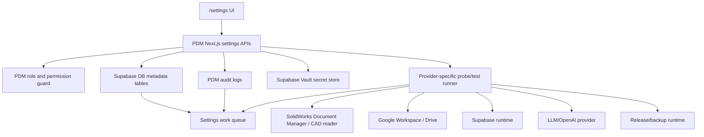

# SPEC-PDM-SETTINGS-CENTER-001 - 系統設定中心與 Secret 生命週期治理

Status: Phase 1-2 Implemented / Verification passed locally
Date: 2026-07-06
Owner: Dev PM
Related DEV: `DEV-PDM-SETTINGS-CENTER-001`
Related ADR: `.ai-doc/decisions/ADR-PDM-SETTINGS-CENTER-001-settings-center-secret-governance.md`
Related QA: `.ai-doc/qa/qa-pdm-settings-center-secret-lifecycle-validation-plan-2026-07-06.md`

External reference:

- Supabase Vault docs: https://supabase.com/docs/guides/database/vault
- Supabase Database API 42501 / forbidden schema docs: https://supabase.com/docs/guides/troubleshooting/database-api-42501-errors
- Supabase API keys migration docs: https://supabase.com/docs/guides/getting-started/migrating-to-new-api-keys
- Supabase changelog on explicit Data API grants: https://supabase.com/changelog/45329-breaking-change-tables-not-exposed-to-data-and-graphql-api-automatically

## 1. Human Decision Brief

Source: 2026-07-06 HCS guided decisions from the user.

HCS-guided answer log:

- Round 1:
  - `1C` - `/settings` becomes a settings center, not one growing single page.
  - `2C` - API/license keys can be entered from UI, but backend stores them securely and UI returns masked status only.
  - `3B` - low-risk settings can apply immediately; high-risk settings require test before activation.
- Round 2:
  - `1B` - first version has five setting areas.
  - `2B` - build a generic Secret Vault model instead of a one-off SolidWorks key field.
  - `3B` - high-risk settings are activated by Admin after successful testing.
- Round 3:
  - `1C amended` - secrets are stored in Supabase Vault; Supabase DB stores metadata only; Google Workspace handles Drive, account and permission integration only.
  - `2B` - Admin can change settings; Manager/Reviewer can see status where appropriate but never secret values.
  - `3B` - normal settings can keep versions and rollback; secrets can be replaced/revoked but not restored as original plaintext.
- Round 4:
  - `1A` - PDM Next.js backend APIs operate Supabase Vault; browser never accesses Vault directly.
  - `2B` - secret metadata is versioned through `draft -> tested -> active -> retired / revoked`.
  - `3B` - Google Workspace is the account source; PDM owns PDM roles and approval permissions.
- Round 5:
  - `1A` - settings routes are organized by management work, not vendor names.
  - `2B` - create dedicated metadata tables rather than extending current key-value `system_settings`.
  - `3B` - high-risk UI flow is `save draft -> test -> Admin activate`.
- Round 6:
  - `1C` - `/settings` overview is a work queue for settings tasks that need action.
  - `2B` - first integration scope is SolidWorks, Google Workspace/Drive, Supabase, LLM/OpenAI, release/backup.
  - `3B` - test evidence stores summary, error, actor, time, setting version and artifact path; it must not store sensitive plaintext payloads.
- Round 7:
  - `1B` - settings visibility is classified by setting type.
  - `2B` - high-risk settings include secrets, Google Drive directories, Supabase connection, release/backup and permission matrix.
  - `3C` - first implementation order is a SolidWorks secret vertical slice, then generalize.

Confirmed product decisions:

- The current `/settings` page must evolve into a settings center with a clear overview and dedicated subpages.
- The first version uses five areas:
  - `/settings` - overview and work queue.
  - `/settings/integrations` - external integrations and status.
  - `/settings/security` - secrets, keys and security-sensitive settings.
  - `/settings/workflow` - approval workflow, role matrix and high-risk process settings.
  - `/settings/system` - environment, runtime, database, release/backup and diagnostic status.
- Supabase Vault is the authoritative secret store. PDM DB must not store secret plaintext.
- Supabase DB stores only metadata, status, masked hints, lifecycle state, test evidence summary and audit links.
- Google Workspace does not decide PDM roles. It can provide accounts/groups and Drive authority; PDM controls Admin/Manager/Reviewer/Engineer roles and approval matrix.
- The browser never calls `vault.*`, `vault.decrypted_secrets` or any direct SQL surface. It only calls PDM server APIs.
- Manager/Reviewer can see non-sensitive operational status when useful, but cannot see or update secret material.
- Secret values are write-only from the UI perspective. After submit, UI can show configured/missing, last 4 characters or fingerprint, version, test state and activation state only.
- Secret rollback means activating a later submitted replacement or revoking a version. It does not mean revealing or restoring old plaintext from UI/audit.
- High-risk settings require draft, test and Admin activation.
- First implementation slice should prove the full loop with SolidWorks Document Manager / equivalent CAD reader secret:

```text
input secret -> Supabase Vault -> metadata version -> probe/test -> Admin activation -> audit -> /settings work queue update
```

Rejected behavior:

- Adding `solidworks_api_key` to the existing `/api/settings` allow-list and returning it with normal settings.
- Storing API keys/license keys as plaintext in `system_settings`, audit logs, report JSON, screenshots or probe artifacts.
- Letting frontend code, publishable/anon keys or Supabase Data API roles directly access `vault` schema.
- Letting Google Workspace group membership directly override PDM approval authority.
- Treating all settings as high-risk; low-risk display/non-external settings should not require a heavy activation flow.
- Building a cosmetic settings dashboard before the metadata, lifecycle and test evidence contract exists.

AI assumptions:

- The current `src/app/settings/page.tsx` and `src/app/api/settings/route.ts` are the compatibility baseline, not the end-state architecture.
- Existing Google Drive folder configuration can remain operational while the settings center is introduced.
- The current `system_settings` repository can remain for legacy/simple settings until migration is explicitly authorized.
- A local test double for the secret provider may be acceptable for unit tests, but product completion cannot claim Supabase Vault readiness without a Supabase target or approved equivalent evidence.
- Current Supabase readiness blockers remain separate. This DEV must not silently satisfy `DEV-IND-007` or production Supabase cutover.

Re-entry triggers:

- User wants secrets stored outside Supabase Vault.
- User wants frontend or Supabase Data API to access Vault directly.
- User wants Google Workspace groups to directly decide PDM roles.
- User wants two-person approval for all high-risk settings in the first version.
- RD needs production migration, production deploy, direct production data mutation, data deletion or external cost-incurring action.
- RD cannot test Supabase Vault without a disposable/staging target and no approved test double is acceptable.

## 2. Problem

The current `/settings` implementation is a single Admin-only page that mixes:

- Google Drive folder setup.
- Approval/role matrix.
- environment-backed read-only values.

This works for a narrow settings page, but it does not scale to SolidWorks API/license setup, Supabase Vault, LLM/OpenAI key, release/backup settings, workflow activation and audit evidence.

The main risk is not layout. The risk is turning secrets and high-risk integrations into ordinary editable key-value settings:

- secret plaintext could appear in API responses, audit logs or screenshots.
- a failed integration test could still become active.
- a Manager might need status visibility without permission to see sensitive infrastructure details.
- a later admin may not know which setting version is active, tested, revoked or pending.
- external service settings could affect formal upload/release/review behavior without evidence.

## 3. Product Rule

Authoritative boundaries:

```text
Settings center = management work surface
Secret Vault = Supabase Vault only
PDM metadata = lifecycle/status/evidence/reference only
Google Workspace = account and Drive integration source
PDM authorization = PDM roles, permission matrix and activation responsibility
```

High-risk settings must follow:

```text
Draft -> Test -> Admin Activate -> Active -> Retire/Revoke
```

Low-risk settings may apply immediately when:

- they do not contain secret material.
- they do not change external runtime behavior.
- they do not affect release, backup, permissions or formal approval.
- they are reversible without data or external-system impact.

## 4. Scope

### 4.1 In Scope

- Convert `/settings` into a settings center with overview/work queue and dedicated subpage architecture.
- Add a generic secret metadata model for multiple providers.
- Use Supabase Vault as the secret store and PDM DB as metadata store only.
- Add server-only APIs for secret draft, test, activation, revocation and status.
- Add high-risk setting lifecycle and activation model.
- Add settings test evidence model with redacted summaries and artifact paths.
- Add role-based visibility for Admin, Manager and Reviewer.
- Add SolidWorks secret vertical slice as the first implementation path.
- Preserve current Google Drive settings while planning migration into the new architecture.
- Add QA/QC evidence requirements for redaction, Vault boundary, UI work queue, high-risk activation and visible error checks.

### 4.2 Out of Scope

- Product implementation in this documentation task.
- Production deploy.
- Production schema migration or direct production data repair.
- Direct data deletion.
- Satisfying external Supabase shadow target blocker without a real target.
- Satisfying SolidWorks real-machine Add-in evidence.
- Storing secret plaintext in DB, log, audit, repo, report or browser response.
- Letting Google Workspace become the PDM authorization source.
- Full ERP/procurement connector configuration beyond first-version placeholders.
- Two-person activation approval in first version, unless separately authorized.

## 5. End-State Architecture



Invariant:

- `UI` can read status and submit draft values.
- `UI` cannot read secret plaintext.
- `API` is the only PDM surface that may create/update Vault secrets.
- `META` stores Vault secret IDs/references and redacted metadata only.
- `PROBE` must redact request/response and persist only approved evidence.

## 5.1 Architecture Memory Capsule

Fixed decisions:

- `/settings` is no longer a single accumulating Admin page. It becomes a settings center whose first screen is an action-oriented work queue.
- Settings areas are organized by management task, not vendor name: overview, integrations, security, workflow and system.
- Supabase Vault is the only selected secret store for secret material.
- Supabase DB stores metadata only: lifecycle state, Vault reference, masked hint, fingerprint, test summary, activation event and audit references.
- PDM Next.js backend APIs are the secret-governance boundary. Browser code must not call Vault or any decrypted secret view.
- Google Workspace can provide account/Drive integration, but PDM keeps role, approval and permission authority.
- High-risk settings require draft, test and Admin activation.
- Low-risk non-secret settings may remain immediate/reversible.
- First implementation slice is SolidWorks/CAD-reader secret lifecycle, not a cosmetic settings dashboard.

Non-negotiable safety rules:

- Secret plaintext must not appear in browser response, PDM DB metadata, audit logs, screenshots, report JSON, probe artifact or tracked file.
- New high-risk/secret settings must not be added to the legacy all-settings response contract.
- `vault` schema and decrypted secret surfaces are not frontend/Data API surfaces.
- A failed or untested secret version cannot become active.
- Revoked versions cannot be used by runtime/probe.
- Manager/Reviewer visibility is redacted and classified by setting type.

Module boundaries:

- Existing `system_settings` may remain for legacy/simple settings until explicitly migrated.
- Secret lifecycle, high-risk activation and provider test evidence live in new metadata tables.
- Supabase production/cutover remains under `DEV-SUPABASE-DB-001` / release gates and is not silently authorized here.
- SolidWorks native CAD extraction evidence remains under `DEV-CAD-001`; this DEV only provides the settings lifecycle unless a real CAD-reader probe is later authorized and completed.

Rejected options to preserve:

- Do not store `solidworks_api_key` or any API/license key as plaintext in `system_settings`.
- Do not let Google Workspace group membership directly override PDM roles.
- Do not treat dynamic settings status as proof of external integration readiness unless a test run exists.
- Do not use a settings dashboard as a substitute for test evidence and activation responsibility.

Re-entry triggers:

- Any change to selected secret store, frontend Vault access, Google Workspace role authority, production migration/deploy, data deletion/repair, external cost authorization or two-person activation policy requires PM/user re-entry.

## 6. Settings Information Architecture

### 6.1 `/settings` - Overview Work Queue

Primary question:

```text
現在有哪些系統設定需要處理？
```

Rows should be task-like:

| Work item | Example state | Primary CTA |
|---|---|---|
| SolidWorks CAD reader secret | 未設定 / 草稿待測試 / 測試失敗 / 待啟用 | 設定、測試、啟用 |
| Google Drive folders | 資料夾未驗證 / 權限失敗 | 前往 Drive 設定 |
| Supabase runtime | 連線未驗證 / RLS grant 待確認 | 前往系統狀態 |
| LLM provider | Key 未設定 / 模型未驗證 | 前往安全與金鑰 |
| Release/backup | 備份未驗證 / restore drill 缺證據 | 前往系統狀態 |
| Permission matrix | 草稿待啟用 / 高風險變更待測試 | 前往流程與權限 |

### 6.2 `/settings/integrations`

Purpose:

- show integration inventory, owner, status, last test and next action.
- include SolidWorks, Google Workspace/Drive, Supabase, LLM/OpenAI and release/backup.

The integration page must not become a secret editor. It may route to `/settings/security` when a secret is missing or invalid.

### 6.3 `/settings/security`

Purpose:

- manage secret references, draft/test/activation state and revocation.
- show no plaintext after submission.
- expose provider-specific test buttons with redacted output.

Secret rows show:

- provider/kind.
- configured/missing state.
- masked hint or fingerprint.
- active version.
- draft version if present.
- last test result and timestamp.
- last activated by/at.
- rotate/revoke/test/activate actions based on permission and state.

### 6.4 `/settings/workflow`

Purpose:

- manage approval matrix and role/workflow high-risk settings.
- keep PDM roles authoritative even if Google Workspace supplies accounts/groups.
- high-risk workflow changes follow draft/test/Admin activation.

### 6.5 `/settings/system`

Purpose:

- show runtime/environment/DB/release/backup status.
- show Supabase metadata table/RLS/grant health.
- show release and backup test evidence.
- keep sensitive connection strings redacted.

## 7. Domain Model

Recommended metadata tables:

| Table | Purpose | Must not contain |
|---|---|---|
| `setting_groups` | stable setting groups and visibility classification | secret values |
| `setting_versions` | non-secret setting version payloads and lifecycle | secret values |
| `integration_connections` | provider identity, owner, status and current version refs | credentials |
| `secret_references` | Vault reference metadata, provider kind, lifecycle, masked hint, fingerprint | plaintext secret |
| `setting_test_runs` | test result, summary, redacted error and artifact path | raw request/response with secrets |
| `setting_activation_events` | activation/retire/revoke events and actor | secret values |

Minimum `secret_references` contract:

- `id`
- `provider_kind` such as `solidworks_document_manager`, `openai`, `google_service_account`, `supabase_runtime`, `release_function`, `backup_target`
- `vault_secret_id`
- `display_name`
- `version_no`
- `status`: `draft`, `tested`, `active`, `retired`, `revoked`, `test_failed`
- `masked_hint`
- `fingerprint`
- `created_by`, `created_at`
- `tested_by`, `tested_at`
- `activated_by`, `activated_at`
- `retired_by`, `retired_at`
- `revoked_by`, `revoked_at`
- `last_test_run_id`

Vault boundary:

- `vault_secret_id` may be stored.
- Vault plaintext may only be read by a server-side probe path that needs it.
- The server path must never include plaintext in returned JSON, thrown error, audit detail or artifact.

Supabase Data API/RLS note:

- Metadata tables may live in `public` only if explicit grants and RLS policies are deliberate and tested.
- New Supabase projects may not expose public tables to the Data API by default; migrations must include explicit `GRANT` where Data API access is intended.
- `vault` schema remains forbidden to normal API roles and must not be exposed.

## 8. API Contract

Recommended server-only route family:

| Route | Method | Purpose | Role |
|---|---|---|---|
| `/api/settings/overview` | `GET` | work queue and status summary | Admin, selected Manager/Reviewer view |
| `/api/settings/integrations` | `GET` | integration inventory | Admin, selected Manager/Reviewer view |
| `/api/settings/secrets` | `GET` | redacted secret status list | Admin |
| `/api/settings/secrets/[kind]/draft` | `POST` | create replacement draft in Supabase Vault and metadata | Admin |
| `/api/settings/secrets/[id]/test` | `POST` | run redacted provider probe | Admin |
| `/api/settings/secrets/[id]/activate` | `POST` | activate tested version | Admin |
| `/api/settings/secrets/[id]/revoke` | `POST` | revoke secret reference and disable active use | Admin |
| `/api/settings/test-runs/[id]` | `GET` | redacted test run detail | Admin, selected Reviewer for audit |
| `/api/settings/system` | `GET` | system status and diagnostics | Admin, selected Manager/Reviewer view |

Compatibility:

- Current `/api/settings` may remain for legacy Google Drive settings during Phase 1.
- New high-risk settings should not be added to the old all-settings response model.

## 9. Permission Model

| User role | Overview | Integration status | Secret status | Secret value | Update/activate |
|---|---|---|---|---|---|
| Admin | Full | Full | Full redacted metadata | Never after submit | Yes |
| Manager | Selected operational status | Selected status | No by default | Never | No |
| Reviewer | Audit/validation status where assigned | Selected validation status | No by default | Never | No |
| Engineer | No settings center by default | No | No | Never | No |

Manager/Reviewer status exposure must be per setting type:

- general system health can be visible if it helps operations.
- Supabase, secret, release/backup and security-sensitive details are Admin-only unless a specific audit view is implemented.
- audit views must remain redacted.

## 10. Lifecycle State Machine

Secret lifecycle:

```text
missing -> draft -> tested -> active -> retired
                   \-> test_failed
active -> revoked
draft -> revoked
test_failed -> draft
```

Activation rules:

- Only `tested` can become `active`.
- Activating a new version retires the previous active version for the same provider/kind unless the provider explicitly supports multiple active keys.
- `revoked` is terminal for that metadata version.
- No UI action can reveal old plaintext.

High-risk setting lifecycle:

```text
draft -> tested -> active -> retired
draft -> test_failed -> draft
active -> replacement_draft
```

Low-risk setting lifecycle:

```text
saved -> active
active -> rollback_to_previous_version
```

Only non-secret settings can support direct rollback.

## 11. SolidWorks Vertical Slice

Phase 1 target provider:

```text
solidworks_document_manager
```

Required loop:

1. Admin enters SolidWorks Document Manager API/license secret or approved equivalent CAD-reader credential.
2. Backend writes the value to Supabase Vault and stores metadata in `secret_references`.
3. UI shows draft redacted status.
4. Admin runs a probe with configured sample CAD files and extractor command/profile.
5. Probe reads plaintext only server-side, calls the configured CAD-reader path and stores redacted test evidence.
6. Successful test changes metadata to `tested`.
7. Admin activates the tested version.
8. `/settings` overview removes the blocker or changes it to healthy.
9. Audit records actor, version, provider, test run and activation, without secret plaintext.

Acceptance:

- A SolidWorks secret can be created, tested, activated, retired/revoked and shown on overview without plaintext exposure.
- Upload/CAD warning surfaces can distinguish `not configured`, `configured but untested`, `test failed`, and `active`.
- `DEV-CAD-001` external evidence remains separate until native CAD reader test evidence exists; this settings slice provides the configuration path, not the CAD reader proof by itself.

## 12. Phase Roadmap

| Phase | Document status | Purpose | Authorization boundary |
|---|---|---|---|
| Phase 0 - Architecture and long task | Spec Ready / Human Confirmed | Capture HCS decisions, ADR, QA and dev_task entry | Authorized by user request to write long task |
| Phase 1 - SolidWorks secret vertical slice | Implemented / Verification passed locally | Prove secret draft, test-double Vault boundary, metadata, probe/test, activation, audit and work queue with SolidWorks provider | Supabase Vault live write/smoke remains gated |
| Phase 2 - Settings center IA shell | Implemented / Compatibility shell passed locally | Add `/settings`, integrations, security, workflow and system routes while preserving current Google Drive settings | Dedicated per-area pages may be deepened later |
| Phase 3 - Google Workspace/Drive migration | RD Contract Ready / Not Authorized | Move current Drive folder verification into lifecycle metadata and add account-source status | Requires Google Workspace/Drive credential boundary confirmation |
| Phase 4 - Supabase, LLM/OpenAI, release/backup high-risk settings | RD Contract Ready / Not Authorized | Generalize providers and high-risk activation/test evidence | Requires provider-specific test contracts and cost/credential approval |
| Phase 5 - Workflow/permission matrix lifecycle | RD Contract Ready / Not Authorized | Apply draft/test/Admin activation to permission matrix and workflow settings | Requires acceptance of workflow activation behavior |
| Phase 6 - Production release/cutover | RD Contract Ready / Not Authorized | Apply migrations and release settings center to production | Requires deployment-release gate, backup and rollback approval |

## 13. RD Handoff Contract

### 13.0 Common RD Handoff Controls

Applies to every phase:

- Data/API/permission impact must be additive unless the phase explicitly authorizes migration.
- Existing `/settings` Google Drive behavior must remain compatible until the phase explicitly migrates it.
- Secret plaintext redaction is a mandatory gate for all phases.
- Metadata RLS/grants must be explicit when a phase adds or exposes tables.
- UI evidence must include visible-error sweep; lint/build/API tests cannot override a visible settings failure.
- Stop immediately if the phase needs production deploy/cutover, direct data repair/deletion, frontend Vault access, plaintext secret persistence, Google Workspace direct role authority or external-cost action without approval.

Common evidence required after any implementation phase:

- `npx.cmd tsc --noEmit --pretty false`
- `npm.cmd run lint -- --quiet`
- relevant focused QC for the phase
- role/permission negative tests when settings visibility or activation changes
- redaction scan for responses, audit details and artifacts when secrets or provider probes are touched
- browser evidence for changed settings routes at the required viewports

### Phase 1 - SolidWorks Secret Vertical Slice

Scope:

- Add secret provider interface with Supabase Vault implementation and local test double.
- Add metadata repository for `secret_references`, `setting_test_runs` and activation events.
- Add Admin-only APIs for draft, test, activate and revoke.
- Add `/settings/security` or focused SolidWorks settings panel sufficient for the full loop.
- Add overview work queue item for SolidWorks/CAD reader readiness.
- Add redaction helper for responses, errors, audit and artifacts.

Out of scope:

- Full settings center visual redesign.
- Google Drive migration.
- Production migration.
- Real SolidWorks Add-in evidence.
- Claiming native CAD extraction is complete without Document Manager/equivalent probe evidence.

Implementation contract:

- Server-side only code can call Vault.
- Direct Data API/browser cannot access Vault.
- Test runs must not persist secret material.
- Audit detail must include metadata IDs, version and redacted status only.
- Missing Supabase Vault target must produce an actionable settings blocker, not a runtime crash.

Data/API/permission impact:

- Requires additive metadata tables and RLS/grant design.
- Requires Admin role checks equivalent to or stricter than current `/api/settings`.
- Manager/Reviewer read endpoints, if included in Phase 1, must return only approved non-sensitive status fields.

Entry conditions:

- Explicit user/PM authorization for RD: satisfied by the user's 2026-07-06 authorization.
- Decision whether Phase 1 uses a real Supabase Vault target or a local test double plus later Vault verification gate: satisfied for local implementation by using `local_test_double` plus a live-gate blocker.

Acceptance:

- Admin can create a draft SolidWorks secret and cannot read it back.
- Test run stores redacted result and artifact path only.
- Only a successful test can be activated.
- Active version appears in overview status and integration status.
- Revoked/retired versions cannot be used.
- UI has no visible raw API/HTTP error in required surfaces.
- PDM DB stores lifecycle metadata only. Supabase Vault live storage is not claimed until a live target is approved and smoke-tested.

Evidence required:

- Passed locally: `npx.cmd tsc --noEmit --pretty false`
- Passed locally: `npm.cmd run lint -- --quiet`
- Passed locally: `npm.cmd run qc:pdm-settings-center-secret-lifecycle`
- Passed locally: `npm.cmd run qc:supabase-secret-boundary`
- Passed locally: `npm.cmd run qc:gdrive-folder-tree-settings`
- Passed locally for added metadata schema: `npm.cmd run qc:db-provider-contract`, `npm.cmd run qc:db-provider-postgres`, `npm.cmd run qc:supabase-current-change-impact`
- Supabase Vault live probe remains a documented live-gate blocker.

Stop conditions:

- Need production migration/deploy.
- Need to store plaintext outside Vault.
- Need to expose `vault.decrypted_secrets` to frontend/API roles.
- Cannot test Vault without target and no test double is authorized.

### Phase 2 - Settings Center IA Shell

Scope:

- Split page structure and navigation.
- Move current Google Drive UI into the selected subpage or compatibility panel.
- Keep old API compatibility until migration.
- Show overview work queue from metadata and existing legacy states.

Out of scope:

- Provider-specific secret implementations beyond Phase 1.
- Permission matrix activation lifecycle.

Acceptance:

- `/settings` answers current settings tasks.
- `/settings/integrations`, `/settings/security`, `/settings/workflow`, `/settings/system` are routable.
- Existing Google Drive setup still works or is explicitly shown as legacy compatibility.

### Phase 3 - Google Workspace/Drive Migration

Scope:

- Model Drive folders as high-risk settings.
- Preserve current verification snapshots.
- Add Google Workspace account-source status, if available.
- Keep PDM roles authoritative.

Out of scope:

- Google group direct-to-PDM-role automation.

Acceptance:

- Pending/released/master attachment folders have lifecycle/test evidence.
- Folder changes require verification before activation.
- PDM role/approval matrix does not change merely because Google group membership changed.

### Phase 4 - Additional Provider High-Risk Settings

Scope:

- Supabase runtime status.
- LLM/OpenAI provider secret and model test.
- Release function secret/status.
- Backup target and restore-drill status.

Out of scope:

- Production cutover without deployment-release gate.
- Cost-incurring provider usage without approval.

Acceptance:

- Each provider has status, test, activation and redacted evidence.
- Overview work queue shows provider-specific blockers and next action.

### Phase 5 - Workflow/Permission Matrix Lifecycle

Scope:

- Apply draft/test/Admin activation to workflow/permission matrix changes.
- Show pending activation and active matrix.
- Audit before/after without sensitive overexposure.

Out of scope:

- Mandatory second-person approval for first version.

Acceptance:

- Workflow changes cannot silently affect approvals without an activation event.
- Permission matrix test catches missing approver/invalid rule blockers before activation.

### Phase 6 - Production Release/Cutover

Scope:

- Generate final migrations.
- Run Supabase advisors/RLS/grant checks.
- Run release/deployment gates.
- Validate rollback plan.

Out of scope:

- Any unapproved production data repair or deletion.

Acceptance:

- Production release gate passes.
- Secret boundary remains intact.
- Settings center has no visible runtime errors.

## 14. QA/QC Gate

Minimum Phase 1 QA:

- secret plaintext never appears in browser response, audit, logs, report JSON or screenshot.
- forbidden Vault access through Data API/browser roles fails or is absent by design.
- Admin-only mutation endpoints reject non-Admin users.
- test failure remains draft/test_failed and cannot be activated.
- activation retires previous active version.
- overview work queue shows next action.
- visible UI surfaces pass runtime-visible error sweep.

Minimum full DEV QA:

- route coverage for all five subpages.
- high-risk setting state machine tests.
- role-based visibility tests.
- RLS/grant/Data API exposure tests for metadata tables.
- Supabase Vault live test or explicitly blocked live-evidence gate.
- existing `/settings` Google Drive behavior regression.

## 15. Deferred Scope Audit

| Scope | Classification | Reason / location |
|---|---|---|
| Remaining product implementation | Same Spec Phase 3-5 / Not Authorized | Phase 1 SolidWorks secret slice and Phase 2 route shell are implemented; provider expansion and workflow lifecycle remain gated |
| Production deploy/cutover | Same Spec Phase 6 / Not Authorized | Requires deployment-release gate |
| Supabase Vault live target | Blocked Human Re-entry if absent at RD time | Phase 1 must decide live target vs test double plus live blocker |
| Two-person activation approval | No Tracking in first version | Explicitly not chosen; can become future DEV if required |
| ERP/procurement settings | No Tracking in first version | First integration scope excludes it |
| Google group direct role mapping | No Tracking / rejected | User selected Google as account source, PDM as authorization source |
| Existing legacy settings migration | Same Spec Phase 2-3 | Current settings remain compatible until migrated |
| Secret rollback to old plaintext | No Tracking / rejected | Secrets are replace/revoke only |

## 16. All-Phase Coverage Matrix

| Phase / DEV | Authorization | Document status | Scope | Out of scope | Entry condition | Acceptance | Evidence |
|---|---|---|---|---|---|---|---|
| Phase 0 - Architecture | Authorized | Spec Ready / Human Confirmed | Long-task documents, ADR, QA plan, dev_task entry | Product implementation | User asked to write long task | Documents capture decisions and gates | Updated `.ai-doc` files |
| Phase 1 - SolidWorks secret vertical slice | Authorized for local non-production | Implemented / Verification passed locally | Test-double Vault boundary, metadata, test, activation, audit, overview | Production, live Vault smoke, real Add-in evidence | User authorization and test-double/live-gate decision | SolidWorks secret lifecycle works without plaintext exposure | tsc, lint, focused QC, redaction QC, legacy regression |
| Phase 2 - Settings center IA shell | Authorized for compatibility shell | Implemented / Compatibility shell passed locally | Five route areas and overview queue | Full per-area redesign, provider expansion | Phase 1 authorization | Current settings preserved; routes are clear | UI/static QC and legacy regression |
| Phase 3 - Google Workspace/Drive migration | Not authorized | RD Contract Ready / Not Authorized | Drive folder lifecycle and account-source status | Google group direct role mapping | Phase 2 shell plus Google credential boundary | Folder activation requires verification | API/UI/QC evidence |
| Phase 4 - Supabase/LLM/release/backup providers | Not authorized | RD Contract Ready / Not Authorized | Provider test/activation and redacted evidence | Cost-incurring use, production cutover | Provider-specific approval | Each provider has safe lifecycle | Provider QC, redaction QC |
| Phase 5 - Workflow/permission lifecycle | Not authorized | RD Contract Ready / Not Authorized | Permission matrix draft/test/Admin activation | Mandatory second-person approval | Phase 2 shell plus workflow authorization | Workflow changes require activation evidence | Role/approval tests |
| Phase 6 - Production release/cutover | Not authorized | RD Contract Ready / Not Authorized | Migrations, advisors, release gate | Data deletion/unapproved repair | Implementation verified and release approved | Production readiness passes | deployment-release evidence |

## 17. Spec Governance Result

Trigger:

- This spec changes settings architecture, secret handling, metadata schema, permissions, audit evidence and Supabase boundary.

Cross-spec consistency:

- Compatible with `SPEC-SUPABASE-DB-001-runtime-postgres-migration.md` because runtime provider/production cutover remains separately gated.
- Compatible with current `/settings` implementation by treating existing Google Drive settings as compatibility scope.
- Compatible with `DEV-CAD-001` by providing configuration lifecycle but not claiming native CAD extraction evidence.
- Compatible with `DEV-IND-007` by requiring a real Supabase/Vault target for live evidence rather than bypassing the blocker.

ADR:

- Required and created at `.ai-doc/decisions/ADR-PDM-SETTINGS-CENTER-001-settings-center-secret-governance.md`.

RD readiness:

- Phase 1 local non-production implementation is complete and verified.
- A live Supabase Vault target/smoke decision remains a production-readiness entry condition, not a hidden assumption.
