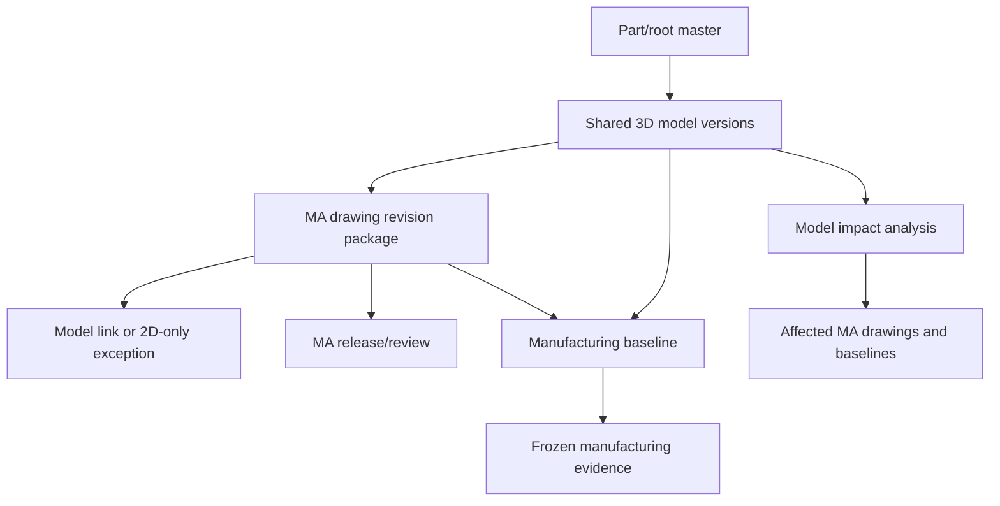

# SPEC-PDM-SHARED-3D-MA-BASELINE-001 - 共用 3D 主檔與 MA 製造基準包

Status: Implemented / Verification passed locally
Date: 2026-07-06
Owner: Dev PM
Related DEV: `DEV-PDM-SHARED-3D-MA-BASELINE-001`
Related ADR: `.ai-doc/decisions/ADR-PDM-SHARED-3D-MA-BASELINE-001-root-shared-model-and-manufacturing-baseline.md`
Related QA: `.ai-doc/qa/qa-pdm-shared-3d-ma-baseline-validation-plan-2026-07-06.md`

> **2026-08-10 DEV-061 Amendment**
>
> 新版次 3D 接收與共用規則改由 `.ai-doc/specs/SPEC-PDM-FILE-OWNERSHIP-001-contextual-drawing-part-files-and-3d-reuse.md` 管理：使用者每次首版／進版都必須重新上傳 `.SLDPRT`／`.SLDASM`，系統以 company + owner scope + verified SHA-256/size 自動重用相同 canonical asset。新 write 不再允許 `two_d_only`／no-model-impact 例外；既有歷史列與已發布 baseline 保持可讀且不可改。本文衝突處只保留為歷史證據。

Related authority:

- `.ai-doc/specs/SPEC-PDM-DRAWING-REVISION-PACKAGE-002-first-class-attachment-package-model.md`
- `.ai-doc/specs/SPEC-PDM-DRAWING-REVISION-SUBMISSION-001-controlled-revision-package.md`
- `.ai-doc/specs/SPEC-PDM-DRAWING-PART-WORKBENCH-001-data-flow-security.md`
- `.ai-doc/specs/SPEC-PDM-RELEASE-MASTER-STATUS-SYNC-001-submission-release-master-lifecycle.md`
- `.ai-doc/decisions/ADR-PDM-SHARED-3D-MA-BASELINE-001-root-shared-model-and-manufacturing-baseline.md`
- `.ai-doc/decisions/ADR-PDM-DRAWING-REVISION-PACKAGE-001-first-class-package-and-supplement.md`

## 1. Human Decision Brief

Source: 2026-07-06 HCS guided decisions from the user.

HCS-guided answer log:

- `1B` - shared 3D master data belongs at the part/root level, not under one MA drawing.
- `2B` - add a part/root manufacturing baseline package. The baseline does not replace "search drawings by part number"; it freezes the approved manufacturing combination found through that part/root.
- `3B` - MA drawing review normally requires binding to the shared 3D. A pure 2D marking/annotation change may bypass the model-link requirement only with an explicit reason and reviewer confirmation.

Confirmed product decisions:

- A root/part can have multiple MA drawings, and each MA drawing keeps its own drawing revision package.
- The shared 3D represents the root/part object family. It must not be owned by `MA01` merely because `MA01` was uploaded first.
- Search by part number/root is a navigation/query function. It shows the current related drawings and files.
- A manufacturing baseline is a formal frozen release record. It locks the exact shared 3D hash/model version and the exact MA drawing package revisions used for manufacturing at that time.
- Manufacturing, quality, service and future audit must be able to answer: "This batch/order used which 3D and which MA drawing revisions?"
- The system should prevent repeated upload of the same 3D under many MA drawings when the file hash already exists as a shared model.
- A MA drawing package can be released without changing the shared 3D only when the submitter declares a `2D-only / no model impact` reason and the reviewer confirms it.

Rejected behavior:

- Treating one MA drawing as the permanent owner of the shared 3D.
- Relying only on part-number search results as manufacturing evidence.
- Duplicating identical 3D files under every MA drawing without hash-based reuse guidance.
- Allowing a formal MA drawing release to silently omit its shared 3D basis.
- Mutating an already released manufacturing baseline when later MA drawings revise.

AI assumptions:

- The first implementation should reuse existing `file_assets.content_hash`, `source_file_asset_id`, `drawing_revision_packages`, drawing/part/root tables and release transaction patterns where possible.
- Current code already supports drawing-level `cad_3d` attachments, but part-level `cad_3d` ownership and root-level shared model semantics need additive implementation.
- `part_number` is the minimum implementation anchor for shared model ownership. If one shared 3D must span multiple part-number variants under the same root, RD should add explicit root-level ownership rather than forcing one part number to act as a proxy owner.
- Manufacturing baseline release is a new controlled object. It is not the same as the existing single-submission release package zip.
- ADR authority is established in `.ai-doc/decisions/ADR-PDM-SHARED-3D-MA-BASELINE-001-root-shared-model-and-manufacturing-baseline.md`.
- Production deployment, production migration, historical repair and direct data mutation are not authorized by this local implementation.

Re-entry triggers:

- User wants shared 3D owned by the first MA drawing instead of the part/root.
- User wants no manufacturing baseline and only wants dynamic part-number search.
- User wants every MA drawing release to be blocked unless it changes or re-attaches 3D, with no 2D-only exception.
- RD discovers the model requires production data mutation, deletion or historical reassignment to implement.
- RD needs to change part-number identity, drawing-number identity, FFF, BOM revision rules or reviewer authority beyond this spec.

## 2. Problem

Current PDM has a strong drawing revision package model, but it is still MA-drawing centered:

- `drawing_revision_packages` can control one drawing revision package.
- Package files can reference drawing-owned `file_assets`.
- Current master attachment category guards allow `cad_3d` for `drawing_number`, but part attachments are limited to document types such as catalog/spec/supplier/test/other.
- Drawing submission workbench currently lists drawing-owned attachments, not part/root-owned shared model assets.
- The existing release package is per submission/drawing revision. It does not freeze a part/root-level manufacturing combination across multiple MA drawings.

That is not enough for the selected design:

```text
one root / part family
  -> one shared 3D model basis
  -> multiple MA drawing revision packages
  -> one manufacturing baseline that freezes the effective combination
```

Without a manufacturing baseline, part-number search can show the current state, but it cannot prove what was released for a past manufacturing batch after one MA drawing later revises.

## 3. Product Rule

Authoritative boundary:

```text
Part/root search = current navigation and discovery
Shared 3D model = controlled source model basis for the part/root family
MA drawing revision package = controlled 2D/process/manufacturing drawing evidence
Manufacturing baseline = formal frozen set of shared 3D + effective MA drawing packages + optional BOM snapshot
```

Search vs baseline rule:

| Behavior | Part/root search | Manufacturing baseline |
|---|---|---|
| Purpose | Find currently related drawings and files | Prove the exact approved manufacturing set |
| Mutability | Changes as drawings/models revise | Immutable after release |
| Evidence | Navigation/query result | Controlled release record |
| Audit answer | "What is related now?" | "What was used then?" |

Example:

```text
P-0001 Manufacturing Baseline R1
- Shared 3D: Model Rev C / hash abc123
- MA01: Rev A / package PKG-1
- MA02: Rev B / package PKG-2
- MA03: Rev A / package PKG-3
```

If `MA02` later becomes Rev C, `P-0001` search may show the current `MA02 Rev C`, but `Baseline R1` remains locked to `MA02 Rev B`.

MA drawing release rule:

- A MA drawing revision package must link to the shared 3D model version used as its model basis.
- If the change is pure 2D marking/annotation/process-note change, the submitter may choose `2D-only / no 3D impact`.
- `2D-only / no 3D impact` requires a reason and reviewer confirmation.
- A missing model link without a confirmed 2D-only reason is a release blocker, not only a warning.

3D reuse rule:

- Uploading a 3D file with a content hash that already exists under the same company/root/part should recommend reuse of the existing shared model asset.
- Reuse must preserve a clear reference to the shared model version and content hash.
- The system should not silently create many independent 3D sources with the same hash under different MA drawings.

Shared model version identity rule:

| Case | Required behavior |
|---|---|
| Same owner + same `content_hash` + same `model_revision` | Reuse the existing model version; do not create a duplicate Released model. |
| Same owner + same `content_hash` + different `model_revision` | Treat as metadata/label conflict; block Released creation unless the user records an explicit `same_hash_new_label` reason and reviewer approves it. |
| Same owner + different `content_hash` + same `model_revision` | Block Released creation until the model revision label is corrected or an Admin-reviewed correction reason is recorded. |
| Same owner + different `content_hash` + higher/new `model_revision` | Create a new model version after normal review/release. |
| Same hash under another MA drawing in the same root/part context | Offer `引用既有共用 3D`; do not silently duplicate authority. |

Baseline required-MA rule:

- Manufacturing baseline creation starts from a resolver result, not from arbitrary user-picked drawing packages.
- Required MA drawings are all non-obsolete `purpose_code = 'MA'` drawings under the selected root that are `Active` or `Released`, plus any MA drawing explicitly linked to the selected part as manufacturing evidence.
- Draft, `NeedInfo`, `Rejected`, `Obsolete`, `Merged`, `EVTDisabled` and `MainDrawingInvalid` drawings are not eligible baseline items until their state is repaired or released.
- `OT` and reference drawings are optional supporting evidence, not required MA items unless a later spec explicitly marks them required.
- Each required MA drawing must resolve to a Released drawing revision package. The default is the computed latest Released package; choosing a non-latest package requires an explicit baseline reason.
- A required MA drawing may be excluded only with an explicit `excluded_from_baseline` reason and reviewer/Admin approval. Exclusion is audit evidence, not silent omission.
- Current `drawing_part_links.link_type = 'primary_manufacturing'` permits only one primary manufacturing drawing per part in the existing schema. This DEV must not overload that unique link to represent the full multi-MA set. RD must use root-level MA discovery and/or add an explicit baseline participation model.

## 4. Scope

### 4.1 In Scope

- Add part/root-level shared 3D model ownership.
- Allow shared 3D assets to use `cad_3d` and related intermediate model categories at part/root level.
- Link MA drawing revision packages to a shared 3D model version or an approved 2D-only exception.
- Add a manufacturing baseline object that freezes the effective shared 3D and MA drawing package set.
- Distinguish dynamic part/root search from frozen manufacturing baselines in UI and API wording.
- Add hash-based reuse guidance for duplicate 3D uploads.
- Add impact detection: when a shared 3D model changes, list MA drawings and manufacturing baselines using the older model version.
- Add QA/QC coverage for model linkage, 2D-only exception, baseline immutability, hash reuse and historical traceability.

### 4.2 Out of Scope

- Production deploy.
- Production migration or direct production data repair.
- Data deletion or silent reassignment of existing file assets.
- Forcing part number or BOM revision for every MA drawing revision.
- CAD/OCR/SolidWorks automatic model extraction as a required dependency.
- Replacing the existing first-class drawing revision package model.
- Replacing part-number/root search with baseline only.
- Dedicated mobile-phone UI; phones use the desktop/default surface unless separately approved.

## 5. End-State Architecture



Architecture Memory Capsule:

- Shared 3D belongs to the product object family, not to a specific MA drawing.
- MA drawings remain separately versioned and separately releasable.
- Manufacturing baseline is the cross-MA frozen release object.
- Baseline release does not create new drawing revisions by itself. It selects already valid package versions.
- Baseline immutability is mandatory for quality traceability.
- A 2D-only MA release is allowed, but only when the exception is explicit and reviewed.
- Hash reuse is a prevention control, not just a storage optimization.

## 6. Data Model Contract

Exact table and column names are RD-owned if the contracts below are preserved.

### 6.1 Shared 3D Model Ownership

Required object: `shared_cad_model_versions` or equivalent.

| Field | Contract |
|---|---|
| `id` | Stable model-version id. |
| `company_id` | Company scope. |
| `owner_scope` | `part_root` or `part_number`; used for uniqueness and lookup. |
| `owner_id` | Root or part id matching `owner_scope`. |
| `part_root_id` | Root/family owner when available. |
| `part_number_id` | Part owner or primary part anchor. |
| `source_file_asset_id` | File asset containing the actual model file. |
| `model_revision` | Model revision label, if available. |
| `content_hash` | Copied from `file_assets.content_hash` for immutable comparison. |
| `hash_algorithm` | Hash algorithm. |
| `status` | `Draft`, `Pending`, `Released`, `Obsolete` or equivalent. |
| `created_by`, `created_at`, `released_at` | Audit. |
| `snapshot_json` | Frozen metadata used at release. |

Rules:

- Part/root-owned model assets must support `cad_3d`, `intermediate`, and `other` categories at minimum.
- `source_file_asset_id` must not be overwritten after model version release.
- If root-level file ownership is implemented through `file_assets.linked_entity_type = 'part_root'`, all repository resolvers and guards must explicitly support it.
- If first implementation uses `part_number` as owner, root-level aggregation must still show the shared model under the root/family.
- Released model uniqueness is enforced by `(company_id, owner_scope, owner_id, model_revision)` and by duplicate-hash reuse checks.
- Different content hash with the same Released `model_revision` is a blocker unless an Admin-reviewed correction path is implemented.

### 6.2 MA Drawing Package Model Link

Required object: `drawing_revision_package_model_links` or equivalent.

| Field | Contract |
|---|---|
| `id` | Stable link id. |
| `package_id` | Drawing revision package id. |
| `shared_model_version_id` | Referenced shared 3D model version. Nullable only for approved 2D-only exception. |
| `link_state` | `linked`, `2d_only_no_model_impact`, `missing_blocked`. |
| `exception_reason_code` | Required for `2d_only_no_model_impact`. |
| `exception_note` | Human-readable reason. |
| `reviewer_confirmed_by`, `reviewer_confirmed_at` | Required before release for 2D-only exception. |
| `model_content_hash` | Copied immutable hash from the linked model version. |
| `created_by`, `created_at` | Audit. |

Rules:

- MA package release must block when `link_state = missing_blocked`.
- `2d_only_no_model_impact` is allowed only when reason and reviewer confirmation are present.
- The link must be visible in package details, reviewer page and baseline selection.

### 6.3 Manufacturing Baseline

Required objects: `manufacturing_baselines` and `manufacturing_baseline_items` or equivalent.

`manufacturing_baselines`:

| Field | Contract |
|---|---|
| `id` | Stable baseline id. |
| `company_id` | Company scope. |
| `part_root_id`, `part_number_id` | Owner context. |
| `baseline_code` | Human-readable baseline number, e.g. `P-0001-MB-R1`. |
| `baseline_revision` | Baseline revision/version. |
| `status` | `Draft`, `Pending`, `Released`, `Obsolete`. |
| `purpose` | Manufacturing, service, customer release or internal trial. |
| `source_submission_id` | Optional review workflow source. |
| `created_by`, `created_at`, `released_by`, `released_at` | Audit. |
| `snapshot_json` | Frozen summary of all selected items. |

`manufacturing_baseline_items`:

| Field | Contract |
|---|---|
| `id` | Stable item id. |
| `baseline_id` | Parent baseline. |
| `item_type` | `shared_3d_model`, `ma_drawing_package`, `bom_snapshot`, `supporting_file`. |
| `drawing_number_id` | Required for MA drawing package items. |
| `drawing_revision_package_id` | Required for MA drawing package items. |
| `shared_model_version_id` | Required for shared 3D model item. |
| `source_file_asset_id` | Optional supporting source file. |
| `content_hash` | Frozen hash when applicable. |
| `display_order` | Stable display order. |

Rules:

- Released baseline core rows are immutable.
- Releasing a new MA drawing revision does not mutate older baselines.
- A baseline cannot release if any selected MA package has `missing_blocked` model-link state.
- A baseline must contain exactly one effective shared 3D model version unless the part/root has an approved multi-model exception.
- A baseline cannot release if the resolver reports a required MA drawing without a selected Released package.
- A baseline cannot release if a required MA drawing is excluded without an approved exclusion reason.
- Selecting a non-latest MA package is allowed only when `purpose` is historical/service/customer-specific or a reviewer-approved reason is stored in the baseline snapshot.

### 6.4 Hash Reuse Index

Required behavior:

- When uploading a part/root 3D or MA drawing 3D file, search `file_assets.content_hash` within the same company and root/part context.
- If a Released or Draft shared model version with the same hash exists, UI must offer `引用既有共用 3D` before creating a new model version.
- Reuse must preserve provenance: existing model version id, source file asset id, original filename and hash.

### 6.5 Manufacturing Baseline Resolver

Required service: `resolveManufacturingBaselineCandidate` or equivalent.

Resolver output:

| Field | Contract |
|---|---|
| `part_root_id`, `part_number_id` | Baseline owner context. |
| `shared_model_candidates` | Released shared model versions eligible for the owner. |
| `required_ma_drawings` | Required MA drawing numbers under the selected root/part. |
| `optional_drawings` | OT/reference/supporting drawings. |
| `latest_package_by_drawing` | Computed latest Released package per required MA drawing. |
| `missing_required_packages` | Required MA drawings with no Released package. |
| `non_latest_selection_reasons` | Required when user selects non-latest package. |
| `excluded_required_drawings` | Required MA drawings the user wants to exclude; must include reason and reviewer/Admin approval. |

Rules:

- UI should begin baseline drafting from resolver output.
- Release API must re-run the resolver inside the release transaction.
- Resolver result is advisory in Draft but authoritative at release.
- Resolver must use the same revision comparator as the drawing revision package latest/history model.
- Resolver must not treat dynamic part/root search as a frozen baseline.

## 7. API / Service Contract

Route names may vary, but service boundaries must exist.

```ts
createSharedCadModelVersion(input: {
  companyId: string;
  actorUserId: string;
  partRootId?: string | null;
  partNumberId: string;
  sourceFileAssetId: string;
  modelRevision?: string | null;
  idempotencyKey: string;
}): Promise<{ modelVersionId: string; contentHash: string; duplicateReuseCandidateIds: string[] }>;

linkDrawingPackageToSharedModel(input: {
  companyId: string;
  actorUserId: string;
  packageId: string;
  sharedModelVersionId: string;
}): Promise<{ packageId: string; linkState: "linked"; modelContentHash: string }>;

markDrawingPackageAs2dOnly(input: {
  companyId: string;
  actorUserId: string;
  packageId: string;
  reasonCode: string;
  note: string;
}): Promise<{ packageId: string; linkState: "2d_only_no_model_impact" }>;

confirm2dOnlyModelException(input: {
  companyId: string;
  reviewerUserId: string;
  packageId: string;
  decision: "confirm" | "reject";
  note?: string | null;
}): Promise<{ packageId: string; confirmed: boolean }>;

createManufacturingBaseline(input: {
  companyId: string;
  actorUserId: string;
  partRootId?: string | null;
  partNumberId: string;
  sharedModelVersionId: string;
  drawingRevisionPackageIds: string[];
  nonLatestPackageReasons?: Array<{ packageId: string; reason: string }>;
  excludedRequiredDrawings?: Array<{ drawingNumberId: string; reason: string }>;
  bomSnapshotId?: string | null;
  idempotencyKey: string;
}): Promise<{ baselineId: string; warnings: string[]; missingRequiredDrawingIds: string[] }>;

resolveManufacturingBaselineCandidate(input: {
  companyId: string;
  actorUserId: string;
  partRootId?: string | null;
  partNumberId: string;
}): Promise<{
  sharedModelCandidates: string[];
  requiredMaDrawingIds: string[];
  optionalDrawingIds: string[];
  latestPackageByDrawingId: Record<string, string | null>;
  missingRequiredDrawingIds: string[];
}>;

releaseManufacturingBaseline(input: {
  companyId: string;
  reviewerUserId: string;
  baselineId: string;
}): Promise<{ baselineId: string; status: "Released" }>;

listSharedModelImpact(input: {
  companyId: string;
  sharedModelVersionId: string;
}): Promise<{
  drawingPackageIds: string[];
  manufacturingBaselineIds: string[];
  latestModelVersionId?: string | null;
}>;
```

Transaction requirements:

- Shared model release must freeze file hash and audit source file metadata.
- MA drawing release must re-check model link or approved 2D-only exception.
- Baseline release must freeze all selected MA packages and shared model hashes in one transaction.
- Any failure must leave Draft/Pending state recoverable without partial Released evidence.

## 8. Permission Contract

Shared model:

- Engineer and Admin can create Draft shared model versions when they can edit the owning part/root.
- Reviewer/supervisor or Admin can release shared model versions according to existing review authority.
- Approval action code: `pdm.shared_model.release`.

MA model link:

- Submitter can propose the model link or 2D-only exception.
- Reviewer/supervisor or Admin must confirm any 2D-only exception before release.
- Approval action code: `pdm.drawing_package.model_exception.confirm`.

Manufacturing baseline:

- Engineer, Manufacturing owner or Admin can draft baseline candidates.
- Baseline release must resolve through approval rules, not hard-coded role text.
- Default release approvers are R&D Manager and Admin.
- The `Manufacturing` role may release only when the approval matrix grants `pdm.manufacturing_baseline.release`.
- Approval action codes: `pdm.manufacturing_baseline.release`, `pdm.manufacturing_baseline.exclude_required_ma`, `pdm.manufacturing_baseline.non_latest_package`.
- Applicant self-approval is not allowed unless existing Admin override policy explicitly permits and audits the override.

## 9. UX Contract

### 9.1 Part/Root Shared 3D Panel

The part/root detail surface must show:

- current shared 3D model version;
- hash and release state;
- older model versions in history;
- affected MA drawings using this model;
- active manufacturing baselines using this model;
- hash reuse warning when a duplicate model upload is detected.

### 9.2 MA Drawing Revision Package

The package/reviewer page must answer:

```text
這張 MA 圖這一版是依據哪一版 3D？
如果沒有 3D 變更，誰確認這只是 2D 標示/註記變更？
```

Required states:

- `已綁定共用 3D`: show model version and hash.
- `2D-only 待審核`: show reason, submitter and reviewer required action.
- `缺少共用 3D 依據`: block release and route to model link or exception reason.

### 9.3 Manufacturing Baseline

The baseline page must answer:

```text
這個料號/root 正式製造用哪一版 3D？哪幾張 MA 圖？各自哪一版？
```

Display rules:

- Baseline summary must show part/root, baseline code, status and release time.
- Item list must group shared 3D, MA drawing packages, BOM snapshot and supporting files.
- Released baselines must show immutable evidence and must not show edit controls for core items.
- A new baseline is required when the effective manufacturing set changes.

## 10. Migration / Compatibility Contract

Migration is additive and dry-run first.

Potential source records:

- Existing part/drawing `file_assets`.
- Existing drawing revision packages and package files.
- Existing submission snapshots with package roles and source file asset ids.
- Existing `file_references` with drawing/model reference metadata.

Dry-run classifications:

| Classification | Meaning | Handling |
|---|---|---|
| `clear_shared_model_candidate` | One part/root-owned or drawing-owned 3D can be safely proposed as shared model | Report candidate; no mutation unless authorized |
| `duplicate_hash_candidate` | Same 3D hash appears under multiple MA drawings | Recommend one shared model and references |
| `ambiguous_model_owner` | Same 3D could belong to more than one part/root | Require human confirmation |
| `missing_model_link` | MA package lacks shared model link and no 2D-only exception | Report blocker candidate |
| `baseline_candidate` | Current released MA packages can form a baseline candidate | Report only until user authorizes release |

No production mutation, deletion or silent reassignment is authorized by this spec.

## 11. Failure Modes

| Failure | Required behavior |
|---|---|
| MA package has no model link and no approved 2D-only exception | Block release with Chinese recovery path. |
| 2D-only exception lacks reason or reviewer confirmation | Block release. |
| Duplicate 3D hash is uploaded | Show reuse candidate and require explicit duplicate creation reason if user continues. |
| Released baseline edit attempt | Block; require new baseline revision. |
| Shared model change affects released baselines | Do not mutate baselines; show impacted baselines and MA drawings. |
| Baseline release includes non-Released MA package | Block until package is Released. |
| Baseline release includes a MA package linked to obsolete/unreleased model | Block. Override requires `pdm.manufacturing_baseline.release` plus an explicit Admin-reviewed override reason. |
| Baseline resolver reports a missing required MA drawing | Block until a Released package is selected or an approved exclusion reason exists. |
| Baseline selects a non-latest MA package without reason | Block until a non-latest package reason is approved. |
| Migration ambiguity | Dry-run report only; no product mutation. |

## 12. RD Handoff Contract

Authorization: Local non-production implementation was authorized by the user on 2026-07-06. Production deploy/migration, direct data repair/deletion, CAD/OCR extraction, forced part/BOM/FFF rule changes and production cutover remain not authorized.

Document status: Implemented / Verification passed locally.

Scope:

- Add shared 3D model ownership at part/root level.
- Extend master attachment category guards and resolvers for part/root `cad_3d` and intermediate model files.
- Link drawing revision packages to shared model versions or approved 2D-only exceptions.
- Add manufacturing baseline tables/services/UI for frozen part/root manufacturing evidence.
- Add hash reuse and model-impact analysis.
- Add resolver-based required MA set selection and release-time recheck.
- Add approval-matrix action codes for model release, 2D-only exception and baseline release.

Out of scope:

- Production deploy/migration.
- Direct repair/deletion of existing user data.
- CAD/OCR/SolidWorks automatic extraction as a dependency.
- Changing part/BOM revision rules.
- Replacing drawing revision package or part/root search.

Implementation contract:

- Additive schema only for local/dev implementation.
- Preserve existing `drawing_revision_packages` and supplement model.
- Preserve existing release package behavior; manufacturing baseline is a new object.
- Reuse existing transaction provider patterns for release.
- Implemented local surfaces: `shared_cad_model_versions`, `drawing_revision_package_model_links`, `manufacturing_baselines`, `manufacturing_baseline_items`, async repository/service, shared model/model-basis/baseline API routes, part-level `cad_3d`/`intermediate` attachments and part-detail shared 3D / baseline panel.
- Reuse existing status vocabulary patterns and Chinese recovery copy.
- Use existing file hash fields for duplicate/reuse detection.

Acceptance:

- A part/root can own a shared 3D model version with a stable id and content hash.
- A MA drawing revision package cannot be Released without either a shared model link or approved 2D-only exception.
- 2D-only exception requires reason and reviewer confirmation.
- A manufacturing baseline freezes one shared 3D model version and a set of MA drawing revision packages.
- Baseline release cannot silently omit required MA drawings.
- Model version hash/revision conflicts are deterministic and blocked or routed to explicit review.
- Released baseline cannot be edited in place.
- Part/root search remains dynamic and separate from frozen baseline evidence.
- Duplicate 3D hash upload shows reuse guidance.
- Model impact analysis lists MA packages and baselines using an older model version.

QA/QC gate:

- `npx.cmd tsc --noEmit --pretty false`
- `npm.cmd run lint -- --quiet`
- Focused shared 3D / baseline QC script
- Existing `npm.cmd run qc:pdm-drawing-revision-package-model`
- Existing `npm.cmd run qc:pdm-change-control`
- Browser evidence for part/root shared model panel, MA package model link/exception, and baseline release view
- Migration dry-run evidence on local fixtures

Stop conditions:

- RD needs production deploy, production migration, direct DB mutation, data deletion or historical repair.
- RD cannot preserve existing drawing revision package evidence.
- RD must change FFF, BOM, part-number identity or drawing-number identity rules.
- RD cannot model shared 3D at part/root level without making one MA drawing the owner.
- Baseline release would mutate existing released MA packages.
- Permission model requires reviewer bypass beyond current Admin policy.

Evidence after implementation:

- Passed locally: `npx.cmd tsc --noEmit --pretty false`.
- Passed locally: `npm.cmd run lint -- --quiet`.
- Passed locally: `npm.cmd run qc:pdm-shared-3d-ma-baseline` 20/20, covering schema, RLS plan, runtime bootstrap, async repository, service gates, submission release workflow gate, API role guards, part-detail UI slice and SQLite immutable release semantics.
- Passed locally: `npm.cmd run qc:pdm-drawing-revision-package-model` 59/59 and `npm.cmd run qc:pdm-change-control` 61/61.
- Passed locally for schema/runtime boundary: `npm.cmd run qc:db-provider-contract` 35/35, `npm.cmd run qc:db-provider-postgres` 9/9 and `npm.cmd run qc:supabase-current-change-impact` 15/15.
- Browser smoke passed on `http://localhost:3000/parts`: first part drawer shows `共用 3D / MA 製造基準`, no console/http error, no horizontal overflow; screenshot `output/playwright/shared-3d-ma-baseline/parts-shared-3d-baseline-desktop.png`.
- Historical migration dry-run/classification remains a production-cutover prerequisite and is not authorized in this local implementation.

## 13. Phase Roadmap

### Phase 1 - Shared 3D Ownership And MA Package Link

Authorization: Implemented / Verification passed locally.

Purpose:

- Make shared 3D a part/root-level controlled asset and require MA packages to reference it or declare reviewed 2D-only exception.

Acceptance:

- Shared model version exists with content hash and part/root context.
- MA package release blocks missing model link unless 2D-only exception is reviewed.
- Duplicate hash upload suggests reuse.

### Phase 2 - Manufacturing Baseline

Authorization: Implemented / Verification passed locally.

Purpose:

- Create frozen part/root manufacturing baseline that locks shared 3D and effective MA drawing packages.

Acceptance:

- Released baseline freezes exact shared model and MA package ids.
- Later MA package revisions do not change old baselines.
- Baseline view clearly differs from dynamic part/root search.

### Phase 3 - Impact Automation And Handoff Integration

Authorization: Partial local service implemented / Handoff automation not authorized.

Purpose:

- When shared 3D changes, show affected MA packages, baselines and handoff/download consumers.

Acceptance:

- Impact list identifies old model users.
- Manufacturing handoff can select latest baseline or historical baseline explicitly.
- Users cannot accidentally hand off a mixed unbaselined set as formal manufacturing evidence.

### Phase 4 - Production Cutover / Historical Classification

Authorization: Release Gate Contract Ready / Parked.

Purpose:

- Production rollout and historical candidate classification after local implementation passes.

Acceptance:

- Release gate approves target, backup, rollback, migration dry-run and post-deploy smoke.
- Historical records are classified without silent mutation or deletion.

## 14. Deferred Scope Audit

| Deferred item | Classification | Handling |
|---|---|---|
| Production deploy / production migration | New DEV / release gate | Requires deployment-release gate, backup, rollback and production smoke. |
| Historical data repair | Blocked Human Re-entry | Requires explicit user approval and dry-run review. |
| CAD/OCR/SolidWorks model extraction | New DEV | Helpful later, not required for shared model/baseline. |
| Automatic BOM revision | No Tracking | Rejected by current product rule unless separate FFF/BOM spec changes. |
| Turning 2D-only exception into no-exception hard block | Blocked Human Re-entry | Current user decision allows reviewed 2D-only exception. |
| Root-level ownership if part-number anchor is insufficient | Same Spec Phase | RD must add explicit root owner instead of using one MA drawing as proxy. |
| Dedicated mobile-phone UI | No Tracking | Current platform setting uses desktop/default surface on phones. |

## 15. All-Phase Coverage Matrix

| Phase / DEV | Authorization | Document status | Scope | Out of scope | Entry condition | Acceptance | Evidence |
|---|---|---|---|---|---|---|---|
| Phase 1 - Shared 3D Ownership And MA Package Link | Authorized for local non-production | Implemented / Verification passed locally | Part/root shared model versions, package model links, 2D-only exception, hash reuse guidance | Production, data repair, CAD/OCR, part/BOM rule changes | User authorization on 2026-07-06 | MA package can bind shared model or reviewed exception; duplicate hash is blocked/reuse-guided | tsc/lint/focused QC/UI static gate |
| Phase 2 - Manufacturing Baseline | Authorized for local non-production | Implemented / Verification passed locally | Frozen baseline object with shared 3D and MA package ids | Replacing search, mutating old baselines, production migration | Phase 1 implemented/verified plus user authorization | Baseline locks exact effective manufacturing set and released snapshot remains immutable | service/API/UI/QC evidence |
| Phase 3 - Impact Automation And Handoff Integration | Partially implemented for impact service; handoff not authorized | Partial / RD Contract Ready for handoff | Model change impact service; future baseline-aware handoff/download | Production, external CAD extraction | Phase 2 implemented/verified plus authorization for handoff | Affected baselines can be listed; handoff integration remains future scope | focused QC for impact service; future browser evidence |
| Phase 4 - Production Cutover / Historical Classification | Not authorized | Release Gate Contract Ready / Parked | Production rollout, migration dry-run, rollback, smoke | Silent repair/deletion | Applicable local phases complete plus release approval | Production smoke passes; historical risks classified | Release gate package |

## 16. Spec Governance Result

This spec creates a new DEV because it changes cross-object ownership and release semantics:

- It extends drawing revision package behavior but does not replace it.
- It extends part/root master data and attachment ownership.
- It creates a new manufacturing baseline object separate from dynamic part/root search and single submission release packages.
- It requires additive schema/API/permission/UX work and focused QA.

ADR decision:

- ADR created: `.ai-doc/decisions/ADR-PDM-SHARED-3D-MA-BASELINE-001-root-shared-model-and-manufacturing-baseline.md`.

RD readiness:

- Human product decisions are confirmed.
- P0/P1 product-semantics gaps are closed for local implementation.
- P1 RD-supervisor review gaps are closed: ADR authority, required MA resolver, model version identity, permission action codes and QA visible-error gates are specified.
- Engineering details such as exact table names, route names and repository file names are RD-owned if the contracts above are preserved.
- Local product implementation is complete; production deploy, production migration and historical repair remain not authorized.
