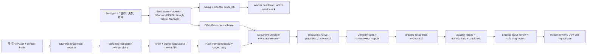

# SPEC-PDM-SOLIDWORKS-METADATA-READER-001：SolidWorks 原生屬性讀取與辨識診斷

狀態：`Local RD Implemented / Human Confirmed / Real A0002 QA-QC Passed / Production Release Gated`
日期：2026-08-19
Owner：Dev PM
關聯 DEV：`DEV-035 / DEV-CAD-001`
父契約：`.ai-doc/specs/SPEC-PDM-DRAWING-RECOGNITION-001-candidate-review-and-formalization.md`
架構邊界：`.ai-doc/decisions/ADR-PDM-SW-NATIVE-PREVIEW-WORKER-001-windows-worker-derivative-boundary.md`
Credential authority：`.ai-doc/specs/SPEC-PDM-GCP-SECRET-MANAGER-001-solidworks-worker-credential.md`
QA：`.ai-doc/qa/qa-dev-035-solidworks-native-metadata-reader-validation-plan-2026-08-19.md`

## 0. 2026-08-19 Reopen Amendment（現行派工權威）

### 0.1 重開原因與最新使用者契約

DEV-035 曾依 compile-only、fixture、static contract 與 rendered unavailable-state 證據被標成「本機完成」，但使用者在真實 A0002-M01 畫面再次確認：SolidWorks 已保存自訂屬性，智慧辨識仍只有檔名／檔案角色，native property observation 仍為 0。最新 runtime evidence 進一步證明：

- session `recognition-870fe33f-6dc3-4e72-a903-3446eac49102` 的三個 `native-metadata-bridge.v1` adapter result 均為 `unsupported`、0 observation；stable 原因是 `PDM_DRAWING_RECOGNITION_METADATA_CMD is not configured.`；
- UI 建立的 active reference 使用 `local_test_double`，其 metadata 明確記錄 `secret_material_not_persisted_by_local_test_double`；worker 無法由此 reference 取得 key；
- UI 的「最近測試通過」只驗證 metadata lifecycle／redaction，並未執行 Document Manager application probe，也未讀取 A0002；
- recognition worker 把 broker key 寫入長生命週期 `process.env`，且 launcher 只有在啟動當下看到 credential readiness 才設定 metadata command，因此 UI 後設 key 不會可靠套用到既有 worker。

使用者已確認的產品契約如下，且有意取代本文件任何衝突舊文：

> 無論本機測試或真實環境，管理員只需在 UI 輸入、測試及啟用 API key；之後 worker 必須自動套用，不得要求每次在 PowerShell／`.env.local` 重複設定，也不得要求人工重啟 worker。環境可以使用不同的安全保管 provider，但使用者操作模型與真實狀態語意必須一致。

因此原 035-A～D、22-file evidence 只保留為「部分實作基線」，不得再當成 DEV-035 completion evidence。Current Phase 新增 035-E～F；完成定義改為真實安全保管、真實 native probe、worker version acknowledgment 與 A0002 E2E 全部通過。

### 0.2 Spec Impact Preflight

- 分類：`Intentional replacement + compatible extension`。
- 取代：`local_test_double` 可通過測試／啟用、environment secret 作為日常 local UX、worker 啟動時綁死 credential readiness、QA-035-45～48 可排除於 DEV-035 本機完成之外、schema migration=`None`、22 files 即完整 Current Phase manifest。
- 保留：Document Manager read-only reader、worker-only native process、job-locked source bytes、DEV-068 observation/candidate/human-review authority、identity zero-write、source/hash/tenant/redaction/process-cleanup gate與 production release gate。
- 不另開重複 DEV／ADR：既有 credential-provider abstraction、DEV-058 broker與 Windows worker ADR 仍是 architecture authority；本 amendment 只補足同一 authority 的 local secure provider、probe、hot apply 與 truthful readiness。

### 0.3 CAPA／完成狀態矯正

| 類型 | 結論 | 受控措施 |
|---|---|---|
| 不符合 | 文件把「程式路徑存在、mock／compile 通過、錯誤可見」誤算成「使用者能讀到 SolidWorks 屬性」 | 重開同一 DEV-035；撤回 completed／delivery claim；既有證據改列 partial baseline |
| Root cause 1 | completion gate 未要求 active worker 真的取得可用 secret，也未要求 adapter `succeeded` | Current Phase PASS 必須含 provider read、native probe、worker ack、adapter success與A0002 observation |
| Root cause 2 | `local_test_double` 故意不保存 plaintext，卻可被標成 tested／active | test double 限 automated simulation；不得進 active、不得顯示 ready或綠色完成 |
| Root cause 3 | metadata command與key在 worker 啟動時綁定，且key永久寫入process env | worker無key仍常駐並回報blocked；每job／版本變更由broker解析，僅傳給該native child env |
| Root cause 4 | UI以reference active／redaction測試通過掩蓋worker blocked | 第一層狀態由最弱必要條件決定；缺real probe、worker offline或version未套用都不得顯示可用 |
| Corrective action | 實作035-E／F並以真實A0002重驗 | 見§8、§12、§14～17與QA-035-45～64 |
| Preventive action | 所有 provider／adapter 類 DEV 的完成稽核加入 runtime-evidence gate | mock、compile-only、fixture、reference active任一項都不可單獨滿足 capability completion |

PA 流向：本CAPA寫回`dev_task.md`、本authoritative SPEC與QA plan，並把`qc:dev-task-completion-audit`納入035-F。文件QC已證明現行audit雖回8/8 PASS，卻只解析1個platform task、未計入已重開的DEV-035；RD必須補上active `☐ DEV-*`解析與fixture，避免再次用綠色audit掩蓋未完成任務。現階段不修改全域skill／SOP。

## 1. Outcome

本 Current Phase 完成後，受控 `.SLDPRT`、`.SLDASM`、`.SLDDRW` 的 file-level 與 configuration-specific 自訂屬性會經由既有 DEV-068 背景辨識工作，產生可追溯 observation／candidate；使用者可在嵌入式與完整核對頁看見屬性內容、來源檔、configuration、可信度與目前正式值。

若 reader 未設定、授權不可用、檔案版本不支援、單檔逾時或抽取失敗，系統仍保留 filename／其他 adapter 的成功結果，並在第一層顯示安全、可行動的診斷。系統不得再把「讀取器沒有執行」呈現成「檔案屬性為 0」。

本文件已封口 reader、credential provider、真實測試、worker hot apply、檔案存取、raw contract、欄位映射、owner 推定、UI 診斷、失敗恢復、migration、檔案清單與 QA evidence；035-E/F implementation與real runtime evidence gate均已完成，RD 不需再做 P0／P1 產品或架構決策。production release與2D preview仍不在本DEV完成範圍。

## 2. 多層次根因與修復層級

| 層次 | 已確認事實 | 修復責任 |
|---|---|---|
| L1 使用者表象 | A0002 的 `料號與屬性`、`圖面與版次`等分類顯示 0，第一層沒有解釋 | UI 顯示 native metadata health 與受影響檔案 |
| L2 辨識管線 | 兩個來源的 `filename.v1` 成功；`native-metadata-bridge.v1` 都是 `unsupported`、0 observation，diagnostic 為 metadata command 未設定 | 啟用版本化 native metadata adapter；unsupported 必須成為可見且可恢復狀態 |
| L3 檔案／執行環境 | A0002 的 provider 是 `j_drive`；現行 worker 只在 `local_repository` 傳 `sourcePath`，即使設定 command，reader 仍拿不到檔案 | 新增 token＋lock 綁定的 source-content API，worker 下載、驗 hash、暫存後才執行 reader |
| L4 原生格式 | Next.js／瀏覽器不會解析 SolidWorks OLE/compound file 自訂屬性；需要有授權的 Windows 原生 reader | 固定復用既有 SolidWorks Document Manager Windows worker 與 credential broker |
| L5 Domain mapping | 既有 add-in 只讀 file-level 且使用英文 exact key；使用者欄位是中文，並有 `製圖`、`熱處理` | 建立 company-scoped alias profile、scope group 與 deterministic owner resolution |
| L6 治理 | DEV-068 已規定所有機器結果只能是候選，人工確認前不可正式寫入 | 完全沿用 DEV-068 observation／candidate／impact／atomic formalization，不新增旁路寫入 |
| L7 Secret lifecycle | UI 的 local test double只保存reference／mask／fingerprint，原key已丟棄，worker必然讀不到 | local/test改用Windows DPAPI安全provider；staging/production用Google Secret Manager；test double禁用activation |
| L8 Runtime套用 | metadata command與credential readiness只在worker啟動時決定，現行key又被永久放進process env | worker無credential仍啟動；active version由broker按job解析並以heartbeat確認套用，不需restart |
| L9 完成治理 | static／fixture／compile與unavailable UI曾被誤算為功能完成 | 真實provider＋native probe＋worker ack＋A0002 adapter success為同一Current Phase completion gate |

2026-08-19 的診斷不包含 SOLIDWORKS 視窗標題的未儲存星號；未儲存記憶體狀態與工作站即時同步均不在本 DEV。

## 3. Authoritative Decisions

### 3.1 Reader 與執行邊界

- Current Phase 的正式 reader 固定為 `SolidWorks Document Manager API`，不是 SOLIDWORKS desktop COM、add-in 或 OCR。
- reader 只在 trusted Windows worker 子程序內執行；Next.js request handler、React、browser 都不得載入 SolidWorks DLL/COM。
- 復用既有 `SwDocumentMgr.dll` interop、C# compile 方法與 `DEV-058` credential broker；不得另建第二份 plaintext secret、DB secret 欄位或 browser 可讀 route。
- metadata reader 以 read-only 開啟 staged copy，完成或失敗都呼叫 `CloseDoc`；絕不呼叫 `Save`、`SaveAs`、property mutation、reference replacement 或 source write。
- 不新增 SolidWorks desktop API fallback。Document Manager 不可用時回 `unsupported/failed`，不得靜默切換到會啟動桌面 UI 的方案。

官方 API 依據：

- Document Manager 的標準流程是取得 application、開啟文件、查詢 custom properties/configurations、檢查 error code 並關閉文件；license key 是必要條件：<https://help.solidworks.com/2026/english/api/swdocmgrapi/GettingStarted-swdocmgrapi.html>
- file-level 可用 `ISwDMDocument3::GetAllCustomPropertyNamesAndValues` 一次取得名稱、型別、linked expression 與已儲存的 evaluated value：<https://help.solidworks.com/2026/English/api/swdocmgrapi/SolidWorks.Interop.swdocumentmgr~SolidWorks.Interop.swdocumentmgr.ISwDMDocument3~GetAllCustomPropertyNamesAndValues.html>
- configuration 以 `ISwDMConfigurationMgr2::GetConfigurationNames2`／`GetConfigurationByName2` 列舉，再由 `ISwDMConfiguration` custom-property methods 讀取：<https://help.solidworks.com/2026/english/api/swdocmgrapi/SolidWorks.Interop.swdocumentmgr~SolidWorks.Interop.swdocumentmgr.ISwDMConfigurationMgr2_members.html>

### 3.2 已封口的產品決策

- `製圖` 初版解讀為繪圖者顯示文字，stable key=`drawn_by_name`，owner=`drawing_revision`；只保存原字串，不查帳號、不轉 user ID。
- `3D圖號(主)` 初版為 identity evidence，stable key=`model_root_number`，owner=`drawing`；不建立／改寫 Drawing 或 Part Number。
- `版本`／`版次` 為跨來源 identity evidence，canonical stable key=`revision`，owner=`drawing_revision`；`source_revision` 僅作既有資料相容別名，不直接修改版次 identity。
- `品名`、`料號`、`3D圖號(主)`、`版本` 都屬 `identity_relation`，沿用 DEV-068 impact exclusion，不可由辨識正式化建立／改寫 canonical identity。
- `製圖` 是 `drawing_revision/drawn_by_name`，本 phase 將其加入既有 drawing metadata allowlist；`材質`、`表面處理`、`熱處理` 是可正式化的 part attributes。
- 未知 property 不丟棄，進 `unclassified`；空值仍產生 blocked candidate，不能被解讀為 `無` 或清除。

## 4. Scope

### 4.1 In Scope

- `.SLDPRT`、`.SLDASM`、`.SLDDRW` file-level 與 configuration-level custom properties。
- Document Manager saved/evaluated value、linked expression、property type、scope、configuration name 與 source hash 證據。
- `companyId/companyCode -> alias profile`、已知中文／英文 alias、未知欄位保留。
- job-locked source bytes API、worker staging、SHA-256／size 驗證、暫存清理、heartbeat、timeout 與 exact process-tree 終止。
- adapter health projection與嵌入式／完整核對頁的第一層安全診斷。
- 同一設定UI跨local/test/staging/production的安全儲存、真實測試、啟用、撤銷、rotation與worker hot apply。
- local/test Windows `windows_dpapi` provider、production `google_secret_manager` provider與只供自動測試的`local_test_double`；Windows非automated-test runtime若誤設test-double provider，draft強制回到DPAPI，避免真實UI輸入被丟棄。
- secret probe jobs、recognition worker capability heartbeat、active version acknowledgment與truthful readiness projection。
- `drawn_by_name` 正式化 allowlist compatible extension。
- deterministic fixture、focused contract／worker／browser QA 與 A0002 real-file local gate。

### 4.2 Out of Scope

- SOLIDWORKS 未儲存記憶體內容、工作站即時同步或畫面標題星號處理。
- DEV-036 SolidWorks Add-in 產品路線。
- 修改／回寫 CAD 原檔、自動補 property 或 property template。
- OCR、title-block image parsing、2D preview／PDF／DWG rendering。
- cut-list custom properties、weldment body mapping、geometry／mass property extraction；需要時另開 future phase。
- 自動建立 canonical Part Number／Drawing／Revision／Relation。
- production Google Cloud resource／IAM建立、Windows worker部署、live migration apply、release、traffic或production smoke；但provider介面、UI lifecycle、migration artifact與worker hot-apply contract屬本Current Phase。

## 5. End-state Architecture



不可跨越的界線：

```text
source bytes / secret / absolute path -> trusted server + Windows worker only
sanitized adapter health / observations -> authorized DEV-068 user projection
formal PDM write -> existing human decision + impact preview + atomic formalization only
```

## 6. Worker Source-content Contract

新增：

```http
GET /api/recognition-jobs/{sessionId}/sources/{sourceId}/content
Authorization: Bearer <PDM_DRAWING_RECOGNITION_WORKER_TOKEN>
X-PDM-Recognition-Worker-Id: <claimed worker id>
```

Server 必須在讀 bytes 前同時驗證：

1. token constant-time match；
2. session 存在且 `status='extracting'`；
3. `locked_by` 與 header worker ID 相同，heartbeat 未被其他 worker 接手；
4. source 屬於該 session／company；
5. FileAsset 未刪除；
6. file size 不超過 `PDM_DRAWING_RECOGNITION_SOURCE_MAX_BYTES`，default `268435456`；
7. `storagePointerFromRecord`／`createFileStorageServiceForPointer` 可讀 canonical bytes；`j_drive` 沿既有 pointer normalization 當作 local repository；
8. read bytes 的 length 與 SHA-256 等於 session source snapshot。

成功回 `200 application/octet-stream`、`Content-Length`、`X-Content-Type-Options: nosniff`、`Cache-Control: private, no-store`。不得回 storage provider、key、original path 或 signed URL。

穩定失敗碼：

| HTTP | code | 意義 |
|---:|---|---|
| 401 | `RECOGNITION_WORKER_UNAUTHORIZED` | token 缺少／錯誤 |
| 409 | `RECOGNITION_JOB_LOCK_INVALID` | worker 已失去 job lock |
| 404 | `RECOGNITION_SOURCE_NOT_FOUND` | source 不在此 session／company，避免存在性洩漏 |
| 409 | `RECOGNITION_SOURCE_CONTENT_STALE` | size/hash 與 snapshot 不符 |
| 413 | `RECOGNITION_SOURCE_TOO_LARGE` | 超過受控上限 |
| 503 | `RECOGNITION_SOURCE_UNAVAILABLE` | provider 暫時不可讀；不回 path/provider 細節 |

## 7. Staging、Heartbeat 與 Process Isolation

- Native metadata adapter 僅對 `sldprt/sldasm/slddrw` 執行；其他 extension 回 `unsupported/native_metadata_extension_unsupported`。
- 每個 source 以 `fs.mkdtemp(path.join(os.tmpdir(), "ai-pdm-recognition-"))` 建獨立目錄；resolved directory 必須仍位於 `os.tmpdir()`。
- staged filename 由受控 `sourceId + normalized extension` 產生，不使用原檔名作路徑。
- worker 寫入後再算一次 SHA-256；不符即不啟動 extractor。
- job claim 後每 5 秒 heartbeat，直到 complete/fail；任何 409 立即停止後續 adapter、終止 task-owned child tree、清理 staged directory。
- adapter timeout default 30 秒、可調 1～120 秒；retry 只允許 `timeout/failed` 且最多 3 次。validation、no-license、future-version、unsupported 不 retry。
- Windows timeout 只可終止本次 spawn 取得的 exact PID tree；不得殺所有 `node.exe`、SolidWorks 或未知程序。
- `finally` 清除本次 staged directory；清除前再次驗證 target 位於 `os.tmpdir()` 且 prefix 符合。清理失敗只記 safe worker log，不把本機 path 寫入 adapter diagnostics。
- stdout 上限 2 MB、stderr 8 KB、property 1,000 筆、diagnostics 20 筆；超限視為 validation failure。

## 8. Credential Contract

### 8.1 Provider selection與持久性

同一 UI 不暴露provider選擇；server依部署profile選擇安全provider：

| 環境 | provider | plaintext持久性 | 是否可啟用 |
|---|---|---|---|
| local／真實Windows測試 | `windows_dpapi` | 只保存DPAPI encrypted blob；DB只存reference/version/fingerprint | 是，需real native probe |
| staging／production | `google_secret_manager` | 只保存GSM secret version；DB只存exact version reference | 是，需real native probe |
| unit／CI simulation | `local_test_double` | 不保存plaintext | 否；只能顯示「模擬」，不得tested/active/ready |
| legacy | `supabase_vault` | historical reference only | 否 |

- local launcher在Windows非production預設`windows_dpapi`，不要求開發者每次設定env；部署profile只是一環境一次性的基礎設定，不是每次換key的使用者操作。
- rollout前已存在且`lifecycle_status=active`的`local_test_double`只保留歷史reference，projection一律視為`模擬／不可用`，不得算configured ready；管理員建立並啟用第一個real-provider version時，transaction內把舊test-double active標為retired。不得自動刪除舊reference／events。
- DPAPI使用`CurrentUser` scope與application-owned directory；encrypted blob檔案ACL只允許啟動web／worker的Windows帳號與Administrators。若未來web與worker改用不同service account，必須改用GSM或另做受控machine-scope設計，不得放寬檔案ACL。
- UI傳入的key只存在authenticated same-origin request body與server memory；remote環境必須HTTPS，local只允許loopback開發入口。DPAPI helper由stdin收值，key不得進command line、PowerShell history、env、stdout、DB或log。
- `secret_references.vault_secret_id`只存opaque DPAPI blob ID或GSM exact version；`masked_hint`／`fingerprint`不可反推key。
- 原有environment fallback只保留break-glass／相容測試；不得成為local日常流程，也不得被UI宣稱為建議設定方法。production仍須`PDM_ALLOW_WORKER_ENV_SECRET_FALLBACK=true`加change ID才可短暫使用。

### 8.2 真實測試與啟用

`POST /api/settings/secrets/{kind}/test` 不再同步把test double標成PASS；它建立`settings_secret_probe_jobs`並回`202`。可信任Windows worker以service token claim，取得該draft exact version，在獨立read-only child執行：

1. 載入`SwDocumentMgr.dll`；
2. `SwDMClassFactory.GetApplication(key)`；
3. 呼叫不需開檔的最小capability query確認application可用；
4. 關閉child並回傳allowlisted code、reader version與secret version/fingerprint；不得回key／path／stack。

probe PASS才可把reference標成`tested`。invalid key、interop missing、worker offline、timeout都不能標PASS；`local_test_double`直接`blocked/SECRET_TEST_DOUBLE_NOT_ACTIVATABLE`。`activate`只接受最新successful real probe所對應的exact version；啟用後先顯示`worker_applying`，不是`ready`。

### 8.3 Broker、hot apply與rotation

- metadata wrapper沿用token-gated、`Cache-Control: no-store` broker；response新增`version`與`fingerprint`，browser actor永遠不可呼叫。
- recognition worker即使沒有key也必須啟動，且在Windows interop／extractor存在時一律配置metadata command；worker本身每個poll cycle discovery metadata/probe wrapper，不把launcher啟動時的env當成必要條件。缺key回`native_metadata_license_missing`，不得回command-not-configured。當metadata command已配置但credential尚未ready時，只回報blocked capability heartbeat並暫不claim recognition job，避免產生`unsupported/0`假辨識結果；UI啟用key後同一PID自動恢復claim。
- worker在每個recognition job開始前向broker解析active exact version；可持有最多60秒的process-memory cache，但每個新job仍先以version／ETag檢查，不得把key永久寫入`process.env`。
- `runExternalAttempt`只把當次解析到的key放入該Document Manager child environment；child結束後釋放reference。key不得進global env、stdin JSON、args、stdout/stderr、DB、diagnostics、screenshot或evidence。
- worker每15秒向`POST /api/recognition-workers/heartbeat`回報`workerId/capability/status/appliedSecretVersion/fingerprint/readerVersion/issueCode/lastAppliedAt`；不得回key。server以30秒stale threshold判online。
- activation或rotation為atomic exact-version切換。in-flight job可用claim時記錄的舊version完成；active切換後開始的新job必須用新version。撤銷後不得發新key，新jobblocked；皆不需要重啟web或worker。
- worker收到無效／無法讀取的新active version時回`blocked`，UI保留上一版本歷史但不得把舊version冒充current ready；管理員可在UI回復啟用上一個已測試版本。

credential route 401/403/503 -> `failed/native_metadata_credential_broker_unavailable`；404 -> `unsupported/native_metadata_license_missing`；Document Manager no-license -> `failed/native_metadata_license_invalid`。

## 9. Raw Extractor Contract

C# exporter `solidworks-document-manager-metadata-extractor.cs` 的 stdout 必須只有一個 JSON object：

```json
{
  "schemaVersion": "solidworks-native-properties.v1",
  "reader": "solidworks-document-manager",
  "readerVersion": "1.0.0",
  "documentType": "part",
  "status": "succeeded",
  "properties": [
    {
      "scope": "document",
      "configurationName": null,
      "name": "料號",
      "propertyType": "Text",
      "linkedExpression": "",
      "evaluatedValue": "A0002-P01"
    }
  ],
  "diagnostics": []
}
```

規則：

- input path 與 key 只由 process argument／environment 取得，不回 stdout。
- document type 由 extension 固定映射到 `swDmDocumentPart/Assembly/Drawing`；不信任 stdin supplied document type。
- file-level 優先使用 `ISwDMDocument3::GetAllCustomPropertyNamesAndValues`，保留 names/types/linkedTo/evaluated values 的 index 對齊。
- configuration 優先使用 `ISwDMConfigurationMgr2` methods；每個 configuration 讀 custom property names/value，並檢查 configuration error。
- evaluated value 是「檔案上次由 SOLIDWORKS 儲存時」的結果；UI evidence 不可宣稱為未儲存的即時值。
- 空 property 保留 entry；`evaluatedValue=""` 不轉成 `無`。
- 每個 COM/document/config error 轉成 stable code；stdout 不含 exception stack、key 或 absolute path。
- `CloseDoc` 放在 `finally`；C# exit 0 只代表 JSON contract 可讀，實際 adapter outcome 由 JSON `status` 決定。
- Document Manager實檔可能在`linkedTo`／raw channel回傳未連結的literal，而`evaluatedValue`為空。mapper只在evaluated空且raw為非空、非`$PRP`／`$PRPSHEET` expression時採raw literal；未解析的property expression維持null／blocked，不可把expression本身當正式值。

Node wrapper 把 raw contract＋job targetContext＋alias profile轉成現有 `drawing-recognition-extractor.v1`；現有 `validateExternalAdapterResult` 仍是 final payload gate。

## 10. Alias、分類與寫入政策

新增 `config/solidworks-metadata-field-aliases.json`：

```text
schemaVersion = solidworks-property-aliases.v1
profiles.<company id or code>.aliases[]
fallbackProfile = default
```

match 前對 property name 做 trim、NFKC、英文字母 case-fold、全半形括號正規化；company exact profile 優先，`default` 只補英文常見 alias。相同 profile 內 normalize 後重複 alias 是啟動／contract QC failure，不採 first-win。

| Alias | stable key | category | owner | write policy | A0002 expected |
|---|---|---|---|---|---|
| `品名`、`part_name`、`description` | `part_name` | `identity_relation` | scope-resolved `part_number` | evidence only | `本體_BS_右_Xx5` |
| `3D圖號(主)`、`model_number` | `model_root_number` | `identity_relation` | `drawing` | evidence only | `A0002` |
| `版本`、`版次`、`revision` | `revision` | `identity_relation` | `drawing_revision` | evidence only | `0.1` |
| `製圖`、`drawn_by` | `drawn_by_name` | `drawing_revision` | `drawing_revision` | review then metadata write | `朱宇鴻` |
| `料號`、`part_number` | `part_number` | `identity_relation` | scope-resolved `part_number` | evidence only / owner anchor | `A0002-P01` |
| `材質`、`material` | `material` | `part_attribute` | scope-resolved `part_number` | review then attribute write | `不鏽鋼SUS304` |
| `表面處理`、`surface_finish` | `surface_finish` | `part_attribute` | scope-resolved `part_number` | review then attribute write | `無` |
| `熱處理`、`heat_treatment` | `heat_treatment` | `part_attribute` | scope-resolved `part_number` | review then attribute write | `無` |

未知欄位：

- category=`unclassified`；field label保留原 property name；field key=`sw_custom_<normalized-name>_<8-char-hash>`；raw／evaluated value與scope不丟失。
- reviewer 可依 DEV-068 map/create/defer/ignore；mapper 不自動建立正式欄位。

## 11. Scope Group 與 Owner Resolution

mapper 先依 `document` 或 `configuration:<name>` grouping，再兩階段解析 owner：

`targetContext.parts`必須同時納入正式part links、`numbering_draft_parts`與仍有效的`number_candidate_reservations`草稿料號；Current Phase不得因owner尚未正式化而遺漏A0002-P01。

1. 同 scope 的 `part_number` alias evaluated value exact match `targetContext.parts[].partNumber`。
2. configuration name NFKC exact match full part number。
3. configuration name token（例如 `P01`）只在唯一 suffix match 時使用。
4. 對 `.SLDPRT` 且 targetContext 只有一個 part，document scope 可用 unique-part fallback。
5. `.SLDASM` document scope 或多 part ambiguous 時，不得把 part attributes 指派給任一 part；ownerId=`null`、candidate=`blocked`。

Drawing metadata／identity owners：

- `drawn_by_name/revision` 使用 target `drawingRevisionId`；缺 revision 時 blocked；讀取舊資料時接受 `source_revision` alias 並於 projection canonicalize。
- `model_root_number` 使用 target `drawingId`；缺 drawing 時 blocked。
- 同 scope `料號` 找到 owner 後，`品名/材質/表面處理/熱處理` 共用該 owner。

Confidence：exact alias＋exact anchor=`high`；exact alias＋unique-part fallback=`medium`；unknown／ambiguous=`unknown`。Confidence 只供人工判斷，不自動接受。

## 12. Adapter Health Projection 與 UI

不新增資料表。`drawing_recognition_adapter_results` 已保存 adapter code/version/status/observation_count/diagnostics_json；projection 新增 sanitized `adapterHealth.nativeMetadata`：

```ts
type NativeMetadataHealth = {
  state: "ready" | "empty" | "partial" | "unavailable" | "failed";
  issueCode: string | null;
  message: string | null;
  retryable: boolean;
  affectedSources: Array<{ sourceId: string; fileName: string; status: string }>;
};
```

只投影`.SLDPRT/.SLDASM/.SLDDRW`來源的native metadata adapter allowlisted stable code；PDF／其他非SolidWorks來源即使走其他adapter，也不得被計入native health或造成SolidWorks partial／failed banner。raw `diagnostics_json`、command、key、path、stderr 不進 user API。

| Result | state | 第一層文案／行為 |
|---|---|---|
| 所有 native source succeeded 且有 observations | `ready` | 不新增成功 banner；候選本身即為主要內容 |
| reader succeeded 但全部為 0 properties | `empty` | info：`已完成 SolidWorks 屬性讀取，這些檔案沒有可用的自訂屬性。` |
| 至少一檔成功、至少一檔 failed/unsupported/timeout | `partial` | warning：列受影響檔名，說明其他結果已保留；保留重新辨識 CTA |
| command／license 未設定 | `unavailable` | warning：`尚未啟用 SolidWorks 屬性讀取器；目前只顯示其他可用辨識結果。` |
| configured reader 執行失敗 | `failed` | error：安全原因＋重新辨識／聯絡管理員；不顯示 raw code |

嵌入式與完整核對頁使用相同 projection/copy。warning 使用 icon＋文字，`role=status`；實際 failed 使用 `role=alert`。不因每個空分類重複同一 warning；來源細節放在同一 banner 的 affected source list。390/1024/1440 viewport 都不可遮住核對 CTA。

### 12.1 Settings UI單一操作模型

管理員在local/test/staging/production看到相同操作，不需知道provider名稱：

1. 輸入key，按`安全儲存並測試`；欄位送出後立即清空，server永不回填原值。
2. UI顯示`安全儲存`→`測試中`；worker real probe PASS後顯示`測試通過，待啟用`。
3. 按`啟用此版本`後顯示`正在套用到辨識服務`；收到online worker對exact version的ack才顯示`可用`。
4. rotation重複相同流程；舊active在新version啟用前不中斷。撤銷／回復均由UI完成。

Canonical projection state：

```ts
type SolidWorksCredentialState =
  | "missing"
  | "securely_saved"
  | "testing"
  | "test_failed"
  | "tested"
  | "activating"
  | "worker_applying"
  | "ready"
  | "worker_offline"
  | "revoked";
```

`ready`為AND gate：`active exact version`＋`real native probe passed`＋`recognition worker online`＋`worker ack exact version/fingerprint`。任何一項缺少即不得使用綠色完成、`啟用完成`或`可用`。`local_test_double`固定顯示`模擬，不能啟用`。worker blocked時在SolidWorks設定卡就地顯示原因與`重新測試／啟用其他版本／檢查worker`恢復動作；不得只在另一張2D預覽卡或hover內說明。

2D preview worker與native recognition capability要分開投影；其中一個online不得替另一個背書。Settings、embedded recognition與full review使用相同stable truth，但依情境縮短文案。驗證viewport固定1440×900、1024×768、390×844，並執行visible-error、keyboard、focus、touch與horizontal-overflow sweep。

## 13. Failure Semantics

| stable diagnostic | adapter status | retry | 使用者語意 |
|---|---|---:|---|
| `native_metadata_not_configured` | unsupported | no | reader 尚未啟用 |
| `native_metadata_license_missing` | unsupported | no | 授權尚未可供 worker 使用 |
| `native_metadata_license_invalid` | failed | no | 授權無法開啟此檔 |
| `native_metadata_future_version` | unsupported | no | reader/key 版本低於檔案版本 |
| `native_metadata_source_stale` | failed | no | 來源已改變，需重新建立辨識 |
| `native_metadata_source_unavailable` | failed | yes | 暫時無法取得受控檔案 |
| `native_metadata_timeout` | timeout | yes, bounded | reader 逾時 |
| `native_metadata_output_invalid` | failed | no | extractor contract 不合法 |
| `native_metadata_no_custom_properties` | succeeded | no | reader 有執行但沒有屬性 |
| `native_metadata_partial_configuration_failure` | partial | no | file-level 已保留，部分 configuration 失敗 |

Session 終態沿用 DEV-068：只要 filename 或其他 observation 成功且 metadata warning 存在即 `extraction_partial`；沒有任何 observation 或 successful adapter 才 `extraction_failed`。Native metadata 單檔失敗不得阻止上傳、候選版次、送審或其他 adapter。

## 14. Data、Migration 與 Compatibility

- Schema migration：`Additive / Medium`；新增`db/postgres/038_solidworks_credential_ui_activation.sql`，live apply仍由release gate執行。
- `secret_references.vault_provider` check新增`windows_dpapi`；既有`local_test_double/google_secret_manager/supabase_vault`資料不改寫。
- 既有active `local_test_double`不在migration中破壞性改寫；application projection將其降為simulation，第一個real-provider activation再以既有retire事件原子退休它，解除active unique constraint。
- 新增`settings_secret_probe_jobs`：`id, secret_reference_id, kind, status, locked_by, locked_at, heartbeat_at, attempt_count, max_attempts, result_code, reader_version, created_by, created_at, completed_at, updated_at`。status只允許`pending/running/passed/failed/blocked/expired`；active job以partial unique index限制同secret version最多一筆。
- 新增`worker_capability_heartbeats`：`worker_id, worker_kind, capability_code, status, applied_secret_kind, applied_secret_version, applied_secret_fingerprint, reader_version, issue_code, last_applied_at, last_seen_at, updated_at`；primary key=`worker_id, capability_code`。只保存安全metadata，不存key/path/command。
- 既有tables繼續承接domain結果：`setting_test_runs`、`setting_activation_events`、`drawing_recognition_adapter_results`、`drawing_recognition_observations`、`drawing_recognition_candidates`、`pdm_attribute_definitions`、`pdm_part_attribute_values`、`pdm_drawing_revision_metadata_values`。
- `drawn_by_name` 只擴充 application allowlist；`metadata_key` 現有 schema 是 open text，不需 ALTER。
- API additive：既有session fields不改；新增probe claim/heartbeat/complete、recognition-worker heartbeat與credential version metadata。Settings test由同步假PASS改為`202 testing`屬intentional behavior correction。
- Feature flag 沿用 `PDM_DRAWING_RECOGNITION_V1`；不新增會繞過人審或自動寫入的 flag。
- Existing A0005 fixture adapter、filename adapter、OCR command 與 DEV-068 formalization contract保持相容。
- SQLite runtime initializer、base schema、PostgreSQL base schema與038 migration必須同義；provider check／indexes需以shadow migration驗證。rollback只停用新provider／probe／heartbeat route並回到visible blocked，不刪secret reference、test run、activation event或recognition history。

## 15. Exact Implementation Manifest

### 15.1 Historical partial baseline（已存在，不代表完成）

原`22 files = 17 product + 5 QC scripts`保留為035-A～D歷史baseline，包含alias/mapping、source-content、extractor、recognition worker、health projection與focused QC。它證明安全失敗路徑與部分reader code存在，不證明worker能取得UI key或A0002 real-file success。

### 15.2 Reopen delta — new product files（11）

1. `src/lib/windows-dpapi-secret-provider.ts`
2. `scripts/windows-dpapi-secret-store.ps1`
3. `scripts/solidworks-document-manager-credential-probe.cs`
4. `scripts/run-solidworks-document-manager-credential-probe.mjs`
5. `src/app/api/settings-secret-probe-jobs/claim/route.ts`
6. `src/app/api/settings-secret-probe-jobs/[jobId]/heartbeat/route.ts`
7. `src/app/api/settings-secret-probe-jobs/[jobId]/complete/route.ts`
8. `src/app/api/recognition-workers/heartbeat/route.ts`
9. `db/postgres/038_solidworks_credential_ui_activation.sql`
10. `src/lib/worker-service-auth.ts`
11. `src/app/api/settings-secret-probe-jobs/[jobId]/credential/route.ts`

### 15.3 Reopen delta — modified product files（14）

1. `src/lib/settings-secret-lifecycle.ts`
2. `src/lib/repositories/settings-secret-async-repository.ts`
3. `src/app/settings/page.tsx`
4. `src/app/api/settings/secrets/[kind]/draft/route.ts`
5. `src/app/api/settings/secrets/[kind]/test/route.ts`
6. `src/app/api/settings/secrets/[kind]/activate/route.ts`
7. `src/app/api/preview-workers/solidworks-document-manager-key/route.ts`
8. `scripts/run-drawing-recognition-worker.mjs`
9. `scripts/start-localhost-3000.ps1`
10. `db/schema.sql`
11. `db/postgres/001_initial_schema.sql`
12. `src/lib/db.ts`
13. `.env.example`
14. `package.json`
15. `db/postgres/002_supabase_rls_plan.sql`

### 15.4 Reopen delta — validation files（12）

New：

1. `scripts/qc-dev-035-secure-provider.mjs`
2. `scripts/qc-dev-035-worker-hot-apply.mjs`
3. `scripts/qc-dev-035-real-ui-activation-browser.mjs`
4. `scripts/qc-dev-035-completion-gate.mjs`

Modified：

5. `scripts/qc-dev-035-contract.mjs`
6. `scripts/qc-dev-035-worker.mjs`
7. `scripts/qc-dev-035-browser.mjs`
8. `scripts/qc-dev-035.mjs`
9. `scripts/qc-pdm-settings-center-secret-lifecycle.mjs`
10. `scripts/qc-pdm-gcp-secret-manager.mjs`
11. `scripts/qc-pdm-sw-native-preview-worker.mjs`
12. `scripts/qc-dev-task-completion-audit.mjs`

Current reopen direct delta經實作後重算為`38 files = 26 product + 12 validation`；加上歷史baseline後，重疊檔不得重複計入Current Phase total。仍需以first diff checkpoint重算實際unique file set；若需要新增direct file、改route/schema名稱或減少安全gate，先回Dev PM更新SPEC／QA，不能以實作方便隱性漂移。

## 16. RD Implementation Sequence

### Phase A — Contract、mapping、source gate

1. 建 alias config/loader 與 deterministic mapping unit fixtures。
2. 建 repository claimed-source predicate＋worker content route，完成 token/lock/company/hash/size tests。
3. 建 sanitized diagnostics projector，先以 fixture adapter result驗證 API shape。

### Phase B — Native reader 與 worker isolation

1. 建 C# raw extractor、compile-only與raw contract validation。
2. 建 Node wrapper，復用 credential broker並輸出 DEV-068 final contract。
3. 改 recognition worker：heartbeat、download、stage、double-hash、bounded retry、task-owned process tree kill、finally cleanup。
4. 啟動器只要 Windows＋interop 可用就設定 native metadata/probe command；credential 缺失時 worker 仍啟動並回報 `native_metadata_license_missing`，不得把 command readiness 與 key readiness 綁死。

### Phase C — Projection、UI、formalization extension

1. Query existing adapter rows產生 shared health projection。
2. 嵌入式與完整核對頁使用同一訊息邏輯。
3. `drawn_by_name` 加入 drawing metadata read/write allowlist；identity fields仍 evidence-only。

### Phase D — QA/QC evidence

1. deterministic no-license／invalid-output／timeout／partial／A0002 mapping cases。
2. source lock／cross-company／stale hash／cleanup／secret redaction cases。
3. browser三 viewport＋accessibility＋console/network sweep。
4. 既有deterministic evidence只保留為partial baseline；不得再據此關閉DEV-035。

### Phase E — UI-only secure credential lifecycle與worker hot apply（complete）

1. 已加入Windows DPAPI provider、provider check migration與test-double activation deny。
2. 已建立real native probe job、async test state、safe result與invalid-key gate。
3. 已改 recognition worker 無key照常啟動；每poll cycle discovery native command、每job解析active version、child-only env、rotation／revoke不中斷；native command已配置但無credential時維持blocked並暫不claim recognition job。
4. 已建立 recognition capability heartbeat／exact version ack；Settings以AND gate顯示truthful readiness。

### Phase F — completion correction與real A0002 E2E（complete）

1. 已驗證管理員只在UI輸入、測試及啟用key；不需把key放進PowerShell／`.env.local`。本次因常駐worker是部署修正前的舊process，曾做一次受控程式版本重啟；這是套用新程式碼，不是每次key activation的操作需求。新版worker對後續activation／rotation以poll＋exact-version heartbeat hot apply。
2. 已以受控A0002-M01 real source執行兩次獨立辨識，native adapter均`succeeded`並產生§10八欄。
3. invalid／revoke／rotation／restart persistence、redaction與三viewport由focused automated contract覆蓋；real activation另由probe、heartbeat與browser UI evidence覆蓋。
4. `npm.cmd run qc:dev-035`及`qc:dev-035:completion-gate`已PASS；production apply／release仍由DEV-032管控。

### Phase F completion evidence — 2026-08-19

| Evidence | Result |
|---|---|
| Secure provider | `windows_dpapi` active v3；DB/evidence只保存version/fingerprint與opaque reference，不保存key |
| Native probe | `passed`；reader=`solidworks-document-manager-reader.v1` |
| Worker application | recognition capability=`ready`，ack exact v3/fingerprint |
| Controlled source | `A0002.SLDPRT`，495749 bytes，SHA-256=`15cd458b983e4dddd0836555dfa8eac0f4d3ac87c056403d4279ebbf3d3ec7f4` |
| Independent run 1 | `recognition-7e08788c-9e47-4962-bebd-05f0fc4b29c3`；real adapter succeeded，14 observations |
| Independent run 2 | `recognition-376da831-c73e-4a86-bdaa-c6b41546b880`；real adapter succeeded，14 observations |
| Eight-field acceptance | missing=0、value mismatch=0、owner mismatch=0、scope mismatch=0、repeatable=`true` |
| UI truth | A0002顯示品名、圖號、版次、製圖、料號、材質、表面處理、熱處理；PDF不再產生native reader假警告 |

驗收只比較同stable key的非空observations；空值observation仍被保存並維持blocked，不能等價為`無`，但不會推翻同scope group中已由原生reader讀到的明確非空expected value。Sanitized machine-readable evidence位於`output/qa/dev-035-solidworks-native-reader/20260819T120907Z/a0002-real-reader.json`。

每個 phase 必須能獨立回退到「metadata unsupported但 filename/其他 adapter仍可用」；不得用 DB cleanup 或刪除歷史 observation 作 rollback。

## 17. Acceptance Criteria

- `AC-035-01` A0002 3D 受控來源產生 8 個 expected fields，值與本 spec §10 一致；每筆保留 file/config scope、source hash、reader/version。
- `AC-035-02` file-level、configuration-level、linked expression/evaluated value、空值與未知中文欄位都不遺失。
- `AC-035-03` A0002 `料號=A0002-P01` anchor把品名／材質／表面處理／熱處理指到唯一 linked part；multi-part ambiguous case必須 blocked。
- `AC-035-04` identity fields只供比較／證據，不建立或修改 Drawing、Part Number、Revision identity。
- `AC-035-05` `製圖=朱宇鴻` 以 `drawn_by_name` candidate顯示；人工確認前不寫，正式化後只改該 drawing revision metadata。
- `AC-035-06` reader absent時兩個 UI 都看見「尚未啟用 SolidWorks 屬性讀取器」與受影響來源，不只顯示分類 0。
- `AC-035-07` 一檔成功一檔失敗時 session=`extraction_partial`，成功 observations 全部保留，失敗檔可見且可重新辨識。
- `AC-035-08` truly no-properties case和reader未執行 case有不同 health state/copy。
- `AC-035-09` wrong token、wrong worker、cross-session、cross-company、stale hash、oversize source均在 extractor 前拒絕，DB observation=0。
- `AC-035-10` timeout／失鎖會終止 exact child tree並清除 task-owned temp；不得留下 staged CAD 或未知 worker process。
- `AC-035-11` browser/API/DB/log/evidence均無 Document Manager key、command args、absolute source/temp path或raw stack。
- `AC-035-12` DEV-068 A0005、formalization idempotency/stale/rollback、DEV-079 embedded workspace與local startup regressions通過。
- `AC-035-13` 受控 CAD 原檔 bytes/hash、版次生命週期、送審資格在 reader與review階段不變。
- `AC-035-14` 歷史22-file baseline仍通過且不得倒退；reopen delta另依AC-035-24治理，不再沿用no-migration結論。
- `AC-035-15` local/test管理員只在UI輸入一次key；web／worker重新啟動後仍可由安全provider取得，不需PowerShell、`.env.local`或重貼key。
- `AC-035-16` `local_test_double`不得測試PASS、active或ready；UI必須明示`模擬，不能啟用`。
- `AC-035-17` invalid key的real native probe失敗且不能activate；compile、mask、fingerprint或redaction PASS不可替代。
- `AC-035-18` activation後不重啟worker；online recognition worker在30秒內ack exact version/fingerprint並轉ready。
- `AC-035-19` ready必須同時具active version、real probe PASS、worker online與exact-version ack；任一條件失效立即降為blocked/offline/applying。
- `AC-035-20` rotation後新job使用新version；in-flight job保留claim version；revoke後新job拿不到key，三者都不需restart。
- `AC-035-21` key在browser response、DOM、DB、command line、global process env、log、diagnostics與evidence 0命中；local只保存DPAPI ciphertext。
- `AC-035-22` worker在無key時仍online並回`native_metadata_license_missing`；UI後啟用key即可自動恢復，不再出現metadata command未設定。
- `AC-035-23` A0002 real source的native adapter非fixture且`succeeded`，八欄、scope、owner與value符合fixture expectation；連續兩次結果一致。
- `AC-035-24` Current Phase unique direct-file manifest、038 migration／SQLite parity、probe/heartbeat cleanup與QA-035-01～64 evidence一致，P0/P1=0。

## 18. Stop Conditions and Release Boundary

RD 必須停止並回 Dev PM／使用者：

- 需要改用 SOLIDWORKS desktop COM／Add-in、安裝或採購新 reader/license；
- 需要建立／修改live production secret resource、production worker部署、live migration apply、deploy、traffic或正式資料修復；local secure provider與migration artifact本身不構成停止理由；
- 現有 Document Manager interop 無法以 read-only取得 required file/config properties，需換架構；
- 需要新增 canonical identity/relation 自動寫入或繞過 DEV-068 human review；
- 發現 cross-company source leak、secret/path leak、原 CAD byte/hash 改變、orphan child/temp 或正式化 partial write。

UI-only安全設定、real native probe、worker exact-version ack、real A0002兩次smoke與completion QC已於2026-08-19全部通過；本Current Phase因此更新為`Local RD Implemented / Real A0002 QA-QC Passed / Production Release Gated`並關閉本機Document Manager metadata證據缺口。production部署／release與2D preview仍由各自authority管理，不因本DEV自動完成。
