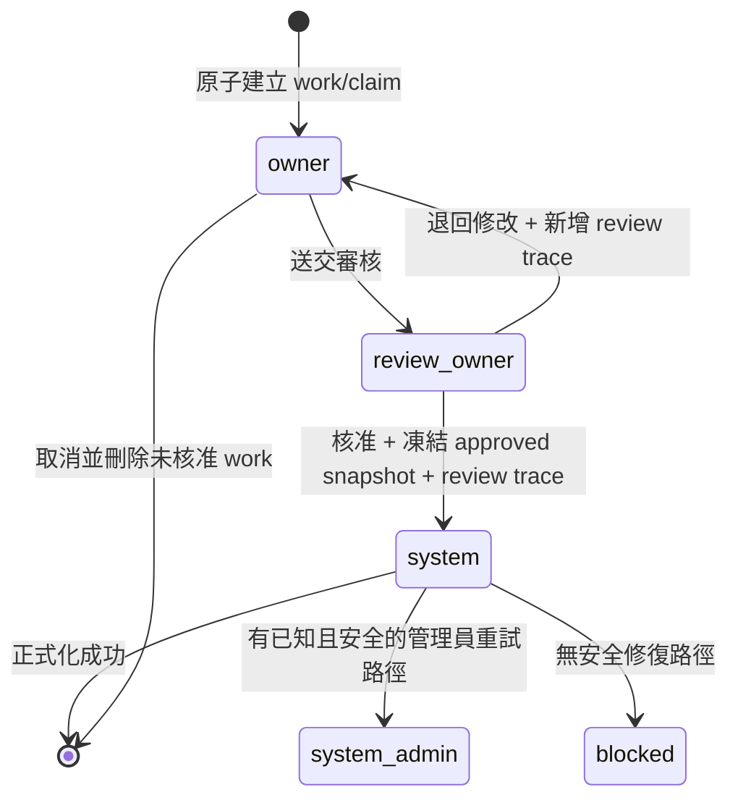

# SPEC-PDM-STATUS-DATA-REBUILD-001：三工作臺單一狀態權威、多研發分支與極簡人類語意

Status: `RD Implementation Ready (RD Supervisor Reviewed) / Human Confirmed / RD Not Started / Local Phase 1A-1D Eligible / High-Risk Migration & Production Release Gated`
Date: 2026-08-21; amended 2026-08-22
Owner: Dev PM
Related DEV: `DEV-087` / `DEV-PDM-STATUS-DATA-REBUILD-001`
Related ADR: `.ai-doc/decisions/ADR-PDM-STATUS-DATA-REBUILD-001-single-current-state-authority.md`
Related QA: `.ai-doc/qa/qa-dev-087-status-data-rebuild-validation-plan-2026-08-21.md`

## 0. Authority、成熟度與執行限制

本文件是 DEV-087 的 target-state 產品與 RD 實作契約。RD 主管已完成 repository、provider、migration、approval、permission、API、UI 與 QA surface 盤點；P0/P1 人類決策缺口與工程契約缺口為 0，因此可從本機隔離 Phase 1A 開始。這不代表已實作、已遷移或已授權刪除資料。

本規格的優先級如下：

1. 本規格與配對 ADR 是 DEV-087 啟用後的單一 target authority。
2. DEV-086 的雙 lane 實作在 DEV-087 啟用前仍是目前本機 runtime baseline；但其「每組最多兩列、只有一列 RD」會由本規格有意取代。
3. 既有 approval、revision、release、artifact、attachment、permission 與 domain identity 仍是業務證據；不得再自行投影另一套工作臺 current status。
4. 本輪只更新文件。local/disposable Phase 1A-1D 尚未被本次文件審查指令授權執行；legacy delete、DROP、production cutover、deploy 與 release更必須另行授權並通過高風險 gate。
5. 若舊文件或舊code與本規格衝突，以DEV-087新決策為主；安全可拆的舊 current-state／filter／projection／command 必須在同一DEV移除，不保留雙軌相容。只有§11明示`Preserve`的domain evidence可留存。

## 1. 問題與成功結果

現況把 `record_status`、workspace lifecycle、approval、release、human status、viewer status、responsibility、availability 與 lane label 同時當成可見狀態來源，造成：

- 同一列同時出現「研發最新版」與「量產版可使用」等互斥結論。
- 「工作狀態／資料狀態／版本列」三個 filter 代表不同軸，卻使用近似文字。
- 只有一列 RD 的設計會在平行設變時隱藏其他仍需處理的研發分支。
- 未正式化的 0.1 被補出假的量產列，形成 A0005 類型重複。
- 取消、退回、審核、正式化失敗與舊資料 fallback 由不同 projector 各自判定。

成功結果：

- 人類第一層只回答「這是什麼、哪個資料層／版次、目前是哪個角色處理」。
- 圖號同一群組顯示一列量產版，加上每個 current RD branch 各一列最新版；同一圖號最多三個 open RD branches，因此最多顯示四列。
- 料號與圖料根號沒有版本或分支，只各有一份正式資料／正式關聯及最多一份 current work。
- list、drawer、filter、editor/reviewer entry 都讀同一 canonical state，不再 client-side 合成。
- 核准後自動更新正式；失敗時舊正式資料持續有效。
- 舊 current-state authority 在同一 maintenance window 通過 gate 後立即退役，不保留永久雙權威。

## 2. 人類 UI 契約

### 2.1 第一層唯一資訊

| 重要性 | 資訊 | 規則 |
|---|---|---|
| 高 | 編號 | 圖號／料號／圖料根號各顯示自己的主識別 |
| 高 | 品名 | 單行；不得加變更摘要、人名或時間第二行 |
| 高 | 資料層／版次 | Drawing=`量產版 {revision}`／`研發版 {revision}`；Part=`正式資料`／`修改中`；Relation=`正式關聯`／`調整中` |
| 高 | 處理狀態 | 正常留空；只使用固定角色語意 |
| 中 | 受阻原因 | 清單只顯示`受阻`；drawer 條件式顯示一項人類原因 |
| 低 | 無 | 低重要性技術資料完全不進一般 UI |

固定處理語彙：`負責人處理`、`審核負責人處理`、`系統處理`、`系統管理員處理`、`受阻`。不得依登入者改成你／我／他，也不得顯示姓名。

禁止出現在 list、drawer、一般 editor、filter、tooltip、popover、DOM accessible name 與空狀態文案的資訊：變更摘要、處理人、時間、package、baseline、workflow、approval、raw database status、internal ID、branch ID、predecessor/source、ledger 與 effect key。

### 2.2 清單列數與分組

Drawing group：

```text
量產版：目前唯一 production-effective revision（若存在）
研發版：每個 open branch 的 latest revision 各一列（0..3）
```

不變量：

1. 同一 `company+drawing` 可有 0/1 列量產與 0..3 列研發；`open` branch hard cap=`3`。
2. 每個 branch 只顯示自己的 latest revision；branch 內舊版進歷史。
3. production 固定第一列；其後為可處理 RD，再來是 idle RD；各區以 revision comparator 排序。
4. 整個 drawing group 是單一 pagination unit，不得跨頁拆分。
5. row-level filter 先執行；只保留符合列，不自動帶出 companion production 或整組。
6. Part／Relation 各最多一列正式與一列 work；首次建立且沒有正式資料時只有 work 列，不建立 placeholder formal row。

### 2.3 Filter

- Drawing：`版本＝全部／量產版／研發版`。
- Part：`資料＝全部／正式資料／修改中`。
- Relation：`關聯＝全部／正式關聯／調整中`。
- 三者共用：`處理狀態＝全部／負責人處理／審核負責人處理／系統處理／系統管理員處理／受阻`。
- filter 必須精確命中列；搜尋、filter、sort 都在 group pagination 前由 server 執行。
- 舊狀態型 URL 不相容。偵測到 retired query vocabulary 時顯示`此篩選網址已失效`，使用者返回新工作臺；不得靜默轉譯舊語意。

## 3. Canonical Data Model

### 3.1 Current state aggregate

下列 type與`canonical_workbench_states`名稱固定；正式DDL、必要欄位與約束依§3.1.2，不得由migration另取同義名稱：

```ts
type WorkbenchEntityType = "drawing" | "part" | "relation";
type DataLayer =
  | "drawing_production"
  | "drawing_rd"
  | "part_formal"
  | "part_work"
  | "relation_formal"
  | "relation_work";
type Handling =
  | "none"
  | "owner"
  | "review_owner"
  | "system"
  | "system_admin"
  | "blocked";
```

正式 table 名固定為 `canonical_workbench_states`，最小欄位：

- `id`, `company_id`, `entity_type`, `canonical_entity_id`
- `data_layer`
- `branch_id`：只允許 `drawing_rd`
- `revision_id`：只允許 Drawing layer
- `work_id`：只有 active work 才存在；idle approved RD branch 可以為空
- `handling`, `blocker_reason`
- `row_version`, `created_at`, `updated_at`

唯一鍵：

| 範圍 | 唯一鍵 |
|---|---|
| Drawing production | `company + drawing + drawing_production` |
| Drawing RD | `company + drawing + branch_id` |
| Part formal/work | `company + part + data_layer` |
| Relation formal/work | `company + root + data_layer` |

禁止把 revision text、updated_at、display code 或 client choice 放進 stable row identity。

### 3.1.1 Dedicated work authority

DEV-087 不延用 `numbering_draft_workspaces` 作為新 current-work authority。新系統建立三個專用 work table；舊 workspace 只可作 migration source 或被保留的其他 legacy domain evidence：

| Table | Stable owner | 唯一 active work | 必要內容 |
|---|---|---|---|
| `drawing_revision_works` | `company + drawing + branch` | `company_id + branch_id` | `work_kind=revision_change`、target claim、exact predecessor、owner、work-owned drawing data/file bindings、base hash、row version |
| `part_change_works` | `company + part` | `company_id + part_id` | `work_kind=create_or_update`、owner、validated proposed Part DTO、base formal row version/hash、row version |
| `relation_change_works` | `company + root` | `company_id + root_id` | `work_kind=create_or_update`、owner、validated exact target tree、base formal tree hash、row version |

共同規則：

- work table 不另存一套可供 UI／filter 判定的 lifecycle enum；work 是否可編輯、審核或正式化只由 `canonical_workbench_states.handling` 決定。work table 只保存 domain work copy、owner、optimistic concurrency與exact snapshot來源。
- canonical row 的 `work_id` 必須以 domain＋company-compatible FK 指向對應專用 work；Part／Relation work成功正式化或取消後刪除，Drawing revision work成功正式化或取消後刪除。
- Part／Relation approved before/after snapshot使用獨立 immutable snapshot table；Drawing approved evidence仍由 Drawing revision/file authority保存。formalization只能讀核准時凍結的exact snapshot，不得重讀latest work。
- legacy `numbering_draft_workspaces` 只有在company、owner與單一target entity均可唯一證明時才轉入一個專用work；同時含多個無法安全拆分的Part／Root／Drawing target時進quarantine，不得猜測或讓一份legacy workspace同時成為多個current work。
- converter完成後，三工作臺及其editor/reviewer route不得再以legacy workspace identity判斷current work；舊workspace若因其他domain evidence被保留，也不得驅動canonical handling。

### 3.1.2 Exact provider-neutral schema contract

Cloud SQL PostgreSQL migration 固定為 `db/postgres/042_status_data_rebuild.sql`；`041` 為後續DEV-088保留但目前尚不存在的編號，DEV-087 不得覆寫或重新編號。SQLite authority 固定為 `db/schema.sql` 與 `src/lib/db.ts#ensureDev087CanonicalWorkbenchSchema`。現有singleton runner允許version gap，因此042必須可在只有001..040時獨立apply，不得FK/查詢任何DEV-088 future proposal tables；未來若041經DEV-088重新核准而存在，package排序為041→042，若042已先套用，runner也必須能補套041而不改寫042 checksum/schema。`db/postgres/README.md`須登記此reservation/independence、apply/verify/forward-fix契約；Supabase與archived mirror不是target。

以下名稱、key、必要欄位與約束是實作契約，不再留給 RD 自由改名；可增加純技術 index／timestamp，但不得新增另一個 lifecycle/current-state authority：

| Table | 必要欄位 | PK／唯一鍵與硬約束 |
|---|---|---|
| `pdm_workbench_state_authority_control` | `id, mode, expected_commit, schema_hash, row_version, switched_at` | `id=1`唯一；`mode in (legacy_only,shadow_compare,cutover_window,canonical_only)` |
| `pdm_workbench_aggregates` | `id, company_id, entity_type, canonical_entity_id, open_branch_count, row_version, updated_at` | PK=`id`；唯一=`company_id+entity_type+canonical_entity_id`；Drawing count `0..3`，非 Drawing 固定 `0` |
| `drawing_rd_branches` | `id, company_id, drawing_id, base_production_revision_id, latest_approved_revision_id, status, closed_reason, closed_at, row_version` | `company_id+id`唯一；`status in (open,historical)`；close 欄位與 status 組合 CHECK |
| `drawing_revision_claims` | `id, company_id, drawing_id, branch_id, target_major, target_minor, target_label, predecessor_revision_id, claim_state, created_at` | 唯一=`company_id+drawing_id+target_major+target_minor`；production用`target_minor=0`，RD用`>=1`，兩欄皆NOT NULL且非負，避免NULL唯一鍵穿透；`claim_state in (work,approved)`；approved claim 不可 update/delete |
| `drawing_revision_works` | `id, company_id, drawing_id, branch_id, target_claim_id, owner_user_id, proposed_payload, base_hash, row_version, created_at, updated_at` | 每 `company_id+branch_id`最多一列；target claim一對一；owner/company 必填 |
| `drawing_revision_work_files` | `work_id, file_binding_id, ordinal, content_hash` | PK=`work_id+file_binding_id`；只允許 work-owned binding；approved artifact不得指向此表 |
| `part_change_works` | `id, company_id, part_id, owner_user_id, proposed_payload, base_formal_row_version, base_hash, row_version, created_at, updated_at` | 每 `company_id+part_id`最多一列；payload通過 Part DTO validator |
| `relation_change_works` | `id, company_id, root_id, owner_user_id, proposed_tree, proposed_tree_hash, base_formal_tree_hash, row_version, created_at, updated_at` | 每 `company_id+root_id`最多一列；tree通過 exact relation validator |
| `canonical_workbench_states` | `id, company_id, entity_type, canonical_entity_id, data_layer, branch_id, revision_id, work_id, handling, blocker_reason, row_version, created_at, updated_at` | §3.1四類唯一鍵；layer/reference/handling/blocker組合 CHECK；work/company/domain一致 |
| `pdm_work_review_requests` | `id, company_id, request_kind, entity_type, canonical_entity_id, work_id, branch_id, reviewer_user_id, review_cycle_id, snapshot_payload, snapshot_hash, request_status, row_version, created_at, updated_at` | `review_cycle_id`唯一；每 work 或 branch-void最多一個 active request；status只允許`pending,applying,apply_failed` |
| `pdm_review_traces` | `review_cycle_id, company_id, entity_type, canonical_entity_id, decision_at` | PK=`review_cycle_id`；DB trigger禁止 update/delete；不得新增 reviewer/outcome/comment/revision/content 欄位 |
| `part_approved_change_snapshots` | `id, company_id, part_id, before_payload, after_payload, content_hash, formalized_at` | immutable；hash唯一驗證內容；只供 backend evidence |
| `relation_approved_change_snapshots` | `id, company_id, root_id, before_tree, after_tree, content_hash, formalized_at` | immutable；hash唯一驗證內容；只供 backend evidence |
| `pdm_workbench_migration_quarantine` | `id, company_id, source_kind, source_identity, reason_code, evidence_payload, resolution, resolved_at` | source identity唯一；cutover要求未解決數=0；不進一般 UI |

跨 provider 表示：JSON 在 PostgreSQL 使用 `JSONB`，SQLite 使用 `TEXT CHECK(json_valid(...))`；時間在 PostgreSQL 使用 `TIMESTAMPTZ`，SQLite 使用 UTC ISO-8601 `TEXT`；boolean 在 SQLite 使用 `INTEGER CHECK(value in (0,1))`。所有 enum 以 CHECK 維持兩 provider 同一合法值集。所有 child row 必須由 composite FK或等價 DB trigger驗證 same-company；只做 application check 不合格。必要 index至少覆蓋 list scope (`company+entity_type+data_layer`)、Drawing group (`company+drawing+branch/status`)、active request reviewer inbox (`company+reviewer+request_status+created_at`) 與 formalization retry (`request_status+updated_at`)。

`platform_command_receipts`沿用作 DEV-087 idempotency receipt，namespace 固定 `dev087:<command>`；`platform_outbox_events`沿用作 formalization delivery。兩者是 transport/effect evidence，不得投影 UI handling。若其既有欄位無法保存 request hash、stable result與effect key，RD必須以 042 additive column補足，不得另建第二套 receipt/outbox。

### 3.2 Drawing branch 與 revision claim

每個 Drawing RD branch 有不可變、UI 隱藏的 `branch_id`。每個 revision 必須儲存 exact `predecessor_revision_id`；不得從 `1.1` 字串或排序推測來源。

`drawing_rd_branches`至少保存`id／company_id／drawing_id／base_production_revision_id／latest_approved_revision_id／status／closed_reason／closed_at／row_version`。`status`只允許`open／historical`；`closed_reason`只在historical時允許`production_promoted／latest_rd_voided`。

另建立每個`company + entity_type + canonical_entity_id`唯一的`pdm_workbench_aggregates`鎖定列，保存`open_branch_count`且DB CHECK固定為`0..3`。PostgreSQL以該列`SELECT ... FOR UPDATE`；SQLite以write transaction鎖定並執行條件式count更新。建立新branch必須先以`open_branch_count < 3`條件原子加一，再建立branch/work/claim/state；affected row=0即回branch limit。branch由open轉historical時只允許CAS一次並在同transaction減一，任何underflow／double decrement均由DB拒絕。即使尚無production或canonical row，aggregate lock row仍是固定競爭點。

branch 狀態只治理是否仍投影 current row：`open` 或 `historical`。branch 本身不是人類工作狀態。

所有 work target 先取得 `drawing_revision_claim`：

- 唯一鍵為 `company + drawing + target_revision`，跨 branch 全域唯一。
- 目標確認與 work 建立在同一 server transaction 完成；先 commit 者取得 claim。
- loser 回傳「目標版次已被占用」並刷新可選候選；不得自動換 branch 或 redirect 到別人的 work。
- 未核准 work 取消時刪除 claim，target 可重用。
- 核准後 claim 永久化，該 revision 不得重用。

revision 不使用十進位浮點運算，而是解析為 tuple：production=`M`，RD=`M.n`；第一個 production 前的 RD 為`0.n`。

DB tuple canonicalization固定：production `M`存為`(target_major=M,target_minor=0)`；RD `M.n`存為`(M,n)`且`n>=1`。label只由server formatter產生，不參與比較或唯一性；任何含前導零、負值、空minor、浮點或非canonical label的client輸入都拒絕。

- 從目前 production `M`建立新 branch 時，候選固定為下一個 production `M+1`及下一個未被 claim 的 RD `M.n`；RD minor 從`n=1`向上找最小可用值。
- 從 RD `M.n`沿同 branch 進版時，RD 候選為大於`n`的最小未被claim minor；正常為`M.(n+1)`，若已由其他branch占用則繼續向上掃描。只有該branch的production base仍等於目前production時，才可同時提出下一個production `M+1`。
- 下一個 production `M+1`若已被任何 branch claim，不得跳號提出`M+2`；UI 顯示該目標不可用並要求先處理既有分支。
- 每個 branch 的 `base_production_revision_id`在 branch 建立時固定，供 server 驗證是否已 stale；此欄位只在 backend 使用，不進 UI。

open branch cap 契約：

- `open`計數包含 active owner/review/system/system_admin/blocked branch 與已核准但 idle 的 RD branch；同 branch 繼續進版不新增名額。
- 新 branch 建立必須鎖定 `company+drawing` canonical aggregate，在同一 transaction 內重新計數並建立 branch/work/claim；三個名額由先 commit 者取得。
- 第四個新 branch 必須原子拒絕，錯誤碼=`DRAWING_RD_BRANCH_LIMIT_REACHED`，人類文字=`已有 3 個研發分支，請先完成其中一個`；不得建立孤兒 claim、work 或 canonical row。
- production promotion 只把實際來源 branch 轉為`historical`並釋放一個 open 名額；其他 open branch 仍留在清單。
- latest approved RD作廢正式化成功時，來源branch以`closed_reason=latest_rd_voided`轉為`historical`、移除RD canonical row並釋放一個open名額；approved revision identity、claim與artifact仍保留且不可重用。
- migration 若發現同一圖號超過三個 open branches，全部進 quarantine，禁止隱藏、截斷或自動刪除；cutover 前必須依可驗證證據完成歷史化／合併處置且 unresolved=0。

### 3.3 Review trace 與已核准證據

每次 reviewer 實際按下`核准`或`退回修改`才建立一筆 immutable review trace。開頁、owner 送審與自動處理不計次。

最小保留欄位只供 backend 追溯審核次數與時間：`review_cycle_id`、company/entity reference、`decision_at`。不得保存 reviewer、outcome、revision text、comment 或工作內容副本作為這個最小 trace；不得在 UI 呈現。

- 退回後沿用同一 work copy，但下次送審建立新的 `review_cycle_id`。
- 已產生的 review trace 即使 work 之後取消仍永久保留。
- Drawing 核准版本永久保存完整受控版本、檔案、預覽與 identity。
- Part／Relation 每次核准永久保存完整 before/after data snapshot；只在 backend 稽核／修復使用，不進一般 UI。

### 3.4 審核工作臺 adapter 與暫存資料生命週期

DEV-087 不把永久決策寫入既有 `approval_platform_decisions`。該表會保存 reviewer、decision、comment 且有 immutable trigger，與本案 minimal trace 明確衝突。採用下列單一解法：

1. `/approvals`與`/approvals/[requestId]`仍是人類的審核入口，但 DEV-087 inbox row 由 `pdm_work_review_requests` adapter 提供；approval platform只負責聚合、搜尋、選取、returnTo與導航，不成為 DEV-087 decision storage authority。
2. `pdm_work_review_requests`是 active-review 暫存資料。它可以保存 exact reviewer、snapshot、request kind 與 apply failure，因為這些是完成審核與安全正式化所必需；不得把這些欄位複製到永久 `pdm_review_traces`。
3. `退回修改` transaction：驗證 exact reviewer／request／row version → 寫一筆 minimal trace → canonical handling回`owner` → 刪除 request與review snapshot。下次送審產生新 cycle與新 request。
4. `核准` transaction：驗證 exact reviewer／request／row version → 寫一筆 minimal trace → request切`applying`且canonical handling=`system`。formalization成功後刪除 request/snapshot；失敗時暫存 request保留為`apply_failed`以支援 exact retry，修復成功後立即刪除。
5. request刪除不等於刪除正式證據：Drawing approved revision/artifact或Part/Relation approved snapshot才是永久業務證據。所有永久 review trace仍只回答審核次數與時間。
6. 既有 `/api/approvals/requests/[requestId]/decisions` 只接受 `approved|rejected|needs_info`，不得為相容而扭曲 DEV-087 語意。DEV-087 使用 §9.2 的新 decision route；approval inbox adapter只回 server-owned href。
7. 其他 approval domain 繼續使用既有 request/decision tables、handler與歷史，不做搬移或刪除。
8. 「active review暫存」限制適用所有持久化旁路，不只request table。DEV-087 decision command在return或formalize success後，`platform_command_receipts`只能留下content-free stable acknowledgement、request hash／effect key等必要technical projection；generic `actor_id／platform_principal_id`須對DEV-087 terminal decision去識別。已published outbox須刪除或安全縮減payload，`last_error`只留fixed code；audit detail、application/worker log、telemetry與error payload不得保存或可反推出reviewer、decision、comment、revision text、snapshot或work content。其他approval domain既有audit/evidence不受此條刪除。
9. initial decision與active replay都必須在查用receipt前重驗company、action permission與exact active reviewer。terminal replay因request已清除，只能在登入、same-company與decision action permission通過後回content-free stable acknowledgement，不得hydrate已刪request、reviewer、decision或snapshot；cross-company、未授權actor及不同payload/key scope一律fail closed。
10. full DB backup屬受控operational recovery evidence，不是review business trace。backup manifest必須列出備份時間點的active transient request數、加密／存取／90-day expiry與restore後隔離限制；terminal狀態建立的備份必須通過同一forbidden-data scan。含active request的pre-terminal backup不得掛回一般runtime或作UI／analytics來源。

## 4. Domain Lifecycle

### 4.1 Drawing branch rules

1. 從 production row 建立任何 target 時建立新 branch；從 RD row 繼續進版時沿用該 branch。
2. production 與 RD row 都可顯示`進版`；target candidates 只能由 §3.2 的 server 演算法計算，UI 不得自行加減版次。
3. 例：production 1 可選production 2或最小未占用RD 1.n；RD 1.1通常可選同branch RD 1.2，若1.2已占用則選下一個未占用minor，且base仍為current production 1時也可選production 2。
4. 新 branch 只可在 open branch 少於三個時建立；達三個時 production row 的`進版`停用並顯示固定原因，既有 branch 的`進行編輯`或同 branch 進版不受名額限制影響。
5. 即使 target 是 major 2，核准前仍顯示`研發版 2`；核准並正式化成功後才成為`量產版 2`。
6. 核准 minor／RD revision 只把該 revision 正式化為受控 RD，branch 保持 open idle、handling=`none`；不得改 production row。
7. 核准 production target 後，只有在 branch base 仍等於 current production 且 claim/snapshot 都有效時，才原子切換 production row並將來源 branch轉 historical。
8. production 從其他 branch 前進時，無關的 open RD branch 保持 current，例如 production 2 與 RD 1.1 可同時存在；這類 branch 是 stale branch。
9. stale branch 仍可沿自身 lineage 建立下一個 RD minor，但不得直接升 production。target modal只顯示人類原因`量產基準已更新，這個研發分支只能繼續研發版`，不得顯示 branch/source/predecessor 技術資料。
10. 不因建立新 branch 或新 work 收合其他 branch；最多三個 open branch latest 都必須顯示。
11. 每個 branch 最多一份 active work；不同 branch 可並行處理。
12. 已核准 RD revision 不可直接編輯；必須建立下一 revision。
13. production target claim 被占用時，不得跳到未來 major；回傳`DRAWING_TARGET_REVISION_CLAIMED`並刷新 server candidates。
14. 本phase實作`申請作廢`：只允許`handling=none`、已有latest approved RD且沒有active work的open branch提出。申請建立exact latest-revision snapshot並直接進`review_owner`；不建立新revision、不取得新claim。reviewer退回時request結束、branch維持open idle且可重新申請；核准後進`system`並自動正式化。
15. 作廢正式化成功時，latest approved RD被標為不再有效，整個branch轉`historical(closed_reason=latest_rd_voided)`、RD current row移除並原子釋放一個branch名額。該branch所有revision不再構成current有效版次，但approved identity、不可重用claim、受控檔案與歷史artifact永久保留；不得實體刪除approved artifact。
16. 已historical branch不可reopen。未來若要從production或其他current RD續作，必須依一般規則建立新branch_id；不得復活已作廢branch。

### 4.2 Part

- `正式資料`是生產持續使用的資料；`修改中`是唯一 current work copy。
- 首次建立沒有正式資料時只顯示`修改中`。
- 同一 Part 全域最多一份 work；atomic create loser 導向既有 work。
- Part 欄位修改納入 review；核准後原子更新正式並移除 work row。
- Part attachment 的獨立即時生效由DEV-087直接定義並沿用現行附件authority；不進修改案、不隨取消 rollback、也不是審核內容。reviewer 在唯讀頁看到當下最新 live attachments，須明示它們不屬本次核准 snapshot。DEV-087不得提前實作後續DEV-088尚待縮編的替代料號附件沿用、binding/version/content模型、權限重建或whole-part lease。
- 首次建立且尚未送審的 work 取消時移除 work row；編號是否回收完全委派既有 numbering authority，DEV-087 不另創回收規則。

### 4.3 Relation

- `正式關聯`是生產持續使用的 root→drawing→part tree；`調整中`是唯一 current work copy。
- 首次建立沒有正式關聯時只顯示`調整中`。
- 同一 root 全域最多一份 work；atomic create loser 導向既有 work。
- editor 只做新增、移除、調整；送審 confirmation 列出 exact removal nodes。
- 沒有 root revision、歷史版次、共同檔案或 root-level attachment。
- 核准後原子更新正式關聯並移除 work row。
- 首次建立且尚未送審的 work 取消時移除 work row；根號／編號是否回收完全委派既有 numbering authority。

### 4.4 Terminal lifecycle boundary

DEV-087 的 canonical workbench 只維護 current work、review、formalization 與 Drawing RD branch close；整體圖號、料號或圖料根號的 obsolete／merged 仍由既有 numbering authority 負責，DEV-087 不另建第二套 terminal command。

- whole-object obsolete 只有在 formal entity idle、沒有 `canonical_workbench_states.work_id`、沒有 pending request，且沒有 `owner／review_owner／system／system_admin／blocked` current work 時才可由既有 UI 入口送出。任一 active work 或處理中狀態存在時，server descriptor 不提供作廢 action；若舊頁已開啟，提交必須 zero-write fail closed，不能取消或覆寫工作資料。
- root obsolete 不隱含取消、合併或改寫子 Drawing branch、Part work 或 Relation work。只要 root 或直接子項仍有 current work、review/system processing、open RD branch 或受控依賴，impact/policy 必須回不可執行原因；只有所有 domain 狀態各自結束後，才可重新產生 exact impact snapshot 並交由既有 authority 審核。
- `Merged` 只作既有 authority 的 terminal domain evidence。current workbench 不建立 Merged、不把它投影成可處理 current row；合法 history 導覽只能唯讀顯示 exact record，所有 mutation/action（復活、進版、修改、發布）必須為空。測試不得用 SQL、seed 或中途 API mutation 製造 Merged。
- 這些規則是 fail-closed safety boundary，不新增 UI 技術欄位；一般清單只維持既定的資料層／版次與固定處理角色語意，必要阻擋原因只在明細顯示一項人類可理解文字。

## 5. Work、Review 與正式化狀態機



規則：

- review_owner 固定由`/approvals/[requestId]`作server-owned入口，再載入與owner相同的domain editor components、欄位、資料與layout，但整頁唯讀；owner URL仍是各domain workspace，因此「相同 editor」不代表URL相同。Drawing editor保持獨立架構。
- DEV-087 涵蓋的 Drawing／Part／Relation request descriptor，人類 review decision 只有`核准`與`退回修改`。既有 BOM 或其他 domain 的`reject／needs_info`不被本 DEV 刪除，但不得出現在 DEV-087 request 的 action allowlist、API 或 UI。
- review 中 owner 不可取消或編輯；只有 reviewer 可退回。退回後 owner 才可繼續編輯或取消。
- 核准後自動更新正式，沒有第二個「發布」人類動作。
- Drawing 的受控檔案與 Relation 的 exact target tree 都在 approved snapshot 與 review lock 內。Part attachments 明確排除於 Part review snapshot／active-review lock之外，依DEV-087直接契約及現行附件authority獨立即時維護；reviewer 頁在附件區相鄰顯示`附件獨立維護，不屬於本次資料核准`，此提示只屬 review editor，不進 list／drawer／一般 filter。
- async formalization 時 handling=`system`，work 鎖定，舊正式持續有效。
- retry-safe transient failure自動最多3次，目標間隔為30秒、2分鐘、10分鐘；每次先用effect key readback確認是否已成功。三次後若exact snapshot仍可安全重放則進`system_admin`，invariant／snapshot／company／artifact identity不一致則不重試並直接進`blocked`。
- 已知安全修復路徑為 `system_admin`，只允許對 exact approved snapshot 做 idempotent retry；不得重新讀 latest work 重算。
- 沒有安全修復路徑為 `blocked`，只顯示一項人類原因，工作臺無動作；舊正式持續有效。
- Relation 引用 snapshot drift 時技術上拒絕核准 command，review 保持 pending／review_owner，由 reviewer 決定退回；不得自動 merge 或自動退回。

正式化結果：

- 核准 Drawing RD minor：受控 RD 更新完成，branch 回 idle；production 不變。
- 核准 Drawing production target：符合 current-base guard 才推進 production；來源 branch historical。
- 核准 Part／Relation：原子更新正式資料／正式關聯並移除 work row。
- 非同步 timeout 可安全辨識時保持`system`並重試；達明確重試上限後依 recoverability 進`system_admin`或`blocked`。不得因 browser reload、worker restart 或重複 delivery 重複正式化。

## 6. Drawer、Editor 與歷史

三 drawer 固定唯讀順序：`主識別／品名／處理狀態` → `主要內容／預覽` → `直接關聯` → `受阻資訊（條件式）` → `歷史版次（Drawing only）` → `動作區`。

- Drawing：顯示 exact revision 預覽、受控檔、直接關聯、歷史版次；歷史每列只顯示 revision/lane 並可唯讀開啟 exact artifact，source/branch/predecessor 不顯示。
- Part：顯示主資料、獨立 live attachments、直接關聯；沒有 Part version/history。
- Relation：顯示關聯樹與直接關聯；沒有 root version/history/files。
- `system_admin`只顯示`請系統管理員處理`，不提供假恢復 CTA；`blocked`無操作。
- Drawing 延用現有 full-page editor、2D/3D、受控檔、智慧辨識、欄位核對與送審架構，不共用 Part／Relation 表單。
- target confirmation 必須先由 server 原子建立 work/branch/claim，再導航 exact editor；reload/back 不得切到 global latest。

### 6.1 Primary action 與唯一風險例外矩陣

狀態文字與動作權限是兩件事；文字不得依 viewer 改寫，動作只能由 server descriptor 提供。

| Domain／列 | 條件 | 動作 | 無權限／不可執行時 |
|---|---|---|---|
| Drawing production | open branches `<3`且既有 permission允許 | `進版`→target modal | 隱藏；達 cap 則停用並顯示固定原因 |
| Drawing RD active work | handling=`owner`且actor為owner，或通過既有same-company non-owner scope＋exact action permission | `進行編輯` | 唯讀、無 action |
| Drawing RD review | handling=`review_owner`且為 exact reviewer | `前往審核` | 其他合法 viewer 唯讀、無 action |
| Drawing RD idle | handling=`none`且既有 permission允許 | primary=`進版`→同branch target modal；secondary risk action=`申請作廢` | 無權限時各自隱藏 |
| Drawing RD void review | 作廢request active且為exact reviewer | `前往審核` | 其他合法viewer唯讀、無action |
| Drawing RD system/system_admin/blocked | 任一 | 無 | 只顯示固定角色或一項受阻原因 |
| Part formal／Relation formal | 無 current work且既有 permission允許 | `建立修改`／`建立調整` | 隱藏 |
| Part work／Relation work | handling=`owner`且actor為owner，或通過既有same-company non-owner scope＋exact action permission | `進行編輯` | 唯讀、無 action |
| Part／Relation review | handling=`review_owner`且為 exact reviewer | `前往審核` | 其他合法 viewer 唯讀、無 action |
| Part／Relation system/system_admin/blocked | 任一 | 無 | 只顯示固定角色或一項受阻原因 |

頁面清單只擁有「開啟 drawer」；drawer通常只有一個primary navigation action。Drawing RD idle為唯一例外：可同時有primary `進版`與低權重secondary risk action `申請作廢`，不得在list或其他區域重複。作廢確認modal固定顯示`核准後，研發版 {revision} 將不再有效，這一系列研發版會從目前清單移除，且無法復原`；不顯示branch ID/source/predecessor。target modal擁有最終target選擇與確認。modal成功後才導航exact editor或建立作廢request；取消、Escape或錯誤都回到原drawer row並恢復focus/scroll。drawer body與modal body各自是唯一scroll owner，sticky action不得遮住最後一列。server command執行超過5秒時顯示進行中並鎖住重複提交；失敗保留modal、顯示人類可理解錯誤並將focus移到error summary。

### 6.2 角色、可見性與 server permission

DEV-087 不新增 role 或 permission code，沿用既有 server-side permission／company boundary；下表只固定最小結果，不得用 UI 隱藏代替 server denial。

| Viewer | 同公司 list/drawer | Mutation／review |
|---|---|---|
| Manufacturing | 可看 production 與所有最多三列 current RD；exact artifact 仍依既有 read policy | 不得建立 branch/work、編輯、送審、取消、核准或退回 |
| Work owner／Editor | 依既有 domain view permission可看 | 依既有action permission編輯／送審／取消自己的owner work |
| Exact reviewer | 可看 request scope及同頁必要 domain data | 只可在 canonical review route 唯讀查看並`核准／退回修改` |
| Authorized non-owner editor | 依既有domain view permission可看 | 延續現行`hasPdmNonOwnerEditScope`＋action permission；可編輯／送審／取消同公司非本人work及提出RD作廢，不因DEV-087縮限為owner-only |
| R&D Manager／Admin | 依既有 supervisor/admin view permission可看 | 與現行non-owner edit scope及action permission一致；角色名稱本身仍不取代server permission檢查 |
| 其他 authenticated non-owner | 依既有 domain view permission可看 | 未通過既有non-owner scope或action permission者無mutation |
| Cross-company／未授權 | 不得 hydrate row、drawer、artifact 或 request；回404／fail closed | 全部拒絕 |

Manufacturing 的關鍵驗收情境：A0002-M01 同時有`量產版 1`與`研發版 1.1`時，Manufacturing 在同一清單群組看見兩列，但兩列均無 mutation action。production row 不得因 RD branch 存在而消失。

既有permission code映射固定如下；DEV-087不新增code，也不得以角色名稱取代code check：

| Command | 既有permission gate |
|---|---|
| Drawing list/detail | page=`numbering.drawings.view`；exact artifact另沿用既有artifact read policy |
| Part／Relation list/detail | page=`numbering.search`；exact artifact／relation target另沿用既有read policy |
| 建立Drawing／Part／Relation work | `numbering.workspace.create`；Drawing取得／編輯revision另需`numbering.draft.update` |
| 編輯work | `numbering.workspace.update`；Drawing受控草稿內容另需`numbering.draft.update` |
| 送交審核 | `numbering.candidate.review.submit` |
| 取消未核准work | `numbering.workspace.cancel` |
| DEV-087核准／退回 | `numbering.candidate.review.decide`＋exact active reviewer request |
| Drawing RD申請作廢 | `numbering.draft.obsolete`＋same-company edit scope＋branch invariant |
| 自動正式化 | server service identity；不要求使用者`numbering.publish`，也不提供第二個發布按鈕 |

若既有部署尚未把上述code授予某角色，結果是action隱藏且server 403，不得在DEV-087自行補role grant。permission policy變更屬re-entry；本期只沿用現況。

## 7. 取消與資料保留

### 7.1 新系統

未核准 work 取消時，完整刪除：work data、work-owned file bindings、未核准 revision identity、predecessor binding 與可重用 target claim。保留：

- 已存在的 minimal review trace。
- 正式／已核准 domain data 與 drawing controlled files。
- Part attachments 的獨立即時 mutation。
- 仍被其他 owner 引用的 shared physical object；只有 reference count=0 才可刪除實體 bytes。

Physical object recovery decision：

- DEV-087不提供、也不宣稱對已刪除physical bytes的backup/restore或使用者復原功能；reference count=0且通過刪除guard後屬永久刪除，風險已由使用者明確接受。
- work cancel／legacy cleanup若會永久刪除work-owned bytes，確認UI必須顯示`相關未核准檔案將永久刪除，無法復原`。不得提供不存在的復原CTA。
- branch作廢只關閉current效力，不刪除任何approved Drawing artifact；approved history永遠不套用上述physical deletion。
- schema/canonical cutover仍保留full DB backup與relational restore drill；它只保證DB/schema/current-state rollback，不得宣稱能還原已永久刪除的object bytes。maintenance window內先完成DB cutover，legacy零引用physical bytes只在canonical-only gate通過後才進不可逆GC。

### 7.2 Legacy

【已被 2026-08-22 Human decision A 取代】遷移時 legacy cancelled data（包含舊 review data）保留於 backend quarantine，標記 `retained_legacy_source`；不轉入新 minimal trace、不進 canonical current state，也不得驅動三工作臺。未來若另行核准 destructive cleanup，才可依 allowlist 執行，不能手動散刪。

只有已核准 Drawing 才保留不可重複 revision identity。未核准且取消的 revision 可重用。

## 8. Migration、Cutover 與 Retirement

### 8.1 Inventory classification

所有相關 table/column/enum/service/DTO/projector/filter/URL/UI/QC consumer 必須逐項標為：

- `preserve_domain_evidence`
- `convert_to_canonical`
- `preserve_hidden_history`
- `retain_legacy_quarantine`
- `drop_old_current_authority`

unknown 必須為 0。初始必查 repository surface：

- DB：`part_roots.record_status`、`part_numbers.record_status`、`drawing_numbers.record_status`、`numbering_draft_workspaces.lifecycle_status`、candidate revision lifecycle、drawing revision package/lifecycle、approval requests/decisions/platform、manufacturing baseline、file assets/bindings、audit logs。
- Server：`src/lib/human-status-projection.ts`、`work-status-presentation.ts`、`responsibility-status-projection.ts`、`availability-scope.ts`、`drawing-workbench-status.ts`、三 workbench service/repository、`pdm-workbench-lane.ts`。
- API/UI：Drawing／Part／Relation workbench routes/components、detail drawer、domain editors、review routes、filter/url parser。

Inventory 只能據事實分類，不能將所有帶 `status` 的欄位一律刪除；domain evidence 可保留，但不得再成為 current workbench authority。

machine-readable artifact 固定位置，禁止由執行者另取名字而讓下一個 AI 找不到：

- schema：`.ai-doc/qa/dev-087-old-authority-inventory.schema.json`
- canonical inventory：`.ai-doc/qa/dev-087-old-authority-inventory.json`
- immutable run：`output/qa/dev-087-retirement/<run-id>/manifest.json`
- QC summary：`.ai-doc/qc/qc-dev-087-retirement-<date>.md`，必須記錄 exact manifest path 與 SHA-256

上述 schema／inventory 是 Phase 1A 實作輸出；本文件不建立假空 inventory。每筆 inventory 至少包含 stable item id、kind、repository locator、owner、disposition、retirement phase、verification method、status 與 evidence pointer。

### 8.2 Ambiguous data

- 無法唯一映射的舊資料不得猜 latest；進 quarantine／blocked 供人工決定。
- predecessor 只有來源唯一可證明時才 backfill；否則記為 backend-only `source_unknown`。
- `source_unknown` 經人工確認後可視為 resolved，但不得出現在 UI。
- cutover gate 要求所有 quarantine 已修復、確認 `source_unknown` 或明確刪除；unresolved=0。
- 2026-08-22 Human decision `A`（local preservation）：既有無法唯一映射的 legacy `new_bundle` 與 legacy cancelled workspace 全部保留，不刪除、不補假的 `0.1`、不拆成多個 canonical work。migration 以 `--retain-unmapped-legacy` 明示將 quarantine resolution 設為 `retained_legacy_source`，並在 manifest 記錄 `unresolvedBeforeResolution`、`retainedLegacy`、source counts 與 foreign-key reconciliation。保留 rows 只作 legacy source evidence，不得驅動三工作臺、canonical handling、filter 或 editor/reviewer route；此 flag 與 `--discard-unapproved-part-only-drafts` 互斥。

### 8.3 Cutover sequence

1. release owner 在授權前記錄 maintenance 最大時長／RTO、rollback owner、project/port/process/worker inventory；任一缺漏即不得開始。
2. 啟用 edge maintenance，拒絕所有外部 mutation；drain in-flight request，停止舊 web instances、scheduler、queue/recognition/current-state worker，並以 process/runtime manifest 證明 active old instances=`0`。
3. 建立full DB backup、object binding inventory/hash與exact application commit；先在相同provider/version完成DB/schema／binding restore drill。此drill不包含已永久刪除physical bytes的復原能力，亦不得如此宣稱。
4. 離線 shadow convert 新 schema，產生 source/target counts、identity hashes、claim/branch/predecessor/review/snapshot reconciliation；全量 unexpected unmapped/duplicate/invalid reference/invalid branch/over-cap branch/duplicate target/production-without-approved evidence/work-without-owner/hash mismatch/unresolved quarantine=`0`。
5. 部署 exact DEV-087 artifact但外部寫入仍 freeze；將 authority control 設為`cutover_window`並綁 exact commit/schema hash，舊 instances保持被 fenced／terminated。
6. 只允許release allowlist執行command smoke、三工作臺browser smoke、exact artifact smoke與DB/binding backup verification；一般使用者不得寫入，physical-byte irreversible GC尚不得開始。
7. `npm run qc:dev-087:retirement`與schema retirement allowlist全PASS後，同一 maintenance window立即 drop／disable 已驗證的舊 current-state tables/fields/projectors/filter authority。
8. authority control切`canonical_only`，重新執行readiness、command/browser/artifact及retirement aggregate；全部PASS後才解除edge maintenance並開放使用者流量。legacy零引用physical bytes只可在此gate完成後進入不可逆GC，且沒有backup restore承諾。
9. 開放前任一 gate 失敗，停止並以 full DB/schema/binding backup + exact application rollback回到`legacy_only`；因外部寫入全程freeze，目標RPO=`0`。若監測到任何未核准外部寫入已被接受，禁止自動restore，維持maintenance並交由人類對帳決定。

被 drop 的只有舊 current-state authority。Drawing approved versions/files、Part/Relation approved before/after snapshots、new minimal review trace 與其他明確 domain evidence不得刪除。

### 8.4 Authority fencing control

建立 environment-wide singleton `pdm_workbench_state_authority_control`，固定唯一row `id=1`（PK＋CHECK），最小欄位為`mode`、`expected_commit`、`schema_hash`、`row_version`、`switched_at`。此表沒有一般UI／public API，只能由受控migration/release command以compare-and-swap row version變更；缺row或多row都視為readiness FAIL。

- web、worker、scheduler啟動時的 build commit/schema hash/expected mode 必須與 control row一致；不一致則 readiness FAIL，且不得執行 current-state command。
- 所有 mutation request 攜帶 server build/schema token；切換後舊 browser tab/client或舊 instance回`WORKBENCH_CONTRACT_EXPIRED`並要求重新整理，不得走 legacy endpoint。
- `canonical_only`可在 disposable／isolated test environment提前使用，以完整測試 command/UI；mode只描述 authority，不代表production readiness或release完成。
- `shadow_compare`永遠是 offline convert/read compare，不能接 production command；`cutover_window`只有 allowlisted smoke可寫。
- rollback receipt 必須證明 control row、app artifact、DB/object references與traffic mode一起回復，不得只改一個 flag。

### 8.5 Backup retention

驗收後 pre-migration full DB/schema/binding backup 移至低成本儲存保留 90 天。到期刪除仍須走明確核准程序，不得由排程無條件刪除；此保留政策不建立physical-byte restore承諾。

## 9. Wire、API、Transaction 與 Concurrency Contract

### 9.1 Canonical read DTO

三個 list/detail endpoint 共用下列最小 transport contract；server可增加 domain `content`，但不得輸出 retired status chain：

```ts
type CanonicalWorkbenchRowDto = {
  rowKey: string; // opaque stable token；不可含 branch/source/predecessor 語意
  entityType: "drawing" | "part" | "relation";
  entityId: string;
  code: string;
  name: string;
  layer: "production" | "rd" | "formal" | "work";
  layerLabel: string;
  revision: string | null; // Part/Relation 永遠 null
  handling: "none" | "owner" | "review_owner" | "system" | "system_admin" | "blocked";
  handlingLabel: "" | "負責人處理" | "審核負責人處理" | "系統處理" | "系統管理員處理" | "受阻";
  blockerReason: string | null;
  detailHref: string;
  rowVersion: number;
  actions: Array<{ key: "advance" | "edit" | "review" | "create_change" | "void_rd"; label: string; href?: string }>;
};
```

- `actions`是server authorization descriptor；client不得根據角色名稱或 handling 自行補 action。
- `rowKey`固定為`cw_<canonical_workbench_states.id>`，`groupKey`固定為`cg_<pdm_workbench_aggregates.id>`；兩個id都是application-generated UUID、建立後不可變且不含domain/branch/source語意。`rowKey/entityId/rowVersion/detailHref`是transport/navigation metadata，不得顯示於文字、tooltip或accessible name。branch id、predecessor id、raw table status與owner/reviewer name不在DTO。
- list response固定 `{data:{groups:[{groupKey,rows}],nextCursor,totalGroups,totalRows},meta:{contractToken,correlationId}}`。`groupKey`與`nextCursor`皆opaque；total/pagination以 group 為單位，row filter 後空 group 不回傳。
- detail response固定 `{data:{row,content,history,relations,attachments?},meta:{contractToken,correlationId}}`；Part attachments是live projection並帶 `reviewScope:"excluded_live"`，但只有 review editor顯示人類提示。
- 禁止欄位：`humanStatus,responsibilityStatus,viewerStatus,viewerActionability,availabilityScope,laneLabel,lifecycleStatus,recordStatus,branchId,predecessorRevisionId,sourceRevisionId,ownerName,reviewerName`。

保留既有 read URL，改換 canonical response：

| Domain | List | Detail／preview |
|---|---|---|
| Drawing | `GET /api/numbering/drawings/workbench` | `GET /api/numbering/drawings/workbench/[rowKey]`與既有 exact preview child route |
| Part | `GET /api/parts/workbench` | `GET /api/parts/workbench/[rowKey]`與既有 preview child route |
| Relation | `GET /api/numbering/relations` | `GET /api/numbering/relations/[rowKey]` |

status/pagination query vocabulary固定為 `query`、repeatable `layer`、repeatable `handling`、`sort`、`cursor`、`limit`；series/type/purpose等既有非狀態業務filter可由domain adapter原key保留，並必須納入cursor hash。domain layer合法值：Drawing=`production|rd`、Part/Relation=`formal|work`。出現舊 `view/history/workStatus/recordStatus/dataStatus/humanStatus/responsibilityStatus/viewerStatus/availabilityScope/lane/versionLane`任何一項時，HTTP=`410`、code=`WORKBENCH_FILTER_CONTRACT_RETIRED`、message=`此篩選網址已失效`；不得執行 legacy query。`detail`是selection/navigation key，不是filter，可保留但必須只解析opaque canonical rowKey。

### 9.2 Command routes 與 wire

所有 mutation 都需要登入、company/resource/action policy、`Idempotency-Key`、`If-Match: <rowVersion>`與 owner page `meta.contractToken`回送為 `X-PDM-Workbench-Contract`。server 必須重算 candidate、permission與snapshot；不得信任 client label/href。成功固定回 `{data,meta:{contractToken,correlationId}}`；失敗固定回 `{error:{code,message,correlationId}}`。

| Domain | Route | Body／結果 |
|---|---|---|
| Drawing target | `GET /api/pdm/drawings/[drawingId]/revision-targets?sourceRowKey=...` | 回 server-signed `candidateToken`與合法 human labels，不回branch/source/predecessor |
| Drawing create work | `POST /api/pdm/drawings/[drawingId]/revision-works` | `{sourceRowKey,candidateToken}`；原子建立／沿用 branch、claim、work與row |
| Drawing edit | `PATCH /api/pdm/drawing-revision-works/[workId]` | validated Drawing work DTO；不改現有 Drawing editor/recognition component ownership |
| Drawing submit/cancel | `POST /api/pdm/drawing-revision-works/[workId]/submit`、`POST /api/pdm/drawing-revision-works/[workId]/cancel` | `{}`；依 header做 concurrency/idempotency |
| Drawing void | `POST /api/pdm/drawing-rd-branches/[branchId]/void-requests` | `{rowKey}`；server驗證 exact idle latest approved RD |
| Part create/edit | `POST /api/pdm/parts/[partId]/change-works`、`PATCH /api/pdm/part-change-works/[workId]` | validated Part DTO；attachment payload一律拒絕 |
| Part submit/cancel | `POST /api/pdm/part-change-works/[workId]/submit`、`POST /api/pdm/part-change-works/[workId]/cancel` | attachment不進snapshot/rollback |
| Relation create/edit | `POST /api/pdm/relations/[rootId]/change-works`、`PATCH /api/pdm/relation-change-works/[workId]` | validated exact relation tree DTO |
| Relation submit/cancel | `POST /api/pdm/relation-change-works/[workId]/submit`、`POST /api/pdm/relation-change-works/[workId]/cancel` | removal confirmation token由server簽發與重驗 |
| Review read | `GET /api/pdm/review-requests/[requestId]` | exact reviewer才回 owner editor readonly payload與decision descriptor |
| Review decision | `POST /api/pdm/review-requests/[requestId]/decisions` | `{decision:"approve"|"return_for_correction"}`；其他值=`422 DEV087_DECISION_NOT_ALLOWED` |

Owner/reviewer page route維持：Drawing=`/numbering/drawings/[drawingId]/workspace`、Part=`/parts/[partId]/workspace`、Relation=`/numbering/relations/[rootId]/workspace`、review=`/approvals/[requestId]`。exact `workId/requestId/returnTo`由server authorization resolver驗證；不得由 client query切換成 global latest。`system_admin`不提供一般 UI或public retry API；由既有受控 ops/worker entry 呼叫 same service 的 exact snapshot retry，並留下 command receipt。

既有 `/api/numbering/draft-workspaces/**` 不再接受 DEV-087 Drawing/Part/Relation command；`canonical_only`時命中這些 retired command 以 `410 WORKBENCH_COMMAND_CONTRACT_RETIRED`拒絕，不做 compatibility write。

### 9.3 Transaction contract

- create/confirm target：驗證build/schema/source token → lock drawing aggregate → calculate candidates／count open branches → claim target → create/reuse branch → create work → insert canonical row，同一 transaction。新 branch在 count=`3`時原子拒絕；同 branch續作不受 cap拒絕。
- submit：鎖定 exact work/branch/entity，確認完整性後 handling owner→review_owner。
- return：新增 minimal trace，review_owner→owner，沿用同 work copy。
- approve：依 request descriptor驗證 action allowlist，新增 minimal trace、凍結 exact approved snapshot、review_owner→system，同一 transaction；後續 formalization只讀該 snapshot。Part live attachment不屬 snapshot。
- formalize success：切 official/domain data 與 canonical rows；Drawing minor回 idle，Drawing production promotion先驗證 current-base guard並將來源 branch historical。
- cancel：刪除unapproved work/ref/claim，canonical work row同transaction移除。permission延續既有non-owner edit scope：owner或通過`hasPdmNonOwnerEditScope`且具action permission的同公司actor可執行；server仍需company／resource guard。新branch第一份work取消且branch沒有approved revision時，branch與RD canonical row一併刪除並將aggregate count減一；已有approved latest的branch取消下一份work時保留branch並回復approved idle row。
- request RD void：鎖aggregate／branch／latest approved revision，驗證branch open、handling none、無active work及既有obsolete action permission後，凍結exact void snapshot、建立approval request並將canonical handling切`review_owner`；return時branch回idle且不關閉，approve後只讀snapshot正式化。
- formalize RD void：CAS branch open→historical、closed_reason=`latest_rd_voided`、移除RD canonical row並將open count減一，同一transaction；approved identity/claim/artifact不刪除、不重用。
- 所有 command 使用 idempotency key、row version/locking與stable aggregate/request identity；同 branch 第二 work、Part/Relation 第二 work、同 drawing+revision 第二 claim、第四個open branch必須由 DB guard + server error共同阻擋。
- response loss後相同idempotency key重送必須回同一結果；不同payload重用key回`IDEMPOTENCY_KEY_REUSED`。constraint／permission／company／stale-base／contract-expired錯誤不得留下partial write。
- idempotency scope綁定company、command與normalized payload，支援同一合法使用者的double-click、網路重送與response loss；authorization仍先於active receipt replay。DEV-087 terminal review replay依§3.4只可回安全acknowledgement，不得以idempotency為理由永久保存reviewer或decision payload。本期不為刻意竊用他人idempotency key新增反作弊schema或流程。
- async formalization delivery至少一次時，以approved snapshot/effect key去重；timeout重試、worker restart與manual retry不得產生第二次domain effect或第二筆review trace。

DEV-087 mutation標準錯誤：

| Error code | HTTP class | 人類結果 | Partial write |
|---|---:|---|---|
| `DRAWING_RD_BRANCH_LIMIT_REACHED` | 409 | `已有 3 個研發分支，請先完成其中一個` | 禁止 |
| `DRAWING_TARGET_REVISION_CLAIMED` | 409 | `目標版次已被占用`並刷新候選 | 禁止 |
| `DRAWING_PRODUCTION_BASE_STALE` | 409 | `量產基準已更新，這個研發分支只能繼續研發版` | 禁止 |
| `DRAWING_RD_VOID_NOT_ALLOWED` | 409 | `目前無法申請作廢這個研發版` | 禁止 |
| `DRAWING_RD_VOID_ALREADY_PENDING` | 409 | `這個研發版已有作廢申請` | 禁止 |
| `WORKBENCH_ROW_VERSION_CONFLICT` | 409 | 重新讀取目前資料 | 禁止 |
| `WORKBENCH_CONTRACT_EXPIRED` | 409 | 重新整理以使用新版本 | 禁止 |
| `WORKBENCH_ACTIVE_WORK_EXISTS` | 409 | 開啟既有工作資料 | 禁止 |
| `WORKBENCH_REVIEW_REQUEST_STALE` | 409 | 重新開啟目前審核項目 | 禁止 |
| `WORKBENCH_SNAPSHOT_DRIFT` | 409 | 資料已改變，請退回修改後重新送審 | 禁止 |
| `WORKBENCH_FILTER_CONTRACT_RETIRED` | 410 | `此篩選網址已失效` | 禁止 |
| `WORKBENCH_COMMAND_CONTRACT_RETIRED` | 410 | 重新整理以使用新操作流程 | 禁止 |
| `DEV087_DECISION_NOT_ALLOWED` | 422 | 本審核只允許核准或退回修改 | 禁止 |
| `IDEMPOTENCY_KEY_REUSED` | 422 | 本次操作未執行 | 禁止 |
| `WORKBENCH_AUTHORITY_MISMATCH` | 503 | 系統切換中，請稍後再試 | 禁止 |
| unauthorized / cross-company | 403／404 | 無權限或不存在，不透露跨公司entity | 禁止 |

API success/error envelope固定依§9.1/9.2，error必含`code`、safe human message與server-generated correlation id；不得回raw SQL、internal ID、stack、branch/source/predecessor。相同idempotency key的已完成command回原result及stable resource identity。

### 9.4 Numeric query budget

query budget量測只計 domain repository對 DB provider送出的 statements，不含session/auth lookup、HTTP middleware或static asset。0／1／3 open branch fixture的 statement count差必須為 `0`，且不得隨row、history、relation或attachment數成長；批次查詢要在固定 statement 中完成。

| Surface | SQLite／PostgreSQL hard cap |
|---|---:|
| Drawing list | `<=12` |
| Drawing detail/history/relations/preview metadata | `<=14` |
| Part list | `<=10` |
| Part detail/relations/live attachment metadata | `<=12` |
| Relation list | `<=12` |
| Relation detail/tree | `<=14` |
| `/approvals`增加 DEV-087 adapter後的額外 statements | `<=2`固定增量 |

超過 hard cap、0/1/3 delta非0、或出現 per-row/per-branch/per-file query皆為 P1；不得以放大 budget掩蓋 N+1。QA instrumentation固定重用 async provider query counter與 `read-query-batch` pattern。

## 10. Repository Impact 與 Phase

### 10.1 Exact implementation map

本次 RD 主管以 branch=`持續優化2`、audit HEAD=`050eedd4`盤點。worktree 已有大量使用者變更；RD開始每一 phase前必須記錄 `git status --short`與 touched-path ledger，只能做targeted hunk，不得 reset／checkout／覆蓋未知變更。

| 層 | 必改／新建位置 | 實作責任 |
|---|---|---|
| Schema | `db/schema.sql`、`src/lib/db.ts#ensureDev087CanonicalWorkbenchSchema`、`db/postgres/042_status_data_rebuild.sql`、`db/postgres/README.md` | §3.1.2 exact tables、constraints、indexes、provider parity、idempotent ensure/migration |
| Common contract | 新建 `src/lib/pdm-canonical-workbench-contract.ts`、`src/lib/pdm-workbench-authority-control.ts` | DTO/parser/error/contract token、authority fence；不可引用舊status projector |
| Canonical state | 新建 `src/lib/pdm-canonical-workbench-state.ts`、`src/lib/repositories/pdm-canonical-workbench-async-repository.ts` | row/group projection、aggregate lock、atomic state transition、constant batch read |
| Drawing work | 新建 `src/lib/drawing-revision-work.ts`、`src/lib/repositories/drawing-revision-work-async-repository.ts` | branch/claim/candidate/work/void/formalization；保留既有 Drawing domain validator與artifact authority |
| Part work | 新建 `src/lib/part-change-work.ts`、`src/lib/repositories/part-change-work-async-repository.ts` | single work、DTO validation、approved snapshot；明確排除attachment |
| Relation work | 新建 `src/lib/relation-change-work.ts`、`src/lib/repositories/relation-change-work-async-repository.ts` | single work、exact tree hash/drift/removal confirmation、approved snapshot |
| Review adapter | 新建 `src/lib/pdm-work-review.ts`、`src/lib/repositories/pdm-work-review-async-repository.ts`；amend `src/lib/approval-platform.ts`、`src/lib/repositories/approval-platform-async-repository.ts` | 聚合 transient DEV-087 inbox row與href；不得寫 `approval_platform_decisions` |
| Existing read services | `src/lib/drawing-workbench.ts`、`part-workbench.ts`、`relation-workbench.ts`及三個 `*-async-repository.ts` | 保留 public function/route boundary時改為 canonical repository；刪除舊DTO/status composition |
| Read API | §9.1六個既有 route files | parse新query、回 canonical DTO、410 retired vocabulary、company/action descriptor |
| Command API | 新建 §9.2 routes | thin route：auth/parse/correlation後只呼叫 domain service；禁止 route自行跨多表寫入 |
| Workbench UI | `src/components/drawing-workbench.tsx`、`part-workbench.tsx`、`relation-workbench.tsx`、`src/lib/pdm-workbench-contract.ts`、`pdm-workbench-cursor.ts` | 新layer/handling filters、group rows、server action descriptor、retired URL error |
| Drawer | `src/components/unified-pdm-entity-detail-drawer.tsx`、`pdm-detail-action-control.tsx`、`src/lib/pdm-detail-action-resolver.ts` | 極簡順序、唯一CTA、Drawing idle secondary void；不得重新判定狀態 |
| Owner editor | `src/components/drawing-owner-workspace.tsx`、`part-workspace-editor.tsx`、`relation-workspace-editor.tsx`、`relation-workspace-content.tsx`與三個 workspace pages | Drawing現有獨立架構不重做；owner/reviewer共用同domain component，review mode全唯讀 |
| Review UI | `src/components/approval-request-workspace.tsx`、`src/app/approvals/[requestId]/page.tsx`、existing approval inbox adapter | DEV-087只顯示approve/return；returnTo、exact reviewer、same editor parity |
| Permission | `src/lib/pdm-edit-scope-policy.ts`及現有action permission resolver | 原樣延續`hasPdmNonOwnerEditScope`且每個command重新做company/action/lifecycle guard |
| Converter/retirement | 新建 `scripts/migrate-dev-087-canonical-workbench.mjs`、`scripts/qc-dev-087-retirement.mjs`與固定inventory artifacts | dry-run預設、明示`--apply`只准disposable/authorized、quarantine、reconciliation、allowlisted drop、anti-forgetting gate |
| QC | 新建 `scripts/qc-dev-087-{schema,contract,repository,commands,concurrency,migration,query-budget,browser,retirement,aggregate}.mjs`並更新`package.json` | aggregate固定 `npm run qc:dev-087`；runtime runner用 `qc-next-app-runner.mjs`且finally清理task-owned process/port |

retirement allowlist的初始 code targets至少包含：`src/lib/human-status-projection.ts`、`work-status-presentation.ts`、`responsibility-status-projection.ts`、`availability-scope.ts`、`drawing-workbench-status.ts`、`pdm-workbench-lane.ts`及三 repository中的 `numbering_draft_workspaces` current-state reads。是否物理刪檔由 inventory 的 remaining non-current consumers決定；但 activation後 active import/runtime registration 必須為0。

### 10.2 Conversion algorithm（不可由實作者猜測）

1. converter固定以 legacy evidence snapshot transaction讀取；不接受同時進行的產品寫入。dry-run與apply使用相同 classifier，差別只在 target write。
2. production row只從已核准且production-effective的既有 revision/release/baseline evidence建立；只有candidate/work/0.x不得補 production placeholder。
3. legacy active Drawing workspace若 company、drawing、target revision、owner與predecessor皆唯一，建立一個 open branch/work/claim；同drawing多個可唯一證明的active workspace各成一個branch，超過3個全部 quarantine，不截斷。
4. 已核准但仍current的RD revision依 exact predecessor chain分組；可唯一證明同lineage者建立同branch並取latest，無法證明的lineage進quarantine，不按revision字串硬合併。
5. Part/Relation legacy workspace只在 company、entity、owner與單一target payload/tree可唯一證明時建立一份work；同entity多份active或混合多entity workspace全部quarantine。
6. 依目前 Human decision A，legacy cancelled rows及其legacy review資料標 `retained_legacy_source`，保留於quarantine且不轉trace；approved evidence、production revision、formal Part/Relation與其受保護artifact一律preserve。任何未來刪除必須另經destructive gate。
7. apply以 stable source identity做 idempotent upsert並寫reconciliation receipt；第二次apply target row count/hash不變。任何 source mutation、hash drift、duplicate claim、over-cap、dangling ref或company mismatch立即停止，不做部分猜測。
8. Phase 1A只允許 additive 042與target backfill；old tables/columns/code在Phase 1D disposable retirement rehearsal成功且进入authorized cutover gate前不得drop。

### Phase 1A：schema、converter 與 inventory

- 新 canonical state、aggregate lock/count、drawing branch/revision claim、三個專用work tables、minimal review trace、Part/Relation approved snapshot schema。
- SQLite ensure 與 PostgreSQL forward migration；legacy classifier、quarantine、dry-run converter、reconciliation manifest。
- authority control/fencing、固定路徑old authority inventory schema/ledger 與 destructive retirement allowlist。
- Exit：fresh＋legacy SQLite、approved disposable PostgreSQL完成042 apply/idempotency/provider parity；converter dry-run/apply/re-run、quarantine與hash reconciliation通過；不得啟用使用者 command。

### Phase 1B：server command/read authority

- 三 domain command transaction、branch/claim service、review/formalization retry、cancel cleanup。
- 三 workbench repository 改讀 canonical state；group cursor 支援 0..3 RD rows，query count在0／1／3 branches均維持同一常數預算。
- retired URL parser 明確 error。
- command API補owner＋既有non-owner edit scope／company/action矩陣、RD作廢、build/schema fencing、stable idempotency與錯誤碼契約。
- Exit：isolated `canonical_only`下 schema/contract/repository/command/concurrency/query-budget suites PASS；沒有 legacy fallback；不可據此標production ready。

### Phase 1C：UI wiring

- 三 list/filter/drawer 接新 projection。
- Drawing target confirmation atomic create、cap/stale reason；exact editor/reviewer route、唯一action owner與focus/scroll/error contract。
- Part/Relation owner/reviewer pages、固定角色狀態、禁止文字掃描。
- Exit：四viewport、鍵盤、review parity、Manufacturing/cross-company/action matrix與A0002/A0005/3-branch browser fixtures PASS。

### Phase 1D：migration/cutover rehearsal、QA/QC

- disposable SQLite/PostgreSQL 全流程、full-size fixture、DB/schema/binding backup/restore、irreversible physical-GC boundary與drop rehearsal。
- 真實瀏覽器四 viewport、concurrency、failure injection、artifact no-fallback、banned-text/a11y。
- Exit：full aggregate、old-authority negative injection、backup/restore/drop rehearsal與retirement manifest在disposable providers PASS；DEV狀態仍為`Retirement Pending`直到authorized target完成。

### Phase 1E：production migration/release（另行授權）

- maintenance window、full DB backup、zero-unresolved gate、single-authority switch、same-window retirement、smoke、90-day DB backup policy；不提供已刪physical bytes的restore。

### Transition Runtime Modes（過渡期只允許四種明確模式）

| Mode | 允許環境 | Authority | Exit condition |
|---|---|---|---|
| `legacy_only` | 現行local／production | 舊authority唯一有效；新schema不得服務使用者讀寫 | Phase 1A inventory/schema/converter ready |
| `shadow_compare` | disposable SQLite／isolated PostgreSQL only | 舊authority仍唯一；新模型只接受offline converter／read comparison，不得承接production command | reconciliation與failure injection全PASS |
| `cutover_window` | 已授權maintenance window only | 寫入freeze後切canonical-only；舊資料只作本次核對／rollback source，不得fallback服務流量 | smoke、backup verification及retirement gate全PASS，或立即rollback |
| `canonical_only` | disposable／isolated驗證環境，或cutover完成後production | 新canonical state唯一read/write authority；在測試環境不代表release ready | 永久運行模式或完整pre-release rehearsal |

禁止模式：`dual_authority`、`dual_write`、`canonical_with_legacy_fallback`、無期限`shadow_compare`。production不得跨maintenance window同時保留兩條可服務流量的current-state path。

### Transition Exit Gate／Anti-Forgetting Contract

退役舊架構不是future cleanup、另一個DEV或非阻塞技術債，而是DEV-087不可分割的Definition of Done：

1. DEV-087在`canonical_only`前只能是`RD Implementing／Verification／Retirement Pending`，不得標`RD Complete`、`QA/QC PASS`、`Done`、`handoff ready`或`release ready`。
2. Phase 1A建立`.ai-doc/qa/dev-087-old-authority-inventory.schema.json`與`.ai-doc/qa/dev-087-old-authority-inventory.json`，每一個table/column/enum/projector/filter/URL/API/UI consumer都有`disposition`、`retirement_phase`、`verification`及狀態；unknown=0。清除責任屬DEV-087本身，不另開可被遺忘的follow-up。
3. Phase 1D必須實作並通過單一聚合gate `npm run qc:dev-087:retirement`。此gate至少檢查：
   - active runtime對舊current-state table/field的read/write usage=0；保留為domain evidence者不得再驅動workbench current state。
   - `human-status-projection`、`work-status-presentation`、`responsibility-status-projection`、`availability-scope`與其他ledger列為retire的projector/filter不存在active imports或runtime registration。
   - workbench/detail API不再輸出`humanStatus`、`responsibilityStatus`、`viewerStatus`、`viewerActionability`、`availabilityScope`、舊`laneLabel`或terminal current-row fallback。
   - 舊query parser、舊feature flag、legacy row resolver與canonical→legacy fallback均不可啟用；retired URL只能回覆`此篩選網址已失效`。
   - schema retirement allowlist逐項有apply receipt；approved/domain evidence與protected artifact hash無變動。
4. gate產生`output/qa/dev-087-retirement/<run-id>/manifest.json`：inventory hash、source commit、provider、removed code/schema items、preserved evidence items、zero-usage scan、API contract scan、schema receipt、smoke result與rollback receipt。任一欄缺失即FAIL；`.ai-doc/qc/qc-dev-087-retirement-<date>.md`必須記錄其exact path與hash。
5. 既有`npm run qc:dev-task-completion-audit`必須讀取DEV-087 QC summary與manifest，缺檔、hash不符、commit/schema/provider不符或非PASS即拒絕completion。執行完成後`dev_task`與`cold-start`也必須寫入相同summary/manifest pointer。
6. 所有handoff／新AI續接都必須先從`dev_task`及`cold-start`讀到`old authority retirement pending/complete`。若manifest不存在或gate非PASS，一律判定`Retirement Pending`，不得根據UI已正常或新code已存在推論完成。
7. transition只允許兩個出口：`canonical_only + retirement PASS`，或`rollback to legacy_only`。不得停在新UI＋舊projector並存、只隱藏舊欄位或把清除工作移往backlog。
8. production release gate必須把`qc:dev-087:retirement`及retirement manifest列為hard prerequisite；即使功能、browser與migration smoke全PASS，缺retirement evidence仍不得release或完成DEV-087。

上述控制將「AI要記得」改為「沒有證據便無法宣稱完成」。提醒文字只能輔助；真正控制點是task status、machine gate、manifest與release blocker。

## 11. Supersession Matrix

| Existing authority | DEV-087 disposition |
|---|---|
| DEV-086 SPEC/ADR：每組最多 production+RD 兩列 | `Intentional replacement`：Drawing 改為 production 0/1 + open branch latest 0..3；Part/Relation仍最多兩列 |
| DEV-086：RD只代表 active non-terminal work | `Intentional replacement`：approved idle RD branch 仍是 current row |
| DEV-055/078/080 human/viewer/responsibility/availability projection chain | `Intentional replacement`：只保留 canonical handling→固定角色 label |
| DEV-085/066 舊狀態 filter vocabulary/legacy URL compatibility | `Intentional replacement`：domain layer + handling；舊 URL 顯示失效錯誤 |
| Entity detail/reviewer 全景 | `Amend`：同 domain editor exact layout，reviewer fully read-only；技術狀態不進一般 UI |
| Approval decision 的多種人類結論 | `Scoped amend`：DEV-087 Drawing／Part／Relation request只保留核准／退回修改；其他approval domain不變 |
| Drawing editor/recognition | `Preserve / No redesign` |
| Part attachment current authority | `Preserve + DEV-087 direct rule`：沿用現行讀寫與permission authority，獨立即時生效、不納入 Part review；後續DEV-088不構成依賴或本期scope |
| Domain identity、permission、exact artifact、approved evidence | `Preserve` |

DEV-087 啟用前，現行 runtime 不得假稱符合本規格；DEV-087 啟用後，以上被取代的 projector/filter/row contract 不得繼續 active read/write。

## 12. Acceptance Criteria

1. inventory unknown=0，所有舊狀態 source/consumer 有唯一處置。
2. canonical state 是 active runtime 唯一 current-state read/write authority；舊 authority usage=0。
3. A0002 可同時呈現 production 1 與 RD 1.1；若另有 branch target 2，清單呈現三列且同頁；Manufacturing看得到兩種列但沒有mutation action。
4. 每個 open Drawing branch latest 都呈現且同圖號最多三個open branches；第四個新branch原子拒絕，既有branch仍可繼續。
5. production 第一、可處理 RD 其次、idle RD 最後；group 不跨頁。
6. row filter 只保留命中列，不補 companion row/group；URL reload/back/forward 一致。
7. revision tuple/candidate演算法符合§3.2；同 drawing target revision 跨 branch只允許一個claim，loser收到占用錯誤且不得跳到未來major。
8. target confirmation 原子建立 branch/work/claim 後才導航；刷新仍是 exact editor。
9. production 2 核准前顯示`研發版 2`；成功後才切`量產版 2`並歷史化來源 branch。
10. unrelated RD branch 不因 production advancement 消失；stale branch只可續RD minor，直接promotion被server fail closed。
11. 未核准取消會刪除 work/bindings/predecessor/claim且 revision 可重用；已核准 revision 不可重用。
12. 每次 approve/return 只產生一筆 minimal trace；open/submit 不計次；取消後 trace 仍在。
13. Part/Relation 每 entity 最多一份 work；初建無 placeholder formal row。
14. Part attachments 可在既有獨立 authority 下即時維護，取消 Part work 不回滾附件，review不核准／鎖定附件且review頁顯示範圍提示；Drawing file與Relation tree仍在snapshot/lock內。
15. reviewer 由canonical request route看到與owner相同domain editor components/data/layout但全唯讀；DEV-087 request只有核准／退回修改，其他approval domain維持既有decision。
16. review 中所有editor均無 edit/cancel；return 後 handling 回`owner`，owner或authorized non-owner editor可依permission續作；resubmit 產生新 cycle。
17. approve 凍結 exact snapshot，formalization retry 不重算 latest；舊正式在 system/system_admin/blocked 期間持續有效。
18. system_admin 只有資訊`請系統管理員處理`；blocked 只有一項原因且無 action。
19. Relation snapshot drift 不核准、不自動 return/merge，保持 reviewer pending。
20. Drawing approved history exact file/preview 永久唯讀；Part/Relation approved before/after snapshot 完整且 UI 隱藏。
21. list/drawer/filter/editor/DOM/a11y 不出現被禁止資訊、branch/source/predecessor 或你我他。
22. A0005 類型只有 active 0.1 且無 approved production 時只顯示`研發版 0.1`。
23. legacy cancelled DB data依Human decision A保留於quarantine，migration manifest必須記錄 `retained_legacy_source`；shared bytes不得因quarantine直接刪除。physical bytes只有零引用、approved-artifact guard與另行核准的canonical-only destructive gate全通過後才可進不可逆GC；DEV-087不提供restore功能或假CTA。
24. ambiguous source 不猜測；cutover 前 unresolved quarantine=0。
25. full DB/schema/binding backup restore drill、external-write freeze、old instance/worker drain與fencing、shadow reconciliation、same-window cutover/drop/rollback rehearsal通過；開放前失敗的relational state目標RPO=0，若曾接受未核准寫入則禁止自動restore。此門檻不宣稱可還原已永久刪除physical bytes。
26. old filter URL 顯示`此篩選網址已失效`，沒有 silent compatibility path。
27. Drawing RD idle在既有obsolete permission與non-owner edit scope下提供secondary `申請作廢`；退回後branch仍open idle，核准正式化後branch historical、current row移除、open count減一且不可reopen。
28. SQLite/PostgreSQL、四位併發建立者競爭三個branch名額、claim/failure injection、四viewport、exact artifact no-fallback、0/1/3 branch常數query-budget與全量migration QA全部PASS，P0/P1=0。
29. transition mode只能依`legacy_only → shadow_compare → cutover_window → canonical_only`前進或rollback；不存在production long-running dual authority／fallback。
30. old-authority inventory每項都有唯一disposition、retirement phase與verification，unknown=0、pending-unowned=0。
31. `npm run qc:dev-087:retirement`在SQLite、PostgreSQL rehearsal與production authorized cutover各自PASS，且結果綁定exact commit/schema/provider；authority control/config mismatch會讓readiness及command fail closed。
32. active source/import/runtime registration、API response、URL parser、feature flag、schema read/write scan均證明舊current-state usage=0。
33. inventory schema／canonical inventory／retirement manifest／QC summary皆位於固定路徑且hash可重現；preserved domain evidence／approved artifact hashes與before/after counts吻合。
34. 缺retirement manifest、gate非PASS或任一舊authority仍active時，DEV-087狀態只能是`Retirement Pending`，不得標complete／handoff ready／release ready。
35. fresh-session AI只讀`cold-start → DEV-087 index → direct authority docs`即可正確指出目前transition mode、未清項與下一個gate；不得依聊天記憶。
36. 清除舊架構保持在同一DEV及same-window exit；沒有獨立future cleanup DEV、永久feature flag或已知legacy debt殘留。
37. role/action matrix通過：Manufacturing只讀production+RD、owner與既有authorized non-owner依action permission可維護同公司work、exact reviewer只在request route決定、cross-company不hydrate任何資料。
38. drawer→target modal→editor的action owner、5秒處理、error summary、focus restore與scroll owner符合§6.1，沒有重複CTA或partial create。
39. async formalization timeout/retry/worker restart、response loss與idempotency key重送不重複trace/domain effect，system_admin/blocked具可操作證據。
40. singleton authority control綁定exact commit/schema/mode，舊client/build被拒絕；isolated canonical_only可完整驗證但不得冒充production release ready。
41. `npm run qc:dev-task-completion-audit`會消費固定DEV-087 QC summary/manifest；缺檔、hash或commit/schema/provider不符時必須拒絕complete。
42. 三個專用work tables是新current-work唯一authority；legacy `numbering_draft_workspaces`只能被唯一映射轉換或進quarantine，activation後不得驅動三工作臺current handling。
43. aggregate lock row在無production／無canonical row時仍可序列化branch create；`open_branch_count`由DB限制0..3，create／promotion／作廢／首work取消均原子增減且不可double decrement。
44. 新branch第一份work取消後branch不殘留且名額釋放；已有approved latest的branch取消下一份work後回復原approved idle row。
45. 作廢申請只允許open idle branch latest approved RD；active work、review、system、historical、cross-company或無obsolete permission均fail closed且無partial request。
46. 作廢核准後只移除current效力與關閉branch；approved revision identity、claim、受控檔案及exact history保留且不可重用或實體刪除。
47. 作廢確認modal在四viewport與鍵盤流程中清楚顯示不可復原效果；list不增加作廢CTA，drawer只增加一個低權重secondary risk action，焦點與scroll可恢復。
48. SQLite ensure與Cloud SQL PostgreSQL `042_status_data_rebuild.sql`建立§3.1.2 exact schema；041不被覆寫，fresh/apply/re-run/provider parity皆PASS。
49. DEV-087 active review只暫存在`pdm_work_review_requests`；return或formalize success後request/snapshot清除，永久`pdm_review_traces`沒有reviewer/outcome/comment/revision/content，且不寫`approval_platform_decisions`。receipt/outbox/audit/log/error/terminal backup亦符合§3.4安全投影與forbidden-data scan，不能由旁路還原被禁止資料。
50. 既有 `/approvals`可聚合DEV-087 adapter並導航same editor readonly page；其他approval domain既有request/decision/history完全不變。
51. list/detail DTO只含§9.1 allowlist，retired/banned fields不存在；舊query與舊command分別回410 fixed code/message，沒有silent compatibility read/write。
52. §9.2 routes、header、payload、decision allowlist與error envelope有contract test；route handler不直接跨表mutation，server service重驗candidate/snapshot/company/permission。
53. query count符合§9.4 hard cap，Drawing 0/1/3 branch delta=0，list/detail/inbox adapter沒有per-row/per-branch/per-file N+1。
54. converter依§10.2唯一映射；多target、多active、lineage不明、over-cap或company不一致只進quarantine，apply/re-run hash一致且不得partial guess。
55. RD實作只依§10.1 exact file/module ownership前進；Drawing editor保留獨立架構，Part/Relation不得共用另一套current-state判定，permission延續既有policy。

## 13. Re-entry Triggers

下列情況必須回 Dev PM／ADR，不由 RD 自行猜測：

- 需要在 UI 顯示 branch/source/predecessor。
- 需要把open branch hard cap從3改為其他值、允許非作廢原因關閉branch、改變作廢approval語意或允許reopen。
- Part attachment 要納入修改案／審核／rollback。
- 需要保留舊 URL compatibility 或 same-window retirement 不可行。
- minimal review trace 需要新增 reviewer/outcome/comment/content。
- 既有 domain evidence 無法支援 exact approved snapshot、predecessor 或 global revision claim。
- migration reconciliation無法達成zero unresolved，或DB/schema/binding rollback無法由full DB backup完整恢復。已永久刪除physical bytes沒有restore承諾，不以此項重新開啟設計。
