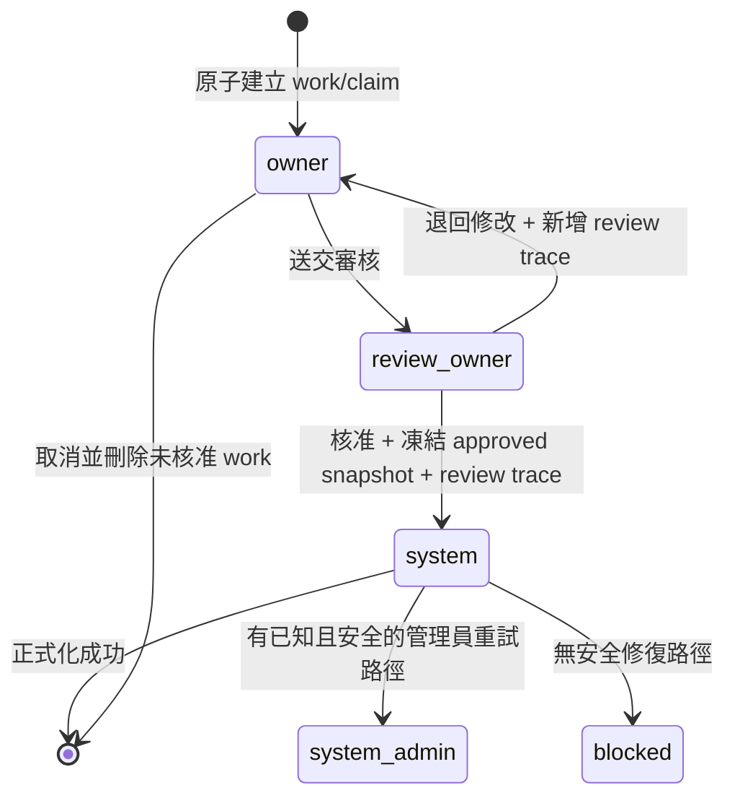

# SPEC-PDM-STATUS-DATA-REBUILD-001：三工作臺單一狀態權威、多研發分支與極簡人類語意

Status: `Local RD + Trusted-Solo QA-QC Complete / 94 of 94 Product Cases + 3 of 3 Quality Gates PASS / Primary Protected Invariant Unchanged / Production Zero-Loss Rehearsal & Release Gated`
Date: 2026-08-21; amended 2026-08-27
Owner: Dev PM
Related DEV: `DEV-087` / `DEV-PDM-STATUS-DATA-REBUILD-001`; historical anti-cheat child `DEV-097` / `DEV-PDM-QA-INTEGRITY-GATE-001`; CAPA children `DEV-092` / `DEV-PDM-DRAWING-WORK-FILE-SNAPSHOT-CAPA-001`, `DEV-094` / `DEV-PDM-SQLITE-MIGRATION-INTEGRITY-CAPA-001`, `DEV-100` / `DEV-PDM-DRAWING-WORK-FILE-REPLACEMENT-CAPA-001`
Related ADR: `.ai-doc/decisions/ADR-PDM-STATUS-DATA-REBUILD-001-single-current-state-authority.md`; DEV-098 amendment `.ai-doc/decisions/ADR-PDM-DRAWING-REVISION-BRANCH-LIFECYCLE-001-bounded-manual-minor-and-stale-freeze.md`
Related QA: `.ai-doc/qa/qa-dev-087-status-data-rebuild-validation-plan-2026-08-21.md`

## 0. Authority、成熟度與執行限制

本文件是 DEV-087 的 target-state 產品與 RD 實作契約。DEV-092與DEV-094的本機修復與fresh evidence保留為歷史基線；2026-08-25盤點確認的8項使用者journey已完成R1～R3接線並取得自動化證據。使用者於2026-08-27將local QA改為單人可信模式：DEV-097的G0-A／G4、Independent QC／AT receipt、mutant與evidence anti-cheat不再是completion gate；current契約是94個產品案例與provider／security／UI三個橫向Gate。正式資料、正式遷移、部署或刪除仍未授權，production zero-loss rehearsal／cutover／release仍受另行gateway管制。

2026-08-28 local completion：首版／進版FFF適用性矯正與八族漏接功能已由更新後source執行fresh trusted-solo aggregate，current結果為94/94產品案例、3/3 Quality Gates、Blocked/Not Run/FAIL=0；typecheck、isolated build、SQLite與disposable PostgreSQL、primary protected invariant及task-owned cleanup均PASS。exact run pointer與source fingerprint寫入DEV-087 completion receipt與`dev_task.md`，避免本normative source對自身run產生循環指紋。此結論不解除production migration、正式資料、cutover、deploy或release gate。

本規格的優先級如下：

1. 本規格與配對 ADR 是 DEV-087 啟用後的單一 target authority。
2. DEV-086 的雙 lane 實作在 DEV-087 啟用前仍是目前本機 runtime baseline；但其「每組最多兩列、只有一列 RD」會由本規格有意取代。
3. 既有 approval、revision、release、artifact、attachment、permission 與 domain identity 仍是業務證據；不得再自行投影另一套工作臺 current status。
4. 本機 Phase 1A-1D、canonical file-read、typed drawer projection、舊 runtime/route retirement與本機 legacy cleanup已實作；production cutover、deploy 與 release仍須另行明確授權並通過高風險 gate。
5. 若舊文件或舊code與本規格衝突，以DEV-087新決策為主；安全可拆的舊 current-state／filter／projection／command 必須在同一DEV移除，不保留雙軌相容。只有§11明示`Preserve`的domain evidence可留存。

### 0.1 2026-08-23 資料政策最終覆寫

本節取代本文件與所有舊 DEV-087 文件中的 `retained_legacy_source`、production discard、長期 quarantine 與永久 410 相容路徑：

- 正式 Cloud SQL PostgreSQL：每筆來源資料、關聯、審核時間與檔案引用都必須有唯一 target；`unresolved>0`、人工 mapping 未清空、source/target reconciliation 非 100% 或 hash 不符即阻止上線，禁止捨棄或以保留 legacy source 冒充完成。
- 本機 `data/ai-pdm.sqlite`：保留 canonical entity/work/revision/relation/file/preview；56 筆 quarantine 與其他舊 workspace graph可清除，不建立 legacy 備份。清理前後 canonical count／PK／FK／內容 hash 必須完全不變。
- 正式切換前須在正式備份的隔離還原環境完成兩次全量演練。正式維護窗需 freeze write、停止舊 worker、RPO=0 備份、exact commit/schema/provider核對；未開流量前任一 gate 失敗即回復 DB、app 與 authority control。
- cutover 通過後舊頁面、舊 API、舊 schema read、fallback 與 projector必須不存在；切換前關聯式備份保留90天只作災難回復，不是相容讀取權威。

### 0.2 DEV-090 Relation target-state supersession notice（RD Implementation Complete / Local QA-QC Complete / Production Gated）

使用者於2026-08-23決定：關聯矩陣改在Drawing／Part drawer直接編輯，明確儲存後立即更新正式關聯，不建立Relation work也不送審；圖料工作台、專用Relation workspace與Relation current work/review runtime將退役。完整target authority為`.ai-doc/specs/SPEC-PDM-INLINE-RELATION-MATRIX-001-direct-formal-edit.md`與配對ADR。

- 分類：`Intentional replacement`，不是DEV-087實作偏差。
- DEV-090 已完成本機實作、SQLite 清理與 focused QA/QC；正式 PostgreSQL provider parity、零遺失 rehearsal、cutover 與 release 仍 gated。
- 本文件中所有 Relation formal/work 列與 filter、Relation handling、change work、submit/review/formalize、Relation drawer owner surface、Relation command／transaction／query budget 及 current-state schema 條款，均標記為 `Historical / Superseded by DEV-090`，不得再作為現行實作或驗收契約。
- Drawing與Part本身的production/RD、formal/work、review、file、preview、history、permission及最多三個Drawing branch契約不變。
- `drawing_part_links`、same-root/company validation、每個Part最多一張主要製造圖及已完成歷史Relation evidence繼續保留。
- 現行 local runtime 已採 Drawing／Part drawer 的 inline matrix direct edit；圖料工作台、Relation workspace、Relation current work/review runtime 與舊 Relation mutation route 已退役。正式環境仍須依 DEV-090 migration gate 完成切換，不得以本機 PASS 代替正式證據。
- 正式切換必須遵守§0.1零遺失政策，且 active Relation work/review/apply_failed、ambiguous pair 與 unresolved 全部為0；禁止自動套用未核准 work 或捨棄正式資料。

### 0.2.1 Relation current contract boundary

自本 amendment 起，Relation 不再是 current workbench row。現行 Relation authority 只有 `drawing_part_links` 正式關聯、其矩陣投影與必要歷史稽核證據；新流程在 Drawing／Part drawer 以單次明確儲存直接更新正式資料，不建立 work、review、approval task 或 approved snapshot。`.ai-doc/specs/SPEC-PDM-INLINE-RELATION-MATRIX-001-direct-formal-edit.md` 是 Relation 的唯一 current contract；本文件後續仍保留的 Relation 條文只作 migration provenance，實作、QA、QC 與 fresh-session 導讀不得引用。

### 0.3 2026-08-24 DEV-092 CAPA 重開：migrated Drawing work 檔案快照完整性

唯讀調查確認A0006-M01 revision `0.1`有PDF／SLDDRW／SLDPRT共3筆未移除`drawing_revision_files`，對應assets與physical bytes存在；current migrated work `dcf65c1a-3ede-4fba-a473-f3cf5ef6d6c5`卻沒有任何`drawing_revision_work_files`。work API因此回空files，preview與recognition的source set成為空集合；既有`candidate_revision` recognition session雖有3 sources／27 candidates／29 observations，也因current workspace要求`drawing_revision` exact context與source set而不能安全重用。

治理判定：

- 類型=`Implementation defect + migration verification control failure`；不是檔案遺失、OCR模型失效或新的架構選擇。
- `scripts/migrate-dev-087-canonical-workbench.mjs`建立branch／claim／work／state時漏建work-file child rows；既有fixture、zero-loss與completion audit沒有驗證每個migrated work的exact file-set equality，造成完成率誤判。
- 2026-08-23 aggregate、file-read、retirement與UI結果保留為歷史證據；重開初期的IAB client確實未發出A0006 recognition request，故當時`QA-087-185`暫列BLOCKED。後續 isolated fresh-auth Playwright已完成17/17，current status依本節2026-08-24 amendment更新為PASS。
- ADR=`No New ADR`。既有work-owned snapshot authority不變；禁止以UI直接讀revision files作fallback，也不得恢復legacy workspace／file-read authority。
- 本機converter／repair／fixture可依DEV-092執行；主SQLite apply必須先有全量dry-run與明確target核對。任何正式PostgreSQL資料修復、rehearsal、cutover、deploy或release仍須獨立高風險授權。

2026-08-24 implementation amendment：`scripts/migrate-dev-087-canonical-workbench.mjs`現以`dev090-v1` authority hash產生version 2 plan，建立新Drawing work時同時寫入ordered work-file snapshots，對既有`proposed_payload.migrated=true` work支援`--repair-work-files` forward repair；SQLite與PostgreSQL皆以`(work_id,file_binding_id,ordinal,content_hash)`驗證。主SQLite dry-run／apply的identity hash為`d3457b48fe171f9a13357927ecb2ea99ee9d378b977a4ae5b47123c8d5641623`，A0006 work-file count=`3`、FK violations=`0`；`qc:dev-092:work-file-snapshot`、`qc:dev-092:runtime-invariant`、`qc:dev-092:recognition-context`、`qc:dev-087:zero-loss`與disposable PostgreSQL 0／1／3 rehearsal已PASS。isolated fresh-auth browser已驗證A0006 exact 3 files、PDF preview、recognition GET／POST、exact `drawing_revision` context與3 source assets，QA-087-185已解除BLOCKED；正式資料、遷移、部署或刪除仍須另行授權。

### 0.4 2026-08-25 DEV-098 revision／branch lifecycle amendment（RD Implementation Ready / RD Not Started）

使用者以`HD-098-01 = 1C-bounded／HD-098-02 = 2A／HD-098-03 = 3A`確認canonical Drawing的新版次政策。
current product authority為
`.ai-doc/specs/SPEC-PDM-DRAWING-REVISION-BRANCH-LIFECYCLE-001-unified-revision-and-branch-flow.md`與
`.ai-doc/decisions/ADR-PDM-DRAWING-REVISION-BRANCH-LIFECYCLE-001-bounded-manual-minor-and-stale-freeze.md`。

- §3.2與§4.1第2／3項的「target candidates只能由server演算法計算」改為：server推薦仍是預設；一般RD可在
  exact non-stale source所屬整數主版次下只輸入minor suffix。major prefix、完整label、predecessor與最終合法性
  仍由server決定；manual minor可跳未使用suffix，但必須嚴格大於source predecessor minor、全Drawing tuple未占用。
- §4.1第9項的「stale branch可沿自身lineage續minor」被有意取代。production前進後stale branch一律freeze，
  不提供recommended／manual minor或major；只能查看、合法cleanup、申請作廢或從current production另開新branch。
- freeze涵蓋target後的既有work：`owner`只讀＋cancel，PATCH／file與辨識create／decision／rerun／formalize皆拒絕；
  stale前已受理的extract可保存evidence但不得正式化或回寫work payload；`review_owner`只可return且approve在begin system前拒絕；
  `system／system_admin／blocked`存在時其他branch不得major adoption。所有mutation共用derived
  `basisState=current／stale／preproduction`，不新增persisted branch status。
- pre-production只接受無current production、branch base=null且source=`0.x`；可續`0.y`或由server提出第一個major `1`。
  其他null basis fail closed，不補假production 0。
- §9.2／§9.3 create contract須支援`recommended`與`manual_minor`discriminated mode；兩者共用aggregate lock、
  global tuple claim、branch cap、row version、contract token、idempotency與zero-write failure。manual request不得帶major。
- Drawing create／approve／formalize／void固定先鎖aggregate，再鎖current production、source、exact branch與claim；
  PostgreSQL branch必須獨立鎖定，不得對LEFT JOIN nullable side使用`FOR UPDATE`。
- major target仍只由server產生，minor仍不得成為`Released`。major核准與所有人類／API／audit詞彙固定為
  `採用為量產版`，不得把status-only promotion稱為merge。
- 本amendment是`Intentional replacement + compatible preservation`：canonical state、最多三branch、claim、work、
  review、artifact與provider parity全部保留。DEV-098已完成repo/file／wire／validator／transaction、FMEA與fixed
  `QA-098-001..031` readiness；schema／migration=`none`。產品仍尚未實作，現行auto-only／stale candidate程式不得被
  誤報為已符合新契約。

### 0.5 2026-08-26 DEV-100 CAPA：migrated work 合法替換後的 mutable snapshot invariant

A0044-M01 work `c65d1134-44d1-49d1-a689-74d83e75174a`在依序上傳`A0044.SLDASM`、`A0044-M01.pdf`、`A0043.SLDASM`後，三筆upload均成功，但後續work GET回`409 DRAWING_WORK_FILE_SNAPSHOT_INVALID`。唯讀事實確認第三檔與第一檔同屬primary `cad_3d`，既有last-wins command合法將`A0044.SLDASM`標記為`drawing_revision_work_file_replaced`，目前active set是`A0043.SLDASM + A0044-M01.pdf`；三個physical files與hash均存在。失效原因是migrated-only read invariant仍以immutable migration source假設掃描所有source rows，把合法replacement tombstone誤判為`source_asset_invalid`。

治理裁定如下：

- 類型=`Implementation defect + transition verification control failure`；不是檔案遺失、SolidWorks格式問題、組立件需要另一個入口或Part structure type所致。
- Spec Impact=`Compatible CAPA amendment + implementation correction`；ADR=`No New ADR`。現行Drawing work-owned snapshot、每個exact work一個primary 3D、DEV-095 `.SLDASM`合法性及DEV-096 Future Phase parser邊界不變。
- active source set只包含`removed_at IS NULL`且asset仍live的rows；actual work bindings須與active expected set在company／drawing／revision／binding／ordinal／hash完全相等。
- tombstone只能在沒有active binding引用、刪除原因屬allowlisted work command且可追溯時排除expected。active deleted/missing asset、missing／extra binding、hash／scope／ordinal drift仍fail closed；不得以「忽略所有deleted rows」通過。
- same-role replacement必須在同transaction或commit-success前通過同一post-write invariant；若immediate read會失敗，upload不得先回成功。response loss／retry沿用idempotency與rowVersion，禁止重複replacement與orphan asset。
- client load 409時不得繼續渲染載入前的stale empty files或錯誤readiness；工作區凍結upload／remove／submit，只顯示一項可行動修復訊息。單批包含多個primary 3D時，提交前以exact filenames明示後檔會取代前檔，不增加route／wizard。
- A0044資料修復與程式修正分離：code、isolated provider與browser QA可直接執行；primary SQLite apply前必須backup、fingerprint、dry-run，並由人類選擇保留目前`A0043.SLDASM`或恢復`A0044.SLDASM`。未選定不得依檔名根號或上傳順序猜測。
- PDF保持active non-primary；current submit contract仍要求native primary `.SLDDRW`與primary `.SLDPRT/.SLDASM`。本CAPA不把PDF升格、不解析assembly children、不建Part／BOM、不自動分類structure type。
- effectiveness固定由主QA §28 `QA-100-001..018`、SQLite／disposable PostgreSQL、authenticated exact three-file browser、old-validator與skip-all-deleted雙mutant、fresh aggregate與Independent QC證明。PM文件或單純不再出現409不得算CAPA有效。

2026-08-26 implementation closure：repository已改為共用pure snapshot classifier，對active binding保持company／drawing／revision／binding／ordinal／hash嚴格一致，僅接受無active引用且actor／reason可追溯的allowlisted replacement／removal tombstone；upload與remove在transaction返回前執行同一post-write gate。workspace load失敗會清除stale data／token並凍結mutation；同批多primary顯示exact filename replacement chain。PostgreSQL rehearsal另修正`043_inline_relation_matrix.sql`在drop legacy relation tables後仍由`dev087_guard_company_reference`引用舊表的surviving-function缺口，不改現行Drawing／Part-only authority。fresh evidence=`output/qa/dev-100/DEV100-2026-08-26T11-50-35-191Z/manifest.json`為18/18；A0044 primary repair仍為Human-Gated、apply count 0。

## 1. 問題與成功結果

現況把 `record_status`、workspace lifecycle、approval、release、human status、viewer status、responsibility、availability 與 lane label 同時當成可見狀態來源，造成：

- 同一列同時出現「研發最新版」與「量產版可使用」等互斥結論。
- 「工作狀態／資料狀態／版本列」三個 filter 代表不同軸，卻使用近似文字。
- 只有一列 RD 的設計會在平行設變時隱藏其他仍需處理的研發分支。
- 未正式化的 0.1 被補出假的量產列，形成 A0005 類型重複。
- 取消、退回、審核、正式化失敗與舊資料 fallback 由不同 projector 各自判定。

成功結果：

- 人類第一層只回答「這是什麼、哪個資料層／版次、目前是哪個角色處理」。
- 圖號同一群組顯示一列量產版，加上每個 current RD branch 各一列最新版；同一圖號最多三個 open RD branches，因此最多顯示四列。
- 料號沒有版本或分支，只各有一份正式資料及最多一份 current work；圖料根號不再建立 workbench current row，關聯只由 `drawing_part_links` 正式矩陣提供。
- list、drawer、filter、editor/reviewer entry 都讀同一 canonical state，不再 client-side 合成。
- Drawing／Part核准後自動更新正式；Relation矩陣由DEV-090單次儲存即正式生效。任何失敗時既有正式資料持續有效。
- 舊 current-state authority 在同一 maintenance window 通過 gate 後立即退役，不保留永久雙權威。

## 2. 人類 UI 契約

### 2.1 第一層唯一資訊

| 重要性 | 資訊 | 規則 |
|---|---|---|
| 高 | 編號 | 圖號／料號／圖料根號各顯示自己的主識別 |
| 高 | 品名 | 單行；不得加變更摘要、人名或時間第二行 |
| 高 | 資料層／版次 | Drawing=`量產版 {revision}`／`研發版 {revision}`；Part=`正式資料`／`修改中`；Relation 語意已由 DEV-090 inline matrix 取代 |
| 高 | 處理狀態 | 正常留空；只使用固定角色語意 |
| 中 | 受阻原因 | 清單只顯示`受阻`；drawer 條件式顯示一項人類原因 |
| 低 | 無 | 低重要性技術資料完全不進一般 UI |

固定處理語彙：`負責人處理`、`審核負責人處理`、`系統處理`、`系統管理員處理`、`受阻`。不得依登入者改成你／我／他，也不得顯示姓名。

禁止出現在 list、drawer、一般 editor、filter、tooltip、popover、DOM accessible name 與空狀態文案的資訊：變更摘要、處理人、時間、package、baseline、workflow、approval、raw database status、internal ID、branch ID、predecessor/source、ledger 與 effect key。

### 2.2 清單列數與分組

Drawing group：

```text
量產版：目前唯一 production-effective revision（若存在）
研發版：每個 open branch 的 latest revision 各一列（0..3）
```

不變量：

1. 同一 `company+drawing` 可有 0/1 列量產與 0..3 列研發；`open` branch hard cap=`3`。
2. 每個 branch 只顯示自己的 latest revision；branch 內舊版進歷史。
3. production 固定第一列；其後為可處理 RD，再來是 idle RD；各區以 revision comparator 排序。
4. 整個 drawing group 是單一 pagination unit，不得跨頁拆分。
5. row-level filter 先執行；只保留符合列，不自動帶出 companion production 或整組。
6. Part 各最多一列正式與一列 work；Relation 不再產生 current workbench row，首次或空 root 只由合法搜尋結果辨識。

### 2.3 Filter

- Drawing：`版本＝全部／量產版／研發版`。
- Part：`資料＝全部／正式資料／修改中`。
- Relation filter、列與狀態語彙已由 DEV-090 退役；矩陣不新增 URL filter。
- 三者共用：`處理狀態＝全部／負責人處理／審核負責人處理／系統處理／系統管理員處理／受阻`。
- filter 必須精確命中列；搜尋、filter、sort 都在 group pagination 前由 server 執行。
- 舊狀態型 URL 不相容。偵測到 retired query vocabulary 時顯示`此篩選網址已失效`，使用者返回新工作臺；不得靜默轉譯舊語意。

## 3. Canonical Data Model

### 3.1 Current state aggregate

下列 type與`canonical_workbench_states`名稱固定；正式DDL、必要欄位與約束依§3.1.2，不得由migration另取同義名稱：

```ts
type WorkbenchEntityType = "drawing" | "part";
type HistoricalWorkbenchEntityType = WorkbenchEntityType | "relation";
type DataLayer =
  | "drawing_production"
  | "drawing_rd"
  | "part_formal"
  | "part_work"
  ; // Relation layers are historical only; see DEV-090 current contract.
type Handling =
  | "none"
  | "owner"
  | "review_owner"
  | "system"
  | "system_admin"
  | "blocked";
```

正式 table 名固定為 `canonical_workbench_states`，最小欄位：

- `id`, `company_id`, `entity_type`, `canonical_entity_id`
- `data_layer`
- `branch_id`：只允許 `drawing_rd`
- `revision_id`：只允許 Drawing layer
- `work_id`：只有 active work 才存在；idle approved RD branch 可以為空
- `handling`, `blocker_reason`
- `row_version`, `created_at`, `updated_at`

唯一鍵：

| 範圍 | 唯一鍵 |
|---|---|
| Drawing production | `company + drawing + drawing_production` |
| Drawing RD | `company + drawing + branch_id` |
| Part formal/work | `company + part + data_layer` |
| Relation current row | 不存在；`drawing_part_links` 是唯一正式矩陣 authority |

禁止把 revision text、updated_at、display code 或 client choice 放進 stable row identity。

### 3.1.1 Dedicated work authority

DEV-087 不延用 `numbering_draft_workspaces` 作為新 current-work authority。新系統只建立 Drawing 與 Part 的專用 work table；Relation work table 僅是遷移期間的歷史來源，activation 後退役：

| Table | Stable owner | 唯一 active work | 必要內容 |
|---|---|---|---|
| `drawing_revision_works` | `company + drawing + branch` | `company_id + branch_id` | `work_kind=revision_change`、target claim、exact predecessor、owner、work-owned drawing data/file bindings、base hash、row version |
| `part_change_works` | `company + part` | `company_id + part_id` | `work_kind=create_or_update`、owner、validated proposed Part DTO、base formal row version/hash、row version |
| `relation_change_works` | `company + root` | 歷史遷移來源；不再是 runtime authority | DEV-090 activation 前的 legacy current work；不得由新 UI/API 建立或讀取 |

共同規則：

- work table 不另存一套可供 UI／filter 判定的 lifecycle enum；work 是否可編輯、審核或正式化只由 `canonical_workbench_states.handling` 決定。work table 只保存 domain work copy、owner、optimistic concurrency與exact snapshot來源。
- canonical row 的 `work_id` 必須以 domain＋company-compatible FK 指向 Drawing 或 Part 專用 work；Relation 不再有 current row 或 work FK。
- Part approved before/after snapshot 使用獨立 immutable snapshot table；既有 Relation approved snapshot 只作歷史唯讀證據，DEV-090 新儲存不產生 snapshot。Drawing approved evidence仍由 Drawing revision/file authority保存。
- legacy `numbering_draft_workspaces` 只有在company、owner與單一target entity均可唯一證明時才轉入一個專用work；同時含多個無法安全拆分的Part／Root／Drawing target時進quarantine，不得猜測或讓一份legacy workspace同時成為多個current work。
- converter完成後，三工作臺及其editor/reviewer route不得再以legacy workspace identity判斷current work；舊workspace若因其他domain evidence被保留，也不得驅動canonical handling。
- 新建work時，work-owned file snapshot必須在同一transaction由該work exact source revision複製；每筆保存原`drawing_revision_files.id`、原`sort_order`與對應`file_assets.content_hash`。source revision為合法零檔時target可為空；source有檔時不得建立空或partial work-file set。
- 對`proposed_payload.migrated=true`且仍由current canonical state指向的Drawing work，converter／forward repair必須證明ordered tuple set `(file_binding_id, ordinal, content_hash)`與exact source revision的所有未移除files完全相等。source revision只能由work payload／exact canonical state證明，禁止用global latest、revision字串或同圖號猜測。
- runtime只讀`drawing_revision_work_files`作current work的檔案authority。若migrated work expected/actual set不一致，service須fail closed並回stable anomaly code；UI顯示一項精簡可行動錯誤，不得誤投影成合法「尚無檔案」，也不得直接fallback到revision files。真正expected=0維持既有empty state。

### 3.1.2 Exact provider-neutral schema contract

Cloud SQL PostgreSQL migration 固定為 `db/postgres/042_status_data_rebuild.sql`；`041` 為後續DEV-088保留但目前尚不存在的編號，DEV-087 不得覆寫或重新編號。SQLite authority 固定為 `db/schema.sql` 與 `src/lib/db.ts#ensureDev087CanonicalWorkbenchSchema`。現有singleton runner允許version gap，因此042必須可在只有001..040時獨立apply，不得FK/查詢任何DEV-088 future proposal tables；未來若041經DEV-088重新核准而存在，package排序為041→042，若042已先套用，runner也必須能補套041而不改寫042 checksum/schema。`db/postgres/README.md`須登記此reservation/independence、apply/verify/forward-fix契約；Supabase與archived mirror不是target。

以下名稱、key、必要欄位與約束是實作契約，不再留給 RD 自由改名；可增加純技術 index／timestamp，但不得新增另一個 lifecycle/current-state authority：

| Table | 必要欄位 | PK／唯一鍵與硬約束 |
|---|---|---|
| `pdm_workbench_state_authority_control` | `id, mode, expected_commit, schema_hash, row_version, switched_at` | `id=1`唯一；`mode in (legacy_only,shadow_compare,cutover_window,canonical_only)` |
| `pdm_workbench_aggregates` | `id, company_id, entity_type, canonical_entity_id, open_branch_count, row_version, updated_at` | PK=`id`；唯一=`company_id+entity_type+canonical_entity_id`；Drawing count `0..3`，非 Drawing 固定 `0` |
| `drawing_rd_branches` | `id, company_id, drawing_id, base_production_revision_id, latest_approved_revision_id, status, closed_reason, closed_at, row_version` | `company_id+id`唯一；`status in (open,historical)`；close 欄位與 status 組合 CHECK |
| `drawing_revision_claims` | `id, company_id, drawing_id, branch_id, target_major, target_minor, target_label, predecessor_revision_id, claim_state, created_at` | 唯一=`company_id+drawing_id+target_major+target_minor`；production用`target_minor=0`，RD用`>=1`，兩欄皆NOT NULL且非負，避免NULL唯一鍵穿透；`claim_state in (work,approved)`；approved claim 不可 update/delete |
| `drawing_revision_works` | `id, company_id, drawing_id, branch_id, target_claim_id, owner_user_id, proposed_payload, base_hash, row_version, created_at, updated_at` | 每 `company_id+branch_id`最多一列；target claim一對一；owner/company 必填 |
| `drawing_revision_work_files` | `work_id, file_binding_id, ordinal, content_hash` | PK=`work_id+file_binding_id`；只允許 work-owned binding；approved artifact不得指向此表；新建／遷移／repair另須遵守§3.1.1 exact source-set application invariant，因DB最小child count本身不能證明集合完整 |
| `part_change_works` | `id, company_id, part_id, owner_user_id, proposed_payload, base_formal_row_version, base_hash, row_version, created_at, updated_at` | 每 `company_id+part_id`最多一列；payload通過 Part DTO validator |
| `relation_change_works` | Historical only | DEV-090 activation 後必須不存在於 target schema；本機可清除，正式環境須在零遺失 reconciliation 後退役 |
| `canonical_workbench_states` | `id, company_id, entity_type, canonical_entity_id, data_layer, branch_id, revision_id, work_id, handling, blocker_reason, row_version, created_at, updated_at` | §3.1四類唯一鍵；layer/reference/handling/blocker組合 CHECK；work/company/domain一致 |
| `pdm_work_review_requests` | `id, company_id, request_kind, entity_type, canonical_entity_id, work_id, branch_id, reviewer_user_id, review_cycle_id, snapshot_payload, snapshot_hash, request_status, row_version, created_at, updated_at` | `review_cycle_id`唯一；每 work 或 branch-void最多一個 active request；status只允許`pending,applying,apply_failed` |
| `pdm_review_traces` | `review_cycle_id, company_id, entity_type, canonical_entity_id, decision_at` | PK=`review_cycle_id`；DB trigger禁止 update/delete；不得新增 reviewer/outcome/comment/revision/content 欄位 |
| `part_approved_change_snapshots` | `id, company_id, part_id, before_payload, after_payload, content_hash, formalized_at` | immutable；hash唯一驗證內容；只供 backend evidence |
| `relation_approved_change_snapshots` | Historical evidence | immutable；保留既有資料作追溯，不由 DEV-090 新增 |
| `pdm_workbench_migration_quarantine` | `id, company_id, source_kind, source_identity, reason_code, evidence_payload, resolution, resolved_at` | source identity唯一；cutover要求未解決數=0；不進一般 UI |

跨 provider 表示：JSON 在 PostgreSQL 使用 `JSONB`，SQLite 使用 `TEXT CHECK(json_valid(...))`；時間在 PostgreSQL 使用 `TIMESTAMPTZ`，SQLite 使用 UTC ISO-8601 `TEXT`；boolean 在 SQLite 使用 `INTEGER CHECK(value in (0,1))`。所有 enum 以 CHECK 維持兩 provider 同一合法值集。所有 child row 必須由 composite FK或等價 DB trigger驗證 same-company；只做 application check 不合格。必要 index至少覆蓋 list scope (`company+entity_type+data_layer`)、Drawing group (`company+drawing+branch/status`)、active request reviewer inbox (`company+reviewer+request_status+created_at`) 與 formalization retry (`request_status+updated_at`)。

`platform_command_receipts`沿用作 DEV-087 idempotency receipt，namespace 固定 `dev087:<command>`；`platform_outbox_events`沿用作 formalization delivery。兩者是 transport/effect evidence，不得投影 UI handling。若其既有欄位無法保存 request hash、stable result與effect key，RD必須以 042 additive column補足，不得另建第二套 receipt/outbox。

### 3.2 Drawing branch 與 revision claim

每個 Drawing RD branch 有不可變、UI 隱藏的 `branch_id`。每個 revision 必須儲存 exact `predecessor_revision_id`；不得從 `1.1` 字串或排序推測來源。

`drawing_rd_branches`至少保存`id／company_id／drawing_id／base_production_revision_id／latest_approved_revision_id／status／closed_reason／closed_at／row_version`。`status`只允許`open／historical`；`closed_reason`只在historical時允許`production_promoted／latest_rd_voided`。

另建立每個`company + entity_type + canonical_entity_id`唯一的`pdm_workbench_aggregates`鎖定列，保存`open_branch_count`且DB CHECK固定為`0..3`。PostgreSQL以該列`SELECT ... FOR UPDATE`；SQLite以write transaction鎖定並執行條件式count更新。建立新branch必須先以`open_branch_count < 3`條件原子加一，再建立branch/work/claim/state；affected row=0即回branch limit。branch由open轉historical時只允許CAS一次並在同transaction減一，任何underflow／double decrement均由DB拒絕。即使尚無production或canonical row，aggregate lock row仍是固定競爭點。

branch 狀態只治理是否仍投影 current row：`open` 或 `historical`。branch 本身不是人類工作狀態。

所有 work target 先取得 `drawing_revision_claim`：

- 唯一鍵為 `company + drawing + target_revision`，跨 branch 全域唯一。
- 目標確認與 work 建立在同一 server transaction 完成；先 commit 者取得 claim。
- loser 回傳「目標版次已被占用」並刷新可選候選；不得自動換 branch 或 redirect 到別人的 work。
- 未核准 work 取消時刪除 claim，target 可重用。
- 核准後 claim 永久化，該 revision 不得重用。

revision 不使用十進位浮點運算，而是解析為 tuple：production=`M`，RD=`M.n`；第一個 production 前的 RD 為`0.n`。

DB tuple canonicalization固定：production `M`存為`(target_major=M,target_minor=0)`；RD `M.n`存為`(M,n)`且`n>=1`。label只由server formatter產生，不參與比較或唯一性；任何含前導零、負值、空minor、浮點或非canonical label的client輸入都拒絕。

- 從目前 production `M`建立新 branch 時，server推薦固定為下一個 production `M+1`及下一個未被 claim 的 RD `M.n`；RD minor 從`n=1`向上找最小可用值。RD另可依DEV-098只輸入同major `M`下未占用且大於0的manual minor suffix。
- 從 RD `M.n`沿同 branch 進版時，server推薦為大於`n`的最小未被claim minor；若base仍等於目前production，RD也可輸入同major、嚴格大於`n`且未占用的manual minor。只有該branch base仍current時才可同時提出server產生的production `M+1`；stale時所有target均停用。
- 下一個 production `M+1`若已被任何 branch claim，不得跳號提出`M+2`；UI 顯示該目標不可用並要求先處理既有分支。
- 每個 branch 的 `base_production_revision_id`在 branch 建立時固定，供 server 驗證是否已 stale；此欄位只在 backend 使用，不進 UI。

open branch cap 契約：

- `open`計數包含 active owner/review/system/system_admin/blocked branch 與已核准但 idle 的 RD branch；同 branch 繼續進版不新增名額。
- 新 branch 建立必須鎖定 `company+drawing` canonical aggregate，在同一 transaction 內重新計數並建立 branch/work/claim；三個名額由先 commit 者取得。
- 第四個新 branch 必須原子拒絕，錯誤碼=`DRAWING_RD_BRANCH_LIMIT_REACHED`，人類文字=`已有 3 個研發分支，請先完成其中一個`；不得建立孤兒 claim、work 或 canonical row。
- production promotion 只把實際來源 branch 轉為`historical`並釋放一個 open 名額；其他 open branch 仍留在清單。
- latest approved RD作廢正式化成功時，來源branch以`closed_reason=latest_rd_voided`轉為`historical`、移除RD canonical row並釋放一個open名額；approved revision identity、claim與artifact仍保留且不可重用。
- migration 若發現同一圖號超過三個 open branches，全部進 quarantine，禁止隱藏、截斷或自動刪除；cutover 前必須依可驗證證據完成歷史化／合併處置且 unresolved=0。

### 3.3 Review trace 與已核准證據

每次 reviewer 實際按下`核准`或`退回修改`才建立一筆 immutable review trace。開頁、owner 送審與自動處理不計次。

最小保留欄位只供 backend 追溯審核次數與時間：`review_cycle_id`、company/entity reference、`decision_at`。不得保存 reviewer、outcome、revision text、comment 或工作內容副本作為這個最小 trace；不得在 UI 呈現。

- 退回後沿用同一 work copy，但下次送審建立新的 `review_cycle_id`。
- 已產生的 review trace 即使 work 之後取消仍永久保留。
- Drawing 核准版本永久保存完整受控版本、檔案、預覽與 identity。
- Part／Relation 每次核准永久保存完整 before/after data snapshot；只在 backend 稽核／修復使用，不進一般 UI。

### 3.4 審核工作臺 adapter 與暫存資料生命週期

DEV-087 不把永久決策寫入既有 `approval_platform_decisions`。該表會保存 reviewer、decision、comment 且有 immutable trigger，與本案 minimal trace 明確衝突。採用下列單一解法：

1. `/approvals`與`/approvals/[requestId]`仍是人類的審核入口，但 DEV-087 inbox row 由 `pdm_work_review_requests` adapter 提供；approval platform只負責聚合、搜尋、選取、returnTo與導航，不成為 DEV-087 decision storage authority。
2. `pdm_work_review_requests`是 active-review 暫存資料。它可以保存 exact reviewer、snapshot、request kind 與 apply failure，因為這些是完成審核與安全正式化所必需；不得把這些欄位複製到永久 `pdm_review_traces`。
3. `退回修改` transaction：驗證 exact reviewer／request／row version → 寫一筆 minimal trace → canonical handling回`owner` → 刪除 request與review snapshot。下次送審產生新 cycle與新 request。
4. `核准` transaction：驗證 exact reviewer／request／row version → 寫一筆 minimal trace → request切`applying`且canonical handling=`system`。formalization成功後刪除 request/snapshot；失敗時暫存 request保留為`apply_failed`以支援 exact retry，修復成功後立即刪除。
5. request刪除不等於刪除正式證據：Drawing approved revision/artifact或Part/Relation approved snapshot才是永久業務證據。所有永久 review trace仍只回答審核次數與時間。
6. 既有 `/api/approvals/requests/[requestId]/decisions` 只接受 `approved|rejected|needs_info`，不得為相容而扭曲 DEV-087 語意。DEV-087 使用 §9.2 的新 decision route；approval inbox adapter只回 server-owned href。
7. 其他 approval domain 繼續使用既有 request/decision tables、handler與歷史，不做搬移或刪除。
8. 「active review暫存」限制適用所有持久化旁路，不只request table。DEV-087 decision command在return或formalize success後，`platform_command_receipts`只能留下content-free stable acknowledgement、request hash／effect key等必要technical projection；generic `actor_id／platform_principal_id`須對DEV-087 terminal decision去識別。已published outbox須刪除或安全縮減payload，`last_error`只留fixed code；audit detail、application/worker log、telemetry與error payload不得保存或可反推出reviewer、decision、comment、revision text、snapshot或work content。其他approval domain既有audit/evidence不受此條刪除。
9. initial decision與active replay都必須在查用receipt前重驗company、action permission與exact active reviewer。terminal replay因request已清除，只能在登入、same-company與decision action permission通過後回content-free stable acknowledgement，不得hydrate已刪request、reviewer、decision或snapshot；cross-company、未授權actor及不同payload/key scope一律fail closed。
10. full DB backup屬受控operational recovery evidence，不是review business trace。backup manifest必須列出備份時間點的active transient request數、加密／存取／90-day expiry與restore後隔離限制；terminal狀態建立的備份必須通過同一forbidden-data scan。含active request的pre-terminal backup不得掛回一般runtime或作UI／analytics來源。

## 4. Domain Lifecycle

### 4.1 Drawing branch rules

1. 從 production row 建立任何 target 時建立新 branch；從 RD row 繼續進版時沿用該 branch。
2. production、non-stale RD與合法pre-production row可顯示`進版`；server推薦由§3.2演算法計算。RD可依DEV-098切換manual minor，但UI只提交suffix，major／label／predecessor與合法性仍由server決定。
3. 例：production 1可選server推薦production 2、RD 1.1，或manual RD 1.x未占用suffix；non-stale RD 1.1可選推薦1.2、較大的未占用manual minor，且base仍current時也可選server production 2。
4. 新 branch 只可在 open branch 少於三個時建立；達三個時 production row 的`進版`停用並顯示固定原因，既有 branch 的`進行編輯`或同 branch 進版不受名額限制影響。
5. 即使 target 是 major 2，核准前仍顯示`研發版 2`；核准並正式化成功後才成為`量產版 2`。
6. 核准 minor／RD revision 只把該 revision 正式化為受控 RD，branch 保持 open idle、handling=`none`；不得改 production row。
7. 核准 production target 後，只有在 branch base 仍等於 current production 且 claim/snapshot 都有效時，才原子切換 production row並將來源 branch轉 historical。
8. production 從其他 branch 前進時，無關的 open RD branch 保持 current，例如 production 2 與 RD 1.1 可同時存在；這類 branch 是 stale branch。
9. stale branch一律freeze，不得建立recommended／manual minor或production target。read model先投影非敏感`basisState`：idle row只保留查看、合法時申請作廢及從current production另開；owner work唯讀且只可cancel；review只可return。dialog stale recovery只防載入後race；不得顯示branch/source/predecessor技術資料。
10. 不因建立新 branch 或新 work 收合其他 branch；最多三個 open branch latest 都必須顯示。
11. 每個 branch 最多一份 active work；不同 branch 可並行處理。
12. 已核准 RD revision 不可直接編輯；必須建立下一 revision。
13. production target claim 被占用時，不得跳到未來 major；回傳`DRAWING_TARGET_REVISION_CLAIMED`並刷新 server candidates。
14. 本phase實作`申請作廢`：只允許`handling=none`、已有latest approved RD且沒有active work的open branch提出。申請建立exact latest-revision snapshot並直接進`review_owner`；不建立新revision、不取得新claim。reviewer退回時request結束、branch維持open idle且可重新申請；核准後進`system`並自動正式化。
15. 作廢正式化成功時，latest approved RD被標為不再有效，整個branch轉`historical(closed_reason=latest_rd_voided)`、RD current row移除並原子釋放一個branch名額。該branch所有revision不再構成current有效版次，但approved identity、不可重用claim、受控檔案與歷史artifact永久保留；不得實體刪除approved artifact。
16. 已historical branch不可reopen。未來若要從production或其他current RD續作，必須依一般規則建立新branch_id；不得復活已作廢branch。

### 4.2 Part

- `正式資料`是生產持續使用的資料；`修改中`是唯一 current work copy。
- 首次建立沒有正式資料時只顯示`修改中`。
- 同一 Part 全域最多一份 work；atomic create loser 導向既有 work。
- Part 欄位修改納入 review；核准後原子更新正式並移除 work row。
- Part attachment 的獨立即時生效由DEV-087直接定義並沿用現行附件authority；不進修改案、不隨取消 rollback、也不是審核內容。reviewer 在唯讀頁看到當下最新 live attachments，須明示它們不屬本次核准 snapshot。DEV-087不得提前實作後續DEV-088尚待縮編的替代料號附件沿用、binding/version/content模型、權限重建或whole-part lease。
- Part attachment 主入口固定為`料號工作台 → 選取料號 → 右側明細「附件」→ 管理附件`。附件 section 在空清單時仍須顯示；只有 server permission projection 確認 `numbering.attachments.manage` 時才顯示管理動作。管理動作進入獨立全頁 `/parts/{partNumber}/attachments?returnTo=...`，不可塞入巢狀 modal/drawer；頁面沿用既有 API 支援多檔上傳、受控下載、soft-delete 與 restore，不提供人工附件分類欄位。既有 API／資料欄位保留相容性，未帶分類時由 server 使用既定 fallback。owner 料號編輯頁連到同一管理頁；reviewer 只看 live list與排除提示，不顯示管理入口。
- 首次建立且尚未送審的 work 取消時移除 work row；編號是否回收完全委派既有 numbering authority，DEV-087 不另創回收規則。

### 4.3 Relation

- `正式關聯`是生產持續使用的 root→drawing→part tree；`調整中`是唯一 current work copy。
- 首次建立沒有正式關聯時只顯示`調整中`。
- 同一 root 全域最多一份 work；atomic create loser 導向既有 work。
- editor 只做新增、移除、調整；送審 confirmation 列出 exact removal nodes。
- 沒有 root revision、歷史版次、共同檔案或 root-level attachment。
- 核准後原子更新正式關聯並移除 work row。
- 首次建立且尚未送審的 work 取消時移除 work row；根號／編號是否回收完全委派既有 numbering authority。

### 4.4 Terminal lifecycle boundary

DEV-087 的 canonical workbench 只維護 current work、review、formalization 與 Drawing RD branch close；整體圖號、料號或圖料根號的 obsolete／merged 仍由既有 numbering authority 負責，DEV-087 不另建第二套 terminal command。

- whole-object obsolete 只有在 formal entity idle、沒有 `canonical_workbench_states.work_id`、沒有 pending request，且沒有 `owner／review_owner／system／system_admin／blocked` current work 時才可由既有 UI 入口送出。任一 active work 或處理中狀態存在時，server descriptor 不提供作廢 action；若舊頁已開啟，提交必須 zero-write fail closed，不能取消或覆寫工作資料。
- root obsolete 不隱含取消、合併或改寫子 Drawing branch、Part work 或 Relation work。只要 root 或直接子項仍有 current work、review/system processing、open RD branch 或受控依賴，impact/policy 必須回不可執行原因；只有所有 domain 狀態各自結束後，才可重新產生 exact impact snapshot 並交由既有 authority 審核。
- `Merged` 只作既有 authority 的 terminal domain evidence。current workbench 不建立 Merged、不把它投影成可處理 current row；合法 history 導覽只能唯讀顯示 exact record，所有 mutation/action（復活、進版、修改、發布）必須為空。測試不得用 SQL、seed 或中途 API mutation 製造 Merged。
- 這些規則是 fail-closed safety boundary，不新增 UI 技術欄位；一般清單只維持既定的資料層／版次與固定處理角色語意，必要阻擋原因只在明細顯示一項人類可理解文字。

## 5. Work、Review 與正式化狀態機



規則：

- review_owner 固定由`/approvals/[requestId]`作server-owned入口，再載入與owner相同的domain editor components、欄位、資料與layout，但整頁唯讀；owner URL仍是各domain workspace，因此「相同 editor」不代表URL相同。Drawing editor保持獨立架構。
- DEV-087 涵蓋的 Drawing／Part／Relation request descriptor，人類 review decision 只有`核准`與`退回修改`。既有 BOM 或其他 domain 的`reject／needs_info`不被本 DEV 刪除，但不得出現在 DEV-087 request 的 action allowlist、API 或 UI。
- review 中 owner 不可取消或編輯；只有 reviewer 可退回。退回後 owner 才可繼續編輯或取消。
- 核准後自動更新正式，沒有第二個「發布」人類動作。
- Drawing 的受控檔案與 Relation 的 exact target tree 都在 approved snapshot 與 review lock 內。Part attachments 明確排除於 Part review snapshot／active-review lock之外，依DEV-087直接契約及現行附件authority獨立即時維護；reviewer 頁在附件區相鄰顯示`附件獨立維護，不屬於本次資料核准`，此提示只屬 review editor，不進 list／drawer／一般 filter。
- async formalization 時 handling=`system`，work 鎖定，舊正式持續有效。
- retry-safe transient failure自動最多3次，目標間隔為30秒、2分鐘、10分鐘；每次先用effect key readback確認是否已成功。三次後若exact snapshot仍可安全重放則進`system_admin`，invariant／snapshot／company／artifact identity不一致則不重試並直接進`blocked`。
- 已知安全修復路徑為 `system_admin`，只允許對 exact approved snapshot 做 idempotent retry；不得重新讀 latest work 重算。
- 沒有安全修復路徑為 `blocked`，只顯示一項人類原因，工作臺無動作；舊正式持續有效。
- Relation 引用 snapshot drift 時技術上拒絕核准 command，review 保持 pending／review_owner，由 reviewer 決定退回；不得自動 merge 或自動退回。

正式化結果：

- 核准 Drawing RD minor：受控 RD 更新完成，branch 回 idle；production 不變。
- 核准 Drawing production target：符合 current-base guard 才推進 production；來源 branch historical。
- 核准 Part／Relation：原子更新正式資料／正式關聯並移除 work row。
- 非同步 timeout 可安全辨識時保持`system`並重試；達明確重試上限後依 recoverability 進`system_admin`或`blocked`。不得因 browser reload、worker restart 或重複 delivery 重複正式化。

## 6. Drawer、Editor 與歷史

Drawing／Part drawer固定唯讀順序：`主識別／品名／處理狀態` → `主要內容／預覽` → `直接關聯` → `受阻資訊（條件式）` → `歷史版次（Drawing only）` → `動作區`；Relation drawer以`關聯矩陣`取代`直接關聯`。

- Drawing：顯示 exact revision 預覽、受控檔、直接關聯、歷史版次；歷史每列只顯示 revision/lane 並可唯讀開啟 exact artifact，source/branch/predecessor 不顯示。
- Part：顯示主資料、獨立 live attachments、直接關聯；沒有 Part version/history。
- Relation：顯示關聯樹與關聯矩陣；沒有 root version/history/files，也不顯示直接關聯。
- `system_admin`只顯示`請系統管理員處理`，不提供假恢復 CTA；`blocked`無操作。
- Drawing 延用現有 full-page editor、2D/3D、受控檔、智慧辨識、欄位核對與送審架構，不共用 Part／Relation 表單。
- target confirmation 必須先由 server 原子建立 work/branch/claim，再導航 exact editor；reload/back 不得切到 global latest。

### 6.3 Relation 抽屜關聯矩陣（DEV-089）

圖料工作臺維持清單為唯一頁面瀏覽模式。關聯矩陣是每個 Relation typed detail drawer 的固定唯讀段落，不建立獨立頁面模式、新資料表、第二套 repository、舊 relation workbench fallback 或額外 mutation API。

- 選到`正式關聯`列時，矩陣只投影該 root 當下有效的`drawing_part_links`；選到`調整中`列時，只投影該 canonical row 綁定的 exact `relation_change_works.proposed_tree`。
- work matrix 即使為空也不得回退、合併或補入 formal matrix；未知圖號／料號、跨 root／company 引用、重複 pair 或不合法 link type 固定 fail closed 為 snapshot drift。
- 人類可見軸只有`圖號／料號`；cell 只有空白、`製造`與`參考`。不得恢復 pending、blocked、required、not-applicable、raw link code、work ID 或來源 lineage。
- 使用者點擊`正式關聯／調整中`清單列後，原本drawer只顯示該列矩陣，不顯示直接關聯；header不得新增矩陣模式、切換器或列選擇器。URL只沿用`detail=<opaque canonical rowKey>`，不得新增`display/matrix`狀態。
- 點擊圖號或料號 identity 導向對應 canonical 工作臺搜尋；矩陣容器是唯一水平 overflow owner，表格保持內容寬度，不用拉伸空白填滿 viewport。窄畫面控制項可換行且 identity／cell accessible name必須可被鍵盤與輔助技術辨識。
- drawer reload、抽屜寬度偏好、上下鍵快速切列及既有 Relation editor保持原contract；切列時矩陣必須與新row detail一起原子重繪，不新增編輯入口。

### 6.1 Primary action 與唯一風險例外矩陣

狀態文字與動作權限是兩件事；文字不得依 viewer 改寫，動作只能由 server descriptor 提供。

| Domain／列 | 條件 | 動作 | 無權限／不可執行時 |
|---|---|---|---|
| Drawing production | open branches `<3`且既有 permission允許 | `進版`→target modal | 隱藏；達 cap 則停用並顯示固定原因 |
| Drawing RD active work | handling=`owner`且actor為owner，或通過既有same-company non-owner scope＋exact action permission | `進行編輯` | 唯讀、無 action |
| Drawing RD review | handling=`review_owner`且為 exact reviewer | `前往審核` | 其他合法 viewer 唯讀、無 action |
| Drawing RD idle | handling=`none`且既有 permission允許 | primary=`進版`→同branch target modal；secondary risk action=`申請作廢` | 無權限時各自隱藏 |
| Drawing RD void review | 作廢request active且為exact reviewer | `前往審核` | 其他合法viewer唯讀、無action |
| Drawing RD system/system_admin/blocked | 任一 | 無 | 只顯示固定角色或一項受阻原因 |
| Part formal／Relation formal | 無 current work且既有 permission允許 | `建立修改`／`建立調整` | 隱藏 |
| Part work／Relation work | handling=`owner`且actor為owner，或通過既有same-company non-owner scope＋exact action permission | `進行編輯` | 唯讀、無 action |
| Part／Relation review | handling=`review_owner`且為 exact reviewer | `前往審核` | 其他合法 viewer 唯讀、無 action |
| Part／Relation system/system_admin/blocked | 任一 | 無 | 只顯示固定角色或一項受阻原因 |

頁面清單只擁有「開啟 drawer」；drawer通常只有一個primary navigation action。Drawing RD idle為唯一例外：可同時有primary `進版`與低權重secondary risk action `申請作廢`，不得在list或其他區域重複。作廢確認modal固定顯示`核准後，研發版 {revision} 將不再有效，這一系列研發版會從目前清單移除，且無法復原`；不顯示branch ID/source/predecessor。target modal擁有最終target選擇與確認。modal成功後才導航exact editor或建立作廢request；取消、Escape或錯誤都回到原drawer row並恢復focus/scroll。drawer body與modal body各自是唯一scroll owner，sticky action不得遮住最後一列。server command執行超過5秒時顯示進行中並鎖住重複提交；失敗保留modal、顯示人類可理解錯誤並將focus移到error summary。

### 6.2 角色、可見性與 server permission

DEV-087 不新增 role 或 permission code，沿用既有 server-side permission／company boundary；下表只固定最小結果，不得用 UI 隱藏代替 server denial。

| Viewer | 同公司 list/drawer | Mutation／review |
|---|---|---|
| Manufacturing | 可看 production 與所有最多三列 current RD；exact artifact 仍依既有 read policy | 不得建立 branch/work、編輯、送審、取消、核准或退回 |
| Work owner／Editor | 依既有 domain view permission可看 | 依既有action permission編輯／送審／取消自己的owner work |
| Exact reviewer | 可看 request scope及同頁必要 domain data | 只可在 canonical review route 唯讀查看並`核准／退回修改` |
| Authorized non-owner editor | 依既有domain view permission可看 | 延續現行`hasPdmNonOwnerEditScope`＋action permission；可編輯／送審／取消同公司非本人work及提出RD作廢，不因DEV-087縮限為owner-only |
| R&D Manager／Admin | 依既有 supervisor/admin view permission可看 | 與現行non-owner edit scope及action permission一致；角色名稱本身仍不取代server permission檢查 |
| 其他 authenticated non-owner | 依既有 domain view permission可看 | 未通過既有non-owner scope或action permission者無mutation |
| Cross-company／未授權 | 不得 hydrate row、drawer、artifact 或 request；回404／fail closed | 全部拒絕 |

Manufacturing 的關鍵驗收情境：A0002-M01 同時有`量產版 1`與`研發版 1.1`時，Manufacturing 在同一清單群組看見兩列，但兩列均無 mutation action。production row 不得因 RD branch 存在而消失。

既有permission code映射固定如下；DEV-087不新增code，也不得以角色名稱取代code check：

| Command | 既有permission gate |
|---|---|
| Drawing list/detail | page=`numbering.drawings.view`；exact artifact另沿用既有artifact read policy |
| Part／Relation list/detail | page=`numbering.search`；exact artifact／relation target另沿用既有read policy |
| 建立Drawing／Part／Relation work | `numbering.workspace.create`；Drawing取得／編輯revision另需`numbering.draft.update` |
| 編輯work | `numbering.workspace.update`；Drawing受控草稿內容另需`numbering.draft.update` |
| 送交審核 | `numbering.candidate.review.submit` |
| 取消未核准work | `numbering.workspace.cancel` |
| DEV-087核准／退回 | `numbering.candidate.review.decide`＋exact active reviewer request |
| Drawing RD申請作廢 | `numbering.draft.obsolete`＋same-company edit scope＋branch invariant |
| 自動正式化 | server service identity；不要求使用者`numbering.publish`，也不提供第二個發布按鈕 |

若既有部署尚未把上述code授予某角色，結果是action隱藏且server 403，不得在DEV-087自行補role grant。permission policy變更屬re-entry；本期只沿用現況。

## 7. 取消與資料保留

### 7.1 新系統

未核准 work 取消時，完整刪除：work data、work-owned file bindings、未核准 revision identity、predecessor binding 與可重用 target claim。保留：

- 已存在的 minimal review trace。
- 正式／已核准 domain data 與 drawing controlled files。
- Part attachments 的獨立即時 mutation。
- 仍被其他 owner 引用的 shared physical object；只有 reference count=0 才可刪除實體 bytes。

Physical object recovery decision：

- DEV-087不提供、也不宣稱對已刪除physical bytes的backup/restore或使用者復原功能；reference count=0且通過刪除guard後屬永久刪除，風險已由使用者明確接受。
- work cancel／legacy cleanup若會永久刪除work-owned bytes，確認UI必須顯示`相關未核准檔案將永久刪除，無法復原`。不得提供不存在的復原CTA。
- branch作廢只關閉current效力，不刪除任何approved Drawing artifact；approved history永遠不套用上述physical deletion。
- schema/canonical cutover仍保留full DB backup與relational restore drill；它只保證DB/schema/current-state rollback，不得宣稱能還原已永久刪除的object bytes。maintenance window內先完成DB cutover，legacy零引用physical bytes只在canonical-only gate通過後才進不可逆GC。

### 7.2 Legacy

2026-08-23 最終政策取代 2026-08-22 的 local preservation 決策：

- 正式 PostgreSQL 的 legacy cancelled、active、approved、relation、file binding 與 review timing 都必須逐筆轉換或取得明確人工 mapping；`unresolved>0` 即阻止切換，不得捨棄或長期 quarantine。
- 本機 `data/ai-pdm.sqlite` 的 56 筆 quarantine 與只服務舊架構的 workspace graph 可在 canonical hash 對帳不變後直接清除；舊 review 只轉成 cycle／entity／time minimal trace。
- 不建立永久 legacy archive、雙寫或相容讀取。正式 cutover 完成後，舊 schema、route、projector、fallback 與 runtime caller 必須在同一維護窗口歸零。

只有已核准 Drawing 才保留不可重複 revision identity。未核准且取消的 revision 可重用。

## 8. Migration、Cutover 與 Retirement

### 8.1 Inventory classification

所有相關 table/column/enum/service/DTO/projector/filter/URL/UI/QC consumer 必須逐項標為：

- `preserve_domain_evidence`
- `convert_to_canonical`
- `preserve_hidden_history`
- `migrate_then_drop_legacy_source`
- `drop_old_current_authority`

unknown 必須為 0。初始必查 repository surface：

- DB：`part_roots.record_status`、`part_numbers.record_status`、`drawing_numbers.record_status`、`numbering_draft_workspaces.lifecycle_status`、candidate revision lifecycle、drawing revision package/lifecycle、approval requests/decisions/platform、manufacturing baseline、file assets/bindings、audit logs；DEV-092另逐一盤點active migrated Drawing work、exact source revision、未移除`drawing_revision_files`與`drawing_revision_work_files` ordered tuple set。
- Server：`src/lib/human-status-projection.ts`、`work-status-presentation.ts`、`responsibility-status-projection.ts`、`availability-scope.ts`、`drawing-workbench-status.ts`、三 workbench service/repository、`pdm-workbench-lane.ts`。
- API/UI：Drawing／Part／Relation workbench routes/components、detail drawer、domain editors、review routes、filter/url parser。

Inventory 只能據事實分類，不能將所有帶 `status` 的欄位一律刪除；domain evidence 可保留，但不得再成為 current workbench authority。

machine-readable artifact 固定位置，禁止由執行者另取名字而讓下一個 AI 找不到：

- schema：`.ai-doc/qa/dev-087-old-authority-inventory.schema.json`
- canonical inventory：`.ai-doc/qa/dev-087-old-authority-inventory.json`
- immutable run：`output/qa/dev-087-retirement/<run-id>/manifest.json`
- QC summary：`.ai-doc/qc/qc-dev-087-retirement-<date>.md`，必須記錄 exact manifest path 與 SHA-256

上述 schema／inventory 是 Phase 1A 實作輸出；本文件不建立假空 inventory。每筆 inventory 至少包含 stable item id、kind、repository locator、owner、disposition、retirement phase、verification method、status 與 evidence pointer。

### 8.2 Ambiguous data

- 無法唯一映射的舊資料不得猜 latest；進阻擋清單供人工決定。
- predecessor 只有來源唯一可證明時才 backfill；否則記為 backend-only `source_unknown`。
- `source_unknown` 只有經人工提供唯一 target mapping 後才可視為 resolved，且來源資訊不得出現在 UI。
- 正式 cutover gate 要求阻擋清單與人工 mapping 清單皆為空、source/target reconciliation=100%、unresolved=0；禁止 production discard／retain flag。
- 本機 SQLite 不要求保留無法映射的 legacy source；清理工具只在 exact path/provider/header、canonical before/after hash 與 FK 對帳全部通過後刪除舊 graph。
- migrated work的source revision歧義、missing／deleted asset、cross-company／cross-drawing、duplicate binding／ordinal、content-hash drift、target多餘列或source mutation都屬阻擋異常；不得以刪除target、只補可確定部分或UI fallback消除unresolved。

### 8.3 Cutover sequence

1. release owner 在授權前記錄 maintenance 最大時長／RTO、rollback owner、project/port/process/worker inventory；任一缺漏即不得開始。
2. 啟用 edge maintenance，拒絕所有外部 mutation；drain in-flight request，停止舊 web instances、scheduler、queue/recognition/current-state worker，並以 process/runtime manifest 證明 active old instances=`0`。
3. 建立full DB backup、object binding inventory/hash與exact application commit；先在相同provider/version完成DB/schema／binding restore drill。此drill不包含已永久刪除physical bytes的復原能力，亦不得如此宣稱。
4. 離線 shadow convert 新 schema，產生 source/target counts、identity hashes、claim/branch/predecessor/review/snapshot reconciliation，以及每個migrated Drawing work的work-file ordered tuple receipt；全量 unexpected unmapped/duplicate/invalid reference/invalid branch/over-cap branch/duplicate target/production-without-approved evidence/work-without-owner/work-file set mismatch/hash mismatch/unresolved quarantine=`0`。
5. 部署 exact DEV-087 artifact但外部寫入仍 freeze；將 authority control 設為`cutover_window`並綁 exact commit/schema hash，舊 instances保持被 fenced／terminated。
6. 只允許release allowlist執行command smoke、三工作臺browser smoke、exact artifact smoke與DB/binding backup verification；一般使用者不得寫入，physical-byte irreversible GC尚不得開始。
7. `npm run qc:dev-087:retirement`與schema retirement allowlist全PASS後，同一 maintenance window立即 drop／disable 已驗證的舊 current-state tables/fields/projectors/filter authority。
8. authority control切`canonical_only`，重新執行readiness、command/browser/artifact及retirement aggregate；全部PASS後才解除edge maintenance並開放使用者流量。legacy零引用physical bytes只可在此gate完成後進入不可逆GC，且沒有backup restore承諾。
9. 開放前任一 gate 失敗，停止並以 full DB/schema/binding backup + exact application rollback回到`legacy_only`；因外部寫入全程freeze，目標RPO=`0`。若監測到任何未核准外部寫入已被接受，禁止自動restore，維持maintenance並交由人類對帳決定。

被 drop 的只有舊 current-state authority。Drawing approved versions/files、Part/Relation approved before/after snapshots、new minimal review trace 與其他明確 domain evidence不得刪除。

### 8.4 Authority fencing control

建立 environment-wide singleton `pdm_workbench_state_authority_control`，固定唯一row `id=1`（PK＋CHECK），最小欄位為`mode`、`expected_commit`、`schema_hash`、`row_version`、`switched_at`。此表沒有一般UI／public API，只能由受控migration/release command以compare-and-swap row version變更；缺row或多row都視為readiness FAIL。

- web、worker、scheduler啟動時的 build commit/schema hash/expected mode 必須與 control row一致；不一致則 readiness FAIL，且不得執行 current-state command。
- 所有 mutation request 攜帶 server build/schema token；切換後舊 browser tab/client或舊 instance回`WORKBENCH_CONTRACT_EXPIRED`並要求重新整理，不得走 legacy endpoint。
- `canonical_only`可在 disposable／isolated test environment提前使用，以完整測試 command/UI；mode只描述 authority，不代表production readiness或release完成。
- `shadow_compare`永遠是 offline convert/read compare，不能接 production command；`cutover_window`只有 allowlisted smoke可寫。
- rollback receipt 必須證明 control row、app artifact、DB/object references與traffic mode一起回復，不得只改一個 flag。

### 8.5 Backup retention

驗收後 pre-migration full DB/schema/binding backup 移至低成本儲存保留 90 天。到期刪除仍須走明確核准程序，不得由排程無條件刪除；此保留政策不建立physical-byte restore承諾。

## 9. Wire、API、Transaction 與 Concurrency Contract

### 9.1 Canonical read DTO

三個 list/detail endpoint 共用下列最小 transport contract；server可增加 domain `content`，但不得輸出 retired status chain：

```ts
type CanonicalWorkbenchRowDto = {
  rowKey: string; // opaque stable token；不可含 branch/source/predecessor 語意
  entityType: "drawing" | "part" | "relation";
  entityId: string;
  code: string;
  name: string;
  layer: "production" | "rd" | "formal" | "work";
  layerLabel: string;
  revision: string | null; // Part/Relation 永遠 null
  handling: "none" | "owner" | "review_owner" | "system" | "system_admin" | "blocked";
  handlingLabel: "" | "負責人處理" | "審核負責人處理" | "系統處理" | "系統管理員處理" | "受阻";
  blockerReason: string | null;
  detailHref: string;
  rowVersion: number;
  actions: Array<{ key: "advance" | "edit" | "review" | "create_change" | "void_rd"; label: string; href?: string }>;
};

// DEV-065 additive Drawing-only list projection. It does not change the base row.
type CanonicalDrawingPreviewSummary = {
  state: "ready" | "pending" | "delayed" | "missing" | "failed" | "unavailable";
  fileName: string | null;
  mediaHref: string | null; // ready only; canonical /api/pdm/file-assets/{fileAssetId}
};

type CanonicalRelationMatrixProjection = {
  rootCode: string;
  sourceLayer: "formal" | "work";
  drawings: Array<{ id: string; number: string }>;
  parts: Array<{ id: string; number: string }>;
  cells: Array<{
    drawingNumberId: string;
    partNumberId: string;
    drawingNumber: string;
    partNumber: string;
    relationType: "manufacturing_basis" | "reference";
  }>;
};
```

- `actions`是server authorization descriptor；client不得根據角色名稱或 handling 自行補 action。
- `rowKey`固定為`cw_<canonical_workbench_states.id>`，`groupKey`固定為`cg_<pdm_workbench_aggregates.id>`；兩個id都是application-generated UUID、建立後不可變且不含domain/branch/source語意。`rowKey/entityId/rowVersion/detailHref`是transport/navigation metadata，不得顯示於文字、tooltip或accessible name。branch id、predecessor id、raw table status與owner/reviewer name不在DTO。
- list response固定 `{data:{groups:[{groupKey,rows}],nextCursor,totalGroups,totalRows,preview3dByRowKey?},meta:{contractToken,correlationId}}`。`groupKey`與`nextCursor`皆opaque；total/pagination以 group 為單位，row filter 後空 group不回傳。DEV-065 activation後，Drawing response的`preview3dByRowKey`必須與visible rowKey set完全相等並綁exact revision；Part/Relation省略。此map不得輸出raw asset/binding/hash/storage/job/error，ready href只走single canonical file-read。
- DEV-065 Phase 2 RD Implementation Ready amendment（尚未實作）：啟用default-off `PDM_PART_PREVIEW_V1`（依賴既有gallery＋unified Part flags）的同一implementation slice，neutral `previewByRowKey` 將原子取代 `preview3dByRowKey`，Drawing與Part current callers／tests一起搬遷且不保留雙DTO authority；Relation仍省略。Part map與visible rowKey set相等，list/detail共用 `CanonicalPreviewProjection` 與唯一 `PartPreviewResolver`；custom與auto bytes都只走single canonical file-read。Capability off時本段不改current runtime；暫名`PDM_PART_PREVIEW_OVERRIDE_V1`未曾實作且不得成為caller。
- detail response固定 `{data:{row,presentation},meta:{contractToken,correlationId}}`；`presentation`是Drawing／Part／Relation discriminated union。Relation presentation固定含`matrix: CanonicalRelationMatrixProjection`；Part attachments是live projection並帶 `reviewScope:"excluded_live"`，但只有 review editor顯示人類提示。
- 禁止欄位：`humanStatus,responsibilityStatus,viewerStatus,viewerActionability,availabilityScope,laneLabel,lifecycleStatus,recordStatus,branchId,predecessorRevisionId,sourceRevisionId,ownerName,reviewerName`。

保留既有 read URL，改換 canonical response：

| Domain | List | Detail／preview |
|---|---|---|
| Drawing | `GET /api/numbering/drawings/workbench` | `GET /api/numbering/drawings/workbench/[rowKey]`；preview bytes只走`GET /api/pdm/file-assets/[fileAssetId]` |
| Part | `GET /api/parts/workbench` | `GET /api/parts/workbench/[rowKey]`；preview bytes只走`GET /api/pdm/file-assets/[fileAssetId]` |
| Relation | `GET /api/numbering/relations` | `GET /api/numbering/relations/[rowKey]` |

status/pagination query vocabulary固定為 `query`、repeatable `layer`、repeatable `handling`、`sort`、`cursor`、`limit`；series/type/purpose等既有非狀態業務filter可由domain adapter原key保留，並必須納入cursor hash。domain layer合法值：Drawing=`production|rd`、Part/Relation=`formal|work`。出現舊 `view/history/workStatus/recordStatus/dataStatus/humanStatus/responsibilityStatus/viewerStatus/availabilityScope/lane/versionLane`任何一項時，HTTP=`410`、code=`WORKBENCH_FILTER_CONTRACT_RETIRED`、message=`此篩選網址已失效`；不得執行 legacy query。`detail`是drawer selection/navigation key，不是API filter，只解析opaque canonical rowKey。Current runtime的`layout=list|preview`只屬Drawing client page state；DEV-065 Phase 2 capability啟用後Part亦使用自己的client-only layout與獨立preference。兩者都不送list API、不進cursor hash；Relation仍須移除它且matrix不擁有額外URL query key。

### 9.2 Command routes 與 wire

所有 mutation 都需要登入、company/resource/action policy、`Idempotency-Key`、`If-Match: <rowVersion>`與 owner page `meta.contractToken`回送為 `X-PDM-Workbench-Contract`。server 必須重算 candidate、permission與snapshot；不得信任 client label/href。成功固定回 `{data,meta:{contractToken,correlationId}}`；失敗固定回 `{error:{code,message,correlationId}}`。

| Domain | Route | Body／結果 |
|---|---|---|
| Drawing target | `GET /api/pdm/drawings/[drawingId]/revision-targets?sourceRowKey=...` | 回server推薦的signed `candidateToken`、manual-minor rule與合法human labels，不回branch/source/predecessor |
| Drawing create work | `POST /api/pdm/drawings/[drawingId]/revision-works` | `{sourceRowKey,selectionMode,candidateToken?／requestedMinor?}`；manual不得帶major；server重驗後原子建立／沿用branch、claim、work與row |
| Drawing edit | `PATCH /api/pdm/drawing-revision-works/[workId]` | validated Drawing work DTO；不改現有 Drawing editor/recognition component ownership |
| Drawing submit/cancel | `POST /api/pdm/drawing-revision-works/[workId]/submit`、`POST /api/pdm/drawing-revision-works/[workId]/cancel` | `{}`；依 header做 concurrency/idempotency |
| Drawing void | `POST /api/pdm/drawing-rd-branches/[branchId]/void-requests` | `{rowKey}`；server驗證 exact idle latest approved RD |
| Part create/edit | `POST /api/pdm/parts/[partId]/change-works`、`PATCH /api/pdm/part-change-works/[workId]` | validated Part DTO；attachment payload一律拒絕 |
| Part submit/cancel | `POST /api/pdm/part-change-works/[workId]/submit`、`POST /api/pdm/part-change-works/[workId]/cancel` | attachment不進snapshot/rollback |
| Relation create/edit | `POST /api/pdm/relations/[rootId]/change-works`、`PATCH /api/pdm/relation-change-works/[workId]` | validated exact relation tree DTO |
| Relation submit/cancel | `POST /api/pdm/relation-change-works/[workId]/submit`、`POST /api/pdm/relation-change-works/[workId]/cancel` | removal confirmation token由server簽發與重驗 |
| Review read | `GET /api/pdm/review-requests/[requestId]` | exact reviewer才回 owner editor readonly payload與decision descriptor |
| Review decision | `POST /api/pdm/review-requests/[requestId]/decisions` | `{decision:"approve"|"return_for_correction"}`；其他值=`422 DEV087_DECISION_NOT_ALLOWED` |

Owner/reviewer page route維持：Drawing=`/numbering/drawings/[drawingId]/workspace`、Part=`/parts/[partId]/workspace`、Relation=`/numbering/relations/[rootId]/workspace`、review=`/approvals/[requestId]`。exact `workId/requestId/returnTo`由server authorization resolver驗證；不得由 client query切換成 global latest。`system_admin`不提供一般 UI或public retry API；由既有受控 ops/worker entry 呼叫 same service 的 exact snapshot retry，並留下 command receipt。

既有 `/api/numbering/draft-workspaces/**` 不再接受 DEV-087 Drawing/Part/Relation command；`canonical_only`時命中這些 retired command 以 `410 WORKBENCH_COMMAND_CONTRACT_RETIRED`拒絕，不做 compatibility write。

### 9.3 Transaction contract

- create/confirm target：驗證build/schema/source token → lock drawing aggregate → lock current production → lock source state → separate lock exact branch → 依recommended／manual mode重算basis／target／open branch count → claim target → create/reuse branch → create work → insert canonical row，同一transaction。新branch在count=`3`時原子拒絕；non-stale同branch續作不受cap拒絕，stale一律zero-write拒絕。
- update／file／drawing-revision recognition user mutation／submit／approve／formalize與return／cancel cleanup：沿同一aggregate-first鎖序、同transaction重驗basis。stale owner只可cancel，stale review只可return；major adoption遇其他branch `system／system_admin／blocked`即zero-write拒絕。PostgreSQL不得鎖nullable outer-join branch，guard不得置於transaction外。
- submit：鎖定 exact work/branch/entity，確認完整性後 handling owner→review_owner。
- return：新增 minimal trace，review_owner→owner，沿用同 work copy。
- approve：依 request descriptor驗證 action allowlist，新增 minimal trace、凍結 exact approved snapshot、review_owner→system，同一 transaction；後續 formalization只讀該 snapshot。Part live attachment不屬 snapshot。
- formalize success：切 official/domain data 與 canonical rows；Drawing minor回 idle，Drawing production promotion先驗證 current-base guard並將來源 branch historical。
- cancel：刪除unapproved work/ref/claim，canonical work row同transaction移除。permission延續既有non-owner edit scope：owner或通過`hasPdmNonOwnerEditScope`且具action permission的同公司actor可執行；server仍需company／resource guard。新branch第一份work取消且branch沒有approved revision時，branch與RD canonical row一併刪除並將aggregate count減一；已有approved latest的branch取消下一份work時保留branch並回復approved idle row。
- request RD void：鎖aggregate／branch／latest approved revision，驗證branch open、handling none、無active work及既有obsolete action permission後，凍結exact void snapshot、建立approval request並將canonical handling切`review_owner`；return時branch回idle且不關閉，approve後只讀snapshot正式化。
- formalize RD void：CAS branch open→historical、closed_reason=`latest_rd_voided`、移除RD canonical row並將open count減一，同一transaction；approved identity/claim/artifact不刪除、不重用。
- 所有 command 使用 idempotency key、row version/locking與stable aggregate/request identity；同 branch 第二 work、Part/Relation 第二 work、同 drawing+revision 第二 claim、第四個open branch必須由 DB guard + server error共同阻擋。
- response loss後相同idempotency key重送必須回同一結果；不同payload重用key回`IDEMPOTENCY_KEY_REUSED`。constraint／permission／company／stale-base／contract-expired錯誤不得留下partial write。
- idempotency scope綁定company、command與normalized payload，支援同一合法使用者的double-click、網路重送與response loss；authorization仍先於active receipt replay。DEV-087 terminal review replay依§3.4只可回安全acknowledgement，不得以idempotency為理由永久保存reviewer或decision payload。本期不為刻意竊用他人idempotency key新增反作弊schema或流程。
- async formalization delivery至少一次時，以approved snapshot/effect key去重；timeout重試、worker restart與manual retry不得產生第二次domain effect或第二筆review trace。

DEV-087 mutation標準錯誤：

| Error code | HTTP class | 人類結果 | Partial write |
|---|---:|---|---|
| `DRAWING_RD_BRANCH_LIMIT_REACHED` | 409 | `已有 3 個研發分支，請先完成其中一個` | 禁止 |
| `DRAWING_TARGET_REVISION_CLAIMED` | 409 | `目標版次已被占用`並刷新候選 | 禁止 |
| `DRAWING_PRODUCTION_BASE_STALE` | 409 | `量產基準已更新，這個研發分支只能繼續研發版` | 禁止 |
| `DRAWING_RD_VOID_NOT_ALLOWED` | 409 | `目前無法申請作廢這個研發版` | 禁止 |
| `DRAWING_RD_VOID_ALREADY_PENDING` | 409 | `這個研發版已有作廢申請` | 禁止 |
| `WORKBENCH_ROW_VERSION_CONFLICT` | 409 | 重新讀取目前資料 | 禁止 |
| `WORKBENCH_CONTRACT_EXPIRED` | 409 | 重新整理以使用新版本 | 禁止 |
| `WORKBENCH_ACTIVE_WORK_EXISTS` | 409 | 開啟既有工作資料 | 禁止 |
| `WORKBENCH_REVIEW_REQUEST_STALE` | 409 | 重新開啟目前審核項目 | 禁止 |
| `WORKBENCH_SNAPSHOT_DRIFT` | 409 | 資料已改變，請退回修改後重新送審 | 禁止 |
| `WORKBENCH_FILTER_CONTRACT_RETIRED` | 410 | `此篩選網址已失效` | 禁止 |
| `WORKBENCH_COMMAND_CONTRACT_RETIRED` | 410 | 重新整理以使用新操作流程 | 禁止 |
| `DEV087_DECISION_NOT_ALLOWED` | 422 | 本審核只允許核准或退回修改 | 禁止 |
| `IDEMPOTENCY_KEY_REUSED` | 422 | 本次操作未執行 | 禁止 |
| `WORKBENCH_AUTHORITY_MISMATCH` | 503 | 系統切換中，請稍後再試 | 禁止 |
| unauthorized / cross-company | 403／404 | 無權限或不存在，不透露跨公司entity | 禁止 |

API success/error envelope固定依§9.1/9.2，error必含`code`、safe human message與server-generated correlation id；不得回raw SQL、internal ID、stack、branch/source/predecessor。相同idempotency key的已完成command回原result及stable resource identity。

### 9.4 Numeric query budget

query budget量測只計 domain repository對 DB provider送出的 statements，不含session/auth lookup、HTTP middleware或static asset。0／1／3 open branch fixture的 statement count差必須為 `0`，且不得隨row、history、relation或attachment數成長；批次查詢要在固定 statement 中完成。

| Surface | SQLite／PostgreSQL hard cap |
|---|---:|
| Drawing list（含DEV-065 exact-row 3D bulk summary） | `<=12` |
| Drawing detail/history/relations/preview metadata | `<=14` |
| Part list | `<=10` |
| Part detail/relations/live attachment metadata | `<=12` |
| Relation list | `<=12` |
| Relation detail/tree | `<=14` |
| `/approvals`增加 DEV-087 adapter後的額外 statements | `<=2`固定增量 |

超過 hard cap、0/1/3 delta非0、或出現 per-row/per-branch/per-file query皆為 P1；不得以放大 budget掩蓋 N+1。QA instrumentation固定重用 async provider query counter與 `read-query-batch` pattern。

DEV-065 Phase 2 capability開啟後，Part preview bounded hydrate暫定固定增量 `<=4`，Part list／detail總目標各 `<=14`，並以0／1／20／50 rows及多group delta=0驗證；正式hard cap須在Phase 2 `RD Implementation Ready` 以SQLite／PostgreSQL量測證據封口。未啟用時沿用上表current cap。

## 10. Repository Impact 與 Phase

### 10.1 Historical base implementation map（current R1～R3不得使用）

下表是branch=`持續優化2`、historical audit HEAD=`050eedd4`的base implementation map，只用於解讀既有canonical authority與歷史證據；2026-08-25 current R1～R3派工以§15.9及readiness HEAD=`818db82ad9f47e938be15c3ded21ff88f7e3ea07`為準。下表的Relation work／editor／migration責任已由§0.2與DEV-090取代，current RD不得建立、修改或以其宣稱完成。worktree已有大量使用者變更；RD開始每一phase前仍須記錄`git status --short`與touched-path ledger，只能做targeted hunk，不得reset／checkout／覆蓋未知變更。

| 層 | 必改／新建位置 | 實作責任 |
|---|---|---|
| Schema | `db/schema.sql`、`src/lib/db.ts#ensureDev087CanonicalWorkbenchSchema`、`db/postgres/042_status_data_rebuild.sql`、`db/postgres/README.md` | §3.1.2 exact tables、constraints、indexes、provider parity、idempotent ensure/migration |
| Common contract | 新建 `src/lib/pdm-canonical-workbench-contract.ts`、`src/lib/pdm-workbench-authority-control.ts` | DTO/parser/error/contract token、authority fence；不可引用舊status projector |
| Canonical state | 新建 `src/lib/pdm-canonical-workbench-state.ts`、`src/lib/repositories/pdm-canonical-workbench-async-repository.ts` | row/group projection、aggregate lock、atomic state transition、constant batch read |
| Drawing work | 新建 `src/lib/drawing-revision-work.ts`、`src/lib/repositories/drawing-revision-work-async-repository.ts` | branch/claim/candidate/work/void/formalization；保留既有 Drawing domain validator與artifact authority |
| Part work | 新建 `src/lib/part-change-work.ts`、`src/lib/repositories/part-change-work-async-repository.ts` | single work、DTO validation、approved snapshot；明確排除attachment |
| Relation work | 新建 `src/lib/relation-change-work.ts`、`src/lib/repositories/relation-change-work-async-repository.ts` | single work、exact tree hash/drift/removal confirmation、approved snapshot |
| Review adapter | 新建 `src/lib/pdm-work-review.ts`、`src/lib/repositories/pdm-work-review-async-repository.ts`；amend `src/lib/approval-platform.ts`、`src/lib/repositories/approval-platform-async-repository.ts` | 聚合 transient DEV-087 inbox row與href；不得寫 `approval_platform_decisions` |
| Existing read services | `src/lib/drawing-workbench.ts`、`part-workbench.ts`、`relation-workbench.ts`及三個 `*-async-repository.ts` | 保留 public function/route boundary時改為 canonical repository；刪除舊DTO/status composition |
| Read API | §9.1六個既有 route files | parse新query、回 canonical DTO、410 retired vocabulary、company/action descriptor |
| Command API | 新建 §9.2 routes | thin route：auth/parse/correlation後只呼叫 domain service；禁止 route自行跨多表寫入 |
| Workbench UI | `src/components/drawing-workbench.tsx`、`part-workbench.tsx`、`relation-workbench.tsx`、`src/lib/pdm-workbench-contract.ts`、`pdm-workbench-cursor.ts` | 新layer/handling filters、group rows、server action descriptor、retired URL error |
| Drawer | `src/components/unified-pdm-entity-detail-drawer.tsx`、`pdm-detail-action-control.tsx`、`src/lib/pdm-detail-action-resolver.ts` | 極簡順序、唯一CTA、Drawing idle secondary void；不得重新判定狀態 |
| Owner editor | `src/components/drawing-owner-workspace.tsx`、`part-workspace-editor.tsx`、`relation-workspace-editor.tsx`、`relation-workspace-content.tsx`與三個 workspace pages | Drawing現有獨立架構不重做；owner/reviewer共用同domain component，review mode全唯讀 |
| Review UI | `src/components/approval-request-workspace.tsx`、`src/app/approvals/[requestId]/page.tsx`、existing approval inbox adapter | DEV-087只顯示approve/return；returnTo、exact reviewer、same editor parity |
| Permission | `src/lib/pdm-edit-scope-policy.ts`及現有action permission resolver | 原樣延續`hasPdmNonOwnerEditScope`且每個command重新做company/action/lifecycle guard |
| Converter/retirement | `scripts/migrate-dev-087-canonical-workbench.mjs`、`scripts/migrate-dev-087-postgres.mjs`、`scripts/qc-dev-087-retirement.mjs`與固定inventory artifacts | dry-run預設、明示`--apply`只准disposable/authorized、quarantine、reconciliation、allowlisted drop；DEV-092另負責exact work-file snapshot、既有migrated work forward repair與PostgreSQL composite tuple receipt |
| Drawing work read | `src/lib/drawing-revision-work.ts`、`src/lib/repositories/drawing-revision-work-async-repository.ts`、`src/components/canonical-drawing-change-workspace.tsx` | work-owned files保持唯一authority；migrated snapshot mismatch回stable anomaly，不可假空或revision fallback；recognition只用current exact source set |
| QC | `scripts/qc-dev-087-{schema,contract,repository,commands,concurrency,migration,zero-loss-migration,query-budget,browser,retirement,aggregate}.mjs`、`scripts/qc-dev-task-completion-audit.mjs`及`package.json` | aggregate固定 `npm run qc:dev-087`；DEV-092補0／1／3 file fixture、partial/hash/cross-company negative controls與completion fail gate；runtime runner用 `qc-next-app-runner.mjs`且finally清理task-owned process/port |

retirement allowlist的初始 code targets至少包含：`src/lib/human-status-projection.ts`、`work-status-presentation.ts`、`responsibility-status-projection.ts`、`availability-scope.ts`、`drawing-workbench-status.ts`、`pdm-workbench-lane.ts`及三 repository中的 `numbering_draft_workspaces` current-state reads。是否物理刪檔由 inventory 的 remaining non-current consumers決定；但 activation後 active import/runtime registration 必須為0。

### 10.2 Conversion algorithm（不可由實作者猜測）

1. converter固定以 legacy evidence snapshot transaction讀取；不接受同時進行的產品寫入。dry-run與apply使用相同 classifier，差別只在 target write。
2. production row只從已核准且production-effective的既有 revision/release/baseline evidence建立；只有candidate/work/0.x不得補 production placeholder。
3. legacy active Drawing workspace若 company、drawing、target revision、owner與predecessor皆唯一，建立一個 open branch/work/claim；同drawing多個可唯一證明的active workspace各成一個branch，超過3個全部 quarantine，不截斷。
4. 已核准但仍current的RD revision依 exact predecessor chain分組；可唯一證明同lineage者建立同branch並取latest，無法證明的lineage進quarantine，不按revision字串硬合併。
5. Part/Relation legacy workspace只在 company、entity、owner與單一target payload/tree可唯一證明時建立一份work；同entity多份active或混合多entity workspace全部quarantine。
6. legacy cancelled rows在正式環境仍須有唯一 disposition；其審核次數與時間轉入minimal trace，其他已證明不再需要的old current-state payload在cutover reconciliation完成後同窗刪除。approved evidence、production revision、formal Part/Relation與受保護artifact一律preserve。正式 converter 不接受 discard／retain flag。
7. apply以 stable source identity做 idempotent upsert並寫reconciliation receipt；第二次apply target row count/hash不變。任何 source mutation、hash drift、duplicate claim、over-cap、dangling ref或company mismatch立即停止，不做部分猜測。
8. Phase 1A只允許 additive 042與target backfill；old tables/columns/code在Phase 1D disposable retirement rehearsal成功且进入authorized cutover gate前不得drop。
9. DEV-092 inventory只選`proposed_payload.migrated=true`且current canonical state仍指向的Drawing work；exact source revision由work payload／state唯一證明。任何歧義先列`unresolved`，不得猜測或寫入。
10. 每個work的expected set為exact source revision所有未移除`drawing_revision_files`；target tuple使用原binding id、`sort_order → ordinal`與asset `content_hash`。不新增file asset、不複製bytes、不改source revision rows。
11. dry-run與apply共用classifier；apply按work整組原子寫入，source fingerprint於寫入前重驗。expected=0／1／3、target=empty／partial／complete均須有fixture；第二次apply的insert/update/delete全部為0。
12. SQLite與PostgreSQL converter都產生per-work ordered tuple reconciliation；PostgreSQL不得以`ON CONFLICT DO NOTHING`、table row count或不含複合鍵的通用receipt宣稱完整。missing/deleted asset、company/drawing mismatch、hash drift、duplicate、extra target或partial set立即fail closed且無partial repair。
13. 修復後runtime仍由work API提供files；workspace不得直接讀revision files。recognition session key固定為`drawing_revision + current revision id + exact source asset set`，不得僅因drawing number相同重用`candidate_revision` session；跨context lineage import不在DEV-092。

### Phase 1A：schema、converter 與 inventory

- 新 canonical state、aggregate lock/count、drawing branch/revision claim、三個專用work tables、minimal review trace、Part/Relation approved snapshot schema。
- SQLite ensure 與 PostgreSQL forward migration；legacy classifier、quarantine、dry-run converter、reconciliation manifest。
- authority control/fencing、固定路徑old authority inventory schema/ledger 與 destructive retirement allowlist。
- Exit：fresh＋legacy SQLite、approved disposable PostgreSQL完成042 apply/idempotency/provider parity；converter dry-run/apply/re-run、quarantine與hash reconciliation通過；不得啟用使用者 command。

### Phase 1B：server command/read authority

- 三 domain command transaction、branch/claim service、review/formalization retry、cancel cleanup。
- 三 workbench repository 改讀 canonical state；group cursor 支援 0..3 RD rows，query count在0／1／3 branches均維持同一常數預算。
- retired URL parser 明確 error。
- command API補owner＋既有non-owner edit scope／company/action矩陣、RD作廢、build/schema fencing、stable idempotency與錯誤碼契約。
- Exit：isolated `canonical_only`下 schema/contract/repository/command/concurrency/query-budget suites PASS；沒有 legacy fallback；不可據此標production ready。

### Phase 1C：UI wiring

- 三 list/filter/drawer 接新 projection。
- Drawing target confirmation atomic create、cap/stale reason；exact editor/reviewer route、唯一action owner與focus/scroll/error contract。
- Part/Relation owner/reviewer pages、固定角色狀態、禁止文字掃描。
- Exit：四viewport、鍵盤、review parity、Manufacturing/cross-company/action matrix與A0002/A0005/3-branch browser fixtures PASS。

### Phase 1D：migration/cutover rehearsal、QA/QC

- disposable SQLite/PostgreSQL 全流程、full-size fixture、DB/schema/binding backup/restore、irreversible physical-GC boundary與drop rehearsal。
- 真實瀏覽器四 viewport、concurrency、failure injection、artifact no-fallback、banned-text/a11y。
- Exit：full aggregate、old-authority negative injection、backup/restore/drop rehearsal與retirement manifest在disposable providers PASS；DEV狀態仍為`Retirement Pending`直到authorized target完成。

### Phase 1E：production migration/release（另行授權）

- maintenance window、full DB backup、zero-unresolved gate、single-authority switch、same-window retirement、smoke、90-day DB backup policy；不提供已刪physical bytes的restore。

### Transition Runtime Modes（過渡期只允許四種明確模式）

| Mode | 允許環境 | Authority | Exit condition |
|---|---|---|---|
| `legacy_only` | 現行local／production | 舊authority唯一有效；新schema不得服務使用者讀寫 | Phase 1A inventory/schema/converter ready |
| `shadow_compare` | disposable SQLite／isolated PostgreSQL only | 舊authority仍唯一；新模型只接受offline converter／read comparison，不得承接production command | reconciliation與failure injection全PASS |
| `cutover_window` | 已授權maintenance window only | 寫入freeze後切canonical-only；舊資料只作本次核對／rollback source，不得fallback服務流量 | smoke、backup verification及retirement gate全PASS，或立即rollback |
| `canonical_only` | disposable／isolated驗證環境，或cutover完成後production | 新canonical state唯一read/write authority；在測試環境不代表release ready | 永久運行模式或完整pre-release rehearsal |

禁止模式：`dual_authority`、`dual_write`、`canonical_with_legacy_fallback`、無期限`shadow_compare`。production不得跨maintenance window同時保留兩條可服務流量的current-state path。

### Transition Exit Gate／Anti-Forgetting Contract

退役舊架構不是future cleanup、另一個DEV或非阻塞技術債，而是DEV-087不可分割的Definition of Done：

1. DEV-087在`canonical_only`前只能是`RD Implementing／Verification／Retirement Pending`，不得標`RD Complete`、`QA/QC PASS`、`Done`、`handoff ready`或`release ready`。
2. Phase 1A建立`.ai-doc/qa/dev-087-old-authority-inventory.schema.json`與`.ai-doc/qa/dev-087-old-authority-inventory.json`，每一個table/column/enum/projector/filter/URL/API/UI consumer都有`disposition`、`retirement_phase`、`verification`及狀態；unknown=0。清除責任屬DEV-087本身，不另開可被遺忘的follow-up。
3. Phase 1D必須實作並通過單一聚合gate `npm run qc:dev-087:retirement`。此gate至少檢查：
   - active runtime對舊current-state table/field的read/write usage=0；保留為domain evidence者不得再驅動workbench current state。
   - `human-status-projection`、`work-status-presentation`、`responsibility-status-projection`、`availability-scope`與其他ledger列為retire的projector/filter不存在active imports或runtime registration。
   - workbench/detail API不再輸出`humanStatus`、`responsibilityStatus`、`viewerStatus`、`viewerActionability`、`availabilityScope`、舊`laneLabel`或terminal current-row fallback。
   - 舊query parser、舊feature flag、legacy row resolver與canonical→legacy fallback均不可啟用；retired URL只能回覆`此篩選網址已失效`。
   - schema retirement allowlist逐項有apply receipt；approved/domain evidence與protected artifact hash無變動。
4. gate產生`output/qa/dev-087-retirement/<run-id>/manifest.json`：inventory hash、source commit、provider、removed code/schema items、preserved evidence items、zero-usage scan、API contract scan、schema receipt、smoke result與rollback receipt。任一欄缺失即FAIL；`.ai-doc/qc/qc-dev-087-retirement-<date>.md`必須記錄其exact path與hash。
5. 既有`npm run qc:dev-task-completion-audit`必須讀取DEV-087 QC summary與manifest，缺檔、hash不符、commit/schema/provider不符或非PASS即拒絕completion。執行完成後`dev_task`與`cold-start`也必須寫入相同summary/manifest pointer。
6. 所有handoff／新AI續接都必須先從`dev_task`及`cold-start`讀到`old authority retirement pending/complete`。若manifest不存在或gate非PASS，一律判定`Retirement Pending`，不得根據UI已正常或新code已存在推論完成。
7. transition只允許兩個出口：`canonical_only + retirement PASS`，或`rollback to legacy_only`。不得停在新UI＋舊projector並存、只隱藏舊欄位或把清除工作移往backlog。
8. production release gate必須把`qc:dev-087:retirement`及retirement manifest列為hard prerequisite；即使功能、browser與migration smoke全PASS，缺retirement evidence仍不得release或完成DEV-087。

上述控制將「AI要記得」改為「沒有證據便無法宣稱完成」。提醒文字只能輔助；真正控制點是task status、machine gate、manifest與release blocker。

## 11. Supersession Matrix

| Existing authority | DEV-087 disposition |
|---|---|
| DEV-086 SPEC/ADR：每組最多 production+RD 兩列 | `Intentional replacement`：Drawing 改為 production 0/1 + open branch latest 0..3；Part/Relation仍最多兩列 |
| DEV-086：RD只代表 active non-terminal work | `Intentional replacement`：approved idle RD branch 仍是 current row |
| DEV-055/078/080 human/viewer/responsibility/availability projection chain | `Intentional replacement`：只保留 canonical handling→固定角色 label |
| DEV-085/066 舊狀態 filter vocabulary/legacy URL compatibility | `Intentional replacement`：domain layer + handling；舊 URL 顯示失效錯誤 |
| Entity detail/reviewer 全景 | `Amend`：同 domain editor exact layout，reviewer fully read-only；技術狀態不進一般 UI |
| Approval decision 的多種人類結論 | `Scoped amend`：DEV-087 Drawing／Part／Relation request只保留核准／退回修改；其他approval domain不變 |
| Drawing editor/recognition | `Preserve / No redesign` |
| Part attachment current authority | `Preserve + DEV-087 direct rule`：沿用現行讀寫與permission authority，獨立即時生效、不納入 Part review；後續DEV-088不構成依賴或本期scope |
| Domain identity、permission、exact artifact、approved evidence | `Preserve` |

DEV-087 啟用前，現行 runtime 不得假稱符合本規格；DEV-087 啟用後，以上被取代的 projector/filter/row contract 不得繼續 active read/write。

## 12. Acceptance Criteria

1. inventory unknown=0，所有舊狀態 source/consumer 有唯一處置。
2. canonical state 是 active runtime 唯一 current-state read/write authority；舊 authority usage=0。
3. A0002 可同時呈現 production 1 與 RD 1.1；若另有 branch target 2，清單呈現三列且同頁；Manufacturing看得到兩種列但沒有mutation action。
4. 每個 open Drawing branch latest 都呈現且同圖號最多三個open branches；第四個新branch原子拒絕，既有branch仍可繼續。
5. production 第一、可處理 RD 其次、idle RD 最後；group 不跨頁。
6. row filter 只保留命中列，不補 companion row/group；URL reload/back/forward 一致。
7. revision tuple、server推薦與manual minor符合§3.2／DEV-098；manual只帶同major向前suffix。同drawing target revision跨branch只允許一個claim，loser收到占用錯誤且不得跳到未來major。
8. target confirmation 原子建立 branch/work/claim 後才導航；刷新仍是 exact editor。
9. production 2 核准前顯示`研發版 2`；成功後才切`量產版 2`並歷史化來源 branch。
10. unrelated RD branch不因production advancement消失，但成為stale後不得續recommended／manual minor、edit／submit／approve或promotion；idle只可查看、作廢或從current production另開，owner work只可cancel，review只可return，且證據不得自動刪除。
11. 未核准取消會刪除 work/bindings/predecessor/claim且 revision 可重用；已核准 revision 不可重用。
12. 每次 approve/return 只產生一筆 minimal trace；open/submit 不計次；取消後 trace 仍在。
13. Part/Relation 每 entity 最多一份 work；初建無 placeholder formal row。
14. Part attachments 可在既有獨立 authority 下即時維護，取消 Part work 不回滾附件，review不核准／鎖定附件且review頁顯示範圍提示；Drawing file與Relation tree仍在snapshot/lock內。
15. reviewer 由canonical request route看到與owner相同domain editor components/data/layout但全唯讀；DEV-087 request只有核准／退回修改，其他approval domain維持既有decision。
16. review 中所有editor均無 edit/cancel；return 後 handling 回`owner`，owner或authorized non-owner editor可依permission續作；resubmit 產生新 cycle。
17. approve 凍結 exact snapshot，formalization retry 不重算 latest；舊正式在 system/system_admin/blocked 期間持續有效。
18. system_admin 只有資訊`請系統管理員處理`；blocked 只有一項原因且無 action。
19. Relation snapshot drift 不核准、不自動 return/merge，保持 reviewer pending。
20. Drawing approved history exact file/preview 永久唯讀；Part/Relation approved before/after snapshot 完整且 UI 隱藏。
21. list/drawer/filter/editor/DOM/a11y 不出現被禁止資訊、branch/source/predecessor 或你我他。
22. A0005 類型只有 active 0.1 且無 approved production 時只顯示`研發版 0.1`。
23. 正式來源資料不得捨棄或長期 quarantine；每筆來源都有唯一 target／人工 mapping receipt，審核次數與時間、關聯與檔案引用完成100%對帳。physical bytes只有新引用完整、內容hash相同、零引用與approved-artifact guard全通過後才可進不可逆GC；DEV-087不提供restore功能或假CTA。
24. ambiguous source 不猜測；cutover 前阻擋清單與人工 mapping 清單皆為空、unresolved=0。本機 legacy cleanup 另證明 canonical count／PK／FK／內容hash完全不變。
25. full DB/schema/binding backup restore drill、external-write freeze、old instance/worker drain與fencing、shadow reconciliation、same-window cutover/drop/rollback rehearsal通過；開放前失敗的relational state目標RPO=0，若曾接受未核准寫入則禁止自動restore。此門檻不宣稱可還原已永久刪除physical bytes。
26. old filter URL 顯示`此篩選網址已失效`，沒有 silent compatibility path。
27. Drawing RD idle在既有obsolete permission與non-owner edit scope下提供secondary `申請作廢`；退回後branch仍open idle，核准正式化後branch historical、current row移除、open count減一且不可reopen。
28. SQLite/PostgreSQL、四位併發建立者競爭三個branch名額、claim/failure injection、四viewport、exact artifact no-fallback、0/1/3 branch常數query-budget與全量migration QA全部PASS，P0/P1=0。
29. transition mode只能依`legacy_only → shadow_compare → cutover_window → canonical_only`前進或rollback；不存在production long-running dual authority／fallback。
30. old-authority inventory每項都有唯一disposition、retirement phase與verification，unknown=0、pending-unowned=0。
31. `npm run qc:dev-087:retirement`在SQLite、PostgreSQL rehearsal與production authorized cutover各自PASS，且結果綁定exact commit/schema/provider；authority control/config mismatch會讓readiness及command fail closed。
32. active source/import/runtime registration、API response、URL parser、feature flag、schema read/write scan均證明舊current-state usage=0。
33. inventory schema／canonical inventory／retirement manifest／QC summary皆位於固定路徑且hash可重現；preserved domain evidence／approved artifact hashes與before/after counts吻合。
34. 缺retirement manifest、gate非PASS或任一舊authority仍active時，DEV-087狀態只能是`Retirement Pending`，不得標complete／handoff ready／release ready。
35. fresh-session AI只讀`cold-start → DEV-087 index → direct authority docs`即可正確指出目前transition mode、未清項與下一個gate；不得依聊天記憶。
36. 清除舊架構保持在同一DEV及same-window exit；沒有獨立future cleanup DEV、永久feature flag或已知legacy debt殘留。
37. role/action matrix通過：Manufacturing只讀production+RD、owner與既有authorized non-owner依action permission可維護同公司work、exact reviewer只在request route決定、cross-company不hydrate任何資料。
38. drawer→target modal→editor的action owner、5秒處理、error summary、focus restore與scroll owner符合§6.1，沒有重複CTA或partial create。
39. async formalization timeout/retry/worker restart、response loss與idempotency key重送不重複trace/domain effect，system_admin/blocked具可操作證據。
40. singleton authority control綁定exact commit/schema/mode，舊client/build被拒絕；isolated canonical_only可完整驗證但不得冒充production release ready。
41. `npm run qc:dev-task-completion-audit`會消費固定DEV-087 QC summary/manifest；缺檔、hash或commit/schema/provider不符時必須拒絕complete。
42. 三個專用work tables是新current-work唯一authority；legacy `numbering_draft_workspaces`只能被唯一映射轉換或進quarantine，activation後不得驅動三工作臺current handling。
43. aggregate lock row在無production／無canonical row時仍可序列化branch create；`open_branch_count`由DB限制0..3，create／promotion／作廢／首work取消均原子增減且不可double decrement。
44. 新branch第一份work取消後branch不殘留且名額釋放；已有approved latest的branch取消下一份work後回復原approved idle row。
45. 作廢申請只允許open idle branch latest approved RD；active work、review、system、historical、cross-company或無obsolete permission均fail closed且無partial request。
46. 作廢核准後只移除current效力與關閉branch；approved revision identity、claim、受控檔案及exact history保留且不可重用或實體刪除。
47. 作廢確認modal在四viewport與鍵盤流程中清楚顯示不可復原效果；list不增加作廢CTA，drawer只增加一個低權重secondary risk action，焦點與scroll可恢復。
48. SQLite ensure與Cloud SQL PostgreSQL `042_status_data_rebuild.sql`建立§3.1.2 exact schema；041不被覆寫，fresh/apply/re-run/provider parity皆PASS。
49. DEV-087 active review只暫存在`pdm_work_review_requests`；return或formalize success後request/snapshot清除，永久`pdm_review_traces`沒有reviewer/outcome/comment/revision/content，且不寫`approval_platform_decisions`。receipt/outbox/audit/log/error/terminal backup亦符合§3.4安全投影與forbidden-data scan，不能由旁路還原被禁止資料。
50. 既有 `/approvals`可聚合DEV-087 adapter並導航same editor readonly page；其他approval domain既有request/decision/history完全不變。
51. list/detail DTO只含§9.1 allowlist，retired/banned fields不存在；DEV-065 Drawing additive preview map key set與visible rows相等、綁exact revision且bytes只走single file-read；舊query與舊command分別回410 fixed code/message，沒有silent compatibility read/write。
52. §9.2 routes、header、payload、decision allowlist與error envelope有contract test；route handler不直接跨表mutation，server service重驗candidate/snapshot/company/permission。
53. query count符合§9.4 hard cap，Drawing 0/1/3 branch delta=0，list/detail/inbox adapter沒有per-row/per-branch/per-file N+1。
54. converter依§10.2唯一映射；多target、多active、lineage不明、over-cap或company不一致只進quarantine，apply/re-run hash一致且不得partial guess。
55. RD實作只依§10.1 exact file/module ownership前進；Drawing editor保留獨立架構，Part/Relation不得共用另一套current-state判定，permission延續既有policy。
56. Relation清單是唯一頁面模式；正式／調整中drawer只顯示各自exact矩陣、不顯示直接關聯，header沒有模式切換，URL沒有`display/matrix`狀態。
57. formal matrix只等於目前有效正式關聯，work matrix只等於該row exact proposed tree；空work、unknown identity、duplicate pair、跨root/company或snapshot drift均不得fallback、猜測或混合formal資料。
58. matrix只有圖號、料號、製造、參考與空白語意；identity可導向對應canonical工作臺，drawer沒有頁面級水平溢位，matrix容器是唯一overflow owner。
59. Relation list/detail query budget仍符合`<=12/<=14`；矩陣資料由固定批次查詢形成，不得按drawing／part／cell N+1。
60. rendered browser以正式fixture驗證drawer exact row、detail reload、寬度偏好、圖號／料號導航、keyboard/a11y、console/network與fresh-session；repository另以exact work empty-tree fixture證明調整中matrix不fallback formal。P0/P1=0。
61. 全量active migrated Drawing works的expected/actual ordered tuple set與content hash 100%相等，ambiguous／unresolved／orphan／extra／partial=`0`；A0006-M01固定為`3 expected = 3 actual`。
62. SQLite converter／forward repair及PostgreSQL mirror在0／1／3檔、dry-run／apply／re-run都產生可重算的per-work composite receipts；第二次apply target count/hash不變且mutation=0。
63. partial target、hash drift、deleted/missing asset、duplicate與cross-company/drawing negative fixtures全部fail closed、不產生partial write；錯誤移除一筆work-file binding時，migration、zero-loss與completion audit必須同時FAIL。
64. A0006 current work API回exact 3 files，preview／download只走canonical protected route且binding/content type/hash一致；hard reload workspace後2D／3D與智慧辨識來源恢復，console、visible error與unexpected 4xx/5xx為0。
65. 合法expected=0 work維持正常empty state；migrated snapshot mismatch顯示一項可行動錯誤並fail closed，不得誤顯示「尚無可辨識的檔案」、不得revision-file fallback。
66. recognition只建立／載入`drawing_revision + current revision id + exact source asset set`相符的session；舊`candidate_revision` session不得因同圖號被誤用。`QA-087-179..186`與獨立QC全部PASS、P0/P1=0後，DEV-087才能恢復local PASS。

## 13. Re-entry Triggers

下列情況必須回 Dev PM／ADR，不由 RD 自行猜測：

- 需要在 UI 顯示 branch/source/predecessor。
- 需要把open branch hard cap從3改為其他值、允許非作廢原因關閉branch、改變作廢approval語意或允許reopen。
- Part attachment 要納入修改案／審核／rollback。
- 需要保留舊 URL compatibility 或 same-window retirement 不可行。
- minimal review trace 需要新增 reviewer/outcome/comment/content。
- 既有 domain evidence 無法支援 exact approved snapshot、predecessor 或 global revision claim。
- migration reconciliation無法達成zero unresolved，或DB/schema/binding rollback無法由full DB backup完整恢復。已永久刪除physical bytes沒有restore承諾，不以此項重新開啟設計。
- migrated Drawing work無法唯一證明source revision，或產品要求跨`candidate_revision`／`drawing_revision`直接合併recognition lineage；兩者都不得由DEV-092實作者自行猜測。

## 14. DEV-094 SQLite Migration Integrity CAPA Amendment（2026-08-24）

DEV-092完成後，主SQLite仍被發現`part_roots=0`、`part_numbers=0`、company-scope candidate=3/3且`foreign_key_check=15`。這會讓A0002／A0005清單state存在、detail relation scope卻找不到root；舊browser fixture又在source assertion前seed資料，使損壞未擊穿aggregate。此缺口由`DEV-094`／`CAPA-PDM-2026-08-24-001`修正，不改本規格的canonical identity、work、file或relation authority。

完成結果：主SQLite exact recovery為roots/parts `0→3/3`、FK `15→0`、staging `2→0`，第二次為NO_OP；initializer增加跨process lock與atomic reconciliation；isolated build改用task-owned data/repository；relation anomaly局部降級；browser runner在任何mutation前驗證source invariant，且workspace runtime dist必須清除。fresh DEV-087 aggregate `output/qa/dev-087-aggregate/DEV087-aggregate-2026-08-24T05-53-07-065Z/manifest.json`為16/16 PASS，affected browser為91/91 PASS。完整QC authority為`.ai-doc/qc/qc-dev-094-sqlite-migration-integrity-capa-2026-08-24.md`。

2026-08-24 historical disposition=`Local QA-QC Restored / CAPA Effective / Production Release Gated`；該結論已由§15的2026-08-25功能完整性重開取代，只保留DEV-094原始CAPA assertions。本amendment不表示正式Cloud SQL rehearsal、migration、cutover、deploy或release已完成。

## 15. 功能完整性 RD Implementation Ready Amendment（2026-08-25）

本節是`QA-087-187..218`與重開開發R1～R3的normative implementation contract。它只取代§10對這8項能力的舊file／route map與§14的current completion disposition；§1～§14其餘single-current-state、branch、review retention、migration、file authority與DEV-090 Relation direct-formal決策繼續有效。

### 15.1 Spec Impact Preflight、ADR與範圍

- classification=`Compatible exception + implementation correction`。目前缺的是入口、command convergence、snapshot completeness與exact readback，不是新的current-state架構。
- schema／migration=`none`。所有新增持久資料都進既有JSON或既有domain tables；不新增table、column、index、SQLite ensure、PostgreSQL migration或backfill。
- ADR=`No New ADR`。配對ADR的single current authority、DEV-090 direct formal Relation與既有formal-obsolete approval仍完整適用。
- `part_root`搜尋結果自己的明細／動作、root狀態／阻擋原因、root整體新增／作廢影響明確排除；本節的新DTO、route、action enum與QA fixture不得接受`part_root`。
- shared `POST /api/lifecycle/obsolete-requests`既有`part_root`handler、payload與approval語意原樣保留；本amendment的fingerprint只套用`drawing_number|part_number`分支，不得為root新增欄位、畫面、case或將root誤套新validator。
- 任何實作若需要新current authority、第二套review request、production dual-write、root能力、Part attachment進review、Relation work復活或schema變更，立即停止回Dev PM，不得由RD自行擴張。

### 15.2 Capability-to-authority convergence matrix

| ID | Current fact | Target authority | Legacy disposition |
|---|---|---|---|
| C1 Drawing impact／FFF | canonical Drawing work只有檔案／辨識；舊`/numbering/revisions`另建submission、FFF assessment與review action；現行矯正前實作又把首版關聯料號誤投影為affected Parts並預設三軸相容。 | `drawing_revision_works`＋同一`pdm_work_review_requests`是唯一current work/review；只有`predecessor_revision_id IS NOT NULL`的進版work需要FFF／replacement domain evidence，首版只保留中性relation read projection。 | 舊頁、導覽、permission與現行caller全部刪除，直接請求為404且不保留轉址；舊submission、FFF與review mutation在auth/company guard後回`410 DRAWING_REVISION_LEGACY_WORKFLOW_RETIRED`、DB delta=0；不得以隱藏UI保留首版FFF writer。 |
| C2 tasks／notifications | task／notification API、table與role scope仍被其他流程使用；使用者於2026-08-27決定不需要獨立工作中心。 | 既有`numbering_task_items`／`numbering_notifications`、API、repository與permission capability保留為後端能力；不建立standalone page。 | `/numbering/tasks`頁面、元件、sidebar／dashboard入口、navigation permission、production open-page path與該route action allowlist移除；直接URL 404、不轉址。 |
| C3 formal obsolete | `/api/lifecycle/obsolete-requests`與approval apply是正式權威；standalone影響分析頁、API與repository writer為重複且誤導的舊能力。 | Drawing production／Part formal由canonical drawer建立同一formal request；request與apply都綁dependency fingerprint。 | standalone頁面、API、權限與repository能力全部移除；作廢依賴快照只存在正式申請流程。 |
| C4 Part variant | `part_variant_attributes`存在，但canonical Part payload/snapshot/formalize未含四項；legacy PUT直接寫formal。 | `part_change_works.proposed_payload`、transient review snapshot與`part_approved_change_snapshots`承載variant；核准交易upsert formal。 | legacy PUT固定`410 PART_VARIANT_DIRECT_WRITE_RETIRED`、zero-write。 |
| C5 history | Drawing drawer history只有revision文字。 | 以`drawing_revisions.id`為exact key讀指定revision previews/files；single file-read仍是唯一bytes authority。 | current/latest detail不得充當history fallback。 |
| C6 work files | current work可上傳且能列檔，但沒有逐檔download/remove/progress/readback contract。 | `drawing_revision_work_files`＋`drawing_revision_files`＋`file_assets`既有鏈；owner只可移除exact non-primary work member。 | primary、review-locked、cross-work/company與history source mutation一律拒絕。 |
| C7 matrix navigation | `RelationMatrixTable`已有`onOpenDrawing/onOpenPart`，drawer未傳callback。 | 只做Drawing／Part canonical URL navigation，沿用同一matrix authority與dirty guard。 | 不建Relation頁、root drawer或第二套link resolver。 |
| C8 discovery／cursor | server parser有query/sort/next cursor，UI只送部分條件且append載入；沒有domain filters/previous cursor。 | canonical list query＋signed bidirectional cursor v2；shared controller負責URL/history/race。 | client-side filter、cursor v1繼續使用、先分頁後刪列與append模式退役。 |

### 15.3 Drawing changeImpact wire與transaction

#### 15.3.1 Work payload

FFF適用性是server authority，不是版號字串或client UI推論：

```ts
type DrawingChangeImpactProjection = {
  changeImpactRequired: boolean;
  relatedParts: Array<{ id: string; code: string; name: string | null }>;
  affectedParts: Array<{ id: string; code: string; name: string | null }>;
};
```

- `changeImpactRequired = claim.predecessor_revision_id !== null`。`NULL`代表首版建立；非`NULL`代表存在可比較前版的進版工作。不得以`revision === "0.1"`、data layer、route或畫面來源替代此判定。
- `relatedParts`是目前direct relation的中性read projection，首版與進版都可讀；`affectedParts`只在`changeImpactRequired=true`時由exact change-impact snapshot投影。client不得把兩者共用同一欄位或以綠色勾選暗示已通過判定。
- 首版的`proposed_payload`必須省略`changeImpact`。新client若在首版PATCH傳入FFF欄位，回`422 DRAWING_FFF_NOT_APPLICABLE`且zero-write；既有open首版內已被舊實作寫入的v1 `changeImpact`由read compatibility層排除，後續合法update／submit正規化移除，不做批次backfill。

只有`changeImpactRequired=true`的進版work可保存下列draft JSON：

```ts
type DrawingFffState = "no_impact" | "suspected_impact" | "confirmed_impact";

type CanonicalDrawingChangeImpactDraft = {
  schemaVersion: 2;
  affectedPartNumberIds: string[];
  affectedPartFingerprint: string;
  formState: DrawingFffState | null;
  fitState: DrawingFffState | null;
  functionState: DrawingFffState | null;
  reasonCategory: string | null;
  note: string | null;
  replacement: null | {
    sourcePartNumberId: string;
    reservedPartNumber: string;
    itemType: "self_made" | "purchased";
    detectedPartNumber: string | null;
    correctedPartNumber: string | null;
    attachmentSnapshot: ReplacementAttachmentSnapshotInput;
  };
};
```

draft的三軸初始皆為`null`，client顯示「請判定」；不得把缺值、unknown或legacy空物件正規化成`no_impact`。submit時三軸任一為`null`回`422 DRAWING_FFF_INCOMPLETE`並保留使用者輸入；完成後server才依`confirmed > suspected > no_impact`推導outcome，client不得傳另一個可分歧outcome。全部`no_impact`時server將reason正規化為非UI的`no_impact_confirmed`；任一軸為`suspected_impact|confirmed_impact`時，使用者必須選擇非空reason category，UI只顯示人類中文label，不顯示raw `not_specified`。`affectedPartNumberIds`需排序去重，全部必須是same-company、same-root且由目前direct relation candidate set取得；submit前重算`affectedPartFingerprint=hash(company+drawing+revision+ordered ids+current relation etag)`。confirmed必須有replacement，其他outcome必須為null；detected/corrected與reserved number不一致、attachment source不同、未知key或payload超限皆fail closed。正式`drawing_revision_fff_assessments`與approved policy snapshot仍只保存完成後的三種既有終態，DB constraint不增加`null`或`unassessed`。

legacy v1進版payload可read，但第一次update／submit必須轉為v2 draft／approved shape並重新驗fingerprint；不得用相容層信任舊derived outcome或補猜未作出的三軸判定。已核准history保持immutable，不回填schemaVersion或改寫舊FFF evidence。

#### 15.3.2 Current review lifecycle

1. owner update只寫canonical work JSON與row version，不建立舊submission或approval-platform request。
2. canonical submit先在lock內重算`changeImpactRequired`。首版只驗證required files／recognition dirty並建立不含FFF的exact review snapshot；進版另驗證完成的impact payload／relation scope，建立或重用該cycle唯一FFF assessment與必要replacement `part_number_draft`，再將`changeImpactRequired + changeImpact + affectedPartFingerprint + assessmentId + replacementDraftId + exact file set`放入同一`pdm_work_review_requests.snapshot_payload/hash`。
3. reviewer只由`/api/pdm/review-requests/[requestId]`讀exact snapshot，同頁只允許`approve|return_for_correction`；舊FFF review actions不再可呼叫。
4. return在同一transaction處理request/work解鎖；只有進版cycle可刪除尚未formalize的FFF assessment、replacement draft與其暫存attachment bindings。首版不得出現可清理的FFF／replacement row；`pdm_review_traces`只保留既有minimal cycle/entity/time。
5. approve鎖request/work/revision與file set並重驗snapshot hash。首版直接formalize Drawing且policy snapshot不得新增`changeImpact`；進版才另鎖relation／replacement、重驗affectedPart fingerprint、由`formalizeCanonicalDrawingImpactInTransaction`套用FFF／replacement link／BOM reconfirmation effect，再由`DrawingRevisionWorkAsyncRepository.formalize`formalize Drawing並merge normalized approved `changeImpact`。任何一步失敗整筆rollback，request保持可恢復狀態；不得呼叫舊review action、不得寫`approval_platform_decisions`。
6. 進版的approved FFF assessment、replacement identity/link、revision policy snapshot與controlled files是formal domain evidence；formalize時需清空assessment的transient work/request linkage（`submission_id/review_package_id=null`），current work/request刪除。首版formal evidence只有Drawing review、controlled files與recognition／policy本身，不得製造假的「相容」FFF evidence。取消未送審work不會建立assessment/draft；return後舊cycle內容不得殘留pending list。

`src/lib/drawing-change-impact.ts`是validator／candidate projection／fingerprint adapter；`src/lib/pdm-change-control-domain.ts`只新增可接受caller transaction的prepare／cleanup／formalize primitives，不得自行開第二個transaction或再次同步Drawing current state。

#### 15.3.3 UI entry、layout與錯誤恢復

- owner由正常Drawing建立流程開啟首版workspace時，在「版次與檔案」後只顯示compact「關聯料號」；不渲染`FFF／變更影響`section、三軸select、綠色check或`not_specified`。關聯料號是context，不代表已受影響或已相容。
- owner由Drawing drawer「進版」建立work時，沿用同一full-page workspace，在「版次與檔案」後、「智慧辨識」前顯示`FFF／變更影響`；先以中性「判定範圍」列出exact affected number＋name，再顯示三軸、reason／note與必要replacement。唯一primary在三軸未完成、reason／replacement缺漏或scope stale時不可送審，錯誤就地顯示且保留輸入。
- reviewer沿用exact review package骨架：首版無FFF section，進版顯示送審時immutable FFF snapshot且全部控制唯讀。owner/reviewer不得因snapshot mode、revision label或direct URL得到不同適用性。
- scope stale回`DRAWING_CHANGE_IMPACT_SNAPSHOT_STALE`並保留已輸入判定，提供重新整理範圍的可恢復動作；重新整理後必須由使用者重新確認，不自動重送。
- 1440×900、1024×768、390×844、320×800與200% zoom必須無水平overflow、重疊、雙重捲動或被footer遮蔽的primary；鍵盤焦點順序固定檔案→關聯／影響→辨識→footer action，狀態不得只靠色彩。

Exact implementation map至少涵蓋`numbering-async-repository.ts`初始0.1 initializer、`drawing-revision-work.ts` read／update／submit／review DTO、`drawing-revision-work-async-repository.ts` create／formalize、`drawing-change-impact.ts` v1/v2 validator、review package projection、`canonical-drawing-change-workspace.tsx`與`canonical-review-package-workspace.tsx`。不得只改JSX visibility而保留首版FFF payload／assessment／formalization writer。

### 15.4 Task／notification backend contract after page retirement

- `/numbering/tasks`不再是產品頁面：page component、sidebar／dashboard入口、navigation permission mapping與production open-page path必須不存在，直接URL為unmatched route／404且不轉址。
- permission capability=`numbering.tasks`及task／notification API、table、repository保留，因`/numbering/part-drafts`與其他內部projection仍使用；頁面退役不得連帶刪除資料或server authorization。
- combined task排序固定`critical → warning → info`、同風險內有效`detail.dueAt ASC`（逾期優先、無期限最後）、`createdAt DESC`、`id ASC`。`dueAt`只接受ISO timestamp並由contract投影，不新增schema欄位；invalid value視為無期限。通知沿用severity再createdAt排序並補id tie-breaker。
- `phase1h:*`等virtual lifecycle task必須由底層domain終態消失；stored task mutation與notification read／handled route維持既有permission、company、identity與stale guard。
- `actionUrl`必須是same-origin active-workbench allowlist且重新授權；`/numbering/tasks`本身屬退役path並固定拒絕，外部、空值與identity不符同樣fail closed。
- `src/lib/production-slice.ts`只保留仍有caller的existing mutation matchers，不得把退役page放回open-page list；正式啟用仍受release gate。

### 15.5 Formal obsolete contract

#### 15.5.1 Action eligibility

`CanonicalActionKey`增加`request_obsolete`。只有`handling=none`、formal record=`Active|Released`、沒有同entity active canonical work／pending obsolete request且具exact action permission時顯示：Drawing production用`obsolete_ma_drawing`，Part formal用`obsolete_part_number`。Drawing RD維持branch `void_rd`；root不支援。

`CanonicalWorkbenchStateRecord`／repository projection需提供server-derived `formalRecordStatus`、`hasActiveCanonicalWork`、`pendingObsoleteRequestId`，避免formal companion row在另一work row active時誤顯示作廢action。route仍在transaction內重驗，不信任descriptor。

canonical `drawings.id`不是formal `drawing_numbers.id`的契約保證，因此drawer command一律用same-company `entityCode`解析formal Drawing／Part，不把canonical entity ID直接送進obsolete request；server需核對code所解析的formal identity仍與所選canonical row相符。

#### 15.5.2 Dependency snapshot

新增read-only `GET /api/lifecycle/obsolete-impact?entityType=drawing_number|part_number&entityCode=...`，回：

```ts
type FormalObsoleteImpactDto = {
  entityType: "drawing_number" | "part_number";
  entityId: string;
  entityCode: string;
  dependencies: Array<{ kind: string; id: string; code: string; disposition: string }>;
  fingerprint: string;
  pendingRequestId: string | null;
};
```

Drawing dependencies至少含目前有效primary Parts、controlled revisions/files與active relation identities；Part至少含direct Drawing relations、released BOM/where-used、replacement links與current main-drawing status。所有陣列按`kind/id`排序，fingerprint涵蓋company、entity status與ordered tuple。

`POST /api/lifecycle/obsolete-requests`只有`entityType=drawing_number|part_number`分支除既有entity/reason/idempotency外必須帶preflight fingerprint；request transaction重算並把`schemaVersion=1`、fingerprint與snapshot tuples寫入既有approval payload。核准apply再鎖entity與依賴、重算fingerprint；不同回`409 LIFE_OBSOLETE_DEPENDENCY_STALE`且zero-write，request保持可判讀，不自動套用latest。既有`part_root`分支的handler、payload與approval行為不變，也不得被新DTO hydrate或新fingerprint validator攔截。

舊 standalone 製造圖影響分析頁、`POST /api/numbering/impact-analysis`、對應權限與 repository facade 全部退役。正式作廢只能由 canonical drawer 取得 `/api/lifecycle/obsolete-impact` 依賴快照，再送 `/api/lifecycle/obsolete-requests`；Drawing revision 的 F/F/F 影響判定仍由 canonical Drawing work 承載。

### 15.6 Part variant work contract

`PartChangePayload`增加六個nullable storage fields：`materialCode`、`materialLabel`、`colorCode`、`colorLabel`、`surfaceTreatment`、`variantNote`。UI只呈現材質、顏色、表面處理、變體備註四項；材質／顏色可同時保存code與label，不將label冒充identity。

- `readPart`以single LEFT JOIN讀`part_variant_attributes`；缺row投影全null。
- `rowPayload`、`validatePartChangePayload`、base hash、update、review snapshot與approved before/after snapshot全部包含六欄；unknown key仍422，Part attachments仍明確排除。
- approve在既有Part formalize transaction先鎖formal Part與variant row，寫approved snapshot，再upsert variant attributes與update Part master，最後刪work/request並推進formal row version；stale hash／review request／company mismatch全部zero-write。
- cancel／return只影響work；formal variant不變。`PUT /api/parts/[partNumber]/variant`完成auth/company guard後固定410，不呼叫`upsertPartVariantAttributesAsync`；active caller inventory必須為0。

### 15.7 Exact history與Drawing work file contract

#### 15.7.1 History

`CanonicalDrawingHistory`增加`revisionId`與`detailHref`。`GET /api/numbering/drawings/[drawingId]/history/[revisionId]`只在same-company、revision.drawing_id exact匹配且lifecycle是approved historical/current controlled時回資料；cancelled／preparing／cross-company一律404或403。DTO只含exact identity、兩個preview slots與該revision未移除的controlled files，actions為0。

preview與download必須以revision/file binding explicit key解析；missing binding、deleted asset、hash mismatch或derivative mismatch顯示一項可理解錯誤並fail closed，禁止改讀current/latest revision。drawer使用`historyRevision=<revisionId>`保存選取，reload／Back／Forward仍開同一版；離開history回原current detail與focus。

#### 15.7.2 Work files

work read DTO每檔增加`fileSize`、`mimeType`、`contentHash`、`downloadHref`、`canRemove`、`removeBlockedReason`。download只用現行single file-read href；reviewer DTO相同但mutation action為0。

新增`DELETE /api/pdm/drawing-revision-works/[workId]/files/[fileBindingId]`，要求If-Match、idempotency與contract token。transaction需鎖work與binding，確認owner／authorized non-owner、handling=owner、row version、same company、binding屬exact work。`is_primary=1`或role為2D/3D primary回`409 DRAWING_WORK_PRIMARY_FILE_REMOVE_FORBIDDEN`；review-locked回409；不存在／跨scope不得洩漏identity。

若binding是來源歷史revision，只移除work membership，保留歷史binding/asset；若是目前未核准revision自己上傳的non-primary，移除work membership、soft-remove revision binding，且僅在零其他有效引用時soft-delete asset。physical object不在此command永久刪除。DB成功後row version加一並readback；失敗不得partial remove。

client為每個file維持`queued|uploading|succeeded|failed|removed`與byte percentage，採可觀測upload progress並允許逐檔retry／abort；一檔失敗不把其他成功檔偽裝失敗，submit只取server readback的合法集合。

DEV-100 amendment：上述work files是mutable current snapshot，不是永遠等於最初migration source的immutable集合。repository必須由active rows建立expected set，並把command-owned tombstone與active corruption分離；primary same-role replacement、non-primary remove與retry後皆要通過post-write immediate read。load anomaly時UI不得沿用stale `data.files`推導「尚無檔案」或缺2D／3D blocker。多primary同批選取的提示只說明exact replacement結果，不推導CAD parent／child或BOM結構。此amendment已由DEV-100實作：migrated與new work共用classifier，active corruption維持stable `409 DRAWING_WORK_FILE_SNAPSHOT_INVALID`，合法replacement immediate read成功；UI error state只保留返回與重新載入。實作與本SPEC同步，無新route、schema或ADR。

### 15.8 Matrix navigation、domain filters與bidirectional cursor

#### 15.8.1 Matrix identity navigation

Drawing／Part drawer把`RelationMatrixTable`既有`onOpenDrawing(number)`／`onOpenPart(number)`接到canonical工作臺URL：`/numbering/drawings?query=<exact>&detail=<resolved rowKey>`與`/parts?query=<exact>&detail=<resolved rowKey>`。exact row需由target list/detail resolve，不可沿用來源lane/revision。keyboard button accessible name固定`開啟圖號 {number}`／`開啟料號 {number}`。

matrix dirty時導覽只允許三個明確結果：先儲存後前往、捨棄後前往、留在本頁；Escape等同留頁。儲存失敗保留dirty與selection，不導航；返回後恢復來源detail、矩陣scroll與觸發identity focus。

#### 15.8.2 Query keys與options

canonical query在既有`query/layer/stage/handling/sort/cursor/limit`上增加repeated keys：

- Drawing：`purpose`與`series`。purpose取`drawings.purpose_code`；series定義為該Drawing同`part_root_id`下formal Part的`series_code`，不是Drawing新欄位。
- Part：`itemKind`、`series`、`material`、`color`。material/color以`part_variant_attributes.material_code/color_code`為identity，label只作顯示。
- 同欄OR、跨欄AND；all省略key、none用既有`__none__`、some用repeated key。filter options由company-scoped distinct batch回傳，穩定按code排序；不接受client自造未知值。
- text query同時命中本domain code/name及契約允許的直接對應碼；所有domain filter、query、layer/handling/stage與sort先於canonical group pagination。

list DTO增加：

```ts
data: {
  groups: CanonicalWorkbenchGroupDto[];
  nextCursor: string | null;
  previousCursor: string | null;
  totalGroups: number;
  totalRows: number;
  filterOptions: CanonicalFilterOptions;
  previewByRowKey?: Record<string, CanonicalPreviewProjection>;
}
```

#### 15.8.3 Cursor v2

signed cursor payload固定`{version:2, companyId, entityType, filterHash, sort, direction:"after"|"before", code, entityId}`。filter hash涵蓋normalized query、所有selection、sort與limit；company/domain不同、未知version、signature/filter mismatch回`400 WORKBENCH_CURSOR_INVALID`。UI顯示「清單內容已更新，已回到第一頁」並受控reset一次，不silent reuse。

`after`以visible sort方向取`limit+1`；`before`反轉comparator與SQL order取`limit+1`後在server reverse回visible順序。response以第一／最後identity mint previous/next；first page previous=null。group仍是pagination unit，0/1/3 Drawing branches不得拆頁。

`CanonicalPdmWorkbench`改用`usePdmWorkbenchController`的`paginationMode="server-bidirectional"`處理abort、stale response、URL cursor/pageIndex、Back／Forward與selection reconciliation；server groups在client normalize時攤平成帶groupKey的rows再依groupKey渲染，不複製第二套cursor history。原`載入更多`append flow移除，改明確「上一頁／下一頁」。

### 15.9 Exact repository／file map與phase order

| Phase | Delivery targets | Entry | Exit |
|---|---|---|---|
| Historical G0-A | registry／schema、case-ID migration ledger、independent reference oracle、`qa-integrity --stage preflight` | 舊DEV-097 anti-cheat工具 | QA-087-219..224自2026-08-27起不計入current completion；保留artifact作決策追溯 |
| R1-A | `numbering-async-repository.ts`、`drawing-revision-work-payload.ts`、`drawing-change-impact.ts`、`drawing-revision-work.ts`、Drawing work repo、review package projection、`pdm-change-control-domain.ts`、Drawing owner／review workspace、legacy revision／FFF routes | contract tests先固定`predecessor_revision_id` applicability、v1/v2 payload、首版zero-FFF、進版explicit judgement、410與transaction order | QA-087-187..192及D01..D06 focused PASS、legacy writer/import/caller=0 |
| R1-B | 刪除task center page/component、sidebar/dashboard入口與page allowlist；保留numbering async repo、existing APIs、permission capability及安全action contract | existing API authorization/repository tests PASS | QA-087-193驗證direct 404與UI路徑歸零；194..197驗證保留的backend行為 |
| R1-C | canonical action/actor/query projection、obsolete-impact route、obsolete request/approval repo、impact page/route | R1-A legacy authority gate PASS | QA-087-198..202 PASS、fingerprint stale與direct apply zero-write |
| R1-D | Part work repo/service/editor、legacy variant route | R1-A snapshot convention PASS | QA-087-203..206 PASS、formal before/after exact、legacy PUT zero-write |
| R2-A | canonical history service/route/DTO/drawer | P0全部PASS | QA-087-207..208 PASS、no latest fallback |
| R2-B | work-file service/delete route/DTO/Drawing workspace | R2-A file-read invariant PASS | QA-087-209..211 PASS、primary/reviewer/cross-scope mutation拒絕 |
| R3-A | `relation-matrix-table.tsx` callback wiring、canonical workbench dirty guard | R2 PASS | QA-087-212..213 PASS |
| R3-B | canonical contract/repository/service/UI、shared controller、UI closure artifacts | R3-A navigation URL fixed | QA-087-214..217 PASS、query budget／cursor properties／four-viewport actual artifacts PASS |
| QG | `QG-087-PROVIDER`、`QG-087-SECURITY`、`QG-087-UI` | R1～R3產品案例與task-owned fixture完成 | provider交易、security zero-write、8族headed desktop/mobile與keyboard／focus／overflow／visible-error全PASS；同一開發者可執行，actual AT選配 |
| Final | package scripts、QA-087-218 negative completion、aggregate/completion audit | R1～R3與QG全部PASS | current 51-case＋C01～C11＋QA-087-187..218=`94/94 PASS`，3 Quality Gates、typecheck、affected lint、isolated build、primary invariant與cleanup全部fresh PASS |

planned runners：

- `qc:dev-087:capability-contract`：wire、action、route fence、caller/import、old runner disposition、file map。
- `qc:dev-087:capability-repository`：transaction、snapshot、fingerprint、cursor property、query count、file membership與primary invariants。
- `qc:dev-087:capability-browser`：8 journey families、四viewport、keyboard/a11y、error/console/network、Back／Forward與UI/API/DB/file triad。
- `qc:dev-087:capability-negative`：202／206與218逐項能力移除；每次注入必須FAIL，restore後fresh PASS。
- Historical `qc:dev-087:qa-integrity -- --stage preflight|evidence`：保留舊DEV-097測試程式與artifact，不得再作current completion blocker。
- 後續更新的`qc:dev-087`：納入四支capability runner、current 51-case固定名冊`D01..D24 + P01..P13 + I01..I14`、C01..C11、QA-087-187..218、三個Quality Gate、typecheck、affected lint、isolated build與primary invariant diff；Independent AT receipt與anti-cheat manifest不得再造成FAIL。

evidence root沿用`output/qa/dev-087-capability/<run-id>/`；新current evidence至少含source/runtime邊界、case ID、role、viewport、操作步驟、actual、必要request/response與DB／file readback、primary SQLite schema/root/Part/Drawing/FK/residue before/after、fixture mutation ledger、runtime/port ownership與cleanup。不要求artifact hash chain或same-parent anti-reuse proof；契約變更後需fresh run，不直接重標舊PASS。

### 15.10 Rollback、release與dirty boundary

- local／isolated實作不接primary data。每個runtime啟動前依workspace AGENTS宣告project/purpose/port/process tree/cleanup、`PDM_DATA_DIR`、`PDM_REPOSITORY_DIR`與mutation scope；fixture seed前先通過master/root/residue/FK invariants，結束後停止task-owned tree並釋放port。
- 本scope無schema rollback。pre-activation可回application；一旦新canonical FFF／variant／obsolete正式mutation發生，不能回到重新開啟legacy writer的build，除非先保留三個410 authority fence；其後採roll-forward修正。
- production啟用順序固定：deploy fence build但不開流量 → 202／206與legacy Drawing writer negative probe → canonical smoke → 開流量。任何fence非410／zero-write、fingerprint不一致或current aggregate非PASS皆rollback流量並STOP，不執行資料修復。
- readiness基準為branch`持續優化2`、HEAD`818db82ad9f47e938be15c3ded21ff88f7e3ea07`。盤點時`package.json`、DEV-087 command runner、canonical contract/service/component、Drawing workspace/work service/repository與numbering async repository已有modified hunks，另有未追蹤Drawing work file module/route。RD需先保存逐檔diff hash與hunk owner，只修改本任務hunks；禁止reset、整檔覆寫、刪除他人output或把pre-existing work算成完成證據。

### 15.11 Added acceptance criteria（接續§12）

67. Drawing首版以`predecessor_revision_id IS NULL`投影`changeImpactRequired=false`，同一workspace只顯示中性關聯料號且submit／review／approve全程zero FFF／replacement／BOM impact；進版以非`NULL`投影true，才在同一workspace完成affected Parts、三軸明確判定、必要reason／replacement與送審。current work／review各一份，client不得依版號猜測。
68. 進版return清除該cycle transient FFF/replacement preparation但保留原work；approve在一個transaction formalize impact＋Drawing exactly once。首版return／approve不建立、不清除也不formalize FFF，policy snapshot不得出現系統代填的相容結果。
69. legacy Drawing page與導覽必須移除，直接請求404且不保留轉址；legacy mutation不可形成submission／assessment／review，fixed 410、caller/import/runtime registration=0。
70. `/numbering/tasks`頁面、元件、正式導覽／dashboard入口與page allowlist均不存在，直接URL 404且不轉址；task／notification API仍受權限保護，combined排序、virtual task與通知read／handled backend契約符合§15.4。
71. Drawing production與Part formal的作廢action只在eligible idle狀態出現；request/apply fingerprint相同，stale zero-write，root沒有新入口。
72. direct invalidation與legacy Part variant PUT固定410／zero-write；無flag、role或payload可繞過。
73. Part四項業務屬性在work、exact review snapshot、approved before/after與formal row一致；cancel/return不改formal。
74. history開啟exact revision，preview/download綁同一revision/file hash；任何錯binding不得fallback latest。
75. Drawing work每檔download/remove/progress/readback exact；primary、locked、reviewer、cross-scope mutation拒絕，source history不受影響。
76. matrix Drawing／Part identity以mouse/keyboard可互跳；dirty三選一、save failure與focus/scroll restore正確。
77. domain options、query、sort、filter先於group pagination；cursor v2雙向、reload/Back/Forward、stale reset無漏列／重複／錯selection。
78. list query符合§15.9 budget，filter option與preview都是batch，不因row/branch/file數線性成長。
79. QA-087-187..218全部PASS、Blocked=0、Not Run=0、P0/P1=0，negative capability injection逐項FAIL且restore fresh PASS。
80. current 51-case固定名冊、C01～C11、QA-087-187..218合計94/94、三個Quality Gate、typecheck、affected lint、isolated build與primary invariant diff全部PASS後，才可恢復local completion；舊67-case、任意「受影響子集」或文件ready本身不得替代。
81. 同一開發者可執行RD、QA與QC。DEV-097的QA-087-219..228、G0-A／G4、Independent QC／AT receipt、immutable registry／independent oracle／mutant／artifact provenance全數降為Historical Supporting，不再是local completion、handoff或release re-entry前置；產品風險仍由94案與`QG-087-PROVIDER`／`SECURITY`／`UI`承接。

### 15.12 Historical QA integrity amendment（2026-08-25，superseded 2026-08-27）

- 本節與§15.13～15.14只作DEV-097決策與實作artifact追溯；其anti-cheat gate已由§15.15取代。Spec Impact=`Compatible verification hardening / No product behavior change`；不新增schema、migration、product route、action或current authority，ADR=`No New ADR`。
- `DEV-097`是DEV-087的P0開發點但不計入產品完成率；其唯一目的為封住分母縮小、seed終態冒充UI journey、SUT自我oracle、舊aggregate假綠與evidence拼接／重用。
- G0-A/G4 planned files固定為`.ai-doc/qa/dev-087-current-case-registry.json`、`.ai-doc/qa/dev-087-current-case-registry.schema.json`、`.ai-doc/qa/dev-087-capability-manifest.schema.json`、`.ai-doc/qa/dev-087-case-id-migration.json`、`scripts/qc-dev-087-reference-oracles.mjs`與`scripts/qc-dev-087-qa-integrity.mjs`；registry展開所有required cases，不允許runtime自行解讀range或「受影響」。
- repository seeded fixture與rendered UI journey分開計分；每案固定`fixtureOrigin`與allowed claims。UI mutation必須以action/network/server/DB四份ledger一對一追溯；只有202／206可直接API且必須non-2xx／zero-write。
- affected Parts、obsolete fingerprint、task order及cursor/group pagination的reference oracle只能讀primitive facts，不得import產品service/repository或把SUT派生snapshot當expected；known-wrong vectors與固定mutant catalog必須證明gate可失敗。
- current aggregate不得只看exit code；需驗證registry、source/tree/schema/provider/oracle/runner hashes、child manifest path/hash、case roster、首敗、prohibited mutation、primary invariant與cleanup receipt。現行未含capability／integrity runner的aggregate只可標Historical。
- UI evidence另依UI-only QA §29要求actual viewport、geometry、headed visible QC、至少一種實際輔助科技、same-origin/cross-company negatives與checkpoint hash chain；full-page screenshot、DOM selector、HTTP 200或單一headless run均不足以PASS。
- `part_root`搜尋明細／root狀態／阻擋原因／root整體新增或作廢影響維持排除；DEV-097不得用反作弊名義建立root case、selector、route或Blocked項。

### 15.13 Historical DEV-097 RD Implementation Ready contract

#### 15.13.1 Exact file／command map

| Target | Required implementation |
|---|---|
| Case registry | `.ai-doc/qa/dev-087-current-case-registry.json`；每筆固定`caseId`、`classification=current_required|historical_supporting`、`gateStage`、`definitionHash`、`acIds`、`runner`、`provider`、`fixtureOrigin`、`allowedClaims`、`assertionIds`、`requiredArtifacts`。current denominator不得由range字串推算。 |
| Registry schema | `.ai-doc/qa/dev-087-current-case-registry.schema.json`；拒絕duplicate ID、unknown classification/stage、空trace、hash格式錯誤與required artifact缺漏。 |
| Capability manifest schema | `.ai-doc/qa/dev-087-capability-manifest.schema.json`；固定`schemaVersion`、`runId`、`gateStage`、`source`、`environment`、`registryHash`、`oracleHash`、`runnerHash`、`caseResults`、`childManifests`、`prohibitedMutationAudit`、`primaryInvariant`、`firstFailure`、`cleanupReceipt`。 |
| Case-ID migration | `.ai-doc/qa/dev-087-case-id-migration.json`；把第二筆舊`QA-087-115`重鍵為`QA-087-229`，保存舊／新definition hash、reason/date與`currentDenominatorDelta=0`；`QA-087-229`固定`historical_supporting`，不得加入current完成分母。 |
| Independent oracle | `scripts/qc-dev-087-reference-oracles.mjs`；只export §15.13.2四個pure functions與canonical hash helper，不得import產品／repository／aggregate／capability runner。 |
| Integrity runner | `scripts/qc-dev-087-qa-integrity.mjs`；唯一package command為`qc:dev-087:qa-integrity`，以`--stage preflight|evidence`分段，不建立空的`qc:dev-087:harness`alias。 |
| Capability runners | `scripts/qc-dev-087-capability-{contract,repository,browser,negative}.mjs`；各自產生schema-valid child manifest，aggregate只驗證hash與結果，不重算或覆寫child首敗。 |
| Aggregate | `scripts/qc-dev-087-aggregate.mjs`與`package.json`；current mode必須讀registry exact roster、schema-validate所有child、驗artifact hash與stage completeness；缺實際child時回`CURRENT_EVIDENCE_INCOMPLETE`且不產生completion candidate。 |

#### 15.13.2 Independent reference oracle boundary

oracle輸入只接受primitive JSON tuples，輸出使用key-sorted UTF-8 JSON的SHA-256；禁止讀DB、呼叫HTTP或import`src/lib`、repository、產品service、aggregate與四支capability runner。exact exports固定為：

- `oracleAffectedParts({companyId,drawingId,revisionId,relationTuples})`
- `oracleObsoleteFingerprint({entityType,entityCode,status,dependencyTuples})`
- `oracleTaskOrder(tasks)`
- `oracleGroupedCursor({rows,filters,sort,limit,direction,anchor})`

每個oracle至少有一個known-good與一個known-wrong vector；任一wrong vector被接受、產品import被發現或oracle hash與manifest不符，G0-A以`ORACLE_NOT_INDEPENDENT_OR_INSENSITIVE`失敗。

#### 15.13.3 Stage、runner拓樸與stop conditions

- historical `harness`責任映射到`qa-integrity --stage preflight`；schema／retention映射既有migration／retirement與primary invariant gates；concurrency／query-budget／performance／soak映射`capability-repository`；fault injection映射`capability-negative`＋fixed mutants；visible-error／a11y映射`capability-browser`＋G4 QA-087-228。舊runner名稱只作歷史來源，不要求新增空alias。
- G0-A只允許synthetic invalid manifests／mutants證明QA-087-219..224會失敗；產品child manifests此時預期不存在，current aggregate必須expected-FAIL `CURRENT_EVIDENCE_INCOMPLETE`。若它PASS或產生completion candidate，立即STOP，R1不得進場。
- G4只接受R1～R3實際repository/browser run產生且checkpoint hash chain一致的證據；G0-A用於direct mutation、external URL、provider mismatch或viewport不足的synthetic mutant，只能證明validator有能力失敗，不能讓QA-087-225／227／228 PASS。
- fixed mutant catalog與error mapping以主QA §27.6為唯一驗證authority；任何mutant未被指定gate抓到、首敗被後續結果覆寫、restore沿用舊run ID或cleanup/port receipt缺失，整個stage FAIL。QA主管重新審查通過前，只能標`RD Implementation Ready / QA Supervisor Re-review Required`。

### 15.14 Historical 2026-08-25 execution closure

- Local completion evidence：G0-A `output/qa/dev-087-capability/DEV087-G0-A-20260825135214676/manifest.json`（6/6）、actual PostgreSQL G4 product `output/qa/dev-087-capability/DEV087-product-g4-postgres-2026-08-25T15-44-41-956Z/manifest.json`（QA-087-225..228 4/4）、G4 integrity `output/qa/dev-087-capability/DEV087-G4-20260825155456106/manifest.json`（actual product／browser／repository child manifest與hash mapping）、aggregate `output/qa/dev-087-aggregate/DEV087-aggregate-2026-08-25T15-53-16-455Z/manifest.json`（20/20）。browser 94/94、typecheck、isolated build 125/125同輪通過。
- Integrity closure：prohibited mutation audit的direct API／SQL／page.evaluate／unprovenanced writes均為0；actual UI action、network initiator、server correlation、DB writer ledger、provider receipt、same-origin／cross-company negative、viewport／a11y、artifact hash與task-owned cleanup均可由manifest重算。缺child、synthetic replacement、外部actionUrl、跨fixture拼接或未完成cleanup時，aggregate必須fail closed。
- Primary data boundary：primary SQLite raw hash=`228ac691176ca5645aa40aae2ff2c24264c30d68031159b5a2ff123bfc5aa0e1`、isolated build logical invariant=`23ef6fc8e71dba33874f145e2a78cf09529c0197230f9d9aa175ebee23759fc`；foreign-key、root-reference、migration-residue與authority均無異常，task-owned runtime／fixture／port已清理，未執行Cloud SQL／production mutation。
- Scope exclusion：`part_root`搜尋結果自己的明細與動作、root狀態／阻擋原因、root整體新增或作廢影響不屬本DEV-087／DEV-097本輪交付；shared obsolete route既有root分支維持原authority，不因本次QA完整性封口而擴張。
- Historical release disposition：本節原要求QA主管／Independent QC簽核，該local anti-cheat前置已取消；正式provider parity、zero-loss rehearsal、migration、cutover、deploy與release仍另行執行並取得明確授權。

### 15.15 Trusted-solo QA completion amendment（2026-08-27）

- Decision source：使用者明確決定單人公司不再採用防執行者作弊的QA項目，接受同一開發者可縮小名冊、調整expected、重用或偽造evidence的剩餘風險。Spec Impact=`Intentional replacement / No product behavior change`。
- Current denominator：`D01..D24 + P01..P13 + I01..I14 = 51`、`C01..C11 = 11`、`QA-087-187..218 = 32`，合計94個產品案例。QA-087-219..229只作Historical Supporting。
- Cross-cutting gates：`QG-087-PROVIDER`驗證SQLite／PostgreSQL關鍵交易、atomicity、JSON、cursor與zero-write；`QG-087-SECURITY`驗證role／same-origin／cross-company／exact identity與reject zero-write；`QG-087-UI`驗證8族desktop／mobile headed畫面、normal/loading/empty/error/high-risk、keyboard/focus/overflow與visible-error。
- Same-operator rule：RD、QA、QC可由同一人執行。actual NVDA／JAWS／Narrator改為選配；沒有actual AT證據時不得宣稱screen-reader conformance，但不阻擋DEV-087 local completion。
- Still mandatory：正常導覽／CTA與rendered UI、UI／API／DB／file／authority readback、權限負向、stale／idempotency／atomicity、exact artifact no-fallback、primary schema/master/root/FK/residue invariants、task-owned fixture/runtime/port cleanup、typecheck、affected lint與isolated build。
- No longer mandatory：Independent QC role／receipt、actual AT receipt、immutable registry/denominator、independent oracle/import graph、M01..M12、child SHA-256/cardinality/same-parent、immutable first failure與anti-cheat provenance ledger。
- Completion：94/94、3 Quality Gates、Blocked=0、Not Run=0、P0/P1=0、primary invariant unchanged與cleanup PASS；因契約已改變，需fresh trusted-solo aggregate，不直接把舊DEV-097／G4 artifact重標current PASS。production release仍是另一授權與驗證邊界。
- Scope exclusion unchanged：`part_root`搜尋結果的明細與動作、root狀態／阻擋原因、root整體新增或作廢影響仍不在本期。
