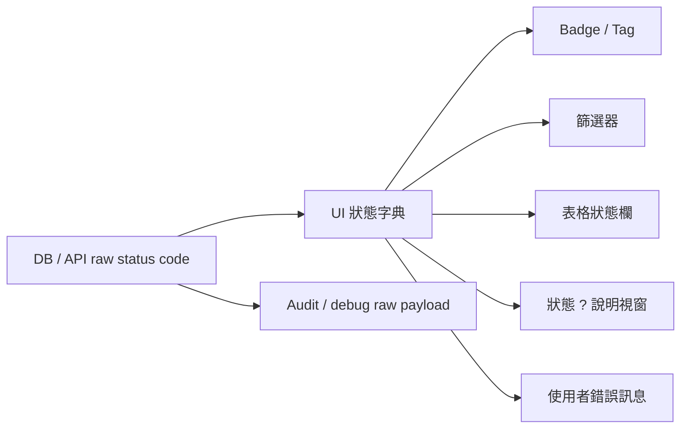

# SPEC-PDM-STATUS-UX-001：全系統狀態中文化與狀態欄說明

狀態：Phase 1 Implemented / Verification passed locally; Phase 2 RD Contract Ready / Not Authorized for remaining hardening  
建立日期：2026-07-03  
關聯任務：`DEV-PDM-STATUS-UX-001`  
關聯決策：

- `.ai-doc/decisions/ADR-PDM-LIFECYCLE-ACTIONS-001-ui-vocabulary-and-backend-lifecycle.md`
- `.ai-doc/specs/SPEC-UX-RD-LIFECYCLE-001-object-status-repair.md`
- `.ai-doc/specs/SPEC-PDM-RELEASE-MASTER-STATUS-SYNC-001-submission-release-master-lifecycle.md`

## 1. Human Decision Brief

來源：使用者在 2026-07-03 指出系統中狀態用詞混亂，要求精簡統整，UI 層僅顯示中文，讓人類簡單直覺好判斷；並新增所有有狀態欄位的資料表欄位標題旁統一 `?` 說明按鈕。

已確認決策：

- UI 層不得把英文 enum、SQL constraint、API code 或後端技術狀態當成一般使用者文案。
- DB schema、API payload、audit trail 可保留英文狀態碼；本 DEV 只建立 UI translation / presentation layer。
- `Released` 在一般物件狀態顯示統一使用 `已發布`，避免同一系統同時出現 `已發布`、`已放行`、`正式` 作為同一列狀態。
- 所有有狀態欄位的資料表標題旁必須有統一 `?` 說明按鈕。
- 點擊 `?` 顯示狀態說明彈出視窗；按 `ESC` 或點擊視窗外任一處可關閉。
- 彈出視窗只顯示使用者看得懂的中文狀態與說明，不顯示英文 enum。

Rejected options:

- 不直接改 DB enum 名稱。原因：後端狀態機、audit、既有資料與 API contract 會被不必要地擾動。
- 不讓各頁各自翻譯狀態。原因：同一狀態會繼續出現不同中文詞。
- 不用 tooltip 承載完整狀態說明。原因：內容超過一句話，需支援鍵盤與行動裝置關閉行為。

AI assumptions:

- 正常使用者畫面包含 app sidebar 可到達的工作台、清單、待辦、明細 drawer 與審核列表；管理員 debug、log、audit raw payload 可保留技術碼，但必須明確降層，不得混入一般狀態欄。
- 若某後端狀態無法安全歸類，UI 預設顯示 `異常` 或 `未分類狀態`，並在說明中提示需要管理員確認；不得直接露出 raw enum。

Re-entry triggers:

- 使用者要求改 DB enum/schema、資料遷移或歷史資料修復。
- 使用者要求 production deploy、production migration 或跨環境資料修復。
- 某狀態需改變流程語意，例如 `Released` 不再代表可使用資料，或 `PendingReview` 不再代表審核中。

## 2. Problem Statement

目前系統同時出現下列問題：

- 同一語意狀態在不同頁面顯示不同中文，例如 `Released` 被顯示為 `已發布`、`已放行`、`正式`。
- 部分 UI 直接顯示英文 enum，例如 `Draft`、`PendingReview`、`MainDrawingInvalid`。
- 狀態篩選、badge、表格欄位、錯誤訊息與明細頁用詞沒有共用來源。
- 使用者無法在看到 `狀態` 欄時立即理解每個狀態代表的下一步。
- 狀態說明若放在頁面常駐文字會佔版面；若完全不放，使用者只能猜。

本 DEV 目標是建立一層全系統共用 UI status presentation contract：後端可保持嚴謹，前端只呈現清楚中文。

使用思考習慣：#受眾、#內容組織、#可驗證性

## 3. Scope

### In Scope

- 建立中央 UI 狀態字典，集中管理：
  - raw status code
  - 中文顯示文字
  - 使用者說明
  - 色彩/嚴重度語意
  - 是否可作業、是否終止、是否異常
  - 所屬 domain/context
- 替換一般 UI 中分散的狀態翻譯與英文 enum 顯示。
- 替換表格狀態篩選器選項為中文。
- 建立共用 `StatusHelpPopover` 或等效元件。
- 所有有狀態欄位的資料表標題旁加入同一種 `?` 說明按鈕。
- 彈出視窗支援 click outside、`ESC` 關閉、focus return 與行動裝置互動。
- 一般 UI 錯誤訊息不得露出 raw SQL、constraint、API code 或英文內部狀態。
- 建立 QC 掃描與瀏覽器驗證，防止 raw status 外露與狀態欄缺少說明入口。

### Out of Scope

- 不改 DB enum、schema constraint 或既有資料。
- 不做 production deploy、production migration 或資料修復。
- 不重新設計完整 lifecycle state machine。
- 不改 audit trail 內容；audit/debug 可保留原始 enum，但需降層。
- 不把所有 domain 狀態硬合併成單一後端 enum。
- 不把主資料、送審、BOM、附件同步的流程語意混成同一個後端狀態。

## 4. End-State Architecture



不可妥協規則：

- 一般 UI 只讀 UI 狀態字典，不直接顯示 raw status。
- `?` 說明視窗與 badge/filter 使用同一份字典。
- 同一 raw status 在同一 domain 不可有兩個不同中文名稱。
- 非同一 domain 但同一英文碼若語意不同，必須在字典中用 context 區分，例如 submission `Pending` 與 approval request `pending`。
- UI 顯示未知狀態時必須 fail closed：顯示 `未分類狀態` 或 `異常`，並記錄 raw status 到 debug/audit，不可露出給一般使用者。

## 5. UI 狀態字典初版

### 5.1 主資料 / 圖號 / 料號 / 圖料狀態

| Raw status | UI 顯示 | 使用者說明 |
|---|---|---|
| Draft / draft | 草稿 | 資料尚未送審，可以繼續整理。 |
| NeedInfo / needs_info / need_info / needs_reconfirmation | 待補資料 | 必要資料不足，補齊後才能進下一步。 |
| Active / active | 可作業 | 資料可進行後續作業，例如上傳、送審或編輯。 |
| PendingReview / pending_review / Pending / pending | 審核中 | 已送出，等待審核或處理結果。 |
| Releasing / running | 發布中 | 系統正在把審核通過的資料轉成正式紀錄。 |
| Released / released / ReleasedSnapshot | 已發布 | 已完成審核並進入正式使用。 |
| Rejected / rejected | 已退回 | 審核未通過，需要修正後重新送審。 |
| Cancelled / cancelled | 已取消 | 流程已取消，不會繼續審核或發布。 |
| Obsolete / retired / voided | 已作廢 | 此資料已不再作為日常使用資料。 |
| Archived | 歷史 | 此資料保留供追溯，不在日常作業中使用。 |
| MainDrawingInvalid | 主圖失效 | 主要 MA 圖不可作為目前有效主圖，需要重新確認。 |
| ReleaseFailed | 發布失敗 | 審核後發布未完成，需要主管或管理員處理。 |

### 5.2 附件 / 同步 / 匯入狀態

| Raw status | UI 顯示 | 使用者說明 |
|---|---|---|
| none / local_only | 本機資料 | 檔案或資料目前只在本機或系統內部。 |
| uploading / queued | 等待處理 | 系統已排入處理或正在準備上傳。 |
| uploaded / moved / migrated / imported / confirmed / completed | 已完成 | 系統已完成指定處理。 |
| failed / missing / hash_mismatch / conflict / blocker / critical | 異常 | 系統偵測到阻礙流程的問題，需要處理後才能繼續。 |
| warning / info | 提醒 | 有提示資訊，但不一定阻擋流程。 |

### 5.3 任務 / 審核 / 回應狀態

| Raw status | UI 顯示 | 使用者說明 |
|---|---|---|
| open | 未結案 | 此項目仍需要處理。 |
| handled / resolved / closed / satisfied / acknowledged | 已處理 | 此項目已被處理或確認。 |
| approved | 已核准 | 審核已通過，但不一定代表資料已發布。 |
| rejected | 已退回 | 審核未通過或要求修正。 |
| partially_approved | 部分核准 | 只有部分項目通過，需要查看明細。 |
| resubmitted | 已重送 | 已修正並再次送出。 |
| waived | 已豁免 | 此要求經授權免除。 |

## 6. UI / Component Contract

### 6.1 Status Dictionary

建議新增：

- `src/lib/status-display.ts`
- `src/components/status-help-popover.tsx`

`status-display.ts` 至少提供：

- `getStatusDisplay(rawStatus, context)`
- `getStatusOptions(context)`
- `getStatusHelpItems(context)`
- `getStatusSeverity(rawStatus, context)`
- `formatStatusForUser(rawStatus, context)`
- `formatStatusErrorForUser(errorCode, context)`

所有呼叫端不得再直接寫：

- `statusLabels = { Released: "已放行" }`
- `<option value="Released">Released</option>`
- `{record.status}`
- raw `error.message` 當 UI alert

### 6.2 Status Help Popover

狀態欄標題格式：

```text
狀態 [?]
```

行為要求：

- `?` 是 button，不是純文字。
- button 需有 accessible name，例如 `查看狀態說明`。
- 點擊 button 開啟 popover。
- 按 `ESC` 關閉。
- 點擊 popover 外部任一處關閉。
- 關閉後 focus 回到原本的 `?` button。
- 點擊 `?` 不可觸發表格排序、列選取、篩選或其他 row action。
- 同一畫面多個狀態欄時，每個 popover 只顯示該欄位 context 適用的狀態。
- Popover 內容使用表格或簡短 list；不得使用長篇教學文。
- 手機 viewport 不得超出畫面，必要時改用固定寬度 bottom sheet-like popover，但仍需外部點擊與 ESC 關閉。

### 6.3 Status Column Header API

建議建立小元件，例如：

```tsx
<StatusColumnHeader context="drawingRecord" label="狀態" />
```

必要 props：

- `context`: 決定顯示哪組狀態說明。
- `label`: 預設 `狀態`。
- `compact`: 小表格可用，但不可移除 `?`。
- `align`: 配合既有表格欄位。

### 6.4 Error Mapping

UI alert / banner / inline error 必須先通過 user-facing mapping：

| Internal code / pattern | UI 顯示 |
|---|---|
| `duplicate_active_submission` | 此圖號與版次已有進行中的送審，請先查看既有送審或取消後再重新送審。 |
| `UNIQUE constraint failed: submission_files...` | 送審附件重複，請保留一份正確附件後再送出。 |
| `drawing_number_not_found` | 找不到此圖號，請確認圖號是否存在或重新整理資料。 |
| Unknown raw SQL / constraint | 系統無法完成此操作，請重新整理後再試；若仍發生，請交由管理員處理。 |

## 7. Implementation Inventory

RD 開工前需以 `rg` 重新掃描，至少覆蓋：

- `src/components/lifecycle-ux.tsx`
- `src/components/dashboard.tsx`
- `src/app/numbering/drawings/page.tsx`
- `src/app/numbering/search/page.tsx`
- `src/app/parts/page.tsx`
- `src/app/submissions/[id]/page.tsx`
- `src/app/numbering/submissions/drawings/[drawingNumber]/page.tsx`
- `src/app/upload/page.tsx`
- `src/app/bom/workbench/page.tsx`
- `src/app/numbering/tasks/page.tsx`
- `src/app/numbering/revisions/page.tsx`
- `src/app/numbering/import*/**/*` 或等效 import center surfaces

掃描規則：

```text
rg -n "statusLabels|formatWorkflowStatus|record_status|request_status|batch_status|item_status|check_status|gdrive_status|sync_status|PendingReview|ReleaseFailed|MainDrawingInvalid|Released|Obsolete|Draft" src
rg -n "<th|TableHead|狀態|Status|status" src/app src/components
```

## 8. Phase Roadmap

### Phase 1：目前使用者可見狀態 UI 收斂

Authorization: Authorized by subsequent PM/RD execution request and implemented locally.  
Document status: Implemented / Verification passed locally.

Scope:

- 新增中央狀態字典與 `StatusHelpPopover`。
- 替換目前一般使用者路由中的狀態 badge、table column、filter option 與 error banner。
- 所有 app nav 可到達、且包含狀態欄的表格都加上 `?` 說明。
- 建立 focused QC script 檢查 raw enum 外露、狀態欄 help 缺漏與 popover 行為。

Out of scope:

- DB migration。
- production deploy。
- admin debug raw payload 規格化。
- 新增完整文件中心或說明頁。

Implementation contract:

- 所有改動限於 UI/service mapping，不改變後端狀態轉移。
- 若呼叫端需要保留 raw status 作為 API request value，UI option label 必須中文，value 可保留 raw code。
- `StatusHelpPopover` 不得依賴瀏覽器全域單例；同頁多個表格可共存。
- Popover close behavior 需用事件監聽或既有 overlay primitive 實作，並清理 listener。
- Unknown raw status 必須有 fallback label。

Acceptance:

- 圖號模組狀態篩選器不再顯示 `Draft / Active / PendingReview / Released / Obsolete / MainDrawingInvalid`。
- 料號、圖料、送審、待辦、BOM 工作台等一般表格不直接顯示英文 status。
- 所有有 `狀態` 欄的表格標題旁可見 `?`。
- 點 `?` 開啟中文狀態說明。
- `ESC` 可關閉。
- 點外部可關閉。
- 關閉後 focus 回到 `?`。
- 點 `?` 不觸發排序、列選取或導頁。
- visible UI 不出現 raw SQL constraint、`duplicate_active_submission`、`drawing_number_not_found`、`PendingReview`、`MainDrawingInvalid`、`ReleaseFailed`。

Evidence passed:

- `npm run qc:pdm-status-ui-vocabulary` passed 44/44.
- `npx tsc --noEmit --pretty false` passed.
- `npm run lint` passed.
- `npm run build` passed.
- Browser evidence on `/settings` verified the shared status help UI: status help button opens, Chinese status copy renders, `ESC` closes, outside click closes.
- Screenshot evidence: `output/playwright/status-ui/settings-status-help-open.png`.

Stop conditions:

- RD 需要更改 DB enum/schema。
- RD 需要 production deploy 或 migration。
- 無法區分某 raw status 的 domain context，且錯誤歸類會誤導使用者做高風險操作。
- 既有 table component 不允許 header button 且改動會造成大範圍 UI 破壞。

### Phase 2：防回歸與後續模組擴充

Authorization: Not authorized.  
Document status: RD Contract Ready / Not Authorized.

Scope:

- 擴充 QC static scanner，讓新增 raw status 顯示或缺少 status help 的 table header 會失敗。
- 將狀態字典納入新模組開發 checklist。
- 若後續 admin/debug/report surfaces 也要完全中文化，另行盤點並接入 context-specific dictionary。

Out of scope:

- 改資料庫狀態機。
- 自動修改歷史文件或 audit payload。

Acceptance:

- 新增狀態欄位時必須使用 `StatusColumnHeader` 或等效元件。
- 新增 raw status 時必須在字典中註冊中文顯示與說明。
- QC 能指出缺漏頁面、缺漏 context 或 raw enum 外露。

Evidence required:

- Static scanner covered by package script.
- One deliberate negative fixture or unit/static test proves raw status exposure can be detected.

## 9. QA / QC Gate

QA 必須驗證：

- 每個 context 的中文狀態是否能讓使用者判斷下一步。
- `已核准` 與 `已發布` 不混淆：核准代表審核決策，發布代表正式資料已建立。
- `已作廢`、`歷史`、`已刪除資料` 不混淆。
- `異常` 類狀態不應只顯示紅字，必須有下一步或處理責任。

QC 必須以真實 UI 操作驗證：

- 桌面與手機 viewport。
- 點擊 `?` 開啟。
- `ESC` 關閉。
- 外部點擊關閉。
- focus return。
- 不觸發排序/列選取。
- visible error sweep：畫面不可見 raw enum、SQL、constraint、API code。
- 狀態篩選器中文化。

## 10. Deferred Scope Audit

| Deferred scope | Classification | Reason / recovery |
|---|---|---|
| DB enum/schema rename | No Tracking | 不符合本 DEV 目標，會擾動資料相容性與 audit。 |
| production deploy / production migration | New DEV | 需 release gate；本 DEV 只建立 local implementation-ready 文件。 |
| admin debug/audit raw payload 完整中文化 | Same Spec Phase 2 | 可在 Phase 2 判斷是否納入；一般 UI Phase 1 先完成。 |
| 未來新增模組的狀態欄防回歸 | Same Spec Phase 2 | 以 scanner/checklist 管制，不阻塞 Phase 1。 |

## 11. All-Phase Coverage Matrix

| Phase / DEV | Authorization | Document status | Scope | Out of scope | Entry condition | Acceptance | Evidence |
|---|---|---|---|---|---|---|---|
| Phase 1 / `DEV-PDM-STATUS-UX-001` | Authorized and implemented locally | Implemented / Verification passed locally | 中央狀態字典、中文 badge/filter/error、狀態欄 `?` popover、目前一般使用者路由全覆蓋 | DB/schema、production、admin debug 完整重構 | Completed by local RD execution | 一般 UI 不露英文狀態碼；所有狀態欄有說明；popover 行為通過 | `npm run qc:pdm-status-ui-vocabulary`; `npm run lint`; `npm run build`; browser UI evidence |
| Phase 2 / `DEV-PDM-STATUS-UX-001-P2` | Not authorized | RD Contract Ready / Not Authorized | 防回歸 scanner、新模組 checklist、admin/report/debug 後續 context；Phase 1 已包含 focused scanner baseline | DB/schema、歷史 audit payload migration | Phase 1 通過且使用者授權 remaining hardening | 新 raw status / 新 status table 缺漏能被 QC 或 static gate 抓到 | scanner negative fixture、QC report |

## 12. RD Readiness Review

P0/P1 readiness gaps: none for Phase 1 local implementation.

RD 已完成 Phase 1，原因：

- 產品語意已由使用者確認。
- 後端 raw status 保留，無 migration 依賴。
- UI mapping、component、QC scanner 可在 local code 內完成。
- 高風險 production/data work 已列為 out of scope 與 stop condition。

Phase 2 只達 `RD Contract Ready / Not Authorized`，需 Phase 1 完成後再授權。

## 13. Implementation Evidence

Implemented on 2026-07-03:

- Added central UI status dictionary in `src/lib/status-display.ts`, including development phase display so `Release` renders as `正式階段` in normal UI.
- Added shared status help/header/badge UI in `src/components/status-help-popover.tsx`.
- Applied dictionary-backed Chinese status display, filters, badges, status table headers and user-facing error mapping across the primary numbering, drawing, part, submission, BOM, settings, task, import, report, approval and dashboard surfaces.
- Added focused QC command `npm run qc:pdm-status-ui-vocabulary`.
- Verified local 3000 health after build interruption recovery: `npm run dev:local:check` passed and reports `http://127.0.0.1:3000/`.

Verification passed:

- `npm run qc:pdm-status-ui-vocabulary` -> 44/44 passed.
- `npx tsc --noEmit --pretty false` -> passed.
- `npm run lint` -> passed.
- `npm run build` -> passed.
- Browser UI check -> passed on `/settings`; six status help buttons rendered, dialog displayed Chinese status copy, `ESC` close passed, outside click close passed.

Remaining not authorized:

- Production deploy.
- DB enum/schema rename.
- Production migration.
- Historical data repair.
- Audit payload migration.
- Full admin/debug/report raw payload localization beyond the current UI surfaces.
