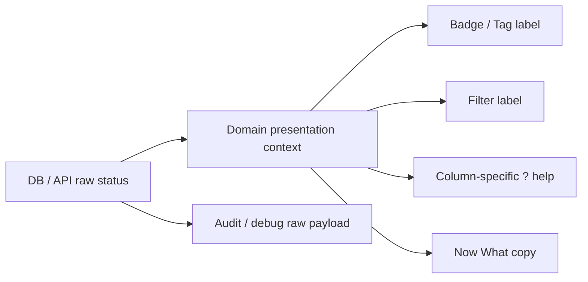

# SPEC-PDM-STATUS-UX-002：狀態語意分層與狀態混用修正

狀態：RD Implementation Ready / Not Authorized  
建立日期：2026-07-07  
關聯任務：`DEV-PDM-STATUS-UX-002`  
父交付點：`DEV-PDM-STATUS-UX-001`  
關聯文件：

- `.ai-doc/specs/SPEC-PDM-STATUS-UX-001-unified-chinese-status-display.md`
- `.ai-doc/specs/SPEC-PDM-NEXT-STEP-UX-001-actionable-state-guidance.md`
- `.ai-doc/qa/qa-pdm-status-context-disambiguation-validation-plan-2026-07-07.md`

## 1. Human Decision Brief

來源：2026-07-07 使用者指出狀態說明仍然太多、太複雜，並要求依「狀態混用」邏輯盤查全系統。後續確認：不能只是增加更多 status context；必須以使用者當下任務為核心，讓狀態說明回答「這筆現在要不要處理、能不能做、卡在哪」。

已確認決策：

- 後端 raw status、DB enum、API payload、audit trail 不因本 DEV 改名或刪除。
- UI 第一層狀態說明只顯示使用者當下判斷所需的狀態，不展示完整內部 enum。
- `? 狀態說明` 只能解釋同一欄內真正出現的狀態；不能用通用 workflow 字典解釋匯入、設定、報表、還原或 DVT 準備狀態。
- 同一欄若混放主檔狀態、階段、成本、提醒或例外旗標，欄名不得只叫「狀態」，應改成「狀態 / 階段 / 提醒」或拆欄。
- 已發現的高混淆頁面需優先處理：圖號待辦、匯入頁、系統設定、報表頁、DVT 頁、還原狀態欄、發行審核文案一致性、圖號/料號/查詢清單的「其他」欄。

Rejected options:

- 不把所有狀態硬合併成同一套五項狀態。原因：審核、匯入、報表 job、設定版本、還原政策的使用者任務不同。
- 不改後端狀態機或 schema。原因：本問題是 UI presentation 與資訊分層，不是資料生命週期錯誤。
- 不用完整內部 enum 當第一層狀態說明。原因：會讓使用者看到太多不需要的狀態，增加判斷負擔。
- 不用「新增 context」本身當成功標準。原因：context 是實作手段，真正驗收是使用者能看懂下一步。

AI assumptions:

- 本 DEV 是 local UI / QC 文件與實作邊界，不包含 production deploy。
- 使用者主要受眾是 RD、主管、Admin、審核者；他們不是在學狀態表，而是在判斷下一步與責任。
- 若某欄同時需要顯示多種狀態粒度，優先調整欄名與視覺分組，再決定是否需要 `?` 說明。
- 既有 `StatusBadge` / `StatusColumnHeader` 可擴充 context，不需要重寫整個 UI 元件系統。

Re-entry triggers:

- 需要改 DB enum、schema、API payload 或 audit payload。
- 需要改變「已核准、已發布、審核中、已作廢」等流程語意。
- 需要 production deploy、production migration 或歷史資料修復。
- 使用者要求將 admin/debug/audit raw payload 也全面中文化。

使用思考習慣：#批判思考、#受眾、#設計思考

## 2. Problem Statement

`DEV-PDM-STATUS-UX-001` 已完成中文化、共用 badge/header/popover 與 raw status 防露出。但 APP 使用後發現第二層問題：某些頁面雖然已經中文化，卻用同一個 `workflow` 或 `masterRecord` 說明不同任務的狀態，導致說明仍然過多或語意不準。

典型問題：

- `workflow` 被用在審核批次、待辦、匯入批次、設定版本、還原政策，但這些不是同一種工作流。
- 表頭說明 context 與格內 badge context 不一致，例如匯入列表頭用 `fileSync`，格內卻用本地 `StatusBadge` 且沒有傳 `fileSync`。
- 欄名叫「其他」或「階段 / 狀態」，但格內混放主檔狀態、階段、成本、提醒、例外旗標。
- DVT 頁第一個 badge 是準備狀態，下面才是主檔狀態，但表頭說明只解釋主檔狀態。

本 DEV 目標：將狀態說明從「全域 enum 展示」改成「任務導向狀態說明」，讓使用者在 5 秒內知道下一步。

## 3. Scope

### In Scope

- 新增或調整 UI presentation contexts：
  - `task`：待辦處理狀態。
  - `importRow`：匯入列檢查狀態。
  - `importBatch`：匯入批次生命週期。
  - `settingsLifecycle`：設定版本、規則版本與管理範圍生命週期。
  - `jobStatus`：報表/匯出 job 執行狀態。
  - `restorePolicy`：已刪除資料的還原可行性。
  - `dvtReadiness`：DVT 階段送審條件。
- 將 `workflow` context 限縮回真正的審核/流程判斷，不再被設定、報表、匯入批次與還原政策濫用。
- 發行審核頁維持精簡 5 項說明，並統一 `待補件` / `待補資料`。
- 對「其他」欄或混合欄調整欄名或視覺分組，使 `?` 的說明範圍不誤導。
- 擴充 QC scanner，檢查 `StatusColumnHeader` context 與鄰近 `StatusBadge` context 是否一致；例外必須明確標註。
- 針對受影響頁面做瀏覽器驗證與 visible-error sweep。

### Out of Scope

- DB enum/schema rename。
- API raw status rename。
- production deploy / production migration。
- 歷史資料修復。
- 全面改寫後端 lifecycle state machine。
- admin/debug/audit raw payload 完整中文化。
- 新增大型說明中心或教學頁。

## 4. End-State Architecture



不可妥協規則：

- 同一個 `?` popover 只解釋同一欄實際出現的狀態。
- 表頭 context 與格內主要 badge context 必須一致；若同欄有次要 badge，欄名要反映混合內容。
- 第一層說明不展示完整 internal enum，只展示使用者需要判斷的狀態。
- raw status 保留在資料層與 audit 層，不用來直接驗收 UI 清楚度。
- 狀態文案必須先回答下一步，再補制度或技術原因。

## 5. Page Inventory And Target Contract

| Area | Current issue | Target contract |
|---|---|---|
| `/numbering/tasks` 待辦 | `task` 共用 `workflow`，頁籤與 badge 用語不一致 | 專用 `task` context：`待處理 / 已處理 / 已取消`；通知欄拆成 `讀取狀態` 與 `處理狀態` 或移除不準的 status help |
| `/numbering/imports` 匯入列 | 表頭 `fileSync`，列 badge 使用本地 mapping，說明不一致 | `importRow` context：`待檢查 / 可匯入 / 待補資料 / 待管理員確認 / 衝突 / 保留既有` |
| `/numbering/imports` 匯入批次 | 批次 status 用 `workflow`，但顯示草稿/正式/已刪除 | `importBatch` context：`暫存中 / 已確認 / 已排除`；避免用審核說明 |
| `/settings` 設定版本/範圍 | 設定 lifecycle 使用 `workflow` 說明，會出現審核語言 | `settingsLifecycle` context 或移除 `?`；用 `啟用中 / 已退役 / 內建預設 / 停用` |
| `/numbering/reports` 報表與匯出 | job status 用 `fileSync`，會混入匯入/檔案同步語意 | `jobStatus` context：`等待中 / 執行中 / 已完成 / 失敗` |
| `/numbering/approvals` 發行審核 | 說明已精簡，但 filter 尚有 `待補件` 與 `待補資料` 不一致 | 統一 `待補資料`；`部分核准` 保留為批次例外，但只在該筆資料旁提示需看明細 |
| `/numbering/dvt` DVT 頁 | 表頭是主檔狀態說明，但第一個 badge 是 DVT 準備狀態 | 欄名改 `DVT 檢查` 或 `送審條件`，專用 `dvtReadiness`：`可送審 / 需補資料或 Override / 阻擋` |
| BOM / 料號草稿已刪除清單 | `還原狀態` 使用 `workflow`，但實際是還原政策 | `restorePolicy` context：`可還原 / 不可還原 / 受控邊界 / 已回收或已重用` |
| parts/drawings/search 清單 `其他` 欄 | 同欄混放主檔狀態、階段、成本、提醒 | 欄名改 `狀態 / 階段 / 提醒`；`?` 只附在主要主檔狀態，或改為分組 chip 說明 |

## 6. Implementation Contract

### 6.1 Status Display Context

`src/lib/status-display.ts` 擴充 context：

```ts
type StatusDisplayContext =
  | "task"
  | "importRow"
  | "importBatch"
  | "settingsLifecycle"
  | "jobStatus"
  | "restorePolicy"
  | "dvtReadiness"
  // existing contexts...
```

要求：

- 每個新增 context 都要有 display definitions 與 help definitions。
- `getStatusHelpItems(context)` 不得回傳與該頁任務無關的狀態。
- `task` 不得直接 alias 到 `workflowStatuses`。
- `fileSync` 不得用於報表 job 或匯入列以外的非檔案同步任務。
- unknown raw status 仍顯示 `未分類狀態`，但 context-specific fallback 說明要引導 Admin 確認。

### 6.2 Component Usage Rules

- `StatusColumnHeader context="X"` 旁邊主要 `StatusBadge` 也必須使用 `context="X"`。
- 若同欄包含多個 context，表頭 label 必須明示混合，例如 `狀態 / 階段 / 提醒`，且 `?` 不得暗示所有 chip 都屬同一 context。
- 本地 `statusLabel()` / `batchStatusLabel()` 可保留作為 transition，但需改成 centralized dictionary 或明確註解為非 shared status helper。
- `待補件` 統一改為 `待補資料`，除非文案明確指的是附件補件。

### 6.3 Page-Level RD Tasks

- `/numbering/tasks`
  - 拆待辦 `task` help，不再繼承 workflow 五項審核說明。
  - 通知中心欄位避免用通用 `狀態` 混合 `已讀/未讀` 與 `已處理/未處理`。
- `/numbering/imports`
  - 匯入列使用 `importRow`。
  - 匯入批次使用 `importBatch`。
  - 批次 `staged` 不再顯示為泛用「草稿」，改為 `暫存中`。
- `/settings`
  - 管理設定版本與範圍改 `settingsLifecycle`，或表頭改成無 `?` 的明確欄名。
  - 規則模擬器中的「狀態」改為「主檔狀態」。
- `/numbering/reports`
  - 報表與匯出 job 使用 `jobStatus`。
- `/numbering/dvt`
  - 表頭改 `DVT 檢查` 或 `送審條件`。
  - `CandidateStatusBadge` 接入 `dvtReadiness` 或使用等效共用 helper。
- 已刪除 BOM / 料號草稿
  - `還原狀態` 改 `restorePolicy`。
- parts/drawings/search
  - `其他` 改 `狀態 / 階段 / 提醒`。
  - 若維持一欄，主檔狀態說明只針對主檔 status chip。

## 7. RD Acceptance

RD 完成條件：

- 受影響頁面的 `?` popover 不再顯示與該欄無關的狀態。
- 發行審核 popover 維持 5 項：`審核中 / 待補資料 / 阻擋 / 已核准 / 已退回`。
- `待補件` 在審核狀態語境統一為 `待補資料`。
- 報表 job 說明不出現匯入、檔案同步或審核狀態。
- 匯入列說明不出現審核語言。
- 設定版本說明不出現發行審核語言。
- DVT 頁使用者能分辨 `DVT 檢查狀態` 與 `主檔狀態`。
- `StatusColumnHeader` / `StatusBadge` context mismatch 有 QC gate 覆蓋。

## 8. QA / QC Gate

QA 必須驗證：

- 每個受影響頁面的狀態說明是否只保留使用者當下需要判斷的項目。
- 狀態文案是否回答下一步，不只是解釋系統內部狀態。
- `已核准` 與 `已發布` 不混淆。
- `暫存中`、`草稿`、`審核中` 不混用。
- `已處理` 不誤導為「工作已完成」；待辦語境應理解為「此待辦已關閉或確認」。

QC 必須驗證：

- Static scan：`StatusColumnHeader` context 與主要 `StatusBadge` context 一致。
- Static scan：禁止 `task: workflowStatuses` 這類 alias。
- Static scan：報表 job 不使用 `fileSync` 說明。
- Browser check：`/numbering/tasks`、`/numbering/imports`、`/settings`、`/numbering/reports`、`/numbering/approvals`、`/numbering/dvt`。
- Browser check：popover 仍為 fixed/body overlay，不被表格裁切。
- Browser check：無 visible raw enum / SQL / API code。
- Viewport：桌面 1440 或 1680；必要時 390px sanity check，因目前系統無 dedicated phone UI。

## 9. Stop Conditions

- RD 發現需要改 DB schema、migration 或 raw API contract。
- RD 需要改變狀態轉移或核准/發布語意。
- 某頁面同一欄無法安全拆分狀態語意，且改欄位會影響主要操作流程。
- 修改牽涉 production deploy、production migration、歷史資料修復或直接 DB mutation。
- 新 context 造成既有 QC 大量失敗且不是本 DEV 範圍內可修復的 UI 問題。

## 10. Phase Roadmap

### Phase 1：狀態說明語意修正

Authorization: Not authorized.  
Document status: RD Implementation Ready / Not Authorized.

Scope:

- 實作新增 presentation contexts。
- 修正高優先頁面：tasks、imports、settings、reports、approvals、dvt、restore lists。
- 修正中優先混合欄：parts/drawings/search。
- 更新 focused QC scanner 與 browser checks。

Out of scope:

- DB/API/raw enum 改名。
- production deploy / migration。
- admin/debug/audit 全面中文化。

Entry condition:

- 使用者明確授權 RD 實作。
- 現有本地狀態 popover overlay 修正需保留。

Acceptance:

- RD Acceptance 全部通過。
- QA/QC gate 全部通過。

Evidence required:

- `npx.cmd tsc --noEmit --pretty false`
- `npm.cmd run lint -- --quiet` 或 touched-file lint。
- Focused status context QC script。
- Playwright screenshots for affected pages.

### Phase 2：狀態 context 防回歸

Authorization: Not authorized.  
Document status: RD Contract Ready / Not Authorized.

Scope:

- 將 context mismatch scanner 納入 `qc:pdm-status-ui-vocabulary` 或新增 package command。
- 加入負向 fixture，證明錯用 context 會被攔下。
- 將新增狀態頁面的檢查規則寫入新模組 checklist。

Out of scope:

- schema/API migration。
- production deploy。

Entry condition:

- Phase 1 完成並通過 QC。
- 使用者授權防回歸 hardening。

Acceptance:

- 新增錯誤 context 的 fixture 能造成 QC fail。
- 新模組狀態欄缺 `?` 或 context mismatch 能被指出。

Evidence required:

- Static QC script result。
- Negative fixture 或 deterministic static assertion。

## 11. Deferred Scope Audit

| Deferred scope | Classification | Reason / recovery |
|---|---|---|
| DB enum/schema rename | No Tracking | 本 DEV 解決 UI 語意混用，不需資料層改名；改 schema 會增加相容性風險。 |
| production deploy / production migration | New DEV | 若要上線，走 deployment-release-gate；本文件不授權 production。 |
| admin/debug/audit raw payload 全面中文化 | Same Spec Phase 2 or New DEV | 若使用者要求管理端也全面中文化，需另定 UI/debug 邊界。 |
| 歷史資料修復 | Blocked Human Re-entry | 需要明確資料範圍與修復授權，不得由本 UI DEV 觸發。 |
| 新模組 checklist / scanner hardening | Same Spec Phase 2 | 作為 Phase 2 防回歸工作。 |

## 12. All-Phase Coverage Matrix

| Phase / DEV | Authorization | Document status | Scope | Out of scope | Entry condition | Acceptance | Evidence |
|---|---|---|---|---|---|---|---|
| Phase 1 / `DEV-PDM-STATUS-UX-002` | Not authorized | RD Implementation Ready / Not Authorized | 修正狀態說明語意、context 分層、混合欄名與 focused QC | DB/API/schema、production、歷史資料修復 | 使用者明確授權 RD 實作 | 受影響頁面狀態說明只解釋當下欄位；context mismatch 被 QC 覆蓋 | `tsc`; lint; focused QC; Playwright |
| Phase 2 / `DEV-PDM-STATUS-UX-002-P2` | Not authorized | RD Contract Ready / Not Authorized | 防回歸 scanner、negative fixture、新模組 checklist | DB/API/schema、production | Phase 1 完成並授權 hardening | context 誤用與缺漏說明可被 deterministic QC 攔下 | Static QC negative fixture |

## 13. RD Readiness Review

P0/P1 readiness gaps for Phase 1: none.

Reasoning:

- 產品語意已由使用者確認：精簡說明、不要展示完整 enum、依受眾任務分層。
- 不需 DB/API/schema/migration。
- 實作可限縮在 `src/lib/status-display.ts`、`src/components/status-help-popover.tsx` 與受影響頁面呼叫端。
- 高風險項目已列為 out of scope / stop conditions。
- QA/QC gate 可由現有 Playwright 與 static scanner 擴充完成。

RD 可在使用者授權後直接實作 Phase 1。Phase 2 僅達 RD Contract Ready / Not Authorized。
