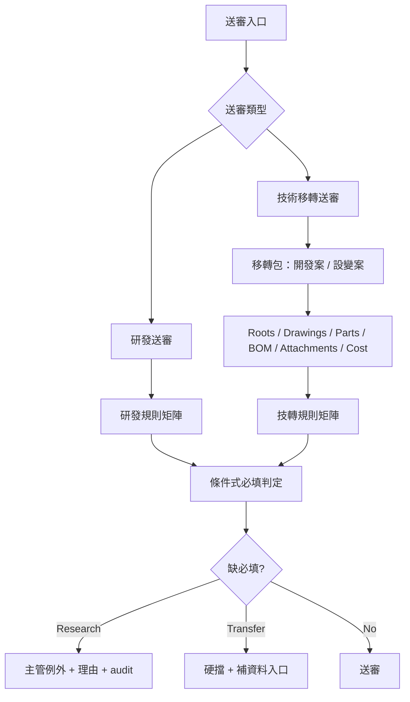

# SPEC-PDM-SUBMISSION-GATE-001 Research / Transfer Submission Gate

Status: Phase 1 Local Implementation Complete; Phase 2 and Parent Phase 4 RD Contract Ready / Not Requested This Turn; Technical Transfer Phase 3 is delegated to DEV-041 with Phase 3A-0 Local Implementation Complete / QA Passed 2026-07-13 and Phase 3A-1 to 3C RD Contract Ready / Not Requested This Turn; Release Gate Required
Owner: Dev PM
Created: 2026-07-07
Related DEV: `DEV-005` / `DEV-PDM-SUBMISSION-GATE-001`; child delivery `DEV-041` / `DEV-PDM-TRANSFER-PACKAGE-INTAKE-001`
Related ADR: `.ai-doc/decisions/ADR-PDM-SUBMISSION-GATE-001-transfer-package-and-exception-policy.md`
Scope: conditional required-data rules, research submission UX, technical-transfer package UX, rule matrix governance

## 1. Human Decision Brief

Confirmed decisions:

- HCS Q1: User selected `1B`: submission page must let the user choose `研發送審` or `技術移轉送審`.
- User amended Q1: `技術移轉送審` must not be a direct single drawing or single part submission. It must be a case-scoped transfer package for a whole development case or design-change case.
- HCS Q2: User selected `2B`: required-data rules must be governed by a versioned submission rule matrix, not hardcoded only and not a full no-code rule engine.
- HCS Q3: User selected `3B`: technical transfer hard-blocks missing required data; research submission may allow controlled manager exception with reason and audit.
- HCS follow-up Q1: User selected `1B`: technical transfer package minimum scope requires a package and case/change reason. If the real case has only one affected item, the submitter must declare `no other affected items`, and the reviewer must confirm the scope.
- HCS follow-up Q2: User selected `2B`: technical transfer does not allow missing required data exception. Missing required data must be completed before review; after readiness passes, Manufacturing, Procurement and QA/QC sign off according to applicability.
- HCS follow-up Q3: User selected `3C`: research submitter may submit with an exception reason, but the exception is not approved automatically. The reviewer or supervisor must approve the exception during review before the submission can pass.
- RD supervisor review Q1: User selected `1C`: `ApprovedForTransfer` creates a controlled transfer package. Formal master release is a separate RD Manager/Admin action that triggers the existing release workflow item-by-item or by package batch.
- RD supervisor review Q2: User selected `2B`: the rule matrix determines which sign-off roles apply. Applicable roles must sign. Not-applicable sign-off must come from a rule or an RD Manager/Admin reason.
- RD supervisor review Q3: User selected `3B`: after submission, package item/data changes invalidate readiness snapshot and affected sign-offs; the package returns to `ReturnedForCorrection` or `CollectingData`, is re-resolved, and affected roles re-sign.
- Transfer-package completeness review Q1: User selected `1A`: integer major version belongs to the immutable transfer-package baseline. Controlled parts, formal subassemblies and top assembly keep independent revisions; the baseline captures exact revisions and hashes without promoting all items together.
- Transfer-package completeness review Q2: User selected `2A`: `/transfer-packages/new` is read-only until the user completes the required case header and selects `建立技轉包`; only then is a persistent Draft and stable package ID created.
- Transfer-package completeness review Q3: User selected `3A`: technical-transfer workbench/intake/baseline implementation is tracked as child delivery `DEV-041`; `DEV-005` remains complete for Phase 1 and parent governance.
- Design-change review Q1: User selected `1A` (prior Q3 A): later design change creates a new delta package that inherits prior current-effective evidence and produces complete candidate configurations; approved packages are terminal.
- Multi-top review Q2: User selected `2A` (prior Q4 A): all governed top assemblies in one package approve atomically; staged timing requires separate packages.
- Assembly revision impact: system proposes `no_change`, `defer` or `update`; a permitted human decides. Configuration-alignment status is separate from master lifecycle.
- Revision lanes are isolated: development decimal revisions affect only development configurations; formal integer revisions affect only formal configurations.
- Formal defer Q5: User selected `1C`: only compatible, non-critical, sufficiently evidenced formal impacts may defer with R&D Manager reason, owner, due date, mandatory follow-up and exact old-revision availability; otherwise the package blocks.
- Human-facing state: verified `no_change` shows `不需進版`; deferred and in-progress internal states both show only `已非最新版 / 待更新`.
- Suggestion Q6: User selected `1A`: deterministic versioned rules only; no AI/LLM/network recommendation authority.
- Formal no-change Q7: User selected `2B`: every formal no-change requires R&D Manager approval after exact candidate/SolidWorks evidence.
- Follow-up Q8: User selected `3A`: canonical transfer follow-up owns owner/due time and projects into the existing task center; generic task policy and page structure remain unchanged.

Critical evaluation:

- The user's amendment is correct. A single part can be technically complete while the development case is still not manufacturable, purchasable, inspectable or cost-controlled.
- A technical-transfer gate that accepts one isolated part creates false readiness and pushes integration defects to production, procurement, QA/QC and field installation.
- The correct transfer unit is a `Transfer Package`, representing a development case or engineering-change case and its affected roots, drawings, parts, BOMs, attachments, costs and responsibility sign-offs.

Rejected options:

- Single-item technical transfer submission.
- Transfer package without case/change reason.
- Forced multi-item minimum when the real development/change case affects only one controlled item.
- One universal required-field list for both research and transfer.
- Full no-code rules engine in the first implementation.
- Warning-only technical transfer.
- Missing-required technical-transfer exception.
- Research exception that becomes valid only because the submitter typed a reason.
- Technical-transfer approval that directly changes drawing/part/root master lifecycle to `Released`.
- Keeping old readiness snapshots or sign-offs valid after package content or relevant master data changes.
- Forcing all package files or controlled items to share the same integer revision.
- Creating empty transfer-package Drafts merely because the create route was opened.
- Allowing a file-composition preview or incomplete manual BOM to pass baseline confirmation.

AI assumptions:

- `研發送審` optimizes learning speed and review traceability.
- `技術移轉送審` optimizes production readiness and cross-department accountability.
- Existing drawing/part master ownership rules remain: drawing modules own drawing data, part modules own part data, package workflow aggregates readiness and routes remediation.
- A one-item technical-transfer package is allowed only when it has package context, a case/change reason, a `no other affected items` declaration and reviewer confirmation. This is not a direct single-item transfer submission.
- Existing formal release workflow remains the only path that changes master data to `Released / Release`. Transfer approval is a controlled handoff milestone, not a master lifecycle release.
- Existing system role name is `QA/QC`; UI copy may show `品保`, but data/API contracts must not invent a separate `QC` role unless a future access-control change authorizes it.
- `DEV-041` and `.ai-doc/specs/SPEC-PDM-TRANSFER-PACKAGE-INTAKE-001-pack-and-go-assembly-classification.md` are authoritative for transfer Draft persistence, Pack-and-Go intake, classification, controlled mapping, BOM completion and package-baseline semantics.
- A package's external project/ECR/ECO/customer reference is required when one exists. If none exists, a recorded not-available status and reason satisfies the rule; an unexplained blank value does not.

Re-entry triggers:

- User wants technical transfer to be allowed from one drawing or one part without package context.
- User wants production deployment, live schema migration, direct data repair or release.
- User wants the first version to include a full visual BOM/CAD graph, ERP sync or supplier portal.
- User wants hard transfer approval without Manufacturing/Procurement/QA/QC visibility.
- User wants missing required data to be transferable through an ad hoc exception.
- User wants research exceptions to auto-pass without reviewer or supervisor approval.
- User wants `ApprovedForTransfer` to automatically release drawing/part/root master records.
- User wants unchanged sign-offs to remain valid after the package item set, readiness-driving fields or rule-set version changes.
- User wants package baseline integers to synchronize or overwrite controlled item revisions.
- User wants the create page to persist a package before explicit confirmation.

使用思考習慣：#效用理論、#批判、#演算法

## 2. Product Rule

PDM must support two distinct submission modes.

| Mode | Submission unit | Main goal | Missing required data behavior |
|---|---|---|---|
| 研發送審 | drawing, part, root, revision or small scoped item | Let RD review intent, risk and prototype evidence quickly | hard-block only minimum identity/evidence; controlled exception may be allowed |
| 技術移轉送審 | transfer package for development case or design-change case | Prove the whole case can be manufactured, procured, inspected and costed | hard-block until all package-required data is complete; no missing-required exception |

Technical transfer must not be created as a direct single drawing or direct single part submission. If the user starts from a drawing or part and selects technical transfer, the system must route to create or open a transfer package and pre-add the selected item into package scope.

Technical transfer package minimum scope:

- must have package title, case type and development-case or design-change reason
- must identify source project, ECR, ECO, customer request or equivalent internal case reference when available
- must include all known affected roots, drawings, parts, BOM items and attachments needed for readiness review
- may contain exactly one affected controlled item only if the submitter declares `no other affected items` and the reviewer confirms the scope during review
- must not allow a direct single drawing or direct single part formal technical-transfer submission outside a package

Technical transfer approval and formal release boundary:

- `ApprovedForTransfer` means the transfer package is complete enough for controlled handoff.
- `ApprovedForTransfer` must not directly mutate drawing, part or root master status to `Released / Release`.
- Formal release remains a separate controlled action by RD Manager/Admin through the existing release workflow.
- The formal release action may launch item-by-item or package-batch release, but each released item must still satisfy existing release transaction, snapshot, audit and master lifecycle synchronization rules.
- Existing release lifecycle authority remains `.ai-doc/specs/SPEC-PDM-RELEASE-MASTER-STATUS-SYNC-001-submission-release-master-lifecycle.md`.

Sign-off applicability:

- The rule matrix determines whether Manufacturing, Procurement and `QA/QC` sign-off is `required` or `not_applicable`.
- A required sign-off must be approved before `ApprovedForTransfer`.
- `not_applicable` must be derived from a rule item or recorded by RD Manager/Admin with reason and audit.
- A role cannot mark itself not applicable unless the active rule matrix explicitly permits that role to do so.

Transfer Draft and baseline version boundary:

- `GET /transfer-packages/new` and its read API must not create data.
- Persistent `Draft` creation occurs only after explicit `建立技轉包` with package title, case type, case/change reason, owner and source-reference resolution.
- A successful create returns a stable package ID/code and pre-adds the source item in the same transaction.
- `Transfer Baseline` is a package-level positive integer sequence. It is immutable and records exact item revisions, file hashes, classification, mapping and BOM snapshot.
- Creating a baseline must not mutate drawing, part, root, formal subassembly or top-assembly revisions or lifecycle states.
- Any file/classification/mapping/BOM change that affects a confirmed baseline requires the next package baseline; readiness-only owner-data changes invalidate readiness/sign-offs without editing the baseline.
- Detailed technical-transfer Phase 3 contracts are delegated to `DEV-041`; this parent SPEC remains authoritative for submission, sign-off and release separation.

## 3. End-State Architecture



Core objects:

- `submission_rule_set`: versioned rule matrix header.
- `submission_rule_item`: one conditional field rule.
- `transfer_package`: development/change package header.
- `transfer_package_item`: roots, drawings, parts, BOMs or attachments included in the package.
- `transfer_package_readiness_snapshot`: immutable readiness result captured at submit.

Existing `submissions` remain formal review records. A technical-transfer submission references a transfer package snapshot instead of one source drawing/part only.

## 4. Conditional Required-Data Model

Each data point resolves to one of four states:

| State | Meaning | UI behavior |
|---|---|---|
| `required` | must be complete before submit | red blocker + direct remediation action |
| `warning` | should be complete, but can continue with reason | yellow warning + reason field / manager exception |
| `optional` | useful but not required | normal display, no blocker |
| `not_applicable` | should not be shown in this context | hidden or collapsed |

Rule matrix dimensions:

| Dimension | Examples |
|---|---|
| submission mode | `research`, `technical_transfer` |
| case type | canonical Phase 1 codes `development_case`, `design_change_case`; legacy/future labels must normalize before rule evaluation and must not create a second enum |
| item type | root, drawing, part, BOM, package attachment |
| drawing purpose | manufacturing, reference |
| part kind | manufactured, purchased, outsourced, shared, custom |
| phase | EVT, DVT, PVT, Release, ECR |
| risk flag | customer spec, safety/quality critical, interface dimension, material/process change, cost impact |
| field | material, surface treatment, standard cost, drawing attachment, BOM membership, inspection item |
| owner role | RD, RD Manager, Manufacturing, Procurement, QA/QC, PDM Admin |
| remediation route | drawing drawer, part drawer, cost profile section, BOM workbench, attachment library |
| exception policy | none, research_exception_review |
| approval / sign-off policy | none, transfer_applicable_role_signoff |

Algorithm contract:

```text
resolveReadiness(context, packageItems, ruleSetVersion):
  load active rule set by mode + phase + case type
  for each item in packageItems:
    derive item facts: item type, part kind, drawing purpose, risk flags, current field values
    evaluate matching rule items by priority
    resolve field state: required > warning > optional > not_applicable
    create blocker or warning with owner role and remediation route
    derive applicable sign-off roles and affected field dependencies
  aggregate by package, item, owner role and module
  compute package item set hash from package items + relation types
  compute readiness snapshot hash from rule version + readiness-driving facts
  if mode = technical_transfer and any required blocker exists:
    submitAllowed = false
  if mode = research and blocker is exception-eligible:
    submitAllowed = true only as PendingReview with exception reason
    final approval requires reviewer or supervisor exception decision audit
  persist readiness snapshot on formal submit
```

Stale readiness / sign-off contract:

- The package stores the item-set hash and readiness snapshot hash used at submit.
- Adding, removing or changing package items invalidates the current readiness snapshot and all sign-offs.
- Editing readiness-driving fields invalidates only the sign-offs whose role dependencies are affected, plus any package-level approval state.
- Changing active rule-set version does not mutate submitted snapshots, but any resubmit or re-resolve after a package change must use the currently active rule set unless the workflow explicitly keeps the old version.
- The UI must show stale state as an action blocker, not as a silent warning.

## 5. Required Data Baseline

### 5.1 Research Submission

Research submission minimum required data:

| Object | Required before submit | Warning / optional |
|---|---|---|
| Drawing | drawing number if controlled, title, drawing purpose, phase, revision, at least one reviewable attachment | full manufacturing notes, standard package completeness |
| Part | part number if controlled, part name, part kind, relation to root/drawing, intended use | material/surface/cost unless procurement, outsource or prototype build is required |
| Root / case | core name, reason for review, affected scope summary | full BOM |
| Review | submitter, reviewer, change purpose, major risk flags | detailed cross-role transfer sign-offs |

Research exception:

- Missing material/surface/cost can be warning if the work is concept review or design exploration.
- The submitter may carry an exception reason into review when the rule permits.
- The exception is not automatically approved by the submitter reason.
- The reviewer or supervisor must approve or reject the exception during review before the research submission can pass.
- The exception decision must capture actor, time, reason, affected field and rule-set version.

### 5.2 Technical Transfer Package

Technical transfer required data is package-level. The package must include every affected item needed to judge readiness.

Package header required:

- package title
- case type: new development or design change
- source project / ECR / ECO / customer reference when available; otherwise explicit not-available status and reason
- transfer scope
- target release / manufacturing date if known
- responsible RD owner
- receiving departments: manufacturing, procurement, QA/QC as applicable
- rule set version

Drawing required:

- released or release-candidate manufacturing drawing attachment
- correct drawing purpose and revision
- title block not contradictory to part variants
- critical dimensions, tolerances, process notes and inspection-relevant notes
- drawing-to-part relationship

Part required:

- part number, part name, part kind
- material, specification, surface treatment and color when applicable
- primary manufacturing drawing
- source responsibility: in-house, purchase or outsource
- standard cost when the rule matrix classifies the part as transfer-relevant

BOM / relationship required:

- affected BOM or assembly context
- no orphan manufacturing drawing
- no transfer part without valid manufacturing basis
- no ambiguous one-root / multi-part / multi-drawing relationship without explicit relation type

Cost / procurement required:

- standard cost for transfer-relevant parts
- supplier/process owner for purchased or outsourced items
- pending cost requests must be resolved before technical-transfer submit
- any non-applicable or warning-only cost case must come from the versioned rule matrix, not from an ad hoc transfer exception

Quality / manufacturing required:

- QA/QC inspection item or acceptance standard for critical characteristics
- manufacturing note, process owner or transfer instruction for in-house/outsourced parts
- known risk flags and mitigation notes

## 6. UI / UX Contract

### 6.1 Submission Entry

The first screen must ask the user to choose:

- `研發送審`
- `技術移轉送審`

This is not a backend-only field. It changes the mental model and form shape.

### 6.2 Research Submission UI

Research UI can remain item-centric:

- may start from drawing, part, root or revision
- shows compact `送審檢查`
- missing non-critical data shows warnings or exception inputs
- required blockers route to exact owner module

### 6.3 Technical Transfer UI

Technical transfer UI must be package-centric:

- cannot submit a single part or single drawing directly
- must create or open a transfer package
- must capture package title, case type and development/change reason
- lets user add affected roots/drawings/parts/BOM items
- if only one affected item is included, must require `無其他受影響項` declaration before submit
- shows package readiness grouped by owner role
- shows blockers by module with direct action buttons
- prevents submit until package-required blockers are resolved

If launched from a drawing or part:

- pre-add the selected item to package draft
- show `此項目已加入移轉包，請補齊同案圖料/BOM/成本/檢驗資料`
- do not allow direct technical-transfer submit from that single item
- if the package remains one-item scoped, show `此移轉包目前只有 1 個受影響項；請確認是否真的沒有其他同案圖料/BOM/成本/檢驗資料。`

### 6.4 Now What Requirements

Every blocker must answer:

- what is missing
- who owns it
- where to fix it
- whether it blocks or only warns

Examples:

- `00002-P01 缺標準成本；技轉送審前需由採購/主管完成成本設定檔核准。`
- `00002-M01 尚未有可移轉製造圖附件；請先在圖號附件庫補正式製造圖。`
- `此為研發送審，標準成本可先警示送審；請填寫原因。`

## 7. Data / API Contract

### 7.1 Suggested Tables

`submission_rule_sets`

- id
- code
- version
- status: draft, active, retired
- effective_from
- created_by
- approved_by
- created_at
- updated_at

`submission_rule_items`

- id
- rule_set_id
- priority
- submission_mode
- case_type
- item_type
- item_kind
- drawing_purpose
- phase
- risk_flag
- field_code
- required_state
- owner_role
- remediation_route
- exception_policy
- rationale

`transfer_packages`

- id
- package_code
- company_id
- idempotency_key
- title
- case_type
- source_reference
- source_reference_status: provided, not_available
- source_reference_missing_reason
- scope_reason
- no_other_affected_items_declared
- no_other_affected_items_reason
- scope_confirmed_by
- scope_confirmed_at
- package_status
- current_baseline_id
- row_version
- rule_set_id
- item_set_hash
- readiness_snapshot_hash
- owner_user_id
- submitted_by
- submitted_at
- approved_at
- created_at
- updated_at

`transfer_package_items`

- id
- package_id
- entity_type: root, drawing, part, bom, attachment
- entity_id
- relation_type
- entity_version
- readiness_dependency_hash
- added_by
- created_at

`transfer_package_baselines`

- id
- company_id
- package_id
- baseline_major: positive integer scoped to package
- source_intake_id
- manifest_hash
- classification_hash
- mapping_hash
- bom_snapshot_id
- bom_snapshot_hash
- item_set_hash
- confirmed_by
- confirmed_at

`transfer_package_baseline_items`

- id
- company_id
- baseline_id
- entity_type
- entity_id
- entity_revision
- file_id
- relative_path
- content_hash_sha256
- classification

`transfer_package_readiness_snapshots`

- id
- package_id
- baseline_id
- rule_set_id
- item_set_hash
- snapshot_hash
- result_json
- blocker_count
- warning_count
- stale_reason
- created_at

`submission_exception_reviews`

- id
- submission_id
- rule_set_id
- rule_item_id
- field_code
- requested_reason
- requested_by
- decision_status: pending, approved, rejected
- decided_by
- decided_at
- decision_reason
- created_at

`transfer_package_signoffs`

- id
- package_id
- readiness_snapshot_id
- signoff_role: manufacturing, procurement, qc
- status: pending, approved, rejected, not_applicable
- required_by_rule
- not_applicable_source: rule, rd_manager_reason, admin_reason
- not_applicable_reason
- dependency_hash
- invalidated_at
- invalidated_reason
- signed_by
- signed_at
- comment
- created_at

Minimum DB constraints / indexes:

- `transfer_packages(company_id, idempotency_key)` unique where `idempotency_key` is not null.
- `transfer_packages(company_id, package_code)` unique.
- `transfer_package_items(package_id, entity_type, entity_id, relation_type)` unique.
- `transfer_package_baselines(package_id, baseline_major)` unique.
- `transfer_package_baseline_items(baseline_id, relative_path)` unique for file rows.
- `transfer_package_signoffs(readiness_snapshot_id, signoff_role)` unique.
- `submission_exception_reviews(submission_id, rule_item_id, field_code)` unique for active pending decisions.
- Index package status, owner, submitted timestamp and rule-set version for dashboard/reviewer lists.
- Index every foreign key and every company/user key used by company-scope or RLS predicates.
- All transfer package mutations must enforce company scope server-side.
- Any table exposed through the Supabase Data API must use explicit least-privilege grants and RLS; `anon` receives no transfer-package access.
- `authenticated` grants and RLS are separate controls. UPDATE policies require SELECT plus both `USING` and `WITH CHECK`.
- Authorization must use the canonical auth-user/company mapping or trusted app metadata, never user-editable metadata.

### 7.2 API Surface

Required backend contracts:

- `GET /api/submission-rules/active?mode=&phase=&caseType=`
- `POST /api/submission-readiness/resolve`
- `POST /api/transfer-packages`
- `GET /api/transfer-packages/[id]`
- `PATCH /api/transfer-packages/[id]`
- `POST /api/transfer-packages/[id]/items`
- `DELETE /api/transfer-packages/[id]/items/[itemId]`
- `POST /api/transfer-packages/[id]/readiness`
- `POST /api/transfer-packages/[id]/submit`
- `POST /api/research-submissions/[id]/exceptions/[exceptionId]/decision`
- `POST /api/transfer-packages/[id]/scope-confirmation`
- `POST /api/transfer-packages/[id]/signoffs`
- `POST /api/transfer-packages/[id]/release-work-items`

Create/read semantics:

- `GET /api/transfer-packages/workbench-context` is read-only and may return prefill/capability data only.
- `POST /api/transfer-packages` is the only Phase 3A-0 Draft creation action. It requires explicit user action, required header data and an `Idempotency-Key`.
- Successful create inserts the Draft, prefilled source item and audit event atomically, then returns the stable package ID/code.
- Package mutations carry `expectedRowVersion`; stale writes return a stable 409 domain error.
- Technical-transfer intake and baseline APIs are defined by the child `DEV-041` SPEC and must not be added as parallel package authorities.

Existing drawing/part owner APIs remain the write authority for master data corrections.

Transaction / idempotency requirements:

- Create package, add item, submit package, decide research exception, confirm scope, sign off and create release work items must be idempotent by actor/company/action key or a deterministic duplicate guard.
- Baseline confirmation must lock the package in consistent order, allocate exactly one next positive integer, insert immutable baseline/items and update `current_baseline_id` atomically.
- Package submit transaction must persist readiness snapshot, item-set hash and package state together.
- Package submit must reference the current baseline; an editable Draft alone cannot be submitted.
- Sign-off transaction must verify the readiness snapshot is current before accepting approval.
- Release work item creation must require `ApprovedForTransfer`, must not mutate master lifecycle directly, and must route to the existing release workflow.
- Any stale snapshot, duplicate package item or duplicate idempotency key must return a Chinese domain error, not raw DB text.

## 8. Permission / Audit Contract

Permissions:

| Action | Allowed roles |
|---|---|
| create research submission | Engineer, R&D Manager, Admin |
| request research exception | Engineer with reason; reviewer sees it |
| approve / reject research exception | assigned reviewer, R&D Manager, Admin |
| create transfer package | Engineer, R&D Manager, Admin |
| submit transfer package | R&D Manager or authorized owner after readiness pass |
| confirm one-item transfer package scope | assigned reviewer, R&D Manager, Admin |
| approve rule set | PDM Admin / Admin |
| edit rule matrix draft | PDM Admin / Admin |
| transfer package manufacturing sign-off | Manufacturing / R&D Manager / Admin |
| transfer package procurement sign-off | Procurement / R&D Manager / Admin |
| transfer package QA/QC sign-off | QA/QC / R&D Manager / Admin |
| create formal release work items from approved transfer package | R&D Manager / Admin |

Audit events:

- rule set created / activated / retired
- package created / submitted / returned / approved / cancelled
- package item added / removed
- readiness resolved at submit
- research exception requested / approved / rejected
- one-item transfer package scope confirmed
- transfer package sign-off approved / rejected / marked not applicable
- transfer package readiness snapshot invalidated
- transfer package sign-off invalidated
- release work items created from approved transfer package
- transfer blocker override attempted and denied

## 9. State Machines

Transfer package states:

| State | Meaning |
|---|---|
| Draft | package is being assembled |
| CollectingData | at least one required data blocker exists |
| ReadyForReview | no hard blockers; package scope is valid |
| PendingReview | submitted for transfer review |
| ReturnedForCorrection | reviewer returned package |
| ApprovedForTransfer | controlled transfer package approved for handoff; master records are not automatically Released |
| Cancelled | package cancelled before approval |

Hard rules:

- `PendingReview` requires readiness snapshot with zero required blockers.
- A one-item package cannot enter `PendingReview` until `no_other_affected_items_declared = true`.
- A one-item package cannot enter `ApprovedForTransfer` until reviewer scope confirmation is captured.
- `ApprovedForTransfer` requires the same package item set or a re-resolved readiness snapshot after changes.
- `ApprovedForTransfer` requires Manufacturing, Procurement and `QA/QC` sign-offs as applicable by rule matrix and package content.
- `ApprovedForTransfer` does not update drawing, part or root master lifecycle to `Released / Release`.
- Formal master release after transfer approval must be triggered by RD Manager/Admin through the existing release workflow.
- Adding/removing package items after submission returns state to `CollectingData` or `ReturnedForCorrection`.
- Editing readiness-driving master data invalidates the readiness snapshot and affected role sign-offs; the package cannot return to `PendingReview` or `ApprovedForTransfer` until re-resolved and re-signed.

Research exception states:

| State | Meaning |
|---|---|
| ExceptionRequested | submitter used an allowed warning/exception reason |
| ExceptionApproved | reviewer or supervisor accepted the exception during review |
| ExceptionRejected | reviewer or supervisor rejected the exception; submission must be corrected or returned |

Research hard rules:

- Submitter reason alone does not approve an exception.
- A research submission with unresolved exception cannot be final-approved.
- Rejected exception must route back to the owning field remediation path or return-for-correction flow.

## 10. Phase Roadmap

| Phase | Status | Purpose | Authorization |
|---|---|---|---|
| Phase 0 - Development document | Complete | Capture human decisions and RD contract | Authorized documentation only |
| Phase 1 - Rule resolver and mode entry | Local Implementation Complete / QC Passed | Add submission-mode selector, active rule resolver, field-state output and blocker routing without full transfer package UI | Completed locally on 2026-07-10; release still requires release gate |
| Phase 2 - Research submission redesign | RD Contract Ready / Not Requested This Turn | Apply rule matrix to research submission UI and exception workflow | Requires Phase 1 evidence and a user request for this slice |
| Phase 3 - Technical transfer package builder | Delegated to `DEV-041`: 3A-0 Local Implementation Complete / QA Passed; 3A-1 to 3C RD Contract Ready / Not Requested This Turn | Persistent Draft workbench, Pack-and-Go intake, deterministic impact rules, formal no-change manager gate, defer follow-up/task projection, mapping/BOM/baseline, complete configurations, readiness, sign-offs and release-work-item handoff | Execute only the requested child phase after its documented entry gate |
| Phase 4 - Rule matrix admin governance | RD Contract Ready / Not Requested This Turn | Add PDM Admin rule-set draft/activate/retire UI with preview and audit | Requires Phase 2/3 rule-consumer evidence and a user request for settings/admin scope |
| Phase 5 - Production release | Release Authorization Required | Deployment, migration, production smoke and rollback planning | Requires explicit release authorization |

## 11. RD Handoff Contract

### Phase 1 - Rule Resolver And Mode Entry

Scope:

- Add visible submission-mode choice.
- Add rule resolver service with deterministic output.
- Add static/seeded active rule set.
- Add readiness output states: required, warning, optional, not_applicable.
- Route technical-transfer choice from item pages to package placeholder, not single item submit.

Out of scope:

- Full transfer package builder.
- PDM Admin rule matrix UI.
- Production migration.

Implementation contract:

- Rule evaluation must be pure and testable from context JSON.
- Resolver must return blocker code, owner role and remediation route.
- Existing drawing/part submission routes may keep current behavior for research mode until Phase 2.

Acceptance:

- User can choose research vs technical transfer.
- Technical transfer from a drawing/part cannot create single-item formal submission.
- Resolver returns correct field states for sample research and transfer cases.
- Missing technical-transfer standard cost is hard blocker.
- Missing technical-transfer required data cannot be bypassed through transfer exception.
- Missing research standard cost can be warning with pending exception review policy.

Evidence required:

- Type check, lint, focused rule resolver QC, browser evidence for mode selector and item-origin transfer redirect.

### Phase 2 - Research Submission Redesign

Document status: `RD Contract Ready / Not Requested This Turn`.

Scope:

- Research page uses conditional required fields.
- Exception reason is available only where rule permits.
- Reviewer sees exception reason.
- Blocking and warning copy passes Now What test.

Out of scope:

- Transfer-package Draft/intake/baseline, transfer sign-offs, full rule-admin UI, production migration and release.

Implementation contract:

- Existing research submission remains item-centric and calls the versioned resolver with canonical Phase 1 mode/case codes.
- Exception input appears only for a warning whose rule item has `research_exception_review`; required blockers never expose exception input.
- Formal submission transaction captures rule-set version, field results and pending exception-review records atomically.
- Final approval handler checks every exception decision; a submitter reason cannot satisfy the decision.
- Exception decision delegates through the shared approval platform/domain handler and writes append-only audit.
- Owner-data remediation still uses drawing/part/BOM/attachment APIs; the research form does not become a second master editor.

Data/API/permission impact:

- Use parent `submission_exception_reviews` and existing submission/approval identities; no isolated reviewer table/page.
- Create/request: Engineer, R&D Manager, Admin in company scope. Decide: assigned reviewer, R&D Manager or Admin.
- Duplicate request/decision uses actor/company/action idempotency and stale submission-state guards.

Entry condition:

- Phase 1 resolver/API/QC remains passing and shared approval platform supports the research-exception action.

Acceptance:

- Concept review can continue with allowed warning exception.
- Submitter reason alone does not approve the exception.
- Reviewer or supervisor must approve exception before final approval.
- Identity, revision and review attachment still hard-block when required.
- Exception use is audited.

QA/QC gate:

- Resolver required/warning/optional/not-applicable matrix, request/decision idempotency, unauthorized reviewer, stale decision and final-approval blocker tests.
- Browser evidence for warning with reason, required blocker without exception control, pending reviewer decision, approve/reject and Now What copy at required viewports.

Stop conditions:

- Required research identity/evidence would become bypassable, submitter reason would auto-approve, owner data must be duplicated, or implementation requires production/release work.

Evidence required:

- Typecheck, lint, focused research-exception/API/approval QC, regression against drawing-source review-only flow and browser/visible-error evidence.

### Phase 3 - Technical Transfer Package Builder

Authoritative child contract and phase crosswalk:

| Child phase | Responsibility |
|---|---|
| `DEV-041` Phase 3A-0 | Explicit persistent Draft creation, stable package workbench, adapters, blockers and return context |
| `DEV-041` Phase 3A-1 | Streaming Pack-and-Go safety, original ZIP preservation, manifest and human-authoritative classification |
| `DEV-041` Phase 3A-2 | Controlled identity mapping, canonical BOM completion and immutable integer package baseline |
| `DEV-041` Phase 3B | Baseline-scoped readiness, blocker ownership and stale detection |
| `DEV-041` Phase 3C | Shared approval-platform submit, applicable sign-offs, approval and release-work-item handoff |

The detailed implementation, data, API, state, failure-recovery, QA/QC and stop-condition contract is `.ai-doc/specs/SPEC-PDM-TRANSFER-PACKAGE-INTAKE-001-pack-and-go-assembly-classification.md`. The following parent acceptance remains mandatory across the child phases.

Scope:

- Create/open transfer package.
- Add/remove affected roots, drawings, parts and BOMs.
- Show readiness grouped by owner role.
- Submit only when no hard blockers remain.
- Capture immutable readiness snapshot.
- Capture rule-driven sign-off applicability for Manufacturing, Procurement and `QA/QC`.
- Invalidate stale readiness snapshots and affected sign-offs when package content or readiness-driving fields change.
- After `ApprovedForTransfer`, allow RD Manager/Admin to create release work items through the existing release workflow without directly changing master lifecycle.

Acceptance:

- Single part transfer is blocked and routed to package builder.
- One-item transfer package requires `no other affected items` declaration and reviewer scope confirmation.
- Package with missing drawing attachment, missing material/surface, missing standard cost or unresolved BOM relation cannot submit.
- Missing required blockers cannot be overridden by transfer exception.
- Package with complete data can submit.
- Formal submit references an immutable current package baseline; Draft or intake state alone cannot submit.
- Package baseline creation does not mutate or synchronize controlled item revisions.
- Any item changes after readiness require re-resolution.
- Approved transfer requires applicable Manufacturing, Procurement and `QA/QC` sign-offs.
- `ApprovedForTransfer` does not set drawing/part/root records to `Released / Release`.
- Formal release work item creation is available only after `ApprovedForTransfer` and is routed to the existing release workflow.
- Editing a readiness-driving field invalidates only affected sign-offs plus package approval state; unaffected sign-offs may remain valid only if dependency hashes still match.

### Phase 4 - Rule Matrix Admin Governance

Document status: `RD Contract Ready / Not Requested This Turn`.

Scope:

- PDM Admin manages draft rule sets.
- Preview rule impact before activation.
- Activate new rule version; retire old version.
- Existing submitted packages keep captured rule-set version.

Out of scope:

- Full no-code expression engine, retroactive historical snapshot mutation, direct transfer-data override, production activation/deploy and release artifacts.

Implementation contract:

- Rule sets are immutable after activation. Editing an active set creates a new Draft version.
- Draft -> tested -> approved/active -> retired is the only lifecycle; one company/mode/effective window cannot have ambiguous active versions.
- Preview runs the same pure resolver used by production consumers against selected fixture/current objects but writes no owner data.
- Activation transaction verifies preview/test evidence, approver permission, effective window and active-version uniqueness, then activates the new set and retires/schedules the old set atomically.
- Historical readiness snapshots continue referencing their captured rule-set ID/version.

Data/API/permission impact:

- Parent `submission_rule_sets` and `submission_rule_items` remain canonical. Add test/approval/effective-window/audit fields only through the parent schema contract.
- PDM Admin/Admin may edit Draft/test; activation requires configured approver capability and cannot rely on UI hiding.
- APIs require company scope, expected version and idempotency; preview is read-only, activation is audited.

Entry condition:

- At least one Phase 2 or DEV-041 rule consumer has stable resolver/QC fixtures; settings/access-control capability is available.

Acceptance:

- Rule edits do not mutate historical readiness snapshots.
- Activation requires audit and reason.
- Preview shows which fields become required/warning/optional/not_applicable.

QA/QC gate:

- Draft immutability, invalid rule, overlapping effective window, stale activation, unauthorized actor, duplicate activation and historical snapshot tests.
- Browser evidence for Draft edit, preview diff, failed test, activation confirmation, retired history, visible errors and required viewports.

Stop conditions:

- Rule activation would mutate historical snapshots, multiple active versions cannot be prevented, preview uses different evaluator logic, or production/release work is required.

Evidence required:

- Typecheck, lint, resolver regression, focused rule-admin/API/concurrency/audit QC and browser/visible-error evidence.

## 12. QA / QC Gate

Required QA coverage:

- research vs transfer mode selection
- research exception request and reviewer/supervisor decision path
- technical transfer single-item denial
- one-item transfer package declaration and reviewer scope confirmation
- package readiness aggregation
- no transfer missing-required exception path
- applicable Manufacturing/Procurement/QA/QC sign-offs
- transfer approval vs formal release separation
- stale readiness snapshot and affected sign-off invalidation
- rule-set version capture
- owner-role remediation routing
- UI visible-error sweep
- regression against current drawing-source review-only flow

Required QC commands after implementation:

- `npx.cmd tsc --noEmit --pretty false`
- `npm.cmd run lint -- --quiet`
- focused rule resolver QC
- focused transfer package QC
- drawing submission regression QC
- part/drawing module entry-point browser smoke

Browser evidence required:

- research submission with warning exception
- technical transfer from drawing item redirects to package builder
- one-item transfer package cannot submit without declaration
- one-item transfer package cannot approve without reviewer scope confirmation
- technical transfer package with blockers cannot submit
- technical transfer missing-required override attempt is denied
- technical transfer package with all required data can submit
- approved transfer package still leaves master records unreleased until formal release workflow runs
- package item or readiness-driving field change invalidates stale snapshot and affected sign-offs

Visible-error hard gate:

- QC must open the implemented UI, hard refresh, and confirm no visible `.inline-error`, `[role=alert]` unexpected failure, HTTP 4xx/5xx, `Not Found`, `Internal Server Error`, raw `/api/...` text, raw enum, or undefined status appears in normal package, exception, sign-off or release-work-item flows.
- Passing typecheck, lint or API smoke cannot override a user-visible failure.

## 13. Deferred Scope Audit

| Scope | Classification | Reason |
|---|---|---|
| One-shot Phase 2+ implementation | No Tracking / rejected | Research, transfer child phases and rule admin remain separate evidence-gated slices |
| Research submission redesign | Same Spec Phase 2 / Not Requested This Turn | Captured as a separate phase because UI and exception semantics change |
| Transfer package builder | New child delivery `DEV-041`; child phases in same child SPEC | Phase 3A-0 is Local Implementation Complete / QA Passed; later child phases are RD Contract Ready |
| Rule matrix admin UI | Same Spec Phase 4 / Not Requested This Turn | Settings/admin governance scope with its own entry gate |
| Production migration/deploy | Blocked Human Re-entry / Release Gate Required | Requires release command/high-risk confirmation |
| ERP sync / procurement external integration | New DEV later | Separate from PDM readiness gate |
| Full visual BOM/CAD graph | New DEV later | Separate visualization problem |
| Direct data repair / historical package backfill | Blocked Human Re-entry | Requires explicit data policy decision |

## 14. All-Phase Coverage Matrix

| Phase / DEV | Execution boundary | Document status | Scope | Out of scope | Entry condition | Acceptance | Evidence |
|---|---|---|---|---|---|---|---|
| Phase 0 / docs | Authorized | Complete | spec, ADR, QA outline, dev_task/doc map entries | product implementation | user answered HCS decisions | decisions and contracts captured | git diff |
| Phase 1 / rule resolver + mode entry | Authorized locally / release not authorized | Implemented / QC Passed | mode selector, resolver, field states, redirect transfer to package | full package builder, admin UI, production release | local implementation completed on 2026-07-10 | single-item tech transfer blocked; resolver works; no transfer required override | tsc, lint, focused QC, browser smoke |
| Phase 2 / research redesign | Not requested this turn | RD Contract Ready / Not Requested This Turn | conditional required UI and exception request/decision | transfer package UI | Phase 1 passed + shared approval action + user request | warning exception requested and reviewer/supervisor decision audited | resolver/API/approval/browser QC |
| Phase 3 / transfer package builder / `DEV-041` | Phase 3A-0 completed locally; later child phases not requested | 3A-0 Local Implementation Complete / QA Passed; 3A-1 to 3C RD Contract Ready / Not Requested This Turn | persistent Draft, intake, immutable package baseline, deterministic impact rules, manager-approved formal no-change, canonical defer follow-up/task projection, complete configurations, readiness, atomic review/sign-offs and release-work-item creation | AI impact authority, synchronized revisions, cross-lane staleness, automatic master release, production, ERP sync, graph | requested child phase plus prior child-phase evidence | reproducible no-AI suggestion; one-part delta produces complete configuration; formal no-change is manager-approved; follow-up is traceable; multi-top approval is atomic; ApprovedForTransfer does not auto-release | child phase API/security/resolver/follow-up/configuration/lane/concurrency/browser QC |
| Phase 4 / rule admin | Not requested this turn | RD Contract Ready / Not Requested This Turn | rule draft/test/preview/activate/retire | full no-code engine | stable rule consumer + settings capability + user request | versioned rules and historical snapshots audited | resolver/API/concurrency/admin browser QC |
| Phase 5 / release | Release-gated | Release Gate Required | deployment and migration | direct unapproved data mutation | explicit release command/high-risk confirmation | release gate pass | deployment-release-gate evidence |
