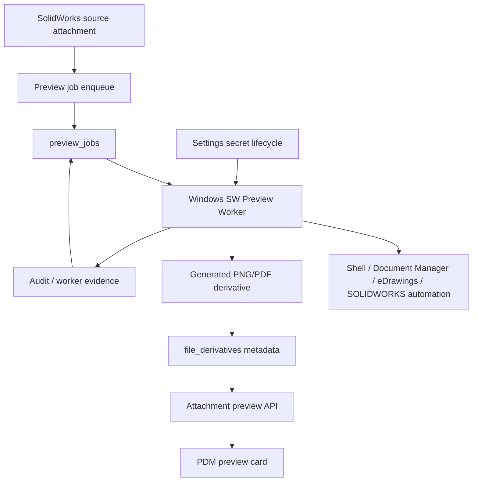

# SPEC-PDM-SW-NATIVE-PREVIEW-WORKER-001 - Windows SolidWorks Native Preview Derivatives

Status: DEV-105 RD Implemented / Revision B QA-QC Complete / Effectiveness Reclosed / Historical QA-105 18 of 18 Retained as Baseline / Primary Backfill Human-Gated / Production Release Gated
Date: 2026-08-31
Owner: Dev PM
Related DEV: `DEV-PDM-SW-NATIVE-PREVIEW-WORKER-001`
Related ADR: `.ai-doc/decisions/ADR-PDM-SW-NATIVE-PREVIEW-WORKER-001-windows-worker-derivative-boundary.md`
Related QA: `.ai-doc/qa/qa-pdm-sw-native-preview-worker-validation-plan-2026-07-06.md`

Related authority:

- `.ai-doc/specs/SPEC-PDM-SETTINGS-CENTER-001-system-settings-center-secret-lifecycle.md`
- `.ai-doc/decisions/ADR-PDM-SETTINGS-CENTER-001-settings-center-secret-governance.md`
- `.ai-doc/specs/SPEC-PDM-GCP-SECRET-MANAGER-001-solidworks-worker-credential.md`
- `.ai-doc/specs/SPEC-PDM-SOLIDWORKS-METADATA-READER-001-native-property-extraction.md`
- `.ai-doc/specs/SPEC-PDM-SHARED-3D-MA-BASELINE-001-root-model-and-manufacturing-baseline.md`
- `.ai-doc/specs/SPEC-PDM-DRAWING-REVISION-PACKAGE-002-first-class-attachment-package-model.md`
- `src/components/master-attachment-panel.tsx`
- `scripts/probe-document-manager-extractor.mjs`

## 0B. 2026-08-31 DEV-105 First-load Gallery Synchronization Effectiveness Reopen（現行 3D 派工補充權威）

本節補充並優先於§0A的結案／effectiveness敘述；§0A的converter、worker capability、hash、quality與歷史證據仍有效。
Revision B已由隔離 contract/service/browser aggregate 完成驗證；下列 lifecycle、client convergence與UX contract為現行實作邊界。
既有§10「normal use不得要求manual refresh」與pending-only foreground polling契約在本節再次確認，不是新產品範圍。

### 0B.1 新失敗訊號、事實與根因鏈

使用者於`/numbering/drawings`首次進入預覽圖模式時，絕大多數卡片顯示「預覽尚未建立」；重新整理後才出現實際3D圖。
本輪唯讀證據確認：

- canonical list只取一次`previewByRowKey` snapshot；worker完成後client沒有poll、invalidate或event更新，因此ready derivative已存在，
  畫面仍保留舊state；A0006 job由created到completed約3.7秒，reload後才可見。
- canonical detail會呼叫`ensureAutomaticPreviewJobsForSourceAssetsAsync`建立legacy gap job，但list畫面沒有收斂機制；
  目前QA runner以「開detail／手動跑worker／再開detail」驗證，沒有覆蓋同一gallery不reload轉ready。
- `resolveCanonicalDrawingPreview()`在source為null時仍可能依drawing number回
  `sourceType="primary_manufacturing_drawing"`；gallery又把map缺鍵silent fallback為`missing`，造成no-source與contract mismatch都被顯示為
  「預覽尚未建立」。

根因鏈：一次性read snapshot＋非同步worker是直接機制；缺少client convergence與strict map/state fail-closed是控制失效；
source binding與job intent仍跨transaction、read-side recovery成為正常補償，是lifecycle ownership不完整。2026-08-30的18案沒有
first-load delivery-path案例，因此屬effectiveness evidence coverage缺口，不是worker canary證據失效。

使用思考習慣：#多層次分析、#批判、#效用理論

### 0B.2 Spec Impact、設計取捨與架構邊界

- 分類：`Implementation needs correction + Compatible CAPA strengthening`；風險=`High / P1`。
- §0A.3(1)的after-commit enqueue與§0A.3(2)把detail GET當一般recovery producer的exact wording由本節intentional-replace；
  「新source自動建立job、舊gap可冪等補償」的產品意圖保留，但ownership收斂到transactional write boundary＋有退休條件的safety net。
- 保留：DB-backed`preview_jobs`單一queue authority、Windows worker、source-hash／generator idempotency、quality gate、
  side-effect-free list、private/no-store file-read、current capability與DEV-065 exact-row projection。
- 修正：source binding／job-intent transaction boundary、legacy recovery的退休條件、client pending convergence、strict map/state與pending UI。
- 不採用SSE/WebSocket：此工作量低、狀態變化短且只在可見pending卡片需要更新；bounded polling在延遲、複雜度、維運與驗證成本的總效用較高。
- 不採用per-card endpoint、第二套cache/store、optimistic ready或全域orchestration framework；list仍是同頁canonical snapshot authority。
- Schema/migration=`None`；ADR=`No New ADR`，因queue、worker與外部契約不變，只補足同一生命週期的不變量與UI收斂。

### 0B.3 Lifecycle implementation contract

1. `drawing_revision_files` current native source binding與其exact asset/hash/generator preview job intent必須在同一SQLite／PostgreSQL
   transaction內commit；`preview_jobs`即durable job intent，不新增outbox table。binding commit後必有matching ready derivative或
   active/terminal job。
2. renderer在commit後失敗只改job terminal state，不刪除或回滾source。若binding＋job intent transaction失敗，domain binding與job皆不commit；
   已寫physical bytes依既有upload compensation處理，不留下可見orphan binding。
3. upload retry、transaction retry、detail retry與reconciliation均使用同一idempotency key；concurrent call不得建立第二筆current-hash job。
4. canonical detail recovery保留為legacy safety net而非正常producer：必須bounded、system-owned、可觀測且不改domain ownership。
   Primary silent-gap inventory清零、連續兩次reconciliation run為zero delta，且受影響QA通過後，re-entry為移除normal GET read-side write；
   在此之前不得新增第二個read-side recovery caller。List永遠side-effect-free。
5. Primary/backfill apply仍受fingerprint-gated明確授權；本節不授權primary data mutation、production、deploy或release。

### 0B.4 Client convergence and request contract

1. `canonical-pdm-workbench.tsx`只在目前document visible、preview layout可見且當頁至少一筆`pending|delayed`時背景重取同一list；
   pending interval建議2500ms、delayed interval建議5000ms。hidden時停止timer，visible時立即重查；無pending/delayed、unmount或terminal時停止。
2. 同時間最多一個poll request；使用`AbortController`＋monotonic request id，stale response不得覆蓋較新的query/filter/page結果。
   可以復用`master-attachment-panel.tsx`既有foreground pending-poll pattern；只有確認有兩個current consumer時才抽小型hook。
3. 背景poll只替換latest canonical groups、totals、cursor、contract token與preview map；不得觸發visible full-list loading、
   清除既有rows、改URL/storage、跳scroll、關drawer、改selected row或移動keyboard focus。
4. map key set必須與本頁row key set完全相等。missing／extra／duplicate key是contract error並沿用list fail-closed；client不得建立
   fabricated`missing`projection。No source只能由server pure selector回`sourceType="none"`＋`state="missing"`。
5. Ready image若解碼失敗，該card依既有contract轉unavailable並停止自動重試；failed／unavailable／missing均不持續poll。

### 0B.5 UX Intent與pending animation contract

- 使用者任務：掃視圖號外形；主物件仍是preview card，pending只是media區的局部狀態，不新增頁首提示、toast、helper、panel或第二個焦點。
- Pending唯一主要訊號為卡片media placeholder內的14–16px低振幅loader與文字`預覽建立中`。動畫週期建議800–1200ms，
  不閃爍、不改卡片尺寸、不造成layout shift，ready／terminal／unmount後立即停止。
- `prefers-reduced-motion: reduce`時取消rotation／pulse，改為靜態progress icon＋同一文字；動畫不是唯一訊號。
- card或media region提供`aria-busy="true"`與包含`預覽建立中`的accessible name。每次poll不得用live region重複播報；
  transition到ready只更新該card狀態，不搶focus。No source顯示`無 3D 預覽`；不得顯示「預覽尚未建立」。
- Delayed顯示`預覽服務未回應`，failed／unavailable顯示`預覽暫時無法顯示`；可恢復細節留在既有drawer，不擴張卡片文案。

### 0B.6 Exact file boundary、acceptance與stop conditions

預期修改：

- `src/lib/drawing-revision-work-file.ts`、`src/lib/preview-derivatives.ts`：binding＋job-intent transaction與idempotency。
- `src/lib/pdm-canonical-preview.ts`、`src/lib/pdm-canonical-workbench-contract.ts`：strict source/state contract。
- `src/components/canonical-pdm-workbench.tsx`、`src/components/canonical-pdm-preview-gallery.tsx`、`src/app/globals.css`：
  pending-only poll、race protection、local animation、a11y與reduced motion。
  - `scripts/qc-dev-105-browser.mjs`、`scripts/qc-dev-105-service.mjs`、`scripts/qc-dev-105-contract.mjs`與aggregate runner：新增QA-105-019..030與受影響回歸。

完成條件固定為新`QA-105-019..030 = 12/12 PASS`，並重跑001..006、010、014..018；Revision B aggregate已達成此條件。最少要證明：cold-first-load
到同卡ready全程無reload；pending animation與reduced motion；no-source零poll與正確文案；map mismatch fail-closed；hidden／visible、
in-flight與stale response；selection/focus/scroll/drawer不變；failure terminal停止；Drawing/Part desktop+narrow、console/network、
task-owned cleanup與primary invariant全部成立。2026-08-30 18/18只保留歷史基線，不可作為本節PASS。

立即停止並回Dev PM：需要新schema／queue authority、SSE/WebSocket、per-card endpoint、CAD source mutation、native code進Next.js handler、
直接apply primary/production、無法維持transaction/idempotency，或只能以reload後成功、direct API、mock worker、歷史截圖替代同頁真實UI證據。

## 0A. 2026-08-30 DEV-105 3D Preview Recovery CAPA（歷史 corrective baseline；受§0B補充）

### 0A.1 事實、推論與根因鏈

已確認事實：

- A0002-M01與A0006-M01的current `.SLDPRT` source asset、physical bytes與SHA-256存在，但 current
  `file_derivatives=0`、`preview_jobs=0`。
- canonical workbench detail只讀既有source/job/derivative；missing投影沒有`mediaHref`，所以browser不會呼叫
  file-read的`preview=1` lazy enqueue。來源存在與「沒有預覽工作」形成封閉迴圈。
- A0002與歷史曾產生ready derivative的A0044，直接執行目前Windows Shell extractor時都在
  `Image.FromHbitmap`／PNG save拋出`System.ArgumentException`。這反證「只有A0002檔案損壞」。
- fixed local launcher把3D worker PID存在寫成healthy，未驗證HBITMAP轉換、PNG quality或實際SolidWorks source canary。
- UI把source exists + no artifact/job顯示為「目前沒有可預覽的3D檔案」，與資料事實不符。

多層次根因：直接原因是job未建立與HBITMAP轉PNG失敗；控制失效是不同source producer沒有共用
prepare/enqueue，worker health只檢查process；系統根因是completion evidence只證明歷史單點成功，沒有
「所有current native source必有ready derivative或active/terminal job」的silent-gap不變量與回歸gate。

### 0A.2 Spec Impact Preflight

- 分類：`Compatible CAPA amendment`；風險=`High / P1`。
- 保留：native source/derivative分離、source-hash guard、Windows隔離worker、token-gated BFF、quality gate、
  canonical file-read、shared preview projection與DEV-065 Part source selection。
- 修正：source lifecycle scheduling、detail recovery、Shell bitmap conversion、3D capability health、backfill inventory與
  source-exists UI copy。
- Schema/migration=`None`；復用`preview_jobs`、`file_derivatives`與`worker_capability_heartbeats`。
- ADR=`No New ADR`；既有worker boundary未改變。
- Out of scope：interactive 3D、STEP/glTF、CAD source mutation、SolidWorks COM in request handler、production deploy/release、
  未授權的primary/production backfill apply。

### 0A.3 Corrective implementation contract

1. 所有current native SolidWorks source在受控binding成功後，必須透過`requestedPreviewKindForSource()`與同一
   idempotent enqueue primitive建立exact source asset/hash/generator job；preview失敗不得回滾或破壞已完成的原檔上傳。
2. canonical detail在投影前呼叫同一prepare/recovery primitive；若source存在但沒有current ready derivative或active job，
   建立一筆job後重讀狀態。重複GET、upload retry與list/detail切換不得增加第二筆idempotency key。
3. historical `succeeded` job若current derivative遺失，recovery可對同一idempotency key重設為queued；current ready derivative
   或queued/running job不得被重設。
4. Windows extractor不得依賴目前會失敗的`System.Drawing.Image.FromHbitmap`路徑；HBITMAP轉PNG須保留尺寸與alpha、
   在finally釋放GDI object與COM object，且output通過PNG signature、dimensions與non-blank quality gate後才能complete。
5. 3D worker以`solidworks_3d_preview_png`回報capability。未執行canary時為`degraded/preview_canary_pending`；
   真實`.SLDPRT|.SLDASM` canary通過才可`ready`；converter/provider失敗為`blocked`。PID只能顯示process running，
   launcher/runtime status不得把它等同renderer healthy。
6. inventory/backfill命令預設dry-run，列出company/source/revision/file/hash/current artifact/job disposition；apply必須有
   explicit confirmation且只新增/重置preview job，不修改source/binding/revision。Primary apply另受fingerprint gate。
7. UI狀態：無source才可顯示「目前沒有可預覽的3D檔案」；source存在但無artifact/job時顯示
   「3D原檔已存在，預覽尚未建立」；recovery成功後顯示queued/running；失敗顯示redacted原因與下載原檔。

### 0A.4 Fixed acceptance and evidence gate

固定分母為`QA-105-001..018`，詳見
`.ai-doc/qa/qa-dev-105-3d-preview-recovery-validation-plan-2026-08-30.md`。結案必須同時具備：

- A0002、A0006、A0044三份真實Windows source-mode canary產生current非空白PNG；
- isolated SQLite upload/detail/backfill/idempotency、ready derivative read與source/derivative hash證據；
- 3D heartbeat的pending/ready/blocked三態與launcher不再process-only false positive；
- 圖號與料號工作台desktop+narrow正常入口、實際rendered image、狀態copy、console/network證據；
- task runtime/process/port/temp cleanup，以及primary SQLite schema、canonical identity、migration residue與FK前後不變。

任一canary、UI或invariant未通過即維持`◇ 驗證中`；不得用歷史PNG、fake worker、direct API或compile-only取代。

### 0A.5 Effectiveness verification and residual boundary

2026-08-30固定`QA-105-001..018`已18/18 PASS。service manifest為
`output/qa/dev-105-3d-preview/DEV105-service-2026-08-30T13-54-44-787Z/service-manifest.json`（24/24 checks），
browser manifest為`output/qa/dev-105-3d-preview/DEV105-browser-2026-08-30T13-56-01-283Z/browser-manifest.json`
（35/35 checks）。三份真實canary、兩工作台兩viewport、shared derivative、redacted failure、primary invariant、isolated build與
cleanup均成立。

Primary dry-run仍列A0002-M01與A0006-M01兩筆silent gap；本輪未取得primary apply或production deploy/release授權。
此段只記錄2026-08-30當時的判定：converter／worker／指定recovery路徑可視為local effective，資料補償維持
fingerprint-gated Human-Gated。2026-08-31新失敗訊號證明first-load gallery effectiveness未被覆蓋，整體DEV-105已依§0B重開；
不得再用本段18/18宣稱不需manual refresh或整體CAPA已結案。

## 0. 2026-08-19 Phase 1E 2D Preview E2E Reopen Amendment（現行派工權威）

### 0.1 重開原因與使用者成功條件

既有Phase 1證據證明queue／derivative／3D Shell worker與placeholder可以運作，但沒有證明真實`.SLDDRW`會產生2D預覽。使用者在固定本機環境再次驗證`A0002-M01.SLDDRW`後仍只看見「預覽產生中」。唯讀runtime／DB證據為：

- source asset存在，檔案大小為295,934 bytes，SHA-256為`e6646cb4be002c7213b3c75cccf5c6aad97fddb11aa8a36e400b0fe1dd32a6ad`；
- preview job `f88ad620-88b3-4514-9882-d9ba8bea72ca`為`drawing_pdf/queued`、`attempt_count=0`、`locked_by=null`，沒有error或completion；
- 3D Windows Shell worker與recognition worker在線，但Document Manager preview worker PID為0、state=`not_configured`；
- A0002已有3D PNG derivative，沒有2D derivative。

因此這不是「轉檔較慢」或已進入Document Manager後的檔案內容錯誤，而是工作從未被相容worker領取。原本把2D「處理較久」截圖列入DEV-056 completion evidence屬完成狀態誤判，現改列partial baseline。

使用者已確認的產品契約：本機測試與真實環境都只在UI輸入、測試、啟用SolidWorks Document Manager key。環境可以使用不同安全provider，但不得要求日常PowerShell／`.env.local`重複設定或人工重啟worker；預覽完成必須在原工作頁自動顯示。

### 0.2 Spec Impact Preflight與治理

- 分類：`Intentional replacement + compatible extension`。
- 保留：本ADR的Windows隔離worker、source/derivative分離、source-hash guard、token-gated BFF、private/no-store、current-owner completion、blank-output quality gate、Phase 2 PDF與Phase 3 interactive 3D邊界。
- 取代：DEV-056完成宣告、launcher以plaintext env／GSM設定判斷2D worker是否可啟動、SLDDRW Phase 1自動建立`drawing_pdf`、queued job可永久呈現「產生中」、recognition或3D worker狀態可代替2D renderer readiness的任何舊敘述。
- ADR判定：不新增ADR；既有Windows Worker Derivative Boundary仍正確，本amendment只修正同一架構內的啟動、job kind、capability與read projection契約，並同步更新既有ADR。
- 風險：Medium implementation / P0 defect。修改跨launcher、worker、queue producer、read projection與settings UI，但不改CAD source、domain ownership、permission或production data。

### 0.3 Current Phase執行邊界

可執行：本機Phase 1E-A～D、既有SQLite資料的非破壞性runtime recovery、focused automated tests、真實A0002 worker smoke與三viewport browser QC。

不在本Phase：`.SLDDRW -> PDF`、interactive 3D、desktop SOLIDWORKS COM/Add-in、高擬真重渲染、CAD source mutation、歷史批次回填、正式資料修復、staging/production resource/IAM/migration/deploy/release。

Schema migration=`None`：復用既有`preview_jobs`、`file_derivatives`及generic `worker_capability_heartbeats`；新capability code不需要新增欄位或constraint。

### 0.4 Canonical Phase 1E資料流

```text
Settings UI create/test/activate
  -> windows_dpapi (local) / google_secret_manager (staging-production)
  -> private token-gated exact-version broker
  -> persistent Document Manager preview worker hot-applies active version

SLDDRW current source hash
  -> native_thumbnail_png preview job
  -> Document Manager worker claims exact compatible kind
  -> read-only embedded sheet preview extraction + quality gate
  -> thumbnail_png or sheet_png derivative tied to source hash
  -> unified detail polling renders PNG without manual refresh
```

不可跨越的界線：

```text
secret / native path / absolute source path -> trusted server and worker only
preview job -> no plaintext secret and no source mutation authority
derivative -> browser-readable display artifact, never controlled CAD source
```

### 0.5 Implementation Contract

#### 0.5.1 Launcher與credential hot apply

- `scripts/start-localhost-3000.ps1`的2D worker啟動資格只能依Windows平台、worker script／interop可用、server URL與preview worker service token判斷；不得再用`PDM_SOLIDWORKS_DOCUMENT_MANAGER_KEY`、alternate env key或GSM env是否存在作為啟動gate。
- launcher必須啟動無credential的persistent 2D worker。worker在無active key時回`blocked/preview_credential_missing` capability heartbeat並暫不claim，不得退出或要求重啟。
- worker沿用`/api/preview-workers/solidworks-document-manager-key`與`resolveActiveSolidWorksDocumentManagerKey()`；local解析`windows_dpapi`，staging/production解析`google_secret_manager`。UI後設、rotation或revoke要由同一PID在下一poll／refresh週期套用。
- key最多保留60秒process-memory cache，只能傳入當次native child；不得進global process env、command line、DB、job payload、stdout/stderr、browser response或evidence。
- runtime status的`not_configured`只表示worker必要執行元件或service token缺失；credential缺少屬於worker `blocked` capability，不得把兩者混為同一狀態。

#### 0.5.2 Preview kind與derivative contract

- Current Phase自動預覽kind由`src/lib/preview-derivatives.ts`的單一`requestedPreviewKindForSource(extension)` resolver決定：`.sldprt/.sldasm/.slddrw -> native_thumbnail_png`；所有producer必須呼叫resolver，不得各自寫ternary。
- `.slddrw`的Document Manager worker claim必須宣告`supportedKinds=["native_thumbnail_png"]`及`supportedExtensions=["slddrw"]`；成功輸出`derivative_kind=thumbnail_png|sheet_png`、`mime_type=image/png`。
- `drawing_pdf`只代表Phase 2可列印PDF，不得在Phase 1的attachment list/create、candidate、package、approval evidence或unified detail自動enqueue。現有public/internal request shape可保留該enum以相容future phase，但未配置PDF renderer時不可讓自動流程建立永久無人claim的工作。
- 已存在的錯kind queued job不得in-place改寫歷史。prepare/recovery流程將其終止為`failed/preview_kind_unavailable`，保留原requested kind與timestamps，再以同一current source hash idempotently建立`native_thumbnail_png`工作。
- active job去重維持source asset＋source hash＋requested kind＋generator profile；重讀頁面不得製造重複job。

#### 0.5.3 2D renderer capability heartbeat

- 復用`worker_capability_heartbeats`並固定`worker_kind=document_manager_preview`、`capability_code=solidworks_2d_preview_png`。
- 新增`POST /api/preview-workers/heartbeat` token-gated route；request最小欄位為`workerId`、`status=ready|blocked|degraded`、`appliedSecretVersion`、`appliedSecretFingerprint`、`rendererVersion`、`issueCode`、`lastAppliedAt`。response只回`accepted/receivedAt`，不得回secret或provider resource path。
- worker在idle與running期間每15秒heartbeat；30秒未見即offline。`ready`必須同時滿足interop／renderer可用、active secure-provider version可讀、worker已ack exact version/fingerprint。
- DEV-035 recognition capability `solidworks_document_manager`、3D Shell process存在、active secret metadata或最近probe PASS，任何單一條件都不能替代`solidworks_2d_preview_png`在線。
- Settings UI分開呈現「憑證已啟用／測試」、「原生屬性辨識worker」與「2D預覽worker」；2D status只能取本capability heartbeat。

#### 0.5.4 Recovery與使用者可見狀態

- `master-attachments`、candidate/drawing/part/review的unified entity detail及任何共用preview projection，在decorate前必須進入同一prepare/recovery service，禁止只有legacy attachment list會回收stale job。
- `queued`且120秒仍`locked_by=null`：終止為`failed/preview_worker_unavailable`。若原因是kind不相容，使用`preview_kind_unavailable`並建立正確PNG job。
- `running`且30秒無job heartbeat：最多requeue三次；第三次後終止為redacted failed。old owner completion/failure維持拒絕。
- UI mapping：
  - `queued + renderer online`：`等待預覽服務`，短時poll；
  - `running + fresh heartbeat`：`預覽產生中`；
  - `renderer blocked/offline`：顯示`2D預覽服務未就緒`及Admin settings／重試動作；
  - terminal failure：`無法預覽`＋redacted reason＋下載原檔；
  - ready current-hash PNG：直接顯示，不保留spinner。
- 「系統完成後會自動更新」只能出現在系統已具備可接手worker的queued/running狀態；沒有worker、錯kind或逾時時不得使用。

#### 0.5.5 Preview media rendering與版面契約

- 2D preview endpoint可能回傳`image/png`的`thumbnail_png|sheet_png` derivative；即使上游卡片語意是文件預覽，前端必須依實際response MIME選擇影像 renderer，不得把PNG放進瀏覽器文件／影像viewer iframe。
- `image/*` derivative使用``並填滿`.drawing-preview-frame`的可用寬高，`object-fit: contain`、置中、不可裁切或變形；PDF仍使用文件 renderer並保留原檔開啟連結。
- 影像 renderer不得依賴衍生檔的640×480 intrinsic size；desktop/tablet/phone均須以主視覺舞台為尺寸來源，且不得產生水平溢出或把圖釘在左上角。
- browser QC須驗證2D link綁定current derivative、實際renderer為image、影像元素置中且至少覆蓋舞台95%寬高；比例差異造成的contain留白屬可接受，但不得以cover裁切工程圖面。

### 0.6 API、資料與權限影響

- 保留`POST /api/preview-jobs/claim`、job heartbeat、complete/fail與derivative streaming contract；claim仍以supported kind／extension做exact filter。
- 新增`POST /api/preview-workers/heartbeat`，沿用preview worker service token、constant-time compare、private/no-store與repository upsert；browser session不得呼叫。
- credential broker保持worker-only；Admin UI不直接取得key。
- 所有preview enqueue／retry與derivative read沿用source attachment權限及company scope；heartbeat不得取得CAD檔案或人類角色權限。
- 無schema migration、無source attachment migration、無歷史job/data直接修復腳本；A0002錯kindjob由產品recovery path收斂。

### 0.7 Exact Component Boundary

- Launcher/worker：`scripts/start-localhost-3000.ps1`、`scripts/run-solidworks-document-manager-preview-worker.mjs`。
- Worker APIs：`src/app/api/preview-workers/solidworks-document-manager-key/route.ts`、`src/app/api/preview-workers/heartbeat/route.ts`、`src/app/api/preview-jobs/claim/route.ts`及既有job heartbeat/complete/fail routes。
- Credential/readiness：`src/lib/settings-secret-lifecycle.ts`、`src/lib/repositories/settings-secret-async-repository.ts`、`src/app/settings/page.tsx`。
- Queue/recovery/projection：`src/lib/preview-derivatives.ts`、`src/lib/master-attachments-async.ts`、`src/lib/pdm-entity-detail.ts`。
- Automatic producers：`src/lib/repositories/number-lifecycle-simplification-async-repository.ts`、approval evidence file route、drawing revision package file route、candidate revision file route及任何搜尋命中的SLDDRW auto-enqueue adapter。
- UI consumers：drawing detail preview、unified entity detail/workspace preview gallery及共用attachment preview status components。
- Validation：既有native preview/redaction/master-attachments/settings/DEV-035 gates，加上`qc:dev-056:2d-preview-e2e`與`qc:dev-056:2d-preview-browser`。

### 0.8 Failure Recovery

| Failure | Stable result | Recovery |
|---|---|---|
| UI尚未啟用real-provider key | worker `blocked/preview_credential_missing`；不claim | Admin在UI測試／啟用；同PID自動恢復 |
| active version失效或revoked | `blocked/preview_credential_unavailable`；清除cache | UI啟用已測試版本；不用restart |
| interop/renderer不存在 | `blocked/preview_renderer_unavailable` | 修復受控worker安裝；不得fallback到request handler |
| producer/worker kind不相容 | 舊job `preview_kind_unavailable`＋新PNG job | contract test阻止再次漂移 |
| queued逾120秒無claim | `preview_worker_unavailable` | 顯示服務未就緒；服務恢復後idempotent retry |
| running heartbeat逾30秒 | requeue最多3次，之後failed | 新owner接手；old owner結果拒絕 |
| PNG blank/low-information | terminal redacted fail，不建立ready derivative | 提示在SolidWorks儲存preview或未來renderer phase |
| source hash changed | reject completion、舊derivative stale | 對新hash排新job |

### 0.9 RD Phases與完成Gate

- [x] Phase 1E-A：launcher取消env-key gate；persistent 2D worker、provider-neutral broker hot apply與runtime status語意完成。
- [x] Phase 1E-B：所有SLDDRW automatic producers與worker claim統一`native_thumbnail_png`；舊錯kindjob安全收斂。
- [x] Phase 1E-C：獨立2D capability heartbeat、settings projection與共用detail recovery完成。
- [x] Phase 1E-D：focused automated gates、真實A0002 worker/PNG/source-hash/redaction證據及browser DOM evidence完成。

完成必須同時滿足：A0002 job被`solidworks_2d_preview_png` worker claim、attempt至少1、exact active version被ack、ready PNG derivative綁定current source hash、原頁自動出圖、source bytes/hash不變、secret redaction sweep為0、offline/mismatch/timeout negative cases不再永久spinner。缺任一項不得恢復DEV-056完成狀態。

Evidence輸出：`output/qa/dev-056-2d-preview/<runId>/`，至少保存manifest、source/job/heartbeat/derivative allowlisted metadata、before/after source hash、redaction結果、三viewport screenshots、console/network summary與verdict；不得保存key、absolute secret path或raw broker body。

### 0.9.1 DEV-056 local completion receipt（2026-08-19）

- Run：`output/qa/dev-056-2d-preview/20260819132108/`；focused E2E gate `18/18`。
- A0002 source hash `e6646cb4…32a6ad`與bytes在worker前後一致；job `d8d13547-da31-4bb1-8b72-d352a083a516`以`native_thumbnail_png`被dedicated worker claim，`attempt_count=1`、`succeeded`。
- Heartbeat capability為`solidworks_2d_preview_png`、status=`ready`、active exact version=`3`；derivative為current-hash `thumbnail_png`、`image/png`、640×480、generator=`windows_solidworks_preview_worker`。
- Authenticated browser DOM驗證A0002-M01 workspace已選定`2D 圖面`、preview link指向該derivative，且沒有stuck `預覽產生中`文字；未手動refresh。三viewport sweep為`output/qa/dev-056-2d-preview/20260819135345-browser/browser-verification.json`，並驗證PNG以image renderer置中填滿預覽舞台。
- 同日 typecheck、affected lint、native preview 109/109、redaction 68/68、master attachments 103/103、settings lifecycle 34/34與GSM 36/36均通過；temporary 2D worker已停止，既有3000 runtime未停止。
- 本 receipt 只關閉DEV-056 Phase 1E local A0002 `.SLDDRW -> PNG`；`.SLDASM`廣度、Phase 2 PDF、staging/production GSM與production rollout仍是獨立gate。

### 0.10 Stop Conditions

若需要plaintext持久化、browser取得key、Next.js同步native CAD、desktop COM/Add-in、新license採購、CAD source write、destructive schema/data repair、live cloud/IAM、production deploy/release，或真實A0002無法取得受控worker證據，停止並回PM／release gate。不得以compile、mock、fixture、3D成功或2D placeholder替代端到端PASS。

## 2026-08-07 Credential Authority Amendment

The native Windows worker and derivative boundary in this document remain authoritative. The active SolidWorks Document Manager key must now resolve from Google Secret Manager through `DEV-058`; Supabase Vault is not a current production target. A saved/active key proves credential metadata only and must not be presented as evidence that the Windows 2D worker is online.

External reference:

- SOLIDWORKS Document Manager `ISwDMDocument10::GetPreviewPNGBitmap`: https://help.solidworks.com/2026/English/api/swdocmgrapi/SolidWorks.Interop.swdocumentmgr~SolidWorks.Interop.swdocumentmgr.ISwDMDocument10~GetPreviewPNGBitmap.html
- SOLIDWORKS Document Manager `ISwDMSheet2::GetPreviewPNGBitmap`: https://help.solidworks.com/2026/english/api/swdocmgrapi/SolidWorks.Interop.swdocumentmgr~SolidWorks.Interop.swdocumentmgr.ISwDMSheet2~GetPreviewPNGBitmap.html
- SOLIDWORKS Document Manager PNG preview example: https://help.solidworks.com/2025/english/api/swdocmgrapi/get_png_preview_bitmap_and_stream_for_configuration_example_csharp.htm

## 1. Human Decision Brief

Source: 2026-07-06 user discussion after SolidWorks Document Manager API key setup.

Confirmed product decisions:

- The user wants PDM to show SolidWorks native file previews in the attachment panel, similar to the Windows File Explorer experience.
- Current placeholders `預覽待產生` are not acceptable as the end-state for normal `.SLDPRT`, `.SLDASM` and `.SLDDRW` attachments.
- The first value slice is native SolidWorks file to PNG thumbnail:
  - `.SLDPRT -> PNG`
  - `.SLDASM -> PNG`
  - `.SLDDRW -> PNG`
- The second slice is `.SLDDRW -> PDF` for printable drawing preview.
- The browser must show web-readable derivatives, not parse native SolidWorks files directly.
- The SolidWorks API key already entered in settings is a prerequisite only. It does not, by itself, create previews.

Rejected behavior:

- Do not attempt to preview `.SLDPRT`, `.SLDASM` or `.SLDDRW` directly in the browser.
- Do not call SolidWorks COM, eDrawings, shell thumbnail handlers or Document Manager directly from a Next.js request handler.
- Do not store generated PNG/PDF derivatives as replacements for the source SolidWorks files.
- Do not treat a Google Drive preview iframe as authoritative SolidWorks native preview.
- Do not expose SolidWorks Document Manager API/license key material to browser code, job payloads, screenshots, report JSON or worker logs.
- Do not claim real SolidWorks preview readiness from a local fake extractor only.

AI assumptions:

- A trusted Windows worker host will be available for real SolidWorks/eDrawings/Document Manager preview generation.
- Local automated RD/QC can use a fake preview generator to validate PDM queue, metadata, UI and security behavior; real worker evidence must be captured separately.
- A Windows Shell thumbnail worker can provide useful File Explorer-like PNG thumbnails for some native files, but its output must be quality-gated because `.SLDDRW` can return blank or low-information images on some workstations.
- SOLIDWORKS Document Manager PNG preview may return an embedded/saved preview bitmap. It is not guaranteed to re-render stale or unsaved model geometry.
- High-quality drawing PDF generation may require eDrawings or SOLIDWORKS automation and should remain a later gated phase.
- Native preview derivatives are operational display aids. The source SolidWorks file, released drawing package and manufacturing baseline remain the controlled evidence.

Re-entry triggers:

- User wants Windows Explorer shell thumbnail handler to be called from the browser or a Next.js request handler instead of the controlled worker.
- User wants preview generation failure to block drawing release or manufacturing baseline release.
- User wants high-fidelity re-rendered drawing/model output in Phase 1 instead of embedded preview bitmap extraction.
- RD needs production deploy, production migration, direct data repair, data deletion, paid external service, or a persistent secret outside the existing settings secret boundary.
- RD cannot obtain a Windows worker host, Document Manager/equivalent component, sample files, or secret access boundary for real preview evidence.

## 2. Problem

The current attachment preview panel already has a first-level 3D/2D preview board, but the rendering contract is limited:

- PDF attachments can be shown inline.
- Image attachments can be shown inline.
- Uploaded Google Drive files can be embedded through Drive preview.
- Native `.SLDPRT`, `.SLDASM` and `.SLDDRW` attachments fall back to `預覽待產生`.

This is correct for browser safety, but incomplete for production PDM usage. Users expect a released drawing or part record to show a recognizable preview without manually downloading the SolidWorks file.

The missing capability is a derivative pipeline:

```text
native SolidWorks source file
  -> queued preview job
  -> trusted Windows worker extracts/renders PNG/PDF
  -> PDM stores derivative with source hash and generator evidence
  -> browser displays PNG/PDF
```

## 3. Product Rule

Authoritative boundary:

```text
Native CAD source = controlled source evidence
Preview derivative = generated browser-readable display artifact
Preview job = auditable background work
Windows preview worker = only place allowed to run native SolidWorks preview tooling
Browser = reads derivative status and derivative files only
```

Preview derivatives must be tied to the exact source file hash:

- A derivative is valid only for its recorded `source_file_asset_id` and `source_content_hash`.
- If the source attachment changes, the existing derivative becomes stale.
- A derivative cannot be used as a source CAD file, drawing package source, shared 3D source, or manufacturing baseline source.
- Failed preview generation must show a next action and retry path; it must not create a blank panel.

## 4. Scope

### 4.1 In Scope

- Add a background preview job and derivative metadata model.
- Add server APIs to enqueue, list, retry and serve preview derivatives.
- Add a trusted worker claim/complete contract for Windows preview generation.
- Generate and store PNG thumbnails for `.SLDPRT`, `.SLDASM` and `.SLDDRW`.
- Integrate generated preview derivatives into the current drawing/part attachment preview cards.
- Show preview states: missing, queued, generating, ready, failed, stale and skipped.
- Use the existing settings secret lifecycle to resolve the active SolidWorks Document Manager/equivalent credential server-side only.
- Add local fake worker/QC so the PDM pipeline can be verified without real SolidWorks.
- Add a Windows worker path that can use Shell thumbnail extraction, Document Manager, eDrawings or equivalent renderers behind the same claim/complete contract.
- Reject blank or low-information PNG output before completing a job.
- Add real Windows worker smoke evidence gate before claiming any native preview readiness; require Document Manager/eDrawings/equivalent evidence before claiming full `.SLDASM` / `.SLDDRW` readiness.

### 4.2 Out of Scope

- Production deployment or production migration.
- Direct data repair, data deletion or reassignment of existing file assets.
- Calling Windows Explorer shell preview handlers from the browser or from Next.js request handlers. Shell extraction is allowed only in the isolated worker.
- Interactive browser 3D viewer, STEP/glTF conversion or geometry measurement.
- High-quality re-rendering with SOLIDWORKS automation in Phase 1.
- Making preview generation a release blocker in Phase 1.
- Replacing existing PDF/image/Google Drive preview behavior.
- Storing SolidWorks API/license key plaintext in preview jobs, derivative metadata, logs, report JSON or browser responses.

## 5. End-State Architecture



Invariant:

- Next.js/API owns authorization, queue state and derivative metadata.
- The Windows worker owns native SolidWorks preview generation or extraction.
- The UI never receives a native API key and never attempts to interpret native CAD binary.
- The preview card uses derivative files before falling back to source attachment mode.

## 5.1 Architecture Memory Capsule

Fixed decisions:

- The user experience target is Windows File Explorer-like preview visibility, but the implementation is not Windows File Explorer integration.
- Browser-native SolidWorks parsing is rejected.
- The source file remains immutable controlled evidence.
- PNG/PDF derivatives are generated artifacts and must be traceable to source hash and generator version.
- Phase 1 focuses on useful PNG thumbnail availability.
- Phase 2 may add drawing PDF generation.
- Phase 3 may evaluate interactive 3D only after static preview is reliable.

Module boundaries:

- `DEV-PDM-SETTINGS-CENTER-001` owns secret lifecycle and redaction.
- `DEV-CAD-001` remains the external evidence gate for licensed/equivalent native CAD reader deployment.
- This DEV owns preview queue, derivative metadata, worker contract and UI rendering behavior.
- `master-attachment-panel` owns the first UI consumption point.
- Shared 3D / MA baseline source authority is not changed by preview derivatives.

Non-negotiable safety rules:

- Do not run native CAD tooling inside request/response latency.
- Do not store plaintext secrets in jobs or derivatives.
- Do not show a derivative if its source hash no longer matches.
- Do not overwrite, delete or silently mutate existing source files.
- Do not mark full real SolidWorks preview complete until sample `.SLDPRT`, `.SLDASM` and `.SLDDRW` files produce evidence on a Windows worker or approved equivalent. Partial file-type evidence must be labeled as partial.

## 6. Domain Model Contract

Exact table and column names are RD-owned if the contracts below are preserved.

### 6.1 Preview Jobs

Required object: `preview_jobs` or equivalent.

| Field | Contract |
|---|---|
| `id` | Stable job id. |
| `company_id` | Company boundary. |
| `source_file_asset_id` | Native source attachment. |
| `source_content_hash` | Copied source hash at enqueue time. |
| `requested_kind` | `native_thumbnail_png`, `drawing_pdf`, `interactive_3d` or equivalent. |
| `source_extension` | Normalized extension, e.g. `sldprt`, `sldasm`, `slddrw`. |
| `status` | `queued`, `running`, `succeeded`, `failed`, `skipped`, `cancelled`. |
| `priority` | Worker scheduling priority. |
| `attempt_count` | Retry control. |
| `locked_by`, `locked_at` | Worker claim fields. |
| `idempotency_key` | Prevent duplicate active jobs for the same source hash/kind/profile. |
| `generator_profile` | `document_manager_preview_png`, `edrawings_pdf`, `fake_preview_worker`, etc. |
| `error_code`, `error_summary` | Redacted failure detail. |
| `created_by`, `created_at`, `updated_at`, `completed_at` | Audit. |

Rules:

- There can be at most one active job per `(source_file_asset_id, source_content_hash, requested_kind, generator_profile)`.
- A worker must fail the job as stale if the current source hash differs from `source_content_hash`.
- `failed` jobs can be retried by creating a new job or resetting with explicit audit.
- `skipped` is valid when the source type is unsupported or the file has no embedded preview and no render engine is configured.

### 6.2 File Derivatives

Required object: `file_derivatives` or equivalent.

| Field | Contract |
|---|---|
| `id` | Stable derivative id. |
| `source_file_asset_id` | Source file. |
| `source_content_hash` | Source hash used to generate derivative. |
| `derivative_kind` | `thumbnail_png`, `drawing_pdf`, `sheet_png`, `model_preview_png`, etc. |
| `derivative_file_asset_id` | Stored derivative file or storage pointer. |
| `mime_type` | `image/png`, `application/pdf`, etc. |
| `width`, `height`, `page_count` | Display metadata where applicable. |
| `generator_profile`, `generator_version` | Worker/tool evidence. |
| `preview_job_id` | Origin job. |
| `status` | `ready`, `stale`, `retired`, `failed`. |
| `created_at`, `created_by_worker` | Audit. |

Rules:

- Derivatives inherit read permission from the source file and entity.
- Derivatives are not user-uploaded source attachments and must not appear as package source files unless a later spec explicitly allows export packaging.
- When a newer derivative of the same kind/source hash is created, older derivatives may be retired but not silently deleted.
- If source hash changes, prior derivatives become stale.

### 6.3 Worker Runtime Identity

Required object: worker registration/configuration or equivalent.

Minimum contract:

- worker id and display name.
- host type: `windows_shell`, `windows_document_manager`, `windows_edrawings`, `fake_local`.
- supported extensions.
- supported derivative kinds.
- last heartbeat.
- tool version and build/version metadata.
- redacted readiness state.

The worker must authenticate as a trusted service identity. It must not use a human browser session.

## 7. Worker Contract

The worker is a separate Windows process or service. It may be implemented in C#/.NET, PowerShell wrapper plus executable, or another Windows-native runtime, but it must obey the PDM contract.

Input:

```json
{
  "jobId": "job_...",
  "sourceFileAssetId": "file_...",
  "sourceContentHash": "sha256:...",
  "sourceExtension": "sldprt",
  "requestedKind": "native_thumbnail_png",
  "sourcePathOrDownloadUrl": "...",
  "outputDirectory": "...",
  "generatorProfile": "windows_solidworks_preview_worker"
}
```

Output:

```json
{
  "jobId": "job_...",
  "status": "succeeded",
  "sourceContentHash": "sha256:...",
  "derivatives": [
    {
      "kind": "thumbnail_png",
      "path": "...",
      "mimeType": "image/png",
      "width": 800,
      "height": 600,
      "generatorProfile": "windows_solidworks_preview_worker",
      "generatorVersion": "..."
    }
  ],
  "warnings": []
}
```

Failure output must be redacted:

```json
{
  "jobId": "job_...",
  "status": "failed",
  "errorCode": "source_has_no_saved_preview",
  "errorSummary": "SolidWorks 檔案內沒有可抽取的預覽，請在 SolidWorks 開啟並儲存後重試，或改用渲染型 worker。"
}
```

Security rules:

- The active SolidWorks Document Manager/equivalent credential must be resolved through server-side settings secret lifecycle or a trusted worker credential broker.
- Secret values must not be serialized into job rows, worker logs, stdout captured artifacts or UI responses.
- Worker output files must be validated by MIME, extension, size and hash before PDM stores metadata.
- Worker must use a temp directory per job and clean up after completion/failure.

## 8. Preview Engine Phases

### Phase 1 Engine - Shell / Document Manager / Equivalent Embedded PNG

Purpose:

- Extract a PNG preview bitmap from native `.SLDPRT`, `.SLDASM` and `.SLDDRW` files.

Expected tool behavior:

- For part/assembly, use Windows Shell thumbnail extraction, Document Manager document/configuration preview APIs or approved equivalent.
- For drawing, use sheet preview APIs, eDrawings/SOLIDWORKS rendering or approved equivalent. Shell output must be quality-gated because it can return blank thumbnails for `.SLDDRW`.
- If no saved preview exists, return a specific `source_has_no_saved_preview` status.
- If the output appears blank or low-information, return a redacted failed/skipped status and do not create a ready derivative.

Acceptance boundary:

- Phase 1 may produce embedded/saved/Shell preview thumbnails. It does not guarantee full re-rendering from current model geometry. Partial file-type proof must be labeled; `.SLDDRW` Shell blank output does not close drawing readiness.

### Phase 2 Engine - Drawing PDF

Purpose:

- Generate printable PDF preview for `.SLDDRW`.

Expected tool candidates:

- eDrawings automation.
- SOLIDWORKS automation on a controlled Windows worker.
- An approved equivalent drawing renderer.

Gate:

- Requires explicit authorization because it may need installed software, desktop automation, licensing, worker isolation and longer job timeouts.

### Phase 3 Engine - Interactive 3D

Purpose:

- Generate browser-viewable 3D format such as glTF or a controlled web viewer package.

Gate:

- Requires separate architecture decision, performance/storage review and viewer security review.

## 9. API / Service Contract

Route names may vary if the contracts are preserved.

| Route | Method | Purpose | Role |
|---|---|---|---|
| `/api/attachments/[attachmentId]/previews` | `GET` | List ready/stale/failed preview derivatives for a source file | source file readers |
| `/api/attachments/[attachmentId]/preview-jobs` | `POST` | Enqueue or retry preview job | Admin, Engineer, allowed attachment manager |
| `/api/preview-jobs/claim` | `POST` | Worker claims queued job | trusted worker only |
| `/api/preview-jobs/[jobId]/complete` | `POST` | Worker reports success/failure and uploads derivative metadata | trusted worker only |
| `/api/file-derivatives/[derivativeId]` | `GET` | Stream derivative for inline browser display | source file readers |
| `/api/settings/integrations/solidworks-preview-worker` | `GET` | Redacted worker readiness state | Admin |

Service contract:

```ts
enqueuePreviewJob(input: {
  companyId: string;
  actorUserId: string;
  sourceFileAssetId: string;
  requestedKind: "native_thumbnail_png" | "drawing_pdf";
  idempotencyKey: string;
}): Promise<{ jobId: string; status: "queued" | "already_exists" }>;

listFileDerivatives(input: {
  companyId: string;
  actorUserId: string;
  sourceFileAssetId: string;
}): Promise<Array<{
  derivativeId: string;
  kind: string;
  status: "ready" | "stale" | "failed";
  mimeType: string;
  width?: number;
  height?: number;
  sourceContentHash: string;
}>>;

claimPreviewJob(input: {
  workerId: string;
  supportedKinds: string[];
  supportedExtensions: string[];
}): Promise<{ job: PreviewJobClaim | null }>;

completePreviewJob(input: {
  workerId: string;
  jobId: string;
  sourceContentHash: string;
  result: PreviewWorkerResult;
}): Promise<{ accepted: boolean; derivativeIds: string[] }>;
```

Transaction requirements:

- Job completion must validate source hash and worker identity before storing derivatives.
- Derivative metadata and stored derivative pointer must be committed atomically.
- If upload/storage succeeds but metadata fails, the system must either clean orphan output or mark it for cleanup.
- If metadata succeeds but UI cache is stale, the next preview list request must still return the derivative.

## 10. UI Contract

The current first-level preview cards should become derivative-aware.

Priority order for preview display:

1. Ready derivative matching current source hash and expected slot.
2. Existing browser-readable source attachment: PDF/image.
3. Google Drive preview if uploaded and no native derivative exists.
4. Native source placeholder with status and next action.

Required visible states:

| State | UI meaning |
|---|---|
| `missing` | No matching 3D/2D source file exists. |
| `queued` | Preview job is waiting. |
| `running` | Preview is being generated. |
| `ready` | Show PNG/PDF derivative. |
| `failed` | Show reason and `重新產生預覽`. |
| `stale` | Source changed; show old preview as stale only if clearly marked or hide it and enqueue new job. |
| `skipped` | Unsupported or no embedded preview; show actionable explanation. |

Required UI copy behavior:

- The preview card must answer what happened and what to do next.
- Do not show raw worker stack traces, command lines, API routes or secret hints.
- Native files are automatically queued when the attachment is created or listed; normal use must not require manual refresh or manual enqueue.
- The UI uses icon + tone + motion as the primary state signal, with only short supporting text; color alone is not the state contract.
- `產生中` / animated loader means the user can wait; `處理較久` / clock means the system has not received a heartbeat recently and will recover automatically; `無法預覽` / alert or download means the user can use the source file or retry when offered.

Phase 1 auto-orchestration contract:

- Attachment list/create paths call stale-job recovery and idempotent native preview enqueue without blocking source-file readback.
- The browser polls only while a native preview is pending, in the foreground, with an in-flight guard; successful derivatives appear automatically.
- Workers send a heartbeat every five seconds while processing. A job with no heartbeat for 30 seconds is requeued up to three attempts, then becomes a redacted terminal failure.
- Completion and failure are accepted only from the worker currently owning the running job, so a stale worker cannot overwrite an automatically recovered job.
- Terminal failure is not silently retried forever. Retry remains an explicit recovery action; skipped/unsupported sources fall back to downloading the original file.

## 11. Permission Contract

Read:

- Anyone who can read the source attachment can read ready preview derivatives for that attachment.
- A user who cannot read the source cannot infer derivative existence, filenames or errors.

Create/retry:

- Admin and attachment managers can enqueue/retry.
- Engineers can enqueue for attachments they are allowed to manage.
- Reviewer may view preview state but should not need mutation rights unless already allowed by attachment workflow.

Worker:

- Worker uses a service identity.
- Worker can claim only preview jobs.
- Worker cannot read arbitrary settings or unrelated attachments.
- Worker cannot activate/revoke settings secrets.

## 12. Migration / Compatibility Contract

Existing attachments:

- Existing `.SLDPRT`, `.SLDASM` and `.SLDDRW` files remain valid.
- No historical source file mutation is authorized.
- Preview jobs can be created lazily when a drawer opens or in an Admin batch enqueue.

Existing preview behavior:

- PDF/image inline preview must keep working.
- Google Drive preview must keep working.
- Existing placeholder behavior remains a safe fallback until derivatives exist.

Storage:

- Local/dev can store derivatives through the existing local file storage provider.
- Production storage target and retention policy require release/storage governance before production cutover.

## 13. Failure Modes

| Failure | Required behavior |
|---|---|
| Worker unavailable | Show `預覽產生服務未連線`; allow retry after service is healthy. |
| Active SolidWorks secret missing | Show settings blocker and route Admin to `/settings/security`; do not expose key details. |
| Source hash mismatch | Mark job failed/stale; do not attach derivative. |
| Document Manager returns no preview bitmap | Mark skipped/failed with `請開啟並儲存原檔後重試` or route to render engine phase. |
| Worker crashes/timeouts | Retry with capped attempts; show failed after retry limit. |
| Derivative upload succeeds but DB write fails | Cleanup or mark orphan derivative for cleanup; do not show untracked files. |
| Unsupported extension | Do not enqueue native preview; show unsupported state. |
| Secret appears in stdout/stderr | Fail QC, mark worker unsafe, and do not accept evidence. |

## 14. Phase Roadmap

| Phase | Document status | Purpose | Authorization boundary |
|---|---|---|---|
| Phase 0 - Development documents | Spec Ready / Human Confirmed | Capture product rule, ADR, QA, dev_task and documentation map | Authorized by user request to write development documents |
| Phase 1 - Native PNG preview vertical slice | Phase 1E Local Complete / RD Implementation Verified | Preserve queue/derivative/Shell baseline and implement UI-only credential hot apply, SLDDRW PNG kind, dedicated 2D heartbeat and shared recovery | A0002 `.SLDDRW` current-hash PNG/browser gate passed; prior placeholder evidence is partial only |
| Phase 2 - Drawing PDF preview | RD Contract Ready / Not Authorized | Generate `.SLDDRW -> PDF` through eDrawings/SOLIDWORKS/equivalent controlled worker | Requires separate tool/licensing/timeout approval |
| Phase 3 - Interactive 3D derivative | RD Contract Ready / Not Authorized | Evaluate STEP/glTF/web viewer derivative | Requires separate architecture/security/performance decision |
| Phase 4 - Production rollout | Release Gate Contract Ready / Not Authorized | Production worker deployment, storage retention, migration/backfill and smoke | Requires deployment-release gate and backup/rollback |

## 15. RD Handoff Contract

Authorization: Phase 1E local non-production implementation is authorized and complete for the A0002 `.SLDDRW -> PNG` vertical slice. The persistent worker resolved the UI-activated exact version, produced a real current-hash PNG and passed the browser gate; full `.SLDASM` evidence, Phase 2 drawing PDF, Phase 3 interactive 3D and Phase 4 production rollout remain gated.

Document status: RD Implementation Complete / Phase 1E Local E2E Verified / Prior Windows Shell + placeholder evidence retained as partial baseline.

Phase 1 scope:

- Add `preview_jobs` and `file_derivatives` or equivalent metadata.
- Add local storage/provider support for derivative files without changing source files.
- Add enqueue/list/retry/worker claim/complete APIs.
- Add a fake local preview worker for deterministic automated QC.
- Add Windows worker contract documentation, Shell worker script and sample command shape.
- Add blank/low-information PNG quality gate before accepting worker output.
- Update attachment preview cards to prefer ready derivatives before raw source fallback.
- Show queued/running/failed/stale/skipped states with Traditional Chinese recovery copy.
- Integrate redacted settings status for missing/untested SolidWorks secret.

Phase 1 out of scope:

- Production deploy/migration.
- Direct repair/backfill of existing attachments.
- High-fidelity render engine.
- Interactive 3D viewer.
- Treating preview failure as release blocker.
- Claiming full native readiness from fake worker or partial Shell proof only.

Phase 1 implementation contract:

- Use additive schema only.
- Preserve existing source attachment APIs.
- Preserve PDF/image/Drive preview behavior.
- Use source hash for derivative validity.
- Use idempotent enqueue semantics.
- Native worker process must be outside Next.js request path.
- Worker output must be MIME/hash/size validated.
- Secret resolution must follow settings secret governance.
- All worker errors returned to UI must be redacted and action-oriented.

Phase 1 entry conditions:

- Explicit user/PM authorization to implement.
- Decision whether real Windows worker evidence is required in this slice or whether local fake worker is accepted as local pipeline proof with a `DEV-CAD-001` live gate.
- For real native preview acceptance: Windows host, sample `.SLDPRT`, `.SLDASM`, `.SLDDRW`, active SolidWorks Document Manager/equivalent credential and deployment evidence.

Phase 1 acceptance:

- Uploading or viewing a native SolidWorks source attachment automatically creates an idempotent preview job without a user refresh.
- A fake worker can generate deterministic PNG derivatives for automated local QC.
- A real Windows worker can generate PNG previews for supported sample files and must fail/skip blank or unsupported outputs without displaying misleading images.
- Preview card displays generated PNG automatically when the derivative is ready.
- Pending state is visually distinguishable as waiting versus delayed; failed/skipped generation shows a short redacted reason and only an appropriate retry/download action.
- Stale running jobs recover automatically after heartbeat timeout and cannot be completed by the old worker owner.
- Source file hash mismatch prevents stale derivative display.
- No secret material appears in jobs, logs, API responses, screenshots or report JSON.

Evidence required:

- `npx.cmd tsc --noEmit --pretty false`
- `npm.cmd run lint -- --quiet`
- focused QC script for preview job/derivative contract
- focused QC script for preview redaction and worker output validation
- `npm.cmd run qc:master-attachments`
- settings secret boundary regression
- browser smoke for drawing attachment preview card with ready PNG derivative
- browser smoke for failed/skipped preview state
- real Windows worker smoke before claiming real native preview readiness

Phase 1 local evidence captured on 2026-07-06:

- `npx.cmd tsc --noEmit --pretty false`: passed.
- `npm.cmd run lint -- --quiet`: passed.
- `npm.cmd run qc:pdm-sw-native-preview-worker`: passed 90/90.
- `npm.cmd run qc:pdm-sw-native-preview-redaction`: passed 68/68.
- `npm.cmd run qc:master-attachments`: passed 101/101.
- `npm.cmd run dev:local:check`: passed with local URL `http://127.0.0.1:3000/`.
- Direct worker smoke: `D-0007-MA1.SLDPRT` Shell extraction produced a meaningful PNG with quality metrics.
- API worker smoke: `D-0007-MA1.SLDPRT` job `53749eb7-9aa1-4902-b6cc-a4fc2035f814` succeeded through `qc-windows-shell-worker`; derivative `4fde352c-eb3c-416e-bcdd-3ccf1fec6640` is `image/png`, `768x576`, generator `windows-shell-ishellitemimagefactory-v1`.
- API worker smoke: `D-0007-MA1.SLDDRW` job `f921e930-2cec-441c-a8dd-4a06a6f71c6d` failed cleanly when this workstation's Shell provider returned blank/low-information output, then failed cleanly through the Document Manager worker with `solidworks_document_manager_preview_failed` because no worker-readable key is available from the local test-double secret.
- Worker compile smoke: `node scripts/run-solidworks-document-manager-preview-worker.mjs --compile-only` compiled the C# exporter into `.tmp/solidworks-document-manager-preview/SolidWorksDocumentManagerPreviewExporter.exe`.
- Browser smoke: screenshot `output/playwright/master-attachment-preview/d0007-3d-ready-2d-key-missing-compact.png` shows real 3D preview, compact 2D failed/retry state, and no fake preview display.

Phase 1 auto-orchestration follow-up evidence captured on 2026-08-07:

- Native attachment list/create paths now enqueue idempotent jobs automatically and the foreground preview board polls pending state without manual refresh.
- Worker heartbeat and stale recovery contract is implemented and covered by native-preview QC 101/101; redaction QC remains 68/68 and master-attachments QC 103/103.
- Isolated browser QC proved a Windows Shell `.SLDPRT` derivative appearing automatically after worker completion; the `.SLDDRW` card visibly distinguishes delayed service state with clock/tone/copy and does not display a blank image. Screenshot: `output/playwright/preview-auto-qc-runtime/auto-preview-updated.png`.
- TypeScript, full lint, local health and browser console/API error sweep passed. The isolated runtime was stopped after verification; production/real Document Manager success remains externally gated.

Stop conditions:

- RD needs production deploy, migration, direct data repair or data deletion.
- RD needs to store secret plaintext outside approved secret governance.
- RD needs browser/frontend access to native CAD tooling or secret values.
- RD needs to call SolidWorks/eDrawings/COM synchronously from a Next.js request handler.
- Worker cannot be isolated from user desktop state or cannot produce redacted evidence.
- Source file permissions cannot be enforced for derivative reads.

## 16. Deferred Scope Audit

| Scope | Classification | Reason / location |
|---|---|---|
| Product implementation | Same Spec Phase 1 / Implemented locally | Phase 1 local PDM pipeline is implemented with fake worker proof and Windows Shell `.SLDPRT` proof; full native readiness remains externally gated. |
| Full Windows Document Manager/eDrawings/equivalent preview evidence | Blocked Human Re-entry / external evidence | Requires component deployment, active credential and `.SLDASM` / `.SLDDRW` sample-file evidence. |
| Drawing PDF generation | Same Spec Phase 2 / Not Authorized | Requires eDrawings/SOLIDWORKS/equivalent renderer decision. |
| Interactive 3D viewer | Same Spec Phase 3 / Not Authorized | Requires separate architecture/security/performance review. |
| Production rollout/backfill | Same Spec Phase 4 / Not Authorized | Requires release gate, storage retention and rollback plan. |
| Release blocking on preview failure | Blocked Human Re-entry | Current assumption keeps preview non-blocking. |
| Windows Explorer shell handler direct integration | Same Spec Phase 1 / isolated worker only | Rejected for browser/request-handler use; allowed only through the token-gated Windows worker with quality checks. |

## 17. All-Phase Coverage Matrix

| Phase / DEV | Authorization | Document status | Scope | Out of scope | Entry condition | Acceptance | Evidence |
|---|---|---|---|---|---|---|---|
| Phase 0 - Development documents | Authorized | Spec Ready / Human Confirmed | SPEC, ADR, QA, dev_task and documentation map | Product implementation | User asked to write development documents | Documents capture phase plan, gates and boundaries | Updated `.ai-doc` files |
| Phase 1 - Native PNG preview vertical slice | Phase 1E authorized / local complete | RD Implementation Complete / Local E2E Verified | Existing queue/derivative/Shell baseline plus UI-only DPAPI/GSM hot apply, `native_thumbnail_png` producer/claim, dedicated 2D heartbeat, unified recovery and real A0002 E2E | Production, high-fidelity render, release blocking, interactive 3D | Existing secure UI key and Windows host are available; local contract gaps are closed | A0002 current-hash PNG replaces placeholder automatically; offline/mismatch/timeout are truthful and actionable | focused regressions, `qc:dev-056:2d-preview-e2e` 18/18, redaction, real worker and authenticated browser DOM manifest |
| Phase 2 - Drawing PDF preview | Not authorized | RD Contract Ready / Not Authorized | `.SLDDRW -> PDF` through controlled render worker | Source mutation, release package rewrite, production | Phase 1 verified plus renderer decision | Drawing PDF appears in 2D preview and download/open actions | renderer QC, browser smoke, redaction evidence |
| Phase 3 - Interactive 3D derivative | Not authorized | RD Contract Ready / Not Authorized | STEP/glTF/viewer evaluation and derivative security | Measurement/engineering signoff unless specified | Phase 1 stable plus architecture approval | Controlled 3D viewer loads approved derivative safely | viewer security/performance/browser evidence |
| Phase 4 - Production rollout | Not authorized | Release Gate Contract Ready / Not Authorized | Worker deployment, storage policy, backfill, smoke and rollback | Unapproved data repair/deletion | Implementation verified and release approved | Production smoke passes and rollback is ready | deployment-release evidence |

## 18. Spec Governance Result

Trigger:

- This spec changes attachment preview architecture, background processing, derivative file metadata, worker identity, settings secret consumption and UI state behavior.

Cross-spec consistency:

- Compatible with `SPEC-PDM-SETTINGS-CENTER-001` by using server-side secret lifecycle and not exposing keys.
- Compatible with `DEV-CAD-001` by preserving external real component evidence gate.
- Compatible with `SPEC-PDM-SHARED-3D-MA-BASELINE-001` because derivatives are not shared 3D source authority.
- Compatible with current `master-attachment-panel` because it extends existing preview slots instead of replacing them.

ADR:

- Required and created at `.ai-doc/decisions/ADR-PDM-SW-NATIVE-PREVIEW-WORKER-001-windows-worker-derivative-boundary.md`.

RD readiness:

- Product semantics are clear enough for Phase 1 RD handoff.
- Engineering contracts are specified for queue, derivative, worker, UI and QA.
- Phase 1E local implementation is complete and backed by the A0002 `.SLDDRW` worker/PNG/hash/browser receipt above; prior fake-worker／3D evidence remains a partial baseline only.
- Full `.SLDASM` coverage, Phase 2 PDF, production credential/resource readiness and rollout remain separately gated and are not implied by DEV-056 local completion.
