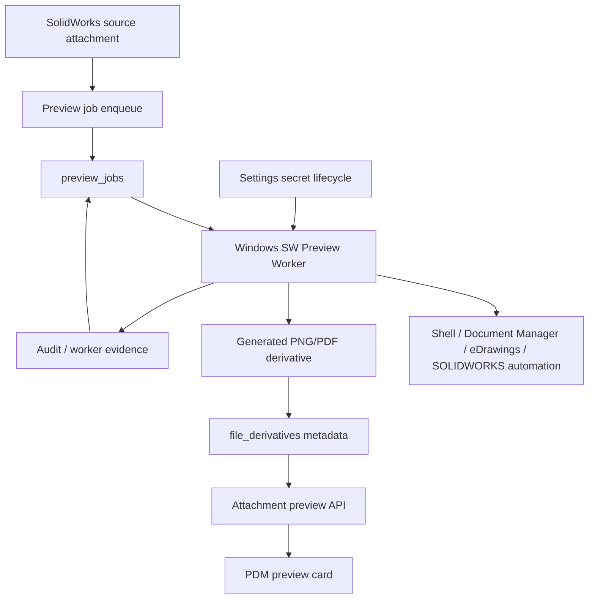

# SPEC-PDM-SW-NATIVE-PREVIEW-WORKER-001 - Windows SolidWorks Native Preview Derivatives

Status: Phase 1 Local Implemented / Windows Shell + Document Manager Worker Partial Evidence
Date: 2026-07-06
Owner: Dev PM
Related DEV: `DEV-PDM-SW-NATIVE-PREVIEW-WORKER-001`
Related ADR: `.ai-doc/decisions/ADR-PDM-SW-NATIVE-PREVIEW-WORKER-001-windows-worker-derivative-boundary.md`
Related QA: `.ai-doc/qa/qa-pdm-sw-native-preview-worker-validation-plan-2026-07-06.md`

Related authority:

- `.ai-doc/specs/SPEC-PDM-SETTINGS-CENTER-001-system-settings-center-secret-lifecycle.md`
- `.ai-doc/decisions/ADR-PDM-SETTINGS-CENTER-001-settings-center-secret-governance.md`
- `.ai-doc/specs/SPEC-PDM-SHARED-3D-MA-BASELINE-001-root-model-and-manufacturing-baseline.md`
- `.ai-doc/specs/SPEC-PDM-DRAWING-REVISION-PACKAGE-002-first-class-attachment-package-model.md`
- `src/components/master-attachment-panel.tsx`
- `scripts/probe-document-manager-extractor.mjs`

External reference:

- SOLIDWORKS Document Manager `ISwDMDocument10::GetPreviewPNGBitmap`: https://help.solidworks.com/2026/English/api/swdocmgrapi/SolidWorks.Interop.swdocumentmgr~SolidWorks.Interop.swdocumentmgr.ISwDMDocument10~GetPreviewPNGBitmap.html
- SOLIDWORKS Document Manager `ISwDMSheet2::GetPreviewPNGBitmap`: https://help.solidworks.com/2026/english/api/swdocmgrapi/SolidWorks.Interop.swdocumentmgr~SolidWorks.Interop.swdocumentmgr.ISwDMSheet2~GetPreviewPNGBitmap.html
- SOLIDWORKS Document Manager PNG preview example: https://help.solidworks.com/2025/english/api/swdocmgrapi/get_png_preview_bitmap_and_stream_for_configuration_example_csharp.htm

## 1. Human Decision Brief

Source: 2026-07-06 user discussion after SolidWorks Document Manager API key setup.

Confirmed product decisions:

- The user wants PDM to show SolidWorks native file previews in the attachment panel, similar to the Windows File Explorer experience.
- Current placeholders `預覽待產生` are not acceptable as the end-state for normal `.SLDPRT`, `.SLDASM` and `.SLDDRW` attachments.
- The first value slice is native SolidWorks file to PNG thumbnail:
  - `.SLDPRT -> PNG`
  - `.SLDASM -> PNG`
  - `.SLDDRW -> PNG`
- The second slice is `.SLDDRW -> PDF` for printable drawing preview.
- The browser must show web-readable derivatives, not parse native SolidWorks files directly.
- The SolidWorks API key already entered in settings is a prerequisite only. It does not, by itself, create previews.

Rejected behavior:

- Do not attempt to preview `.SLDPRT`, `.SLDASM` or `.SLDDRW` directly in the browser.
- Do not call SolidWorks COM, eDrawings, shell thumbnail handlers or Document Manager directly from a Next.js request handler.
- Do not store generated PNG/PDF derivatives as replacements for the source SolidWorks files.
- Do not treat a Google Drive preview iframe as authoritative SolidWorks native preview.
- Do not expose SolidWorks Document Manager API/license key material to browser code, job payloads, screenshots, report JSON or worker logs.
- Do not claim real SolidWorks preview readiness from a local fake extractor only.

AI assumptions:

- A trusted Windows worker host will be available for real SolidWorks/eDrawings/Document Manager preview generation.
- Local automated RD/QC can use a fake preview generator to validate PDM queue, metadata, UI and security behavior; real worker evidence must be captured separately.
- A Windows Shell thumbnail worker can provide useful File Explorer-like PNG thumbnails for some native files, but its output must be quality-gated because `.SLDDRW` can return blank or low-information images on some workstations.
- SOLIDWORKS Document Manager PNG preview may return an embedded/saved preview bitmap. It is not guaranteed to re-render stale or unsaved model geometry.
- High-quality drawing PDF generation may require eDrawings or SOLIDWORKS automation and should remain a later gated phase.
- Native preview derivatives are operational display aids. The source SolidWorks file, released drawing package and manufacturing baseline remain the controlled evidence.

Re-entry triggers:

- User wants Windows Explorer shell thumbnail handler to be called from the browser or a Next.js request handler instead of the controlled worker.
- User wants preview generation failure to block drawing release or manufacturing baseline release.
- User wants high-fidelity re-rendered drawing/model output in Phase 1 instead of embedded preview bitmap extraction.
- RD needs production deploy, production migration, direct data repair, data deletion, paid external service, or a persistent secret outside the existing settings secret boundary.
- RD cannot obtain a Windows worker host, Document Manager/equivalent component, sample files, or secret access boundary for real preview evidence.

## 2. Problem

The current attachment preview panel already has a first-level 3D/2D preview board, but the rendering contract is limited:

- PDF attachments can be shown inline.
- Image attachments can be shown inline.
- Uploaded Google Drive files can be embedded through Drive preview.
- Native `.SLDPRT`, `.SLDASM` and `.SLDDRW` attachments fall back to `預覽待產生`.

This is correct for browser safety, but incomplete for production PDM usage. Users expect a released drawing or part record to show a recognizable preview without manually downloading the SolidWorks file.

The missing capability is a derivative pipeline:

```text
native SolidWorks source file
  -> queued preview job
  -> trusted Windows worker extracts/renders PNG/PDF
  -> PDM stores derivative with source hash and generator evidence
  -> browser displays PNG/PDF
```

## 3. Product Rule

Authoritative boundary:

```text
Native CAD source = controlled source evidence
Preview derivative = generated browser-readable display artifact
Preview job = auditable background work
Windows preview worker = only place allowed to run native SolidWorks preview tooling
Browser = reads derivative status and derivative files only
```

Preview derivatives must be tied to the exact source file hash:

- A derivative is valid only for its recorded `source_file_asset_id` and `source_content_hash`.
- If the source attachment changes, the existing derivative becomes stale.
- A derivative cannot be used as a source CAD file, drawing package source, shared 3D source, or manufacturing baseline source.
- Failed preview generation must show a next action and retry path; it must not create a blank panel.

## 4. Scope

### 4.1 In Scope

- Add a background preview job and derivative metadata model.
- Add server APIs to enqueue, list, retry and serve preview derivatives.
- Add a trusted worker claim/complete contract for Windows preview generation.
- Generate and store PNG thumbnails for `.SLDPRT`, `.SLDASM` and `.SLDDRW`.
- Integrate generated preview derivatives into the current drawing/part attachment preview cards.
- Show preview states: missing, queued, generating, ready, failed, stale and skipped.
- Use the existing settings secret lifecycle to resolve the active SolidWorks Document Manager/equivalent credential server-side only.
- Add local fake worker/QC so the PDM pipeline can be verified without real SolidWorks.
- Add a Windows worker path that can use Shell thumbnail extraction, Document Manager, eDrawings or equivalent renderers behind the same claim/complete contract.
- Reject blank or low-information PNG output before completing a job.
- Add real Windows worker smoke evidence gate before claiming any native preview readiness; require Document Manager/eDrawings/equivalent evidence before claiming full `.SLDASM` / `.SLDDRW` readiness.

### 4.2 Out of Scope

- Production deployment or production migration.
- Direct data repair, data deletion or reassignment of existing file assets.
- Calling Windows Explorer shell preview handlers from the browser or from Next.js request handlers. Shell extraction is allowed only in the isolated worker.
- Interactive browser 3D viewer, STEP/glTF conversion or geometry measurement.
- High-quality re-rendering with SOLIDWORKS automation in Phase 1.
- Making preview generation a release blocker in Phase 1.
- Replacing existing PDF/image/Google Drive preview behavior.
- Storing SolidWorks API/license key plaintext in preview jobs, derivative metadata, logs, report JSON or browser responses.

## 5. End-State Architecture



Invariant:

- Next.js/API owns authorization, queue state and derivative metadata.
- The Windows worker owns native SolidWorks preview generation or extraction.
- The UI never receives a native API key and never attempts to interpret native CAD binary.
- The preview card uses derivative files before falling back to source attachment mode.

## 5.1 Architecture Memory Capsule

Fixed decisions:

- The user experience target is Windows File Explorer-like preview visibility, but the implementation is not Windows File Explorer integration.
- Browser-native SolidWorks parsing is rejected.
- The source file remains immutable controlled evidence.
- PNG/PDF derivatives are generated artifacts and must be traceable to source hash and generator version.
- Phase 1 focuses on useful PNG thumbnail availability.
- Phase 2 may add drawing PDF generation.
- Phase 3 may evaluate interactive 3D only after static preview is reliable.

Module boundaries:

- `DEV-PDM-SETTINGS-CENTER-001` owns secret lifecycle and redaction.
- `DEV-CAD-001` remains the external evidence gate for licensed/equivalent native CAD reader deployment.
- This DEV owns preview queue, derivative metadata, worker contract and UI rendering behavior.
- `master-attachment-panel` owns the first UI consumption point.
- Shared 3D / MA baseline source authority is not changed by preview derivatives.

Non-negotiable safety rules:

- Do not run native CAD tooling inside request/response latency.
- Do not store plaintext secrets in jobs or derivatives.
- Do not show a derivative if its source hash no longer matches.
- Do not overwrite, delete or silently mutate existing source files.
- Do not mark full real SolidWorks preview complete until sample `.SLDPRT`, `.SLDASM` and `.SLDDRW` files produce evidence on a Windows worker or approved equivalent. Partial file-type evidence must be labeled as partial.

## 6. Domain Model Contract

Exact table and column names are RD-owned if the contracts below are preserved.

### 6.1 Preview Jobs

Required object: `preview_jobs` or equivalent.

| Field | Contract |
|---|---|
| `id` | Stable job id. |
| `company_id` | Company boundary. |
| `source_file_asset_id` | Native source attachment. |
| `source_content_hash` | Copied source hash at enqueue time. |
| `requested_kind` | `native_thumbnail_png`, `drawing_pdf`, `interactive_3d` or equivalent. |
| `source_extension` | Normalized extension, e.g. `sldprt`, `sldasm`, `slddrw`. |
| `status` | `queued`, `running`, `succeeded`, `failed`, `skipped`, `cancelled`. |
| `priority` | Worker scheduling priority. |
| `attempt_count` | Retry control. |
| `locked_by`, `locked_at` | Worker claim fields. |
| `idempotency_key` | Prevent duplicate active jobs for the same source hash/kind/profile. |
| `generator_profile` | `document_manager_preview_png`, `edrawings_pdf`, `fake_preview_worker`, etc. |
| `error_code`, `error_summary` | Redacted failure detail. |
| `created_by`, `created_at`, `updated_at`, `completed_at` | Audit. |

Rules:

- There can be at most one active job per `(source_file_asset_id, source_content_hash, requested_kind, generator_profile)`.
- A worker must fail the job as stale if the current source hash differs from `source_content_hash`.
- `failed` jobs can be retried by creating a new job or resetting with explicit audit.
- `skipped` is valid when the source type is unsupported or the file has no embedded preview and no render engine is configured.

### 6.2 File Derivatives

Required object: `file_derivatives` or equivalent.

| Field | Contract |
|---|---|
| `id` | Stable derivative id. |
| `source_file_asset_id` | Source file. |
| `source_content_hash` | Source hash used to generate derivative. |
| `derivative_kind` | `thumbnail_png`, `drawing_pdf`, `sheet_png`, `model_preview_png`, etc. |
| `derivative_file_asset_id` | Stored derivative file or storage pointer. |
| `mime_type` | `image/png`, `application/pdf`, etc. |
| `width`, `height`, `page_count` | Display metadata where applicable. |
| `generator_profile`, `generator_version` | Worker/tool evidence. |
| `preview_job_id` | Origin job. |
| `status` | `ready`, `stale`, `retired`, `failed`. |
| `created_at`, `created_by_worker` | Audit. |

Rules:

- Derivatives inherit read permission from the source file and entity.
- Derivatives are not user-uploaded source attachments and must not appear as package source files unless a later spec explicitly allows export packaging.
- When a newer derivative of the same kind/source hash is created, older derivatives may be retired but not silently deleted.
- If source hash changes, prior derivatives become stale.

### 6.3 Worker Runtime Identity

Required object: worker registration/configuration or equivalent.

Minimum contract:

- worker id and display name.
- host type: `windows_shell`, `windows_document_manager`, `windows_edrawings`, `fake_local`.
- supported extensions.
- supported derivative kinds.
- last heartbeat.
- tool version and build/version metadata.
- redacted readiness state.

The worker must authenticate as a trusted service identity. It must not use a human browser session.

## 7. Worker Contract

The worker is a separate Windows process or service. It may be implemented in C#/.NET, PowerShell wrapper plus executable, or another Windows-native runtime, but it must obey the PDM contract.

Input:

```json
{
  "jobId": "job_...",
  "sourceFileAssetId": "file_...",
  "sourceContentHash": "sha256:...",
  "sourceExtension": "sldprt",
  "requestedKind": "native_thumbnail_png",
  "sourcePathOrDownloadUrl": "...",
  "outputDirectory": "...",
  "generatorProfile": "windows_solidworks_preview_worker"
}
```

Output:

```json
{
  "jobId": "job_...",
  "status": "succeeded",
  "sourceContentHash": "sha256:...",
  "derivatives": [
    {
      "kind": "thumbnail_png",
      "path": "...",
      "mimeType": "image/png",
      "width": 800,
      "height": 600,
      "generatorProfile": "windows_solidworks_preview_worker",
      "generatorVersion": "..."
    }
  ],
  "warnings": []
}
```

Failure output must be redacted:

```json
{
  "jobId": "job_...",
  "status": "failed",
  "errorCode": "source_has_no_saved_preview",
  "errorSummary": "SolidWorks 檔案內沒有可抽取的預覽，請在 SolidWorks 開啟並儲存後重試，或改用渲染型 worker。"
}
```

Security rules:

- The active SolidWorks Document Manager/equivalent credential must be resolved through server-side settings secret lifecycle or a trusted worker credential broker.
- Secret values must not be serialized into job rows, worker logs, stdout captured artifacts or UI responses.
- Worker output files must be validated by MIME, extension, size and hash before PDM stores metadata.
- Worker must use a temp directory per job and clean up after completion/failure.

## 8. Preview Engine Phases

### Phase 1 Engine - Shell / Document Manager / Equivalent Embedded PNG

Purpose:

- Extract a PNG preview bitmap from native `.SLDPRT`, `.SLDASM` and `.SLDDRW` files.

Expected tool behavior:

- For part/assembly, use Windows Shell thumbnail extraction, Document Manager document/configuration preview APIs or approved equivalent.
- For drawing, use sheet preview APIs, eDrawings/SOLIDWORKS rendering or approved equivalent. Shell output must be quality-gated because it can return blank thumbnails for `.SLDDRW`.
- If no saved preview exists, return a specific `source_has_no_saved_preview` status.
- If the output appears blank or low-information, return a redacted failed/skipped status and do not create a ready derivative.

Acceptance boundary:

- Phase 1 may produce embedded/saved/Shell preview thumbnails. It does not guarantee full re-rendering from current model geometry. Partial file-type proof must be labeled; `.SLDDRW` Shell blank output does not close drawing readiness.

### Phase 2 Engine - Drawing PDF

Purpose:

- Generate printable PDF preview for `.SLDDRW`.

Expected tool candidates:

- eDrawings automation.
- SOLIDWORKS automation on a controlled Windows worker.
- An approved equivalent drawing renderer.

Gate:

- Requires explicit authorization because it may need installed software, desktop automation, licensing, worker isolation and longer job timeouts.

### Phase 3 Engine - Interactive 3D

Purpose:

- Generate browser-viewable 3D format such as glTF or a controlled web viewer package.

Gate:

- Requires separate architecture decision, performance/storage review and viewer security review.

## 9. API / Service Contract

Route names may vary if the contracts are preserved.

| Route | Method | Purpose | Role |
|---|---|---|---|
| `/api/attachments/[attachmentId]/previews` | `GET` | List ready/stale/failed preview derivatives for a source file | source file readers |
| `/api/attachments/[attachmentId]/preview-jobs` | `POST` | Enqueue or retry preview job | Admin, Engineer, allowed attachment manager |
| `/api/preview-jobs/claim` | `POST` | Worker claims queued job | trusted worker only |
| `/api/preview-jobs/[jobId]/complete` | `POST` | Worker reports success/failure and uploads derivative metadata | trusted worker only |
| `/api/file-derivatives/[derivativeId]` | `GET` | Stream derivative for inline browser display | source file readers |
| `/api/settings/integrations/solidworks-preview-worker` | `GET` | Redacted worker readiness state | Admin |

Service contract:

```ts
enqueuePreviewJob(input: {
  companyId: string;
  actorUserId: string;
  sourceFileAssetId: string;
  requestedKind: "native_thumbnail_png" | "drawing_pdf";
  idempotencyKey: string;
}): Promise<{ jobId: string; status: "queued" | "already_exists" }>;

listFileDerivatives(input: {
  companyId: string;
  actorUserId: string;
  sourceFileAssetId: string;
}): Promise<Array<{
  derivativeId: string;
  kind: string;
  status: "ready" | "stale" | "failed";
  mimeType: string;
  width?: number;
  height?: number;
  sourceContentHash: string;
}>>;

claimPreviewJob(input: {
  workerId: string;
  supportedKinds: string[];
  supportedExtensions: string[];
}): Promise<{ job: PreviewJobClaim | null }>;

completePreviewJob(input: {
  workerId: string;
  jobId: string;
  sourceContentHash: string;
  result: PreviewWorkerResult;
}): Promise<{ accepted: boolean; derivativeIds: string[] }>;
```

Transaction requirements:

- Job completion must validate source hash and worker identity before storing derivatives.
- Derivative metadata and stored derivative pointer must be committed atomically.
- If upload/storage succeeds but metadata fails, the system must either clean orphan output or mark it for cleanup.
- If metadata succeeds but UI cache is stale, the next preview list request must still return the derivative.

## 10. UI Contract

The current first-level preview cards should become derivative-aware.

Priority order for preview display:

1. Ready derivative matching current source hash and expected slot.
2. Existing browser-readable source attachment: PDF/image.
3. Google Drive preview if uploaded and no native derivative exists.
4. Native source placeholder with status and next action.

Required visible states:

| State | UI meaning |
|---|---|
| `missing` | No matching 3D/2D source file exists. |
| `queued` | Preview job is waiting. |
| `running` | Preview is being generated. |
| `ready` | Show PNG/PDF derivative. |
| `failed` | Show reason and `重新產生預覽`. |
| `stale` | Source changed; show old preview as stale only if clearly marked or hide it and enqueue new job. |
| `skipped` | Unsupported or no embedded preview; show actionable explanation. |

Required UI copy behavior:

- The preview card must answer what happened and what to do next.
- Do not show raw worker stack traces, command lines, API routes or secret hints.
- `預覽待產生` is acceptable only when paired with queued/generate action or clear setup blocker.

## 11. Permission Contract

Read:

- Anyone who can read the source attachment can read ready preview derivatives for that attachment.
- A user who cannot read the source cannot infer derivative existence, filenames or errors.

Create/retry:

- Admin and attachment managers can enqueue/retry.
- Engineers can enqueue for attachments they are allowed to manage.
- Reviewer may view preview state but should not need mutation rights unless already allowed by attachment workflow.

Worker:

- Worker uses a service identity.
- Worker can claim only preview jobs.
- Worker cannot read arbitrary settings or unrelated attachments.
- Worker cannot activate/revoke settings secrets.

## 12. Migration / Compatibility Contract

Existing attachments:

- Existing `.SLDPRT`, `.SLDASM` and `.SLDDRW` files remain valid.
- No historical source file mutation is authorized.
- Preview jobs can be created lazily when a drawer opens or in an Admin batch enqueue.

Existing preview behavior:

- PDF/image inline preview must keep working.
- Google Drive preview must keep working.
- Existing placeholder behavior remains a safe fallback until derivatives exist.

Storage:

- Local/dev can store derivatives through the existing local file storage provider.
- Production storage target and retention policy require release/storage governance before production cutover.

## 13. Failure Modes

| Failure | Required behavior |
|---|---|
| Worker unavailable | Show `預覽產生服務未連線`; allow retry after service is healthy. |
| Active SolidWorks secret missing | Show settings blocker and route Admin to `/settings/security`; do not expose key details. |
| Source hash mismatch | Mark job failed/stale; do not attach derivative. |
| Document Manager returns no preview bitmap | Mark skipped/failed with `請開啟並儲存原檔後重試` or route to render engine phase. |
| Worker crashes/timeouts | Retry with capped attempts; show failed after retry limit. |
| Derivative upload succeeds but DB write fails | Cleanup or mark orphan derivative for cleanup; do not show untracked files. |
| Unsupported extension | Do not enqueue native preview; show unsupported state. |
| Secret appears in stdout/stderr | Fail QC, mark worker unsafe, and do not accept evidence. |

## 14. Phase Roadmap

| Phase | Document status | Purpose | Authorization boundary |
|---|---|---|---|
| Phase 0 - Development documents | Spec Ready / Human Confirmed | Capture product rule, ADR, QA, dev_task and documentation map | Authorized by user request to write development documents |
| Phase 1 - Native PNG preview vertical slice | Implemented locally / Partial real worker evidence | Add queue, derivative metadata, worker contract, fake worker QC, Windows Shell worker and UI integration; `.SLDPRT` Shell smoke captured, `.SLDDRW` blank Shell output failed cleanly | Local PDM pipeline implemented and verified; full native evidence requires Document Manager/eDrawings/equivalent |
| Phase 2 - Drawing PDF preview | RD Contract Ready / Not Authorized | Generate `.SLDDRW -> PDF` through eDrawings/SOLIDWORKS/equivalent controlled worker | Requires separate tool/licensing/timeout approval |
| Phase 3 - Interactive 3D derivative | RD Contract Ready / Not Authorized | Evaluate STEP/glTF/web viewer derivative | Requires separate architecture/security/performance decision |
| Phase 4 - Production rollout | Release Gate Contract Ready / Not Authorized | Production worker deployment, storage retention, migration/backfill and smoke | Requires deployment-release gate and backup/rollback |

## 15. RD Handoff Contract

Authorization: Phase 1 local non-production implementation is authorized and completed. Windows Shell `.SLDPRT` proof is captured; a SolidWorks Document Manager SLDDRW PNG worker/exporter path is implemented and compile-verified. Real `.SLDDRW` success still requires a worker-readable active Document Manager key, and full `.SLDASM` native preview readiness, Phase 2 drawing PDF, Phase 3 interactive 3D and Phase 4 production rollout remain gated.

Document status: Phase 1 Local Implemented / Windows Shell + Document Manager Worker Partial Evidence.

Phase 1 scope:

- Add `preview_jobs` and `file_derivatives` or equivalent metadata.
- Add local storage/provider support for derivative files without changing source files.
- Add enqueue/list/retry/worker claim/complete APIs.
- Add a fake local preview worker for deterministic automated QC.
- Add Windows worker contract documentation, Shell worker script and sample command shape.
- Add blank/low-information PNG quality gate before accepting worker output.
- Update attachment preview cards to prefer ready derivatives before raw source fallback.
- Show queued/running/failed/stale/skipped states with Traditional Chinese recovery copy.
- Integrate redacted settings status for missing/untested SolidWorks secret.

Phase 1 out of scope:

- Production deploy/migration.
- Direct repair/backfill of existing attachments.
- High-fidelity render engine.
- Interactive 3D viewer.
- Treating preview failure as release blocker.
- Claiming full native readiness from fake worker or partial Shell proof only.

Phase 1 implementation contract:

- Use additive schema only.
- Preserve existing source attachment APIs.
- Preserve PDF/image/Drive preview behavior.
- Use source hash for derivative validity.
- Use idempotent enqueue semantics.
- Native worker process must be outside Next.js request path.
- Worker output must be MIME/hash/size validated.
- Secret resolution must follow settings secret governance.
- All worker errors returned to UI must be redacted and action-oriented.

Phase 1 entry conditions:

- Explicit user/PM authorization to implement.
- Decision whether real Windows worker evidence is required in this slice or whether local fake worker is accepted as local pipeline proof with a `DEV-CAD-001` live gate.
- For real native preview acceptance: Windows host, sample `.SLDPRT`, `.SLDASM`, `.SLDDRW`, active SolidWorks Document Manager/equivalent credential and deployment evidence.

Phase 1 acceptance:

- Uploading or viewing a native SolidWorks source attachment creates or can create a preview job.
- A fake worker can generate deterministic PNG derivatives for automated local QC.
- A real Windows worker can generate PNG previews for supported sample files and must fail/skip blank or unsupported outputs without displaying misleading images.
- Preview card displays generated PNG instead of `預覽待產生`.
- Failed/skipped generation shows reason and retry or settings recovery path.
- Source file hash mismatch prevents stale derivative display.
- No secret material appears in jobs, logs, API responses, screenshots or report JSON.

Evidence required:

- `npx.cmd tsc --noEmit --pretty false`
- `npm.cmd run lint -- --quiet`
- focused QC script for preview job/derivative contract
- focused QC script for preview redaction and worker output validation
- `npm.cmd run qc:master-attachments`
- settings secret boundary regression
- browser smoke for drawing attachment preview card with ready PNG derivative
- browser smoke for failed/skipped preview state
- real Windows worker smoke before claiming real native preview readiness

Phase 1 local evidence captured on 2026-07-06:

- `npx.cmd tsc --noEmit --pretty false`: passed.
- `npm.cmd run lint -- --quiet`: passed.
- `npm.cmd run qc:pdm-sw-native-preview-worker`: passed 90/90.
- `npm.cmd run qc:pdm-sw-native-preview-redaction`: passed 68/68.
- `npm.cmd run qc:master-attachments`: passed 101/101.
- `npm.cmd run dev:local:check`: passed with local URL `http://127.0.0.1:3000/`.
- Direct worker smoke: `D-0007-MA1.SLDPRT` Shell extraction produced a meaningful PNG with quality metrics.
- API worker smoke: `D-0007-MA1.SLDPRT` job `53749eb7-9aa1-4902-b6cc-a4fc2035f814` succeeded through `qc-windows-shell-worker`; derivative `4fde352c-eb3c-416e-bcdd-3ccf1fec6640` is `image/png`, `768x576`, generator `windows-shell-ishellitemimagefactory-v1`.
- API worker smoke: `D-0007-MA1.SLDDRW` job `f921e930-2cec-441c-a8dd-4a06a6f71c6d` failed cleanly when this workstation's Shell provider returned blank/low-information output, then failed cleanly through the Document Manager worker with `solidworks_document_manager_preview_failed` because no worker-readable key is available from the local test-double secret.
- Worker compile smoke: `node scripts/run-solidworks-document-manager-preview-worker.mjs --compile-only` compiled the C# exporter into `.tmp/solidworks-document-manager-preview/SolidWorksDocumentManagerPreviewExporter.exe`.
- Browser smoke: screenshot `output/playwright/master-attachment-preview/d0007-3d-ready-2d-key-missing-compact.png` shows real 3D preview, compact 2D failed/retry state, and no fake preview display.

Stop conditions:

- RD needs production deploy, migration, direct data repair or data deletion.
- RD needs to store secret plaintext outside approved secret governance.
- RD needs browser/frontend access to native CAD tooling or secret values.
- RD needs to call SolidWorks/eDrawings/COM synchronously from a Next.js request handler.
- Worker cannot be isolated from user desktop state or cannot produce redacted evidence.
- Source file permissions cannot be enforced for derivative reads.

## 16. Deferred Scope Audit

| Scope | Classification | Reason / location |
|---|---|---|
| Product implementation | Same Spec Phase 1 / Implemented locally | Phase 1 local PDM pipeline is implemented with fake worker proof and Windows Shell `.SLDPRT` proof; full native readiness remains externally gated. |
| Full Windows Document Manager/eDrawings/equivalent preview evidence | Blocked Human Re-entry / external evidence | Requires component deployment, active credential and `.SLDASM` / `.SLDDRW` sample-file evidence. |
| Drawing PDF generation | Same Spec Phase 2 / Not Authorized | Requires eDrawings/SOLIDWORKS/equivalent renderer decision. |
| Interactive 3D viewer | Same Spec Phase 3 / Not Authorized | Requires separate architecture/security/performance review. |
| Production rollout/backfill | Same Spec Phase 4 / Not Authorized | Requires release gate, storage retention and rollback plan. |
| Release blocking on preview failure | Blocked Human Re-entry | Current assumption keeps preview non-blocking. |
| Windows Explorer shell handler direct integration | Same Spec Phase 1 / isolated worker only | Rejected for browser/request-handler use; allowed only through the token-gated Windows worker with quality checks. |

## 17. All-Phase Coverage Matrix

| Phase / DEV | Authorization | Document status | Scope | Out of scope | Entry condition | Acceptance | Evidence |
|---|---|---|---|---|---|---|---|
| Phase 0 - Development documents | Authorized | Spec Ready / Human Confirmed | SPEC, ADR, QA, dev_task and documentation map | Product implementation | User asked to write development documents | Documents capture phase plan, gates and boundaries | Updated `.ai-doc` files |
| Phase 1 - Native PNG preview vertical slice | Authorized / implemented locally | Phase 1 Local Implemented / Windows Shell + Document Manager Worker Partial Evidence | Queue, derivatives, worker contract, fake worker QC, Shell worker, Document Manager SLDDRW PNG worker/exporter, blank-quality gate, UI integration and real `.SLDPRT` smoke | Production, high-fidelity render, release blocking, interactive 3D | Full `.SLDASM` evidence and successful `.SLDDRW` evidence with worker-readable key remain required for native readiness | PNG derivative replaces placeholder for current source hash; failures are actionable and do not display blank output | tsc/lint/focused QC/browser smoke/API worker smoke passed; Document Manager key/success evidence still required for drawings |
| Phase 2 - Drawing PDF preview | Not authorized | RD Contract Ready / Not Authorized | `.SLDDRW -> PDF` through controlled render worker | Source mutation, release package rewrite, production | Phase 1 verified plus renderer decision | Drawing PDF appears in 2D preview and download/open actions | renderer QC, browser smoke, redaction evidence |
| Phase 3 - Interactive 3D derivative | Not authorized | RD Contract Ready / Not Authorized | STEP/glTF/viewer evaluation and derivative security | Measurement/engineering signoff unless specified | Phase 1 stable plus architecture approval | Controlled 3D viewer loads approved derivative safely | viewer security/performance/browser evidence |
| Phase 4 - Production rollout | Not authorized | Release Gate Contract Ready / Not Authorized | Worker deployment, storage policy, backfill, smoke and rollback | Unapproved data repair/deletion | Implementation verified and release approved | Production smoke passes and rollback is ready | deployment-release evidence |

## 18. Spec Governance Result

Trigger:

- This spec changes attachment preview architecture, background processing, derivative file metadata, worker identity, settings secret consumption and UI state behavior.

Cross-spec consistency:

- Compatible with `SPEC-PDM-SETTINGS-CENTER-001` by using server-side secret lifecycle and not exposing keys.
- Compatible with `DEV-CAD-001` by preserving external real component evidence gate.
- Compatible with `SPEC-PDM-SHARED-3D-MA-BASELINE-001` because derivatives are not shared 3D source authority.
- Compatible with current `master-attachment-panel` because it extends existing preview slots instead of replacing them.

ADR:

- Required and created at `.ai-doc/decisions/ADR-PDM-SW-NATIVE-PREVIEW-WORKER-001-windows-worker-derivative-boundary.md`.

RD readiness:

- Product semantics are clear enough for Phase 1 RD handoff.
- Engineering contracts are specified for queue, derivative, worker, UI and QA.
- Phase 1 local non-production implementation is complete and verified with fake-worker evidence.
- Real native preview readiness still depends on worker-readable Document Manager/eDrawings/equivalent credentials and successful `.SLDDRW` / `.SLDASM` sample evidence.
