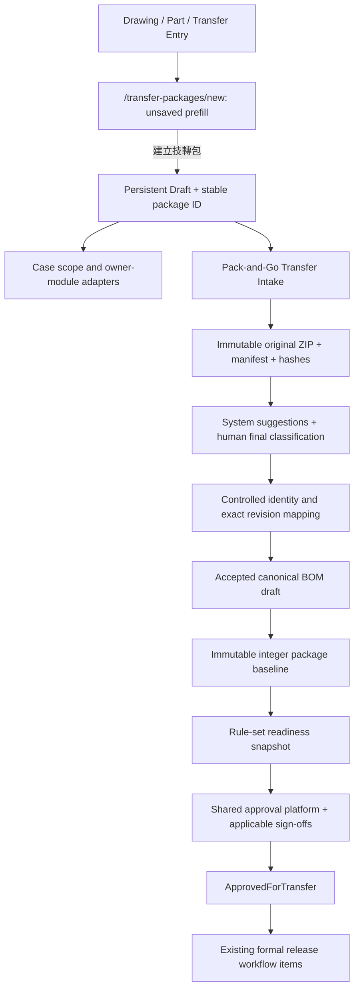
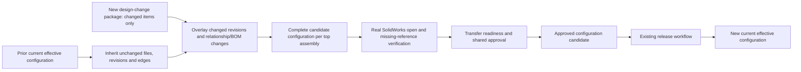

# SPEC-PDM-TRANSFER-PACKAGE-INTAKE-001 技轉包工作台與 Pack-and-Go 組合分類

Status: Phase 3A-0 RD Implementation Ready / Not Requested This Turn; Phase 3A-1 RD Contract Ready / Not Requested This Turn; Phase 3A-2 to 3C Need Human Decisions for design-change configuration semantics; Release Gate Required
Owner: Dev PM
Created: 2026-07-10
Updated: 2026-07-10
Related DEV: `DEV-041` / `DEV-PDM-TRANSFER-PACKAGE-INTAKE-001`
Parent DEV: `DEV-005` / `DEV-PDM-SUBMISSION-GATE-001`
Parent SPEC: `.ai-doc/specs/SPEC-PDM-SUBMISSION-GATE-001-research-transfer-package-readiness.md`
Related ADR: `.ai-doc/decisions/ADR-PDM-SUBMISSION-GATE-001-transfer-package-and-exception-policy.md`
Related SPEC: `.ai-doc/specs/SPEC-BOM-WORKBENCH-001-bom-workbench.md`
Related QA: `.ai-doc/qa/qa-pdm-transfer-package-intake-pack-and-go-validation-plan-2026-07-10.md`

## 1. Human Decision Brief

Confirmed decisions from 2026-07-10 HCS guided mode:

- Intake Q1 `1B`: Pack-and-Go ZIP first enters `Transfer Intake`. Human-confirmed classification, BOM, missing-file review and mapping are required before an integer baseline can be created.
- Intake Q2 `2A`: the first intake path accepts SolidWorks Pack and Go or an equivalent path-preserving ZIP without requiring SolidWorks Add-in. AI-PDM preserves the original ZIP, relative paths and hashes, and performs best-effort parsing.
- Intake Q3 `3A`: the system suggests part drawing, transient subassembly, formal subassembly and top assembly classes. Permitted humans retain final adjustment authority over every classification.
- UX Q1 `1B`: upgrade `/transfer-packages/new` into the transfer-package workbench entry instead of creating one page per transfer subtask.
- UX Q2 `2B`: use adapter cards to reuse existing BOM, attachment, drawing/part and approval modules. Heavy editing remains in the canonical owner module.
- UX Q3 `3B`: the first product slice is the workbench shell, persistent Draft context, module entry points and blocker summary. Full ZIP parsing starts in Phase 3A-1.
- RD completeness Q1 `1A`: the integer major version belongs to the immutable transfer-package baseline. Controlled parts, formal subassemblies and the top assembly keep independent revisions. A baseline stores the exact item revision and file hash it used.
- RD completeness Q2 `2A`: opening `/transfer-packages/new` does not write data. The system creates a persistent Draft and stable package ID only after the user completes package title, case type and case/change reason and selects `建立技轉包`.
- RD completeness Q3 `3A`: Phase 3A is tracked as the new child delivery point `DEV-041`; `DEV-005` remains complete for its Phase 1 product evidence and parent governance.
- RD re-review Q1 `1A`: after a complete candidate configuration has been materialized, a designated RD/CAD verifier must open the exact baseline content on a real SolidWorks workstation and confirm no missing files or unresolved references before formal submit. This evidence does not require an Add-in.
- RD re-review Q2 `2B`: one transfer package may include multiple top assemblies. Every governed top assembly must be explicitly selected and must have its own complete configuration/readiness result inside the package.

Pending human decisions:

- RD re-review Q3: when a design change affects only part of an earlier transfer scope, decide whether to create a new delta package that inherits unchanged content and produces new complete effective configuration baselines, reopen the approved package, or require a full re-upload.
- RD re-review Q4: for a package containing multiple top assemblies, decide whether approval is atomic for the entire package or can complete per top assembly.

Rejected or clarified options:

- Do not promote every file in a package to one shared revision.
- Do not auto-create empty package records merely because a user opened the entry page.
- Do not wait for ZIP upload before creating the Draft; users need a stable package ID for scope editing and return context.
- Do not allow an incomplete manual BOM decision to pass baseline confirmation.
- Do not add `file_manifest` as a canonical BOM workbench source. It is an intake-only preview that must be converted to an accepted `manual`, `solidworks_xls` or `cad_reference` draft.
- Do not treat a newly detected formal subassembly as controlled merely because it was marked as a candidate. It must receive or map to a controlled identity before baseline confirmation.
- Do not treat path preservation or manifest completeness as proof that SolidWorks can open the resulting configuration.

AI assumptions:

- Existing root, drawing, part, BOM, attachment, approval and release modules remain canonical owners of their data.
- `source project / ECR / ECO / customer request` is required when one exists. If none exists, the package records `source_reference_status = not_available` and a reason; an empty field is not silently accepted.
- Original ZIP bytes in private file storage are the preservation authority. Manifest paths are an indexed, auditable interpretation and are not used to reconstruct an allegedly identical ZIP.
- Phase 3A-0 may implement local/provider-neutral persistence, but production schema migration and live Supabase changes remain release-gated.

Re-entry triggers:

- Change the package-baseline integer version into a forced shared item revision.
- Auto-create a package before explicit `建立技轉包` confirmation.
- Allow missing required transfer data or incomplete BOM through an exception.
- Make a transient subassembly controlled, purchasable or releasable without promotion and identity assignment.
- Require a new standalone upload, classification, BOM or sign-off page.
- Remove the confirmed real-machine SolidWorks open-verification gate before formal submit.
- Reduce the confirmed multi-top package model to exactly one top assembly without a new user decision.
- Require production migration, direct data repair, live provider change, merge, PR, deploy or release.

使用思考習慣：`#效用理論`、`#系統描繪`、`#當責`

## 2. Problem And Success Definition

AI-PDM must support a low-friction R&D flow without creating false transfer readiness:

1. During R&D, engineers may upload controlled part or drawing work one item at a time and expose decimal minor revisions.
2. Working assembly intent may remain in the Windows folder and SolidWorks working directory.
3. At technical transfer, the engineer creates a case-scoped transfer-package Draft and uploads a Pack-and-Go ZIP.
4. AI-PDM preserves the package, creates a manifest, suggests classifications and matches, and produces an intake preview.
5. Humans resolve classifications, controlled identities, BOM and exact item revisions.
6. Only a complete, confirmed snapshot becomes integer baseline `1`, `2`, `3`, and so on.
7. Readiness, cross-role sign-off and formal release remain separate controlled steps.

Success means:

- RD does not maintain duplicate assembly relationships in PDM during exploration.
- Technical transfer cannot proceed with missing formal identities, unresolved file conflicts or incomplete BOM.
- A later part revision does not silently rewrite an existing assembly or baseline.
- The system never claims SolidWorks openability without native or real-machine evidence.
- Users can complete transfer work from one package-centric task center while owner modules retain canonical logic.

## 3. End-State Architecture



Ownership boundaries:

| Domain | Owns | Must not own |
|---|---|---|
| Transfer package | Case header, scope, baseline, readiness aggregation, blocker routing | Drawing/part/BOM edits or approval decision logic |
| Intake | Original ZIP pointer, manifest, classification/match suggestions and human adjustments | Formal master lifecycle |
| Drawing / part | Controlled identities, revisions and master attributes | Package readiness aggregation |
| BOM workbench | Canonical BOM drafts, review and release | Intake-only file-composition preview |
| File storage | Private original bytes, hash and storage pointer | Classification or release state |
| Approval platform | Review work item, decision history and reviewer inbox | Direct master mutation outside domain handlers |
| Release workflow | Formal release work items and master lifecycle transition | Transfer-package classification |

## 4. Architecture Memory Capsule

Fixed decisions:

- Technical transfer is case/package-centric; direct single-item technical-transfer submission is forbidden.
- A one-item package still needs case context, declaration and reviewer scope confirmation.
- Package baseline versions are positive integers and independent from every controlled item's revision.
- Baselines are immutable. Corrections create a new intake and/or next package baseline; they do not edit an old baseline.
- Every formal or top assembly must map to a controlled identity before baseline.
- Every `.sldasm` must be human-confirmed as top, formal or transient.
- Manual BOM completion is a hard requirement before baseline.
- Human classification overrides are authoritative and survive re-parse.
- `ApprovedForTransfer` never directly releases masters.
- The workbench is one task center with adapters, not a copy of owner modules.

Deferred but bounded decisions:

- Parser library and worker implementation are RD choices in Phase 3A-1, provided streaming and archive-safety contracts are met.
- Native SolidWorks reference extraction waits for `DEV-035`; real Add-in/open validation waits for `DEV-036`.
- Production migration and Supabase cutover wait for the release gate.
- Rule matrix administration remains Parent Phase 4 under `DEV-005`.

Authoritative cross-spec rules:

- Package/readiness/sign-off/release boundary: parent submission-gate SPEC and ADR.
- BOM source and lifecycle: `SPEC-BOM-WORKBENCH-001`.
- Formal decisions: shared approval platform.
- Company/role scope: access-control architecture.
- Original file bytes and storage pointers: file-storage architecture.

### 4.1 Recommended Design-Change Configuration Model - Pending Q3/Q4

The package and the product configuration are different controlled objects:

| Object | Meaning | Completeness rule |
|---|---|---|
| package baseline | immutable evidence for this transfer/design-change decision | may be a full initial package or a scoped delta package |
| resulting configuration baseline | complete reconstructable file/BOM/revision closure for one governed top assembly after applying the package | must always be complete, even when the package changes one part only |
| current effective configuration | the released configuration currently valid for manufacturing/procurement | changes only after the existing release workflow succeeds |

Recommended flow:



Scope roles inside a design-change package:

- `direct_change`: the part, drawing, assembly or BOM rows actually changed and uploaded.
- `impacted_context`: parent/formal/top assemblies and interfaces that must be reviewed or revalidated but are not necessarily re-uploaded.
- `inherited_unchanged`: exact file/revision/path/BOM evidence inherited from the prior current effective configuration.

Candidate construction:

```text
candidate configuration
  = prior current effective configuration
  - superseded changed revisions/edges
  + new changed revisions/edges
  + reviewed BOM and impact decisions
```

The system may reuse content-addressed stored bytes; it does not duplicate every unchanged physical file. It does create a new immutable complete metadata snapshot so the candidate can be reconstructed later.

Hard blockers:

- no prior released/effective configuration exists for a delta-only design change
- any inherited file/hash/path cannot be resolved from controlled storage
- where-used cannot determine which governed top assemblies are affected and the user has not completed an audited impact selection
- filename/path/reference topology changes without the affected parent assembly being uploaded or otherwise authoritatively regenerated
- resulting BOM/file closure is incomplete or inconsistent
- the exact materialized candidate fails SolidWorks open or reports missing references

For a one-part geometry change with unchanged filename/path/reference topology, RD uploads the new part revision only. AI-PDM inherits the unchanged assembly closure, creates a new complete candidate configuration for every affected top assembly, materializes it for verification and records the exact verified hash. If any prerequisite evidence is unavailable, the fallback is an affected-assembly or full Pack-and-Go re-upload, not a guessed merge.

Q4 remains necessary because a package may govern multiple top assemblies under confirmed decision `2B`: the product must decide whether all root candidates approve atomically or may reach different approval states inside one package.

## 5. Product Rules

### 5.1 Lifecycle Boundary

| Stage | Version meaning | Assembly governance | Allowed use |
|---|---|---|---|
| `R&D Draft` | Item-specific decimal or working revision | No mandatory formal PDM assembly | Research, prototype and internal discussion |
| `Transfer Package Draft` | Stable package ID; no integer baseline | Case scope and owner-module remediation | Transfer preparation only |
| `Transfer Intake` | Intake ID and parser generation | Original ZIP, manifest and suggestions | Classification/mapping/BOM preparation only |
| `Transfer Baseline` | Package baseline `1`, `2`, `3`... | Immutable exact file/item/BOM snapshot | Readiness and transfer-review input |
| `ApprovedForTransfer` | Approved package baseline | Controlled handoff; masters remain independently versioned | Create formal release work items |
| `Released` | Existing item release revisions | Existing release workflow snapshots | Manufacturing, procurement and quality use |

Hard rules:

- Opening the create page does not create a Draft.
- ZIP upload does not create a baseline or release state.
- Baseline confirmation requires complete classification, mapping and accepted BOM.
- A baseline captures exact `entity_revision` and `content_hash`; it never updates those item revisions.
- A later item revision marks applicable readiness/where-used impact stale but does not mutate a prior baseline.

### 5.2 Draft Creation And Persistence

`/transfer-packages/new` is an unsaved creation surface. It may prefill a source drawing/part and case type from query parameters, but it performs no mutation on GET.

Required fields before `建立技轉包`:

- package title
- case type
- case/change reason
- responsible RD owner
- source reference, or explicit not-available reason

After successful creation:

- server returns stable `packageId`, human-readable `packageCode`, `rowVersion = 1` and `status = Draft`
- UI redirects to `/transfer-packages/[id]`
- prefilled source item is added in the same transaction
- repeated create with the same company, actor and idempotency key returns the same package

### 5.3 Pack-And-Go Intake And Openability

Accepted input:

- SolidWorks Pack and Go ZIP.
- Equivalent ZIP that preserves relative folder paths and includes at least one `.sldasm` for an assembly transfer.

Path status:

| Status | Meaning | Baseline effect |
|---|---|---|
| `preserved` | safe relative paths are present and unique under Windows-compatible normalization | may continue |
| `unverified_flat` | every entry is root-level and no trusted sidecar/reference proves that this was intentional | hard blocker; re-upload path-preserving package |
| `invalid` | traversal, absolute/UNC/drive path, duplicate normalized path or unsafe entry exists | reject intake |

Openability wording:

- Allowed: `已保留 Pack and Go 原始封包與相對路徑`.
- Required caveat: `尚未經 SolidWorks 實機開啟驗證`.
- Forbidden without external evidence: `已確認 SolidWorks 可開啟`.

### 5.4 Archive Safety Contract

The parser must stream input and must not load the whole archive into process memory.

Initial configurable safety defaults:

| Limit | Default |
|---|---|
| compressed archive bytes | 2 GiB |
| total declared uncompressed bytes | 20 GiB |
| entry count | 50,000 |
| relative path depth | 32 segments |
| per-entry compression ratio | 100:1 |
| aggregate compression ratio | 50:1 |

Reject before manifest commit:

- encrypted entries
- symlink, hard-link, reparse-point or device entries
- absolute, drive-letter, UNC, traversal, NUL or alternate-data-stream paths
- Windows reserved device names
- duplicate paths after separator, case-insensitive and Unicode normalization
- entry metadata that exceeds configured limits
- executable/script payloads not allowed by the attachment policy

Limit errors return stable blocker codes and retain no partial manifest as a valid intake.

### 5.5 Classification And Controlled Identity

File classes:

| Class | Meaning | Baseline identity rule |
|---|---|---|
| `part_model` | `.sldprt` model | map to controlled part when BOM/formal scope requires it |
| `part_drawing` | manufacturing/reference drawing attachment | link to controlled drawing when formal |
| `transient_subassembly` | CAD grouping/helper assembly | no number by default; retained in file snapshot only |
| `formal_subassembly` | manufactured, purchased, maintained or reused assembly | controlled identity required before baseline |
| `top_assembly` | package's primary assembly | controlled identity required before baseline |
| `reference_attachment` | STEP, image, note or supporting file | controlled only when owner policy requires it |
| `solidworks_bom_export` | BOM export input | not a controlled identity |
| `unknown` | unresolved | baseline blocked |

Suggestion signals may include extension, path, filename token, existing identity, hash, sidecar, BOM XLS and future CAD extraction. Every suggestion exposes class, confidence and reasons. Human overrides require audit and are never silently overwritten by parser generation changes.

### 5.6 BOM Source And Completeness

Canonical BOM workbench source priority remains:

```text
manual > solidworks_xls > cad_reference
```

`file_manifest` is not a BOM workbench source. Intake may show a `file_composition_preview`, but it remains `needs_manual_bom_completion` until a permitted user converts and completes it as a canonical manual BOM draft.

Baseline blockers include:

- no accepted canonical BOM draft
- `needs_manual_bom_completion`
- formal/top assembly absent from BOM without an audited non-BOM explanation allowed by rule
- ambiguous, obsolete or rejected child mapping
- missing/non-positive/non-numeric formal quantity
- BOM draft changed after baseline preview

### 5.7 Existing-Function Reuse

| Capability | Placement | Canonical owner |
|---|---|---|
| Package creation and task center | `/transfer-packages/new`, then `/transfer-packages/[id]` | Transfer package |
| Drawing/part entry | Existing detail actions | Drawing/part, entry only |
| ZIP intake | Package workbench intake section | Transfer intake + file storage |
| Drawing/part correction | Existing owner page/drawer | Drawing/part |
| BOM heavy edit | Existing BOM workbench | BOM |
| Approval decision | Existing `/approvals` platform | Approval platform |
| Attachment preview/history | Existing attachment panel/deep link | Attachment/file domain |

No separate normal routes for upload, classification, mapping, BOM or sign-off are permitted unless a later usability decision replaces this rule.

## 6. Data Contract

### 6.1 Canonical Package And Baseline Tables

Parent tables remain authoritative. This child contract adds/clarifies these fields:

`transfer_packages`

- `id TEXT PRIMARY KEY`
- `company_id TEXT NOT NULL`
- `package_code TEXT NOT NULL`
- `idempotency_key TEXT`
- `title TEXT NOT NULL`
- `case_type TEXT NOT NULL`
- `source_reference TEXT`
- `source_reference_status TEXT NOT NULL`
- `source_reference_missing_reason TEXT`
- `scope_reason TEXT NOT NULL`
- `owner_user_id TEXT NOT NULL`
- `package_status TEXT NOT NULL`
- `current_baseline_id TEXT`
- `row_version BIGINT NOT NULL DEFAULT 1`
- existing one-item declaration, scope confirmation, rule-set, submit/approval and timestamps from the parent SPEC

Field checks:

- `case_type IN ('development_case', 'design_change_case')` for technical-transfer packages. `new_development` and `engineering_change` are accepted only as boundary aliases and normalize to the canonical Phase 1 codes before persistence.
- `source_reference_status IN ('provided', 'not_available')`.
- `source_reference_status = 'provided'` requires non-empty `source_reference`; `not_available` requires non-empty `source_reference_missing_reason`.
- `package_status` uses the parent state machine only; intake states are not persisted in this column.
- `row_version > 0`.

`transfer_package_baselines`

- `id TEXT PRIMARY KEY`
- `company_id TEXT NOT NULL`
- `package_id TEXT NOT NULL`
- `baseline_major INTEGER NOT NULL CHECK (baseline_major > 0)`
- `source_intake_id TEXT NOT NULL`
- `manifest_hash TEXT NOT NULL`
- `classification_hash TEXT NOT NULL`
- `mapping_hash TEXT NOT NULL`
- `bom_snapshot_id TEXT NOT NULL`
- `bom_snapshot_hash TEXT NOT NULL`
- `item_set_hash TEXT NOT NULL`
- `confirmed_by TEXT NOT NULL`
- `confirmed_at TIMESTAMPTZ NOT NULL`
- unique `(package_id, baseline_major)`

`transfer_package_baseline_items`

- `id TEXT PRIMARY KEY`
- `company_id TEXT NOT NULL`
- `baseline_id TEXT NOT NULL`
- `entity_type TEXT NOT NULL`
- `entity_id TEXT`
- `entity_revision TEXT`
- `file_id TEXT`
- `relative_path TEXT`
- `content_hash_sha256 TEXT NOT NULL`
- `classification TEXT NOT NULL`
- unique `(baseline_id, relative_path)` for file rows

`transfer_package_readiness_snapshots` must include `baseline_id`. Readiness and sign-offs reference a baseline and never an editable Draft alone.

### 6.2 Intake Tables

| Table | Minimum fields / purpose |
|---|---|
| `transfer_package_intakes` | `id`, `company_id`, `package_id`, `storage_object_id`, `original_filename`, `package_sha256`, `archive_bytes`, `status`, `path_status`, `parser_version`, `parse_generation`, `idempotency_key`, error fields, actor/timestamps |
| `transfer_package_intake_files` | `id`, `company_id`, `intake_id`, original `relative_path`, normalized comparison key, basename, extension, bytes, SHA-256, MIME, depth, ordinal; unique `(intake_id, normalized_path_key)` |
| `transfer_package_file_classifications` | `file_id`, suggested class/confidence/reasons/parser generation, effective class, decision source, human reason/actor/time, `row_version` |
| `transfer_package_file_match_candidates` | `id`, `file_id`, entity type/id/revision/hash, match method/confidence, selected flag, resolution actor/reason/time |
| `transfer_package_manifest_edges` | parent file, referenced path/file, source (`sidecar`, `bom_xls`, `cad_extractor`), resolution state; file-tree folders are not stored as fake CAD edges |
| `transfer_package_bom_candidates` | package/intake/top file, canonical source (`manual`, `solidworks_xls`, `cad_reference`), source hash, status, converted BOM draft ID, decision actor/time |
| `transfer_package_human_adjustments` | append-only action, target, before/after JSON, reason, actor and timestamp |

JSON snapshot fields are immutable evidence, not a replacement for indexed company, package, status, actor, hash and foreign-key columns.

### 6.3 Constraints And Indexes

- Every child table has `company_id` and a foreign key to the company-scoped parent.
- Every foreign-key column used for joins has an index.
- Index package `(company_id, package_status, updated_at)`, intake `(company_id, package_id, status)`, file `(company_id, sha256)` and adjustment `(company_id, package_id, created_at)`.
- Unique `(company_id, idempotency_key)` or the narrower actor/action equivalent prevents duplicate create/upload/confirm operations.
- Baseline allocation uses a unique `(package_id, baseline_major)` constraint as the final duplicate guard.
- Human adjustment records are append-only; corrections create a new event.
- No cascade from package to immutable baseline/audit evidence after the package has any confirmed baseline.

### 6.4 RLS, Grants And Company Scope

- All new tables in an exposed schema enable RLS. No `anon` access is allowed.
- Data API grants are explicit and separate from RLS. Grant only the operations actually used by `authenticated`; server-only tables may remain unexposed/revoked.
- RLS derives company access from the canonical auth-user/company membership mapping or trusted app metadata, never user-editable metadata.
- SELECT, INSERT, UPDATE and DELETE policies are separate. UPDATE includes both `USING` and `WITH CHECK` and has a matching SELECT policy.
- Columns used in RLS predicates, especially `company_id` and user mapping keys, are indexed.
- Server APIs repeat company and permission checks even when repository access is service-side.
- Service-role or secret credentials never enter browser code.

### 6.5 Migration And Compatibility

- Phase 3A-0 may add provider-neutral/local repository structures only when product implementation is requested.
- Postgres/Supabase migration SQL is specified by this contract but is not executed or added to a live target in this documentation turn.
- Any future migration must include tables, constraints, FK indexes, explicit grants, RLS/policies and schema/QC evidence as one migration unit.
- Existing drawing, part, BOM, attachment, approval and release rows are not backfilled or rewritten by Phase 3A-0.

## 7. API And Transaction Contract

### 7.1 Phase 3A-0 Draft Workbench API

| API | Contract |
|---|---|
| `GET /api/transfer-packages/workbench-context?sourceType=&sourceId=&caseType=` | Read-only prefill and capability response; must not create a record |
| `POST /api/transfer-packages` | Create persistent Draft after explicit user action; requires `Idempotency-Key` and required header fields |
| `GET /api/transfer-packages/[id]` | Company-scoped package header, scope, row version and adapter summaries |
| `PATCH /api/transfer-packages/[id]` | Update Draft header with `expectedRowVersion`; stale write returns 409 |
| `POST /api/transfer-packages/[id]/items` | Add one controlled scope item idempotently |
| `DELETE /api/transfer-packages/[id]/items/[itemId]` | Remove Draft scope item; forbidden after immutable baseline unless a new Draft revision is opened |
| `GET /api/transfer-packages/[id]/readiness-summary` | Aggregate adapter availability/status/blockers without duplicating owner data |

Create is one short transaction: validate actor/company and source item, allocate package code, insert package, insert prefilled item and append audit event. No storage or external call occurs while DB locks are held.

### 7.2 Phase 3A-1 To 3C API

| API | Phase | Purpose |
|---|---|---|
| `POST /api/transfer-packages/[id]/intakes` | 3A-1 | Stream/store ZIP and create intake; idempotent |
| `GET /api/transfer-packages/[id]/intakes/[intakeId]` | 3A-1 | Manifest, classifications, matches, parser generation and blockers |
| `POST /api/transfer-packages/[id]/intakes/[intakeId]/parse` | 3A-1 | Queue/re-run parser with expected generation |
| `PATCH /api/transfer-packages/[id]/intakes/[intakeId]/classifications` | 3A-1 | Save audited human decisions with optimistic concurrency |
| `PATCH /api/transfer-packages/[id]/intakes/[intakeId]/matches` | 3A-2 | Resolve controlled identity/revision mapping |
| `POST /api/transfer-packages/[id]/intakes/[intakeId]/bom-candidates` | 3A-2 | Refresh canonical-source candidates or file-composition preview |
| `PATCH /api/transfer-packages/[id]/bom-candidates/[candidateId]` | 3A-2 | Accept/reject/convert candidate through BOM owner contract |
| `POST /api/transfer-packages/[id]/baseline-preview` | 3A-2 | Return exact files/items/BOM/hash and remaining blockers; no write |
| `POST /api/transfer-packages/[id]/baselines` | 3A-2 | Confirm next integer immutable baseline in one transaction |
| `POST /api/transfer-packages/[id]/readiness` | 3B | Resolve rule-set readiness for current baseline |
| `POST /api/transfer-packages/[id]/submit` | 3C | Persist readiness snapshot and create shared approval work item |
| `POST /api/transfer-packages/[id]/signoffs` | 3C | Record applicable role sign-off against current readiness snapshot |
| `POST /api/transfer-packages/[id]/release-work-items` | 3C | After approval, delegate to existing release workflow |

Stable error codes include:

- `TRANSFER_PACKAGE_NOT_FOUND`
- `TRANSFER_PACKAGE_FORBIDDEN`
- `TRANSFER_PACKAGE_STALE`
- `TRANSFER_PACKAGE_DUPLICATE_ACTION`
- `TRANSFER_ARCHIVE_UNSAFE`
- `TRANSFER_ARCHIVE_LIMIT_EXCEEDED`
- `TRANSFER_PATH_PRESERVATION_UNVERIFIED`
- `TRANSFER_CLASSIFICATION_INCOMPLETE`
- `TRANSFER_FORMAL_IDENTITY_REQUIRED`
- `TRANSFER_BOM_INCOMPLETE`
- `TRANSFER_BASELINE_STALE`
- `TRANSFER_READINESS_BLOCKED`

UI receives Chinese action-oriented messages and remediation routes; raw DB/storage/parser errors are audit-only.

### 7.3 Storage And Failure Compensation

- Upload streams to private storage while computing SHA-256.
- After storage succeeds, intake header creation is a short DB transaction.
- If DB commit fails, delete the just-created storage object.
- If compensation delete fails, append an orphan-storage audit event and queue/admin-surface a cleanup retry; never expose the object as a valid intake.
- Parser work happens outside a DB transaction. Commit parsed rows only if `parse_generation` still matches; otherwise discard the stale result.
- Re-parse inserts a new suggestion generation and invalidates readiness, but preserves human effective decisions.
- Baseline confirmation locks the package row, allocates `current max + 1`, validates all hashes/generations, inserts baseline/items and updates `current_baseline_id` in consistent lock order.

## 8. State Machines And Stale Rules

Package states remain governed by the parent SPEC:

`Draft -> CollectingData -> ReadyForReview -> PendingReview -> ReturnedForCorrection -> ApprovedForTransfer`, with `Cancelled` where allowed.

Intake states:

| State | Meaning / next action |
|---|---|
| `Uploaded` | package stored; start parser |
| `Parsing` | wait or inspect progress; no baseline action |
| `NeedsClassificationReview` | resolve all assembly classes |
| `NeedsMappingReview` | assign controlled identities/revisions |
| `NeedsBomReview` | complete canonical BOM |
| `ReadyForBaseline` | preview exact baseline |
| `BaselineConfirmed` | immutable baseline exists; resolve readiness |
| `Rejected` | re-upload corrected package |
| `Cancelled` | no further intake action |

State mapping:

| Intake condition | Package state |
|---|---|
| no intake or unresolved intake | `Draft` or `CollectingData` |
| `ReadyForBaseline` | `CollectingData`; baseline still absent |
| `BaselineConfirmed`, readiness unresolved/blocked | `CollectingData` |
| current baseline readiness passes | `ReadyForReview` |
| submitted through approval platform | `PendingReview` |

Stale rules:

- File replacement, classification, identity mapping or accepted BOM change after baseline requires a new baseline major.
- Readiness-driving owner data change invalidates current readiness snapshot and affected sign-offs; it does not edit the baseline.
- Rule-set activation does not rewrite historical snapshots. Re-resolve uses the active rule unless the parent workflow explicitly pins the captured version.
- A stale baseline/readiness state is a blocker with a next action, not a warning.

## 9. UI / UX Contract

### 9.1 UX Intent

- User: engineer preparing a transfer; R&D Manager reviewing scope and readiness.
- Mental model: one transfer case with a checklist, not several unrelated modules.
- Main task: create a persistent package, resolve grouped blockers and know the next owner/action.
- Primary CTA on unsaved page: `建立技轉包`.
- Primary CTA on persistent Draft: the next unresolved task, such as `上傳 Pack and Go`, `處理分類`, `完成 BOM` or `預覽整數 baseline`.
- Safety default: no write on page open; no baseline without preview and explicit confirmation.
- Most likely misunderstanding: believing path preservation means SolidWorks openability, or believing package baseline changes every child revision.

### 9.2 Routes And Shared Workbench

- `/transfer-packages/new`: unsaved create/prefill mode.
- `/transfer-packages/[id]`: persistent package workbench.
- Both routes use one shared workbench shell/component contract.
- No subtask-specific normal pages are added.

Workbench sections:

| Section | Owns / displays |
|---|---|
| Header | package title/code, case, owner, package state, current baseline |
| Scope | affected roots/drawings/parts/BOM/attachments and one-item declaration status |
| Intake | upload capability, original ZIP, path status and parser state |
| Classification | suggestion/human decision summary |
| Mapping | controlled identity/revision conflicts |
| BOM | canonical draft source, completeness and owner link |
| Blockers | grouped by role and module, each with one next action |
| Baseline | preview and explicit confirmation |
| Review/sign-off | shared approval status and applicable roles |

### 9.3 Adapter And Return Context

Every adapter summary returns:

- `status`: `not_started`, `blocked`, `ready`, `not_applicable` or `unavailable`
- blocker/warning counts
- first action-oriented message
- owner role/module
- allowlisted internal deep link
- capability/version metadata

Owner deep links carry:

- `transferPackageId`
- `transferSection`
- `transferBlockerId` when applicable
- `returnTo`, limited to same-origin allowlisted `/transfer-packages/[id]` paths

Returning restores package ID, section and blocker focus. If owner data no longer exists, the UI returns to the package with a safe `資料已變更，請重新整理阻擋清單` action.

### 9.4 Now What State Matrix

| State | Visible first answer | Next CTA |
|---|---|---|
| unsaved | `先建立技轉包，系統才會保存範圍與後續進度。` | `建立技轉包` |
| no intake | `技轉包已建立；下一步上傳 Pack and Go。` | `上傳 Pack and Go` |
| parser unavailable in 3A-0 | `技轉包已保存；Pack and Go 解析尚未開放。` | `補齊案件範圍` or return to source |
| blocked | `目前不能建立 baseline；先處理下列必要項目。` | first owner-module remediation |
| ready for baseline | `資料已完整；請先預覽將被鎖定的檔案、版次與 BOM。` | `預覽整數 baseline` |
| baseline confirmed | `整數 baseline 已建立；下一步檢查技轉 readiness。` | `執行送審檢查` |
| stale | `資料已變更，舊檢查或簽核不可再用。` | `建立新 baseline` or `重新檢查` |

### 9.5 UI Evidence Boundary

Browser QA/QC must cover `1440x900`, `1024x768` and `390x844`, visible error sweep, keyboard focus, disabled reasons, long filenames/paths and return-context flow. Typecheck/lint alone cannot pass UI acceptance.

## 10. Core Algorithms

```text
createTransferPackage(input, actor, idempotencyKey):
  validate required header and company-scoped source item
  begin short transaction
    reuse same actor/company/idempotency result if present
    allocate package code
    insert Draft with rowVersion 1
    insert prefilled scope item if supplied
    append audit event
  commit and return stable package ID
```

```text
parseIntake(zip, limits, generation):
  stream and validate archive safety
  preserve original ZIP in private storage
  compute package/file hashes and safe normalized path keys
  reject unsafe/duplicate entries before valid manifest commit
  create suggestions and optional trusted-reference edges
  commit only if generation is current
  preserve existing human effective decisions
```

```text
confirmNextBaseline(package, intake, expectedRowVersion):
  require current intake generation and preserved path status
  require every assembly classified and human-confirmed
  require formal/top assemblies mapped to controlled identities
  require exact item revisions and hashes
  require accepted canonical BOM with no manual-completion blocker
  build deterministic manifest/classification/mapping/BOM/item hashes
  lock package and allocate next positive integer baseline
  insert immutable baseline and baseline items
  update package currentBaselineId and rowVersion
  append audit and invalidate prior readiness/sign-offs
```

## 11. Permission And Audit Contract

| Action | Required product role/capability |
|---|---|
| Create/edit Draft scope | Engineer owner, R&D Manager, Admin with company scope |
| Upload intake | Engineer owner, R&D Manager, Admin |
| Change classification/match | Engineer owner where allowed, R&D Manager, Admin; reason required for high-impact override |
| Confirm baseline | R&D Manager, Admin, or explicitly configured package owner capability |
| Submit transfer review | R&D Manager or authorized package owner after readiness |
| Manufacturing sign-off | manufacturing sign-off capability |
| Procurement sign-off | procurement sign-off capability |
| Quality sign-off | canonical `QA/QC` or `transfer.signoff.quality` capability before Phase 3C entry |
| Create release work items | R&D Manager, Admin |

Phase 3C must not add `QA/QC` only to one hardcoded UI union. The access-control engine, auth mapping, API authorization and approval assignment must all recognize the capability before quality sign-off is enabled.

Audit events include Draft create/update, scope add/remove, upload/reject/parse, suggestion generation, human adjustment, top selection, mapping resolution, BOM candidate decision, baseline preview/blocked/confirmed, readiness resolve/stale, submit, sign-off decision/invalidation and release-work-item creation.

## 12. RD Handoff Contracts

### Phase 3A-0 - Persistent Transfer Workbench Shell

Document status: `RD Implementation Ready / Not Requested This Turn`.

Purpose:

- Replace the placeholder with one usable package task center and persistent Draft boundary without implementing ZIP parsing.

Scope:

- Shared create/detail workbench shell.
- Explicit `建立技轉包` persistence with stable ID and package code.
- Header/scope CRUD, source drawing/part prefill and optimistic concurrency.
- Adapter-card summaries for intake, drawing/part, BOM, attachments and approval.
- Grouped blockers, capability states and return-context links.

Out of scope:

- ZIP upload/parser, classification grid, mapping, BOM candidate creation, baseline confirmation, formal submit/sign-off, schema/live migration and release.

Implementation contract:

- Add transfer package domain/repository/service using existing async-provider patterns.
- GET create context is read-only; POST create is the only Draft creation action.
- `/new` and `/[id]` share the workbench shell.
- Adapter summaries read canonical owner APIs/repositories and expose status/deep links only.
- Full-parser controls show `unavailable`, not fake zero/ready states.

Entry condition:

- User decisions `1A 2A 3A` recorded; parent Phase 1 evidence remains passing.

Acceptance:

- Opening/refreshing `/new` creates zero records.
- One explicit create produces one Draft and stable URL, including repeated-submit idempotency.
- Source drawing/part is pre-added in the create transaction.
- Cards show honest unavailable/blocked/ready states and one next action.
- BOM/attachment/drawing/part/approval edits remain in owner modules.
- Return context restores package/section/blocker.

QA/QC gate and evidence:

- Typecheck, lint, focused repository/API/route/idempotency/company-scope QC.
- Regression `qc:pdm-submission-gate-phase1`.
- Browser evidence at required viewports for unsaved, created, blocked, unavailable and return-context states.

Stop conditions:

- GET creates data, stable package ID cannot be preserved, owner logic must be duplicated, cross-company access is possible, or implementation requires live migration/release.

### Phase 3A-1 - Streaming Intake, Manifest And Classification

Document status: `RD Contract Ready / Not Requested This Turn`.

Purpose:

- Safely preserve and interpret Pack-and-Go without native SolidWorks dependency.

Scope:

- Private original ZIP storage, streaming safety validation, manifest/hash snapshot, parser generation and classification suggestions.
- Human classification decisions and re-parse preservation.

Out of scope:

- Native CAD reference extraction, mapping completion, canonical BOM completion, baseline, sign-off and release.

Implementation contract:

- Meet archive limits, path normalization, compensation and generation-commit rules in Sections 5-7.
- Upload and parse may be asynchronous; UI polls job state with actionable errors.
- `unverified_flat` cannot progress to baseline.

Entry condition:

- Phase 3A-0 QC passes; parser library demonstrates streaming entry inspection and unsafe-entry rejection in a spike/test fixture.

Acceptance/evidence:

- Original ZIP hash/path manifest is reproducible; unsafe archives fail closed.
- Re-parse never erases human effective classification.
- Parser/API/unit/security tests and browser upload/classification evidence pass.

Stop conditions:

- Whole archive must be held in memory, unsafe entries cannot be detected, original ZIP cannot be preserved, or Add-in/Document Manager becomes mandatory.

### Phase 3A-2 - Controlled Mapping, BOM And Integer Baseline

Document status: `Need Human Decisions` for design-change delta/effective-configuration and multi-top approval semantics.

Purpose:

- Convert an intake into a complete, immutable package baseline without synchronizing child revisions.

Scope:

- Controlled identity/revision mapping, canonical BOM candidate handoff, baseline preview, next-major allocation and immutable snapshots.

Out of scope:

- Formal readiness submit, cross-role sign-off, master release and production migration.

Implementation contract:

- Formal/top assemblies require actual controlled identity mapping.
- File-composition preview requires manual BOM conversion/completion.
- Baseline transaction and hashes follow Sections 6-7; no owner master revision is mutated.

Entry condition:

- Phase 3A-1 QC passes; existing numbering/BOM owner APIs can create or resolve required identities/drafts.

Acceptance/evidence:

- Incomplete BOM/formal identity/unknown assembly blocks confirmation.
- Concurrent confirms create one next baseline only.
- Baseline `N` stores exact independent item revisions and hashes; old baseline remains unchanged.
- Mapping/BOM/baseline API tests, concurrency QC and browser preview/confirm evidence pass.

Stop conditions:

- Baseline requires shared child revision promotion, BOM workbench source contract must be bypassed, or immutable snapshot cannot be guaranteed.

### Phase 3B - Readiness Integration And Review Preparation

Document status: `Need Human Decisions` pending the Phase 3A-2 configuration model.

Purpose:

- Resolve parent submission rules against the current baseline and provide a complete readiness dashboard.

Scope:

- Rule-set resolution, owner-role blockers, item/readiness hashes, stale detection and `ReadyForReview` state.

Out of scope:

- Formal approval work item, sign-off decisions, `ApprovedForTransfer` and release work items.

Implementation contract:

- Readiness always references current baseline and rule-set version.
- Owner data remains read-only in package domain; remediation uses adapter links.
- Phase 3B may show submit preparation but keeps formal submit unavailable until Phase 3C.

Entry condition:

- Phase 3A-2 baseline evidence passes; parent resolver contract remains compatible.

Acceptance/evidence:

- Zero-blocker baseline reaches `ReadyForReview`; stale/missing data returns to `CollectingData`.
- Readiness snapshot/hash and owner blocker tests plus browser dashboard evidence pass.

Stop conditions:

- Readiness can be computed without a baseline, blocker ownership is ambiguous, or package domain must write owner data directly.

### Phase 3C - Shared Review, Sign-Off And Release-Work-Item Handoff

Document status: `Need Human Decisions` pending multi-top approval atomicity and approved-package lifecycle.

Purpose:

- Complete controlled transfer approval while preserving formal release separation.

Scope:

- Shared approval-platform action/handler, formal submit transaction, one-item scope confirmation, applicable Manufacturing/Procurement/QA/QC sign-offs, stale invalidation and release-work-item creation.

Out of scope:

- Direct master release, isolated reviewer page/table, ERP sync and production release.

Implementation contract:

- Approval work item references package, baseline and immutable readiness snapshot.
- Use the shared approval platform and domain handler; do not create a reviewer island.
- Role capabilities and auth mapping must support all applicable sign-offs before enabling submit.
- `ApprovedForTransfer` requires final reviewer decision and all applicable sign-offs.
- Release work-item creation delegates to the existing release workflow and is idempotent.

Entry condition:

- Phase 3B QC passes; approval-platform action registration and access-control capabilities exist; quality sign-off is not represented by UI-only role text.

Acceptance/evidence:

- One-item scope guard, sign-off applicability/not-applicable audit, stale invalidation and approval-vs-release separation pass API and browser QC.
- Approved package leaves all master lifecycle states unchanged until release workflow succeeds.

Stop conditions:

- Any formal decision bypasses the shared approval platform, required role capability is absent, or approval directly mutates master lifecycle.

## 13. QA / QC Gate

The phase-specific validation authority is `.ai-doc/qa/qa-pdm-transfer-package-intake-pack-and-go-validation-plan-2026-07-10.md`.

Global gates:

- no raw API/DB/parser errors, raw enums, undefined states or false SolidWorks claims
- no unexpected all-zero adapter counts where fixture data exists
- no cross-company package/intake access
- no baseline with incomplete classification/mapping/BOM
- no canonical owner logic duplicated in the package workbench
- no UI pass without real browser/viewport evidence

## 14. Deferred Scope Audit

| Scope | Classification | Tracking / recovery condition |
|---|---|---|
| Phase 3A-0 product implementation | `Same Spec Phase` / `DEV-041` | request `DEV-041 Phase 3A-0`; contract is implementation ready |
| Phase 3A-1 intake/parser | `Same Spec Phase` / `DEV-041` | Phase 3A-0 QC passes |
| Phase 3A-2 mapping/BOM/baseline | `Same Spec Phase` / `DEV-041` | Phase 3A-1 QC passes |
| Phase 3B readiness | `Same Spec Phase` / `DEV-041` | Phase 3A-2 QC passes |
| Phase 3C approval/sign-off | `Same Spec Phase` / `DEV-041` | Phase 3B plus role/platform entry conditions |
| Rule matrix admin | `New DEV / Parent Phase 4` | governed by parent SPEC/DEV-005 |
| New standalone subtask pages | `No Tracking` | rejected by confirmed UX decision |
| Canonical `file_manifest` BOM source | `No Tracking` | rejected; intake preview must convert to canonical BOM source |
| SolidWorks Document Manager extraction | `New DEV / external blocker DEV-035` | validated reader evidence available |
| SolidWorks Add-in / real-machine open validation | `New DEV / external blocker DEV-036` | CAD workstation evidence available |
| ERP/supplier integration | `New DEV later` | separately requested product scope |
| Historical package backfill/direct repair | `Blocked Human Re-entry` | explicit data policy and high-risk confirmation |
| Production migration/deploy/smoke/rollback | `Blocked Human Re-entry / Release Gate Required` | release command and `DEV-032` gate |

## 15. All-Phase Coverage Matrix

| Phase / DEV | Execution boundary | Document status | Scope | Out of scope | Entry condition | Acceptance | Evidence |
|---|---|---|---|---|---|---|---|
| Parent Phase 1 / DEV-005 | Completed locally | Implemented / QC Passed | mode selector, resolver, direct single-item fail-closed, package-context entry | full persistent package | existing evidence | technical transfer cannot submit as a direct item | existing Phase 1 QC/browser evidence |
| 3A-0 / DEV-041 | Not requested this turn | RD Implementation Ready | persistent Draft workbench, adapters, blockers, return context | parser/baseline/review/release | decisions `1A 2A 3A` | explicit create produces one stable package; no duplicated owner logic | API/repository/QC + required viewport evidence |
| 3A-1 / DEV-041 | Future phase | RD Contract Ready / Not Requested This Turn | streaming ZIP safety, original preservation, manifest, classification | mapping/BOM/baseline | 3A-0 QC + parser spike | safe intake and durable human override | parser/API/security/browser QC |
| 3A-2 / DEV-041 | Future phase | Need Human Decisions | controlled mapping, canonical BOM, package baseline and resulting configuration | readiness/review/release | Q3/Q4 confirmed + 3A-1 QC | exact independent revisions/hashes; no incomplete baseline; smaller design-change scope yields complete effective configuration | mapping/BOM/configuration/concurrency/browser QC |
| 3B / DEV-041 | Future phase | Need Human Decisions | configuration-scoped readiness, blocker ownership, SolidWorks open evidence and stale detection | formal approval/sign-off | Q3/Q4 confirmed + 3A-2 QC | every governed top root deterministically passes or fails readiness | resolver/configuration/open-evidence/browser QC |
| 3C / DEV-041 | Future phase | Need Human Decisions | multi-top shared review, sign-offs, approval, release-work-item handoff | direct release/ERP | Q3/Q4 confirmed + 3B QC + role/platform capability | approved-package lifecycle and root approval semantics are deterministic; no master auto-release | approval/access/stale/browser QC |
| Parent Phase 4 / DEV-005 | Outside DEV-041 | RD Contract Ready / Not Requested This Turn | rule matrix administration | transfer intake implementation | parent phase entry condition | versioned audited rules | parent QA/QC contract |
| Production / DEV-032 | Release-gated | Release Gate Required | migration, deploy and production evidence | unapproved direct mutation | explicit release command | deployment-release gate passes | release evidence only after re-entry |

## 16. RD Readiness Result

- Phase 3A-0 has no remaining P0/P1 product or engineering-contract gap and may enter RD when the user requests `DEV-041 Phase 3A-0`.
- Phase 3A-1 remains `RD Contract Ready`. Phases 3A-2 through 3C are `Need Human Decisions` until Q3/Q4 define design-change inheritance, effective-configuration output, approved-package lifecycle and multi-top approval atomicity.
- No product implementation, schema migration, production change or release artifact is requested by this document update.
