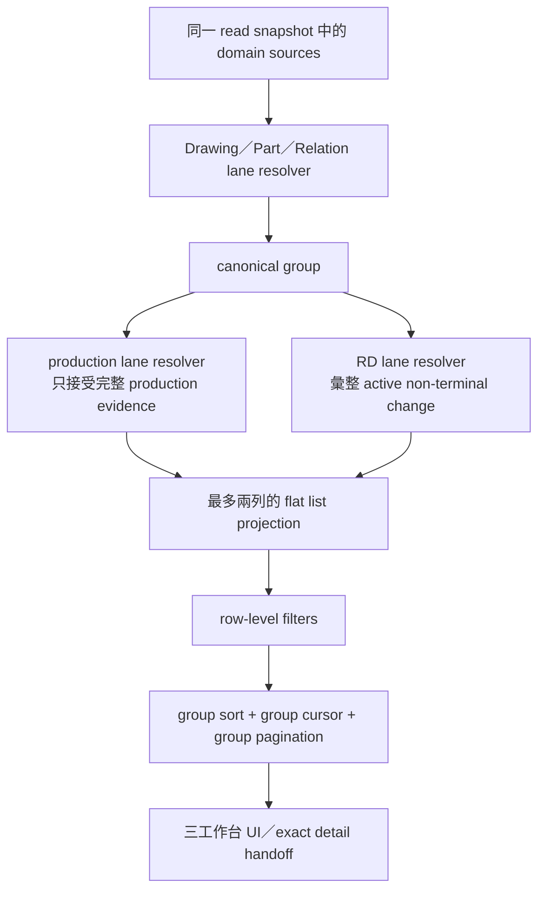
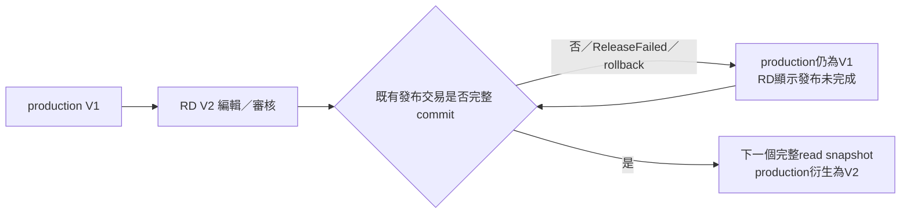

# SPEC-PDM-WORKBENCH-PRODUCTION-RD-LANES-001：三工作台量產／研發最新版雙列投影

Status: `Historical Runtime Baseline / Superseded by DEV-087 and DEV-090 / Shared Mechanics Retained / No Separate Release Target`
Date: 2026-08-20；CAPA amendment 2026-08-21
Owner: Dev PM
Related DEV: `DEV-086` / `DEV-PDM-WORKBENCH-PRODUCTION-RD-LANES-001`
Related ADR: `.ai-doc/decisions/ADR-PDM-WORKBENCH-PRODUCTION-RD-LANES-001-dual-lane-authority.md`
Related QA: `.ai-doc/qa/qa-dev-086-production-rd-lanes-validation-plan-2026-08-20.md`

> **2026-08-22 DEV-087 supersession amendment**
>
> DEV-087的新決策優先。本文件只描述DEV-087 activation前的現行雙列runtime與其歷史證據；不得再作為未來target實作契約。activation時，Drawing的「最多一列RD aggregate／同組最多兩列／RD只代表active work」改為production 0/1＋每個open branch latest RD 0..3；Part／Relation改用正式0/1＋專用work 0/1；lane/status/filter/current-work fallback依DEV-087 inventory拆除。可保留的只有production不被RD遮蔽、exact artifact、server composition、permission與domain evidence原則。

Related authority:

- `.ai-doc/specs/SPEC-PDM-UNIFIED-DRAWING-WORKBENCH-001-single-page-lifecycle-workbench.md`
- `.ai-doc/specs/SPEC-PDM-NUMBER-STATE-FLOW-001-unified-numbering-draft-and-transfer-functional-spec.md`
- `.ai-doc/specs/SPEC-PDM-DRAWING-PART-RELATION-VIEW-001-root-drawing-part-relation-list.md`
- `.ai-doc/specs/SPEC-PDM-WORKBENCH-CORE-001-shared-read-and-controller-contract.md`
- `.ai-doc/specs/SPEC-PDM-WORKBENCH-MULTISELECT-FILTER-001-excel-style-filter-contract.md`
- `.ai-doc/specs/SPEC-PDM-STATUS-UX-004-human-status-projection.md`
- `.ai-doc/specs/SPEC-PDM-REVISION-POLICY-002-release-gate-and-suggestion-engine.md`
- `.ai-doc/specs/SPEC-PDM-SHARED-3D-MA-BASELINE-001-root-model-and-manufacturing-baseline.md`
- `.ai-doc/decisions/ADR-PDM-MATERIAL-IDENTITY-REVISION-001-part-number-vs-controlled-definition-revision.md`

## 0. Authority、成熟度與衝突處理

本規格是 `DEV-086` 的 Current Phase 實作契約，成熟度維持 `RD Implementation Ready`。Human Decision、domain authority、exact file／function／route inventory、SQL／index／migration classification、projection token、數值 query budget、fixture、Phase gate與 dirty-hunk ledger均已封口；2026-08-21 CAPA 判定既有 source implementation／focused static evidence未能證明 live on-path，故 DEV-086 依第14.6節重開 correction 與驗證，不必另開平行 DEV 或補猜產品決策。

Spec Impact：`Intentional replacement + compatible preservation`。

- 有意取代：圖號正式 master 永遠一列、Part candidate／formal 各自獨立列、source-root change 只能疊在 formal root 同一列，以及 cursor 以單列為分頁單位的舊 top-level row contract。
- 保留：同一 canonical master identity、Part Number 無 Revision、domain mutation authority、approval／publication authority、一列一個主要人類狀態、shared mechanics + domain adapters、server-side snapshot、permission與 private no-store。
- feature flag 未啟用時，runtime truth仍是舊單列 read path；即使 source 已存在 dual-lane code，也只有 `DEV-086` correction、QA/QC與 activation gate完成且 status readback證明 enabled後，才可驗證本文目標投影。source presence或靜態字串斷言不是 runtime completion evidence。
- 本文不以修改舊文件掩蓋未實作狀態；受影響 active SPEC 只加入 target amendment與本規格連結。

## 1. 問題、使用者與成功結果

圖號、料號、圖料三個工作台同時服務研發與生產。單一「全域最新版」會在量產 V1 進入 V2 設變時，只留下 V2，導致生產使用者看不到仍有效的 V1，或誤把尚未發布的 V2 當成量產依據。

使用者與任務：

- 生產／製造／品質：快速辨識目前可用的量產定義並開啟 exact artifact／baseline。
- 研發／主管／審核者：辨識目前 active change、版次目的、工作狀態與可用操作。
- 管理員／稽核者：確認兩個 lane 的 authority、切換證據、衝突與失敗恢復。

成功結果：同一 canonical group 最多相鄰顯示一列`量產最新版`與一列`研發最新版`；V2 編輯／審核期間 V1 量產列不消失，只有完整發布成功才切換量產投影。

## 2. UX Intent

- 主要工作方式：掃描、比較、搜尋、篩選與查閱 exact version，不是管理兩份 master。
- 主要工作物件：canonical 圖號、stable Part Number、stable 圖料 root。
- 常駐資訊：主識別、lane 標籤、版本／基準、人類主要狀態、必要例外與目前可用操作。
- 按需資訊：完整來源集合、raw lifecycle、audit、歷史 revision、release receipt與平行設變細節。
- 刪除資訊：每列固定教學句、重複`查看明細`按鈕、raw status／API route／內部 ID、每個主檔一張雙層卡片。
- 五秒理解：使用者不讀說明即可回答「生產現在用哪一版」及「研發正在改哪一版」。
- 高風險誤操作：研發列不得顯示`生產可用`，preview／download／detail不得跨 lane fallback，發布失敗不得移動量產有效指標。

## 3. 核心名詞與不變量

```ts
export type PdmWorkbenchLane = "production" | "rd";

export type PdmWorkbenchReferenceKind =
  | "drawing_revision_package"
  | "manufacturing_baseline"
  | "legacy_released_basis"
  | "candidate_workspace"
  | "active_change_set";
```

| 名詞 | 定義 |
|---|---|
| canonical group | 同一 drawing master、Part Number identity、part root identity，或尚未正式化的 source-less candidate workspace |
| production lane | 最新一個已提交、符合 production eligibility 且可在同一 read snapshot 證明的生產定義 |
| RD lane | 同一 group 目前所有未終結、未成為 production-effective 的 active definition change 投影 |
| lane row | 清單中可獨立選取的一列；每列恰有一個 lane、一個人類主要狀態與一個 exact reference token |
| derived effective reference | server 從既有 immutable／controlled source 推導的有效參照；不是使用者可編輯 pointer |
| projection token | server 簽發的 integrity token，綁定 company、actor、row key、lane與source fingerprint；每次handoff重新解析authority，避免 stale／tampered detail |

不變量：

1. 同一 group 最多一列 production＋一列 RD；不得複製 master，也不得以相同版本補滿兩列。
2. 有兩列時固定 production 在上、RD 在下且保持同頁相鄰；sort direction 不改變 lane 內部順序。
3. `lane`是版本效力／用途，不是第二個 workflow status；`humanStatus`仍是每列唯一主要狀態。
4. lane presence 不等於可使用。只有 `availabilityScope` 明確為 production 才可顯示`生產可用`。
5. Part Number 與 root identity 不產生 Revision。它們只顯示受控 Drawing／BOM／manufacturing baseline reference。
6. 顯示碼、更新時間、client 傳入狀態或人工選擇不得成為 lane authority。
7. list、preview、download、detail與 deep link 必須使用同一 exact lane reference；stale／missing／forbidden 直接 fail closed。

## 4. 投影拓撲



投影順序固定：`authorize source scope → build group → resolve production／RD → apply row filters → remove empty group → group sort → group paginate → exact preview/detail hydrate`。

## 5. Domain Authority Contract

### 5.1 Drawing

Canonical group：

- Drawing 一律沿用現有 unified `drawings.id`：`drawing:{unifiedDrawingId}`；是否已有`drawing_number_id`不改變group identity。
- 尚未正式化但已有canonical drawing的source-less workspace仍是同一`drawing:{unifiedDrawingId}`，只能有RD lane；`candidate:{workspaceId}`只保留為legacy deep-link adapter，不能成為新list row key。

Production resolver：

- source 為 `drawing_revision_packages` 與既有 lifecycle／release evidence。
- 必須是 effective lifecycle=`released`、physical package status=`Released`、major revision，且必要 package evidence完整。
- 以既有 `compareRevisionCodes(..., { allowLegacy: true })` 比較 revision；最高合法 Released package為 production reference。
- comparator失敗、同 revision 多個互斥 package、缺 evidence 或狀態矛盾時，不得用 `updatedAt` 猜測。保留上一個無歧義 production reference，並在 RD／例外投影顯示`待確認`；若沒有可證明的舊 reference，production lane不可宣稱可用。

RD resolver：

- source 為 candidate workspace、active drawing revision package、lifecycle workflow與 release-failed／correction evidence。
- 包含 building、drawing preparation、ready、in review、finalizing、correction、RD-controlled、release-incomplete等非終結、非 production-effective 狀態。
- major target V2 尚未發布時，版本欄顯示 V2，次要文字顯示`目標量產版`；minor revision只顯示`研發受控`，不得標示 production-effective。
- 多個互斥 maximal branches時只回一列 RD conflict projection，顯示`待確認`與`存在 N 個平行設變`；完整 branch list只在 exact detail顯示。

### 5.2 Part

Canonical group：

- formal：`part:{partNumberId}`。
- 新 Part Number 尚未正式化：`candidate:{workspaceId}`，只能有 RD lane。

Part Number 本身無 Revision。`versionLabel`只能來自 manufacturing baseline、受控 Drawing／BOM definition或 active change set。

Production resolver：

1. 若有合法 `owner_scope='part_number'` Released manufacturing baseline，使用最新可比較的 `baselineRevision`與 immutable snapshot作 primary reference。
2. 若既有資料尚無 baseline，允許 read-only `legacy_released_basis`：Part master＋production-eligible primary manufacturing drawing的最新 Released package；UI標示`舊制發布基準`，不得冒充 manufacturing baseline。
3. Part master若為 Released但主要製造圖／必要 evidence失效，仍可保留 production lane作為「最後量產基準」的可見投影，但 `availabilityScope`必須 fail closed，主要狀態顯示`量產基準待確認`，不可顯示`生產可用`。

RD resolver：

- 彙整 `owner_scope='part_number'` 的 active Draft baseline、`drawing_revision_package_part_scopes`所指向的 active drawing changes，以及能以 stable FK 明確連到該 Part Number 的 workspace change。
- 不同 source不硬排成虛構 Part Revision；server建立一個 `active_change_set`。若能證明共同 target revision，顯示該受控 definition；否則顯示`N 項設變`。
- 無 stable FK 的 candidate不得用料號文字、名稱或 root code模糊掛到 formal Part group。

### 5.3 Relation Root

Canonical group：

- formal：`root:{partRootId}`。
- source-less new root workspace：`candidate:{workspaceId}`，只能有 RD lane。

Production resolver：

1. 若有合法 `owner_scope='part_root'` Released manufacturing baseline，使用其 immutable snapshot與 exact drawing packages。
2. 尚無 baseline時，使用 root master＋當下可證明 production-eligible 的 Released Drawing／Part／relation dependency aggregate，標示`舊制發布基準`。
3. dependency缺漏、主要製造圖失效或 relation ambiguity時，保留最後量產基準可見性但 availability fail closed；不得因新 active change覆蓋舊 production projection。

RD resolver：

- 彙整 `source_root_id=rootId` 的 active workspaces、root下 active drawing revision packages與 Draft root manufacturing baseline。
- 既有 `activeChanges[]`不再藏在 formal row內；它成為 RD lane的 exact change-set detail。
- 多個相容 change可組成一列 aggregate；互斥 scope、相同 target revision或 dependency衝突時改為 conflict projection，不任選更新時間最新者。

## 6. State and Transition Contract

| Production evidence | Active RD evidence | Top-level result |
|---|---|---|
| 無 | 無 | 無列；若 canonical master存在但資料矛盾，回可恢復錯誤，不靜默隱藏 |
| 有 V1 | 無 | 一列：`量產最新版 V1` |
| 無 | 有 V1／candidate | 一列：`研發最新版`；不得複製成 production |
| 有 V1 | V2 building／editing | production V1＋RD V2 `編輯中／目標量產版` |
| 有 V1 | V2 in review | production V1＋RD V2 `審核中／目標量產版` |
| 有 V1 | V2 correction | production V1＋RD V2 `待修正` |
| 有 V1 | V2 release incomplete | production V1＋RD V2 `發布未完成` |
| V2完整發布交易已commit | 無其他 active change | 一列：production V2；V1只在歷史／audit |
| V2完整發布交易已commit | V3 active | production V2＋RD V3 |
| terminal canonical group＋`history=exclude` | 任意 | 不顯示 |
| terminal canonical group＋`history=include` | 有最後合法 production reference | production lane顯示最後基準＋唯一 terminal human status；availability不可宣稱生產可用 |

發布讀取語意：



`productionRef`是衍生結果，不新增人工可編輯 pointer。只要 source transaction未commit，新的 read snapshot就不能選到 V2；partial／failed source不能推動切換。

## 7. Shared DTO and API Contract

### 7.1 Row contract

`PdmWorkbenchRowBase` target delta：

```ts
export type PdmWorkbenchLaneReference = {
  kind: PdmWorkbenchReferenceKind;
  displayRevision: string | null;
  purposeLabel: "目標量產版" | "研發受控" | "舊制發布基準" | null;
  sourceCount: number;
  conflict: boolean;
  projectionToken: string;
};

export type PdmWorkbenchLaneFields = {
  groupKey: string;
  entityKey: string;
  lane: PdmWorkbenchLane;
  laneLabel: "量產最新版" | "研發最新版";
  reference: PdmWorkbenchLaneReference;
};
```

規則：

- `entityKey`沿用 existing canonical owner key；`groupKey`與`entityKey`相同。Drawing即使尚未正式化也使用`drawing:{unifiedDrawingId}`。
- formal lane row key固定 `{entityKey}:{lane}`，例如`drawing:{id}:production`、`part:{id}:rd`、`root:{id}:production`。
- Part／Root source-less candidate固定`candidate:{workspaceId}:rd`；沒有 production candidate row。Drawing legacy `candidate:{workspaceId}`只做canonicalize，不再由list產生。
- row key不含 revision、baselineRevision、updatedAt、index或顯示碼；V2變V3時 row identity不變。
- `projectionToken`綁定當下 exact reference。detail／preview若 token stale或遭竄改，回409／400並要求重新整理，不得默默開啟新 reference。
- raw source ID、branch list、audit與 permission evidence不得作第一層可見文字；API只在授權 detail投影提供必要內容。

### 7.2 List routes

沿用現有 read authority：

- Drawing：`GET /api/numbering/drawings/workbench`
- Part：`GET /api/parts/workbench`
- Relation：`GET /api/numbering/relations?projection=workbench_v1`

新增同義 query：

| Query | Normalized meaning |
|---|---|
| 缺少 `lane` | all：兩 lane，向後相容且為 canonical URL |
| `lane=production&lane=rd` | all：兩 lane；解析後依 DEV-085 正規化並省略 query key |
| `lane=production` | 只回 production rows |
| `lane=rd` | 只回 RD rows |
| `lane=__none__` | 零 row，沿用 DEV-085 explicit none token |
| sentinel與其他值混用／sentinel重複／unknown／invalid token | 400 `workbench_invalid_filter`；browser依DEV-085正規化為none並可讓使用者恢復 |

同欄 lane採 OR；與 query、view、stage、humanStatus、recordStatus、series／purpose／entity type及 history採 AND。parse／serialize／dedupe／canonical order／none token沿用DEV-085共用selection helper，禁止再造comma-separated wire；filterHash必須包含canonical lane selection（all=`"*"`、none=`"!"`、some=canonical values）。

List response target additive fields：

```ts
type PdmWorkbenchLaneListResponse<Row, Filters> = {
  rows: Row[];                    // flat lane rows，最多 2 * groupLimit
  nextCursor: string | null;
  previousCursor: string | null;
  pageIndex: number;
  paginationUnit: "group";
  groupLimit: number;
  groupCount: number;
  generatedAt: string;
  filters: Filters & { laneOptions: ["production", "rd"] };
};
```

### 7.3 Detail／preview／download

- lane-aware detail沿用現有 `[rowKey]` route，並要求`projectionToken` query；server先驗證actor／company／rowKey／lane／fingerprint，再hydrate exact reference。
- explicit lane row不存在時回404 `workbench_lane_not_found`；token stale回409 `workbench_lane_stale`；token invalid回400；無權限回403。四者都不得 fallback另一 lane。
- server回傳的 preview／download href必須綁 exact package／baseline item／file authority；UI不能以 group或最新檔案查詢替代。
- lane-aware row key缺token一律400。只有feature flag開啟前已存在的unlaned formal／candidate deep link可無token進入一次性compatibility adapter：formal採production-first、沒有production才採RD；candidate只採RD。response回`canonicalRowKey`與新token，client以`replaceState`更新URL；這是legacy入口canonicalization，不是lane fallback。

### 7.4 Projection token wire contract

新增`src/lib/pdm-workbench-projection-token.ts`，固定target contract：

```ts
type PdmWorkbenchProjectionTokenPayload = {
  version: 1;
  namespace: "pdm-workbench-lane-reference-v1";
  companyId: string;
  actorId: string;
  rowKey: string;
  lane: PdmWorkbenchLane;
  fingerprint: string;
};
```

- wire為`base64url(canonical JSON).base64url(HMAC-SHA256)`；secret依序取`PDM_AUTH_SECRET`、`AUTH_SECRET`，production缺secret時fail closed。不得新增token table或server session state。
- `fingerprint`是server對canonical JSON `{ referenceKind, referenceId, revisionOrBaseline, contentHashOrSnapshotHash }`做SHA-256；payload不放raw package、baseline、workspace或file ID。
- token不以時間自動過期，因為每次request都重查actor/company permission與當下lane reference；reference變更即409 stale。token不是authorization，驗章成功仍不得略過domain permission。
- invalid format／signature／rowKey／lane為400；same-company actor無detail permission為403；cross-company或不存在identity為404；合法舊fingerprint為409。error payload與log不得回token原文或source ID。
- list產生的detail／preview href一律帶token；browser history可保存URL，但application log、audit detail、analytics與長期DB欄位不得保存token。

## 8. Group Cursor、排序與一致性

- 分頁單位是 canonical group；`limit`在 flag on時代表 group count，UI顯示`每頁 N 組`。response row count可介於0與`2 * groupLimit`。
- cursor payload升為 version 2，固定綁定`version, filterHash, sortValue, groupKey, direction, pageIndex`；游標簽章與secret沿用Workbench Core。`rowKey`不得再作page boundary。
- v1 cursor在 flag on時不得被當成 v2讀取；API回 recoverable stale-cursor，controller只自動清除一次並回第一頁。
- group sort使用 canonical display code／name的 domain natural comparator，再以`groupKey`作唯一 tie-breaker；group內永遠 production→RD。
- row-level filter在 lane resolution後、group pagination前執行。某 lane不符合條件時只移除該 row；group至少一列符合才進page。
- identity、lane sources、status、availability、permission與preview reference必須在同一 bounded read snapshot或等價一致性邊界產生。任一 required hydrate失敗時整個 response fail closed，不回 partial pair。
- query count不得隨group／child數線性增長；1／20／50 groups的count必須完全相同。硬上限：Drawing list `<=18`、Part list `<=18`、Relation list `<=22`；Drawing lane detail `<=18`、Part lane detail `<=18`、Relation lane detail `<=26`。owner baseline bundle resolver固定最多2 queries（baselines＋items），不得per owner／row查詢。超過即FAIL；需要放寬必須回Dev PM修SPEC，不得只改測試常數。

## 9. Permission、Privacy and Cache

- formal group的lane presence由既有 domain master-view scope控制；可看該 canonical master的使用者可看安全的 production／RD lane summary，不因Manufacturing或RD角色而靜默隱藏其中一列。
- source-less candidate仍要求既有 workspace view permission；不能因 lane設計擴張新候選可見範圍。
- RD lane第一層只回lane、版本／基準短標籤、人類狀態與安全摘要。exact files、notes、review evidence、branch sources與 mutation capabilities仍依現有 domain／workspace／review permission裁切。
- actor角色只改 action、detail depth與command capability，不改同一 formal group的lane presence。
- company由authenticated actor派生；client company、owner、source IDs與capability claims無authority。cross-company token／rowKey／cursor一律fail closed。
- response保持`Cache-Control: private, no-store`；projection token不可出現在log、可見文字或可分享URL以外的長期儲存。

## 10. UI Contract

### 10.1 Desktop／tablet

- 維持表格／清單為第一視覺，不建立 group card。
- 同一 group使用語意`rowgroup`；主識別可在desktop以單一跨列cell顯示，兩個lane各自是可選取row。
- lane column固定在主識別旁。production使用工廠類icon＋`量產最新版`；RD使用實驗／研發類icon＋`研發最新版`。icon具可存取名稱，顏色不是唯一訊號。
- production row固定第一列；RD row固定第二列。兩列以低對比底色／左側識別線／位置輔助，不使用厚重雙層卡片、陰影或大型警示容器。
- 版本／基準cell一個主要值；只有會改變判斷時保留第二行，例如`目標量產版`、`舊制發布基準`、`存在 N 個平行設變`。
- 每列最多一個主要 human status。lane label、purposeLabel與availability不是競爭狀態badge。
- row本身是查閱入口；不得每列再固定增加`查看明細`。只有server-derived、與當前狀態相關的 action才可出現，且同一active scope一個primary。

### 10.2 Mobile

- 每個 group仍依 production→RD堆疊兩個 compact rows；因table rowspan不可用時，可在每列重複主識別但只保留必要短值。
- lane label先於版本／基準與status；不得只留色條或icon。
- filter popover／sheet、lane label、status與action不得造成水平overflow、裁切或重疊。

### 10.3 Filter

- 三工作台同一位置顯示`版別`filter，值為`量產最新版`／`研發最新版`。
- 在DEV-085尚未實作時可用單一`全部／量產／研發`控制；兩DEV共同落地時，必須改用DEV-085的Excel式複選，但canonical query仍以本規格`lane`語意為準。
- filter change重設cursor／page並保留其他合法URL條件；hard reload、Back／Forward必須還原。

## 11. Failure and Recovery

| Failure | Required behavior |
|---|---|
| production source缺 evidence | 保留上一個合法 production reference；若無，顯示不可用／待確認，不宣稱生產可用 |
| RD source平行／不可比較 | 一列 RD conflict projection；顯示`待確認`與source count |
| release failed／rollback | production不動；RD顯示`發布未完成`與既有domain recovery action |
| lane detail stale | 409，保留list context並要求刷新；不開啟另一版本 |
| lane無權限 | 403與聯絡角色／恢復方式；不序列化 restricted detail |
| invalid／cross-company token | 400／404 fail closed；不透露另一公司是否存在 |
| group hydrate部分失敗 | 整體可恢復error；不回半個pair或partial tree |
| old cursor | 一次清除並回第一頁；不得循環重試 |
| preview／download missing | exact lane顯示缺檔／失敗；不得取另一lane最新檔 |

所有可見error必須使用人類語言，不顯示raw JSON、stack、SQL、API route或opaque token。正常狀態保持安靜，只有阻擋／失敗顯示恢復入口。

## 12. Data、Schema、Migration and Compatibility

Current Phase預設採read projection，不要求建立第二份master、人工pointer或Part Revision。既有可用sources：

- `drawing_revision_packages`、drawing lifecycle workflows／review evidence。
- `drawing_revision_package_part_scopes`。
- `numbering_draft_workspaces`、typed roots／parts／drawings／relations與stable source FKs。
- `manufacturing_baselines`／items、shared model與Released drawing package refs。
- `drawing_numbers`、`part_numbers`、`part_roots`、relation links與既有 availability projection。

目前 repository缺少完整的owner-based baseline list與跨Part／Root active change-set resolver；它們已納入第14節Phase 1C exact inventory，不另開產品決策。

Schema／migration classification：`none`。

- 既有stable FK、release fields與索引已足夠：`idx_drawing_revision_packages_drawing_revision`、`idx_drawing_revision_packages_lifecycle_unique`、`idx_drawing_revision_packages_released_unique`、`idx_numbering_draft_workspaces_source_drawing`、`idx_numbering_draft_workspaces_source_part`、`idx_numbering_draft_workspaces_source_root`、`idx_manufacturing_baselines_owner`與`idx_manufacturing_baseline_items_baseline`。
- DEV-086不得修改`db/schema.sql`、`db/postgres/*.sql`，不得新增business table、manual pointer、Part Revision、migration artifact或backfill。若實測query plan證明索引不足，停止Phase並回Dev PM重做migration classification；不得直接偷加index。
- legacy data不批次改號、不重播approval、不重寫Released package／baseline。`scripts/qc-dev-086-classifier.mjs`只做read-only分類並輸出redacted aggregate manifest；`ambiguousProduction`、`duplicateEffectiveReference`、`unmappedActiveChange`、`partialReleasedEvidence`任一非0即禁止activation。
- 2026-08-20本機working DB read-only inventory只有2個Drawing、2個Part、2個Root，Released drawing package與Released baseline皆為0，source-linked active Drawing／Part／Root workspace皆為0，source-less active workspace為56。因此它只能驗證classifier與compatibility空集合，不能拿來宣稱V1/V2 production transition PASS；QA必須建立可清理的isolated deterministic fixtures。
- feature flag off時，現有v1 DTO、row key、cursor與UI維持原樣；不形成半套lane row或雙detail path。

## 13. Feature Activation Boundary

新增 umbrella flag `PDM_WORKBENCH_PRODUCTION_RD_LANES_V1`，default off：

- 只有Drawing、Part、Relation三個adapter、shared cursor/group mechanics、lane filter、exact detail與QA gate全部ready時才可標記可activation。
- flag on要求既有 unified workbench／lifecycle dependencies成立；任一dependency缺失時status endpoint回requested但blocked，UI維持flag-off契約。
- 三工作台必須一起切換lane semantics，不能只開一個domain造成同義filter與row identity不一致。
- 本文件不授權staging／production flag切換、migration apply、deploy或release。

## 14. Current Phase Handoff and Phase Matrix

| Phase | Execution boundary | Document status | Scope | Entry condition | Exit evidence |
|---|---|---|---|---|---|
| 1A Shared contract | CAPA verified | Contract and lane token implementation verified | lane DTO、group key、cursor v2、filter normalization、token、umbrella flag | DEV-085 helper與dirty ledger已保存；on-path status readback | `qc:dev-086:contract` 5/5＋browser status gate |
| 1B Drawing adapter | CAPA verified | Released major vs active revision resolver verified | V1/V1.1 exact status、revision label、detail handoff | production revision 1＋RD revision 1.1 rendered | A0002-M01 rowgroup／API／detail evidence |
| 1C Part／Relation adapters | CAPA verified | Dual-row grouping and lane filters verified | baseline bundle、legacy basis、change set、source-root split、atomic baseline release＋audit | migration classification仍為none | A0002 P/R matrix＋browser evidence |
| 1D UI and navigation | CAPA verified | Rendered browser and responsive evidence verified | paired rowgroup、lane filter、RWD、a11y、safe return、stale recovery | three route × desktop/tablet/mobile | browser manifest 76/76 |
| 1E Transition QA/QC | Local QA-QC PASS | Focused transition/classifier checks and fresh isolated QC rerun verified | release success／failure、concurrency、classifier、regression、QC receipt | aggregate PASS、typecheck PASS、cleanup | `output/qa/dev-086/dev-086-2026-08-21T00-59-40-660Z/manifest.json` |

### 14.1 Exact implementation inventory

| Slice | Action | Exact files and named contract |
|---|---|---|
| Shared DTO／cursor | modify | `src/lib/pdm-workbench-contract.ts`新增lane/reference/list fields；`src/lib/pdm-workbench-cursor.ts`新增v2 group payload且v1 fail closed；`src/lib/repositories/pdm-workbench-read-snapshot.ts`維持bounded snapshot；`src/lib/pdm-workbench-filter-selection.ts`沿用DEV-085 selection wire並加入lane allowlist。 |
| Exact handoff | create＋modify | 新增`src/lib/pdm-workbench-projection-token.ts`，export `createPdmWorkbenchProjectionToken`、`verifyPdmWorkbenchProjectionToken`、`pdmWorkbenchReferenceFingerprint`；`src/components/use-pdm-workbench-controller.ts`在detail request帶token並處理409 refresh／legacy canonical replace。 |
| Activation | modify | `src/lib/number-state-flow-feature.ts`新增`PDM_WORKBENCH_PRODUCTION_RD_LANES_V1`、`isPdmWorkbenchProductionRdLanesV1Enabled`與client status；`src/app/api/numbering/state-flow/status/route.ts`回`productionRdLanes`。requested on但Drawing／Part-Relation dependency未開時回`enabled:false, blocked:true`。 |
| Drawing adapter | modify | `src/lib/repositories/drawing-workbench-async-repository.ts`以group identity page批次讀所有eligible Released packages與active packages/workspaces，取代`overlayLifecycle.latestByDrawingId`；`src/lib/drawing-workbench.ts`新增`resolveDrawingWorkbenchLaneGroups`並輸出0～2 rows。`src/lib/repositories/drawing-revision-lifecycle-async-repository.ts#decide`是既有atomic release authority，僅驗證、不改其決策語意。 |
| Drawing API／artifact | modify | `src/app/api/numbering/drawings/workbench/route.ts`、`[rowKey]/route.ts`、`[rowKey]/preview/route.ts`；`src/lib/pdm-workbench-preview-gallery.ts`必須從lane reference解析exact revision/file，不再呼叫`latestRevision`替代。 |
| Part adapter | modify | `src/lib/repositories/part-workbench-async-repository.ts`的identity SQL只保留formal Part與source-less candidate group，source-part workspace附回formal group；`src/lib/part-workbench.ts`新增`resolvePartWorkbenchLaneGroups`。 |
| Relation adapter | modify | `src/lib/repositories/relation-workbench-async-repository.ts`批次讀source-root workspace／drawing change／baseline bundle；`src/lib/relation-workbench.ts`新增`resolveRelationWorkbenchLaneGroups`，既有`activeChanges[]`移到RD exact detail，不再藏在production row。 |
| Baseline authority | modify | `src/lib/repositories/shared-3d-baseline-async-repository.ts`新增`listManufacturingBaselineBundlesByOwners`（1次baseline query＋1次items query）與`releaseManufacturingBaselineWithAudit`；在同一transaction以`WHERE status='Draft'`更新、確認affected row並由`AsyncAuditRepository(tx)`寫audit。`src/lib/shared-3d-baseline.ts#releaseManufacturingBaselineAsync`改呼叫該transaction method，移除commit後第二次audit write。 |
| Part／Relation API | modify | `src/app/api/parts/workbench/route.ts`、`[rowKey]/route.ts`、`[rowKey]/preview/route.ts`；`src/app/api/numbering/relations/route.ts`、`[rowKey]/route.ts`。所有lane-aware detail驗token且no-store；Relation若未提供preview/download就不得虛構endpoint。 |
| Shared list UI | modify | `src/components/pdm-workbench-list.tsx`新增`getGroupKey`／`getGroupAriaLabel`，同group rows輸出同一`tbody role="rowgroup"`；legacy caller未提供group key時維持單一tbody。 |
| Domain UI | modify | `src/components/drawing-workbench.tsx`、`part-workbench.tsx`、`relation-workbench.tsx`加入`版別`filter、lane欄／label、group selection與token handoff；`src/components/pdm-workbench-preview-gallery.tsx`顯示lane並開exact artifact；`src/app/styles/responsive.css`提供低對比lane row／mobile adjacent stack，不新增card-in-card。 |
| Tests／commands | create＋modify | 新增第14.4節scripts；`package.json`只新增DEV-086命令。既有DEV-062／065／067／085 suites保留為regression，不改舊budget以讓新功能通過。 |

### 14.2 Repository and SQL contract

- Drawing identity query先以`drawings.id`形成group page candidate set；單次package query以`drawing_number_id IN (...)`抓status/lifecycle/revision evidence，單次reviewer／decision batch保留。production只從major＋Released雙重evidence選；RD從non-terminal且非production-effective集合選。禁止per drawing query與`updated_at DESC LIMIT 1`。
- Part identity query以`part_numbers.id`形成formal groups，`numbering_draft_workspaces.source_part_number_id`批次attach；`source_part_number_id IS NULL`才可作RD-only Part candidate。production baseline query使用`company_id + owner_scope='part_number' + owner_id IN (...) + status='Released'`，RD baseline用`status='Draft'`。
- Relation identity query以`part_roots.id`形成formal groups，`source_root_id IN (...)`批次attach；source-less candidate保持獨立。production root baseline使用`owner_scope='part_root'`；legacy aggregate必須逐項可證明Released，不得動態抓各child最高updatedAt。
- row filter在resolver後、group limit前完成；實作可採bounded over-fetch loop，但每批仍須set-based，且50 groups query count不得高於1 group。任一hydrate query失敗整個response失敗，不回半個pair。

### 14.3 Query budget and performance gate

| Surface | Hard ceiling | Cardinality assertion |
|---|---:|---|
| Drawing list（含lane preview summary） | 18 | 1／20／50 groups完全相同 |
| Part list（含lane preview summary） | 18 | 1／20／50 groups完全相同 |
| Relation list | 22 | 1／20／50 groups完全相同 |
| Drawing lane detail | 18 | 1／20 linked Parts完全相同 |
| Part lane detail | 18 | 1／20 linked Drawings完全相同 |
| Relation lane detail | 26 | 1／20 relation nodes完全相同 |
| baseline bundles | 2 | 1／20／50 owners完全相同 |

所有list／detail read path另以write spy斷言`execute=0`、`transaction write=0`；只有明確baseline release transition runner可寫isolated fixture DB。

### 14.4 Exact runners and evidence paths

| Command | Script | Responsibility |
|---|---|---|
| `npm run qc:dev-086:contract` | `scripts/qc-dev-086-contract.mjs` | DTO、key、lane wire、cursor v2、token、flag dependency、no schema delta |
| `npm run qc:dev-086:repository` | `scripts/qc-dev-086-repository.mjs` | D/P/R fixture matrix、classifier、conflict／legacy／no-guess |
| `npm run qc:dev-086:api` | `scripts/qc-dev-086-api.mjs` | list/detail/preview、400/401/403/404/409/5xx、no-store、no fallback |
| `npm run qc:dev-086:query` | `scripts/qc-dev-086-query-budget.mjs` | 第14.3節hard ceilings、cardinality invariance、read zero-write |
| `npm run qc:dev-086:transition` | `scripts/qc-dev-086-transition.mjs` | Drawing與baseline success／rollback／audit failure／concurrent read／idempotency |
| `npm run qc:dev-086:classifier` | `scripts/qc-dev-086-classifier.mjs` | local／candidate activation DB的read-only aggregate manifest |
| `npm run qc:dev-086:browser` | `scripts/qc-dev-086-browser.mjs` | 三routes、四viewports、filter、rowgroup、a11y、visible/network error sweep |
| `npm run qc:dev-086:regression` | package aggregate | 依序執行`qc:dev-085:selection`、`qc:dev-085:contract`、`qc:dev-062:core`、`:part`、`:relation`、`:compat`、`qc:dev-065-workbench-preview-gallery`、`qc:dev-067:contract`、`:query`、`:preview`、`typecheck:app` |
| `npm run qc:dev-086` | package aggregate | contract→repository→api→query→transition→classifier→browser→regression，任一FAIL即停止 |

fixture helper固定為`scripts/qc-dev-086-fixtures.mjs`，只建立task-owned isolated SQLite與disposable PostgreSQL資料，回傳cleanup receipt；不得使用或修改production／shared local business DB。evidence root固定`output/qa/dev-086/<run-id>/`，內含`manifest.json`、`fixture-receipt.json`、`query-budget.json`、`transition-readback.json`、`network-ledger.json`、`console.json`、`screenshots/`與`accessibility/`。token只存SHA-256 hash。

### 14.5 Git and dirty-worktree boundary

- baseline：branch `持續優化2`、HEAD `050eedd4`、2026-08-20；稽核時已有243個`src／scripts／db／package.json` product paths處於modified／untracked集合。這些全部是pre-existing user work，不得歸屬DEV-086、不得revert、reset或順手格式化。
- DEV-086產品targets中，`package.json`、`responsive.css`、四個domain／preview components、Drawing／Part／Relation service與repository、shared contract／cursor已是dirty；`pdm-workbench-filter-selection.ts`為untracked且屬DEV-085共用依賴。RD開始前保存`git status --short`與target-file diff hash，逐hunk合併，不能覆寫整檔。
- 2026-08-20 文件升級只修改DEV-086 SPEC／ADR／QA、`dev_task.md`、`documentation_map.md`與六份直接authority amendment；2026-08-21 CAPA 文件修正仍不直接修改產品碼。重開後 RD 可在 task-owned local／isolated 範圍修改第14.1節 exact targets與對應 tests，但沒有stage、commit、branch、PR、deploy或release授權；developer evidence必須另列`ownedHunks`與`preExistingHunks`。

既有 Phase 1A～1D source implementation與 focused static結果曾因 flag off、invalid dual-lane fixture與 static-only browser runner被降級為歷史 evidence；DEV-086 已依第14.6節完成 CAPA re-entry。沒有任何 production/staging phase 被標為已發布。

### 14.6 CAPA re-entry implementation package（2026-08-21）

重開原因與權威 CAPA：`.ai-doc/qc/qc-dev-086-dual-lane-completion-capa-2026-08-21.md`。本次分類是 `Implementation and evidence correction`，不是產品決策替換；既有 ADR 保持 Accepted。

| Re-entry gate | 必做項目 | Exit evidence |
|---|---|---|
| R0 Evidence reset | 將既有31 checks、DEV-085 26 checks與typecheck標為historical source/focused evidence；`qc:dev-086:browser`在具備真實 browser artifacts前不得稱 rendered browser PASS。 | 更新後 manifest 明列 `evidenceClass`、pending與不得完成原因。 |
| R1 Valid fixture | 透過正常 UI／domain command建立一個 Released production reference與一個 editing/review non-terminal RD reference；A0002-like流程在雙列證據完成前不得發布1.1。重用附件時保存content hash。 | `fixture-receipt.json`含 production/RD exact references、RD terminal=false、UI operation ledger與cleanup owner。 |
| R2 Activation | 在 task-owned local runtime同時啟用`PDM_WORKBENCH_PRODUCTION_RD_LANES_V1`及兩個依賴 flags；on-path開始前回讀status API。off path另驗完整相容。 | `requested=true`、`enabled=true`、dependencies全滿足的JSON與runtime ownership/cleanup receipt。 |
| R3 Corrective implementation | 依 live結果修正三domain resolver、API、UI、filter、token或test harness；禁止 client merge、複製假列、updatedAt猜版或跨lane fallback。 | affected tests、API readback、source diff ownership與P0 gap=0。 |
| R4 QA | 完整執行三route×四viewport、production actor、lane filter、exact detail/preview/download、query budget、release success/failure/rollback/concurrency。 | QA-086-01～38、screenshots、DOM/a11y、network/console、query與transition evidence全PASS。 |
| R5 Independent QC | 未撰寫修正者重做P0與live matrix，確認fixture／runtime全部清理。 | independent manifest、P0/P1=0與cleanup receipt。 |

`scripts/qc-dev-086-browser.mjs`在 CAPA 前只做7個source string／rowgroup assertion；該結果已降級為歷史 source-contract evidence，並由第14.7節的 rendered-browser runner 取代。若沒有 screenshot、rendered DOM／accessibility snapshot與network ledger，不能使用`browser PASS`名稱或結果。

### 14.7 CAPA corrective verification receipt（2026-08-21）

`scripts/qc-dev-086-browser.mjs` 已改為隔離 Playwright rendered-browser runner；本次 evidence class 為 `local-rendered-browser-qc`。on-path runtime 先回讀 `productionRdLanes.requested=true / enabled=true` 及所有 dependencies，再驗證圖號、料號、圖料根號三 route 的 desktop/tablet/mobile 清單、rowgroup、lane filter URL、a11y、network、console、page error 與 cleanup。圖號 A0002-M01 的 rendered rowgroup 明確包含 `量產最新版／版次 1` 與 `研發最新版／版次 1.1`；production row 的狀態／detail 以 Released revision 1 投影，RD row 以 non-terminal revision 1.1 投影。

證據：`npm.cmd run typecheck:app` PASS；`npm.cmd run qc:dev-086` aggregate PASS（contract 5、repository 4、api 4、query-budget 6、transition 3、classifier 2、browser 76/76）；manifest `output/qa/dev-086/dev-086-2026-08-21T00-59-40-660Z/manifest.json`。此次 runtime 使用 disposable fixture copy，未寫入正式 DB，cleanup 已由 runner finally 完成；production/staging deploy／release 仍不在本次授權內。

## 15. Acceptance Criteria

1. V1 production＋V2 editing／review時，同一 group顯示production V1與RD V2；production使用者仍能開啟V1 exact content。
2. 每group最多兩列、production在上、RD在下、同頁相鄰；單lane不複製，history revision不回top-level list。
3. Drawing以Released major revision作production authority；minor／active／failed package不能取代production。
4. Part／Root不建立Revision；只顯示manufacturing baseline、Released definition aggregate或active change set。
5. lane可直接篩選；filter-before-group-pagination，不漏列、不重複、不產生client假空頁。
6. 分頁以group為單位，next／previous、reload、Back／Forward與sort皆不拆pair。
7. preview／download／detail只使用row的exact reference；stale／missing／forbidden不fallback。
8. release success後下一snapshot原子切換；release failure／rollback時production reference不變。
9. formal group viewers可看兩lane安全summary；detail／action仍依actor／company／domain permission，cross-company fail closed。
10. 每lane row一個主要狀態；lane用文字、icon、位置與row style區分，不能只靠顏色。
11. 1440×900、1024×768、768×1024、390×844無overflow、重疊、裁切、不可操作或錯誤scroll owner。
12. 所有list reads零寫入；feature flag off完整回復現行v1契約。
13. 所有on-path browser evidence開始前，status API必須回傳production/RD lanes `requested=true`且`enabled=true`；flag off畫面只能作off-path相容證據。
14. V1＋V1.1雙列案例的fixture receipt必須證明V1為production-effective、V1.1為non-terminal editing／review；若V1.1已Released／terminal，該fixture無效且case必須FAIL，不得用history列補證。
15. browser PASS必須來自真實route、server response與rendered DOM，並保存四viewport screenshot、accessibility與network ledger；source string／mock DOM只能列為source-contract evidence。
16. row→detail／preview／download的lane label、主要狀態與exact reference必須一致；`list=RD / detail=production`或任一跨lane fallback均為P0 FAIL。
17. DEV-086只有在QA-086-01～38、runtime query budget、transition concurrency、independent QC、P0/P1=0與cleanup receipt全PASS後才能標為完成；局部static PASS不得提升狀態。

## 16. Stop Conditions

已達`RD Implementation Ready`；RD執行中遇到任一條件立即停止並回Dev PM／ADR：

- 無stable FK可把active change／baseline連到canonical Drawing／Part／Root，只能用display code、名稱或時間猜測。
- production eligibility需要人工選pointer、重寫Released history、Part Revision或另一套master identity。
- lane filtering／pagination只能在client merge兩次API後完成，或pair會拆頁。
- exact preview／download／detail無法綁定reference token，仍可能開到另一lane最新版。
- formal group的lane summary可見性與既有privacy／permission政策發生未確認衝突。
- current release transaction會在失敗後留下可被resolver誤判為production-effective的partial source，且沒有可驗證補償。
- 需要production migration、正式資料repair、deploy、release或外部成本／credential。
- 需把domain status／baseline semantics塞進shared core switch，破壞domain adapter boundary。
- on-path執行時status API的`requested`或`enabled`不是`true`，或三個必要flags沒有同時滿足。
- fixture無法同時證明一個production-effective reference與一個non-terminal RD reference；RD reference已Released／terminal，或fixture是以直接business DB write／手改狀態製造。
- 預期雙lane fixture在任一工作台只回一列、lane label缺失、production與RD未相鄰，或清單／明細／檔案 reference語意不一致。
- browser runner只有source字串、mock DOM或靜態截圖，沒有真實route、server response、rendered DOM與network evidence。

## 17. Evidence Required

- Contract：lane DTO、key/token、filter、cursor、group pagination與feature flag的targeted tests。
- Data：Drawing／Part／Root fixtures覆蓋production only、RD only、V1+V2、release failed、parallel changes、legacy basis、terminal history與invalid dependency。
- Repository：SQLite＋disposable PostgreSQL parity、bounded snapshot、filter-before-limit、無N+1、read zero-write。
- API：200／400／401／403／404／409／5xx、private no-store、cross-company、stale token／cursor與no partial rows。
- UI：三route、四viewport、lane filter、pair adjacency、keyboard／a11y、visible error sweep、data sanity與exact detail／preview network evidence。
- Transition：disposable fixture實際執行release success／failure／retry／concurrent read，保存before／after source hashes與production reference readback。
- QC：與RD分離的事實驗證；缺真實rendered surface、route、viewport、互動與screenshot只能判定`未充分驗證`。
- Activation：on-path保存status API `requested=true / enabled=true`與dependencies；off path另保存`enabled=false`相容結果，不得混用。
- Fixture validity：保存production／RD exact references、各自lifecycle、`rdTerminal=false`、正常UI/domain command ledger、重用附件hash與cleanup receipt；invalid fixture必須產生明確FAIL evidence。
- Completion：單一manifest列出QA-086-01～38、evidence class、P0/P1、independent QC與cleanup，不接受由不同run拼接後省略失敗或pending項。

## 18. Future Phase Capsule

`Future Phase Captured / Not Requested`：若未來要把manufacturing baseline提升為所有Part／Root正式發行的強制gate，需另在同一DEV或明確新交付點決定既有legacy basis遷移、MES／ERP消費、batch／order pinning與正式資料reconciliation。Current Phase讀取既有baseline並提供legacy released basis相容投影；只補正既有baseline release與audit的transaction atomicity，不新增release prerequisite，也不改變baseline是否必備的產品規則。

## 19. Readiness Conclusion

- P0／P1產品決策缺口：0。
- Blocked Human Re-entry：無。
- `RD Contract Ready`：已通過。
- `RD Implementation Ready`：是；exact repository/file inventory、schema/index=`none`判定、source classifier、數值query budgets、runner／fixture contract、baseline／dirty-hunk ledger與P0/P1 engineering gap audit均已封口。下一個可執行動作是Phase 1A本機RD，不是再寫一份平行規格。
- RD Implementation：`Historical Runtime Baseline / Superseded by DEV-087 and DEV-090`。三工作台 dual-lane projection、lane-specific status/detail、版本文字、direct filter、group pagination與rendered browser evidence保留為歷史基線；Drawing／Part current projection與shared mechanics由DEV-087承接，Relation formal／work與direct edit由DEV-090承接。
- Current disposition：本SPEC不再是獨立current semantic、QA denominator或release target；不得復活legacy source、執行舊domain mutation或以歷史manifest宣告現行完成。production／staging、live migration、deploy、smoke與release仍由DEV-087／DEV-090及既有gate治理。
