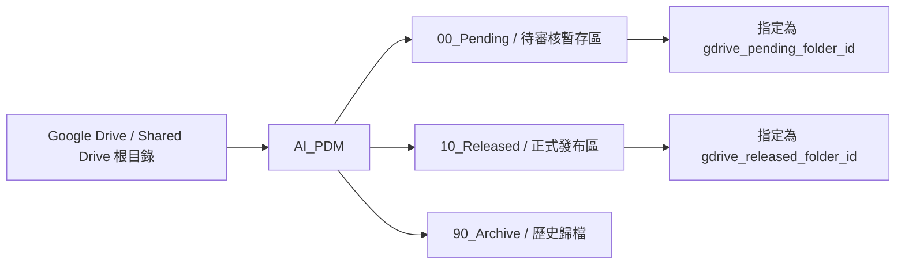

# Google Drive 資料夾樹狀設定 Spec

日期：2026-05-30
狀態：Implemented
適用頁面：`/settings`
相關模組：`src/app/settings/page.tsx`、`src/app/api/settings/route.ts`、`src/lib/gdrive.ts`

## 1. 背景與問題

目前 Google Drive 設定頁要求管理員手動輸入：

- `gdrive_pending_folder_id`
- `gdrive_released_folder_id`

這種方式對系統穩定，但對使用者不直觀。管理員在 Windows 檔案總管看到的是 Google Drive 同步後的資料夾名稱與層級，系統卻要求 Google Drive Folder ID，造成以下問題：

- Windows 資料夾名稱、同步路徑與 Folder ID 無法直接對應。
- 使用者可能貼錯 ID，例如貼到檔案 ID、上層資料夾 ID 或無權限資料夾 ID。
- 系統儲存前缺少可視化確認，使用者不知道設定是否真的指向正確資料夾。
- 公司若使用 Shared Drive，資料夾權限與本機同步可見性可能不一致。

## 2. 目標

建立一個 Windows 檔案總管式的 Google Drive 資料夾選擇介面，讓管理員直接在樹狀圖上指定 PDM 使用的 Google Drive 資料夾。

系統仍以 Google Drive Folder ID 作為正式設定值；樹狀圖只負責視覺化、選擇與驗證。

## 3. 非目標

第一版不做以下能力：

- 不做完整 Google Drive 檔案管理器。
- 不顯示檔案，只顯示資料夾。
- 不支援拖曳移動 Drive 資料夾。
- 不支援建立、刪除、重新命名 Drive 資料夾。
- 不掃描整個 Google Drive。
- 不把 Windows 本機同步路徑當作系統正式識別值。

## 4. 使用者角色

| 角色 | 權限 |
|---|---|
| Admin | 可瀏覽授權範圍內的 Google Drive 資料夾、指定 PDM 資料夾、儲存設定 |
| 非 Admin | 不可進入或操作此設定頁 |

## 5. 核心設計

採用「Windows Explorer 式雙欄配置」：

- 左側：Google Drive 資料夾樹狀導覽。
- 右側：目前選取資料夾的資訊與設定動作。
- 上方：左到右 breadcrumb，顯示目前資料夾路徑。
- 下方或右側固定區：目前已指定的 PDM 資料夾設定摘要。



## 6. UI 規格

### 6.1 頁面區塊

```text
Google Drive 設定

[狀態列：Service Account 已設定 / 未設定、最後驗證時間]

Google Drive > AI_PDM > 00_Pending

┌──────────────────────────────┬──────────────────────────────────────┐
│ 左側：資料夾樹狀導覽           │ 右側：選取資料夾詳細資訊              │
│                              │                                      │
│ ▾ Google Drive               │ 資料夾名稱：00_Pending                │
│   ▾ AI_PDM                   │ 路徑：Google Drive / AI_PDM / ...     │
│     ├─ 00_Pending            │ Folder ID：1A2b...                    │
│     ├─ 10_Released           │ 權限：可讀取、可上傳                  │
│     └─ 90_Archive            │                                      │
│                              │ [設為待審核暫存區] [設為正式發布區]   │
└──────────────────────────────┴──────────────────────────────────────┘

目前設定
待審核暫存區：Google Drive / AI_PDM / 00_Pending   狀態：已驗證
正式發布區：Google Drive / AI_PDM / 10_Released     狀態：已驗證

[儲存設定]
```

### 6.2 左側資料夾樹

需求：

- 只顯示資料夾。
- 使用 Windows 檔案總管習慣：
  - 展開/收合圖示放在資料夾名稱左側。
  - 子層級向右縮排。
  - 選取列有明確高亮。
  - 展開節點時才載入下一層資料夾。
- 每個節點顯示：
  - 資料夾名稱。
  - 若正在載入，顯示 loading 狀態。
  - 若讀取失敗，顯示錯誤狀態與重試按鈕。

### 6.3 右側資料夾詳細資訊

選取資料夾後顯示：

| 欄位 | 說明 |
|---|---|
| 資料夾名稱 | Google Drive folder name |
| 顯示路徑 | 從設定根目錄到目前資料夾的 breadcrumb path |
| Folder ID | 可複製，但不作為主要操作入口 |
| Drive 類型 | My Drive 或 Shared Drive |
| 權限狀態 | 可讀取、可上傳、不可存取、驗證失敗 |
| 最後驗證時間 | 最近一次系統確認此資料夾可用的時間 |

### 6.4 設定動作

每個選取資料夾提供：

- `設為待審核暫存區`
- `設為正式發布區`
- `重新驗證權限`
- `開啟 Google Drive`
- `複製 Folder ID`

指定資料夾時不立即寫入 DB，只更新頁面草稿狀態。使用者按 `儲存設定` 後才正式保存。

### 6.5 目前設定摘要

頁面必須同時顯示兩個設定槽：

| 設定槽 | 系統 key | 說明 |
|---|---|---|
| 待審核暫存區 | `gdrive_pending_folder_id` | 送審後暫存、等待審核的 Drive 資料夾 |
| 正式發布區 | `gdrive_released_folder_id` | 審核通過後發布正式檔案的 Drive 資料夾 |

每個設定槽顯示：

- 資料夾名稱
- 顯示路徑
- Folder ID
- 驗證狀態
- 最後驗證時間

## 7. 互動流程

### 7.1 初次載入

1. Admin 進入 `/settings`。
2. 系統檢查 Google Drive service account 是否設定。
3. 系統讀取目前保存的 `gdrive_pending_folder_id` 與 `gdrive_released_folder_id`。
4. 系統驗證已保存的 folder ID。
5. 系統載入設定根目錄的第一層資料夾。
6. UI 顯示資料夾樹與目前設定摘要。

### 7.2 展開資料夾

1. 使用者點擊資料夾節點的展開圖示。
2. UI 呼叫資料夾 children API。
3. API 只回傳該資料夾下一層子資料夾。
4. UI 把子資料夾插入樹狀圖。
5. 若 API 失敗，該節點顯示錯誤與重試。

### 7.3 指定資料夾

1. 使用者在左側樹狀圖選取資料夾。
2. 右側顯示資料夾詳細資訊。
3. 使用者點擊 `設為待審核暫存區` 或 `設為正式發布區`。
4. 系統立即驗證該資料夾：
   - folder ID 是否存在。
   - mimeType 是否為 `application/vnd.google-apps.folder`。
   - Service Account 是否可讀取。
   - Service Account 是否可上傳或搬移檔案。
5. 驗證成功後更新頁面草稿設定。
6. 使用者按 `儲存設定`。
7. API 保存 folder ID 與 folder metadata snapshot。

### 7.4 儲存前檢查

儲存前必須檢查：

- 待審核暫存區不可空白。
- 正式發布區不可空白。
- 兩個設定不可指向同一個 Folder ID。
- 兩個資料夾都必須通過權限驗證。
- 若任一資料夾驗證時間過舊，需重新驗證。

## 8. API 規格

### 8.1 取得資料夾子節點

`GET /api/settings/gdrive/folders?parentId={folderId}`

用途：展開樹狀圖節點。

回應：

```json
{
  "parentId": "root-or-folder-id",
  "folders": [
    {
      "id": "1A2b3C",
      "name": "00_Pending",
      "mimeType": "application/vnd.google-apps.folder",
      "driveId": "shared-drive-id-or-null",
      "hasChildren": true,
      "webViewLink": "https://drive.google.com/drive/folders/1A2b3C"
    }
  ]
}
```

API 行為：

- 僅回傳資料夾。
- 預設依名稱排序。
- 支援 Shared Drive 查詢。
- 不遞迴查詢。

### 8.2 驗證資料夾

`POST /api/settings/gdrive/folders/verify`

輸入：

```json
{
  "folderId": "1A2b3C",
  "intendedUse": "pending"
}
```

`intendedUse` 可為：

- `pending`
- `released`

回應：

```json
{
  "valid": true,
  "folder": {
    "id": "1A2b3C",
    "name": "00_Pending",
    "path": "Google Drive / AI_PDM / 00_Pending",
    "webViewLink": "https://drive.google.com/drive/folders/1A2b3C",
    "driveId": "shared-drive-id-or-null"
  },
  "capabilities": {
    "canRead": true,
    "canUpload": true,
    "canMoveInto": true
  },
  "verifiedAt": "2026-05-30T13:00:00+08:00"
}
```

### 8.3 儲存設定

沿用現有：

`POST /api/settings`

新增允許保存 metadata snapshot：

```json
{
  "gdrive_pending_folder_id": "1A2b3C",
  "gdrive_pending_folder_name": "00_Pending",
  "gdrive_pending_folder_path": "Google Drive / AI_PDM / 00_Pending",
  "gdrive_pending_folder_verified_at": "2026-05-30T13:00:00+08:00",
  "gdrive_released_folder_id": "0J9i8H",
  "gdrive_released_folder_name": "10_Released",
  "gdrive_released_folder_path": "Google Drive / AI_PDM / 10_Released",
  "gdrive_released_folder_verified_at": "2026-05-30T13:00:00+08:00"
}
```

正式執行上傳與發布時仍只信任 folder ID；名稱與 path 只作為顯示與稽核快照。

## 9. Google Drive API 查詢要求

### 9.1 列資料夾

Drive API 查詢條件需限制：

- `mimeType = 'application/vnd.google-apps.folder'`
- `trashed = false`
- parent 為目前展開節點

Shared Drive 支援要求：

- `supportsAllDrives=true`
- `includeItemsFromAllDrives=true`

### 9.2 權限驗證

驗證至少包含：

- 呼叫 `files.get` 確認 folder metadata。
- 確認 mimeType 是資料夾。
- 確認 service account 可讀取。
- 若 Drive API 可取得 capabilities，讀取 `capabilities.canAddChildren` 作為可上傳判斷。

若無法可靠取得搬移權限，發布流程仍必須在實際搬移時保留錯誤處理。

## 10. 資料保存

`system_settings` 建議新增或允許下列 key：

| key | 說明 |
|---|---|
| `gdrive_pending_folder_id` | 待審核暫存區 Folder ID |
| `gdrive_pending_folder_name` | 待審核暫存區名稱快照 |
| `gdrive_pending_folder_path` | 待審核暫存區路徑快照 |
| `gdrive_pending_folder_verified_at` | 待審核暫存區最後驗證時間 |
| `gdrive_released_folder_id` | 正式發布區 Folder ID |
| `gdrive_released_folder_name` | 正式發布區名稱快照 |
| `gdrive_released_folder_path` | 正式發布區路徑快照 |
| `gdrive_released_folder_verified_at` | 正式發布區最後驗證時間 |

## 11. 狀態與錯誤訊息

| 狀態 | UI 呈現 | 使用者動作 |
|---|---|---|
| Service Account 未設定 | 顯示阻擋訊息 | 請 Admin 設定 `GOOGLE_SERVICE_ACCOUNT_KEY_PATH` |
| 資料夾載入中 | 節點 loading | 等待 |
| 資料夾載入失敗 | 節點錯誤 | 重試 |
| 資料夾無權限 | 右側顯示不可指定 | 請到 Google Drive 分享權限給 Service Account |
| 指定成功但未儲存 | 摘要顯示草稿標記 | 按儲存設定 |
| 儲存成功 | 顯示成功訊息與最後驗證時間 | 無 |
| 儲存失敗 | 顯示 API 錯誤 | 保留草稿，允許重試 |

錯誤訊息原則：

- 使用「使用者可處理」的語言。
- 同時保留技術細節於 console 或 audit log。
- 不在 UI 顯示 service account key path 等敏感資訊。

## 12. 限制條件

第一版必須遵守：

- 只從設定根目錄或已授權可見範圍往下瀏覽。
- 不一次載入整棵樹。
- 不顯示檔案。
- 不以 Windows 本機路徑作為資料庫正式設定。
- 不假設 Windows 檔案總管可見就代表 service account 可存取。
- 不允許 pending folder 與 released folder 相同。
- 不允許保存未驗證成功的 folder ID。

## 13. 驗收標準

功能驗收：

- Admin 可在 `/settings` 看到 Google Drive 資料夾樹。
- Admin 可展開資料夾並 lazy load 子資料夾。
- Admin 可選取資料夾並查看名稱、路徑、Folder ID、權限狀態。
- Admin 可把任一通過驗證的資料夾指定為待審核暫存區。
- Admin 可把任一通過驗證的資料夾指定為正式發布區。
- 系統阻擋兩個設定指向同一資料夾。
- 系統阻擋無權限或非資料夾 ID。
- 儲存後重新載入頁面仍可顯示 folder name/path snapshot。

效能驗收：

- 初次載入不掃描整個 Drive。
- 展開單一資料夾時，只查詢該資料夾下一層。
- 單次資料夾 children API 回應建議限制在 100 筆以內，必要時支援分頁或「載入更多」。

安全驗收：

- 非 Admin 不可存取資料夾樹 API。
- UI 不顯示 service account key、access token 或敏感錯誤內容。
- API audit log 記錄設定變更者與變更內容。

## 14. 實作分期

### Phase 1：受限資料夾樹 MVP

- 新增資料夾 children API。
- 新增資料夾 verify API。
- `/settings` 改為雙欄式資料夾選擇 UI。
- 儲存 folder ID 與 metadata snapshot。
- 保留手動貼 ID 的 fallback，但預設收合。

### Phase 2：體驗強化

- 支援搜尋目前根目錄下的資料夾。
- 支援最近使用資料夾。
- 支援載入更多與分頁。
- 顯示 Shared Drive 名稱。

### Phase 3：治理強化

- 增加設定變更 audit diff。
- 定期重新驗證資料夾權限。
- 發布流程發現權限失效時，導向設定頁重新驗證。

## 15. 風險與對策

| 風險 | 影響 | 對策 |
|---|---|---|
| 資料夾很多導致載入慢 | 設定頁卡頓 | lazy load、分頁、只顯示資料夾 |
| Windows 可見但 service account 無權限 | 使用者誤判設定可用 | UI 顯示 service account 驗證狀態 |
| Shared Drive 查詢漏資料 | 使用者找不到資料夾 | API 支援 all drives 參數 |
| Folder name 被改名 | UI 顯示舊名稱 | folder ID 為準，metadata snapshot 顯示最後驗證時間 |
| 資料夾被移動 | path snapshot 過期 | 重新驗證時更新 path |
| 使用者誤選同一資料夾 | 待審與發布混在一起 | 儲存前阻擋 |

## 16. 待確認問題

1. Google Drive 設定根目錄是否固定為一個 `AI_PDM` folder，還是要讓 Admin 先指定 root folder？
2. 公司使用的是 My Drive、Shared Drive，還是兩者都可能使用？
3. Service Account 是否已被加入 Shared Drive 成員，或只分享特定資料夾？
4. 是否需要保留手動貼 Folder ID 的進階模式？
5. 待審核暫存區與正式發布區是否永遠只有兩個，或未來會增加退件區、封存區、錯誤隔離區？
